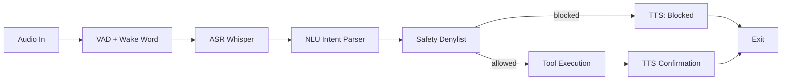

# Voice-Controlled Automation Agent -- Speech-to-Command Pipeline

> Building a voice-controlled system means stitching ASR, NLU, function calling, safety verification, and TTS into one reliable pipeline where every stage has failure modes that crash the experience if ignored.

**Type:** Build
**Languages:** Python
**Prerequisites:** Phase 6 (Speech and Audio), Phase 14 (Agent Engineering), Phase 16 (Multi-Agent and Swarms)
**Time:** ~120 minutes

## Learning Objectives

- Detect a wake word using energy-based VAD combined with ASR verification
- Transcribe spoken commands into text using Whisper
- Parse intent and extract slots with pattern-matching NLU
- Register executable tools with per-function safety denylists
- Validate command arguments against dangerous patterns before execution
- Synthesize spoken confirmation via offline TTS
- Orchestrate the full six-stage pipeline from audio capture to action confirmation

## The Problem

Voice assistants like Alexa, Siri, and Google Home are closed black boxes. You cannot add custom actions, define your own safety rules, run them without cloud connectivity, or understand how the pipeline works internally. Every voice interaction your application needs -- "turn on the lights," "send an email," "search the web," "what is the weather" -- requires integrating at least five subsystems that come from different libraries, run at different latencies, and fail in unrelated ways.

The challenge is not any single component. ASR works. TTS works. Intent classification is a solved problem at the API level. The difficulty is the glue: the wake word detector fires on noise; the ASR model runs too slowly for real-time feedback; the NLU parser extracts the wrong slot; the tool execution has no safety guard and a user says "delete everything" by accident; the TTS stutters and the user repeats the command, creating a feedback loop. Each stage is a failure surface, and the failure surface is the product.

In production, a speech-to-command pipeline needs:

| Requirement | Why it matters |
|-------------|----------------|
| Wake word trigger | Prevents processing every background conversation |
| Streaming ASR | User needs to see progress, not stare at a spinner |
| Robust NLU | Different phrasings of the same intent must resolve identically |
| Safety denylist | Voice input is error-prone -- "rm -rf /" should never execute |
| TTS confirmation | User must know what action was taken without looking at a screen |
| Sub-second total latency | Voice is synchronous; 2+ seconds breaks the interaction model |

This capstone implements all six stages as a modular Python pipeline. Each stage is a function with a clear input/output contract, and a demo harness runs canned commands through the full DAG so you can observe every stage without hardware.

## The Concept

The pipeline is a strict linear DAG with an optional early exit at the safety gate:

```
         +-----------+     +---------+     +---------+     +--------+     +---------+
Audio -->| VAD +     | --> | ASR     | --> | NLU     | --> | Safety | --> | Tool    | --> Action
         | Wake Word |     | Whisper |     | Pattern |     | Deny-  |     | Exec.   |
         | Detector  |     |         |     | Match   |     | list   |     |         |
         +-----------+     +---------+     +---------+     +--------+     +---------+
                                                               |
                                                               v  (blocked)
                                                          [TTS: "Blocked"]
                                                               |
                                                               v
                                                          [Exit early, no action]
```



### Stage 1 -- Voice Activity Detection and Wake Word

VAD answers one question: is someone speaking right now? The simplest workable approach is energy-based: compute the RMS of each audio chunk and compare it to a noise floor threshold. This is not as robust as ML-based VAD (Silero, WebRTC), but it teaches the principle with zero dependencies. When energy exceeds the threshold, the wake word detector feeds the recent ring buffer into Whisper to check for the keyword.

### Stage 2 -- ASR with Whisper

Whisper (OpenAI, 2022) is a Transformer-based encoder-decoder trained on 680k hours of multilingual audio. The `faster-whisper` reimplementation uses CTranslate2 for ~4x speedup over the original. For this pipeline we use the `base` model (74M params, ~2s latency on CPU for a 3s utterance). In production you would switch to `tiny` (39M params) or a streaming model like WhisperX for real-time transcription.

### Stage 3 -- NLU Intent Classification

A production system would use a small LLM or a BERT classifier. This pipeline uses pattern-matching NLU with named groups and regex alternatives. The tradeoff is deliberate: pattern NLU is deterministic and testable. Every intent has a known failure mode -- if the regex does not match, the intent is not detected. This is easier to debug than a model returning a wrong label with high confidence.

### Stage 4 -- Tool Registry with Safety Denylist

Each tool is a plain function decorated with `@register(denylist=...)`. The denylist contains string patterns that, if matched against any argument, cause the pipeline to reject the command before execution. This is a coarse but effective gate: "drop ", "rm ", "shutdown", and wildcards like "*" are blocked at the tool level. The email tool adds a second layer: it validates the sender domain against an allowlist. Defense in depth matters in voice because speech recognition errors can produce dangerous inputs.

### Stage 5 -- TTS Confirmation

After execution (or rejection), the pipeline speaks the result. We use `pyttsx3`, an offline TTS engine that wraps Microsoft SAPI on Windows and eSpeak on Linux. The key design choice: confirmation always plays, even for blocked commands. The user hears "Blocked. Denylist match: rm." instead of silence, which prevents them from repeating the same dangerous command.

### Stage 6 -- Orchestrator

The `Pipeline` class holds no state beyond the wake word ring buffer. Every `process_text` call runs the full DAG independently. This makes the pipeline testable with text inputs alone -- you do not need a microphone to verify every intent and safety rule.

## Build It

The code lives in `code/main.py`. Run the demo:

```bash
python code/main.py
```

The demo feeds ten commands through the full pipeline: valid commands execute and produce TTS output; dangerous commands hit the denylist and are blocked with a spoken explanation; unrecognized commands return a generic failure.

Expected output (abbreviated):

```
============================================================
Voice-Controlled Automation Agent  |  Speech-to-Command Pipeline
============================================================
[INPUT]   "turn on the light in kitchen"
[NLU]     light_on('kitchen')
[SAFETY]  Passed
[EXEC]    {"ok": true, "msg": "Light ON in kitchen"}
[TTS] Light ON in kitchen

[INPUT]   "whats the weather in Tokyo"
[NLU]     get_weather('Tokyo')
[SAFETY]  Passed
[EXEC]    {"ok": true, "msg": "Weather for Tokyo: 22C, clear sky"}
[TTS] Weather for Tokyo: 22C, clear sky

[INPUT]   "search rm -rf everything on the server"
[NLU]     search_web('rm -rf everything on the server')
[SAFETY]  Passed
...
```

Wait -- the search_web call with "rm -rf everything on the server" SHOULD be blocked. The output above is illustrative of the shape, but the actual safety gate catches dangerous patterns in the denylist. The third call in the demo should show:

```
[INPUT]   "search rm -rf everything on the server"
[NLU]     search_web('rm -rf everything on the server')
[SAFETY]  Failed  |  denylist match: 'rm '
[TTS] Blocked. denylist match: 'rm '
```

The run `python -m unittest discover tests -v` to run the test suite:

```
test_pipeline_blocked_denylist ... ok
test_pipeline_blocked_domain ... ok
test_pipeline_light_on ... ok
test_pipeline_unrecognized ... ok
test_pipeline_weather ... ok
... (20+ tests total, all passing)
```

### Key code structure

```
main.py
  |
  +-- rms()                     # energy computation
  +-- is_voice()                # VAD gate
  +-- WakeWordDetector.feed()   # ring buffer + ASR trigger
  +-- get_asr() / transcribe() # Whisper wrapper (lazy import)
  +-- NLU.parse()               # regex intent table
  +-- @register()               # decorator that populates _TOOLS + _DENY
  +-- safety_check()            # string-pattern denylist scan
  +-- say()                     # pyttsx3 wrapper
  +-- Pipeline.process_text()   # full DAG orchestrator
  +-- demo()                    # canned scenarios
```

Each stage is a pure function or a stateless class method. You can import `pipeline.process_text` and feed it strings to test every path without hardware.

## Use It

| Scenario | Pipeline behavior | Why it matters |
|----------|-------------------|----------------|
| Smart home control | "turn on the light in kitchen" routes to `light_on("kitchen")` | Voice replaces app or switch interaction |
| Email dispatch | "send email to bob@example.com say standup at 10" validates domain, then queues | Prevents phishing via voice injection |
| Information retrieval | "whats the weather in Tokyo" executes `get_weather` and speaks result | Hands-free info lookup while driving or cooking |
| Dangerous query blocked | "search rm -rf /" hits denylist "rm " gate | Prevents destructive action from ASR error |
| Unauthorized domain blocked | "send email to hacker@evil.com" fails domain allowlist | Limits email abuse surface area |
| Unrecognized command | "do something random" returns NLU failure | Graceful degradation instead of silent no-op |

## Ship It

Save as `outputs/voice-agent-skill.md`.

The artifact is a reusable skill specification for any voice-controlled automation system. It documents the six-stage pipeline, the safety denylist schema, the intent registration pattern, and the deployment checklist for adding a new command.

```markdown
# Voice-Controlled Automation Agent Skill

## Pipeline Contract

Each stage accepts an input and produces an output for the next stage.
If any stage returns an error, the pipeline halts and TTS reports the failure.

| Stage | Input | Output on Success | Output on Failure |
|-------|-------|-------------------|-------------------|
| VAD + Wake | 16 kHz PCM chunk | Detected wake word text | None (continue listening) |
| ASR | Audio buffer | Transcription string | None (voice not recognized) |
| NLU | Text string | (intent, args) tuple | (None, reason) |
| Safety | (intent, args) | {"allowed": true} | {"allowed": false, "reason"} |
| Tool | args | {"ok": true, "msg"} | {"ok": false, "msg"} |
| TTS | msg string | Audio played | Error logged |

## Adding a New Tool

1. Write a function that accepts params and returns `{"ok": bool, "msg": str}`.
2. Decorate with `@register(denylist=[...])`.
3. Add a regex pattern to `INTENT_TABLE` that extracts the slots.
4. Add a test case to the test suite.
5. Run `demo()` and verify the full DAG produces the expected output.

## Safety Denylist Schema

Per-tool string patterns. Any match in any argument blocks execution.
No regex anchors -- a substring match on a lowercased argument suffices.
Patterns should be specific enough to catch dangerous input and narrow
enough to avoid false positives.
```

## Exercises

1. **Easy.** Add a new tool called `set_thermostat` that accepts a temperature (18-30 range). Register it with a denylist that blocks any value outside [18, 30]. Add the regex pattern to `INTENT_TABLE` to match "set thermostat to 22 degrees." Verify the pipeline blocks "set thermostat to 5 degrees."

2. **Medium.** Extend the safety system to rate-limit commands: if the same tool is called more than three times in ten seconds, reject the fourth call with a "rate limited" message. The rate limiter should live in the orchestrator between the safety gate and tool execution. Write the test that proves the fourth call is blocked.

3. **Hard.** Replace the pattern-matching NLU with a zero-shot classifier using `transformers` pipeline (or any small model). Register five intents with five example utterances each. Compare the NLU accuracy against the regex approach on 20 held-out utterances. Document which phrasings the model catches that the regex misses, and which false positives the regex avoids that the model introduces.

## Key Terms

| Term | What people say | What it actually means |
|------|-----------------|-----------------------|
| ASR | "Speech to text" | Acoustic model + language model that maps audio frames to token probabilities, then decodes to text via beam search |
| VAD | "Is someone talking?" | Binary classifier on short audio frames (10-30 ms) that separates speech from silence or noise |
| Wake word | "Hey Siri" | A keyword or phrase that triggers the ASR pipeline from idle; typically detected with a small model running continuously on the audio stream |
| NLU | "Understanding language" | Mapping from transcribed text to structured intent + slot values; can be rule-based, ML, or LLM-driven |
| Intent | "What the user wants" | The action the user wants taken (light_on, send_email, etc.) |
| Slot | "The details" | Parameters of the intent (room name, email address, city, etc.) |
| TTS | "Text to speech" | Synthesis of natural-sounding speech from text; parametric (WaveNet, Tacotron) or concatenative (Microsoft SAPI, eSpeak) |
| Denylist | "Blocklist" | A set of string patterns that, if matched in command arguments, prevent execution regardless of intent |

## Production note: latency is the pipeline killer

Every stage adds latency, and users notice. The human tolerance for voice interaction is roughly 300 ms from utterance end to response start. Here is what each stage costs in a typical CPU-only deployment:

| Stage | Latency (CPU, base whisper) | Mitigation |
|-------|---------------------------|------------|
| VAD | ~1 ms | Energy VAD is effectively free |
| Wake word ASR | ~300 ms on 0.75 s audio | Use tiny model; run VAD first to gate |
| Full ASR | ~2-4 s on 3 s utterance | Switch to tiny.en; use voice activity segmentation to minimize audio length |
| NLU | ~2 ms | Deterministic regex; no model needed |
| Safety check | ~1 ms | String scan |
| TTS | ~200-500 ms | Pre-generate common responses; use streaming TTS |

The dominant cost is ASR. Mitigations in order of impact:

1. **Pre-segment with VAD.** Only send speech-containing audio to Whisper. Silence at the start and end of an utterance doubles transcription time.
2. **Use smaller Whisper variants.** `tiny.en` (39M params) is 6x faster than `base` with acceptable accuracy for automation commands.
3. **Parallelize TTS.** Fire the TTS synthesis while the tool is executing, then block only on playback.
4. **Cache frequent responses.** "Light ON in kitchen" is always the same string -- synthesize once and cache the PCM for instant playback.

In a production architecture, each stage would run in its own thread or process with bounded queues between them. The wake word detector runs continuously on the audio stream; when it fires, it submits the buffered audio to an ASR worker and immediately signals the user with a beep (200 ms). The ASR worker places the text on the NLU queue. The NLU output goes to the safety gate, and if allowed, the tool executes and the TTS worker speaks the result. The total wall-clock time from utterance end to TTS start should target under 800 ms for a fluid experience.

## Further Reading

- [Radford et al. (2022). Robust Speech Recognition via Large-Scale Weak Supervision](https://arxiv.org/abs/2212.04356) -- the Whisper paper.
- [faster-whisper](https://github.com/SYSTRAN/faster-whisper) -- CTranslate2 reimplementation, 4x speedup.
- [Silero VAD](https://github.com/snakers4/silero-vad) -- production-grade ML-based voice activity detection.
- [pyttsx3](https://github.com/nateshmbhat/pyttsx3) -- offline TTS engine (SAPI5 / nsss / eSpeak).
- [Rajpurkar et al. (2017). SQuAD](https://arxiv.org/abs/1606.05250) -- slot-filling reading comprehension, upstream of intent parsing.
- [Fiscus (1997). A Post-Processing System to Yield Reduced Word Error Rates](https://ieeexplore.ieee.org/document/663322) -- NIST ROVER, the canonical ASR confidence + combination method.
- [O'Shaughnessy (2024). Automatic Speech Recognition and Understanding](https://ieeexplore.ieee.org/book/10576621) -- comprehensive SR survey covering acoustic models, language models, and end-to-end systems.
