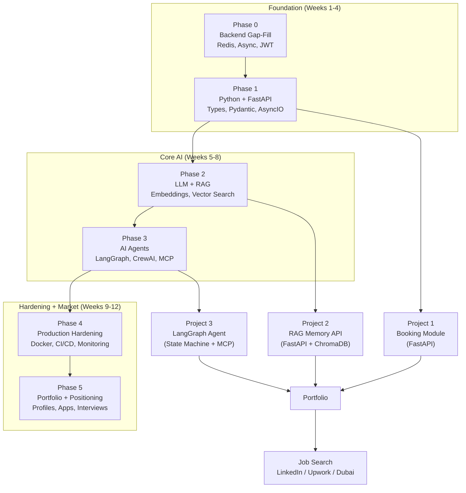
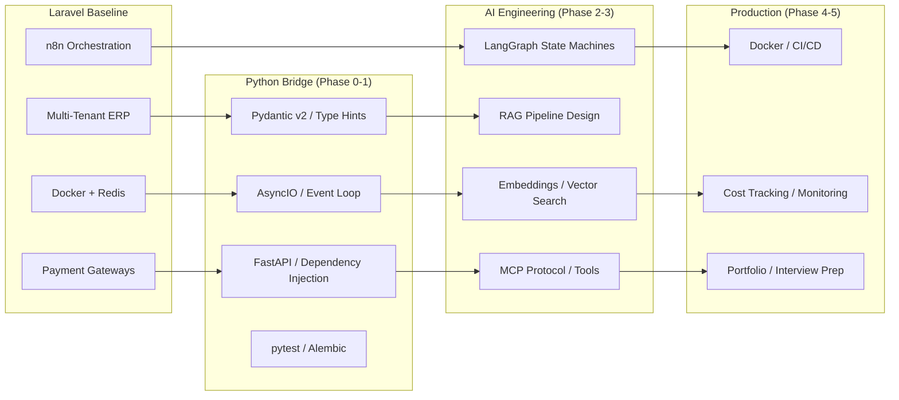
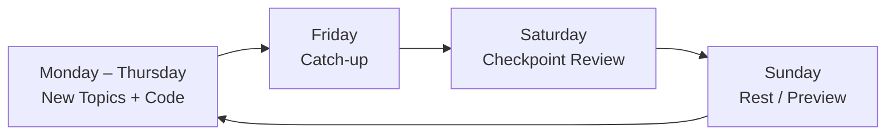

# Laravel Backend Developer → AI Agent Engineer

> **Prerequisite:** [Modern AI Engineering](../modern-ai-engineering/index.md) — Covers Genkit, LangGraph, LlamaIndex, MCP, and production AI deployment. Complete that first for foundational AI engineering skills before diving into this agent-focused curriculum.


<!-- Image Gallery -->
<section class="lesson-visuals" aria-label="Visual learning resources">
  <header><span>VISUAL LEARNING</span><h2>See it. Review it. Remember it.</h2></header>
  <a class="lesson-visual-card" href="../../../assets/images/lessons/ai-agent-engineer/00-index/handwritten-notes.svg" target="_blank" rel="noopener">
    
    <span><strong>Handwritten notes</strong>Condensed notes for deliberate review.</span>
  </a>
  <a class="lesson-visual-card" href="../../../assets/images/lessons/ai-agent-engineer/00-index/sticky-notes.svg" target="_blank" rel="noopener">
    
    <span><strong>Sticky-note revision</strong>Fast recall prompts for revision.</span>
  </a>
  <a class="lesson-visual-card" href="../../../assets/images/lessons/ai-agent-engineer/00-index/visual-explanation.svg" target="_blank" rel="noopener">
    
    <span><strong>Visual concept guide</strong>A connected explanation of the key ideas.</span>
  </a>
</section>
<!-- End Image Gallery -->

## Course Overview

A 12-week, 6-phase transition curriculum for experienced Laravel/PHP backend developers who want to pivot into AI Agent Engineering. Builds on your existing production experience — multi-tenant ERPs, payment systems, WhatsApp AI bots, n8n automation, Docker, Redis — and fills the gaps in Python async, LLM fundamentals, RAG theory, LangGraph orchestration, MCP protocol, and production hardening for AI workloads.

By the end of this course, you will have three production-grade portfolio projects, a rewritten professional profile, and a repeatable job-search system targeting AI Agent Engineer roles in Dubai, remote globally, and freelance on Upwork.

---

## Prerequisites & Requirements

### Hard Requirements


| Requirement | Why you need it | How to verify |
|-------------|----------------|---------------|
| Production Laravel/PHP experience | You understand multi-tenant architecture, payment gateways, REST APIs, queues, and deployment | You've shipped a multi-tenant system with payments |
| Docker & Linux VPS | All AI projects run in containers on Linux servers | You can `docker compose up` and configure Nginx without watching a tutorial |
| Git & CI/CD | Every phase produces version-controlled, deployable code | You've used GitHub Actions or GitLab CI |
| Redis | Used for caching, rate limiting, and agent memory backends | You've used Redis for queues or cache invalidation |
| Python basics | You can read and write Python even if not daily | You've written a Python script that reads a CSV and calls an API |
| A Linux VPS (Hetzner or similar) | You deploy everything publicly to have working demos | You have Cloudflare Tunnel or reverse proxy already running |

### Nice-to-Have (not required, but helpful)


| Skill | Where it helps |
|-------|----------------|
| n8n / Zapier experience | Direct analogy to LangGraph agent orchestration |
| WhatsApp bot or Telegram bot development | You already understand webhook-based agent interactions |
| Basic SQL beyond Laravel Query Builder | Writing efficient vector DB queries |
| JavaScript/Node.js | AsyncIO will feel familiar if you know Node's event loop |
| Queue workers (Laravel Horizon, RabbitMQ) | Directly translates to Celery / Redis queue patterns |

### Tools You'll Need


| Tool | Purpose |
|------|---------|
| VS Code or Cursor | Code editor with Python + Pydantic + YAML support |
| Docker Desktop | Local container development |
| Python 3.11+ | Core language for all AI work |
| Poetry or pip | Python package management |
| Git | Version control for all projects |
| OBS Studio | Demo video recording |
| Cloudflare account | Tunnel + DNS for deployed projects |
| OpenAI API key | Embeddings and LLM calls |
| ChromaDB / Qdrant | Vector database for RAG |

---

## Learning Outcomes

Upon completion of this course, you will be able to:

1. **Ship production Python/FastAPI** — Type-hinted, async, Pydantic-validated APIs with Alembic migrations and pytest coverage.
2. **Build and defend a RAG pipeline** — From chunking strategy through embedding, vector search, re-ranking, and guardrails. You can explain every design decision in a technical interview.
3. **Orchestrate AI agents with LangGraph** — State machines with conditional routing, persistence, human-in-the-loop, and multi-agent crews.
4. **Implement MCP (Model Context Protocol)** — Build an MCP server with tools, resources, and prompts; connect it to any MCP-compatible client.
5. **Production-harden AI workloads** — Cost controls, rate limiting, observability, load testing, and containerized deployment with CI/CD.
6. **Position yourself as an AI Agent Engineer** — Optimized LinkedIn, Upwork, and portfolio that gets you interviews and freelance projects.

---

## Advanced Chapters (Beyond the 12-Week Course)

The following chapters cover advanced production AI topics. These are standalone references — study them in any order as needed for your projects or interview prep.

### Chapter 09 — AI System Design


**Goal:** Design production AI architectures that scale — RAG at 10K QPS, multi-region agents, cost-optimized model tiering.

**Topics:** RAG architecture patterns (naive, multi-hop, agentic), 3-tier caching (semantic + response + KV cache), cost optimization (model tiering, prompt compression, batching), latency profiling (TTFT, TPOT, end-to-end), scaling strategies (horizontal, vertical, partitioning), multi-region deployment, agent infrastructure patterns, ingestion pipelines, AI gateway design, system design interview prep for AI roles.

**Chapter file:** `09-ai-system-design.md`

---

### Chapter 10 — Prompt Engineering Mastery


**Goal:** Move beyond basic prompts — master chain-of-thought, structured output, prompt management, and production evaluation.

**Topics:** CoT/ToT/self-consistency, structured output (JSON mode, tool calling, constrained decoding), prompt management and versioning, few-shot optimization, system prompt design, multi-turn conversation patterns, prompt compression, evaluation frameworks (BLEU, ROUGE, METEOR, BERTScore, LLM-as-judge), A/B testing, injection defense strategies.

**Chapter file:** `10-prompt-engineering-mastery.md`

---

### Chapter 11 — AI Testing & Evaluation


**Goal:** Build a robust evaluation pipeline for AI systems — unit tests for agents, integration tests for RAG, LLM-as-judge, and CI/CD integration.

**Topics:** Unit testing for agents (tool call assertions, state transitions), integration testing for RAG (chunk quality, retrieval relevance), LLM-as-judge (rubric design, calibration, bias mitigation), trajectory evaluation, hallucination detection, eval datasets (construction, curation, versioning), CI/CD eval gates, quality metrics dashboards, A/B model testing.

**Chapter file:** `11-ai-testing-evaluation.md`

---

### Chapter 12 — AI Observability & Debugging


**Goal:** See inside your AI system — trace every LLM call, track costs, detect drift, and debug agent failures systematically.

**Topics:** Custom tracing (OpenTelemetry spans per agent step), LangSmith integration, OpenTelemetry GenAI conventions, token tracking and cost attribution, latency profiling (per-tool, per-LLM-call), quality monitoring (hallucination rate, retrieval relevance), structured agent logging (JSON, correlation IDs, log levels), anomaly detection and alerting, debugging agent failures (stuck loops, tool errors, context overflow), drift detection (embedding drift, response distribution shift).

**Chapter file:** `12-ai-observability-debugging.md`

---

### Chapter 13 — Advanced Vector Search


**Goal:** Go beyond basic cosine similarity — hybrid search, multi-vector retrieval, quantized indexes, and multi-modal RAG.

**Topics:** Hybrid search (BM25 + dense + sparse embeddings + RRF), multi-vector retrieval (ColBERT-style late interaction), HyDE and query expansion, cross-encoder reranking, HNSW tuning (M, efConstruction, efSearch), metadata filtering (pre-filtering vs post-filtering), quantization (PQ + SQ + binary), multi-modal RAG (text + image + table), graph RAG (entity extraction + relationship graph), streaming ingestion, vector DB comparison and migration strategies.

**Chapter file:** `13-advanced-vector-search.md`

---

### How the Advanced Chapters Fit


| Chapter | When to Study | Prerequisites |
|---------|--------------|-------------|
| 09 — System Design | Before AI system design interviews | Phase 2 (RAG) + Phase 4 (hardening) |
| 10 — Prompt Engineering | Ongoing, reference during all phases | Phase 2 (prompt basics) |
| 11 — Testing & Evaluation | Before production deployment | Phase 4 (testing basics) |
| 12 — Observability | During Phase 4 hardening | Phase 4 (logging + metrics) |
| 13 — Advanced Vector Search | When optimizing RAG quality | Phase 2 (vector search basics) |

---

## Phase 0 — Backend Gap-Fill (Week 1, ~16 hours)

### Phase 0 — Backend Gap-Fill (Week 1, ~16 hours)


**Goal:** Fill the gaps between your Laravel knowledge and what AI engineering expects from Python backends. No project code — pure concepts and exercises.

**Topics:**
- Redis beyond cache — queues, pub/sub, rate limiter data structures (token bucket, sliding window, leaky bucket)
- Async first principles — event loop analogy to Node.js, coroutines vs threads, when async helps and when it doesn't
- REST API design patterns — versioning strategies (URL path, header, query param), pagination, error envelope format
- API authentication — API key rotation, JWT refresh token rotation, scoped access tokens
- WebSocket basics — connection lifecycle, message framing, reconnection strategies
- Idempotency keys — why they matter for payment/booking systems, key generation, expiry, idempotency response caching
- Rate limiting at proxy vs application layer

**Key takeaway:** You can explain async, rate limiting, idempotency, and WebSocket patterns in Python terms before writing a single FastAPI route.

**Phase file:** `01-phase0-backend-hardening.md` (363 lines)

---

### Phase 1 — Python + FastAPI + AsyncIO (Weeks 2-3, ~30 hours)


**Goal:** Write production Python with type hints, build FastAPI endpoints with proper dependency injection and validation, understand asyncIO well enough to explain it in an interview.

**Topics:**
- Python type hints — `Optional`, `Union`, generics, `TypeVar`, `Protocol` for duck typing
- Dataclasses vs Pydantic models — when to use each, Pydantic v2 validators, `model_validator`, `field_validator`
- Context managers — custom `__enter__`/`__exit__`, `contextlib.contextmanager`, database connection lifecycle
- List/dict comprehensions, generator expressions, and when the readable alternative is better
- Custom decorators — `@retry(times=3, delay=1)`, `@timed`, decorators with arguments
- FastAPI path/query/body parameter validation — `Query(min_length=3)`, `Path(gt=0)`, nested body models
- Dependency injection with `Depends` — DB sessions, `get_current_user`, reusable dependencies
- FastAPI middleware — request timing, CORS, request ID injection, error handling middleware
- Background tasks vs Celery — why `BackgroundTasks` aren't durable, when to reach for a real queue
- Pydantic v2 deep-dive — `BaseModel`, `Field`, custom validators, model serialization, `model_dump`
- Pydantic settings — typed `.env` loading instead of scattered `os.environ` calls
- AsyncIO fundamentals — event loop, coroutines, tasks, `asyncio.gather` vs `asyncio.create_task`
- `httpx.AsyncClient` — concurrent outbound API calls, connection pooling, timeout management
- Async pitfalls — mixing sync and async, blocking the event loop, `requests` in async endpoints
- pytest for FastAPI — `TestClient`, fixtures, dependency overrides, mocking external services
- Alembic migrations — autogenerate, upgrade/downgrade, merge branches

**Project:** Port your real estate booking module from Laravel to FastAPI with the same business logic but fully async, Pydantic-validated, and Alembic-migrated.

**Phase file:** `02-phase1-python-fastapi-async.md` (885 lines)

---

### Phase 2 — LLM Fundamentals + RAG Theory (Weeks 4-5, ~25 hours)


**Goal:** Understand embeddings, vector search, chunking strategies, and RAG architecture well enough to defend every design decision in a technical interview. Build a public RAG demo API.

**Topics:**
- Tokens and tokenization — BPE algorithm, `tiktoken`, estimating token counts, why token count drives cost
- Context window mechanics — why multi-turn chat resends the whole history, KV cache, attention complexity
- Embeddings — what a vector represents geometrically, cosine similarity intuition, embedding dimensionality cost/quality tradeoff (text-embedding-3-small vs large: 512 vs 1536 vs 3072 dims)
- Prompt engineering — zero-shot, few-shot (with worked examples), chain-of-thought, system prompt structuring
- Structured output / function calling — tool-call schemas for OpenAI and Anthropic, response format enforcement
- Vector search math — dot product vs cosine vs L2, why cosine wins for text embeddings, normalization
- ANN indexes — HNSW algorithm, search speed vs accuracy tradeoff, index parameters (M, efConstruction, efSearch)
- RAG architecture end-to-end — ingestion pipeline, retrieval pipeline, generation pipeline, every component labeled
- Chunking strategies — fixed-size, recursive split, semantic split, document-aware chunking; failure modes of naive chunking (context loss, irrelevant retrieval)
- Retrieval ranking + re-ranking — bi-encoder vs cross-encoder, why re-rankers improve results even with good initial retrieval, Cohere Rerank API
- Vector DB comparison — ChromaDB vs Qdrant vs pgvector vs Pinecone: honest tradeoffs (setup complexity, scalability, cost, feature set)
- Hallucination in RAG — causes (irrelevant retrieval, missing context, model overconfidence), mitigation strategies
- Fine-tuning — LoRA, QLoRA, full fine-tuning; when fine-tuning beats RAG and vice versa; what each approach costs
- Model evaluation — eval harnesses, LLM-as-judge, comparing GPT-4o vs Claude 3.5 Sonnet vs local models (Llama 3, Mistral) on the same test set
- Guardrails / content moderation — input guardrails (topic filtering, PII detection), output guardrails (factual consistency, tone), OpenAI content filter, custom classifier

**Project:** A public RAG Memory API — upload documents, query them with cited sources, see chunk boundaries and relevance scores. Deployed behind Cloudflare Tunnel on your VPS.

**Phase file:** `03-phase2-llm-rag-theory.md` (890 lines)

---

### Phase 3 — AI Agents: LangGraph, CrewAI, MCP (Weeks 6-8, ~35 hours)


**Goal:** Build agent state machines with LangGraph, multi-agent crews with CrewAI, and MCP clients that connect LLMs to tools. Rebuild your Purvanchal Flow Studio orchestration layer from n8n to LangGraph.

**Topics:**
- ReAct pattern — think → act → observe → repeat; why a single LLM call returns text but an agent returns actions
- Tool calling deep-dive — tool schema design (name, description, parameters JSON Schema), nested object parameters, tool selection heuristics
- LangGraph: StateGraph — nodes, edges, state schema (`TypedDict` or dataclass), graph compilation, `invoke` vs `astream`
- Conditional edges — routing based on state fields, `Route` enums, dynamic routing with custom functions
- LangGraph persistence — checkpointer (`MemorySaver`, `SqliteSaver`, `PostgresSaver`), thread IDs, resuming interrupted graphs
- Human-in-the-loop — interrupt/resume, `interrupt()` command, approval gates, use cases (transaction confirmation, content review)
- CrewAI — Agent, Task, Crew, Process; hierarchical vs sequential processes; role-based agent design
- MCP protocol spec — three primitives: tools (fire-and-forget), resources (stateful reads), prompts (templates); transport: stdio vs SSE
- Building an MCP client — client handshake, tool discovery, calling tools via the protocol, handling errors
- Agent memory patterns — short-term (conversation window), long-term (vector store summaries), entity memory (knowledge graph extraction); how to combine them
- Multi-agent orchestration patterns — supervisor pattern (one agent routes tasks), round-robin (parallel workers), debate pattern (agents critique each other), swarm pattern (dynamic agent spawning)
- Agent evaluation — scenario-based testing, trajectory evaluation, rubric scoring, cost/latency measurement per run
- Cost/latency in multi-step agents — estimating per-run cost for a 4-step chain, caching strategies, model tiering (cheap model for simple steps, expensive model for complex reasoning)
- OpenAI Agents SDK — guardrails, handoffs, built-in tools (file search, code interpreter, web browsing); comparison to LangGraph
- Advanced MCP server — resources (file system, DB tables, API wrappers), prompts (templated task descriptions), tool composition

**Project:** Purvanchal Flow Studio rebuilt as a LangGraph state machine — agent nodes for web search, document query, data transformation, and report generation. Each node is a tool-calling LLM step. Conditional edges route between them. MCP server exposes the same tools externally.

**Phase file:** `04-phase3-agents-langgraph-mcp.md` (1044 lines)

---

### Phase 4 — Production Hardening (Weeks 9-10, ~24 hours)


**Goal:** Take both projects (RAG API + LangGraph agent) and make them production-grade — containerized, monitored, load-tested, cost-controlled, and deployed with CI/CD.

**Topics:**
- Docker optimization — multi-stage builds, layer caching, slim base images, Docker Compose for microservice stacking
- Sqlite vs Postgres persistence — when Sqlite suffices (single-server agents), when you need Postgres (multi-replica, concurrent writes)
- Message queues — Celery + Redis, task routing, retry with exponential backoff, dead-letter queues, task result backends
- Structured logging — Python `logging` → JSON logs, log levels, correlation IDs, log aggregation (Loki / ELK / Axiom)
- Error tracking — Sentry integration for AI-specific errors (token limit exceeded, rate limited, tool call failures, timeout)
- CI/CD for AI projects — GitHub Actions: lint → test → build → deploy; secrets management; environment-specific configs
- Load testing — `locust` for async endpoints, simulating concurrent users, measuring p50/p95/p99 latency under load
- Cost tracking — per-request token accounting, daily cost budgets, model tier fallback (gpt-4o-mini when gpt-4o would be wasteful)
- Rate limiting for AI APIs — per-user, per-IP, per-token sliding windows; Redis-backed rate limiters; graceful degradation (queue vs reject vs degrade quality)
- Metrics — Prometheus + Grafana for AI-specific metrics (embedding latency, retrieval latency, hallucination rate, tool success rate)
- Security — API key rotation, environment injection vs file-based secrets, rate limiting as DoS protection, prompt injection mitigation

**Phase file:** `05-phase4-production-hardening.md` (511 lines)

---

### Phase 5 — Portfolio + Market Positioning (Weeks 11-12, ~15 hours)


**Goal:** Package your projects into something a recruiter understands in 60 seconds. Rewrite profiles. Start applying.

**Topics:**
- README structure that gets read — 60-second skim design, architecture diagram, key design decisions, tradeoffs considered
- Demo video (90 seconds) — result-first structure, OBS recording, CapCut/DaVinci editing, unlisted YouTube hosting
- Upwork profile rewrite — outcome-first overview, skill tags (LangGraph, CrewAI, FastAPI, ChromaDB, pgvector), portfolio links
- LinkedIn profile rewrite — headline optimization for search, About section keyword placement, skill endorsements
- Case-study post — one published write-up on LinkedIn or dev.to showing architecture, results, and lessons learned
- Technical interview prep — explain RAG pipeline (ingestion → retrieval → generation), ReAct loop (think → act → observe), MCP protocol (tools/resources/prompts) from memory without notes
- Salary negotiation for Dubai market — rate ranges for role types, walk-away number, negotiation script
- Freelance pricing strategy — rate card for hourly, fixed-price, and retainer engagements; how to estimate project scope

**Phase file:** `06-phase5-portfolio-positioning.md` (299 lines)

---

## Project Portfolio

### Project 1 — Real Estate Booking Module (FastAPI)


| Aspect | Detail |
|--------|--------|
| **Description** | Port of real estate booking logic (properties, availabilities, bookings, payments) from Laravel to Python |
| **Technologies** | FastAPI, Pydantic v2, SQLAlchemy async, Alembic, pytest, Docker |
| **Proves** | You can ship business logic in Python, not just Laravel |
| **Key design challenges** | Replace Eloquent ORM patterns with async SQLAlchemy, adapt Laravel's pipeline/events to FastAPI middleware + dependency injection |
| **Deployment** | Docker Compose on VPS behind Cloudflare Tunnel |

### Project 2 — RAG Memory API


| Aspect | Detail |
|--------|--------|
| **Description** | Public API for document ingestion, vector search, and question answering with cited sources |
| **Technologies** | FastAPI, ChromaDB/Qdrant, OpenAI embeddings, re-ranking, guardrails |
| **Proves** | You understand vector search, chunking, retrieval, and RAG end-to-end |
| **Key design challenges** | Chunking strategy selection, embedding model tradeoffs, retrieval quality tuning, relevance scoring |
| **Deployment** | Docker Compose with ChromaDB sidecar, Redis for caching, rate limiting middleware |

### Project 3 — LangGraph Agent (Purvanchal Rebuild)


| Aspect | Detail |
|--------|--------|
| **Description** | Multi-node agent state machine that performs web search, document query, data transformation, and report generation |
| **Technologies** | LangGraph, CrewAI, MCP, Redis/Postgres checkpointing |
| **Proves** | You can build agent state machines, not just use visual builders like n8n |
| **Key design challenges** | State schema design, conditional routing logic, human-in-the-loop interrupt points, tool selection patterns |
| **Deployment** | Multi-container Docker Compose: agent server, MCP server, Redis, Postgres |

### Bonus Project Ideas


| Idea | Skills exercised | Complexity |
|------|-----------------|------------|
| **AI Customer Support Agent** — LangGraph with ticket triage, knowledge base search, escalation to human | Multi-agent orchestration, human-in-the-loop, context window management | Medium |
| **Meeting Transcript Analyzer** — Whisper transcription → RAG search → summary + action items | Audio processing, RAG, structured output | Medium |
| **Personal AI Research Assistant** — Daily paper scraping → embedding → personalized newsletter | Scheduled ingestion, content deduplication, email delivery | Medium |
| **Multi-Platform Content Repurposer** — Blog → LinkedIn/Twitter/Newsletter adapters with agent pipeline | Prompt chaining, format conversion, tone adaptation | Easy-Medium |
| **Code Review Agent (MCP)** — MCP server that reviews PRs via configured rules and returns structured feedback | MCP server, tool design, async processing | Hard |
| **WhatsApp AI Agent** — WhatsApp Webhook → agent pipeline → response via LangGraph | Webhook integration, session management, async worker | Medium-Hard |

---

## End-to-End Preparation Roadmap

### Month 1 — Foundation (Weeks 1-4)


| Week | Focus | Deliverable | Hours |
|------|-------|-------------|-------|
| 1 | Phase 0: Redis patterns, async theory, API design patterns, rate limiting, idempotency, WebSocket concepts | Complete all exercises in Phase 0 workbook | 14-18 |
| 2 | Phase 1: Python types, Pydantic, FastAPI basics, async fundamentals, pytest | Working FastAPI endpoint with DI + validation | 16-18 |
| 3 | Phase 1: FastAPI middleware, Alembic, httpx, concurrency patterns, advanced Pydantic | Booking module port complete | 16-18 |
| 4 | Phase 2: Tokens, embeddings, prompt engineering, vector search, chunking strategies | Can explain RAG architecture from memory | 14-16 |

### Month 2 — Core AI (Weeks 5-8)


| Week | Focus | Deliverable | Hours |
|------|-------|-------------|-------|
| 5 | Phase 2: RAG end-to-end, fine-tuning, model evaluation, guardrails | RAG API deployed and publicly accessible | 14-16 |
| 6 | Phase 3: ReAct pattern, LangGraph StateGraph, tool calling, conditional edges | Working 3-node LangGraph with conditional routing | 16-18 |
| 7 | Phase 3: Persistence, human-in-the-loop, CrewAI, MCP client, multi-agent patterns | Purvanchal LangGraph rebuild + MCP server | 16-18 |
| 8 | Phase 3: OpenAI Agents SDK, advanced MCP, agent evaluation, cost analysis | All 3 projects code-complete locally | 12-14 |

### Month 3 — Hardening + Market (Weeks 9-12)


| Week | Focus | Deliverable | Hours |
|------|-------|-------------|-------|
| 9 | Phase 4: Docker optimization, logging, error tracking, Celery queues | Both projects containerized with proper logging | 12-14 |
| 10 | Phase 4: CI/CD, load testing, cost tracking, Prometheus/Grafana, security | CI/CD pipeline running for both projects | 12-14 |
| 11 | Phase 5: READMEs, demo videos, Upwork + LinkedIn profiles, case study | All profile assets ready | 8-10 |
| 12 | Phase 5: Job search start, interview prep, salary negotiation prep | 5+ applications sent, interview prep script memorized | 8-10 |

### Post-Course — Ongoing (Weeks 13+)


| Activity | Cadence | Goal |
|----------|---------|------|
| Job applications | 3-5/week | Maintain pipeline, refine targeting |
| Interview practice | 1-2 mock interviews/week | Hit fluency on RAG, ReAct, MCP explanations |
| Case-study content | 1 post/2 weeks | Build LinkedIn presence, demonstrate expertise |
| Freelance proposals | 5-10 proposals/week on Upwork | Build pipeline for freelance income |
| Side project iteration | 2-4 hours/week | Add features, fix bugs, improve projects |

---

## Job Market & Applications

### Role Types


| Role | Key Skills Needed | Dubai Salary (AED/mo) | Remote Global (USD/yr) |
|------|------------------|----------------------|----------------------|
| **AI Automation Engineer** | LangGraph, n8n/automation, API integration, Python | 12K-22K | $60K-$100K |
| **AI/ML Engineer (Agent focus)** | RAG, LangGraph, vector DBs, prompt engineering, MCP | 15K-30K | $80K-$140K |
| **LLM Application Engineer** | FastAPI, LLM APIs, structured output, evaluation | 12K-25K | $70K-$130K |
| **Freelance AI Developer** | Full stack agent development, client communication | Variable | $50-120/hr |

### Job Sources


| Source | Best for | Tips |
|--------|----------|------|
| LinkedIn | All full-time roles | Optimize profile for "AI Agent Engineer" keywords |
| Bayt.com | Dubai-market roles | Most Gulf companies post here alongside LinkedIn |
| Naukri Gulf | Dubai / UAE | Strong for enterprise consultancies |
| Upwork | Freelance projects | Outcome-first proposals; ignore fixed-budget posts under $500 |
| Wellfound / AngelList | Startup roles | Filter by "AI", "agent", "LLM" |
| Y Combinator Jobs | Early-stage AI startups | Apply within 24 hours of posting |
| Company career pages | Big tech (Anthropic, OpenAI, Google) | Direct apply + referral if possible |
| LinkedIn talent seekers | Passive inbound | Keep "Open to Work" on with proper tags |

### Application Strategy


**Weekly routine (2-3 hours):**
1. Scan LinkedIn saved searches (3 saved searches, daily email) — 15 min
2. Find 5-10 new postings matching your criteria — 20 min
3. For each: customize CV (match keywords from job description) — 10 min each
4. Apply + note application in tracker — 5 min each
5. Engage with 3-5 posts from target company engineers on LinkedIn — 15 min
6. Send 3-5 connection requests to engineers/talent teams — 10 min

**Follow-up cadence:**
- Day 0: Apply
- Day 7: LinkedIn follow-up message (polite, reference the application)
- Day 14: If no response, apply again through a different channel (email, referral)
- Day 30: Move to "cold outreach" list, repeat outreach with new angle

### Interview Preparation


**Must-know topics (memorize these explanations):**

1. **RAG pipeline** — "Documents → chunking strategy → embedding → vector DB storage → query embedding → ANN search → re-ranking → LLM generation with context. I chose semantic chunking over fixed-size because [reason], and cosine similarity over dot product because [reason]."

2. **ReAct agent loop** — "The LLM receives a prompt plus conversation history. It generates a thought describing what to do next, then an action (tool call). The tool result feeds back as an observation. This loops until the agent decides to provide a final answer."

3. **MCP protocol** — "Three primitives: tools (callable functions the LLM can invoke), resources (stateful data the LLM can read), prompts (templated task descriptions). Transport layer is JSON-RPC over stdio or SSE. Every MCP server communicates capability during handshake."

4. **LangGraph vs CrewAI** — "LangGraph gives you full control over the state machine — every edge and node is explicit, with conditional routing, checkpointing, and human interrupts. CrewAI is higher-level — you define agents and tasks, and the framework handles orchestration. LangGraph for complex stateful agents, CrewAI for straightforward multi-agent crews."

5. **Scaling RAG** — "Chunk size tuning (empirically determined per corpus), re-ranker integration (cross-encoder improves top-k accuracy by 15-25%), query rewriting (HyDE or multi-query expansion), and hybrid search (BM25 + vector with reciprocal rank fusion)."

---

## Time Commitment Summary

| Phase | Weeks | Hours | Type |
|-------|-------|-------|------|
| 0 — Backend gap-fill | 1 | 14-18 | Concepts, no project code |
| 1 — Python/FastAPI/Async | 2 | 32-34 | Project: booking module port |
| 2 — LLM + RAG | 2 | 28-32 | Project: RAG demo API |
| 3 — Agents/LangGraph/MCP | 3 | 35-40 | Project: Purvanchal rebuild |
| 4 — Production hardening | 2 | 24-26 | Both projects retrofitted |
| 5 — Portfolio + positioning | 2 + ongoing | 16-20 + applications | Profile rewrite + outreach |

**Total: ~150-170 hours, 12 weeks with buffer.** Plus ongoing job search.

---

## Resources

### Learning


| Resource | Use for |
|----------|---------|
| [LangGraph Documentation](https://langchain-ai.github.io/langgraph/) | Agent state machine API reference |
| [FastAPI Documentation](https://fastapi.tiangolo.com/) | Python async web framework |
| [CrewAI Documentation](https://docs.crewai.com/) | Multi-agent orchestration |
| [MCP Specification](https://modelcontextprotocol.io/) | Protocol implementation |
| [OpenAI Cookbook](https://cookbook.openai.com/) | RAG patterns, embedding techniques |
| [Anthropic Cookbook](https://github.com/anthropics/anthropic-cookbook) | Agent patterns, prompt engineering |

### Tools


| Tool | Use |
|------|-----|
| [ChromaDB](https://www.trychroma.com/) | Vector database (easiest setup) |
| [Qdrant](https://qdrant.tech/) | Vector database (production-scalable) |
| [pgvector](https://github.com/pgvector/pgvector) | Vector extension for Postgres |
| [LangSmith](https://smith.langchain.com/) | Agent tracing + evaluation |
| [Locust](https://locust.io/) | Load testing for async endpoints |
| [Grafana](https://grafana.com/) | Metrics visualization |
| [Sentry](https://sentry.io/) | Error tracking |

---

## Course Architecture Overview

The following diagram illustrates how each phase builds on the last, with final portfolio projects feeding into the job-search pipeline:



## Skill Progression Map

This diagram shows the skill arc from a Laravel baseline to a target AI Agent Engineer role:



## TypeScript — Course Curriculum Type System

While the course itself uses Python/FastAPI, the following TypeScript types model the curriculum structure for tooling around enrollment tracking, progress dashboards, or CLI planners:

```typescript
// ---- Domain Types ----

type PhaseId = "phase-0" | "phase-1" | "phase-2" | "phase-3" | "phase-4" | "phase-5";

interface Phase {
  id: PhaseId;
  name: string;
  weeks: number;
  hoursMin: number;
  hoursMax: number;
  prerequisites: PhaseId[];
  checkpointChecklist: string[];
  project?: string;
}

interface DailyTask {
  day: number;
  topic: string;
  action: string;
  doneCondition: string;
  estimatedHours: number;
}

interface WeekPlan {
  weekNumber: number;
  phaseId: PhaseId;
  days: DailyTask[];
  bufferDay: number; // which day is catch-up
}

// ---- Enrollment & Progress ----

type CompletionStatus = "not-started" | "in-progress" | "complete" | "skipped";

interface DailyLog {
  date: string;
  topic: string;
  completed: boolean;
  hoursSpent: number;
  notes: string;
}

interface Enrollment {
  userId: string;
  startedAt: Date;
  weeksCompleted: number;
  currentPhase: PhaseId;
  dailyLogs: DailyLog[];
}

// ---- Phase Definitions ----

const PHASES: Phase[] = [
  {
    id: "phase-0",
    name: "Backend Gap-Fill",
    weeks: 1,
    hoursMin: 14,
    hoursMax: 18,
    prerequisites: [],
    checkpointChecklist: [
      "Redis SETEX vs RQ",
      "Pub/sub publisher + subscriber",
      "JWT access/refresh flow diagram",
      "Token bucket vs sliding window",
    ],
  },
  {
    id: "phase-1",
    name: "Python + FastAPI + AsyncIO",
    weeks: 2,
    hoursMin: 32,
    hoursMax: 34,
    prerequisites: ["phase-0"],
    checkpointChecklist: [
      "Type hints without docs",
      "Custom DB context manager",
      "@retry decorator",
      "FastAPI CRUD with DI",
    ],
    project: "Booking module port",
  },
  {
    id: "phase-2",
    name: "LLM + RAG",
    weeks: 2,
    hoursMin: 28,
    hoursMax: 32,
    prerequisites: ["phase-1"],
    checkpointChecklist: [
      "Token count estimation",
      "Cosine similarity explanation",
      "RAG pipeline drawn from memory",
    ],
    project: "RAG demo API",
  },
  {
    id: "phase-3",
    name: "AI Agents — LangGraph, CrewAI, MCP",
    weeks: 3,
    hoursMin: 35,
    hoursMax: 40,
    prerequisites: ["phase-2"],
    checkpointChecklist: [
      "Minimal ReAct loop",
      "LangGraph StateGraph end-to-end",
      "Graph resume from checkpoint",
      "All 3 MCP primitives",
    ],
    project: "Purvanchal LangGraph rebuild",
  },
  {
    id: "phase-4",
    name: "Production Hardening",
    weeks: 2,
    hoursMin: 24,
    hoursMax: 26,
    prerequisites: ["phase-3"],
    checkpointChecklist: [
      "Docker image < 300 MB",
      "Background jobs survive restart",
      "Prometheus scrapes /metrics",
      "Green CI badge",
    ],
  },
  {
    id: "phase-5",
    name: "Portfolio + Positioning",
    weeks: 2,
    hoursMin: 16,
    hoursMax: 20,
    prerequisites: ["phase-4"],
    checkpointChecklist: [
      "60-second README",
      "90-second demo videos",
      "LinkedIn headline updated",
      "10 applications sent",
    ],
  },
];

// ---- Utility Functions ----

function totalHours(phase: Phase): string {
  return `${phase.hoursMin}-${phase.hoursMax} hours over ${phase.weeks} week(s)`;
}

function courseTotalHours(): { min: number; max: number } {
  return PHASES.reduce(
    (acc, p) => ({ min: acc.min + p.hoursMin, max: acc.max + p.hoursMax }),
    { min: 0, max: 0 },
  );
}

function currentPhase(
  enrollment: Enrollment,
  allPhases: Phase[],
): Phase | undefined {
  return allPhases.find((p) => p.id === enrollment.currentPhase);
}

function isEligible(
  enrollment: Enrollment,
  phase: Phase,
  allPhases: Phase[],
): boolean {
  return phase.prerequisites.every((preqId) => {
    const preq = allPhases.find((p) => p.id === preqId);
    return preq
      ? enrollment.dailyLogs.some(
          (log) => log.topic.includes(preq.name) && log.completed,
        )
      : true;
  });
}

function completionPercentage(enrollment: Enrollment, totalWeeks: number): number {
  return Math.round((enrollment.weeksCompleted / totalWeeks) * 100);
}

// ---- Example Usage ----

const total = courseTotalHours();
console.log(`Course total: ${total.min}-${total.max} hours`);

const sampleEnrollment: Enrollment = {
  userId: "user-001",
  startedAt: new Date("2026-06-01"),
  weeksCompleted: 2,
  currentPhase: "phase-1",
  dailyLogs: [],
};

const current = currentPhase(sampleEnrollment, PHASES);
if (current) {
  console.log(`Current phase: ${current.name} — ${totalHours(current)}`);
  console.log(`Eligible for next: ${isEligible(sampleEnrollment, PHASES[2], PHASES)}`);
}
```

## Learning Path — Weekly Rhythms



---

## Navigation

| File | Phase | Lines | What's Inside |
|------|-------|-------|--------------|
| [`01-phase0-backend-hardening.md`](01-phase0-backend-hardening.md) | 0 — Hardening | 363 | Redis cache/queue/pub/sub, rate limiting, idempotency, JWT rotation, API versioning, WebSocket patterns |
| [`02-phase1-python-fastapi-async.md`](02-phase1-python-fastapi-async.md) | 1 — Python/FastAPI | 885 | Types, Pydantic v2, context managers, decorators, FastAPI CRUD/DI/middleware, asyncIO, pytest, Alembic |
| [`03-phase2-llm-rag-theory.md`](03-phase2-llm-rag-theory.md) | 2 — LLM/RAG | 890 | Tokenization, embeddings, vector search, chunking, RAG pipeline, fine-tuning, eval, guardrails |
| [`04-phase3-agents-langgraph-mcp.md`](04-phase3-agents-langgraph-mcp.md) | 3 — Agents | 1,044 | ReAct, LangGraph state machines, CrewAI, MCP protocol, agent memory, multi-agent patterns, cost analysis |
| [`05-phase4-production-hardening.md`](05-phase4-production-hardening.md) | 4 — Hardening | 511 | Docker, Celery, logging, Sentry, CI/CD, load testing, cost controls, Prometheus/Grafana, security |
| [`06-phase5-portfolio-positioning.md`](06-phase5-portfolio-positioning.md) | 5 — Portfolio | 520+ | README design, demo videos, profiles, case study, interview prep, negotiation, pricing, GitHub profile, portfolio site, content strategy, certs, networking |
| [`07-day-by-day-plan.md`](07-day-by-day-plan.md) | — Schedule | 250+ | Day-by-day schedule for all 12 weeks with daily rhythm, progress tracking, buffer week playbook |
| [`08-job-search-playbook.md`](08-job-search-playbook.md) | — Job Search | 552 | Market landscape, platform deep-dives, outreach sequences, interview prep, Dubai market, visa process |
| [`09-ai-system-design.md`](09-ai-system-design.md) | Advanced — System Design | 450 | 3-tier caching, model tiering, latency profiling, scaling, multi-region, AI gateway, ingestion pipelines |
| [`10-prompt-engineering-mastery.md`](10-prompt-engineering-mastery.md) | Advanced — Prompt Eng | 430 | CoT/ToT, structured output, prompt management, few-shot optimization, eval frameworks, injection defense |
| [`11-ai-testing-evaluation.md`](11-ai-testing-evaluation.md) | Advanced — Testing | 380 | Unit/integration/eval for AI, LLM-as-judge, hallucination detection, CI/CD eval gates |
| [`12-ai-observability-debugging.md`](12-ai-observability-debugging.md) | Advanced — Observability | 380 | OpenTelemetry tracing, cost tracking, latency profiling, drift detection, anomaly alerting |
| [`13-advanced-vector-search.md`](13-advanced-vector-search.md) | Advanced — Vector Search | 410 | Hybrid search, multi-vector, HyDE, reranking, HNSW tuning, quantization, graph RAG |

---

> **Next step:** Start with Phase 0 — [Backend Gap-Fill](01-phase0-backend-hardening.md) to solidify your async and Redis patterns before touching Python.
