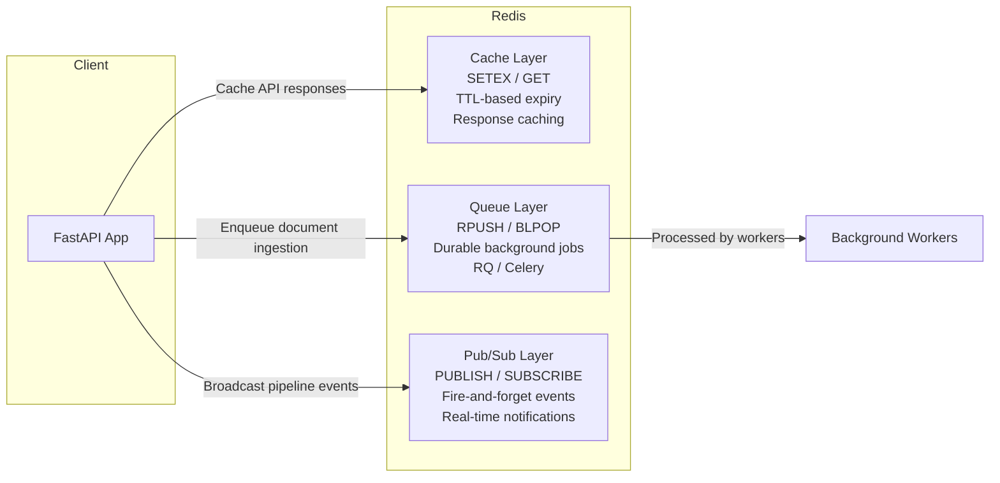
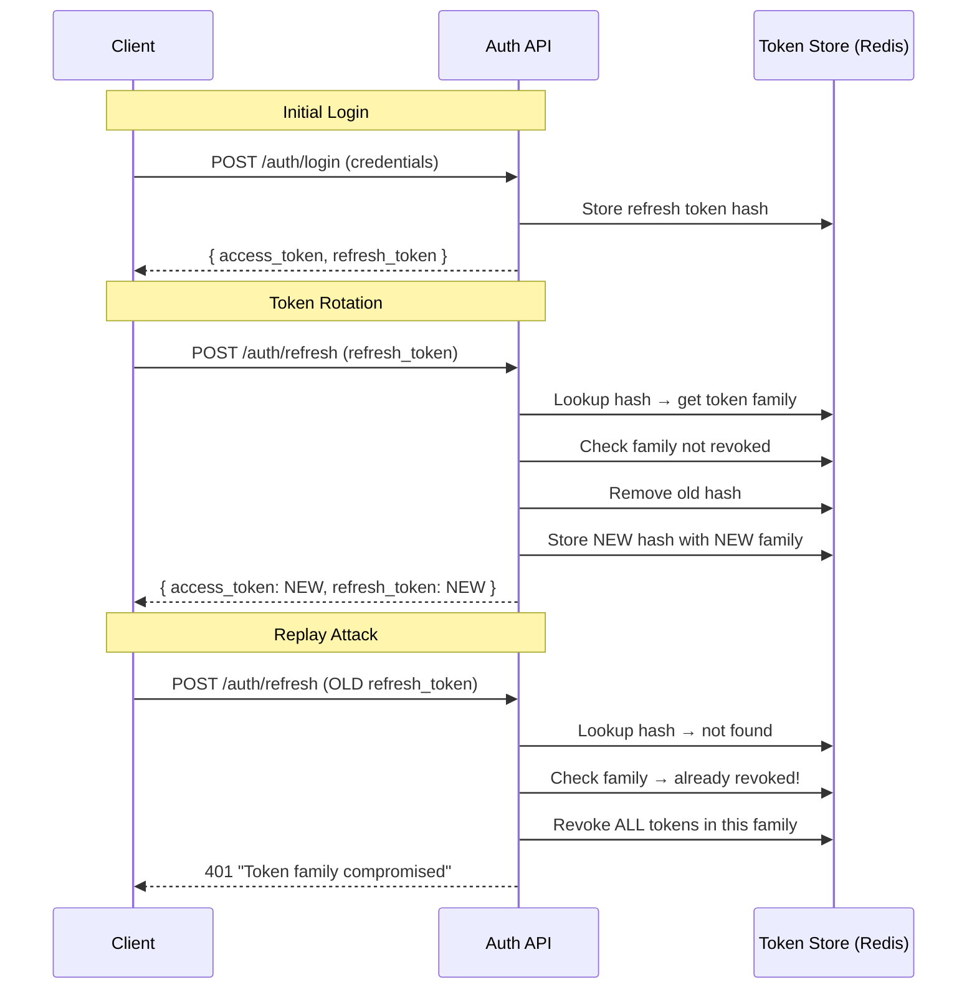
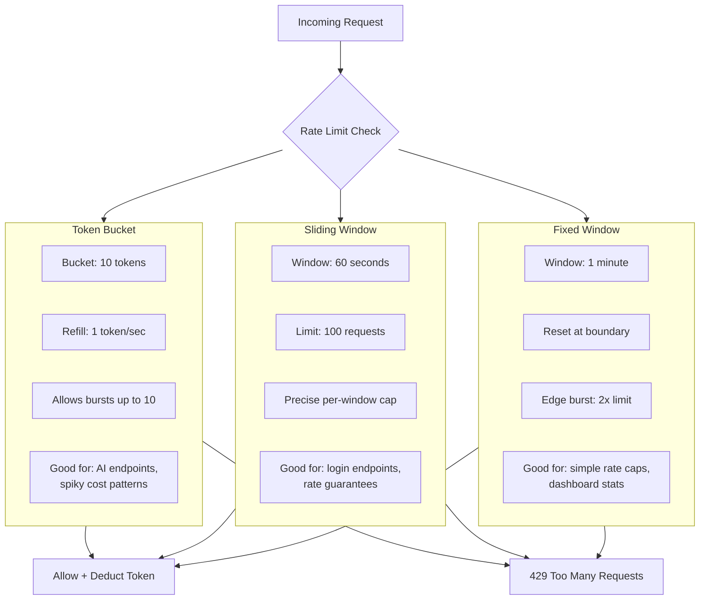

# Phase 0 — Compressed Backend Hardening

**Duration:** Week 1, ~12-15 hours
**Goal:** Fill specific gaps between your Laravel/Node experience and what Python agent engineering demands. These are topics you've touched but haven't systematically covered.

---

## Topic Table

| # | Subtopic | Hours | Done checkpoint |
|---|----------|-------|-----------------|
| 1 | Redis as cache vs Redis as queue/broker | 1.5 | Can explain when to use `SETEX` vs a Redis-backed job queue without looking it up |
| 2 | Redis pub/sub pattern | 1.5 | Can write a 10-line Python pub/sub demo (publisher + subscriber) |
| 3 | OpenAPI/Swagger spec structure (FastAPI) | 1.5 | Can read a generated `/docs` page and identify request/response schema, status codes, examples |
| 4 | JWT refresh-token rotation pattern | 1 | Can diagram access-token + refresh-token lifecycle from memory |
| 5 | Rate limiting: token bucket vs sliding window | 1.5 | Can name which algorithm `slowapi` uses by default and why it matters for AI endpoints |
| 6 | Microservices vs modular monolith | 1 | Can argue both sides applied to ApexERP architecture |
| 7 | Idempotency keys for payment/webhook endpoints | 1.5 | Can explain why a webhook retry without idempotency breaks a payment flow |
| 8 | API versioning strategies | 1 | Can argue URL prefix vs header vs query param vs all three |
| 9 | WebSocket fundamentals | 1.5 | Can build a WebSocket echo server and explain stateful vs stateless |

---

## 0.1 Redis: Cache vs Queue/Broker

You use Redis in Laravel for cache and sessions. In agent engineering, Redis appears in two distinct roles:

### Redis as Cache

```python
# FastAPI + Redis cache example
import redis.asyncio as aioredis
from fastapi import FastAPI, Depends

app = FastAPI()

async def get_redis():
    return await aioredis.from_url("redis://localhost:6379")

@app.get("/expensive-computation")
async def expensive(redis: aioredis.Redis = Depends(get_redis)):
    cached = await redis.get("expensive_result")
    if cached:
        return {"data": cached, "source": "cache"}
    result = do_expensive_work()
    await redis.setex("expensive_result", 300, result)  # TTL: 5 min
    return {"data": result, "source": "fresh"}
```

### Redis as Queue/Broker


Redis-backed job queues (RQ, Celery with Redis broker) solve a different problem: **durable async work that must survive server restarts**.

```python
# FastAPI BackgroundTasks — NOT durable
from fastapi import BackgroundTasks

def process_document(doc_id: str):
    chunk_and_embed(doc_id)  # If server crashes here, job is lost

@app.post("/upload")
async def upload(task: BackgroundTasks, doc_id: str):
    task.add_task(process_document, doc_id)
    return {"status": "accepted"}
```

```python
# RQ (Redis Queue) — IS durable
from rq import Queue
from redis import Redis

redis_conn = Redis()
queue = Queue("document_ingestion", connection=redis_conn)

def process_document(doc_id: str):
    chunk_and_embed(doc_id)

@app.post("/upload")
async def upload(doc_id: str):
    job = queue.enqueue(process_document, doc_id)
    return {"status": "accepted", "job_id": job.id}
```

**When BackgroundTasks is enough:** Email sending, webhook calls, short-lived tasks (< 30s) where losing a job is acceptable.

**When you need a queue:** Document ingestion, LLM batch processing, media generation, any task that takes >30s or must not be lost on crash.

### Exercise

Write a Python script that:
1. Connects to Redis
2. Sets a key with `SETEX` (TTL of 60 seconds)
3. Enqueues a simple job using RQ
4. Prints the value from cache and the job ID from the queue

```python
# scratch/redis-demo/demo.py
import time
from redis import Redis
from rq import Queue

r = Redis()
queue = Queue(connection=r)

# Cache demo
r.setex("demo_key", 60, "cached_value")
print(f"From cache: {r.get('demo_key')}")

# Queue demo
def my_job(name):
    return f"Hello, {name}"

job = queue.enqueue(my_job, "World")
print(f"Job ID: {job.id}")
time.sleep(1)
print(f"Job result: {job.result}")
```

---

## 0.2 Redis Pub/Sub

Pub/Sub (Publish/Subscribe) is a messaging pattern where publishers send messages to channels, and subscribers receive all messages on channels they've subscribed to. Unlike queues, messages are **not stored** — if nobody is subscribed, the message is lost.

### When to use Pub/Sub


- Real-time notifications (new document ingested, pipeline stage completed)
- Broadcasting events to multiple consumers
- Cross-service communication where delivery guarantee is not required

### When NOT to use Pub/Sub


- When the receiver might be offline (use a queue instead)
- When you need to replay messages (use a log/stream instead)
- When delivery must be guaranteed

### Implementation


```python
# publisher.py
import redis.asyncio as aioredis
import asyncio

async def main():
    r = await aioredis.from_url("redis://localhost:6379")
    await r.publish("pipeline:events", '{"stage": "lyrics_generated", "duration": 12.4}')
    print("Published event")
    await r.aclose()

asyncio.run(main())
```

```python
# subscriber.py
import redis.asyncio as aioredis
import asyncio

async def main():
    r = await aioredis.from_url("redis://localhost:6379")
    pubsub = r.pubsub()
    await pubsub.subscribe("pipeline:events")
    async for message in pubsub.listen():
        if message["type"] == "message":
            print(f"Received: {message['data']}")

asyncio.run(main())
```

### Exercise

Create two files — `pub.py` and `sub.py`. Run subscriber first, then publisher. The subscriber should print the message. Then kill the subscriber and publish again — verify the message is lost (this is the key difference from a queue).

---

## 0.3 OpenAPI/Swagger Spec Structure

FastAPI auto-generates OpenAPI docs. You need to be able to read and debug the generated schema.

### What FastAPI generates for you


```python
from pydantic import BaseModel, Field
from fastapi import FastAPI, status

app = FastAPI(title="RAG Demo API", version="1.0.0")

class QueryRequest(BaseModel):
    query: str = Field(..., description="Natural language question", min_length=3)
    top_k: int = Field(5, description="Number of chunks to retrieve", ge=1, le=20)

class SourceChunk(BaseModel):
    text: str
    score: float
    metadata: dict

class QueryResponse(BaseModel):
    answer: str
    sources: list[SourceChunk]

@app.post("/query", response_model=QueryResponse, status_code=status.HTTP_200_OK)
async def query(req: QueryRequest):
    ...
```

### What the generated `/docs` shows


Each Pydantic model becomes a schema. Each endpoint shows:
- **Request body**: field names, types, descriptions, constraints (min_length, ge, le)
- **Response body**: the `response_model` structure with all nested models
- **Status codes**: documented via `status_code` and `responses` parameter
- **Examples**: added via `Field(..., example="...")` or model-level `Config` with `json_schema_extra`

### Key things to check when debugging


1. **Response model matches actual return** — FastAPI serializes the `response_model`, not whatever you return. If they differ, you get a serialization error.
2. **Validation constraints** — Add `Field(..., ge=1)` for integers, `min_length` for strings. Missing validation is the #1 OpenAPI bug.
3. **Example values** — Add `Field(..., example="What is the gym membership fee?")` so the Swagger UI shows real examples.

### Exercise

Create a throwaway FastAPI app with a single `POST /test` endpoint. Add a Pydantic model with 5 fields of different types (str, int, float, list, optional). Hit `/docs` and verify every field, type, and constraint renders correctly. Then deliberately add a validation error (e.g., `age: int = Field(ge=150)`) and see what generates.

---

## 0.4 JWT Refresh-Token Rotation Pattern

You've implemented JWTs in Laravel. The gap is the **rotation pattern** — replacing the refresh token every time it's used, so a stolen refresh token can only be used once.

### Flow


```
1. POST /auth/login → returns { access_token, refresh_token }
2. POST /auth/refresh (with refresh_token) → returns NEW { access_token, refresh_token }
3. Old refresh_token is invalidated immediately
4. If old refresh_token is used again → both tokens are revoked (someone stole it)
```

### Implementation sketch


```python
from fastapi import FastAPI, Depends, HTTPException
from pydantic import BaseModel
import hashlib, secrets

tokens: dict[str, str] = {}  # In production: Redis

def issue_token_pair(user_id: str):
    access = secrets.token_urlsafe(32)
    refresh = secrets.token_urlsafe(64)
    refresh_hash = hashlib.sha256(refresh.encode()).hexdigest()
    tokens[refresh_hash] = user_id
    return {"access_token": access, "refresh_token": refresh}

@app.post("/auth/refresh")
async def refresh(refresh_token: str):
    refresh_hash = hashlib.sha256(refresh_token.encode()).hexdigest()
    user_id = tokens.pop(refresh_hash, None)
    if not user_id:
        raise HTTPException(status_code=401, detail="Invalid or reused refresh token")
    return issue_token_pair(user_id)
```

### Exercise

Diagram the above flow on paper or in a markdown file. Include: what happens when a refresh token is stolen, what the server logs look like during a replay attack, and what the client should do when it gets a 401 on refresh.

---

## 0.5 Rate Limiting: Token Bucket vs Sliding Window

### Token Bucket


A bucket holds N tokens. Every request consumes 1 token. Tokens refill at a fixed rate (e.g., 10 tokens per minute). If the bucket is empty, the request is rejected.

```python
# slowapi implements token bucket by default
from slowapi import Limiter
from slowapi.util import get_remote_address

limiter = Limiter(key_func=get_remote_address)
app.state.limiter = limiter

@app.get("/expensive")
@limiter.limit("10/minute")
async def expensive():
    return {"data": "slow down, cowboy"}
```

**Why token bucket for AI endpoints:** AI calls have spiky cost. A burst of 10 queries in one second costs much more than 10 queries spread over a minute. Token bucket permits bursts up to bucket size, which gives users a better experience while still capping peak cost.

### Sliding Window


Counts requests in a moving time window (e.g., last 60 seconds). If count exceeds threshold, reject.

**Why sliding window for login endpoints:** More precise enforcement — a user doing 100 requests across the boundary of two token-bucket refill windows could technically send 200. Sliding window prevents this.

### Exercise

Install `slowapi` (`pip install slowapi`), add the decorator to a test endpoint, send 11 requests with curl in a loop, and verify the 11th gets a 429.

```bash
# PowerShell one-liner to test rate limiting
for ($i=0; $i -lt 12; $i++) { curl -s http://localhost:8000/expensive; "---"; Start-Sleep -Milliseconds 100 }
```

---

## 0.6 Microservices vs Modular Monolith

### Modular Monolith


A single deployable unit with clear module boundaries. Each module has its own database schema, API surface (internal), and test suite, but they share the same process.

**When it wins:**

- Your team is 1-5 people (you)
- You're iterating fast — refactoring across modules is an IDE action, not an API change + deployment
- Transactional consistency matters (no distributed transactions)

### Microservices


Separate deployable units communicating over a network.

**When it wins:**

- Your team is 10+ people
- Different services have different scaling requirements (media generation needs GPUs, auth needs low latency)
- You need polyglot persistence (Postgres for transactions, vector DB for search, blob storage for media)

### Applied to ApexERP


Your current architecture (monolithic Laravel with n8n for workflows) is a **modular monolith with an external orchestration layer** — a perfectly valid pattern. Moving individual modules to FastAPI microservices would make sense if:
- The module needs GPU access (media pipeline)
- The module has completely different traffic patterns (document ingestion spikes)
- You want to deploy a public API without exposing the admin dashboard surface

### Exercise

Write a 1-page note arguing both sides for ApexERP's specific architecture. Which module (if any) would benefit from being a separate service? Which module would become strictly worse as a microservice? Keep the note; it's a real interview talking point.

---

## 0.7 Idempotency Keys for Payment/Webhook Endpoints

**The problem:** A payment gateway sends a webhook for a successful charge. Your server processes it, credits the user. But the gateway didn't get a 200 response (network blip), so it retries. Now your server credits the user twice.

**The fix:** Idempotency key — a unique identifier the client sends with every request. The server checks "have I already processed this key?" before doing any work.

### Implementation


```python
import hashlib
from fastapi import FastAPI, Header, HTTPException
from redis import Redis

r = Redis()
app = FastAPI()

@app.post("/stripe-webhook")
async def stripe_webhook(
    body: dict,
    idempotency_key: str = Header(alias="Idempotency-Key")
):
    key_hash = hashlib.sha256(idempotency_key.encode()).hexdigest()

    if r.exists(key_hash):
        return {"status": "already_processed"}

    r.setex(key_hash, 86400, "processed")  # Dedup for 24 hours
    process_payment(body)
    return {"status": "success"}
```

### Why this matters for your real estate module


Your booking/payment module processes financial transactions. A webhook retry without idempotency creates double bookings or double payments. The Stripe SDK handles this on Stripe's side, but any custom webhook integration (WhatsApp payments, UPI callbacks) needs explicit idempotency.

### Exercise

Add an idempotency-key check to a mock payment endpoint. Send the same key twice, verify the second call is rejected. Remove the check and send the same request twice — simulate what happens without it.

---

## 0.8 API Versioning Strategies

API versioning matters for AI products because your agent endpoints evolve fast — and agents on the other end can't click "upgrade."

### Four common strategies


| Strategy | How | Pros | Cons |
|----------|-----|------|------|
| URL prefix | `/v1/query`, `/v2/query` | Obvious, easy to route | Pollutes URLs, violates REST purity |
| Query param | `/query?version=1` | Simple | Easy to forget, no caching |
| Header | `Accept: application/vnd.myapp.v1+json` | REST-correct, clean URLs | Harder to test from browser |
| Content negotiation | `Content-Type: application/vnd.myapp.v1+json` | Most RESTful | Complex client logic |

### Recommendation: URL prefix for external APIs


```python
from fastapi import APIRouter

router_v1 = APIRouter(prefix="/v1")
router_v2 = APIRouter(prefix="/v2")

@router_v1.post("/query")
async def query_v1(query: str):
    return {"answer": f"v1: {query}"}

@router_v2.post("/query")
async def query_v2(query: str, top_k: int = 3):
    return {"answer": f"v2: {query}", "sources": [...]}

app.include_router(router_v1)
app.include_router(router_v2)
```

### When to bump version


1. Breaking schema change (response field removed)
2. Behavior change (same input → different meaning)
3. Endpoint removal

### When NOT to bump


1. Adding a field (clients ignore unknown fields)
2. Performance improvement (opaque to client)
3. Bug fix (expected correct behavior)

### Exercise

Add `/v1/collections` and `/v2/collections` to your RAG demo. `/v2` should return paginated results while `/v1` returns all. Run both and verify the difference.

---

## 0.9 WebSocket Fundamentals

Agent pipelines often need real-time communication — streaming token output, live status updates, or bidirectional messaging.

### WebSocket vs HTTP


| HTTP | WebSocket |
|------|-----------|
| Request-response | Bidirectional |
| Stateless | Stateful connection |
| New connection per request | Single persistent connection |
| Headers on every request | No headers after upgrade |
| No server push | Server can push anytime |

### FastAPI WebSocket example


```python
from fastapi import FastAPI, WebSocket, WebSocketDisconnect
import asyncio

app = FastAPI()

@app.websocket("/ws")
async def websocket_endpoint(websocket: WebSocket):
    await websocket.accept()
    try:
        while True:
            data = await websocket.receive_text()
            # Echo back with processing simulation
            await asyncio.sleep(0.5)
            await websocket.send_text(f"Processed: {data}")
    except WebSocketDisconnect:
        print("Client disconnected")
```

### WebSocket for agent streaming


```python
from fastapi import WebSocket
from langgraph.graph import StateGraph

@app.websocket("/agent/run")
async def agent_stream(websocket: WebSocket):
    await websocket.accept()
    user_input = await websocket.receive_text()

    async for event in graph.astream_events({"input": user_input}):
        if event["event"] == "on_chat_model_stream":
            await websocket.send_json({
                "type": "token",
                "content": event["data"]["chunk"].content,
            })
        elif event["event"] == "on_tool_start":
            await websocket.send_json({
                "type": "tool_call",
                "tool": event["name"],
            })

    await websocket.send_json({"type": "done"})
    await websocket.close()
```

### Exercise

Build a WebSocket echo server. Connect to it from a browser console (`new WebSocket("ws://localhost:8000/ws")`). Send messages and verify echo. Then extend it to broadcast to all connected clients — useful for monitoring multiple agent runs.

---

## TypeScript Equivalents — Backend Patterns

The following TypeScript examples mirror the Python patterns taught in this phase. They are useful for Laravel developers who want to see familiar syntax while learning new concepts.

### Redis Wrapper with TypeScript Generics


```typescript
// TypeScript: Redis cache + queue abstraction
import { createClient, RedisClientType } from "redis";

interface CacheConfig {
  ttlSeconds: number;
  prefix: string;
}

class CacheService<T> {
  private client: RedisClientType;
  private config: CacheConfig;

  constructor(config: CacheConfig) {
    this.client = createClient({ url: process.env.REDIS_URL ?? "redis://localhost:6379" });
    this.config = config;
  }

  async connect(): Promise<void> {
    await this.client.connect();
  }

  private key(id: string): string {
    return `${this.config.prefix}:${id}`;
  }

  async get(id: string): Promise<T | null> {
    const raw = await this.client.get(this.key(id));
    return raw ? (JSON.parse(raw) as T) : null;
  }

  async set(id: string, value: T): Promise<void> {
    await this.client.setEx(this.key(id), this.config.ttlSeconds, JSON.stringify(value));
  }

  async invalidate(id: string): Promise<void> {
    await this.client.del(this.key(id));
  }

  async disconnect(): Promise<void> {
    await this.client.quit();
  }
}

// Usage: caching LLM responses
interface LlmResponse {
  text: string;
  tokensUsed: number;
  model: string;
}

const responseCache = new CacheService<LlmResponse>({
  ttlSeconds: 300,
  prefix: "llm:response",
});

await responseCache.connect();
const cached = await responseCache.get("prompt-hash-abc123");
```

### Token Bucket Rate Limiter


```typescript
// TypeScript: Token-bucket rate limiter for AI API cost control
interface BucketState {
  tokens: number;
  lastRefill: number;
}

class TokenBucketRateLimiter {
  private buckets: Map<string, BucketState> = new Map();

  constructor(
    private capacity: number,    // max burst size
    private refillRate: number,  // tokens per second
  ) {}

  private refill(key: string, now: number): void {
    const bucket = this.buckets.get(key);
    if (!bucket) return;
    const elapsed = (now - bucket.lastRefill) / 1000;
    bucket.tokens = Math.min(this.capacity, bucket.tokens + elapsed * this.refillRate);
    bucket.lastRefill = now;
  }

  allow(key: string): boolean {
    const now = Date.now();
    let bucket = this.buckets.get(key);

    if (!bucket) {
      bucket = { tokens: this.capacity, lastRefill: now };
      this.buckets.set(key, bucket);
    }

    this.refill(key, now);

    if (bucket.tokens >= 1) {
      bucket.tokens -= 1;
      return true;
    }

    return false;
  }

  remaining(key: string): number {
    const bucket = this.buckets.get(key);
    if (!bucket) return this.capacity;
    this.refill(key, Date.now());
    return bucket.tokens;
  }
}

// Usage: limit OpenAI calls to 60 requests/minute with burst of 10
const openAiLimiter = new TokenBucketRateLimiter(10, 1); // burst 10, refill 1/sec

async function callLlm(prompt: string): Promise<string | null> {
  const key = `user:${prompt.slice(0, 20)}`;
  if (!openAiLimiter.allow(key)) {
    console.warn(`Rate limited — ${openAiLimiter.remaining(key)} tokens remaining`);
    return null;
  }
  // ... actual API call
  return "response";
}
```

### Sliding Window Rate Limiter


```typescript
// TypeScript: Sliding-window log for precise rate enforcement
interface WindowEntry {
  timestamp: number;
}

class SlidingWindowRateLimiter {
  private windows: Map<string, WindowEntry[]> = new Map();

  constructor(
    private windowMs: number,
    private maxRequests: number,
  ) {}

  allow(key: string): boolean {
    const now = Date.now();
    const cutoff = now - this.windowMs;
    let entries = this.windows.get(key) ?? [];

    // Remove expired entries
    entries = entries.filter((e) => e.timestamp > cutoff);

    if (entries.length >= this.maxRequests) {
      this.windows.set(key, entries);
      return false;
    }

    entries.push({ timestamp: now });
    this.windows.set(key, entries);
    return true;
  }

  usage(key: string): { current: number; limit: number; resetsInMs: number } {
    const now = Date.now();
    const entries = this.windows.get(key) ?? [];
    const cutoff = now - this.windowMs;
    const active = entries.filter((e) => e.timestamp > cutoff);
    const oldestActive = active.length > 0 ? Math.min(...active.map((e) => e.timestamp)) : now;
    return {
      current: active.length,
      limit: this.maxRequests,
      resetsInMs: oldestActive + this.windowMs - now,
    };
  }
}

// Usage: enforce 100 requests per 60 seconds per API key
const apiKeyLimiter = new SlidingWindowRateLimiter(60_000, 100);

function checkRateLimit(apiKey: string): boolean {
  return apiKeyLimiter.allow(apiKey);
}
```

### JWT Token Service with Rotation


```typescript
// TypeScript: Refresh-token rotation with invalidation tracking
import { randomBytes, createHash } from "node:crypto";

interface TokenPair {
  accessToken: string;
  refreshToken: string;
}

interface StoredRefresh {
  userId: string;
  family: string;   // token family for rotation detection
  expiresAt: number;
}

class JwtRotationService {
  private store: Map<string, StoredRefresh> = new Map(); // In production: Redis
  private revokedFamilies: Set<string> = new Set();

  private hash(token: string): string {
    return createHash("sha256").update(token).digest("hex");
  }

  issuePair(userId: string): TokenPair {
    const family = randomBytes(16).toString("hex");
    const accessToken = randomBytes(32).toString("hex");
    const refreshToken = randomBytes(64).toString("hex");

    this.store.set(this.hash(refreshToken), {
      userId,
      family,
      expiresAt: Date.now() + 7 * 24 * 60 * 60 * 1000, // 7 days
    });

    return { accessToken, refreshToken };
  }

  rotate(oldRefreshToken: string): TokenPair | { error: string } {
    const hash = this.hash(oldRefreshToken);
    const stored = this.store.get(hash);

    if (!stored) {
      return { error: "Invalid refresh token" };
    }

    // Replay attack: same family used twice
    if (this.revokedFamilies.has(stored.family)) {
      this.revokeFamily(stored.family); // revoke ALL tokens in this family
      return { error: "Token family compromised — all tokens revoked" };
    }

    // Revoke old token family (rotation)
    this.revokeFamily(stored.family);

    // Issue new pair with NEW family
    const newFamily = randomBytes(16).toString("hex");
    const accessToken = randomBytes(32).toString("hex");
    const refreshToken = randomBytes(64).toString("hex");

    this.store.set(this.hash(refreshToken), {
      userId: stored.userId,
      family: newFamily,
      expiresAt: Date.now() + 7 * 24 * 60 * 60 * 1000,
    });

    return { accessToken, refreshToken };
  }

  private revokeFamily(family: string): void {
    this.revokedFamilies.add(family);
    // In production: also remove all store entries matching family
  }
}
```

### API Versioning Strategy Pattern


```typescript
// TypeScript: Express/Fastify-style versioned route registration
import { Router, Request, Response } from "express";

interface VersionedRoute {
  version: number;
  path: string;
  handler: (req: Request, res: Response) => void | Promise<void>;
}

class ApiVersionManager {
  private routers: Map<number, Router> = new Map();
  private routes: VersionedRoute[] = [];

  register(route: VersionedRoute): void {
    this.routes.push(route);
  }

  build(): Map<number, Router> {
    for (const route of this.routes) {
      if (!this.routers.has(route.version)) {
        this.routers.set(route.version, Router());
      }
      const router = this.routers.get(route.version)!;
      router.get(route.path, route.handler);
    }
    return this.routers;
  }
}

// Example
const mgr = new ApiVersionManager();

mgr.register({
  version: 1,
  path: "/query",
  handler: async (req, res) => {
    res.json({ answer: `v1: ${req.query.q}` });
  },
});

mgr.register({
  version: 2,
  path: "/query",
  handler: async (req, res) => {
    res.json({ answer: `v2: ${req.query.q}`, sources: [] });
  },
});
```

## Architecture Diagrams — Phase 0 Patterns

### Redis Usage Patterns




### JWT Refresh-Token Rotation Flow




### Rate Limiting Algorithms




---

## Phase 0 Done Checkpoint

Before moving to Phase 1, you should be able to:

- [ ] Write a Redis pub/sub demo in Python without looking at a tutorial
- [ ] Read a FastAPI `/docs` page and identify every validation constraint
- [ ] Diagram the refresh-token rotation lifecycle from memory
- [ ] Explain token bucket vs sliding window, and say which `slowapi` uses by default
- [ ] Argue both sides of microservices vs monolith for ApexERP specifically
- [ ] Write an idempotency-key check on a webhook endpoint
- [ ] Argue URL prefix vs header vs query param for API versioning
- [ ] Build a WebSocket echo server and broadcast to all clients

**Estimated time to checkpoint:** 14-18 hours over 1 week.

[Next: Phase 1 — Python + FastAPI + AsyncIO](02-phase1-python-fastapi-async.md)
