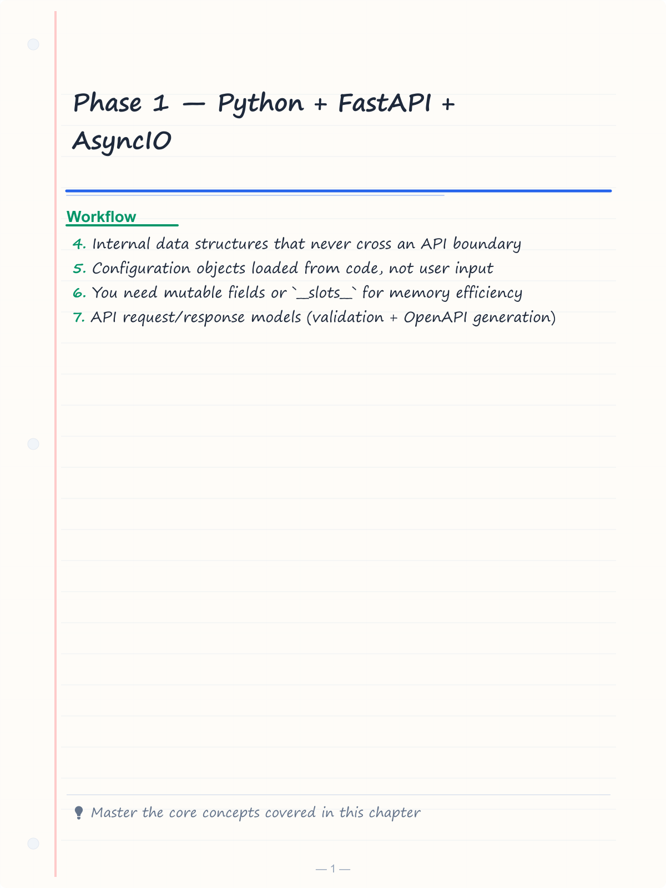
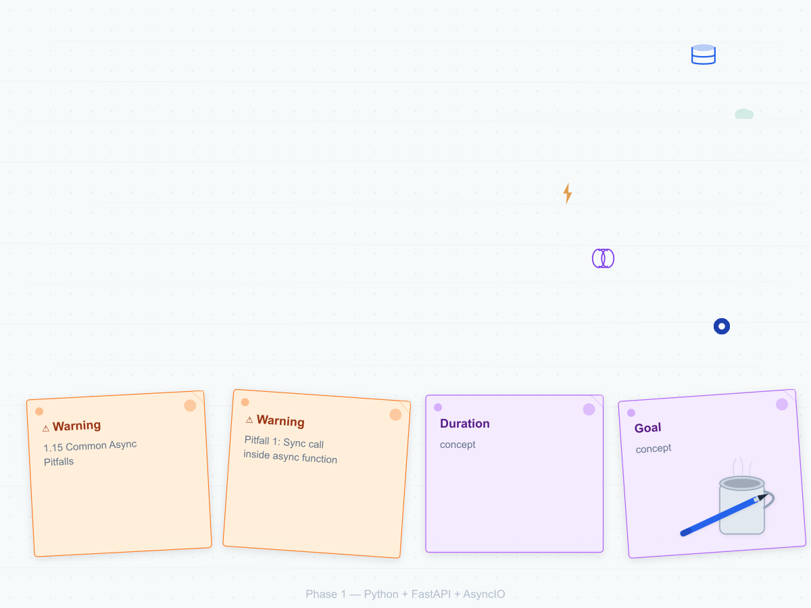
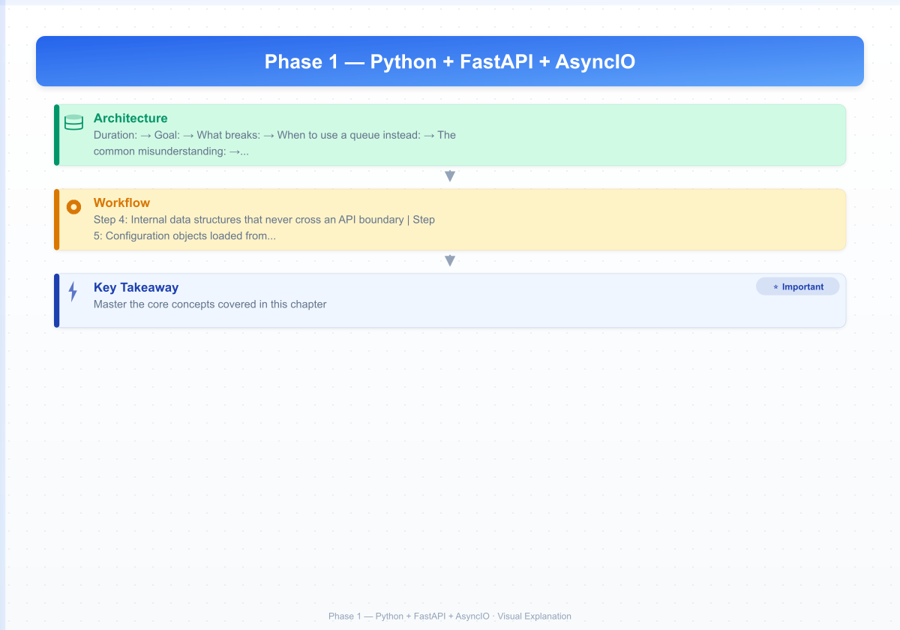

# Phase 1 — Python + FastAPI + AsyncIO

**Duration:** Weeks 2-3, ~30 hours
**Goal:** Write production Python with type hints, build FastAPI endpoints with proper DI and validation, understand asyncIO well enough to explain it in an interview.

---


<!-- Image Gallery -->
<section class="lesson-visuals" aria-label="Visual learning resources">
  <header><span>VISUAL LEARNING</span><h2>See it. Review it. Remember it.</h2></header>
  <a class="lesson-visual-card" href="../../assets/images/lessons/ai-agent-engineer/02-phase1-python-fastapi-async/handwritten-notes.png" target="_blank" rel="noopener">
    
    <span><strong>Handwritten notes</strong>Condensed notes for deliberate review.</span>
  </a>
  <a class="lesson-visual-card" href="../../assets/images/lessons/ai-agent-engineer/02-phase1-python-fastapi-async/sticky-notes.png" target="_blank" rel="noopener">
    
    <span><strong>Sticky-note revision</strong>Fast recall prompts for revision.</span>
  </a>
  <a class="lesson-visual-card" href="../../assets/images/lessons/ai-agent-engineer/02-phase1-python-fastapi-async/visual-explanation.png" target="_blank" rel="noopener">
    
    <span><strong>Visual concept guide</strong>A connected explanation of the key ideas.</span>
  </a>
</section>
<!-- End Image Gallery -->

## Topic Table

| # | Subtopic | Hours | Done checkpoint |
|---|----------|-------|-----------------|
| 1 | Python type hints, `Optional`, `Union`, generics | 1.5 | Can annotate `list[dict[str, int]]` without checking syntax |
| 2 | Dataclasses vs Pydantic models | 1.5 | Can explain why Pydantic wins for API I/O, dataclasses for internal structs |
| 3 | Context managers (`with`, `__enter__`/`__exit__`) | 1 | Can write a custom DB-connection context manager |
| 4 | List/dict comprehensions, generator expressions | 1 | Can convert a 5-line for-loop into a one-line comprehension on first try |
| 5 | Decorators (writing your own) | 2 | Can write `@retry(times=3)` from scratch |
| 6 | FastAPI path/query/body params, validation | 2 | Can build a CRUD endpoint with correct param types without docs |
| 7 | FastAPI DI (`Depends`) | 2.5 | Can write `get_current_user` + DB-session dependencies |
| 8 | FastAPI middleware | 1.5 | Can add custom request-duration logging middleware |
| 9 | Background tasks vs external queue | 1.5 | Can explain why BackgroundTasks aren't durable across restarts |
| 10 | Pydantic v2: `BaseModel`, `Field`, validators | 3 | Can write model-level validator (start_date &lt; end_date) |
| 11 | Pydantic settings (`pydantic-settings`) | 1 | Load typed config from `.env` instead of scattered `os.environ` |
| 12 | AsyncIO fundamentals | 2.5 | Explain `await` in terms of Node's event loop |
| 13 | `asyncio.gather` vs sequential awaits | 2 | Rewrite 3 sequential calls as concurrent, measure speedup |
| 14 | Async HTTP with `httpx.AsyncClient` | 1.5 | Make concurrent outbound API calls without blocking |
| 15 | Common async pitfalls | 2 | Identify why `requests.get()` inside `async def` kills concurrency |
| 16 | pytest for FastAPI (fixtures, DI, httpx) | 2 | Write 3 tests with mocked dependencies that pass |
| 17 | Alembic migrations | 1.5 | Init migration, autogenerate, apply and roll back |

---

## 1.1 Python Type Hints

### Basics


```python
from typing import Optional, Union, Any
from collections.abc import Sequence

def process_items(
    items: list[str],
    threshold: float = 0.5,
) -> dict[str, float]:
    return {item: len(item) * threshold for item in items}
```

### Generics


```python
from typing import TypeVar

T = TypeVar("T")

def first(items: list[T]) -> T | None:
    return items[0] if items else None

# Usage
first([1, 2, 3])      # int | None
first(["a", "b"])      # str | None
```

### Complex nested types


```python
from pydantic import BaseModel

class Chunk(BaseModel):
    text: str
    score: float
    metadata: dict[str, str | int | float]

class QueryResponse(BaseModel):
    answer: str
    sources: list[Chunk]
    total_tokens: int
```

### Exercise

Write 10 annotated function signatures without checking syntax. Cover: `Optional`, `Union`, `list[dict[str, int]]`, `Callable[[int], str]`, `TypeVar`, `Generator[int, None, None]`.

---

## 1.2 Dataclasses vs Pydantic Models

```python
from dataclasses import dataclass
from pydantic import BaseModel

@dataclass
class InternalConfig:
    """Internal-only — no validation, no serialization needed."""
    host: str
    port: int
    debug: bool

class APIRequest(BaseModel):
    """API boundary — validation, serialization, OpenAPI generation needed."""
    name: str
    age: int

    model_config = {"extra": "forbid"}  # Reject unknown fields
```

### When to use dataclasses


- Internal data structures that never cross an API boundary
- Configuration objects loaded from code, not user input
- You need mutable fields or `__slots__` for memory efficiency

### When to use Pydantic


- API request/response models (validation + OpenAPI generation)
- Settings loaded from `.env`
- Any data coming from external sources (user input, third-party APIs)

### Exercise

Take a dataclass from existing code and convert it to Pydantic. Note what you gain: validation, serialization, schema generation. Note what you lose: mutability (Pydantic defaults to frozen via `model_config = {"frozen": True}`).

---

## 1.3 Context Managers

```python
from contextlib import contextmanager

@contextmanager
def db_session():
    session = create_session()
    try:
        yield session
        session.commit()
    except Exception:
        session.rollback()
        raise
    finally:
        session.close()

# Usage
with db_session() as session:
    user = session.query(User).first()
```

### Exercise

Write a context manager that:
1. Opens a file
2. Wraps writes in a try/except
3. Closes the file in `finally`

```python
@contextmanager
def safe_write(path: str):
    f = open(path, "w")
    try:
        yield f
        f.close()
    except Exception as e:
        f.close()
        print(f"Write failed: {e}")
```

---

## 1.4 Comprehensions

### List comprehension


```python
# Instead of:
squares = []
for i in range(10):
    squares.append(i * i)

# Do:
squares = [i * i for i in range(10)]
```

### Dict comprehension


```python
chunks = ["first", "second", "third"]
chunk_map = {c: len(c) for c in chunks}
# {"first": 5, "second": 6, "third": 5}
```

### Generator expression (memory efficient)


```python
# List — all in memory
all_scores = [compute_score(c) for c in huge_list]

# Generator — one at a time
score_gen = (compute_score(c) for c in huge_list)
for score in score_gen:
    process(score)
```

### Exercise

Take 5 for-loops from your existing Python code or tutorials and rewrite them as comprehensions. Time both versions if the data is large enough.

---

## 1.5 Decorators

You've used `@app.get()`, `@limiter.limit()`. Now write your own.

### `@retry(times=3)` — the one you'll actually reuse


```python
import time
from functools import wraps

def retry(times: int = 3, delay: float = 1.0):
    def decorator(func):
        @wraps(func)
        def wrapper(*args, **kwargs):
            last_error = None
            for attempt in range(times):
                try:
                    return func(*args, **kwargs)
                except Exception as e:
                    last_error = e
                    if attempt < times - 1:
                        time.sleep(delay * (attempt + 1))  # exponential backoff
            raise last_error
        return wrapper
    return decorator

@retry(times=3, delay=0.5)
def call_ace_step(prompt: str) -> str:
    response = requests.post(ACE_STEP_URL, json={"prompt": prompt})
    response.raise_for_status()
    return response.json()
```

### `@log_duration`


```python
import time
import logging

logger = logging.getLogger(__name__)

def log_duration(func):
    @wraps(func)
    def wrapper(*args, **kwargs):
        start = time.perf_counter()
        result = func(*args, **kwargs)
        duration = time.perf_counter() - start
        logger.info(f"{func.__name__} took {duration:.2f}s")
        return result
    return wrapper
```

### Exercise

Write `@retry(times=3)` from scratch without looking at this file. Then write `@log_duration`. Both will be reused in the Phase 2 and Phase 3 projects.

---

## 1.6 FastAPI: Params and Validation

```python
from fastapi import FastAPI, Path, Query, Body, HTTPException
from pydantic import BaseModel, Field

app = FastAPI()

class BookingCreate(BaseModel):
    lead_id: int = Field(..., gt=0)
    amount: float = Field(..., gt=0, le=1_000_000)
    payment_method: str = Field(..., pattern=r"^(upi|cash|card|cheque)$")

@app.post("/bookings")
async def create_booking(
    booking: BookingCreate,                                    # Body
    discount_code: str | None = Query(None, max_length=20),   # Query param
    x_user_id: str = Header(alias="X-User-ID"),               # Header
):
    return {"booking": booking, "discount": discount_code, "user": x_user_id}
```

### Exercise

Scaffold a FastAPI app in your project repo with `POST /leads` and `GET /leads/{id}`. Use proper Pydantic schemas with `Field(..., description=...)` on every field. Verify the `/docs` page shows everything correctly.

---

## 1.7 FastAPI Dependency Injection

Dependencies are how FastAPI handles shared logic — authentication, DB sessions, rate limiting.

```python
from fastapi import Depends, HTTPException, status
from fastapi.security import HTTPBearer, HTTPAuthorizationCredentials

security = HTTPBearer()

async def get_current_user(
    credentials: HTTPAuthorizationCredentials = Depends(security),
) -> str:
    token = credentials.credentials
    user_id = await verify_token(token)
    if not user_id:
        raise HTTPException(status_code=status.HTTP_401_UNAUTHORIZED)
    return user_id

async def get_db():
    db = SessionLocal()
    try:
        yield db
        db.commit()
    except Exception:
        db.rollback()
        raise
    finally:
        db.close()

@app.get("/bookings/{id}")
async def get_booking(
    id: int,
    user_id: str = Depends(get_current_user),
    db: Session = Depends(get_db),
):
    booking = db.query(Booking).filter(Booking.id == id).first()
    if not booking:
        raise HTTPException(status_code=404)
    return booking
```

### Exercise

Build `get_db_session` and `get_current_user` dependencies for your real project. Wire them into 3 endpoints. Verify that an unauthenticated request gets a 401, not a 500.

---

## 1.8 FastAPI Middleware

```python
import time
import logging
from fastapi import FastAPI, Request

logger = logging.getLogger(__name__)

app = FastAPI()

@app.middleware("http")
async def log_requests(request: Request, call_next):
    start = time.perf_counter()
    response = await call_next(request)
    duration = time.perf_counter() - start
    logger.info(f"{request.method} {request.url.path} ? {response.status_code} in {duration:.3f}s")
    return response
```

### Exercise

Add this middleware to your project. Send a few requests, verify the logs appear. Then add a correlation ID (UUID generated per request, added to `request.state`, emitted in every log line).

---

## 1.9 Background Tasks vs External Queue

```python
from fastapi import BackgroundTasks

def send_welcome_email(user_id: str):
    time.sleep(2)  # Simulate email API call
    print(f"Welcome email sent to {user_id}")

@app.post("/users")
async def create_user(task: BackgroundTasks):
    user_id = create_user_in_db()
    task.add_task(send_welcome_email, user_id)
    return {"user_id": user_id, "status": "created, email pending"}
```

**What breaks:** If the server restarts between `create_user_in_db()` and `send_welcome_email()`, the email is lost. The user exists in DB but never gets the welcome email.

**When to use a queue instead:** When losing the task is unacceptable (payments, document processing, media generation).

### Exercise

Add a slow fake task to an endpoint with BackgroundTasks. Restart the server while it's processing. Verify the task is lost. Then replace with RQ and verify it survives restart (RQ stores jobs in Redis).

---

## 1.10 Pydantic v2: Validators

```python
from pydantic import BaseModel, Field, field_validator, model_validator

class BookingCreate(BaseModel):
    lead_id: int
    amount: float
    check_in: str
    check_out: str

    @field_validator("amount")
    @classmethod
    def amount_must_be_positive(cls, v: float) -> float:
        if v <= 0:
            raise ValueError("Amount must be positive")
        return v

    @model_validator(mode="after")
    def check_dates(self):
        if self.check_in >= self.check_out:
            raise ValueError("check_in must be before check_out")
        return self
```

### Exercise

Add a custom field validator (phone number format) and a model-level validator (start_date &lt; end_date) to your project's booking schema.

---

## 1.11 Pydantic Settings

```python
# config.py
from pydantic_settings import BaseSettings

class Settings(BaseSettings):
    app_name: str = "RAG Demo API"
    database_url: str
    redis_url: str = "redis://localhost:6379"
    openai_api_key: str
    chroma_persist_dir: str = "./chroma_data"
    rate_limit_per_minute: int = 10

    model_config = {"env_file": ".env", "env_file_encoding": "utf-8"}

settings = Settings()
```

Instead of `os.environ.get("DATABASE_URL")` scattered across 5 files. Pydantic also:
- Validates types (typo in `.env` won't silently become a string)
- Autocompletes in your IDE
- Tracks which settings are used (a single import)

### Exercise

Refactor your project to use `pydantic-settings`. Move everything from `os.environ` into one `Settings` class. Verify the app starts without `.env` and errors with a clear message about missing fields.

---

## 1.12 AsyncIO Fundamentals

### The key insight


Node.js uses an event loop. Python's asyncio uses an event loop. They are conceptually the same thing:

| Node.js | Python |
|---------|--------|
| `async function` | `async def` |
| `await` | `await` |
| Event loop (hidden) | `asyncio.run()` or `asyncio.get_event_loop()` |
| Microtask queue | Callback queue |

### What `await` actually does


When you write `await some_async_fn()`, Python:
1. Pauses the current coroutine at this line
2. Yields control back to the event loop
3. The event loop runs other tasks while waiting
4. When `some_async_fn()` completes, the event loop resumes this coroutine

**The common misunderstanding:** `await` does NOT block. It yields. A blocking call inside an async function (like `time.sleep(2)` or `requests.get()`) blocks the event loop because it never yields control back.

```python
import asyncio

async def task(name: str, delay: float):
    print(f"{name}: start")
    await asyncio.sleep(delay)  # Correct — yields to event loop
    print(f"{name}: end")

async def main():
    # Sequential — takes 3 seconds
    await task("A", 1)
    await task("B", 2)

    # Concurrent — takes 2 seconds
    await asyncio.gather(
        task("C", 1),
        task("D", 2),
    )

asyncio.run(main())
```

### Exercise

Write 3 async functions with `asyncio.sleep(1)`, `asyncio.sleep(2)`, `asyncio.sleep(3)`. Run them sequentially with `await`, time it. Run them concurrently with `asyncio.gather`, time it. Confirm the speedup is ~3x.

---

## 1.13 `asyncio.gather` vs Sequential

```python
import asyncio
import httpx

async def fetch_embedding(text: str) -> list[float]:
    async with httpx.AsyncClient() as client:
        resp = await client.post(
            "https://api.openai.com/v1/embeddings",
            json={"input": text, "model": "text-embedding-3-small"},
        )
        return resp.json()["data"][0]["embedding"]

async def main():
    texts = ["cat", "dog", "car"]

    # Sequential — 3 * latency = ~1.5s
    results_seq = []
    for t in texts:
        results_seq.append(await fetch_embedding(t))

    # Concurrent — 1 * latency = ~0.5s
    results_con = await asyncio.gather(*[fetch_embedding(t) for t in texts])
```

### Exercise

Take 3 outbound API calls (OpenAI, or any free public API). Run them sequentially and with `asyncio.gather`. Time both. The speedup is your actual latency improvement — write it down, it's an interview talking point.

---

## 1.14 Async HTTP with httpx

```python
import asyncio
import httpx

async def call_llm(prompt: str, client: httpx.AsyncClient) -> str:
    resp = await client.post(
        "https://api.anthropic.com/v1/messages",
        json={
            "model": "claude-3-haiku-20240307",
            "messages": [{"role": "user", "content": prompt}],
            "max_tokens": 100,
        },
        headers={"x-api-key": "sk-..."},
    )
    return resp.json()["content"][0]["text"]

async def main():
    prompts = ["Write a haiku", "Write a limerick", "Write a tanka"]
    async with httpx.AsyncClient() as client:
        # 3 concurrent LLM calls — ~3x faster than sequential
        results = await asyncio.gather(*[call_llm(p, client) for p in prompts])
        print(results)
```

### Exercise

Make 3 concurrent outbound API calls — one to OpenAI, one to a weather API, one to a free joke API — without blocking each other. Use `httpx.AsyncClient` as a context manager.

---

## 1.15 Common Async Pitfalls

### Pitfall 1: Sync call inside async function


```python
import requests

async def bad_route():
    # BAD: requests.get() is synchronous — blocks the entire event loop
    resp = requests.get("https://api.example.com/data")
    return resp.json()

async def good_route():
    # GOOD: httpx.AsyncClient is async — yields to event loop
    async with httpx.AsyncClient() as client:
        resp = await client.get("https://api.example.com/data")
        return resp.json()
```

### Pitfall 2: Sync database driver in async route


```python
import psycopg2  # Sync — blocks

async def bad_query():
    conn = psycopg2.connect("...")
    cur = conn.cursor()
    cur.execute("SELECT * FROM users")  # Blocks event loop
    return cur.fetchall()

# Use asyncpg or SQLAlchemy 2.0 async instead
import asyncpg

async def good_query():
    conn = await asyncpg.connect("...")
    rows = await conn.fetch("SELECT * FROM users")
    await conn.close()
    return rows
```

### Pitfall 3: CPU-bound work in async function


```python
async def compute_something_heavy():
    # BAD: CPU-bound, blocks event loop for the duration
    result = expensive_calculation()

    # GOOD: offload to thread pool
    result = await asyncio.to_thread(expensive_calculation)
```

### Exercise

Write a FastAPI route that deliberately calls `time.sleep(3)` inside an async function. Hit it 3 times in parallel — observe it takes 9 seconds. Replace with `await asyncio.sleep(3)` — observe it takes 3 seconds. This is the single lesson that makes async click permanently.

---

## Phase 1 Project: Port Real Estate Booking Module to FastAPI

### Spec


Take your existing real estate Booking/Payment/Document module (leads, demand letters, PDC, NOC, allotment letters, role/permission controls) and rebuild the core endpoints:

```
POST   /leads                    Create lead
POST   /bookings                 Create booking from lead
POST   /bookings/{id}/payments   Record payment
GET    /bookings/{id}            Get booking details with documents
GET    /bookings/{id}/documents  List documents for a booking
```

### Constraints


- Use SQLAlchemy 2.0 async ORM (not sync)
- All endpoints gated with `Depends(get_current_user)`
- Role-based permissions: `admin`, `agent`, `customer`
- Pydantic schemas with `Field(description=...)` on every field
- `.env` config via `pydantic-settings`
- Custom `@retry(times=3)` decorator on at least one endpoint

### Done checkpoint


- [ ] All 5 endpoints work against real Postgres
- [ ] Role/permission checks enforced (agent cannot create bookings for another agent's lead)
- [ ] Every async/await placement is explainable ("this is async because it waits on DB I/O; this is not because it's CPU-bound")
- [ ] `/docs` page renders with clear schemas and examples
- [ ] Laravel-vs-FastAPI comparison README written

### Comparison README template


```markdown
## Laravel (Eloquent) vs FastAPI (SQLAlchemy 2.0)

| Concern | Laravel | FastAPI |
|---------|---------|---------|
| DB queries | Eloquent ORM, lazy loading by default | SQLAlchemy 2.0 async, explicit eager loading |
| Migrations | Built-in, `php artisan migrate` | Alembic, `alembic revision --autogenerate` |
| Validation | Form Request classes | Pydantic `BaseModel` with `Field` constraints |
| Auth middleware | `auth:api` guard | FastAPI `Depends(get_current_user)` |
| Async support | Laravel Octane (optional) | Native async/await, first-class citizen |
| Serialization | Eloquent API Resources | Pydantic `model_dump()` or `response_model` |

**Key insight:** Laravel's lazy-loading Eloquent makes rapid prototyping faster. FastAPI's explicit async + Pydantic makes production correctness higher. Each tradeoff makes sense in its context.
```

---

## 1.16 pytest for FastAPI: Fixtures, DI, httpx

Testing FastAPI requires more than unit tests — you need to test endpoints with real request/response cycles.

### Basic FastAPI test


```python
from fastapi.testclient import TestClient

from app.main import app

client = TestClient(app)

def test_healthz():
    response = client.get("/healthz")
    assert response.status_code == 200
    assert response.json() == {"status": "ok"}

def test_create_item():
    response = client.post(
        "/items",
        json={"name": "test", "price": 10.0},
    )
    assert response.status_code == 201
    data = response.json()
    assert data["name"] == "test"
    assert "id" in data
```

### Mocking dependencies


```python
import pytest
from fastapi.testclient import TestClient

from app.deps import get_current_user
from app.main import app
from app.schemas import User

def mock_user():
    return User(id="test-123", email="test@example.com", name="Test")

# Override DI at the app level
app.dependency_overrides[get_current_user] = mock_user

def test_protected_endpoint():
    client = TestClient(app)
    response = client.get("/me")
    assert response.status_code == 200
    assert response.json()["email"] == "test@example.com"

# Clean up after test
app.dependency_overrides.clear()
```

### Async tests with httpx


```python
import pytest
from httpx import AsyncClient, ASGITransport

from app.main import app

@pytest.mark.anyio
async def test_async_endpoint():
    transport = ASGITransport(app=app)
    async with AsyncClient(transport=transport, base_url="http://test") as ac:
        response = await ac.post(
            "/v1/collections",
            json={"name": "test-collection"},
        )
    assert response.status_code == 200
    assert response.json()["name"] == "test-collection"
```

### Test fixtures for database


```python
import pytest
from sqlalchemy import create_engine
from sqlalchemy.orm import sessionmaker
from app.database import Base, get_db
from app.main import app

TEST_DATABASE_URL = "sqlite:///./test.db"
engine = create_engine(TEST_DATABASE_URL)
TestingSessionLocal = sessionmaker(bind=engine)

@pytest.fixture
def db_session():
    Base.metadata.create_all(bind=engine)
    session = TestingSessionLocal()
    yield session
    session.close()
    Base.metadata.drop_all(bind=engine)

@pytest.fixture
def client(db_session):
    def override_get_db():
        yield db_session
    app.dependency_overrides[get_db] = override_get_db
    yield TestClient(app)
    app.dependency_overrides.clear()
```

### Exercise

Write tests for your booking module:
1. Test healthz returns 200
2. Test creating a booking with valid data returns 201
3. Test creating a booking with missing fields returns 422
4. Test creating a booking with overlapping dates returns 409
5. Test an endpoint that requires auth returns 401 without token

Run `pytest -v` and get all green.

---

## 1.17 Alembic Migrations

Alembic is the SQLAlchemy equivalent of Laravel's migrations. You use it whenever your schema changes.

### Setup


```bash
pip install alembic
alembic init alembic
```

Edit `alembic/env.py` to point at your models:

```python
from app.models import Base  # your SQLAlchemy Base
from app.config import settings

target_metadata = Base.metadata

config.set_main_option("sqlalchemy.url", settings.database_url)
```

### Creating a migration


```bash
alembic revision --autogenerate -m "add bookings table"
```

This compares your current models against the database and generates a migration:

```python
"""add bookings table

Revision ID: a1b2c3d4e5f6
"""
from alembic import op
import sqlalchemy as sa

def upgrade():
    op.create_table(
        "bookings",
        sa.Column("id", sa.Integer(), nullable=False),
        sa.Column("property_id", sa.Integer(), nullable=False),
        sa.Column("guest_name", sa.String(length=255), nullable=False),
        sa.Column("check_in", sa.Date(), nullable=False),
        sa.Column("check_out", sa.Date(), nullable=False),
        sa.Column("status", sa.String(length=50), nullable=False),
        sa.PrimaryKeyConstraint("id"),
    )

def downgrade():
    op.drop_table("bookings")
```

### Applying and rolling back


```bash
alembic upgrade head   # Apply all pending
alembic downgrade -1   # Roll back one step
alembic history        # View migration history
```

### Best practices


1. **Always review autogenerated migrations** — Alembic misses some changes (table renames, column type changes)
2. **Never edit a migration that's already been applied** — create a new one
3. **Test both upgrade and downgrade** before deploying
4. **Commit migration files to git** — they're part of your schema history

### Exercise

Add a `phone_number` column to your bookings table. Create a migration with `--autogenerate`. Apply it. Verify the column exists. Roll it back. Apply it again. Commit the migration file.

---


interface Document { id: string; content: string; metadata: Record&lt;string,unknown&gt;; embedding?: number[] }
interface Chunk { text: string; tokens: number }
class Chunker { constructor(private maxTokens: number = 512) {}
  chunk(text: string): Chunk[] { const words = text.split(/\s+/); const chunks: Chunk[] = []; let current: string[] = []
    for(const w of words) { current.push(w); if(current.join(" ").length >= this.maxTokens) { chunks.push({text:current.join(" "),tokens:current.length}); current=[] }}
    if(current.length) chunks.push({text:current.join(" "),tokens:current.length})
    return chunks
  }
}
class VectorStore {
  private store: Map&lt;string,number[]&gt; = new Map()
  add(id: string, embedding: number[]): void { this.store.set(id, embedding) }
  search(query: number[], k: number): string[] {
    const scores: [string,number][] = []
    this.store.forEach((emb, id) => { const sim = cosineSimilarity(query, emb); scores.push([id, sim]) })
    return scores.sort((a,b) => b[1]-a[1]).slice(0,k).map(([id]) => id)
  }
}
function cosineSimilarity(a: number[], b: number[]): number {
  const dot = a.reduce((s,v,i) => s+v*b[i]!, 0)
  const na = Math.sqrt(a.reduce((s,v) => s+v*v,0)), nb = Math.sqrt(b.reduce((s,v) => s+v*v,0))
  return dot/(na*nb)
}
class RAGPipeline {
  constructor(private chunker: Chunker, private store: VectorStore, private llm: (prompt:string) => Promise&lt;string&gt;) {}
  async ingest(doc: Document): Promise&lt;void&gt; {
    const chunks = this.chunker.chunk(doc.content)
    for(let i=0;i&lt;chunks.length;i++) { const emb = await this.embed(chunks[i].text); this.store.add(`${doc.id}:${i}`, emb) }
  }
  async query(q: string): Promise&lt;string&gt; {
    const qEmb = await this.embed(q); const ids = this.store.search(qEmb, 3)
    const ctx = ids.join("\n"); return this.llm(`Context:\n${ctx}\n\nQuestion: ${q}`)
  }
  private async embed(text: string): Promise&lt;number[]&gt; { return text.split("").map(c => c.charCodeAt(0)/255) }
}
export { Chunker, VectorStore, RAGPipeline, cosineSimilarity }
## Phase 1 Done Checkpoint

Before moving to Phase 2, you should be able to:

- [ ] Annotate `list[dict[str, int]]` without checking syntax
- [ ] Write `@retry(times=3)` from scratch
- [ ] Build a FastAPI CRUD endpoint without looking at docs
- [ ] Wire `Depends(get_current_user)` and `Depends(get_db)` on 3 endpoints
- [ ] Explain why `time.sleep()` in an async function is wrong and what happens instead
- [ ] Use `asyncio.gather` to speed up 3 concurrent API calls
- [ ] Add a Pydantic model-level validator (start_date &lt; end_date)
- [ ] Load typed settings from `.env` via `pydantic-settings`
- [ ] Write 3 FastAPI tests with mocked dependencies that all pass
- [ ] Create an Alembic migration from scratch, apply and roll back

**Estimated time to checkpoint:** 28-34 hours over 2 weeks.

[Next: Phase 2 — LLM Fundamentals + RAG Theory](03-phase2-llm-rag-theory.md)
