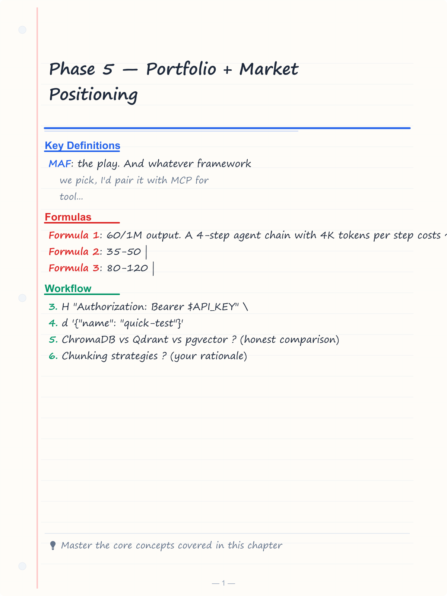
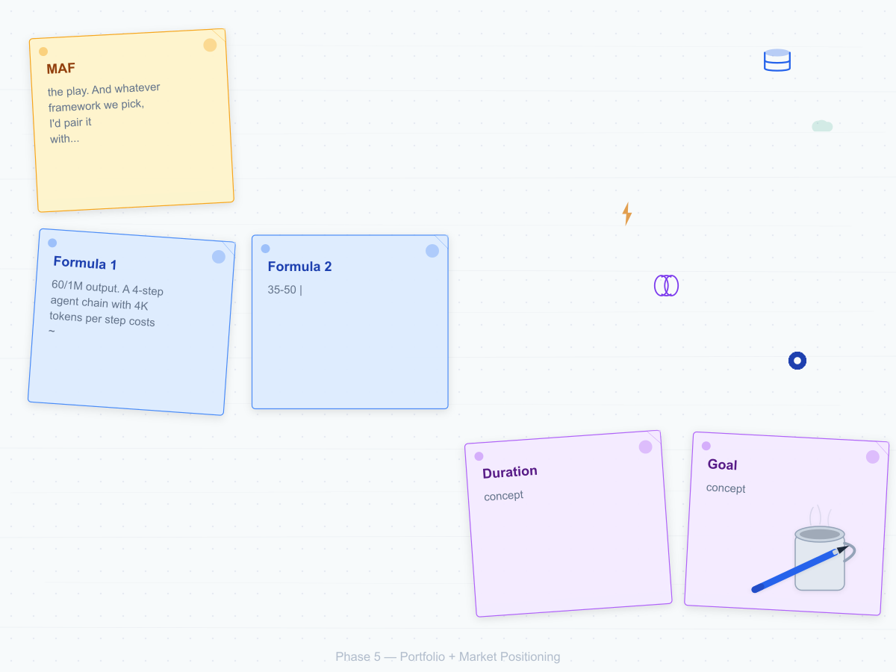
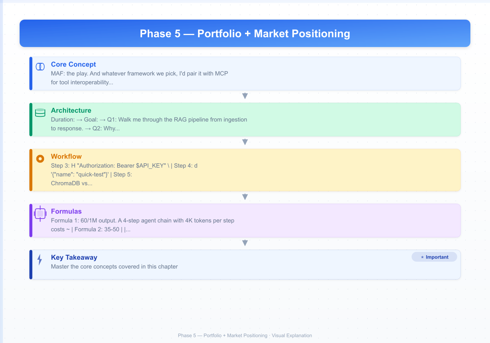

# Phase 5 — Portfolio + Market Positioning

**Duration:** Weeks 11-12, ~15 hours + ongoing applications
**Goal:** Package your projects into something a recruiter understands in 60 seconds. Rewrite profiles. Start applying.

---


<!-- Image Gallery -->
<section class="lesson-visuals" aria-label="Visual learning resources">
  <header><span>VISUAL LEARNING</span><h2>See it. Review it. Remember it.</h2></header>
  <a class="lesson-visual-card" href="../../assets/images/lessons/ai-agent-engineer/06-phase5-portfolio-positioning/handwritten-notes.png" target="_blank" rel="noopener">
    
    <span><strong>Handwritten notes</strong>Condensed notes for deliberate review.</span>
  </a>
  <a class="lesson-visual-card" href="../../assets/images/lessons/ai-agent-engineer/06-phase5-portfolio-positioning/sticky-notes.png" target="_blank" rel="noopener">
    
    <span><strong>Sticky-note revision</strong>Fast recall prompts for revision.</span>
  </a>
  <a class="lesson-visual-card" href="../../assets/images/lessons/ai-agent-engineer/06-phase5-portfolio-positioning/visual-explanation.png" target="_blank" rel="noopener">
    
    <span><strong>Visual concept guide</strong>A connected explanation of the key ideas.</span>
  </a>
</section>
<!-- End Image Gallery -->

## Topic Table

| # | Subtopic | Hours | Done checkpoint |
|---|----------|-------|-----------------|
| 1 | README structure that gets read | 1.5 | Both project READMEs follow a consistent structure a recruiter can skim in 60 seconds |
| 2 | Demo video (90 seconds) | 1 | 90-second video exists for each project |
| 3 | Upwork profile rewrite | 1.5 | Profile explicitly lists LangGraph, CrewAI, FastAPI, n8n, ChromaDB, pgvector |
| 4 | LinkedIn rewrite | 1 | Headline leads with "AI Automation Engineer" |
| 5 | Case-study post | 2 | One published write-up on LinkedIn or dev.to |
| 6 | Dubai job search + applications | Ongoing, 1hr/week | 3-5 applications/week sustained for 4 weeks |
| 7 | Technical interview prep | 2 | Can explain RAG pipeline, ReAct loop, and MCP protocol from memory without notes |
| 8 | Salary negotiation | 1 | Written walk-away number + target range for Dubai market |
| 9 | Freelance pricing strategy | 1 | Rate card set for 3 engagement types (hourly, fixed-price, retainer) |
| 10 | GitHub profile optimization | 0.5 | Profile README + 3 pinned repos with proper topics |
| 11 | Portfolio website | 1.5 | Single-page site deployed on Cloudflare Pages |
| 12 | Building in public + content strategy | 2 | First LinkedIn post published, 3 more scheduled |
| 13 | Certifications worth pursuing | 2 | 1 certification completed and listed on LinkedIn |
| 14 | Networking in the Dubai AI scene | 1.5 | Joined 2 communities + 3 LinkedIn connections sent |
| 15 | Modern AI frameworks — landscape & strategy | 2 | Can explain 6 major frameworks, their strengths, and when to use each |
| 16 | Trending AI repos to follow | 1 | Following 10+ key repos, can cite latest developments in interviews |

---

## 5.1 README Structure That Gets Read

### The 60-second skim


A recruiter or technical lead opens your README. They spend **60 seconds** deciding whether to read more or move on. Your README must communicate everything in those 60 seconds.

### Structure (applies to both projects)


```markdown
# Project Name
> One-line description: what it does, who it's for.

## Demo
[Link to live demo](https://rag-demo.apexpillar.tech)
<!-- Demo Screenshot (placeholder) -->

## Architecture
<!-- Architecture Diagram (placeholder) -->

## Quick Start
```
curl -X POST https://rag-demo.apexpillar.tech/v1/collections \
  -H "Authorization: Bearer $API_KEY" \
  -d '{"name": "quick-test"}'
```

## Key Design Decisions

| Decision | Choice | Why |
|----------|--------|-----|
| Vector DB | ChromaDB | Simplest setup, good for medium-scale RAG |
| Embedding model | text-embedding-3-small | Best cost/quality tradeoff |
| Chunk size | 500-800 tokens | Standard range, prevents context loss |

## Tradeoffs Considered
- ChromaDB vs Qdrant vs pgvector ? (honest comparison)
- Chunking strategies ? (your rationale)
- Rate limiting approach ? (token bucket vs sliding window)

## Stack
Python, FastAPI, ChromaDB, Redis, OpenAI, Docker, Cloudflare Tunnel

## Related
- [System Design Doc](link-to-interview-artifact)
- [n8n vs LangGraph Comparison](link-to-comparison-doc)
```

### Exercise

Rewrite both project READMEs using this structure. Time someone reading them — if they can't understand the project in 60 seconds, rewrite.

---

## 5.2 Demo Video (90 Seconds)

### Structure


| Time | Content |
|------|---------|
| 0-10s | Show the result first (answer from RAG query, or finished video) |
| 10-30s | Show the request (curl command or upload) |
| 30-60s | Show what happens internally (architecture diagram overlaid) |
| 60-80s | Show the response with cited sources |
| 80-90s | Call to action (link to repo, try it yourself) |

### Tools


- Screen recording: OBS Studio (free) or your phone's screen recording
- Simple edit: trim front/back, add text overlays in CapCut or DaVinci Resolve
- Host: YouTube (unlisted) or GitHub release page

### What NOT to do


- Don't show code scrolling (nobody reads code in a video)
- Don't explain architecture for 45 seconds before showing the result
- Don't make it longer than 2 minutes

### Exercise

Record one 90-second video for the RAG demo. If it's longer than 2 minutes, re-record. If it starts with architecture instead of the result, re-record. Do the same for the LangGraph project (show a pipeline run that produces output).

---

## 5.3 Upwork Profile Rewrite

Content already drafted in `docs/profile/upwork-raw.md`. Key requirements:

### Tags/Skills (must-explicitly-list order)


1. LangGraph
2. CrewAI
3. FastAPI
4. ChromaDB
5. RAG / Vector Database
6. MCP / Model Context Protocol
7. n8n
8. WhatsApp Business API
9. Python
10. OpenAI API / Anthropic API
11. Docker / Cloudflare
12. PostgreSQL / Redis

### Overview structure


1. **Who you are** (1 sentence): "I build production agent systems — LangGraph orchestrators, RAG pipelines, MCP servers."
2. **What you've built** (2-3 sentences): ChromaDB server, LangGraph pipeline, production ERP with WhatsApp AI.
3. **Your background** (1 sentence): "Started as full-stack developer, went all-in on AI engineering in 2025."
4. **Your stack** (comma-separated list matching the tags above)
5. **Availability statement**

### Exercise

Copy the draft from `docs/profile/upwork-raw.md` into your actual Upwork profile. Verify every skill tag is present and ordered correctly.

---

## 5.4 LinkedIn Rewrite

Content already drafted in `docs/profile/linkedin-rewrite.md`.

### Headline (must fit in 220 characters)


```
AI Agent Engineer | LangGraph · RAG · FastAPI · MCP · Production Agentics
```

Alternatively:

```
Building Production Agent Systems | LangGraph, FastAPI, ChromaDB, MCP | Open to Dubai/Remote
```

### About section structure


1. Current identity: "I build production agent systems."
2. What that means: "LangGraph state machines, RAG pipelines, MCP servers."
3. Proof: "Live projects: ChromaDB RAG demo, LangGraph content pipeline, WhatsApp AI ERP in production."
4. Target: "Open to AI Automation Engineer / Agent Developer roles in Dubai or remote from July 2026."
5. Stack list: same ordering as Upwork

### Featured section


Add both project repos and the RAG demo link as Featured items.

### Exercise

Update your actual LinkedIn profile. Ask someone who doesn't know your work to read it and tell you what you do. If they don't say "AI Agent Engineer" within 5 seconds, rewrite.

---

## 5.5 Case-Study Post

### Structure


```
Title: How I Built a Production RAG API in 2 Weeks (and Why ChromaDB Won)

1. The problem: "I needed a long-term memory system for LLM agents..."
2. The architecture: (1-2 sentence description + diagram)
3. Key decisions:
   - ChromaDB over Qdrant/pgvector (honest tradeoff)
   - 500-800 token chunks with 50 overlap (why)
   - Token bucket rate limiting (why for AI endpoints)
4. Results: "Live on Hetzner, serving queries at ~2s with cited sources."
5. Lessons learned: "The hardest part was chunking, not vector search."
6. Link to the project and live demo
```

### Exercise

Publish one case-study post on LinkedIn (native post, not a link to a blog). Spend 30 minutes on it. Include at least one concrete design decision with your rationale.

---

## 5.6 Dubai Job Search + Applications

> **See the full playbook:** [08-job-search-playbook.md](08-job-search-playbook.md) — covers job sites, networking, proposals, interviews, Dubai visa process, and pipeline management in depth.

### Where to search (quick reference)


| Platform | Best for | Search terms |
|----------|----------|-------------|
| LinkedIn | Direct hire, companies | "AI Automation Engineer", "AI Agent", "LangGraph", "RAG" |
| Indeed UAE | Recruiter postings | Filter by Remote, Posted &lt; 7 days |
| Bayt.com | Middle East focused | "AI Engineer" + Remote |
| Wellfound | Startup roles | "AI Engineer", filter by Remote |

### Application rhythm


- **Week 1:** Identify 20 target postings. Customize your proposal template for each. Apply to 5.
- **Week 2:** Apply to 5 more. Follow up on Week 1 applications.
- **Week 3:** Apply to 5 more. If response rate is &lt; 20%, revise profile.
- **Week 4:** Apply to 5 more. By now you should have data on what's working.

### Response tracking


Create a proposal tracker (see the [job search playbook](08-job-search-playbook.md) for a complete template):

```markdown
# Proposal Tracker

| Date | Company | Role | Platform | Template | Status | Follow-up | Notes |
|------|---------|------|----------|----------|--------|-----------|-------|
| 2026-06-24 | Talent Bridge HR | AI Automation Engineer | LinkedIn | B | Applied | Day 5 | Customized for LangGraph |
```

### Exercise

Read the [full job search playbook](08-job-search-playbook.md). It covers everything from the 50-application rule to Dubai visa types to interview system design. Then spend 1 hour identifying 20 target postings and apply to 3-5.

---

## 5.7 Technical Interview Prep

The AI Agent Engineer interview typically covers: system design (RAG pipeline), agent architecture (ReAct, LangGraph), and production concerns (latency, cost, safety).

### 10 common questions with concise answers


**Q1: Walk me through the RAG pipeline from ingestion to response.**
```
Ingestion: Document ? chunk (500-800 tokens) ? embed (text-embedding-3-small, 1536d) ? store in ChromaDB with metadata.
Query: User question ? embed ? ANN search (HNSW, top_k=5) ? re-rank (Cohere reranker) ? combine chunks + query ? LLM generates answer with citations.
```

**Q2: Why cosine similarity for text embeddings?**
Cosine measures angle, ignoring magnitude. In embedding space, a document's meaning is its direction, not its length. A long and short document saying the same thing have the same direction.

**Q3: What's the difference between an agent and a chain?**
A chain is a fixed sequence of LLM calls. An agent decides which action to take next based on the current state — it can choose tool A or tool B depending on what the user asked.

**Q4: How do you prevent hallucination in RAG?**
1. Set a relevance threshold on retrieved chunks (reject low-score results)
2. Instruct the LLM: "If the context doesn't contain the answer, say 'I don't know'"
3. Add citation requirements — force the model to cite specific chunks
4. Re-rank to push irrelevant chunks below the cutoff

**Q5: LangGraph vs OpenAI Agents SDK — when to use what?**
OpenAI Agents SDK: simple tool-use, single-agent, fast setup (5 min). LangGraph: complex state machines, multi-agent coordination, human-in-the-loop, production reliability (checkpointer, crash recovery).

**Q6: How do you handle rate limiting for an AI API?**
Token bucket per user with 5 req/min burst. Sliding window for total API load. Queue overflow to Redis and process async. Return 429 with Retry-After header.

**Q7: Explain the MCP protocol.**
Model Context Protocol: 3 primitives — Tools (actions the LLM can take), Resources (data the LLM can read), Prompts (pre-built prompt templates). The LLM discovers these at connection time and uses them as needed.

**Q8: How do you estimate LLM API costs?**
Token count × per-token price. GPT-4: $30/1M input, $60/1M output. A 4-step agent chain with 4K tokens per step costs ~$0.48 per run. Add 20% for retries.

**Q9: How do you test an agent?**
1. Unit test each tool function independently
2. Integration test: feed input, check that the correct tools were called
3. E2E test: run the full agent, verify output quality with LLM-as-judge
4. Load test: measure cost and latency under concurrent requests

**Q10: What's your experience with production AI systems?**
"I run a multi-tenant ERP on Hetzner with Docker and Cloudflare Tunnel. I've ported a real estate booking module to FastAPI, deployed a public RAG API with ChromaDB, and rebuilt a visual n8n workflow as a LangGraph state machine with checkpointer persistence and human-in-the-loop."

### Exercise

Record yourself answering all 10 questions. Play it back. If you stall on any question, re-read that phase's content. Repeat until all 10 flow naturally.

---

## 5.8 Salary Negotiation

### Dubai market ranges (2026)


| Role | Junior (0-2yr) | Mid (2-5yr) | Senior (5-8yr) | Lead (8+yr) |
|------|---------------|-------------|----------------|-------------|
| AI Engineer | 8K-12K AED | 12K-18K AED | 18K-28K AED | 28K-40K AED |
| AI Agent Engineer | 10K-15K AED | 15K-22K AED | 22K-32K AED | 32K-45K AED |
| Freelance hourly | $35-50 | $50-80 | $80-120 | $120-175 |

### Your walk-away numbers


```python
# Calculate your minimum acceptable rate
current_income = 0  # Your current monthly income in USD
desired_income = 3000  # Minimum monthly target
hours_per_week = 20
weeks_per_month = 4

min_hourly = desired_income / (hours_per_week * weeks_per_month)
print(f"Minimum hourly rate: ${min_hourly:.0f}/hr")
# ? $38/hr minimum

# For full-time role
current_annual = 0  # Your current annual salary in USD
desired_annual = 36000  # Minimum annual target
print(f"Minimum annual salary: ${desired_annual:,}")
# For Dubai: convert to AED (÷ 3.67)
print(f"Minimum monthly AED: {desired_annual / 12 * 3.67:.0f} AED")
```

### Negotiation scripts


**On rate:**
> "I'd love to work on this. Based on the scope you described, which involves building a custom LangGraph pipeline with MCP integration, my rate is $X/hr. If the budget is tighter, I can scope it down to a simpler architecture — what range were you targeting?"

**On salary:**
> "I'm targeting roles in the 18K-25K AED range for AI agent engineering positions, given my experience with LangGraph, MCP, and production deployment. Is that aligned with your budget for this role?"

### Exercise

Calculate your walk-away number. Write your rate card (hourly, fixed-price for a RAG demo build, monthly retainer for maintenance). Save it as a private note. Never name a number first in a negotiation.

---

## 5.10 GitHub Profile Optimization

Your GitHub profile is often the first thing a technical interviewer checks after your resume. A well-optimized profile signals professionalism and active engineering.

### Profile essentials


| Element | What to do | Why |
|---------|-----------|-----|
| **Profile README** | Create a repo named `{your-username}` with a README that summarizes your work | Shows up on your profile as a hero section |
| **Pinned repos** | Pin all 3 portfolio projects | First thing visitors see |
| **Contribution graph** | Commit daily (even small fixes/docs) to keep the graph green | Passive credibility signal |
| **Topics** | Add technologies to each repo (langgraph, rag, fastapi, chromadb, mcp) | Helps your repos appear in searches |
| **README per repo** | Follow the template from §5.1 on every project repo | Consistent presentation |

### Profile README template


```markdown
### ?? I build production AI agent systems


**What I do:** LangGraph state machines · RAG pipelines · MCP servers · FastAPI backends

**Live projects:**
- ?? [RAG Memory API](https://rag-demo.apexpillar.tech) — document Q&A with cited sources
- ?? [LangGraph Agent Pipeline](https://github.com/yourname/purvanchal-langgraph) — multi-node agent state machine
- ?? [Booking Module (FastAPI)](https://github.com/yourname/booking-api) — async real-estate booking port

**Stack:** Python · FastAPI · LangGraph · CrewAI · MCP · ChromaDB · Qdrant · Docker · Redis

?? [LinkedIn](https://linkedin.com/in/yourprofile) · [Upwork](https://upwork.com/freelancers/yourprofile)
```

### Exercise

Create your profile README repo. Pin your 3 project repos. Verify each has proper topics and a README. Ask someone to visit your profile and tell you within 5 seconds what you do.

---

## 5.11 Portfolio Website

A simple single-page portfolio site gives you control over your narrative and a centralized link for applications. No need for a complex build — a single HTML file hosted on Cloudflare Pages or GitHub Pages.

### Minimal structure


```html
<!-- index.html -->
<!DOCTYPE html>
<html lang="en">
<head>
  <meta charset="UTF-8">
  <meta name="viewport" content="width=device-width, initial-scale=1.0">
  <title>AI Agent Engineer — Raushan Kumar</title>
  <style>
    body { font-family: system-ui; max-width: 800px; margin: auto; padding: 2rem; }
    .project { border-left: 3px solid #0070f3; padding-left: 1rem; margin: 1.5rem 0; }
    .tags { display: flex; gap: 0.5rem; flex-wrap: wrap; }
    .tags span { background: #eaeaea; padding: 0.2rem 0.6rem; border-radius: 4px; font-size: 0.85rem; }
  </style>
</head>
<body>
  <h1>Raushan Kumar</h1>
  <p><strong>AI Agent Engineer</strong> — LangGraph · RAG · FastAPI · MCP</p>

  <h2>Projects</h2>
  <div class="project">
    <h3>RAG Memory API</h3>
    <p>Document ingestion, vector search, and question-answering with cited sources.</p>
    <div class="tags"><span>FastAPI</span><span>ChromaDB</span><span>OpenAI</span><span>Docker</span></div>
  </div>
  <div class="project">
    <h3>LangGraph Agent Pipeline</h3>
    <p>Multi-node agent state machine with web search, document query, and report generation.</p>
    <div class="tags"><span>LangGraph</span><span>MCP</span><span>Redis</span><span>Postgres</span></div>
  </div>
  <div class="project">
    <h3>Real-Estate Booking API</h3>
    <p>Production FastAPI port of a multi-tenant real-estate booking system with full test coverage.</p>
    <div class="tags"><span>FastAPI</span><span>SQLAlchemy</span><span>Pydantic</span><span>pytest</span></div>
  </div>

  <h2>Links</h2>
  <p><a href="https://github.com/yourname">GitHub</a> · <a href="https://linkedin.com/in/yourprofile">LinkedIn</a> · <a href="https://upwork.com/freelancers/yourprofile">Upwork</a></p>
</body>
</html>
```

### Deployment (Cloudflare Pages, free)


1. Push the HTML file to a GitHub repo
2. Go to Cloudflare Dashboard ? Workers & Pages ? Create ? Pages
3. Connect your GitHub repo
4. Framework preset: "None" — just deploy the static folder
5. Set a custom subdomain: `raushan-ai.pages.dev` or use your apexpillar.tech subdomain

### Exercise

Build the portfolio page, deploy to Cloudflare Pages, and add the URL to your LinkedIn Featured section, GitHub profile, and Upwork portfolio. Forward it from a subdomain like `portfolio.apexpillar.tech`.

---

## 5.12 Building in Public & Content Strategy

Writing about your build process is a force multiplier for your job search. A single detailed post can generate more recruiter attention than 50 cold applications.

### Why it works


- Recruiters search LinkedIn for specific terms (LangGraph, RAG, MCP)
- A post demonstrating expertise is stronger than a resume bullet point
- Engineers at target companies see your post and refer you internally
- Each post becomes a shareable portfolio artifact

### Content calendar (bi-weekly cadence)


| Week | Topic | Format | Est. time |
|------|-------|--------|-----------|
| 1 | "How I Built a RAG API in 2 Weeks" | Technical walkthrough with architecture diagram | 2 hrs |
| 3 | "Chunking Strategies Compared: Fixed vs Semantic vs Agentic" | Benchmark post with results table | 2 hrs |
| 5 | "My LangGraph State Machine: A Visual Tour" | Video or annotated diagram post | 2 hrs |
| 7 | "MCP Protocol: What I Learned Building a Server" | Technical explainer | 2 hrs |
| 9 | "From n8n to LangGraph: Why I Rebuilt My Orchestrator" | Comparison post | 2 hrs |
| 11 | "How I Pivoted from Laravel to AI Agents in 12 Weeks" | Career story post | 2 hrs |

### Platform strategy


| Platform | Content type | Frequency | Goal |
|----------|-------------|-----------|------|
| LinkedIn | Native posts (not links), 400-800 words | 2x/month | Recruiter visibility, networking |
| dev.to | Tutorial-style, 1000-2000 words | 1x/month | SEO, inbound opportunities |
| GitHub | Code, README, architecture diagram | Ongoing | Portfolio credibility |
| Twitter/X | Short updates, screenshots, links | 2-3x/week | Community, peer recognition |

### Exercise

Schedule your first LinkedIn post for this week. Write a 500-word version of "How I Built a RAG API in 2 Weeks." Include at least one concrete technical decision with your rationale. Post it natively on LinkedIn. Then schedule the next 3 posts on your calendar with due dates.

---

## 5.13 Certifications Worth Pursuing

Certifications won't get you hired on their own, but they can help you past HR filters and signal commitment to the field.

### High-value certs for AI Agent Engineer roles


| Certification | Cost | Time | Why it helps |
|-------------|------|------|-------------|
| **OpenAI API Certification** | Free | 2 hours | Proves you know the most-used AI platform |
| **AWS AI Practitioner** | $100 | 4-6 weeks | Shows cloud-AI competence for enterprise roles |
| **LangGraph Academy** | Free | 4 hours | Directly validates agent framework skills |
| **MCP Certification** | Free | 2 hours | First-mover advantage on protocol adoption |
| **FastAPI Official Course** | Free | 2-3 hours | Validates Python backend skills |
| **Docker DCA** | $195 | 4-6 weeks | Useful for production deployment roles |

### What NOT to bother with


- Generic "AI for Everyone" courses (too basic for agent roles)
- Certifications from unverifiable providers (Udemy completion badges)
- Outdated certs (TensorFlow Developer Certificate — framework-specific and stale)

### How to list them


```
**Certifications:**
- OpenAI API Certified (2026)
- AWS AI Practitioner (in progress)
- LangGraph Academy — Advanced Agent Patterns (2026)
```

### Exercise

Pick 1 certification from the high-value list. Register and complete it within 2 weeks. Add it to your LinkedIn Licenses & Certifications section with the verification link.

---

## 5.14 Networking in the Dubai AI Scene

Dubai's AI job market runs on relationships. A referral from a local engineer can bypass the entire HR screening process.

### Where to network


| Venue | Type | Frequency | How to engage |
|-------|------|-----------|---------------|
| **Dubai AI Meetup** | In-person | Monthly | Attend, ask 1 question per event |
| **T-resonance** | Conference | Annual (March) | Volunteer or attend with a specific goal |
| **LinkedIn DM** | Online | Daily | Comment on posts from Dubai AI engineers |
| **UAE AI Discord/Slack** | Online | Weekly | Share progress, ask questions |
| **What's App AI groups** | Online | Weekly | Join shared from meetups |

### Cold outreach template (LinkedIn)


```
Hi {Name},

I came across your work on {specific project/company} and was impressed by {specific thing}.

I'm an AI Agent Engineer building production LangGraph systems (RAG pipelines, MCP servers) and I'm actively looking for opportunities in Dubai's AI ecosystem. I'd love to hear about what you're working on and any advice you have for someone breaking into the space here.

Would you be open to a 10-minute chat next week?

Thanks,
Raushan
```

### Keep the pipeline warm


- Set a recurring calendar reminder: "Dubai networking — 30 min"
- Review on Sunday: who to DM, which meetup to register, which post to comment on
- Track connections in a spreadsheet: Name, Company, When met, Follow-up date, Notes

### Exercise

Join 2 of the online communities above. Register for the next Dubai AI Meetup. Send 3 LinkedIn connection requests to Dubai AI engineers with the template above. Track everything in your networking spreadsheet.

---

## 5.15 Modern AI Frameworks — Landscape & Strategy

Knowing the framework landscape signals that you understand the industry — not just your own stack. Interviewers ask "Why LangGraph over CrewAI?" and your answer needs data, not vibes.

### The 2026 Landscape (ranked by GitHub stars)


| # | Framework | Stars | Creator | Best for |
|---|-----------|-------|---------|----------|
| 1 | **LangChain** | ~134K | LangChain Inc. | Integration breadth, 500+ connectors, prototyping |
| 2 | **AutoGPT** | ~183K | Significant Gravitas | Autonomous long-running agents |
| 3 | **Langflow** | ~147K | Logspace | Visual drag-and-drop agent builder |
| 4 | **Dify** | ~136K | Dify | Production platform for agentic workflows |
| 5 | **LangGraph** | ~33K | LangChain Inc. | Stateful graph-based production agents |
| 6 | **CrewAI** | ~54K | João Moura | Role-based multi-agent orchestration |
| 7 | **AutoGen** | ~57K | Microsoft | MAINTENANCE MODE — replaced by MAF |
| 8 | **MAF** | ~11K | Microsoft | Enterprise stack, .NET + Python, successor to AutoGen |
| 9 | **OpenAI Agents SDK** | ~27K | OpenAI | Lightweight multi-agent for OpenAI-native stacks |
| 10 | **smolagents** | ~28K | Hugging Face | Minimal code-agent library, model-agnostic |
| 11 | **LlamaIndex** | ~60K | LlamaIndex | Document-centric RAG + agent workflows |
| 12 | **Google ADK** | ~19K | Google | GCP-native, agent development kit |
| 13 | **Mastra** | ~23K | Mastra (Gatsby team) | TypeScript agents, partial OSS |
| 14 | **Browser-use** | ~86K | Browser-use | AI agents that control browsers |
| 15 | **Mem0** | ~52K | Mem0 | Memory layer for persistent agent context |
| 16 | **MetaGPT** | ~67K | MetaGPT | Multi-agent simulating a software company |

### Which ones to actually learn


You don't need all 16. Here's the priority order for an AI Agent Engineer:

| Tier | Frameworks | Why | Time |
|------|-----------|-----|------|
| **Core** (must know) | LangGraph, CrewAI, OpenAI Agents SDK | These are what job postings ask for | Already done |
| **Strong** (know deeply) | MCP, smolagents, Browser-use | Production patterns, code agents, browser automation | 4-6 hours |
| **Awareness** (can discuss) | MAF, Google ADK, Mastra, Mem0, Dify | Enterprise/TypeScript/memory/nocode alternatives | 2-3 hours |
| **Legacy** (know why not) | AutoGen, pure LangChain | Maintenance mode or deprecated for agents | 30 min |

### Framework decision flow


```
What are you building?
¦
+- One agent with tools ? try smolagents or OpenAI Agents SDK
¦
+- Multi-step workflow with state
¦   +- Simple ? LLM Router pattern (just if-else tool dispatch)
¦   +- Complex ? LangGraph (checkpoints, human-in-loop, cycles)
¦
+- Multi-agent team
¦   +- Role-based, protoype fast ? CrewAI
¦   +- Enterprise, .NET ? Microsoft Agent Framework (MAF)
¦
+- Browser automation ? Browser-use
¦
+- Long-running autonomous agent ? AutoGPT
¦
+- Visual/no-code builder ? Langflow or Dify
¦
+- "I don't know yet" ? Start with smolagents or OpenAI Agents SDK
```

### The 2026 production stack (most common)


Research from LangChain Inc., production deployment analysis, and community benchmarks converge on this pattern:

```
Prototype ? CrewAI or smolagents
Production ? LangGraph + MCP + Mem0
Observability ? LangSmith or OpenTelemetry
Deployment ? Docker + FastAPI + Cloudflare Tunnel
```

**The migration path:** Teams consistently start with CrewAI for speed, then migrate to LangGraph for production control. This is normal — plan for it.

### Interview talking points


When asked "Which framework should we use?":

> "For a production agent with state persistence and human-in-the-loop, I'd use **LangGraph** — it has checkpoint recovery, TypedDict state management, and LangSmith observability. For rapid prototyping of a multi-agent research workflow, **CrewAI** gets you a working demo in hours. If you're on the Microsoft stack, **MAF** is the play. And whatever framework we pick, I'd pair it with **MCP** for tool interoperability so we're not locked into one provider's protocol."

### Exercise

Pick 2 frameworks from the "Awareness" tier you haven't used. Spend 1 hour each reading their quickstart and building one small example. You don't need production depth — just enough to say "I've tried X and here's what I noticed" in an interview.

---

## 5.16 Trending AI Repos to Follow

Following the right repos keeps you current, gives you interview ammunition (mentioning a trending repo signals you're engaged), and feeds your content pipeline with topics to write about.

### Must-watch repos (June 2026)


These are the most influential repos by category:

| Category | Repo | Stars | Why it matters |
|----------|------|-------|---------------|
| **Coding Agent** | openai/openai-agents-python | 27K | The official OpenAI multi-agent SDK — lightweight, provider-agnostic |
| **Code Agent** | huggingface/smolagents | 28K | Code-as-action agents, sandboxed execution, barebones philosophy |
| **Browser Agent** | browser-use | 86K | Make any website accessible to AI agents — huge for automation |
| **Memory** | mem0ai/mem0 | 52K | Universal memory layer — persistent agent context across sessions |
| **RAG** | infiniflow/ragflow | 77K | Deep document understanding + agent capabilities |
| **GUI Agent Builder** | Langflow | 147K | Visual drag-and-drop — understand what no-code looks like |
| **Agent OS** | Significant-Gravitas/AutoGPT | 183K | The original autonomous agent — still the most-starred |
| **Multi-Agent** | facebookresearch/hyperagents | 2.6K | Self-referential self-improving agents (Meta Research, new) |
| **Agents Course** | microsoft/ai-agents-for-beginners | 56K | Microsoft's 12-lesson course — great for structured learning |
| **Agent Kit** | vudovn/ag-kit | 7.7K | Multi-agent templates with coordinator mode & persistent memory |
| **Tool platform** | Dify | 136K | Production agentic workflow platform — full-stack |
| **MCP Ecosystem** | modelcontextprotocol/servers | 15K+ | Official + community MCP servers — the interoperability layer |
| **Visual builder** | Flowise | 52K | Low-code AI agent builder with drag-and-drop |

### How to stay updated


| Method | What to do | Time |
|--------|-----------|------|
| **GitHub trending** | Check github.com/trending/python weekly | 5 min/week |
| **OSSInsight** | ossinsight.io/trending/ai — data-driven repo rankings | 5 min/week |
| **Hacker News** | Search "Show HN: AI" + filter by recent | 10 min/week |
| **Twitter/X** | Follow @langchain, @crewAI, @huggingface | Passive |
| **Newsletter** | The Rundown AI, TLDR AI, AI Agent Insider | 10 min/read |

### How to use repos in your job search


1. **In interviews:** "I've been following the `browser-use` repo — it's solving the problem of making any website accessible to AI agents. I'm experimenting with it for automated testing of my RAG API."

2. **On LinkedIn:** Share a reaction to a trending release. "Just read the smolagents v1.26 release — sandboxed code execution via E2B is a game-changer for agent safety. Anyone tried it?"

3. **In your README:** Cite repos your project builds on. Mention specific versions.

4. **As learning material:** Pick 1 trending repo per week, read its README and architecture doc, build one small example. In 4 weeks, you'll have 4 new talking points.

### Exercise

Star 10 repos from the table above. Set a recurring Friday 15-min calendar reminder: "Check GitHub trending + OSSInsight." Pick 1 repo and write a 200-word LinkedIn post about something interesting in its latest release. Schedule it for next week.

---

## Phase 5 Done Checkpoint

Before declaring yourself ready to apply:

- [ ] Both project READMEs pass the 60-second test
- [ ] 90-second demo video exists for each project
- [ ] Upwork profile updated with correct tags and overview
- [ ] LinkedIn headline, about, and featured section updated
- [ ] One case-study post published
- [ ] 20 target postings identified
- [ ] Proposal tracker started
- [ ] 3-5 applications sent
- [ ] Can answer all 10 interview questions from memory without notes
- [ ] Walk-away number + rate card written and saved
- [ ] 3 engagement types priced (hourly, fixed, retainer)
- [ ] GitHub profile has README + 3 pinned repos with correct topics
- [ ] Portfolio website deployed and linked from all profiles
- [ ] First LinkedIn technical post published, 3 more scheduled
- [ ] 1 certification completed and listed on LinkedIn
- [ ] Joined 2 Dubai AI communities, sent 3+ networking messages
- [ ] Can explain 6 major frameworks and when to use each
- [ ] Following 10+ trending AI repos, starred them on GitHub
- [ ] Written 1 LinkedIn post about a trending repo or framework comparison
- [ ] Tried 2 unfamiliar frameworks from the awareness tier

**Estimated time to checkpoint:** 26-32 hours over 2 weeks, plus ongoing applications.

---


interface EvalCase { input: string; expected: string; actual?: string; score?: number }
interface EvalResult { case: EvalCase; passed: boolean; score: number; durationMs: number }
interface Scorer { score(expected: string, actual: string): number }
class ExactMatchScorer implements Scorer { score(expected: string, actual: string): number { return expected.trim()===actual.trim()?1:0 } }
class FuzzyScorer implements Scorer { score(expected: string, actual: string): number { const e=expected.toLowerCase(),a=actual.toLowerCase(); const common=e.split(" ").filter(w=>a.includes(w)).length; return common/Math.max(e.split(" ").length,1) } }
class LLMAsJudgeScorer implements Scorer {
  score(expected: string, actual: string): number { return actual.length>expected.length*.5?1:0 }
}
class EvalRunner {
  constructor(private scorer: Scorer, private modelFn: (input:string)=>Promise&lt;string&gt;) {}
  async run(cases: EvalCase[]): Promise&lt;EvalResult[]&gt; {
    const results: EvalResult[] = []
    for(const c of cases) {
      const start = Date.now(); let actual: string; let error = false
      try { actual = await this.modelFn(c.input) } catch { actual = ""; error = true }
      const duration = Date.now()-start; const score = error?0:this.scorer.score(c.expected,actual)
      results.push({case:{...c,actual},passed:score>=.5,score,durationMs:duration})
    }
    return results
  }
}
class RegressionDetector {
  detect(baseline: EvalResult[], current: EvalResult[]): string[] {
    const issues: string[] = []
    for(let i=0;i&lt;Math.min(baseline.length,current.length);i++) {
      if(current[i].score &lt; baseline[i].score-0.1) issues.push(`Case ${i}: score dropped ${baseline[i].score}-&gt;${current[i].score}`)
    }
    return issues
  }
}
export { EvalCase, EvalResult, EvalRunner, ExactMatchScorer, FuzzyScorer, LLMAsJudgeScorer, RegressionDetector }
## Final Words

You already run production systems on Hetzner with ChromaDB, FastAPI, LangGraph, and MCP. The gap isn't technical — it's that the output is scattered across a course repo and personal infra, not packaged as a portfolio.

These 16 sections close that gap. At the end, a recruiter opens your profile and sees: "AI Agent Engineer" ? "LangGraph, RAG, FastAPI, MCP" ? "Live demo at rag-demo.apexpillar.tech" ? "Open-source pipeline on GitHub" ? "Published posts on LinkedIn" ? "Portfolio at portfolio.apexpillar.tech."

That's what converts. Not another course. Not another certification. A live, documented, production system.

Go build it.

[Back to Index](index.md) | [Day-by-Day Schedule](07-day-by-day-plan.md)
