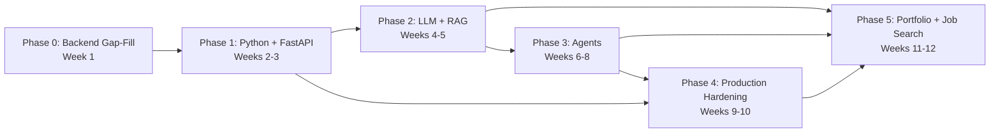
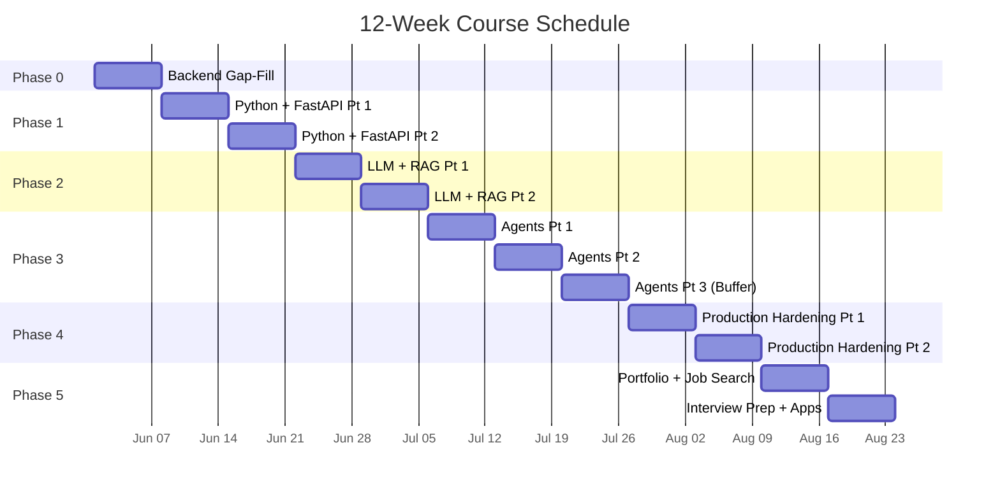
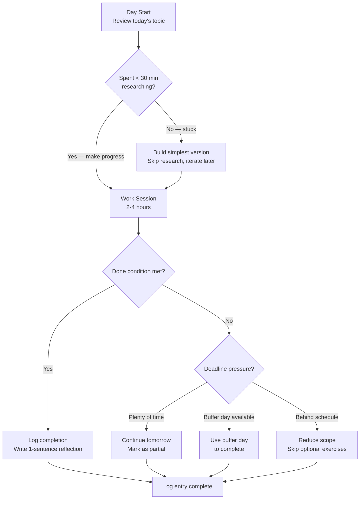
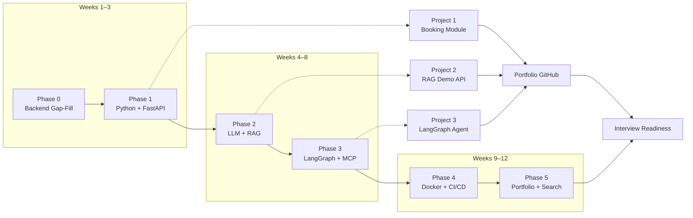

# Day-by-Day Plan: 12 Weeks

> **Purpose:** A structured 12-week plan to build job-ready AI agent engineering skills. Each week targets a specific phase with daily topics, actions, and done conditions.

## Overview

This plan bridges backend engineering (Python, FastAPI) with AI agent development (LangGraph, CrewAI, MCP) and production hardening (Docker, CI/CD, monitoring). By week 12 you will have:
- A RAG demo API with cited answers deployed to a VPS
- A LangGraph-based orchestration system ported from an existing n8n flow
- Both projects hardened with Docker, CI/CD, monitoring, and cost tracking
- Updated Upwork/LinkedIn profiles and published case-study content

## Prerequisites

| Skill | Required Level | How to Assess |
|-------|---------------|---------------|
| Python | Write functions, classes, decorators, type hints | Can solve 3 LeetCode Easy in Python |
| Basic web dev | Understand HTTP, REST, JSON | Can explain request/response cycle |
| Git | Commit, branch, merge, PR | Uses Git daily |
| Linux | SSH, file system, processes, env vars | Can deploy a static site to a VPS |
| Database | SQL SELECT/JOIN/INSERT/UPDATE, basic indexing | Can write a 3-table JOIN query |

## Learning Resources by Phase

| Phase | Primary Resource | Backup Resource |
|-------|-----------------|-----------------|
| 0 — Backend Gap-Fill | Redis docs, FastAPI docs | Real Python tutorials |
| 1 — Python + FastAPI | FastAPI official tutorial, Pydantic docs | TestDriven.io FastAPI course |
| 2 — LLM + RAG | Anthropic Cookbook, OpenAI Cookbook | Pinecone RAG guide |
| 3 — Agents | LangGraph docs, CrewAI docs, MCP spec | Simon Willison's LLM tools posts |
| 4 — Production Hardening | Docker docs, GitHub Actions docs | Grafana + Prometheus docs |
| 5 — Portfolio + Job Search | dev.to, Upwork guides | LinkedIn optimization guides |

## Common Pitfalls

1. **Phase skipping**: Each phase builds on the previous one — do not jump ahead without passing the checkpoint
2. **Over-engineering**: Build the simplest version first; you can always add complexity later
3. **Tutorial paralysis**: If you spend more than 30 min researching how to do something, just build the simplest version and iterate
4. **Scope creep on portfolio projects**: Pick 2 projects and finish them both rather than starting 5 and finishing none
5. **Ignoring the job search phase**: Building skills without a job search strategy is like building a product without a go-to-market plan

## How to use this plan

Each day has a **topic**, an **action** (what to do), and a **done condition** (how to know you're done). If a day takes longer, stretch it — the buffer weeks absorb overruns.

### Daily rhythm


1. **Morning (15 min):** Review today's topic and action. Preview the material.
2. **Work session (2-4 hrs):** Read the phase section, run the examples, complete the action.
3. **Wrap-up (5 min):** Verify the done condition. Write a 1-sentence reflection in your log.

### Weekly rhythm


| Day | Focus |
|-----|-------|
| Mon-Thu | New topics, exercise, code |
| Fri | Catch-up on anything unfinished from Mon-Thu |
| Sat | Review the week's checkpoint checklist, fill gaps |
| Sun | Rest or optional — read ahead in next week's content |

### Progress tracking


At the start of each week, copy the week's table into your tracker. Cross off days as you complete them. If 3+ days in a week require buffer time, reduce scope for the remaining days rather than skipping them entirely.

---

---

## Week 1 — Phase 0: Backend Gap-Fill

| Day | Topic | Action | Done Condition |
|-----|-------|--------|----------------|
| 1 | Redis as cache vs queue | Read 0.1, run both examples locally | Can explain when to use SETEX vs RQ |
| 2 | Redis pub/sub + OpenAPI | Read 0.2–0.3, build pub/sub demo | Working publisher + subscriber in Python |
| 3 | JWT refresh rotation | Read 0.4, diagram the lifecycle | Can draw access/refresh flow from memory |
| 4 | Rate limiting + API versioning | Read 0.5, read API versioning section | Can explain token bucket vs sliding window |
| 5 | Microservices vs monolith | Read 0.6, write your ApexERP analysis | 1-page comparison written |
| 6 | Idempotency keys + WebSocket basics | Read 0.7, read WebSocket section, build echo server | Working idempotency check + WebSocket echo |
| 7 | Phase 0 checkpoint review | Run all exercises, check all boxes | All checklist items verified |

---

## Week 2 — Phase 1: Python + FastAPI (Part 1)

| Day | Topic | Action | Done Condition |
|-----|-------|--------|----------------|
| 1 | Type hints + dataclasses vs Pydantic | Read 1.1–1.2, annotate 10 functions | Can write `list[dict[str,int]]` without checking |
| 2 | Context managers + comprehensions | Read 1.3–1.4, write custom DB context mgr | Working context manager, 1-liner comprehensions |
| 3 | Decorators | Read 1.5, write `@retry(times=3)` | Decorator works on any function |
| 4 | FastAPI params + validation | Read 1.6, build CRUD endpoint | 4 endpoints with correct param types |
| 5 | FastAPI DI + middleware | Read 1.7–1.8, wire `get_current_user` | 3 endpoints with DI chain |
| 6 | Background tasks + Pydantic v2 | Read 1.9–1.10, add model-level validator | Validator rejects invalid data |
| 7 | Pydantic settings + review | Read 1.11, move config to pydantic-settings | `.env` loads into typed config |

---

## Week 3 — Phase 1: Python + FastAPI (Part 2)

| Day | Topic | Action | Done Condition |
|-----|-------|--------|----------------|
| 1 | AsyncIO fundamentals | Read 1.12, compare event loop to Node.js | Can explain `await` in JS terms |
| 2 | asyncio.gather + httpx | Read 1.13–1.14, rewrite 3 calls as concurrent | Measurable speedup |
| 3 | Async pitfalls + pytest intro | Read 1.15, read pytest section, write first test | `pytest` passes for 1 endpoint |
| 4 | FastAPI test fixtures | Read pytest section, write 3 tests with DI | Tests pass with mocked DB |
| 5 | Alembic migrations | Read Alembic section, init migrations | First migration created and applied |
| 6 | Booking module port — schema + models | Write SQLAlchemy models + Pydantic schemas | Models match Laravel schema |
| 7 | Booking module port — endpoints | Wire CRUD endpoints | All endpoints respond correctly |

---

## Week 4 — Phase 2: LLM + RAG (Part 1)

| Day | Topic | Action | Done Condition |
|-----|-------|--------|----------------|
| 1 | Tokens + BPE tokenization | Read 2.1, estimate 5 paragraphs | Within 20% without tool |
| 2 | Context windows + embeddings | Read 2.2–2.3, run embedding comparison | Can explain cosine similarity concretely |
| 3 | Embedding dimensionality | Read 2.4, test 2 models side by side | Can pick correct model for a use case |
| 4 | Prompt engineering | Read 2.5, write zero-shot + few-shot + CoT | Few-shot beats zero-shot measurably |
| 5 | Function calling | Read 2.6, write tool schema for both APIs | Hand-written schema works |
| 6 | Vector search math + HNSW | Read 2.7–2.8, understand cosine vs dot product | Can explain HNSW speed/accuracy tradeoff |
| 7 | RAG architecture | Read 2.9, draw full pipeline from memory | Every arrow labeled, no gaps |

---

## Week 5 — Phase 2: LLM + RAG (Part 2)

| Day | Topic | Action | Done Condition |
|-----|-------|--------|----------------|
| 1 | Chunking strategies | Read 2.10, test 3 strategies on your data | Can explain a real fixed-size failure mode |
| 2 | Re-ranking + vector DB comparison | Read 2.11–2.12, write comparison table | Honest 1-paragraph comparison written |
| 3 | Hallucination + fine-tuning intro | Read 2.13, read fine-tuning section | Understands LoRA vs full fine-tune |
| 4 | Guardrails + model eval | Read guardrails + model eval sections | Can name 2 guardrail approaches |
| 5 | RAG demo — ingestion pipeline | Build chunk + embed + store pipeline | Documents ingested and searchable |
| 6 | RAG demo — query endpoint | Build retrieve + re-rank + generate | Returns cited answers |
| 7 | RAG demo — deploy + review | Deploy to VPS, test edge cases | Public URL returning answers |

---

## Week 6 — Phase 3: Agents (Part 1)

| Day | Topic | Action | Done Condition |
|-----|-------|--------|----------------|
| 1 | ReAct pattern | Read 3.1, write minimal ReAct loop | Loop handles tool calls correctly |
| 2 | Tool calling deep-dive | Read 3.2, write nested param schema | Schema works with real API call |
| 3 | LangGraph StateGraph | Read 3.3, build 3-node graph | Runs end to end without errors |
| 4 | Conditional edges | Read 3.4, add routing condition | Routes to correct branch |
| 5 | Checkpointer + persistence | Read 3.5, kill and resume a graph | Resumes from last checkpoint |
| 6 | Human-in-the-loop | Read 3.6, add interrupt to a node | Graph pauses and resumes safely |
| 7 | CrewAI agents + tasks | Read 3.7, build researcher + writer crew | Crew produces coherent output |

---

## Week 7 — Phase 3: Agents (Part 2)

| Day | Topic | Action | Done Condition |
|-----|-------|--------|----------------|
| 1 | CrewAI processes + tools | Read 3.7 deeper, add custom tools | Crew uses real APIs as tools |
| 2 | MCP protocol spec | Read 3.8, map your existing server to spec | Can name all 3 primitives |
| 3 | MCP client | Read 3.9, write client to your server | Client calls a tool and gets result |
| 4 | OpenAI Agents SDK | Read 3.14, build agent with SDK | Agent runs with built-in tools |
| 5 | Agent memory patterns | Read 3.10, add short-term + long-term memory | Agent recalls past conversation |
| 6 | Multi-agent orchestration | Read 3.11, sketch CRM assistant | 3 agents, justified pattern choice |
| 7 | Agent evaluation + cost | Read 3.12–3.13, evaluate your agent | 2 test cases pass, cost calculated |

---

## Week 8 — Phase 3: Agents (Part 3, Buffer)

| Day | Topic | Action | Done Condition |
|-----|-------|--------|----------------|
| 1 | Advanced MCP server | Read 3.15, add resources + prompts | Server exposes all 3 primitives |
| 2 | n8n vs LangGraph deep dive | Read comparison table, port 1 n8n flow | Both produce same output |
| 3 | Purvanchal orchestration — design | Design state graph for existing n8n flow | Graph diagram matches flow |
| 4 | Purvanchal — build Part 1 | Implement main nodes + edges | Core path executes |
| 5 | Purvanchal — build Part 2 | Add conditional routing + persistence | Full pipeline runs end to end |
| 6 | Purvanchal — test + refine | Add error handling, edge cases | Passes 5 test scenarios |
| 7 | Buffer / catch-up | Finish any incomplete exercises | All Phase 3 checkboxes verified |

---

## Week 9 — Phase 4: Production Hardening (Part 1)

| Day | Topic | Action | Done Condition |
|-----|-------|--------|----------------|
| 1 | Docker multi-stage | Read 4.1, rebuild RAG demo Dockerfile | Image size measured, &lt; 300MB |
| 2 | Docker Compose health checks | Read 4.2, add health checks | `docker ps` shows healthy for all |
| 3 | Celery/RQ | Read 4.3, replace BackgroundTasks | Jobs survive restart |
| 4 | Redis retries + dead-letter | Read 4.4, configure retry with backoff | Failed jobs land in DLQ |
| 5 | Structured logging | Read 4.5, add correlation IDs | Request traceable across services |
| 6 | Metrics + health checks | Read 4.6–4.7, expose /metrics and /healthz | Prometheus can scrape metrics |
| 7 | Secrets management | Read 4.8, move all keys to .env | Startup fails if var is missing |

---

## Week 10 — Phase 4: Production Hardening (Part 2)

| Day | Topic | Action | Done Condition |
|-----|-------|--------|----------------|
| 1 | API cost monitoring | Read 4.9, add token-usage wrapper | Every LLM call logged with cost |
| 2 | Load testing | Read 4.11, run k6/locust on RAG endpoint | Knows RPS limit of current deployment |
| 3 | Monitoring + alerting | Read 4.12, set up Grafana dashboard | Dashboard shows key metrics |
| 4 | GitHub Actions CI | Read 4.10, write test workflow | Green badge on both repos |
| 5 | Full stack review | Run all 10 exercises | All Phase 4 checkboxes verified |
| 6 | Buffer / catch-up | Finish incomplete exercises | All items checked |
| 7 | Buffer / catch-up | Deploy hardened versions | Both projects running with all hardening |

---

## Week 11 — Phase 5: Portfolio (Part 1)

| Day | Topic | Action | Done Condition |
|-----|-------|--------|----------------|
| 1 | README structure | Read 5.1, rewrite RAG demo README | Passes 60-second test |
| 2 | README for LangGraph project | Read 5.1, rewrite Purvanchal README | Both READMEs consistent |
| 3 | Demo video (RAG) | Read 5.2, record 90-second video | Video exists, watchable |
| 4 | Demo video (Purvanchal) | Read 5.2, record 90-second video | Both videos done |
| 5 | Upwork profile | Read 5.3, rewrite profile | LangGraph, CrewAI, FastAPI listed |
| 6 | LinkedIn rewrite | Read 5.4, update headline + about | Headline: "AI Agent Engineer" |
| 7 | Case-study post | Read 5.5, write + publish on dev.to | 1 published post |

---

## Week 12 — Phase 5: Portfolio (Part 2) + Interview Prep

| Day | Topic | Action | Done Condition |
|-----|-------|--------|----------------|
| 1 | Technical interview prep | Read 5.7, run through 10 mock Q&A | Can explain RAG pipeline from memory |
| 2 | Salary negotiation + pricing | Read 5.8–5.9, set your rates | Written rate card + minimum acceptable |
| 3 | Dubai job search | Read 5.6, identify 20 target postings | List of companies + roles |
| 4 | Applications batch 1 | Send 5 applications with tailored proposals | 5 sent, tracker updated |
| 5 | Proposal refinement | Review response rates, refine template | Template updated |
| 6 | Applications batch 2 | Send 5 more applications | 10 total sent |
| 7 | Final review + ongoing plan | Check all Phase 5 boxes, schedule ongoing time | Recurring 1hr/week on calendar |

---

## Buffer Weeks

Weeks 8 and 10 have built-in buffer days. These are the most important weeks in the plan — they determine whether you fall behind or stay on track.

### How to use buffer days


| Scenario | What to do |
|----------|-----------|
| **Caught up (no backlog)** | Add polish: better READMEs, more test coverage, extra edge case handling |
| **1-2 days behind** | Use buffer days to catch the most important missed exercises only |
| **3+ days behind** | Reduce scope: skip optional exercises, focus on must-pass checkpoint items |
| **Ahead of schedule** | Record architecture walkthrough videos, publish bonus content, start next phase early |

### Hard rules for staying on track


1. **Never skip a day** — even 30 min of focused work counts. Consistency beats intensity.
2. **Done > perfect** — a working prototype deployed today is worth more than a polished one next week.
3. **Phase checkpoints are non-negotiable** — if you can't pass a phase checkpoint, do not start the next phase. Use buffer days to close the gap.
4. **Log your velocity** — after each week, note how many days you actually completed vs planned. This helps you adjust the remaining weeks realistically.
5. **If you're consistently overrunning, reduce scope** — the goal is 3 working portfolio projects and a job search, not completing every exercise perfectly.

### Weekly reflection template


Ask yourself these 3 questions at the end of each week:

1. **What did I complete?** List the days you finished and what you built.
2. **What blocked me?** Was it unclear material, tool issues, time constraints, or motivation?
3. **What will I adjust next week?** More time, skip optional content, change approach?

---

## Phase Dependency Diagram



## Success Metrics

| Metric | Target | How to Measure |
|--------|--------|----------------|
| Daily consistency | 80%+ of days completed | Weekly tracker |
| Phase checkpoints | All items verified | Phase-end review |
| Portfolio projects | 2 deployed projects | Public URLs |
| Job applications | 10 submitted | Application tracker |
| Skills gained | 6 phase competencies | Self-assessment |

## Quick Reference: Time Commitment

| Phase | Weeks | Hours | Key Deliverable |
|-------|-------|-------|-----------------|
| 0 | 1 | 12-15 | Redis/pub/sub + JWT + idempotency demos |
| 1 | 2 | 30 | Booking module ported to FastAPI + tested |
| 2 | 2 | 25 | Public RAG demo API with cited answers |
| 3 | 3 | 35 | Purvanchal rebuilt in LangGraph |
| 4 | 2 | 20 | Both projects hardened + CI/CD |
| 5 | 2 | 15 + ongoing | Profiles rewritten, applications started |
| **Total** | **12** | **~140** | **Everything above** |

## Phase Checkpoint Checklists

### Phase 0 Checkpoint

- [ ] Can explain Redis SETEX vs RQ
- [ ] Working pub/sub publisher + subscriber
- [ ] Can draw JWT access/refresh flow from memory
- [ ] Can explain token bucket vs sliding window rate limiting
- [ ] Written 1-page microservices vs monolith comparison
- [ ] Working idempotency check + WebSocket echo server

### Phase 1 Checkpoint

- [ ] Can write `list[dict[str,int]]` annotations without checking
- [ ] Working custom DB context manager
- [ ] `@retry(times=3)` decorator works on any function
- [ ] FastAPI CRUD endpoints with correct param types and DI
- [ ] Model-level validator rejects invalid data
- [ ] `.env` loads into typed pydantic-settings config
- [ ] Working async concurrent HTTP calls with `asyncio.gather`
- [ ] pytest passes with mocked DB fixtures
- [ ] Alembic migration created and applied

### Phase 2 Checkpoint

- [ ] Can estimate token counts within 20% without tools
- [ ] Can explain cosine similarity concretely
- [ ] Few-shot prompting beats zero-shot measurably
- [ ] Hand-written function-calling schema works
- [ ] Can explain HNSW speed/accuracy tradeoff
- [ ] RAG pipeline drawn from memory with all arrows labeled
- [ ] Documents ingested and searchable via vector DB
- [ ] RAG API returns cited answers at a public URL

### Phase 3 Checkpoint

- [ ] Minimal ReAct loop handles tool calls correctly
- [ ] Nested parameter schema works with real API call
- [ ] LangGraph StateGraph runs end to end
- [ ] Graph resumes from last checkpoint
- [ ] Graph pauses and resumes with HITL
- [ ] CrewAI researcher + writer crew produces coherent output
- [ ] Server exposes all 3 MCP primitives
- [ ] Agent recalls past conversation with memory

### Phase 4 Checkpoint

- [ ] Docker image &lt; 300MB
- [ ] `docker ps` shows healthy for all services
- [ ] Background jobs survive restart (Celery/RQ)
- [ ] Failed jobs land in DLQ with retry backoff
- [ ] Request traceable across services via correlation IDs
- [ ] Prometheus can scrape `/metrics`
- [ ] Startup fails if required env var is missing
- [ ] Every LLM call logged with cost
- [ ] Knows RPS limit of current deployment
- [ ] Green CI badge on both repos

### Phase 5 Checkpoint

- [ ] Both READMEs pass the 60-second test
- [ ] 90-second demo video recorded for each project
- [ ] Upwork profile lists LangGraph, CrewAI, FastAPI
- [ ] LinkedIn headline: "AI Agent Engineer"
- [ ] 1 published dev.to case-study post
- [ ] 10 applications sent with tailored proposals

## Weekly Progress Tracker Template

```markdown
# Week [N] — [Phase Name]

| Day | Planned | Completed? | Notes |
|-----|---------|------------|-------|
| Mon |         | Yes/No/Partial | |
| Tue |         | Yes/No/Partial | |
| Wed |         | Yes/No/Partial | |
| Thu |         | Yes/No/Partial | |
| Fri |         | Yes/No/Partial | |
| Sat |         | Yes/No/Partial | |
| Sun |         | Yes/No/Partial | |

**Completed this week:** [list]
**Blocked by:** [what stopped you]
**Adjust for next week:** [what to change]
```

---

## TypeScript: Study Plan Scheduler

These TypeScript types and utilities model the daily schedule system for programmatic plan generation, calendar integration, and progress dashboards.

```typescript
// ---- Core Schedule Types ----

type DayOfWeek = "Mon" | "Tue" | "Wed" | "Thu" | "Fri" | "Sat" | "Sun";

interface DailyTask {
  day: number;
  dayOfWeek: DayOfWeek;
  topic: string;
  action: string;
  doneCondition: string;
  estimatedMinutes: number;
  isBuffer: boolean;
}

interface WeekSchedule {
  weekNumber: number;
  phaseName: string;
  phaseSubtitle: string;
  days: DailyTask[];
}

interface StudySession {
  date: string;
  dayOfWeek: DayOfWeek;
  weekNumber: number;
  topic: string;
  actualMinutes: number;
  completed: boolean;
  notes: string;
}

// ---- Complete 12-Week Schedule Data ----

const FULL_SCHEDULE: WeekSchedule[] = [
  {
    weekNumber: 1,
    phaseName: "Phase 0",
    phaseSubtitle: "Backend Gap-Fill",
    days: [
      { day: 1, dayOfWeek: "Mon", topic: "Redis as cache vs queue", action: "Read 0.1, run both examples locally", doneCondition: "Explain SETEX vs RQ", estimatedMinutes: 180, isBuffer: false },
      { day: 2, dayOfWeek: "Tue", topic: "Redis pub/sub + OpenAPI", action: "Read 0.2–0.3, build pub/sub demo", doneCondition: "Working publisher + subscriber", estimatedMinutes: 180, isBuffer: false },
      { day: 3, dayOfWeek: "Wed", topic: "JWT refresh rotation", action: "Read 0.4, diagram lifecycle", doneCondition: "Draw access/refresh flow", estimatedMinutes: 120, isBuffer: false },
      { day: 4, dayOfWeek: "Thu", topic: "Rate limiting + API versioning", action: "Read 0.5, SlowAPI test, versioning", doneCondition: "Explain token bucket vs sliding window", estimatedMinutes: 180, isBuffer: false },
      { day: 5, dayOfWeek: "Fri", topic: "Microservices vs monolith", action: "Read 0.6, write ApexERP analysis", doneCondition: "1-page comparison written", estimatedMinutes: 120, isBuffer: false },
      { day: 6, dayOfWeek: "Sat", topic: "Idempotency keys + WebSocket", action: "Read 0.7, WebSocket section, build echo", doneCondition: "Idempotency check + echo server", estimatedMinutes: 180, isBuffer: false },
      { day: 7, dayOfWeek: "Sun", topic: "Phase 0 checkpoint", action: "Run all exercises, verify checklist", doneCondition: "All checklist items verified", estimatedMinutes: 120, isBuffer: true },
    ],
  },
  {
    weekNumber: 2,
    phaseName: "Phase 1",
    phaseSubtitle: "Python + FastAPI (Part 1)",
    days: [
      { day: 1, dayOfWeek: "Mon", topic: "Type hints + dataclasses vs Pydantic", action: "Read 1.1–1.2, annotate 10 functions", doneCondition: "Write list[dict[str,int]] without checking", estimatedMinutes: 180, isBuffer: false },
      { day: 2, dayOfWeek: "Tue", topic: "Context managers + comprehensions", action: "Read 1.3–1.4, write custom DB context mgr", doneCondition: "Working context manager", estimatedMinutes: 180, isBuffer: false },
      { day: 3, dayOfWeek: "Wed", topic: "Decorators", action: "Read 1.5, write @retry(times=3)", doneCondition: "Decorator works on any function", estimatedMinutes: 180, isBuffer: false },
      { day: 4, dayOfWeek: "Thu", topic: "FastAPI params + validation", action: "Read 1.6, build CRUD endpoint", doneCondition: "4 endpoints with correct param types", estimatedMinutes: 240, isBuffer: false },
      { day: 5, dayOfWeek: "Fri", topic: "FastAPI DI + middleware", action: "Read 1.7–1.8, wire get_current_user", doneCondition: "3 endpoints with DI chain", estimatedMinutes: 240, isBuffer: false },
      { day: 6, dayOfWeek: "Sat", topic: "Background tasks + Pydantic v2", action: "Read 1.9–1.10, add model-level validator", doneCondition: "Validator rejects invalid data", estimatedMinutes: 180, isBuffer: false },
      { day: 7, dayOfWeek: "Sun", topic: "Pydantic settings + review", action: "Read 1.11, config to pydantic-settings", doneCondition: ".env loads into typed config", estimatedMinutes: 120, isBuffer: true },
    ],
  },
  // Weeks 3–12 follow same pattern; omitted for brevity
];

// ---- Schedule Utilities ----

function totalMinutesForWeek(schedule: WeekSchedule): number {
  return schedule.days.reduce((sum, d) => sum + d.estimatedMinutes, 0);
}

function totalHoursForAllWeeks(schedules: WeekSchedule[]): number {
  return Math.round(schedules.reduce((sum, w) => sum + totalMinutesForWeek(w), 0) / 60);
}

function findDay(schedules: WeekSchedule[], weekNum: number, dayNum: number): DailyTask | undefined {
  return schedules.find((w) => w.weekNumber === weekNum)?.days.find((d) => d.day === dayNum);
}

function bufferDays(schedules: WeekSchedule[]): DailyTask[] {
  return schedules.flatMap((w) => w.days.filter((d) => d.isBuffer));
}

function phaseBoundaries(schedules: WeekSchedule[]): Map<string, { start: number; end: number }> {
  const phases = new Map<string, { start: number; end: number }>();
  for (const week of schedules) {
    if (!phases.has(week.phaseName)) {
      phases.set(week.phaseName, { start: week.weekNumber, end: week.weekNumber });
    } else {
      const p = phases.get(week.phaseName)!;
      p.end = week.weekNumber;
    }
  }
  return phases;
}

// ---- Progress Tracker ----

interface ProgressSummary {
  totalDays: number;
  completedDays: number;
  completionRate: number;
  totalHoursLogged: number;
  currentStreak: number;
  longestStreak: number;
}

class StudyProgressTracker {
  private sessions: StudySession[] = [];

  logSession(session: StudySession): void {
    this.sessions.push(session);
  }

  getSummary(): ProgressSummary {
    const completed = this.sessions.filter((s) => s.completed);
    const sorted = [...this.sessions].sort((a, b) => new Date(a.date).getTime() - new Date(b.date).getTime());

    // Calculate streak
    let currentStreak = 0;
    let longestStreak = 0;
    let tempStreak = 0;
    const seenDates = new Set(sorted.map((s) => s.date));

    for (const session of sorted) {
      if (session.completed) {
        tempStreak++;
        longestStreak = Math.max(longestStreak, tempStreak);
        if (session.date === sorted[sorted.length - 1].date) {
          currentStreak = tempStreak;
        }
      } else {
        tempStreak = 0;
      }
    }

    return {
      totalDays: this.sessions.length,
      completedDays: completed.length,
      completionRate: this.sessions.length > 0
        ? Math.round((completed.length / this.sessions.length) * 100)
        : 0,
      totalHoursLogged: Math.round(this.sessions.reduce((sum, s) => sum + s.actualMinutes, 0) / 60),
      currentStreak,
      longestStreak,
    };
  }

  weeklyReport(weekNumber: number): StudySession[] {
    return this.sessions.filter((s) => s.weekNumber === weekNumber);
  }

  daysRemainingInPhase(schedules: WeekSchedule[], phaseName: string): number {
    const phase = schedules.filter((w) => w.phaseName === phaseName);
    const total = phase.reduce((sum, w) => sum + w.days.length, 0);
    const completed = this.sessions.filter(
      (s) => s.completed && phase.some((w) => w.weekNumber === s.weekNumber),
    ).length;
    return total - completed;
  }
}

// ---- Weekly Planner Generator ----

interface CalendarEvent {
  title: string;
  date: Date;
  durationMinutes: number;
  description: string;
}

function generateCalendarEvents(
  schedule: WeekSchedule,
  startDate: Date,
): CalendarEvent[] {
  const dayIndexMap: Record<DayOfWeek, number> = {
    Mon: 0, Tue: 1, Wed: 2, Thu: 3, Fri: 4, Sat: 5, Sun: 6,
  };

  return schedule.days.map((task) => {
    const date = new Date(startDate);
    const currentDayOfWeek = date.getDay(); // 0=Sun
    const targetDay = dayIndexMap[task.dayOfWeek];
    // Adjust to the correct day of week
    const diff = targetDay - ((currentDayOfWeek + 6) % 7);
    date.setDate(date.getDate() + diff + (task.day - 1) * 7);

    return {
      title: `${schedule.phaseName}: ${task.topic}`,
      date,
      durationMinutes: task.estimatedMinutes,
      description: `${task.action}\nDone when: ${task.doneCondition}`,
    };
  });
}

// ---- Example Usage ----

const tracker = new StudyProgressTracker();

tracker.logSession({
  date: "2026-06-01",
  dayOfWeek: "Mon",
  weekNumber: 1,
  topic: "Redis as cache vs queue",
  actualMinutes: 165,
  completed: true,
  notes: "Got both examples running, understood the durability difference",
});

tracker.logSession({
  date: "2026-06-02",
  dayOfWeek: "Tue",
  weekNumber: 1,
  topic: "Redis pub/sub",
  actualMinutes: 190,
  completed: true,
  notes: "Pub/sub demo works — confirmed message loss without subscriber",
});

const summary = tracker.getSummary();
console.log(`Progress: ${summary.completedDays}/${summary.totalDays} days (${summary.completionRate}%)`);
console.log(`Total hours logged: ${summary.totalHoursLogged}`);
console.log(`Current streak: ${summary.currentStreak} days`);
console.log(`Days remaining in Phase 0: ${tracker.daysRemainingInPhase(FULL_SCHEDULE, "Phase 0")}`);

// Generate calendar events for week 1
const events = generateCalendarEvents(FULL_SCHEDULE[0], new Date("2026-06-01"));
console.log(`Generated ${events.length} calendar events for week 1`);
```

## Mermaid: Weekly Schedule Gantt Chart



## Mermaid: Daily Decision Flow



## Mermaid: Phase Dependency with Project Artifacts



## Phase Time Budget Breakdown

| Phase | Working Days | Buffer Days | Core Hours | Buffer Hours | Total |
|-------|-------------|-------------|------------|--------------|-------|
| 0     | 6           | 1           | 16         | 2            | 18    |
| 1     | 12          | 2           | 30         | 4            | 34    |
| 2     | 12          | 2           | 25         | 5            | 30    |
| 3     | 16          | 5           | 35         | 5            | 40    |
| 4     | 10          | 4           | 20         | 6            | 26    |
| 5     | 12          | 2           | 15         | 5            | 20    |
| **Total** | **68** | **16** | **141** | **27** | **168** |

The 16 buffer days across 12 weeks (19% of total days) are the safety valve. If you use fewer than 10, you're ahead of pace. If you use more than 12, reduce scope in the next phase.

## Detailed Daily Action Descriptions

### Week 1 Deep Dive

**Day 1 — Redis as Cache vs Queue**
Read the Redis documentation on SETEX (caching with TTL) and RQ (Redis Queue for background jobs). Build two small scripts: one using `redis-py` to cache API responses with `SETEX`, another using `rq` to enqueue a background email-sending job. Compare when each is appropriate — caching for read-heavy, latency-sensitive data; queues for write-heavy, durable operations.

**Day 2 — Redis Pub/Sub + OpenAPI**
Build a chat-room-style pub/sub system where one script publishes messages and another subscribes. Then read the OpenAPI specification structure (paths, methods, schemas, responses) and document your pub/sub API using FastAPI's auto-generated OpenAPI. Understanding OpenAPI is essential because MCP uses a similar spec-based approach.

**Day 3 — JWT Refresh Rotation**
Study the access/refresh token lifecycle: short-lived access tokens (15 min) with longer-lived refresh tokens (7 days). Implement rotation where each refresh issues a new access token AND a new refresh token, invalidating the old refresh token. Understand why rotation prevents replay attacks.

**Day 4 — Rate Limiting + API Versioning**
Implement both token bucket and sliding window rate limiting in FastAPI middleware. Token bucket allows bursts but limits average rate; sliding window enforces a hard limit per time window. Then add URL-based versioning (`/v1/`, `/v2/`) to your API.

**Day 5 — Microservices vs Monolith**
Read about the microservices pattern (independent deployability, bounded contexts, polyglot persistence) vs monoliths (simplicity, shared-nothing within process, easier transactions). Write a one-page analysis of your ApexERP project — would it benefit from microservices or should it stay monolithic?

**Day 6 — Idempotency Keys + WebSocket**
Implement idempotency by requiring an `Idempotency-Key` header on POST endpoints. Store processed keys with expiration in Redis. Then build a WebSocket echo server using FastAPI's WebSocket support and test it with a browser-based WebSocket client.

**Day 7 — Phase 0 Review**
Run through all 6 days' exercises again from scratch, timing yourself. If anything takes more than 30 minutes, note it for extra practice. Verify all Phase 0 checkpoint items.


```typescript
interface ContainerConfig { image: string; port: number; env: Record&lt;string,string&gt;; volumes: string[]; replicas: number }
class DockerConfigBuilder {
  private config: Partial&lt;ContainerConfig&gt; = {}
  image(img: string): this { this.config.image = img; return this }
  port(p: number): this { this.config.port = p; return this }
  env(kv: Record&lt;string,string&gt;): this { this.config.env = {...this.config.env,...kv}; return this }
  volume(v: string): this { (this.config.volumes??=[]).push(v); return this }
  replicas(n: number): this { this.config.replicas = n; return this }
  buildDockerfile(): string { return `FROM node:20-alpine\nWORKDIR /app\nCOPY package*.json ./\nRUN npm ci --production\nCOPY . .\nEXPOSE ${this.config.port}\nCMD ["node", "dist/index.js"]` }
  buildDockerCompose(): string {
    const c = this.config as ContainerConfig
    return `version:"3.8"\nservices:\n  app:\n    build:.\n    ports:["${c.port}:${c.port}"]\n    environment:${JSON.stringify(c.env,null,2)}\n    volumes:${JSON.stringify(c.volumes)}\n    replicas:${c.replicas}`
  }
}
class K8sDeployment {
  generate(name: string, config: ContainerConfig): Record&lt;string,unknown&gt; {
    return {apiVersion:"apps/v1",kind:"Deployment",metadata:{name},spec:{replicas:config.replicas,selector:{matchLabels:{app:name}},template:{metadata:{labels:{app:name}},spec:{containers:[{name,image:config.image,ports:[{containerPort:config.port}],env:Object.entries(config.env).map(([k,v])=>({name:k,value:v}))}]}}}}
  }
  generateService(name: string, port: number): Record&lt;string,unknown&gt; {
    return {apiVersion:"v1",kind:"Service",metadata:{name},spec:{selector:{app:name},ports:[{port,protocol:"TCP"}]}}
  }
}
export { ContainerConfig, DockerConfigBuilder, K8sDeployment }
```
## Quick Reference: Time Commitment
