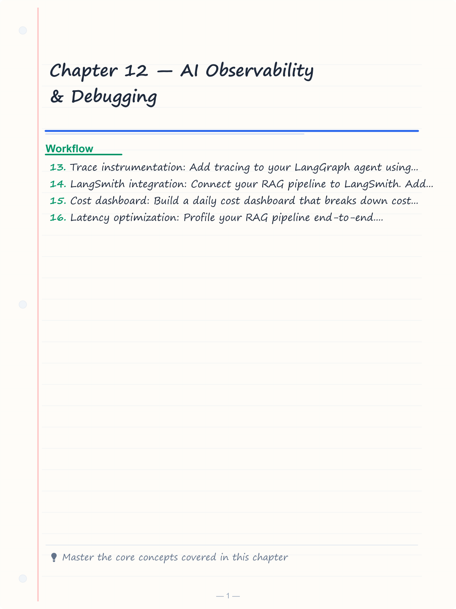
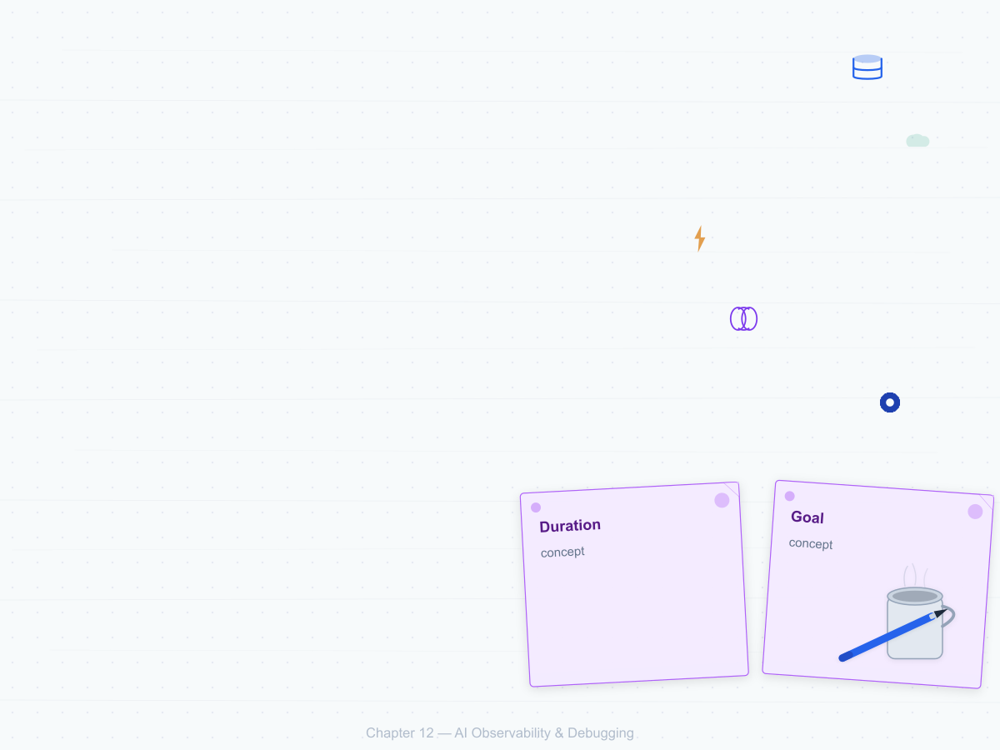
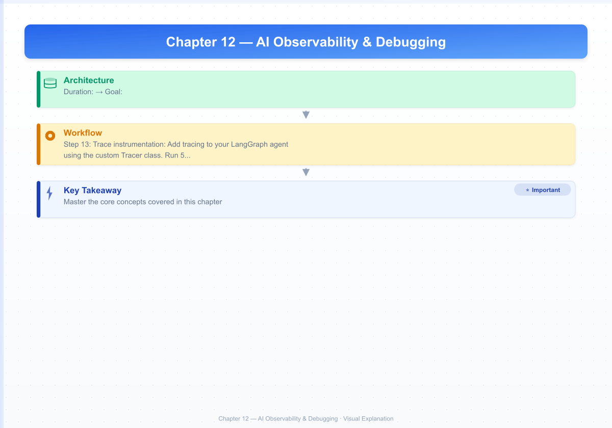

# Chapter 12 — AI Observability & Debugging

**Duration:** 1.5 weeks, ~18 hours
**Goal:** Build comprehensive observability for your AI systems — tracing every agent step, tracking costs, monitoring quality metrics, and debugging production failures.

---


<!-- Image Gallery -->
<section class="lesson-visuals" aria-label="Visual learning resources">
  <header><span>VISUAL LEARNING</span><h2>See it. Review it. Remember it.</h2></header>
  <a class="lesson-visual-card" href="../../assets/images/lessons/ai-agent-engineer/12-ai-observability-debugging/handwritten-notes.png" target="_blank" rel="noopener">
    
    <span><strong>Handwritten notes</strong>Condensed notes for deliberate review.</span>
  </a>
  <a class="lesson-visual-card" href="../../assets/images/lessons/ai-agent-engineer/12-ai-observability-debugging/sticky-notes.png" target="_blank" rel="noopener">
    
    <span><strong>Sticky-note revision</strong>Fast recall prompts for revision.</span>
  </a>
  <a class="lesson-visual-card" href="../../assets/images/lessons/ai-agent-engineer/12-ai-observability-debugging/visual-explanation.png" target="_blank" rel="noopener">
    
    <span><strong>Visual concept guide</strong>A connected explanation of the key ideas.</span>
  </a>
</section>
<!-- End Image Gallery -->

## Topic Table

| # | Subtopic | Hours | Done checkpoint |
|---|----------|-------|-----------------|
| 1 | Agent tracing fundamentals | 2 | Trace a single agent request end-to-end with spans and metadata |
| 2 | LangSmith integration | 2 | Connect your LangGraph agent to LangSmith with custom metrics |
| 3 | OpenTelemetry for AI workloads | 2 | Instrument a FastAPI RAG endpoint with OpenTelemetry spans |
| 4 | Token tracking & cost attribution | 1.5 | Build a per-request cost tracker that attributes cost to user, model, and feature |
| 5 | Latency profiling & optimization | 2 | Profile a RAG request end-to-end and identify the top-3 bottlenecks |
| 6 | Custom quality metrics | 2 | Implement and track faithfulness, relevance, and hallucination rate in production |
| 7 | Logging strategies for AI | 1.5 | Design structured logging for agent decisions, tool calls, and errors |
| 8 | Alerting & anomaly detection | 2 | Set up alerts for cost spikes, latency regressions, and quality drops |
| 9 | Debugging agent failures | 2 | Systematic approach to debugging failing agent runs |
| 10 | Drift detection | 1.5 | Detect when model behavior or data distribution changes over time |

---

## 12.1 Agent Tracing Fundamentals

### Custom Trace Implementation


```python
import time
import uuid
import json
from datetime import datetime
from contextlib import contextmanager
from dataclasses import dataclass, field
from typing import Any

@dataclass
class Span:
    name: str
    trace_id: str
    parent_id: str | None
    span_id: str
    start_time: float
    end_time: float | None = None
    attributes: dict = field(default_factory=dict)
    events: list[dict] = field(default_factory=list)
    status: str = "ok"
    error: str | None = None

class Tracer:
    """Lightweight distributed tracer for agent systems."""

    def __init__(self, service_name: str = "ai-agent"):
        self.service_name = service_name
        self.spans: list[Span] = []
        self._current_span: Span | None = None

    def start_trace(self, name: str, attributes: dict | None = None) -> str:
        """Start a new trace and return trace_id."""
        trace_id = str(uuid.uuid4())[:16]
        span = Span(
            name=name,
            trace_id=trace_id,
            parent_id=None,
            span_id=str(uuid.uuid4())[:16],
            start_time=time.time(),
            attributes=attributes or {},
        )
        self._current_span = span
        self.spans.append(span)
        return trace_id

    @contextmanager
    def span(self, name: str, attributes: dict | None = None):
        """Create a child span under the current trace."""
        parent_id = self._current_span.span_id if self._current_span else None
        span = Span(
            name=name,
            trace_id=self._current_span.trace_id if self._current_span else str(uuid.uuid4())[:16],
            parent_id=parent_id,
            span_id=str(uuid.uuid4())[:16],
            start_time=time.time(),
            attributes=attributes or {},
        )
        previous = self._current_span
        self._current_span = span
        self.spans.append(span)
        try:
            yield span
        except Exception as e:
            span.status = "error"
            span.error = str(e)
            raise
        finally:
            span.end_time = time.time()
            span.attributes["duration_ms"] = round((span.end_time - span.start_time) * 1000, 2)
            self._current_span = previous

    def add_event(self, name: str, attributes: dict | None = None):
        if self._current_span:
            self._current_span.events.append({
                "name": name,
                "timestamp": datetime.now().isoformat(),
                "attributes": attributes or {}
            })

    def export(self) -> dict:
        """Export all spans as a trace report."""
        return {
            "service": self.service_name,
            "spans": [
                {
                    "name": s.name,
                    "trace_id": s.trace_id,
                    "parent_id": s.parent_id,
                    "span_id": s.span_id,
                    "duration_ms": round((s.end_time - s.start_time) * 1000, 2) if s.end_time else None,
                    "status": s.status,
                    "attributes": s.attributes,
                    "events": s.events,
                    "error": s.error,
                }
                for s in self.spans
            ]
        }

# Usage
tracer = Tracer("rag-pipeline")

trace_id = tracer.start_trace("rag_request", {"user_id": "user_123", "query_length": 45})

with tracer.span("embedding"):
    tracer.add_event("api_call_start", {"model": "text-embedding-3-small"})
    time.sleep(0.1)  # Simulate API call
    tracer.add_event("api_call_complete", {"tokens": 112})

with tracer.span("vector_search"):
    tracer.add_event("query_vector_db", {"collection": "docs", "top_k": 5})
    time.sleep(0.05)
    tracer.add_event("results", {"result_count": 5})

with tracer.span("generation"):
    tracer.add_event("llm_start", {"model": "gpt-4o-mini", "prompt_tokens": 4120})
    time.sleep(0.8)
    tracer.add_event("llm_complete", {"completion_tokens": 234})

trace_report = tracer.export()
print(f"Total duration: {sum(s['duration_ms'] for s in trace_report['spans'] if s['parent_id']):.0f}ms")
for span in trace_report["spans"]:
    print(f"  {span['name']}: {span['duration_ms']}ms [{span['status']}]")
```

---

## 12.2 LangSmith Integration

```python
# Requires: pip install langsmith langgraph
import os
from langsmith import Client
from langsmith.run_helpers import traceable
from langgraph.graph import StateGraph

os.environ["LANGSMITH_TRACING"] = "true"
os.environ["LANGSMITH_ENDPOINT"] = "https://api.smith.langchain.com"
os.environ["LANGSMITH_API_KEY"] = "YOUR_LANGSMITH_API_KEY"
os.environ["LANGSMITH_PROJECT"] = "ai-agent-engineer-course"

langsmith_client = Client()

# Trace individual functions
@traceable(name="embed_query", run_type="embedding")
def traceable_embed(text: str) -> list[float]:
    response = client.embeddings.create(input=text, model="text-embedding-3-small")
    return response.data[0].embedding

@traceable(name="vector_search", run_type="retriever")
def traceable_search(embedding: list[float], top_k: int = 5) -> list[str]:
    results = chroma_collection.query(query_embeddings=[embedding], n_results=top_k)
    return results["documents"][0]

@traceable(name="generate_answer", run_type="llm")
def traceable_generate(query: str, context: str) -> str:
    response = client.chat.completions.create(
        model="gpt-4o-mini",
        messages=[
            {"role": "system", "content": "Answer using the context."},
            {"role": "user", "content": f"Context:\n{context}\n\nQuery: {query}"}
        ]
    )
    return response.choices[0].message.content

# Full traced RAG pipeline
@traceable(name="rag_pipeline", run_type="chain")
def traced_rag(query: str) -> str:
    embedding = traceable_embed(query)
    docs = traceable_search(embedding)
    context = "\n\n".join(docs)
    answer = traceable_generate(query, context)
    return answer

# Add custom metrics to LangSmith
@traceable(name="rag_with_metrics", run_type="chain")
def traced_rag_with_metrics(query: str) -> dict:
    t0 = time.time()

    embedding = traceable_embed(query)
    docs = traceable_search(embedding)
    context = "\n\n".join(docs)

    t1 = time.time()

    answer = traceable_generate(query, context)

    t2 = time.time()

    return {
        "answer": answer,
        "metrics": {
            "retrieval_latency_ms": round((t1 - t0) * 1000, 2),
            "generation_latency_ms": round((t2 - t1) * 1000, 2),
            "total_latency_ms": round((t2 - t0) * 1000, 2),
            "chunks_retrieved": len(docs),
        }
    }
```

---

## 12.3 OpenTelemetry for AI Workloads

```python
# Requires: pip install opentelemetry-api opentelemetry-sdk opentelemetry-instrumentation-fastapi
from opentelemetry import trace
from opentelemetry.sdk.trace import TracerProvider
from opentelemetry.sdk.trace.export import BatchSpanProcessor
from opentelemetry.exporter.otlp.proto.grpc.trace_exporter import OTLPSpanExporter
from opentelemetry.instrumentation.fastapi import FastAPIInstrumentor
from opentelemetry.sdk.resources import Resource
from fastapi import FastAPI, Request
import time

# Setup OpenTelemetry
resource = Resource.create({
    "service.name": "rag-api",
    "service.version": "1.0.0",
    "deployment.environment": "production"
})

provider = TracerProvider(resource=resource)
processor = BatchSpanProcessor(OTLPSpanExporter(endpoint="http://localhost:4317"))
provider.add_span_processor(processor)
trace.set_tracer_provider(provider)

tracer = trace.get_tracer(__name__)

# FastAPI app with OpenTelemetry instrumentation
app = FastAPI()
FastAPIInstrumentor.instrument_app(app)

# Custom span for RAG pipeline
@app.post("/rag/query")
async def rag_query(request: Request):
    body = await request.json()
    query = body["query"]

    with tracer.start_as_current_span("rag_pipeline") as span:
        span.set_attribute("query.length", len(query))
        span.set_attribute("query.truncated", query[:100])

        # Embedding step
        with tracer.start_as_current_span("embedding") as embed_span:
            t0 = time.time()
            q_vec = client.embeddings.create(input=query, model="text-embedding-3-small").data[0].embedding
            embed_span.set_attribute("latency_ms", round((time.time() - t0) * 1000, 2))
            embed_span.set_attribute("model", "text-embedding-3-small")

        # Search step
        with tracer.start_as_current_span("vector_search") as search_span:
            t0 = time.time()
            results = chroma_collection.query(query_embeddings=[q_vec], n_results=5)
            search_span.set_attribute("latency_ms", round((time.time() - t0) * 1000, 2))
            search_span.set_attribute("results_count", len(results["documents"][0]))

        # Generation step
        with tracer.start_as_current_span("generation") as gen_span:
            context = "\n\n".join(results["documents"][0])
            t0 = time.time()
            response = client.chat.completions.create(
                model="gpt-4o-mini",
                messages=[
                    {"role": "system", "content": "Answer using context."},
                    {"role": "user", "content": f"Context:\n{context}\n\nQuery: {query}"}
                ]
            )
            gen_span.set_attribute("latency_ms", round((time.time() - t0) * 1000, 2))
            gen_span.set_attribute("prompt_tokens", response.usage.prompt_tokens)
            gen_span.set_attribute("completion_tokens", response.usage.completion_tokens)

    return {"answer": response.choices[0].message.content}
```

---

## 12.4 Token Tracking & Cost Attribution

```python
from datetime import datetime, timedelta
from collections import defaultdict

# Pricing model
MODEL_PRICING = {
    "text-embedding-3-small": {"input": 0.02 / 1_000_000},
    "text-embedding-3-large": {"input": 0.13 / 1_000_000},
    "gpt-4o-mini": {"input": 0.15 / 1_000_000, "output": 0.60 / 1_000_000},
    "gpt-4o": {"input": 2.50 / 1_000_000, "output": 10.00 / 1_000_000},
    "claude-3-haiku": {"input": 0.25 / 1_000_000, "output": 1.25 / 1_000_000},
    "claude-3-sonnet": {"input": 3.00 / 1_000_000, "output": 15.00 / 1_000_000},
}

class CostTracker:
    """Track token usage and cost across models, users, and features."""

    def __init__(self):
        self.entries: list[dict] = []
        self.daily_budget: dict[str, float] = {}

    def record(
        self,
        model: str,
        prompt_tokens: int,
        completion_tokens: int,
        user_id: str = "anonymous",
        feature: str = "general",
        metadata: dict | None = None,
    ):
        pricing = MODEL_PRICING.get(model, {"input": 0.001, "output": 0.002})
        input_cost = prompt_tokens * pricing["input"]
        output_cost = completion_tokens * pricing["output"]
        total_cost = input_cost + output_cost

        entry = {
            "timestamp": datetime.now().isoformat(),
            "model": model,
            "prompt_tokens": prompt_tokens,
            "completion_tokens": completion_tokens,
            "total_tokens": prompt_tokens + completion_tokens,
            "input_cost": round(input_cost, 6),
            "output_cost": round(output_cost, 6),
            "total_cost": round(total_cost, 6),
            "user_id": user_id,
            "feature": feature,
            "metadata": metadata or {},
        }
        self.entries.append(entry)
        return entry

    def get_daily_cost(self, date: str | None = None) -> float:
        if date is None:
            date = datetime.now().strftime("%Y-%m-%d")
        return sum(e["total_cost"] for e in self.entries if e["timestamp"].startswith(date))

    def get_user_cost(self, user_id: str, days: int = 7) -> float:
        cutoff = (datetime.now() - timedelta(days=days)).isoformat()
        return sum(
            e["total_cost"] for e in self.entries
            if e["user_id"] == user_id and e["timestamp"] > cutoff
        )

    def get_feature_breakdown(self, days: int = 7) -> dict:
        cutoff = (datetime.now() - timedelta(days=days)).isoformat()
        features = defaultdict(float)
        for e in self.entries:
            if e["timestamp"] > cutoff:
                features[e["feature"]] += e["total_cost"]
        return dict(features)

    def get_model_breakdown(self, days: int = 7) -> dict:
        cutoff = (datetime.now() - timedelta(days=days)).isoformat()
        models = defaultdict(lambda: {"cost": 0.0, "calls": 0, "tokens": 0})
        for e in self.entries:
            if e["timestamp"] > cutoff:
                models[e["model"]]["cost"] += e["total_cost"]
                models[e["model"]]["calls"] += 1
                models[e["model"]]["tokens"] += e["total_tokens"]
        return {k: {**v, "cost": round(v["cost"], 4)} for k, v in models.items()}

    def set_daily_budget(self, feature: str, budget_usd: float):
        self.daily_budget[feature] = budget_usd

    def check_budget(self) -> list[str]:
        """Check if any feature has exceeded its daily budget."""
        alerts = []
        for feature, budget in self.daily_budget.items():
            cost = sum(
                e["total_cost"] for e in self.entries
                if e["feature"] == feature and e["timestamp"].startswith(datetime.now().strftime("%Y-%m-%d"))
            )
            if cost >= budget:
                alerts.append(f"Feature '{feature}' exceeded daily budget: ${cost:.4f} / ${budget:.4f}")
        return alerts

# Usage
tracker = CostTracker()

# Record a RAG request
tracker.record(
    model="text-embedding-3-small",
    prompt_tokens=112,
    completion_tokens=0,
    user_id="user_123",
    feature="rag_embedding",
)

tracker.record(
    model="gpt-4o-mini",
    prompt_tokens=4120,
    completion_tokens=234,
    user_id="user_123",
    feature="rag_generation",
)

# Check costs
print(f"Today's cost: ${tracker.get_daily_cost():.4f}")
print(f"User cost (7d): ${tracker.get_user_cost('user_123'):.4f}")
print(f"Feature breakdown: {tracker.get_feature_breakdown()}")
print(f"Model breakdown: {json.dumps(tracker.get_model_breakdown(), indent=2)}")
```

---

## 12.5 Latency Profiling

```python
import cProfile
import pstats
import io
from functools import wraps
from time import perf_counter

class LatencyProfiler:
    """Profile and optimize latency in AI pipelines."""

    def __init__(self):
        self.profiles: list[dict] = []

    def profile(self, name: str = "unnamed"):
        """Decorator that profiles a function's execution."""
        def decorator(func):
            @wraps(func)
            def wrapper(*args, **kwargs):
                t0 = perf_counter()
                result = func(*args, **kwargs)
                elapsed = (perf_counter() - t0) * 1000

                self.profiles.append({
                    "name": name or func.__name__,
                    "function": func.__name__,
                    "duration_ms": round(elapsed, 2),
                    "args": str(args)[:50],
                    "timestamp": datetime.now().isoformat()
                })
                return result
            return wrapper
        return decorator

    def report(self, sort_by: str = "duration_ms", top_n: int = 10) -> dict:
        """Generate profiling report."""
        sorted_profiles = sorted(self.profiles, key=lambda x: x[sort_by], reverse=True)[:top_n]
        total = sum(p["duration_ms"] for p in sorted_profiles)
        avg = total / len(sorted_profiles) if sorted_profiles else 0

        return {
            "total_calls": len(self.profiles),
            "total_time_ms": round(total, 2),
            "average_ms": round(avg, 2),
            "slowest": [p for p in sorted_profiles[:5]],
            "recommendations": self._generate_recommendations(sorted_profiles)
        }

    def _generate_recommendations(self, profiles: list[dict]) -> list[str]:
        recs = []
        for p in profiles:
            if p["duration_ms"] > 1000:
                recs.append(f"Hotspot: {p['name']} ({p['duration_ms']}ms) — consider caching or async")
            elif p["duration_ms"] > 500:
                recs.append(f"Warning: {p['name']} ({p['duration_ms']}ms) — review for optimization")
        return recs

# Decorator for profiling FastAPI endpoints
profiler = LatencyProfiler()

@profiler.profile("embedding")
def profile_embed(text: str) -> list[float]:
    return client.embeddings.create(input=text, model="text-embedding-3-small").data[0].embedding

@profiler.profile("vector_search")
def profile_search(embedding: list[float]) -> list[str]:
    results = chroma_collection.query(query_embeddings=[embedding], n_results=5)
    return results["documents"][0]

# Run a profiled request
result = profile_embed("What are lease terms in Dubai?")
docs = profile_search(result)

# Generate report
report = profiler.report()
print(f"Total: {report['total_time_ms']}ms over {report['total_calls']} calls")
for rec in report["recommendations"]:
    print(f"  ? {rec}")
```

---

## 12.6 Custom Quality Metrics

### Production Quality Monitor


```python
import numpy as np
from datetime import datetime, timedelta

class QualityMonitor:
    """Track production quality metrics for RAG and agent systems."""

    def __init__(self, window_hours: int = 24):
        self.window = timedelta(hours=window_hours)
        self.scores: list[dict] = []

    def record(
        self,
        metric_name: str,
        value: float,
        weight: float = 1.0,
        metadata: dict | None = None,
    ):
        self.scores.append({
            "metric": metric_name,
            "value": value,
            "weight": weight,
            "timestamp": datetime.now(),
            "metadata": metadata or {},
        })

    def get_current(self, metric_name: str) -> dict:
        """Get current value and statistics for a metric."""
        cutoff = datetime.now() - self.window
        entries = [s for s in self.scores if s["metric"] == metric_name and s["timestamp"] > cutoff]
        values = [s["value"] for s in entries]

        if not values:
            return {"metric": metric_name, "status": "no_data"}

        return {
            "metric": metric_name,
            "current": round(values[-1], 3),
            "mean": round(np.mean(values), 3),
            "median": round(np.median(values), 3),
            "p95": round(np.percentile(values, 95), 3),
            "trend": "improving" if len(values) > 5 and values[-1] > np.mean(values[-5:]) else "degrading",
            "samples": len(values),
            "status": "healthy" if np.mean(values) >= 0.8 else "degraded" if np.mean(values) >= 0.5 else "critical"
        }

    def overall_health(self) -> dict:
        """Aggregate all metrics into an overall health score."""
        cutoff = datetime.now() - self.window
        metrics = set(s["metric"] for s in self.scores if s["timestamp"] > cutoff)

        scores = {}
        for m in metrics:
            stats = self.get_current(m)
            if stats["status"] != "no_data":
                scores[m] = stats["status"]

        healthy = sum(1 for s in scores.values() if s == "healthy")
        degraded = sum(1 for s in scores.values() if s == "degraded")
        critical = sum(1 for s in scores.values() if s == "critical")

        return {
            "overall": "healthy" if critical == 0 and degraded < len(scores) * 0.3 else "degraded" if critical < 3 else "critical",
            "metrics_count": len(scores),
            "healthy": healthy,
            "degraded": degraded,
            "critical": critical,
            "last_updated": datetime.now().isoformat(),
        }

# Define standard metrics
STD_METRICS = {
    "faithfulness": {"description": "Fraction of claims supported by context", "threshold": 0.85},
    "context_relevance": {"description": "Average relevance of retrieved chunks", "threshold": 0.7},
    "answer_completeness": {"description": "Query coverage score", "threshold": 0.75},
    "hallucination_rate": {"description": "Fraction of hallucinated claims", "threshold": 0.1, "lower_is_better": True},
    "response_latency_p50": {"description": "Median response time (ms)", "threshold": 2000, "lower_is_better": True},
    "response_latency_p95": {"description": "95th percentile response time (ms)", "threshold": 5000, "lower_is_better": True},
    "cache_hit_rate": {"description": "Fraction of queries served from cache", "threshold": 0.2},
    "user_feedback_score": {"description": "Thumbs up ratio", "threshold": 0.85},
}

# Usage
monitor = QualityMonitor(window_hours=24)
monitor.record("faithfulness", 0.92, metadata={"model": "gpt-4o-mini", "dataset": "eval_v2"})
monitor.record("hallucination_rate", 0.05, weight=2.0, metadata={"model": "gpt-4o-mini"})
monitor.record("response_latency_p50", 1450, metadata={"model": "gpt-4o-mini"})
monitor.record("cache_hit_rate", 0.35, metadata={"cache_type": "semantic"})
monitor.record("user_feedback_score", 0.88, metadata={"n_responses": 150})

print(json.dumps(monitor.overall_health(), indent=2))
```

---

## 12.7 Logging Strategies for AI

```python
import structlog
import json
from datetime import datetime

# Structured logging setup
structlog.configure(
    processors=[
        structlog.stdlib.add_log_level,
        structlog.processors.TimeStamper(fmt="iso"),
        structlog.processors.JSONRenderer(),
    ],
    context_class=dict,
    cache_logger_on_first_use=True,
)

logger = structlog.get_logger()

# Agent-specific logging
class AgentLogger:
    """Structured logger for agent decisions and tool calls."""

    def __init__(self, agent_name: str, session_id: str):
        self.logger = structlog.get_logger(agent_name=agent_name, session_id=session_id)
        self.tool_calls: list[dict] = []

    def log_decision(self, thought: str, state: dict):
        self.logger.info("agent_decision",
            thought=thought[:200],
            state_keys=list(state.keys()),
            state_preview={k: str(v)[:50] for k, v in state.items()},
        )

    def log_tool_call(self, tool_name: str, arguments: dict, result: str | None, error: str | None = None):
        entry = {
            "tool": tool_name,
            "arguments": arguments,
            "timestamp": datetime.now().isoformat(),
            "success": error is None,
            "result_preview": str(result)[:100] if result else None,
            "error": error,
        }
        self.tool_calls.append(entry)

        if error:
            self.logger.error("tool_call_failed", **entry)
        else:
            self.logger.info("tool_call_succeeded",
                tool=tool_name,
                args_count=len(arguments),
                duration_ms=0,
            )

    def log_cost(self, model: str, tokens: int, cost: float):
        self.logger.info("cost_update",
            model=model,
            tokens=tokens,
            cost=cost,
        )

    def log_error(self, error_type: str, message: str, context: dict | None = None):
        self.logger.error("error",
            error_type=error_type,
            message=message,
            context=context or {},
        )

    def export_session(self) -> dict:
        return {
            "tool_calls": self.tool_calls,
            "total_calls": len(self.tool_calls),
            "success_rate": round(
                sum(1 for t in self.tool_calls if t["success"]) / len(self.tool_calls) * 100, 1
            ) if self.tool_calls else 0,
        }

# Usage
agent_log = AgentLogger("research_agent", session_id="sess_abc123")
agent_log.log_decision("I need to search for recent AI papers", {"intent": "search", "tools_available": ["web_search", "arxiv_search"]})
agent_log.log_tool_call("arxiv_search", {"query": "langgraph 2026"}, result="Found 12 papers...")
agent_log.log_cost("text-embedding-3-small", 112, 0.00000224)

print(json.dumps(agent_log.export_session(), indent=2))
```

---

## 12.8 Alerting & Anomaly Detection

```python
import numpy as np
from collections import deque

class AnomalyDetector:
    """Simple statistical anomaly detection for AI metrics."""

    def __init__(self, window_size: int = 50, threshold_std: float = 3.0):
        self.window = deque(maxlen=window_size)
        self.threshold = threshold_std

    def add_value(self, value: float) -> dict | None:
        """Add a value and return alert if it's anomalous."""
        self.window.append(value)

        if len(self.window) < 10:
            return None  # Not enough data

        mean = np.mean(self.window)
        std = np.std(self.window)

        if std < 0.001:
            return None  # Too constant

        z_score = (value - mean) / std

        if abs(z_score) > self.threshold:
            return {
                "value": value,
                "mean": round(mean, 2),
                "z_score": round(z_score, 2),
                "direction": "spike_up" if z_score > 0 else "spike_down",
                "severity": "critical" if abs(z_score) > 4 else "warning",
            }
        return None

class AlertManager:
    """Manage alerts across multiple metrics and notification channels."""

    def __init__(self):
        self.detectors: dict[str, AnomalyDetector] = {}
        self.alerts: list[dict] = []

    def add_detector(self, metric_name: str, window_size: int = 50, threshold: float = 3.0):
        self.detectors[metric_name] = AnomalyDetector(window_size, threshold)

    def check_metric(self, metric_name: str, value: float) -> dict | None:
        if metric_name not in self.detectors:
            return None
        alert = self.detectors[metric_name].add_value(value)
        if alert:
            alert["metric"] = metric_name
            alert["timestamp"] = datetime.now().isoformat()
            self.alerts.append(alert)
        return alert

    def get_recent_alerts(self, n: int = 10) -> list[dict]:
        return self.alerts[-n:]

    def generate_report(self) -> dict:
        critical = [a for a in self.alerts if a.get("severity") == "critical"]
        warnings = [a for a in self.alerts if a.get("severity") == "warning"]

        return {
            "total_alerts": len(self.alerts),
            "critical": len(critical),
            "warnings": len(warnings),
            "recent_critical": critical[-3:],
            "most_common_metric": max(
                set(a["metric"] for a in self.alerts),
                key=lambda m: sum(1 for a in self.alerts if a["metric"] == m),
                default=None,
            ),
        }

# Usage
alerts = AlertManager()
alerts.add_detector("latency_ms", window_size=30, threshold=2.5)
alerts.add_detector("cost_per_request", window_size=50, threshold=3.0)
alerts.add_detector("hallucination_rate", window_size=20, threshold=2.0)

# Simulate monitoring
for i in range(100):
    latency = 1200 + np.random.normal(0, 100)
    alert = alerts.check_metric("latency_ms", latency)
    if alert:
        print(f"ALERT: latency {latency:.0f}ms — z={alert['z_score']}")
```

---

## 12.9 Debugging Agent Failures

### Systematic Debugging Framework


```python
class AgentDebugger:
    """Systematic debugging of failing agent runs."""

    COMMON_FAILURES = {
        "tool_selection": [
            "Wrong tool called for the intent",
            "No tool matched the intent",
            "Tool arguments malformed (wrong types, missing required fields)",
            "Tool call timed out",
        ],
        "state_management": [
            "State key missing or None",
            "State value type mismatch",
            "State not persisted across checkpoints",
            "State pollution from previous runs",
        ],
        "llm_errors": [
            "Token limit exceeded (context too long)",
            "Rate limited (too many requests)",
            "Content filter triggered (false positive)",
            "Model returned empty or nonsensical response",
        ],
        "routing": [
            "Conditional edge evaluated to unexpected path",
            "Missing edge case handler",
            "Infinite loop (no termination condition)",
            "Graph compiled with incorrect node order",
        ],
        "memory": [
            "Agent forgot previous context",
            "Memory buffer exceeded limit",
            "Conversation history truncated incorrectly",
            "Entity extraction failed",
        ],
    }

    def __init__(self, agent_name: str):
        self.agent_name = agent_name

    def diagnose(self, trace: dict, error: str | None = None) -> dict:
        """Analyze a failed trace and return diagnosis."""
        findings = []

        # Check for common patterns
        spans = trace.get("spans", [])
        error_spans = [s for s in spans if s.get("status") == "error"]

        for es in error_spans:
            findings.append({
                "location": es["name"],
                "error": es.get("error", "Unknown error"),
                "severity": "high",
            })

        # Check for long-running spans
        for s in spans:
            duration = s.get("duration_ms", 0)
            if duration > 5000:
                findings.append({
                    "location": s["name"],
                    "error": f"Timeout risk: {duration}ms duration",
                    "severity": "medium",
                })

        # Check state transitions
        state_changes = [s for s in spans if "state" in s.get("name", "").lower()]
        if not state_changes:
            findings.append({
                "location": "graph",
                "error": "No state change events found — graph may not be executing",
                "severity": "high",
            })

        # Generate diagnosis
        diagnosis = {
            "agent": self.agent_name,
            "total_findings": len(findings),
            "high_severity": len([f for f in findings if f["severity"] == "high"]),
            "findings": findings,
            "recommended_action": self._recommend_action(findings),
        }

        return diagnosis

    def _recommend_action(self, findings: list[dict]) -> str:
        if any("state" in str(f) for f in findings):
            return "Add state logging at each node. Verify state schema matches node expectations."
        if any("tool" in str(f).lower() for f in findings):
            return "Test each tool in isolation. Verify tool schemas match function definitions."
        if any("timeout" in str(f) or "5000ms" in str(f) for f in findings):
            return "Add timeout handling to tool calls. Consider streaming responses."
        return "Review the full trace. Isolate the failing step with a unit test."

# Usage
debugger = AgentDebugger("research_agent")
diagnosis = debugger.diagnose({
    "spans": [
        {"name": "classify_intent", "status": "ok", "duration_ms": 200},
        {"name": "execute_tool", "status": "error", "error": "Tool 'search_web' timed out after 10s", "duration_ms": 10123},
        {"name": "generate_response", "status": "error", "error": "State key 'tool_result' is None", "duration_ms": 50},
    ]
})
print(f"Found {diagnosis['total_findings']} issues ({diagnosis['high_severity']} high severity)")
print(f"Action: {diagnosis['recommended_action']}")
```

---

## 12.10 Drift Detection

```python
import numpy as np
from collections import defaultdict

class DriftDetector:
    """Detect data drift and model drift in production."""

    def __init__(self):
        self.baselines: dict[str, dict] = {}
        self.current_stats: dict[str, list] = defaultdict(list)

    def set_baseline(self, metric_name: str, data: list[float]):
        """Set initial baseline distribution."""
        self.baselines[metric_name] = {
            "mean": np.mean(data),
            "std": np.std(data),
            "p5": np.percentile(data, 5),
            "p25": np.percentile(data, 25),
            "p50": np.percentile(data, 50),
            "p75": np.percentile(data, 75),
            "p95": np.percentile(data, 95),
            "n": len(data),
            "timestamp": datetime.now().isoformat(),
        }

    def add_sample(self, metric_name: str, value: float):
        self.current_stats[metric_name].append(value)

    def check_drift(self, metric_name: str, min_samples: int = 100) -> dict | None:
        """Check if current distribution has drifted from baseline."""
        if metric_name not in self.baselines:
            return None

        current = self.current_stats[metric_name]
        if len(current) < min_samples:
            return None

        baseline = self.baselines[metric_name]
        current_mean = np.mean(current)
        current_std = np.std(current)

        # Simple z-test for mean shift
        se = baseline["std"] / np.sqrt(baseline["n"])
        z_score = (current_mean - baseline["mean"]) / se if se > 0 else 0

        # Kolmogorov-Smirnov-like distribution comparison
        distribution_overlap = 1 - abs(
            np.percentile(current, 50) - baseline["p50"]
        ) / (baseline["p95"] - baseline["p5"] + 1e-10)

        drift = {
            "metric": metric_name,
            "baseline_mean": round(baseline["mean"], 3),
            "current_mean": round(current_mean, 3),
            "mean_shift_pct": round((current_mean - baseline["mean"]) / baseline["mean"] * 100, 1),
            "z_score": round(z_score, 2),
            "distribution_overlap": round(distribution_overlap, 3),
            "severity": "none",
        }

        # Determine severity
        abs_z = abs(z_score)
        if abs_z > 3.0 or distribution_overlap < 0.5:
            drift["severity"] = "critical"
        elif abs_z > 2.0 or distribution_overlap < 0.7:
            drift["severity"] = "warning"
        elif abs_z > 1.5 or distribution_overlap < 0.85:
            drift["severity"] = "monitor"

        return drift

# Usage
drift = DriftDetector()

# Set initial baseline
initial_latency = [1200 + np.random.normal(0, 100) for _ in range(200)]
drift.set_baseline("response_latency", initial_latency)

# Simulate production data with drift
for _ in range(150):
    drifted_latency = 1800 + np.random.normal(0, 100)  # Mean shifted +50%
    drift.add_sample("response_latency", drifted_latency)

result = drift.check_drift("response_latency", min_samples=100)
if result:
    print(f"Drift detected for {result['metric']}: severity={result['severity']}")
    print(f"  Baseline mean: {result['baseline_mean']}ms ? Current: {result['current_mean']}ms")
    print(f"  Mean shift: {result['mean_shift_pct']}%")
    print(f"  Distribution overlap: {result['distribution_overlap']}")
```

---


interface QueryPlan { steps: Array&lt;{type:"retrieve"|"decompose"|"synthesize";query:string;deps:string[]}&gt; }
class MultiHopRAG {
  constructor(private llm: (p:string)=>Promise&lt;string&gt;, private retriever: (q:string)=>Promise&lt;string[]&gt;) {}
  async plan(query: string): Promise&lt;QueryPlan&gt; {
    const prompt = `Break this question into sub-questions: ${query}`; const response = await this.llm(prompt)
    const subQuestions = response.split("\n").filter(Boolean)
    return {steps:[{type:"decompose",query, deps:[]},...subQuestions.map(q=>({type:"retrieve" as const, query:q, deps:[]}))]}
  }
  async execute(plan: QueryPlan): Promise&lt;string&gt; {
    let context = ""
    for(const step of plan.steps) {
      if(step.type==="retrieve") { const docs = await this.retriever(step.query); context+=`${step.query}:\n${docs.join("\n")}\n` }
    }
    return this.llm(`Context:\n${context}\nOriginal question: ${plan.steps[0].query}\nAnswer:`)
  }
}
class FusionRetriever {
  async fuse(query: string, retrievers: Array&lt;(q:string)=&gt;Promise&lt;string[]&gt;>): Promise&lt;string[]&gt; {
    const results = await Promise.all(retrievers.map(r=>r(query)))
    const unique = new Map&lt;string,number&gt;()
    results.flat().forEach(doc => unique.set(doc,(unique.get(doc)||0)+1))
    return Array.from(unique.entries()).sort((a,b)=>b[1]-a[1]).map(([doc])=>doc)
  }
}
export { MultiHopRAG, QueryPlan, FusionRetriever }
## Exercises

1. **Trace instrumentation:** Add tracing to your LangGraph agent using the custom Tracer class. Run 5 agent requests and export the trace report.

2. **LangSmith integration:** Connect your RAG pipeline to LangSmith. Add custom metrics for retrieval latency and token usage. View the trace in the LangSmith UI.

3. **Cost dashboard:** Build a daily cost dashboard that breaks down cost by model, user, and feature. Set daily budgets and test that alerts fire.

4. **Latency optimization:** Profile your RAG pipeline end-to-end. Identify the top-3 bottlenecks and implement optimizations (caching, async, model tiering). Measure the improvement.

5. **Drift monitoring:** Set up a drift detector for your RAG system's response latency. Collect 200 baseline samples, then simulate a shifted distribution and verify detection.
