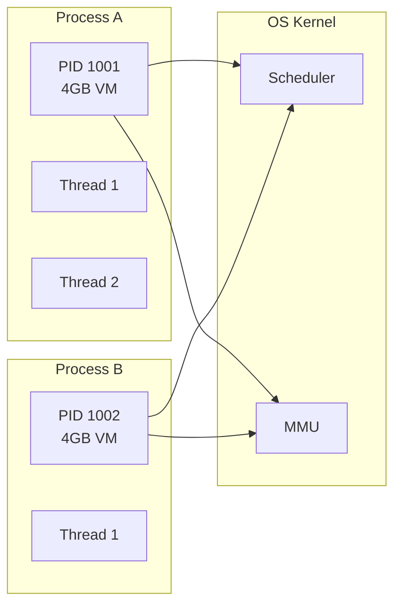
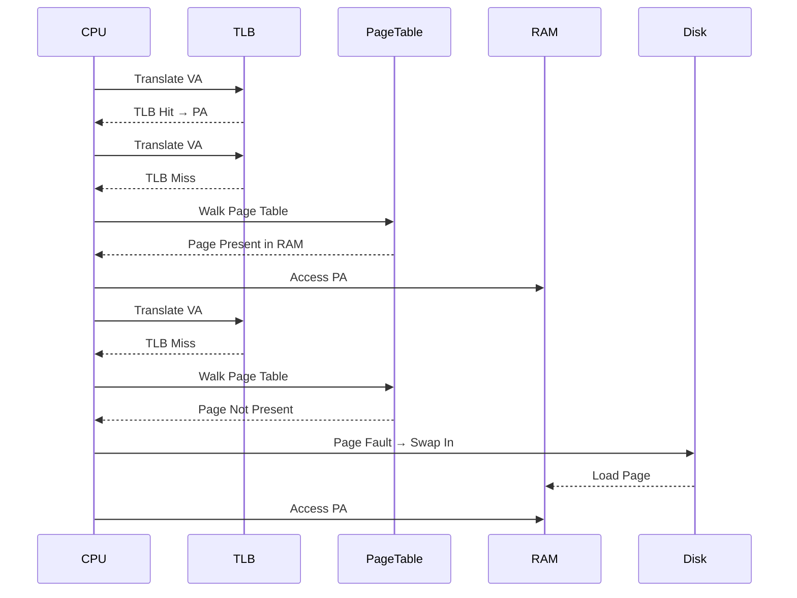

# Operating Systems for AI Engineers

## Learning Objectives

After this chapter you will be able to explain the difference between processes and threads in the context of concurrent ML workloads, reason about memory management for large model inference, design container resource limits using cgroups, diagnose I/O bottlenecks in data pipelines, and configure OS-level optimizations for training performance.

## Introduction

00-core-computer-science is a fundamental concept in AI engineering. This chapter covers the core principles, practical implementations, and interview preparation for mastering this topic.

## Prerequisites

- Basic programming knowledge
- Understanding of data structures
## Theory

### Process vs Thread

A process is an independent execution unit with its own address space, file descriptors, and system state. A thread is a lighter unit within a process — threads share the address space but have their own stack and registers.

Context switching between processes is expensive (TLB flush, page table switch). Thread context switches are cheaper because the virtual memory mapping stays the same. For AI workloads: use processes for isolation between training jobs, threads for parallelism within a single inference server.



### Scheduling

The Completely Fair Scheduler (CFS) in Linux gives each runnable thread a proportion of CPU time. It uses a red-black tree of tasks sorted by vruntime (virtual runtime). Lower nice values = higher priority = less vruntime growth.

For ML training, CPU pinning (taskset) prevents the scheduler from migrating threads across cores, preserving cache warmth. Real-time priorities for inference serving prevent preemption by background tasks.

### Memory Management

Virtual memory provides each process with a contiguous address space mapped to physical memory through page tables. The Translation Lookaside Buffer (TLB) caches recent translations. A TLB miss walks the page table in hardware or software.

Page faults occur when a virtual page isn't in physical memory. Major faults require disk I/O (swap). Minor faults happen for first access to a shared page. Huge pages (2MB or 1GB) reduce TLB pressure — critical for large model weights.

The OOM killer terminates processes when memory is exhausted. Configurable with oom_score_adj.



### File Systems

- **inode**: metadata structure storing permissions, ownership, timestamps, block pointers
- **ext4**: journaling, extent-based allocation, good general-purpose choice
- **XFS**: scalable to large files, parallel allocations, better for concurrent I/O
- **Page cache**: kernel caches file data in unused RAM. Reads hit page cache first. Write-back flushes asynchronously
- **Direct I/O**: bypasses page cache — useful when the application manages its own cache (databases)
- **mmap**: maps files into virtual memory, allowing load/store operations instead of read/write syscalls

### I/O Models

- **Blocking I/O**: read/write block until complete. Simple but wastes CPU during waits
- **Non-blocking I/O**: returns immediately with EAGAIN if data not ready. Requires polling
- **I/O multiplexing**: select, poll, epoll — monitor multiple FDs, wake on ready events
- **AIO (io_uring)**: submission and completion queues, zero-copy, kernel-bypass for high-throughput

For data loading in ML, io_uring with direct I/O gives the best throughput. PyTorch's DataLoader uses multiprocessing with shared memory.

### Containers: cgroups and Namespaces

Containers are not lightweight VMs. They use Linux namespaces for isolation and cgroups for resource limits.

- **Namespaces**: PID, network, mount, user, UTS, IPC, cgroup. Each namespace provides an isolated view of a global resource
- **cgroups**: limit, account, and isolate CPU, memory, I/O, and NUMA resources. cgroup v2 is the modern interface

```
┌──────────────────────────────────────┐
│  Host OS                             │
│  ┌────────────────────────────────┐  │
│  │ Container A                    │  │
│  │ cgroups: cpu=2, mem=4GB       │  │
│  │ namespace: pid=1001, net=isol │  │
│  │ ┌─────┐ ┌─────┐               │  │
│  │ │PID 1│ │PID 2│               │  │
│  │ └─────┘ └─────┘               │  │
│  └────────────────────────────────┘  │
│  ┌────────────────────────────────┐  │
│  │ Container B                    │  │
│  │ cgroups: cpu=4, mem=8GB       │  │
│  │ namespace: pid=2001, net=isol │  │
│  └────────────────────────────────┘  │
│  ┌────────────────────────────────┐  │
│  │ Kernel                         │  │
│  │ CFS, memory mgmt, device       │  │
│  └────────────────────────────────┘  │
└──────────────────────────────────────┘
```

### Virtualization

- **Type 1 hypervisor**: runs directly on hardware (KVM, Xen, Hyper-V). VMs have dedicated vCPUs, memory, devices
- **Paravirtualization**: guest OS is modified to make hypercalls — better performance for I/O
- **Bare-metal**: no hypervisor, OS runs directly. Best for GPU workloads where PCIe passthrough adds no overhead


### cgroups v2 Deep Dive

cgroups v2 (unified hierarchy) simplifies resource management. Key controllers:

- cpu.weight: proportional CPU share (default 100). Two containers with weights 100 and 200 split CPU 1:2 when competing
- cpu.max: hard CPU limit in us/period format. "100000 100000" = 1 core. "50000 100000" = 0.5 cores
- memory.max: hard memory limit. OOM kills the container if exceeded. memory.high: soft limit, throttles before OOM
- io.weight: proportional I/O bandwidth. io.max: hard I/O limit in bytes-per-second and IOPS

Docker translates --cpus, --memory, --memory-reservation flags to cgroup settings. Kubernetes sets them through the CRI runtime (containerd, CRI-O).

### Overlay Filesystem

Container images use overlayfs: a union mount of multiple layers. The lower layer is read-only (the base image). The upper layer is writable (container modifications). Reads check upper first, then lower. Writes copy data up (copy-on-write).

This means reading a 10GB model file from a container reads the base image layer directly without copying. But modifying a file in the base image triggers a full copy to the writable layer.

### Process Diagnostics with strace and perf

strace traces system calls. For debugging why a model server is slow: strace -c -p PID shows syscall counts and times. High epoll_wait time means idle waiting. High read/write time means I/O bottleneck.

perf records CPU performance counters. perf stat -e cycles,instructions,cache-misses,cache-references -p PID gives IPC (instructions per cycle) and cache miss rates. Low IPC (<1) suggests memory bottlenecks.

### NUMA Architecture for Training

Multi-socket servers have two or more NUMA nodes. Each node has its own memory controller. A core accessing memory from the other socket (remote access) is 1.5-2x slower.

For multi-GPU training with NCCL:

- Ensure each GPU matches to the closest NUMA node
- Use GPU Direct RDMA where GPUs communicate without CPU involvement
- Bind the training process to cores on the same NUMA node as the primary GPU
- Use huge pages for model parameters to reduce TLB pressure

The nvidia-smi topo -m command shows the GPU topology matrix, revealing which GPUs share a PCIe switch and which have direct NVLink connections.

### OS Implications for AI

1. **NUMA affinity**: Modern CPUs have multiple memory controllers. A core accessing local memory is faster than remote. For training, pin processes to cores within the same NUMA node
2. **Huge pages**: 2MB pages reduce TLB misses by 512x vs 4KB. Enable transparent huge pages or allocate explicitly for model weights
3. **CPU pinning**: Prevent scheduler migrations with taskset or sched_setaffinity. Improves cache hit rates
4. **I/O tuning**: Use direct I/O for data loading when the application manages caching. Increase I/O scheduler depth for NVMe drives

## Examples

### Process Scheduler Simulation

```typescript
interface Process {
    pid: number
    priority: number
    burstTime: number
    remainingTime: number
    vruntime: number
    state: "ready" | "running" | "blocked"
}

class CfsScheduler {
    private processes: Process[] = []
    private timeSlice: number = 10

    addProcess(pid: number, priority: number, burstTime: number): void {
        this.processes.push({
            pid,
            priority,
            burstTime,
            remainingTime: burstTime,
            vruntime: 0,
            state: "ready",
        })
    }

    run(): void {
        let time = 0
        while (this.processes.some((p) => p.remainingTime > 0)) {
            this.processes.sort((a, b) => a.vruntime - b.vruntime)
            const current = this.processes[0]
            current.state = "running"
            const slice = Math.min(this.timeSlice, current.remainingTime)
            current.vruntime += slice * (40 / (40 - current.priority))
            current.remainingTime -= slice
            time += slice
            if (current.remainingTime <= 0) {
                current.state = "blocked"
            } else {
                current.state = "ready"
            }
        }
    }

    getStats(): { pid: number; totalRuntime: number; vruntime: number }[] {
        return this.processes.map((p) => ({
            pid: p.pid,
            totalRuntime: p.burstTime,
            vruntime: p.vruntime,
        }))
    }
}
```

### Memory Manager with Paging Simulation

```typescript
interface Page {
    vpn: number
    ppn: number | null
    present: boolean
    accessed: boolean
}

class MemoryManager {
    private pageTable: Map<number, Page> = new Map()
    private tlb: Map<number, number> = new Map()
    private tlbMisses: number = 0
    private totalAccesses: number = 0
    private ram: Map<number, number> = new Map()
    private ramSize: number

    constructor(ramSize: number) {
        this.ramSize = ramSize
    }

    access(virtualAddress: number): number {
        this.totalAccesses++
        const vpn = virtualAddress >> 12
        const offset = virtualAddress & 0xfff

        if (this.tlb.has(vpn)) {
            return (this.tlb.get(vpn)! << 12) | offset
        }

        this.tlbMisses++
        if (!this.pageTable.has(vpn)) {
            this.pageTable.set(vpn, { vpn, ppn: null, present: false, accessed: false })
        }

        const page = this.pageTable.get(vpn)!
        if (!page.present) {
            const ppn = this.evictAndLoad()
            page.ppn = ppn
            page.present = true
            this.ram.set(ppn, vpn)
        }

        page.accessed = true
        this.tlb.set(vpn, page.ppn!)
        if (this.tlb.size > 64) {
            const firstKey = this.tlb.keys().next().value
            this.tlb.delete(firstKey!)
        }

        return (page.ppn! << 12) | offset
    }

    private evictAndLoad(): number {
        const ppn = this.ram.size
        if (ppn < this.ramSize) return ppn
        const victim = this.ram.keys().next().value!
        this.ram.delete(victim)
        return victim
    }

    getTlbHitRate(): number {
        return (this.totalAccesses - this.tlbMisses) / this.totalAccesses
    }
}
```

### Container Isolation with cgroups Simulation

```typescript
interface CgroupConfig {
    cpuQuota: number
    cpuPeriod: number
    memoryLimitMB: number
    ioBandwidth: number
}

class Container {
    name: string
    pid: number
    config: CgroupConfig
    cpuUsage: number = 0
    memoryUsage: number = 0

    constructor(name: string, pid: number, config: CgroupConfig) {
        this.name = name
        this.pid = pid
        this.config = config
    }
}

class CgroupManager {
    private containers: Container[] = []

    createContainer(name: string, config: CgroupConfig): Container {
        const pid = 1000 + this.containers.length
        const container = new Container(name, pid, config)
        this.containers.push(container)
        return container
    }

    allocateCPU(container: Container, requestedMs: number): number {
        const maxMs = container.config.cpuQuota / container.config.cpuPeriod
        const allocated = Math.min(requestedMs, maxMs)
        container.cpuUsage += allocated
        return allocated
    }

    allocateMemory(container: Container, requestedMB: number): boolean {
        if (container.memoryUsage + requestedMB > container.config.memoryLimitMB) {
            return false
        }
        container.memoryUsage += requestedMB
        return true
    }

    getUsage(): { name: string; cpu: number; memMB: number }[] {
        return this.containers.map((c) => ({
            name: c.name,
            cpu: c.cpuUsage,
            memMB: c.memoryUsage,
        }))
    }
}
```

### I/O Model Comparison

```typescript
async function simulateBlockingIO(requests: number): Promise<number> {
    let total = 0
    for (let i = 0; i < requests; i++) {
        await new Promise((r) => setTimeout(r, 10))
        total += 10
    }
    return total
}

async function simulateAsyncIO(requests: number): Promise<number> {
    const promises: Promise<void>[] = []
    for (let i = 0; i < requests; i++) {
        promises.push(new Promise((r) => setTimeout(r, 10)))
    }
    await Promise.all(promises)
    return 10
}
```

### File System Performance

The page cache uses unused RAM to cache file data. When an application reads a file, the kernel caches it. Subsequent reads hit the page cache (no disk I/O). The kernel flushes dirty pages to disk asynchronously (pdflush).

- vm.dirty_ratio: percentage of RAM that can be dirty before writes block (default 20%)
- vm.dirty_background_ratio: percentage to start background writeback (default 10%)
- vm.swappiness: tendency to swap (0 = avoid swap, 100 = aggressive). For ML training, set to 0 or 1

Direct I/O (O_DIRECT) bypasses the page cache. Use it when the application manages its own caching (relational databases, custom data loaders). The tradeoff is that the OS cannot optimize read patterns.

### Mmap for Model Loading

Memory-mapped files (mmap) map a file into the virtual address space. Model weights stored as a file are accessed with load/store instructions instead of read() system calls.

Benefits for ML:

- Lazy loading: only pages actually accessed are loaded from disk
- Shared memory: multiple processes can mmap the same file, sharing physical pages
- OS manages prefetching: kernel read-ahead loads pages before they are needed
- Zero-copy: data goes from disk directly to the process address space without kernel buffer copy

The tokenizer files, model configs, and weight files benefit from mmap. Hugging Face safetensors format supports mmap loading.

### Concurrency Models

```typescript
class MultiprocessingSimulator {
    private processes: Map<number, { memory: number; state: string }> = new Map()

    spawn(name: string): number {
        const pid = this.processes.size + 1000
        this.processes.set(pid, { memory: 1024, state: "running" })
        return pid
    }

    kill(pid: number): boolean {
        return this.processes.delete(pid)
    }

    listProcesses(): { pid: number; memory: number; state: string }[] {
        return Array.from(this.processes.entries()).map(([pid, info]) => ({
            pid,
            ...info,
        }))
    }
}

class ThreadPoolSimulator {
    private threads: number
    private queue: (() => Promise<void>)[] = []
    private active: number = 0

    constructor(threads: number) {
        this.threads = threads
    }

    async submit<T>(task: () => Promise<T>): Promise<T> {
        return new Promise((resolve, reject) => {
            this.queue.push(async () => {
                try {
                    resolve(await task())
                } catch (e) {
                    reject(e)
                }
            })
            this.dispatch()
        })
    }

    private async dispatch(): Promise<void> {
        if (this.active >= this.threads || this.queue.length === 0) return
        this.active++
        const task = this.queue.shift()!
        await task()
        this.active--
        this.dispatch()
    }
}
```

### Memory Profiling

```typescript
class MemoryProfiler {
    private snapshots: { time: number; rssMB: number; heapMB: number; externalMB: number }[] = []

    snapshot(): void {
        const usage = process.memoryUsage()
        this.snapshots.push({
            time: Date.now(),
            rssMB: Math.round(usage.rss / 1024 / 1024),
            heapMB: Math.round(usage.heapUsed / 1024 / 1024),
            externalMB: Math.round(usage.external / 1024 / 1024),
        })
    }

    getGrowth(): number {
        if (this.snapshots.length < 2) return 0
        const first = this.snapshots[0]
        const last = this.snapshots[this.snapshots.length - 1]
        return last.heapMB - first.heapMB
    }

    report(): string {
        const peak = Math.max(...this.snapshots.map((s) => s.rssMB))
        return "Peak RSS: ${peak}MB, growth: ${this.getGrowth()}MB, samples: ${this.snapshots.length}"
    }
}
```

## Summary

Operating systems knowledge separates engineers who can diagnose production issues from those who guess. The key mental models are: processes provide isolation (use for training jobs), threads provide efficiency (use for inference servers); virtual memory hides physical layout but TLB misses and page faults are real costs; cgroups are how containers enforce limits — understand them before tuning Kubernetes requests and limits; I/O is the most common bottleneck in ML pipelines — io_uring and direct I/O give the best throughput.

## Practical Takeaways

- Pin training processes to specific cores with taskset to maximize cache locality
- Enable huge pages (2MB or 1GB) for model weight storage
- Set memory limits in containers at least 10% above the model's working set
- Use numactl to bind processes to NUMA nodes for consistent latency
- Prefer io_uring over epoll for high-throughput data loading
- Monitor /proc/meminfo, /proc/stat, and /proc/diskstats for system-level diagnostics
- OOM adjustments (oom_score_adj) prevent critical services from being killed

## Chapter Quiz

1. What is the primary difference between a process and a thread?
   - A) Threads have separate address spaces
   - B) Processes share address space with other processes
   - C) Threads within a process share the address space
   - D) Processes cannot create threads
   // correct: C

2. The OOM killer activates when:
   - A) A process uses more CPU than its limit
   - B) The system runs out of physical memory
   - C) A container exceeds its memory limit
   - D) Swap space is full
   // correct: B

3. What benefit do huge pages provide for ML inference?
   - A) Faster CPU clock speed
   - B) Reduced TLB misses for large memory regions
   - C) Automatic quantization of model weights
   - D) Priority boost for inference processes
   // correct: B

4. In the CFS scheduler, a process with a lower nice value:
   - A) Gets less CPU time
   - B) Gets more CPU time proportionally
   - C) Runs at a higher clock speed
   - D) Is pinned to a specific core
   // correct: B

5. What Linux feature allows a single process to monitor thousands of file descriptors for readiness?
   - A) select
   - B) poll
   - C) epoll
   - D) fork
   // correct: C

## Exercises


## Common Mistakes

1. Not understanding the fundamental concepts before applying them
2. Skipping edge cases in implementation
3. Not analyzing time/space complexity
4. Forgetting to handle null/empty inputs
5. Not practicing enough problems to build pattern recognition1. Write a script that creates two CPU-bound processes with different nice values and measures their relative throughput.

2. Implement a NUMA-aware memory allocator that allocates from the local NUMA node and falls back to remote.

3. Build a container simulator with cgroup-like CPU and memory enforcement, then run competing workloads to observe throttling.

4. Measure the throughput difference between blocking and async I/O for 1000 simulated 1KB
## Revision Notes

- Key concept 1: Core principle of 00-core-computer-science
- Key concept 2: Common implementation pattern
- Key concept 3: Time/space complexity to remember
- Key concept 4: When to apply this technique
- Key concept 5: Common interview pattern
- Key concept 6: Edge cases to handle
- Key concept 7: Related concepts for deeper understanding
## Placement Section

### Top 10 Interview Questions

#### Google Style
1. Explain the time and space trade-offs of 00-core-computer-science. When would you choose one approach over another?
2. Design a system that efficiently handles 00-core-computer-science at scale (millions of requests/second).

#### Amazon Style
1. Tell me about a time you had to optimize a system related to 00-core-computer-science. What was your approach and what was the result?
2. How would you explain 00-core-computer-science to a non-technical stakeholder?

#### Microsoft Style
1. How does 00-core-computer-science integrate with enterprise systems and cloud architectures?
2. What are the security implications of 00-core-computer-science?

#### NVIDIA Style
1. How would you optimize 00-core-computer-science for GPU-accelerated computing?
2. What parallel processing patterns apply to 00-core-computer-science?

#### AI Startup Style
1. How would you implement 00-core-computer-science in a cost-effective, scalable way for a startup?
2. What's the fastest way to prototype a solution using 00-core-computer-science?

### Resume Tips
- **Technical Skills**: List 00-core-computer-science under relevant technical skills
- **Project Description**: "Implemented 00-core-computer-science to [specific outcome], reducing [metric] by [X]%"
- **Keywords**: Include 00-core-computer-science in your skills section for ATS optimization

### Interview Day Checklist
- [ ] Review core concepts of 00-core-computer-science
- [ ] Practice 3-5 problems related to 00-core-computer-science
- [ ] Prepare 2 real-world examples of using 00-core-computer-science
- [ ] Know the time/space complexity of common 00-core-computer-science operations
- [ ] Have questions ready about how the company uses 00-core-computer-science reads.

