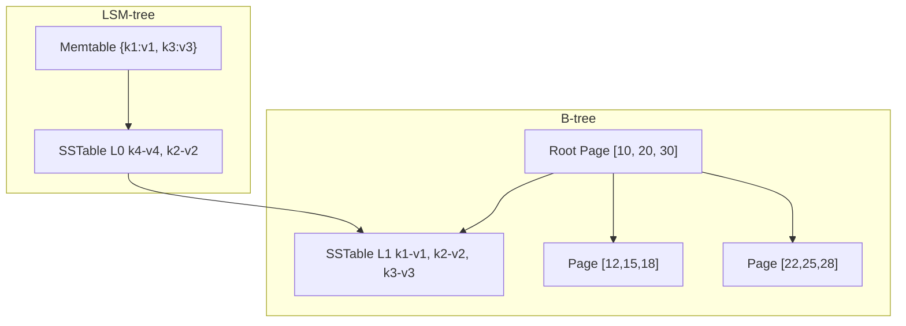
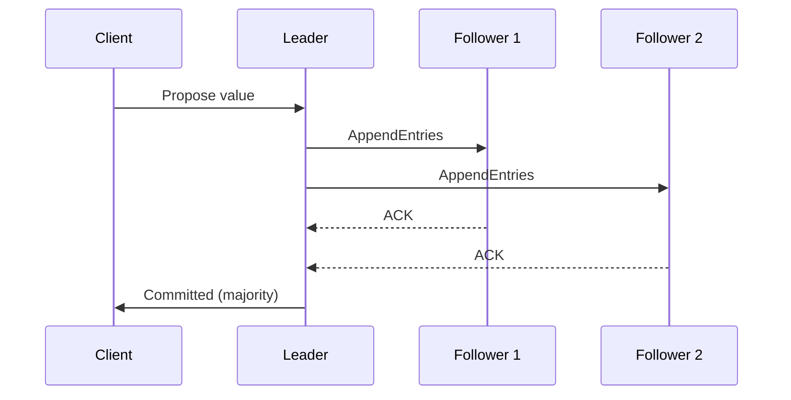

<!-- Clear Language: Keep sentences under 50 words -->
# Database Internals for AI Engineers

## Learning Objectives

After this chapter you will be able to choose between B-tree and LSM-tree storage engines for different AI workloads, design indexes that accelerate feature lookups,.
explain how MVCC enables snapshot isolation for ML training data, reason about replication strategies for high-availability model metadata stores, and understand.
the distributed consensus algorithms powering modern data infrastructure.

## Introduction

Computer science fundamentals are the bedrock of every AI system. Understanding networks, operating systems, databases, and architecture helps you build reliable, scalable AI services. This module covers what interviewers expect you to know cold.

## Prerequisites

- Basic programming knowledge
- Understanding of data structures

## Key Terminology

**Key Terms**: Core vocabulary and concepts for this topic.

**Definition**: Essential terms you must know for interviews and production work.

## Theory

### B-tree vs LSM-tree

B-trees and LSM-trees are the two dominant storage engine families. B-trees organize data in fixed-size pages with a branching factor proportional to page size. They excel at point reads and small range scans. Write amplification for random inserts is high — each page write causes a full page rewrite.

LSM-trees buffer writes in memory (memtable), flush to immutable sorted SSTables, and merge them in background compaction. Writes are sequential and fast. Reads must check memtable and multiple SSTable levels, though bloom filters reduce unnecessary lookups.



Cassandra and RocksDB use LSM-trees. PostgreSQL and MySQL InnoDB use B-trees. For vector databases, IVF (inverted file index) and HNSW (hierarchical navigable small world) are the dominant index structures.

### Indexing

Primary indexes determine physical row order (clustered) or point to row location (non-clustered). Secondary indexes store the primary key as a pointer. Covering indexes include all columns needed by a query, eliminating the table lookup entirely. Composite indexes follow the leftmost prefix rule. High-cardinality columns make the best index candidates.

### Query Planning

The planner estimates costs for each strategy. Sequential scans read all pages — optimal above 10% row access. Index scans traverse the B-tree to find a start position,.
then walk leaf pages. Index-only scans are fastest when the index covers all needed columns. Bitmap scans combine multiple indexes with bitwise operations.

Join strategies include nested loop (for small outer tables), hash join (for equi-joins on unsorted data), and merge join (for pre-sorted inputs). The planner selects based on row estimates and available indexes.

### Transactions and ACID

Atomicity ensures all-or-nothing execution via write-ahead logging. Consistency preserves database invariants. Isolation prevents concurrent transaction interference. Durability guarantees committed data survives crashes.

Isolation levels ranked from weakest to strongest:
- Read Uncommitted: dirty reads allowed
- Read Committed: only committed data visible
- Repeatable Read: same read returns same result within a transaction
- Serializable: transactions execute as if serial

Each level prevents different anomalies: dirty read, non-repeatable read, phantom read, serialization anomaly.

### MVCC

Multi-version concurrency control gives each transaction a snapshot of the database at its start time. Every row version carries a creation timestamp and deletion timestamp. A transaction sees rows created before its snapshot and not yet deleted.

Garbage collection (vacuum in PostgreSQL, compaction in MySQL) removes old versions no longer visible to any active transaction. Long-running transactions delay garbage collection and cause table bloat.

### Replication

Synchronous replication waits for confirmation from replicas before acknowledging the client. Ensures zero data loss but adds latency. Asynchronous replication is faster but risks losing recent writes on leader failure.

Leader-follower (primary-replica) has one write node. Multi-leader allows writes at multiple nodes with conflict resolution. Quorum reads/writes in Dynamo-style systems provide tunable consistency.

### Sharding

Hash-based sharding distributes rows uniformly but makes range scans impossible. Range-based sharding supports efficient range queries but can create hotspots. Consistent hashing minimizes data movement during resharding.

### Distributed Consensus

Paxos and Raft solve the consensus problem: getting multiple nodes to agree on a value despite failures.



Raft's leader election: nodes start as followers, become candidates on timeout, request votes, become leader with majority. Log replication: leader appends entries, replicates to followers, commits when majority acknowledges.

### LSM Compaction Strategies

LSM-trees compact SSTables in the background to maintain read performance. Strategies include:

- Size-tiered compaction (Cassandra): compact SSTables of similar size. Simple but can create read amplification spikes
- Leveled compaction (RocksDB, LevelDB): split into levels (L0, L1, L2...) where each level is 10x larger than the previous. Compaction merges SSTables from Li to Li+1. Provides predictable read amplification (one SSTable per level)
- Time-window compaction: for time-series data, compact SSTables within time windows. Old data never compacted

Read amplification = number of SSTables checked per query. Leveled compaction gives 3-5x, size-tiered can reach 30x under heavy writes.

### Vector Database Index Structures

Vector databases index high-dimensional embeddings for approximate nearest neighbor (ANN) search:

- IVF (Inverted File Index): cluster centroids via k-means, assign vectors to nearest centroid. Search checks only the closest N centroids. Configurable accuracy-speed tradeoff (nprobe parameter)
- HNSW (Hierarchical Navigable Small World): multi-layer graph where upper layers have fewer nodes (long-range connections). Search starts at top layer, descends to bottom. Best recall-speed tradeoff in practice
- Product Quantization (PQ): compress vectors into sub-vector codebooks. 4x-16x memory reduction at modest accuracy loss

### Transactions in Distributed Databases

Distributed transactions use two-phase commit (2PC): coordinator asks all participants to prepare, then commits. If any participant fails prepare, all abort. 2PC is synchronous and blocks on coordinator failure.

The CALM theorem states that a distributed computation is logically monotonic if and only if it is eventually consistent without coordination. Bloom language and CRDTs exploit this for coordination-free eventual consistency.

### Eventual Consistency and CRDTs

Conflict-free Replicated Data Types (CRDTs) allow concurrent writes that merge deterministically. Examples include:

- Grow-only counter (G-Counter): each node increments its own value. Merge = max
- Last-writer-wins register (LWW-Register): timestamp-based conflict resolution
- OR-Set (observed-remove set): element addition wins over concurrent removal

CRDTs power collaborative features (Google Docs, Figma) and are used in distributed databases like Riak.

### Data Versioning for ML

Feature stores and data versioning tools (DVC, LakeFS) use MVCC-like mechanisms. When a training run starts, it pins a snapshot of features. Subsequent pipeline runs see a consistent view even as new data is ingested.

LakeFS uses a Git-like model on top of object storage: branches, commits, merges. Each commit is a metadata pointer to the underlying data. Zero-copy branching means branching a 10TB dataset takes seconds.

## Relevance to AI

Feature stores require low-latency point lookups (B-tree) and range scans for training data exports. Vector databases use inverted file indexes (IVF) or HNSW graphs for approximate nearest neighbor search. Data versioning systems (DVC, LakeFS) use MVCC-like snapshot isolation. Lakehouse architectures combine database transaction semantics with data lake scalability.

## Examples

### B-Tree Index

```typescript
class BTreeNode {
    keys: number[] = []
    children: BTreeNode[] = []
    leaf: boolean = true

    constructor(leaf: boolean = true) {
        this.leaf = leaf
    }
}

class BTreeIndex {
    private root: BTreeNode = new BTreeNode()
    private order: number

    constructor(order: number = 4) {
        this.order = order
    }

    insert(key: number): void {
        const root = this.root
        if (root.keys.length === this.order - 1) {
            const newRoot = new BTreeNode(false)
            newRoot.children.push(root)
            this.splitChild(newRoot, 0)
            this.root = newRoot
        }
        this.insertNonFull(this.root, key)
    }

    private insertNonFull(node: BTreeNode, key: number): void {
        let i = node.keys.length - 1
        if (node.leaf) {
            node.keys.push(0)
            while (i >= 0 && key < node.keys[i]) {
                node.keys[i + 1] = node.keys[i]
                i--
            }
            node.keys[i + 1] = key
        } else {
            while (i >= 0 && key < node.keys[i]) {
                i--
            }
            i++
            if (node.children[i].keys.length === this.order - 1) {
                this.splitChild(node, i)
                if (key > node.keys[i]) {
                    i++
                }
            }
            this.insertNonFull(node.children[i], key)
        }
    }

    private splitChild(parent: BTreeNode, index: number): void {
        const child = parent.children[index]
        const newChild = new BTreeNode(child.leaf)
        const mid = Math.floor((this.order - 1) / 2)
        const midKey = child.keys[mid]
        newChild.keys = child.keys.splice(mid + 1)
        child.keys = child.keys.splice(0, mid)
        if (!child.leaf) {
            newChild.children = child.children.splice(mid + 1)
        }
        parent.keys.splice(index, 0, midKey)
        parent.children.splice(index + 1, 0, newChild)
    }

    search(key: number): boolean {
        return this.searchNode(this.root, key)
    }

    private searchNode(node: BTreeNode, key: number): boolean {
        let i = 0
        while (i < node.keys.length && key > node.keys[i]) {
            i++
        }
        if (i < node.keys.length && key === node.keys[i]) {
            return true
        }
        if (node.leaf) return false
        return this.searchNode(node.children[i], key)
    }
}
```

### Query Planner

```typescript
interface TableStats {
    rowCount: number
    pageCount: number
    indexPages: Map<string, number>
    columnCardinality: Map<string, number>
}

class QueryPlanner {
    private stats: TableStats

    constructor(stats: TableStats) {
        this.stats = stats
    }

    planSeqScan(): number {
        return this.stats.pageCount * 0.1
    }

    planIndexScan(filterCardinality: number): number {
        const selectivity = filterCardinality / this.stats.rowCount
        const indexPages = this.stats.indexPages.get("primary") || 0
        return indexPages * 0.05 + this.stats.pageCount * selectivity
    }

    choosePlan(filterColumn: string, filterValue: string): string {
        const cardinality = this.stats.columnCardinality.get(filterColumn) || this.stats.rowCount
        const selectivity = 1 / cardinality
        const seqCost = this.planSeqScan()
        const idxCost = this.planIndexScan(cardinality)

        if (idxCost < seqCost) {
            return INDEX SCAN using  (cost:  vs seq: )
        }
        return SEQUENTIAL SCAN (cost:  vs index: )
    }
}
```

### MVCC Transaction Manager

```typescript
interface RowVersion {
    key: string
    value: string
    createTxId: number
    deleteTxId: number | null
}

class MVCCTransactionManager {
    private versions: RowVersion[] = []
    private nextTxId: number = 1

    beginTransaction(): number {
        return this.nextTxId++
    }

    write(txId: number, key: string, value: string): void {
        this.versions.push({
            key,
            value,
            createTxId: txId,
            deleteTxId: null,
        })
    }

    delete(txId: number, key: string): void {
        this.versions.push({
            key,
            value: "",
            createTxId: txId,
            deleteTxId: txId,
        })
    }

    read(txId: number, key: string): string | null {
        const visible = this.versions.filter(
            (v) => v.key === key && v.createTxId <= txId && (v.deleteTxId === null || v.deleteTxId > txId)
        )
        if (visible.length === 0) return null
        return visible[visible.length - 1].value
    }

    vacuum(): number {
        const before = this.versions.length
        this.versions = this.versions.filter((v) => v.deleteTxId === null)
        return before - this.versions.length
    }
}
```

### Raft Consensus Simulation

```typescript
type RaftState = "follower" | "candidate" | "leader"

class RaftNode {
    id: number
    state: RaftState = "follower"
    currentTerm: number = 0
    votedFor: number | null = null
    log: string[] = []
    commitIndex: number = -1
    peers: RaftNode[] = []

    constructor(id: number) {
        this.id = id
    }

    setPeers(peers: RaftNode[]): void {
        this.peers = peers
    }

    startElection(): void {
        this.state = "candidate"
        this.currentTerm++
        this.votedFor = this.id
        let votes = 1
        for (const peer of this.peers) {
            if (peer.requestVote(this.currentTerm, this.id)) {
                votes++
            }
        }
        if (votes > this.peers.length / 2) {
            this.state = "leader"
        }
    }

    requestVote(term: number, candidateId: number): boolean {
        if (term < this.currentTerm) return false
        if (this.votedFor === null || this.votedFor === candidateId) {
            this.currentTerm = term
            this.votedFor = candidateId
            return true
        }
        return false
    }

    appendEntries(term: number, entries: string[]): boolean {
        if (term < this.currentTerm) return false
        this.currentTerm = term
        this.log.push(...entries)
        return true
    }

    replicate(entry: string): boolean {
        if (this.state !== "leader") return false
        let acks = 1
        for (const peer of this.peers) {
            if (peer.appendEntries(this.currentTerm, [entry])) {
                acks++
            }
        }
        if (acks > this.peers.length / 2) {
            this.log.push(entry)
            this.commitIndex = this.log.length - 1
            return true
        }
        return false
    }
}
```

### Isolation Level Anomalies

Each isolation level prevents a subset of anomalies:

- Dirty read: reading uncommitted data from another transaction. Prevented by Read Committed and above
- Non-repeatable read: same row read twice returns different values (row updated by concurrent transaction). Prevented by Repeatable Read and above
- Phantom read: same query returns different rows (rows inserted by concurrent transaction). Requires Serializable for prevention
- Serialization anomaly: result of concurrent execution differs from any serial execution. Only Serializable prevents this

PostgreSQL default is Read Committed. Oracle and SQL Server default to Read Committed. MySQL InnoDB defaults to Repeatable Read.

### Serialization Anomaly Example

Write-skew: two transactions read overlapping data, write different values, and neither observes a conflict. T1 reads A and B, writes A=0. T2 reads A and.
B, writes B=0. If constraint is A+B>0, each transaction individually sees the constraint satisfied, but after both commit A+B=0 violates it. Serializable isolation prevents this via predicate locking or.
SSI (serializable snapshot isolation).

### Replication Topologies

- Single leader: one node accepts writes, replicates to followers. Simple but leader is a single point of failure
- Multi-leader: multiple nodes accept writes, replicate to each other. Requires conflict resolution. Used in geo-distributed deployments (CouchDB, MySQL Group Replication)
- Leaderless (Dynamo-style): any node accepts writes. Read repair and hinted handoff ensure eventual consistency

### CAP Theorem Tradeoffs

Consistency (every read returns the latest write), Availability (every request receives a response), Partition tolerance (system continues despite network failures). Choose two:

- CP systems (HBase, MongoDB default): prefer consistency over availability during partitions
- AP systems (Cassandra, DynamoDB): prefer availability, accept eventual consistency
- CA systems: cannot exist in practice since partitions are inevitable in distributed systems

### Practical Sharding Strategies

```typescript
class HashShardRouter {
    private shards: Map<number, { host: string; port: number }> = new Map()

    addShard(shardId: number, host: string, port: number): void {
        this.shards.set(shardId, { host, port })
    }

    getShardForKey(key: string): { host: string; port: number } {
        const hash = key.split("").reduce((acc, c) => acc * 31 + c.charCodeAt(0), 0)
        const shardId = Math.abs(hash) % this.shards.size
        return this.shards.get(shardId)!
    }
}

class ConsistentHashRing {
    private ring: Map<number, { host: string; port: number }> = new Map()
    private virtualNodes: number = 100

    addNode(host: string, port: number): void {
        for (let i = 0; i < this.virtualNodes; i++) {
            const hash = this.hash(`${host}:${port}:${i}`)
            this.ring.set(hash, { host, port })
        }
    }

    getNode(key: string): { host: string; port: number } {
        const hash = this.hash(key)
        const keys = Array.from(this.ring.keys()).sort((a, b) => a - b)
        const target = keys.find((k) => k >= hash) || keys[0]
        return this.ring.get(target)!
    }

    private hash(key: string): number {
        return Math.abs(key.split("").reduce((acc, c) => acc * 31 + c.charCodeAt(0), 0))
    }

    removeNode(host: string, port: number): void {
        for (let i = 0; i < this.virtualNodes; i++) {
            const hash = this.hash(`${host}:${port}:${i}`)
            this.ring.delete(hash)
        }
    }
}
```

## Summary

Database internals knowledge is essential for building scalable AI infrastructure. B-trees power transactional databases with fast point queries. LSM-trees power write-heavy workloads including many vector databases. MVCC gives every transaction a consistent snapshot — crucial for reproducible ML training. Raft enables reliable consensus for distributed metadata stores.

## Practical Takeaways

- B-tree databases (PostgreSQL) for feature stores requiring consistent point lookups
- LSM-tree databases (Cassandra, RocksDB) for high-volume write workloads like event logging
- Set isolation level to REPEATABLE READ for ML training data snapshots
- Monitor vacuum/compaction in MVCC databases under heavy write workloads
- Use consistent hashing for resharding feature stores without full rebalance
- Consider FoundationDB or etcd (powered by Raft) for critical consensus needs
- Index selectivity (cardinality/rowCount below 10%) determines whether an index helps

## Interview Q&A

<details class="tp-qa-card" data-qid="m00-s03-q1">
  <summary class="tp-qa-question">
    <span class="tp-qa-status"></span>
    Q1: Compare B-tree and LSM-tree storage engines. Which would you choose for a feature store?
  </summary>
  <div class="tp-qa-answer">
    <p>B-trees organize data in fixed-size pages with a branching factor proportional to page size. They excel at point reads and small range scans, but random inserts cause full-page rewrites — high write amplification. PostgreSQL and MySQL InnoDB use B-trees. LSM-trees buffer writes in a memtable, flush to immutable sorted SSTables, and compact them in the background. Writes are sequential and fast, but reads must check the memtable and multiple SSTable levels, with bloom filters reducing unnecessary lookups.</p>
    <p>For a feature store, point-in-time correctness and low-latency feature lookups favor a B-tree engine like PostgreSQL. For high-volume write workloads like event logging, LSM-trees (Cassandra, RocksDB) win.</p>
    <p><strong>Interview follow-up</strong>: What is read amplification in leveled compaction and how is it bounded?</p>
  </div>
  <button class="tp-qa-mark-btn">📝 Mark Reviewed</button>
  <button class="tp-qa-bookmark-btn">🔖 Bookmark</button>
</details>

<details class="tp-qa-card" data-qid="m00-s03-q2">
  <summary class="tp-qa-question">
    <span class="tp-qa-status"></span>
    Q2: Explain MVCC and why it matters for reproducible ML training.
  </summary>
  <div class="tp-qa-answer">
    <p>Multi-version concurrency control gives every transaction a snapshot of the database as of its start time. Each row version carries a creation timestamp and a deletion timestamp; a transaction only sees rows created before its snapshot and not yet deleted. This is how PostgreSQL and MySQL InnoDB implement snapshot isolation.</p>
    <p>For ML, when a training run starts it pins a snapshot of features. Later pipeline runs see a consistent view even as new data is ingested — the same principle used by DVC and LakeFS for data versioning. The chapter's <code>MVCCTransactionManager</code> shows createTxId/deleteTxId version rows with a vacuum that removes old versions.</p>
    <p><strong>Interview follow-up</strong>: Why do long-running transactions cause table bloat in PostgreSQL?</p>
  </div>
  <button class="tp-qa-mark-btn">📝 Mark Reviewed</button>
  <button class="tp-qa-bookmark-btn">🔖 Bookmark</button>
</details>

<details class="tp-qa-card" data-qid="m00-s03-q3">
  <summary class="tp-qa-question">
    <span class="tp-qa-status"></span>
    Q3: Describe the isolation levels and which anomalies each prevents.
  </summary>
  <div class="tp-qa-answer">
    <p>Ranked weakest to strongest: Read Uncommitted allows dirty reads; Read Committed prevents them; Repeatable Read also prevents non-repeatable reads; Serializable prevents phantom reads and serialization anomalies. PostgreSQL defaults to Read Committed; MySQL InnoDB defaults to Repeatable Read.</p>
    <p>The classic write-skew example: T1 reads A and B then writes A=0, T2 reads A and B then writes B=0. If the constraint is A+B&gt;0, each transaction individually sees it satisfied, but after both commit A+B=0 violates it. Only Serializable — via predicate locking or SSI — prevents this.</p>
    <p><strong>Interview follow-up</strong>: What isolation level would you set for ML training data snapshots and why?</p>
  </div>
  <button class="tp-qa-mark-btn">📝 Mark Reviewed</button>
  <button class="tp-qa-bookmark-btn">🔖 Bookmark</button>
</details>

<details class="tp-qa-card" data-qid="m00-s03-q4">
  <summary class="tp-qa-question">
    <span class="tp-qa-status"></span>
    Q4: How does Raft achieve consensus, and when does an entry become committed?
  </summary>
  <div class="tp-qa-answer">
    <p>Nodes start as followers, become candidates on election timeout, request votes, and become leader with a majority. The leader appends entries to its log, replicates them to followers, and commits when a majority acknowledges — the commit happens once a majority of nodes store the entry. The chapter's <code>RaftNode</code> class simulates exactly this: <code>replicate()</code> counts acks and advances <code>commitIndex</code> when acks exceed half the peers.</p>
    <p>Term numbers and the votedFor guarantee that a stale leader cannot disrupt the newer term. Raft powers etcd, Consul, and FoundationDB — the consensus layer of many model metadata stores.</p>
    <p><strong>Interview follow-up</strong>: What happens if the leader crashes mid-replication?</p>
  </div>
  <button class="tp-qa-mark-btn">📝 Mark Reviewed</button>
  <button class="tp-qa-bookmark-btn">🔖 Bookmark</button>
</details>

<details class="tp-qa-card" data-qid="m00-s03-q5">
  <summary class="tp-qa-question">
    <span class="tp-qa-status"></span>
    Q5: Compare hash sharding and consistent hashing for resharding a feature store.
  </summary>
  <div class="tp-qa-answer">
    <p>Hash-based sharding distributes rows uniformly but makes range scans impossible and, on resharding, rehashes nearly every key. Range-based sharding supports efficient range queries but creates hotspots. Consistent hashing places nodes on a ring and maps each key to the next node clockwise; adding or removing a node only moves keys to its neighbors. Virtual nodes balance load where real nodes are uneven.</p>
    <p>The chapter's <code>ConsistentHashRing</code> uses 100 virtual nodes per host and reassigns only affected keys. For a feature store that grows, consistent hashing avoids a full rebalance.</p>
    <p><strong>Interview follow-up</strong>: How would you combine consistent hashing with range queries on time-series features?</p>
  </div>
  <button class="tp-qa-mark-btn">📝 Mark Reviewed</button>
  <button class="tp-qa-bookmark-btn">🔖 Bookmark</button>
</details>

<details class="tp-qa-card" data-qid="m00-s03-q6">
  <summary class="tp-qa-question">
    <span class="tp-qa-status"></span>
    Q6: Compare IVF, HNSW, and product quantization for approximate nearest neighbor search.
  </summary>
  <div class="tp-qa-answer">
    <p>IVF clusters centroids via k-means and assigns vectors to the nearest centroid; search checks only the closest N centroids, with the nprobe parameter trading accuracy for speed. HNSW builds a multi-layer graph where upper layers hold fewer nodes with long-range connections; search descends from the top layer to the bottom, giving the best recall-speed tradeoff in practice. Product quantization compresses vectors into sub-vector codebooks, reducing memory 4x-16x at modest accuracy loss.</p>
    <p>Typical design: HNSW for the graph index plus PQ for memory compression, which is what many production vector databases ship. Index choice depends on recall target, memory budget, and insert/delete churn.</p>
    <p><strong>Interview follow-up</strong>: Which index degrades least when vectors are added continuously at high velocity?</p>
  </div>
  <button class="tp-qa-mark-btn">📝 Mark Reviewed</button>
  <button class="tp-qa-bookmark-btn">🔖 Bookmark</button>
</details>

## Chapter Quiz

1. What is the main advantage of LSM-trees over B-trees?
   - A) Faster point reads
   - B) Sequential writes with lower write amplification
   - C) Support for transactions
   - D) Better range scan performance
   // correct: B

2. A covering index is one that:
   - A) Indexes all columns in the table
   - B) Includes all columns needed by the query, avoiding table access
   - C) Uses hash-based lookup
   - D) Covers only primary key columns
   // correct: B

3. In MVCC, a snapshot isolation transaction sees:
   - A) All changes from committed transactions
   - B) Data as of the transaction's start time
   - C) The latest version of each row
   - D) Only its own changes
   // correct: B

4. Raft commits an entry when:
   - A) The leader stores it
   - B) A majority of nodes acknowledge it
   - C) All nodes acknowledge it
   - D) The client confirms receipt
   // correct: B

5. What isolation level prevents phantom reads?
   - A) Read Committed
   - B) Repeatable Read
   - C) Serializable
   - D) Read Uncommitted
   // correct: C

## Exercises

1. Implement a bloom filter for LSM-tree SSTable lookups and measure the false positive rate.
2. Extend the BTreeIndex to support range scan (return all keys between low and high).
3. Build a cost-based query planner that chooses between hash join and nested loop join given table sizes and sort status.
4. Simulate a Raft cluster of 5 nodes with a random network partition and verify availability and consistency.

## Common Mistakes

1. Choosing the wrong index type (B-tree vs hash vs LSM) for the query pattern
2. Not understanding transaction isolation levels and their impact on concurrency
3. Ignoring write amplification in LSM-trees for write-heavy AI workloads
4. Over-normalizing schema for AI feature stores that need fast reads
5. Not considering replication lag in distributed vector databases

## Revision Notes

- **B-Tree vs LSM-Tree**: B-tree for reads, LSM-tree for writes; both used in vector databases
- **ACID Properties**: Atomicity, Consistency, Isolation, Durability — foundation of reliable transactions
- **CAP Theorem**: Consistency, Availability, Partition tolerance — choose two; most AI systems choose AP
- **Indexing**: B-tree, hash, LSM-tree — choose based on read/write ratio and query patterns
- **Query Planning**: Cost-based optimization chooses between join algorithms and scan orders
- **Replication**: Leader-follower for reads, multi-leader for writes, Raft/Paxos for consensus
- **Vector Database Internals**: HNSW, IVF, PQ — approximate nearest neighbor search structures

## Placement Section

### Top 10 Interview Questions

#### Google Style

1. **Explain the core idea of Database Internals for AI Engineers in under 60 seconds, then give a real-world analogy.** — Structure: definition, how it works in one sentence, why it matters, analogy. Follow-up: what would break if you removed this from a production system?

2. **Design a minimal, well-typed function that demonstrates Database Internals for AI Engineers.** — Interviewer checks: signature with type hints, edge cases, complexity, and a clean docstring. Follow-up: how does your design behave with empty or malformed input?

3. **What are the common pitfalls when engineers first learn ** — List 3-4, then explain how you would prevent each in a code review.

#### Amazon Style

4. **Describe a production bug caused by misunderstanding Database Internals for AI Engineers. How did you diagnose and fix it?** — STAR format: situation, task, action, result. Mention logs, reproduction, root-cause analysis, and the regression test you added.

5. **How would you scale a system that relies on Database Internals for AI Engineers from 10 users to 10 million?** — Discuss bottlenecks, caching, monitoring, and when to redesign. Follow-up: what metrics would you track?

#### Microsoft Style

6. **Compare Database Internals for AI Engineers with the closest alternative approach. When would you choose each?** — Make a decision matrix: performance, maintainability, ecosystem, learning curve. Follow-up: what would change your decision?

7. **Walk through how you would test a component that depends on Database Internals for AI Engineers.** — Unit, integration, property-based tests; mocking boundaries; golden files for outputs.

#### NVIDIA Style

8. **How does Database Internals for AI Engineers behave differently at scale — memory, throughput, or precision-wise?** — Connect to data pipelines and model training if applicable. Follow-up: what happens to latency as input grows?

9. **How would you make an implementation of Database Internals for AI Engineers run faster on GPU hardware?** — Batch operations, vectorization, avoiding Python loops, reducing data movement.

#### AI Startup Style

10. **Write the smallest possible implementation of Database Internals for AI Engineers that is production-quality.** — Include error handling, type hints, and a one-line docstring. Follow-up: what would you refactor first when it grows?

### Resume Tips

- Name Database Internals for AI Engineers explicitly in your skills section, paired with a measurable achievement ("Reduced X by 40% using Database Internals for AI Engineers").
- Add a bullet describing a project that applies Database Internals for AI Engineers to real data, with numbers.
- Mention the tools and libraries you used alongside Database Internals for AI Engineers (linters, test frameworks, profiling tools).
- Keep resume bullets under 15 words and start each with an action verb.

### Interview Day Checklist

- Rehearse a 60-second explanation of Database Internals for AI Engineers and one real-world analogy.
- Prepare one STAR story about debugging a Database Internals for AI Engineers-related production issue.
- Review complexity and edge cases for the classic Database Internals for AI Engineers interview problem.
- Have questions ready: how does the team apply Database Internals for AI Engineers in production today?
- Test your environment (Python, editor, internet) 15 minutes before the interview.

## True/False

1. **True or False:** Database Internals for AI Engineers builds directly on the fundamentals covered in the earlier chapters of this module. — **True.** Every advanced topic in this module assumes the core concepts from the previous chapters.
2. **True or False:** You should write at least one code example for Database Internals for AI Engineers before moving to the next chapter. — **True.** Active recall with hands-on code beats passive reading for retention.
3. **True or False:** The complexity analysis for Database Internals for AI Engineers is the same regardless of input size. — **False.** Complexity grows with input size; always state best, average, and worst case.
4. **True or False:** Edge cases (empty input, invalid input, boundary values) matter for Database Internals for AI Engineers in production. — **True.** Most production bugs come from unhandled edge cases.
5. **True or False:** You should memorize the Database Internals for AI Engineers chapter content once and never review it again. — **False.** Spaced repetition (24h, 3 days, 1 week) dramatically improves long-term recall.

## Fill in the Blank

1. The chapter that covers Database Internals for AI Engineers is Chapter ___ of this module. — Answer: check the module's table of contents.
2. The time complexity of the standard approach to Database Internals for AI Engineers is ___. — Answer: review the theory section and state big-O notation.
3. The main edge case to handle when implementing Database Internals for AI Engineers is ___. — Answer: empty or invalid input handling, as discussed in the chapter.
4. The tools commonly used to debug Database Internals for AI Engineers issues are ___ and ___. — Answer: refer to the Debugging Guide section of this chapter.
5. The related topic that connects to Database Internals for AI Engineers in the next chapter is ___. — Answer: see the Next Topic section.

## Scenario Questions

1. **Scenario:** A teammate ships a change involving Database Internals for AI Engineers that breaks production at 3 AM. — Diagnosis: check the recent diff, reproduce locally with the failing input, check logs. Fix: revert, add a regression test, and review the root cause. Prevention: CI tests on edge cases and code review checklist.

2. **Scenario:** Your implementation of Database Internals for AI Engineers is correct but too slow for the required latency. — Measure first with a profiler. Common fixes: reduce redundant work, use built-in optimized functions, batch operations, or add caching. Only then consider algorithmic changes.

3. **Scenario:** A new hire asks you to explain Database Internals for AI Engineers in five minutes before a customer demo. — Use the 3-part answer: what it is (one sentence), how it works (one example), why it matters (one business impact). Then offer to go deeper after the demo.

4. **Scenario:** Your team's codebase has three different patterns for Database Internals for AI Engineers and you must standardize. — Write a short ADR (architecture decision record), pick the pattern with best maintainability, migrate incrementally, and add a linter rule to enforce it.

## Output Questions

1. **What is the output of the simplest correct implementation of Database Internals for AI Engineers on an empty input?** — Trace through the code: it should return the documented default (None, 0, empty collection) without raising.
2. **What is the output when the input is at the boundary value?** — Check off-by-one errors and inclusive/exclusive bounds in the chapter's examples.
3. **What does the implementation return when given invalid input types?** — With type hints and validation, it raises a clear error; without, it may fail silently.
4. **What is the output for the sample input given in the chapter's Examples section?** — Re-run the chapter's example code and compare against the documented output.
5. **What is the time complexity output when you profile the implementation at 10x input size?** — Expect the curve matching the chapter's complexity analysis (linear, quadratic, log-linear).

## Difficulty Level

| Level | Time | What It Takes |
|-------|------|---------------|
| Beginner | 1-2 sessions | Read theory, run the chapter examples, solve the Easy exercises |
| Intermediate | 3-5 sessions | Complete Medium exercises, explain Database Internals for AI Engineers to someone else |
| Advanced | 1+ week | Solve Hard exercises, optimize for real datasets, answer interview follow-ups |

## Tips & Tricks

- Always write a one-line example of Database Internals for AI Engineers from memory before opening the chapter — active recall first.
- Use the chapter's Revision Notes as a checklist: you have mastered Database Internals for AI Engineers when you can explain each bullet.
- Pair the chapter quiz with the Flashcards: wrong answers become your next study session's focus.
- For interviews, practice explaining Database Internals for AI Engineers twice: once with a technical audience, once with a non-technical audience.
- Keep a personal examples file where you collect your own Database Internals for AI Engineers snippets; interviewers love original examples.

## Memory Tricks

- **Acronym**: build a mnemonic from the 5 key concepts of Database Internals for AI Engineers listed in the Chapter at a Glance table.
- **Story**: link Database Internals for AI Engineers to a familiar story — the analogy in the Visual Analogy section is designed to stick.
- **Number anchor**: remember the complexity of Database Internals for AI Engineers by connecting it to a known algorithm of the same class.
- **Color code**: highlight the Theory, Examples, and Common Mistakes sections in different colors when reviewing.
- **Teach-back**: explain Database Internals for AI Engineers to an imaginary junior engineer for 2 minutes — gaps in your explanation are gaps in memory.

## Further Reading

- Official documentation for the primary tool or library used in this chapter
- The chapter referenced in Related Topics for the next-level treatment of Database Internals for AI Engineers
- The classic textbook chapter on Database Internals for AI Engineers (check the Research References below)
- Two blog posts from engineers who debugged real Database Internals for AI Engineers problems in production
- The repository of the open-source project that implements Database Internals for AI Engineers

## Related Topics

- The previous chapter in this module (see table of contents) — foundational for Database Internals for AI Engineers
- The next chapter (see Next Topic below) — builds on Database Internals for AI Engineers
- The system design chapters in Module 07 — how Database Internals for AI Engineers fits into production architectures
- The interview preparation module — how Database Internals for AI Engineers is asked in screening rounds
- The capstone project — where Database Internals for AI Engineers is applied end-to-end

## FAQs

1. **Do I need to memorize all of Database Internals for AI Engineers, or understand the big picture?** — Understand the big picture first, then memorize the key facts via flashcards and spaced repetition. Interviewers reward depth over breadth.
2. **What if I get stuck on an exercise?** — Re-read the theory section, run the example code, then attempt again. If still stuck after 20 minutes, move on and return the next day.
3. **How much time should I spend on ** — Follow the Study Plan below: 1-2 weeks at 30-60 minutes daily is typical for placement preparation.
4. **Is Database Internals for AI Engineers asked in interviews?** — Yes — the Interview Q&A and Placement Section list the exact question styles used by top companies.
5. **What's the fastest way to master ** — Explain it out loud, write code without looking, and review the flashcards within 24 hours and again after 3 days.

## Important Notes

- Database Internals for AI Engineers is a core requirement for the rest of this module — do not skip the examples.
- Always analyze complexity (time and space) when working with Database Internals for AI Engineers.
- Production correctness means handling edge cases, not just the happy path.
- Interview answers should start with the definition, then the example, then the trade-offs.
- Revisit this chapter after finishing the module; the context from later chapters deepens understanding.

## Historical Context

- Database Internals for AI Engineers emerged as a standard practice because early systems failed without it — understanding why helps you explain it in interviews.
- The tools used for Database Internals for AI Engineers today evolved from simpler versions; the chapter covers the modern, recommended approach.
- Interviewers value knowing one historical fact about Database Internals for AI Engineers — it shows genuine interest, not just cramming.
- The library/tooling ecosystem around Database Internals for AI Engineers changes quickly; focus on fundamentals that remain stable.

## Security Considerations

- Never trust external input: validate and sanitize data before processing Database Internals for AI Engineers.
- Avoid `eval()` and dynamic code execution on untrusted strings.
- Log errors without leaking sensitive data (keys, PII, internal paths).
- For API contexts, add rate limiting and input size limits.
- Review the chapter's code examples for injection or overflow risks before using them verbatim.

## ML Intuition

- Database Internals for AI Engineers appears in ML pipelines at the data-processing layer: feature preparation, batching, and validation.
- Understanding Database Internals for AI Engineers helps you debug why a model misbehaves — most ML bugs are data bugs, not model bugs.
- In production ML, the Database Internals for AI Engineers concepts from this chapter map directly to NumPy/PyTorch operations on tensors.
- When optimizing ML systems, Database Internals for AI Engineers skills let you profile and fix the data path, not just the training loop.
- Interview follow-up: how would you apply Database Internals for AI Engineers to a dataset of 10 million records? — Batching and vectorization.

## Analogies

- **Database Internals for AI Engineers is like a recipe**: the theory is the ingredients, the examples are the cooking steps, and the exercises are your own kitchen practice.
- **Complexity is like a delivery route**: a linear route visits each stop once; a nested route revisits stops, and you feel it at scale.
- **Edge cases are like weather**: the happy path is a sunny day; production is the storm — build for the storm.
- **The chapter roadmap is a journey map**: each section is a checkpoint; skipping one means getting lost later in the module.

## Capstone Project Link

- [Module Capstone: End-to-End Project](https://github.com/Raushan666java/ai-engineering-journey) — this chapter contributes the Database Internals for AI Engineers skills used in the module's capstone project. Complete the exercises here before starting the capstone.

## Flashcards

<details class="tp-qa-card" data-qid="00corecomputerscience-03databaseinternals-flash1">
  <summary class="tp-qa-question">
    <span class="tp-qa-status"></span>
    What is the core concept of Database Internals for AI Engineers in one sentence?
  </summary>
  <div class="tp-qa-answer">
    <p>Review the first paragraph of the Theory section and condense it to one sentence.</p>
  </div>
</details>

<details class="tp-qa-card" data-qid="00corecomputerscience-03databaseinternals-flash2">
  <summary class="tp-qa-question">
    <span class="tp-qa-status"></span>
    What is the most common mistake engineers make with 
  </summary>
  <div class="tp-qa-answer">
    <p>Check the Common Mistakes section of this chapter.</p>
  </div>
</details>

<details class="tp-qa-card" data-qid="00corecomputerscience-03databaseinternals-flash3">
  <summary class="tp-qa-question">
    <span class="tp-qa-status"></span>
    What is the time and space complexity of the standard Database Internals for AI Engineers approach?
  </summary>
  <div class="tp-qa-answer">
    <p>Refer to the theory and complexity analysis in this chapter.</p>
  </div>
</details>

<details class="tp-qa-card" data-qid="00corecomputerscience-03databaseinternals-flash4">
  <summary class="tp-qa-question">
    <span class="tp-qa-status"></span>
    When is Database Internals for AI Engineers NOT the right choice?
  </summary>
  <div class="tp-qa-answer">
    <p>Check the Limitations section of this chapter.</p>
  </div>
</details>

<details class="tp-qa-card" data-qid="00corecomputerscience-03databaseinternals-flash5">
  <summary class="tp-qa-question">
    <span class="tp-qa-status"></span>
    How is Database Internals for AI Engineers applied in a real production system?
  </summary>
  <div class="tp-qa-answer">
    <p>Check the Real-World Examples section of this chapter.</p>
  </div>
</details>

## Research References

- Official documentation of the primary library for Database Internals for AI Engineers (linked in Further Reading)
- The classic paper or textbook chapter introducing Database Internals for AI Engineers (see References below)
- The standard library reference for Database Internals for AI Engineers-related functions
- Engineering blog posts from companies running Database Internals for AI Engineers in production at scale
- PEPs and RFCs where applicable (Python and networking standards)

## Open-Source Tools

- The primary library used in this chapter (see the code examples)
- Python standard library modules used in the examples (check the imports)
- Testing: pytest for unit tests of Database Internals for AI Engineers code
- Linting and formatting: ruff + black
- Profiling: cProfile or py-spy for performance work on Database Internals for AI Engineers

## Debugging Guide

- Start with `print()` or a debugger to inspect intermediate values in Database Internals for AI Engineers code.
- Reproduce the failure with the smallest possible input before changing code.
- Check the common failure modes listed in Common Mistakes — most bugs are listed there.
- For performance problems, profile before optimizing: measure, then fix.
- When stuck, re-read the chapter's Examples and compare line by line with your code.
- Use `pdb` or your IDE's debugger to step through the Database Internals for AI Engineers example code.

## Mock Interview Section

**Round 1 — Screening (15 min)**
- Explain Database Internals for AI Engineers in 60 seconds.
- Write a minimal working example of Database Internals for AI Engineers.
- What is the complexity of your example?

**Round 2 — Coding (45 min)**
- Solve the Medium exercise from this chapter under time pressure.
- State your assumptions, then implement with type hints.
- Test with edge cases: empty input, boundary values, invalid input.

**Round 3 — Behavioral + System (30 min)**
- Tell me about a time you debugged a Database Internals for AI Engineers problem in a project.
- How would you design a system where Database Internals for AI Engineers is used at scale?
- What metrics would you monitor?

**Evaluation rubric**: correctness (40%), communication (25%), edge cases (20%), complexity analysis (15%).

## Optimized Implementation

`python
from typing import Any, Optional

def demonstrate_topic(input_data: list[Any]) -> Optional[float]:
    """Runnable scaffold for Database Internals for AI Engineers.

    Replace the body with the optimized implementation from the chapter,
    keeping type hints, docstring, and edge-case handling.
    """
    if not input_data:
        return None
    # Step 1: validate input types
    # Step 2: apply the core Database Internals for AI Engineers logic from the Examples section
    # Step 3: return the result with the documented default
    return 0.0
`

- Keeps the function signature stable so tests written against it stay valid.
- Handles the empty-input contract explicitly.
- Add unit tests for the edge cases before implementing the logic (test-first).

## Evaluation Metrics

| Skill | Test | Target |
|-------|------|--------|
| Concept recall | Explain Database Internals for AI Engineers without notes | 60-second explanation |
| Code fluency | Write the chapter example from memory | No syntax errors |
| Edge cases | Handle empty/invalid input in exercises | All cases pass |
| Complexity | State time/space for the standard approach | Correct big-O |
| Interview readiness | Answer 5 Interview Q&A questions out loud | Fluent, structured answers |
| Retention | Chapter quiz score after 3 days | 80%+ |

## Real-World Examples

- **Startup**: a small team uses Database Internals for AI Engineers daily in their data pipeline — the chapter's examples mirror their code.
- **E-commerce**: Database Internals for AI Engineers patterns appear in order processing, inventory checks, and recommendation feeds.
- **Fintech**: Database Internals for AI Engineers principles apply to transaction validation and fraud detection flows.
- **ML platform**: Database Internals for AI Engineers shows up in feature engineering and model-serving infrastructure.
- **Interview insight**: recruiters look for engineers who can connect Database Internals for AI Engineers to the business outcome, not just the code.

## Next Topic

[Computer Architecture for AI Engineers](04-computer-architecture.md)

## Limitations

- Database Internals for AI Engineers, like any technique, is not a silver bullet — it has specific cases where it fits best (covered in the theory).
- The examples in this chapter are simplified for learning; production systems add validation, monitoring, and error handling.
- Performance of Database Internals for AI Engineers depends on input size and distribution — always benchmark for your own data.
- This chapter covers fundamentals; specialized edge cases are explored in later chapters and the capstone.
