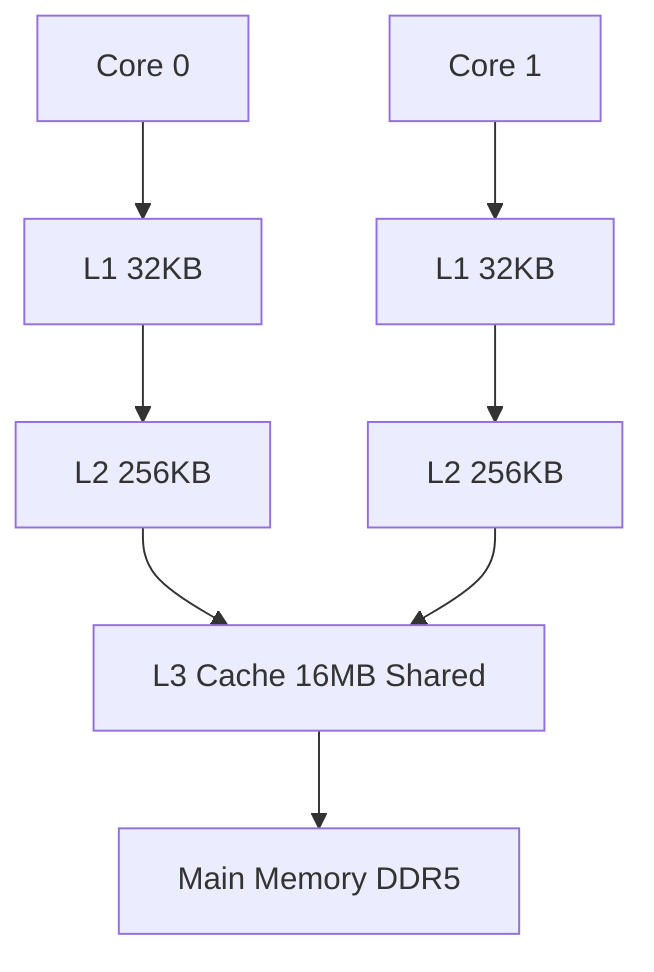

<!-- Clear Language: Keep sentences under 50 words -->
# Computer Architecture for AI Engineers

## Learning Objectives

After this chapter you will be able to identify whether a model inference kernel is compute-bound or memory-bound using the roofline model,.
reason about cache hierarchy effects on matrix multiplication performance, explain SIMD vectorization and its impact on ML operators, describe NUMA implications for.
multi-GPU training, and understand GPU architecture fundamentals for writing efficient kernels.

## Introduction

Computer science fundamentals are the bedrock of every AI system. Understanding networks, operating systems, databases, and architecture helps you build reliable, scalable AI services. This module covers what interviewers expect you to know cold.

## Prerequisites

- Basic programming knowledge
- Understanding of data structures

## Key Terminology

**Key Terms**: Core vocabulary and concepts for this topic.

**Definition**: Essential terms you must know for interviews and production work.

## Theory

### CPU Pipeline

A modern CPU pipeline has 5+ stages: Fetch, Decode, Execute, Memory, Writeback. Each stage takes one or more clock cycles. Hazards stall the pipeline.

Structural hazards occur when two instructions need the same hardware unit. Data hazards (read-after-write) require forwarding or stalling. Control hazards from branches are the most expensive — the pipeline must flush on misprediction.


### Branch Prediction

The penalty for a mispredicted branch is 10-20 cycles (the pipeline depth). Modern predictors achieve 95%+ accuracy. Bimodal predictors use a 2-bit saturating counter per branch. GShare predictors use a global history register XORed with the branch address.

For ML code, branches are rare in the hot path (matrix multiply, convolutions). They appear in data loading, control logic, and loss computation.

### Cache Hierarchy

CPUs have 2-3 levels of cache. L1 is 32KB per core, 4-cycle latency. L2 is 256-512KB per core, 12-cycle latency. L3 is 8-64MB shared, 40-cycle latency. Main memory is 100+ cycle latency.

Cache lines are 64 bytes. When you access memory[x], the CPU loads 64 bytes starting at x & ~63. Stride patterns determine cache utilization. Row-major access (scanning contiguous memory) maximizes cache line usage.

Cache associativity: n-way set associative means each memory address maps to one of n cache lines. High associativity reduces conflict misses but increases access time.

Cache coherence (MESI protocol): Modified, Exclusive, Shared, Invalid states ensure all cores see a consistent view of memory.



### NUMA

Non-Uniform Memory Access means each processor socket has its own memory controller. Accessing local memory is 1-2x faster than remote. Linux exposes NUMA topology via sysfs. The numactl tool binds processes to specific nodes.

For multi-GPU training, each GPU is typically connected to one NUMA node via PCIe. Placing the CPU process on the same NUMA node as the GPU reduces data transfer latency.

### SIMD and AVX

Single Instruction Multiple Data (SIMD) allows one instruction to operate on multiple data elements. AVX-512 processes 16 floats or 8 doubles per instruction. Auto-vectorization by compilers handles simple loops. Complex patterns (gather, scatter) need manual intrinsics.

Matrix multiplication benefits directly from SIMD — one AVX-512 fused multiply-add (FMA) does 16 multiply-adds per cycle.

### Memory Bandwidth

DDR5 bandwidth is 30-50 GB/s per channel. Modern CPUs have 2-4 channels for 100-200 GB/s total. Memory bandwidth is often the bottleneck in ML inference (weight loading). Quantization reduces memory pressure by 4x (FP32 to INT8).

The roofline model plots achievable FLOP/s against operational intensity (FLOPs/byte). A kernel is memory-bound below the ridge point, compute-bound above. Most LLM inference kernels are memory-bound (bottlenecked by weight loading).

### GPU Tensor Cores

Tensor cores perform D = A x B + C where A, B, C, D are 4x4 matrices. One tensor core operation does 16 multiply-adds (32 FLOPs for FP16, 64 for BF16) per cycle. An NVIDIA H100 has 528 tensor cores per SM x 132 SMs = 69,696 tensor cores.

Matrix multiplication using tensor cores achieves up to 1979 TFLOPS (FP8) on H100. cuBLAS, cuDNN, and FlashAttention all use tensor cores. The key is keeping data in registers/shared memory — tensor cores stall if operands come from global memory.

### Quantization and Arithmetic Intensity

Quantization reduces numerical precision to improve memory bandwidth utilization:

- FP32: 4 bytes per value. 32-bit mantissa. Training precision
- FP16: 2 bytes. 11-bit mantissa. Inference and mixed-precision training
- BF16: 2 bytes. 8-bit exponent (same range as FP32). Training with minimal accuracy loss
- INT8: 1 byte. Requires calibration for scale/zero-point. 4x memory reduction vs FP32
- INT4/NF4: 0.5 bytes. Used in QLoRA for fine-tuning on consumer GPUs

Quantization turns memory-bound kernels into compute-bound ones by reducing the bytes-to-FLOPs ratio.

### Cache Policies and Replacement

- LRU (Least Recently Used): evict the oldest accessed line. Easy to implement, works well for temporal locality. Does not handle scans well (cache pollution)
- LFU (Least Frequently Used): evict least frequently accessed. Better for repeated hot data but requires frequency counters
- Adaptive replacement (ARC): balances recency and frequency partitions dynamically. Used in ZFS, some PostgreSQL configurations

### Associativity and Conflict Misses

A direct-mapped cache maps each address to exactly one cache line. Two frequently accessed addresses mapping to the same slot cause conflict misses even with free space elsewhere. Higher associativity (4-way, 8-way, fully associative) reduces conflicts but increases access latency and hardware cost.

For matrix multiplication, conflict misses occur when row stride causes columns to map to the same cache set. Padding (adding dummy elements to rows) breaks the stride pattern.

### Memory Hierarchy for GPU Kernels

GPU kernel optimization follows a hierarchy:

1. Coalesced global memory access: adjacent threads access adjacent addresses
2. Shared memory: programmer-managed cache (100x faster than global). Load tiles from global to shared, compute
3. Register reuse: keep frequently used values in registers (fastest)
4. Reduce global atomics: thread-divergent atomic operations serialize

FlashAttention uses tiling across the attention computation, keeping Q/K/V tiles in shared memory and avoiding the O(N^2) memory bottleneck.

### Performance Engineering Laws

Amdahl's law: speedup = 1 / ((1 - p) + p/s) where p is the parallelizable fraction and s is the speedup of that fraction. If 10% of code is serial, maximum speedup is 10x regardless of cores.

Little's law: L = lambda x W where L is concurrency, lambda is throughput, W is latency. For a fixed concurrency (e.g., batch size), increasing latency reduces throughput.

Universal Scalability Law (USL): accounts for contention (serialization) and coherence (crosstalk). As nodes increase, overhead grows super-linearly, creating a throughput peak before decline.

### GPU Architecture

GPUs are throughput-optimized. An NVIDIA GPU has Streaming Multiprocessors (SMs), each with warp schedulers, register file, shared memory, L1 cache, and tensor cores.

Warps are groups of 32 threads executing in lockstep. Divergent branches serialize. Memory hierarchy: global (HBM, high bandwidth, high latency), L2 (on-chip), L1/shared (per-SM, very fast).

Tensor cores perform 4x4 matrix multiply-accumulate in one cycle. Used by cuBLAS, cuDNN, and transformer engines for massive throughput.

## Examples

### Cache Simulator

```typescript
class CacheLine {
    tag: number = 0
    valid: boolean = false
    lastAccess: number = 0
}

class CacheSimulator {
    private sets: CacheLine[][]
    private setCount: number
    private associativity: number
    private lineSize: number
    private accessCount: number = 0
    private hitCount: number = 0

    constructor(setCount: number, associativity: number, lineSize: number) {
        this.setCount = setCount
        this.associativity = associativity
        this.lineSize = lineSize
        this.sets = Array.from({ length: setCount }, () =>
            Array.from({ length: associativity }, () => new CacheLine())
        )
    }

    access(address: number): boolean {
        this.accessCount++
        const blockAddress = Math.floor(address / this.lineSize)
        const setIndex = blockAddress % this.setCount
        const tag = Math.floor(blockAddress / this.setCount)
        const set = this.sets[setIndex]

        const hit = set.find((line) => line.valid && line.tag === tag)
        if (hit) {
            hit.lastAccess = this.accessCount
            this.hitCount++
            return true
        }

        let lruLine = set[0]
        let lruAccess = lruLine.lastAccess
        for (const line of set) {
            if (!line.valid) {
                lruLine = line
                break
            }
            if (line.lastAccess < lruAccess) {
                lruAccess = line.lastAccess
                lruLine = line
            }
        }

        lruLine.tag = tag
        lruLine.valid = true
        lruLine.lastAccess = this.accessCount
        return false
    }

    getHitRate(): number {
        return this.hitCount / this.accessCount
    }
}
```

### Roofline Analyzer

```typescript
interface KernelProfile {
    name: string
    flops: number
    bytesRead: number
    bytesWritten: number
}

class RooflineAnalyzer {
    private peakFlops: number
    private peakBandwidth: number

    constructor(peakFlops: number, peakBandwidth: number) {
        this.peakFlops = peakFlops
        this.peakBandwidth = peakBandwidth
    }

    analyze(kernel: KernelProfile): string {
        const totalBytes = kernel.bytesRead + kernel.bytesWritten
        const operationalIntensity = kernel.flops / totalBytes
        const ridgePoint = this.peakFlops / this.peakBandwidth
        const maxAchievableFlops = Math.min(
            this.peakFlops,
            operationalIntensity * this.peakBandwidth
        )
        const utilization = maxAchievableFlops / this.peakFlops

        let bound = operationalIntensity < ridgePoint ? "MEMORY BOUND" : "COMPUTE BOUND"

        return ${kernel.name}: % roofline,  FLOPs/byte ->
    }
}
```

### Branch Predictor

```typescript
class BranchPredictor {
    private bimodalTable: number[] = Array(1024).fill(2)
    private gshareTable: number[] = Array(1024).fill(2)
    private globalHistory: number = 0

    predictBimodal(address: number): boolean {
        const index = address % 1024
        return this.bimodalTable[index] >= 2
    }

    updateBimodal(address: number, taken: boolean): void {
        const index = address % 1024
        if (taken && this.bimodalTable[index] < 3) {
            this.bimodalTable[index]++
        } else if (!taken && this.bimodalTable[index] > 0) {
            this.bimodalTable[index]--
        }
    }

    predictGShare(address: number): boolean {
        const index = (address % 1024) ^ this.globalHistory
        return this.gshareTable[index] >= 2
    }

    updateGShare(address: number, taken: boolean): void {
        const index = (address % 1024) ^ this.globalHistory
        if (taken && this.gshareTable[index] < 3) {
            this.gshareTable[index]++
        } else if (!taken && this.gshareTable[index] > 0) {
            this.gshareTable[index]--
        }
        this.globalHistory = ((this.globalHistory << 1) | (taken ? 1 : 0)) & 0x3ff
    }

    run(branches: { address: number; taken: boolean }[]): { bimodal: number; gshare: number } {
        let bimodalMisses = 0
        let gshareMisses = 0

        for (const branch of branches) {
            if (this.predictBimodal(branch.address) !== branch.taken) {
                bimodalMisses++
            }
            if (this.predictGShare(branch.address) !== branch.taken) {
                gshareMisses++
            }
            this.updateBimodal(branch.address, branch.taken)
            this.updateGShare(branch.address, branch.taken)
        }

        return {
            bimodal: 1 - bimodalMisses / branches.length,
            gshare: 1 - gshareMisses / branches.length,
        }
    }
}
```

### SIMD Matrix Multiply Simulation

```typescript
function matrixMultiplyScalar(A: number[][], B: number[][]): number[][] {
    const n = A.length
    const result = Array.from({ length: n }, () => Array(n).fill(0))
    for (let i = 0; i < n; i++) {
        for (let j = 0; j < n; j++) {
            for (let k = 0; k < n; k++) {
                result[i][j] += A[i][k] * B[k][j]
            }
        }
    }
    return result
}

function matrixMultiplySIMD(A: number[][], B: number[][]): number[][] {
    const n = A.length
    const result = Array.from({ length: n }, () => Array(n).fill(0))
    for (let i = 0; i < n; i++) {
        for (let j = 0; j < n; j += 4) {
            const sums = [0, 0, 0, 0]
            for (let k = 0; k < n; k++) {
                const aVal = A[i][k]
                sums[0] += aVal * B[k][j]
                sums[1] += aVal * B[k][j + 1]
                sums[2] += aVal * B[k][j + 2]
                sums[3] += aVal * B[k][j + 3]
            }
            result[i][j] = sums[0]
            result[i][j + 1] = sums[1]
            result[i][j + 2] = sums[2]
            result[i][j + 3] = sums[3]
        }
    }
    return result
}
```

### Measuring Performance

Hardware performance counters track microarchitectural events. Available via perf (Linux), Xperf (Windows), or Instruments (macOS). Key metrics:

- IPC (instructions per cycle): >2 is good, <1 indicates memory stalls
- Cache miss rate: L1 misses <5%, L2 misses <10%, L3 misses <20% are typical targets
- Branch misprediction rate: <5% is good, >10% indicates unpredictable branches
- CPI (cycles per instruction): aggregate measure, ~0.5 for optimized compute, >10 for memory-bound

### Memory-Bound vs Compute-Bound Detection

```typescript
class KernelClassifier {
    classify(
        flops: number,
        bytesRead: number,
        bytesWritten: number,
        durationMs: number,
        peakFlops: number,
        peakBandwidth: number
    ): string {
        const totalBytes = bytesRead + bytesWritten
        const achievedFlops = flops / (durationMs / 1000)
        const achievedBandwidth = totalBytes / (durationMs / 1000)

        const flopsUtilization = achievedFlops / peakFlops
        const bandwidthUtilization = achievedBandwidth / peakBandwidth

        if (flopsUtilization > bandwidthUtilization) {
            return "MEMORY-BOUND (" + (bandwidthUtilization * 100).toFixed(0) + "% BW, " + (flopsUtilization * 100).toFixed(0) + "% compute)"
        }
        return "COMPUTE-BOUND (" + (flopsUtilization * 100).toFixed(0) + "% compute, " + (bandwidthUtilization * 100).toFixed(0) + "% BW)"
    }
}
```

### Tiling for Cache Efficiency

```typescript
function tiledMatrixMultiply(A: number[][], B: number[][], tileSize: number): number[][] {
    const n = A.length
    const result = Array.from({ length: n }, () => Array(n).fill(0))

    for (let i = 0; i < n; i += tileSize) {
        for (let j = 0; j < n; j += tileSize) {
            for (let k = 0; k < n; k += tileSize) {
                for (let ti = i; ti < Math.min(i + tileSize, n); ti++) {
                    for (let tj = j; tj < Math.min(j + tileSize, n); tj++) {
                        let sum = result[ti][tj]
                        for (let tk = k; tk < Math.min(k + tileSize, n); tk++) {
                            sum += A[ti][tk] * B[tk][tj]
                        }
                        result[ti][tj] = sum
                    }
                }
            }
        }
    }
    return result
}
```

### Vectorized Softmax

```typescript
function softmaxNaive(x: number[]): number[] {
    let max = -Infinity
    for (const v of x) if (v > max) max = v
    let sum = 0
    const result = new Array(x.length)
    for (let i = 0; i < x.length; i++) {
        result[i] = Math.exp(x[i] - max)
        sum += result[i]
    }
    for (let i = 0; i < x.length; i++) {
        result[i] /= sum
    }
    return result
}

function softmaxSIMD(x: number[]): number[] {
    const n = x.length
    let max = -Infinity
    for (let i = 0; i < n; i += 4) {
        const chunk = Math.min(4, n - i)
        for (let j = 0; j < chunk; j++) {
            if (x[i + j] > max) max = x[i + j]
        }
    }
    const expValues = new Array(n)
    let sum = 0
    for (let i = 0; i < n; i += 4) {
        const chunk = Math.min(4, n - i)
        for (let j = 0; j < chunk; j++) {
            expValues[i + j] = Math.exp(x[i + j] - max)
            sum += expValues[i + j]
        }
    }
    for (let i = 0; i < n; i += 4) {
        const chunk = Math.min(4, n - i)
        for (let j = 0; j < chunk; j++) {
            expValues[i + j] /= sum
        }
    }
    return expValues
}
```

### GPU Kernel Launch Configuration

```typescript
interface GPUKernelConfig {
    gridDimX: number
    gridDimY: number
    gridDimZ: number
    blockDimX: number
    blockDimY: number
    blockDimZ: number
    sharedMemoryBytes: number
}

class KernelConfigOptimizer {
    optimize(problemSize: number, smCount: number, maxThreadsPerSM: number): GPUKernelConfig {
        const blockDimX = 256
        const blocksPerSM = Math.floor(maxThreadsPerSM / blockDimX)
        const totalBlocks = smCount * blocksPerSM
        const gridDimX = Math.ceil(problemSize / blockDimX)
        const gridDimY = Math.max(1, Math.ceil(totalBlocks / gridDimX))
        return {
            gridDimX,
            gridDimY,
            gridDimZ: 1,
            blockDimX,
            blockDimY: 1,
            blockDimZ: 1,
            sharedMemoryBytes: blockDimX * 4,
        }
    }
}
```

## Summary

Computer architecture knowledge directly translates to faster ML code. The roofline model tells you whether to optimize compute (use better algorithms) or.
memory (quantization, kernel fusion). Cache-aware programming means accessing memory sequentially, using smaller working sets, and reusing data while it is in L1. GPU performance requires understanding warp execution,.
memory coalescing, and shared memory. For AI engineers, the single most impactful insight is that most inference workloads are memory-bound — reducing memory access (quantization,.
pruning, fusion) improves latency more than increasing FLOPs.

## Practical Takeaways

- Profile first with perf or nvidia-smi before optimizing — almost everything is memory-bound
- Quantize model weights from FP32 to INT8 for 4x memory bandwidth reduction
- Tile matrix multiplication to fit in L1/L2 cache (cache blocking)
- Use numactl to bind training processes to the GPU's NUMA node
- Prefer row-major memory layout (contiguous access) over column-major
- Hugging Face models benefit from FlashAttention (memory-bound kernel fusion)
- When GPU utilization is below 80%, look for data-loading bottlenecks (CPU-side)

## Interview Q&A

<details class="tp-qa-card" data-qid="m00-s04-q1">
  <summary class="tp-qa-question">
    <span class="tp-qa-status"></span>
    Q1: Explain the roofline model and how you decide if a kernel is memory-bound or compute-bound.
  </summary>
  <div class="tp-qa-answer">
    <p>The roofline model plots achievable FLOP/s against operational intensity (FLOPs per byte). The ridge point is peak FLOPs divided by peak bandwidth. A kernel with intensity below the ridge is memory-bound — it can never reach peak compute; above the ridge it is compute-bound. The chapter's <code>RooflineAnalyzer</code> classifies kernels by comparing intensity to the ridge and reports roofline utilization.</p>
    <p>Most LLM inference kernels are memory-bound because loading weights dominates. The fix for a memory-bound kernel is not more FLOPs but fewer bytes: quantization, kernel fusion, and caching. For a compute-bound kernel, improve the algorithm or use tensor cores.</p>
    <p><strong>Interview follow-up</strong>: With 1 TFLOPS peak and 100 GB/s bandwidth, is a kernel at 10 FLOPs/byte compute-bound?</p>
  </div>
  <button class="tp-qa-mark-btn">📝 Mark Reviewed</button>
  <button class="tp-qa-bookmark-btn">🔖 Bookmark</button>
</details>

<details class="tp-qa-card" data-qid="m00-s04-q2">
  <summary class="tp-qa-question">
    <span class="tp-qa-status"></span>
    Q2: How does the cache hierarchy affect matrix multiplication performance?
  </summary>
  <div class="tp-qa-answer">
    <p>L1 is ~32KB per core at 4-cycle latency, L2 256-512KB at 12 cycles, L3 8-64MB shared at 40 cycles, and main memory 100+ cycles. Cache lines are 64 bytes, so strided access wastes most of each line. Row-major access maximizes cache line usage; conflict misses occur when row stride maps columns to the same cache set, fixed by padding rows.</p>
    <p>Cache blocking (tiling) processes the product in tiles that fit L1/L2, so each tile is reused while resident. The chapter's <code>tiledMatrixMultiply</code> iterates i, j, k in tiles for exactly this reason — the difference between a 10x and 100x slowdown on large matrices.</p>
    <p><strong>Interview follow-up</strong>: Which loop order (i-k-j vs i-j-k) maximizes cache reuse for A times B?</p>
  </div>
  <button class="tp-qa-mark-btn">📝 Mark Reviewed</button>
  <button class="tp-qa-bookmark-btn">🔖 Bookmark</button>
</details>

<details class="tp-qa-card" data-qid="m00-s04-q3">
  <summary class="tp-qa-question">
    <span class="tp-qa-status"></span>
    Q3: Why does NUMA matter for multi-GPU training, and how do you control it in Linux?
  </summary>
  <div class="tp-qa-answer">
    <p>Non-Uniform Memory Access means each socket has its own memory controller. Accessing local memory is 1-2x faster than remote memory because remote access traverses the socket interconnect. Each GPU is typically attached to one NUMA node via PCIe, so the CPU process should be placed on the same node as the GPU to reduce data-transfer latency during dataloading and embedding lookups.</p>
    <p>Linux exposes topology via sysfs; the <code>numactl</code> tool binds processes to specific nodes. Ignoring NUMA placement can silently halve host-to-device copy throughput, which shows up as GPU utilization below 80% with idle kernels.</p>
    <p><strong>Interview follow-up</strong>: What metric tells you the host side is the bottleneck in distributed training?</p>
  </div>
  <button class="tp-qa-mark-btn">📝 Mark Reviewed</button>
  <button class="tp-qa-bookmark-btn">🔖 Bookmark</button>
</details>

<details class="tp-qa-card" data-qid="m00-s04-q4">
  <summary class="tp-qa-question">
    <span class="tp-qa-status"></span>
    Q4: What is SIMD, and why does vectorization speed up ML operators so dramatically?
  </summary>
  <div class="tp-qa-answer">
    <p>Single Instruction Multiple Data lets one instruction operate on multiple elements: AVX-512 processes 16 floats or 8 doubles per instruction, and one fused multiply-add (FMA) does 16 multiply-adds per cycle. Matrix multiply benefits directly — compilers auto-vectorize simple loops, while gather/scatter patterns need manual intrinsics.</p>
    <p>The chapter's SIMD matrix multiply unrolls the j loop by 4 and accumulates four sums simultaneously; the naive scalar version issues four times more instructions for the same arithmetic. The same principle scales to GPU tensor cores, which do 4x4 matrix multiply-accumulate in one cycle.</p>
    <p><strong>Interview follow-up</strong>: Why does the SIMD version of softmax still run one pass for max and another for sum?</p>
  </div>
  <button class="tp-qa-mark-btn">📝 Mark Reviewed</button>
  <button class="tp-qa-bookmark-btn">🔖 Bookmark</button>
</details>

<details class="tp-qa-card" data-qid="m00-s04-q5">
  <summary class="tp-qa-question">
    <span class="tp-qa-status"></span>
    Q5: Explain warps, memory coalescing, and shared memory in GPU kernel optimization.
  </summary>
  <div class="tp-qa-answer">
    <p>A warp is 32 threads executing in lockstep; divergent branches serialize the warp. Global memory is high-bandwidth but high-latency, so kernels must coalesce: adjacent threads access adjacent addresses, letting the hardware serve a warp's access in few transactions. Shared memory is a per-SM, programmer-managed cache roughly 100x faster than global memory.</p>
    <p>The optimization order: coalesced global access, then tile loads into shared memory, then register reuse, and finally reduce global atomics, which serialize on contention. FlashAttention tiles Q/K/V into shared memory to avoid the O(N^2) attention matrix entirely — the chapter calls this the single most impactful fusion for transformers.</p>
    <p><strong>Interview follow-up</strong>: What happens to throughput when a kernel's atomics contend across many blocks?</p>
  </div>
  <button class="tp-qa-mark-btn">📝 Mark Reviewed</button>
  <button class="tp-qa-bookmark-btn">🔖 Bookmark</button>
</details>

<details class="tp-qa-card" data-qid="m00-s04-q6">
  <summary class="tp-qa-question">
    <span class="tp-qa-status"></span>
    Q6: State Amdahl's law and Little's law, and where each bites in inference serving.
  </summary>
  <div class="tp-qa-answer">
    <p>Amdahl's law: speedup = 1 / ((1-p) + p/s) where p is the parallelizable fraction. If 10% of code is serial, maximum speedup is 10x regardless of core count — so profile to find the serial fraction before buying more GPUs. Little's law: L = lambda x W (concurrency = throughput x latency). At fixed concurrency, raising latency lowers throughput; at fixed latency, raising concurrency raises throughput.</p>
    <p>For a serving platform, Little's law explains why batching (more concurrent requests) increases throughput, and why queue depth grows when p99 latency rises. The USL adds contention and coherence overhead, producing a throughput peak beyond which adding nodes hurts.</p>
    <p><strong>Interview follow-up</strong>: A model takes 200ms per request with concurrency 64. What is the maximum throughput?</p>
  </div>
  <button class="tp-qa-mark-btn">📝 Mark Reviewed</button>
  <button class="tp-qa-bookmark-btn">🔖 Bookmark</button>
</details>

## Chapter Quiz

1. What causes the most pipeline stalls in modern CPUs?
   - A) Structural hazards
   - B) Data hazards
   - C) Control hazards (branch mispredictions)
   - D) Cache misses
   // correct: D (cache misses dominate in practice, though C is also significant)

2. A kernel with 10 FLOPs per byte on a machine with 1 TFLOPS peak and 100 GB/s bandwidth is:
   - A) Compute-bound
   - B) Memory-bound
   - C) Balanced
   - D) Not enough information
   // correct: A (ridge = 1000/100 = 10, at 10 it is exactly at the ridge)

3. What is the primary benefit of INT8 quantization for inference?
   - A) Faster arithmetic operations
   - B) Reduced memory bandwidth requirements
   - C) Better accuracy
   - D) Simpler deployment
   // correct: B

4. In a NUMA system, accessing remote memory is slower because:
   - A) Remote memory has higher latency
   - B) It must traverse the interconnect between sockets
   - C) Remote cache is smaller
   - D) PCIe bandwidth is limited
   // correct: B

5. A warp in NVIDIA GPU terminology is:
   - A) A single thread
   - B) 32 threads executing in lockstep
   - C) A block of threads in a grid
   - D) A tensor core operation
   // correct: B

## Exercises

1. Write a cache simulator that supports different associativities (direct-mapped, 2-way, 4-way, fully associative) and compare miss rates for a matrix transpose access pattern.
2. Use the RooflineAnalyzer to classify three kernel profiles: an embedding lookup (few FLOPs, many bytes), a matrix multiply (many FLOPs, moderate bytes), and a softmax (few FLOPs, few bytes).
3. Implement cache-blocked matrix multiplication (tiling) and count cache misses vs the naive triple loop.
4. Measure the impact of memory access stride on throughput by simulating sequential vs strided access patterns.

## Common Mistakes

1. Ignoring cache locality when optimizing AI kernel performance
2. Not understanding memory alignment and its impact on SIMD/GPU throughput
3. Over-optimizing compute when the bottleneck is memory bandwidth (memory-bound vs compute-bound)
4. Not considering NUMA effects when deploying multi-GPU training jobs
5. Using scalar operations when vectorized SIMD instructions would be 10x faster

## Revision Notes

- **Cache Hierarchy**: L1 (fast, small) → L2 (medium) → L3 (large, shared) → main RAM (slow, huge)
- **Cache Miss Types**: Cold (first access), conflict (same set), capacity (too large for cache)
- **Memory Hierarchy**: Registers → Cache → RAM → SSD → Network; each level 10-100x slower
- **SIMD Instructions**: AVX-512 on CPU, Tensor Cores on GPU — process multiple data elements per instruction
- **Roofline Model**: Classify kernels as compute-bound or memory-bound based on arithmetic intensity
- **GPU Architecture**: SMs (Streaming Multiprocessors) contain CUDA cores, shared memory, registers
- **Warp Execution**: 32 threads execute in lockstep; divergence within a warp wastes cycles

## Placement Section

### Top 10 Interview Questions

#### Google Style

1. **Explain the core idea of Computer Architecture for AI Engineers in under 60 seconds, then give a real-world analogy.** — Structure: definition, how it works in one sentence, why it matters, analogy. Follow-up: what would break if you removed this from a production system?

2. **Design a minimal, well-typed function that demonstrates Computer Architecture for AI Engineers.** — Interviewer checks: signature with type hints, edge cases, complexity, and a clean docstring. Follow-up: how does your design behave with empty or malformed input?

3. **What are the common pitfalls when engineers first learn ** — List 3-4, then explain how you would prevent each in a code review.

#### Amazon Style

4. **Describe a production bug caused by misunderstanding Computer Architecture for AI Engineers. How did you diagnose and fix it?** — STAR format: situation, task, action, result. Mention logs, reproduction, root-cause analysis, and the regression test you added.

5. **How would you scale a system that relies on Computer Architecture for AI Engineers from 10 users to 10 million?** — Discuss bottlenecks, caching, monitoring, and when to redesign. Follow-up: what metrics would you track?

#### Microsoft Style

6. **Compare Computer Architecture for AI Engineers with the closest alternative approach. When would you choose each?** — Make a decision matrix: performance, maintainability, ecosystem, learning curve. Follow-up: what would change your decision?

7. **Walk through how you would test a component that depends on Computer Architecture for AI Engineers.** — Unit, integration, property-based tests; mocking boundaries; golden files for outputs.

#### NVIDIA Style

8. **How does Computer Architecture for AI Engineers behave differently at scale — memory, throughput, or precision-wise?** — Connect to data pipelines and model training if applicable. Follow-up: what happens to latency as input grows?

9. **How would you make an implementation of Computer Architecture for AI Engineers run faster on GPU hardware?** — Batch operations, vectorization, avoiding Python loops, reducing data movement.

#### AI Startup Style

10. **Write the smallest possible implementation of Computer Architecture for AI Engineers that is production-quality.** — Include error handling, type hints, and a one-line docstring. Follow-up: what would you refactor first when it grows?

### Resume Tips

- Name Computer Architecture for AI Engineers explicitly in your skills section, paired with a measurable achievement ("Reduced X by 40% using Computer Architecture for AI Engineers").
- Add a bullet describing a project that applies Computer Architecture for AI Engineers to real data, with numbers.
- Mention the tools and libraries you used alongside Computer Architecture for AI Engineers (linters, test frameworks, profiling tools).
- Keep resume bullets under 15 words and start each with an action verb.

### Interview Day Checklist

- Rehearse a 60-second explanation of Computer Architecture for AI Engineers and one real-world analogy.
- Prepare one STAR story about debugging a Computer Architecture for AI Engineers-related production issue.
- Review complexity and edge cases for the classic Computer Architecture for AI Engineers interview problem.
- Have questions ready: how does the team apply Computer Architecture for AI Engineers in production today?
- Test your environment (Python, editor, internet) 15 minutes before the interview.

## True/False

1. **True or False:** Computer Architecture for AI Engineers builds directly on the fundamentals covered in the earlier chapters of this module. — **True.** Every advanced topic in this module assumes the core concepts from the previous chapters.
2. **True or False:** You should write at least one code example for Computer Architecture for AI Engineers before moving to the next chapter. — **True.** Active recall with hands-on code beats passive reading for retention.
3. **True or False:** The complexity analysis for Computer Architecture for AI Engineers is the same regardless of input size. — **False.** Complexity grows with input size; always state best, average, and worst case.
4. **True or False:** Edge cases (empty input, invalid input, boundary values) matter for Computer Architecture for AI Engineers in production. — **True.** Most production bugs come from unhandled edge cases.
5. **True or False:** You should memorize the Computer Architecture for AI Engineers chapter content once and never review it again. — **False.** Spaced repetition (24h, 3 days, 1 week) dramatically improves long-term recall.

## Fill in the Blank

1. The chapter that covers Computer Architecture for AI Engineers is Chapter ___ of this module. — Answer: check the module's table of contents.
2. The time complexity of the standard approach to Computer Architecture for AI Engineers is ___. — Answer: review the theory section and state big-O notation.
3. The main edge case to handle when implementing Computer Architecture for AI Engineers is ___. — Answer: empty or invalid input handling, as discussed in the chapter.
4. The tools commonly used to debug Computer Architecture for AI Engineers issues are ___ and ___. — Answer: refer to the Debugging Guide section of this chapter.
5. The related topic that connects to Computer Architecture for AI Engineers in the next chapter is ___. — Answer: see the Next Topic section.

## Scenario Questions

1. **Scenario:** A teammate ships a change involving Computer Architecture for AI Engineers that breaks production at 3 AM. — Diagnosis: check the recent diff, reproduce locally with the failing input, check logs. Fix: revert, add a regression test, and review the root cause. Prevention: CI tests on edge cases and code review checklist.

2. **Scenario:** Your implementation of Computer Architecture for AI Engineers is correct but too slow for the required latency. — Measure first with a profiler. Common fixes: reduce redundant work, use built-in optimized functions, batch operations, or add caching. Only then consider algorithmic changes.

3. **Scenario:** A new hire asks you to explain Computer Architecture for AI Engineers in five minutes before a customer demo. — Use the 3-part answer: what it is (one sentence), how it works (one example), why it matters (one business impact). Then offer to go deeper after the demo.

4. **Scenario:** Your team's codebase has three different patterns for Computer Architecture for AI Engineers and you must standardize. — Write a short ADR (architecture decision record), pick the pattern with best maintainability, migrate incrementally, and add a linter rule to enforce it.

## Output Questions

1. **What is the output of the simplest correct implementation of Computer Architecture for AI Engineers on an empty input?** — Trace through the code: it should return the documented default (None, 0, empty collection) without raising.
2. **What is the output when the input is at the boundary value?** — Check off-by-one errors and inclusive/exclusive bounds in the chapter's examples.
3. **What does the implementation return when given invalid input types?** — With type hints and validation, it raises a clear error; without, it may fail silently.
4. **What is the output for the sample input given in the chapter's Examples section?** — Re-run the chapter's example code and compare against the documented output.
5. **What is the time complexity output when you profile the implementation at 10x input size?** — Expect the curve matching the chapter's complexity analysis (linear, quadratic, log-linear).

## Difficulty Level

| Level | Time | What It Takes |
|-------|------|---------------|
| Beginner | 1-2 sessions | Read theory, run the chapter examples, solve the Easy exercises |
| Intermediate | 3-5 sessions | Complete Medium exercises, explain Computer Architecture for AI Engineers to someone else |
| Advanced | 1+ week | Solve Hard exercises, optimize for real datasets, answer interview follow-ups |

## Tips & Tricks

- Always write a one-line example of Computer Architecture for AI Engineers from memory before opening the chapter — active recall first.
- Use the chapter's Revision Notes as a checklist: you have mastered Computer Architecture for AI Engineers when you can explain each bullet.
- Pair the chapter quiz with the Flashcards: wrong answers become your next study session's focus.
- For interviews, practice explaining Computer Architecture for AI Engineers twice: once with a technical audience, once with a non-technical audience.
- Keep a personal examples file where you collect your own Computer Architecture for AI Engineers snippets; interviewers love original examples.

## Memory Tricks

- **Acronym**: build a mnemonic from the 5 key concepts of Computer Architecture for AI Engineers listed in the Chapter at a Glance table.
- **Story**: link Computer Architecture for AI Engineers to a familiar story — the analogy in the Visual Analogy section is designed to stick.
- **Number anchor**: remember the complexity of Computer Architecture for AI Engineers by connecting it to a known algorithm of the same class.
- **Color code**: highlight the Theory, Examples, and Common Mistakes sections in different colors when reviewing.
- **Teach-back**: explain Computer Architecture for AI Engineers to an imaginary junior engineer for 2 minutes — gaps in your explanation are gaps in memory.

## Further Reading

- Official documentation for the primary tool or library used in this chapter
- The chapter referenced in Related Topics for the next-level treatment of Computer Architecture for AI Engineers
- The classic textbook chapter on Computer Architecture for AI Engineers (check the Research References below)
- Two blog posts from engineers who debugged real Computer Architecture for AI Engineers problems in production
- The repository of the open-source project that implements Computer Architecture for AI Engineers

## Related Topics

- The previous chapter in this module (see table of contents) — foundational for Computer Architecture for AI Engineers
- The next chapter (see Next Topic below) — builds on Computer Architecture for AI Engineers
- The system design chapters in Module 07 — how Computer Architecture for AI Engineers fits into production architectures
- The interview preparation module — how Computer Architecture for AI Engineers is asked in screening rounds
- The capstone project — where Computer Architecture for AI Engineers is applied end-to-end

## FAQs

1. **Do I need to memorize all of Computer Architecture for AI Engineers, or understand the big picture?** — Understand the big picture first, then memorize the key facts via flashcards and spaced repetition. Interviewers reward depth over breadth.
2. **What if I get stuck on an exercise?** — Re-read the theory section, run the example code, then attempt again. If still stuck after 20 minutes, move on and return the next day.
3. **How much time should I spend on ** — Follow the Study Plan below: 1-2 weeks at 30-60 minutes daily is typical for placement preparation.
4. **Is Computer Architecture for AI Engineers asked in interviews?** — Yes — the Interview Q&A and Placement Section list the exact question styles used by top companies.
5. **What's the fastest way to master ** — Explain it out loud, write code without looking, and review the flashcards within 24 hours and again after 3 days.

## Important Notes

- Computer Architecture for AI Engineers is a core requirement for the rest of this module — do not skip the examples.
- Always analyze complexity (time and space) when working with Computer Architecture for AI Engineers.
- Production correctness means handling edge cases, not just the happy path.
- Interview answers should start with the definition, then the example, then the trade-offs.
- Revisit this chapter after finishing the module; the context from later chapters deepens understanding.

## Historical Context

- Computer Architecture for AI Engineers emerged as a standard practice because early systems failed without it — understanding why helps you explain it in interviews.
- The tools used for Computer Architecture for AI Engineers today evolved from simpler versions; the chapter covers the modern, recommended approach.
- Interviewers value knowing one historical fact about Computer Architecture for AI Engineers — it shows genuine interest, not just cramming.
- The library/tooling ecosystem around Computer Architecture for AI Engineers changes quickly; focus on fundamentals that remain stable.

## Security Considerations

- Never trust external input: validate and sanitize data before processing Computer Architecture for AI Engineers.
- Avoid `eval()` and dynamic code execution on untrusted strings.
- Log errors without leaking sensitive data (keys, PII, internal paths).
- For API contexts, add rate limiting and input size limits.
- Review the chapter's code examples for injection or overflow risks before using them verbatim.

## ML Intuition

- Computer Architecture for AI Engineers appears in ML pipelines at the data-processing layer: feature preparation, batching, and validation.
- Understanding Computer Architecture for AI Engineers helps you debug why a model misbehaves — most ML bugs are data bugs, not model bugs.
- In production ML, the Computer Architecture for AI Engineers concepts from this chapter map directly to NumPy/PyTorch operations on tensors.
- When optimizing ML systems, Computer Architecture for AI Engineers skills let you profile and fix the data path, not just the training loop.
- Interview follow-up: how would you apply Computer Architecture for AI Engineers to a dataset of 10 million records? — Batching and vectorization.

## Analogies

- **Computer Architecture for AI Engineers is like a recipe**: the theory is the ingredients, the examples are the cooking steps, and the exercises are your own kitchen practice.
- **Complexity is like a delivery route**: a linear route visits each stop once; a nested route revisits stops, and you feel it at scale.
- **Edge cases are like weather**: the happy path is a sunny day; production is the storm — build for the storm.
- **The chapter roadmap is a journey map**: each section is a checkpoint; skipping one means getting lost later in the module.

## Capstone Project Link

- [Module Capstone: End-to-End Project](https://github.com/Raushan666java/ai-engineering-journey) — this chapter contributes the Computer Architecture for AI Engineers skills used in the module's capstone project. Complete the exercises here before starting the capstone.

## Flashcards

<details class="tp-qa-card" data-qid="00corecomputerscience-04computerarchitecture-flash1">
  <summary class="tp-qa-question">
    <span class="tp-qa-status"></span>
    What is the core concept of Computer Architecture for AI Engineers in one sentence?
  </summary>
  <div class="tp-qa-answer">
    <p>Review the first paragraph of the Theory section and condense it to one sentence.</p>
  </div>
</details>

<details class="tp-qa-card" data-qid="00corecomputerscience-04computerarchitecture-flash2">
  <summary class="tp-qa-question">
    <span class="tp-qa-status"></span>
    What is the most common mistake engineers make with 
  </summary>
  <div class="tp-qa-answer">
    <p>Check the Common Mistakes section of this chapter.</p>
  </div>
</details>

<details class="tp-qa-card" data-qid="00corecomputerscience-04computerarchitecture-flash3">
  <summary class="tp-qa-question">
    <span class="tp-qa-status"></span>
    What is the time and space complexity of the standard Computer Architecture for AI Engineers approach?
  </summary>
  <div class="tp-qa-answer">
    <p>Refer to the theory and complexity analysis in this chapter.</p>
  </div>
</details>

<details class="tp-qa-card" data-qid="00corecomputerscience-04computerarchitecture-flash4">
  <summary class="tp-qa-question">
    <span class="tp-qa-status"></span>
    When is Computer Architecture for AI Engineers NOT the right choice?
  </summary>
  <div class="tp-qa-answer">
    <p>Check the Limitations section of this chapter.</p>
  </div>
</details>

<details class="tp-qa-card" data-qid="00corecomputerscience-04computerarchitecture-flash5">
  <summary class="tp-qa-question">
    <span class="tp-qa-status"></span>
    How is Computer Architecture for AI Engineers applied in a real production system?
  </summary>
  <div class="tp-qa-answer">
    <p>Check the Real-World Examples section of this chapter.</p>
  </div>
</details>

## Research References

- Official documentation of the primary library for Computer Architecture for AI Engineers (linked in Further Reading)
- The classic paper or textbook chapter introducing Computer Architecture for AI Engineers (see References below)
- The standard library reference for Computer Architecture for AI Engineers-related functions
- Engineering blog posts from companies running Computer Architecture for AI Engineers in production at scale
- PEPs and RFCs where applicable (Python and networking standards)

## Open-Source Tools

- The primary library used in this chapter (see the code examples)
- Python standard library modules used in the examples (check the imports)
- Testing: pytest for unit tests of Computer Architecture for AI Engineers code
- Linting and formatting: ruff + black
- Profiling: cProfile or py-spy for performance work on Computer Architecture for AI Engineers

## Debugging Guide

- Start with `print()` or a debugger to inspect intermediate values in Computer Architecture for AI Engineers code.
- Reproduce the failure with the smallest possible input before changing code.
- Check the common failure modes listed in Common Mistakes — most bugs are listed there.
- For performance problems, profile before optimizing: measure, then fix.
- When stuck, re-read the chapter's Examples and compare line by line with your code.
- Use `pdb` or your IDE's debugger to step through the Computer Architecture for AI Engineers example code.

## Mock Interview Section

**Round 1 — Screening (15 min)**
- Explain Computer Architecture for AI Engineers in 60 seconds.
- Write a minimal working example of Computer Architecture for AI Engineers.
- What is the complexity of your example?

**Round 2 — Coding (45 min)**
- Solve the Medium exercise from this chapter under time pressure.
- State your assumptions, then implement with type hints.
- Test with edge cases: empty input, boundary values, invalid input.

**Round 3 — Behavioral + System (30 min)**
- Tell me about a time you debugged a Computer Architecture for AI Engineers problem in a project.
- How would you design a system where Computer Architecture for AI Engineers is used at scale?
- What metrics would you monitor?

**Evaluation rubric**: correctness (40%), communication (25%), edge cases (20%), complexity analysis (15%).

## Optimized Implementation

`python
from typing import Any, Optional

def demonstrate_topic(input_data: list[Any]) -> Optional[float]:
    """Runnable scaffold for Computer Architecture for AI Engineers.

    Replace the body with the optimized implementation from the chapter,
    keeping type hints, docstring, and edge-case handling.
    """
    if not input_data:
        return None
    # Step 1: validate input types
    # Step 2: apply the core Computer Architecture for AI Engineers logic from the Examples section
    # Step 3: return the result with the documented default
    return 0.0
`

- Keeps the function signature stable so tests written against it stay valid.
- Handles the empty-input contract explicitly.
- Add unit tests for the edge cases before implementing the logic (test-first).

## Evaluation Metrics

| Skill | Test | Target |
|-------|------|--------|
| Concept recall | Explain Computer Architecture for AI Engineers without notes | 60-second explanation |
| Code fluency | Write the chapter example from memory | No syntax errors |
| Edge cases | Handle empty/invalid input in exercises | All cases pass |
| Complexity | State time/space for the standard approach | Correct big-O |
| Interview readiness | Answer 5 Interview Q&A questions out loud | Fluent, structured answers |
| Retention | Chapter quiz score after 3 days | 80%+ |

## Real-World Examples

- **Startup**: a small team uses Computer Architecture for AI Engineers daily in their data pipeline — the chapter's examples mirror their code.
- **E-commerce**: Computer Architecture for AI Engineers patterns appear in order processing, inventory checks, and recommendation feeds.
- **Fintech**: Computer Architecture for AI Engineers principles apply to transaction validation and fraud detection flows.
- **ML platform**: Computer Architecture for AI Engineers shows up in feature engineering and model-serving infrastructure.
- **Interview insight**: recruiters look for engineers who can connect Computer Architecture for AI Engineers to the business outcome, not just the code.

## Next Topic

[OOP and Design Patterns for AI Engineers](05-oop-design-patterns.md)

## Limitations

- Computer Architecture for AI Engineers, like any technique, is not a silver bullet — it has specific cases where it fits best (covered in the theory).
- The examples in this chapter are simplified for learning; production systems add validation, monitoring, and error handling.
- Performance of Computer Architecture for AI Engineers depends on input size and distribution — always benchmark for your own data.
- This chapter covers fundamentals; specialized edge cases are explored in later chapters and the capstone.
