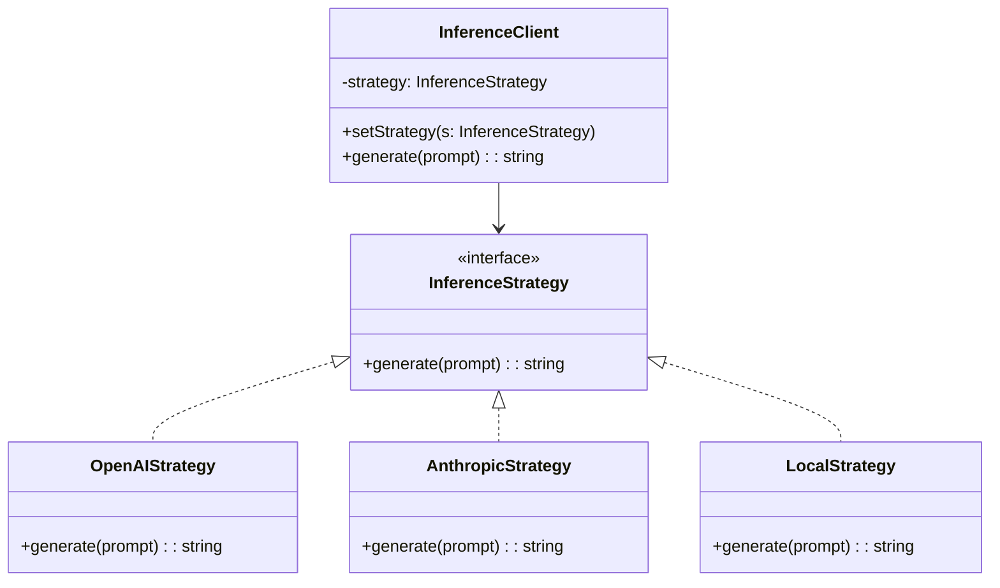
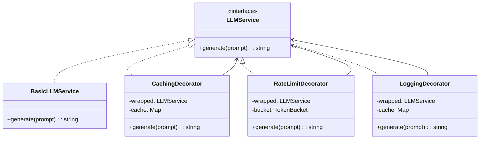

# OOP and Design Patterns for AI Engineers

## Learning Objectives

After this chapter you will be able to apply SOLID principles to build extensible ML pipelines, select the right GoF pattern for common AI engineering problems (multiple LLM providers, caching, rate limiting), design clean interfaces that decouple model serving from business logic, distinguish between composition and inheritance, and refactor monolithic code into maintainable, testable modules.

## Introduction

00-core-computer-science is a fundamental concept in AI engineering. This chapter covers the core principles, practical implementations, and interview preparation for mastering this topic.

## Prerequisites

- Basic programming knowledge
- Understanding of data structures
## Theory

### Encapsulation, Inheritance, Polymorphism, Composition

Encapsulation hides internal state behind a public interface. Inheritance defines an is-a relationship — a Dog is an Animal. Polymorphism allows different types to satisfy the same interface. Composition defines a has-a relationship — a Car has an Engine.

The classic advice: prefer composition over inheritance. Inheritance creates tight coupling and deep hierarchies that are hard to refactor. Composition allows swapping implementations at runtime.

### SOLID Principles

Single Responsibility: A class should have one reason to change. An LLMService should not also handle caching, rate limiting, and logging.

Open/Closed: Open for extension, closed for modification. Add new model providers without changing existing code — use an interface and inject new implementations.

Liskov Substitution: Subtypes must be substitutable for their base types. If a function accepts LLMProvider, it should work with OpenAIProvider, AnthropicProvider, and LocalProvider without knowing which is which.

Interface Segregation: Clients should not depend on interfaces they do not use. A ModelInference interface should not include a train() method.

Dependency Inversion: Depend on abstractions, not concretions. High-level orchestration code should depend on LLMProvider interface, not OpenAIClient directly.

### GoF Patterns for AI Engineering

Strategy Pattern: Define a family of algorithms, encapsulate each, and make them interchangeable. In AI this means swapping inference backends (OpenAI, Anthropic, local), vector stores (Pinecone, Chroma, Qdrant), or embedding models.



Observer Pattern: One-to-many dependency where changes in one object notify all dependents. Useful for ML pipeline monitoring — data loading progress, training metrics, log streaming.

Factory Pattern: Creates objects without specifying the exact class. A ModelFactory creates the right model type (GPT-4, Claude 3, Llama 3) from configuration.

Singleton Pattern: Ensures only one instance exists. Used for configuration, model registries, and connection pools. Use with caution — singletons make testing difficult.

Decorator Pattern: Wraps an object to add behavior without changing its interface. Perfect for cross-cutting concerns in AI services: caching, rate limiting, logging, retry logic.



Adapter Pattern: Converts one interface to another. Wrap OpenAI SDK, Anthropic SDK, and HuggingFace pipelines behind a common LLMProvider interface.

Command Pattern: Encapsulates a request as an object. Queue inference requests for retry, logging, or async processing.

Template Method: Defines the skeleton of an algorithm, letting subclasses override specific steps. A TrainingPipeline defines preprocess, train, evaluate, save — subclasses implement each step.

### Clean Architecture

Dependency rule: source code dependencies point inwards. Outer layers (frameworks, databases, APIs) depend on inner layers (business logic, entities). Inner layers never depend on outer layers.

For AI systems: entities are Model, Dataset, Evaluation. Use cases are InferenceUseCase (prompt -> response), TrainingUseCase (data -> trained model). Interface adapters wrap external dependencies (APIs, databases, file systems).

### Functional vs OOP

Functional programming favors pure functions, immutability, and composition of small operations. OOP favors objects with identity, state changes, and polymorphism via inheritance.

For AI engineering: use OOP for the architecture (interfaces, dependency injection, strategy pattern) and functional style within components (pure data transformations, stateless functions). This hybrid approach is common in production ML code.

## Examples

### Strategy Pattern: Multiple LLM Providers

`	ypescript
interface LLMProvider {
    generate(prompt: string, options?: Record<string, unknown>): Promise<string>
}

class OpenAIProvider implements LLMProvider {
    async generate(prompt: string, options?: Record<string, unknown>): Promise<string> {
        return OpenAI response to: ...
    }
}

class AnthropicProvider implements LLMProvider {
    async generate(prompt: string, options?: Record<string, unknown>): Promise<string> {
        return Anthropic response to: ...
    }
}

class LocalProvider implements LLMProvider {
    async generate(prompt: string, options?: Record<string, unknown>): Promise<string> {
        return Local model response to: ...
    }
}

class InferenceClient {
    private provider: LLMProvider

    constructor(provider: LLMProvider) {
        this.provider = provider
    }

    setProvider(provider: LLMProvider): void {
        this.provider = provider
    }

    async generate(prompt: string): Promise<string> {
        return this.provider.generate(prompt)
    }
}
`

### Decorator Pattern: Caching, Rate Limiting, Logging

`	ypescript
class BasicLLMService implements LLMProvider {
    async generate(prompt: string): Promise<string> {
        return Generated response for: 
    }
}

class CachingDecorator implements LLMProvider {
    private wrapped: LLMProvider
    private cache: Map<string, { response: string; expiresAt: number }> = new Map()
    private ttlMs: number

    constructor(wrapped: LLMProvider, ttlMs: number = 300000) {
        this.wrapped = wrapped
        this.ttlMs = ttlMs
    }

    async generate(prompt: string): Promise<string> {
        const cached = this.cache.get(prompt)
        if (cached && cached.expiresAt > Date.now()) {
            return cached.response
        }
        const response = await this.wrapped.generate(prompt)
        this.cache.set(prompt, { response, expiresAt: Date.now() + this.ttlMs })
        return response
    }
}

class RateLimitDecorator implements LLMProvider {
    private wrapped: LLMProvider
    private requestsPerMinute: number
    private timestamps: number[] = []

    constructor(wrapped: LLMProvider, rpm: number = 60) {
        this.wrapped = wrapped
        this.requestsPerMinute = rpm
    }

    async generate(prompt: string): Promise<string> {
        const now = Date.now()
        this.timestamps = this.timestamps.filter((t) => now - t < 60000)
        if (this.timestamps.length >= this.requestsPerMinute) {
            const waitMs = this.timestamps[0] + 60000 - now
            await new Promise((r) => setTimeout(r, Math.max(waitMs, 0)))
        }
        this.timestamps.push(Date.now())
        return this.wrapped.generate(prompt)
    }
}

class LoggingDecorator implements LLMProvider {
    private wrapped: LLMProvider

    constructor(wrapped: LLMProvider) {
        this.wrapped = wrapped
    }

    async generate(prompt: string): Promise<string> {
        const start = Date.now()
        console.log(generate() called with prompt length )
        try {
            const response = await this.wrapped.generate(prompt)
            console.log(generate() succeeded in ms)
            return response
        } catch (error) {
            console.error(generate() failed after ms)
            throw error
        }
    }
}
`

### Adapter Pattern: Unified LLM Interface

`	ypescript
interface ILLMProvider {
    complete(messages: { role: string; content: string }[]): Promise<string>
    embedding(text: string): Promise<number[]>
}

class OpenAIClientAdapter implements ILLMProvider {
    private apiKey: string

    constructor(apiKey: string) {
        this.apiKey = apiKey
    }

    async complete(messages: { role: string; content: string }[]): Promise<string> {
        return OpenAI completion for  messages
    }

    async embedding(text: string): Promise<number[]> {
        return new Array(1536).fill(0).map(() => Math.random())
    }
}

class AnthropicClientAdapter implements ILLMProvider {
    private apiKey: string

    constructor(apiKey: string) {
        this.apiKey = apiKey
    }

    async complete(messages: { role: string; content: string }[]): Promise<string> {
        return Anthropic completion for  messages
    }

    async embedding(text: string): Promise<number[]> {
        return new Array(1024).fill(0).map(() => Math.random())
    }
}

class HuggingFaceAdapter implements ILLMProvider {
    private modelPath: string

    constructor(modelPath: string) {
        this.modelPath = modelPath
    }

    async complete(messages: { role: string; content: string }[]): Promise<string> {
        return HuggingFace completion for  messages
    }

    async embedding(text: string): Promise<number[]> {
        return new Array(768).fill(0).map(() => Math.random())
    }
}
`

### Factory and Template Method

`	ypescript
abstract class TrainingPipeline {
    async run(data: unknown[]): Promise<void> {
        const prepared = this.preprocess(data)
        const model = this.createModel()
        const trained = await this.train(model, prepared)
        const metrics = this.evaluate(trained, prepared)
        this.save(trained, metrics)
    }

    protected abstract preprocess(data: unknown[]): unknown[]
    protected abstract createModel(): unknown
    protected abstract train(model: unknown, data: unknown[]): Promise<unknown>
    protected abstract evaluate(model: unknown, data: unknown[]): Record<string, number>
    protected abstract save(model: unknown, metrics: Record<string, number>): void
}

class ClassificationPipeline extends TrainingPipeline {
    protected preprocess(data: unknown[]): unknown[] {
        return data
    }

    protected createModel(): unknown {
        return { type: "classifier", layers: 3 }
    }

    protected async train(model: unknown, data: unknown[]): Promise<unknown> {
        return { ...model as object, trained: true, accuracy: 0.95 }
    }

    protected evaluate(model: unknown, data: unknown[]): Record<string, number> {
        return { accuracy: 0.95, f1: 0.94 }
    }

    protected save(model: unknown, metrics: Record<string, number>): void {
        console.log("Model saved with metrics:", metrics)
    }
}
`

### SOLID Refactoring Example

Violation of Single Responsibility and Dependency Inversion:

`	ypescript
class MonolithicService {
    private openaiKey: string

    constructor() {
        this.openaiKey = process.env.OPENAI_KEY || ""
    }

    async handlePrompt(prompt: string): Promise<string> {
        const cached = this.getFromCache(prompt)
        if (cached) return cached
        const response = await this.callOpenAI(prompt)
        this.logRequest(prompt, response)
        this.addToCache(prompt, response)
        return response
    }

    private async callOpenAI(prompt: string): Promise<string> {
        return 
esponse to 
    }

    private getFromCache(key: string): string | null {
        return null
    }

    private addToCache(key: string, value: string): void {
    }

    private logRequest(prompt: string, response: string): void {
        console.log(prompt, response)
    }
}
`

After refactoring with Dependency Inversion and composition:

`	ypescript
interface Cache {
    get(key: string): string | null
    set(key: string, value: string, ttlMs: number): void
}

interface Logger {
    log(message: string): void
}

class RefactoredService {
    private provider: LLMProvider
    private cache: Cache
    private logger: Logger

    constructor(provider: LLMProvider, cache: Cache, logger: Logger) {
        this.provider = provider
        this.cache = cache
        this.logger = logger
    }

    async handlePrompt(prompt: string): Promise<string> {
        const cached = this.cache.get(prompt)
        if (cached) {
            this.logger.log("Cache hit")
            return cached
        }
        const response = await this.provider.generate(prompt)
        this.cache.set(prompt, response, 300000)
        this.logger.log("Cache miss - generated new response")
        return response
    }
}
`

### Observer Pattern for ML Pipeline Monitoring

The observer pattern defines a one-to-many dependency. When the subject changes state, all observers are notified. In AI pipelines:

- Training loop publishes epoch metrics
- Observers include console logger, TensorBoard writer, Slack notifier, metrics database
- Adding a new observer does not modify the training code

```typescript
interface Observer {
    update(event: string, data: Record<string, unknown>): void
}

class TrainingSubject {
    private observers: Observer[] = []

    attach(observer: Observer): void {
        this.observers.push(observer)
    }

    detach(observer: Observer): void {
        this.observers = this.observers.filter((o) => o !== observer)
    }

    notify(event: string, data: Record<string, unknown>): void {
        for (const observer of this.observers) {
            observer.update(event, data)
        }
    }
}

class ConsoleLoggerObserver implements Observer {
    update(event: string, data: Record<string, unknown>): void {
        console.log("[" + event + "]", JSON.stringify(data))
    }
}

class SlackNotifierObserver implements Observer {
    private webhookUrl: string

    constructor(webhookUrl: string) {
        this.webhookUrl = webhookUrl
    }

    async update(event: string, data: Record<string, unknown>): Promise<void> {
        if (event === "training_complete") {
            await fetch(this.webhookUrl, {
                method: "POST",
                body: JSON.stringify({ text: "Training complete: " + JSON.stringify(data) }),
            })
        }
    }
}
```

### Command Pattern for Inference Queuing

The command pattern encapsulates a request as an object. Useful for queuing, retrying, and logging inference requests.

```typescript
interface Command {
    execute(): Promise<unknown>
    undo?(): Promise<unknown>
}

class InferenceCommand implements Command {
    private provider: LLMProvider
    private prompt: string
    private retries: number = 0
    private maxRetries: number

    constructor(provider: LLMProvider, prompt: string, maxRetries: number = 3) {
        this.provider = provider
        this.prompt = prompt
        this.maxRetries = maxRetries
    }

    async execute(): Promise<unknown> {
        while (this.retries < this.maxRetries) {
            try {
                return await this.provider.generate(this.prompt)
            } catch (error) {
                this.retries++
                if (this.retries >= this.maxRetries) throw error
                await new Promise((r) => setTimeout(r, 1000 * this.retries))
            }
        }
    }
}

class CommandQueue {
    private queue: Command[] = []
    private processing: boolean = false

    enqueue(command: Command): void {
        this.queue.push(command)
        this.processNext()
    }

    private async processNext(): Promise<void> {
        if (this.processing || this.queue.length === 0) return
        this.processing = true
        const command = this.queue.shift()!
        try {
            await command.execute()
        } catch (error) {
            console.error("Command failed:", error)
        }
        this.processing = false
        this.processNext()
    }
}
```

### Clean Architecture for RAG Systems

A clean architecture RAG system has concentric layers:

Entities (innermost): Document, Chunk, Embedding, Query, RelevanceScore

Use cases: IngestDocument (chunks documents, generates embeddings, stores), AnswerQuery (retrieves chunks, constructs prompt, generates answer)

Interface adapters: VectorStoreGateway (PineconeAdapter, ChromaAdapter), LLMGateway (OpenAIAdapter, AnthropicAdapter), DocumentStoreGateway (S3Adapter, LocalAdapter)

Frameworks (outermost): Express routes, CLI commands, test harnesses

The dependency rule ensures that changes to Pinecone API do not affect the AnswerQuery use case — only the VectorStoreGateway adapter changes.

### Testing with Mocks

```typescript
class MockLLMProvider implements LLMProvider {
    private responses: Map<string, string> = new Map()

    setResponse(prompt: string, response: string): void {
        this.responses.set(prompt, response)
    }

    async generate(prompt: string): Promise<string> {
        const response = this.responses.get(prompt)
        if (!response) throw new Error("No mock response for: " + prompt)
        return response
    }
}

// Usage in tests
const mock = new MockLLMProvider()
mock.setResponse("Hello", "Hi there!")
const client = new InferenceClient(mock)
const result = await client.generate("Hello")
// result === "Hi there!"
```

## Summary

SOLID principles and design patterns are battle-tested approaches to writing maintainable, extensible AI systems. The strategy pattern lets you swap model providers at configuration time. The decorator pattern composes cross-cutting concerns (caching, rate limiting, logging) without tangling them with business logic. The adapter pattern unifies different LLM SDKs behind a common interface. Clean architecture keeps framework dependencies at the edges, making your core logic testable. The rule is simple: depend on abstractions, inject dependencies, compose behavior, and test in isolation.

## Practical Takeaways

- Always code to an interface, not an implementation. An LLMProvider interface lets you switch providers in one line
- Use the decorator pattern for all cross-cutting concerns — never mix caching/billing/logging into business logic
- A strategy + factory combination handles 90% of model provider switching needs
- Prefer composition over inheritance in ML pipelines — deep class hierarchies are brittle
- Clean architecture prevents framework lock-in. Keep ML logic framework-agnostic
- Test with mock providers using the same interface — swap OpenAI with a mock that returns canned responses
- Design patterns should simplify, not complicate. If a pattern adds more code than it removes, don't use it

## Chapter Quiz

1. Which SOLID principle is violated when a class handles both model inference and request logging?
   - A) Liskov Substitution
   - B) Interface Segregation
   - C) Single Responsibility
   - D) Dependency Inversion
   // correct: C

2. The decorator pattern is best suited for:
   - A) Creating families of related objects
   - B) Adding behavior to an object without changing its interface
   - C) Defining a one-to-many dependency
   - D) Wrapping multiple interfaces into one
   // correct: B

3. What is the primary benefit of the adapter pattern for LLM integrations?
   - A) Improved inference speed
   - B) Unified interface across different provider SDKs
   - C) Automatic retry on failures
   - D) Built-in caching
   // correct: B

4. Dependency Inversion means:
   - A) Depend on concretions, not abstractions
   - B) Depend on abstractions, not concretions
   - C) Invert method call order
   - D) Use inheritance for code reuse
   // correct: B

5. Why prefer composition over inheritance?
   - A) Composition is faster at runtime
   - B) Inheritance creates tight coupling and deep hierarchies
   - C) Composition uses less memory
   - D) Inheritance is deprecated in TypeScript
   // correct: B

## Exercises


## Common Mistakes

1. Not understanding the fundamental concepts before applying them
2. Skipping edge cases in implementation
3. Not analyzing time/space complexity
4. Forgetting to handle null/empty inputs
5. Not practicing enough problems to build pattern recognition1. Implement a CircuitBreakerDecorator that wraps an LLMProvider and trips after N consecutive failures, with a configurable reset timeout.

2. Build a ProviderFactory that reads a config file and returns the correct LLMProvider implementation with all decorators applied.

3. Refactor a monolithic RAG pipeline into clean architecture layers: entities (Document, Chunk, Query), use cases (IngestUseCase, QueryUseCase), and interface adapters (VectorStoreAdapter, LLMAdapter).

4. Implement the observer pattern for a training pipeline that notifies multiple listeners (console logger, metrics dashboard, Slack notifier) on epoch com
## Revision Notes

- Key concept 1: Core principle of 00-core-computer-science
- Key concept 2: Common implementation pattern
- Key concept 3: Time/space complexity to remember
- Key concept 4: When to apply this technique
- Key concept 5: Common interview pattern
- Key concept 6: Edge cases to handle
- Key concept 7: Related concepts for deeper understanding
## Placement Section

### Top 10 Interview Questions

#### Google Style
1. Explain the time and space trade-offs of 00-core-computer-science. When would you choose one approach over another?
2. Design a system that efficiently handles 00-core-computer-science at scale (millions of requests/second).

#### Amazon Style
1. Tell me about a time you had to optimize a system related to 00-core-computer-science. What was your approach and what was the result?
2. How would you explain 00-core-computer-science to a non-technical stakeholder?

#### Microsoft Style
1. How does 00-core-computer-science integrate with enterprise systems and cloud architectures?
2. What are the security implications of 00-core-computer-science?

#### NVIDIA Style
1. How would you optimize 00-core-computer-science for GPU-accelerated computing?
2. What parallel processing patterns apply to 00-core-computer-science?

#### AI Startup Style
1. How would you implement 00-core-computer-science in a cost-effective, scalable way for a startup?
2. What's the fastest way to prototype a solution using 00-core-computer-science?

### Resume Tips
- **Technical Skills**: List 00-core-computer-science under relevant technical skills
- **Project Description**: "Implemented 00-core-computer-science to [specific outcome], reducing [metric] by [X]%"
- **Keywords**: Include 00-core-computer-science in your skills section for ATS optimization

### Interview Day Checklist
- [ ] Review core concepts of 00-core-computer-science
- [ ] Practice 3-5 problems related to 00-core-computer-science
- [ ] Prepare 2 real-world examples of using 00-core-computer-science
- [ ] Know the time/space complexity of common 00-core-computer-science operations
- [ ] Have questions ready about how the company uses 00-core-computer-sciencepletion.
