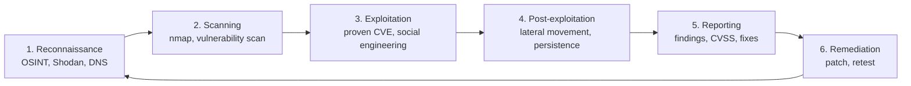
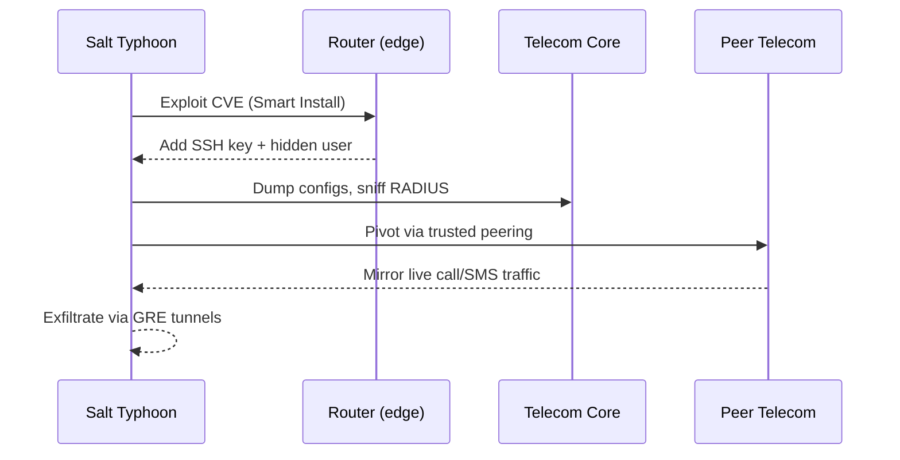
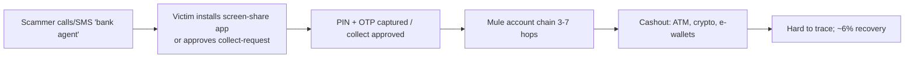

<!-- Clear Language: Keep sentences under 50 words -->
# Ethical Hacking & Security Case Studies (India & Global)

## Learning Objectives

After this chapter you will be able to explain who real attackers are (nation-states, crime syndicates, insiders), describe how telecom networks get compromised using Salt Typhoon as the reference case, analyze India's UPI fraud ecosystem with official statistics, apply a defense playbook (patching, MFA, SIM lock, no OTP sharing), recognize Wi-Fi and mobile-network attack techniques, and identify legitimate ways to access the internet without a data subscription.

## Introduction

Hacking is not a movie. It is a trillion-dollar industry run by intelligence agencies, organized crime groups, and a long tail of opportunists. Between 2024 and 2026, telecoms, hospitals, schools, and crypto exchanges were breached at unprecedented scale. This chapter studies the real cases — India and the world — from a defender's perspective, so you can recognize the techniques, prevent the attacks, and build security into the AI systems you will ship.

## Prerequisites

- Chapter 01 (Computer Networks): TCP/IP, DNS, VPN, TLS basics
- Chapter 02 (Operating Systems): processes, accounts, file permissions
- Basic programming knowledge (TypeScript for the examples)

## Key Terminology

**Ethical hacking**: Authorized security testing performed with written permission to find and fix vulnerabilities.

**APT (Advanced Persistent Threat)**: A state-sponsored or highly organized group that maintains long-term access to target networks.

**Vulnerability**: A weakness in software, hardware, or process that an attacker can exploit.

**Exploit**: Code or a technique that takes advantage of a vulnerability.

**Zero-day**: A vulnerability exploited before the vendor has a patch for it.

**Social engineering**: Manipulating people into revealing secrets or performing actions, instead of breaking technical controls.

**SIM swap**: Fraud where an attacker gets a duplicate SIM issued for the victim's number and receives their OTPs.

**IMSI catcher (stingray)**: A spoofed cell tower that forces nearby phones to connect and intercepts their traffic.

**Mule account**: A bank account (often rented or opened by a recruited person) used to launder stolen money.

**Responsible disclosure**: Reporting a vulnerability privately to the owner, giving time to patch, then publishing.

## Theory

### 1. What Ethical Hacking Actually Is

Ethical hacking is authorized. The boundary is permission, scope, and disclosure — not skill. Three rules separate an ethical tester from a criminal:

1. **Written authorization**: A signed scope document from the asset owner, listing systems, techniques, and time windows.
2. **Limited scope**: Test only what is agreed. Touching a different server breaks the authorization.
3. **Responsible disclosure**: Report findings to the owner first, then coordinate public disclosure after a patch exists.

#### Legal framework — India

| Law | What it covers | Penalty |
|-----|----------------|---------|
| IT Act 2000 §43 | Damage to computer systems, denial of service | Civil: up to ₹1 crore |
| IT Act 2000 §66 | Hacking with dishonest intent | Up to 3 years + ₹5 lakh fine |
| IT Act 2000 §66C | Identity theft (stolen passwords, SIM details) | Up to 3 years + ₹1 lakh |
| IT Act 2000 §66D | Cheating by personation (fake bank calls, fake UPI) | Up to 3 years + ₹1 lakh |
| IT Act 2000 §69 | Government interception powers (the legal wiretap channel) | N/A |
| BNS 2023 §318-319 | Cheating and fraud (replaces IPC 419/420) | Up to 7 years |
| DPDP Act 2023 | Personal data protection and breach obligations | Up to ₹250 crore |

"Educational purpose" is not a legal defense. Unauthorized access to a system you do not own is an offense in India (IT Act §66), the US (CFAA, 18 USC §1030), the UK (Computer Misuse Act 1990), and the EU (GDPR + national cyber laws). The legal path to testing skills is bug-bounty platforms (HackerOne, Bugcrowd), CTF competitions, lab networks like HackTheBox and TryHackMe, and your own self-hosted targets.

#### The ethical hacking methodology



Defenders must know steps 1-4 conceptually so they can build controls for 5-6. The rest of this chapter studies real attackers who ran these steps against real targets.

### 2. The Attacker Landscape: Who Actually Hacks

| Actor type | Motive | Examples 2024-2026 | Typical methods |
|-----------|--------|--------------------|-----------------|
| Nation-state APT | Espionage, sabotage | Salt Typhoon (China), UNC3886, Volt Typhoon, Lazarus (DPRK) | Zero-days, edge-device exploits, tunneling, living off the land |
| Criminal syndicate | Money | ShinyHunters, LockBit, SafePay, INC, Medusa, Lynx | Ransomware, extortion-only theft, credential phishing |
| Financially motivated APT | Money | Lazarus Group (ByBit $1.5B) | Crypto-wallet exploits, social engineering |
| Hacktivist | Ideology | Handala (Iran-linked, Stryker), Anonymous-style groups | DDoS, defacement, data dump |
| Insider | Revenge, greed, carelessness | Coupang ex-employee (33.7M records) | Data exfiltration, credential abuse |
| Script kiddie / scammer | Quick money | UPI scam call centers, "free internet" APK gangs | Social engineering, malware kits |

The biggest shift of 2024-2026: **state actors and criminals now use the same tooling**, and both increasingly weaponize AI — AI-generated phishing, deepfake voice OTP calls, and AI-assisted vulnerability research.

### 3. Global Case Studies (2024–2026)

#### Case 1: Salt Typhoon — the worst telecom hack in history (2021–present)

Salt Typhoon is a Chinese Ministry of State Security-linked group, first revealed in October 2024. The FBI's director called it China's "most significant cyber-espionage campaign in history."

**What happened**: The group compromised 200+ companies across 80 countries, including AT&T and Verizon, and used telecom wiretap mechanisms to intercept calls, texts, and locations in real time. Communication metadata of a large number of Americans was stolen, and campaign communications of US politicians were targeted.

**How it worked** (the playbook every telecom defender now fears):

1. **Initial access**: Exploited internet-exposed network edge devices — Cisco IOS Smart Install (CVE-2018-0171) and other unpatched CVEs. No zero-days were needed; known, unpatched flaws were enough.
2. **Persistence**: Created hidden users in `/etc/passwd` and `/etc/shadow`, added SSH authorized keys under root, and weakened device ACLs.
3. **Lateral movement**: Dumped router configs (passwords, RADIUS secrets), used compromised switches as SSH jump boxes, and followed "trusted" telecom-to-telecom peering links into other carriers.
4. **Collection**: Enabled SPAN/ERSPAN port mirroring and GRE tunnels to siphon live traffic to attacker-controlled infrastructure.



**Lessons for defenders**: patch edge devices first (only 26% of CISA-KEV critical vulnerabilities were fully patched in 2025), replace shared passwords on network gear, monitor config changes and new SSH keys, and encrypt everything end-to-end — the FBI's own advice to Americans was to use Signal/WhatsApp.

#### Case 2: ByBit — the $1.5 billion crypto heist (February 2025)

North Korea's Lazarus Group stole $1.5 billion in Ethereum from the Dubai-based exchange ByBit, the largest crypto heist ever. The attack exploited a third-party wallet infrastructure component during a routine fund transfer; over $160 million was laundered within 48 hours. This single case shows how a financially motivated APT can operate at the scale of a small country's GDP, and why "secure your build pipeline and your supply chain" is not a slogan.

#### Case 3: Canvas / Instructure — 275 million students exposed (May 2026)

The ShinyHunters syndicate breached Canvas, the learning platform used by ~9,000 schools globally, exfiltrated 3.65 TB and claimed ~275 million user records (names, student IDs, messages). They replaced the login page with a ransom demand after a second intrusion; Instructure paid. This is the defining "supply chain via cloud" case: one cloud compromise hit 9,000 institutions.

#### Case 4: Change Healthcare & Conduent — healthcare's ransomware era

- **Change Healthcare (2024)**: 192.7 million records — the largest US healthcare breach ever, caused by a single missing MFA factor on an unpatched Citrix portal. The outage disrupted US prescription processing nationwide.
- **Conduent (2026)**: SafePay ransomware, 62.2 million records, with **83 days of undetected access** before discovery. Attackers exfiltrated 8.5 TB before encrypting anything.

**Lesson**: The breach window is days-to-months. Detection time, not prevention alone, decides the damage.

#### Case 5: Fortinet — hacking the world's doorways (June 2026)

Russian-speaking attackers compromised ~74,000 Fortinet firewalls in 194 countries — roughly half of all internet-facing FortiGate devices. The operation combined mass scanning, a custom 25,000-thread credential sprayer, and a 45-GPU hash-cracking cluster. Victims included Oracle, Chevron, Lenovo, FedEx, a NATO defense contractor, Foxconn, Samsung, Comcast, Siemens, PwC, and Accenture. **India was a top-6 affected country.**

#### Global case study summary table

| Case | When | Scale | Root cause | Defender lesson |
|------|------|-------|-----------|-----------------|
| Salt Typhoon | 2021–26 | 200+ orgs, 80 countries | Unpatched edge devices | Patch edge gear first; E2EE everything |
| ByBit | Feb 2025 | $1.5B stolen | Third-party wallet component | Audit supply chain, not just your own code |
| Canvas/Instructure | May 2026 | ~9,000 schools, 275M users | Cloud compromise | Log, detect, and contain cloud access |
| Change Healthcare | 2024 | 192.7M records | Missing MFA + unpatched portal | MFA everywhere; patch critical CVEs |
| Conduent | 2026 | 62.2M records | 83-day undetected access | Fast detection (SIEM/EDR) limits blast radius |
| Fortinet | Jun 2026 | 74K devices, 194 countries | Weak passwords + known CVEs | Hardened configs, vaulted secrets, monitoring |
| JLR (UK) | Sep 2025 | ~£1.9B damage | Ransomware | Backup + offline recovery drills |
| Coupang (South Korea) | Dec 2025 | 33.7M accounts | Insider | Least-privilege access, DLP |

### 4. India Case Studies

#### Case 6: Tata Electronics — Apple & Tesla files leaked (June 2026)

A breach at Tata Electronics leaked thousands of confidential files, including information related to Apple and Tesla. The attackers demanded a ransom. Apple launched an investigation. The case is a reminder that Indian manufacturing and supply chains are now first-class espionage and extortion targets — India ranked among the top countries hit by the global Fortinet breach too.

#### Case 7: The UPI fraud ecosystem — India's most widespread crime

UPI processed 20+ billion transactions per month in FY26. Fraud grew with it. Official Parliament data (MoS Finance, March 2026):

| Financial Year | Fraud cases (lakh) | Amount involved (₹ crore) |
|---------------|-------------------|---------------------------|
| FY 2022-23 | 7.25 | 573 |
| FY 2023-24 | 13.42 | 1,087 |
| FY 2024-25 | 12.64 | 981 |
| FY 2025-26 (Apr–Mar 15) | 16.29 | 1,226 |

Almost 8 million digital-payment frauds (~₹130 billion) were reported to the RBI across the ecosystem. A LocalCircles survey (2025) found **1 in 5 UPI households hit by fraud**, with 51% of victims never reporting it. Only ~6% of chargebacks were recovered.

**The common attack chain**:



**Top fraud methods by volume** (PwC 2025, CloudSEK 2026, NPCI):

1. **Collect-request scams** — the single largest source. A "refund token" or "payment confirmation" collect request is approved by the victim; entering the PIN debits *their* account.
2. **Screen-mirroring scams** — fake bank/customs/income-tax calls install AnyDesk/TeamViewer; the PIN is watched live.
3. **QR-swap and fake "refund QR"** — scanning a QR to "receive" a refund debits the victim. QR-swap stickers replace legitimate merchant codes.
4. **SIM swap → UPI re-registration** — a duplicate SIM grabs the OTP; the attacker re-registers UPI on their device.
5. **Phishing + malware APKs** — fake bank/KYC sites harvest PIN+OTP. The "Digital Lutera" Android toolkit (CloudSEK, Mar 2026) fakes the SIM identity so OTPs are silently forwarded to Telegram — a structural attack on device trust.
6. **Fake customer-care numbers** (SEO-poisoned), **merchant overpayment-refund scams**, **UPI Autopay mandate tricks**, **mule-account recruitment** (students, gig workers), **UPI Lite abuse** on lost phones, and **deepfake voice OTP** calls (2026).

**Official controls**: NPCI device binding, PIN-based 2FA, daily transaction limits, AI/ML fraud monitoring, mandatory display of the recipient's registered name, a 24-hour cooling period for new-device UPI registration, and a 72-hour freeze on accounts where SIM swap is detected. RBI built MuleHunter.AI, the Central Payment Fraud Information Registry, and the Digital Payments Intelligence Platform. Banking domains moved to `.bank.in` to kill phishing clones.

**Reporting and liability**: report within 3 days for full-refund eligibility; between 4-7 days, customer liability is capped at ₹5,000–₹25,000; zero liability if the bank's systems failed. Report via helpline **1930**, cybercrime.gov.in, and your bank. First hour matters most.

#### Case 8: Earlier benchmarks — BigBasket & Domino's India

Before the UPI era, India's signature breaches were e-commerce leaks: BigBasket (2020, ~20 million records reported) and Domino's India (2021, ~1 million order records with ransom demands). Both taught the same lesson Indian companies keep relearning: **stolen data gets repackaged and reused** — old breach dumps are now aggregated with AI and weaponized for credential-stuffing and account takeover (the ITRC calls this "previously compromised data"; two 2025 dumps alone totaled ~16 billion records).

#### Case 9: KYC / Aadhaar-update scams

"Your KYC will expire" SMS messages lead to pixel-perfect fake pages collecting Aadhaar numbers, OTPs, and biometric data, later used to open fraud accounts or enroll attacker-controlled UPI IDs. India-specific defense: KYC updates only happen inside official banking apps — never via a link.

### 5. Mobile Network Attacks & Prevention

Mobile networks add an entire attack surface on top of the internet:

| Attack | How it works | How to prevent it |
|--------|--------------|-------------------|
| IMSI catcher / fake tower | A portable radio impersonates a cell tower; phones auto-connect; 2G fallback makes it trivial | Disable 2G on the phone; use 4G/5G SIM with strong crypto; carriers must authenticate towers (5G improves this) |
| SS7 / Diameter signaling attacks | Old telco-internal protocols trust the sender; messages and locations get intercepted | User-side: E2EE apps (Signal/WhatsApp); carrier-side: signaling firewalls |
| SIM swap | Social engineering or a corrupt SIM agent issues a duplicate SIM | Carrier PIN/SIM lock, account password, monitor SIM-active notifications, Sanchar Saathi (sancharsaathi.gov.in) |
| Malicious APN/VPN configs ("free internet") | Trick user into installing configs/APKs that route traffic through attacker infrastructure or install spyware | Never apply APNs/VPNs from social media; the config cannot create free data anyway — billing is core-side |
| Evil twin Wi-Fi / rogue AP | Fake SSID named like the venue; traffic is sniffed or redirected | Confirm the exact SSID with staff; HTTPS everywhere; trusted VPN; avoid banking on public Wi-Fi |
| Premium SMS / USSD traps | Dialing codes or approving subscriptions triggers charges | Block premium numbers with the carrier; never dial unknown USSD codes |
| Phone-based phishing (smishing/vishing) | Voice and SMS phishing; mobile click rates are ~40% higher than email | Assume urgency is a lie; verify via official app; never share OTP/PIN |

**The carrier billing reality** (from Chapter 01): data is metered at the carrier's core (PGW/PCRF), never on the phone. Any "₹0 balance + unlimited 4G/5G — just change this APN/VPN" offer is fraud, malware, or both.

### 6. Global Trends 2024–2026 (What the Data Says)

The Verizon DBIR 2026 (22,000+ breaches across 145 countries) and ITRC reports define the current era:

1. **Vulnerability exploitation became the #1 entry method** (~31% of breaches, roughly doubled in a year), overtaking stolen credentials (13%). Only 26% of CISA-KEV critical vulnerabilities were fully patched within the year; median fix time grew to 43 days.
2. **Ransomware is in ~48% of breaches**, but 69% of victims refuse to pay, and median payments are falling ($139,875).
3. **The human element appears in ~62% of breaches**; social engineering is 16%, with pretexting (fake trusted scenarios, often by voice) rising.
4. **Supply chain exposure grew ~60%**: 48% of breaches involve a third party; 280 million victim notices in H1 2026 came from just 38 supply-chain events.
5. **Pure data-theft extortion is replacing encryption**: attackers skip the ransom-ware encryption and just threaten to leak — 2025 ransomware *incidents* dropped while extortion continued.
6. **AI is an attacker tool**: GenAI for phishing generation, vulnerability research, malware, deepfake voice, and aggregating 16-billion-record breach dumps for credential stuffing.
7. **Scale**: US compromises hit a record 3,322 in 2025, and H1 2026 alone generated 471 million victim notices — more than all of 2025 in half the time.

### 7. Legitimate Internet Without a Data Subscription

No legitimate method bypasses carrier billing. But several legal options exist for getting online without paying for a mobile data plan:

| Option | Where | Caveat |
|--------|-------|--------|
| Public Wi-Fi | Malls, cafés, airports, railway stations, hotels | Time/speed limited; use HTTPS + trusted VPN |
| PM-WANI hotspots | Government-backed public Wi-Fi across India | App-based login; safe only with HTTPS |
| Campus/office/library/hostel networks | Educational and corporate networks | Credentials required; policy-bound |
| Tethering with permission | Friend's/family's hotspot | Only with consent |
| Official operator offers | BSNL free-data days, Jio/Airtel/Vi coupon/reward data, zero-rated bundles | Only via official apps; never via Telegram configs |
| Wi-Fi calling (VoWiFi) | Any Wi-Fi network | Calls/SMS over Wi-Fi; needs SIM but not data |

**Public Wi-Fi safety rules**: verify the SSID with venue staff, never type UPI/bank credentials, keep HTTPS enforced, use a legitimate VPN provider (paid or a well-known free tier), and forget the network after use. On public Wi-Fi you are one evil-twin AP away from having your session sniffed.

### 8. The Defense Playbook

1. **Patch first**: prioritize CISA-KEV listed CVEs on edge devices, then everything else. 26% patch rate is why Salt Typhoon and Fortinet-style mass breaches happen.
2. **MFA everywhere** — hardware keys or authenticator apps, not SMS where possible (SMS is SIM-swap-able).
3. **Never share OTP/PIN/UPI PIN** — with anyone, including "bank agents". Banks never ask.
4. **SIM security**: carrier SIM lock/PIN, account password, Sanchar Saathi SIM review, immediate SIM-swap alerts.
5. **Device hygiene**: no unknown APKs, no screen-share apps for "KYC", app lock on UPI/banking, disable 2G, OS updates on.
6. **Monitoring**: SIEM/EDR, config-change alerts on routers, new SSH key detection, SIEM for cloud.
7. **Incident response**: report to 1930 (payments), CERT-In, and the bank within hours; preserve logs; do not pay ransoms (69% of victims who refuse still recover).
8. **Responsible disclosure**: report found vulnerabilities via bug bounty or vendor channels — never exploit for gain.

## Examples

### Example 1: Public Wi-Fi Risk Scorer

```typescript
interface WifiObservation {
    ssid: string
    encryption: "none" | "wep" | "wpa2" | "wpa3"
    matchedVenueName: boolean
    signalStrengthDb: number
}

class WifiRiskScorer {
    private suspiciousTokens = ["free", "wifi", "net", "hotspot", "guest"]

    score(obs: WifiObservation): { score: number; verdict: string } {
        let score = 0
        if (obs.encryption === "none") score += 40
        if (obs.encryption === "wep") score += 25
        if (obs.encryption === "wpa2") score += 5
        if (!obs.matchedVenueName) score += 15
        const base = obs.ssid.toLowerCase()
        if (this.suspiciousTokens.some((t) => base.includes(t))) score += 5
        if (obs.signalStrengthDb > -40 && obs.encryption === "none") score += 15
        const verdict = score >= 60 ? "DO NOT CONNECT" : score >= 30 ? "CAUTION" : "OK"
        return { score, verdict }
    }
}

const venueWifi = new WifiRiskScorer()
console.log(venueWifi.score({ ssid: "Airport Free WiFi", encryption: "none", matchedVenueName: false, signalStrengthDb: -35 }))
// { score: 75, verdict: "DO NOT CONNECT" }
console.log(venueWifi.score({ ssid: "DEL-T3-Premium", encryption: "wpa2", matchedVenueName: true, signalStrengthDb: -58 }))
// { score: 20, verdict: "OK" }
```

### Example 2: UPI Collect-Request Risk Classifier

```typescript
interface CollectRequest {
    vpa: string
    amount: number
    note: string
    newVpa: boolean
    unknownBeneficiary: boolean
}

class CollectRequestClassifier {
    private phishTerms = ["refund", "token", "kyc", "verify", "chargeback", "prize", "reward"]

    assess(req: CollectRequest): string[] {
        const flags: string[] = []
        if (req.amount > 0 && req.note.toLowerCase().includes("refund")) {
            flags.push("A refund should be credited, never collected via a collect request.")
        }
        if (req.unknownBeneficiary) flags.push("Beneficiary name is not a known contact.")
        if (req.newVpa) flags.push("VPA was registered recently (possible mule account).")
        if (this.phishTerms.some((t) => req.note.toLowerCase().includes(t))) {
            flags.push("Note contains high-risk wording used in scams.")
        }
        if (flags.length === 0) flags.push("Looks routine, but verify the beneficiary name in-app.")
        return flags
    }
}

const cls = new CollectRequestClassifier()
console.log(cls.assess({ vpa: "refund@icici", amount: 4999, note: "Refund token approval needed", newVpa: true, unknownBeneficiary: true }))
// ["A refund should be credited, never collected...", "Beneficiary name is not a known contact.", "VPA registered recently.", "Note contains high-risk wording."]
```

### Example 3: Breach Impact Estimator

```typescript
type DataClass = "emails" | "identity" | "credentials" | "financial" | "health"

class BreachImpactEstimator {
    private sensitivity: Record<DataClass, number> = {
        emails: 1,
        identity: 3,
        credentials: 5,
        financial: 8,
        health: 10,
    }

    estimate(affectedUsers: number, dataClasses: DataClass[], daysUndetected: number): { severity: string; advice: string } {
        const dataScore = dataClasses.reduce((sum, c) => sum + this.sensitivity[c], 0)
        const scaleScore = Math.log10(affectedUsers + 1) * 10
        const detectionScore = Math.min(daysUndetected, 90) / 90 * 15
        const total = dataScore * 2 + scaleScore + detectionScore
        const severity = total >= 90 ? "CRITICAL" : total >= 55 ? "HIGH" : total >= 30 ? "MEDIUM" : "LOW"
        const advice =
            severity === "CRITICAL"
                ? "Notify regulator + affected users, freeze credentials, hire IR team."
                : severity === "HIGH"
                  ? "Rotate all secrets, review logs, disclose promptly."
                  : "Monitor and patch; document lessons."
        return { severity, advice }
    }
}

const est = new BreachImpactEstimator()
console.log(est.estimate(62_200_000, ["health", "identity", "credentials"], 83))
// { severity: "CRITICAL", advice: "Notify regulator + affected users, freeze credentials, hire IR team." }
```

## Visual Analogy

**Hacking is like a bank heist, not a magic trick.** The attacker does not "get into the bank" with a wand. They case the building (reconnaissance), find the delivery door the owner forgot to lock (unpatched CVE), walk in wearing a uniform they borrowed (stolen credentials), leave a back door for later (SSH key), copy the safe contents over weeks (exfiltration), and are only caught because someone noticed the delivery door was unlocked for 83 days (detection time). Your job as a defender is not to make the bank unbreakable — it is to make the break-in slow, loud, and unprofitable.

**UPI fraud is a confidence trick, not a technical hack.** The PIN is never stolen by code; it is given away by the person who believes a "refund" request, an "agent", or a family member's cloned voice. The weakest link is the 62% of breaches where a human is involved.

## Summary

The 2024-2026 era is defined by five forces: state-sponsored telecom espionage (Salt Typhoon, UNC3886), record ransomware and extortion (48% of breaches), vulnerability exploitation overtaking credential theft as the top entry vector, supply-chain multiplication (one vendor breach hitting thousands of customers), and AI-assisted attacks. India's signature story is UPI fraud: 16.29 lakh cases worth ₹1,226 crore in FY26, driven by social engineering — collect requests, screen sharing, QR swaps, SIM swaps, and malware APKs — against which NPCI's device binding, cooling periods, and AI/ML monitoring are the core defenses. Ethical hacking remains the legal path to skill: authorized, scoped, and disclosed. Legitimate free internet exists (public Wi-Fi, PM-WANI, campus networks, official operator offers, VoWiFi) — anything promising "₹0 unlimited" via a config is a scam.

## Practical Takeaways

- Patch edge devices first: Salt Typhoon and the Fortinet breach both ran on unpatched known CVEs.
- Never share OTP/PIN/UPI PIN; verify refunds are credited, never collected.
- Report UPI fraud to 1930 and your bank within 3 days for best refund rights.
- Lock SIM security: carrier PIN, Sanchar Saathi review, SIM-swap alerts.
- On public Wi-Fi: HTTPS + trusted VPN + no banking apps + verify SSID with staff.
- Use E2EE apps (Signal/WhatsApp) — this is now official government advice in the US.
- Test skills legally: bug bounties, CTFs, labs; unauthorized testing is a crime even "for education".
- Build AI systems with security defaults: input validation, least privilege, logging, dependency scanning.

## Interview Q&A

**Q1: What was Salt Typhoon and why does it matter?**
A China-linked APT that breached 200+ companies in 80 countries, including US telecoms, intercepting calls and texts in real time via unpatched edge-device exploits and wiretap mechanisms. It matters because it shows unpatched CVEs + trusted peering = mass surveillance, and because it changed official advice (use E2EE apps).

**Q2: Why is collect-request the most common UPI fraud?**
The UPI protocol itself is safe; the trap is UX asymmetry. Victims approve a "refund/confirmation" collect request and enter their PIN, which debits their account. There is no technical exploit — it is social engineering against an approval flow.

**Q3: How does SIM swap enable bank fraud, and what controls block it?**
A duplicate SIM receives the victim's OTPs, letting the attacker reset UPI PINs or re-register UPI on a new device. Controls: carrier SIM lock, 24-hour cooling period for new-device UPI registration, 72-hour account freeze on detected SIM swaps, and out-of-band confirmation.

**Q4: What does "vulnerability exploitation overtook credential abuse" mean for engineers?**
Attackers now mostly enter through known, unpatched CVEs rather than stolen passwords. Engineering implication: patch cadence and asset inventory (what runs where) are the highest-leverage security activities.

**Q5: What is the ethical boundary between hacking and security research?**
Authorization (written scope), non-destruction, and responsible disclosure. Without authorization it is a crime under IT Act §66 / CFAA / CMA, regardless of motive.

## Chapter Quiz

1. Which group ran the "worst telecom hack in history" against US carriers?
   - A) Lazarus Group
   - B) Salt Typhoon
   - C) ShinyHunters
   - D) Anonymous
   // correct: B

2. What was the largest cryptocurrency heist ever recorded?
   - A) ByBit, $1.5 billion in Ethereum (Feb 2025)
   - B) Upbit, $30.4 million (Nov 2025)
   - C) Trust Wallet, $7 million (Dec 2025)
   - D) KelpDAO, $293 million (Apr 2026)
   // correct: A

3. Per the Verizon DBIR 2026, what became the #1 initial access vector?
   - A) Stolen credentials
   - B) Vulnerability exploitation
   - C) USB drops
   - D) Insider threats
   // correct: B

4. What is the single largest source of UPI fraud by complaint volume?
   - A) QR-swap at merchants
   - B) Deepfake voice OTP calls
   - C) Collect-request scams
   - D) UPI Lite abuse
   // correct: C

5. Which is a legitimate way to use the internet without a data subscription?
   - A) Applying a random APN from a Telegram channel
   - B) Connecting to an official PM-WANI public hotspot
   - C) Installing an "unlimited internet" APK
   - D) Using an HTTP injector config
   // correct: B

## Exercises

1. Build a `PhishingNoteDetector` in TypeScript that flags UPI notes containing refund/token/KYC/verify terms and returns a risk level.

2. Extend the `WifiRiskScorer` with SSID similarity checking: flag an SSID that differs from the venue's official name by one character (Levenshtein distance <= 2).

3. Write a `PatchPriorityPlanner` that takes a list of CVEs (with CVSS score and whether they are in the CISA-KEV catalog) and returns a patching order.

4. For the Salt Typhoon case, draw the full attack chain as a Mermaid flowchart with mitigations at each step.

5. Design an incident-response checklist for a UPI fraud report: what to do in the first hour, first 3 days, and first week.

## Common Mistakes

1. Believing "educational" or "knowledge purpose" legalizes unauthorized access — it does not.
2. Testing beyond the written scope: hitting a different host than agreed breaks authorization.
3. Chasing zero-days while leaving known CVEs unpatched — real attackers use the known ones.
4. Thinking a VPN/APN config can bypass carrier billing — billing is core-side, and the config usually installs malware.
5. Sharing OTP "just this once" with a person who sounds official — officials never ask.
6. Paying ransomware without backing up — 69% of victims who refuse still recover data.

## Revision Notes

- Ethical hacking = authorized + scoped + disclosed; IT Act §66 makes the rest criminal.
- Salt Typhoon playbook: unpatched edge devices → hidden users/SSH keys → config dumps → peering pivots → traffic mirroring.
- UPI fraud FY26: 16.29 lakh cases, ₹1,226 crore; #1 method = collect requests; report to 1930 in <3 days.
- DBIR 2026: vuln exploitation 31% (#1), ransomware 48%, human element 62%, supply chain 48%.
- Mobile defenses: disable 2G, carrier SIM lock, no OTP sharing, official apps only, E2EE messaging.
- Legit free internet: public Wi-Fi, PM-WANI, campus nets, official operator offers, VoWiFi.

## Placement Section

### Top 10 Interview Questions

#### Google Style

1. **Explain the Salt Typhoon campaign in under 60 seconds and what every engineer should do about it.** — Structure: who, what, how (unpatched CVEs + peering), impact, mitigation. Follow-up: how would you detect a hidden SSH key added to a router?

2. **Design a function that classifies a UPI transaction as suspicious.** — Inputs: amount, VPA age, beneficiary match, note text, device binding status. Output: score + action. Discuss precision vs recall.

3. **Why is vulnerability exploitation now the #1 breach vector, and what is the fix?** — Data: 31% vs 13% credentials; only 26% of KEV vulns patched; fix = inventory + patching SLAs.

#### Amazon Style

4. **Describe a production incident caused by social engineering or missing MFA. How would you have prevented it?** — STAR format; reference Change Healthcare (one missing MFA factor, 192.7M records).

5. **How would you protect a fintech's payment flow from collect-request and QR-swap fraud?** — UX changes (show beneficiary name, warn on collect), velocity limits, fraud model, user education.

#### Microsoft Style

6. **Compare zero-day exploitation vs known-CVE exploitation as attacker strategies. When is each preferred?** — Decision matrix: cost, reliability, detection risk; defenders should prioritize KEV list.

7. **Walk through how you would test an incident-response plan for a ransomware scenario.** — Tabletop exercise, backup restoration drills, communication templates, 1930/CERT-In reporting.

#### NVIDIA Style

8. **How does AI help both attackers and defenders at scale?** — Attackers: phishing generation, deepfake voice OTP, vulnerability research. Defenders: fraud detection models, MuleHunter.AI, anomaly detection on GPUs.

9. **Design a GPU-accelerated fraud detection pipeline for 20 billion UPI transactions a month.** — Streaming features, graph analytics for mule networks, model latency budgets, drift monitoring.

#### AI Startup Style

10. **Your startup ships an AI assistant that can initiate payments. What security design do you build in?** — Confirmation UX with beneficiary name, transaction limits, anomaly detection, audit logs, no OTP capture, user consent flows.

### Resume Tips

- Name concrete outcomes: "Built a fraud-detection feature that flagged X collect-request patterns before debit."
- Mention security vocabulary: CVE/KEV patching, MFA, E2EE, SIM swap, OWASP, incident response.
- Add a bullet about any bug-bounty or CTF experience with the platforms used.
- Keep bullets under 15 words and start with action verbs (Hardened, Automated, Detected).

### Interview Day Checklist

- Rehearse the Salt Typhoon explanation and one UPI-fraud STAR story.
- Know the numbers: 16.29 lakh UPI cases FY26, 48% ransomware, 31% vuln exploitation, 62% human element.
- Be ready to answer "what's the difference between ethical and criminal hacking?" in one sentence.
- Have a question ready about the team's patch SLAs and security review process.

## True/False

1. **True or False:** Unauthorized hacking is legal if the motive is education. — **False.** Authorization defines legality, not motive (IT Act §66, CFAA, CMA).
2. **True or False:** Salt Typhoon primarily used zero-day exploits. — **False.** Public reporting indicates it exploited *known* CVEs on unpatched edge devices.
3. **True or False:** A collect-request scam requires the victim to enter their UPI PIN. — **True.** Approving a collect request with the PIN debits the victim's account.
4. **True or False:** Changing your APN can legitimately give free internet. — **False.** Billing is enforced at the carrier core (PGW/PCRF); the device cannot bypass it.
5. **True or False:** Reporting UPI fraud within 3 days improves refund eligibility. — **True.** RBI's liability framework gives full-refund rights for prompt reporting.

## Fill in the Blank

1. The China-linked group behind the telecom breaches is called ___ . — Answer: Salt Typhoon.
2. In FY 2025-26, India reported ___ lakh UPI fraud cases involving ₹1,226 crore. — Answer: 16.29.
3. The largest crypto heist ever, the ___ exchange, lost $1.5 billion in Ethereum. — Answer: ByBit.
4. The single largest source of UPI fraud by complaint volume is ___ scams. — Answer: collect-request.
5. India's cyber-fraud helpline for payment fraud is ___. — Answer: 1930.

## Scenario Questions

1. **Scenario:** A friend forwards a Telegram channel promising "₹0 unlimited 4G — install this APK." — Response: decline; explain billing is core-side; warn the APK is likely malware/spyware; delete the channel.

2. **Scenario:** A caller claiming to be your bank asks you to install AnyDesk for KYC verification and read out an OTP. — Response: hang up; banks never ask for OTP or remote access; verify via official app or in-branch.

3. **Scenario:** You approved a ₹4,999 collect request thinking it was a refund. — Response: act within the hour: block UPI, call bank, dial 1930, file complaint on cybercrime.gov.in, preserve the transaction ID and messages.

4. **Scenario:** Your company's edge router is one of 74,000 with weak admin credentials. — Response: rotate credentials to a vault, enforce MFA on admin, patch KEV-listed CVEs, monitor config changes and new SSH keys, segment management traffic.

## Output Questions

1. **What does `WifiRiskScorer` return for `{ssid: "Cafe Guest", encryption: "none", matchedVenueName: false, signalStrengthDb: -30}`?** — Trace: none +40, unmatch +15, token +5, strong signal +15 → score 75, "DO NOT CONNECT".

2. **What does `CollectRequestClassifier` return for `{note: "refund token", newVpa: false, unknownBeneficiary: true}`?** — Flags: refund-in-collect warning, unknown beneficiary; newVpa false so no mule flag.

3. **What severity does `BreachImpactEstimator` give for 10,000 users, `["emails"]`, 2 days?** — Data 2, scale 40, detection 0.33 → total ≈ 44 → "MEDIUM".

4. **What severity for 62M users with health+identity+credentials and 83 days?** — Data 36, scale 77.8, detection 15 → ≈ 164 → "CRITICAL".

## Difficulty Level

| Level | Time | What It Takes |
|-------|------|---------------|
| Beginner | 1-2 sessions | Read theory, understand the case tables, run the examples |
| Intermediate | 3-5 sessions | Complete exercises 1-3, explain UPI fraud chain to someone |
| Advanced | 1+ week | Build the patch planner, design a fraud-detection flow, prepare for interview follow-ups |

## Tips & Tricks

- Memorize the four anchor numbers: 16.29 lakh (UPI FY26), 48% (ransomware), 31% (vuln exploitation), 62% (human element).
- When reading a breach report, always extract four things: initial access, time-to-detection, data exposed, root-cause lesson.
- Practice the one-sentence legal boundary: "Permission defines the hacker; education defines the motive."
- Use the mermaid diagrams in this chapter as flashcards — redraw the Salt Typhoon chain from memory.

## Memory Tricks

- **Acronym**: PAID — Patch first, Authenticate (MFA), Inspect (monitor), Don't share OTP.
- **Story**: Salt Typhoon is a burglar who found the delivery door unlocked (unpatched CVE), stole the doorman's uniform (credentials), and never got noticed for 83 days (detection).
- **Number anchor**: UPI fraud ≈ 16 lakh cases ≈ 1 rupee of fraud per ₹2 lakh transacted scale.
- **Color code**: red = attacker actions, green = defender controls, yellow = legal boundaries in the case tables.
- **Teach-back**: explain Salt Typhoon and collect-request fraud to a non-technical friend in 2 minutes.

## Further Reading

- MITRE ATT&CK group pages: Salt Typhoon (G1045), Lazarus (G0032)
- Verizon Data Breach Investigations Report 2026 (DBIR)
- ITRC Annual Data Breach Report 2025 and H1 2026 report
- CISA Known Exploited Vulnerabilities (KEV) catalog
- RBI "Customer Protection — Limiting Liability" circular (July 2017) and NPCI UPI fraud guidelines
- CloudSEK "Digital Lutera" malware analysis (March 2026)
- PwC "Combating Payments Fraud in India" (April 2025)

## Related Topics

- Chapter 01 (Computer Networks) — carrier billing paths, VPN, DNS, TLS
- Module 17 (AI Security & Guardrails) — prompt injection, jailbreaks, red teaming
- Module 16 (MLOps) — model deployment security, secrets management
- System design chapters (Module 07) — fraud detection, rate limiting, monitoring
- General awareness chapters — current affairs on cybercrime and 5G security

## FAQs

1. **Is ethical hacking a realistic career in India?** — Yes: CERT-In empanelment, bug bounties, bank and telecom security teams, and the growing SOC industry all hire ethical hackers.
2. **Can I legally practice hacking at home?** — Yes, on your own systems, VMs, CTF platforms (HackTheBox, TryHackMe), and authorized bug bounties.
3. **Are SIM swaps still working with SIM-binding and cooling periods?** — They still work socially; the 24h new-device cooling and 72h freeze exist precisely because the attack remains common.
4. **What is the single best security habit?** — Patch on a schedule and never share OTPs/PINs; those two cover most of the cases in this chapter.
5. **How do I report a vulnerability ethically?** — Responsible disclosure: contact the vendor privately, wait for the patch window, then publish; bug-bounty platforms provide safe legal structure.

## Important Notes

- Unauthorized access is illegal in every jurisdiction, regardless of intent.
- Telecom billing cannot be bypassed from the device; "free internet" configs are malware delivery.
- UPI fraud is mostly social engineering — the protocol's controls (device binding, PIN, limits) hold if users do not volunteer secrets.
- Real attackers prefer known CVEs over zero-days; patch cadence beats exotic defense.
- Detection time, not prevention, drives breach damage (Conduent: 83 days).
- For AI engineers: your models, APIs, and agents are now the target — apply this playbook to them.

## Historical Context

- The 1990s "phone phreaking" era taught that telecom systems are juicy targets; Salt Typhoon proved it at nation-state scale.
- India's breach history moved from e-commerce leaks (BigBasket 2020, Domino's 2021) to payment fraud at scale as UPI adoption exploded past 20 billion monthly transactions.
- The FBI's 2024 recommendation to use E2EE apps was a historic first: governments advising citizens that carrier-grade interception is real.
- The 2025-2026 shift from "mega-breach" headlines to smaller, targeted, AI-assisted attacks is the defining change of this era (ITRC: 471M notices in H1 2026).

## Security Considerations

- Never run penetration tools against networks you do not own — this includes guest Wi-Fi.
- When analyzing malware or phishing kits, use isolated VMs or sandboxes; never run them on your main device.
- Handling breach data (even public dumps) may expose PII; follow DPDP Act and company policy.
- Do not post OTPs, transaction IDs, or attack artifacts publicly.
- For AI systems: validate inputs, sanitize prompts, restrict model tool permissions, and log everything.

## ML Intuition

- Fraud detection is a classic imbalanced classification problem: 16 lakh fraudulent transactions against billions of legit ones — precision matters as much as recall.
- Mule-account detection (MuleHunter.AI) is graph ML: modeling fund flows across accounts finds laundering chains that rule-based systems miss.
- Deepfake voice OTP fraud requires detection models on both audio (synthetic-speech classifiers) and behavior (unusual outbound calls).
- AI-assisted phishing scales social engineering; defenders need the same GenAI advantage for phishing triage and alert summarization.

## Analogies

- **Breach detection is like smoke alarms**: the fire (initial access) is fast; the damage grows with the time until the alarm (detection) rings.
- **Patch management is like vaccinations**: a known, unpatched CVE is a disease with a vaccine — the 26% vaccination rate is why epidemics happen.
- **Mule accounts are like money laundromats**: cash goes in dirty at hop 1 and comes out clean after 3-7 washes.
- **The APT playbook is a chess opening**: every move (CVE → hidden user → config dump → peering pivot) has a known response (patch → monitor accounts → alert on config change → isolate peering).

## Capstone Project Link

- [Module Capstone: End-to-End Project](https://github.com/Raushan666java/ai-engineering-journey) — this chapter's security playbook feeds the MLOps and AI-security capstone work. Complete the exercises here before building any production-facing AI service.

## Flashcards

<details class="tp-qa-card" data-qid="00corecomputerscience-06ethicalhacking-flash1">
  <summary class="tp-qa-question">
    <span class="tp-qa-status"></span>
    What makes hacking ethical vs criminal, in one sentence?
  </summary>
  <div class="tp-qa-answer">
    <p>Written authorization, limited scope, and responsible disclosure — motive does not legalize unauthorized access.</p>
  </div>
</details>

<details class="tp-qa-card" data-qid="00corecomputerscience-06ethicalhacking-flash2">
  <summary class="tp-qa-question">
    <span class="tp-qa-status"></span>
    What was the Salt Typhoon initial-access method and the fix?
  </summary>
  <div class="tp-qa-answer">
    <p>Known, unpatched CVEs on internet-facing edge devices (Cisco IOS, Fortinet). Fix: patch KEV-listed CVEs first, monitor configs and SSH keys.</p>
  </div>
</details>

<details class="tp-qa-card" data-qid="00corecomputerscience-06ethicalhacking-flash3">
  <summary class="tp-qa-question">
    <span class="tp-qa-status"></span>
    Why is collect-request the most common UPI fraud?
  </summary>
  <div class="tp-qa-answer">
    <p>Victims approve a disguised collect request and enter their PIN, which debits their own account. Pure social engineering, no protocol exploit.</p>
  </div>
</details>

<details class="tp-qa-card" data-qid="00corecomputerscience-06ethicalhacking-flash4">
  <summary class="tp-qa-question">
    <span class="tp-qa-status"></span>
    List three legitimate ways to get internet without a data subscription.
  </summary>
  <div class="tp-qa-answer">
    <p>Official public Wi-Fi / PM-WANI hotspots, campus or office networks, and Wi-Fi calling (VoWiFi) — plus operator-official free-data offers.</p>
  </div>
</details>
