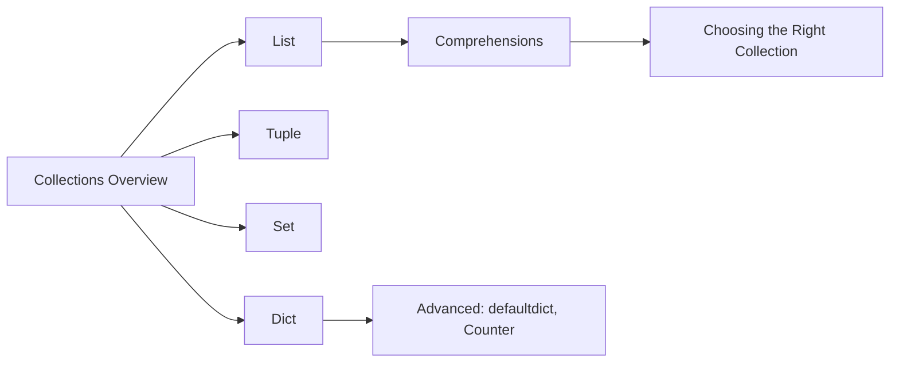

# Collections � Lists, Tuples, Sets, and Dictionaries

## Learning Objectives

| Objective | Description |
|-----------|-------------|
| LO1 | Create, access, and manipulate lists with comprehensive methods |
| LO2 | Use tuples for immutable sequences and understand their performance benefits |
| LO3 | Leverage sets for membership testing, deduplication, and set operations |
| LO4 | Build and query dictionaries for key-value mapping and lookups |
| LO5 | Write nested data structures combining multiple collection types |
| LO6 | Choose the right collection type based on time complexity and use case |

## Chapter at a Glance

| Section | Topic | Key Concept |
|---------|-------|-------------|
| 4.1 | Lists | creation, indexing, methods, sorting, copying |
| 4.2 | List Comprehensions | filtering, transformation, nested comprehensions |
| 4.3 | Tuples | immutability, packing/unpacking, named tuples |
| 4.4 | Sets | hash-based membership, union, intersection, difference |
| 4.5 | Dictionaries | key-value mapping, dict methods, defaultdict, Counter |
| 4.6 | Collection Selection | time complexity comparison, when to use what |

## Chapter Roadmap

## 4.1 Lists

Lists are ordered, mutable, heterogeneous sequences. They are the most versatile collection type.

`python
# Creation
empty = []
numbers = [1, 2, 3, 4, 5]
mixed = [1, "hello", 3.14, True]
nested = [[1, 2], [3, 4], [5, 6]]

# list() constructor
chars = list("hello")
print(chars)  # ['h', 'e', 'l', 'l', 'o']
squares = list(range(10))
print(squares)  # [0, 1, 2, 3, 4, 5, 6, 7, 8, 9]

# Access and modification
print(numbers[0])     # 1
print(numbers[-1])    # 5
numbers[2] = 99       # [1, 2, 99, 4, 5]

# Slicing � returns new list
print(numbers[1:4])   # [2, 99, 4]
print(numbers[::-1])  # [5, 4, 99, 2, 1]
`

**List methods**:

`python
items = [1, 2, 3]

# Adding
items.append(4)          # [1, 2, 3, 4]
items.extend([5, 6])     # [1, 2, 3, 4, 5, 6]
items.insert(0, 0)       # [0, 1, 2, 3, 4, 5, 6]

# Removing
items.remove(3)          # removes first occurrence of value 3
popped = items.pop()     # removes and returns last element (6)
first = items.pop(0)     # removes and returns element at index 0
items.clear()            # []

# Searching and counting
nums = [1, 2, 3, 2, 4, 2]
print(nums.index(2))     # 1 � first occurrence
print(nums.count(2))     # 3
print(5 in nums)         # False

# Reordering
nums.sort()              # [1, 2, 2, 2, 3, 4]  in-place
nums.sort(reverse=True)  # [4, 3, 2, 2, 2, 1]
nums.reverse()           # in-place reversal

# sorted() returns new list
original = [3, 1, 4, 1, 5]
sorted_copy = sorted(original)
print(sorted_copy)       # [1, 1, 3, 4, 5]
print(original)          # [3, 1, 4, 1, 5] � unchanged
`

**List copying**:

`python
# Shallow copy � 3 approaches
a = [1, 2, [3, 4]]
b = a.copy()         # method
c = list(a)          # constructor
d = a[:]             # slice
print(b == a)  # True  � same values
print(b is a)  # False � different objects

# Shallow copy means nested objects are shared
a[2].append(5)
print(b[2])  # [3, 4, 5] � affected!

# Deep copy � fully independent
import copy
e = copy.deepcopy(a)
a[2].append(6)
print(e[2])  # [3, 4, 5] � independent
`

---

## 4.2 List Comprehensions

`python
# Basic transformation
squares = [x**2 for x in range(10)]
print(squares)

# With condition
evens = [x for x in range(20) if x % 2 == 0]

# if-else in expression
labels = ["even" if x % 2 == 0 else "odd" for x in range(5)]
print(labels)  # ['even', 'odd', 'even', 'odd', 'even']

# Nested loops
pairs = [(x, y) for x in [1, 2] for y in ["a", "b"]]
print(pairs)  # [(1, 'a'), (1, 'b'), (2, 'a'), (2, 'b')]

# Flatten matrix
matrix = [[1, 2], [3, 4], [5, 6]]
flat = [num for row in matrix for num in row]
print(flat)  # [1, 2, 3, 4, 5, 6]

# Transpose matrix
transposed = [[row[i] for row in matrix] for i in range(2)]
print(transposed)  # [[1, 3, 5], [2, 4, 6]]
`

---

## 4.3 Tuples

Tuples are immutable sequences � they cannot be modified after creation.

`python
# Creation
empty = ()
single = (42,)        # trailing comma required
pair = (1, 2)
triple = 1, 2, 3      # parentheses optional

# Tuple unpacking
point = (3, 4)
x, y = point
print(f"({x}, {y})")  # (3, 4)

# Swap variables
a, b = 10, 20
a, b = b, a
print(a, b)  # 20 10

# Returning multiple values
def min_max(items):
    return min(items), max(items)

result = min_max([3, 1, 7, 2, 9])
low, high = result
print(low, high)  # 1 9

# Tuple as dictionary keys
locations = {
    (40.7128, -74.0060): "New York",
    (51.5074, -0.1278): "London",
}
`

**Named tuples**:

`python
from collections import namedtuple

Point = namedtuple("Point", ["x", "y", "z"])
p = Point(1, 2, 3)
print(p.x, p.y, p.z)  # 1 2 3
print(p[0])            # 1 � indexable like tuple
x, y, z = p            # unpackable
`

**List vs Tuple**:

| Aspect | List | Tuple |
|--------|------|-------|
| Mutability | Mutable | Immutable |
| Performance | Slower | Faster (smaller, no overallocation) |
| Hashable | No | Yes (if elements hashable) |
| Use case | Dynamic collections | Fixed records, dict keys |
| Memory | Over-allocates | Exact size |

---

## 4.4 Sets

Sets are unordered collections of unique, hashable elements with O(1) membership testing.

`python
# Creation
empty = set()                    # not {} � that's empty dict
numbers = {1, 2, 3, 4, 5}
from_list = set([1, 2, 2, 3, 3])
print(from_list)                 # {1, 2, 3}

# Membership (O(1))
print(3 in numbers)   # True
print(99 in numbers)  # False

# Adding and removing
nums = {1, 2, 3}
nums.add(4)          # {1, 2, 3, 4}
nums.add(2)          # {1, 2, 3, 4} � no effect (already present)
nums.discard(2)      # {1, 3, 4} � no error if missing
nums.remove(1)       # {3, 4} � raises KeyError if missing
popped = nums.pop()  # removes and returns arbitrary element
nums.clear()         # set()
`

**Set operations**:

`python
a = {1, 2, 3, 4}
b = {3, 4, 5, 6}

print(a | b)   # Union:        {1, 2, 3, 4, 5, 6}
print(a & b)   # Intersection: {3, 4}
print(a - b)   # Difference:   {1, 2}     (in a not in b)
print(b - a)   # Difference:   {5, 6}     (in b not in a)
print(a ^ b)   # Symmetric:    {1, 2, 5, 6} (in either, not both)

# Comparison
print(a == b)           # False
print({1, 2} < a)       # True � proper subset
print(a > {1, 2})       # True � proper superset
print(a.isdisjoint(b))  # False � they share {3, 4}

# Frozen set � immutable, hashable
fs = frozenset([1, 2, 3])
print(fs)  # frozenset({1, 2, 3})
`

---

## 4.5 Dictionaries

Dictionaries map unique keys to values with O(1) average lookup.

`python
# Creation
empty = {}
scores = {"Alice": 95, "Bob": 87, "Charlie": 92}
pairs = dict([("a", 1), ("b", 2)])
comprehension = {x: x**2 for x in range(5)}

# Access
print(scores["Alice"])       # 95
print(scores.get("David"))   # None � safe access
print(scores.get("David", 0))  # 0 � with default

# KeyError for missing key
# print(scores["David"])  # KeyError

# Adding and modifying
scores["David"] = 88         # add new
scores["Alice"] = 96         # update existing

# Deleting
del scores["Bob"]            # remove key
popped = scores.pop("David") # remove and return value
scores.clear()               # remove all

# Checking keys
print("Alice" in scores)     # True
print(len(scores))           # 2
`

**Dictionary methods**:

`python
data = {"a": 1, "b": 2, "c": 3}

# Keys, values, items
print(data.keys())    # dict_keys(['a', 'b', 'c'])
print(data.values())  # dict_values([1, 2, 3])
print(data.items())   # dict_items([('a', 1), ('b', 2), ('c', 3)])

# Iterating
for key, value in data.items():
    print(f"{key}={value}")

# Merging (Python 3.9+)
d1 = {"a": 1, "b": 2}
d2 = {"b": 3, "c": 4}
merged = d1 | d2
print(merged)  # {'a': 1, 'b': 3, 'c': 4}

# Older merge
d1.update(d2)  # merges d2 into d1
print(d1)      # {'a': 1, 'b': 3, 'c': 4}
`

**defaultdict**:

`python
from collections import defaultdict

# Group items by key
words = ["apple", "banana", "apple", "cherry", "banana", "apple"]
counts = defaultdict(int)
for word in words:
    counts[word] += 1
print(dict(counts))  # {'apple': 3, 'banana': 2, 'cherry': 1}

# List as default
groups = defaultdict(list)
students = [("A", "Alice"), ("B", "Bob"), ("A", "Charlie")]
for grade, name in students:
    groups[grade].append(name)
print(dict(groups))  # {'A': ['Alice', 'Charlie'], 'B': ['Bob']}

# Default factory � nested dict
nested = defaultdict(lambda: defaultdict(int))
nested["Alice"]["math"] = 95
nested["Bob"]["science"] = 88
`

**Counter**:

`python
from collections import Counter

# Frequency counting
text = "mississippi"
counter = Counter(text)
print(counter)        # Counter({'i': 4, 's': 4, 'p': 2, 'm': 1})
print(counter["i"])   # 4

# Most common
print(counter.most_common(2))  # [('i', 4), ('s', 4)]

# Arithmetic
c1 = Counter(a=3, b=1)
c2 = Counter(a=1, b=2)
print(c1 + c2)  # Counter({'a': 4, 'b': 3})
print(c1 - c2)  # Counter({'a': 2}) � only positive counts
`

---

## 4.6 Choosing the Right Collection

**Time Complexity**:

| Operation | List | Set | Dict | Tuple |
|-----------|------|-----|------|-------|
| Index/Access | O(1) | � | O(1) | O(1) |
| Search/Contains | O(n) | O(1) | O(1) avg | O(n) |
| Insert/Append | O(1) amortized | O(1) | O(1) | Immutable |
| Delete | O(n) | O(1) | O(1) | Immutable |
| Memory | Low | Higher | Highest | Lowest |

**Selection guide**:

| Need | Use | Reason |
|------|-----|--------|
| Ordered, indexed sequence | List | O(1) access, mutable, duplicates allowed |
| Fixed record of values | Tuple | Immutable, hashable, lightweight |
| Unique items, fast membership | Set | O(1) contains, no duplicates |
| Key-value mapping | Dict | O(1) lookup by key |
| Count occurrences | Counter | Built-in counting with most_common |
| Group data by key | defaultdict | Auto-initializes missing keys |
| Ordered dict (insertion order) | dict (3.7+) | Maintains insertion order |

---

## TypeScript Parallel

`	ypescript
// TypeScript collections
// Array (like Python list)
const numbers: number[] = [1, 2, 3, 4, 5];
numbers.push(6);               // append
const popped = numbers.pop();
console.log(numbers.includes(3));  // True (like 3 in list)

// Tuple (like Python tuple)
const point: [number, number] = [3, 4];
const [x, y] = point;

// Set (like Python set)
const unique = new Set([1, 2, 2, 3]);
console.log(unique.has(2));  // True

// Map (like Python dict)
const scores = new Map<string, number>();
scores.set("Alice", 95);
console.log(scores.get("Alice"));

// Object as dict
const obj: Record<string, number> = { a: 1, b: 2 };
console.log(Object.keys(obj));
console.log(Object.entries(obj));
`

## Summary

- Lists are ordered, mutable sequences � use for indexed collections that may change
- Tuples are immutable sequences � use for fixed records and as dictionary keys
- Sets store unique elements with O(1) membership � use for deduplication and set math
- Dictionaries map keys to values with O(1) lookup � use for fast access by identifier
- List comprehensions [expr for x in iter if cond] are Pythonic and efficient
- defaultdict auto-initializes missing keys � ideal for grouping and counting
- Counter extends dict with counting convenience and arithmetic operations
- Deep copying with copy.deepcopy() creates fully independent nested structures
- Named tuples combine tuple performance with attribute access
- Choose collections based on access patterns � list for sequence, set for membership, dict for mapping

## Practical Takeaways

| Scenario | Use | Avoid |
|----------|-----|-------|
| Unique items, fast lookup | set | list with in check |
| Key-value mapping | dict | Two parallel lists |
| Counting items | Counter | Manual if x in dict: ... |
| Grouping by key | defaultdict(list) | Manual key checking |
| Fixed coordinate data | 	uple or 
amedtuple | list (allows modification) |
| Need both index and value | enumerate() | 
ange(len(lst)) |
| Creating a list from another | List comprehension | or loop with ppend |

## Interview Q&A

  
Q1: What is the difference between a list and a tuple?

  

Lists are mutable (can be modified), tuples are immutable (cannot change after creation). Tuples are slightly faster, use less memory, and can be used as dictionary keys (if all elements are hashable). Lists have over-allocation for growing, while tuples have exact size. Use tuples for fixed records and lists for dynamic sequences.

  <button class="tp-qa-mark-btn">? Mark Reviewed</button><button class="tp-qa-bookmark-btn">?? Bookmark</button>

  
Q2: How do you merge two dictionaries in Python 3.9+?

  

Use the union operator |: <code>merged = d1 | d2</code>. For older Python, use <code>d1.update(d2)</code> (modifies in-place) or <code>{**d1, **d2}</code> (unpacking). In all cases, values from the right dict override left dict for duplicate keys. Python 3.9+ also has <code>|=</code> for in-place merge.

  <button class="tp-qa-mark-btn">? Mark Reviewed</button><button class="tp-qa-bookmark-btn">?? Bookmark</button>

  
Q3: Explain the time complexity of dictionary operations.

  

Average case: O(1) for get, set, delete, and membership (in). Worst case: O(n) if many hash collisions. The average case is maintained by CPython's hash table implementation which resizes when load factor exceeds 2/3. Dictionary keys must be hashable (immutable). Memory overhead is significant but acceptable for the O(1) performance.

  <button class="tp-qa-mark-btn">? Mark Reviewed</button><button class="tp-qa-bookmark-btn">?? Bookmark</button>

  
Q4: What is the difference between a set and a frozenset?

  

set is mutable � can add, remove, discard, pop elements. frozenset is immutable and hashable, so it can be used as a dictionary key or element of another set. Both have O(1) membership testing and support standard set operations (union, intersection, etc.). Use frozenset when you need an immutable, hashable collection of unique items.

  <button class="tp-qa-mark-btn">? Mark Reviewed</button><button class="tp-qa-bookmark-btn">?? Bookmark</button>

  
Q5: What is a defaultdict and when would you use it?

  

defaultdict is a dictionary subclass that calls a factory function for missing keys instead of raising KeyError. Common factories: int (default 0), list (default []), set (default set()). Use it for grouping items, counting, or any situation where missing keys should have a default value. It eliminates boilerplate "if key not in dict" checks.

  <button class="tp-qa-mark-btn">? Mark Reviewed</button><button class="tp-qa-bookmark-btn">?? Bookmark</button>

  
Q6: How do you remove duplicates from a list while preserving order?

  

Use a loop with a set to track seen items: <code>seen = set(); [x for x in items if not (x in seen or seen.add(x))]</code>. In Python 3.7+, dict preserves insertion order so <code>list(dict.fromkeys(items))</code> also works. Using set alone loses order. For unhashable types, use a list for tracking (O(n�) but necessary).

  <button class="tp-qa-mark-btn">? Mark Reviewed</button><button class="tp-qa-bookmark-btn">?? Bookmark</button>

  
Q7: What is the difference between shallow copy and deep copy?

  

Shallow copy creates a new collection but inserts references to the same nested objects. Changes to nested objects affect both. Deep copy (copy.deepcopy) recursively creates independent copies of all nested objects. Use shallow copy for flat structures and deep copy for nested structures where full independence is needed. Deep copy is slower and may fail with circular references.

  <button class="tp-qa-mark-btn">? Mark Reviewed</button><button class="tp-qa-bookmark-btn">?? Bookmark</button>

  
Q8: When would you use a list vs a set?

  

Use a list when you need ordered elements, allow duplicates, require index-based access, or need to modify the sequence. Use a set when you need fast membership testing (O(1) vs O(n)), uniqueness constraints, or set operations (union, intersection). Sets are also useful for deduplication. For iteration, lists preserve order, sets do not (insertion order in 3.7+ is insertion order but not sortable without sorted()).

  <button class="tp-qa-mark-btn">? Mark Reviewed</button><button class="tp-qa-bookmark-btn">?? Bookmark</button>

  
Q9: How do namedtuple and dataclass differ?

  

namedtuple creates immutable tuple subclasses with named fields � lightweight but immutable. dataclass (Python 3.7+) creates mutable classes with less boilerplate, type annotations, and more features (default factories, __slots__, etc.). Use namedtuple for simple immutable records, dataclass for richer data containers with behavior and mutable fields.

  <button class="tp-qa-mark-btn">? Mark Reviewed</button><button class="tp-qa-bookmark-btn">?? Bookmark</button>

  
Q10: How do you reverse a list in-place vs returning a new reversed list?

  

Use <code>list.reverse()</code> for in-place reversal (returns None, modifies the list). Use <code>reversed(lst)</code> which returns a reverse iterator (lazy), or <code>lst[::-1]</code> which creates a new reversed list. The slice approach <code>lst[::-1]</code> is most common for a new reversed copy. reversed() is memory-efficient for iteration.

  <button class="tp-qa-mark-btn">? Mark Reviewed</button><button class="tp-qa-bookmark-btn">?? Bookmark</button>

## Chapter Quiz

**Q1**: What is the output of list({1, 2, 3} & {2, 3, 4})?

a) [2, 3]
b) [1, 2, 3, 4]
c) [2, 3, 4]
d) Error

Show Answer

<strong>Answer: a) [2, 3]</strong>

& computes set intersection. Converting to list creates [2, 3] (order may vary).

**Q2**: What does {x: x**2 for x in range(3)} produce?

a) {0: 0, 1: 1, 2: 4}
b) [0, 1, 4]
c) {0, 1, 4}
d) {0: 1, 1: 2, 2: 3}

Show Answer

<strong>Answer: a) {0: 0, 1: 1, 2: 4}</strong>

Dict comprehension mapping x to x**2.

**Q3**: Which collection has O(1) membership testing?

a) List
b) Tuple
c) Set
d) Both a and b

Show Answer

<strong>Answer: c) Set</strong>

Sets use hash tables giving O(1) average membership. Lists and tuples require O(n) scanning.

**Q4**: What is Counter("abracadabra").most_common(1)?

a) [('a', 5)]
b) ['a']
c) [('a', 4)]
d) 5

Show Answer

<strong>Answer: a) [('a', 5)]</strong>

The string has 5 'a' characters. most_common(1) returns the single most frequent item as a list of (element, count) tuples.

**Q5**: What does [x for x in [1, 2, 3, 4] if x > 2] return?

a) [1, 2]
b) [3, 4]
c) [2, 3, 4]
d) [1, 2, 3]

Show Answer

<strong>Answer: b) [3, 4]</strong>

Filtered list comprehension keeps elements greater than 2.

## Exercises

**Easy** � Write a function that returns the unique elements of a list in the order they first appear.

**Easy** � Use a dict comprehension to invert a dictionary (swap keys and values), assuming all values are unique.

**Medium** � Write a function that groups a list of tuples by the first element using defaultdict.

**Medium** � Given two lists, find the intersection, union, and symmetric difference using sets.

**Hard** � Implement a DeepCounter that counts all elements in a nested structure of lists and dicts recursively.

**Hard** � Write a function merge_nested that deep-merges two dictionaries with nested dicts, summing values for overlapping numeric keys.

---

> **Next**: [05 � Functions ?](05-functions.md)
