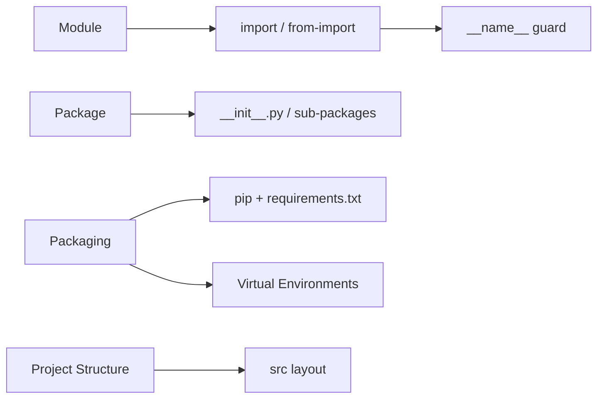

# Modules & Packages � Import System, Namespaces, and Packaging

## Learning Objectives

| Objective | Description |
|-----------|-------------|
| LO1 | Organize code into modules and use the import system |
| LO2 | Understand __name__ and __main__ guard patterns |
| LO3 | Create packages with __init__.py and sub-packages |
| LO4 | Install third-party packages with pip and manage dependencies |
| LO5 | Create virtual environments and understand isolation strategies |
| LO6 | Structure a Python project for AI/ML development |

## Chapter at a Glance

| Section | Topic | Key Concept |
|---------|-------|-------------|
| 6.1 | Modules | import, from-import, module search path, __name__ |
| 6.2 | Packages | __init__.py, sub-packages, relative imports |
| 6.3 | Standard Library | os, sys, json, math, datetime, collections |
| 6.4 | Pip & Dependencies | pip install, requirements.txt, version specifiers |
| 6.5 | Virtual Environments | venv, conda, poetry, dependency isolation |
| 6.6 | Project Structure | AI project layout, src layout, pyproject.toml |

## Chapter Roadmap

## 6.1 Modules

A module is a .py file containing Python definitions.

`python
# mymodule.py
PI = 3.14159

def greet(name):
    return f"Hello, {name}!"

if __name__ == "__main__":
    print(greet("World"))

# Import styles
import mymodule
print(mymodule.greet("Alice"))

from mymodule import greet, PI
print(greet("Bob"))

import mymodule as mm
print(mm.circle_area(3))
`

## 6.2 Packages

`
mypackage/
    __init__.py
    math_ops.py
    subpackage/
        __init__.py
        advanced.py
`

`python
import mypackage.math_ops
from mypackage import math_ops
from mypackage.math_ops import add
from .constants import PI
from ..subpackage import advanced
`

## 6.3 Standard Library

`python
import os, sys, json, math
from datetime import datetime, timedelta
from collections import defaultdict, Counter, deque
from pathlib import Path
from itertools import chain, product

os.getcwd(), os.listdir(".")
data = {"name": "Alice", "scores": [95, 87]}
json_str = json.dumps(data, indent=2)
print(Counter("mississippi").most_common(1))  # [("i", 4)]
Path("output").mkdir(exist_ok=True)
`

| Module | Purpose | Key Features |
|--------|---------|--------------|
| os | OS interface | getcwd, listdir, getenv |
| sys | Interpreter | path, argv, version |
| json | Serialization | dumps, loads, dump, load |
| math | Math | sqrt, sin, pi, log |
| datetime | Date/time | datetime, timedelta, strftime |
| collections | Containers | defaultdict, Counter, deque |

## 6.4 Pip and Dependencies

`ash
pip install numpy
pip install numpy==1.26.0
pip install -r requirements.txt
pip freeze > requirements.txt
`

**requirements.txt**:

`	xt
numpy>=1.25,<2.0
pandas>=2.0
scikit-learn>=1.3
python-dotenv>=1.0
`

## 6.5 Virtual Environments

`ash
python -m venv .venv
source .venv/bin/activate    # Linux/Mac
.venv\Scripts\activate        # Windows
deactivate

conda create -n ml_env python=3.11
conda activate ml_env
conda install numpy pandas
`

## 6.6 Project Structure

`
ml_project/
    README.md
    pyproject.toml
    requirements.txt
    src/
        ml_project/
            __init__.py
            data/
                dataset.py
            models/
                train.py
            utils/
                metrics.py
    tests/
        test_data.py
    notebooks/
`

`	oml
[build-system]
requires = ["setuptools>=68.0"]
build-backend = "setuptools.backends._legacy:_Backend"

[project]
name = "ml_project"
version = "0.1.0"
requires-python = ">=3.10"
dependencies = ["numpy>=1.25", "pandas>=2.0"]
`

## TypeScript Parallel

`	ypescript
// math.ts
export const PI = 3.14159;
export function greet(name: string): string {
    return Hello, !;
}

// app.ts
import { greet, PI } from "./math.js";
import * as math from "./math.js";
import fs from "fs";
`

## Summary

- Modules are .py files; packages are directories with __init__.py
- if __name__ == "__main__" makes files dual-purpose
- Absolute imports preferred over relative (PEP 8)
- Virtual environments isolate project dependencies
- requirements.txt pins package versions
- Standard library: os, sys, json, math, collections, itertools, pathlib
- pip freeze > requirements.txt for reproducibility
- src layout places code under src/package_name/
- pyproject.toml is the modern standard for project metadata
- __all__ controls from module import * behavior

## Practical Takeaways

| Scenario | Use | Avoid |
|----------|-----|-------|
| Import single function | from module import func | Import full module for one call |
| Package init | Empty __init__.py | Heavy logic in __init__ |
| Pin dependencies | pip freeze > requirements.txt | requirements.txt without versions |
| Environment | python -m venv .venv | Global package install |
| File paths | pathlib.Path | os.path string ops |
| CLI args | argparse | Manual sys.argv |

## Interview Q&A

  
Q1: How does Python import system work?

  

Python searches sys.path for module file, executes code once, caches in sys.modules. Order: current dir, PYTHONPATH, standard lib, site-packages.

<button class="tp-qa-mark-btn">? Mark Reviewed</button><button class="tp-qa-bookmark-btn">?? Bookmark</button>

  
Q2: What is __name__ == "__main__"?

  

Checks if file runs directly (__name__="__main__") or is imported (__name__=module name). Enables dual-purpose modules.

<button class="tp-qa-mark-btn">? Mark Reviewed</button><button class="tp-qa-bookmark-btn">?? Bookmark</button>

  
Q3: Absolute vs relative imports?

  

Absolute: full path from root. Relative: dots for same/upper packages. PEP 8 prefers absolute. Relative works only in packages.

<button class="tp-qa-mark-btn">? Mark Reviewed</button><button class="tp-qa-bookmark-btn">?? Bookmark</button>

  
Q4: Why use virtual environments?

  

Isolate dependencies per project, avoid version conflicts, prevent system pollution.

<button class="tp-qa-mark-btn">? Mark Reviewed</button><button class="tp-qa-bookmark-btn">?? Bookmark</button>

  
Q5: What is __all__?

  

List of strings defining public API. Controls from module import *.

<button class="tp-qa-mark-btn">? Mark Reviewed</button><button class="tp-qa-bookmark-btn">?? Bookmark</button>

  
Q6: venv vs conda?

  

venv: built-in Python-only, pip. conda: cross-language, CUDA/binary support. conda better for data science.

<button class="tp-qa-mark-btn">? Mark Reviewed</button><button class="tp-qa-bookmark-btn">?? Bookmark</button>

  
Q7: requirements.txt vs pyproject.toml?

  

requirements.txt: pip install with exact versions. pyproject.toml: standardized project metadata. Modern projects use both.

<button class="tp-qa-mark-btn">? Mark Reviewed</button><button class="tp-qa-bookmark-btn">?? Bookmark</button>

  
Q8: How is sys.path populated?

  

From: script directory, PYTHONPATH, standard library, site-packages. Modifiable at runtime.

<button class="tp-qa-mark-btn">? Mark Reviewed</button><button class="tp-qa-bookmark-btn">?? Bookmark</button>

  
Q9: Key standard library modules?

  

os, sys, json, math, datetime, re, collections, itertools, functools, pathlib, typing, logging, argparse, hashlib, copy, unittest.

<button class="tp-qa-mark-btn">? Mark Reviewed</button><button class="tp-qa-bookmark-btn">?? Bookmark</button>

  
Q10: How to structure an AI/ML project?

  

src layout with data/, models/, utils/ subdirs. Tests/, notebooks/, scripts/ separate. pyproject.toml, requirements.txt, gitignored data/. 

<button class="tp-qa-mark-btn">? Mark Reviewed</button><button class="tp-qa-bookmark-btn">?? Bookmark</button>

## Chapter Quiz

**Q1**: What does __name__ equal when imported? a) "__main__" b) module name c) None d) "module"

Show Answer

<strong>Answer: b) The module's qualified name</strong>

**Q2**: Which file marks a directory as package? a) main.py b) setup.py c) __init__.py d) __main__.py

Show Answer

<strong>Answer: c) __init__.py</strong>

**Q3**: How to create venv named env? a) python create venv env b) python -m venv env c) pip venv env

Show Answer

<strong>Answer: b) python -m venv env</strong>

**Q4**: PEP 8 recommends which import style? a) star imports b) absolute imports c) relative d) exec

Show Answer

<strong>Answer: b) Absolute imports</strong>

**Q5**: Which module has defaultdict and Counter? a) itertools b) functools c) collections d) dataclasses

Show Answer

<strong>Answer: c) collections</strong>

## Exercises

**Easy** � Create stats_utils.py with mean/median/mode/std and __name__ guard.
**Easy** � Install requests and fetch a URL status code.
**Medium** � Create text_analyzer/ package with tokenization, sentiment, frequency submodules.
**Medium** � Set up venv, install numpy/pandas, freeze deps, recreate from freeze.
**Hard** � Complete project with pyproject.toml, src layout, tests, CLI entry point.
**Hard** � Demonstrate all import styles on multi-package project explaining tradeoffs.

## 6.7 The `__all__` Variable

`__all__` controls what is exported when using `from module import *`.

`python
# utils/__init__.py
__all__ = ["format_date", "parse_csv"]

# Only these two names are accessible via from utils import *
# Without __all__, import * exports all non-underscore names
`

`python
# mymodule.py
__all__ = ["public_func", "CONSTANT"]

def public_func():
    return "I am public"

def _private_func():
    return "I am private"

CONSTANT = 42

# from mymodule import *  --> imports public_func and CONSTANT only
# from mymodule import _private_func  --> still works explicitly
`

## 6.8 Circular Imports

Circular imports happen when two modules import each other.

`python
# module_a.py
# from module_b import func_b  # BAD: circular!

def func_a():
    print("Function A")

# Solution: import inside function (lazy)
def use_b():
    from module_b import func_b  # OK: lazy import
    func_b()

# Solution: restructure into a common module
# common.py: shared definitions used by both A and B
`

`python
# Good design patterns to avoid circular imports:
# 1. Move shared types to a base module
# 2. Use lazy imports inside functions
# 3. Restructure package hierarchy
# 4. Use import at the bottom of the file
# 5. Merge modules that depend on each other
`

## 6.9 Module Reloading

During development, use `importlib.reload()` to reload modules.

`python
import importlib
import mymodule

# After modifying mymodule.py
importlib.reload(mymodule)  # re-executes the module code

# Note: reload() does NOT update names imported with "from"
from mymodule import greet
importlib.reload(mymodule)
print(greet("Alice"))  # might still be old version

# Best practice: only use import module, not from module import
`

## 6.10 Namespace Packages

Namespace packages allow splitting a package across multiple directories.

`python
# No __init__.py needed (PEP 420)
# Directory structure:
# project/
#   mypackage/
#     sub_a/
#       module1.py
#   vendor/
#     mypackage/
#       sub_b/
#         module2.py

# Both sub_a and sub_b are part of mypackage namespace
# import mypackage.sub_a.module1
# import mypackage.sub_b.module2
# This enables plugin systems and distributed packages
`

## 6.11 Common Pitfalls

`python
# Pitfall 1: Import * pollutes namespace
from math import *  # BAD: 50+ names imported
print(sin(0))       # can conflict with local variables

# Pitfall 2: Module-level side effects
# bad_module.py
import os
os.chdir("/tmp")    # BAD: importing changes working directory

# Pitfall 3: Circular imports causing AttributeError
# module_a imports module_b; module_b imports module_a
# Solution: restructure or use lazy imports

# Pitfall 4: Not using __name__ guard
# code.py
print("Module loaded")  # runs on import too!
if __name__ == "__main__":
    print("Script mode only")  # runs only when executed directly

# Pitfall 5: Modifying sys.path
sys.path.insert(0, "/my/custom/path")  # affects all subsequent imports
`

## 6.12 Advanced Import Techniques

`python
# Dynamic imports
module_name = "json"
import importlib
json_module = importlib.import_module(module_name)
data = json_module.dumps({"key": "value"})

# Import from string path
spec = importlib.util.spec_from_file_location("config", "/path/to/config.py")
config = importlib.util.module_from_spec(spec)
spec.loader.exec_module(config)
print(config.SETTING)  # access module contents

# Package resource access
import pkg_resources
data_path = pkg_resources.resource_filename("mypackage", "data/config.json")

# Self-contained packages with __main__.py
# python -m mypackage reads __main__.py entry point
# Useful for creating runnable packages
`

## 6.13 TypeScript Module Comparison

`typescript
// TypeScript modules use ES module syntax
// Named exports
export const PI = 3.14159;
export function greet(name: string): string {
    return `Hello, ${name}!`;
}

// Default export
export default class Calculator { }

// Import styles
import { greet, PI } from "./math.js";
import * as math from "./math.js";
import Calculator from "./Calculator.js";

// TypeScript also supports:
// - Barrel files (re-export from index.ts)
// - Path aliases in tsconfig.json
// - Dynamic imports with await import()
// - Ambient declarations (.d.ts files)
`

## 6.14 The Module Search Path

`python
import sys

# Python searches modules in this order:
# 1. Current directory (script directory)
# 2. PYTHONPATH environment variable directories
# 3. Standard library directories
# 4. Site-packages (third-party packages)

print("Module search paths:")
for i, path in enumerate(sys.path):
    print(f"  {i}: {path}")

# Adding custom paths (temporary)
sys.path.insert(0, "/path/to/custom/modules")
import my_custom_module  # now found

# Virtual environments modify sys.path to point to isolated site-packages
# python -m venv creates a fresh environment with its own sys.path

# Module cache
import sys
print(sys.modules.keys())  # all currently imported modules
# Cached modules persist until interpreter exits
# Reloading (importlib.reload) updates the cached module in-place
`

## 6.15 Building a Simple Package from Scratch

`python
# Step-by-step package creation

# Directory structure:
# text_analyzer/
#   __init__.py       # package initialization
#   tokenizer.py      # text tokenization
#   stats.py          # frequency statistics
#   utils.py          # helper functions

# __init__.py
__all__ = ["tokenize", "word_freq", "sentiment_score"]

from .tokenizer import tokenize
from .stats import word_freq
from .utils import sentiment_score

# tokenizer.py
import re

def tokenize(text: str) -> list[str]:
    """Split text into words."""
    return re.findall(r"\b\w+\b", text.lower())

def sentence_split(text: str) -> list[str]:
    """Split text into sentences."""
    return re.split(r"[.!?]+", text)

# stats.py
from collections import Counter

def word_freq(tokens: list[str]) -> dict[str, int]:
    """Count word frequencies."""
    return dict(Counter(tokens))

def most_common(tokens: list[str], n: int = 10) -> list[tuple[str, int]]:
    """Return n most common words."""
    return Counter(tokens).most_common(n)

# utils.py
def sentiment_score(text: str) -> float:
    """Simple sentiment scoring (positive words - negative words)."""
    positive = {"good", "great", "excellent", "amazing", "love", "wonderful"}
    negative = {"bad", "terrible", "awful", "hate", "horrible"}
    words = set(text.lower().split())
    pos_count = len(words & positive)
    neg_count = len(words & negative)
    return (pos_count - neg_count) / max(len(words), 1)

# Usage:
from text_analyzer import tokenize, word_freq, sentiment_score

text = "I love this great product! It is amazing and wonderful."
tokens = tokenize(text)
freq = word_freq(tokens)
score = sentiment_score(text)
print(f"Words: {len(tokens)}, Score: {score:.2f}")
`

## 6.16 Testing Your Modules

`python
# test_tokenizer.py
import unittest
from text_analyzer.tokenizer import tokenize, sentence_split

class TestTokenizer(unittest.TestCase):
    def test_tokenize_basic(self):
        result = tokenize("Hello World")
        self.assertEqual(result, ["hello", "world"])

    def test_tokenize_empty(self):
        result = tokenize("")
        self.assertEqual(result, [])

    def test_tokenize_punctuation(self):
        result = tokenize("Hello, World! How are you?")
        self.assertIn("hello", result)
        self.assertIn("world", result)

    def test_sentence_split(self):
        result = sentence_split("Hello. World! How are you?")
        self.assertEqual(len(result), 3)

if __name__ == "__main__":
    unittest.main()

# Run with: python -m unittest test_tokenizer.py
# Or: python -m pytest test_tokenizer.py
`

---

> **Next**: [07 -- File I/O & Exceptions ?](07-file-io-and-exceptions.md)
