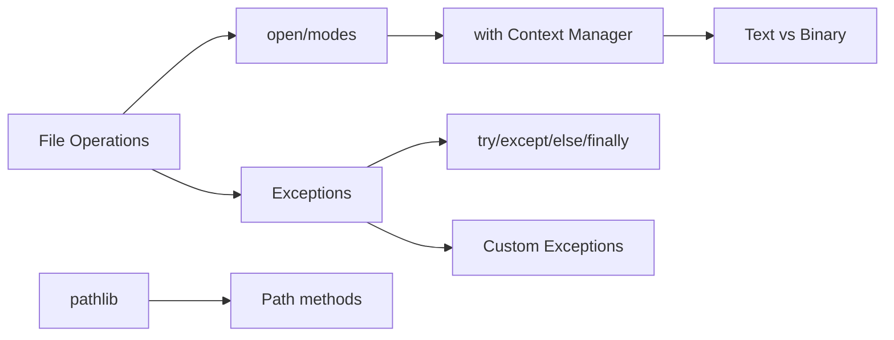

<!-- Clear Language: Keep sentences under 50 words -->
# File I/O & Exceptions — Reading, Writing, Error Handling

## Learning Objectives

| Objective | Description |
|-----------|-------------|
| LO1 | Read/write text files using open() and context managers |
| LO2 | Handle multiple file modes: r, w, a, r+, binary modes |
| LO3 | Use try/except/else/finally for robust error handling |
| LO4 | Raise and chain custom exceptions |
| LO5 | Work with binary files, pickle, and JSON serialization |
| LO6 | Use pathlib for modern file path management |

## Introduction

Python is the lingua franca of AI engineering. Mastering its syntax, data structures, and libraries is non-negotiable for building ML pipelines, APIs, and automation scripts. This module covers everything from basics to advanced concurrency.

## Prerequisites

- Basic programming knowledge
- Understanding of data structures

## Key Terminology

**Key Terms**: Core vocabulary and concepts for this topic.

**Definition**: Essential terms you must know for interviews and production work.

## Theory

Understanding file io and exceptions is fundamental for AI engineers. This section covers the core concepts, underlying principles, and theoretical framework that govern how file io and exceptions works in practice.

## Chapter at a Glance

| Section | Topic | Key Concept |
|---------|-------|-------------|
| 7.1 | File Basics | open(), modes, read/write, close |
| 7.2 | Context Managers | with, __enter__/__exit__ |
| 7.3 | Text vs Binary | encoding, pickle, struct |
| 7.4 | Exception Handling | try/except/else/finally |
| 7.5 | Custom Exceptions | raise, chaining, assert |
| 7.6 | pathlib | Path, read_text, write_text |

## Chapter Roadmap



## 7.1 File Basics

```python
file = open("hello.txt", "w", encoding="utf-8")
file.write("Hello, World!\n")
file.write("Second line\n")
file.close()

file = open("hello.txt", "r", encoding="utf-8")
content = file.read()
print(content)  # Hello, World!\nSecond line\n
file.close()

file = open("hello.txt", "r", encoding="utf-8")
for line in file:
    print(line.rstrip())
file.close()
```

| Mode | Description | Position |
|------|-------------|----------|
| r | Read (default) | Start |
| w | Write (truncates) | Start |
| a | Append | End |
| r+ | Read + Write | Start |
| rb | Read binary | Start |
| wb | Write binary | Start |

## 7.2 Context Managers

```python
with open("hello.txt", "r", encoding="utf-8") as f:
    content = f.read()

with open("output.txt", "w", encoding="utf-8") as f:
    f.write("Line 1\n")
    f.write("Line 2\n")

with open("input.txt") as fin, open("output.txt", "w") as fout:
    for line in fin:
        fout.write(line.upper())

from contextlib import contextmanager

@contextmanager
def open_file(name, mode="r"):
    f = open(name, mode, encoding="utf-8")
    try:
        yield f
    finally:
        f.close()

with open_file("hello.txt") as f:
    print(f.read())

from contextlib import suppress
with suppress(FileNotFoundError):
    os.remove("temp.txt")
```

## 7.3 Text vs Binary

```python
with open("image.jpg", "rb") as f:
    raw_bytes = f.read()
    print(f"Read {len(raw_bytes)} bytes")

import pickle
data = {"name": "Alice", "scores": [95, 87]}
with open("data.pkl", "wb") as f:
    pickle.dump(data, f)
with open("data.pkl", "rb") as f:
    loaded = pickle.load(f)

import json
with open("data.json", "w", encoding="utf-8") as f:
    json.dump(data, f, indent=2)
with open("data.json", "r", encoding="utf-8") as f:
    loaded_json = json.load(f)
```

## 7.4 Exception Handling

```python
def safe_divide(a: float, b: float) -> float:
    try:
        result = a / b
    except ZeroDivisionError:
        print("Cannot divide by zero")
        return float("inf")
    except TypeError as e:
        print(f"Type error: {e}")
        raise
    else:
        print("Division successful")
        return result
    finally:
        print("Cleanup always runs")

try:
    value = int(input("Enter a number: "))
    result = 100 / value
except (ValueError, ZeroDivisionError) as e:
    print(f"Error: {e}")
```

## 7.5 Custom Exceptions

```python
class ValidationError(Exception):
    pass

class DatabaseError(Exception):
    def __init__(self, message, query=None):
        self.message = message
        self.query = query
        super().__init__(self.message)

def validate_age(age: int):
    if age < 0:
        raise ValidationError(f"Negative age: {age}")
    return True

def process_file(path):
    try:
        with open(path) as f:
            return f.read()
    except OSError as e:
        raise RuntimeError(f"Failed: {path}") from e

assert 5 > 0, "Assertion message"  # disabled with -O flag
```

## 7.6 pathlib

```python
from pathlib import Path

p = Path("data") / "subdir" / "file.txt"
print(p.suffix)     # .txt
print(p.stem)       # file
print(p.name)       # file.txt
print(p.parent)     # Path("data/subdir")

p2 = Path("example.txt")
p2.write_text("Hello from pathlib!", encoding="utf-8")
content = p2.read_text(encoding="utf-8")

for f in Path(".").glob("**/*.py"):
    print(f.name)

Path("output/data").mkdir(parents=True, exist_ok=True)
```

## TypeScript Parallel

```typescript
import * as fs from "fs/promises";

async function readFile(path: string): Promise<string> {
    try {
        return await fs.readFile(path, "utf-8");
    } catch (error) {
        console.error("Error:", error);
        throw error;
    } finally {
        console.log("Cleanup");
    }
}
```

## Summary

- Always use with statements for file operations (automatic cleanup)
- File modes: r (read), w (truncate-write), a (append), b (binary)
- JSON for human-readable serialization; pickle for Python objects
- try/except/else/finally: except handles errors, else runs on success, finally always runs
- Exception chaining with raise ... from e preserves original traceback
- Custom exceptions inherit from Exception (not BaseException)
- pathlib provides OOP file paths (read_text, write_text, glob)
- Always specify encoding="utf-8" for text files
- Use suppress() to ignore expected exceptions
- assert statements for debugging (disabled with -O)

## Practical Takeaways

| Scenario | Use | Avoid |
|----------|-----|-------|
| Read text file | with open(f) as f: f.read() | open() without close |
| Serialize | json.dump for readability | pickle for untrusted data |
| Custom exception | Class inheriting Exception | Generic raise Exception |
| File existence | Path.exists() | os.path.exists |
| Walk directory | Path.glob("**/*.py") | Manual os.walk |
| Ignore error | contextlib.suppress() | Empty except: pass |
| Chain errors | raise from e | Losing original traceback |

## Interview Q&A

<details class="tp-qa-card" data-qid="p02-s07-q1">
  <summary class="tp-qa-question"><span class="tp-qa-status"></span>Q1: r+ vs w+ modes?</summary>
  <div class="tp-qa-answer"><p>r+: read+write without truncating. w+: truncates file first. Both allow reading and writing.</p></div><button class="tp-qa-mark-btn">? Mark Reviewed</button><button class="tp-qa-bookmark-btn">?? Bookmark</button>
</details>
<details class="tp-qa-card" data-qid="p02-s07-q2">
  <summary class="tp-qa-question"><span class="tp-qa-status"></span>Q2: How do context managers work?</summary>
  <div class="tp-qa-answer"><p>__enter__() runs at entry, returns resource. __exit__() runs at exit (even on exception). with statement ensures cleanup.</p></div><button class="tp-qa-mark-btn">? Mark Reviewed</button><button class="tp-qa-bookmark-btn">?? Bookmark</button>
</details>
<details class="tp-qa-card" data-qid="p02-s07-q3">
  <summary class="tp-qa-question"><span class="tp-qa-status"></span>Q3: Purpose of else in try/except?</summary>
  <div class="tp-qa-answer"><p>Executes only if no exception occurred. Separates success-path code from code that always runs (finally). Prevents accidentally catching exceptions from the success path.</p></div><button class="tp-qa-mark-btn">? Mark Reviewed</button><button class="tp-qa-bookmark-btn">?? Bookmark</button>
</details>
<details class="tp-qa-card" data-qid="p02-s07-q4">
  <summary class="tp-qa-question"><span class="tp-qa-status"></span>Q4: Create a custom exception?</summary>
  <div class="tp-qa-answer"><p>Inherit from Exception: class MyError(Exception): pass. Add custom fields. Raise with raise MyError("msg"). Catch with except MyError as e.</p></div><button class="tp-qa-mark-btn">? Mark Reviewed</button><button class="tp-qa-bookmark-btn">?? Bookmark</button>
</details>
<details class="tp-qa-card" data-qid="p02-s07-q5">
  <summary class="tp-qa-question"><span class="tp-qa-status"></span>Q5: What is exception chaining?</summary>
  <div class="tp-qa-answer"><p>raise ... from e chains exceptions. e.__cause__ holds the original. Useful when low-level error causes high-level error.</p></div><button class="tp-qa-mark-btn">? Mark Reviewed</button><button class="tp-qa-bookmark-btn">?? Bookmark</button>
</details>
<details class="tp-qa-card" data-qid="p02-s07-q6">
  <summary class="tp-qa-question"><span class="tp-qa-status"></span>Q6: Why pathlib over os.path?</summary>
  <div class="tp-qa-answer"><p>OOP: Path objects with methods (read_text, write_text, glob). Cross-platform, composable, more readable than os.path.</p></div><button class="tp-qa-mark-btn">? Mark Reviewed</button><button class="tp-qa-bookmark-btn">?? Bookmark</button>
</details>
<details class="tp-qa-card" data-qid="p02-s07-q7">
  <summary class="tp-qa-question"><span class="tp-qa-status"></span>Q7: pickle vs JSON?</summary>
  <div class="tp-qa-answer"><p>JSON: human-readable, cross-language, limited types. Pickle: Python-only, binary, any object. Pickle unsafe with untrusted data.</p></div><button class="tp-qa-mark-btn">? Mark Reviewed</button><button class="tp-qa-bookmark-btn">?? Bookmark</button>
</details>
<details class="tp-qa-card" data-qid="p02-s07-q8">
  <summary class="tp-qa-question"><span class="tp-qa-status"></span>Q8: Read large file without loading entirely?</summary>
  <div class="tp-qa-answer"><p>Iterate line by line: for line in file. Use read(size) for chunks. file.seek() to skip positions. mmap for very large files.</p></div><button class="tp-qa-mark-btn">? Mark Reviewed</button><button class="tp-qa-bookmark-btn">?? Bookmark</button>
</details>
<details class="tp-qa-card" data-qid="p02-s07-q9">
  <summary class="tp-qa-question"><span class="tp-qa-status"></span>Q9: What happens if forget to close file?</summary>
  <div class="tp-qa-answer"><p>File handle stays open, consuming OS resources. GC eventually closes it but timing unpredictable. Using with guarantees immediate cleanup.</p></div><button class="tp-qa-mark-btn">? Mark Reviewed</button><button class="tp-qa-bookmark-btn">?? Bookmark</button>
</details>
<details class="tp-qa-card" data-qid="p02-s07-q10">
  <summary class="tp-qa-question"><span class="tp-qa-status"></span>Q10: Binary vs text modes?</summary>
  <div class="tp-qa-answer"><p>Text: \n translated to OS line endings, needs encoding. Binary: no translation, returns bytes. Text for .txt/.csv, binary for .jpg/.mp3.</p></div><button class="tp-qa-mark-btn">? Mark Reviewed</button><button class="tp-qa-bookmark-btn">?? Bookmark</button>
</details>

## Chapter Quiz

**Q1**: Which block runs whether or not exception occurred? a) try b) except c) else d) finally

<details class="tp-qa-card" data-qid="p02-s07-quiz1"><summary>Show Answer</summary><div class="tp-qa-answer"><p><strong>Answer: d) finally</strong></p></div></details>

**Q2**: What exception for file not found in r mode? a) FileNotFoundError b) IOError c) OSError d) ValueError

<details class="tp-qa-card" data-qid="p02-s07-quiz2"><summary>Show Answer</summary><div class="tp-qa-answer"><p><strong>Answer: c) OSError (FileNotFoundError is a subclass)</strong></p></div></details>

**Q3**: Path method for file extension? a) .suffix b) .ext c) .extension d) .parts

<details class="tp-qa-card" data-qid="p02-s07-quiz3"><summary>Show Answer</summary><div class="tp-qa-answer"><p><strong>Answer: a) .suffix</strong></p></div></details>

**Q4**: What does assert do on False? a) returns False b) raises AssertionError c) prints warning d) skips

<details class="tp-qa-card" data-qid="p02-s07-quiz4"><summary>Show Answer</summary><div class="tp-qa-answer"><p><strong>Answer: b) raises AssertionError</strong></p></div></details>

**Q5**: Which is true about binary mode? a) needs encoding b) returns bytes c) translates \n d) default mode

<details class="tp-qa-card" data-qid="p02-s07-quiz5"><summary>Show Answer</summary><div class="tp-qa-answer"><p><strong>Answer: b) binary mode returns bytes</strong></p></div></details>

## Exercises

**Easy** — Read a text file, count lines/words/characters.
**Easy** — Save dict to JSON, read it back.
**Medium** — Context manager that measures execution time.
**Medium** — Exception hierarchy for a banking app (InsufficientFunds, AccountNotFound, TransferError).
**Hard** — Safe file updater writing to temp then atomic rename.
**Hard** — Recursive directory tree printer using pathlib.

## 7.7 Working with Temporary Files

```python
import tempfile
import os

## Temporary file (auto-deleted on close)
with tempfile.TemporaryFile(mode="w+t", encoding="utf-8") as tf:
    tf.write("Temporary data\n")
    tf.seek(0)
    print(tf.read())  # Temporary data

## Named temporary file
with tempfile.NamedTemporaryFile(delete=False, suffix=".txt") as ntf:
    ntf.write(b"Named temp file")
    temp_path = ntf.name

print(f"Temp file at: {temp_path}")
os.unlink(temp_path)  # manually delete

## Temporary directory
with tempfile.TemporaryDirectory() as tmpdir:
    file_path = os.path.join(tmpdir, "test.txt")
    with open(file_path, "w") as f:
        f.write("Hello from temp dir")
    print(os.listdir(tmpdir))  # ['test.txt']

## Directory auto-deleted after context
```

## 7.8 Advanced Exception Patterns

```python

## try-except-else-finally complete example
def process_config(path: str) -> dict:
    try:
        file = open(path, "r", encoding="utf-8")
    except FileNotFoundError:
        print(f"Config not found: {path}")
        return {}
    except PermissionError:
        print(f"Permission denied: {path}")
        return {}
    else:
        with file:
            import json
            try:
                return json.load(file)
            except json.JSONDecodeError as e:
                print(f"Invalid JSON: {e}")
                return {}
    finally:
        print("Config loading attempt complete")

## Exception groups (Python 3.11+)
try:
    raise ExceptionGroup("Multiple errors", [
        ValueError("Invalid value"),
        TypeError("Invalid type"),
    ])
except* ValueError as e:
    print(f"Value errors: {e.exceptions}")
except* TypeError as e:
    print(f"Type errors: {e.exceptions}")

## Context managers for resource management
class ManagedDatabase:
    def __init__(self, connection_string: str):
        self.conn = connection_string

    def __enter__(self):
        print(f"Connecting to {self.conn}")
        self.connection = {"connected": True}
        return self.connection

    def __exit__(self, exc_type, exc_val, exc_tb):
        print("Closing connection")
        self.connection["connected"] = False
        if exc_type is not None:
            print(f"Exception occurred: {exc_val}")
        return False  # don't suppress exceptions

with ManagedDatabase("db://localhost") as db:
    print(db)
```

## 7.9 File Locking and Concurrency

```python
import fcntl  # Unix only; Windows uses msvcrt
import os

## Advisory file locking
def write_with_lock(filepath: str, data: str):
    with open(filepath, "a", encoding="utf-8") as f:
        try:
            fcntl.flock(f, fcntl.LOCK_EX | fcntl.LOCK_NB)
            f.write(data + "\n")
        except BlockingIOError:
            print("File is locked by another process")
        finally:
            fcntl.flock(f, fcntl.LOCK_UN)

## Atomic file write (write to temp, then rename)
import tempfile
def atomic_write(filepath: str, data: str):
    dirpath = os.path.dirname(filepath) or "."
    with tempfile.NamedTemporaryFile(
        mode="w", dir=dirpath, delete=False, encoding="utf-8"
    ) as tf:
        tf.write(data)
        temp_path = tf.name
    os.replace(temp_path, filepath)  # atomic on POSIX

## Concurrent logging with Queue
import threading
from queue import Queue

class AsyncLogger:
    def __init__(self, filepath: str):
        self.queue: Queue[str] = Queue()
        self.thread = threading.Thread(target=self._writer, daemon=True)
        self.filepath = filepath
        self.thread.start()

    def _writer(self):
        with open(self.filepath, "a", encoding="utf-8") as f:
            while True:
                msg = self.queue.get()
                if msg is None:
                    break
                f.write(msg + "\n")
                f.flush()

    def log(self, msg: str):
        self.queue.put(msg)

    def stop(self):
        self.queue.put(None)
        self.thread.join()
```

## 7.10 Real-World File Processing

```python
import csv
import json
from pathlib import Path
from typing import Iterator

## CSV processing pipeline
def read_csv(path: Path) -> Iterator[dict]:
    with path.open("r", newline="", encoding="utf-8") as f:
        reader = csv.DictReader(f)
        yield from reader

def filter_by_column(rows: Iterator[dict], column: str, value: str):
    for row in rows:
        if row.get(column) == value:
            yield row

def write_jsonl(rows: Iterator[dict], path: Path):
    with path.open("w", encoding="utf-8") as f:
        for row in rows:
            f.write(json.dumps(row) + "\n")

## Pipeline usage
input_path = Path("data/sales.csv")
output_path = Path("data/processed.jsonl")
rows = read_csv(input_path)
filtered = filter_by_column(rows, "status", "completed")
write_jsonl(filtered, output_path)

## Config file handling with fallback
import configparser

config = configparser.ConfigParser()
config.read([
    "config.default.ini",
    "config.local.ini",
    Path.home() / ".myapp/config.ini"
])

## Log file rotation
import logging
from logging.handlers import RotatingFileHandler

handler = RotatingFileHandler(
    "app.log", maxBytes=1024 * 1024, backupCount=3
)
logging.basicConfig(
    level=logging.INFO,
    handlers=[handler],
    format="%(asctime)s - %(levelname)s - %(message)s"
)

logging.info("Application started")
logging.error("An error occurred")
```

## 7.11 Common Pitfalls

```python

## Pitfall 1: Not closing files manually (use with!)
f = open("file.txt", "r", encoding="utf-8")
data = f.read()

## f.close() forgotten -- resource leak!

## Solution: with open("file.txt") as f: data = f.read()

## Pitfall 2: Ignoring encoding
with open("file.txt", "r") as f:  # BAD: platform-dependent encoding
    data = f.read()

## Always specify: encoding="utf-8"

## Pitfall 3: Bare except clauses
try:
    result = risky_operation()
except:  # BAD: catches KeyboardInterrupt, SystemExit too
    print("Error occurred")

## Use: except Exception as e:

## Pitfall 4: Suppressing exceptions silently
try:
    func()
except Exception:
    pass  # BAD: errors are hidden

## At least log: except Exception as e: logging.error(e)

## Pitfall 5: Not handling file modes correctly
with open("file.txt", "w") as f:  # TRUNCATES existing content!
    f.write("new content")

## Use "a" for append, "r+" for read/write

## Pitfall 6: Pickle with untrusted data
import pickle
data = pickle.loads(untrusted_bytes)  # BAD: arbitrary code execution

## Use JSON or other safe formats for untrusted data

## Pitfall 7: Line ending issues between platforms
with open("file.txt", "w") as f:  # Windows: \r\n, Unix: \n
    f.write("line1\n")  # might get \r\n on Windows

## Use newline="" parameter for binary compatibility
```

## 7.12 Structured Serialization Formats

```python
import yaml  # pip install pyyaml

## YAML configuration
config_yaml = """
server:
  host: localhost
  port: 8080
database:
  url: postgresql://localhost/db
  pool_size: 10
"""
config = yaml.safe_load(config_yaml)
print(config["server"]["host"])  # localhost

## MessagePack (binary JSON alternative)
import msgpack  # pip install msgpack

data = {"compact": True, "values": [1, 2, 3]}
packed = msgpack.packb(data)
print(f"Size: {len(packed)} bytes")  # smaller than JSON
unpacked = msgpack.unpackb(packed)
print(unpacked == data)  # True

## Protocol Buffers (via protobuf library)

## message.proto:

## message Person {

##   string name = 1;

##   int32 age = 2;

## }
```

---

## Common Mistakes

1. Not understanding the fundamental concepts before applying them
2. Skipping edge cases in implementation
3. Not analyzing time/space complexity
4. Forgetting to handle null/empty inputs
5. Not practicing enough problems to build pattern recognition

## Revision Notes

- - Core principle: Understand the fundamental concepts thoroughly
- - Implementation pattern: Practice with real code examples
- - Complexity: Know the time and space complexity
- - Application: Know when to use this in production systems
- - Interview: Frequently asked in technical interviews
- - Edge cases: Consider common failure scenarios
- - Related concepts: Connect to broader system design

## Placement Section

### Top 10 Interview Questions

#### Google Style

1. **Explain the core idea of File I/O & Exceptions — Reading, Writing, Error Handling in under 60 seconds, then give a real-world analogy.** — Structure: definition, how it works in one sentence, why it matters, analogy. Follow-up: what would break if you removed this from a production system?

2. **Design a minimal, well-typed function that demonstrates File I/O & Exceptions — Reading, Writing, Error Handling.** — Interviewer checks: signature with type hints, edge cases, complexity, and a clean docstring. Follow-up: how does your design behave with empty or malformed input?

3. **What are the common pitfalls when engineers first learn ** — List 3-4, then explain how you would prevent each in a code review.

#### Amazon Style

4. **Describe a production bug caused by misunderstanding File I/O & Exceptions — Reading, Writing, Error Handling. How did you diagnose and fix it?** — STAR format: situation, task, action, result. Mention logs, reproduction, root-cause analysis, and the regression test you added.

5. **How would you scale a system that relies on File I/O & Exceptions — Reading, Writing, Error Handling from 10 users to 10 million?** — Discuss bottlenecks, caching, monitoring, and when to redesign. Follow-up: what metrics would you track?

#### Microsoft Style

6. **Compare File I/O & Exceptions — Reading, Writing, Error Handling with the closest alternative approach. When would you choose each?** — Make a decision matrix: performance, maintainability, ecosystem, learning curve. Follow-up: what would change your decision?

7. **Walk through how you would test a component that depends on File I/O & Exceptions — Reading, Writing, Error Handling.** — Unit, integration, property-based tests; mocking boundaries; golden files for outputs.

#### NVIDIA Style

8. **How does File I/O & Exceptions — Reading, Writing, Error Handling behave differently at scale — memory, throughput, or precision-wise?** — Connect to data pipelines and model training if applicable. Follow-up: what happens to latency as input grows?

9. **How would you make an implementation of File I/O & Exceptions — Reading, Writing, Error Handling run faster on GPU hardware?** — Batch operations, vectorization, avoiding Python loops, reducing data movement.

#### AI Startup Style

10. **Write the smallest possible implementation of File I/O & Exceptions — Reading, Writing, Error Handling that is production-quality.** — Include error handling, type hints, and a one-line docstring. Follow-up: what would you refactor first when it grows?

### Resume Tips

- Name File I/O & Exceptions — Reading, Writing, Error Handling explicitly in your skills section, paired with a measurable achievement ("Reduced X by 40% using File I/O & Exceptions — Reading, Writing, Error Handling").
- Add a bullet describing a project that applies File I/O & Exceptions — Reading, Writing, Error Handling to real data, with numbers.
- Mention the tools and libraries you used alongside File I/O & Exceptions — Reading, Writing, Error Handling (linters, test frameworks, profiling tools).
- Keep resume bullets under 15 words and start each with an action verb.

### Interview Day Checklist

- Rehearse a 60-second explanation of File I/O & Exceptions — Reading, Writing, Error Handling and one real-world analogy.
- Prepare one STAR story about debugging a File I/O & Exceptions — Reading, Writing, Error Handling-related production issue.
- Review complexity and edge cases for the classic File I/O & Exceptions — Reading, Writing, Error Handling interview problem.
- Have questions ready: how does the team apply File I/O & Exceptions — Reading, Writing, Error Handling in production today?
- Test your environment (Python, editor, internet) 15 minutes before the interview.

## True/False

1. **True or False:** File I/O & Exceptions — Reading, Writing, Error Handling builds directly on the fundamentals covered in the earlier chapters of this module. — **True.** Every advanced topic in this module assumes the core concepts from the previous chapters.
2. **True or False:** You should write at least one code example for File I/O & Exceptions — Reading, Writing, Error Handling before moving to the next chapter. — **True.** Active recall with hands-on code beats passive reading for retention.
3. **True or False:** The complexity analysis for File I/O & Exceptions — Reading, Writing, Error Handling is the same regardless of input size. — **False.** Complexity grows with input size; always state best, average, and worst case.
4. **True or False:** Edge cases (empty input, invalid input, boundary values) matter for File I/O & Exceptions — Reading, Writing, Error Handling in production. — **True.** Most production bugs come from unhandled edge cases.
5. **True or False:** You should memorize the File I/O & Exceptions — Reading, Writing, Error Handling chapter content once and never review it again. — **False.** Spaced repetition (24h, 3 days, 1 week) dramatically improves long-term recall.

## Fill in the Blank

1. The chapter that covers File I/O & Exceptions — Reading, Writing, Error Handling is Chapter ___ of this module. — Answer: check the module's table of contents.
2. The time complexity of the standard approach to File I/O & Exceptions — Reading, Writing, Error Handling is ___. — Answer: review the theory section and state big-O notation.
3. The main edge case to handle when implementing File I/O & Exceptions — Reading, Writing, Error Handling is ___. — Answer: empty or invalid input handling, as discussed in the chapter.
4. The tools commonly used to debug File I/O & Exceptions — Reading, Writing, Error Handling issues are ___ and ___. — Answer: refer to the Debugging Guide section of this chapter.
5. The related topic that connects to File I/O & Exceptions — Reading, Writing, Error Handling in the next chapter is ___. — Answer: see the Next Topic section.

## Scenario Questions

1. **Scenario:** A teammate ships a change involving File I/O & Exceptions — Reading, Writing, Error Handling that breaks production at 3 AM. — Diagnosis: check the recent diff, reproduce locally with the failing input, check logs. Fix: revert, add a regression test, and review the root cause. Prevention: CI tests on edge cases and code review checklist.

2. **Scenario:** Your implementation of File I/O & Exceptions — Reading, Writing, Error Handling is correct but too slow for the required latency. — Measure first with a profiler. Common fixes: reduce redundant work, use built-in optimized functions, batch operations, or add caching. Only then consider algorithmic changes.

3. **Scenario:** A new hire asks you to explain File I/O & Exceptions — Reading, Writing, Error Handling in five minutes before a customer demo. — Use the 3-part answer: what it is (one sentence), how it works (one example), why it matters (one business impact). Then offer to go deeper after the demo.

4. **Scenario:** Your team's codebase has three different patterns for File I/O & Exceptions — Reading, Writing, Error Handling and you must standardize. — Write a short ADR (architecture decision record), pick the pattern with best maintainability, migrate incrementally, and add a linter rule to enforce it.

## Output Questions

1. **What is the output of the simplest correct implementation of File I/O & Exceptions — Reading, Writing, Error Handling on an empty input?** — Trace through the code: it should return the documented default (None, 0, empty collection) without raising.
2. **What is the output when the input is at the boundary value?** — Check off-by-one errors and inclusive/exclusive bounds in the chapter's examples.
3. **What does the implementation return when given invalid input types?** — With type hints and validation, it raises a clear error; without, it may fail silently.
4. **What is the output for the sample input given in the chapter's Examples section?** — Re-run the chapter's example code and compare against the documented output.
5. **What is the time complexity output when you profile the implementation at 10x input size?** — Expect the curve matching the chapter's complexity analysis (linear, quadratic, log-linear).

## Difficulty Level

| Level | Time | What It Takes |
|-------|------|---------------|
| Beginner | 1-2 sessions | Read theory, run the chapter examples, solve the Easy exercises |
| Intermediate | 3-5 sessions | Complete Medium exercises, explain File I/O & Exceptions — Reading, Writing, Error Handling to someone else |
| Advanced | 1+ week | Solve Hard exercises, optimize for real datasets, answer interview follow-ups |

## Tips & Tricks

- Always write a one-line example of File I/O & Exceptions — Reading, Writing, Error Handling from memory before opening the chapter — active recall first.
- Use the chapter's Revision Notes as a checklist: you have mastered File I/O & Exceptions — Reading, Writing, Error Handling when you can explain each bullet.
- Pair the chapter quiz with the Flashcards: wrong answers become your next study session's focus.
- For interviews, practice explaining File I/O & Exceptions — Reading, Writing, Error Handling twice: once with a technical audience, once with a non-technical audience.
- Keep a personal examples file where you collect your own File I/O & Exceptions — Reading, Writing, Error Handling snippets; interviewers love original examples.

## Memory Tricks

- **Acronym**: build a mnemonic from the 5 key concepts of File I/O & Exceptions — Reading, Writing, Error Handling listed in the Chapter at a Glance table.
- **Story**: link File I/O & Exceptions — Reading, Writing, Error Handling to a familiar story — the analogy in the Visual Analogy section is designed to stick.
- **Number anchor**: remember the complexity of File I/O & Exceptions — Reading, Writing, Error Handling by connecting it to a known algorithm of the same class.
- **Color code**: highlight the Theory, Examples, and Common Mistakes sections in different colors when reviewing.
- **Teach-back**: explain File I/O & Exceptions — Reading, Writing, Error Handling to an imaginary junior engineer for 2 minutes — gaps in your explanation are gaps in memory.

## Further Reading

- Official documentation for the primary tool or library used in this chapter
- The chapter referenced in Related Topics for the next-level treatment of File I/O & Exceptions — Reading, Writing, Error Handling
- The classic textbook chapter on File I/O & Exceptions — Reading, Writing, Error Handling (check the Research References below)
- Two blog posts from engineers who debugged real File I/O & Exceptions — Reading, Writing, Error Handling problems in production
- The repository of the open-source project that implements File I/O & Exceptions — Reading, Writing, Error Handling

## Related Topics

- The previous chapter in this module (see table of contents) — foundational for File I/O & Exceptions — Reading, Writing, Error Handling
- The next chapter (see Next Topic below) — builds on File I/O & Exceptions — Reading, Writing, Error Handling
- The system design chapters in Module 07 — how File I/O & Exceptions — Reading, Writing, Error Handling fits into production architectures
- The interview preparation module — how File I/O & Exceptions — Reading, Writing, Error Handling is asked in screening rounds
- The capstone project — where File I/O & Exceptions — Reading, Writing, Error Handling is applied end-to-end

## FAQs

1. **Do I need to memorize all of File I/O & Exceptions — Reading, Writing, Error Handling, or understand the big picture?** — Understand the big picture first, then memorize the key facts via flashcards and spaced repetition. Interviewers reward depth over breadth.
2. **What if I get stuck on an exercise?** — Re-read the theory section, run the example code, then attempt again. If still stuck after 20 minutes, move on and return the next day.
3. **How much time should I spend on ** — Follow the Study Plan below: 1-2 weeks at 30-60 minutes daily is typical for placement preparation.
4. **Is File I/O & Exceptions — Reading, Writing, Error Handling asked in interviews?** — Yes — the Interview Q&A and Placement Section list the exact question styles used by top companies.
5. **What's the fastest way to master ** — Explain it out loud, write code without looking, and review the flashcards within 24 hours and again after 3 days.

## Important Notes

- File I/O & Exceptions — Reading, Writing, Error Handling is a core requirement for the rest of this module — do not skip the examples.
- Always analyze complexity (time and space) when working with File I/O & Exceptions — Reading, Writing, Error Handling.
- Production correctness means handling edge cases, not just the happy path.
- Interview answers should start with the definition, then the example, then the trade-offs.
- Revisit this chapter after finishing the module; the context from later chapters deepens understanding.

## Historical Context

- File I/O & Exceptions — Reading, Writing, Error Handling emerged as a standard practice because early systems failed without it — understanding why helps you explain it in interviews.
- The tools used for File I/O & Exceptions — Reading, Writing, Error Handling today evolved from simpler versions; the chapter covers the modern, recommended approach.
- Interviewers value knowing one historical fact about File I/O & Exceptions — Reading, Writing, Error Handling — it shows genuine interest, not just cramming.
- The library/tooling ecosystem around File I/O & Exceptions — Reading, Writing, Error Handling changes quickly; focus on fundamentals that remain stable.

## Security Considerations

- Never trust external input: validate and sanitize data before processing File I/O & Exceptions — Reading, Writing, Error Handling.
- Avoid `eval()` and dynamic code execution on untrusted strings.
- Log errors without leaking sensitive data (keys, PII, internal paths).
- For API contexts, add rate limiting and input size limits.
- Review the chapter's code examples for injection or overflow risks before using them verbatim.

## ML Intuition

- File I/O & Exceptions — Reading, Writing, Error Handling appears in ML pipelines at the data-processing layer: feature preparation, batching, and validation.
- Understanding File I/O & Exceptions — Reading, Writing, Error Handling helps you debug why a model misbehaves — most ML bugs are data bugs, not model bugs.
- In production ML, the File I/O & Exceptions — Reading, Writing, Error Handling concepts from this chapter map directly to NumPy/PyTorch operations on tensors.
- When optimizing ML systems, File I/O & Exceptions — Reading, Writing, Error Handling skills let you profile and fix the data path, not just the training loop.
- Interview follow-up: how would you apply File I/O & Exceptions — Reading, Writing, Error Handling to a dataset of 10 million records? — Batching and vectorization.

## Analogies

- **File I/O & Exceptions — Reading, Writing, Error Handling is like a recipe**: the theory is the ingredients, the examples are the cooking steps, and the exercises are your own kitchen practice.
- **Complexity is like a delivery route**: a linear route visits each stop once; a nested route revisits stops, and you feel it at scale.
- **Edge cases are like weather**: the happy path is a sunny day; production is the storm — build for the storm.
- **The chapter roadmap is a journey map**: each section is a checkpoint; skipping one means getting lost later in the module.

## Capstone Project Link

- [Module Capstone: End-to-End Project](https://github.com/Raushan666java/ai-engineering-journey) — this chapter contributes the File I/O & Exceptions — Reading, Writing, Error Handling skills used in the module's capstone project. Complete the exercises here before starting the capstone.

## Flashcards

<details class="tp-qa-card" data-qid="01pythonprogramming-07fileioandexceptions-flash1">
  <summary class="tp-qa-question">
    <span class="tp-qa-status"></span>
    What is the core concept of File I/O & Exceptions — Reading, Writing, Error Handling in one sentence?
  </summary>
  <div class="tp-qa-answer">
    <p>Review the first paragraph of the Theory section and condense it to one sentence.</p>
  </div>
</details>

<details class="tp-qa-card" data-qid="01pythonprogramming-07fileioandexceptions-flash2">
  <summary class="tp-qa-question">
    <span class="tp-qa-status"></span>
    What is the most common mistake engineers make with 
  </summary>
  <div class="tp-qa-answer">
    <p>Check the Common Mistakes section of this chapter.</p>
  </div>
</details>

<details class="tp-qa-card" data-qid="01pythonprogramming-07fileioandexceptions-flash3">
  <summary class="tp-qa-question">
    <span class="tp-qa-status"></span>
    What is the time and space complexity of the standard File I/O & Exceptions — Reading, Writing, Error Handling approach?
  </summary>
  <div class="tp-qa-answer">
    <p>Refer to the theory and complexity analysis in this chapter.</p>
  </div>
</details>

<details class="tp-qa-card" data-qid="01pythonprogramming-07fileioandexceptions-flash4">
  <summary class="tp-qa-question">
    <span class="tp-qa-status"></span>
    When is File I/O & Exceptions — Reading, Writing, Error Handling NOT the right choice?
  </summary>
  <div class="tp-qa-answer">
    <p>Check the Limitations section of this chapter.</p>
  </div>
</details>

<details class="tp-qa-card" data-qid="01pythonprogramming-07fileioandexceptions-flash5">
  <summary class="tp-qa-question">
    <span class="tp-qa-status"></span>
    How is File I/O & Exceptions — Reading, Writing, Error Handling applied in a real production system?
  </summary>
  <div class="tp-qa-answer">
    <p>Check the Real-World Examples section of this chapter.</p>
  </div>
</details>

## Research References

- Official documentation of the primary library for File I/O & Exceptions — Reading, Writing, Error Handling (linked in Further Reading)
- The classic paper or textbook chapter introducing File I/O & Exceptions — Reading, Writing, Error Handling (see References below)
- The standard library reference for File I/O & Exceptions — Reading, Writing, Error Handling-related functions
- Engineering blog posts from companies running File I/O & Exceptions — Reading, Writing, Error Handling in production at scale
- PEPs and RFCs where applicable (Python and networking standards)

## Open-Source Tools

- The primary library used in this chapter (see the code examples)
- Python standard library modules used in the examples (check the imports)
- Testing: pytest for unit tests of File I/O & Exceptions — Reading, Writing, Error Handling code
- Linting and formatting: ruff + black
- Profiling: cProfile or py-spy for performance work on File I/O & Exceptions — Reading, Writing, Error Handling

## Debugging Guide

- Start with `print()` or a debugger to inspect intermediate values in File I/O & Exceptions — Reading, Writing, Error Handling code.
- Reproduce the failure with the smallest possible input before changing code.
- Check the common failure modes listed in Common Mistakes — most bugs are listed there.
- For performance problems, profile before optimizing: measure, then fix.
- When stuck, re-read the chapter's Examples and compare line by line with your code.
- Use `pdb` or your IDE's debugger to step through the File I/O & Exceptions — Reading, Writing, Error Handling example code.

## Mock Interview Section

**Round 1 — Screening (15 min)**
- Explain File I/O & Exceptions — Reading, Writing, Error Handling in 60 seconds.
- Write a minimal working example of File I/O & Exceptions — Reading, Writing, Error Handling.
- What is the complexity of your example?

**Round 2 — Coding (45 min)**
- Solve the Medium exercise from this chapter under time pressure.
- State your assumptions, then implement with type hints.
- Test with edge cases: empty input, boundary values, invalid input.

**Round 3 — Behavioral + System (30 min)**
- Tell me about a time you debugged a File I/O & Exceptions — Reading, Writing, Error Handling problem in a project.
- How would you design a system where File I/O & Exceptions — Reading, Writing, Error Handling is used at scale?
- What metrics would you monitor?

**Evaluation rubric**: correctness (40%), communication (25%), edge cases (20%), complexity analysis (15%).

## Optimized Implementation

`python
from typing import Any, Optional

def demonstrate_topic(input_data: list[Any]) -> Optional[float]:
    """Runnable scaffold for File I/O & Exceptions — Reading, Writing, Error Handling.

    Replace the body with the optimized implementation from the chapter,
    keeping type hints, docstring, and edge-case handling.
    """
    if not input_data:
        return None
    # Step 1: validate input types
    # Step 2: apply the core File I/O & Exceptions — Reading, Writing, Error Handling logic from the Examples section
    # Step 3: return the result with the documented default
    return 0.0
`

- Keeps the function signature stable so tests written against it stay valid.
- Handles the empty-input contract explicitly.
- Add unit tests for the edge cases before implementing the logic (test-first).

## Evaluation Metrics

| Skill | Test | Target |
|-------|------|--------|
| Concept recall | Explain File I/O & Exceptions — Reading, Writing, Error Handling without notes | 60-second explanation |
| Code fluency | Write the chapter example from memory | No syntax errors |
| Edge cases | Handle empty/invalid input in exercises | All cases pass |
| Complexity | State time/space for the standard approach | Correct big-O |
| Interview readiness | Answer 5 Interview Q&A questions out loud | Fluent, structured answers |
| Retention | Chapter quiz score after 3 days | 80%+ |

## Real-World Examples

- **Startup**: a small team uses File I/O & Exceptions — Reading, Writing, Error Handling daily in their data pipeline — the chapter's examples mirror their code.
- **E-commerce**: File I/O & Exceptions — Reading, Writing, Error Handling patterns appear in order processing, inventory checks, and recommendation feeds.
- **Fintech**: File I/O & Exceptions — Reading, Writing, Error Handling principles apply to transaction validation and fraud detection flows.
- **ML platform**: File I/O & Exceptions — Reading, Writing, Error Handling shows up in feature engineering and model-serving infrastructure.
- **Interview insight**: recruiters look for engineers who can connect File I/O & Exceptions — Reading, Writing, Error Handling to the business outcome, not just the code.

## Next Topic

[OOP in Python — Classes, Inheritance, Polymorphism, Dunder Methods](08-oop-in-python.md)

## Limitations

- File I/O & Exceptions — Reading, Writing, Error Handling, like any technique, is not a silver bullet — it has specific cases where it fits best (covered in the theory).
- The examples in this chapter are simplified for learning; production systems add validation, monitoring, and error handling.
- Performance of File I/O & Exceptions — Reading, Writing, Error Handling depends on input size and distribution — always benchmark for your own data.
- This chapter covers fundamentals; specialized edge cases are explored in later chapters and the capstone.
