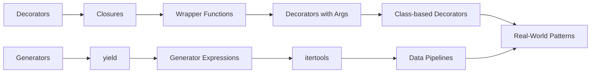

# Decorators & Generators — Higher-Order Functions, yield, itertools

## Learning Objectives

| Objective | Description |
|-----------|-------------|
| LO1 | Create and apply decorators for function modification |
| LO2 | Write decorators with arguments and class-based decorators |
| LO3 | Build generator functions using yield and generator expressions |
| LO4 | Use itertools for efficient data pipeline construction |
| LO5 | Understand closures, functools.wraps, and contextlib |
| LO6 | Combine decorators and generators for clean data processing |

## Introduction

01-python-programming is a fundamental concept in AI engineering. This chapter covers the core principles, practical implementations, and interview preparation for mastering this topic.

## Prerequisites

- Basic programming knowledge
- Understanding of data structures
## Chapter at a Glance

| Section | Topic | Key Concept |
|---------|-------|-------------|
| 9.1 | Decorator Basics | @ syntax, wrapper functions, closures |
| 9.2 | Advanced Decorators | args, class-based, functools.wraps |
| 9.3 | Generators | yield, generator expressions, send/throw |
| 9.4 | itertools | chain, cycle, groupby, product, permutations |
| 9.5 | contextlib | @contextmanager, contextlib utilities |
| 9.6 | Real-World Patterns | caching, rate limiting, pipeline composition |

## Chapter Roadmap



## 9.1 Decorator Basics

A decorator is a function that takes another function and extends its behavior without modifying it directly. The `@` syntax is syntactic sugar for `func = decorator(func)`.

```python
import functools
import time

def timer(func):
    @functools.wraps(func)
    def wrapper(*args, **kwargs):
        start = time.perf_counter()
        result = func(*args, **kwargs)
        elapsed = time.perf_counter() - start
        print(f"{func.__name__} took {elapsed:.4f}s")
        return result
    return wrapper

@timer
def slow_function():
    time.sleep(0.5)
    return 42

print(slow_function())  # slow_function took 0.5001s, then 42
```

**Closures** are the mechanism that makes decorators work. A closure is a function that retains access to variables from its enclosing scope even after the outer function has returned.

```python
def make_counter():
    count = 0
    def counter():
        nonlocal count
        count += 1
        return count
    return counter

c = make_counter()
print(c(), c(), c())  # 1 2 3
```

The `nonlocal` keyword allows the inner function to modify variables from the enclosing scope. Without it, assigning to `count` would create a new local variable instead.

**Decorator stacking** applies multiple decorators from bottom to top:

```python
@timer
@functools.lru_cache(maxsize=128)
def expensive_function(n: int) -> int:
    return sum(i * i for i in range(n))
```

## 9.2 Advanced Decorators

**Decorators with arguments** require three levels of nesting: the outer function accepts arguments, the middle function receives the decorated function, and the inner wrapper executes the logic.

```python
def repeat(times: int):
    def decorator(func):
        @functools.wraps(func)
        def wrapper(*args, **kwargs):
            for _ in range(times):
                result = func(*args, **kwargs)
            return result
        return wrapper
    return decorator

@repeat(times=3)
def greet(name: str):
    print(f"Hello, {name}!")

greet("Alice")
# Hello, Alice!
# Hello, Alice!
# Hello, Alice!
```

**Class-based decorators** use `__init__` to store the function and `__call__` to wrap invocation. They are useful for stateful behavior like counting calls.

```python
class CountCalls:
    def __init__(self, func):
        functools.update_wrapper(self, func)
        self.func = func
        self.count = 0

    def __call__(self, *args, **kwargs):
        self.count += 1
        print(f"Call {self.count} of {self.func.__name__}")
        return self.func(*args, **kwargs)

@CountCalls
def say_hi():
    print("Hi!")

say_hi()  # Call 1 of say_hi, then Hi!
say_hi()  # Call 2 of say_hi, then Hi!
```

**functools.wraps** is essential. It copies `__name__`, `__doc__`, `__module__`, and `__qualname__` from the original function to the wrapper. Without it, introspection tools report the wrapper's metadata instead of the decorated function's.

**Optional argument decorators** handle both `@decorator` and `@decorator(args)` patterns:

```python
def cache(maxsize: int | None = None):
    def decorator(func):
        if maxsize is None:
            return functools.lru_cache()(func)
        return functools.lru_cache(maxsize=maxsize)(func)
    if callable(maxsize):
        func, maxsize = maxsize, None
        return decorator(func)
    return decorator
```

## 9.3 Generators

Generators produce sequences lazily using the `yield` keyword. Each call to `next()` resumes execution from the last `yield`.

```python
def fibonacci(limit: int):
    a, b = 0, 1
    while a < limit:
        yield a
        a, b = b, a + b

for num in fibonacci(100):
    print(num, end=" ")  # 0 1 1 2 3 5 8 13 21 34 55 89
```

**Generator expressions** are memory-efficient alternatives to list comprehensions:

```python
squares = (x * x for x in range(10_000_000))   # lazy, ~120 bytes
squares_list = [x * x for x in range(10_000_000)]  # eager, ~400 MB
```

**send() and throw()** enable bidirectional communication with generators:

```python
def echo():
    while True:
        received = yield
        print(f"Received: {received}")

gen = echo()
next(gen)           # prime the generator
gen.send("Hello")   # Received: Hello
gen.send("World")   # Received: World
gen.close()
```

**yield from** delegates to a subgenerator, simplifying composition:

```python
def chain(*iterables):
    for it in iterables:
        yield from it

print(list(chain([1, 2], [3, 4], "ab")))
# [1, 2, 3, 4, 'a', 'b']
```

**Generator closing and cleanup** with `GeneratorExit`:

```python
def resource_generator():
    try:
        yield "resource"
    finally:
        print("Cleaning up resource")

gen = resource_generator()
print(next(gen))  # resource
gen.close()       # Cleaning up resource
```

## 9.4 itertools

The itertools module provides fast, memory-efficient iterator tools.

```python
import itertools

# Infinite iterators
counter = itertools.count(start=10, step=2)
print([next(counter) for _ in range(5)])  # [10, 12, 14, 16, 18]

# Cycle through an iterable infinitely
colors = itertools.cycle(["red", "green", "blue"])
print([next(colors) for _ in range(5)])   # ['red', 'green', 'blue', 'red', 'green']

# Chain multiple iterables
combined = itertools.chain([1, 2], [3, 4], [5])
print(list(combined))  # [1, 2, 3, 4, 5]
```

**Groupby** groups consecutive elements by a key function:

```python
data = [("A", 1), ("A", 2), ("B", 3), ("B", 4)]
for key, group in itertools.groupby(data, key=lambda x: x[0]):
    print(key, list(group))
# A [('A', 1), ('A', 2)]
# B [('B', 3), ('B', 4)]
```

The input must be sorted by the same key for correct grouping.

**Combinatorial iterators**:

```python
# Cartesian product
print(list(itertools.product([1, 2], ["a", "b"])))
# [(1, 'a'), (1, 'b'), (2, 'a'), (2, 'b')]

# Permutations — order matters
print(list(itertools.permutations([1, 2, 3], 2)))
# [(1, 2), (1, 3), (2, 1), (2, 3), (3, 1), (3, 2)]

# Combinations — order does not matter
print(list(itertools.combinations([1, 2, 3], 2)))
# [(1, 2), (1, 3), (2, 3)]

# Combinations with replacement
print(list(itertools.combinations_with_replacement([1, 2], 2)))
# [(1, 1), (1, 2), (2, 2)]
```

**Slice an iterator** without materializing:

```python
result = list(itertools.islice(range(1_000_000), 5))
print(result)  # [0, 1, 2, 3, 4]
```

**Other useful itertools**:

```python
# accumulate — running sum/product
print(list(itertools.accumulate([1, 2, 3, 4])))           # [1, 3, 6, 10]
print(list(itertools.accumulate([1, 2, 3, 4], lambda a, b: a * b)))  # [1, 2, 6, 24]

# compress — filter by selector
print(list(itertools.compress("ABCDEF", [1, 0, 1, 0, 1, 1])))  # ['A', 'C', 'E', 'F']

# pairwise — sliding pairs (Python 3.10+)
print(list(itertools.pairwise([1, 2, 3, 4])))  # [(1, 2), (2, 3), (3, 4)]

# starmap — apply function to unpacked tuples
print(list(itertools.starmap(divmod, [(10, 3), (20, 7)])))  # [(3, 1), (2, 6)]

# tee — clone an iterator into n independent iterators
it1, it2 = itertools.tee([1, 2, 3], 2)
print(list(it1))  # [1, 2, 3]
print(list(it2))  # [1, 2, 3]
```

## 9.5 contextlib

The contextlib module simplifies context manager creation and provides utility helpers.

**@contextmanager** decorates a generator with a single yield:

```python
from contextlib import contextmanager

@contextmanager
def managed_file(filename: str, mode: str = "r"):
    print(f"Opening {filename}")
    f = open(filename, mode)
    try:
        yield f
    finally:
        print(f"Closing {filename}")
        f.close()

with managed_file("test.txt", "w") as f:
    f.write("Hello, world!")
# Opening test.txt
# Closing test.txt
```

The code before `yield` runs on entry; the code after runs on exit (even if an exception occurs).

**Utility context managers**:

```python
from contextlib import suppress, redirect_stdout, redirect_stderr, nullcontext
import io, os

# suppress — ignore specific exceptions
with suppress(FileNotFoundError):
    os.remove("nonexistent.txt")  # no error raised

# redirect_stdout — capture print output
buf = io.StringIO()
with redirect_stdout(buf):
    print("Captured!")
print(buf.getvalue())  # Captured!\n

# nullcontext — a no-op context manager with optional return value
ctx = nullcontext(42)
with ctx as val:
    print(val)  # 42
```

**ExitStack** manages multiple context managers dynamically:

```python
from contextlib import ExitStack

files = []
with ExitStack() as stack:
    filenames = ["a.txt", "b.txt", "c.txt"]
    for name in filenames:
        f = open(name, "w")
        stack.callback(f.close)
        files.append(f)
    # all files closed on exit, even if an open() fails
```

**contextmanager vs closing**:

```python
from contextlib import closing
from urllib.request import urlopen

# closing ensures close() is called
with closing(urlopen("https://example.com")) as page:
    content = page.read()
```

## 9.6 Real-World Patterns

**Memoization / caching decorator**:

```python
def memoize(func):
    cache = {}
    @functools.wraps(func)
    def wrapper(*args):
        if args not in cache:
            cache[args] = func(*args)
        return cache[args]
    return wrapper

@memoize
def fib(n: int) -> int:
    return n if n < 2 else fib(n - 1) + fib(n - 2)

print(fib(100))  # 354224848179261915075 (fast!)
```

**Rate limiter decorator**:

```python
import time

def rate_limit(max_calls: int, period: float):
    def decorator(func):
        calls = []
        @functools.wraps(func)
        def wrapper(*args, **kwargs):
            now = time.monotonic()
            calls[:] = [t for t in calls if now - t < period]
            if len(calls) >= max_calls:
                raise RuntimeError("Rate limit exceeded")
            calls.append(now)
            return func(*args, **kwargs)
        return wrapper
    return decorator

@rate_limit(max_calls=3, period=1.0)
def api_call():
    return "data"
```

**Decorator for deprecation warnings**:

```python
import warnings

def deprecated(message: str = ""):
    def decorator(func):
        @functools.wraps(func)
        def wrapper(*args, **kwargs):
            warnings.warn(
                f"{func.__name__} is deprecated. {message}",
                DeprecationWarning, stacklevel=2
            )
            return func(*args, **kwargs)
        return wrapper
    return decorator

@deprecated("Use new_function() instead")
def old_function():
    pass
```

**Generator pipeline for data processing**:

```python
def read_lines(filename: str):
    with open(filename) as f:
        yield from f

def parse_csv(lines):
    for line in lines:
        yield line.strip().split(",")

def filter_rows(rows, predicate):
    for row in rows:
        if predicate(row):
            yield row

def transform(rows, mapper):
    for row in rows:
        yield mapper(row)

# Compose the pipeline
pipeline = transform(
    filter_rows(
        parse_csv(read_lines("data.csv")),
        lambda r: len(r) >= 3
    ),
    lambda r: {"name": r[0], "age": int(r[1]), "city": r[2]}
)

for record in pipeline:
    print(record)
```

The pipeline processes one row at a time — the entire file is never loaded into memory.

**Coroutine-based state machine**:

```python
def state_machine():
    state = "idle"
    while True:
        event = yield
        if state == "idle" and event == "start":
            state = "running"
            print("Started")
        elif state == "running" and event == "stop":
            state = "idle"
            print("Stopped")
        elif event == "exit":
            break

sm = state_machine()
next(sm)
sm.send("start")  # Started
sm.send("stop")   # Stopped
sm.send("exit")
```

## TypeScript Parallel

```typescript
// Decorator pattern (TypeScript experimental)
function timer(target: any, propertyKey: string, descriptor: PropertyDescriptor) {
    const original = descriptor.value;
    descriptor.value = function (...args: any[]) {
        const start = performance.now();
        const result = original.apply(this, args);
        const elapsed = performance.now() - start;
        console.log(`${propertyKey} took ${elapsed.toFixed(2)}ms`);
        return result;
    };
    return descriptor;
}

class Service {
    @timer
    fetchData() {
        return "data";
    }
}

// Generator function in TypeScript
function* fibonacciGenerator(limit: number): Generator<number> {
    let a = 0, b = 1;
    while (a < limit) {
        yield a;
        [a, b] = [b, a + b];
    }
}

for (const num of fibonacciGenerator(100)) {
    console.log(num);
}

// Higher-order function (decorator alternative)
function withLogging<T extends (...args: any[]) => any>(fn: T): T {
    return ((...args: any[]) => {
        console.log(`Calling ${fn.name} with`, args);
        const result = fn(...args);
        console.log(`Result:`, result);
        return result;
    }) as T;
}

const add = (a: number, b: number) => a + b;
const loggedAdd = withLogging(add);
loggedAdd(3, 4); // logs: Calling add with [3, 4], Result: 7
```

## Summary

- Decorators are callables that wrap functions to extend behavior, using the @ syntax
- Closures enable decorators by capturing outer scope variables; nonlocal allows mutation
- functools.wraps preserves the original function's metadata on the wrapper
- Class-based decorators use __init__ and __call__ for stateful decoration
- Decorators with arguments require three levels of nesting
- Generators produce sequences lazily with yield; each next() resumes from the last yield
- Generator expressions are memory-efficient alternatives to list comprehensions
- yield from delegates to subgenerators for clean composition
- itertools provides fast, combinatorial, and infinite iterator tools
- contextlib simplifies context manager creation with @contextmanager and ExitStack

## Practical Takeaways

| Scenario | Use | Avoid |
|----------|-----|-------|
| Logging/timing | Simple decorator with functools.wraps | Duplicating code across functions |
| Memoization | @memoize or @functools.lru_cache | Manual caching dicts in each function |
| Rate limiting | Decorator with arguments | Throttling logic in function body |
| Large sequences | Generator / generator expression | Building full lists in memory |
| Combinatorial data | itertools.product / permutations | Deeply nested for-loops |
| Resource cleanup | @contextmanager | Manual try/finally blocks |
| Data processing pipelines | Generator chains with yield from | Intermediate lists at each stage |
| Deprecation warnings | @deprecated decorator | Inline warnings in function body |
| Dynamic resource mgmt | ExitStack | Nested with-statements |

## Interview Q&A

<details class="tp-qa-card" data-qid="p02-s09-q1">
  <summary class="tp-qa-question"><span class="tp-qa-status"></span>Q1: What is a decorator in Python?</summary>
  <div class="tp-qa-answer"><p>A decorator is a function that takes another function and extends its behavior without modifying its source code. The @ syntax is syntactic sugar for <code>func = decorator(func)</code>. Common uses include logging, access control, memoization, timing, and registration.</p></div><button class="tp-qa-mark-btn">✓ Mark Reviewed</button><button class="tp-qa-bookmark-btn">★ Bookmark</button>
</details>
<details class="tp-qa-card" data-qid="p02-s09-q2">
  <summary class="tp-qa-question"><span class="tp-qa-status"></span>Q2: How does a closure work?</summary>
  <div class="tp-qa-answer"><p>A closure is a function that retains access to variables from its enclosing scope even after the outer function has returned. Python stores these captured variables in the <code>__closure__</code> attribute (a tuple of cell objects). Closures are the foundation of decorators and are created whenever a nested function references variables from its containing scope.</p></div><button class="tp-qa-mark-btn">✓ Mark Reviewed</button><button class="tp-qa-bookmark-btn">★ Bookmark</button>
</details>
<details class="tp-qa-card" data-qid="p02-s09-q3">
  <summary class="tp-qa-question"><span class="tp-qa-status"></span>Q3: Why is functools.wraps important?</summary>
  <div class="tp-qa-answer"><p>functools.wraps copies <code>__name__</code>, <code>__doc__</code>, <code>__module__</code>, and <code>__qualname__</code> from the original function to the wrapper. Without it, tools like help(), inspect, and debugging output show the wrapper function's metadata instead of the decorated function's. It also updates <code>__wrapped__</code> for further introspection.</p></div><button class="tp-qa-mark-btn">✓ Mark Reviewed</button><button class="tp-qa-bookmark-btn">★ Bookmark</button>
</details>
<details class="tp-qa-card" data-qid="p02-s09-q4">
  <summary class="tp-qa-question"><span class="tp-qa-status"></span>Q4: Generator vs iterator — what's the difference?</summary>
  <div class="tp-qa-answer"><p>A generator is a function that uses <code>yield</code>, returning a generator object (which is an iterator). All generators are iterators, but not all iterators are generators. Iterators implement <code>__iter__</code> and <code>__next__</code>; generators are created with yield and automatically implement the iterator protocol. Generators are a convenient way to create iterators.</p></div><button class="tp-qa-mark-btn">✓ Mark Reviewed</button><button class="tp-qa-bookmark-btn">★ Bookmark</button>
</details>
<details class="tp-qa-card" data-qid="p02-s09-q5">
  <summary class="tp-qa-question"><span class="tp-qa-status"></span>Q5: What does yield from do?</summary>
  <div class="tp-qa-answer"><p>yield from delegates to a subgenerator, yielding all values from it. It replaces <code>for x in sub: yield x</code> with cleaner syntax. It also handles <code>send()</code> and <code>throw()</code> delegation correctly, making it essential for coroutine-style programming and flattening nested generators.</p></div><button class="tp-qa-mark-btn">✓ Mark Reviewed</button><button class="tp-qa-bookmark-btn">★ Bookmark</button>
</details>
<details class="tp-qa-card" data-qid="p02-s09-q6">
  <summary class="tp-qa-question"><span class="tp-qa-status"></span>Q6: How do you send values into a generator?</summary>
  <div class="tp-qa-answer"><p>Use <code>generator.send(value)</code>. The generator must first be primed with <code>next()</code> to advance to the first yield. The sent value becomes the result of the yield expression. The send() method also returns the next yielded value. This enables two-way communication and coroutine patterns.</p></div><button class="tp-qa-mark-btn">✓ Mark Reviewed</button><button class="tp-qa-bookmark-btn">★ Bookmark</button>
</details>
<details class="tp-qa-card" data-qid="p02-s09-q7">
  <summary class="tp-qa-question"><span class="tp-qa-status"></span>Q7: How does itertools.groupby work?</summary>
  <div class="tp-qa-answer"><p>itertools.groupby groups consecutive elements by a key function, returning (key, group_iterator) pairs. The input data must be sorted by the same key first; otherwise, identical keys in different positions produce separate groups. Common use: grouping sorted log entries by date or transactions by user ID.</p></div><button class="tp-qa-mark-btn">✓ Mark Reviewed</button><button class="tp-qa-bookmark-btn">★ Bookmark</button>
</details>
<details class="tp-qa-card" data-qid="p02-s09-q8">
  <summary class="tp-qa-question"><span class="tp-qa-status"></span>Q8: When would you use contextlib.suppress?</summary>
  <div class="tp-qa-answer"><p>Use contextlib.suppress when you expect a specific exception to occur and want to ignore it silently. It's cleaner than <code>try/except: pass</code>. Example: <code>with suppress(FileNotFoundError): os.remove('temp.txt')</code>. Accepts multiple exception types.</p></div><button class="tp-qa-mark-btn">✓ Mark Reviewed</button><button class="tp-qa-bookmark-btn">★ Bookmark</button>
</details>
<details class="tp-qa-card" data-qid="p02-s09-q9">
  <summary class="tp-qa-question"><span class="tp-qa-status"></span>Q9: Class-based vs function-based decorators — when to use each?</summary>
  <div class="tp-qa-answer"><p>Function-based decorators use closures and are simpler for stateless behavior (logging, timing). Class-based decorators use <code>__init__</code> and <code>__call__</code> and are better for stateful decoration (counting calls, accumulating results) because state lives in instance attributes. Use <code>functools.update_wrapper()</code> in class-based decorators.</p></div><button class="tp-qa-mark-btn">✓ Mark Reviewed</button><button class="tp-qa-bookmark-btn">★ Bookmark</button>
</details>
<details class="tp-qa-card" data-qid="p02-s09-q10">
  <summary class="tp-qa-question"><span class="tp-qa-status"></span>Q10: When would you choose a generator over a list?</summary>
  <div class="tp-qa-answer"><p>Generators use O(1) memory regardless of sequence length, making them ideal for large datasets, infinite sequences, and streaming data. Lists use O(n) memory. However, generators cannot be indexed or sliced, have per-item overhead, and can only be iterated once. Use generators for iteration over large data, lists for random access and multiple passes.</p></div><button class="tp-qa-mark-btn">✓ Mark Reviewed</button><button class="tp-qa-bookmark-btn">★ Bookmark</button>
</details>

## Chapter Quiz

**Q1**: What does @functools.wraps do? a) wraps function in a class b) preserves original function metadata c) creates a closure d) optimizes bytecode

<details class="tp-qa-card" data-qid="p02-s09-quiz1"><summary>Show Answer</summary><div class="tp-qa-answer"><p><strong>Answer: b) preserves original function metadata</strong></p></div></details>

**Q2**: Which creates a generator? a) [x for x in range(5)] b) (x for x in range(5)) c) {x for x in range(5)} d) all of these

<details class="tp-qa-card" data-qid="p02-s09-quiz2"><summary>Show Answer</summary><div class="tp-qa-answer"><p><strong>Answer: b) (x for x in range(5)) — generator expression uses parentheses</strong></p></div></details>

**Q3**: What does itertools.chain do? a) groups consecutive elements b) combines iterables sequentially c) cycles through elements d) filters elements by predicate

<details class="tp-qa-card" data-qid="p02-s09-quiz3"><summary>Show Answer</summary><div class="tp-qa-answer"><p><strong>Answer: b) combines iterables sequentially</strong></p></div></details>

**Q4**: Which method enables two-way communication with a generator? a) yield b) send() c) next() d) iter()

<details class="tp-qa-card" data-qid="p02-s09-quiz4"><summary>Show Answer</summary><div class="tp-qa-answer"><p><strong>Answer: b) send() enables sending values into a generator</strong></p></div></details>

**Q5**: What does @contextmanager decorate? a) a class b) a generator function with a single yield c) a regular function d) a module

<details class="tp-qa-card" data-qid="p02-s09-quiz5"><summary>Show Answer</summary><div class="tp-qa-answer"><p><strong>Answer: b) a generator function with a single yield</strong></p></div></details>

## Exercises

**Easy** — Write a @log_calls decorator that prints the function name and arguments each time it is called, then returns the result.

**Easy** — Write a generator function that yields all even numbers up to a given limit n.

**Medium** — Write a @retry decorator that retries a function up to n times if it raises an exception, with exponential backoff between attempts.

**Medium** — Use itertools.permutations to find all anagrams of a given word. Filter to only include words that exist in a provided word list.

**Hard** — Implement a tee-like function using generators that clones a single iterator into multiple independent iterators. Hint: use collections.deque to buffer values consumed by one clone but not another.

**Hard** — Build a complete generator pipeline: read a CSV file as a generator of lines, parse each line into a dict, filter rows by a condition, transform one column, and write the output to a new CSV — all lazily without loading the entire dataset into memory.

---


## Common Mistakes

1. Not understanding the fundamental concepts before applying them
2. Skipping edge cases in implementation
3. Not analyzing time/space complexity
4. Forgetting to handle null/empty inputs
5. Not practicing enough problems to build pattern recognition
## Revision Notes

- Key concept 1: Core principle of 01-python-programming
- Key concept 2: Common implementation pattern
- Key concept 3: Time/space complexity to remember
- Key concept 4: When to apply this technique
- Key concept 5: Common interview pattern
- Key concept 6: Edge cases to handle
- Key concept 7: Related concepts for deeper understanding
## Placement Section

### Top 10 Interview Questions

#### Google Style
1. Explain the time and space trade-offs of 01-python-programming. When would you choose one approach over another?
2. Design a system that efficiently handles 01-python-programming at scale (millions of requests/second).

#### Amazon Style
1. Tell me about a time you had to optimize a system related to 01-python-programming. What was your approach and what was the result?
2. How would you explain 01-python-programming to a non-technical stakeholder?

#### Microsoft Style
1. How does 01-python-programming integrate with enterprise systems and cloud architectures?
2. What are the security implications of 01-python-programming?

#### NVIDIA Style
1. How would you optimize 01-python-programming for GPU-accelerated computing?
2. What parallel processing patterns apply to 01-python-programming?

#### AI Startup Style
1. How would you implement 01-python-programming in a cost-effective, scalable way for a startup?
2. What's the fastest way to prototype a solution using 01-python-programming?

### Resume Tips
- **Technical Skills**: List 01-python-programming under relevant technical skills
- **Project Description**: "Implemented 01-python-programming to [specific outcome], reducing [metric] by [X]%"
- **Keywords**: Include 01-python-programming in your skills section for ATS optimization

### Interview Day Checklist
- [ ] Review core concepts of 01-python-programming
- [ ] Practice 3-5 problems related to 01-python-programming
- [ ] Prepare 2 real-world examples of using 01-python-programming
- [ ] Know the time/space complexity of common 01-python-programming operations
- [ ] Have questions ready about how the company uses 01-python-programming> **Next**: [10 — Concurrency →](10-concurrency.md)
