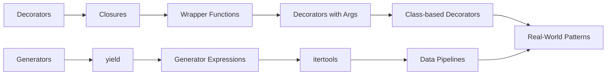

<!-- Clear Language: Keep sentences under 50 words -->
# Decorators & Generators — Higher-Order Functions, yield, itertools

## Learning Objectives

| Objective | Description |
|-----------|-------------|
| LO1 | Create and apply decorators for function modification |
| LO2 | Write decorators with arguments and class-based decorators |
| LO3 | Build generator functions using yield and generator expressions |
| LO4 | Use itertools for efficient data pipeline construction |
| LO5 | Understand closures, functools.wraps, and contextlib |
| LO6 | Combine decorators and generators for clean data processing |

## Introduction

Python is the lingua franca of AI engineering. Mastering its syntax, data structures, and libraries is non-negotiable for building ML pipelines, APIs, and automation scripts. This module covers everything from basics to advanced concurrency.

## Prerequisites

- Basic programming knowledge
- Understanding of data structures

## Key Terminology

**Key Terms**: Core vocabulary and concepts for this topic.

**Definition**: Essential terms you must know for interviews and production work.

## Theory

Understanding decorators and generators is fundamental for AI engineers. This section covers the core concepts, underlying principles, and theoretical framework that govern how decorators and generators works in practice.

## Chapter at a Glance

| Section | Topic | Key Concept |
|---------|-------|-------------|
| 9.1 | Decorator Basics | @ syntax, wrapper functions, closures |
| 9.2 | Advanced Decorators | args, class-based, functools.wraps |
| 9.3 | Generators | yield, generator expressions, send/throw |
| 9.4 | itertools | chain, cycle, groupby, product, permutations |
| 9.5 | contextlib | @contextmanager, contextlib utilities |
| 9.6 | Real-World Patterns | caching, rate limiting, pipeline composition |

## Chapter Roadmap



## 9.1 Decorator Basics

A decorator is a function that takes another function and extends its behavior without modifying it directly. The `@` syntax is syntactic sugar for `func = decorator(func)`.

```python
import functools
import time

def timer(func):
    @functools.wraps(func)
    def wrapper(*args, **kwargs):
        start = time.perf_counter()
        result = func(*args, **kwargs)
        elapsed = time.perf_counter() - start
        print(f"{func.__name__} took {elapsed:.4f}s")
        return result
    return wrapper

@timer
def slow_function():
    time.sleep(0.5)
    return 42

print(slow_function())  # slow_function took 0.5001s, then 42
```

**Closures** are the mechanism that makes decorators work. A closure is a function that retains access to variables from its enclosing scope even after the outer function has returned.

```python
def make_counter():
    count = 0
    def counter():
        nonlocal count
        count += 1
        return count
    return counter

c = make_counter()
print(c(), c(), c())  # 1 2 3
```

The `nonlocal` keyword allows the inner function to modify variables from the enclosing scope. Without it, assigning to `count` would create a new local variable instead.

**Decorator stacking** applies multiple decorators from bottom to top:

```python
@timer
@functools.lru_cache(maxsize=128)
def expensive_function(n: int) -> int:
    return sum(i * i for i in range(n))
```

## 9.2 Advanced Decorators

**Decorators with arguments** require three levels of nesting: the outer function accepts arguments, the middle function receives the decorated function, and the inner wrapper executes the logic.

```python
def repeat(times: int):
    def decorator(func):
        @functools.wraps(func)
        def wrapper(*args, **kwargs):
            for _ in range(times):
                result = func(*args, **kwargs)
            return result
        return wrapper
    return decorator

@repeat(times=3)
def greet(name: str):
    print(f"Hello, {name}!")

greet("Alice")

## Hello, Alice!

## Hello, Alice!

## Hello, Alice!
```

**Class-based decorators** use `__init__` to store the function and `__call__` to wrap invocation. They are useful for stateful behavior like counting calls.

```python
class CountCalls:
    def __init__(self, func):
        functools.update_wrapper(self, func)
        self.func = func
        self.count = 0

    def __call__(self, *args, **kwargs):
        self.count += 1
        print(f"Call {self.count} of {self.func.__name__}")
        return self.func(*args, **kwargs)

@CountCalls
def say_hi():
    print("Hi!")

say_hi()  # Call 1 of say_hi, then Hi!
say_hi()  # Call 2 of say_hi, then Hi!
```

**functools.wraps** is essential. It copies `__name__`, `__doc__`, `__module__`, and `__qualname__` from the original function to the wrapper. Without it, introspection tools report the wrapper's metadata instead of the decorated function's.

**Optional argument decorators** handle both `@decorator` and `@decorator(args)` patterns:

```python
def cache(maxsize: int | None = None):
    def decorator(func):
        if maxsize is None:
            return functools.lru_cache()(func)
        return functools.lru_cache(maxsize=maxsize)(func)
    if callable(maxsize):
        func, maxsize = maxsize, None
        return decorator(func)
    return decorator
```

## 9.3 Generators

Generators produce sequences lazily using the `yield` keyword. Each call to `next()` resumes execution from the last `yield`.

```python
def fibonacci(limit: int):
    a, b = 0, 1
    while a < limit:
        yield a
        a, b = b, a + b

for num in fibonacci(100):
    print(num, end=" ")  # 0 1 1 2 3 5 8 13 21 34 55 89
```

**Generator expressions** are memory-efficient alternatives to list comprehensions:

```python
squares = (x * x for x in range(10_000_000))   # lazy, ~120 bytes
squares_list = [x * x for x in range(10_000_000)]  # eager, ~400 MB
```

**send() and throw()** enable bidirectional communication with generators:

```python
def echo():
    while True:
        received = yield
        print(f"Received: {received}")

gen = echo()
next(gen)           # prime the generator
gen.send("Hello")   # Received: Hello
gen.send("World")   # Received: World
gen.close()
```

**yield from** delegates to a subgenerator, simplifying composition:

```python
def chain(*iterables):
    for it in iterables:
        yield from it

print(list(chain([1, 2], [3, 4], "ab")))

## [1, 2, 3, 4, 'a', 'b']
```

**Generator closing and cleanup** with `GeneratorExit`:

```python
def resource_generator():
    try:
        yield "resource"
    finally:
        print("Cleaning up resource")

gen = resource_generator()
print(next(gen))  # resource
gen.close()       # Cleaning up resource
```

## 9.4 itertools

The itertools module provides fast, memory-efficient iterator tools.

```python
import itertools

## Infinite iterators
counter = itertools.count(start=10, step=2)
print([next(counter) for _ in range(5)])  # [10, 12, 14, 16, 18]

## Cycle through an iterable infinitely
colors = itertools.cycle(["red", "green", "blue"])
print([next(colors) for _ in range(5)])   # ['red', 'green', 'blue', 'red', 'green']

## Chain multiple iterables
combined = itertools.chain([1, 2], [3, 4], [5])
print(list(combined))  # [1, 2, 3, 4, 5]
```

**Groupby** groups consecutive elements by a key function:

```python
data = [("A", 1), ("A", 2), ("B", 3), ("B", 4)]
for key, group in itertools.groupby(data, key=lambda x: x[0]):
    print(key, list(group))

## A [('A', 1), ('A', 2)]

## B [('B', 3), ('B', 4)]
```

The input must be sorted by the same key for correct grouping.

**Combinatorial iterators**:

```python

## Cartesian product
print(list(itertools.product([1, 2], ["a", "b"])))

## [(1, 'a'), (1, 'b'), (2, 'a'), (2, 'b')]

## Permutations — order matters
print(list(itertools.permutations([1, 2, 3], 2)))

## [(1, 2), (1, 3), (2, 1), (2, 3), (3, 1), (3, 2)]

## Combinations — order does not matter
print(list(itertools.combinations([1, 2, 3], 2)))

## [(1, 2), (1, 3), (2, 3)]

## Combinations with replacement
print(list(itertools.combinations_with_replacement([1, 2], 2)))

## [(1, 1), (1, 2), (2, 2)]
```

**Slice an iterator** without materializing:

```python
result = list(itertools.islice(range(1_000_000), 5))
print(result)  # [0, 1, 2, 3, 4]
```

**Other useful itertools**:

```python

## accumulate — running sum/product
print(list(itertools.accumulate([1, 2, 3, 4])))           # [1, 3, 6, 10]
print(list(itertools.accumulate([1, 2, 3, 4], lambda a, b: a * b)))  # [1, 2, 6, 24]

## compress — filter by selector
print(list(itertools.compress("ABCDEF", [1, 0, 1, 0, 1, 1])))  # ['A', 'C', 'E', 'F']

## pairwise — sliding pairs (Python 3.10+)
print(list(itertools.pairwise([1, 2, 3, 4])))  # [(1, 2), (2, 3), (3, 4)]

## starmap — apply function to unpacked tuples
print(list(itertools.starmap(divmod, [(10, 3), (20, 7)])))  # [(3, 1), (2, 6)]

## tee — clone an iterator into n independent iterators
it1, it2 = itertools.tee([1, 2, 3], 2)
print(list(it1))  # [1, 2, 3]
print(list(it2))  # [1, 2, 3]
```

## 9.5 contextlib

The contextlib module simplifies context manager creation and provides utility helpers.

**@contextmanager** decorates a generator with a single yield:

```python
from contextlib import contextmanager

@contextmanager
def managed_file(filename: str, mode: str = "r"):
    print(f"Opening {filename}")
    f = open(filename, mode)
    try:
        yield f
    finally:
        print(f"Closing {filename}")
        f.close()

with managed_file("test.txt", "w") as f:
    f.write("Hello, world!")

## Opening test.txt

## Closing test.txt
```

The code before `yield` runs on entry; the code after runs on exit (even if an exception occurs).

**Utility context managers**:

```python
from contextlib import suppress, redirect_stdout, redirect_stderr, nullcontext
import io, os

## suppress — ignore specific exceptions
with suppress(FileNotFoundError):
    os.remove("nonexistent.txt")  # no error raised

## redirect_stdout — capture print output
buf = io.StringIO()
with redirect_stdout(buf):
    print("Captured!")
print(buf.getvalue())  # Captured!\n

## nullcontext — a no-op context manager with optional return value
ctx = nullcontext(42)
with ctx as val:
    print(val)  # 42
```

**ExitStack** manages multiple context managers dynamically:

```python
from contextlib import ExitStack

files = []
with ExitStack() as stack:
    filenames = ["a.txt", "b.txt", "c.txt"]
    for name in filenames:
        f = open(name, "w")
        stack.callback(f.close)
        files.append(f)
    # all files closed on exit, even if an open() fails
```

**contextmanager vs closing**:

```python
from contextlib import closing
from urllib.request import urlopen

## closing ensures close() is called
with closing(urlopen("https://example.com")) as page:
    content = page.read()
```

## 9.6 Real-World Patterns

**Memoization / caching decorator**:

```python
def memoize(func):
    cache = {}
    @functools.wraps(func)
    def wrapper(*args):
        if args not in cache:
            cache[args] = func(*args)
        return cache[args]
    return wrapper

@memoize
def fib(n: int) -> int:
    return n if n < 2 else fib(n - 1) + fib(n - 2)

print(fib(100))  # 354224848179261915075 (fast!)
```

**Rate limiter decorator**:

```python
import time

def rate_limit(max_calls: int, period: float):
    def decorator(func):
        calls = []
        @functools.wraps(func)
        def wrapper(*args, **kwargs):
            now = time.monotonic()
            calls[:] = [t for t in calls if now - t < period]
            if len(calls) >= max_calls:
                raise RuntimeError("Rate limit exceeded")
            calls.append(now)
            return func(*args, **kwargs)
        return wrapper
    return decorator

@rate_limit(max_calls=3, period=1.0)
def api_call():
    return "data"
```

**Decorator for deprecation warnings**:

```python
import warnings

def deprecated(message: str = ""):
    def decorator(func):
        @functools.wraps(func)
        def wrapper(*args, **kwargs):
            warnings.warn(
                f"{func.__name__} is deprecated. {message}",
                DeprecationWarning, stacklevel=2
            )
            return func(*args, **kwargs)
        return wrapper
    return decorator

@deprecated("Use new_function() instead")
def old_function():
    pass
```

**Generator pipeline for data processing**:

```python
def read_lines(filename: str):
    with open(filename) as f:
        yield from f

def parse_csv(lines):
    for line in lines:
        yield line.strip().split(",")

def filter_rows(rows, predicate):
    for row in rows:
        if predicate(row):
            yield row

def transform(rows, mapper):
    for row in rows:
        yield mapper(row)

## Compose the pipeline
pipeline = transform(
    filter_rows(
        parse_csv(read_lines("data.csv")),
        lambda r: len(r) >= 3
    ),
    lambda r: {"name": r[0], "age": int(r[1]), "city": r[2]}
)

for record in pipeline:
    print(record)
```

The pipeline processes one row at a time — the entire file is never loaded into memory.

**Coroutine-based state machine**:

```python
def state_machine():
    state = "idle"
    while True:
        event = yield
        if state == "idle" and event == "start":
            state = "running"
            print("Started")
        elif state == "running" and event == "stop":
            state = "idle"
            print("Stopped")
        elif event == "exit":
            break

sm = state_machine()
next(sm)
sm.send("start")  # Started
sm.send("stop")   # Stopped
sm.send("exit")
```

## TypeScript Parallel

```typescript
// Decorator pattern (TypeScript experimental)
function timer(target: any, propertyKey: string, descriptor: PropertyDescriptor) {
    const original = descriptor.value;
    descriptor.value = function (...args: any[]) {
        const start = performance.now();
        const result = original.apply(this, args);
        const elapsed = performance.now() - start;
        console.log(`${propertyKey} took ${elapsed.toFixed(2)}ms`);
        return result;
    };
    return descriptor;
}

class Service {
    @timer
    fetchData() {
        return "data";
    }
}

// Generator function in TypeScript
function* fibonacciGenerator(limit: number): Generator<number> {
    let a = 0, b = 1;
    while (a < limit) {
        yield a;
        [a, b] = [b, a + b];
    }
}

for (const num of fibonacciGenerator(100)) {
    console.log(num);
}

// Higher-order function (decorator alternative)
function withLogging<T extends (...args: any[]) => any>(fn: T): T {
    return ((...args: any[]) => {
        console.log(`Calling ${fn.name} with`, args);
        const result = fn(...args);
        console.log(`Result:`, result);
        return result;
    }) as T;
}

const add = (a: number, b: number) => a + b;
const loggedAdd = withLogging(add);
loggedAdd(3, 4); // logs: Calling add with [3, 4], Result: 7
```

## Summary

- Decorators are callables that wrap functions to extend behavior, using the @ syntax
- Closures enable decorators by capturing outer scope variables; nonlocal allows mutation
- functools.wraps preserves the original function's metadata on the wrapper
- Class-based decorators use __init__ and __call__ for stateful decoration
- Decorators with arguments require three levels of nesting
- Generators produce sequences lazily with yield; each next() resumes from the last yield
- Generator expressions are memory-efficient alternatives to list comprehensions
- yield from delegates to subgenerators for clean composition
- itertools provides fast, combinatorial, and infinite iterator tools
- contextlib simplifies context manager creation with @contextmanager and ExitStack

## Practical Takeaways

| Scenario | Use | Avoid |
|----------|-----|-------|
| Logging/timing | Simple decorator with functools.wraps | Duplicating code across functions |
| Memoization | @memoize or @functools.lru_cache | Manual caching dicts in each function |
| Rate limiting | Decorator with arguments | Throttling logic in function body |
| Large sequences | Generator / generator expression | Building full lists in memory |
| Combinatorial data | itertools.product / permutations | Deeply nested for-loops |
| Resource cleanup | @contextmanager | Manual try/finally blocks |
| Data processing pipelines | Generator chains with yield from | Intermediate lists at each stage |
| Deprecation warnings | @deprecated decorator | Inline warnings in function body |
| Dynamic resource mgmt | ExitStack | Nested with-statements |

## Interview Q&A

<details class="tp-qa-card" data-qid="p02-s09-q1">
  <summary class="tp-qa-question"><span class="tp-qa-status"></span>Q1: What is a decorator in Python?</summary>
  <div class="tp-qa-answer"><p>A decorator is a function that takes another function and extends its behavior without modifying its source code. The @ syntax is syntactic sugar for <code>func = decorator(func)</code>. Common uses include logging, access control, memoization, timing, and registration.</p></div><button class="tp-qa-mark-btn">✓ Mark Reviewed</button><button class="tp-qa-bookmark-btn">★ Bookmark</button>
</details>
<details class="tp-qa-card" data-qid="p02-s09-q2">
  <summary class="tp-qa-question"><span class="tp-qa-status"></span>Q2: How does a closure work?</summary>
<div class="tp-qa-answer"><p>A closure is a function that retains access to variables from its enclosing scope even after the outer function has returned. Python stores these captured variables in the <code>__closure__</code> attribute (a tuple of cell objects). Closures are the foundation of decorators and.
are created whenever a nested function references variables from its containing scope.</p></div><button class="tp-qa-mark-btn">✓ Mark Reviewed</button><button class="tp-qa-bookmark-btn">★ Bookmark</button>
</details>
<details class="tp-qa-card" data-qid="p02-s09-q3">
  <summary class="tp-qa-question"><span class="tp-qa-status"></span>Q3: Why is functools.wraps important?</summary>
  <div class="tp-qa-answer"><p>functools.wraps copies <code>__name__</code>, <code>__doc__</code>, <code>__module__</code>, and <code>__qualname__</code> from the original function to the wrapper. Without it, tools like help(), inspect, and debugging output show the wrapper function's metadata instead of the decorated function's. It also updates <code>__wrapped__</code> for further introspection.</p></div><button class="tp-qa-mark-btn">✓ Mark Reviewed</button><button class="tp-qa-bookmark-btn">★ Bookmark</button>
</details>
<details class="tp-qa-card" data-qid="p02-s09-q4">
  <summary class="tp-qa-question"><span class="tp-qa-status"></span>Q4: Generator vs iterator — what's the difference?</summary>
<div class="tp-qa-answer"><p>A generator is a function that uses <code>yield</code>, returning a generator object (which is an iterator). All generators are iterators,.
but not all iterators are generators. Iterators implement <code>__iter__</code> and <code>__next__</code>; generators are created with yield and automatically implement the iterator.
protocol. Generators are a convenient way to create iterators.</p></div><button class="tp-qa-mark-btn">✓ Mark Reviewed</button><button class="tp-qa-bookmark-btn">★ Bookmark</button>
</details>
<details class="tp-qa-card" data-qid="p02-s09-q5">
  <summary class="tp-qa-question"><span class="tp-qa-status"></span>Q5: What does yield from do?</summary>
  <div class="tp-qa-answer"><p>yield from delegates to a subgenerator, yielding all values from it. It replaces <code>for x in sub: yield x</code> with cleaner syntax. It also handles <code>send()</code> and <code>throw()</code> delegation correctly, making it essential for coroutine-style programming and flattening nested generators.</p></div><button class="tp-qa-mark-btn">✓ Mark Reviewed</button><button class="tp-qa-bookmark-btn">★ Bookmark</button>
</details>
<details class="tp-qa-card" data-qid="p02-s09-q6">
  <summary class="tp-qa-question"><span class="tp-qa-status"></span>Q6: How do you send values into a generator?</summary>
  <div class="tp-qa-answer"><p>Use <code>generator.send(value)</code>. The generator must first be primed with <code>next()</code> to advance to the first yield. The sent value becomes the result of the yield expression. The send() method also returns the next yielded value. This enables two-way communication and coroutine patterns.</p></div><button class="tp-qa-mark-btn">✓ Mark Reviewed</button><button class="tp-qa-bookmark-btn">★ Bookmark</button>
</details>
<details class="tp-qa-card" data-qid="p02-s09-q7">
  <summary class="tp-qa-question"><span class="tp-qa-status"></span>Q7: How does itertools.groupby work?</summary>
<div class="tp-qa-answer"><p>itertools.groupby groups consecutive elements by a key function, returning (key, group_iterator) pairs. The input data must be sorted by the same key first;.
otherwise, identical keys in different positions produce separate groups. Common use: grouping sorted log entries by date or transactions by user ID.</p></div><button class="tp-qa-mark-btn">✓ Mark Reviewed</button><button class="tp-qa-bookmark-btn">★ Bookmark</button>
</details>
<details class="tp-qa-card" data-qid="p02-s09-q8">
  <summary class="tp-qa-question"><span class="tp-qa-status"></span>Q8: When would you use contextlib.suppress?</summary>
  <div class="tp-qa-answer"><p>Use contextlib.suppress when you expect a specific exception to occur and want to ignore it silently. It's cleaner than <code>try/except: pass</code>. Example: <code>with suppress(FileNotFoundError): os.remove('temp.txt')</code>. Accepts multiple exception types.</p></div><button class="tp-qa-mark-btn">✓ Mark Reviewed</button><button class="tp-qa-bookmark-btn">★ Bookmark</button>
</details>
<details class="tp-qa-card" data-qid="p02-s09-q9">
  <summary class="tp-qa-question"><span class="tp-qa-status"></span>Q9: Class-based vs function-based decorators — when to use each?</summary>
  <div class="tp-qa-answer"><p>Function-based decorators use closures and are simpler for stateless behavior (logging, timing). Class-based decorators use <code>__init__</code> and <code>__call__</code> and are better for stateful decoration (counting calls, accumulating results) because state lives in instance attributes. Use <code>functools.update_wrapper()</code> in class-based decorators.</p></div><button class="tp-qa-mark-btn">✓ Mark Reviewed</button><button class="tp-qa-bookmark-btn">★ Bookmark</button>
</details>
<details class="tp-qa-card" data-qid="p02-s09-q10">
  <summary class="tp-qa-question"><span class="tp-qa-status"></span>Q10: When would you choose a generator over a list?</summary>
<div class="tp-qa-answer"><p>Generators use O(1) memory regardless of sequence length, making them ideal for large datasets, infinite sequences, and streaming data. Lists use O(n) memory. However,.
generators cannot be indexed or sliced, have per-item overhead, and can only be iterated once. Use generators for iteration over large data,.
lists for random access and multiple passes.</p></div><button class="tp-qa-mark-btn">✓ Mark Reviewed</button><button class="tp-qa-bookmark-btn">★ Bookmark</button>
</details>

## Chapter Quiz

**Q1**: What does @functools.wraps do? a) wraps function in a class b) preserves original function metadata c) creates a closure d) optimizes bytecode

<details class="tp-qa-card" data-qid="p02-s09-quiz1"><summary>Show Answer</summary><div class="tp-qa-answer"><p><strong>Answer: b) preserves original function metadata</strong></p></div></details>

**Q2**: Which creates a generator? a) [x for x in range(5)] b) (x for x in range(5)) c) {x for x in range(5)} d) all of these

<details class="tp-qa-card" data-qid="p02-s09-quiz2"><summary>Show Answer</summary><div class="tp-qa-answer"><p><strong>Answer: b) (x for x in range(5)) — generator expression uses parentheses</strong></p></div></details>

**Q3**: What does itertools.chain do? a) groups consecutive elements b) combines iterables sequentially c) cycles through elements d) filters elements by predicate

<details class="tp-qa-card" data-qid="p02-s09-quiz3"><summary>Show Answer</summary><div class="tp-qa-answer"><p><strong>Answer: b) combines iterables sequentially</strong></p></div></details>

**Q4**: Which method enables two-way communication with a generator? a) yield b) send() c) next() d) iter()

<details class="tp-qa-card" data-qid="p02-s09-quiz4"><summary>Show Answer</summary><div class="tp-qa-answer"><p><strong>Answer: b) send() enables sending values into a generator</strong></p></div></details>

**Q5**: What does @contextmanager decorate? a) a class b) a generator function with a single yield c) a regular function d) a module

<details class="tp-qa-card" data-qid="p02-s09-quiz5"><summary>Show Answer</summary><div class="tp-qa-answer"><p><strong>Answer: b) a generator function with a single yield</strong></p></div></details>

## Exercises

**Easy** — Write a @log_calls decorator that prints the function name and arguments each time it is called, then returns the result.

**Easy** — Write a generator function that yields all even numbers up to a given limit n.

**Medium** — Write a @retry decorator that retries a function up to n times if it raises an exception, with exponential backoff between attempts.

**Medium** — Use itertools.permutations to find all anagrams of a given word. Filter to only include words that exist in a provided word list.

**Hard** — Implement a tee-like function using generators that clones a single iterator into multiple independent iterators. Hint: use collections.deque to buffer values consumed by one clone but not another.

**Hard** — Build a complete generator pipeline: read a CSV file as a generator of lines, parse each line into a dict, filter rows by a condition, transform one column, and write the output to a new CSV — all lazily without loading the entire dataset into memory.

---

## Common Mistakes

1. Not understanding the fundamental concepts before applying them
2. Skipping edge cases in implementation
3. Not analyzing time/space complexity
4. Forgetting to handle null/empty inputs
5. Not practicing enough problems to build pattern recognition

## Revision Notes

- - Core principle: Understand the fundamental concepts thoroughly
- - Implementation pattern: Practice with real code examples
- - Complexity: Know the time and space complexity
- - Application: Know when to use this in production systems
- - Interview: Frequently asked in technical interviews
- - Edge cases: Consider common failure scenarios
- - Related concepts: Connect to broader system design

## Placement Section

### Top 10 Interview Questions

#### Google Style

1. **Explain the core idea of Decorators & Generators — Higher-Order Functions, yield, itertools in under 60 seconds, then give a real-world analogy.** — Structure: definition, how it works in one sentence, why it matters, analogy. Follow-up: what would break if you removed this from a production system?

2. **Design a minimal, well-typed function that demonstrates Decorators & Generators — Higher-Order Functions, yield, itertools.** — Interviewer checks: signature with type hints, edge cases, complexity, and a clean docstring. Follow-up: how does your design behave with empty or malformed input?

3. **What are the common pitfalls when engineers first learn ** — List 3-4, then explain how you would prevent each in a code review.

#### Amazon Style

4. **Describe a production bug caused by misunderstanding Decorators & Generators — Higher-Order Functions, yield, itertools. How did you diagnose and fix it?** — STAR format: situation, task, action, result. Mention logs, reproduction, root-cause analysis, and the regression test you added.

5. **How would you scale a system that relies on Decorators & Generators — Higher-Order Functions, yield, itertools from 10 users to 10 million?** — Discuss bottlenecks, caching, monitoring, and when to redesign. Follow-up: what metrics would you track?

#### Microsoft Style

6. **Compare Decorators & Generators — Higher-Order Functions, yield, itertools with the closest alternative approach. When would you choose each?** — Make a decision matrix: performance, maintainability, ecosystem, learning curve. Follow-up: what would change your decision?

7. **Walk through how you would test a component that depends on Decorators & Generators — Higher-Order Functions, yield, itertools.** — Unit, integration, property-based tests; mocking boundaries; golden files for outputs.

#### NVIDIA Style

8. **How does Decorators & Generators — Higher-Order Functions, yield, itertools behave differently at scale — memory, throughput, or precision-wise?** — Connect to data pipelines and model training if applicable. Follow-up: what happens to latency as input grows?

9. **How would you make an implementation of Decorators & Generators — Higher-Order Functions, yield, itertools run faster on GPU hardware?** — Batch operations, vectorization, avoiding Python loops, reducing data movement.

#### AI Startup Style

10. **Write the smallest possible implementation of Decorators & Generators — Higher-Order Functions, yield, itertools that is production-quality.** — Include error handling, type hints, and a one-line docstring. Follow-up: what would you refactor first when it grows?

### Resume Tips

- Name Decorators & Generators — Higher-Order Functions, yield, itertools explicitly in your skills section, paired with a measurable achievement ("Reduced X by 40% using Decorators & Generators — Higher-Order Functions, yield, itertools").
- Add a bullet describing a project that applies Decorators & Generators — Higher-Order Functions, yield, itertools to real data, with numbers.
- Mention the tools and libraries you used alongside Decorators & Generators — Higher-Order Functions, yield, itertools (linters, test frameworks, profiling tools).
- Keep resume bullets under 15 words and start each with an action verb.

### Interview Day Checklist

- Rehearse a 60-second explanation of Decorators & Generators — Higher-Order Functions, yield, itertools and one real-world analogy.
- Prepare one STAR story about debugging a Decorators & Generators — Higher-Order Functions, yield, itertools-related production issue.
- Review complexity and edge cases for the classic Decorators & Generators — Higher-Order Functions, yield, itertools interview problem.
- Have questions ready: how does the team apply Decorators & Generators — Higher-Order Functions, yield, itertools in production today?
- Test your environment (Python, editor, internet) 15 minutes before the interview.

## True/False

1. **True or False:** Decorators & Generators — Higher-Order Functions, yield, itertools builds directly on the fundamentals covered in the earlier chapters of this module. — **True.** Every advanced topic in this module assumes the core concepts from the previous chapters.
2. **True or False:** You should write at least one code example for Decorators & Generators — Higher-Order Functions, yield, itertools before moving to the next chapter. — **True.** Active recall with hands-on code beats passive reading for retention.
3. **True or False:** The complexity analysis for Decorators & Generators — Higher-Order Functions, yield, itertools is the same regardless of input size. — **False.** Complexity grows with input size; always state best, average, and worst case.
4. **True or False:** Edge cases (empty input, invalid input, boundary values) matter for Decorators & Generators — Higher-Order Functions, yield, itertools in production. — **True.** Most production bugs come from unhandled edge cases.
5. **True or False:** You should memorize the Decorators & Generators — Higher-Order Functions, yield, itertools chapter content once and never review it again. — **False.** Spaced repetition (24h, 3 days, 1 week) dramatically improves long-term recall.

## Fill in the Blank

1. The chapter that covers Decorators & Generators — Higher-Order Functions, yield, itertools is Chapter ___ of this module. — Answer: check the module's table of contents.
2. The time complexity of the standard approach to Decorators & Generators — Higher-Order Functions, yield, itertools is ___. — Answer: review the theory section and state big-O notation.
3. The main edge case to handle when implementing Decorators & Generators — Higher-Order Functions, yield, itertools is ___. — Answer: empty or invalid input handling, as discussed in the chapter.
4. The tools commonly used to debug Decorators & Generators — Higher-Order Functions, yield, itertools issues are ___ and ___. — Answer: refer to the Debugging Guide section of this chapter.
5. The related topic that connects to Decorators & Generators — Higher-Order Functions, yield, itertools in the next chapter is ___. — Answer: see the Next Topic section.

## Scenario Questions

1. **Scenario:** A teammate ships a change involving Decorators & Generators — Higher-Order Functions, yield, itertools that breaks production at 3 AM. — Diagnosis: check the recent diff, reproduce locally with the failing input, check logs. Fix: revert, add a regression test, and review the root cause. Prevention: CI tests on edge cases and code review checklist.

2. **Scenario:** Your implementation of Decorators & Generators — Higher-Order Functions, yield, itertools is correct but too slow for the required latency. — Measure first with a profiler. Common fixes: reduce redundant work, use built-in optimized functions, batch operations, or add caching. Only then consider algorithmic changes.

3. **Scenario:** A new hire asks you to explain Decorators & Generators — Higher-Order Functions, yield, itertools in five minutes before a customer demo. — Use the 3-part answer: what it is (one sentence), how it works (one example), why it matters (one business impact). Then offer to go deeper after the demo.

4. **Scenario:** Your team's codebase has three different patterns for Decorators & Generators — Higher-Order Functions, yield, itertools and you must standardize. — Write a short ADR (architecture decision record), pick the pattern with best maintainability, migrate incrementally, and add a linter rule to enforce it.

## Output Questions

1. **What is the output of the simplest correct implementation of Decorators & Generators — Higher-Order Functions, yield, itertools on an empty input?** — Trace through the code: it should return the documented default (None, 0, empty collection) without raising.
2. **What is the output when the input is at the boundary value?** — Check off-by-one errors and inclusive/exclusive bounds in the chapter's examples.
3. **What does the implementation return when given invalid input types?** — With type hints and validation, it raises a clear error; without, it may fail silently.
4. **What is the output for the sample input given in the chapter's Examples section?** — Re-run the chapter's example code and compare against the documented output.
5. **What is the time complexity output when you profile the implementation at 10x input size?** — Expect the curve matching the chapter's complexity analysis (linear, quadratic, log-linear).

## Difficulty Level

| Level | Time | What It Takes |
|-------|------|---------------|
| Beginner | 1-2 sessions | Read theory, run the chapter examples, solve the Easy exercises |
| Intermediate | 3-5 sessions | Complete Medium exercises, explain Decorators & Generators — Higher-Order Functions, yield, itertools to someone else |
| Advanced | 1+ week | Solve Hard exercises, optimize for real datasets, answer interview follow-ups |

## Tips & Tricks

- Always write a one-line example of Decorators & Generators — Higher-Order Functions, yield, itertools from memory before opening the chapter — active recall first.
- Use the chapter's Revision Notes as a checklist: you have mastered Decorators & Generators — Higher-Order Functions, yield, itertools when you can explain each bullet.
- Pair the chapter quiz with the Flashcards: wrong answers become your next study session's focus.
- For interviews, practice explaining Decorators & Generators — Higher-Order Functions, yield, itertools twice: once with a technical audience, once with a non-technical audience.
- Keep a personal examples file where you collect your own Decorators & Generators — Higher-Order Functions, yield, itertools snippets; interviewers love original examples.

## Memory Tricks

- **Acronym**: build a mnemonic from the 5 key concepts of Decorators & Generators — Higher-Order Functions, yield, itertools listed in the Chapter at a Glance table.
- **Story**: link Decorators & Generators — Higher-Order Functions, yield, itertools to a familiar story — the analogy in the Visual Analogy section is designed to stick.
- **Number anchor**: remember the complexity of Decorators & Generators — Higher-Order Functions, yield, itertools by connecting it to a known algorithm of the same class.
- **Color code**: highlight the Theory, Examples, and Common Mistakes sections in different colors when reviewing.
- **Teach-back**: explain Decorators & Generators — Higher-Order Functions, yield, itertools to an imaginary junior engineer for 2 minutes — gaps in your explanation are gaps in memory.

## Further Reading

- Official documentation for the primary tool or library used in this chapter
- The chapter referenced in Related Topics for the next-level treatment of Decorators & Generators — Higher-Order Functions, yield, itertools
- The classic textbook chapter on Decorators & Generators — Higher-Order Functions, yield, itertools (check the Research References below)
- Two blog posts from engineers who debugged real Decorators & Generators — Higher-Order Functions, yield, itertools problems in production
- The repository of the open-source project that implements Decorators & Generators — Higher-Order Functions, yield, itertools

## Related Topics

- The previous chapter in this module (see table of contents) — foundational for Decorators & Generators — Higher-Order Functions, yield, itertools
- The next chapter (see Next Topic below) — builds on Decorators & Generators — Higher-Order Functions, yield, itertools
- The system design chapters in Module 07 — how Decorators & Generators — Higher-Order Functions, yield, itertools fits into production architectures
- The interview preparation module — how Decorators & Generators — Higher-Order Functions, yield, itertools is asked in screening rounds
- The capstone project — where Decorators & Generators — Higher-Order Functions, yield, itertools is applied end-to-end

## FAQs

1. **Do I need to memorize all of Decorators & Generators — Higher-Order Functions, yield, itertools, or understand the big picture?** — Understand the big picture first, then memorize the key facts via flashcards and spaced repetition. Interviewers reward depth over breadth.
2. **What if I get stuck on an exercise?** — Re-read the theory section, run the example code, then attempt again. If still stuck after 20 minutes, move on and return the next day.
3. **How much time should I spend on ** — Follow the Study Plan below: 1-2 weeks at 30-60 minutes daily is typical for placement preparation.
4. **Is Decorators & Generators — Higher-Order Functions, yield, itertools asked in interviews?** — Yes — the Interview Q&A and Placement Section list the exact question styles used by top companies.
5. **What's the fastest way to master ** — Explain it out loud, write code without looking, and review the flashcards within 24 hours and again after 3 days.

## Important Notes

- Decorators & Generators — Higher-Order Functions, yield, itertools is a core requirement for the rest of this module — do not skip the examples.
- Always analyze complexity (time and space) when working with Decorators & Generators — Higher-Order Functions, yield, itertools.
- Production correctness means handling edge cases, not just the happy path.
- Interview answers should start with the definition, then the example, then the trade-offs.
- Revisit this chapter after finishing the module; the context from later chapters deepens understanding.

## Historical Context

- Decorators & Generators — Higher-Order Functions, yield, itertools emerged as a standard practice because early systems failed without it — understanding why helps you explain it in interviews.
- The tools used for Decorators & Generators — Higher-Order Functions, yield, itertools today evolved from simpler versions; the chapter covers the modern, recommended approach.
- Interviewers value knowing one historical fact about Decorators & Generators — Higher-Order Functions, yield, itertools — it shows genuine interest, not just cramming.
- The library/tooling ecosystem around Decorators & Generators — Higher-Order Functions, yield, itertools changes quickly; focus on fundamentals that remain stable.

## Security Considerations

- Never trust external input: validate and sanitize data before processing Decorators & Generators — Higher-Order Functions, yield, itertools.
- Avoid `eval()` and dynamic code execution on untrusted strings.
- Log errors without leaking sensitive data (keys, PII, internal paths).
- For API contexts, add rate limiting and input size limits.
- Review the chapter's code examples for injection or overflow risks before using them verbatim.

## ML Intuition

- Decorators & Generators — Higher-Order Functions, yield, itertools appears in ML pipelines at the data-processing layer: feature preparation, batching, and validation.
- Understanding Decorators & Generators — Higher-Order Functions, yield, itertools helps you debug why a model misbehaves — most ML bugs are data bugs, not model bugs.
- In production ML, the Decorators & Generators — Higher-Order Functions, yield, itertools concepts from this chapter map directly to NumPy/PyTorch operations on tensors.
- When optimizing ML systems, Decorators & Generators — Higher-Order Functions, yield, itertools skills let you profile and fix the data path, not just the training loop.
- Interview follow-up: how would you apply Decorators & Generators — Higher-Order Functions, yield, itertools to a dataset of 10 million records? — Batching and vectorization.

## Analogies

- **Decorators & Generators — Higher-Order Functions, yield, itertools is like a recipe**: the theory is the ingredients, the examples are the cooking steps, and the exercises are your own kitchen practice.
- **Complexity is like a delivery route**: a linear route visits each stop once; a nested route revisits stops, and you feel it at scale.
- **Edge cases are like weather**: the happy path is a sunny day; production is the storm — build for the storm.
- **The chapter roadmap is a journey map**: each section is a checkpoint; skipping one means getting lost later in the module.

## Capstone Project Link

- [Module Capstone: End-to-End Project](https://github.com/Raushan666java/ai-engineering-journey) — this chapter contributes the Decorators & Generators — Higher-Order Functions, yield, itertools skills used in the module's capstone project. Complete the exercises here before starting the capstone.

## Flashcards

<details class="tp-qa-card" data-qid="01pythonprogramming-09decoratorsandgenerators-flash1">
  <summary class="tp-qa-question">
    <span class="tp-qa-status"></span>
    What is the core concept of Decorators & Generators — Higher-Order Functions, yield, itertools in one sentence?
  </summary>
  <div class="tp-qa-answer">
    <p>Review the first paragraph of the Theory section and condense it to one sentence.</p>
  </div>
</details>

<details class="tp-qa-card" data-qid="01pythonprogramming-09decoratorsandgenerators-flash2">
  <summary class="tp-qa-question">
    <span class="tp-qa-status"></span>
    What is the most common mistake engineers make with 
  </summary>
  <div class="tp-qa-answer">
    <p>Check the Common Mistakes section of this chapter.</p>
  </div>
</details>

<details class="tp-qa-card" data-qid="01pythonprogramming-09decoratorsandgenerators-flash3">
  <summary class="tp-qa-question">
    <span class="tp-qa-status"></span>
    What is the time and space complexity of the standard Decorators & Generators — Higher-Order Functions, yield, itertools approach?
  </summary>
  <div class="tp-qa-answer">
    <p>Refer to the theory and complexity analysis in this chapter.</p>
  </div>
</details>

<details class="tp-qa-card" data-qid="01pythonprogramming-09decoratorsandgenerators-flash4">
  <summary class="tp-qa-question">
    <span class="tp-qa-status"></span>
    When is Decorators & Generators — Higher-Order Functions, yield, itertools NOT the right choice?
  </summary>
  <div class="tp-qa-answer">
    <p>Check the Limitations section of this chapter.</p>
  </div>
</details>

<details class="tp-qa-card" data-qid="01pythonprogramming-09decoratorsandgenerators-flash5">
  <summary class="tp-qa-question">
    <span class="tp-qa-status"></span>
    How is Decorators & Generators — Higher-Order Functions, yield, itertools applied in a real production system?
  </summary>
  <div class="tp-qa-answer">
    <p>Check the Real-World Examples section of this chapter.</p>
  </div>
</details>

## Research References

- Official documentation of the primary library for Decorators & Generators — Higher-Order Functions, yield, itertools (linked in Further Reading)
- The classic paper or textbook chapter introducing Decorators & Generators — Higher-Order Functions, yield, itertools (see References below)
- The standard library reference for Decorators & Generators — Higher-Order Functions, yield, itertools-related functions
- Engineering blog posts from companies running Decorators & Generators — Higher-Order Functions, yield, itertools in production at scale
- PEPs and RFCs where applicable (Python and networking standards)

## Open-Source Tools

- The primary library used in this chapter (see the code examples)
- Python standard library modules used in the examples (check the imports)
- Testing: pytest for unit tests of Decorators & Generators — Higher-Order Functions, yield, itertools code
- Linting and formatting: ruff + black
- Profiling: cProfile or py-spy for performance work on Decorators & Generators — Higher-Order Functions, yield, itertools

## Debugging Guide

- Start with `print()` or a debugger to inspect intermediate values in Decorators & Generators — Higher-Order Functions, yield, itertools code.
- Reproduce the failure with the smallest possible input before changing code.
- Check the common failure modes listed in Common Mistakes — most bugs are listed there.
- For performance problems, profile before optimizing: measure, then fix.
- When stuck, re-read the chapter's Examples and compare line by line with your code.
- Use `pdb` or your IDE's debugger to step through the Decorators & Generators — Higher-Order Functions, yield, itertools example code.

## Mock Interview Section

**Round 1 — Screening (15 min)**
- Explain Decorators & Generators — Higher-Order Functions, yield, itertools in 60 seconds.
- Write a minimal working example of Decorators & Generators — Higher-Order Functions, yield, itertools.
- What is the complexity of your example?

**Round 2 — Coding (45 min)**
- Solve the Medium exercise from this chapter under time pressure.
- State your assumptions, then implement with type hints.
- Test with edge cases: empty input, boundary values, invalid input.

**Round 3 — Behavioral + System (30 min)**
- Tell me about a time you debugged a Decorators & Generators — Higher-Order Functions, yield, itertools problem in a project.
- How would you design a system where Decorators & Generators — Higher-Order Functions, yield, itertools is used at scale?
- What metrics would you monitor?

**Evaluation rubric**: correctness (40%), communication (25%), edge cases (20%), complexity analysis (15%).

## Optimized Implementation

`python
from typing import Any, Optional

def demonstrate_topic(input_data: list[Any]) -> Optional[float]:
    """Runnable scaffold for Decorators & Generators — Higher-Order Functions, yield, itertools.

    Replace the body with the optimized implementation from the chapter,
    keeping type hints, docstring, and edge-case handling.
    """
    if not input_data:
        return None
    # Step 1: validate input types
    # Step 2: apply the core Decorators & Generators — Higher-Order Functions, yield, itertools logic from the Examples section
    # Step 3: return the result with the documented default
    return 0.0
`

- Keeps the function signature stable so tests written against it stay valid.
- Handles the empty-input contract explicitly.
- Add unit tests for the edge cases before implementing the logic (test-first).

## Evaluation Metrics

| Skill | Test | Target |
|-------|------|--------|
| Concept recall | Explain Decorators & Generators — Higher-Order Functions, yield, itertools without notes | 60-second explanation |
| Code fluency | Write the chapter example from memory | No syntax errors |
| Edge cases | Handle empty/invalid input in exercises | All cases pass |
| Complexity | State time/space for the standard approach | Correct big-O |
| Interview readiness | Answer 5 Interview Q&A questions out loud | Fluent, structured answers |
| Retention | Chapter quiz score after 3 days | 80%+ |

## Real-World Examples

- **Startup**: a small team uses Decorators & Generators — Higher-Order Functions, yield, itertools daily in their data pipeline — the chapter's examples mirror their code.
- **E-commerce**: Decorators & Generators — Higher-Order Functions, yield, itertools patterns appear in order processing, inventory checks, and recommendation feeds.
- **Fintech**: Decorators & Generators — Higher-Order Functions, yield, itertools principles apply to transaction validation and fraud detection flows.
- **ML platform**: Decorators & Generators — Higher-Order Functions, yield, itertools shows up in feature engineering and model-serving infrastructure.
- **Interview insight**: recruiters look for engineers who can connect Decorators & Generators — Higher-Order Functions, yield, itertools to the business outcome, not just the code.

## Next Topic

[Concurrency — Threading, Multiprocessing, and Async](10-concurrency.md)

## Limitations

- Decorators & Generators — Higher-Order Functions, yield, itertools, like any technique, is not a silver bullet — it has specific cases where it fits best (covered in the theory).
- The examples in this chapter are simplified for learning; production systems add validation, monitoring, and error handling.
- Performance of Decorators & Generators — Higher-Order Functions, yield, itertools depends on input size and distribution — always benchmark for your own data.
- This chapter covers fundamentals; specialized edge cases are explored in later chapters and the capstone.
