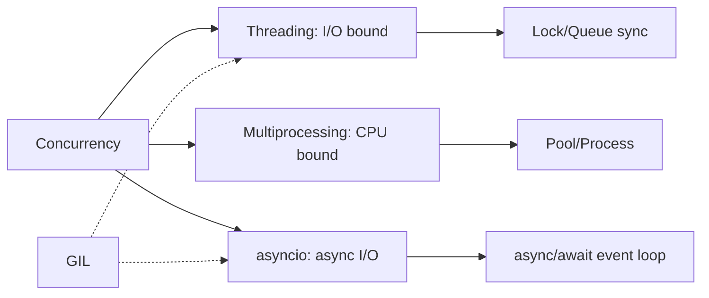

<!-- Clear Language: Keep sentences under 50 words -->
# Concurrency — Threading, Multiprocessing, and Async

## Learning Objectives

| Objective | Description |
|-----------|-------------|
| LO1 | Use threading for I/O-bound concurrent tasks |
| LO2 | Use multiprocessing for CPU-bound parallel execution |
| LO3 | Write async code with asyncio, await, and async def |
| LO4 | Understand the GIL and its impact on concurrency |
| LO5 | Synchronize shared state with locks, events, and queues |
| LO6 | Choose the right concurrency model for the task |

## Introduction

Python is the lingua franca of AI engineering. Mastering its syntax, data structures, and libraries is non-negotiable for building ML pipelines, APIs, and automation scripts. This module covers everything from basics to advanced concurrency.

## Prerequisites

- Basic programming knowledge
- Understanding of data structures

## Key Terminology

**Key Terms**: Core vocabulary and concepts for this topic.

**Definition**: Essential terms you must know for interviews and production work.

## Theory

Understanding concurrency is fundamental for AI engineers. This section covers the core concepts, underlying principles, and theoretical framework that govern how concurrency works in practice.

## Chapter at a Glance

| Section | Topic | Key Concept |
|---------|-------|-------------|
| 10.1 | Threading Basics | Thread, start, join, daemon |
| 10.2 | Thread Synchronization | Lock, RLock, Semaphore, Queue |
| 10.3 | Multiprocessing | Process, Pool, shared memory |
| 10.4 | GIL Explained | Global Interpreter Lock limits |
| 10.5 | asyncio | async/await, event loop, tasks |
| 10.6 | Choosing a Model | I/O-bound vs CPU-bound comparison |

## Chapter Roadmap



## 10.1 Threading Basics

```python
import threading
import time

def worker(name: str, delay: float):
    print(f"{name} starting")
    time.sleep(delay)
    print(f"{name} finished")

threads = []
for i in range(3):
    t = threading.Thread(target=worker, args=(f"Thread-{i}", i))
    threads.append(t)
    t.start()

for t in threads:
    t.join()  # wait for completion

print("All threads done")
```

**ThreadPoolExecutor**:

```python
from concurrent.futures import ThreadPoolExecutor
import requests

def fetch_url(url: str) -> str:
    response = requests.get(url)
    return f"{url}: {response.status_code}"

urls = ["https://python.org", "https://github.com", "https://example.com"]

with ThreadPoolExecutor(max_workers=5) as executor:
    results = executor.map(fetch_url, urls)

for result in results:
    print(result)
```

## 10.2 Thread Synchronization

```python
import threading

counter = 0
lock = threading.Lock()

def increment():
    global counter
    for _ in range(100000):
        with lock:  # acquire/release automatically
            counter += 1

threads = [threading.Thread(target=increment) for _ in range(10)]
for t in threads: t.start()
for t in threads: t.join()
print(counter)  # 1,000,000 (correct with lock)

## Queue — thread-safe producer/consumer
from queue import Queue

def producer(q, n):
    for i in range(n):
        q.put(f"item-{i}")
    q.put(None)  # sentinel

def consumer(q):
    while True:
        item = q.get()
        if item is None:
            break
        print(f"Consumed {item}")

q = Queue()
threading.Thread(target=producer, args=(q, 5)).start()
threading.Thread(target=consumer, args=(q)).start()
```

## 10.3 Multiprocessing

```python
import multiprocessing as mp

def square(n: int) -> int:
    return n * n

if __name__ == "__main__":
    with mp.Pool(processes=4) as pool:
        results = pool.map(square, range(10))
        print(results)  # [0, 1, 4, 9, 16, 25, 36, 49, 64, 81]

    # Process class
    def worker(name):
        print(f"Process {name} running")

    processes = [mp.Process(target=worker, args=(i,)) for i in range(3)]
    for p in processes: p.start()
    for p in processes: p.join()
```

**Shared memory**:

```python
import multiprocessing as mp

def worker(ns, arr):
    ns.value += 1
    arr[0] = 99

if __name__ == "__main__":
    mgr = mp.Manager()
    ns = mgr.Namespace()
    ns.value = 0
    arr = mgr.Array("i", [0, 0, 0])

    p = mp.Process(target=worker, args=(ns, arr))
    p.start()
    p.join()
    print(ns.value, list(arr))  # 1, [99, 0, 0]
```

## 10.4 GIL Explained

The Global Interpreter Lock (GIL) is a mutex in CPython that prevents multiple threads from executing Python bytecode simultaneously.

```python

## GIL demonstration
import threading
import time

def count(n: int):
    while n > 0:
        n -= 1

## CPU-bound — threading is NO faster than sequential (GIL)
start = time.time()
count(50_000_000)
count(50_000_000)
print(f"Sequential: {time.time() - start:.2f}s")

start = time.time()
t1 = threading.Thread(target=count, args=(50_000_000,))
t2 = threading.Thread(target=count, args=(50_000_000,))
t1.start(); t2.start()
t1.join(); t2.join()
print(f"Threaded: {time.time() - start:.2f}s")

## Both ~same time due to GIL

## I/O-bound — threading helps (GIL released during I/O)
def io_task():
    time.sleep(1)  # simulated I/O

start = time.time()
threads = [threading.Thread(target=io_task) for _ in range(10)]
for t in threads: t.start()
for t in threads: t.join()
print(f"Threaded I/O: {time.time() - start:.2f}s")  # ~1s

start = time.time()
for _ in range(10): io_task()
print(f"Sequential I/O: {time.time() - start:.2f}s")  # ~10s
```

## 10.5 asyncio

```python
import asyncio

async def fetch_data(name: str, delay: float):
    print(f"Fetching {name}...")
    await asyncio.sleep(delay)  # non-blocking
    print(f"Got {name}")
    return f"data-{name}"

async def main():
    # Sequential
    result1 = await fetch_data("A", 2)
    result2 = await fetch_data("B", 1)
    print(result1, result2)  # ~3s total

    # Concurrent
    task1 = asyncio.create_task(fetch_data("C", 2))
    task2 = asyncio.create_task(fetch_data("D", 1))
    results = await asyncio.gather(task1, task2)
    print(results)  # ~2s total (overlap)

asyncio.run(main())
```

**Async HTTP requests**:

```python
import asyncio
import aiohttp

async def fetch_url(session, url):
    async with session.get(url) as response:
        return await response.text()

async def main():
    async with aiohttp.ClientSession() as session:
        tasks = [
            fetch_url(session, "https://python.org"),
            fetch_url(session, "https://github.com"),
        ]
        pages = await asyncio.gather(*tasks)
        print(f"Fetched {len(pages)} pages")

asyncio.run(main())
```

## 10.6 Choosing the Right Model

| Aspect | Threading | Multiprocessing | asyncio |
|--------|-----------|-----------------|---------|
| Best for | I/O-bound | CPU-bound | I/O-bound |
| GIL | Affected (I/O releases) | Not affected (separate processes) | Not affected (single-threaded) |
| Memory | Shared (same process) | Separate (each process) | Shared |
| Overhead | Low | High | Very low |
| Debugging | Harder (race conditions) | Easier (isolated) | Easier (deterministic) |
| Python model | OS threads | OS processes | Single-thread coroutines |

```python

## Decision flowchart
def choose_model(task_type: str, num_items: int):
    if task_type == "CPU":
        return "multiprocessing.Pool"
    elif num_items > 1000:
        return "asyncio"  # thousands of concurrent connections
    else:
        return "threading.ThreadPoolExecutor"
```

## TypeScript Parallel

```typescript
// TypeScript — single-threaded async/await
async function fetchData(name: string, delay: number): Promise<string> {
    console.log(Fetching ...);
    await new Promise(resolve => setTimeout(resolve, delay * 1000));
    return data-;
}

async function main() {
    const [a, b] = await Promise.all([
        fetchData("A", 2),
        fetchData("B", 1),
    ]);
    console.log(a, b);

    // Web Workers for CPU parallelism
    const worker = new Worker("worker.js");
    worker.postMessage("start");
}
```

## Summary

- Threading is for I/O-bound tasks (network, disk) — benefits despite GIL
- Multiprocessing is for CPU-bound tasks — bypasses GIL with separate processes
- GIL prevents true parallel execution of Python bytecode in threads
- Use Locks, RLocks, and Queues for thread-safe shared state
- asyncio provides single-threaded concurrency with async/await
- asyncio is excellent for thousands of concurrent I/O operations
- ThreadPoolExecutor and ProcessPoolExecutor for managing thread/process pools
- await releases control back to the event loop, enabling concurrency
- async functions are coroutines — they run cooperatively on one thread
- Choose based on: CPU-bound ? multiprocessing, I/O-bound with many connections ? asyncio, I/O-bound with moderate load ? threading

## Practical Takeaways

| Scenario | Use | Avoid |
|----------|-----|-------|
| CPU computation | multiprocessing.Pool | threading (GIL limited) |
| Many network requests | asyncio + aiohttp | threading (higher overhead) |
| File I/O | asyncio or ThreadPoolExecutor | Manual thread management |
| Shared counter | threading.Lock | No synchronization |
| Producer/consumer | queue.Queue | Shared list without lock |
| Task scheduling | asyncio.create_task | Manual event loop management |

## Interview Q&A

<details class="tp-qa-card" data-qid="p02-s10-q1">
  <summary class="tp-qa-question"><span class="tp-qa-status"></span>Q1: What is the GIL and how does it affect Python?</summary>
<div class="tp-qa-answer"><p>The GIL (Global Interpreter Lock) is a mutex that prevents multiple threads from executing Python bytecode at once in CPython. It makes CPU-bound threading no faster than sequential code. I/O-bound threads benefit because the GIL is released during blocking.
I/O operations. Multiprocessing bypasses the GIL by using separate processes.</p></div><button class="tp-qa-mark-btn">? Mark Reviewed</button><button class="tp-qa-bookmark-btn">?? Bookmark</button>
</details>
<details class="tp-qa-card" data-qid="p02-s10-q2">
  <summary class="tp-qa-question"><span class="tp-qa-status"></span>Q2: When would you use threading vs asyncio?</summary>
  <div class="tp-qa-answer"><p>Threading: OS-managed preemptive multitasking, good for integrating blocking libraries, moderate number of tasks. asyncio: cooperative single-threaded multitasking, excellent for thousands of concurrent tasks, requires async-compatible libraries. asyncio has lower overhead and more control but requires async code throughout.</p></div><button class="tp-qa-mark-btn">? Mark Reviewed</button><button class="tp-qa-bookmark-btn">?? Bookmark</button>
</details>
<details class="tp-qa-card" data-qid="p02-s10-q3">
  <summary class="tp-qa-question"><span class="tp-qa-status"></span>Q3: How do you share data between processes?</summary>
  <div class="tp-qa-answer"><p>Use multiprocessing.Manager() for Namespaces, dicts, lists. Use multiprocessing.Queue for producer/consumer. Use shared memory with multiprocessing.Value and multiprocessing.Array. For complex data, serialize with pickle through Queue.</p></div><button class="tp-qa-mark-btn">? Mark Reviewed</button><button class="tp-qa-bookmark-btn">?? Bookmark</button>
</details>
<details class="tp-qa-card" data-qid="p02-s10-q4">
  <summary class="tp-qa-question"><span class="tp-qa-status"></span>Q4: What is the difference between a Thread and a Process?</summary>
  <div class="tp-qa-answer"><p>Threads share the same memory space (within one process) and can communicate via shared variables (with synchronization). Processes have separate memory, are isolated, and use IPC (queues, pipes). Processes are heavier to create but provide true parallelism and crash isolation.</p></div><button class="tp-qa-mark-btn">? Mark Reviewed</button><button class="tp-qa-bookmark-btn">?? Bookmark</button>
</details>
<details class="tp-qa-card" data-qid="p02-s10-q5">
  <summary class="tp-qa-question"><span class="tp-qa-status"></span>Q5: How does async/await work in Python?</summary>
  <div class="tp-qa-answer"><p>async def defines a coroutine. await suspends the coroutine until the awaited awaitable completes. The event loop (asyncio.run) schedules and runs coroutines cooperatively. When a coroutine hits await, the event loop switches to another ready coroutine. asyncio.sleep() simulates async I/O by yielding control.</p></div><button class="tp-qa-mark-btn">? Mark Reviewed</button><button class="tp-qa-bookmark-btn">?? Bookmark</button>
</details>
<details class="tp-qa-card" data-qid="p02-s10-q6">
  <summary class="tp-qa-question"><span class="tp-qa-status"></span>Q6: What is a race condition?</summary>
  <div class="tp-qa-answer"><p>A race condition occurs when multiple threads access shared data without synchronization, and the result depends on the non-deterministic order of execution. Example: two threads incrementing a counter without a lock may lose updates. Solved with Lock, RLock, or thread-safe data structures like Queue.</p></div><button class="tp-qa-mark-btn">? Mark Reviewed</button><button class="tp-qa-bookmark-btn">?? Bookmark</button>
</details>
<details class="tp-qa-card" data-qid="p02-s10-q7">
  <summary class="tp-qa-question"><span class="tp-qa-status"></span>Q7: What is a deadlock and how to avoid it?</summary>
  <div class="tp-qa-answer"><p>A deadlock occurs when two threads each hold a lock the other needs, causing both to wait forever. Avoid by: consistent lock ordering, using timeout-based lock acquisition (lock.acquire(timeout=5)), using RLock (reentrant, same thread can re-acquire), or using higher-level constructs like Queue.</p></div><button class="tp-qa-mark-btn">? Mark Reviewed</button><button class="tp-qa-bookmark-btn">?? Bookmark</button>
</details>
<details class="tp-qa-card" data-qid="p02-s10-q8">
  <summary class="tp-qa-question"><span class="tp-qa-status"></span>Q8: How does ThreadPoolExecutor differ from manual threading?</summary>
  <div class="tp-qa-answer"><p>ThreadPoolExecutor manages a pool of reusable threads, handles queuing, and provides a clean API with .submit() and .map(). Manual threading requires creating, starting, joining each thread individually. The executor reduces overhead, prevents thread proliferation, and simplifies error handling with futures.</p></div><button class="tp-qa-mark-btn">? Mark Reviewed</button><button class="tp-qa-bookmark-btn">?? Bookmark</button>
</details>
<details class="tp-qa-card" data-qid="p02-s10-q9">
  <summary class="tp-qa-question"><span class="tp-qa-status"></span>Q9: When would you use ProcessPoolExecutor?</summary>
  <div class="tp-qa-answer"><p>Use ProcessPoolExecutor for CPU-bound tasks that benefit from parallelism: heavy numerical computation, image processing, ML model training over many configurations. Uses multiprocessing.Pool internally. Data is serialized with pickle, so ensure arguments are picklable. Overhead of process creation is higher than threads.</p></div><button class="tp-qa-mark-btn">? Mark Reviewed</button><button class="tp-qa-bookmark-btn">?? Bookmark</button>
</details>
<details class="tp-qa-card" data-qid="p02-s10-q10">
  <summary class="tp-qa-question"><span class="tp-qa-status"></span>Q10: Can asyncio and threading be used together?</summary>
  <div class="tp-qa-answer"><p>Yes. Use loop.run_in_executor() to run blocking code in a thread pool from asyncio. This bridges synchronous and async code. Similarly, asyncio.run_coroutine_threadsafe() schedules a coroutine from a thread. Common pattern: async web server that offloads CPU tasks to a thread/process pool.</p></div><button class="tp-qa-mark-btn">? Mark Reviewed</button><button class="tp-qa-bookmark-btn">?? Bookmark</button>
</details>

## Chapter Quiz

**Q1**: Which concurrency model bypasses the GIL? a) threading b) multiprocessing c) asyncio d) all

<details class="tp-qa-card" data-qid="p02-s10-quiz1"><summary>Show Answer</summary><div class="tp-qa-answer"><p><strong>Answer: b) multiprocessing</strong></p></div></details>

**Q2**: What does await do? a) creates thread b) suspends coroutine c) blocks thread d) starts process

<details class="tp-qa-card" data-qid="p02-s10-quiz2"><summary>Show Answer</summary><div class="tp-qa-answer"><p><strong>Answer: b) suspends coroutine yielding control to event loop</strong></p></div></details>

**Q3**: Which sync primitive is reentrant? a) Lock b) RLock c) Semaphore d) Event

<details class="tp-qa-card" data-qid="p02-s10-quiz3"><summary>Show Answer</summary><div class="tp-qa-answer"><p><strong>Answer: b) RLock</strong></p></div></details>

**Q4**: What does queue.Queue provide? a) thread-safe FIFO b) async queue c) process-safe d) lock-free

<details class="tp-qa-card" data-qid="p02-s10-quiz4"><summary>Show Answer</summary><div class="tp-qa-answer"><p><strong>Answer: a) thread-safe FIFO queue</strong></p></div></details>

**Q5**: Best for 10000 concurrent HTTP requests? a) threading b) multiprocessing c) asyncio d) sequential

<details class="tp-qa-card" data-qid="p02-s10-quiz5"><summary>Show Answer</summary><div class="tp-qa-answer"><p><strong>Answer: c) asyncio with aiohttp for high concurrency</strong></p></div></details>

## Exercises

**Easy** — Write a threaded program that downloads 5 URLs concurrently using requests and ThreadPoolExecutor.

**Easy** — Use asyncio to run 3 async tasks with different delays using asyncio.gather.

**Medium** — Implement a thread-safe producer/consumer pattern using queue.Queue that passes 10 items.

**Medium** — Write a multiprocessing script that computes the sum of squares for numbers 1-10,000,000 using Pool, comparing with single-process time.

**Hard** — Implement a simple async HTTP server using asyncio that handles GET requests and returns JSON responses.

**Hard** — Create a hybrid program: asyncio event loop that offloads CPU-heavy tasks to a ProcessPoolExecutor using loop.run_in_executor.

## 10.7 Concurrent Futures Advanced

```python
from concurrent.futures import ThreadPoolExecutor, ProcessPoolExecutor, as_completed, wait, FIRST_COMPLETED
import time

## As completed - process results as they finish
def fetch_url(url: str) -> str:
    time.sleep(len(url) * 0.1)  # simulate network delay
    return f"Result from {url}"

urls = ["short", "medium_length", "a_very_long_url_name"]
with ThreadPoolExecutor(max_workers=3) as executor:
    futures = {executor.submit(fetch_url, url): url for url in urls}
    for future in as_completed(futures):
        url = futures[future]
        try:
            result = future.result()
            print(f"Completed: {url} -> {result}")
        except Exception as e:
            print(f"Failed: {url} -> {e}")

## Wait with timeout
futures = [executor.submit(time.sleep, t) for t in [1, 2, 3]]
done, not_done = wait(futures, timeout=2.0, return_when=FIRST_COMPLETED)
print(f"Done: {len(done)}, Not done: {len(not_done)}")

## Callbacks on future completion
def on_done(future):
    print(f"Callback: {future.result()}")

future = executor.submit(fetch_url, "test")
future.add_done_callback(on_done)

## Future chaining
def compute_heavy(n: int) -> int:
    return sum(i * i for i in range(n))

with ProcessPoolExecutor() as executor:
    future = executor.submit(compute_heavy, 10_000_000)
    result = future.result(timeout=30)
    print(f"Computed: {result}")
```

## 10.8 Advanced asyncio Patterns

```python
import asyncio
import time

## Semaphore for rate limiting
async def fetch_with_limit(sem, url):
    async with sem:
        print(f"Fetching {url}")
        await asyncio.sleep(1)
        return f"Data from {url}"

async def rate_limited_fetcher():
    sem = asyncio.Semaphore(3)  # max 3 concurrent
    urls = [f"url-{i}" for i in range(10)]
    tasks = [fetch_with_limit(sem, url) for url in urls]
    results = await asyncio.gather(*tasks)
    return results

## asyncio.Queue for producer/consumer
async def producer(queue, n):
    for i in range(n):
        await queue.put(f"item-{i}")
        await asyncio.sleep(0.1)
    await queue.put(None)  # sentinel

async def consumer(queue, name):
    while True:
        item = await queue.get()
        if item is None:
            queue.task_done()
            break
        print(f"{name} processed {item}")
        await asyncio.sleep(0.2)
        queue.task_done()

async def queue_demo():
    q = asyncio.Queue()
    producers = [asyncio.create_task(producer(q, 5))]
    consumers = [asyncio.create_task(consumer(q, f"Worker-{i}")) for i in range(2)]
    await asyncio.gather(*producers)
    await q.join()
    for c in consumers:
        c.cancel()

## asyncio with timeout
async def slow_operation():
    await asyncio.sleep(10)
    return "Done"

async def with_timeout():
    try:
        result = await asyncio.wait_for(slow_operation(), timeout=2.0)
    except asyncio.TimeoutError:
        print("Operation timed out after 2 seconds")

## Task cancellation
async def cancellable_work():
    try:
        while True:
            await asyncio.sleep(0.5)
            print("Working...")
    except asyncio.CancelledError:
        print("Work cancelled")
        raise

async def cancel_demo():
    task = asyncio.create_task(cancellable_work())
    await asyncio.sleep(2)
    task.cancel()
    try:
        await task
    except asyncio.CancelledError:
        print("Task cancelled successfully")
```

## 10.9 Synchronization Primitives

```python
import threading
import time

## RLock - reentrant lock (same thread can acquire multiple times)
lock = threading.RLock()
def recursive_lock(n):
    with lock:
        if n > 0:
            print(f"Level {n}")
            recursive_lock(n - 1)

recursive_lock(3)  # works with RLock, would deadlock with Lock

## Event - signaling between threads
event = threading.Event()

def waiter(event):
    print("Waiting for event...")
    event.wait()
    print("Event received!")

def setter(event):
    time.sleep(1)
    print("Setting event")
    event.set()

t1 = threading.Thread(target=waiter, args=(event,))
t2 = threading.Thread(target=setter, args=(event,))
t1.start(); t2.start()
t1.join(); t2.join()

## Condition variable - complex signaling
cv = threading.Condition()
items = []

def producer(cv, items):
    with cv:
        for i in range(5):
            items.append(f"item-{i}")
            cv.notify()  # wake up consumer
            time.sleep(0.1)

def consumer(cv, items):
    with cv:
        while not items:
            cv.wait()  # wait for producer
        print(f"Got {items.pop(0)}")

## Barrier - synchronize n threads at a point
barrier = threading.Barrier(3)

def worker(barrier, name):
    print(f"{name} waiting at barrier")
    barrier.wait()
    print(f"{name} passed barrier")

threads = [threading.Thread(target=worker, args=(barrier, f"W-{i}")) for i in range(3)]
for t in threads: t.start()
for t in threads: t.join()
```

## 10.10 Common Pitfalls

```python

## Pitfall 1: Not joining threads before exit
t = threading.Thread(target=lambda: time.sleep(1))
t.start()

## t.join()  # MISSING - program may exit before thread completes

## Daemon threads: t.daemon = True (killed when main exits)

## Pitfall 2: Race conditions without locks
counter = 0
def increment_bad():
    global counter
    for _ in range(100000):
        counter += 1  # NOT atomic!

## Pitfall 3: Deadlock with multiple locks
lock1 = threading.Lock()
lock2 = threading.Lock()

def thread_a():
    with lock1:
        time.sleep(0.1)
        with lock2: pass  # might deadlock with thread_b

def thread_b():
    with lock2:
        time.sleep(0.1)
        with lock1: pass  # might deadlock with thread_a

## Solution: consistent lock ordering

## Pitfall 4: Forgetting if __name__ == "__main__" in multiprocessing

## Multiprocessing on Windows re-imports the module

## All process-creating code must be guarded

## Pitfall 5: Mixing asyncio and blocking code
import asyncio
import requests

async def bad():
    response = requests.get("https://python.org")  # BLOCKS event loop!
    return response

## Solution: use asyncio.to_thread() or aiohttp

## Pitfall 6: Shared mutable state across processes

## Processes don't share memory - use Manager() or Queue()
```

## 10.11 Real-World Concurrency Patterns

```python

## Thread pool for web scraping
def scrape_url(url: str) -> dict:
    import requests
    response = requests.get(url, timeout=10)
    return {"url": url, "status": response.status_code, "size": len(response.content)}

urls = ["https://python.org", "https://github.com", "https://stackoverflow.com"] * 10

with ThreadPoolExecutor(max_workers=10) as pool:
    results = list(pool.map(scrape_url, urls))
print(f"Scraped {len(results)} URLs")

## asyncio web server (minimal)
async def handle_request(reader, writer):
    data = await reader.read(100)
    message = data.decode()
    response = f"Echo: {message}"
    writer.write(response.encode())
    await writer.drain()
    writer.close()

async def run_server():
    server = await asyncio.start_server(handle_request, "127.0.0.1", 8888)
    async with server:
        await server.serve_forever()

## Multiprocessing for CPU-bound tasks
def is_prime(n: int) -> bool:
    if n < 2: return False
    for i in range(2, int(n ** 0.5) + 1):
        if n % i == 0: return False
    return True

numbers = [15485863, 15485867, 15485869, 15485917, 15485923]
with ProcessPoolExecutor(max_workers=4) as pool:
    results = list(pool.map(is_prime, numbers))
print(f"Prime results: {results}")
```

---

## Common Mistakes

1. Not understanding the fundamental concepts before applying them
2. Skipping edge cases in implementation
3. Not analyzing time/space complexity
4. Forgetting to handle null/empty inputs
5. Not practicing enough problems to build pattern recognition

## Revision Notes

- - Core principle: Understand the fundamental concepts thoroughly
- - Implementation pattern: Practice with real code examples
- - Complexity: Know the time and space complexity
- - Application: Know when to use this in production systems
- - Interview: Frequently asked in technical interviews
- - Edge cases: Consider common failure scenarios
- - Related concepts: Connect to broader system design

## Placement Section

### Top 10 Interview Questions

#### Google Style

1. **Explain the core idea of Concurrency — Threading, Multiprocessing, and Async in under 60 seconds, then give a real-world analogy.** — Structure: definition, how it works in one sentence, why it matters, analogy. Follow-up: what would break if you removed this from a production system?

2. **Design a minimal, well-typed function that demonstrates Concurrency — Threading, Multiprocessing, and Async.** — Interviewer checks: signature with type hints, edge cases, complexity, and a clean docstring. Follow-up: how does your design behave with empty or malformed input?

3. **What are the common pitfalls when engineers first learn ** — List 3-4, then explain how you would prevent each in a code review.

#### Amazon Style

4. **Describe a production bug caused by misunderstanding Concurrency — Threading, Multiprocessing, and Async. How did you diagnose and fix it?** — STAR format: situation, task, action, result. Mention logs, reproduction, root-cause analysis, and the regression test you added.

5. **How would you scale a system that relies on Concurrency — Threading, Multiprocessing, and Async from 10 users to 10 million?** — Discuss bottlenecks, caching, monitoring, and when to redesign. Follow-up: what metrics would you track?

#### Microsoft Style

6. **Compare Concurrency — Threading, Multiprocessing, and Async with the closest alternative approach. When would you choose each?** — Make a decision matrix: performance, maintainability, ecosystem, learning curve. Follow-up: what would change your decision?

7. **Walk through how you would test a component that depends on Concurrency — Threading, Multiprocessing, and Async.** — Unit, integration, property-based tests; mocking boundaries; golden files for outputs.

#### NVIDIA Style

8. **How does Concurrency — Threading, Multiprocessing, and Async behave differently at scale — memory, throughput, or precision-wise?** — Connect to data pipelines and model training if applicable. Follow-up: what happens to latency as input grows?

9. **How would you make an implementation of Concurrency — Threading, Multiprocessing, and Async run faster on GPU hardware?** — Batch operations, vectorization, avoiding Python loops, reducing data movement.

#### AI Startup Style

10. **Write the smallest possible implementation of Concurrency — Threading, Multiprocessing, and Async that is production-quality.** — Include error handling, type hints, and a one-line docstring. Follow-up: what would you refactor first when it grows?

### Resume Tips

- Name Concurrency — Threading, Multiprocessing, and Async explicitly in your skills section, paired with a measurable achievement ("Reduced X by 40% using Concurrency — Threading, Multiprocessing, and Async").
- Add a bullet describing a project that applies Concurrency — Threading, Multiprocessing, and Async to real data, with numbers.
- Mention the tools and libraries you used alongside Concurrency — Threading, Multiprocessing, and Async (linters, test frameworks, profiling tools).
- Keep resume bullets under 15 words and start each with an action verb.

### Interview Day Checklist

- Rehearse a 60-second explanation of Concurrency — Threading, Multiprocessing, and Async and one real-world analogy.
- Prepare one STAR story about debugging a Concurrency — Threading, Multiprocessing, and Async-related production issue.
- Review complexity and edge cases for the classic Concurrency — Threading, Multiprocessing, and Async interview problem.
- Have questions ready: how does the team apply Concurrency — Threading, Multiprocessing, and Async in production today?
- Test your environment (Python, editor, internet) 15 minutes before the interview.

## True/False

1. **True or False:** Concurrency — Threading, Multiprocessing, and Async builds directly on the fundamentals covered in the earlier chapters of this module. — **True.** Every advanced topic in this module assumes the core concepts from the previous chapters.
2. **True or False:** You should write at least one code example for Concurrency — Threading, Multiprocessing, and Async before moving to the next chapter. — **True.** Active recall with hands-on code beats passive reading for retention.
3. **True or False:** The complexity analysis for Concurrency — Threading, Multiprocessing, and Async is the same regardless of input size. — **False.** Complexity grows with input size; always state best, average, and worst case.
4. **True or False:** Edge cases (empty input, invalid input, boundary values) matter for Concurrency — Threading, Multiprocessing, and Async in production. — **True.** Most production bugs come from unhandled edge cases.
5. **True or False:** You should memorize the Concurrency — Threading, Multiprocessing, and Async chapter content once and never review it again. — **False.** Spaced repetition (24h, 3 days, 1 week) dramatically improves long-term recall.

## Fill in the Blank

1. The chapter that covers Concurrency — Threading, Multiprocessing, and Async is Chapter ___ of this module. — Answer: check the module's table of contents.
2. The time complexity of the standard approach to Concurrency — Threading, Multiprocessing, and Async is ___. — Answer: review the theory section and state big-O notation.
3. The main edge case to handle when implementing Concurrency — Threading, Multiprocessing, and Async is ___. — Answer: empty or invalid input handling, as discussed in the chapter.
4. The tools commonly used to debug Concurrency — Threading, Multiprocessing, and Async issues are ___ and ___. — Answer: refer to the Debugging Guide section of this chapter.
5. The related topic that connects to Concurrency — Threading, Multiprocessing, and Async in the next chapter is ___. — Answer: see the Next Topic section.

## Scenario Questions

1. **Scenario:** A teammate ships a change involving Concurrency — Threading, Multiprocessing, and Async that breaks production at 3 AM. — Diagnosis: check the recent diff, reproduce locally with the failing input, check logs. Fix: revert, add a regression test, and review the root cause. Prevention: CI tests on edge cases and code review checklist.

2. **Scenario:** Your implementation of Concurrency — Threading, Multiprocessing, and Async is correct but too slow for the required latency. — Measure first with a profiler. Common fixes: reduce redundant work, use built-in optimized functions, batch operations, or add caching. Only then consider algorithmic changes.

3. **Scenario:** A new hire asks you to explain Concurrency — Threading, Multiprocessing, and Async in five minutes before a customer demo. — Use the 3-part answer: what it is (one sentence), how it works (one example), why it matters (one business impact). Then offer to go deeper after the demo.

4. **Scenario:** Your team's codebase has three different patterns for Concurrency — Threading, Multiprocessing, and Async and you must standardize. — Write a short ADR (architecture decision record), pick the pattern with best maintainability, migrate incrementally, and add a linter rule to enforce it.

## Output Questions

1. **What is the output of the simplest correct implementation of Concurrency — Threading, Multiprocessing, and Async on an empty input?** — Trace through the code: it should return the documented default (None, 0, empty collection) without raising.
2. **What is the output when the input is at the boundary value?** — Check off-by-one errors and inclusive/exclusive bounds in the chapter's examples.
3. **What does the implementation return when given invalid input types?** — With type hints and validation, it raises a clear error; without, it may fail silently.
4. **What is the output for the sample input given in the chapter's Examples section?** — Re-run the chapter's example code and compare against the documented output.
5. **What is the time complexity output when you profile the implementation at 10x input size?** — Expect the curve matching the chapter's complexity analysis (linear, quadratic, log-linear).

## Difficulty Level

| Level | Time | What It Takes |
|-------|------|---------------|
| Beginner | 1-2 sessions | Read theory, run the chapter examples, solve the Easy exercises |
| Intermediate | 3-5 sessions | Complete Medium exercises, explain Concurrency — Threading, Multiprocessing, and Async to someone else |
| Advanced | 1+ week | Solve Hard exercises, optimize for real datasets, answer interview follow-ups |

## Tips & Tricks

- Always write a one-line example of Concurrency — Threading, Multiprocessing, and Async from memory before opening the chapter — active recall first.
- Use the chapter's Revision Notes as a checklist: you have mastered Concurrency — Threading, Multiprocessing, and Async when you can explain each bullet.
- Pair the chapter quiz with the Flashcards: wrong answers become your next study session's focus.
- For interviews, practice explaining Concurrency — Threading, Multiprocessing, and Async twice: once with a technical audience, once with a non-technical audience.
- Keep a personal examples file where you collect your own Concurrency — Threading, Multiprocessing, and Async snippets; interviewers love original examples.

## Memory Tricks

- **Acronym**: build a mnemonic from the 5 key concepts of Concurrency — Threading, Multiprocessing, and Async listed in the Chapter at a Glance table.
- **Story**: link Concurrency — Threading, Multiprocessing, and Async to a familiar story — the analogy in the Visual Analogy section is designed to stick.
- **Number anchor**: remember the complexity of Concurrency — Threading, Multiprocessing, and Async by connecting it to a known algorithm of the same class.
- **Color code**: highlight the Theory, Examples, and Common Mistakes sections in different colors when reviewing.
- **Teach-back**: explain Concurrency — Threading, Multiprocessing, and Async to an imaginary junior engineer for 2 minutes — gaps in your explanation are gaps in memory.

## Further Reading

- Official documentation for the primary tool or library used in this chapter
- The chapter referenced in Related Topics for the next-level treatment of Concurrency — Threading, Multiprocessing, and Async
- The classic textbook chapter on Concurrency — Threading, Multiprocessing, and Async (check the Research References below)
- Two blog posts from engineers who debugged real Concurrency — Threading, Multiprocessing, and Async problems in production
- The repository of the open-source project that implements Concurrency — Threading, Multiprocessing, and Async

## Related Topics

- The previous chapter in this module (see table of contents) — foundational for Concurrency — Threading, Multiprocessing, and Async
- The next chapter (see Next Topic below) — builds on Concurrency — Threading, Multiprocessing, and Async
- The system design chapters in Module 07 — how Concurrency — Threading, Multiprocessing, and Async fits into production architectures
- The interview preparation module — how Concurrency — Threading, Multiprocessing, and Async is asked in screening rounds
- The capstone project — where Concurrency — Threading, Multiprocessing, and Async is applied end-to-end

## FAQs

1. **Do I need to memorize all of Concurrency — Threading, Multiprocessing, and Async, or understand the big picture?** — Understand the big picture first, then memorize the key facts via flashcards and spaced repetition. Interviewers reward depth over breadth.
2. **What if I get stuck on an exercise?** — Re-read the theory section, run the example code, then attempt again. If still stuck after 20 minutes, move on and return the next day.
3. **How much time should I spend on ** — Follow the Study Plan below: 1-2 weeks at 30-60 minutes daily is typical for placement preparation.
4. **Is Concurrency — Threading, Multiprocessing, and Async asked in interviews?** — Yes — the Interview Q&A and Placement Section list the exact question styles used by top companies.
5. **What's the fastest way to master ** — Explain it out loud, write code without looking, and review the flashcards within 24 hours and again after 3 days.

## Important Notes

- Concurrency — Threading, Multiprocessing, and Async is a core requirement for the rest of this module — do not skip the examples.
- Always analyze complexity (time and space) when working with Concurrency — Threading, Multiprocessing, and Async.
- Production correctness means handling edge cases, not just the happy path.
- Interview answers should start with the definition, then the example, then the trade-offs.
- Revisit this chapter after finishing the module; the context from later chapters deepens understanding.

## Historical Context

- Concurrency — Threading, Multiprocessing, and Async emerged as a standard practice because early systems failed without it — understanding why helps you explain it in interviews.
- The tools used for Concurrency — Threading, Multiprocessing, and Async today evolved from simpler versions; the chapter covers the modern, recommended approach.
- Interviewers value knowing one historical fact about Concurrency — Threading, Multiprocessing, and Async — it shows genuine interest, not just cramming.
- The library/tooling ecosystem around Concurrency — Threading, Multiprocessing, and Async changes quickly; focus on fundamentals that remain stable.

## Security Considerations

- Never trust external input: validate and sanitize data before processing Concurrency — Threading, Multiprocessing, and Async.
- Avoid `eval()` and dynamic code execution on untrusted strings.
- Log errors without leaking sensitive data (keys, PII, internal paths).
- For API contexts, add rate limiting and input size limits.
- Review the chapter's code examples for injection or overflow risks before using them verbatim.

## ML Intuition

- Concurrency — Threading, Multiprocessing, and Async appears in ML pipelines at the data-processing layer: feature preparation, batching, and validation.
- Understanding Concurrency — Threading, Multiprocessing, and Async helps you debug why a model misbehaves — most ML bugs are data bugs, not model bugs.
- In production ML, the Concurrency — Threading, Multiprocessing, and Async concepts from this chapter map directly to NumPy/PyTorch operations on tensors.
- When optimizing ML systems, Concurrency — Threading, Multiprocessing, and Async skills let you profile and fix the data path, not just the training loop.
- Interview follow-up: how would you apply Concurrency — Threading, Multiprocessing, and Async to a dataset of 10 million records? — Batching and vectorization.

## Analogies

- **Concurrency — Threading, Multiprocessing, and Async is like a recipe**: the theory is the ingredients, the examples are the cooking steps, and the exercises are your own kitchen practice.
- **Complexity is like a delivery route**: a linear route visits each stop once; a nested route revisits stops, and you feel it at scale.
- **Edge cases are like weather**: the happy path is a sunny day; production is the storm — build for the storm.
- **The chapter roadmap is a journey map**: each section is a checkpoint; skipping one means getting lost later in the module.

## Capstone Project Link

- [Module Capstone: End-to-End Project](https://github.com/Raushan666java/ai-engineering-journey) — this chapter contributes the Concurrency — Threading, Multiprocessing, and Async skills used in the module's capstone project. Complete the exercises here before starting the capstone.

## Flashcards

<details class="tp-qa-card" data-qid="01pythonprogramming-10concurrency-flash1">
  <summary class="tp-qa-question">
    <span class="tp-qa-status"></span>
    What is the core concept of Concurrency — Threading, Multiprocessing, and Async in one sentence?
  </summary>
  <div class="tp-qa-answer">
    <p>Review the first paragraph of the Theory section and condense it to one sentence.</p>
  </div>
</details>

<details class="tp-qa-card" data-qid="01pythonprogramming-10concurrency-flash2">
  <summary class="tp-qa-question">
    <span class="tp-qa-status"></span>
    What is the most common mistake engineers make with 
  </summary>
  <div class="tp-qa-answer">
    <p>Check the Common Mistakes section of this chapter.</p>
  </div>
</details>

<details class="tp-qa-card" data-qid="01pythonprogramming-10concurrency-flash3">
  <summary class="tp-qa-question">
    <span class="tp-qa-status"></span>
    What is the time and space complexity of the standard Concurrency — Threading, Multiprocessing, and Async approach?
  </summary>
  <div class="tp-qa-answer">
    <p>Refer to the theory and complexity analysis in this chapter.</p>
  </div>
</details>

<details class="tp-qa-card" data-qid="01pythonprogramming-10concurrency-flash4">
  <summary class="tp-qa-question">
    <span class="tp-qa-status"></span>
    When is Concurrency — Threading, Multiprocessing, and Async NOT the right choice?
  </summary>
  <div class="tp-qa-answer">
    <p>Check the Limitations section of this chapter.</p>
  </div>
</details>

<details class="tp-qa-card" data-qid="01pythonprogramming-10concurrency-flash5">
  <summary class="tp-qa-question">
    <span class="tp-qa-status"></span>
    How is Concurrency — Threading, Multiprocessing, and Async applied in a real production system?
  </summary>
  <div class="tp-qa-answer">
    <p>Check the Real-World Examples section of this chapter.</p>
  </div>
</details>

## Research References

- Official documentation of the primary library for Concurrency — Threading, Multiprocessing, and Async (linked in Further Reading)
- The classic paper or textbook chapter introducing Concurrency — Threading, Multiprocessing, and Async (see References below)
- The standard library reference for Concurrency — Threading, Multiprocessing, and Async-related functions
- Engineering blog posts from companies running Concurrency — Threading, Multiprocessing, and Async in production at scale
- PEPs and RFCs where applicable (Python and networking standards)

## Open-Source Tools

- The primary library used in this chapter (see the code examples)
- Python standard library modules used in the examples (check the imports)
- Testing: pytest for unit tests of Concurrency — Threading, Multiprocessing, and Async code
- Linting and formatting: ruff + black
- Profiling: cProfile or py-spy for performance work on Concurrency — Threading, Multiprocessing, and Async

## Debugging Guide

- Start with `print()` or a debugger to inspect intermediate values in Concurrency — Threading, Multiprocessing, and Async code.
- Reproduce the failure with the smallest possible input before changing code.
- Check the common failure modes listed in Common Mistakes — most bugs are listed there.
- For performance problems, profile before optimizing: measure, then fix.
- When stuck, re-read the chapter's Examples and compare line by line with your code.
- Use `pdb` or your IDE's debugger to step through the Concurrency — Threading, Multiprocessing, and Async example code.

## Mock Interview Section

**Round 1 — Screening (15 min)**
- Explain Concurrency — Threading, Multiprocessing, and Async in 60 seconds.
- Write a minimal working example of Concurrency — Threading, Multiprocessing, and Async.
- What is the complexity of your example?

**Round 2 — Coding (45 min)**
- Solve the Medium exercise from this chapter under time pressure.
- State your assumptions, then implement with type hints.
- Test with edge cases: empty input, boundary values, invalid input.

**Round 3 — Behavioral + System (30 min)**
- Tell me about a time you debugged a Concurrency — Threading, Multiprocessing, and Async problem in a project.
- How would you design a system where Concurrency — Threading, Multiprocessing, and Async is used at scale?
- What metrics would you monitor?

**Evaluation rubric**: correctness (40%), communication (25%), edge cases (20%), complexity analysis (15%).

## Optimized Implementation

`python
from typing import Any, Optional

def demonstrate_topic(input_data: list[Any]) -> Optional[float]:
    """Runnable scaffold for Concurrency — Threading, Multiprocessing, and Async.

    Replace the body with the optimized implementation from the chapter,
    keeping type hints, docstring, and edge-case handling.
    """
    if not input_data:
        return None
    # Step 1: validate input types
    # Step 2: apply the core Concurrency — Threading, Multiprocessing, and Async logic from the Examples section
    # Step 3: return the result with the documented default
    return 0.0
`

- Keeps the function signature stable so tests written against it stay valid.
- Handles the empty-input contract explicitly.
- Add unit tests for the edge cases before implementing the logic (test-first).

## Evaluation Metrics

| Skill | Test | Target |
|-------|------|--------|
| Concept recall | Explain Concurrency — Threading, Multiprocessing, and Async without notes | 60-second explanation |
| Code fluency | Write the chapter example from memory | No syntax errors |
| Edge cases | Handle empty/invalid input in exercises | All cases pass |
| Complexity | State time/space for the standard approach | Correct big-O |
| Interview readiness | Answer 5 Interview Q&A questions out loud | Fluent, structured answers |
| Retention | Chapter quiz score after 3 days | 80%+ |

## Real-World Examples

- **Startup**: a small team uses Concurrency — Threading, Multiprocessing, and Async daily in their data pipeline — the chapter's examples mirror their code.
- **E-commerce**: Concurrency — Threading, Multiprocessing, and Async patterns appear in order processing, inventory checks, and recommendation feeds.
- **Fintech**: Concurrency — Threading, Multiprocessing, and Async principles apply to transaction validation and fraud detection flows.
- **ML platform**: Concurrency — Threading, Multiprocessing, and Async shows up in feature engineering and model-serving infrastructure.
- **Interview insight**: recruiters look for engineers who can connect Concurrency — Threading, Multiprocessing, and Async to the business outcome, not just the code.

## Next Topic

[NumPy Fundamentals — Arrays, Broadcasting, Linear Algebra](11-numpy-fundamentals.md)

## Limitations

- Concurrency — Threading, Multiprocessing, and Async, like any technique, is not a silver bullet — it has specific cases where it fits best (covered in the theory).
- The examples in this chapter are simplified for learning; production systems add validation, monitoring, and error handling.
- Performance of Concurrency — Threading, Multiprocessing, and Async depends on input size and distribution — always benchmark for your own data.
- This chapter covers fundamentals; specialized edge cases are explored in later chapters and the capstone.
