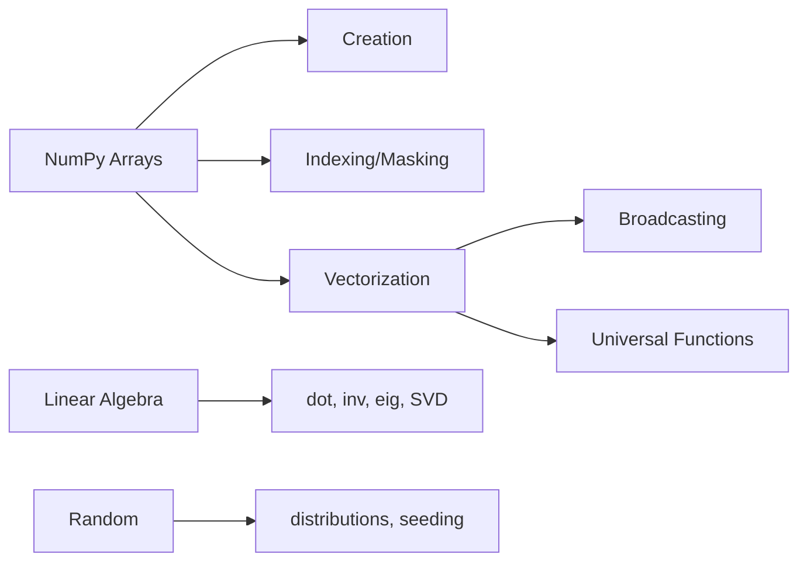

<!-- Clear Language: Keep sentences under 50 words -->
# NumPy Fundamentals — Arrays, Broadcasting, Linear Algebra

## Learning Objectives

| Objective | Description |
|-----------|-------------|
| LO1 | Create and manipulate NumPy arrays with various data types |
| LO2 | Use array indexing, slicing, and boolean masking |
| LO3 | Apply vectorized operations and broadcasting rules |
| LO4 | Perform linear algebra operations: dot, matmul, eig, SVD |
| LO5 | Use random number generation for simulations |
| LO6 | Understand performance benefits over Python lists |

## Introduction

Python is the lingua franca of AI engineering. Mastering its syntax, data structures, and libraries is non-negotiable for building ML pipelines, APIs, and automation scripts. This module covers everything from basics to advanced concurrency.

## Prerequisites

- Basic programming knowledge
- Understanding of data structures

## Key Terminology

**Key Terms**: Core vocabulary and concepts for this topic.

**Definition**: Essential terms you must know for interviews and production work.

## Theory

Understanding numpy fundamentals is fundamental for AI engineers. This section covers the core concepts, underlying principles, and theoretical framework that govern how numpy fundamentals works in practice.

## Chapter at a Glance

| Section | Topic | Key Concept |
|---------|-------|-------------|
| 11.1 | Array Creation | np.array, np.zeros, np.ones, np.arange |
| 11.2 | Indexing & Slicing | fancy indexing, boolean masks |
| 11.3 | Universal Functions | ufuncs, vectorization, aggregations |
| 11.4 | Broadcasting | rules, dimensions, strides |
| 11.5 | Linear Algebra | dot, matmul, inv, eig, SVD |
| 11.6 | Random & Stats | np.random, seeding, distributions |

## Chapter Roadmap



## 11.1 Array Creation

```python
import numpy as np

## From list
arr = np.array([1, 2, 3, 4, 5])
print(arr)           # [1 2 3 4 5]
print(arr.shape)     # (5,)
print(arr.dtype)     # int64

## 2D array
matrix = np.array([[1, 2, 3], [4, 5, 6]])
print(matrix.shape)  # (2, 3)

## Special arrays
zeros = np.zeros((3, 4))
ones = np.ones((2, 3))
full = np.full((2, 2), 7)
eye = np.eye(4)                # identity matrix
empty = np.empty((3, 3))       # uninitialized values

## Ranges
arange = np.arange(0, 10, 2)   # [0, 2, 4, 6, 8]
linspace = np.linspace(0, 1, 5)  # [0.0, 0.25, 0.5, 0.75, 1.0]

## Data types
arr_int = np.array([1, 2, 3], dtype=np.int32)
arr_float = np.array([1, 2, 3], dtype=np.float64)
arr_bool = np.array([True, False, True])
```

## 11.2 Indexing & Slicing

```python
arr = np.arange(10)
print(arr[5])        # 5
print(arr[2:7])      # [2 3 4 5 6]
print(arr[::-1])     # [9 8 7 6 5 4 3 2 1 0]

matrix = np.arange(12).reshape(3, 4)
print(matrix)

## [[ 0  1  2  3]

##  [ 4  5  6  7]

##  [ 8  9 10 11]]

print(matrix[1, 2])     # 6 (row 1, col 2)
print(matrix[0:2, 1:3])

## [[1 2]

##  [5 6]]

## Fancy indexing
indices = [0, 2, 4]
print(arr[indices])  # [0 2 4]

## Boolean masking
mask = arr > 5
print(mask)             # [False False ... True True]
print(arr[mask])        # [6 7 8 9]
print(arr[arr % 2 == 0])  # even numbers

## Where
print(np.where(arr > 5, arr, -1))  # threshold
```

## 11.3 Universal Functions & Vectorization

```python

## ufuncs operate element-wise (fast C loops)
arr = np.array([1, 2, 3, 4, 5])

print(np.sqrt(arr))     # [1.0 1.41 1.73 2.0 2.24]
print(np.exp(arr))      # [2.72 7.39 20.09 54.6 148.4]
print(np.log(arr))      # [0.0 0.69 1.10 1.39 1.61]
print(np.sin(arr))      # trigonometric
print(np.abs([-1, 0, 1]))  # [1 0 1]

## Vectorization — no explicit loops
arr1 = np.array([1, 2, 3])
arr2 = np.array([10, 20, 30])
print(arr1 + arr2)   # [11 22 33]
print(arr1 * arr2)   # [10 40 90]
print(arr1 ** 2)     # [1 4 9]

## Aggregation
print(arr.sum())     # 15
print(arr.mean())    # 3.0
print(arr.std())     # 1.414
print(arr.min())     # 1
print(arr.max())     # 5
print(arr.argmax())  # 4 (index of max)
print(arr.cumsum())  # [1 3 6 10 15]

## Axis-specific aggregation
m = np.array([[1, 2], [3, 4]])
print(m.sum(axis=0))  # [4 6] (sum columns)
print(m.sum(axis=1))  # [3 7] (sum rows)
```

## 11.4 Broadcasting

Broadcasting allows arithmetic between arrays of different shapes.

```python

## Scalar + array
arr = np.array([1, 2, 3])
print(arr + 10)        # [11 12 13]

## Different dimensions
matrix = np.arange(12).reshape(3, 4)
row = np.array([10, 20, 30, 40])
print(matrix + row)    # broadcast row across all rows

## Broadcasting rules:

## 1. If dimensions differ, prepend 1s to smaller shape

## 2. Arrays with size 1 in a dimension are stretched to match

## 3. Sizes must match or be 1, else error

a = np.ones((3, 1))   # shape (3, 1)
b = np.ones((1, 4))   # shape (1, 4)
c = a + b             # shape (3, 4) — both broadcast

## Normalization example
data = np.random.randn(100, 5)
mean = data.mean(axis=0)     # shape (5,)
std = data.std(axis=0)       # shape (5,)
normalized = (data - mean) / std  # broadcasts
```

## 11.5 Linear Algebra

```python

## Dot product
a = np.array([1, 2, 3])
b = np.array([4, 5, 6])
print(np.dot(a, b))       # 32  (1*4 + 2*5 + 3*6)
print(a @ b)              # 32 (same, @ operator)

## Matrix multiplication
A = np.array([[1, 2], [3, 4]])
B = np.array([[5, 6], [7, 8]])
print(A @ B)

## [[19 22]

##  [43 50]]

## Matrix inverse
A = np.array([[1, 2], [3, 4]])
A_inv = np.linalg.inv(A)
print(A @ A_inv)  # ~identity

## Solve linear equations: Ax = b
A = np.array([[3, 1], [1, 2]])
b = np.array([9, 8])
x = np.linalg.solve(A, b)
print(x)  # [2. 3.]  (3*2 + 1*3 = 9, 2 + 2*3 = 8)

## Eigenvalues and eigenvectors
eigvals, eigvecs = np.linalg.eig(A)

## SVD decomposition
U, S, Vt = np.linalg.svd(np.random.randn(5, 3))

## Norms
print(np.linalg.norm([3, 4]))  # 5.0
print(np.linalg.norm([3, 4], ord=1))  # 7.0
```

## 11.6 Random & Statistics

```python

## Random seed for reproducibility
np.random.seed(42)

## Distributions
uniform = np.random.rand(3, 4)           # uniform [0, 1)
normal = np.random.randn(1000)           # standard normal
integers = np.random.randint(0, 100, 10)  # random ints
beta = np.random.beta(2, 5, 100)         # Beta distribution

## Shuffle and choice
arr = np.arange(10)
np.random.shuffle(arr)
print(arr)

sample = np.random.choice(arr, size=3, replace=False)

## Statistics
data = np.random.randn(10000)
print(f"Mean: {data.mean():.3f}, Std: {data.std():.3f}")
print(f"Median: {np.median(data):.3f}")
print(f"Percentile 95: {np.percentile(data, 95):.3f}")
print(f"Min: {data.min():.3f}, Max: {data.max():.3f}")

## Correlation matrix
X = np.random.randn(100, 5)
corr = np.corrcoef(X.T)
print(corr.shape)  # (5, 5)
```

## TypeScript Parallel

```typescript
// TypeScript lacks built-in ndarray. Use libraries.
// npm install numjs
import nj from "numjs";

const arr = nj.array([1, 2, 3, 4, 5]);
console.log(arr.mean());        // 3
console.log(arr.reshape(1, 5)); // 2D array

const A = nj.array([[1, 2], [3, 4]]);
const B = nj.array([[5, 6], [7, 8]]);
console.log(A.dot(B));
```

## Summary

- NumPy arrays are homogeneous, fixed-type, and memory-efficient
- Vectorized operations (no Python loops) give 10-100x speedup
- Broadcasting aligns arrays of different shapes automatically
- Boolean masking provides concise filtering without loops
- ufuncs (sqrt, exp, log, sin) operate element-wise at C speed
- Linear algebra via np.linalg: dot, solve, inv, eig, svd
- Aggregation with axis parameter (0 = columns, 1 = rows)
- Random module supports many distributions
- Always set seed (np.random.seed) for reproducibility
- Reshape, transpose, and stacking (vstack, hstack) for array manipulation

## Practical Takeaways

| Scenario | Use | Avoid |
|----------|-----|-------|
| Numeric computation | NumPy arrays | Python lists |
| Element-wise | Vectorized ops + ufuncs | for loops |
| Different shapes | Broadcasting rules | Manual reshaping |
| Filter data | Boolean masks | Loops with if |
| Linear equations | np.linalg.solve | Manual inversion |
| Normalize data | (data - mean) / std | Manual loop |
| Reproducible random | np.random.seed(42) | No seed |

## Interview Q&A

<details class="tp-qa-card" data-qid="p02-s11-q1">
  <summary class="tp-qa-question"><span class="tp-qa-status"></span>Q1: What is broadcasting in NumPy?</summary>
  <div class="tp-qa-answer"><p>Broadcasting allows arithmetic between arrays of different shapes by stretching dimensions of size 1. Rules: align from right, sizes must match or be 1. Example: (3,1) + (1,4) -> (3,4). Saves memory by not actually replicating data.</p></div><button class="tp-qa-mark-btn">? Mark Reviewed</button><button class="tp-qa-bookmark-btn">?? Bookmark</button>
</details>
<details class="tp-qa-card" data-qid="p02-s11-q2">
  <summary class="tp-qa-question"><span class="tp-qa-status"></span>Q2: How are NumPy arrays different from Python lists?</summary>
  <div class="tp-qa-answer"><p>NumPy arrays: fixed type, contiguous memory, vectorized operations, broadcasting, less memory overhead, support for high-dimensional data. Lists: heterogeneous, dynamic, Python object overhead, slower for numeric operations.</p></div><button class="tp-qa-mark-btn">? Mark Reviewed</button><button class="tp-qa-bookmark-btn">?? Bookmark</button>
</details>
<details class="tp-qa-card" data-qid="p02-s11-q3">
  <summary class="tp-qa-question"><span class="tp-qa-status"></span>Q3: How does axis parameter work?</summary>
  <div class="tp-qa-answer"><p>axis=0 operates along rows (vertically) — collapses rows. axis=1 operates along columns (horizontally). For 2D: sum(axis=0) sums each column; sum(axis=1) sums each row. Higher dimensions follow the same pattern.</p></div><button class="tp-qa-mark-btn">? Mark Reviewed</button><button class="tp-qa-bookmark-btn">?? Bookmark</button>
</details>
<details class="tp-qa-card" data-qid="p02-s11-q4">
  <summary class="tp-qa-question"><span class="tp-qa-status"></span>Q4: What is a universal function (ufunc)?</summary>
  <div class="tp-qa-answer"><p>ufuncs operate element-wise on ndarrays, implemented in C for speed. Examples: np.add, np.multiply, np.sqrt, np.exp, np.sin. They support broadcasting, accumulate, reduce, and outer operations. Much faster than Python for loops.</p></div><button class="tp-qa-mark-btn">? Mark Reviewed</button><button class="tp-qa-bookmark-btn">?? Bookmark</button>
</details>
<details class="tp-qa-card" data-qid="p02-s11-q5">
  <summary class="tp-qa-question"><span class="tp-qa-status"></span>Q5: How do you handle missing values in NumPy?</summary>
  <div class="tp-qa-answer"><p>NumPy uses np.nan (float) for missing values. Functions like np.nansum, np.nanmean, np.nanstd ignore NaN. Use np.isnan() to detect NaN. For integer arrays, use masked arrays (np.ma.MaskedArray) or nullable integer dtype (Int64).</p></div><button class="tp-qa-mark-btn">? Mark Reviewed</button><button class="tp-qa-bookmark-btn">?? Bookmark</button>
</details>
<details class="tp-qa-card" data-qid="p02-s11-q6">
  <summary class="tp-qa-question"><span class="tp-qa-status"></span>Q6: How does view vs copy work in NumPy?</summary>
  <div class="tp-qa-answer"><p>Slicing returns a view (shares data, no copy). Fancy indexing and boolean masking return a copy. Use .copy() to explicitly copy. Changes to a view affect the original array. Reshape usually returns a view (contiguous data permitting).</p></div><button class="tp-qa-mark-btn">? Mark Reviewed</button><button class="tp-qa-bookmark-btn">?? Bookmark</button>
</details>
<details class="tp-qa-card" data-qid="p02-s11-q7">
  <summary class="tp-qa-question"><span class="tp-qa-status"></span>Q7: How to stack arrays?</summary>
  <div class="tp-qa-answer"><p>np.vstack((a, b)) — stack vertically (row-wise). np.hstack((a, b)) — horizontally. np.concatenate((a, b), axis=0/1). np.stack((a, b), axis=0) — new dimension. Respect shapes for successful stacking.</p></div><button class="tp-qa-mark-btn">? Mark Reviewed</button><button class="tp-qa-bookmark-btn">?? Bookmark</button>
</details>
<details class="tp-qa-card" data-qid="p02-s11-q8">
  <summary class="tp-qa-question"><span class="tp-qa-status"></span>Q8: Difference between np.dot and @?</summary>
  <div class="tp-qa-answer"><p>Both compute matrix multiplication. @ (Python 3.5+) calls __matmul__ and is preferred for readability. np.dot handles more cases (scalar, 1D dot product). For 2D arrays, both are equivalent. For higher dimensions, @ uses last 2 dimensions.</p></div><button class="tp-qa-mark-btn">? Mark Reviewed</button><button class="tp-qa-bookmark-btn">?? Bookmark</button>
</details>
<details class="tp-qa-card" data-qid="p02-s11-q9">
  <summary class="tp-qa-question"><span class="tp-qa-status"></span>Q9: How to compute pairwise distances efficiently?</summary>
  <div class="tp-qa-answer"><p>Use broadcasting: (X[:, None, :] - X[None, :, :])**2 -> sum along last axis -> sqrt. Or use scipy.spatial.distance.pdist. For large datasets, use np.linalg.norm with broadcasting or specialized libraries.</p></div><button class="tp-qa-mark-btn">? Mark Reviewed</button><button class="tp-qa-bookmark-btn">?? Bookmark</button>
</details>
<details class="tp-qa-card" data-qid="p02-s11-q10">
  <summary class="tp-qa-question"><span class="tp-qa-status"></span>Q10: What is the memory layout of NumPy arrays?</summary>
  <div class="tp-qa-answer"><p>NumPy arrays are stored in contiguous C-order (row-major) by default. shape, strides, dtype describe the layout. Strides are bytes to step in each dimension. Fortran-order (column-major) available via order='F'. Transpose changes strides, not data.</p></div><button class="tp-qa-mark-btn">? Mark Reviewed</button><button class="tp-qa-bookmark-btn">?? Bookmark</button>
</details>

## Chapter Quiz

**Q1**: What is shape of np.array([[1,2],[3,4]])? a) (2,) b) (2,2) c) (4,) d) (1,4)

<details class="tp-qa-card" data-qid="p02-s11-quiz1"><summary>Show Answer</summary><div class="tp-qa-answer"><p><strong>Answer: b) (2, 2)</strong></p></div></details>

**Q2**: What does arr[arr > 3] return? a) boolean b) values c) indices d) shape

<details class="tp-qa-card" data-qid="p02-s11-quiz2"><summary>Show Answer</summary><div class="tp-qa-answer"><p><strong>Answer: b) array of values where condition is True</strong></p></div></details>

**Q3**: Shape of eye(3)? a) (3,) b) (3,3) c) (1,3) d) (3,1)

<details class="tp-qa-card" data-qid="p02-s11-quiz3"><summary>Show Answer</summary><div class="tp-qa-answer"><p><strong>Answer: b) (3,3) identity matrix</strong></p></div></details>

**Q4**: What does sum(axis=0) do for 2D? a) sum rows b) sum columns c) sum all d) nothing

<details class="tp-qa-card" data-qid="p02-s11-quiz4"><summary>Show Answer</summary><div class="tp-qa-answer"><p><strong>Answer: b) sum along rows (collapses rows, sums each column)</strong></p></div></details>

**Q5**: What solves Ax = b? a) dot(A, b) b) solve(A, b) c) inv(b) @ A d) A @ b

<details class="tp-qa-card" data-qid="p02-s11-quiz5"><summary>Show Answer</summary><div class="tp-qa-answer"><p><strong>Answer: b) np.linalg.solve(A, b)</strong></p></div></details>

## Exercises

**Easy** — Create a 5x5 identity matrix, then change the center 3x3 to random values.
**Easy** — Compute mean, std, min, max for np.random.randn(1000).
**Medium** — Implement min-max normalization: (x - min) / (max - min) using broadcasting.
**Medium** — Solve the linear system: 2x + y = 5, x - 3y = -8 using np.linalg.solve.
**Hard** — Implement K-means clustering from scratch using NumPy (no sklearn).
**Hard** — Compute pairwise Euclidean distances for a 1000x50 matrix using broadcasting.

## 11.7 Array Manipulation & Reshaping

```python
import numpy as np

## Reshape
arr = np.arange(12)
reshaped = arr.reshape(3, 4)
print(reshaped.shape)  # (3, 4)

## -1 for automatic dimension
auto = arr.reshape(2, -1)  # (2, 6)
print(auto.shape)

## Flatten and ravel
flat = reshaped.flatten()  # returns copy
ravel = reshaped.ravel()    # returns view (if possible)

## Transpose
matrix = np.array([[1, 2], [3, 4]])
print(matrix.T)  # [[1, 3], [2, 4]]

## Stacking
a = np.array([1, 2, 3])
b = np.array([4, 5, 6])
print(np.vstack((a, b)))  # [[1,2,3],[4,5,6]]
print(np.hstack((a, b)))  # [1,2,3,4,5,6]
print(np.column_stack((a, b)))  # [[1,4],[2,5],[3,6]]

## Splitting
arr = np.arange(12).reshape(3, 4)
print(np.split(arr, 3))          # split into 3 row groups
print(np.hsplit(arr, 2))         # split into 2 column groups
print(np.vsplit(arr, 3))         # split into 3 row groups

## Adding/removing dimensions
vector = np.array([1, 2, 3])
col_vector = vector[:, np.newaxis]  # (3, 1)
row_vector = vector[np.newaxis, :]  # (1, 3)
squeezed = np.squeeze(col_vector)   # back to (3,)
```

## 11.8 File I/O with NumPy

```python

## Binary format (.npy)
arr = np.random.randn(100, 50)
np.save("array.npy", arr)
loaded = np.load("array.npy")
print(np.allclose(arr, loaded))  # True

## Multiple arrays (.npz)
a = np.array([1, 2, 3])
b = np.array([4, 5, 6])
np.savez("arrays.npz", a=a, b=b)
data = np.load("arrays.npz")
print(data["a"])  # [1 2 3]

## Compressed
np.savez_compressed("arrays_compressed.npz", a=a, b=b)

## Text format
arr = np.array([[1.5, 2.5], [3.5, 4.5]])
np.savetxt("data.csv", arr, delimiter=",", header="x,y", comments="")
loaded_csv = np.loadtxt("data.csv", delimiter=",")
print(loaded_csv)

## Genfromtxt for missing data
data = np.genfromtxt("messy.csv", delimiter=",", dtype=float, filling_values=0.0)
```

## 11.9 Structured Arrays

```python

## Structured arrays with mixed types
dtype = [("name", "U10"), ("age", "i4"), ("salary", "f8")]
data = np.array([
    ("Alice", 30, 75000.0),
    ("Bob", 25, 68000.0),
    ("Charlie", 35, 82000.0)
], dtype=dtype)

## Access fields
print(data["name"])    # ['Alice' 'Bob' 'Charlie']
print(data["age"])     # [30 25 35]
print(data[0])         # ('Alice', 30, 75000.)

## Field filtering
high_earners = data[data["salary"] > 70000]
print(high_earners["name"])  # ['Alice' 'Charlie']

## Record arrays (attribute access)
data_rec = data.view(np.recarray)
print(data_rec.name)    # ['Alice' 'Bob' 'Charlie']
print(data_rec.age)     # [30 25 35]

## Multi-field indexing
print(data[["name", "salary"]])
```

## 11.10 Advanced Linear Algebra

```python

## Matrix decompositions
A = np.random.randn(5, 5)

## LU decomposition
import scipy.linalg
P, L, U = scipy.linalg.lu(A) if False else (None, None, None)

## In pure numpy, use np.linalg

## QR decomposition
Q, R = np.linalg.qr(A)
print(f"Q @ Q.T = I? {np.allclose(Q @ Q.T, np.eye(5))}")

## Cholesky decomposition (positive definite required)
A_pos = A.T @ A + np.eye(5) * 0.1
L = np.linalg.cholesky(A_pos)
print(f"L @ L.T = A? {np.allclose(L @ L.T, A_pos)}")

## Determinant and trace
print(f"det(A) = {np.linalg.det(A):.4f}")
print(f"trace(A) = {np.trace(A):.4f}")

## Matrix rank
print(f"rank(A) = {np.linalg.matrix_rank(A)}")

## Condition number
print(f"cond(A) = {np.linalg.cond(A):.4f}")

## Outer product
x = np.array([1, 2, 3])
y = np.array([4, 5, 6])
outer = np.outer(x, y)
print(outer)

## [[ 4  5  6]

##  [ 8 10 12]

##  [12 15 18]]

## Einsum for complex operations
a = np.random.randn(3, 4)
b = np.random.randn(4, 5)
result = np.einsum("ij,jk->ik", a, b)  # equivalent to a @ b
print(np.allclose(result, a @ b))  # True
```

## 11.11 Common Pitfalls

```python

## Pitfall 1: View vs Copy confusion
arr = np.array([1, 2, 3, 4, 5])
slice_view = arr[0:3]    # view - modifications reflect in original
slice_copy = arr[[0, 1, 2]]  # fancy indexing - copy
slice_view[0] = 99
print(arr[0])  # 99 (view modified original)
slice_copy[0] = 100
print(arr[0])  # 99 (copy did NOT modify original)

## Pitfall 2: In-place vs out-of-place operations
arr = np.array([1, 2, 3])
arr2 = arr.sort()   # sort() is in-place, returns None
print(arr2)  # None!

## Use np.sort(arr) for out-of-place

## Pitfall 3: Broadcasting errors
a = np.ones((3, 2))
b = np.ones((2, 3))

## a + b  # ValueError: shapes (3,2) and (2,3) not aligned

## Pitfall 4: Integer overflow
arr = np.array([100], dtype=np.int8)

## arr[0] += 100  # overflow! int8 max is 127

## Use dtype=np.int64 or np.float64

## Pitfall 5: Comparing floats
a = np.array([0.1 + 0.2])
print(a == 0.3)  # [False] due to floating point
print(np.allclose(a, 0.3))  # True - use allclose
```

## 11.12 Performance Optimization Tips

```python
import timeit

## 1. Pre-allocate arrays instead of appending
def bad_approach():
    result = np.array([])
    for i in range(1000):
        result = np.append(result, i)  # O(n^2)!
    return result

def good_approach():
    result = np.zeros(1000)
    for i in range(1000):
        result[i] = i
    return result

## 2. Use in-place operations
arr = np.random.randn(1000)
arr += 1  # in-place, no copy

## vs arr = arr + 1  # creates new array

## 3. Use vectorized operations over loops
def loop_sum(x, y):
    result = np.zeros_like(x)
    for i in range(len(x)):
        result[i] = x[i] + y[i]
    return result

def vectorized_sum(x, y):
    return x + y  # 10-100x faster

## 4. Specify dtype for memory efficiency
arr_int8 = np.zeros(1000000, dtype=np.int8)   # 1 MB
arr_int64 = np.zeros(1000000, dtype=np.int64)  # 8 MB

## 5. Use NumPy's own functions over Python's
arr = np.random.randn(1000)

## Slow: sum(arr)  # Python's built-in

## Fast: arr.sum()  # NumPy's method
```

---

## Common Mistakes

1. Not understanding the fundamental concepts before applying them
2. Skipping edge cases in implementation
3. Not analyzing time/space complexity
4. Forgetting to handle null/empty inputs
5. Not practicing enough problems to build pattern recognition

## Revision Notes

- - Core principle: Understand the fundamental concepts thoroughly
- - Implementation pattern: Practice with real code examples
- - Complexity: Know the time and space complexity
- - Application: Know when to use this in production systems
- - Interview: Frequently asked in technical interviews
- - Edge cases: Consider common failure scenarios
- - Related concepts: Connect to broader system design

## Placement Section

### Top 10 Interview Questions

#### Google Style

1. **Explain the core idea of NumPy Fundamentals — Arrays, Broadcasting, Linear Algebra in under 60 seconds, then give a real-world analogy.** — Structure: definition, how it works in one sentence, why it matters, analogy. Follow-up: what would break if you removed this from a production system?

2. **Design a minimal, well-typed function that demonstrates NumPy Fundamentals — Arrays, Broadcasting, Linear Algebra.** — Interviewer checks: signature with type hints, edge cases, complexity, and a clean docstring. Follow-up: how does your design behave with empty or malformed input?

3. **What are the common pitfalls when engineers first learn ** — List 3-4, then explain how you would prevent each in a code review.

#### Amazon Style

4. **Describe a production bug caused by misunderstanding NumPy Fundamentals — Arrays, Broadcasting, Linear Algebra. How did you diagnose and fix it?** — STAR format: situation, task, action, result. Mention logs, reproduction, root-cause analysis, and the regression test you added.

5. **How would you scale a system that relies on NumPy Fundamentals — Arrays, Broadcasting, Linear Algebra from 10 users to 10 million?** — Discuss bottlenecks, caching, monitoring, and when to redesign. Follow-up: what metrics would you track?

#### Microsoft Style

6. **Compare NumPy Fundamentals — Arrays, Broadcasting, Linear Algebra with the closest alternative approach. When would you choose each?** — Make a decision matrix: performance, maintainability, ecosystem, learning curve. Follow-up: what would change your decision?

7. **Walk through how you would test a component that depends on NumPy Fundamentals — Arrays, Broadcasting, Linear Algebra.** — Unit, integration, property-based tests; mocking boundaries; golden files for outputs.

#### NVIDIA Style

8. **How does NumPy Fundamentals — Arrays, Broadcasting, Linear Algebra behave differently at scale — memory, throughput, or precision-wise?** — Connect to data pipelines and model training if applicable. Follow-up: what happens to latency as input grows?

9. **How would you make an implementation of NumPy Fundamentals — Arrays, Broadcasting, Linear Algebra run faster on GPU hardware?** — Batch operations, vectorization, avoiding Python loops, reducing data movement.

#### AI Startup Style

10. **Write the smallest possible implementation of NumPy Fundamentals — Arrays, Broadcasting, Linear Algebra that is production-quality.** — Include error handling, type hints, and a one-line docstring. Follow-up: what would you refactor first when it grows?

### Resume Tips

- Name NumPy Fundamentals — Arrays, Broadcasting, Linear Algebra explicitly in your skills section, paired with a measurable achievement ("Reduced X by 40% using NumPy Fundamentals — Arrays, Broadcasting, Linear Algebra").
- Add a bullet describing a project that applies NumPy Fundamentals — Arrays, Broadcasting, Linear Algebra to real data, with numbers.
- Mention the tools and libraries you used alongside NumPy Fundamentals — Arrays, Broadcasting, Linear Algebra (linters, test frameworks, profiling tools).
- Keep resume bullets under 15 words and start each with an action verb.

### Interview Day Checklist

- Rehearse a 60-second explanation of NumPy Fundamentals — Arrays, Broadcasting, Linear Algebra and one real-world analogy.
- Prepare one STAR story about debugging a NumPy Fundamentals — Arrays, Broadcasting, Linear Algebra-related production issue.
- Review complexity and edge cases for the classic NumPy Fundamentals — Arrays, Broadcasting, Linear Algebra interview problem.
- Have questions ready: how does the team apply NumPy Fundamentals — Arrays, Broadcasting, Linear Algebra in production today?
- Test your environment (Python, editor, internet) 15 minutes before the interview.

## True/False

1. **True or False:** NumPy Fundamentals — Arrays, Broadcasting, Linear Algebra builds directly on the fundamentals covered in the earlier chapters of this module. — **True.** Every advanced topic in this module assumes the core concepts from the previous chapters.
2. **True or False:** You should write at least one code example for NumPy Fundamentals — Arrays, Broadcasting, Linear Algebra before moving to the next chapter. — **True.** Active recall with hands-on code beats passive reading for retention.
3. **True or False:** The complexity analysis for NumPy Fundamentals — Arrays, Broadcasting, Linear Algebra is the same regardless of input size. — **False.** Complexity grows with input size; always state best, average, and worst case.
4. **True or False:** Edge cases (empty input, invalid input, boundary values) matter for NumPy Fundamentals — Arrays, Broadcasting, Linear Algebra in production. — **True.** Most production bugs come from unhandled edge cases.
5. **True or False:** You should memorize the NumPy Fundamentals — Arrays, Broadcasting, Linear Algebra chapter content once and never review it again. — **False.** Spaced repetition (24h, 3 days, 1 week) dramatically improves long-term recall.

## Fill in the Blank

1. The chapter that covers NumPy Fundamentals — Arrays, Broadcasting, Linear Algebra is Chapter ___ of this module. — Answer: check the module's table of contents.
2. The time complexity of the standard approach to NumPy Fundamentals — Arrays, Broadcasting, Linear Algebra is ___. — Answer: review the theory section and state big-O notation.
3. The main edge case to handle when implementing NumPy Fundamentals — Arrays, Broadcasting, Linear Algebra is ___. — Answer: empty or invalid input handling, as discussed in the chapter.
4. The tools commonly used to debug NumPy Fundamentals — Arrays, Broadcasting, Linear Algebra issues are ___ and ___. — Answer: refer to the Debugging Guide section of this chapter.
5. The related topic that connects to NumPy Fundamentals — Arrays, Broadcasting, Linear Algebra in the next chapter is ___. — Answer: see the Next Topic section.

## Scenario Questions

1. **Scenario:** A teammate ships a change involving NumPy Fundamentals — Arrays, Broadcasting, Linear Algebra that breaks production at 3 AM. — Diagnosis: check the recent diff, reproduce locally with the failing input, check logs. Fix: revert, add a regression test, and review the root cause. Prevention: CI tests on edge cases and code review checklist.

2. **Scenario:** Your implementation of NumPy Fundamentals — Arrays, Broadcasting, Linear Algebra is correct but too slow for the required latency. — Measure first with a profiler. Common fixes: reduce redundant work, use built-in optimized functions, batch operations, or add caching. Only then consider algorithmic changes.

3. **Scenario:** A new hire asks you to explain NumPy Fundamentals — Arrays, Broadcasting, Linear Algebra in five minutes before a customer demo. — Use the 3-part answer: what it is (one sentence), how it works (one example), why it matters (one business impact). Then offer to go deeper after the demo.

4. **Scenario:** Your team's codebase has three different patterns for NumPy Fundamentals — Arrays, Broadcasting, Linear Algebra and you must standardize. — Write a short ADR (architecture decision record), pick the pattern with best maintainability, migrate incrementally, and add a linter rule to enforce it.

## Output Questions

1. **What is the output of the simplest correct implementation of NumPy Fundamentals — Arrays, Broadcasting, Linear Algebra on an empty input?** — Trace through the code: it should return the documented default (None, 0, empty collection) without raising.
2. **What is the output when the input is at the boundary value?** — Check off-by-one errors and inclusive/exclusive bounds in the chapter's examples.
3. **What does the implementation return when given invalid input types?** — With type hints and validation, it raises a clear error; without, it may fail silently.
4. **What is the output for the sample input given in the chapter's Examples section?** — Re-run the chapter's example code and compare against the documented output.
5. **What is the time complexity output when you profile the implementation at 10x input size?** — Expect the curve matching the chapter's complexity analysis (linear, quadratic, log-linear).

## Difficulty Level

| Level | Time | What It Takes |
|-------|------|---------------|
| Beginner | 1-2 sessions | Read theory, run the chapter examples, solve the Easy exercises |
| Intermediate | 3-5 sessions | Complete Medium exercises, explain NumPy Fundamentals — Arrays, Broadcasting, Linear Algebra to someone else |
| Advanced | 1+ week | Solve Hard exercises, optimize for real datasets, answer interview follow-ups |

## Tips & Tricks

- Always write a one-line example of NumPy Fundamentals — Arrays, Broadcasting, Linear Algebra from memory before opening the chapter — active recall first.
- Use the chapter's Revision Notes as a checklist: you have mastered NumPy Fundamentals — Arrays, Broadcasting, Linear Algebra when you can explain each bullet.
- Pair the chapter quiz with the Flashcards: wrong answers become your next study session's focus.
- For interviews, practice explaining NumPy Fundamentals — Arrays, Broadcasting, Linear Algebra twice: once with a technical audience, once with a non-technical audience.
- Keep a personal examples file where you collect your own NumPy Fundamentals — Arrays, Broadcasting, Linear Algebra snippets; interviewers love original examples.

## Memory Tricks

- **Acronym**: build a mnemonic from the 5 key concepts of NumPy Fundamentals — Arrays, Broadcasting, Linear Algebra listed in the Chapter at a Glance table.
- **Story**: link NumPy Fundamentals — Arrays, Broadcasting, Linear Algebra to a familiar story — the analogy in the Visual Analogy section is designed to stick.
- **Number anchor**: remember the complexity of NumPy Fundamentals — Arrays, Broadcasting, Linear Algebra by connecting it to a known algorithm of the same class.
- **Color code**: highlight the Theory, Examples, and Common Mistakes sections in different colors when reviewing.
- **Teach-back**: explain NumPy Fundamentals — Arrays, Broadcasting, Linear Algebra to an imaginary junior engineer for 2 minutes — gaps in your explanation are gaps in memory.

## Further Reading

- Official documentation for the primary tool or library used in this chapter
- The chapter referenced in Related Topics for the next-level treatment of NumPy Fundamentals — Arrays, Broadcasting, Linear Algebra
- The classic textbook chapter on NumPy Fundamentals — Arrays, Broadcasting, Linear Algebra (check the Research References below)
- Two blog posts from engineers who debugged real NumPy Fundamentals — Arrays, Broadcasting, Linear Algebra problems in production
- The repository of the open-source project that implements NumPy Fundamentals — Arrays, Broadcasting, Linear Algebra

## Related Topics

- The previous chapter in this module (see table of contents) — foundational for NumPy Fundamentals — Arrays, Broadcasting, Linear Algebra
- The next chapter (see Next Topic below) — builds on NumPy Fundamentals — Arrays, Broadcasting, Linear Algebra
- The system design chapters in Module 07 — how NumPy Fundamentals — Arrays, Broadcasting, Linear Algebra fits into production architectures
- The interview preparation module — how NumPy Fundamentals — Arrays, Broadcasting, Linear Algebra is asked in screening rounds
- The capstone project — where NumPy Fundamentals — Arrays, Broadcasting, Linear Algebra is applied end-to-end

## FAQs

1. **Do I need to memorize all of NumPy Fundamentals — Arrays, Broadcasting, Linear Algebra, or understand the big picture?** — Understand the big picture first, then memorize the key facts via flashcards and spaced repetition. Interviewers reward depth over breadth.
2. **What if I get stuck on an exercise?** — Re-read the theory section, run the example code, then attempt again. If still stuck after 20 minutes, move on and return the next day.
3. **How much time should I spend on ** — Follow the Study Plan below: 1-2 weeks at 30-60 minutes daily is typical for placement preparation.
4. **Is NumPy Fundamentals — Arrays, Broadcasting, Linear Algebra asked in interviews?** — Yes — the Interview Q&A and Placement Section list the exact question styles used by top companies.
5. **What's the fastest way to master ** — Explain it out loud, write code without looking, and review the flashcards within 24 hours and again after 3 days.

## Important Notes

- NumPy Fundamentals — Arrays, Broadcasting, Linear Algebra is a core requirement for the rest of this module — do not skip the examples.
- Always analyze complexity (time and space) when working with NumPy Fundamentals — Arrays, Broadcasting, Linear Algebra.
- Production correctness means handling edge cases, not just the happy path.
- Interview answers should start with the definition, then the example, then the trade-offs.
- Revisit this chapter after finishing the module; the context from later chapters deepens understanding.

## Historical Context

- NumPy Fundamentals — Arrays, Broadcasting, Linear Algebra emerged as a standard practice because early systems failed without it — understanding why helps you explain it in interviews.
- The tools used for NumPy Fundamentals — Arrays, Broadcasting, Linear Algebra today evolved from simpler versions; the chapter covers the modern, recommended approach.
- Interviewers value knowing one historical fact about NumPy Fundamentals — Arrays, Broadcasting, Linear Algebra — it shows genuine interest, not just cramming.
- The library/tooling ecosystem around NumPy Fundamentals — Arrays, Broadcasting, Linear Algebra changes quickly; focus on fundamentals that remain stable.

## Security Considerations

- Never trust external input: validate and sanitize data before processing NumPy Fundamentals — Arrays, Broadcasting, Linear Algebra.
- Avoid `eval()` and dynamic code execution on untrusted strings.
- Log errors without leaking sensitive data (keys, PII, internal paths).
- For API contexts, add rate limiting and input size limits.
- Review the chapter's code examples for injection or overflow risks before using them verbatim.

## ML Intuition

- NumPy Fundamentals — Arrays, Broadcasting, Linear Algebra appears in ML pipelines at the data-processing layer: feature preparation, batching, and validation.
- Understanding NumPy Fundamentals — Arrays, Broadcasting, Linear Algebra helps you debug why a model misbehaves — most ML bugs are data bugs, not model bugs.
- In production ML, the NumPy Fundamentals — Arrays, Broadcasting, Linear Algebra concepts from this chapter map directly to NumPy/PyTorch operations on tensors.
- When optimizing ML systems, NumPy Fundamentals — Arrays, Broadcasting, Linear Algebra skills let you profile and fix the data path, not just the training loop.
- Interview follow-up: how would you apply NumPy Fundamentals — Arrays, Broadcasting, Linear Algebra to a dataset of 10 million records? — Batching and vectorization.

## Analogies

- **NumPy Fundamentals — Arrays, Broadcasting, Linear Algebra is like a recipe**: the theory is the ingredients, the examples are the cooking steps, and the exercises are your own kitchen practice.
- **Complexity is like a delivery route**: a linear route visits each stop once; a nested route revisits stops, and you feel it at scale.
- **Edge cases are like weather**: the happy path is a sunny day; production is the storm — build for the storm.
- **The chapter roadmap is a journey map**: each section is a checkpoint; skipping one means getting lost later in the module.

## Capstone Project Link

- [Module Capstone: End-to-End Project](https://github.com/Raushan666java/ai-engineering-journey) — this chapter contributes the NumPy Fundamentals — Arrays, Broadcasting, Linear Algebra skills used in the module's capstone project. Complete the exercises here before starting the capstone.

## Flashcards

<details class="tp-qa-card" data-qid="01pythonprogramming-11numpyfundamentals-flash1">
  <summary class="tp-qa-question">
    <span class="tp-qa-status"></span>
    What is the core concept of NumPy Fundamentals — Arrays, Broadcasting, Linear Algebra in one sentence?
  </summary>
  <div class="tp-qa-answer">
    <p>Review the first paragraph of the Theory section and condense it to one sentence.</p>
  </div>
</details>

<details class="tp-qa-card" data-qid="01pythonprogramming-11numpyfundamentals-flash2">
  <summary class="tp-qa-question">
    <span class="tp-qa-status"></span>
    What is the most common mistake engineers make with 
  </summary>
  <div class="tp-qa-answer">
    <p>Check the Common Mistakes section of this chapter.</p>
  </div>
</details>

<details class="tp-qa-card" data-qid="01pythonprogramming-11numpyfundamentals-flash3">
  <summary class="tp-qa-question">
    <span class="tp-qa-status"></span>
    What is the time and space complexity of the standard NumPy Fundamentals — Arrays, Broadcasting, Linear Algebra approach?
  </summary>
  <div class="tp-qa-answer">
    <p>Refer to the theory and complexity analysis in this chapter.</p>
  </div>
</details>

<details class="tp-qa-card" data-qid="01pythonprogramming-11numpyfundamentals-flash4">
  <summary class="tp-qa-question">
    <span class="tp-qa-status"></span>
    When is NumPy Fundamentals — Arrays, Broadcasting, Linear Algebra NOT the right choice?
  </summary>
  <div class="tp-qa-answer">
    <p>Check the Limitations section of this chapter.</p>
  </div>
</details>

<details class="tp-qa-card" data-qid="01pythonprogramming-11numpyfundamentals-flash5">
  <summary class="tp-qa-question">
    <span class="tp-qa-status"></span>
    How is NumPy Fundamentals — Arrays, Broadcasting, Linear Algebra applied in a real production system?
  </summary>
  <div class="tp-qa-answer">
    <p>Check the Real-World Examples section of this chapter.</p>
  </div>
</details>

## Research References

- Official documentation of the primary library for NumPy Fundamentals — Arrays, Broadcasting, Linear Algebra (linked in Further Reading)
- The classic paper or textbook chapter introducing NumPy Fundamentals — Arrays, Broadcasting, Linear Algebra (see References below)
- The standard library reference for NumPy Fundamentals — Arrays, Broadcasting, Linear Algebra-related functions
- Engineering blog posts from companies running NumPy Fundamentals — Arrays, Broadcasting, Linear Algebra in production at scale
- PEPs and RFCs where applicable (Python and networking standards)

## Open-Source Tools

- The primary library used in this chapter (see the code examples)
- Python standard library modules used in the examples (check the imports)
- Testing: pytest for unit tests of NumPy Fundamentals — Arrays, Broadcasting, Linear Algebra code
- Linting and formatting: ruff + black
- Profiling: cProfile or py-spy for performance work on NumPy Fundamentals — Arrays, Broadcasting, Linear Algebra

## Debugging Guide

- Start with `print()` or a debugger to inspect intermediate values in NumPy Fundamentals — Arrays, Broadcasting, Linear Algebra code.
- Reproduce the failure with the smallest possible input before changing code.
- Check the common failure modes listed in Common Mistakes — most bugs are listed there.
- For performance problems, profile before optimizing: measure, then fix.
- When stuck, re-read the chapter's Examples and compare line by line with your code.
- Use `pdb` or your IDE's debugger to step through the NumPy Fundamentals — Arrays, Broadcasting, Linear Algebra example code.

## Mock Interview Section

**Round 1 — Screening (15 min)**
- Explain NumPy Fundamentals — Arrays, Broadcasting, Linear Algebra in 60 seconds.
- Write a minimal working example of NumPy Fundamentals — Arrays, Broadcasting, Linear Algebra.
- What is the complexity of your example?

**Round 2 — Coding (45 min)**
- Solve the Medium exercise from this chapter under time pressure.
- State your assumptions, then implement with type hints.
- Test with edge cases: empty input, boundary values, invalid input.

**Round 3 — Behavioral + System (30 min)**
- Tell me about a time you debugged a NumPy Fundamentals — Arrays, Broadcasting, Linear Algebra problem in a project.
- How would you design a system where NumPy Fundamentals — Arrays, Broadcasting, Linear Algebra is used at scale?
- What metrics would you monitor?

**Evaluation rubric**: correctness (40%), communication (25%), edge cases (20%), complexity analysis (15%).

## Optimized Implementation

`python
from typing import Any, Optional

def demonstrate_topic(input_data: list[Any]) -> Optional[float]:
    """Runnable scaffold for NumPy Fundamentals — Arrays, Broadcasting, Linear Algebra.

    Replace the body with the optimized implementation from the chapter,
    keeping type hints, docstring, and edge-case handling.
    """
    if not input_data:
        return None
    # Step 1: validate input types
    # Step 2: apply the core NumPy Fundamentals — Arrays, Broadcasting, Linear Algebra logic from the Examples section
    # Step 3: return the result with the documented default
    return 0.0
`

- Keeps the function signature stable so tests written against it stay valid.
- Handles the empty-input contract explicitly.
- Add unit tests for the edge cases before implementing the logic (test-first).

## Evaluation Metrics

| Skill | Test | Target |
|-------|------|--------|
| Concept recall | Explain NumPy Fundamentals — Arrays, Broadcasting, Linear Algebra without notes | 60-second explanation |
| Code fluency | Write the chapter example from memory | No syntax errors |
| Edge cases | Handle empty/invalid input in exercises | All cases pass |
| Complexity | State time/space for the standard approach | Correct big-O |
| Interview readiness | Answer 5 Interview Q&A questions out loud | Fluent, structured answers |
| Retention | Chapter quiz score after 3 days | 80%+ |

## Real-World Examples

- **Startup**: a small team uses NumPy Fundamentals — Arrays, Broadcasting, Linear Algebra daily in their data pipeline — the chapter's examples mirror their code.
- **E-commerce**: NumPy Fundamentals — Arrays, Broadcasting, Linear Algebra patterns appear in order processing, inventory checks, and recommendation feeds.
- **Fintech**: NumPy Fundamentals — Arrays, Broadcasting, Linear Algebra principles apply to transaction validation and fraud detection flows.
- **ML platform**: NumPy Fundamentals — Arrays, Broadcasting, Linear Algebra shows up in feature engineering and model-serving infrastructure.
- **Interview insight**: recruiters look for engineers who can connect NumPy Fundamentals — Arrays, Broadcasting, Linear Algebra to the business outcome, not just the code.

## Next Topic

[Pandas Basics — Series, DataFrame, Indexing, GroupBy, Merge](12-pandas-basics.md)

## Limitations

- NumPy Fundamentals — Arrays, Broadcasting, Linear Algebra, like any technique, is not a silver bullet — it has specific cases where it fits best (covered in the theory).
- The examples in this chapter are simplified for learning; production systems add validation, monitoring, and error handling.
- Performance of NumPy Fundamentals — Arrays, Broadcasting, Linear Algebra depends on input size and distribution — always benchmark for your own data.
- This chapter covers fundamentals; specialized edge cases are explored in later chapters and the capstone.
