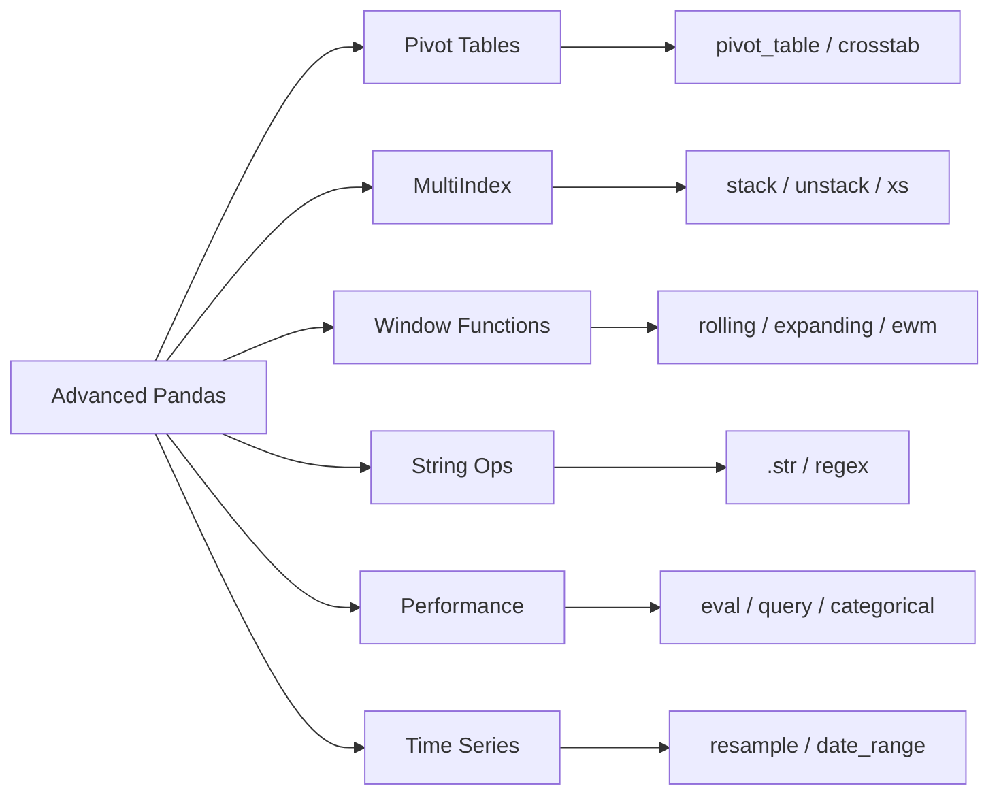

<!-- Clear Language: Keep sentences under 50 words -->
# Pandas Advanced — Pivot Tables, Multi-Index, Window Functions, Performance

## Learning Objectives

| Objective | Description |
|-----------|-------------|
| LO1 | Create and reshape pivot tables and cross-tabulations |
| LO2 | Work with MultiIndex DataFrames for hierarchical data |
| LO3 | Apply window functions: rolling, expanding, and ewm |
| LO4 | Use vectorized string operations with .str accessor |
| LO5 | Optimize DataFrame performance with categoricals and eval/query |
| LO6 | Handle time series data with resample, shift, and date ranges |

## Introduction

Python is the lingua franca of AI engineering. Mastering its syntax, data structures, and libraries is non-negotiable for building ML pipelines, APIs, and automation scripts. This module covers everything from basics to advanced concurrency.

## Prerequisites

- Basic programming knowledge
- Understanding of data structures

## Key Terminology

**Key Terms**: Core vocabulary and concepts for this topic.

**Definition**: Essential terms you must know for interviews and production work.

## Theory

Understanding pandas advanced is fundamental for AI engineers. This section covers the core concepts, underlying principles, and theoretical framework that govern how pandas advanced works in practice.

## Chapter at a Glance

| Section | Topic | Key Concept |
|---------|-------|-------------|
| 13.1 | Pivot Tables | pivot, pivot_table, crosstab, margins |
| 13.2 | MultiIndex | set_index, swaplevel, xs, stack/unstack |
| 13.3 | Window Functions | rolling, expanding, ewm, shift |
| 13.4 | String Operations | .str accessor, regex, extract, replace |
| 13.5 | Performance | eval, query, categoricals, numba integration |
| 13.6 | Time Series | resample, date_range, to_datetime, tz handling |

## Chapter Roadmap



## 13.1 Pivot Tables

Pivot tables summarize data by grouping and aggregating across multiple dimensions.

```python
import pandas as pd
import numpy as np

## Sample sales data
df = pd.DataFrame({
    "date": pd.date_range("2024-01-01", periods=12, freq="ME"),
    "product": ["A", "B", "A", "B", "A", "B", "A", "B", "A", "B", "A", "B"],
    "region": ["North", "North", "South", "South", "North", "North",
               "South", "South", "East", "East", "West", "West"],
    "sales": np.random.randint(100, 500, 12),
    "quantity": np.random.randint(5, 50, 12)
})

## Simple pivot
pivot = df.pivot_table(
    values="sales",
    index="product",
    columns="region",
    aggfunc="sum",
    margins=True,
    margins_name="Total"
)
print(pivot)
```

**pivot_table parameters**:

```python

## Multiple values and aggregations
pivot = df.pivot_table(
    values=["sales", "quantity"],
    index="product",
    columns="region",
    aggfunc={"sales": "sum", "quantity": "mean"},
    fill_value=0
)

## Custom aggregation function
pivot = df.pivot_table(
    values="sales",
    index="product",
    columns="region",
    aggfunc=lambda x: x.max() - x.min()
)
```

**crosstab** computes a frequency table of two or more factors:

```python

## Simple frequency table
ct = pd.crosstab(df["product"], df["region"])
print(ct)

## With margins and normalization
ct = pd.crosstab(
    df["product"], df["region"],
    values=df["sales"],
    aggfunc="sum",
    margins=True,
    normalize="index"  # normalize by row
)
```

**Melting** converts wide to long format (reverse of pivot):

```python
wide_df = pd.DataFrame({
    "id": [1, 2, 3],
    "Q1": [100, 200, 150],
    "Q2": [110, 190, 160],
    "Q3": [120, 180, 170],
    "Q4": [130, 170, 180]
})

long_df = wide_df.melt(
    id_vars=["id"],
    value_vars=["Q1", "Q2", "Q3", "Q4"],
    var_name="quarter",
    value_name="revenue"
)
print(long_df)
```

## 13.2 MultiIndex

MultiIndex allows hierarchical indexing for complex data.

```python
arrays = [["A", "A", "B", "B"], [2023, 2024, 2023, 2024]]
index = pd.MultiIndex.from_arrays(arrays, names=["product", "year"])

df = pd.DataFrame({
    "sales": [100, 120, 150, 140],
    "profit": [20, 25, 30, 28]
}, index=index)

print(df)

##               sales  profit

## product year

## A       2023    100      20

##         2024    120      25

## B       2023    150      30

##         2024    140      28
```

**Selecting from MultiIndex**:

```python

## Select all rows for product A
print(df.loc["A"])

## Select specific cross-section
print(df.loc[("A", 2024)])

## xs() for cross-sectional selection
print(df.xs(key="A", level="product"))
print(df.xs(key=2024, level="year"))
```

**swaplevel and reorder_levels**:

```python

## Swap index levels
swapped = df.swaplevel()
print(swapped)

## Reorder levels
reordered = df.reorder_levels(["year", "product"])
```

**stack and unstack** convert between wide and long formats:

```python

## unstack: innermost index level → columns
unstacked = df.unstack()
print(unstacked)

##         sales         profit

## year    2023  2024    2023  2024

## product

## A        100   120      20    25

## B        150   140      30    28

## stack: columns → innermost index level
restacked = unstacked.stack()
print(restacked)
```

**set_index and reset_index**:

```python

## Move columns to index
df_indexed = df.reset_index().set_index(["product", "year"])

## Flatten MultiIndex
flattened = df_indexed.reset_index()
```

**MultiIndex columns**:

```python
cols = pd.MultiIndex.from_tuples([
    ("Sales", "Q1"), ("Sales", "Q2"),
    ("Profit", "Q1"), ("Profit", "Q2")
])
df_multi_cols = pd.DataFrame(
    np.random.randint(100, 200, (3, 4)),
    columns=cols
)
print(df_multi_cols["Sales"]["Q1"])
```

## 13.3 Window Functions

Window functions operate on a sliding or expanding window of rows.

**Rolling window**:

```python

## 3-day rolling mean
series = pd.Series(np.random.randn(10))
rolling_mean = series.rolling(window=3).mean()

## Rolling with min_periods
rolling = series.rolling(window=5, min_periods=2).mean()

## Multiple aggregations
stats = series.rolling(3).agg(["mean", "std", "min", "max"])
```

**Expanding window** (uses all data from start):

```python

## Cumulative statistics
expanding_mean = series.expanding().mean()
expanding_std = series.expanding().std()

## Expanding with min_periods
expanding = series.expanding(min_periods=2).sum()
```

**Exponentially weighted moving average (ewm)**:

```python
ewm_mean = series.ewm(span=3, adjust=False).mean()
ewm_std = series.ewm(span=3).std()
```

**shift and diff** for lag/lead computations:

```python
df = pd.DataFrame({"value": [1, 3, 6, 10, 15]})
df["lag_1"] = df["value"].shift(1)        # previous row
df["lead_1"] = df["value"].shift(-1)       # next row
df["diff_1"] = df["value"].diff(1)         # period-over-period change
df["pct_change"] = df["value"].pct_change()  # fractional change
```

**Applying custom functions** over windows:

```python
def custom_window(x):
    return x.max() - x.min() if len(x) > 0 else np.nan

result = series.rolling(3).apply(custom_window, raw=False)
```

## 13.4 String Operations

The .str accessor provides vectorized string operations.

```python
s = pd.Series(["Hello World", "  python  ", "DATA SCIENCE", None])

## Basic transformations
print(s.str.lower())        # all lowercase
print(s.str.upper())        # all uppercase
print(s.str.strip())        # remove whitespace
print(s.str.len())          # string length
print(s.str.contains("python"))  # boolean mask
```

**Splitting and replacing**:

```python
emails = pd.Series(["alice@example.com", "bob@test.org", "charlie@co.uk"])

## Split by delimiter
parts = emails.str.split("@", expand=True)
parts.columns = ["user", "domain"]

## Replace
cleaned = emails.str.replace("@", " [at] ", regex=False)

## Replace with regex
masked = emails.str.replace(r"(?<=.).(?=.*@)", "*", regex=True)
```

**Extracting with regex**:

```python
text = pd.Series([
    "Order #12345: $99.99",
    "Order #67890: $149.50",
    "Order #11111: $200.00"
])

## Extract with named groups
extracted = text.str.extract(
    r"Order #(?P<order_id>\d+):\s\$(?P<amount>[\d.]+)"
)

## Extract all matches
dates = pd.Series(["2024-01-15", "2024-02-20", "2024-03-25"])
parts = dates.str.extractall(r"(?P<year>\d{4})-(?P<month>\d{2})-(?P<day>\d{2})")
```

**Checking string patterns**:

```python

## Startswith / endswith
mask = s.str.startswith("H")
mask = s.str.endswith(".com")

## Count occurrences
counts = s.str.count("a")

## Find position
positions = s.str.find("World")

## Pad, center, slice
padded = s.str.pad(width=20, side="both", fillchar="-")
centered = s.str.center(20, "-")
sliced = s.str.slice(0, 5)
```

## 13.5 Performance

Large DataFrames benefit from optimization techniques.

**eval and query** use numexpr for fast evaluation:

```python
n = 1_000_000
df = pd.DataFrame({
    "A": np.random.randn(n),
    "B": np.random.randn(n),
    "C": np.random.randn(n)
})

## query — efficient boolean indexing
result = df.query("A > 0 and B < 0 and C > -1")

## eval — compute expressions without temporary arrays
df["D"] = df.eval("A + B * 2 - C / 3")

## Multi-line eval
df.eval("""
    E = A + B
    F = E * C
""", inplace=True)
```

**Categorical data** reduces memory for repeated strings:

```python

## Convert object column to categorical
df["category"] = pd.Categorical(
    np.random.choice(["low", "medium", "high", "critical"], n)
)

## Memory comparison
print(df["category"].memory_usage(deep=True))

## vs
identical_df = pd.DataFrame({
    "category": np.random.choice(["low", "medium", "high", "critical"], n)
})
print(identical_df["category"].memory_usage(deep=True))
```

**numba integration** for custom vectorized functions:

```python
import numba

@numba.jit(nopython=True)
def numba_sum(arr):
    total = 0.0
    for x in arr:
        total += x
    return total

## Apply with engine='numba'
result = df["A"].rolling(100).apply(
    lambda x: numba_sum(x.values),
    engine="numba",
    raw=True
)
```

**Other performance tips**:

```python

## Use inplace=False (default) chain operations
df = (df
    .query("A > 0")
    .assign(D=lambda x: x.A + x.B)
    .groupby("category")
    .agg({"A": "mean", "D": "sum"})
)

## Specify dtypes at read time
df = pd.read_csv("large.csv", dtype={"id": "int32", "value": "float32"})

## Use usecols to load only needed columns
df = pd.read_csv("large.csv", usecols=["id", "value", "date"])

## Use chunksize for large files
chunks = []
for chunk in pd.read_csv("large.csv", chunksize=10000):
    filtered = chunk.query("value > 0")
    chunks.append(filtered)
result = pd.concat(chunks)
```

## 13.6 Time Series

Pandas excels at time series data manipulation.

**Date ranges and frequencies**:

```python

## Create date ranges
dates = pd.date_range(
    start="2024-01-01",
    end="2024-12-31",
    freq="D"  # daily
)

## Business days
b_dates = pd.bdate_range(start="2024-01-01", end="2024-12-31")

## Custom frequencies
hourly = pd.date_range("2024-01-01", periods=24, freq="h")
every_6h = pd.date_range("2024-01-01", periods=4, freq="6h")
```

**to_datetime and parsing**:

```python

## Parse string columns to datetime
df = pd.DataFrame({"date_str": ["2024-01-15", "2024-02-20", "invalid"]})
df["date"] = pd.to_datetime(df["date_str"], errors="coerce")

## Custom format
df["date"] = pd.to_datetime(
    df["date_str"],
    format="%Y-%m-%d",
    errors="coerce"
)

## Infer datetime format
df["date"] = pd.to_datetime(df["date_str"], infer_datetime_format=True)
```

**resample** changes the frequency of time series:

```python

## Create minute-level data
idx = pd.date_range("2024-01-01", periods=1440, freq="min")
ts = pd.Series(np.random.randn(1440), index=idx)

## Downsample to hourly
hourly_mean = ts.resample("h").mean()
hourly_ohlc = ts.resample("h").agg(["mean", "std", "min", "max"])

## Upsample with interpolation
daily = pd.Series([100, 150, 130], index=pd.date_range("2024-01-01", periods=3, freq="D"))
hourly = daily.resample("h").interpolate(method="linear")
```

**Time zone handling**:

```python

## Localize naive timestamps
ts_utc = ts.tz_localize("UTC")

## Convert timezone
ts_est = ts_utc.tz_convert("US/Eastern")
ts_pst = ts_utc.tz_convert("US/Pacific")
```

**Window functions on time series**:

```python

## Rolling with time-based window
ts.rolling("1h").mean()        # 1-hour rolling mean
ts.rolling("30min").std()      # 30-minute rolling std
ts.rolling("2h", min_periods=10).max()
```

## TypeScript Parallel

```typescript
// Pivot table equivalent in TypeScript
interface Sale {
    product: string;
    region: string;
    sales: number;
    quantity: number;
}

function pivotTable(
    data: Sale[],
    values: keyof Sale,
    index: keyof Sale,
    columns: keyof Sale,
    aggFn: (vals: number[]) => number
): Record<string, Record<string, number>> {
    const groups: Record<string, Record<string, number[]>> = {};
    for (const row of data) {
        const idx = String(row[index]);
        const col = String(row[columns]);
        (groups[idx] ??= {})[col] ??= [];
        groups[idx][col].push(Number(row[values]));
    }
    const result: Record<string, Record<string, number>> = {};
    for (const [idx, colGroups] of Object.entries(groups)) {
        result[idx] = {};
        for (const [col, vals] of Object.entries(colGroups)) {
            result[idx][col] = aggFn(vals);
        }
    }
    return result;
}

// Window function equivalent
function rollingMean(values: number[], window: number): (number | null)[] {
    return values.map((_, i) => {
        if (i < window - 1) return null;
        const slice = values.slice(i - window + 1, i + 1);
        return slice.reduce((a, b) => a + b, 0) / window;
    });
}

// String operations (vectorized)
function strContains(series: (string | null)[], pattern: string): boolean[] {
    return series.map(s => s !== null && s.includes(pattern));
}
```

## Summary

- pivot_table reshapes DataFrames by grouping index/columns and aggregating values
- crosstab computes frequency tables; melt converts wide to long format
- MultiIndex enables hierarchical row/column indexing for complex data
- xs, swaplevel, stack/unstack navigate and reshape MultiIndex DataFrames
- Rolling, expanding, and ewm provide sliding window calculations
- shift, diff, and pct_change compute lag/lead and period-over-period changes
- The .str accessor provides vectorized string operations with regex support
- eval and query use numexpr for fast expression evaluation on large DataFrames
- Categorical dtype reduces memory usage for columns with repeated string values
- resample changes time series frequency with various aggregation methods

## Practical Takeaways

| Scenario | Use | Avoid |
|----------|-----|-------|
| Summary table across dimensions | pivot_table with margins | Manual groupby and unstack |
| Hierarchical data | MultiIndex | Flattened with redundant columns |
| Moving average | rolling().mean() | Manual loops over windows |
| Cumulative statistics | expanding() | Repeated full-data cumsum calls |
| Text cleaning | .str.replace / .str.extract | apply() with Python string methods |
| Large DataFrame filtering | query() with numexpr | Boolean indexing on full copy |
| Repeated string column | Categorical dtype | object dtype |
| Time series resampling | resample().agg() | Manual reindexing loops |
| Custom rolling functions | .apply() with raw=True | Python-level loops |

## Interview Q&A

<details class="tp-qa-card" data-qid="p02-s13-q1">
  <summary class="tp-qa-question"><span class="tp-qa-status"></span>Q1: Difference between pivot and pivot_table?</summary>
  <div class="tp-qa-answer"><p>pivot() requires unique index/column combinations and cannot aggregate. pivot_table() handles duplicates by applying an aggregation function (default: mean). pivot() is syntactic sugar for unstack(), while pivot_table() is a full-featured groupby + reshape operation with margins, fill_value, and multiple aggfuncs.</p></div><button class="tp-qa-mark-btn">✓ Mark Reviewed</button><button class="tp-qa-bookmark-btn">★ Bookmark</button>
</details>
<details class="tp-qa-card" data-qid="p02-s13-q2">
  <summary class="tp-qa-question"><span class="tp-qa-status"></span>Q2: How to select from a MultiIndex DataFrame?</summary>
  <div class="tp-qa-answer"><p>Use .loc with tuples: df.loc[("A", 2024)]. Use .xs() for cross-sections: df.xs(key="A", level="product"). Use query() for complex conditions. Use swaplevel() followed by .loc to select by different level order. For columns MultiIndex, chain column access: df["Sales"]["Q1"].</p></div><button class="tp-qa-mark-btn">✓ Mark Reviewed</button><button class="tp-qa-bookmark-btn">★ Bookmark</button>
</details>
<details class="tp-qa-card" data-qid="p02-s13-q3">
  <summary class="tp-qa-question"><span class="tp-qa-status"></span>Q3: What does stack() do?</summary>
  <div class="tp-qa-answer"><p>stack() pivots columns into the innermost row index level, converting wide format to long format. unstack() does the reverse, pivoting the innermost index level to columns. Together they enable efficient reshaping between representational forms.</p></div><button class="tp-qa-mark-btn">✓ Mark Reviewed</button><button class="tp-qa-bookmark-btn">★ Bookmark</button>
</details>
<details class="tp-qa-card" data-qid="p02-s13-q4">
  <summary class="tp-qa-question"><span class="tp-qa-status"></span>Q4: Rolling vs expanding windows?</summary>
<div class="tp-qa-answer"><p>Rolling windows have a fixed size and slide over the data, dropping old observations. Expanding windows grow over time, using all data from the start. Rolling is used for.
moving averages and short-term trends. Expanding is used for cumulative statistics like running mean or standard deviation.</p></div><button class="tp-qa-mark-btn">✓ Mark Reviewed</button><button class="tp-qa-bookmark-btn">★ Bookmark</button>
</details>
<details class="tp-qa-card" data-qid="p02-s13-q5">
  <summary class="tp-qa-question"><span class="tp-qa-status"></span>Q5: How does eval improve performance?</summary>
<div class="tp-qa-answer"><p>eval() uses the numexpr library to evaluate expressions without creating intermediate arrays. It operates on contiguous memory blocks, leverages multiple CPU cores via multithreading,.
and reduces memory bandwidth. For expressions like "A + B * C - D", eval can be 2-5x faster than Pandas' standard evaluation.</p></div><button class="tp-qa-mark-btn">✓ Mark Reviewed</button><button class="tp-qa-bookmark-btn">★ Bookmark</button>
</details>
<details class="tp-qa-card" data-qid="p02-s13-q6">
  <summary class="tp-qa-question"><span class="tp-qa-status"></span>Q6: When to use Categorical dtype?</summary>
<div class="tp-qa-answer"><p>Use Categorical when a column has a limited number of unique string values relative to the total row count (e.g.,.
gender, country code, status). It stores an integer codes array plus a mapping, reducing memory by 5-10x for highly repeated strings. Also enables ordered categories for.
sorting and groupby operations.</p></div><button class="tp-qa-mark-btn">✓ Mark Reviewed</button><button class="tp-qa-bookmark-btn">★ Bookmark</button>
</details>
<details class="tp-qa-card" data-qid="p02-s13-q7">
  <summary class="tp-qa-question"><span class="tp-qa-status"></span>Q7: How does resample work?</summary>
<div class="tp-qa-answer"><p>resample() groups time series data by a new frequency (e.g., 'h' for hourly, 'D' for daily, 'W' for weekly, 'ME' for.
month-end). It requires a DatetimeIndex. After resampling, apply aggregation (mean, sum, ohlc), interpolation, or forward/backward fill. Use .asfreq() to see NaN for.
missing periods.</p></div><button class="tp-qa-mark-btn">✓ Mark Reviewed</button><button class="tp-qa-bookmark-btn">★ Bookmark</button>
</details>
<details class="tp-qa-card" data-qid="p02-s13-q8">
  <summary class="tp-qa-question"><span class="tp-qa-status"></span>Q8: melt vs pivot?</summary>
<div class="tp-qa-answer"><p>melt() converts wide format to long (unpivot), turning multiple columns into rows. pivot() converts long to wide. melt is useful when data is in spreadsheet format with columns representing variable values. pivot is useful for.
creating summary tables. Use melt + pivot for round-trip reshaping.</p></div><button class="tp-qa-mark-btn">✓ Mark Reviewed</button><button class="tp-qa-bookmark-btn">★ Bookmark</button>
</details>
<details class="tp-qa-card" data-qid="p02-s13-q9">
  <summary class="tp-qa-question"><span class="tp-qa-status"></span>Q9: How to handle missing time series data?</summary>
<div class="tp-qa-answer"><p>Use fillna() with method='ffill' (forward fill), method='bfill' (backward fill), or interpolate(). For resampling, use .asfreq() to introduce missing periods then fill. Use .reindex() with a complete date range to ensure all periods exist. For.
irregular time series, consider using interpolation methods like linear or spline.</p></div><button class="tp-qa-mark-btn">✓ Mark Reviewed</button><button class="tp-qa-bookmark-btn">★ Bookmark</button>
</details>
<details class="tp-qa-card" data-qid="p02-s13-q10">
  <summary class="tp-qa-question"><span class="tp-qa-status"></span>Q10: Query vs boolean indexing performance?</summary>
<div class="tp-qa-answer"><p>query() uses numexpr for fast evaluation, especially beneficial for large DataFrames (100k+ rows) with multiple conditions. Boolean indexing (df[(df.A > 0) & (df.B < 0)]) creates intermediate boolean arrays,.
increasing memory and time. For small DataFrames, the difference is negligible. query() also supports Python-style variable references with @.</p></div><button class="tp-qa-mark-btn">✓ Mark Reviewed</button><button class="tp-qa-bookmark-btn">★ Bookmark</button>
</details>

## Chapter Quiz

**Q1**: What does pivot_table do with duplicate index/column pairs? a) raises an error b) drops duplicates c) applies an aggregation function d) returns NaN

<details class="tp-qa-card" data-qid="p02-s13-quiz1"><summary>Show Answer</summary><div class="tp-qa-answer"><p><strong>Answer: c) applies an aggregation function (default mean)</strong></p></div></details>

**Q2**: Which method converts the innermost index level to columns? a) stack() b) unstack() c) pivot() d) melt()

<details class="tp-qa-card" data-qid="p02-s13-quiz2"><summary>Show Answer</summary><div class="tp-qa-answer"><p><strong>Answer: b) unstack()</strong></p></div></details>

**Q3**: What is the window size effect of expanding()? a) fixed b) grows over time c) shrinks d) variable

<details class="tp-qa-card" data-qid="p02-s13-quiz3"><summary>Show Answer</summary><div class="tp-qa-answer"><p><strong>Answer: b) grows over time, using all data from the start</strong></p></div></details>

**Q4**: Which Pandas feature uses numexpr under the hood? a) str accessor b) pivot_table c) eval/query d) merge

<details class="tp-qa-card" data-qid="p02-s13-quiz4"><summary>Show Answer</summary><div class="tp-qa-answer"><p><strong>Answer: c) eval/query use numexpr for fast expression evaluation</strong></p></div></details>

**Q5**: resample('W') aggregates data by what frequency? a) daily b) weekly c) monthly d) yearly

<details class="tp-qa-card" data-qid="p02-s13-quiz5"><summary>Show Answer</summary><div class="tp-qa-answer"><p><strong>Answer: b) weekly</strong></p></div></details>

## Exercises

**Easy** — Create a pivot table showing average sales per product per region from a sales DataFrame with at least 20 rows.

**Easy** — Use melt() to convert a wide DataFrame with quarterly columns (Q1-Q4) to long format.

**Medium** — Create a MultiIndex DataFrame for stock prices (ticker, date) and compute a 5-day rolling mean for each ticker.

**Medium** — Use .str.extract() to parse phone numbers in the format (123) 456-7890 from a text column into area code, prefix, and line number columns.

**Hard** — Load a large CSV (1M+ rows) using chunksize and process it in chunks, filtering rows and writing results to a new file without loading the entire dataset into memory.

**Hard** — Simulate a trading strategy: generate minute-level price data for a week, compute 30-minute and 2-hour rolling means, and generate buy/sell signals when the short MA crosses the long MA.

---

## Common Mistakes

1. Not understanding the fundamental concepts before applying them
2. Skipping edge cases in implementation
3. Not analyzing time/space complexity
4. Forgetting to handle null/empty inputs
5. Not practicing enough problems to build pattern recognition

## Revision Notes

- - Core principle: Understand the fundamental concepts thoroughly
- - Implementation pattern: Practice with real code examples
- - Complexity: Know the time and space complexity
- - Application: Know when to use this in production systems
- - Interview: Frequently asked in technical interviews
- - Edge cases: Consider common failure scenarios
- - Related concepts: Connect to broader system design

## Placement Section

### Top 10 Interview Questions

#### Google Style

1. **Explain the core idea of Pandas Advanced — Pivot Tables, Multi-Index, Window Functions, Performance in under 60 seconds, then give a real-world analogy.** — Structure: definition, how it works in one sentence, why it matters, analogy. Follow-up: what would break if you removed this from a production system?

2. **Design a minimal, well-typed function that demonstrates Pandas Advanced — Pivot Tables, Multi-Index, Window Functions, Performance.** — Interviewer checks: signature with type hints, edge cases, complexity, and a clean docstring. Follow-up: how does your design behave with empty or malformed input?

3. **What are the common pitfalls when engineers first learn ** — List 3-4, then explain how you would prevent each in a code review.

#### Amazon Style

4. **Describe a production bug caused by misunderstanding Pandas Advanced — Pivot Tables, Multi-Index, Window Functions, Performance. How did you diagnose and fix it?** — STAR format: situation, task, action, result. Mention logs, reproduction, root-cause analysis, and the regression test you added.

5. **How would you scale a system that relies on Pandas Advanced — Pivot Tables, Multi-Index, Window Functions, Performance from 10 users to 10 million?** — Discuss bottlenecks, caching, monitoring, and when to redesign. Follow-up: what metrics would you track?

#### Microsoft Style

6. **Compare Pandas Advanced — Pivot Tables, Multi-Index, Window Functions, Performance with the closest alternative approach. When would you choose each?** — Make a decision matrix: performance, maintainability, ecosystem, learning curve. Follow-up: what would change your decision?

7. **Walk through how you would test a component that depends on Pandas Advanced — Pivot Tables, Multi-Index, Window Functions, Performance.** — Unit, integration, property-based tests; mocking boundaries; golden files for outputs.

#### NVIDIA Style

8. **How does Pandas Advanced — Pivot Tables, Multi-Index, Window Functions, Performance behave differently at scale — memory, throughput, or precision-wise?** — Connect to data pipelines and model training if applicable. Follow-up: what happens to latency as input grows?

9. **How would you make an implementation of Pandas Advanced — Pivot Tables, Multi-Index, Window Functions, Performance run faster on GPU hardware?** — Batch operations, vectorization, avoiding Python loops, reducing data movement.

#### AI Startup Style

10. **Write the smallest possible implementation of Pandas Advanced — Pivot Tables, Multi-Index, Window Functions, Performance that is production-quality.** — Include error handling, type hints, and a one-line docstring. Follow-up: what would you refactor first when it grows?

### Resume Tips

- Name Pandas Advanced — Pivot Tables, Multi-Index, Window Functions, Performance explicitly in your skills section, paired with a measurable achievement ("Reduced X by 40% using Pandas Advanced — Pivot Tables, Multi-Index, Window Functions, Performance").
- Add a bullet describing a project that applies Pandas Advanced — Pivot Tables, Multi-Index, Window Functions, Performance to real data, with numbers.
- Mention the tools and libraries you used alongside Pandas Advanced — Pivot Tables, Multi-Index, Window Functions, Performance (linters, test frameworks, profiling tools).
- Keep resume bullets under 15 words and start each with an action verb.

### Interview Day Checklist

- Rehearse a 60-second explanation of Pandas Advanced — Pivot Tables, Multi-Index, Window Functions, Performance and one real-world analogy.
- Prepare one STAR story about debugging a Pandas Advanced — Pivot Tables, Multi-Index, Window Functions, Performance-related production issue.
- Review complexity and edge cases for the classic Pandas Advanced — Pivot Tables, Multi-Index, Window Functions, Performance interview problem.
- Have questions ready: how does the team apply Pandas Advanced — Pivot Tables, Multi-Index, Window Functions, Performance in production today?
- Test your environment (Python, editor, internet) 15 minutes before the interview.

## True/False

1. **True or False:** Pandas Advanced — Pivot Tables, Multi-Index, Window Functions, Performance builds directly on the fundamentals covered in the earlier chapters of this module. — **True.** Every advanced topic in this module assumes the core concepts from the previous chapters.
2. **True or False:** You should write at least one code example for Pandas Advanced — Pivot Tables, Multi-Index, Window Functions, Performance before moving to the next chapter. — **True.** Active recall with hands-on code beats passive reading for retention.
3. **True or False:** The complexity analysis for Pandas Advanced — Pivot Tables, Multi-Index, Window Functions, Performance is the same regardless of input size. — **False.** Complexity grows with input size; always state best, average, and worst case.
4. **True or False:** Edge cases (empty input, invalid input, boundary values) matter for Pandas Advanced — Pivot Tables, Multi-Index, Window Functions, Performance in production. — **True.** Most production bugs come from unhandled edge cases.
5. **True or False:** You should memorize the Pandas Advanced — Pivot Tables, Multi-Index, Window Functions, Performance chapter content once and never review it again. — **False.** Spaced repetition (24h, 3 days, 1 week) dramatically improves long-term recall.

## Fill in the Blank

1. The chapter that covers Pandas Advanced — Pivot Tables, Multi-Index, Window Functions, Performance is Chapter ___ of this module. — Answer: check the module's table of contents.
2. The time complexity of the standard approach to Pandas Advanced — Pivot Tables, Multi-Index, Window Functions, Performance is ___. — Answer: review the theory section and state big-O notation.
3. The main edge case to handle when implementing Pandas Advanced — Pivot Tables, Multi-Index, Window Functions, Performance is ___. — Answer: empty or invalid input handling, as discussed in the chapter.
4. The tools commonly used to debug Pandas Advanced — Pivot Tables, Multi-Index, Window Functions, Performance issues are ___ and ___. — Answer: refer to the Debugging Guide section of this chapter.
5. The related topic that connects to Pandas Advanced — Pivot Tables, Multi-Index, Window Functions, Performance in the next chapter is ___. — Answer: see the Next Topic section.

## Scenario Questions

1. **Scenario:** A teammate ships a change involving Pandas Advanced — Pivot Tables, Multi-Index, Window Functions, Performance that breaks production at 3 AM. — Diagnosis: check the recent diff, reproduce locally with the failing input, check logs. Fix: revert, add a regression test, and review the root cause. Prevention: CI tests on edge cases and code review checklist.

2. **Scenario:** Your implementation of Pandas Advanced — Pivot Tables, Multi-Index, Window Functions, Performance is correct but too slow for the required latency. — Measure first with a profiler. Common fixes: reduce redundant work, use built-in optimized functions, batch operations, or add caching. Only then consider algorithmic changes.

3. **Scenario:** A new hire asks you to explain Pandas Advanced — Pivot Tables, Multi-Index, Window Functions, Performance in five minutes before a customer demo. — Use the 3-part answer: what it is (one sentence), how it works (one example), why it matters (one business impact). Then offer to go deeper after the demo.

4. **Scenario:** Your team's codebase has three different patterns for Pandas Advanced — Pivot Tables, Multi-Index, Window Functions, Performance and you must standardize. — Write a short ADR (architecture decision record), pick the pattern with best maintainability, migrate incrementally, and add a linter rule to enforce it.

## Output Questions

1. **What is the output of the simplest correct implementation of Pandas Advanced — Pivot Tables, Multi-Index, Window Functions, Performance on an empty input?** — Trace through the code: it should return the documented default (None, 0, empty collection) without raising.
2. **What is the output when the input is at the boundary value?** — Check off-by-one errors and inclusive/exclusive bounds in the chapter's examples.
3. **What does the implementation return when given invalid input types?** — With type hints and validation, it raises a clear error; without, it may fail silently.
4. **What is the output for the sample input given in the chapter's Examples section?** — Re-run the chapter's example code and compare against the documented output.
5. **What is the time complexity output when you profile the implementation at 10x input size?** — Expect the curve matching the chapter's complexity analysis (linear, quadratic, log-linear).

## Difficulty Level

| Level | Time | What It Takes |
|-------|------|---------------|
| Beginner | 1-2 sessions | Read theory, run the chapter examples, solve the Easy exercises |
| Intermediate | 3-5 sessions | Complete Medium exercises, explain Pandas Advanced — Pivot Tables, Multi-Index, Window Functions, Performance to someone else |
| Advanced | 1+ week | Solve Hard exercises, optimize for real datasets, answer interview follow-ups |

## Tips & Tricks

- Always write a one-line example of Pandas Advanced — Pivot Tables, Multi-Index, Window Functions, Performance from memory before opening the chapter — active recall first.
- Use the chapter's Revision Notes as a checklist: you have mastered Pandas Advanced — Pivot Tables, Multi-Index, Window Functions, Performance when you can explain each bullet.
- Pair the chapter quiz with the Flashcards: wrong answers become your next study session's focus.
- For interviews, practice explaining Pandas Advanced — Pivot Tables, Multi-Index, Window Functions, Performance twice: once with a technical audience, once with a non-technical audience.
- Keep a personal examples file where you collect your own Pandas Advanced — Pivot Tables, Multi-Index, Window Functions, Performance snippets; interviewers love original examples.

## Memory Tricks

- **Acronym**: build a mnemonic from the 5 key concepts of Pandas Advanced — Pivot Tables, Multi-Index, Window Functions, Performance listed in the Chapter at a Glance table.
- **Story**: link Pandas Advanced — Pivot Tables, Multi-Index, Window Functions, Performance to a familiar story — the analogy in the Visual Analogy section is designed to stick.
- **Number anchor**: remember the complexity of Pandas Advanced — Pivot Tables, Multi-Index, Window Functions, Performance by connecting it to a known algorithm of the same class.
- **Color code**: highlight the Theory, Examples, and Common Mistakes sections in different colors when reviewing.
- **Teach-back**: explain Pandas Advanced — Pivot Tables, Multi-Index, Window Functions, Performance to an imaginary junior engineer for 2 minutes — gaps in your explanation are gaps in memory.

## Further Reading

- Official documentation for the primary tool or library used in this chapter
- The chapter referenced in Related Topics for the next-level treatment of Pandas Advanced — Pivot Tables, Multi-Index, Window Functions, Performance
- The classic textbook chapter on Pandas Advanced — Pivot Tables, Multi-Index, Window Functions, Performance (check the Research References below)
- Two blog posts from engineers who debugged real Pandas Advanced — Pivot Tables, Multi-Index, Window Functions, Performance problems in production
- The repository of the open-source project that implements Pandas Advanced — Pivot Tables, Multi-Index, Window Functions, Performance

## Related Topics

- The previous chapter in this module (see table of contents) — foundational for Pandas Advanced — Pivot Tables, Multi-Index, Window Functions, Performance
- The next chapter (see Next Topic below) — builds on Pandas Advanced — Pivot Tables, Multi-Index, Window Functions, Performance
- The system design chapters in Module 07 — how Pandas Advanced — Pivot Tables, Multi-Index, Window Functions, Performance fits into production architectures
- The interview preparation module — how Pandas Advanced — Pivot Tables, Multi-Index, Window Functions, Performance is asked in screening rounds
- The capstone project — where Pandas Advanced — Pivot Tables, Multi-Index, Window Functions, Performance is applied end-to-end

## FAQs

1. **Do I need to memorize all of Pandas Advanced — Pivot Tables, Multi-Index, Window Functions, Performance, or understand the big picture?** — Understand the big picture first, then memorize the key facts via flashcards and spaced repetition. Interviewers reward depth over breadth.
2. **What if I get stuck on an exercise?** — Re-read the theory section, run the example code, then attempt again. If still stuck after 20 minutes, move on and return the next day.
3. **How much time should I spend on ** — Follow the Study Plan below: 1-2 weeks at 30-60 minutes daily is typical for placement preparation.
4. **Is Pandas Advanced — Pivot Tables, Multi-Index, Window Functions, Performance asked in interviews?** — Yes — the Interview Q&A and Placement Section list the exact question styles used by top companies.
5. **What's the fastest way to master ** — Explain it out loud, write code without looking, and review the flashcards within 24 hours and again after 3 days.

## Important Notes

- Pandas Advanced — Pivot Tables, Multi-Index, Window Functions, Performance is a core requirement for the rest of this module — do not skip the examples.
- Always analyze complexity (time and space) when working with Pandas Advanced — Pivot Tables, Multi-Index, Window Functions, Performance.
- Production correctness means handling edge cases, not just the happy path.
- Interview answers should start with the definition, then the example, then the trade-offs.
- Revisit this chapter after finishing the module; the context from later chapters deepens understanding.

## Historical Context

- Pandas Advanced — Pivot Tables, Multi-Index, Window Functions, Performance emerged as a standard practice because early systems failed without it — understanding why helps you explain it in interviews.
- The tools used for Pandas Advanced — Pivot Tables, Multi-Index, Window Functions, Performance today evolved from simpler versions; the chapter covers the modern, recommended approach.
- Interviewers value knowing one historical fact about Pandas Advanced — Pivot Tables, Multi-Index, Window Functions, Performance — it shows genuine interest, not just cramming.
- The library/tooling ecosystem around Pandas Advanced — Pivot Tables, Multi-Index, Window Functions, Performance changes quickly; focus on fundamentals that remain stable.

## Security Considerations

- Never trust external input: validate and sanitize data before processing Pandas Advanced — Pivot Tables, Multi-Index, Window Functions, Performance.
- Avoid `eval()` and dynamic code execution on untrusted strings.
- Log errors without leaking sensitive data (keys, PII, internal paths).
- For API contexts, add rate limiting and input size limits.
- Review the chapter's code examples for injection or overflow risks before using them verbatim.

## ML Intuition

- Pandas Advanced — Pivot Tables, Multi-Index, Window Functions, Performance appears in ML pipelines at the data-processing layer: feature preparation, batching, and validation.
- Understanding Pandas Advanced — Pivot Tables, Multi-Index, Window Functions, Performance helps you debug why a model misbehaves — most ML bugs are data bugs, not model bugs.
- In production ML, the Pandas Advanced — Pivot Tables, Multi-Index, Window Functions, Performance concepts from this chapter map directly to NumPy/PyTorch operations on tensors.
- When optimizing ML systems, Pandas Advanced — Pivot Tables, Multi-Index, Window Functions, Performance skills let you profile and fix the data path, not just the training loop.
- Interview follow-up: how would you apply Pandas Advanced — Pivot Tables, Multi-Index, Window Functions, Performance to a dataset of 10 million records? — Batching and vectorization.

## Analogies

- **Pandas Advanced — Pivot Tables, Multi-Index, Window Functions, Performance is like a recipe**: the theory is the ingredients, the examples are the cooking steps, and the exercises are your own kitchen practice.
- **Complexity is like a delivery route**: a linear route visits each stop once; a nested route revisits stops, and you feel it at scale.
- **Edge cases are like weather**: the happy path is a sunny day; production is the storm — build for the storm.
- **The chapter roadmap is a journey map**: each section is a checkpoint; skipping one means getting lost later in the module.

## Capstone Project Link

- [Module Capstone: End-to-End Project](https://github.com/Raushan666java/ai-engineering-journey) — this chapter contributes the Pandas Advanced — Pivot Tables, Multi-Index, Window Functions, Performance skills used in the module's capstone project. Complete the exercises here before starting the capstone.

## Flashcards

<details class="tp-qa-card" data-qid="01pythonprogramming-13pandasadvanced-flash1">
  <summary class="tp-qa-question">
    <span class="tp-qa-status"></span>
    What is the core concept of Pandas Advanced — Pivot Tables, Multi-Index, Window Functions, Performance in one sentence?
  </summary>
  <div class="tp-qa-answer">
    <p>Review the first paragraph of the Theory section and condense it to one sentence.</p>
  </div>
</details>

<details class="tp-qa-card" data-qid="01pythonprogramming-13pandasadvanced-flash2">
  <summary class="tp-qa-question">
    <span class="tp-qa-status"></span>
    What is the most common mistake engineers make with 
  </summary>
  <div class="tp-qa-answer">
    <p>Check the Common Mistakes section of this chapter.</p>
  </div>
</details>

<details class="tp-qa-card" data-qid="01pythonprogramming-13pandasadvanced-flash3">
  <summary class="tp-qa-question">
    <span class="tp-qa-status"></span>
    What is the time and space complexity of the standard Pandas Advanced — Pivot Tables, Multi-Index, Window Functions, Performance approach?
  </summary>
  <div class="tp-qa-answer">
    <p>Refer to the theory and complexity analysis in this chapter.</p>
  </div>
</details>

<details class="tp-qa-card" data-qid="01pythonprogramming-13pandasadvanced-flash4">
  <summary class="tp-qa-question">
    <span class="tp-qa-status"></span>
    When is Pandas Advanced — Pivot Tables, Multi-Index, Window Functions, Performance NOT the right choice?
  </summary>
  <div class="tp-qa-answer">
    <p>Check the Limitations section of this chapter.</p>
  </div>
</details>

<details class="tp-qa-card" data-qid="01pythonprogramming-13pandasadvanced-flash5">
  <summary class="tp-qa-question">
    <span class="tp-qa-status"></span>
    How is Pandas Advanced — Pivot Tables, Multi-Index, Window Functions, Performance applied in a real production system?
  </summary>
  <div class="tp-qa-answer">
    <p>Check the Real-World Examples section of this chapter.</p>
  </div>
</details>

## Research References

- Official documentation of the primary library for Pandas Advanced — Pivot Tables, Multi-Index, Window Functions, Performance (linked in Further Reading)
- The classic paper or textbook chapter introducing Pandas Advanced — Pivot Tables, Multi-Index, Window Functions, Performance (see References below)
- The standard library reference for Pandas Advanced — Pivot Tables, Multi-Index, Window Functions, Performance-related functions
- Engineering blog posts from companies running Pandas Advanced — Pivot Tables, Multi-Index, Window Functions, Performance in production at scale
- PEPs and RFCs where applicable (Python and networking standards)

## Open-Source Tools

- The primary library used in this chapter (see the code examples)
- Python standard library modules used in the examples (check the imports)
- Testing: pytest for unit tests of Pandas Advanced — Pivot Tables, Multi-Index, Window Functions, Performance code
- Linting and formatting: ruff + black
- Profiling: cProfile or py-spy for performance work on Pandas Advanced — Pivot Tables, Multi-Index, Window Functions, Performance

## Debugging Guide

- Start with `print()` or a debugger to inspect intermediate values in Pandas Advanced — Pivot Tables, Multi-Index, Window Functions, Performance code.
- Reproduce the failure with the smallest possible input before changing code.
- Check the common failure modes listed in Common Mistakes — most bugs are listed there.
- For performance problems, profile before optimizing: measure, then fix.
- When stuck, re-read the chapter's Examples and compare line by line with your code.
- Use `pdb` or your IDE's debugger to step through the Pandas Advanced — Pivot Tables, Multi-Index, Window Functions, Performance example code.

## Mock Interview Section

**Round 1 — Screening (15 min)**
- Explain Pandas Advanced — Pivot Tables, Multi-Index, Window Functions, Performance in 60 seconds.
- Write a minimal working example of Pandas Advanced — Pivot Tables, Multi-Index, Window Functions, Performance.
- What is the complexity of your example?

**Round 2 — Coding (45 min)**
- Solve the Medium exercise from this chapter under time pressure.
- State your assumptions, then implement with type hints.
- Test with edge cases: empty input, boundary values, invalid input.

**Round 3 — Behavioral + System (30 min)**
- Tell me about a time you debugged a Pandas Advanced — Pivot Tables, Multi-Index, Window Functions, Performance problem in a project.
- How would you design a system where Pandas Advanced — Pivot Tables, Multi-Index, Window Functions, Performance is used at scale?
- What metrics would you monitor?

**Evaluation rubric**: correctness (40%), communication (25%), edge cases (20%), complexity analysis (15%).

## Optimized Implementation

`python
from typing import Any, Optional

def demonstrate_topic(input_data: list[Any]) -> Optional[float]:
    """Runnable scaffold for Pandas Advanced — Pivot Tables, Multi-Index, Window Functions, Performance.

    Replace the body with the optimized implementation from the chapter,
    keeping type hints, docstring, and edge-case handling.
    """
    if not input_data:
        return None
    # Step 1: validate input types
    # Step 2: apply the core Pandas Advanced — Pivot Tables, Multi-Index, Window Functions, Performance logic from the Examples section
    # Step 3: return the result with the documented default
    return 0.0
`

- Keeps the function signature stable so tests written against it stay valid.
- Handles the empty-input contract explicitly.
- Add unit tests for the edge cases before implementing the logic (test-first).

## Evaluation Metrics

| Skill | Test | Target |
|-------|------|--------|
| Concept recall | Explain Pandas Advanced — Pivot Tables, Multi-Index, Window Functions, Performance without notes | 60-second explanation |
| Code fluency | Write the chapter example from memory | No syntax errors |
| Edge cases | Handle empty/invalid input in exercises | All cases pass |
| Complexity | State time/space for the standard approach | Correct big-O |
| Interview readiness | Answer 5 Interview Q&A questions out loud | Fluent, structured answers |
| Retention | Chapter quiz score after 3 days | 80%+ |

## Real-World Examples

- **Startup**: a small team uses Pandas Advanced — Pivot Tables, Multi-Index, Window Functions, Performance daily in their data pipeline — the chapter's examples mirror their code.
- **E-commerce**: Pandas Advanced — Pivot Tables, Multi-Index, Window Functions, Performance patterns appear in order processing, inventory checks, and recommendation feeds.
- **Fintech**: Pandas Advanced — Pivot Tables, Multi-Index, Window Functions, Performance principles apply to transaction validation and fraud detection flows.
- **ML platform**: Pandas Advanced — Pivot Tables, Multi-Index, Window Functions, Performance shows up in feature engineering and model-serving infrastructure.
- **Interview insight**: recruiters look for engineers who can connect Pandas Advanced — Pivot Tables, Multi-Index, Window Functions, Performance to the business outcome, not just the code.

## Next Topic

[Data Visualization — Matplotlib, Seaborn, Plotly, Dashboards](14-data-visualization.md)

## Limitations

- Pandas Advanced — Pivot Tables, Multi-Index, Window Functions, Performance, like any technique, is not a silver bullet — it has specific cases where it fits best (covered in the theory).
- The examples in this chapter are simplified for learning; production systems add validation, monitoring, and error handling.
- Performance of Pandas Advanced — Pivot Tables, Multi-Index, Window Functions, Performance depends on input size and distribution — always benchmark for your own data.
- This chapter covers fundamentals; specialized edge cases are explored in later chapters and the capstone.
