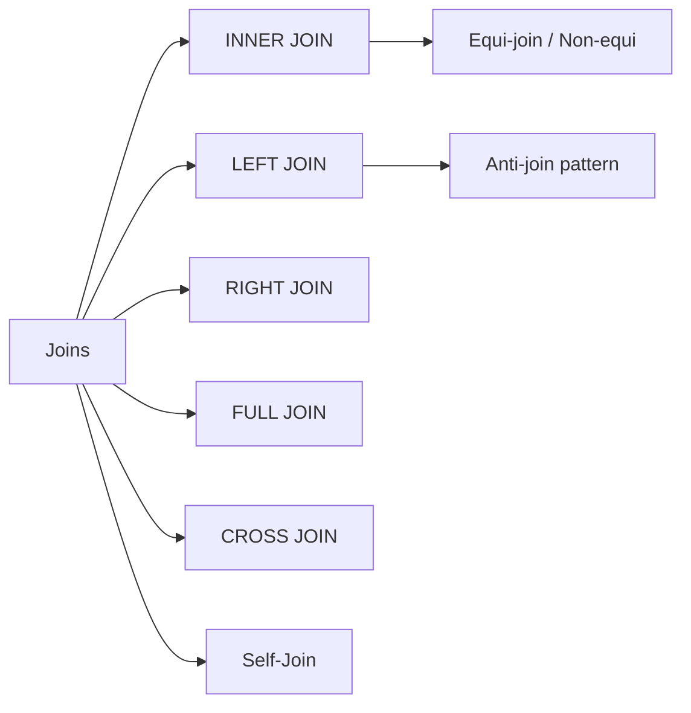

<!-- Clear Language: Keep sentences under 50 words -->
# Joins — INNER, LEFT, RIGHT, FULL, CROSS, Self-Joins

## Learning Objectives

| Objective | Description |
|-----------|-------------|
| LO1 | Combine tables with INNER JOIN to match related rows |
| LO2 | Use LEFT JOIN to preserve all rows from the left table |
| LO3 | Understand RIGHT JOIN, FULL OUTER JOIN, and CROSS JOIN |
| LO4 | Write self-joins for hierarchical data (employees/managers) |
| LO5 | Join multiple tables with proper join conditions |
| LO6 | Distinguish between equi-joins, non-equi joins, and anti-joins |

## Introduction

Data is the fuel of AI. SQL and database design skills let you query, transform, and store the data that powers machine learning models. This module covers everything from basic queries to advanced indexing and optimization.

## Prerequisites

- Basic programming knowledge
- Understanding of data structures

## Key Terminology

**Key Terms**: Core vocabulary and concepts for this topic.

**Definition**: Essential terms you must know for interviews and production work.

## Theory

Understanding joins is fundamental for AI engineers. This section covers the core concepts, underlying principles, and theoretical framework that govern how joins works in practice.

## Chapter at a Glance

| Section | Topic | Key Concept |
|---------|-------|-------------|
| 3.1 | INNER JOIN | Matching rows from both tables |
| 3.2 | LEFT / RIGHT JOIN | Preserving rows from one side |
| 3.3 | FULL / CROSS JOIN | All rows / Cartesian product |
| 3.4 | Self-Join | Table joined to itself |
| 3.5 | Multi-Table Joins | Joining 3+ tables |
| 3.6 | Advanced Joins | Equi, natural, anti-join patterns |

## Chapter Roadmap



## 3.1 INNER JOIN

Returns only rows where the join condition matches in both tables.

```sql
SELECT e.name, d.department_name
FROM employees e
INNER JOIN departments d ON e.department_id = d.department_id;

-- With aliases
SELECT o.order_id, c.name AS customer, o.amount
FROM orders o
JOIN customers c ON o.customer_id = c.customer_id;

-- INNER is optional (just JOIN)
SELECT p.name, c.name AS category
FROM products p
JOIN categories c ON p.category_id = c.category_id;

-- Multiple conditions
SELECT *
FROM orders o
JOIN shipments s ON o.order_id = s.order_id
    AND o.status = 'Shipped';
```

**Python simulation**:

```python
import sqlite3
conn = sqlite3.connect(":memory:")
cur = conn.cursor()
cur.execute("CREATE TABLE emp(id, name, dept_id)")
cur.execute("CREATE TABLE dept(id, name)")
cur.executemany("INSERT INTO emp VALUES (?,?,?)", [(1,"Alice",1),(2,"Bob",1),(3,"Charlie",2)])
cur.executemany("INSERT INTO dept VALUES (?,?)", [(1,"Engineering"),(2,"Sales")])

cur.execute("""
    SELECT e.name, d.name
    FROM emp e
    JOIN dept d ON e.dept_id = d.id
""")
for row in cur.fetchall():
    print(f"{row[0]}: {row[1]}")
```

## 3.2 LEFT / RIGHT JOIN

```sql
-- LEFT JOIN: all rows from left table, NULLs where no match
SELECT c.name, o.order_id, o.amount
FROM customers c
LEFT JOIN orders o ON c.customer_id = o.customer_id;

-- Customers with no orders
SELECT c.name
FROM customers c
LEFT JOIN orders o ON c.customer_id = o.customer_id
WHERE o.order_id IS NULL;

-- RIGHT JOIN: all rows from right table (less common; use LEFT JOIN)
SELECT e.name, d.department_name
FROM employees e
RIGHT JOIN departments d ON e.department_id = d.department_id;
-- Same as: SELECT ... FROM departments d LEFT JOIN employees e ...
```

## 3.3 FULL / CROSS JOIN

```sql
-- FULL OUTER JOIN: all rows from both tables, NULLs where no match
SELECT e.name, d.department_name
FROM employees e
FULL OUTER JOIN departments d ON e.department_id = d.department_id;

-- Full join pattern in SQLite (no FULL OUTER JOIN)
SELECT e.name, d.name FROM emp e LEFT JOIN dept d ON e.dept_id = d.id
UNION
SELECT e.name, d.name FROM emp e RIGHT JOIN dept d ON e.dept_id = d.id;

-- CROSS JOIN: Cartesian product (every row of A paired with every row of B)
SELECT c.name, p.name
FROM customers c
CROSS JOIN products p;

-- Useful for generating combinations
SELECT sizes.size, colors.color
FROM (VALUES('S'),('M'),('L')) AS sizes(size)
CROSS JOIN (VALUES('Red'),('Blue'),('Green')) AS colors(color);
```

## 3.4 Self-Join

A table joined to itself (requires table aliases).

```sql
-- Employees and their managers
SELECT e.name AS employee, m.name AS manager
FROM employees e
LEFT JOIN employees m ON e.manager_id = m.employee_id;

-- Find employees who earn more than their manager
SELECT e.name AS employee, e.salary AS emp_salary,
       m.name AS manager, m.salary AS mgr_salary
FROM employees e
JOIN employees m ON e.manager_id = m.employee_id
WHERE e.salary > m.salary;

-- Find duplicate emails
SELECT a.email, a.name, b.name AS duplicate_user
FROM users a
JOIN users b ON a.email = b.email AND a.id < b.id;
```

## 3.5 Multi-Table Joins

```sql
SELECT
    o.order_id,
    c.name AS customer,
    e.name AS employee,
    p.name AS product,
    oi.quantity,
    oi.unit_price
FROM orders o
JOIN customers c ON o.customer_id = c.customer_id
JOIN employees e ON o.sales_emp_id = e.employee_id
JOIN order_items oi ON o.order_id = oi.order_id
JOIN products p ON oi.product_id = p.product_id
WHERE o.order_date >= '2024-01-01'
ORDER BY o.order_date;

-- Implicit join (old syntax, avoid)
SELECT e.name, d.name
FROM employees e, departments d
WHERE e.department_id = d.department_id;
```

## 3.6 Advanced Join Patterns

```python
conn = sqlite3.connect(":memory:")
cur = conn.cursor()
cur.execute("CREATE TABLE orders(id, customer_id, amount)")
cur.execute("CREATE TABLE customers(id, name)")
cur.executemany("INSERT INTO customers VALUES (?,?)", [(1,"Alice"),(2,"Bob"),(3,"Charlie")])
cur.executemany("INSERT INTO orders VALUES (?,?,?)", [(1,1,100),(2,1,200),(3,2,150)])

## Anti-join: customers with no orders
cur.execute("""
    SELECT c.name FROM customers c
    LEFT JOIN orders o ON c.id = o.customer_id
    WHERE o.id IS NULL
""")
print("No orders:", [r[0] for r in cur.fetchall()])  # ['Charlie']

## Semi-join: customers who have placed orders
cur.execute("""
    SELECT DISTINCT c.name
    FROM customers c
    WHERE EXISTS (SELECT 1 FROM orders o WHERE o.customer_id = c.id)
""")
print("Have orders:", [r[0] for r in cur.fetchall()])  # ['Alice', 'Bob']

## Non-equi join (condition is not equality)
SELECT a.name, a.salary, b.name AS higher_earner
FROM employees a
JOIN employees b ON a.salary < b.salary;
```

## TypeScript Parallel

```typescript
type Employee = { id: number; name: string; deptId: number };
type Department = { id: number; name: string };

const employees: Employee[] = [{ id: 1, name: "Alice", deptId: 1 }];
const departments: Department[] = [{ id: 1, name: "Engineering" }];

// INNER JOIN
const joined = employees.flatMap(e =>
    departments.filter(d => d.id === e.deptId).map(d => ({
        name: e.name, dept: d.name
    }))
);
```

## Summary

- INNER JOIN returns only matching rows from both tables
- LEFT JOIN returns all left table rows, NULL for non-matching right
- RIGHT JOIN is the reverse (use LEFT JOIN for consistency)
- FULL OUTER JOIN returns all rows from both sides
- CROSS JOIN produces Cartesian product of all row combinations
- Self-join joins a table to itself using aliases
- Anti-join finds rows without matches using LEFT JOIN + IS NULL
- Semi-join finds rows with matches using EXISTS or DISTINCT
- Multi-table joins connect 3+ tables with multiple JOIN clauses
- Always specify join conditions with ON (not WHERE for older syntax)

## Practical Takeaways

| Scenario | Do This | Avoid |
|----------|---------|-------|
| Match rows | INNER JOIN | Filtering in WHERE |
| All left + matching right | LEFT JOIN | RIGHT JOIN (less intuitive) |
| All rows from both | FULL OUTER JOIN | UNION of two LEFT JOINs |
| All combinations | CROSS JOIN | Implicit CROSS JOIN in FROM |
| Hierarchical data | Self-join with aliases | Multiple queries |
| Find missing rows | LEFT JOIN + NULL check | NOT IN (with possible NULLs) |
| Check existence | EXISTS (semi-join) | DISTINCT on join result |

## Interview Q&A

<details class="tp-qa-card" data-qid="sql-s03-q1">
  <summary class="tp-qa-question"><span class="tp-qa-status"></span>Q1: INNER JOIN vs LEFT JOIN?</summary>
  <div class="tp-qa-answer"><p>INNER JOIN returns only rows with matches in both tables. LEFT JOIN returns all rows from left table regardless of match, with NULLs on right side for non-matches.</p></div><button class="tp-qa-mark-btn">? Mark Reviewed</button><button class="tp-qa-bookmark-btn">?? Bookmark</button>
</details>
<details class="tp-qa-card" data-qid="sql-s03-q2">
  <summary class="tp-qa-question"><span class="tp-qa-status"></span>Q2: What is a self-join?</summary>
  <div class="tp-qa-answer"><p>Joining a table to itself using different aliases. Used for hierarchical data (employees/managers), finding duplicates, or comparing rows within the same table.</p></div><button class="tp-qa-mark-btn">? Mark Reviewed</button><button class="tp-qa-bookmark-btn">?? Bookmark</button>
</details>
<details class="tp-qa-card" data-qid="sql-s03-q3">
  <summary class="tp-qa-question"><span class="tp-qa-status"></span>Q3: What is a Cartesian product?</summary>
  <div class="tp-qa-answer"><p>Every row from table A paired with every row from table B. Produced by CROSS JOIN or implicit joins without WHERE. Results in M * N rows. Useful for generating combinations but dangerous if accidental.</p></div><button class="tp-qa-mark-btn">? Mark Reviewed</button><button class="tp-qa-bookmark-btn">?? Bookmark</button>
</details>
<details class="tp-qa-card" data-qid="sql-s03-q4">
  <summary class="tp-qa-question"><span class="tp-qa-status"></span>Q4: How do you avoid duplicate rows from joins?</summary>
  <div class="tp-qa-answer"><p>Ensure join conditions are specific enough (correct columns). Use DISTINCT if duplicates are acceptable. Use EXISTS instead of JOIN for existence checks. For one-to-many joins, aggregate after joining.</p></div><button class="tp-qa-mark-btn">? Mark Reviewed</button><button class="tp-qa-bookmark-btn">?? Bookmark</button>
</details>
<details class="tp-qa-card" data-qid="sql-s03-q5">
  <summary class="tp-qa-question"><span class="tp-qa-status"></span>Q5: What is an anti-join?</summary>
  <div class="tp-qa-answer"><p>Finds rows in one table that have no match in another. Pattern: LEFT JOIN + WHERE right_table.key IS NULL. Alternative: NOT EXISTS (subquery) or NOT IN. LEFT JOIN + NULL handles NULLs in subquery better than NOT IN.</p></div><button class="tp-qa-mark-btn">? Mark Reviewed</button><button class="tp-qa-bookmark-btn">?? Bookmark</button>
</details>
<details class="tp-qa-card" data-qid="sql-s03-q6">
  <summary class="tp-qa-question"><span class="tp-qa-status"></span>Q6: Can you join more than 2 tables?</summary>
  <div class="tp-qa-answer"><p>Yes, chain JOIN clauses: FROM a JOIN b ON a.id = b.a_id JOIN c ON b.id = c.b_id. Execution order may vary; optimizer chooses the best join order. Use parentheses for controlling join order if needed.</p></div><button class="tp-qa-mark-btn">? Mark Reviewed</button><button class="tp-qa-bookmark-btn">?? Bookmark</button>
</details>
<details class="tp-qa-card" data-qid="sql-s03-q7">
  <summary class="tp-qa-question"><span class="tp-qa-status"></span>Q7: When to use RIGHT JOIN?</summary>
  <div class="tp-qa-answer"><p>RIGHT JOIN is less common. Most developers prefer LEFT JOIN for consistency (always join from main table). RIGHT JOIN is useful when adding a new table to an existing query without rewriting the FROM clause.</p></div><button class="tp-qa-mark-btn">? Mark Reviewed</button><button class="tp-qa-bookmark-btn">?? Bookmark</button>
</details>
<details class="tp-qa-card" data-qid="sql-s03-q8">
  <summary class="tp-qa-question"><span class="tp-qa-status"></span>Q8: What is a natural join?</summary>
  <div class="tp-qa-answer"><p>NATURAL JOIN automatically joins on all columns with the same name in both tables. Avoid in production — it's implicit and breaks if column names change. Always prefer explicit USING or ON clauses.</p></div><button class="tp-qa-mark-btn">? Mark Reviewed</button><button class="tp-qa-bookmark-btn">?? Bookmark</button>
</details>
<details class="tp-qa-card" data-qid="sql-s03-q9">
  <summary class="tp-qa-question"><span class="tp-qa-status"></span>Q9: How does FULL OUTER JOIN work?</summary>
  <div class="tp-qa-answer"><p>Returns all rows from both tables. Rows with matches show combined data. Non-matching rows from left have NULL on right side, and vice versa. Not all databases support it (e.g., MySQL, SQLite lack it).</p></div><button class="tp-qa-mark-btn">? Mark Reviewed</button><button class="tp-qa-bookmark-btn">?? Bookmark</button>
</details>
<details class="tp-qa-card" data-qid="sql-s03-q10">
  <summary class="tp-qa-question"><span class="tp-qa-status"></span>Q10: What is the difference between ON and USING?</summary>
  <div class="tp-qa-answer"><p>ON specifies the join condition explicitly (table1.col = table2.col). USING(column) is shorthand when both tables have the same column name: FROM a JOIN b USING(id). USING removes the duplicate column from results.</p></div><button class="tp-qa-mark-btn">? Mark Reviewed</button><button class="tp-qa-bookmark-btn">?? Bookmark</button>
</details>

## Chapter Quiz

**Q1**: Which join returns only matching rows? a) LEFT b) INNER c) FULL d) CROSS

<details class="tp-qa-card" data-qid="sql-s03-quiz1"><summary>Show Answer</summary><div class="tp-qa-answer"><p><strong>Answer: b) INNER JOIN</strong></p></div></details>

**Q2**: How to find customers with no orders? a) LEFT + NULL b) INNER c) RIGHT + NULL d) CROSS + NULL

<details class="tp-qa-card" data-qid="sql-s03-quiz2"><summary>Show Answer</summary><div class="tp-qa-answer"><p><strong>Answer: a) LEFT JOIN + WHERE orders.id IS NULL</strong></p></div></details>

**Q3**: How many rows does CROSS JOIN 3x5 tables produce? a) 3 b) 5 c) 15 d) 8

<details class="tp-qa-card" data-qid="sql-s03-quiz3"><summary>Show Answer</summary><div class="tp-qa-answer"><p><strong>Answer: c) 15 (Cartesian product: 3 * 5)</strong></p></div></details>

**Q4**: Self-join requires? a) different tables b) table aliases c) subqueries d) indexes

<details class="tp-qa-card" data-qid="sql-s03-quiz4"><summary>Show Answer</summary><div class="tp-qa-answer"><p><strong>Answer: b) table aliases to distinguish the two roles</strong></p></div></details>

**Q5**: Which pattern is an anti-join? a) INNER JOIN b) LEFT + NULL c) CROSS d) FULL + NULL

<details class="tp-qa-card" data-qid="sql-s03-quiz5"><summary>Show Answer</summary><div class="tp-qa-answer"><p><strong>Answer: b) LEFT JOIN + IS NULL on right side</strong></p></div></details>

## Exercises

**Easy** — Write a query joining employees with their departments using INNER JOIN.
**Easy** — Find all products and their supplier names using a join.
**Medium** — Write a self-join to find employees who have the same manager.
**Medium** — Find customers who have never placed an order (anti-join).
**Hard** — Write a multi-table query joining orders, customers, products, and order_items for a sales report.
**Hard** — Implement a recursive join using a self-referencing employees table to show each employee's full reporting chain (employee -> manager -> senior manager -> ...).

## 3.7 Joins with Aggregates

Combining joins with aggregation for summary reports.

```sql
-- Department summary with employee count and salary stats
SELECT
    d.department_name,
    COUNT(e.employee_id) AS employee_count,
    ROUND(AVG(e.salary), 2) AS avg_salary,
    ROUND(SUM(e.salary), 2) AS total_payroll,
    MIN(e.salary) AS min_salary,
    MAX(e.salary) AS max_salary
FROM departments d
LEFT JOIN employees e ON d.department_id = e.department_id
GROUP BY d.department_id, d.department_name
ORDER BY avg_salary DESC;

-- Customers with their most recent order
SELECT
    c.customer_id,
    c.name,
    COUNT(o.order_id) AS total_orders,
    SUM(o.amount) AS lifetime_value,
    MAX(o.order_date) AS last_order_date,
    AVG(o.amount) AS avg_order_value
FROM customers c
LEFT JOIN orders o ON c.customer_id = o.customer_id
GROUP BY c.customer_id, c.name
HAVING COUNT(o.order_id) >= 1
ORDER BY lifetime_value DESC;

-- Top products by category with supplier info
SELECT
    cat.name AS category,
    p.name AS product,
    s.name AS supplier,
    SUM(oi.quantity) AS units_sold,
    SUM(oi.quantity * oi.unit_price) AS revenue
FROM categories cat
JOIN products p ON cat.category_id = p.category_id
JOIN suppliers s ON p.supplier_id = s.supplier_id
JOIN order_items oi ON p.product_id = oi.product_id
JOIN orders o ON oi.order_id = o.order_id
WHERE o.order_date >= DATE('now', '-6 months')
GROUP BY cat.category_id, cat.name, p.product_id, p.name, s.supplier_id, s.name
ORDER BY revenue DESC
LIMIT 20;
```

## 3.8 Join Performance Optimization

```sql
-- 1. Always join on indexed columns
CREATE INDEX idx_employees_dept ON employees(department_id);
CREATE INDEX idx_orders_customer ON orders(customer_id);
CREATE INDEX idx_order_items_order ON order_items(order_id);

-- 2. Filter before joining (reduce rows early)
-- BAD: join all rows, then filter
SELECT c.name, o.amount
FROM customers c
JOIN orders o ON c.customer_id = o.customer_id
WHERE o.order_date >= '2024-01-01' AND c.status = 'active';

-- GOOD: filter each table before join
SELECT c.name, o.amount
FROM (SELECT * FROM customers WHERE status = 'active') c
JOIN (SELECT * FROM orders WHERE order_date >= '2024-01-01') o
    ON c.customer_id = o.customer_id;

-- 3. Use EXPLAIN to check query plans
-- PostgreSQL: EXPLAIN ANALYZE SELECT ...
-- SQLite: EXPLAIN QUERY PLAN SELECT ...
-- MySQL: EXPLAIN SELECT ...

-- 4. Choose the right join type
-- INNER JOIN when you only need matches
-- LEFT JOIN when you need all left-side rows
-- Avoid RIGHT JOIN (can usually be rewritten as LEFT JOIN)

-- 5. Beware of join explosion
-- One-to-many join with another one-to-many creates Cartesian product
-- Fix: aggregate before joining or use DISTINCT

-- 6. Use EXISTS instead of LEFT JOIN for existence checks
-- BAD: LEFT JOIN + GROUP BY
SELECT c.name
FROM customers c
LEFT JOIN orders o ON c.customer_id = o.customer_id
GROUP BY c.customer_id, c.name
HAVING COUNT(o.order_id) > 0;

-- GOOD: EXISTS
SELECT c.name
FROM customers c
WHERE EXISTS (
    SELECT 1 FROM orders o WHERE o.customer_id = c.customer_id
);
```

## 3.9 Complex Join Patterns

```sql
-- Self-join: employee hierarchy with levels
SELECT
    e1.name AS employee,
    e2.name AS manager,
    e3.name AS senior_manager
FROM employees e1
LEFT JOIN employees e2 ON e1.manager_id = e2.employee_id
LEFT JOIN employees e3 ON e2.manager_id = e3.employee_id
ORDER BY e3.name, e2.name, e1.name;

-- Non-equi join: find nearby events
SELECT a.event_name, a.event_date AS date_a,
       b.event_name, b.event_date AS date_b,
       ABS(julianday(a.event_date) - julianday(b.event_date)) AS days_apart
FROM events a
JOIN events b ON a.event_id < b.event_id
    AND ABS(julianday(a.event_date) - julianday(b.event_date)) <= 7
ORDER BY days_apart;

-- Semi-join: customers who ordered expensive items
SELECT DISTINCT c.customer_id, c.name
FROM customers c
WHERE c.customer_id IN (
    SELECT o.customer_id
    FROM orders o
    JOIN order_items oi ON o.order_id = oi.order_id
    WHERE oi.unit_price > 500
);

-- Anti-join: products never ordered
SELECT p.product_id, p.name
FROM products p
LEFT JOIN order_items oi ON p.product_id = oi.product_id
WHERE oi.product_id IS NULL;

-- Cross join practical: date and time dimension
SELECT d.date, t.time_slot
FROM (
    SELECT DATE('2024-01-01', '+' || n || ' days') AS date
    FROM (SELECT 0 AS n UNION SELECT 1 UNION SELECT 2 ... UNION SELECT 364)
) d
CROSS JOIN (
    SELECT '09:00' AS time_slot
    UNION SELECT '10:00'
    UNION SELECT '11:00'
    UNION SELECT '14:00'
    UNION SELECT '15:00'
) t
ORDER BY d.date, t.time_slot;

-- Lateral join (PostgreSQL, MySQL 8+)
-- For each customer, get their 3 most recent orders
SELECT c.name, recent_orders.order_id, recent_orders.amount
FROM customers c
CROSS JOIN LATERAL (
    SELECT order_id, amount, order_date
    FROM orders
    WHERE customer_id = c.customer_id
    ORDER BY order_date DESC
    LIMIT 3
) recent_orders;
```

## 3.10 Using JOINs with UPDATE and DELETE

```sql
-- UPDATE with JOIN
-- Bonus employees based on department performance
UPDATE employees e
SET salary = salary * 1.1
FROM departments d
WHERE e.department_id = d.department_id
  AND d.performance_score > 90;

-- MySQL variant
UPDATE employees e
JOIN departments d ON e.department_id = d.department_id
SET e.salary = e.salary * 1.1
WHERE d.performance_score > 90;

-- DELETE with JOIN
-- Remove orphaned order items
DELETE FROM order_items
WHERE order_id NOT IN (
    SELECT order_id FROM orders
);

-- PostgreSQL variant with USING
DELETE FROM order_items oi
USING orders o
WHERE oi.order_id = o.order_id
  AND o.order_date < '2020-01-01';
```

## 3.11 Common Pitfalls

```sql
-- Pitfall 1: Unintentional Cartesian product
SELECT e.name, d.department_name
FROM employees e, departments d;  -- forgot WHERE/ON!
-- Every employee paired with every department!
-- Always use explicit JOIN syntax

-- Pitfall 2: Missing join condition
SELECT e.name, d.department_name
FROM employees e
JOIN departments d;  -- CROSS JOIN without ON clause

-- Pitfall 3: Duplicate rows from one-to-many joins
-- Employee has multiple projects -> duplicates
SELECT DISTINCT e.name, d.name
FROM employees e
JOIN departments d ON e.dept_id = d.id
JOIN projects p ON e.id = p.employee_id;  -- may duplicate employees

-- Pitfall 4: Wrong join type
-- Use LEFT JOIN to keep employees without departments
-- Use INNER JOIN to exclude employees without departments

-- Pitfall 5: NULL in join column
SELECT * FROM employees e
JOIN departments d ON e.department_id = d.id;
-- Employees with NULL department_id will NOT appear (NULL != anything)

-- Pitfall 6: RIGHT JOIN readability
-- Prefer LEFT JOIN; RIGHT JOIN is less intuitive
SELECT *
FROM departments d
RIGHT JOIN employees e ON d.id = e.department_id;
-- Same as: LEFT JOIN departments d ON ...

-- Pitfall 7: Performance with large joins
-- Always join on indexed columns
-- Use appropriate join types
-- Filter before joining when possible
```

## 3.12 Real-World Join Examples

```sql
-- E-commerce order fulfillment report
SELECT
    o.order_id,
    c.name AS customer_name,
    c.email,
    o.order_date,
    o.status,
    p.name AS product,
    oi.quantity,
    oi.unit_price,
    oi.quantity * oi.unit_price AS line_total,
    s.name AS shipped_by,
    tr.tracking_number,
    pay.payment_method,
    pay.status AS payment_status
FROM orders o
JOIN customers c ON o.customer_id = c.customer_id
JOIN order_items oi ON o.order_id = oi.order_id
JOIN products p ON oi.product_id = p.product_id
LEFT JOIN shipments s ON o.order_id = s.order_id
LEFT JOIN tracking tr ON s.shipment_id = tr.shipment_id
LEFT JOIN payments pay ON o.order_id = pay.order_id
WHERE o.order_date >= DATE('now', '-30 days')
ORDER BY o.order_date DESC, o.order_id;

-- HR department org chart
SELECT
    e.name AS employee_name,
    e.title,
    e.hire_date,
    m.name AS manager_name,
    m.title AS manager_title,
    d.department_name,
    l.city,
    l.state
FROM employees e
JOIN employees m ON e.manager_id = m.employee_id
JOIN departments d ON e.department_id = d.department_id
JOIN locations l ON d.location_id = l.location_id
ORDER BY d.department_name, m.name, e.name;

-- Product recommendation candidates
SELECT
    p1.product_id AS product_a,
    p1.name AS product_a_name,
    p2.product_id AS product_b,
    p2.name AS product_b_name,
    COUNT(*) AS times_bought_together
FROM order_items oi1
JOIN order_items oi2 ON oi1.order_id = oi2.order_id
    AND oi1.product_id < oi2.product_id
JOIN products p1 ON oi1.product_id = p1.product_id
JOIN products p2 ON oi2.product_id = p2.product_id
GROUP BY p1.product_id, p1.name, p2.product_id, p2.name
HAVING COUNT(*) >= 5
ORDER BY times_bought_together DESC;
```

---

## Common Mistakes

1. Not understanding the fundamental concepts before applying them
2. Skipping edge cases in implementation
3. Not analyzing time/space complexity
4. Forgetting to handle null/empty inputs
5. Not practicing enough problems to build pattern recognition

## Revision Notes

- - Core principle: Understand the fundamental concepts thoroughly
- - Implementation pattern: Practice with real code examples
- - Complexity: Know the time and space complexity
- - Application: Know when to use this in production systems
- - Interview: Frequently asked in technical interviews
- - Edge cases: Consider common failure scenarios
- - Related concepts: Connect to broader system design

## Placement Section

### Top 10 Interview Questions

#### Google Style

1. **Explain the core idea of Joins — INNER, LEFT, RIGHT, FULL, CROSS, Self-Joins in under 60 seconds, then give a real-world analogy.** — Structure: definition, how it works in one sentence, why it matters, analogy. Follow-up: what would break if you removed this from a production system?

2. **Design a minimal, well-typed function that demonstrates Joins — INNER, LEFT, RIGHT, FULL, CROSS, Self-Joins.** — Interviewer checks: signature with type hints, edge cases, complexity, and a clean docstring. Follow-up: how does your design behave with empty or malformed input?

3. **What are the common pitfalls when engineers first learn ** — List 3-4, then explain how you would prevent each in a code review.

#### Amazon Style

4. **Describe a production bug caused by misunderstanding Joins — INNER, LEFT, RIGHT, FULL, CROSS, Self-Joins. How did you diagnose and fix it?** — STAR format: situation, task, action, result. Mention logs, reproduction, root-cause analysis, and the regression test you added.

5. **How would you scale a system that relies on Joins — INNER, LEFT, RIGHT, FULL, CROSS, Self-Joins from 10 users to 10 million?** — Discuss bottlenecks, caching, monitoring, and when to redesign. Follow-up: what metrics would you track?

#### Microsoft Style

6. **Compare Joins — INNER, LEFT, RIGHT, FULL, CROSS, Self-Joins with the closest alternative approach. When would you choose each?** — Make a decision matrix: performance, maintainability, ecosystem, learning curve. Follow-up: what would change your decision?

7. **Walk through how you would test a component that depends on Joins — INNER, LEFT, RIGHT, FULL, CROSS, Self-Joins.** — Unit, integration, property-based tests; mocking boundaries; golden files for outputs.

#### NVIDIA Style

8. **How does Joins — INNER, LEFT, RIGHT, FULL, CROSS, Self-Joins behave differently at scale — memory, throughput, or precision-wise?** — Connect to data pipelines and model training if applicable. Follow-up: what happens to latency as input grows?

9. **How would you make an implementation of Joins — INNER, LEFT, RIGHT, FULL, CROSS, Self-Joins run faster on GPU hardware?** — Batch operations, vectorization, avoiding Python loops, reducing data movement.

#### AI Startup Style

10. **Write the smallest possible implementation of Joins — INNER, LEFT, RIGHT, FULL, CROSS, Self-Joins that is production-quality.** — Include error handling, type hints, and a one-line docstring. Follow-up: what would you refactor first when it grows?

### Resume Tips

- Name Joins — INNER, LEFT, RIGHT, FULL, CROSS, Self-Joins explicitly in your skills section, paired with a measurable achievement ("Reduced X by 40% using Joins — INNER, LEFT, RIGHT, FULL, CROSS, Self-Joins").
- Add a bullet describing a project that applies Joins — INNER, LEFT, RIGHT, FULL, CROSS, Self-Joins to real data, with numbers.
- Mention the tools and libraries you used alongside Joins — INNER, LEFT, RIGHT, FULL, CROSS, Self-Joins (linters, test frameworks, profiling tools).
- Keep resume bullets under 15 words and start each with an action verb.

### Interview Day Checklist

- Rehearse a 60-second explanation of Joins — INNER, LEFT, RIGHT, FULL, CROSS, Self-Joins and one real-world analogy.
- Prepare one STAR story about debugging a Joins — INNER, LEFT, RIGHT, FULL, CROSS, Self-Joins-related production issue.
- Review complexity and edge cases for the classic Joins — INNER, LEFT, RIGHT, FULL, CROSS, Self-Joins interview problem.
- Have questions ready: how does the team apply Joins — INNER, LEFT, RIGHT, FULL, CROSS, Self-Joins in production today?
- Test your environment (Python, editor, internet) 15 minutes before the interview.

## True/False

1. **True or False:** Joins — INNER, LEFT, RIGHT, FULL, CROSS, Self-Joins builds directly on the fundamentals covered in the earlier chapters of this module. — **True.** Every advanced topic in this module assumes the core concepts from the previous chapters.
2. **True or False:** You should write at least one code example for Joins — INNER, LEFT, RIGHT, FULL, CROSS, Self-Joins before moving to the next chapter. — **True.** Active recall with hands-on code beats passive reading for retention.
3. **True or False:** The complexity analysis for Joins — INNER, LEFT, RIGHT, FULL, CROSS, Self-Joins is the same regardless of input size. — **False.** Complexity grows with input size; always state best, average, and worst case.
4. **True or False:** Edge cases (empty input, invalid input, boundary values) matter for Joins — INNER, LEFT, RIGHT, FULL, CROSS, Self-Joins in production. — **True.** Most production bugs come from unhandled edge cases.
5. **True or False:** You should memorize the Joins — INNER, LEFT, RIGHT, FULL, CROSS, Self-Joins chapter content once and never review it again. — **False.** Spaced repetition (24h, 3 days, 1 week) dramatically improves long-term recall.

## Fill in the Blank

1. The chapter that covers Joins — INNER, LEFT, RIGHT, FULL, CROSS, Self-Joins is Chapter ___ of this module. — Answer: check the module's table of contents.
2. The time complexity of the standard approach to Joins — INNER, LEFT, RIGHT, FULL, CROSS, Self-Joins is ___. — Answer: review the theory section and state big-O notation.
3. The main edge case to handle when implementing Joins — INNER, LEFT, RIGHT, FULL, CROSS, Self-Joins is ___. — Answer: empty or invalid input handling, as discussed in the chapter.
4. The tools commonly used to debug Joins — INNER, LEFT, RIGHT, FULL, CROSS, Self-Joins issues are ___ and ___. — Answer: refer to the Debugging Guide section of this chapter.
5. The related topic that connects to Joins — INNER, LEFT, RIGHT, FULL, CROSS, Self-Joins in the next chapter is ___. — Answer: see the Next Topic section.

## Scenario Questions

1. **Scenario:** A teammate ships a change involving Joins — INNER, LEFT, RIGHT, FULL, CROSS, Self-Joins that breaks production at 3 AM. — Diagnosis: check the recent diff, reproduce locally with the failing input, check logs. Fix: revert, add a regression test, and review the root cause. Prevention: CI tests on edge cases and code review checklist.

2. **Scenario:** Your implementation of Joins — INNER, LEFT, RIGHT, FULL, CROSS, Self-Joins is correct but too slow for the required latency. — Measure first with a profiler. Common fixes: reduce redundant work, use built-in optimized functions, batch operations, or add caching. Only then consider algorithmic changes.

3. **Scenario:** A new hire asks you to explain Joins — INNER, LEFT, RIGHT, FULL, CROSS, Self-Joins in five minutes before a customer demo. — Use the 3-part answer: what it is (one sentence), how it works (one example), why it matters (one business impact). Then offer to go deeper after the demo.

4. **Scenario:** Your team's codebase has three different patterns for Joins — INNER, LEFT, RIGHT, FULL, CROSS, Self-Joins and you must standardize. — Write a short ADR (architecture decision record), pick the pattern with best maintainability, migrate incrementally, and add a linter rule to enforce it.

## Output Questions

1. **What is the output of the simplest correct implementation of Joins — INNER, LEFT, RIGHT, FULL, CROSS, Self-Joins on an empty input?** — Trace through the code: it should return the documented default (None, 0, empty collection) without raising.
2. **What is the output when the input is at the boundary value?** — Check off-by-one errors and inclusive/exclusive bounds in the chapter's examples.
3. **What does the implementation return when given invalid input types?** — With type hints and validation, it raises a clear error; without, it may fail silently.
4. **What is the output for the sample input given in the chapter's Examples section?** — Re-run the chapter's example code and compare against the documented output.
5. **What is the time complexity output when you profile the implementation at 10x input size?** — Expect the curve matching the chapter's complexity analysis (linear, quadratic, log-linear).

## Difficulty Level

| Level | Time | What It Takes |
|-------|------|---------------|
| Beginner | 1-2 sessions | Read theory, run the chapter examples, solve the Easy exercises |
| Intermediate | 3-5 sessions | Complete Medium exercises, explain Joins — INNER, LEFT, RIGHT, FULL, CROSS, Self-Joins to someone else |
| Advanced | 1+ week | Solve Hard exercises, optimize for real datasets, answer interview follow-ups |

## Tips & Tricks

- Always write a one-line example of Joins — INNER, LEFT, RIGHT, FULL, CROSS, Self-Joins from memory before opening the chapter — active recall first.
- Use the chapter's Revision Notes as a checklist: you have mastered Joins — INNER, LEFT, RIGHT, FULL, CROSS, Self-Joins when you can explain each bullet.
- Pair the chapter quiz with the Flashcards: wrong answers become your next study session's focus.
- For interviews, practice explaining Joins — INNER, LEFT, RIGHT, FULL, CROSS, Self-Joins twice: once with a technical audience, once with a non-technical audience.
- Keep a personal examples file where you collect your own Joins — INNER, LEFT, RIGHT, FULL, CROSS, Self-Joins snippets; interviewers love original examples.

## Memory Tricks

- **Acronym**: build a mnemonic from the 5 key concepts of Joins — INNER, LEFT, RIGHT, FULL, CROSS, Self-Joins listed in the Chapter at a Glance table.
- **Story**: link Joins — INNER, LEFT, RIGHT, FULL, CROSS, Self-Joins to a familiar story — the analogy in the Visual Analogy section is designed to stick.
- **Number anchor**: remember the complexity of Joins — INNER, LEFT, RIGHT, FULL, CROSS, Self-Joins by connecting it to a known algorithm of the same class.
- **Color code**: highlight the Theory, Examples, and Common Mistakes sections in different colors when reviewing.
- **Teach-back**: explain Joins — INNER, LEFT, RIGHT, FULL, CROSS, Self-Joins to an imaginary junior engineer for 2 minutes — gaps in your explanation are gaps in memory.

## Further Reading

- Official documentation for the primary tool or library used in this chapter
- The chapter referenced in Related Topics for the next-level treatment of Joins — INNER, LEFT, RIGHT, FULL, CROSS, Self-Joins
- The classic textbook chapter on Joins — INNER, LEFT, RIGHT, FULL, CROSS, Self-Joins (check the Research References below)
- Two blog posts from engineers who debugged real Joins — INNER, LEFT, RIGHT, FULL, CROSS, Self-Joins problems in production
- The repository of the open-source project that implements Joins — INNER, LEFT, RIGHT, FULL, CROSS, Self-Joins

## Related Topics

- The previous chapter in this module (see table of contents) — foundational for Joins — INNER, LEFT, RIGHT, FULL, CROSS, Self-Joins
- The next chapter (see Next Topic below) — builds on Joins — INNER, LEFT, RIGHT, FULL, CROSS, Self-Joins
- The system design chapters in Module 07 — how Joins — INNER, LEFT, RIGHT, FULL, CROSS, Self-Joins fits into production architectures
- The interview preparation module — how Joins — INNER, LEFT, RIGHT, FULL, CROSS, Self-Joins is asked in screening rounds
- The capstone project — where Joins — INNER, LEFT, RIGHT, FULL, CROSS, Self-Joins is applied end-to-end

## FAQs

1. **Do I need to memorize all of Joins — INNER, LEFT, RIGHT, FULL, CROSS, Self-Joins, or understand the big picture?** — Understand the big picture first, then memorize the key facts via flashcards and spaced repetition. Interviewers reward depth over breadth.
2. **What if I get stuck on an exercise?** — Re-read the theory section, run the example code, then attempt again. If still stuck after 20 minutes, move on and return the next day.
3. **How much time should I spend on ** — Follow the Study Plan below: 1-2 weeks at 30-60 minutes daily is typical for placement preparation.
4. **Is Joins — INNER, LEFT, RIGHT, FULL, CROSS, Self-Joins asked in interviews?** — Yes — the Interview Q&A and Placement Section list the exact question styles used by top companies.
5. **What's the fastest way to master ** — Explain it out loud, write code without looking, and review the flashcards within 24 hours and again after 3 days.

## Important Notes

- Joins — INNER, LEFT, RIGHT, FULL, CROSS, Self-Joins is a core requirement for the rest of this module — do not skip the examples.
- Always analyze complexity (time and space) when working with Joins — INNER, LEFT, RIGHT, FULL, CROSS, Self-Joins.
- Production correctness means handling edge cases, not just the happy path.
- Interview answers should start with the definition, then the example, then the trade-offs.
- Revisit this chapter after finishing the module; the context from later chapters deepens understanding.

## Historical Context

- Joins — INNER, LEFT, RIGHT, FULL, CROSS, Self-Joins emerged as a standard practice because early systems failed without it — understanding why helps you explain it in interviews.
- The tools used for Joins — INNER, LEFT, RIGHT, FULL, CROSS, Self-Joins today evolved from simpler versions; the chapter covers the modern, recommended approach.
- Interviewers value knowing one historical fact about Joins — INNER, LEFT, RIGHT, FULL, CROSS, Self-Joins — it shows genuine interest, not just cramming.
- The library/tooling ecosystem around Joins — INNER, LEFT, RIGHT, FULL, CROSS, Self-Joins changes quickly; focus on fundamentals that remain stable.

## Security Considerations

- Never trust external input: validate and sanitize data before processing Joins — INNER, LEFT, RIGHT, FULL, CROSS, Self-Joins.
- Avoid `eval()` and dynamic code execution on untrusted strings.
- Log errors without leaking sensitive data (keys, PII, internal paths).
- For API contexts, add rate limiting and input size limits.
- Review the chapter's code examples for injection or overflow risks before using them verbatim.

## ML Intuition

- Joins — INNER, LEFT, RIGHT, FULL, CROSS, Self-Joins appears in ML pipelines at the data-processing layer: feature preparation, batching, and validation.
- Understanding Joins — INNER, LEFT, RIGHT, FULL, CROSS, Self-Joins helps you debug why a model misbehaves — most ML bugs are data bugs, not model bugs.
- In production ML, the Joins — INNER, LEFT, RIGHT, FULL, CROSS, Self-Joins concepts from this chapter map directly to NumPy/PyTorch operations on tensors.
- When optimizing ML systems, Joins — INNER, LEFT, RIGHT, FULL, CROSS, Self-Joins skills let you profile and fix the data path, not just the training loop.
- Interview follow-up: how would you apply Joins — INNER, LEFT, RIGHT, FULL, CROSS, Self-Joins to a dataset of 10 million records? — Batching and vectorization.

## Analogies

- **Joins — INNER, LEFT, RIGHT, FULL, CROSS, Self-Joins is like a recipe**: the theory is the ingredients, the examples are the cooking steps, and the exercises are your own kitchen practice.
- **Complexity is like a delivery route**: a linear route visits each stop once; a nested route revisits stops, and you feel it at scale.
- **Edge cases are like weather**: the happy path is a sunny day; production is the storm — build for the storm.
- **The chapter roadmap is a journey map**: each section is a checkpoint; skipping one means getting lost later in the module.

## Capstone Project Link

- [Module Capstone: End-to-End Project](https://github.com/Raushan666java/ai-engineering-journey) — this chapter contributes the Joins — INNER, LEFT, RIGHT, FULL, CROSS, Self-Joins skills used in the module's capstone project. Complete the exercises here before starting the capstone.

## Flashcards

<details class="tp-qa-card" data-qid="02sqlanddatabases-03joins-flash1">
  <summary class="tp-qa-question">
    <span class="tp-qa-status"></span>
    What is the core concept of Joins — INNER, LEFT, RIGHT, FULL, CROSS, Self-Joins in one sentence?
  </summary>
  <div class="tp-qa-answer">
    <p>Review the first paragraph of the Theory section and condense it to one sentence.</p>
  </div>
</details>

<details class="tp-qa-card" data-qid="02sqlanddatabases-03joins-flash2">
  <summary class="tp-qa-question">
    <span class="tp-qa-status"></span>
    What is the most common mistake engineers make with 
  </summary>
  <div class="tp-qa-answer">
    <p>Check the Common Mistakes section of this chapter.</p>
  </div>
</details>

<details class="tp-qa-card" data-qid="02sqlanddatabases-03joins-flash3">
  <summary class="tp-qa-question">
    <span class="tp-qa-status"></span>
    What is the time and space complexity of the standard Joins — INNER, LEFT, RIGHT, FULL, CROSS, Self-Joins approach?
  </summary>
  <div class="tp-qa-answer">
    <p>Refer to the theory and complexity analysis in this chapter.</p>
  </div>
</details>

<details class="tp-qa-card" data-qid="02sqlanddatabases-03joins-flash4">
  <summary class="tp-qa-question">
    <span class="tp-qa-status"></span>
    When is Joins — INNER, LEFT, RIGHT, FULL, CROSS, Self-Joins NOT the right choice?
  </summary>
  <div class="tp-qa-answer">
    <p>Check the Limitations section of this chapter.</p>
  </div>
</details>

<details class="tp-qa-card" data-qid="02sqlanddatabases-03joins-flash5">
  <summary class="tp-qa-question">
    <span class="tp-qa-status"></span>
    How is Joins — INNER, LEFT, RIGHT, FULL, CROSS, Self-Joins applied in a real production system?
  </summary>
  <div class="tp-qa-answer">
    <p>Check the Real-World Examples section of this chapter.</p>
  </div>
</details>

## Research References

- Official documentation of the primary library for Joins — INNER, LEFT, RIGHT, FULL, CROSS, Self-Joins (linked in Further Reading)
- The classic paper or textbook chapter introducing Joins — INNER, LEFT, RIGHT, FULL, CROSS, Self-Joins (see References below)
- The standard library reference for Joins — INNER, LEFT, RIGHT, FULL, CROSS, Self-Joins-related functions
- Engineering blog posts from companies running Joins — INNER, LEFT, RIGHT, FULL, CROSS, Self-Joins in production at scale
- PEPs and RFCs where applicable (Python and networking standards)

## Open-Source Tools

- The primary library used in this chapter (see the code examples)
- Python standard library modules used in the examples (check the imports)
- Testing: pytest for unit tests of Joins — INNER, LEFT, RIGHT, FULL, CROSS, Self-Joins code
- Linting and formatting: ruff + black
- Profiling: cProfile or py-spy for performance work on Joins — INNER, LEFT, RIGHT, FULL, CROSS, Self-Joins

## Debugging Guide

- Start with `print()` or a debugger to inspect intermediate values in Joins — INNER, LEFT, RIGHT, FULL, CROSS, Self-Joins code.
- Reproduce the failure with the smallest possible input before changing code.
- Check the common failure modes listed in Common Mistakes — most bugs are listed there.
- For performance problems, profile before optimizing: measure, then fix.
- When stuck, re-read the chapter's Examples and compare line by line with your code.
- Use `pdb` or your IDE's debugger to step through the Joins — INNER, LEFT, RIGHT, FULL, CROSS, Self-Joins example code.

## Mock Interview Section

**Round 1 — Screening (15 min)**
- Explain Joins — INNER, LEFT, RIGHT, FULL, CROSS, Self-Joins in 60 seconds.
- Write a minimal working example of Joins — INNER, LEFT, RIGHT, FULL, CROSS, Self-Joins.
- What is the complexity of your example?

**Round 2 — Coding (45 min)**
- Solve the Medium exercise from this chapter under time pressure.
- State your assumptions, then implement with type hints.
- Test with edge cases: empty input, boundary values, invalid input.

**Round 3 — Behavioral + System (30 min)**
- Tell me about a time you debugged a Joins — INNER, LEFT, RIGHT, FULL, CROSS, Self-Joins problem in a project.
- How would you design a system where Joins — INNER, LEFT, RIGHT, FULL, CROSS, Self-Joins is used at scale?
- What metrics would you monitor?

**Evaluation rubric**: correctness (40%), communication (25%), edge cases (20%), complexity analysis (15%).

## Optimized Implementation

`python
from typing import Any, Optional

def demonstrate_topic(input_data: list[Any]) -> Optional[float]:
    """Runnable scaffold for Joins — INNER, LEFT, RIGHT, FULL, CROSS, Self-Joins.

    Replace the body with the optimized implementation from the chapter,
    keeping type hints, docstring, and edge-case handling.
    """
    if not input_data:
        return None
    # Step 1: validate input types
    # Step 2: apply the core Joins — INNER, LEFT, RIGHT, FULL, CROSS, Self-Joins logic from the Examples section
    # Step 3: return the result with the documented default
    return 0.0
`

- Keeps the function signature stable so tests written against it stay valid.
- Handles the empty-input contract explicitly.
- Add unit tests for the edge cases before implementing the logic (test-first).

## Evaluation Metrics

| Skill | Test | Target |
|-------|------|--------|
| Concept recall | Explain Joins — INNER, LEFT, RIGHT, FULL, CROSS, Self-Joins without notes | 60-second explanation |
| Code fluency | Write the chapter example from memory | No syntax errors |
| Edge cases | Handle empty/invalid input in exercises | All cases pass |
| Complexity | State time/space for the standard approach | Correct big-O |
| Interview readiness | Answer 5 Interview Q&A questions out loud | Fluent, structured answers |
| Retention | Chapter quiz score after 3 days | 80%+ |

## Real-World Examples

- **Startup**: a small team uses Joins — INNER, LEFT, RIGHT, FULL, CROSS, Self-Joins daily in their data pipeline — the chapter's examples mirror their code.
- **E-commerce**: Joins — INNER, LEFT, RIGHT, FULL, CROSS, Self-Joins patterns appear in order processing, inventory checks, and recommendation feeds.
- **Fintech**: Joins — INNER, LEFT, RIGHT, FULL, CROSS, Self-Joins principles apply to transaction validation and fraud detection flows.
- **ML platform**: Joins — INNER, LEFT, RIGHT, FULL, CROSS, Self-Joins shows up in feature engineering and model-serving infrastructure.
- **Interview insight**: recruiters look for engineers who can connect Joins — INNER, LEFT, RIGHT, FULL, CROSS, Self-Joins to the business outcome, not just the code.

## Next Topic

[Subqueries & CTEs — Correlated, WITH, Recursive](04-subqueries-and-ctes.md)

## Limitations

- Joins — INNER, LEFT, RIGHT, FULL, CROSS, Self-Joins, like any technique, is not a silver bullet — it has specific cases where it fits best (covered in the theory).
- The examples in this chapter are simplified for learning; production systems add validation, monitoring, and error handling.
- Performance of Joins — INNER, LEFT, RIGHT, FULL, CROSS, Self-Joins depends on input size and distribution — always benchmark for your own data.
- This chapter covers fundamentals; specialized edge cases are explored in later chapters and the capstone.
