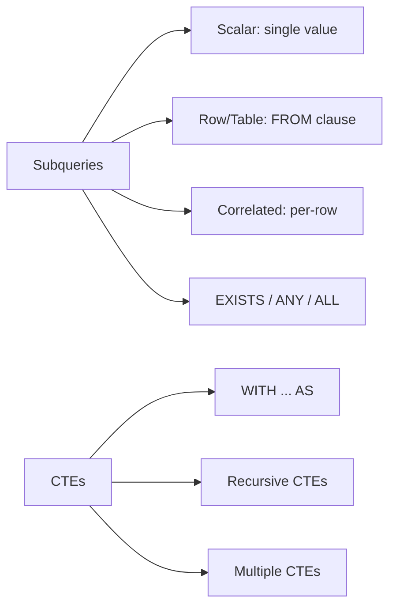

<!-- Clear Language: Keep sentences under 50 words -->
# Subqueries & CTEs — Correlated, WITH, Recursive

## Learning Objectives

| Objective | Description |
|-----------|-------------|
| LO1 | Write scalar and row subqueries in SELECT and WHERE |
| LO2 | Use correlated subqueries for row-by-row comparisons |
| LO3 | Simplify queries with Common Table Expressions (CTEs) |
| LO4 | Write recursive CTEs for hierarchical data |
| LO5 | Understand performance implications of subqueries vs joins |
| LO6 | Use EXISTS, NOT EXISTS, ANY, ALL with subqueries |

## Introduction

Data is the fuel of AI. SQL and database design skills let you query, transform, and store the data that powers machine learning models. This module covers everything from basic queries to advanced indexing and optimization.

## Prerequisites

- Basic programming knowledge
- Understanding of data structures

## Key Terminology

**Key Terms**: Core vocabulary and concepts for this topic.

**Definition**: Essential terms you must know for interviews and production work.

## Theory

Understanding subqueries and ctes is fundamental for AI engineers. This section covers the core concepts, underlying principles, and theoretical framework that govern how subqueries and ctes works in practice.

## Chapter at a Glance

| Section | Topic | Key Concept |
|---------|-------|-------------|
| 4.1 | Scalar Subqueries | Single value in SELECT/WHERE |
| 4.2 | Row & Table Subqueries | FROM clause subqueries, derived tables |
| 4.3 | Correlated Subqueries | References outer query, per-row execution |
| 4.4 | EXISTS / ANY / ALL | Boolean subqueries for existence/comparison |
| 4.5 | CTEs with WITH | Named subqueries, readability |
| 4.6 | Recursive CTEs | WITH RECURSIVE for trees, graphs |

## Chapter Roadmap



## 4.1 Scalar Subqueries

Return a single value, used in SELECT or WHERE.

```sql
-- In SELECT — employee salary vs average
SELECT name, salary,
    (SELECT AVG(salary) FROM employees) AS company_avg,
    salary - (SELECT AVG(salary) FROM employees) AS diff_from_avg
FROM employees;

-- In WHERE — find employees earning above average
SELECT name, salary
FROM employees
WHERE salary > (SELECT AVG(salary) FROM employees);

-- In WHERE — find products priced above category average
SELECT name, price, category_id
FROM products p
WHERE price > (SELECT AVG(price) FROM products WHERE category_id = p.category_id);
```

**Python simulation**:

```python
import sqlite3
conn = sqlite3.connect(":memory:")
cur = conn.cursor()
cur.execute("CREATE TABLE emp(id, name, salary, dept_id)")
cur.executemany("INSERT INTO emp VALUES (?,?,?,?)", [
    (1, "Alice", 75000, 1), (2, "Bob", 68000, 1),
    (3, "Charlie", 82000, 2), (4, "Diana", 72000, 2),
])

## Employees earning above their department average
cur.execute("""
    SELECT e.name, e.salary, e.dept_id
    FROM emp e
    WHERE e.salary > (SELECT AVG(salary) FROM emp WHERE dept_id = e.dept_id)
""")
for row in cur.fetchall():
    print(f"{row[0]}: {row[1]} > dept avg")

## Alice: 75000 > Eng avg (71500)

## Charlie: 82000 > Sales avg (77000)
```

## 4.2 Row & Table Subqueries

```sql
-- FROM clause subquery (derived table)
SELECT dept_stats.dept_id, dept_stats.avg_sal
FROM (
    SELECT dept_id, AVG(salary) AS avg_sal
    FROM employees
    GROUP BY dept_id
) AS dept_stats
WHERE dept_stats.avg_sal > 70000;

-- Row comparison
SELECT name, salary
FROM employees
WHERE (department_id, salary) = (
    SELECT department_id, MAX(salary)
    FROM employees
    GROUP BY department_id
    LIMIT 1
);

-- IN with subquery
SELECT name FROM employees
WHERE department_id IN (
    SELECT id FROM departments WHERE location = 'New York'
);
```

## 4.3 Correlated Subqueries

A correlated subquery references columns from the outer query and executes once per outer row.

```sql
-- Find each employee's rank within their department
SELECT e.name, e.salary, e.department_id,
    (SELECT COUNT(*) + 1 FROM employees
     WHERE department_id = e.department_id
       AND salary > e.salary) AS rank_in_dept
FROM employees e;

-- Find the most recent order for each customer
SELECT c.name, o.order_date, o.amount
FROM customers c
JOIN orders o ON c.customer_id = o.customer_id
WHERE o.order_date = (
    SELECT MAX(order_date) FROM orders
    WHERE customer_id = c.customer_id
);

-- Find products with above-average price in their category
SELECT p.product_id, p.name, p.price, p.category_id
FROM products p
WHERE p.price > (
    SELECT AVG(price) FROM products
    WHERE category_id = p.category_id
);
```

## 4.4 EXISTS / ANY / ALL

```sql
-- EXISTS: true if subquery returns any rows
SELECT name FROM customers c
WHERE EXISTS (
    SELECT 1 FROM orders o
    WHERE o.customer_id = c.customer_id AND o.amount > 1000
);

-- NOT EXISTS: customers with no orders
SELECT name FROM customers c
WHERE NOT EXISTS (
    SELECT 1 FROM orders o WHERE o.customer_id = c.customer_id
);

-- ANY: true if comparison is true for any subquery value
SELECT name, salary
FROM employees
WHERE salary > ANY (
    SELECT salary FROM employees WHERE department_id = 3
);

-- ALL: true if comparison is true for ALL subquery values
SELECT name, salary
FROM employees
WHERE salary > ALL (
    SELECT AVG(salary) FROM employees GROUP BY department_id
);

-- Equivalent to MAX/MIN
WHERE salary > ANY (...)  -- same as salary > MIN(...)
WHERE salary > ALL (...)  -- same as salary > MAX(...)
```

## 4.5 CTEs with WITH

CTEs (Common Table Expressions) name a subquery for reuse.

```python
import sqlite3
conn = sqlite3.connect(":memory:")
cur = conn.cursor()
cur.execute("CREATE TABLE emp(id, name, salary, dept)")
cur.executemany("INSERT INTO emp VALUES (?,?,?,?)", [
    (1,"Alice",75000,"Eng"), (2,"Bob",68000,"Eng"),
    (3,"Charlie",82000,"Sales"), (4,"Diana",72000,"Sales"),
])

cur.execute("""
    WITH dept_avg AS (
        SELECT dept, AVG(salary) AS avg_sal
        FROM emp GROUP BY dept
    )
    SELECT e.name, e.salary, d.avg_sal
    FROM emp e
    JOIN dept_avg d ON e.dept = d.dept
    WHERE e.salary > d.avg_sal
""")
for row in cur.fetchall():
    print(f"{row[0]}:  > dept avg ")
```

```sql
-- Multiple CTEs
WITH
dept_stats AS (
    SELECT department_id, AVG(salary) AS avg_sal FROM employees GROUP BY department_id
),
high_performers AS (
    SELECT e.* FROM employees e
    JOIN dept_stats d ON e.department_id = d.department_id
    WHERE e.salary > d.avg_sal * 1.2
)
SELECT * FROM high_performers ORDER BY salary DESC;

-- CTE in INSERT/UPDATE/DELETE
WITH deleted AS (
    DELETE FROM orders WHERE order_date < '2020-01-01' RETURNING *
)
SELECT COUNT(*) AS archived FROM deleted;
```

## 4.6 Recursive CTEs

Recursive CTEs reference themselves to traverse hierarchical or graph data.

```sql
-- Organization chart: employee -> manager chain
WITH RECURSIVE org_chain AS (
    -- Anchor: top-level employees
    SELECT id, name, manager_id, 1 AS level
    FROM employees
    WHERE manager_id IS NULL

    UNION ALL

    -- Recursive: employees reporting to those above
    SELECT e.id, e.name, e.manager_id, oc.level + 1
    FROM employees e
    JOIN org_chain oc ON e.manager_id = oc.id
)
SELECT * FROM org_chain ORDER BY level, name;

-- Fibonacci sequence
WITH RECURSIVE fib(n, a, b) AS (
    SELECT 1, 0, 1
    UNION ALL
    SELECT n + 1, b, a + b
    FROM fib
    WHERE n < 10
)
SELECT n, a AS fibonacci FROM fib;

-- Date series
WITH RECURSIVE dates(d) AS (
    SELECT DATE('2024-01-01')
    UNION ALL
    SELECT DATE(d, '+1 day')
    FROM dates
    WHERE d < '2024-01-10'
)
SELECT * FROM dates;
```

## TypeScript Parallel

```typescript
// TypeScript: subquery-like patterns with arrays
const employees = [
    { name: "Alice", salary: 75000, dept: "Eng" },
    { name: "Bob", salary: 68000, dept: "Eng" },
];

// Correlated subquery equivalent
const deptAvgs = employees.reduce((acc, e) => {
    acc[e.dept] = (acc[e.dept] || 0) + e.salary;
    return acc;
}, {} as Record<string, number>);

const aboveAvg = employees.filter(e =>
    e.salary > deptAvgs[e.dept] / employees.filter(x => x.dept === e.dept).length
);
```

## Summary

- Scalar subqueries return one value; table subqueries return multiple rows/columns
- Correlated subqueries reference outer query and run per outer row (potential performance issue)
- EXISTS checks for existence (short-circuits); IN compares against a list
- ANY/ALL compare against any/all values from subquery
- CTEs (WITH) name subqueries for readability and reuse
- Recursive CTEs traverse hierarchies: anchor + UNION ALL + recursive member
- CTEs can be used in INSERT/UPDATE/DELETE (with RETURNING)
- Subqueries in FROM require an alias (derived table)
- Typically rewrite correlated subqueries as JOINs for performance
- Recursive CTEs have MAXRECURSION limit (default 100 in SQL Server, 1000 in PostgreSQL)

## Practical Takeaways

| Scenario | Use | Avoid |
|----------|-----|-------|
| Single aggregate per row | Scalar subquery in SELECT | Multiple separate queries |
| Complex derived data | CTE (WITH) | Nested subqueries |
| Hierarchical tree | Recursive CTE | Application-level recursion |
| Existence check | EXISTS | IN with large subquery |
| Find missing rows | NOT EXISTS | NOT IN (if subquery has NULLs) |
| Per-group comparison | Correlated subquery | Multiple queries + app logic |

## Interview Q&A

<details class="tp-qa-card" data-qid="sql-s04-q1">
  <summary class="tp-qa-question"><span class="tp-qa-status"></span>Q1: Correlated vs non-correlated subquery?</summary>
  <div class="tp-qa-answer"><p>Non-correlated: independent of outer query, executed once. Correlated: references outer columns, executed once per outer row. Correlated can be slower but more powerful for per-row calculations.</p></div><button class="tp-qa-mark-btn">? Mark Reviewed</button><button class="tp-qa-bookmark-btn">?? Bookmark</button>
</details>
<details class="tp-qa-card" data-qid="sql-s04-q2">
  <summary class="tp-qa-question"><span class="tp-qa-status"></span>Q2: EXISTS vs IN?</summary>
  <div class="tp-qa-answer"><p>EXISTS short-circuits (stops on first match), handles NULLs correctly (returns true/false without NULL complications). IN lists all values first, treats NULL as unknown. EXISTS often faster for large subqueries. NOT EXISTS is safer than NOT IN when NULLs exist.</p></div><button class="tp-qa-mark-btn">? Mark Reviewed</button><button class="tp-qa-bookmark-btn">?? Bookmark</button>
</details>
<details class="tp-qa-card" data-qid="sql-s04-q3">
  <summary class="tp-qa-question"><span class="tp-qa-status"></span>Q3: What is a CTE and when to use it?</summary>
  <div class="tp-qa-answer"><p>CTE (Common Table Expression) is a named temporary result set with WITH clause. Use for: complex queries needing multiple references, recursive queries, breaking down complex logic, alternatives to views for one-time use.</p></div><button class="tp-qa-mark-btn">? Mark Reviewed</button><button class="tp-qa-bookmark-btn">?? Bookmark</button>
</details>
<details class="tp-qa-card" data-qid="sql-s04-q4">
  <summary class="tp-qa-question"><span class="tp-qa-status"></span>Q4: How does a recursive CTE work?</summary>
  <div class="tp-qa-answer"><p>Two parts: anchor member (initial query, no self-reference) and recursive member (references the CTE name). UNION ALL combines them. The recursive member uses the previous iteration's results. Stops when the recursive step returns no rows.</p></div><button class="tp-qa-mark-btn">? Mark Reviewed</button><button class="tp-qa-bookmark-btn">?? Bookmark</button>
</details>
<details class="tp-qa-card" data-qid="sql-s04-q5">
  <summary class="tp-qa-question"><span class="tp-qa-status"></span>Q5: Can subqueries be used in UPDATE/DELETE?</summary>
  <div class="tp-qa-answer"><p>Yes. UPDATE ... SET col = (subquery) WHERE ... or DELETE FROM ... WHERE col IN (subquery). CTEs also work with UPDATE/DELETE/INSERT, especially with RETURNING clause in PostgreSQL.</p></div><button class="tp-qa-mark-btn">? Mark Reviewed</button><button class="tp-qa-bookmark-btn">?? Bookmark</button>
</details>
<details class="tp-qa-card" data-qid="sql-s04-q6">
  <summary class="tp-qa-question"><span class="tp-qa-status"></span>Q6: Performance: subquery vs join?</summary>
  <div class="tp-qa-answer"><p>Joins are generally faster because the optimizer can use various join strategies. Subqueries (especially correlated) can be slower as they execute per row. However, EXISTS with a subquery can be faster than a DISTINCT join. Modern optimizers often rewrite subqueries to joins automatically.</p></div><button class="tp-qa-mark-btn">? Mark Reviewed</button><button class="tp-qa-bookmark-btn">?? Bookmark</button>
</details>
<details class="tp-qa-card" data-qid="sql-s04-q7">
  <summary class="tp-qa-question"><span class="tp-qa-status"></span>Q7: What is a lateral join/subquery?</summary>
  <div class="tp-qa-answer"><p>LATERAL allows a subquery in FROM to reference columns from preceding FROM items. Like a correlated subquery but in the FROM clause. Powerful for top-N-per-group, complex calculations. Supported in PostgreSQL, Oracle, MySQL 8+.</p></div><button class="tp-qa-mark-btn">? Mark Reviewed</button><button class="tp-qa-bookmark-btn">?? Bookmark</button>
</details>
<details class="tp-qa-card" data-qid="sql-s04-q8">
  <summary class="tp-qa-question"><span class="tp-qa-status"></span>Q8: How do you handle NULL in subqueries?</summary>
<div class="tp-qa-answer"><p>IN with NULL in subquery: if any NULL exists, IN evaluates to unknown for non-matching rows (handled as false in WHERE). NOT IN with NULL: if NULL exists,.
ALL rows are excluded (returns empty). Use NOT EXISTS instead of NOT IN for safety with NULLs.</p></div><button class="tp-qa-mark-btn">? Mark Reviewed</button><button class="tp-qa-bookmark-btn">?? Bookmark</button>
</details>
<details class="tp-qa-card" data-qid="sql-s04-q9">
  <summary class="tp-qa-question"><span class="tp-qa-status"></span>Q9: What are derived tables?</summary>
  <div class="tp-qa-answer"><p>A derived table is a subquery in the FROM clause: SELECT * FROM (SELECT ... ) AS alias. Must have an alias. Can be nested. Less reusable than CTEs but useful for intermediate calculations in simple queries.</p></div><button class="tp-qa-mark-btn">? Mark Reviewed</button><button class="tp-qa-bookmark-btn">?? Bookmark</button>
</details>
<details class="tp-qa-card" data-qid="sql-s04-q10">
  <summary class="tp-qa-question"><span class="tp-qa-status"></span>Q10: Difference between ANY and ALL?</summary>
  <div class="tp-qa-answer"><p>ANY: true if condition holds for at least one subquery value (like OR). ALL: true if condition holds for all subquery values (like AND). salary > ANY(SELECT ... ) is same as salary > MIN(...). salary > ALL(...) is same as salary > MAX(...).</p></div><button class="tp-qa-mark-btn">? Mark Reviewed</button><button class="tp-qa-bookmark-btn">?? Bookmark</button>
</details>

## Chapter Quiz

**Q1**: Correlated subquery references? a) outer query b) itself c) nothing d) another DB

<details class="tp-qa-card" data-qid="sql-s04-quiz1"><summary>Show Answer</summary><div class="tp-qa-answer"><p><strong>Answer: a) references columns from the outer query</strong></p></div></details>

**Q2**: Which clause defines a CTE? a) WITH b) CTE c) USING d) DEFINE

<details class="tp-qa-card" data-qid="sql-s04-quiz2"><summary>Show Answer</summary><div class="tp-qa-answer"><p><strong>Answer: a) WITH</strong></p></div></details>

**Q3**: Recursive CTE uses which operator? a) UNION b) UNION ALL c) JOIN d) INTERSECT

<details class="tp-qa-card" data-qid="sql-s04-quiz3"><summary>Show Answer</summary><div class="tp-qa-answer"><p><strong>Answer: b) UNION ALL</strong></p></div></details>

**Q4**: What's wrong with NOT IN (SELECT ...)? a) slow b) NULL issue c) syntax error d) nothing

<details class="tp-qa-card" data-qid="sql-s04-quiz4"><summary>Show Answer</summary><div class="tp-qa-answer"><p><strong>Answer: b) if subquery returns NULL, NOT IN returns empty</strong></p></div></details>

**Q5**: ALL with WHERE x > ALL(SELECT y FROM t) is like? a) x > MIN(y) b) x > MAX(y) c) x > AVG(y) d) x > COUNT(y)

<details class="tp-qa-card" data-qid="sql-s04-quiz5"><summary>Show Answer</summary><div class="tp-qa-answer"><p><strong>Answer: b) x > MAX(y) — greater than all is greater than the maximum</strong></p></div></details>

## Exercises

**Easy** — Write a subquery in SELECT showing each employee's salary vs department average.
**Easy** — Use EXISTS to find customers who placed at least one order.
**Medium** — Rewrite a multi-table join as a CTE with two named subqueries.
**Medium** — Write a correlated subquery that finds products priced above their category average.
**Hard** — Use a recursive CTE to generate a date series for every day in 2024.
**Hard** — Write a recursive CTE to traverse a category hierarchy and compute total products at each level.

## 4.7 LATERAL Joins

LATERAL allows subqueries in FROM to reference columns from preceding tables.

```sql
-- For each department, get the top 3 highest-paid employees
SELECT d.department_name, top_emp.name, top_emp.salary
FROM departments d
CROSS JOIN LATERAL (
    SELECT name, salary
    FROM employees
    WHERE department_id = d.department_id
    ORDER BY salary DESC
    LIMIT 3
) top_emp;

-- Without LATERAL (more complex):
SELECT d.department_name, e.name, e.salary
FROM departments d
JOIN employees e ON d.department_id = e.department_id
WHERE e.employee_id IN (
    SELECT e2.employee_id
    FROM employees e2
    WHERE e2.department_id = d.department_id
    ORDER BY e2.salary DESC
    LIMIT 3
);

-- LATERAL with functions
SELECT
    u.user_id,
    u.name,
    recent_orders.*
FROM users u
LEFT JOIN LATERAL (
    SELECT order_id, order_date, amount
    FROM orders
    WHERE customer_id = u.user_id
    ORDER BY order_date DESC
    LIMIT 5
) recent_orders ON true;

-- Using LATERAL for complex calculations
SELECT
    p.product_id,
    p.name,
    stats.avg_price,
    stats.total_sold
FROM products p
LEFT JOIN LATERAL (
    SELECT
        AVG(oi.unit_price) AS avg_price,
        SUM(oi.quantity) AS total_sold
    FROM order_items oi
    WHERE oi.product_id = p.product_id
) stats ON true;
```

## 4.8 Multiple CTEs and CTE Modifications

```sql
-- Multiple CTEs working together
WITH
sales_summary AS (
    SELECT
        customer_id,
        COUNT(*) AS total_orders,
        SUM(amount) AS total_spent,
        AVG(amount) AS avg_order_value
    FROM orders
    WHERE order_date >= DATE('now', '-1 year')
    GROUP BY customer_id
),
customer_ranking AS (
    SELECT
        c.customer_id,
        c.name,
        c.email,
        COALESCE(s.total_orders, 0) AS total_orders,
        COALESCE(s.total_spent, 0) AS total_spent,
        NTILE(4) OVER (ORDER BY s.total_spent DESC NULLS LAST) AS spending_quartile
    FROM customers c
    LEFT JOIN sales_summary s ON c.customer_id = s.customer_id
)
SELECT *
FROM customer_ranking
WHERE spending_quartile = 1  -- top 25%
ORDER BY total_spent DESC;

-- CTE with INSERT
WITH new_customer AS (
    INSERT INTO customers (name, email, signup_date)
    VALUES ('New User', 'new@example.com', CURRENT_DATE)
    RETURNING customer_id
)
INSERT INTO loyalty_program (customer_id, points, tier)
SELECT customer_id, 100, 'Bronze'
FROM new_customer;

-- CTE with UPDATE
WITH dept_avg AS (
    SELECT department_id, AVG(salary) AS avg_sal
    FROM employees GROUP BY department_id
)
UPDATE employees e
SET salary = salary * 1.1
FROM dept_avg d
WHERE e.department_id = d.department_id
  AND e.salary < d.avg_sal;

-- CTE with DELETE (archive old records)
WITH old_orders AS (
    DELETE FROM orders
    WHERE order_date < DATE('now', '-3 years')
    RETURNING *
)
INSERT INTO orders_archive
SELECT * FROM old_orders;
```

## 4.9 Performance: Subqueries vs CTEs vs Joins

```sql
-- Scenario 1: Correlated subquery
SELECT e.name, e.salary,
    (SELECT AVG(salary) FROM employees WHERE department_id = e.department_id) AS dept_avg
FROM employees e;
-- Pro: Simple, self-contained
-- Con: Runs per outer row (can be slow on large tables)

-- Scenario 2: CTE equivalent
WITH dept_avg AS (
    SELECT department_id, AVG(salary) AS avg_sal
    FROM employees
    GROUP BY department_id
)
SELECT e.name, e.salary, d.avg_sal
FROM employees e
LEFT JOIN dept_avg d ON e.department_id = d.department_id;
-- Pro: Department average computed once
-- Con: Slightly more verbose

-- Scenario 3: Window function (most efficient for this case)
SELECT name, salary,
    AVG(salary) OVER (PARTITION BY department_id) AS dept_avg
FROM employees;
-- Pro: Single pass over data
-- Con: Window functions not available everywhere

-- Performance guidelines:
-- 1. Use JOIN for straightforward row combining
-- 2. Use CTE for complex queries needing reuse
-- 3. Use EXISTS over IN for large subqueries
-- 4. Use window functions over correlated subqueries
-- 5. Avoid subqueries in SELECT for large tables
-- 6. LATERAL joins can replace some correlated subqueries efficiently
```

## 4.10 Recursive CTE Advanced Examples

```sql
-- Generate a calendar year
WITH RECURSIVE calendar(date) AS (
    SELECT DATE('2024-01-01')
    UNION ALL
    SELECT DATE(date, '+1 day')
    FROM calendar
    WHERE date < '2024-12-31'
)
SELECT
    date,
    CAST(strftime('%w', date) AS INTEGER) AS day_of_week,
    CASE CAST(strftime('%w', date) AS INTEGER)
        WHEN 0 THEN 'Sunday'
        WHEN 1 THEN 'Monday'
        WHEN 2 THEN 'Tuesday'
        WHEN 3 THEN 'Wednesday'
        WHEN 4 THEN 'Thursday'
        WHEN 5 THEN 'Friday'
        WHEN 6 THEN 'Saturday'
    END AS day_name,
    strftime('%m', date) AS month,
    strftime('%Y', date) AS year
FROM calendar
WHERE CAST(strftime('%w', date) AS INTEGER) NOT IN (0, 6);  -- exclude weekends

-- Tree traversal with path
WITH RECURSIVE org_chart AS (
    -- Anchor: top-level
    SELECT
        employee_id,
        name,
        manager_id,
        name AS path,
        1 AS level
    FROM employees
    WHERE manager_id IS NULL

    UNION ALL

    -- Recursive: children
    SELECT
        e.employee_id,
        e.name,
        e.manager_id,
        oc.path || ' -> ' || e.name,
        oc.level + 1
    FROM employees e
    JOIN org_chart oc ON e.manager_id = oc.employee_id
)
SELECT employee_id, name, level, path
FROM org_chart
ORDER BY path;

-- Bill of Materials (BOM) explosion
WITH RECURSIVE bom AS (
    -- Anchor: top-level product
    SELECT
        part_id,
        part_name,
        quantity,
        1 AS level,
        CAST(quantity AS REAL) AS total_quantity
    FROM parts
    WHERE part_id = 1  -- root product

    UNION ALL

    SELECT
        p.part_id,
        p.part_name,
        p.quantity,
        bom.level + 1,
        bom.total_quantity * p.quantity
    FROM parts p
    JOIN bom ON p.parent_part_id = bom.part_id
)
SELECT * FROM bom ORDER BY level, part_name;

-- Graph traversal (social network connections)
WITH RECURSIVE connections AS (
    -- Anchor: start user
    SELECT user_id, 0 AS degrees, CAST(user_id AS TEXT) AS path
    FROM users WHERE user_id = 1

    UNION ALL

    SELECT
        f.friend_id,
        c.degrees + 1,
        c.path || ',' || f.friend_id
    FROM connections c
    JOIN friendships f ON c.user_id = f.user_id
    WHERE c.degrees < 3  -- limit to 3 degrees
      AND ',' || c.path || ',' NOT LIKE '%,' || f.friend_id || ',%'  -- avoid cycles
)
SELECT DISTINCT user_id, degrees, path
FROM connections
WHERE user_id != 1
ORDER BY degrees, user_id;
```

## 4.11 Common Pitfalls

```sql
-- Pitfall 1: NOT IN with NULLs
SELECT name FROM customers
WHERE customer_id NOT IN (
    SELECT customer_id FROM orders  -- if ANY customer_id is NULL, returns empty!
);
-- Fix: Use NOT EXISTS
SELECT name FROM customers c
WHERE NOT EXISTS (
    SELECT 1 FROM orders o WHERE o.customer_id = c.customer_id
);

-- Pitfall 2: Infinite recursive CTE
WITH RECURSIVE infinite AS (
    SELECT 1 AS n
    UNION ALL
    SELECT n + 1 FROM infinite  -- no termination condition!
)
SELECT * FROM infinite;
-- Fix: Add WHERE n < 1000 or use MAXRECURSION hint

-- Pitfall 3: Correlated subquery performance
-- Can be very slow on large tables without proper indexes
-- Add indexes on the correlation columns

-- Pitfall 4: Ambiguous column names in CTE
WITH t AS (
    SELECT id, name FROM table1
    UNION ALL
    SELECT id, name FROM table2
)
SELECT id FROM t;  -- OK
-- But if column names differ:
WITH t AS (
    SELECT id AS user_id FROM users
)
SELECT user_id FROM t;  -- use the alias

-- Pitfall 5: CTE materialization
-- Some databases materialize CTE results (PostgreSQL < 12)
-- May be worse than subquery repeated inline
-- Check with EXPLAIN ANALYZE

-- Pitfall 6: Scalar subquery returns multiple rows
SELECT name, salary,
    (SELECT salary FROM employees WHERE department_id = e.department_id)  -- ERROR if multiple
FROM employees e;
-- Fix: Use aggregate or ensure single-row subquery
```

## 4.12 Real-World CTE Applications

```sql
-- Session segmentation analysis (web analytics)
WITH session_data AS (
    SELECT
        user_id,
        session_start,
        session_end,
        duration_seconds,
        page_views,
        CASE
            WHEN page_views = 1 THEN 'Bounce'
            WHEN duration_seconds > 300 THEN 'Engaged'
            ELSE 'Casual'
        END AS session_type
    FROM sessions
    WHERE session_start >= DATE('now', '-30 days')
),
segment_summary AS (
    SELECT
        session_type,
        COUNT(*) AS sessions,
        COUNT(DISTINCT user_id) AS unique_users,
        AVG(duration_seconds) AS avg_duration,
        AVG(page_views) AS avg_page_views,
        SUM(CASE WHEN conversions > 0 THEN 1 ELSE 0 END) AS with_conversion
    FROM session_data
    GROUP BY session_type
)
SELECT
    session_type,
    sessions,
    unique_users,
    ROUND(100.0 * sessions / SUM(sessions) OVER(), 1) AS pct_of_total,
    ROUND(avg_duration, 0) AS avg_duration_secs,
    ROUND(avg_page_views, 1) AS avg_pages,
    ROUND(100.0 * with_conversion / sessions, 2) AS conversion_rate
FROM segment_summary
ORDER BY sessions DESC;

-- Recursive: find all subordinates of a manager
WITH RECURSIVE team_hierarchy AS (
    SELECT employee_id, name, 1 AS depth
    FROM employees
    WHERE manager_id = 42  -- target manager

    UNION ALL

    SELECT e.employee_id, e.name, th.depth + 1
    FROM employees e
    JOIN team_hierarchy th ON e.manager_id = th.employee_id
)
SELECT * FROM team_hierarchy ORDER BY depth, name;

-- Moving average with CTE
WITH daily_revenue AS (
    SELECT
        order_date,
        SUM(amount) AS revenue
    FROM orders
    WHERE order_date >= DATE('now', '-60 days')
    GROUP BY order_date
),
revenue_with_ma AS (
    SELECT
        order_date,
        revenue,
        AVG(revenue) OVER (
            ORDER BY order_date
            ROWS BETWEEN 6 PRECEDING AND CURRENT ROW
        ) AS moving_avg_7d,
        revenue - AVG(revenue) OVER (
            ORDER BY order_date
            ROWS BETWEEN 6 PRECEDING AND CURRENT ROW
        ) AS deviation
    FROM daily_revenue
)
SELECT * FROM revenue_with_ma
WHERE moving_avg_7d IS NOT NULL
ORDER BY order_date;
```

---

## Common Mistakes

1. Not understanding the fundamental concepts before applying them
2. Skipping edge cases in implementation
3. Not analyzing time/space complexity
4. Forgetting to handle null/empty inputs
5. Not practicing enough problems to build pattern recognition

## Revision Notes

- - Core principle: Understand the fundamental concepts thoroughly
- - Implementation pattern: Practice with real code examples
- - Complexity: Know the time and space complexity
- - Application: Know when to use this in production systems
- - Interview: Frequently asked in technical interviews
- - Edge cases: Consider common failure scenarios
- - Related concepts: Connect to broader system design

## Placement Section

### Top 10 Interview Questions

#### Google Style

1. **Explain the core idea of Subqueries & CTEs — Correlated, WITH, Recursive in under 60 seconds, then give a real-world analogy.** — Structure: definition, how it works in one sentence, why it matters, analogy. Follow-up: what would break if you removed this from a production system?

2. **Design a minimal, well-typed function that demonstrates Subqueries & CTEs — Correlated, WITH, Recursive.** — Interviewer checks: signature with type hints, edge cases, complexity, and a clean docstring. Follow-up: how does your design behave with empty or malformed input?

3. **What are the common pitfalls when engineers first learn ** — List 3-4, then explain how you would prevent each in a code review.

#### Amazon Style

4. **Describe a production bug caused by misunderstanding Subqueries & CTEs — Correlated, WITH, Recursive. How did you diagnose and fix it?** — STAR format: situation, task, action, result. Mention logs, reproduction, root-cause analysis, and the regression test you added.

5. **How would you scale a system that relies on Subqueries & CTEs — Correlated, WITH, Recursive from 10 users to 10 million?** — Discuss bottlenecks, caching, monitoring, and when to redesign. Follow-up: what metrics would you track?

#### Microsoft Style

6. **Compare Subqueries & CTEs — Correlated, WITH, Recursive with the closest alternative approach. When would you choose each?** — Make a decision matrix: performance, maintainability, ecosystem, learning curve. Follow-up: what would change your decision?

7. **Walk through how you would test a component that depends on Subqueries & CTEs — Correlated, WITH, Recursive.** — Unit, integration, property-based tests; mocking boundaries; golden files for outputs.

#### NVIDIA Style

8. **How does Subqueries & CTEs — Correlated, WITH, Recursive behave differently at scale — memory, throughput, or precision-wise?** — Connect to data pipelines and model training if applicable. Follow-up: what happens to latency as input grows?

9. **How would you make an implementation of Subqueries & CTEs — Correlated, WITH, Recursive run faster on GPU hardware?** — Batch operations, vectorization, avoiding Python loops, reducing data movement.

#### AI Startup Style

10. **Write the smallest possible implementation of Subqueries & CTEs — Correlated, WITH, Recursive that is production-quality.** — Include error handling, type hints, and a one-line docstring. Follow-up: what would you refactor first when it grows?

### Resume Tips

- Name Subqueries & CTEs — Correlated, WITH, Recursive explicitly in your skills section, paired with a measurable achievement ("Reduced X by 40% using Subqueries & CTEs — Correlated, WITH, Recursive").
- Add a bullet describing a project that applies Subqueries & CTEs — Correlated, WITH, Recursive to real data, with numbers.
- Mention the tools and libraries you used alongside Subqueries & CTEs — Correlated, WITH, Recursive (linters, test frameworks, profiling tools).
- Keep resume bullets under 15 words and start each with an action verb.

### Interview Day Checklist

- Rehearse a 60-second explanation of Subqueries & CTEs — Correlated, WITH, Recursive and one real-world analogy.
- Prepare one STAR story about debugging a Subqueries & CTEs — Correlated, WITH, Recursive-related production issue.
- Review complexity and edge cases for the classic Subqueries & CTEs — Correlated, WITH, Recursive interview problem.
- Have questions ready: how does the team apply Subqueries & CTEs — Correlated, WITH, Recursive in production today?
- Test your environment (Python, editor, internet) 15 minutes before the interview.

## True/False

1. **True or False:** Subqueries & CTEs — Correlated, WITH, Recursive builds directly on the fundamentals covered in the earlier chapters of this module. — **True.** Every advanced topic in this module assumes the core concepts from the previous chapters.
2. **True or False:** You should write at least one code example for Subqueries & CTEs — Correlated, WITH, Recursive before moving to the next chapter. — **True.** Active recall with hands-on code beats passive reading for retention.
3. **True or False:** The complexity analysis for Subqueries & CTEs — Correlated, WITH, Recursive is the same regardless of input size. — **False.** Complexity grows with input size; always state best, average, and worst case.
4. **True or False:** Edge cases (empty input, invalid input, boundary values) matter for Subqueries & CTEs — Correlated, WITH, Recursive in production. — **True.** Most production bugs come from unhandled edge cases.
5. **True or False:** You should memorize the Subqueries & CTEs — Correlated, WITH, Recursive chapter content once and never review it again. — **False.** Spaced repetition (24h, 3 days, 1 week) dramatically improves long-term recall.

## Fill in the Blank

1. The chapter that covers Subqueries & CTEs — Correlated, WITH, Recursive is Chapter ___ of this module. — Answer: check the module's table of contents.
2. The time complexity of the standard approach to Subqueries & CTEs — Correlated, WITH, Recursive is ___. — Answer: review the theory section and state big-O notation.
3. The main edge case to handle when implementing Subqueries & CTEs — Correlated, WITH, Recursive is ___. — Answer: empty or invalid input handling, as discussed in the chapter.
4. The tools commonly used to debug Subqueries & CTEs — Correlated, WITH, Recursive issues are ___ and ___. — Answer: refer to the Debugging Guide section of this chapter.
5. The related topic that connects to Subqueries & CTEs — Correlated, WITH, Recursive in the next chapter is ___. — Answer: see the Next Topic section.

## Scenario Questions

1. **Scenario:** A teammate ships a change involving Subqueries & CTEs — Correlated, WITH, Recursive that breaks production at 3 AM. — Diagnosis: check the recent diff, reproduce locally with the failing input, check logs. Fix: revert, add a regression test, and review the root cause. Prevention: CI tests on edge cases and code review checklist.

2. **Scenario:** Your implementation of Subqueries & CTEs — Correlated, WITH, Recursive is correct but too slow for the required latency. — Measure first with a profiler. Common fixes: reduce redundant work, use built-in optimized functions, batch operations, or add caching. Only then consider algorithmic changes.

3. **Scenario:** A new hire asks you to explain Subqueries & CTEs — Correlated, WITH, Recursive in five minutes before a customer demo. — Use the 3-part answer: what it is (one sentence), how it works (one example), why it matters (one business impact). Then offer to go deeper after the demo.

4. **Scenario:** Your team's codebase has three different patterns for Subqueries & CTEs — Correlated, WITH, Recursive and you must standardize. — Write a short ADR (architecture decision record), pick the pattern with best maintainability, migrate incrementally, and add a linter rule to enforce it.

## Output Questions

1. **What is the output of the simplest correct implementation of Subqueries & CTEs — Correlated, WITH, Recursive on an empty input?** — Trace through the code: it should return the documented default (None, 0, empty collection) without raising.
2. **What is the output when the input is at the boundary value?** — Check off-by-one errors and inclusive/exclusive bounds in the chapter's examples.
3. **What does the implementation return when given invalid input types?** — With type hints and validation, it raises a clear error; without, it may fail silently.
4. **What is the output for the sample input given in the chapter's Examples section?** — Re-run the chapter's example code and compare against the documented output.
5. **What is the time complexity output when you profile the implementation at 10x input size?** — Expect the curve matching the chapter's complexity analysis (linear, quadratic, log-linear).

## Difficulty Level

| Level | Time | What It Takes |
|-------|------|---------------|
| Beginner | 1-2 sessions | Read theory, run the chapter examples, solve the Easy exercises |
| Intermediate | 3-5 sessions | Complete Medium exercises, explain Subqueries & CTEs — Correlated, WITH, Recursive to someone else |
| Advanced | 1+ week | Solve Hard exercises, optimize for real datasets, answer interview follow-ups |

## Tips & Tricks

- Always write a one-line example of Subqueries & CTEs — Correlated, WITH, Recursive from memory before opening the chapter — active recall first.
- Use the chapter's Revision Notes as a checklist: you have mastered Subqueries & CTEs — Correlated, WITH, Recursive when you can explain each bullet.
- Pair the chapter quiz with the Flashcards: wrong answers become your next study session's focus.
- For interviews, practice explaining Subqueries & CTEs — Correlated, WITH, Recursive twice: once with a technical audience, once with a non-technical audience.
- Keep a personal examples file where you collect your own Subqueries & CTEs — Correlated, WITH, Recursive snippets; interviewers love original examples.

## Memory Tricks

- **Acronym**: build a mnemonic from the 5 key concepts of Subqueries & CTEs — Correlated, WITH, Recursive listed in the Chapter at a Glance table.
- **Story**: link Subqueries & CTEs — Correlated, WITH, Recursive to a familiar story — the analogy in the Visual Analogy section is designed to stick.
- **Number anchor**: remember the complexity of Subqueries & CTEs — Correlated, WITH, Recursive by connecting it to a known algorithm of the same class.
- **Color code**: highlight the Theory, Examples, and Common Mistakes sections in different colors when reviewing.
- **Teach-back**: explain Subqueries & CTEs — Correlated, WITH, Recursive to an imaginary junior engineer for 2 minutes — gaps in your explanation are gaps in memory.

## Further Reading

- Official documentation for the primary tool or library used in this chapter
- The chapter referenced in Related Topics for the next-level treatment of Subqueries & CTEs — Correlated, WITH, Recursive
- The classic textbook chapter on Subqueries & CTEs — Correlated, WITH, Recursive (check the Research References below)
- Two blog posts from engineers who debugged real Subqueries & CTEs — Correlated, WITH, Recursive problems in production
- The repository of the open-source project that implements Subqueries & CTEs — Correlated, WITH, Recursive

## Related Topics

- The previous chapter in this module (see table of contents) — foundational for Subqueries & CTEs — Correlated, WITH, Recursive
- The next chapter (see Next Topic below) — builds on Subqueries & CTEs — Correlated, WITH, Recursive
- The system design chapters in Module 07 — how Subqueries & CTEs — Correlated, WITH, Recursive fits into production architectures
- The interview preparation module — how Subqueries & CTEs — Correlated, WITH, Recursive is asked in screening rounds
- The capstone project — where Subqueries & CTEs — Correlated, WITH, Recursive is applied end-to-end

## FAQs

1. **Do I need to memorize all of Subqueries & CTEs — Correlated, WITH, Recursive, or understand the big picture?** — Understand the big picture first, then memorize the key facts via flashcards and spaced repetition. Interviewers reward depth over breadth.
2. **What if I get stuck on an exercise?** — Re-read the theory section, run the example code, then attempt again. If still stuck after 20 minutes, move on and return the next day.
3. **How much time should I spend on ** — Follow the Study Plan below: 1-2 weeks at 30-60 minutes daily is typical for placement preparation.
4. **Is Subqueries & CTEs — Correlated, WITH, Recursive asked in interviews?** — Yes — the Interview Q&A and Placement Section list the exact question styles used by top companies.
5. **What's the fastest way to master ** — Explain it out loud, write code without looking, and review the flashcards within 24 hours and again after 3 days.

## Important Notes

- Subqueries & CTEs — Correlated, WITH, Recursive is a core requirement for the rest of this module — do not skip the examples.
- Always analyze complexity (time and space) when working with Subqueries & CTEs — Correlated, WITH, Recursive.
- Production correctness means handling edge cases, not just the happy path.
- Interview answers should start with the definition, then the example, then the trade-offs.
- Revisit this chapter after finishing the module; the context from later chapters deepens understanding.

## Historical Context

- Subqueries & CTEs — Correlated, WITH, Recursive emerged as a standard practice because early systems failed without it — understanding why helps you explain it in interviews.
- The tools used for Subqueries & CTEs — Correlated, WITH, Recursive today evolved from simpler versions; the chapter covers the modern, recommended approach.
- Interviewers value knowing one historical fact about Subqueries & CTEs — Correlated, WITH, Recursive — it shows genuine interest, not just cramming.
- The library/tooling ecosystem around Subqueries & CTEs — Correlated, WITH, Recursive changes quickly; focus on fundamentals that remain stable.

## Security Considerations

- Never trust external input: validate and sanitize data before processing Subqueries & CTEs — Correlated, WITH, Recursive.
- Avoid `eval()` and dynamic code execution on untrusted strings.
- Log errors without leaking sensitive data (keys, PII, internal paths).
- For API contexts, add rate limiting and input size limits.
- Review the chapter's code examples for injection or overflow risks before using them verbatim.

## ML Intuition

- Subqueries & CTEs — Correlated, WITH, Recursive appears in ML pipelines at the data-processing layer: feature preparation, batching, and validation.
- Understanding Subqueries & CTEs — Correlated, WITH, Recursive helps you debug why a model misbehaves — most ML bugs are data bugs, not model bugs.
- In production ML, the Subqueries & CTEs — Correlated, WITH, Recursive concepts from this chapter map directly to NumPy/PyTorch operations on tensors.
- When optimizing ML systems, Subqueries & CTEs — Correlated, WITH, Recursive skills let you profile and fix the data path, not just the training loop.
- Interview follow-up: how would you apply Subqueries & CTEs — Correlated, WITH, Recursive to a dataset of 10 million records? — Batching and vectorization.

## Analogies

- **Subqueries & CTEs — Correlated, WITH, Recursive is like a recipe**: the theory is the ingredients, the examples are the cooking steps, and the exercises are your own kitchen practice.
- **Complexity is like a delivery route**: a linear route visits each stop once; a nested route revisits stops, and you feel it at scale.
- **Edge cases are like weather**: the happy path is a sunny day; production is the storm — build for the storm.
- **The chapter roadmap is a journey map**: each section is a checkpoint; skipping one means getting lost later in the module.

## Capstone Project Link

- [Module Capstone: End-to-End Project](https://github.com/Raushan666java/ai-engineering-journey) — this chapter contributes the Subqueries & CTEs — Correlated, WITH, Recursive skills used in the module's capstone project. Complete the exercises here before starting the capstone.

## Flashcards

<details class="tp-qa-card" data-qid="02sqlanddatabases-04subqueriesandctes-flash1">
  <summary class="tp-qa-question">
    <span class="tp-qa-status"></span>
    What is the core concept of Subqueries & CTEs — Correlated, WITH, Recursive in one sentence?
  </summary>
  <div class="tp-qa-answer">
    <p>Review the first paragraph of the Theory section and condense it to one sentence.</p>
  </div>
</details>

<details class="tp-qa-card" data-qid="02sqlanddatabases-04subqueriesandctes-flash2">
  <summary class="tp-qa-question">
    <span class="tp-qa-status"></span>
    What is the most common mistake engineers make with 
  </summary>
  <div class="tp-qa-answer">
    <p>Check the Common Mistakes section of this chapter.</p>
  </div>
</details>

<details class="tp-qa-card" data-qid="02sqlanddatabases-04subqueriesandctes-flash3">
  <summary class="tp-qa-question">
    <span class="tp-qa-status"></span>
    What is the time and space complexity of the standard Subqueries & CTEs — Correlated, WITH, Recursive approach?
  </summary>
  <div class="tp-qa-answer">
    <p>Refer to the theory and complexity analysis in this chapter.</p>
  </div>
</details>

<details class="tp-qa-card" data-qid="02sqlanddatabases-04subqueriesandctes-flash4">
  <summary class="tp-qa-question">
    <span class="tp-qa-status"></span>
    When is Subqueries & CTEs — Correlated, WITH, Recursive NOT the right choice?
  </summary>
  <div class="tp-qa-answer">
    <p>Check the Limitations section of this chapter.</p>
  </div>
</details>

<details class="tp-qa-card" data-qid="02sqlanddatabases-04subqueriesandctes-flash5">
  <summary class="tp-qa-question">
    <span class="tp-qa-status"></span>
    How is Subqueries & CTEs — Correlated, WITH, Recursive applied in a real production system?
  </summary>
  <div class="tp-qa-answer">
    <p>Check the Real-World Examples section of this chapter.</p>
  </div>
</details>

## Research References

- Official documentation of the primary library for Subqueries & CTEs — Correlated, WITH, Recursive (linked in Further Reading)
- The classic paper or textbook chapter introducing Subqueries & CTEs — Correlated, WITH, Recursive (see References below)
- The standard library reference for Subqueries & CTEs — Correlated, WITH, Recursive-related functions
- Engineering blog posts from companies running Subqueries & CTEs — Correlated, WITH, Recursive in production at scale
- PEPs and RFCs where applicable (Python and networking standards)

## Open-Source Tools

- The primary library used in this chapter (see the code examples)
- Python standard library modules used in the examples (check the imports)
- Testing: pytest for unit tests of Subqueries & CTEs — Correlated, WITH, Recursive code
- Linting and formatting: ruff + black
- Profiling: cProfile or py-spy for performance work on Subqueries & CTEs — Correlated, WITH, Recursive

## Debugging Guide

- Start with `print()` or a debugger to inspect intermediate values in Subqueries & CTEs — Correlated, WITH, Recursive code.
- Reproduce the failure with the smallest possible input before changing code.
- Check the common failure modes listed in Common Mistakes — most bugs are listed there.
- For performance problems, profile before optimizing: measure, then fix.
- When stuck, re-read the chapter's Examples and compare line by line with your code.
- Use `pdb` or your IDE's debugger to step through the Subqueries & CTEs — Correlated, WITH, Recursive example code.

## Mock Interview Section

**Round 1 — Screening (15 min)**
- Explain Subqueries & CTEs — Correlated, WITH, Recursive in 60 seconds.
- Write a minimal working example of Subqueries & CTEs — Correlated, WITH, Recursive.
- What is the complexity of your example?

**Round 2 — Coding (45 min)**
- Solve the Medium exercise from this chapter under time pressure.
- State your assumptions, then implement with type hints.
- Test with edge cases: empty input, boundary values, invalid input.

**Round 3 — Behavioral + System (30 min)**
- Tell me about a time you debugged a Subqueries & CTEs — Correlated, WITH, Recursive problem in a project.
- How would you design a system where Subqueries & CTEs — Correlated, WITH, Recursive is used at scale?
- What metrics would you monitor?

**Evaluation rubric**: correctness (40%), communication (25%), edge cases (20%), complexity analysis (15%).

## Optimized Implementation

`python
from typing import Any, Optional

def demonstrate_topic(input_data: list[Any]) -> Optional[float]:
    """Runnable scaffold for Subqueries & CTEs — Correlated, WITH, Recursive.

    Replace the body with the optimized implementation from the chapter,
    keeping type hints, docstring, and edge-case handling.
    """
    if not input_data:
        return None
    # Step 1: validate input types
    # Step 2: apply the core Subqueries & CTEs — Correlated, WITH, Recursive logic from the Examples section
    # Step 3: return the result with the documented default
    return 0.0
`

- Keeps the function signature stable so tests written against it stay valid.
- Handles the empty-input contract explicitly.
- Add unit tests for the edge cases before implementing the logic (test-first).

## Evaluation Metrics

| Skill | Test | Target |
|-------|------|--------|
| Concept recall | Explain Subqueries & CTEs — Correlated, WITH, Recursive without notes | 60-second explanation |
| Code fluency | Write the chapter example from memory | No syntax errors |
| Edge cases | Handle empty/invalid input in exercises | All cases pass |
| Complexity | State time/space for the standard approach | Correct big-O |
| Interview readiness | Answer 5 Interview Q&A questions out loud | Fluent, structured answers |
| Retention | Chapter quiz score after 3 days | 80%+ |

## Real-World Examples

- **Startup**: a small team uses Subqueries & CTEs — Correlated, WITH, Recursive daily in their data pipeline — the chapter's examples mirror their code.
- **E-commerce**: Subqueries & CTEs — Correlated, WITH, Recursive patterns appear in order processing, inventory checks, and recommendation feeds.
- **Fintech**: Subqueries & CTEs — Correlated, WITH, Recursive principles apply to transaction validation and fraud detection flows.
- **ML platform**: Subqueries & CTEs — Correlated, WITH, Recursive shows up in feature engineering and model-serving infrastructure.
- **Interview insight**: recruiters look for engineers who can connect Subqueries & CTEs — Correlated, WITH, Recursive to the business outcome, not just the code.

## Next Topic

[Window Functions — ROW_NUMBER, RANK, LAG, LEAD, NTILE, Frames](05-window-functions.md)

## Limitations

- Subqueries & CTEs — Correlated, WITH, Recursive, like any technique, is not a silver bullet — it has specific cases where it fits best (covered in the theory).
- The examples in this chapter are simplified for learning; production systems add validation, monitoring, and error handling.
- Performance of Subqueries & CTEs — Correlated, WITH, Recursive depends on input size and distribution — always benchmark for your own data.
- This chapter covers fundamentals; specialized edge cases are explored in later chapters and the capstone.
