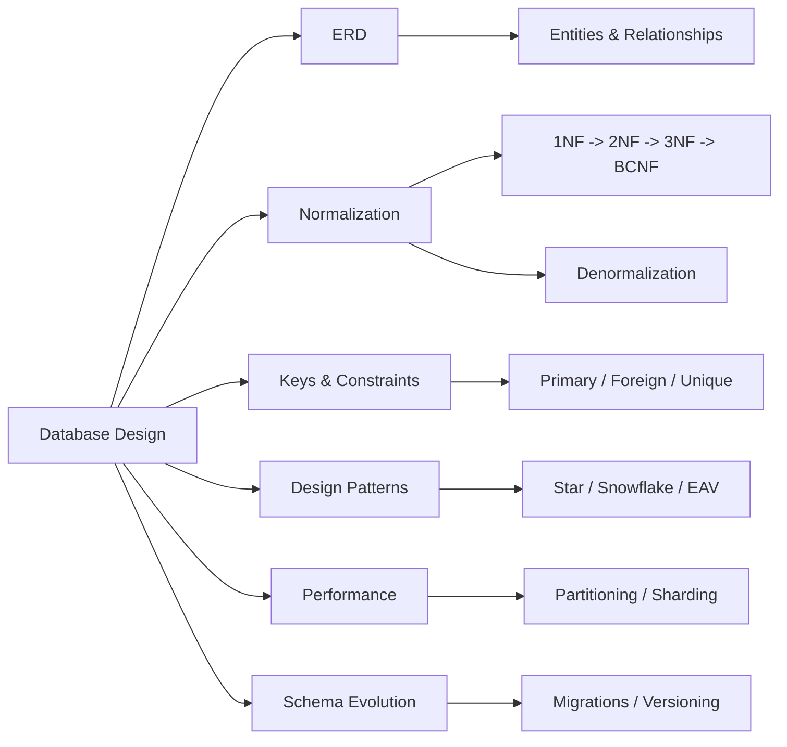

<!-- Clear Language: Keep sentences under 50 words -->
# Database Design — Normalization, ERD, Keys, Constraints, Schema Design

## Learning Objectives

| Objective | Description |
|-----------|-------------|
| LO1 | Design relational database schemas using Entity-Relationship Diagrams |
| LO2 | Apply normalization up to BCNF and understand denormalization trade-offs |
| LO3 | Define primary, foreign, unique, and composite keys |
| LO4 | Implement table constraints: CHECK, DEFAULT, NOT NULL, EXCLUDE |
| LO5 | Design schemas for different application patterns |
| LO6 | Understand indexing strategies and their impact on schema design |

## Introduction

Data is the fuel of AI. SQL and database design skills let you query, transform, and store the data that powers machine learning models. This module covers everything from basic queries to advanced indexing and optimization.

## Prerequisites

- Basic programming knowledge
- Understanding of data structures

## Key Terminology

**Key Terms**: Core vocabulary and concepts for this topic.

**Definition**: Essential terms you must know for interviews and production work.

## Theory

Understanding database design is fundamental for AI engineers. This section covers the core concepts, underlying principles, and theoretical framework that govern how database design works in practice.

## Chapter at a Glance

| Section | Topic | Key Concept |
|---------|-------|-------------|
| 8.1 | Entity-Relationship Diagrams | Entities, attributes, relationships, cardinality |
| 8.2 | Normalization | 1NF, 2NF, 3NF, BCNF, denormalization |
| 8.3 | Keys and Constraints | Primary, foreign, unique, composite, CHECK, EXCLUDE |
| 8.4 | Schema Design Patterns | Star schema, snowflake, EAV, polymorphic |
| 8.5 | Design for Performance | Partitioning, sharding, materialized views |
| 8.6 | Schema Evolution | Migrations, versioning, backward compatibility |

## Chapter Roadmap



## 8.1 Entity-Relationship Diagrams

ERDs visually represent database structure: entities (tables), attributes (columns), and relationships (foreign keys).

**Components of an ERD**:

| Symbol | Meaning | Example |
|--------|---------|---------|
| Rectangle | Entity (table) | Customer, Order |
| Ellipse | Attribute (column) | name, email |
| Diamond | Relationship | Places, Contains |
| Line | Connection | Between entities |
| Crow's foot | Many side | Many orders per customer |

**Cardinality notations**:

```text
Customer ────< Places >──── Order
  1              N
One customer places many orders.

Order ────< Contains >──── Product
  1              N
One order contains many products.
```text

**Converting ERD to SQL**:

```sql
-- One-to-many: Customer to Orders
CREATE TABLE customers (
    id SERIAL PRIMARY KEY,
    name VARCHAR(100) NOT NULL,
    email VARCHAR(255) UNIQUE NOT NULL
);

CREATE TABLE orders (
    id SERIAL PRIMARY KEY,
    customer_id INTEGER NOT NULL REFERENCES customers(id),
    order_date TIMESTAMP DEFAULT CURRENT_TIMESTAMP,
    total DECIMAL(10, 2) NOT NULL
);

-- Many-to-many: Students to Courses
CREATE TABLE students (
    id SERIAL PRIMARY KEY,
    name VARCHAR(100) NOT NULL
);

CREATE TABLE courses (
    id SERIAL PRIMARY KEY,
    title VARCHAR(200) NOT NULL
);

CREATE TABLE enrollments (
    student_id INTEGER REFERENCES students(id),
    course_id INTEGER REFERENCES courses(id),
    enrolled_at TIMESTAMP DEFAULT CURRENT_TIMESTAMP,
    grade CHAR(2),
    PRIMARY KEY (student_id, course_id)
);

-- One-to-one: User to Profile
CREATE TABLE users (
    id SERIAL PRIMARY KEY,
    username VARCHAR(50) UNIQUE NOT NULL
);

CREATE TABLE profiles (
    id INTEGER PRIMARY KEY REFERENCES users(id),
    bio TEXT,
    avatar_url VARCHAR(500)
);
```

**Weak entities** (depend on a parent entity):

```sql
-- Invoice Line Items depend on Invoice
CREATE TABLE invoice_items (
    invoice_id INTEGER REFERENCES invoices(id),
    line_number INTEGER,
    product_name VARCHAR(200) NOT NULL,
    quantity INTEGER NOT NULL,
    unit_price DECIMAL(10, 2) NOT NULL,
    PRIMARY KEY (invoice_id, line_number)
);
```

## 8.2 Normalization

Normalization reduces data redundancy and prevents anomalies.

**First Normal Form (1NF)**:

- Each column contains atomic (indivisible) values
- Each row is unique
- No repeating groups

```sql
-- Violates 1NF: multiple phone numbers in one column
CREATE TABLE bad_customers (
    id SERIAL PRIMARY KEY,
    name VARCHAR(100),
    phone_numbers VARCHAR(500)  -- "555-0100,555-0200,555-0300"
);

-- 1NF compliant: separate rows
CREATE TABLE customer_phones (
    customer_id INTEGER REFERENCES customers(id),
    phone VARCHAR(20),
    phone_type VARCHAR(10),
    PRIMARY KEY (customer_id, phone)
);
```

**Second Normal Form (2NF)**:

- Must be in 1NF
- All non-key columns must depend on the entire primary key (no partial dependency)

```sql
-- Violates 2NF: course_name depends only on course_id, not on (student_id, course_id)
CREATE TABLE bad_enrollments (
    student_id INTEGER,
    course_id INTEGER,
    course_name VARCHAR(200),  -- partial dependency
    grade CHAR(2),
    PRIMARY KEY (student_id, course_id)
);

-- 2NF compliant: separate courses table
CREATE TABLE courses (
    id SERIAL PRIMARY KEY,
    name VARCHAR(200) NOT NULL
);

CREATE TABLE enrollments (
    student_id INTEGER,
    course_id INTEGER REFERENCES courses(id),
    grade CHAR(2),
    PRIMARY KEY (student_id, course_id)
);
```

**Third Normal Form (3NF)**:

- Must be in 2NF
- No transitive dependencies (non-key column depends on another non-key column)

```sql
-- Violates 3NF: instructor_department depends on instructor_id, not on course_id
CREATE TABLE bad_courses (
    id SERIAL PRIMARY KEY,
    title VARCHAR(200),
    instructor_id INTEGER,
    instructor_name VARCHAR(100),
    instructor_department VARCHAR(100)  -- transitive dependency
);

-- 3NF compliant: separate instructors table
CREATE TABLE instructors (
    id SERIAL PRIMARY KEY,
    name VARCHAR(100),
    department VARCHAR(100)
);

CREATE TABLE courses (
    id SERIAL PRIMARY KEY,
    title VARCHAR(200),
    instructor_id INTEGER REFERENCES instructors(id)
);
```

**Boyce-Codd Normal Form (BCNF)**:

- Every determinant must be a candidate key
- Stricter than 3NF

```sql
-- Violates BCNF: {student_id, subject} -> professor, but professor -> subject
CREATE TABLE bad_assignments (
    student_id INTEGER,
    subject VARCHAR(100),
    professor VARCHAR(100),
    PRIMARY KEY (student_id, subject)
);
-- professor Smith teaches only Math, but this repeats for each student

-- BCNF compliant:
CREATE TABLE professors (
    name VARCHAR(100) PRIMARY KEY,
    subject VARCHAR(100) UNIQUE NOT NULL
);

CREATE TABLE enrollments (
    student_id INTEGER,
    professor_name VARCHAR(100) REFERENCES professors(name),
    PRIMARY KEY (student_id, professor_name)
);
```

**Denormalization trade-offs**:

| Factor | Normalized | Denormalized |
|--------|------------|--------------|
| Storage | Less (no redundancy) | More (duplicated data) |
| INSERT/UPDATE | Fast (one place to update) | Slow (multiple places) |
| SELECT with JOIN | Slower (needs JOINs) | Faster (all in one table) |
| Data consistency | High (single source of truth) | Risk of inconsistency |
| Query complexity | Complex queries with JOINs | Simple queries |

When to denormalize: read-heavy workloads, reporting/analytics, caching computed values.

## 8.3 Keys and Constraints

**Primary keys** uniquely identify each row:

```sql
-- Single column
CREATE TABLE products (
    id SERIAL PRIMARY KEY,
    sku VARCHAR(50) UNIQUE NOT NULL,
    name VARCHAR(200) NOT NULL
);

-- Composite primary key
CREATE TABLE order_items (
    order_id INTEGER REFERENCES orders(id),
    product_id INTEGER REFERENCES products(id),
    quantity INTEGER NOT NULL,
    PRIMARY KEY (order_id, product_id)
);

-- Natural key (meaningful data as PK)
CREATE TABLE countries (
    iso_code CHAR(2) PRIMARY KEY,  -- 'US', 'GB', 'IN'
    name VARCHAR(100) NOT NULL
);
```

**Foreign keys** enforce referential integrity:

```sql
CREATE TABLE orders (
    id SERIAL PRIMARY KEY,
    customer_id INTEGER NOT NULL
        REFERENCES customers(id)
        ON DELETE CASCADE,        -- delete orders when customer deleted
        -- ON DELETE SET NULL,    -- set customer_id to NULL
        -- ON DELETE RESTRICT,   -- prevent deletion if orders exist
        -- ON DELETE SET DEFAULT, -- set to default value
    total DECIMAL(10, 2)
);
```

**Unique constraints** prevent duplicate values:

```sql
CREATE TABLE users (
    id SERIAL PRIMARY KEY,
    username VARCHAR(50) UNIQUE NOT NULL,
    email VARCHAR(255) UNIQUE NOT NULL,
    -- Composite unique
    UNIQUE (first_name, last_name)
);
```

**CHECK constraints** enforce data validity:

```sql
CREATE TABLE employees (
    id SERIAL PRIMARY KEY,
    name VARCHAR(100) NOT NULL,
    age INTEGER CHECK (age >= 18 AND age <= 120),
    salary DECIMAL(10, 2) CHECK (salary > 0),
    status VARCHAR(20) CHECK (status IN ('active', 'inactive', 'terminated')),
    hire_date DATE CHECK (hire_date <= CURRENT_DATE),
    -- Named constraint
    CONSTRAINT valid_termination CHECK (
        status != 'terminated' OR termination_date IS NOT NULL
    )
);
```

**EXCLUDE constraints** (PostgreSQL):

```sql
-- Prevent overlapping date ranges
CREATE TABLE room_bookings (
    room_id INTEGER REFERENCES rooms(id),
    guest_name VARCHAR(100),
    check_in DATE NOT NULL,
    check_out DATE NOT NULL,
    EXCLUDE USING gist (
        room_id WITH =,
        daterange(check_in, check_out) WITH &&
    )
);
```

**DEFAULT values**:

```sql
CREATE TABLE logs (
    id SERIAL PRIMARY KEY,
    message TEXT NOT NULL,
    severity VARCHAR(10) DEFAULT 'info',
    created_at TIMESTAMP DEFAULT CURRENT_TIMESTAMP,
    created_by VARCHAR(100) DEFAULT CURRENT_USER,
    processed BOOLEAN DEFAULT FALSE
);
```

## 8.4 Schema Design Patterns

**Star schema** for data warehousing:

```sql
-- Dimension tables (denormalized)
CREATE TABLE dim_customer (
    customer_sk SERIAL PRIMARY KEY,
    customer_id INTEGER,
    name VARCHAR(100),
    city VARCHAR(100),
    state VARCHAR(50),
    country VARCHAR(50),
    effective_date DATE,
    end_date DATE
);

CREATE TABLE dim_product (
    product_sk SERIAL PRIMARY KEY,
    product_id INTEGER,
    name VARCHAR(200),
    category VARCHAR(100),
    price DECIMAL(10, 2)
);

CREATE TABLE dim_date (
    date_sk INTEGER PRIMARY KEY,
    date DATE,
    year INTEGER,
    quarter INTEGER,
    month INTEGER,
    week INTEGER,
    day_of_week INTEGER
);

-- Fact table
CREATE TABLE fact_sales (
    customer_sk INTEGER REFERENCES dim_customer(customer_sk),
    product_sk INTEGER REFERENCES dim_product(product_sk),
    date_sk INTEGER REFERENCES dim_date(date_sk),
    quantity INTEGER NOT NULL,
    unit_price DECIMAL(10, 2) NOT NULL,
    discount DECIMAL(5, 2) DEFAULT 0,
    total_amount DECIMAL(12, 2) GENERATED ALWAYS AS (quantity * unit_price * (1 - discount)) STORED
);
```

**Entity-Attribute-Value (EAV)** for highly variable attributes:

```sql
CREATE TABLE entities (
    id SERIAL PRIMARY KEY,
    entity_type VARCHAR(50) NOT NULL
);

CREATE TABLE attributes (
    id SERIAL PRIMARY KEY,
    entity_id INTEGER REFERENCES entities(id),
    attribute_name VARCHAR(100) NOT NULL,
    attribute_value TEXT,
    data_type VARCHAR(20) CHECK (data_type IN ('string', 'integer', 'float', 'date', 'boolean'))
);

-- Querying EAV (requires pivot)
SELECT
    e.id,
    MAX(CASE WHEN a.attribute_name = 'color' THEN a.attribute_value END) AS color,
    MAX(CASE WHEN a.attribute_name = 'weight' THEN a.attribute_value END) AS weight,
    MAX(CASE WHEN a.attribute_name = 'material' THEN a.attribute_value END) AS material
FROM entities e
JOIN attributes a ON a.entity_id = e.id
WHERE e.entity_type = 'product'
GROUP BY e.id;
```

**Polymorphic associations**:

```sql
-- Bad: nullable foreign keys for each possible parent
CREATE TABLE bad_comments (
    id SERIAL PRIMARY KEY,
    text TEXT NOT NULL,
    post_id INTEGER REFERENCES posts(id),      -- NULL if comment on photo
    photo_id INTEGER REFERENCES photos(id),    -- NULL if comment on post
    video_id INTEGER REFERENCES videos(id)     -- NULL if comment on post/photo
);

-- Better: single polymorphic reference
CREATE TABLE comments (
    id SERIAL PRIMARY KEY,
    text TEXT NOT NULL,
    parent_type VARCHAR(20) NOT NULL CHECK (parent_type IN ('post', 'photo', 'video')),
    parent_id INTEGER NOT NULL,
    UNIQUE (parent_type, parent_id)  -- only one comment per parent
);
```

**Soft delete pattern**:

```sql
CREATE TABLE documents (
    id SERIAL PRIMARY KEY,
    title VARCHAR(200) NOT NULL,
    content TEXT,
    deleted_at TIMESTAMP,
    deleted_by INTEGER REFERENCES users(id),
    UNIQUE (title, deleted_at)  -- allow reusing title for non-deleted records
);

-- Query only active records
SELECT * FROM documents WHERE deleted_at IS NULL;

-- Partial unique index for active records
CREATE UNIQUE INDEX idx_active_document_title ON documents(title) WHERE deleted_at IS NULL;
```

## 8.5 Design for Performance

**Table partitioning** (PostgreSQL):

```sql
-- Range partitioning by date
CREATE TABLE orders (
    id SERIAL,
    customer_id INTEGER,
    order_date DATE NOT NULL,
    total DECIMAL(10, 2)
) PARTITION BY RANGE (order_date);

CREATE TABLE orders_2024_q1 PARTITION OF orders
    FOR VALUES FROM ('2024-01-01') TO ('2024-04-01');
CREATE TABLE orders_2024_q2 PARTITION OF orders
    FOR VALUES FROM ('2024-04-01') TO ('2024-07-01');
CREATE TABLE orders_2024_q3 PARTITION OF orders
    FOR VALUES FROM ('2024-07-01') TO ('2024-10-01');

-- List partitioning
CREATE TABLE customers
    PARTITION BY LIST (region);
CREATE TABLE customers_na PARTITION OF customers
    FOR VALUES IN ('US', 'CA', 'MX');
CREATE TABLE customers_eu PARTITION OF customers
    FOR VALUES IN ('GB', 'DE', 'FR', 'IT');

-- Hash partitioning
CREATE TABLE sessions
    PARTITION BY HASH (session_id);
CREATE TABLE sessions_0 PARTITION OF sessions
    FOR VALUES WITH (MODULUS 4, REMAINDER 0);
```

**Sharding** distributes data across databases:

```sql
-- Application-level sharding: choose database based on shard key
-- Shard key: customer_id % 4 = database number

-- Each shard has same schema but different data
-- Shard 0: customer_id % 4 == 0
-- Shard 1: customer_id % 4 == 1
-- etc.
```

**Materialized views** for pre-computed data:

```sql
CREATE MATERIALIZED VIEW monthly_sales_summary AS
SELECT
    DATE_TRUNC('month', order_date) AS month,
    product_id,
    SUM(quantity) AS total_quantity,
    SUM(total) AS total_revenue,
    COUNT(*) AS order_count
FROM orders o
JOIN order_items oi ON o.id = oi.order_id
GROUP BY DATE_TRUNC('month', order_date), product_id
WITH DATA;

-- Refresh periodically
REFRESH MATERIALIZED VIEW monthly_sales_summary;

-- Concurrent refresh (no lock, requires unique index)
CREATE UNIQUE INDEX idx_mv_monthly ON monthly_sales_summary(month, product_id);
REFRESH MATERIALIZED VIEW CONCURRENTLY monthly_sales_summary;
```

## 8.6 Schema Evolution

**Migration-based schema changes**:

```sql
-- 001_create_users.sql
CREATE TABLE users (
    id SERIAL PRIMARY KEY,
    email VARCHAR(255) UNIQUE NOT NULL,
    created_at TIMESTAMP DEFAULT CURRENT_TIMESTAMP
);

-- 002_add_user_profile.sql
ALTER TABLE users ADD COLUMN name VARCHAR(200);
ALTER TABLE users ADD COLUMN avatar_url VARCHAR(500);

-- 003_add_user_status.sql
ALTER TABLE users ADD COLUMN status VARCHAR(20)
    DEFAULT 'active'
    CHECK (status IN ('active', 'suspended', 'deleted'));

-- 004_create_orders.sql
CREATE TABLE orders (
    id SERIAL PRIMARY KEY,
    user_id INTEGER NOT NULL REFERENCES users(id),
    total DECIMAL(10, 2) NOT NULL,
    status VARCHAR(20) NOT NULL DEFAULT 'pending'
);
```

**Backward-compatible changes**:

```sql
-- Safe: add nullable column
ALTER TABLE users ADD COLUMN phone VARCHAR(20);

-- Safe: add column with default (lock on large tables)
ALTER TABLE users ADD COLUMN newsletter BOOLEAN DEFAULT TRUE;

-- Safe: create new index (concurrent)
CREATE INDEX CONCURRENTLY idx_users_email ON users(email);

-- Risky: rename column (breaks queries)
-- ALTER TABLE users RENAME COLUMN email TO email_address;

-- Risky: change column type (may fail)
-- ALTER TABLE users ALTER COLUMN status TYPE VARCHAR(50);

-- Safe approach: add new column, migrate data, drop old
ALTER TABLE users ADD COLUMN email_address VARCHAR(255);
UPDATE users SET email_address = email WHERE email_address IS NULL;
-- Then update application to use email_address
-- Finally: ALTER TABLE users DROP COLUMN email;
```

**Versioning strategies**:

```sql
-- Type 1: Overwrite (lose history)
UPDATE users SET email = 'new@email.com' WHERE id = 1;

-- Type 2: Add new row (keep history)
INSERT INTO user_emails (user_id, email, effective_date)
VALUES (1, 'new@email.com', CURRENT_DATE);

-- Type 3: Separate history table
CREATE TABLE user_history (
    id INTEGER,
    email VARCHAR(255),
    name VARCHAR(200),
    valid_from TIMESTAMP NOT NULL,
    valid_to TIMESTAMP,
    PRIMARY KEY (id, valid_from)
);
```

## TypeScript Parallel

```typescript
// Simple ORM with schema validation
interface ColumnDef {
    name: string;
    type: "string" | "number" | "boolean" | "date";
    required?: boolean;
    unique?: boolean;
    default?: any;
    references?: { table: string; column: string };
}

interface TableSchema {
    name: string;
    columns: ColumnDef[];
    primaryKey: string | string[];
}

class SchemaBuilder {
    private tables: Map<string, TableSchema> = new Map();

    createTable(name: string, columns: ColumnDef[], primaryKey: string | string[]): this {
        this.tables.set(name, { name, columns, primaryKey });
        return this;
    }

    generateCreateSQL(): string[] {
        const statements: string[] = [];
        for (const [name, schema] of this.tables) {
            const cols = schema.columns.map(col => {
                let sql = `    ${col.name} ${this.mapType(col.type)}`;
                if (col.required) sql += " NOT NULL";
                if (col.unique) sql += " UNIQUE";
                if (col.default !== undefined) sql += ` DEFAULT ${JSON.stringify(col.default)}`;
                if (col.references) sql += ` REFERENCES ${col.references.table}(${col.references.column})`;
                return sql;
            }).join(",\n");

            const pk = Array.isArray(schema.primaryKey)
                ? `    PRIMARY KEY (${schema.primaryKey.join(", ")})`
                : `    PRIMARY KEY (${schema.primaryKey})`;

            statements.push(`CREATE TABLE ${name} (\n${cols},\n${pk}\n);`);
        }
        return statements;
    }

    private mapType(type: string): string {
        const map: Record<string, string> = {
            string: "VARCHAR(255)",
            number: "INTEGER",
            boolean: "BOOLEAN",
            date: "TIMESTAMP"
        };
        return map[type] || "TEXT";
    }
}
```

## Summary

- ERDs model entities (tables), attributes (columns), and relationships (foreign keys)
- Normalization: 1NF (atomic values), 2NF (no partial dependencies), 3NF (no transitive dependencies), BCNF
- Primary keys uniquely identify rows; foreign keys enforce referential integrity
- CHECK constraints validate data; EXCLUDE prevents overlaps
- Star schema uses denormalized dimensions and a central fact table for analytics
- EAV pattern handles variable attributes but complicates querying
- Partitioning splits tables for manageability; sharding splits across databases
- Materialized views pre-compute expensive aggregations
- Schema changes should be backward-compatible and use migrations
- Soft deletes preserve data while hiding it from queries

## Practical Takeaways

| Scenario | Use | Avoid |
|----------|-----|-------|
| Core application data | Fully normalized (3NF) | Denormalized from the start |
| Reporting / analytics | Star schema with materialized views | Normalized OLTP schema |
| Configurable products | EAV pattern | Fixed columns per variant |
| Time-series data | Partitioning by time range | Single giant table |
| Multi-tenant app | Row-level security or sharding | Shared-everything with no isolation |
| Soft deletes | deleted_at + partial index | Hard deletes with CASCADE |
| Lookup tables | Natural keys (ISO codes) | Surrogate keys |
| User-facing search | Full-text search index | LIKE '%term%' on large text |

## Interview Q&A

<details class="tp-qa-card" data-qid="sql-s08-q1">
  <summary class="tp-qa-question"><span class="tp-qa-status"></span>Q1: What is normalization and why use it?</summary>
  <div class="tp-qa-answer"><p>Normalization organizes data to reduce redundancy and prevent update anomalies. 1NF eliminates repeating groups. 2NF removes partial dependencies. 3NF removes transitive dependencies. BCNF ensures every determinant is a candidate key. Benefits: less storage, consistent data, easier maintenance.</p></div><button class="tp-qa-mark-btn">✓ Mark Reviewed</button><button class="tp-qa-bookmark-btn">★ Bookmark</button>
</details>
<details class="tp-qa-card" data-qid="sql-s08-q2">
  <summary class="tp-qa-question"><span class="tp-qa-status"></span>Q2: When to denormalize?</summary>
  <div class="tp-qa-answer"><p>Denormalize when: (1) read throughput is critical and JOINs are expensive, (2) pre-computing aggregations for dashboards, (3) caching derived values like order totals, (4) designing star schemas for data warehousing. Trade-off: faster reads at the cost of write complexity and data redundancy.</p></div><button class="tp-qa-mark-btn">✓ Mark Reviewed</button><button class="tp-qa-bookmark-btn">★ Bookmark</button>
</details>
<details class="tp-qa-card" data-qid="sql-s08-q3">
  <summary class="tp-qa-question"><span class="tp-qa-status"></span>Q3: Surrogate vs natural keys?</summary>
  <div class="tp-qa-answer"><p>Surrogate keys (SERIAL, UUID) are artificial, immutable, and independent of business data. Natural keys (SSN, email, ISO code) have business meaning. Surrogate keys are preferred: they never change, are efficiently indexed, and avoid cascading updates. Use natural keys only for stable, small lookup tables.</p></div><button class="tp-qa-mark-btn">✓ Mark Reviewed</button><button class="tp-qa-bookmark-btn">★ Bookmark</button>
</details>
<details class="tp-qa-card" data-qid="sql-s08-q4">
  <summary class="tp-qa-question"><span class="tp-qa-status"></span>Q4: Difference between partitioning and sharding?</summary>
  <div class="tp-qa-answer"><p>Partitioning splits a table within the same database. Queries can still access all partitions transparently. Sharding splits data across different database servers. Each shard is independent. Partitioning improves manageability and scan performance. Sharding improves scalability beyond a single server.</p></div><button class="tp-qa-mark-btn">✓ Mark Reviewed</button><button class="tp-qa-bookmark-btn">★ Bookmark</button>
</details>
<details class="tp-qa-card" data-qid="sql-s08-q5">
  <summary class="tp-qa-question"><span class="tp-qa-status"></span>Q5: What is a materialized view?</summary>
  <div class="tp-qa-answer"><p>A materialized view stores the result of a query as a physical table. Unlike regular views (virtual, re-evaluated each time), materialized views persist data and must be refreshed periodically. Used for pre-computing expensive aggregations, improving report query performance by 10-100x.</p></div><button class="tp-qa-mark-btn">✓ Mark Reviewed</button><button class="tp-qa-bookmark-btn">★ Bookmark</button>
</details>
<details class="tp-qa-card" data-qid="sql-s08-q6">
  <summary class="tp-qa-question"><span class="tp-qa-status"></span>Q6: Star schema vs snowflake schema?</summary>
  <div class="tp-qa-answer"><p>Star schema has denormalized dimension tables (all attributes in one table per dimension). Snowflake schema normalizes dimensions into multiple related tables. Star is simpler for queries (fewer JOINs). Snowflake saves storage and enforces consistency. Star is generally preferred for analytics.</p></div><button class="tp-qa-mark-btn">✓ Mark Reviewed</button><button class="tp-qa-bookmark-btn">★ Bookmark</button>
</details>
<details class="tp-qa-card" data-qid="sql-s08-q7">
  <summary class="tp-qa-question"><span class="tp-qa-status"></span>Q7: How to handle schema migrations safely?</summary>
  <div class="tp-qa-answer"><p>Use numbered migration files (001, 002...). Always add backward-compatible changes first (nullable columns, new tables). Never rename or remove columns without a deprecation period. Use CREATE INDEX CONCURRENTLY to avoid locks. Test migrations on a staging database. Have a rollback plan.</p></div><button class="tp-qa-mark-btn">✓ Mark Reviewed</button><button class="tp-qa-bookmark-btn">★ Bookmark</button>
</details>
<details class="tp-qa-card" data-qid="sql-s08-q8">
  <summary class="tp-qa-question"><span class="tp-qa-status"></span>Q8: Polymorphic associations anti-pattern?</summary>
  <div class="tp-qa-answer"><p>Polymorphic associations (parent_type + parent_id) violate referential integrity because foreign keys cannot reference multiple tables. Solutions: separate join tables per parent type, or use a shared super-table with inheritance. Polymorphic is acceptable for lightweight cases like comments and likes.</p></div><button class="tp-qa-mark-btn">✓ Mark Reviewed</button><button class="tp-qa-bookmark-btn">★ Bookmark</button>
</details>
<details class="tp-qa-card" data-qid="sql-s08-q9">
  <summary class="tp-qa-question"><span class="tp-qa-status"></span>Q9: What is an EXCLUDE constraint?</summary>
  <div class="tp-qa-answer"><p>EXCLUDE prevents rows that would violate a condition based on operators. Most common use: preventing overlapping date ranges with GiST indexes (daterange &&). Can also prevent spatial overlaps (circle &&), or equality conflicts beyond simple unique constraints.</p></div><button class="tp-qa-mark-btn">✓ Mark Reviewed</button><button class="tp-qa-bookmark-btn">★ Bookmark</button>
</details>
<details class="tp-qa-card" data-qid="sql-s08-q10">
  <summary class="tp-qa-question"><span class="tp-qa-status"></span>Q10: How to choose between EAV and JSONB?</summary>
  <div class="tp-qa-answer"><p>EAV is useful when attributes need their own metadata (data types, validation rules, history). JSONB is better for simple variable attributes with GIN indexing. JSONB supports containment queries (@>) and has better performance. EAV is more normalized but requires complex pivoting for queries.</p></div><button class="tp-qa-mark-btn">✓ Mark Reviewed</button><button class="tp-qa-bookmark-btn">★ Bookmark</button>
</details>

## Chapter Quiz

**Q1**: Which normal form removes transitive dependencies? a) 1NF b) 2NF c) 3NF d) BCNF

<details class="tp-qa-card" data-qid="sql-s08-quiz1"><summary>Show Answer</summary><div class="tp-qa-answer"><p><strong>Answer: c) 3NF removes transitive dependencies</strong></p></div></details>

**Q2**: What does ON DELETE CASCADE do? a) prevents deletion b) deletes related rows c) sets FK to NULL d) ignores deletion

<details class="tp-qa-card" data-qid="sql-s08-quiz2"><summary>Show Answer</summary><div class="tp-qa-answer"><p><strong>Answer: b) deletes related rows when parent is deleted</strong></p></div></details>

**Q3**: Which schema pattern is best for data warehousing? a) EAV b) Star schema c) Polymorphic d) Single table

<details class="tp-qa-card" data-qid="sql-s08-quiz3"><summary>Show Answer</summary><div class="tp-qa-answer"><p><strong>Answer: b) Star schema with denormalized dimensions and fact table</strong></p></div></details>

**Q4**: What partitioning type distributes rows across a fixed number of partitions by a hash function? a) Range b) List c) Hash d) Composite

<details class="tp-qa-card" data-qid="sql-s08-quiz4"><summary>Show Answer</summary><div class="tp-qa-answer"><p><strong>Answer: c) Hash partitioning</strong></p></div></details>

**Q5**: Which is NOT a safe schema migration? a) add nullable column b) add column with default c) rename column d) CREATE INDEX CONCURRENTLY

<details class="tp-qa-card" data-qid="sql-s08-quiz5"><summary>Show Answer</summary><div class="tp-qa-answer"><p><strong>Answer: c) renaming a column breaks existing queries</strong></p></div></details>

## Exercises

**Easy** — Design an ERD for a library system: books, members, loans. Convert to SQL with proper keys and constraints.

**Easy** — Normalize a denormalized table with repeating columns (phone1, phone2, phone3) to 3NF.

**Medium** — Design a star schema for an e-commerce analytics database with sales, products, customers, and time dimensions.

**Medium** — Implement soft delete with a partial unique index that prevents duplicate active usernames but allows duplicates for deleted accounts.

**Hard** — Write a migration plan for splitting a monolith users table into users, profiles, and settings tables with backward compatibility.

**Hard** — Design a multi-tenant schema with row-level security. Support tenant isolation with shared tables (using tenant_id column) and demonstrate queries with automatic RLS filtering.

---

## Common Mistakes

1. Not understanding the fundamental concepts before applying them
2. Skipping edge cases in implementation
3. Not analyzing time/space complexity
4. Forgetting to handle null/empty inputs
5. Not practicing enough problems to build pattern recognition

## Revision Notes

- - Core principle: Understand the fundamental concepts thoroughly
- - Implementation pattern: Practice with real code examples
- - Complexity: Know the time and space complexity
- - Application: Know when to use this in production systems
- - Interview: Frequently asked in technical interviews
- - Edge cases: Consider common failure scenarios
- - Related concepts: Connect to broader system design

## Placement Section

### Top 10 Interview Questions

#### Google Style

1. **Explain the core idea of Database Design — Normalization, ERD, Keys, Constraints, Schema Design in under 60 seconds, then give a real-world analogy.** — Structure: definition, how it works in one sentence, why it matters, analogy. Follow-up: what would break if you removed this from a production system?

2. **Design a minimal, well-typed function that demonstrates Database Design — Normalization, ERD, Keys, Constraints, Schema Design.** — Interviewer checks: signature with type hints, edge cases, complexity, and a clean docstring. Follow-up: how does your design behave with empty or malformed input?

3. **What are the common pitfalls when engineers first learn ** — List 3-4, then explain how you would prevent each in a code review.

#### Amazon Style

4. **Describe a production bug caused by misunderstanding Database Design — Normalization, ERD, Keys, Constraints, Schema Design. How did you diagnose and fix it?** — STAR format: situation, task, action, result. Mention logs, reproduction, root-cause analysis, and the regression test you added.

5. **How would you scale a system that relies on Database Design — Normalization, ERD, Keys, Constraints, Schema Design from 10 users to 10 million?** — Discuss bottlenecks, caching, monitoring, and when to redesign. Follow-up: what metrics would you track?

#### Microsoft Style

6. **Compare Database Design — Normalization, ERD, Keys, Constraints, Schema Design with the closest alternative approach. When would you choose each?** — Make a decision matrix: performance, maintainability, ecosystem, learning curve. Follow-up: what would change your decision?

7. **Walk through how you would test a component that depends on Database Design — Normalization, ERD, Keys, Constraints, Schema Design.** — Unit, integration, property-based tests; mocking boundaries; golden files for outputs.

#### NVIDIA Style

8. **How does Database Design — Normalization, ERD, Keys, Constraints, Schema Design behave differently at scale — memory, throughput, or precision-wise?** — Connect to data pipelines and model training if applicable. Follow-up: what happens to latency as input grows?

9. **How would you make an implementation of Database Design — Normalization, ERD, Keys, Constraints, Schema Design run faster on GPU hardware?** — Batch operations, vectorization, avoiding Python loops, reducing data movement.

#### AI Startup Style

10. **Write the smallest possible implementation of Database Design — Normalization, ERD, Keys, Constraints, Schema Design that is production-quality.** — Include error handling, type hints, and a one-line docstring. Follow-up: what would you refactor first when it grows?

### Resume Tips

- Name Database Design — Normalization, ERD, Keys, Constraints, Schema Design explicitly in your skills section, paired with a measurable achievement ("Reduced X by 40% using Database Design — Normalization, ERD, Keys, Constraints, Schema Design").
- Add a bullet describing a project that applies Database Design — Normalization, ERD, Keys, Constraints, Schema Design to real data, with numbers.
- Mention the tools and libraries you used alongside Database Design — Normalization, ERD, Keys, Constraints, Schema Design (linters, test frameworks, profiling tools).
- Keep resume bullets under 15 words and start each with an action verb.

### Interview Day Checklist

- Rehearse a 60-second explanation of Database Design — Normalization, ERD, Keys, Constraints, Schema Design and one real-world analogy.
- Prepare one STAR story about debugging a Database Design — Normalization, ERD, Keys, Constraints, Schema Design-related production issue.
- Review complexity and edge cases for the classic Database Design — Normalization, ERD, Keys, Constraints, Schema Design interview problem.
- Have questions ready: how does the team apply Database Design — Normalization, ERD, Keys, Constraints, Schema Design in production today?
- Test your environment (Python, editor, internet) 15 minutes before the interview.

## True/False

1. **True or False:** Database Design — Normalization, ERD, Keys, Constraints, Schema Design builds directly on the fundamentals covered in the earlier chapters of this module. — **True.** Every advanced topic in this module assumes the core concepts from the previous chapters.
2. **True or False:** You should write at least one code example for Database Design — Normalization, ERD, Keys, Constraints, Schema Design before moving to the next chapter. — **True.** Active recall with hands-on code beats passive reading for retention.
3. **True or False:** The complexity analysis for Database Design — Normalization, ERD, Keys, Constraints, Schema Design is the same regardless of input size. — **False.** Complexity grows with input size; always state best, average, and worst case.
4. **True or False:** Edge cases (empty input, invalid input, boundary values) matter for Database Design — Normalization, ERD, Keys, Constraints, Schema Design in production. — **True.** Most production bugs come from unhandled edge cases.
5. **True or False:** You should memorize the Database Design — Normalization, ERD, Keys, Constraints, Schema Design chapter content once and never review it again. — **False.** Spaced repetition (24h, 3 days, 1 week) dramatically improves long-term recall.

## Fill in the Blank

1. The chapter that covers Database Design — Normalization, ERD, Keys, Constraints, Schema Design is Chapter ___ of this module. — Answer: check the module's table of contents.
2. The time complexity of the standard approach to Database Design — Normalization, ERD, Keys, Constraints, Schema Design is ___. — Answer: review the theory section and state big-O notation.
3. The main edge case to handle when implementing Database Design — Normalization, ERD, Keys, Constraints, Schema Design is ___. — Answer: empty or invalid input handling, as discussed in the chapter.
4. The tools commonly used to debug Database Design — Normalization, ERD, Keys, Constraints, Schema Design issues are ___ and ___. — Answer: refer to the Debugging Guide section of this chapter.
5. The related topic that connects to Database Design — Normalization, ERD, Keys, Constraints, Schema Design in the next chapter is ___. — Answer: see the Next Topic section.

## Scenario Questions

1. **Scenario:** A teammate ships a change involving Database Design — Normalization, ERD, Keys, Constraints, Schema Design that breaks production at 3 AM. — Diagnosis: check the recent diff, reproduce locally with the failing input, check logs. Fix: revert, add a regression test, and review the root cause. Prevention: CI tests on edge cases and code review checklist.

2. **Scenario:** Your implementation of Database Design — Normalization, ERD, Keys, Constraints, Schema Design is correct but too slow for the required latency. — Measure first with a profiler. Common fixes: reduce redundant work, use built-in optimized functions, batch operations, or add caching. Only then consider algorithmic changes.

3. **Scenario:** A new hire asks you to explain Database Design — Normalization, ERD, Keys, Constraints, Schema Design in five minutes before a customer demo. — Use the 3-part answer: what it is (one sentence), how it works (one example), why it matters (one business impact). Then offer to go deeper after the demo.

4. **Scenario:** Your team's codebase has three different patterns for Database Design — Normalization, ERD, Keys, Constraints, Schema Design and you must standardize. — Write a short ADR (architecture decision record), pick the pattern with best maintainability, migrate incrementally, and add a linter rule to enforce it.

## Output Questions

1. **What is the output of the simplest correct implementation of Database Design — Normalization, ERD, Keys, Constraints, Schema Design on an empty input?** — Trace through the code: it should return the documented default (None, 0, empty collection) without raising.
2. **What is the output when the input is at the boundary value?** — Check off-by-one errors and inclusive/exclusive bounds in the chapter's examples.
3. **What does the implementation return when given invalid input types?** — With type hints and validation, it raises a clear error; without, it may fail silently.
4. **What is the output for the sample input given in the chapter's Examples section?** — Re-run the chapter's example code and compare against the documented output.
5. **What is the time complexity output when you profile the implementation at 10x input size?** — Expect the curve matching the chapter's complexity analysis (linear, quadratic, log-linear).

## Difficulty Level

| Level | Time | What It Takes |
|-------|------|---------------|
| Beginner | 1-2 sessions | Read theory, run the chapter examples, solve the Easy exercises |
| Intermediate | 3-5 sessions | Complete Medium exercises, explain Database Design — Normalization, ERD, Keys, Constraints, Schema Design to someone else |
| Advanced | 1+ week | Solve Hard exercises, optimize for real datasets, answer interview follow-ups |

## Tips & Tricks

- Always write a one-line example of Database Design — Normalization, ERD, Keys, Constraints, Schema Design from memory before opening the chapter — active recall first.
- Use the chapter's Revision Notes as a checklist: you have mastered Database Design — Normalization, ERD, Keys, Constraints, Schema Design when you can explain each bullet.
- Pair the chapter quiz with the Flashcards: wrong answers become your next study session's focus.
- For interviews, practice explaining Database Design — Normalization, ERD, Keys, Constraints, Schema Design twice: once with a technical audience, once with a non-technical audience.
- Keep a personal examples file where you collect your own Database Design — Normalization, ERD, Keys, Constraints, Schema Design snippets; interviewers love original examples.

## Memory Tricks

- **Acronym**: build a mnemonic from the 5 key concepts of Database Design — Normalization, ERD, Keys, Constraints, Schema Design listed in the Chapter at a Glance table.
- **Story**: link Database Design — Normalization, ERD, Keys, Constraints, Schema Design to a familiar story — the analogy in the Visual Analogy section is designed to stick.
- **Number anchor**: remember the complexity of Database Design — Normalization, ERD, Keys, Constraints, Schema Design by connecting it to a known algorithm of the same class.
- **Color code**: highlight the Theory, Examples, and Common Mistakes sections in different colors when reviewing.
- **Teach-back**: explain Database Design — Normalization, ERD, Keys, Constraints, Schema Design to an imaginary junior engineer for 2 minutes — gaps in your explanation are gaps in memory.

## Further Reading

- Official documentation for the primary tool or library used in this chapter
- The chapter referenced in Related Topics for the next-level treatment of Database Design — Normalization, ERD, Keys, Constraints, Schema Design
- The classic textbook chapter on Database Design — Normalization, ERD, Keys, Constraints, Schema Design (check the Research References below)
- Two blog posts from engineers who debugged real Database Design — Normalization, ERD, Keys, Constraints, Schema Design problems in production
- The repository of the open-source project that implements Database Design — Normalization, ERD, Keys, Constraints, Schema Design

## Related Topics

- The previous chapter in this module (see table of contents) — foundational for Database Design — Normalization, ERD, Keys, Constraints, Schema Design
- The next chapter (see Next Topic below) — builds on Database Design — Normalization, ERD, Keys, Constraints, Schema Design
- The system design chapters in Module 07 — how Database Design — Normalization, ERD, Keys, Constraints, Schema Design fits into production architectures
- The interview preparation module — how Database Design — Normalization, ERD, Keys, Constraints, Schema Design is asked in screening rounds
- The capstone project — where Database Design — Normalization, ERD, Keys, Constraints, Schema Design is applied end-to-end

## FAQs

1. **Do I need to memorize all of Database Design — Normalization, ERD, Keys, Constraints, Schema Design, or understand the big picture?** — Understand the big picture first, then memorize the key facts via flashcards and spaced repetition. Interviewers reward depth over breadth.
2. **What if I get stuck on an exercise?** — Re-read the theory section, run the example code, then attempt again. If still stuck after 20 minutes, move on and return the next day.
3. **How much time should I spend on ** — Follow the Study Plan below: 1-2 weeks at 30-60 minutes daily is typical for placement preparation.
4. **Is Database Design — Normalization, ERD, Keys, Constraints, Schema Design asked in interviews?** — Yes — the Interview Q&A and Placement Section list the exact question styles used by top companies.
5. **What's the fastest way to master ** — Explain it out loud, write code without looking, and review the flashcards within 24 hours and again after 3 days.

## Important Notes

- Database Design — Normalization, ERD, Keys, Constraints, Schema Design is a core requirement for the rest of this module — do not skip the examples.
- Always analyze complexity (time and space) when working with Database Design — Normalization, ERD, Keys, Constraints, Schema Design.
- Production correctness means handling edge cases, not just the happy path.
- Interview answers should start with the definition, then the example, then the trade-offs.
- Revisit this chapter after finishing the module; the context from later chapters deepens understanding.

## Historical Context

- Database Design — Normalization, ERD, Keys, Constraints, Schema Design emerged as a standard practice because early systems failed without it — understanding why helps you explain it in interviews.
- The tools used for Database Design — Normalization, ERD, Keys, Constraints, Schema Design today evolved from simpler versions; the chapter covers the modern, recommended approach.
- Interviewers value knowing one historical fact about Database Design — Normalization, ERD, Keys, Constraints, Schema Design — it shows genuine interest, not just cramming.
- The library/tooling ecosystem around Database Design — Normalization, ERD, Keys, Constraints, Schema Design changes quickly; focus on fundamentals that remain stable.

## Security Considerations

- Never trust external input: validate and sanitize data before processing Database Design — Normalization, ERD, Keys, Constraints, Schema Design.
- Avoid `eval()` and dynamic code execution on untrusted strings.
- Log errors without leaking sensitive data (keys, PII, internal paths).
- For API contexts, add rate limiting and input size limits.
- Review the chapter's code examples for injection or overflow risks before using them verbatim.

## ML Intuition

- Database Design — Normalization, ERD, Keys, Constraints, Schema Design appears in ML pipelines at the data-processing layer: feature preparation, batching, and validation.
- Understanding Database Design — Normalization, ERD, Keys, Constraints, Schema Design helps you debug why a model misbehaves — most ML bugs are data bugs, not model bugs.
- In production ML, the Database Design — Normalization, ERD, Keys, Constraints, Schema Design concepts from this chapter map directly to NumPy/PyTorch operations on tensors.
- When optimizing ML systems, Database Design — Normalization, ERD, Keys, Constraints, Schema Design skills let you profile and fix the data path, not just the training loop.
- Interview follow-up: how would you apply Database Design — Normalization, ERD, Keys, Constraints, Schema Design to a dataset of 10 million records? — Batching and vectorization.

## Analogies

- **Database Design — Normalization, ERD, Keys, Constraints, Schema Design is like a recipe**: the theory is the ingredients, the examples are the cooking steps, and the exercises are your own kitchen practice.
- **Complexity is like a delivery route**: a linear route visits each stop once; a nested route revisits stops, and you feel it at scale.
- **Edge cases are like weather**: the happy path is a sunny day; production is the storm — build for the storm.
- **The chapter roadmap is a journey map**: each section is a checkpoint; skipping one means getting lost later in the module.

## Capstone Project Link

- [Module Capstone: End-to-End Project](https://github.com/Raushan666java/ai-engineering-journey) — this chapter contributes the Database Design — Normalization, ERD, Keys, Constraints, Schema Design skills used in the module's capstone project. Complete the exercises here before starting the capstone.

## Flashcards

<details class="tp-qa-card" data-qid="02sqlanddatabases-08databasedesign-flash1">
  <summary class="tp-qa-question">
    <span class="tp-qa-status"></span>
    What is the core concept of Database Design — Normalization, ERD, Keys, Constraints, Schema Design in one sentence?
  </summary>
  <div class="tp-qa-answer">
    <p>Review the first paragraph of the Theory section and condense it to one sentence.</p>
  </div>
</details>

<details class="tp-qa-card" data-qid="02sqlanddatabases-08databasedesign-flash2">
  <summary class="tp-qa-question">
    <span class="tp-qa-status"></span>
    What is the most common mistake engineers make with
  </summary>
  <div class="tp-qa-answer">
    <p>Check the Common Mistakes section of this chapter.</p>
  </div>
</details>

<details class="tp-qa-card" data-qid="02sqlanddatabases-08databasedesign-flash3">
  <summary class="tp-qa-question">
    <span class="tp-qa-status"></span>
    What is the time and space complexity of the standard Database Design — Normalization, ERD, Keys, Constraints, Schema Design approach?
  </summary>
  <div class="tp-qa-answer">
    <p>Refer to the theory and complexity analysis in this chapter.</p>
  </div>
</details>

<details class="tp-qa-card" data-qid="02sqlanddatabases-08databasedesign-flash4">
  <summary class="tp-qa-question">
    <span class="tp-qa-status"></span>
    When is Database Design — Normalization, ERD, Keys, Constraints, Schema Design NOT the right choice?
  </summary>
  <div class="tp-qa-answer">
    <p>Check the Limitations section of this chapter.</p>
  </div>
</details>

<details class="tp-qa-card" data-qid="02sqlanddatabases-08databasedesign-flash5">
  <summary class="tp-qa-question">
    <span class="tp-qa-status"></span>
    How is Database Design — Normalization, ERD, Keys, Constraints, Schema Design applied in a real production system?
  </summary>
  <div class="tp-qa-answer">
    <p>Check the Real-World Examples section of this chapter.</p>
  </div>
</details>

## Research References

- Official documentation of the primary library for Database Design — Normalization, ERD, Keys, Constraints, Schema Design (linked in Further Reading)
- The classic paper or textbook chapter introducing Database Design — Normalization, ERD, Keys, Constraints, Schema Design (see References below)
- The standard library reference for Database Design — Normalization, ERD, Keys, Constraints, Schema Design-related functions
- Engineering blog posts from companies running Database Design — Normalization, ERD, Keys, Constraints, Schema Design in production at scale
- PEPs and RFCs where applicable (Python and networking standards)

## Open-Source Tools

- The primary library used in this chapter (see the code examples)
- Python standard library modules used in the examples (check the imports)
- Testing: pytest for unit tests of Database Design — Normalization, ERD, Keys, Constraints, Schema Design code
- Linting and formatting: ruff + black
- Profiling: cProfile or py-spy for performance work on Database Design — Normalization, ERD, Keys, Constraints, Schema Design

## Debugging Guide

- Start with `print()` or a debugger to inspect intermediate values in Database Design — Normalization, ERD, Keys, Constraints, Schema Design code.
- Reproduce the failure with the smallest possible input before changing code.
- Check the common failure modes listed in Common Mistakes — most bugs are listed there.
- For performance problems, profile before optimizing: measure, then fix.
- When stuck, re-read the chapter's Examples and compare line by line with your code.
- Use `pdb` or your IDE's debugger to step through the Database Design — Normalization, ERD, Keys, Constraints, Schema Design example code.

## Mock Interview Section

**Round 1 — Screening (15 min)**
- Explain Database Design — Normalization, ERD, Keys, Constraints, Schema Design in 60 seconds.
- Write a minimal working example of Database Design — Normalization, ERD, Keys, Constraints, Schema Design.
- What is the complexity of your example?

**Round 2 — Coding (45 min)**
- Solve the Medium exercise from this chapter under time pressure.
- State your assumptions, then implement with type hints.
- Test with edge cases: empty input, boundary values, invalid input.

**Round 3 — Behavioral + System (30 min)**
- Tell me about a time you debugged a Database Design — Normalization, ERD, Keys, Constraints, Schema Design problem in a project.
- How would you design a system where Database Design — Normalization, ERD, Keys, Constraints, Schema Design is used at scale?
- What metrics would you monitor?

**Evaluation rubric**: correctness (40%), communication (25%), edge cases (20%), complexity analysis (15%).

## Optimized Implementation

`python
from typing import Any, Optional

def demonstrate_topic(input_data: list[Any]) -> Optional[float]:
    """Runnable scaffold for Database Design — Normalization, ERD, Keys, Constraints, Schema Design.

    Replace the body with the optimized implementation from the chapter,
    keeping type hints, docstring, and edge-case handling.
    """
    if not input_data:
        return None
    # Step 1: validate input types
    # Step 2: apply the core Database Design — Normalization, ERD, Keys, Constraints, Schema Design logic from the Examples section
    # Step 3: return the result with the documented default
    return 0.0
`

- Keeps the function signature stable so tests written against it stay valid.
- Handles the empty-input contract explicitly.
- Add unit tests for the edge cases before implementing the logic (test-first).

## Evaluation Metrics

| Skill | Test | Target |
|-------|------|--------|
| Concept recall | Explain Database Design — Normalization, ERD, Keys, Constraints, Schema Design without notes | 60-second explanation |
| Code fluency | Write the chapter example from memory | No syntax errors |
| Edge cases | Handle empty/invalid input in exercises | All cases pass |
| Complexity | State time/space for the standard approach | Correct big-O |
| Interview readiness | Answer 5 Interview Q&A questions out loud | Fluent, structured answers |
| Retention | Chapter quiz score after 3 days | 80%+ |

## Real-World Examples

- **Startup**: a small team uses Database Design — Normalization, ERD, Keys, Constraints, Schema Design daily in their data pipeline — the chapter's examples mirror their code.
- **E-commerce**: Database Design — Normalization, ERD, Keys, Constraints, Schema Design patterns appear in order processing, inventory checks, and recommendation feeds.
- **Fintech**: Database Design — Normalization, ERD, Keys, Constraints, Schema Design principles apply to transaction validation and fraud detection flows.
- **ML platform**: Database Design — Normalization, ERD, Keys, Constraints, Schema Design shows up in feature engineering and model-serving infrastructure.
- **Interview insight**: recruiters look for engineers who can connect Database Design — Normalization, ERD, Keys, Constraints, Schema Design to the business outcome, not just the code.

## Next Topic

[Transactions & ACID — BEGIN, COMMIT, ROLLBACK, Isolation Levels, Locks](09-transactions-and-acid.md)

## Limitations

- Database Design — Normalization, ERD, Keys, Constraints, Schema Design, like any technique, is not a silver bullet — it has specific cases where it fits best (covered in the theory).
- The examples in this chapter are simplified for learning; production systems add validation, monitoring, and error handling.
- Performance of Database Design — Normalization, ERD, Keys, Constraints, Schema Design depends on input size and distribution — always benchmark for your own data.
- This chapter covers fundamentals; specialized edge cases are explored in later chapters and the capstone.
