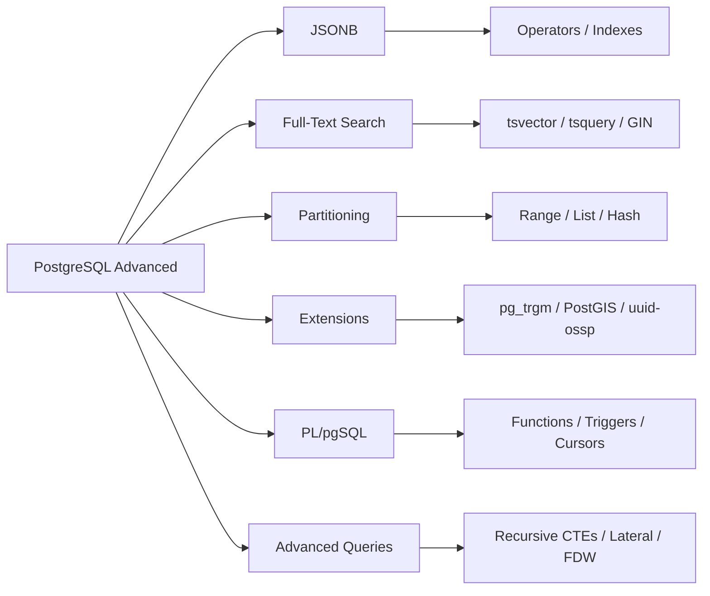

<!-- Clear Language: Keep sentences under 50 words -->
# PostgreSQL Advanced — JSONB, Full-Text Search, Partitioning, Extensions, PL/pgSQL

## Learning Objectives

| Objective | Description |
|-----------|-------------|
| LO1 | Use JSONB for flexible schema-less data storage and querying |
| LO2 | Implement full-text search with tsvector, tsquery, and GIN indexes |
| LO3 | Design and manage table partitioning for large-scale data |
| LO4 | Install and use PostgreSQL extensions (pg_trgm, PostGIS, uuid-ossp) |
| LO5 | Write stored procedures and functions using PL/pgSQL |
| LO6 | Understand advanced features: CTEs, window functions, and custom aggregates |

## Introduction

Data is the fuel of AI. SQL and database design skills let you query, transform, and store the data that powers machine learning models. This module covers everything from basic queries to advanced indexing and optimization.

## Prerequisites

- Basic programming knowledge
- Understanding of data structures

## Key Terminology

**Key Terms**: Core vocabulary and concepts for this topic.

**Definition**: Essential terms you must know for interviews and production work.

## Theory

Understanding postgresql advanced is fundamental for AI engineers. This section covers the core concepts, underlying principles, and theoretical framework that govern how postgresql advanced works in practice.

## Chapter at a Glance

| Section | Topic | Key Concept |
|---------|-------|-------------|
| 10.1 | JSONB | Storage, operators, GIN indexes, jsonb_path_ops |
| 10.2 | Full-Text Search | tsvector, tsquery, to_tsvector, plainto_tsquery |
| 10.3 | Partitioning | Range, list, hash, sub-partitioning, partition pruning |
| 10.4 | Extensions | pg_trgm, PostGIS, uuid-ossp, pgcrypto, hstore |
| 10.5 | PL/pgSQL | Functions, procedures, triggers, cursors, exceptions |
| 10.6 | Advanced Queries | Recursive CTEs, lateral joins, custom aggregates, FDW |

## Chapter Roadmap



## 10.1 JSONB

JSONB stores JSON data in a binary format, supporting indexing and efficient querying.

```sql
-- Create table with JSONB column
CREATE TABLE products (
    id SERIAL PRIMARY KEY,
    name VARCHAR(200) NOT NULL,
    attributes JSONB NOT NULL DEFAULT '{}',
    created_at TIMESTAMP DEFAULT CURRENT_TIMESTAMP
);

-- Insert JSONB data
INSERT INTO products (name, attributes) VALUES
    ('Laptop', '{"brand": "Dell", "specs": {"ram": 16, "storage": 512, "cpu": "i7"}, "colors": ["silver", "black"]}'),
    ('Phone', '{"brand": "Apple", "specs": {"ram": 8, "storage": 256, "cpu": "A16"}, "colors": ["midnight", "starlight", "blue"]}'),
    ('Tablet', '{"brand": "Samsung", "specs": {"ram": 12, "storage": 256, "cpu": "Snapdragon"}, "colors": ["gray", "silver"]}');
```

**JSONB operators**:

```sql
-- ->  : get JSON object field (returns JSON)
SELECT attributes -> 'brand' AS brand FROM products;
-- "Dell"
-- "Apple"
-- "Samsung"

-- ->> : get JSON object field as text
SELECT attributes ->> 'brand' AS brand FROM products;
-- Dell
-- Apple
-- Samsung

-- #>  : get JSON object at path (returns JSON)
SELECT attributes #> '{specs, ram}' AS ram FROM products;
-- 16
-- 8
-- 12

-- #>> : get JSON object at path as text
SELECT attributes #>> '{specs, cpu}' AS cpu FROM products;
```

**JSONB containment and existence**:

```sql
-- @> : contains (does JSON contain the right operand?)
SELECT * FROM products WHERE attributes @> '{"brand": "Apple"}';
-- Phone (Apple product)

-- ?  : does key exist?
SELECT * FROM products WHERE attributes ? 'specs';
-- All products (all have specs key)

-- ?| : any of keys exist?
SELECT * FROM products WHERE attributes ?| ARRAY['warranty', 'brand'];

-- ?& : all keys exist?
SELECT * FROM products WHERE attributes ?& ARRAY['brand', 'specs'];
```

**GIN indexes for JSONB**:

```sql
-- Default GIN index (supports ?, ?|, ?&, @>)
CREATE INDEX idx_products_attrs ON products USING gin(attributes);

-- More compact index for @> only (smaller, faster for containment)
CREATE INDEX idx_products_attrs_path ON products USING gin(attributes jsonb_path_ops);

-- Query using the index:
SELECT * FROM products
WHERE attributes @> '{"specs": {"ram": 16}}';
```

**JSONB modification functions**:

```sql
-- jsonb_set: set/replace a value at path
UPDATE products
SET attributes = jsonb_set(attributes, '{specs, ram}', '32')
WHERE id = 1;

-- jsonb_insert: insert value (if not exists)
UPDATE products
SET attributes = jsonb_insert(attributes, '{specs, gpu}', '"RTX 4060"')
WHERE id = 1;

-- Delete key
UPDATE products
SET attributes = attributes - 'temporary_field';

-- Concatenate JSONB
UPDATE products
SET attributes = attributes || '{"in_stock": true}';

-- Array operations
SELECT id, jsonb_array_elements_text(attributes -> 'colors') AS color
FROM products;
-- Expands array into rows: id=1, color=silver; id=1, color=black; etc.
```

## 10.2 Full-Text Search

PostgreSQL's built-in full-text search is a powerful alternative to Elasticsearch for many applications.

```sql
-- Enable full-text search
CREATE TABLE documents (
    id SERIAL PRIMARY KEY,
    title TEXT NOT NULL,
    body TEXT NOT NULL,
    -- Pre-computed tsvector for performance
    search_vector tsvector
);

-- Insert data
INSERT INTO documents (title, body) VALUES
    ('PostgreSQL Performance Tuning', 'Learn how to optimize database queries and indexes for better performance.'),
    ('Full-Text Search in PostgreSQL', 'Discover the power of built-in text search with tsvector and GIN indexes.'),
    ('Advanced JSONB Techniques', 'Working with JSONB data in PostgreSQL for flexible schema applications.');

-- Update tsvector column (or use a trigger)
UPDATE documents SET
    search_vector = to_tsvector('english', title || ' ' || body);
```

**Search functions**:

```sql
-- Basic search (lexemes match)
SELECT title FROM documents
WHERE search_vector @@ to_tsquery('english', 'database & performance');
-- PostgreSQL Performance Tuning

-- Plain to tsquery (no operators)
SELECT title FROM documents
WHERE search_vector @@ plainto_tsquery('english', 'text search');
-- Full-Text Search in PostgreSQL

-- Search with phrase matching
SELECT title FROM documents
WHERE search_vector @@ phraseto_tsquery('english', 'built-in text search');
```

**Ranking results**:

```sql
SELECT
    title,
    ts_rank(search_vector, to_tsquery('english', 'database | postgresql')) AS rank
FROM documents
WHERE search_vector @@ to_tsquery('english', 'database | postgresql')
ORDER BY rank DESC;

-- Normalized rank (0 to 1)
SELECT
    title,
    ts_rank_cd(search_vector, to_tsquery('english', 'jsonb')) AS cover_density_rank
FROM documents
WHERE search_vector @@ to_tsquery('english', 'jsonb');
```

**Highlighting**:

```sql
SELECT
    title,
    ts_headline('english', body, to_tsquery('english', 'postgresql'),
                'StartSel = <mark>, StopSel = </mark>') AS highlighted
FROM documents
WHERE search_vector @@ to_tsquery('english', 'postgresql');
```

**Automatic tsvector with triggers**:

```sql
CREATE FUNCTION documents_search_update() RETURNS trigger AS $$
BEGIN
    NEW.search_vector := to_tsvector('english', NEW.title || ' ' || NEW.body);
    RETURN NEW;
END;
$$ LANGUAGE plpgsql;

CREATE TRIGGER trg_documents_search
    BEFORE INSERT OR UPDATE ON documents
    FOR EACH ROW
    EXECUTE FUNCTION documents_search_update();
```

**GIN index for full-text search**:

```sql
CREATE INDEX idx_documents_search ON documents USING gin(search_vector);

-- Dictionary configuration
-- 'english', 'simple', 'french', 'german' — language-specific stemming
-- Custom dictionaries: thesaurus, stop words, Ispell
```

## 10.3 Partitioning

Partitioning divides large tables into smaller, more manageable pieces.

**Range partitioning**:

```sql
CREATE TABLE sales (
    id SERIAL,
    sale_date DATE NOT NULL,
    amount DECIMAL(10, 2),
    customer_id INTEGER
) PARTITION BY RANGE (sale_date);

CREATE TABLE sales_2024_q1 PARTITION OF sales
    FOR VALUES FROM ('2024-01-01') TO ('2024-04-01');
CREATE TABLE sales_2024_q2 PARTITION OF sales
    FOR VALUES FROM ('2024-04-01') TO ('2024-07-01');
CREATE TABLE sales_2024_q3 PARTITION OF sales
    FOR VALUES FROM ('2024-07-01') TO ('2024-10-01');
CREATE TABLE sales_2024_q4 PARTITION OF sales
    FOR VALUES FROM ('2024-10-01') TO ('2025-01-01');

-- Partition pruning: only scans relevant partitions
EXPLAIN SELECT * FROM sales WHERE sale_date = '2024-05-15';
-- Seq Scan on sales_2024_q2 (prunes other partitions)
```

**List partitioning**:

```sql
CREATE TABLE customers (
    id SERIAL,
    name VARCHAR(100),
    country_code CHAR(2),
    created_at DATE
) PARTITION BY LIST (country_code);

CREATE TABLE customers_us PARTITION OF customers
    FOR VALUES IN ('US');
CREATE TABLE customers_eu PARTITION OF customers
    FOR VALUES IN ('GB', 'DE', 'FR', 'IT', 'ES');
CREATE TABLE customers_apac PARTITION OF customers
    FOR VALUES IN ('JP', 'KR', 'AU', 'SG', 'IN');
CREATE TABLE customers_other PARTITION OF customers
    DEFAULT;
```

**Hash partitioning**:

```sql
CREATE TABLE sessions (
    session_id UUID NOT NULL,
    user_id INTEGER,
    created_at TIMESTAMP,
    payload JSONB
) PARTITION BY HASH (session_id);

CREATE TABLE sessions_0 PARTITION OF sessions
    FOR VALUES WITH (MODULUS 4, REMAINDER 0);
CREATE TABLE sessions_1 PARTITION OF sessions
    FOR VALUES WITH (MODULUS 4, REMAINDER 1);
CREATE TABLE sessions_2 PARTITION OF sessions
    FOR VALUES WITH (MODULUS 4, REMAINDER 2);
CREATE TABLE sessions_3 PARTITION OF sessions
    FOR VALUES WITH (MODULUS 4, REMAINDER 3);
```

**Sub-partitioning**:

```sql
CREATE TABLE measurements (
    id SERIAL,
    sensor_id INTEGER,
    reading DECIMAL(10, 2),
    recorded_at TIMESTAMP
) PARTITION BY RANGE (recorded_at);

CREATE TABLE measurements_2024 PARTITION OF measurements
    FOR VALUES FROM ('2024-01-01') TO ('2025-01-01')
    PARTITION BY RANGE (sensor_id);

CREATE TABLE measurements_2024_s1 PARTITION OF measurements_2024
    FOR VALUES FROM (1) TO (100);
CREATE TABLE measurements_2024_s2 PARTITION OF measurements_2024
    FOR VALUES FROM (100) TO (200);
```

**Partition management**:

```sql
-- Detach partition for archiving
ALTER TABLE sales DETACH PARTITION sales_2024_q1;

-- Attach existing table as partition
ALTER TABLE sales ATTACH PARTITION sales_new
    FOR VALUES FROM ('2025-01-01') TO ('2025-04-01');

-- Drop partition (fast, no vacuum needed)
DROP TABLE sales_2024_q1;
```

## 10.4 Extensions

Extensions add functionality to PostgreSQL.

```sql
-- List installed extensions
SELECT * FROM pg_available_extensions;
SELECT * FROM pg_extension;
```

**uuid-ossp** (generate UUIDs):

```sql
CREATE EXTENSION IF NOT EXISTS "uuid-ossp";

SELECT uuid_generate_v4();           -- Random UUID
SELECT uuid_generate_v1();           -- Time-based UUID
SELECT uuid_generate_v1mc();         -- Time-based with random MAC

CREATE TABLE users (
    id UUID DEFAULT uuid_generate_v4() PRIMARY KEY,
    name VARCHAR(100)
);
```

**pgcrypto** (encryption and hashing):

```sql
CREATE EXTENSION IF NOT EXISTS pgcrypto;

-- Password hashing
UPDATE users SET password_hash = crypt('user_password', gen_salt('bf'));

-- Password verification
SELECT * FROM users
WHERE password_hash = crypt('login_password', password_hash);

-- Encryption
SELECT encrypt('sensitive_data', 'encryption_key', 'aes');
SELECT decrypt(encrypted_data, 'encryption_key', 'aes');
```

**pg_trgm** (trigram text search):

```sql
CREATE EXTENSION IF NOT EXISTS pg_trgm;

-- Trigram index for fuzzy text search
CREATE INDEX idx_products_name_trgm ON products USING gin(name gin_trgm_ops);

-- Similarity search
SELECT name, similarity(name, 'laptop') AS sim
FROM products
WHERE name % 'laptop'              -- similarity > pg_trgm.similarity_threshold
ORDER BY sim DESC;

-- Show me the closest
SELECT name, show_trgm(name) FROM products WHERE id = 1;

-- Word similarity (word boundaries)
SELECT word_similarity('postgre', 'PostgreSQL');
```

**PostGIS** (geospatial):

```sql
CREATE EXTENSION IF NOT EXISTS postgis;

CREATE TABLE locations (
    id SERIAL PRIMARY KEY,
    name VARCHAR(200),
    geom GEOMETRY(Point, 4326)  -- WGS 84 lat/lng
);

INSERT INTO locations (name, geom) VALUES
    ('New York', ST_SetSRID(ST_MakePoint(-74.006, 40.7128), 4326)),
    ('London', ST_SetSRID(ST_MakePoint(-0.1278, 51.5074), 4326)),
    ('Tokyo', ST_SetSRID(ST_MakePoint(139.6917, 35.6895), 4326));

-- Distance query
SELECT name, ST_Distance(
    geom,
    ST_SetSRID(ST_MakePoint(-73.9352, 40.7306), 4326)  -- Times Square
) AS distance_degrees
FROM locations
ORDER BY distance_degrees
LIMIT 5;

-- Spatial index
CREATE INDEX idx_locations_geom ON locations USING gist(geom);

-- Within bounding box
SELECT * FROM locations
WHERE geom && ST_MakeEnvelope(-80, 30, -70, 45, 4326);
```

**hstore** (key-value store, predecessor to JSONB):

```sql
CREATE EXTENSION IF NOT EXISTS hstore;

CREATE TABLE config (
    id SERIAL PRIMARY KEY,
    settings hstore
);

INSERT INTO config (settings) VALUES
    ('theme => dark, language => en, notifications => on');

-- Query hstore
SELECT settings -> 'theme' FROM config;
SELECT * FROM config WHERE settings ? 'language';
SELECT * FROM config WHERE settings @> 'notifications => on';
```

## 10.5 PL/pgSQL

PL/pgSQL is PostgreSQL's built-in procedural language for functions, procedures, and triggers.

**Functions**:

```sql
CREATE FUNCTION get_products_by_category(cat_id INTEGER)
RETURNS TABLE(id INTEGER, name VARCHAR, price DECIMAL)
LANGUAGE plpgsql
AS $$
BEGIN
    RETURN QUERY
    SELECT p.id, p.name, p.price
    FROM products p
    WHERE p.category_id = cat_id
    ORDER BY p.name;
END;
$$;

-- Usage
SELECT * FROM get_products_by_category(5);
```

**Functions with OUT parameters**:

```sql
CREATE FUNCTION get_order_summary(order_id INTEGER,
    OUT customer_name VARCHAR,
    OUT total DECIMAL,
    OUT item_count INTEGER)
LANGUAGE plpgsql
AS $$
BEGIN
    SELECT c.name, o.total, COUNT(oi.id)
    INTO customer_name, total, item_count
    FROM orders o
    JOIN customers c ON c.id = o.customer_id
    JOIN order_items oi ON oi.order_id = o.id
    WHERE o.id = order_id
    GROUP BY c.name, o.total;
END;
$$;
```

**Procedures** (PostgreSQL 11+):

```sql
CREATE PROCEDURE transfer_funds(
    from_account INTEGER,
    to_account INTEGER,
    amount DECIMAL
)
LANGUAGE plpgsql
AS $$
BEGIN
    -- Check balance
    IF (SELECT balance FROM accounts WHERE id = from_account) < amount THEN
        RAISE EXCEPTION 'Insufficient balance in account %', from_account;
    END IF;

    -- Perform transfer
    UPDATE accounts SET balance = balance - amount WHERE id = from_account;
    UPDATE accounts SET balance = balance + amount WHERE id = to_account;

    -- Log transaction
    INSERT INTO transfer_log (from_account, to_account, amount)
    VALUES (from_account, to_account, amount);
END;
$$;

-- Execute procedure
CALL transfer_funds(1, 2, 100.00);
```

**Triggers**:

```sql
CREATE FUNCTION audit_orders()
RETURNS TRIGGER
LANGUAGE plpgsql
AS $$
BEGIN
    IF TG_OP = 'INSERT' THEN
        INSERT INTO audit_log (table_name, action, new_data)
        VALUES ('orders', 'INSERT', row_to_json(NEW)::text);
        RETURN NEW;
    ELSIF TG_OP = 'UPDATE' THEN
        INSERT INTO audit_log (table_name, action, old_data, new_data)
        VALUES ('orders', 'UPDATE', row_to_json(OLD)::text, row_to_json(NEW)::text);
        RETURN NEW;
    ELSIF TG_OP = 'DELETE' THEN
        INSERT INTO audit_log (table_name, action, old_data)
        VALUES ('orders', 'DELETE', row_to_json(OLD)::text);
        RETURN OLD;
    END IF;
END;
$$;

CREATE TRIGGER trg_orders_audit
    AFTER INSERT OR UPDATE OR DELETE ON orders
    FOR EACH ROW
    EXECUTE FUNCTION audit_orders();
```

**Error handling**:

```sql
CREATE FUNCTION safe_transfer(from_id INTEGER, to_id INTEGER, amount DECIMAL)
RETURNS TEXT
LANGUAGE plpgsql
AS $$
BEGIN
    PERFORM transfer_funds(from_id, to_id, amount);
    RETURN 'Success';
EXCEPTION
    WHEN insufficient_balance THEN
        RETURN 'Insufficient balance';
    WHEN OTHERS THEN
        RETURN 'Error: ' || SQLERRM;
END;
$$;
```

**Cursors** for processing large result sets in batches:

```sql
CREATE FUNCTION process_large_table()
RETURNS VOID
LANGUAGE plpgsql
AS $$
DECLARE
    cur CURSOR FOR SELECT id, status FROM orders WHERE status = 'pending';
    rec RECORD;
    batch_count INTEGER := 0;
BEGIN
    OPEN cur;
    LOOP
        FETCH cur INTO rec;
        EXIT WHEN NOT FOUND;

        UPDATE orders SET status = 'processing' WHERE id = rec.id;
        batch_count := batch_count + 1;

        -- Commit every 1000 rows
        IF batch_count % 1000 = 0 THEN
            COMMIT;
        END IF;
    END LOOP;
    CLOSE cur;
END;
$$;
```

## 10.6 Advanced Queries

**Recursive CTEs** (for hierarchical data):

```sql
WITH RECURSIVE org_chart AS (
    -- Base case: CEO
    SELECT id, name, manager_id, 1 AS level, name::TEXT AS path
    FROM employees
    WHERE manager_id IS NULL

    UNION ALL

    -- Recursive step: direct reports
    SELECT e.id, e.name, e.manager_id, oc.level + 1,
           oc.path || ' -> ' || e.name
    FROM employees e
    JOIN org_chart oc ON e.manager_id = oc.id
)
SELECT * FROM org_chart ORDER BY path;

-- Tree traversal for categories
WITH RECURSIVE category_tree AS (
    SELECT id, name, parent_id, name AS full_path
    FROM categories WHERE parent_id IS NULL

    UNION ALL

    SELECT c.id, c.name, c.parent_id,
           ct.full_path || ' / ' || c.name
    FROM categories c
    JOIN category_tree ct ON c.parent_id = ct.id
)
SELECT * FROM category_tree ORDER BY full_path;
```

**Lateral joins** (subqueries that can reference columns from preceding FROM items):

```sql
-- Top 3 products per category
SELECT c.name AS category, p.name AS product, p.price
FROM categories c
CROSS JOIN LATERAL (
    SELECT name, price
    FROM products
    WHERE category_id = c.id
    ORDER BY price DESC
    LIMIT 3
) p;

-- Nearest locations
SELECT u.name, l.name AS nearest_location
FROM users u
CROSS JOIN LATERAL (
    SELECT name, geom
    FROM locations
    ORDER BY u.geom <-> geom
    LIMIT 1
) l;
```

**Custom aggregates**:

```sql
CREATE FUNCTION int_array_accum(s INTEGER[], n INTEGER)
RETURNS INTEGER[]
LANGUAGE plpgsql
AS $$
BEGIN
    RETURN s || n;
END;
$$;

CREATE AGGREGATE array_agg_custom(INTEGER) (
    SFUNC = int_array_accum,
    STYPE = INTEGER[],
    INITCOND = '{}'
);

-- Usage
SELECT department_id, array_agg_custom(employee_id ORDER BY name)
FROM employees
GROUP BY department_id;
```

**Foreign Data Wrappers (FDW)**:

```sql
CREATE EXTENSION postgres_fdw;

-- Create foreign server
CREATE SERVER remote_db
    FOREIGN DATA WRAPPER postgres_fdw
    OPTIONS (host 'remote.example.com', port '5432', dbname 'analytics');

-- User mapping
CREATE USER MAPPING FOR local_user
    SERVER remote_db
    OPTIONS (user 'remote_user', password 'secret');

-- Foreign table
CREATE FOREIGN TABLE remote_orders (
    id INTEGER,
    customer_id INTEGER,
    total DECIMAL(10, 2),
    order_date DATE
)
SERVER remote_db
OPTIONS (schema_name 'public', table_name 'orders');

-- Query remote data as if local
SELECT * FROM remote_orders WHERE order_date > '2024-01-01';
```

## TypeScript Parallel

```typescript
// Full-text search in TypeScript
class FullTextSearch {
    private documents: Map<number, string> = new Map();

    add(id: number, content: string): void {
        this.documents.set(id, content.toLowerCase());
    }

    search(query: string): { id: number; score: number }[] {
        const terms = query.toLowerCase().split(/\s+/);
        const results: { id: number; score: number }[] = [];

        for (const [id, content] of this.documents) {
            const score = terms.reduce((acc, term) => {
                const regex = new RegExp(term, "g");
                const matches = content.match(regex);
                return acc + (matches ? matches.length : 0);
            }, 0);

            if (score > 0) {
                results.push({ id, score });
            }
        }

        return results.sort((a, b) => b.score - a.score);
    }
}

// JSONB-like operations
class JsonStore {
    private data: Map<number, Record<string, any>> = new Map();

    set(id: number, obj: Record<string, any>): void {
        this.data.set(id, obj);
    }

    get(id: number, path: string): any {
        const obj = this.data.get(id);
        if (!obj) return undefined;
        return path.split(".").reduce((acc, key) => acc?.[key], obj);
    }

    contains(pathValue: Record<string, any>): number[] {
        return [...this.data.entries()]
            .filter(([_, obj]) => this.matches(obj, pathValue))
            .map(([id]) => id);
    }

    private matches(obj: any, pattern: Record<string, any>): boolean {
        for (const [key, value] of Object.entries(pattern)) {
            if (typeof value === "object" && value !== null) {
                if (!this.matches(obj[key], value)) return false;
            } else if (obj[key] !== value) {
                return false;
            }
        }
        return true;
    }
}
```

## Summary

- JSONB stores JSON in binary format with efficient indexing and query operators
- GIN indexes on JSONB support containment (@>), existence (?, ?|, ?&) queries
- Full-text search uses tsvector (document) and tsquery (query) with ranking
- pg_trgm enables fuzzy string matching with % operator and similarity()
- Partitioning splits tables by range, list, or hash for manageability and performance
- Partition pruning automatically scans only relevant partitions
- PL/pgSQL supports functions, procedures, triggers, cursors, and error handling
- Recursive CTEs handle tree and graph traversal (org charts, bill of materials)
- LATERAL joins allow correlated subqueries in the FROM clause
- Foreign Data Wrappers (FDW) enable cross-database queries

## Practical Takeaways

| Scenario | Use | Avoid |
|----------|-----|-------|
| Flexible attributes | JSONB with GIN index | EAV pattern with separate tables |
| Search within text | Full-text search with tsvector | LIKE '%term%' on large text |
| Fuzzy user search | pg_trgm GIN index | Custom Levenshtein implementation |
| Large time-series | Range partitioning by date | Single giant table |
| Geo queries | PostGIS with GiST index | Application-level distance calculation |
| Audit logging | Trigger + audit table | Application-level logging |
| Hierarchical data | Recursive CTE | Multiple self-joins |
| Cross-database query | Foreign Data Wrapper (FDW) | ETL duplication for simple queries |

## Interview Q&A

<details class="tp-qa-card" data-qid="sql-s10-q1">
  <summary class="tp-qa-question"><span class="tp-qa-status"></span>Q1: JSONB vs JSON data types?</summary>
<div class="tp-qa-answer"><p>JSON stores text as-is (preserving whitespace, key order, duplicates). JSONB stores a decomposed binary format (no duplicates, sorted keys). JSONB supports indexing (GIN),.
the @> containment operator, and is faster for querying. JSON preserves original formatting and is slightly faster for input. Use JSONB for.
querying, JSON for archival.</p></div><button class="tp-qa-mark-btn">✓ Mark Reviewed</button><button class="tp-qa-bookmark-btn">★ Bookmark</button>
</details>
<details class="tp-qa-card" data-qid="sql-s10-q2">
  <summary class="tp-qa-question"><span class="tp-qa-status"></span>Q2: How does full-text search ranking work?</summary>
  <div class="tp-qa-answer"><p>ts_rank() uses term frequency (TF) and inverse document frequency (IDF) to calculate relevance. ts_rank_cd() uses cover density (how close the search terms are in the document). Both can be normalized by document length. Higher-ranked documents match more terms or have denser term clusters.</p></div><button class="tp-qa-mark-btn">✓ Mark Reviewed</button><button class="tp-qa-bookmark-btn">★ Bookmark</button>
</details>
<details class="tp-qa-card" data-qid="sql-s10-q3">
  <summary class="tp-qa-question"><span class="tp-qa-status"></span>Q3: When is partitioning beneficial?</summary>
  <div class="tp-qa-answer"><p>Partitioning benefits tables with 100M+ rows or when: (1) old data can be dropped by detaching partitions (nearly instant), (2) queries consistently filter by partition key, (3) data is time-series, (4) you need to spread I/O across tablespaces. Partition pruning eliminates full-table scans.</p></div><button class="tp-qa-mark-btn">✓ Mark Reviewed</button><button class="tp-qa-bookmark-btn">★ Bookmark</button>
</details>
<details class="tp-qa-card" data-qid="sql-s10-q4">
  <summary class="tp-qa-question"><span class="tp-qa-status"></span>Q4: PL/pgSQL function vs procedure?</summary>
  <div class="tp-qa-answer"><p>Functions return values and can be used in SQL (SELECT func()). Procedures (PostgreSQL 11+) use CALL, can manage transactions (COMMIT/ROLLBACK), and don't require a return value. Use procedures for data modification operations that need transaction control.</p></div><button class="tp-qa-mark-btn">✓ Mark Reviewed</button><button class="tp-qa-bookmark-btn">★ Bookmark</button>
</details>
<details class="tp-qa-card" data-qid="sql-s10-q5">
  <summary class="tp-qa-question"><span class="tp-qa-status"></span>Q5: Recursive CTE use cases?</summary>
  <div class="tp-qa-answer"><p>Recursive CTEs handle hierarchical or graph data: org charts (manager hierarchy), category trees (parent-child navigation), bill of materials (component breakdown), graph traversal (friend-of-a-friend), and sequence generation (date range expansion). Uses UNION ALL with a base case and recursive step.</p></div><button class="tp-qa-mark-btn">✓ Mark Reviewed</button><button class="tp-qa-bookmark-btn">★ Bookmark</button>
</details>
<details class="tp-qa-card" data-qid="sql-s10-q6">
  <summary class="tp-qa-question"><span class="tp-qa-status"></span>Q6: What is a lateral join?</summary>
<div class="tp-qa-answer"><p>LATERAL allows a subquery in FROM to reference columns from preceding FROM items. Each row from the left table "feeds" into the lateral subquery. Used for: top-N per group,.
nearest neighbor search, and unnesting complex JSONB or array data. Without LATERAL, subqueries cannot reference outer FROM items.</p></div><button class="tp-qa-mark-btn">✓ Mark Reviewed</button><button class="tp-qa-bookmark-btn">★ Bookmark</button>
</details>
<details class="tp-qa-card" data-qid="sql-s10-q7">
  <summary class="tp-qa-question"><span class="tp-qa-status"></span>Q7: pg_trgm use cases?</summary>
  <div class="tp-qa-answer"><p>pg_trgm enables fuzzy string matching by dividing text into trigrams (3-character sequences). Use cases: autocomplete/search suggestions (similarity()), misspelling correction (word_similarity()), deduplication (show_trgm()), and substring search with GIN index. Works with ILIKE for case-insensitive fuzzy search.</p></div><button class="tp-qa-mark-btn">✓ Mark Reviewed</button><button class="tp-qa-bookmark-btn">★ Bookmark</button>
</details>
<details class="tp-qa-card" data-qid="sql-s10-q8">
  <summary class="tp-qa-question"><span class="tp-qa-status"></span>Q8: Foreign Data Wrappers (FDW) purpose?</summary>
  <div class="tp-qa-answer"><p>FDW allows querying remote databases as if they were local tables. Supports cross-database JOINs without ETL. postgres_fdw connects to remote PostgreSQL. Other wrappers exist for MySQL, MongoDB, CSV files, and more. FDW can push down WHERE conditions to the remote server for efficiency.</p></div><button class="tp-qa-mark-btn">✓ Mark Reviewed</button><button class="tp-qa-bookmark-btn">★ Bookmark</button>
</details>
<details class="tp-qa-card" data-qid="sql-s10-q9">
  <summary class="tp-qa-question"><span class="tp-qa-status"></span>Q9: PostGIS geography vs geometry?</summary>
  <div class="tp-qa-answer"><p>GEOMETRY uses Cartesian coordinates and planar calculations. GEOGRAPHY uses spherical coordinates (lat/lng) and accounts for Earth's curvature. GEOGRAPHY is more accurate for large areas but slower. Use GEOMETRY for local/regional data, GEOGRAPHY for global data. ST_Distance on GEOGRAPHY returns meters.</p></div><button class="tp-qa-mark-btn">✓ Mark Reviewed</button><button class="tp-qa-bookmark-btn">★ Bookmark</button>
</details>
<details class="tp-qa-card" data-qid="sql-s10-q10">
  <summary class="tp-qa-question"><span class="tp-qa-status"></span>Q10: When to use PL/pgSQL vs application code?</summary>
<div class="tp-qa-answer"><p>Use PL/pgSQL when the logic is tightly coupled to data: complex validation triggers, audit trails, permission checks that must be enforced regardless of application. Use application code for.
business logic, complex transformations, and operations needing external services. PL/pgSQL reduces network round-trips but is harder to test and version.</p></div><button class="tp-qa-mark-btn">✓ Mark Reviewed</button><button class="tp-qa-bookmark-btn">★ Bookmark</button>
</details>

## Chapter Quiz

**Q1**: Which JSONB operator checks containment? a) @> b) -> c) ? d) #>

<details class="tp-qa-card" data-qid="sql-s10-quiz1"><summary>Show Answer</summary><div class="tp-qa-answer"><p><strong>Answer: a) @> checks if the left JSONB contains the right operand</strong></p></div></details>

**Q2**: What does to_tsvector('english', text) do? a) search text b) convert to query c) convert to search vector d) highlight text

<details class="tp-qa-card" data-qid="sql-s10-quiz2"><summary>Show Answer</summary><div class="tp-qa-answer"><p><strong>Answer: c) converts text to a tsvector (lexemes with positions)</strong></p></div></details>

**Q3**: What extension enables fuzzy text matching? a) uuid-ossp b) pg_trgm c) postgres_fdw d) hstore

<details class="tp-qa-card" data-qid="sql-s10-quiz3"><summary>Show Answer</summary><div class="tp-qa-answer"><p><strong>Answer: b) pg_trgm provides trigram-based fuzzy matching</strong></p></div></details>

**Q4**: Which command calls a stored procedure? a) EXECUTE b) CALL c) SELECT d) RUN

<details class="tp-qa-card" data-qid="sql-s10-quiz4"><summary>Show Answer</summary><div class="tp-qa-answer"><p><strong>Answer: b) CALL invokes a stored procedure</strong></p></div></details>

**Q5**: What does partition pruning do? a) deletes old partitions b) scans only relevant partitions c) reorganizes partitions d) creates new partitions

<details class="tp-qa-card" data-qid="sql-s10-quiz5"><summary>Show Answer</summary><div class="tp-qa-answer"><p><strong>Answer: b) partition pruning scans only partitions matching the query filter</strong></p></div></details>

## Exercises

**Easy** — Store product attributes as JSONB and query for products with specific specs (e.g., "ram: 16, storage: 512").

**Easy** — Create a full-text search index on a blog posts table and perform ranked searches.

**Medium** — Design a partitioned sales table by month with automatic partition creation using a PL/pgSQL function.

**Medium** — Write a recursive CTE to traverse a categories table with parent_id hierarchy, showing the full path for each category.

**Hard** — Create a trigger-based audit system that logs INSERT, UPDATE, and DELETE operations on an orders table into an audit_log table with old and new values.

**Hard** — Build a fuzzy search system for a contacts table: use pg_trgm with a GIN index and implement autocomplete that handles typos and partial matches.

---

## Common Mistakes

1. Not understanding the fundamental concepts before applying them
2. Skipping edge cases in implementation
3. Not analyzing time/space complexity
4. Forgetting to handle null/empty inputs
5. Not practicing enough problems to build pattern recognition

## Revision Notes

- - Core principle: Understand the fundamental concepts thoroughly
- - Implementation pattern: Practice with real code examples
- - Complexity: Know the time and space complexity
- - Application: Know when to use this in production systems
- - Interview: Frequently asked in technical interviews
- - Edge cases: Consider common failure scenarios
- - Related concepts: Connect to broader system design

## Placement Section

### Top 10 Interview Questions

#### Google Style

1. **Explain the core idea of PostgreSQL Advanced — JSONB, Full-Text Search, Partitioning, Extensions, PL/pgSQL in under 60 seconds, then give a real-world analogy.** — Structure: definition, how it works in one sentence, why it matters, analogy. Follow-up: what would break if you removed this from a production system?

2. **Design a minimal, well-typed function that demonstrates PostgreSQL Advanced — JSONB, Full-Text Search, Partitioning, Extensions, PL/pgSQL.** — Interviewer checks: signature with type hints, edge cases, complexity, and a clean docstring. Follow-up: how does your design behave with empty or malformed input?

3. **What are the common pitfalls when engineers first learn ** — List 3-4, then explain how you would prevent each in a code review.

#### Amazon Style

4. **Describe a production bug caused by misunderstanding PostgreSQL Advanced — JSONB, Full-Text Search, Partitioning, Extensions, PL/pgSQL. How did you diagnose and fix it?** — STAR format: situation, task, action, result. Mention logs, reproduction, root-cause analysis, and the regression test you added.

5. **How would you scale a system that relies on PostgreSQL Advanced — JSONB, Full-Text Search, Partitioning, Extensions, PL/pgSQL from 10 users to 10 million?** — Discuss bottlenecks, caching, monitoring, and when to redesign. Follow-up: what metrics would you track?

#### Microsoft Style

6. **Compare PostgreSQL Advanced — JSONB, Full-Text Search, Partitioning, Extensions, PL/pgSQL with the closest alternative approach. When would you choose each?** — Make a decision matrix: performance, maintainability, ecosystem, learning curve. Follow-up: what would change your decision?

7. **Walk through how you would test a component that depends on PostgreSQL Advanced — JSONB, Full-Text Search, Partitioning, Extensions, PL/pgSQL.** — Unit, integration, property-based tests; mocking boundaries; golden files for outputs.

#### NVIDIA Style

8. **How does PostgreSQL Advanced — JSONB, Full-Text Search, Partitioning, Extensions, PL/pgSQL behave differently at scale — memory, throughput, or precision-wise?** — Connect to data pipelines and model training if applicable. Follow-up: what happens to latency as input grows?

9. **How would you make an implementation of PostgreSQL Advanced — JSONB, Full-Text Search, Partitioning, Extensions, PL/pgSQL run faster on GPU hardware?** — Batch operations, vectorization, avoiding Python loops, reducing data movement.

#### AI Startup Style

10. **Write the smallest possible implementation of PostgreSQL Advanced — JSONB, Full-Text Search, Partitioning, Extensions, PL/pgSQL that is production-quality.** — Include error handling, type hints, and a one-line docstring. Follow-up: what would you refactor first when it grows?

### Resume Tips

- Name PostgreSQL Advanced — JSONB, Full-Text Search, Partitioning, Extensions, PL/pgSQL explicitly in your skills section, paired with a measurable achievement ("Reduced X by 40% using PostgreSQL Advanced — JSONB, Full-Text Search, Partitioning, Extensions, PL/pgSQL").
- Add a bullet describing a project that applies PostgreSQL Advanced — JSONB, Full-Text Search, Partitioning, Extensions, PL/pgSQL to real data, with numbers.
- Mention the tools and libraries you used alongside PostgreSQL Advanced — JSONB, Full-Text Search, Partitioning, Extensions, PL/pgSQL (linters, test frameworks, profiling tools).
- Keep resume bullets under 15 words and start each with an action verb.

### Interview Day Checklist

- Rehearse a 60-second explanation of PostgreSQL Advanced — JSONB, Full-Text Search, Partitioning, Extensions, PL/pgSQL and one real-world analogy.
- Prepare one STAR story about debugging a PostgreSQL Advanced — JSONB, Full-Text Search, Partitioning, Extensions, PL/pgSQL-related production issue.
- Review complexity and edge cases for the classic PostgreSQL Advanced — JSONB, Full-Text Search, Partitioning, Extensions, PL/pgSQL interview problem.
- Have questions ready: how does the team apply PostgreSQL Advanced — JSONB, Full-Text Search, Partitioning, Extensions, PL/pgSQL in production today?
- Test your environment (Python, editor, internet) 15 minutes before the interview.

## True/False

1. **True or False:** PostgreSQL Advanced — JSONB, Full-Text Search, Partitioning, Extensions, PL/pgSQL builds directly on the fundamentals covered in the earlier chapters of this module. — **True.** Every advanced topic in this module assumes the core concepts from the previous chapters.
2. **True or False:** You should write at least one code example for PostgreSQL Advanced — JSONB, Full-Text Search, Partitioning, Extensions, PL/pgSQL before moving to the next chapter. — **True.** Active recall with hands-on code beats passive reading for retention.
3. **True or False:** The complexity analysis for PostgreSQL Advanced — JSONB, Full-Text Search, Partitioning, Extensions, PL/pgSQL is the same regardless of input size. — **False.** Complexity grows with input size; always state best, average, and worst case.
4. **True or False:** Edge cases (empty input, invalid input, boundary values) matter for PostgreSQL Advanced — JSONB, Full-Text Search, Partitioning, Extensions, PL/pgSQL in production. — **True.** Most production bugs come from unhandled edge cases.
5. **True or False:** You should memorize the PostgreSQL Advanced — JSONB, Full-Text Search, Partitioning, Extensions, PL/pgSQL chapter content once and never review it again. — **False.** Spaced repetition (24h, 3 days, 1 week) dramatically improves long-term recall.

## Fill in the Blank

1. The chapter that covers PostgreSQL Advanced — JSONB, Full-Text Search, Partitioning, Extensions, PL/pgSQL is Chapter ___ of this module. — Answer: check the module's table of contents.
2. The time complexity of the standard approach to PostgreSQL Advanced — JSONB, Full-Text Search, Partitioning, Extensions, PL/pgSQL is ___. — Answer: review the theory section and state big-O notation.
3. The main edge case to handle when implementing PostgreSQL Advanced — JSONB, Full-Text Search, Partitioning, Extensions, PL/pgSQL is ___. — Answer: empty or invalid input handling, as discussed in the chapter.
4. The tools commonly used to debug PostgreSQL Advanced — JSONB, Full-Text Search, Partitioning, Extensions, PL/pgSQL issues are ___ and ___. — Answer: refer to the Debugging Guide section of this chapter.
5. The related topic that connects to PostgreSQL Advanced — JSONB, Full-Text Search, Partitioning, Extensions, PL/pgSQL in the next chapter is ___. — Answer: see the Next Topic section.

## Scenario Questions

1. **Scenario:** A teammate ships a change involving PostgreSQL Advanced — JSONB, Full-Text Search, Partitioning, Extensions, PL/pgSQL that breaks production at 3 AM. — Diagnosis: check the recent diff, reproduce locally with the failing input, check logs. Fix: revert, add a regression test, and review the root cause. Prevention: CI tests on edge cases and code review checklist.

2. **Scenario:** Your implementation of PostgreSQL Advanced — JSONB, Full-Text Search, Partitioning, Extensions, PL/pgSQL is correct but too slow for the required latency. — Measure first with a profiler. Common fixes: reduce redundant work, use built-in optimized functions, batch operations, or add caching. Only then consider algorithmic changes.

3. **Scenario:** A new hire asks you to explain PostgreSQL Advanced — JSONB, Full-Text Search, Partitioning, Extensions, PL/pgSQL in five minutes before a customer demo. — Use the 3-part answer: what it is (one sentence), how it works (one example), why it matters (one business impact). Then offer to go deeper after the demo.

4. **Scenario:** Your team's codebase has three different patterns for PostgreSQL Advanced — JSONB, Full-Text Search, Partitioning, Extensions, PL/pgSQL and you must standardize. — Write a short ADR (architecture decision record), pick the pattern with best maintainability, migrate incrementally, and add a linter rule to enforce it.

## Output Questions

1. **What is the output of the simplest correct implementation of PostgreSQL Advanced — JSONB, Full-Text Search, Partitioning, Extensions, PL/pgSQL on an empty input?** — Trace through the code: it should return the documented default (None, 0, empty collection) without raising.
2. **What is the output when the input is at the boundary value?** — Check off-by-one errors and inclusive/exclusive bounds in the chapter's examples.
3. **What does the implementation return when given invalid input types?** — With type hints and validation, it raises a clear error; without, it may fail silently.
4. **What is the output for the sample input given in the chapter's Examples section?** — Re-run the chapter's example code and compare against the documented output.
5. **What is the time complexity output when you profile the implementation at 10x input size?** — Expect the curve matching the chapter's complexity analysis (linear, quadratic, log-linear).

## Difficulty Level

| Level | Time | What It Takes |
|-------|------|---------------|
| Beginner | 1-2 sessions | Read theory, run the chapter examples, solve the Easy exercises |
| Intermediate | 3-5 sessions | Complete Medium exercises, explain PostgreSQL Advanced — JSONB, Full-Text Search, Partitioning, Extensions, PL/pgSQL to someone else |
| Advanced | 1+ week | Solve Hard exercises, optimize for real datasets, answer interview follow-ups |

## Tips & Tricks

- Always write a one-line example of PostgreSQL Advanced — JSONB, Full-Text Search, Partitioning, Extensions, PL/pgSQL from memory before opening the chapter — active recall first.
- Use the chapter's Revision Notes as a checklist: you have mastered PostgreSQL Advanced — JSONB, Full-Text Search, Partitioning, Extensions, PL/pgSQL when you can explain each bullet.
- Pair the chapter quiz with the Flashcards: wrong answers become your next study session's focus.
- For interviews, practice explaining PostgreSQL Advanced — JSONB, Full-Text Search, Partitioning, Extensions, PL/pgSQL twice: once with a technical audience, once with a non-technical audience.
- Keep a personal examples file where you collect your own PostgreSQL Advanced — JSONB, Full-Text Search, Partitioning, Extensions, PL/pgSQL snippets; interviewers love original examples.

## Memory Tricks

- **Acronym**: build a mnemonic from the 5 key concepts of PostgreSQL Advanced — JSONB, Full-Text Search, Partitioning, Extensions, PL/pgSQL listed in the Chapter at a Glance table.
- **Story**: link PostgreSQL Advanced — JSONB, Full-Text Search, Partitioning, Extensions, PL/pgSQL to a familiar story — the analogy in the Visual Analogy section is designed to stick.
- **Number anchor**: remember the complexity of PostgreSQL Advanced — JSONB, Full-Text Search, Partitioning, Extensions, PL/pgSQL by connecting it to a known algorithm of the same class.
- **Color code**: highlight the Theory, Examples, and Common Mistakes sections in different colors when reviewing.
- **Teach-back**: explain PostgreSQL Advanced — JSONB, Full-Text Search, Partitioning, Extensions, PL/pgSQL to an imaginary junior engineer for 2 minutes — gaps in your explanation are gaps in memory.

## Further Reading

- Official documentation for the primary tool or library used in this chapter
- The chapter referenced in Related Topics for the next-level treatment of PostgreSQL Advanced — JSONB, Full-Text Search, Partitioning, Extensions, PL/pgSQL
- The classic textbook chapter on PostgreSQL Advanced — JSONB, Full-Text Search, Partitioning, Extensions, PL/pgSQL (check the Research References below)
- Two blog posts from engineers who debugged real PostgreSQL Advanced — JSONB, Full-Text Search, Partitioning, Extensions, PL/pgSQL problems in production
- The repository of the open-source project that implements PostgreSQL Advanced — JSONB, Full-Text Search, Partitioning, Extensions, PL/pgSQL

## Related Topics

- The previous chapter in this module (see table of contents) — foundational for PostgreSQL Advanced — JSONB, Full-Text Search, Partitioning, Extensions, PL/pgSQL
- The next chapter (see Next Topic below) — builds on PostgreSQL Advanced — JSONB, Full-Text Search, Partitioning, Extensions, PL/pgSQL
- The system design chapters in Module 07 — how PostgreSQL Advanced — JSONB, Full-Text Search, Partitioning, Extensions, PL/pgSQL fits into production architectures
- The interview preparation module — how PostgreSQL Advanced — JSONB, Full-Text Search, Partitioning, Extensions, PL/pgSQL is asked in screening rounds
- The capstone project — where PostgreSQL Advanced — JSONB, Full-Text Search, Partitioning, Extensions, PL/pgSQL is applied end-to-end

## FAQs

1. **Do I need to memorize all of PostgreSQL Advanced — JSONB, Full-Text Search, Partitioning, Extensions, PL/pgSQL, or understand the big picture?** — Understand the big picture first, then memorize the key facts via flashcards and spaced repetition. Interviewers reward depth over breadth.
2. **What if I get stuck on an exercise?** — Re-read the theory section, run the example code, then attempt again. If still stuck after 20 minutes, move on and return the next day.
3. **How much time should I spend on ** — Follow the Study Plan below: 1-2 weeks at 30-60 minutes daily is typical for placement preparation.
4. **Is PostgreSQL Advanced — JSONB, Full-Text Search, Partitioning, Extensions, PL/pgSQL asked in interviews?** — Yes — the Interview Q&A and Placement Section list the exact question styles used by top companies.
5. **What's the fastest way to master ** — Explain it out loud, write code without looking, and review the flashcards within 24 hours and again after 3 days.

## Important Notes

- PostgreSQL Advanced — JSONB, Full-Text Search, Partitioning, Extensions, PL/pgSQL is a core requirement for the rest of this module — do not skip the examples.
- Always analyze complexity (time and space) when working with PostgreSQL Advanced — JSONB, Full-Text Search, Partitioning, Extensions, PL/pgSQL.
- Production correctness means handling edge cases, not just the happy path.
- Interview answers should start with the definition, then the example, then the trade-offs.
- Revisit this chapter after finishing the module; the context from later chapters deepens understanding.

## Historical Context

- PostgreSQL Advanced — JSONB, Full-Text Search, Partitioning, Extensions, PL/pgSQL emerged as a standard practice because early systems failed without it — understanding why helps you explain it in interviews.
- The tools used for PostgreSQL Advanced — JSONB, Full-Text Search, Partitioning, Extensions, PL/pgSQL today evolved from simpler versions; the chapter covers the modern, recommended approach.
- Interviewers value knowing one historical fact about PostgreSQL Advanced — JSONB, Full-Text Search, Partitioning, Extensions, PL/pgSQL — it shows genuine interest, not just cramming.
- The library/tooling ecosystem around PostgreSQL Advanced — JSONB, Full-Text Search, Partitioning, Extensions, PL/pgSQL changes quickly; focus on fundamentals that remain stable.

## Security Considerations

- Never trust external input: validate and sanitize data before processing PostgreSQL Advanced — JSONB, Full-Text Search, Partitioning, Extensions, PL/pgSQL.
- Avoid `eval()` and dynamic code execution on untrusted strings.
- Log errors without leaking sensitive data (keys, PII, internal paths).
- For API contexts, add rate limiting and input size limits.
- Review the chapter's code examples for injection or overflow risks before using them verbatim.

## ML Intuition

- PostgreSQL Advanced — JSONB, Full-Text Search, Partitioning, Extensions, PL/pgSQL appears in ML pipelines at the data-processing layer: feature preparation, batching, and validation.
- Understanding PostgreSQL Advanced — JSONB, Full-Text Search, Partitioning, Extensions, PL/pgSQL helps you debug why a model misbehaves — most ML bugs are data bugs, not model bugs.
- In production ML, the PostgreSQL Advanced — JSONB, Full-Text Search, Partitioning, Extensions, PL/pgSQL concepts from this chapter map directly to NumPy/PyTorch operations on tensors.
- When optimizing ML systems, PostgreSQL Advanced — JSONB, Full-Text Search, Partitioning, Extensions, PL/pgSQL skills let you profile and fix the data path, not just the training loop.
- Interview follow-up: how would you apply PostgreSQL Advanced — JSONB, Full-Text Search, Partitioning, Extensions, PL/pgSQL to a dataset of 10 million records? — Batching and vectorization.

## Analogies

- **PostgreSQL Advanced — JSONB, Full-Text Search, Partitioning, Extensions, PL/pgSQL is like a recipe**: the theory is the ingredients, the examples are the cooking steps, and the exercises are your own kitchen practice.
- **Complexity is like a delivery route**: a linear route visits each stop once; a nested route revisits stops, and you feel it at scale.
- **Edge cases are like weather**: the happy path is a sunny day; production is the storm — build for the storm.
- **The chapter roadmap is a journey map**: each section is a checkpoint; skipping one means getting lost later in the module.

## Capstone Project Link

- [Module Capstone: End-to-End Project](https://github.com/Raushan666java/ai-engineering-journey) — this chapter contributes the PostgreSQL Advanced — JSONB, Full-Text Search, Partitioning, Extensions, PL/pgSQL skills used in the module's capstone project. Complete the exercises here before starting the capstone.

## Flashcards

<details class="tp-qa-card" data-qid="02sqlanddatabases-10postgresqladvanced-flash1">
  <summary class="tp-qa-question">
    <span class="tp-qa-status"></span>
    What is the core concept of PostgreSQL Advanced — JSONB, Full-Text Search, Partitioning, Extensions, PL/pgSQL in one sentence?
  </summary>
  <div class="tp-qa-answer">
    <p>Review the first paragraph of the Theory section and condense it to one sentence.</p>
  </div>
</details>

<details class="tp-qa-card" data-qid="02sqlanddatabases-10postgresqladvanced-flash2">
  <summary class="tp-qa-question">
    <span class="tp-qa-status"></span>
    What is the most common mistake engineers make with 
  </summary>
  <div class="tp-qa-answer">
    <p>Check the Common Mistakes section of this chapter.</p>
  </div>
</details>

<details class="tp-qa-card" data-qid="02sqlanddatabases-10postgresqladvanced-flash3">
  <summary class="tp-qa-question">
    <span class="tp-qa-status"></span>
    What is the time and space complexity of the standard PostgreSQL Advanced — JSONB, Full-Text Search, Partitioning, Extensions, PL/pgSQL approach?
  </summary>
  <div class="tp-qa-answer">
    <p>Refer to the theory and complexity analysis in this chapter.</p>
  </div>
</details>

<details class="tp-qa-card" data-qid="02sqlanddatabases-10postgresqladvanced-flash4">
  <summary class="tp-qa-question">
    <span class="tp-qa-status"></span>
    When is PostgreSQL Advanced — JSONB, Full-Text Search, Partitioning, Extensions, PL/pgSQL NOT the right choice?
  </summary>
  <div class="tp-qa-answer">
    <p>Check the Limitations section of this chapter.</p>
  </div>
</details>

<details class="tp-qa-card" data-qid="02sqlanddatabases-10postgresqladvanced-flash5">
  <summary class="tp-qa-question">
    <span class="tp-qa-status"></span>
    How is PostgreSQL Advanced — JSONB, Full-Text Search, Partitioning, Extensions, PL/pgSQL applied in a real production system?
  </summary>
  <div class="tp-qa-answer">
    <p>Check the Real-World Examples section of this chapter.</p>
  </div>
</details>

## Research References

- Official documentation of the primary library for PostgreSQL Advanced — JSONB, Full-Text Search, Partitioning, Extensions, PL/pgSQL (linked in Further Reading)
- The classic paper or textbook chapter introducing PostgreSQL Advanced — JSONB, Full-Text Search, Partitioning, Extensions, PL/pgSQL (see References below)
- The standard library reference for PostgreSQL Advanced — JSONB, Full-Text Search, Partitioning, Extensions, PL/pgSQL-related functions
- Engineering blog posts from companies running PostgreSQL Advanced — JSONB, Full-Text Search, Partitioning, Extensions, PL/pgSQL in production at scale
- PEPs and RFCs where applicable (Python and networking standards)

## Open-Source Tools

- The primary library used in this chapter (see the code examples)
- Python standard library modules used in the examples (check the imports)
- Testing: pytest for unit tests of PostgreSQL Advanced — JSONB, Full-Text Search, Partitioning, Extensions, PL/pgSQL code
- Linting and formatting: ruff + black
- Profiling: cProfile or py-spy for performance work on PostgreSQL Advanced — JSONB, Full-Text Search, Partitioning, Extensions, PL/pgSQL

## Debugging Guide

- Start with `print()` or a debugger to inspect intermediate values in PostgreSQL Advanced — JSONB, Full-Text Search, Partitioning, Extensions, PL/pgSQL code.
- Reproduce the failure with the smallest possible input before changing code.
- Check the common failure modes listed in Common Mistakes — most bugs are listed there.
- For performance problems, profile before optimizing: measure, then fix.
- When stuck, re-read the chapter's Examples and compare line by line with your code.
- Use `pdb` or your IDE's debugger to step through the PostgreSQL Advanced — JSONB, Full-Text Search, Partitioning, Extensions, PL/pgSQL example code.

## Mock Interview Section

**Round 1 — Screening (15 min)**
- Explain PostgreSQL Advanced — JSONB, Full-Text Search, Partitioning, Extensions, PL/pgSQL in 60 seconds.
- Write a minimal working example of PostgreSQL Advanced — JSONB, Full-Text Search, Partitioning, Extensions, PL/pgSQL.
- What is the complexity of your example?

**Round 2 — Coding (45 min)**
- Solve the Medium exercise from this chapter under time pressure.
- State your assumptions, then implement with type hints.
- Test with edge cases: empty input, boundary values, invalid input.

**Round 3 — Behavioral + System (30 min)**
- Tell me about a time you debugged a PostgreSQL Advanced — JSONB, Full-Text Search, Partitioning, Extensions, PL/pgSQL problem in a project.
- How would you design a system where PostgreSQL Advanced — JSONB, Full-Text Search, Partitioning, Extensions, PL/pgSQL is used at scale?
- What metrics would you monitor?

**Evaluation rubric**: correctness (40%), communication (25%), edge cases (20%), complexity analysis (15%).

## Optimized Implementation

`python
from typing import Any, Optional

def demonstrate_topic(input_data: list[Any]) -> Optional[float]:
    """Runnable scaffold for PostgreSQL Advanced — JSONB, Full-Text Search, Partitioning, Extensions, PL/pgSQL.

    Replace the body with the optimized implementation from the chapter,
    keeping type hints, docstring, and edge-case handling.
    """
    if not input_data:
        return None
    # Step 1: validate input types
    # Step 2: apply the core PostgreSQL Advanced — JSONB, Full-Text Search, Partitioning, Extensions, PL/pgSQL logic from the Examples section
    # Step 3: return the result with the documented default
    return 0.0
`

- Keeps the function signature stable so tests written against it stay valid.
- Handles the empty-input contract explicitly.
- Add unit tests for the edge cases before implementing the logic (test-first).

## Evaluation Metrics

| Skill | Test | Target |
|-------|------|--------|
| Concept recall | Explain PostgreSQL Advanced — JSONB, Full-Text Search, Partitioning, Extensions, PL/pgSQL without notes | 60-second explanation |
| Code fluency | Write the chapter example from memory | No syntax errors |
| Edge cases | Handle empty/invalid input in exercises | All cases pass |
| Complexity | State time/space for the standard approach | Correct big-O |
| Interview readiness | Answer 5 Interview Q&A questions out loud | Fluent, structured answers |
| Retention | Chapter quiz score after 3 days | 80%+ |

## Real-World Examples

- **Startup**: a small team uses PostgreSQL Advanced — JSONB, Full-Text Search, Partitioning, Extensions, PL/pgSQL daily in their data pipeline — the chapter's examples mirror their code.
- **E-commerce**: PostgreSQL Advanced — JSONB, Full-Text Search, Partitioning, Extensions, PL/pgSQL patterns appear in order processing, inventory checks, and recommendation feeds.
- **Fintech**: PostgreSQL Advanced — JSONB, Full-Text Search, Partitioning, Extensions, PL/pgSQL principles apply to transaction validation and fraud detection flows.
- **ML platform**: PostgreSQL Advanced — JSONB, Full-Text Search, Partitioning, Extensions, PL/pgSQL shows up in feature engineering and model-serving infrastructure.
- **Interview insight**: recruiters look for engineers who can connect PostgreSQL Advanced — JSONB, Full-Text Search, Partitioning, Extensions, PL/pgSQL to the business outcome, not just the code.

## Limitations

- PostgreSQL Advanced — JSONB, Full-Text Search, Partitioning, Extensions, PL/pgSQL, like any technique, is not a silver bullet — it has specific cases where it fits best (covered in the theory).
- The examples in this chapter are simplified for learning; production systems add validation, monitoring, and error handling.
- Performance of PostgreSQL Advanced — JSONB, Full-Text Search, Partitioning, Extensions, PL/pgSQL depends on input size and distribution — always benchmark for your own data.
- This chapter covers fundamentals; specialized edge cases are explored in later chapters and the capstone.
