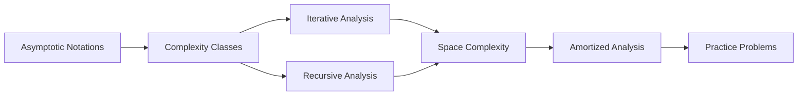
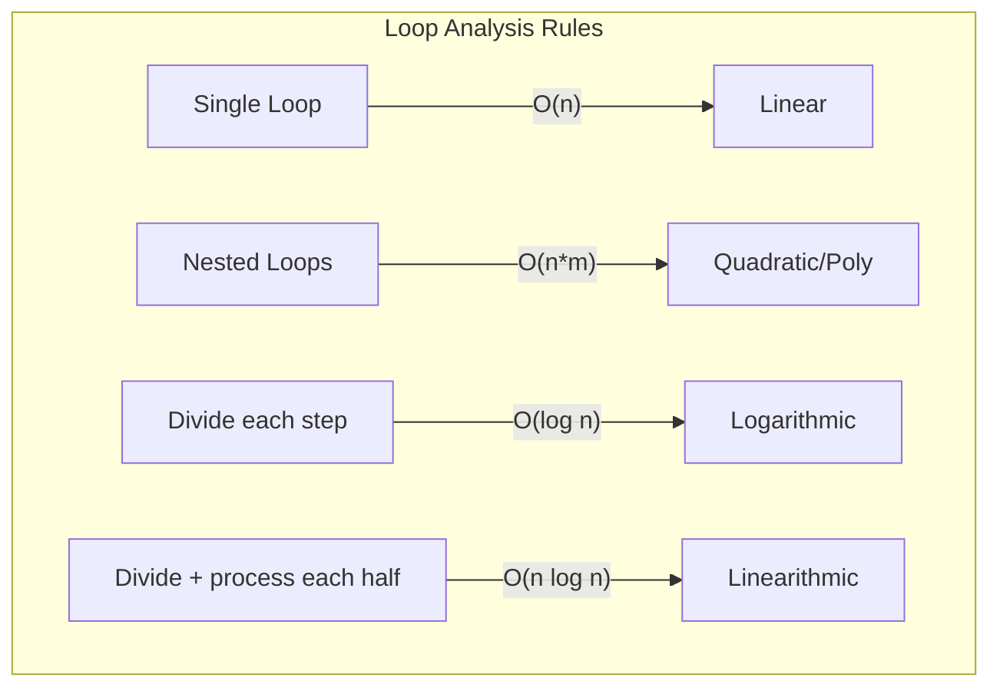
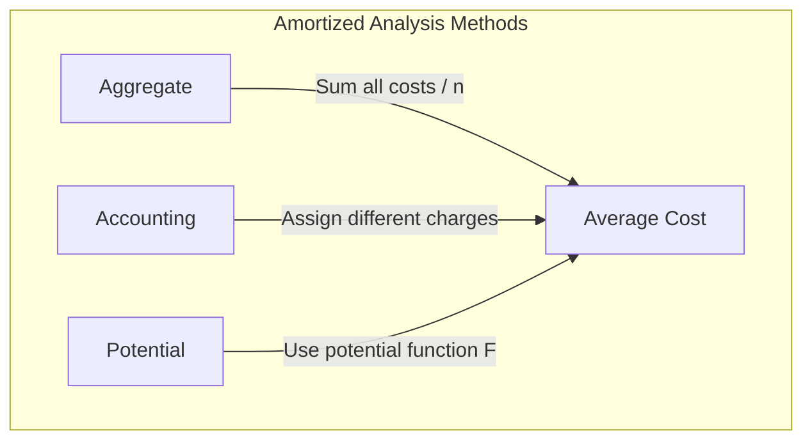

<!-- Clear Language: Keep sentences under 50 words -->
# Time and Space Complexity

## Learning Objectives

| Objective | Description |
|-----------|-------------|
| LO1 | Understand Big-O, Big-Theta, and Big-Omega notations and their mathematical definitions |
| LO2 | Analyze time complexity of iterative and recursive algorithms |
| LO3 | Derive space complexity including auxiliary and input space |
| LO4 | Identify best, average, and worst-case scenarios for common algorithms |
| LO5 | Apply asymptotic analysis to compare algorithm efficiency |
| LO6 | Recognize common complexity classes: O(1), O(log n), O(n), O(n log n), O(n²), O(2ⁿ) |

## Chapter at a Glance

| Section | Topic | Key Concept |
|---------|-------|-------------|
| 1.1 | Asymptotic Notations | Big-O, Big-O, Big-T definitions |
| 1.2 | Complexity Classes | O(1), O(log n), O(n), O(n log n), O(n²), O(2ⁿ) |
| 1.3 | Analyzing Iterative Algorithms | Loop analysis, nested loops |
| 1.4 | Analyzing Recursive Algorithms | Recurrence relations, Master theorem |
| 1.5 | Space Complexity | Stack space, heap space, auxiliary space |
| 1.6 | Amortized Analysis | Aggregate method, accounting method |

## Chapter Roadmap



## Introduction

Understanding time and space complexity is the foundation of every technical interview and the first step toward building efficient AI systems. When an ML training loop takes 10 hours instead of 2,.
or a vector search query times out at scale, the root cause almost always traces back to algorithmic complexity. This chapter teaches you how to analyze any algorithm's performance before writing a single line of code,.
a skill that separates senior engineers from beginners.

## Prerequisites

- Basic understanding of Python or TypeScript loops, recursion, and functions
- Familiarity with arrays and basic data structures
- No prior algorithms course required — this is the starting point

## Key Terminology

**Key Terms**: Core vocabulary and concepts for this topic.

**Definition**: Essential terms you must know for interviews and production work.

## Theory

### 1.1 Asymptotic Notations

Asymptotic notations describe the limiting behavior of a function as the input size approaches infinity. They provide a mathematical framework for comparing algorithm efficiency independent of hardware and implementation details.

**Big-O (O)** — Upper bound: `f(n) = O(g(n))` if there exist positive constants `c` and `n₀` such that `0 ≤ f(n) ≤ c·g(n)` for all `n ≥ n₀`. This describes the worst-case scenario.

**Big-Omega (Ω)** — Lower bound: `f(n) = Ω(g(n))` if there exist positive constants `c` and `n₀` such that `0 ≤ c·g(n) ≤ f(n)` for all `n ≥ n₀`. This describes the best-case scenario.

**Big-Theta (Θ)** — Tight bound: `f(n) = Θ(g(n))` if there exist positive constants `c₁, c₂, n₀` such that `0 ≤ c₁·g(n) ≤ f(n) ≤ c₂·g(n)` for all `n ≥ n₀`. This describes the average-case scenario when both bounds match.

## Examples

```python

## Demonstrating growth rates
import time
import math

def measure_time(func, n):
    start = time.perf_counter()
    func(n)
    return time.perf_counter() - start

## O(1) — Constant
def constant(n):
    return n * (n + 1) // 2

## O(n) — Linear
def linear(n):
    total = 0
    for i in range(n):
        total += i
    return total

## O(n²) — Quadratic
def quadratic(n):
    total = 0
    for i in range(n):
        for j in range(n):
            total += 1
    return total

for n in [10, 100, 1000]:
    print(f"n={n}: O(1)={measure_time(constant, n):.6f}s, "
          f"O(n)={measure_time(linear, n):.6f}s")
```

**Growth rate hierarchy** (slowest to fastest):
- O(1) — Constant
- O(log n) — Logarithmic
- O(n) — Linear
- O(n log n) — Linearithmic
- O(n²) — Quadratic
- O(n³) — Cubic
- O(2ⁿ) — Exponential
- O(n!) — Factorial

---

## Overview

### 1.2 Complexity Classes

**O(1) — Constant Time**: Execution time does not depend on input size. Array access by index, hash table lookup, arithmetic operations.

```python
def get_first_element(arr):
    return arr[0]  # Always takes the same time

## Constant time operations
def swap(a, b):
    return b, a
```

**O(log n) — Logarithmic Time**: Input size halves each step. Binary search, balanced BST operations.

```python
def binary_search(arr, target):
    left, right = 0, len(arr) - 1
    while left <= right:
        mid = (left + right) // 2
        if arr[mid] == target:
            return mid
        elif arr[mid] < target:
            left = mid + 1
        else:
            right = mid - 1
    return -1
```

**O(n) — Linear Time**: Single pass through data. Linear search, array sum, finding max/min.

```python
def linear_search(arr, target):
    for i, val in enumerate(arr):
        if val == target:
            return i
    return -1
```

**O(n log n) — Linearithmic Time**: Efficient sorting algorithms. Merge sort, heap sort, divide-and-conquer.

```python
def merge_sort(arr):
    if len(arr) <= 1:
        return arr
    mid = len(arr) // 2
    left = merge_sort(arr[:mid])
    right = merge_sort(arr[mid:])
    return merge(left, right)

def merge(left, right):
    result = []
    i = j = 0
    while i < len(left) and j < len(right):
        if left[i] <= right[j]:
            result.append(left[i])
            i += 1
        else:
            result.append(right[j])
            j += 1
    result.extend(left[i:])
    result.extend(right[j:])
    return result
```

**O(n²) — Quadratic Time**: Nested iterations over data. Bubble sort, insertion sort, naive matrix multiplication.

```python
def bubble_sort(arr):
    n = len(arr)
    for i in range(n):
        for j in range(n - i - 1):
            if arr[j] > arr[j + 1]:
                arr[j], arr[j + 1] = arr[j + 1], arr[j]
    return arr
```

**O(2ⁿ) — Exponential Time**: Recursive without memoization. Naive Fibonacci, subset generation.

```python
def fibonacci_naive(n):
    if n <= 1:
        return n
    return fibonacci_naive(n - 1) + fibonacci_naive(n - 2)
```

| Complexity | n=10 | n=100 | n=1000 |
|------------|------|-------|--------|
| O(1) | 1 | 1 | 1 |
| O(log n) | ~3 | ~7 | ~10 |
| O(n) | 10 | 100 | 1000 |
| O(n log n) | ~33 | ~664 | ~9966 |
| O(n²) | 100 | 10000 | 10⁶ |
| O(2ⁿ) | 1024 | ~10³⁰ | ~10³⁰¹ |

---

## Overview

### 1.3 Analyzing Iterative Algorithms

**Single loop**: Multiply iterations by constant work inside.

```python
def sum_array(arr):
    total = 0          # O(1)
    for x in arr:      # n iterations
        total += x     # O(1) per iteration
    return total       # O(1) total: O(n)
```

**Nested loops**: Multiply iteration counts.

```python
def nested_sum(arr):
    total = 0
    for i in range(len(arr)):       # n iterations
        for j in range(len(arr)):   # n iterations per outer
            total += arr[i] + arr[j]  # O(1)
    return total  # Total: O(n²)
```

**Dependent nested loops**: Summation formula.

```python
def triangular_sum(arr):
    total = 0
    for i in range(len(arr)):       # n iterations
        for j in range(i, len(arr)): # n-i iterations
            total += arr[j]         # O(1)
    return total  # n + (n-1) + ... + 1 = n(n+1)/2 = O(n²)
```

**Loop with constant stride**: Only the number of iterations matters.

```python
def halving_loop(n):
    i = n
    count = 0
    while i > 0:
        count += 1
        i //= 2          # halves each step ? O(log n)
    return count
```

**Loop with varying increment**: Analyze how the counter changes.

```python
def varying_increment(n):
    i = 1
    count = 0
    while i < n:
        count += 1
        i *= 2           # doubles each step ? O(log n)
    return count
```



---

### 1.4 Analyzing Recursive Algorithms

Recursive algorithms are analyzed using recurrence relations. A recurrence expresses the total work in terms of work done on smaller inputs.

**Recurrence for binary search**: `T(n) = T(n/2) + O(1)`

```python
def binary_search_recursive(arr, target, left, right):
    if left > right:
        return -1
    mid = (left + right) // 2
    if arr[mid] == target:
        return mid
    elif arr[mid] < target:
        return binary_search_recursive(arr, target, mid + 1, right)
    else:
        return binary_search_recursive(arr, target, left, mid - 1)
```

**Recurrence for merge sort**: `T(n) = 2T(n/2) + O(n)`

**Recurrence for naive Fibonacci**: `T(n) = T(n-1) + T(n-2) + O(1) = O(2n)`

**Master Theorem**: For recurrences of form `T(n) = aT(n/b) + f(n)`:
- If `f(n) = O(n^{log_b(a) - e})`, then `T(n) = T(n^{log_b(a)})`
- If `f(n) = T(n^{log_b(a)})`, then `T(n) = T(n^{log_b(a)} log n)`
- If `f(n) = Ω(n^{log_b(a) + ε})` and `a·f(n/b) ≤ c·f(n)` for some `c < 1`, then `T(n) = Θ(f(n))`

```python

## Count recursive calls to understand complexity
call_count = 0

def count_calls_fib(n):
    global call_count
    call_count += 1
    if n <= 1:
        return n
    return count_calls_fib(n - 1) + count_calls_fib(n - 2)

## n=10 ? 177 calls

## n=20 ? 21891 calls

## n=30 ? 2692537 calls

## Demonstrates exponential growth
```

| Algorithm | Recurrence | Complexity |
|-----------|------------|------------|
| Binary Search | T(n) = T(n/2) + O(1) | O(log n) |
| Merge Sort | T(n) = 2T(n/2) + O(n) | O(n log n) |
| Quick Sort (avg) | T(n) = T(k) + T(n-k-1) + O(n) | O(n log n) |
| Fibonacci (naive) | T(n) = T(n-1) + T(n-2) + O(1) | O(2n) |
| Fibonacci (memoized) | T(n) = T(n-1) + O(1) | O(n) |

---

## Overview

### 1.5 Space Complexity

Space complexity measures total memory used by an algorithm: input space + auxiliary space + stack space.

```python

## O(1) space — constant extra memory
def sum_const_space(arr):
    total = 0           # single variable
    for x in arr:
        total += x
    return total
```

```python

## O(n) space — creating new array of size n
def double_array(arr):
    result = [0] * len(arr)   # O(n) space
    for i, val in enumerate(arr):
        result[i] = val * 2
    return result
```

```python

## O(n) stack space — recursion depth
def factorial_recursive(n):
    if n <= 1:
        return 1
    return n * factorial_recursive(n - 1)

## Call stack grows to n frames ? O(n) stack space
```

```python

## O(n²) space — 2D matrix
def create_matrix(n):
    matrix = [[0] * n for _ in range(n)]   # n * n elements
    return matrix
```

**Input space vs auxiliary space**:
- Input space: memory used by the input data (typically not counted in complexity analysis)
- Auxiliary space: extra memory used by the algorithm beyond input
- Stack space: memory used by recursive call frames

```python

## In-place algorithm — O(1) auxiliary space
def reverse_array_in_place(arr):
    left, right = 0, len(arr) - 1
    while left < right:
        arr[left], arr[right] = arr[right], arr[left]
        left += 1
        right -= 1
    # No extra array created

## Out-of-place — O(n) auxiliary space
def reverse_array_copy(arr):
    return arr[::-1]   # Creates new array
```

---

## Overview

### 1.6 Amortized Analysis

Amortized analysis averages the cost of expensive operations over a sequence. A single operation may be costly, but the average per operation is bounded.

**Dynamic array resizing**: When a dynamic array (Python list) grows beyond capacity, it allocates a new array (typically 2x size) and copies elements.

```python

## Simulating dynamic array resizing
class DynamicArray:
    def __init__(self):
        self.data = [None] * 1
        self.size = 0
        self.capacity = 1

    def append(self, value):
        if self.size == self.capacity:
            self._resize(2 * self.capacity)
        self.data[self.size] = value
        self.size += 1

    def _resize(self, new_cap):
        new_data = [None] * new_cap
        for i in range(self.size):
            new_data[i] = self.data[i]
        self.data = new_data
        self.capacity = new_cap
        print(f"Resized to {new_cap}")

## Analysis: n appends cost O(n) total, so O(1) amortized per append
```

**Aggregate method**: Sum the cost of all operations and divide by n.

```python

## Cost of n dynamic array appends

## Resize happens at capacities: 1, 2, 4, 8, ...

## Total copies = 1 + 2 + 4 + ... + n/2 + n = O(n)

## Amortized cost = O(n)/n = O(1)
```

**Potential method**: Define a potential function that captures the "debt" of the data structure.

**Accounting method**: Charge extra for cheap operations; use credits to pay for expensive ones.

```python

## Banker's view: charge 3 coins per append

## 1 coin pays for the immediate insert

## 2 coins saved for future resizing

## When resizing occurs, saved coins pay for copying
class AmortizedArray:
    def __init__(self):
        self.data = [None] * 1
        self.size = 0
        self.capacity = 1
        self.bank = 0

    def append_with_accounting(self, value):
        self.bank += 2  # charge 2 extra coins
        if self.size == self.capacity:
            self._resize(2 * self.capacity)
        self.data[self.size] = value
        self.size += 1
        self.bank -= 0 if self.size < self.capacity else self.size // 2

    def _resize(self, new_cap):
        self.bank -= self.size  # use saved coins
        new_data = [None] * new_cap
        for i in range(self.size):
            new_data[i] = self.data[i]
        self.data = new_data
        self.capacity = new_cap

dyn = DynamicArray()
for i in range(1000):
    dyn.append(i)
print(f"Final capacity: {dyn.capacity}, size: {dyn.size}")
```



---

## Visual Analogy

Think of algorithm complexity like **grocery shopping time**:

- **O(1) — Constant** = Grabbing milk from your fridge. Same time no matter how big your house is.
- **O(log n) — Logarithmic** = Finding a word in a dictionary. You open to the middle, eliminate half, repeat. Very fast even for huge dictionaries.
- **O(n) — Linear** = Checking every aisle in the grocery store for peanut butter. Twice the aisles = twice the time.
- **O(n log n) — Linearithmic** = Sorting your grocery list by aisle before shopping. The sorting takes a bit more than a single pass, but then shopping is efficient.
- **O(n²) — Quadratic** = Comparing every item in your cart with every other item to find duplicates. Ten items = 100 comparisons, a hundred items = 10,000 comparisons.
- **O(2ⁿ) — Exponential** = Trying every possible combination of items to pack in your bag. Adding one item doubles the time.

This helps because you can instantly estimate whether an algorithm will be fast enough for your data size. An O(n²) approach that works for 100 items will crawl for 1 million items — knowing this before you code saves hours of debugging.

## TypeScript Parallel

TypeScript implements similar complexity analysis. The same algorithms can be written with explicit type annotations:

```typescript
function binarySearch<T>(arr: T[], target: T): number {
    let left = 0, right = arr.length - 1;
    while (left <= right) {
        const mid = Math.floor((left + right) / 2);
        if (arr[mid] === target) return mid;
        if (arr[mid] < target) left = mid + 1;
        else right = mid - 1;
    }
    return -1;
} // O(log n)

function mergeSort<T>(arr: T[]): T[] {
    if (arr.length <= 1) return arr;
    const mid = Math.floor(arr.length / 2);
    const left = mergeSort(arr.slice(0, mid));
    const right = mergeSort(arr.slice(mid));
    return merge(left, right);
} // O(n log n)
```

---

## Summary

- Big-O provides an upper bound on algorithm growth rate; Big-O provides a lower bound; Big-T provides a tight bound
- Common complexity classes ranked: O(1) < O(log n) < O(n) < O(n log n) < O(n²) < O(2ⁿ) < O(n!)
- Single loops typically yield O(n); nested loops yield O(n²) or higher depending on depth
- Recursive algorithms are analyzed via recurrence relations and the Master Theorem
- Space complexity includes auxiliary space (extra memory) and stack space (recursion depth)
- In-place algorithms use O(1) auxiliary space; algorithms creating copies use O(n) or more
- Amortized analysis provides a realistic average cost across a sequence of operations
- Dynamic array append operations have O(1) amortized cost despite O(n) worst-case resizing
- The Master Theorem solves recurrences of form T(n) = aT(n/b) + f(n) for common cases
- Always consider both time and space complexity when choosing an algorithm for a given constraint

## Practical Takeaways

| Scenario | Do This | Avoid This |
|----------|---------|------------|
| Comparing two sorting algorithms | Compare using Big-O and test on actual data | Assuming lower Big-O always means faster for small n |
| Space-constrained environment | Prefer in-place algorithms with O(1) auxiliary space | Creating unnecessary copies of large arrays |
| Analyzing recursion | Write recurrence relation first | Guessing complexity without recurrence |
| Dynamic array usage | Trust amortized O(1) append | Pre-allocating size unless performance-critical |
| Interview preparation | State best, average, and worst-case separately | Only mentioning the best case |
| Optimizing nested loops | Look for opportunities to restructure | Adding more nested loops without analysis |

## Interview Q&A

<details class="tp-qa-card" data-qid="dsa01-q1">
  <summary class="tp-qa-question">
    <span class="tp-qa-status"></span>
    Q1: Explain the difference between Big-O, Big-Omega, and Big-Theta with examples.
  </summary>
  <div class="tp-qa-answer">
    <p><strong>Big-O (O)</strong> — Upper bound: Algorithm will not perform worse than this. Example: Linear search is O(n) because in worst case we check all n elements.</p>
    <p><strong>Big-Omega (Ω)</strong> — Lower bound: Algorithm will not perform better than this. Example: Linear search is Ω(1) because the target could be the first element.</p>
    <p><strong>Big-Theta (Θ)</strong> — Tight bound: When upper and lower bounds match. Example: Merge sort is Θ(n log n) because both best and worst cases are n log n.</p>
    <pre><code># Linear search example
def linear_search(arr, target):
    for i, val in enumerate(arr):
        if val == target:
            return i       # Ω(1) — best case
    return -1               # O(n) — worst case

## No T bound because best ? worst</code></pre>
    <p><strong>Interview insight</strong>: Use Big-O for worst-case guarantees; use Big-Theta only when best and worst cases match.</p>
  </div>
  <button class="tp-qa-mark-btn">? Mark Reviewed</button>
  <button class="tp-qa-bookmark-btn">?? Bookmark</button>
</details>

<details class="tp-qa-card" data-qid="dsa01-q2">
  <summary class="tp-qa-question">
    <span class="tp-qa-status"></span>
    Q2: How do you analyze the time complexity of a recursive algorithm?
  </summary>
  <div class="tp-qa-answer">
    <p>Recursive algorithms are analyzed using <strong>recurrence relations</strong>. Steps:</p>
    <ol>
      <li>Identify the base case complexity</li>
      <li>Identify the recursive case — how many subproblems (a), of what size (n/b)</li>
      <li>Identify the cost of combining results (f(n))</li>
      <li>Form recurrence: T(n) = aT(n/b) + f(n)</li>
      <li>Apply Master Theorem or solve via recurrence tree</li>
    </ol>
    <pre><code># Fibonacci recurrence: T(n) = T(n-1) + T(n-2) + O(1)

## This gives O(2ⁿ) — exponential

## Binary search recurrence: T(n) = T(n/2) + O(1)

## Using Master Theorem: a=1, b=2, f(n)=O(1)

## log_b(a) = 0, f(n) = Θ(n⁰) → T(n) = Θ(log n)

## Merge sort recurrence: T(n) = 2T(n/2) + O(n)

## Using Master Theorem: a=2, b=2, f(n)=O(n)

## log_b(a) = 1, f(n) = Θ(n¹) → T(n) = Θ(n log n)</code></pre>
  </div>
  <button class="tp-qa-mark-btn">? Mark Reviewed</button>
  <button class="tp-qa-bookmark-btn">?? Bookmark</button>
</details>

<details class="tp-qa-card" data-qid="dsa01-q3">
  <summary class="tp-qa-question">
    <span class="tp-qa-status"></span>
    Q3: What is the difference between time complexity and space complexity? Why do we analyze both?
  </summary>
  <div class="tp-qa-answer">
    <p><strong>Time complexity</strong> measures how runtime scales with input size. <strong>Space complexity</strong> measures how memory usage scales with input size.</p>
    <p>We analyze both because:</p>
    <ul>
      <li>You can trade space for time (memoization, caching)</li>
      <li>You can trade time for space (streaming algorithms, in-place operations)</li>
      <li>Different environments have different constraints (embedded systems care more about space)</li>
    </ul>
    <p><strong>Example trade-off</strong>: Fibonacci with memoization uses O(n) space but O(n) time vs naive O(2n) time with O(n) stack space.</p>
    <pre><code>def fib_memo(n, memo={}):
    if n in memo:
        return memo[n]
    if n &lt;= 1:
        return n
    memo[n] = fib_memo(n-1, memo) + fib_memo(n-2, memo)
    return memo[n]

## Time: O(n), Space: O(n)</code></pre>
  </div>
  <button class="tp-qa-mark-btn">? Mark Reviewed</button>
  <button class="tp-qa-bookmark-btn">?? Bookmark</button>
</details>

<details class="tp-qa-card" data-qid="dsa01-q4">
  <summary class="tp-qa-question">
    <span class="tp-qa-status"></span>
    Q4: Explain the Master Theorem and when it applies.
  </summary>
  <div class="tp-qa-answer">
    <p>The Master Theorem solves recurrences of the form <strong>T(n) = aT(n/b) + f(n)</strong> where:</p>
    <ul>
      <li>a ≥ 1 — number of subproblems</li>
      <li>b > 1 — factor by which input size shrinks</li>
      <li>f(n) — cost of dividing and combining</li>
    </ul>
    <p><strong>Three cases</strong>:</p>
    <ol>
      <li>If f(n) = O(n^{log_b(a) - e}) then T(n) = T(n^{log_b(a)})</li>
      <li>If f(n) = T(n^{log_b(a)} log^k n) then T(n) = T(n^{log_b(a)} log^{k+1} n)</li>
      <li>If f(n) = O(n^{log_b(a) + e}) and af(n/b) = cf(n) then T(n) = T(f(n))</li>
    </ol>
    <p><strong>Examples</strong>:</p>
    <ul>
      <li>Binary search: a=1, b=2, f(n)=1 ? T(n) = T(log n)</li>
      <li>Merge sort: a=2, b=2, f(n)=n ? T(n) = T(n log n)</li>
      <li>Strassen's matrix: a=7, b=2, f(n)=n² → T(n) = Θ(n^{log₂7})</li>
    </ul>
    <p>The theorem does NOT apply when f(n) is not a polynomial, or does not satisfy regularity condition.</p>
  </div>
  <button class="tp-qa-mark-btn">? Mark Reviewed</button>
  <button class="tp-qa-bookmark-btn">?? Bookmark</button>
</details>

<details class="tp-qa-card" data-qid="dsa01-q5">
  <summary class="tp-qa-question">
    <span class="tp-qa-status"></span>
    Q5: What is amortized analysis? Give an example.
  </summary>
  <div class="tp-qa-answer">
    <p>Amortized analysis computes the average cost of an operation over a sequence, even if individual operations are expensive. It gives a realistic bound for data structures where occasional expensive operations are balanced by many cheap ones.</p>
    <p><strong>Classic example</strong>: Dynamic array (Python list) append.</p>
    <ul>
      <li>Most appends: O(1) — just place element</li>
      <li>Occasional append: O(n) — resize and copy all elements</li>
      <li>Over n appends: O(n) total ? O(1) amortized per append</li>
    </ul>
    <p><strong>Three methods</strong>:</p>
    <ol>
      <li><strong>Aggregate</strong>: Sum total cost / n</li>
      <li><strong>Accounting</strong>: Overcharge cheap ops, use credits for expensive ones</li>
      <li><strong>Potential</strong>: Use potential function — high potential before expensive op</li>
    </ol>
    <p><strong>Other examples</strong>: Splay tree operations, union-find with path compression, binary counter increment.</p>
  </div>
  <button class="tp-qa-mark-btn">? Mark Reviewed</button>
  <button class="tp-qa-bookmark-btn">?? Bookmark</button>
</details>

<details class="tp-qa-card" data-qid="dsa01-q6">
  <summary class="tp-qa-question">
    <span class="tp-qa-status"></span>
    Q6: How do you determine if an algorithm is O(log n)?
  </summary>
  <div class="tp-qa-answer">
    <p>An algorithm is O(log n) when it <strong>reduces the problem size by a constant factor</strong> at each step, while doing constant work per step.</p>
    <p><strong>Patterns that indicate O(log n)</strong>:</p>
    <ul>
      <li>Divide by 2 each iteration: while loop with `i = i // 2` or `i = i * 2`</li>
      <li>Binary search style: eliminate half the input each step</li>
      <li>Balanced BST operations: height is O(log n)</li>
      <li>Divide and conquer where one subproblem dominates</li>
    </ul>
    <pre><code># O(log n) examples

## Binary search
while left &lt;= right:
    mid = (left + right) // 2
    # eliminate half

## Counting bits
def count_bits(n):
    count = 0
    while n:
        count += n & 1
        n &gt;&gt;= 1  # divide by 2
    return count

## Exponentiation by squaring
def power(x, n):
    if n == 0:
        return 1
    if n % 2 == 0:
        return power(x * x, n // 2)
    return x * power(x * x, n // 2)</code></pre>
    <p><strong>Key insight</strong>: If the problem is halved (or reduced by factor b) at each step, and each step is O(1), the total is O(log_b n) = O(log n).</p>
  </div>
  <button class="tp-qa-mark-btn">? Mark Reviewed</button>
  <button class="tp-qa-bookmark-btn">?? Bookmark</button>
</details>

<details class="tp-qa-card" data-qid="dsa01-q7">
  <summary class="tp-qa-question">
    <span class="tp-qa-status"></span>
    Q7: What is the complexity of accessing elements in different data structures?
  </summary>
  <div class="tp-qa-answer">
    <table>
      <tr><th>Data Structure</th><th>Access</th><th>Search</th><th>Insert</th><th>Delete</th></tr>
      <tr><td>Array</td><td>O(1)</td><td>O(n)</td><td>O(n)</td><td>O(n)</td></tr>
      <tr><td>Linked List</td><td>O(n)</td><td>O(n)</td><td>O(1)</td><td>O(1)</td></tr>
      <tr><td>Hash Table</td><td>N/A</td><td>O(1) avg</td><td>O(1) avg</td><td>O(1) avg</td></tr>
      <tr><td>BST (balanced)</td><td>O(log n)</td><td>O(log n)</td><td>O(log n)</td><td>O(log n)</td></tr>
      <tr><td>Heap</td><td>O(1) min/max</td><td>O(n)</td><td>O(log n)</td><td>O(log n)</td></tr>
      <tr><td>Stack/Queue</td><td>O(n)</td><td>O(n)</td><td>O(1)</td><td>O(1)</td></tr>
    </table>
    <p><strong>Key insight</strong>: Understanding these complexities is essential for choosing the right data structure. Hash tables give fastest search but no ordering; BSTs give ordered data with logarithmic ops.</p>
  </div>
  <button class="tp-qa-mark-btn">? Mark Reviewed</button>
  <button class="tp-qa-bookmark-btn">?? Bookmark</button>
</details>

<details class="tp-qa-card" data-qid="dsa01-q8">
  <summary class="tp-qa-question">
    <span class="tp-qa-status"></span>
    Q8: What does it mean for an algorithm to be "in-place"? Give examples.
  </summary>
  <div class="tp-qa-answer">
    <p>An in-place algorithm uses <strong>O(1) auxiliary space</strong> — it modifies the input data structure directly rather than creating a copy. It may still use O(log n) stack space for recursion.</p>
    <p><strong>In-place examples</strong>:</p>
    <ul>
      <li>Bubble sort — swaps adjacent elements</li>
      <li>Insertion sort — shifts elements in the array</li>
      <li>Quick sort (recursive) — partitions in place</li>
      <li>Heap sort — builds heap in the array</li>
      <li>Array reversal with two pointers</li>
    </ul>
    <p><strong>Not in-place examples</strong>:</p>
    <ul>
      <li>Merge sort — needs O(n) auxiliary array</li>
      <li>Counting sort — needs extra count arrays</li>
      <li>Most functional algorithms that create new data structures</li>
    </ul>
    <pre><code># In-place — O(1) auxiliary space
def reverse_array(arr):
    i, j = 0, len(arr) - 1
    while i &lt; j:
        arr[i], arr[j] = arr[j], arr[i]
        i += 1
        j -= 1

## Not in-place — O(n) auxiliary space
def reverse_array_copy(arr):
    return arr[::-1]  # Creates new list</code></pre>
  </div>
  <button class="tp-qa-mark-btn">? Mark Reviewed</button>
  <button class="tp-qa-bookmark-btn">?? Bookmark</button>
</details>

<details class="tp-qa-card" data-qid="dsa01-q9">
  <summary class="tp-qa-question">
    <span class="tp-qa-status"></span>
    Q9: Explain the difference between best, average, and worst-case complexity.
  </summary>
  <div class="tp-qa-answer">
    <p><strong>Best case</strong>: Minimum time required for any input of size n. Often unrealistic but useful for understanding lower bounds.</p>
    <p><strong>Average case</strong>: Expected time over all possible inputs of size n. Requires knowing input distribution.</p>
    <p><strong>Worst case</strong>: Maximum time required for any input of size n. Most commonly used because it provides a guarantee.</p>
    <pre><code># Quick sort complexity

## Best: O(n log n) — pivot always median

## Average: O(n log n) — random pivot

## Worst: O(n²) — pivot always min/max (sorted input, bad pivot selection)

## Linear search complexity

## Best: Ω(1) — target is first element

## Average: Θ(n) — target is somewhere in middle

## Worst: O(n) — target is last or not present</code></pre>
    <p><strong>Interview insight</strong>: When comparing algorithms, always compare worst-case guarantees. Quick sort's O(n²) worst case can be mitigated with random pivot selection.</p>
  </div>
  <button class="tp-qa-mark-btn">? Mark Reviewed</button>
  <button class="tp-qa-bookmark-btn">?? Bookmark</button>
</details>

<details class="tp-qa-card" data-qid="dsa01-q10">
  <summary class="tp-qa-question">
    <span class="tp-qa-status"></span>
    Q10: How do you compare two algorithms with different complexities for practical use?
  </summary>
  <div class="tp-qa-answer">
    <p>Big-O comparison is asymptotic but practical considerations include:</p>
    <ol>
      <li><strong>Constant factors</strong>: An O(n²) algorithm with small constant can beat O(n log n) for small n</li>
      <li><strong>Input size</strong>: For n < 100, O(n²) may be faster than O(n log n) due to overhead</li>
      <li><strong>Memory constraints</strong>: An O(n) space algorithm may be unusable with limited memory</li>
      <li><strong>Cache behavior</strong>: Sequential access patterns (arrays) are faster than random access (linked lists)</li>
      <li><strong>Implementation complexity</strong>: Simple algorithms are easier to maintain and debug</li>
    </ol>
    <pre><code>import time

def compare_sorting(n=1000):
    import random
    data1 = [random.randint(0, 10000) for _ in range(n)]
    data2 = data1.copy()

    # O(n²) insertion sort vs O(n log n) Timsort
    # For small n, insertion sort may be competitive
    start = time.perf_counter()
    insertion_sort(data1)
    t1 = time.perf_counter() - start

    start = time.perf_counter()
    sorted(data2)  # Python's Timsort
    t2 = time.perf_counter() - start

    print(f"Insertion sort: {t1:.4f}s, Timsort: {t2:.4f}s")</code></pre>
  </div>
  <button class="tp-qa-mark-btn">? Mark Reviewed</button>
  <button class="tp-qa-bookmark-btn">?? Bookmark</button>
</details>

<details class="tp-qa-card" data-qid="dsa01-q11">
  <summary class="tp-qa-question">
    <span class="tp-qa-status"></span>
    Q11: What is the significance of log n in complexity analysis?
  </summary>
  <div class="tp-qa-answer">
    <p>log n appears when an algorithm <strong>reduces the problem size by a constant factor</strong> at each step. It represents the number of times you can divide n by a constant before reaching 1.</p>
    <p><strong>Why log n matters</strong>:</p>
    <ul>
      <li>log₂ 1,000,000 ≈ 20 — very efficient even for huge inputs</li>
      <li>log₂ 1,000,000,000 ≈ 30 — barely grows with input size</li>
      <li>It represents the depth of balanced trees, binary search iterations, divide-and-conquer recursion depth</li>
    </ul>
    <pre><code># Number of times you can divide n by 2 before reaching = 1
def log_n_steps(n):
    steps = 0
    while n &gt; 1:
        n //= 2
        steps += 1
    return steps

print(log_n_steps(1000000))  # 20
print(log_n_steps(10**12))   # 40</code></pre>
    <p><strong>Base of log doesn't matter</strong> for Big-O because log_a n = log_b n / log_b a, a constant factor.</p>
  </div>
  <button class="tp-qa-mark-btn">? Mark Reviewed</button>
  <button class="tp-qa-bookmark-btn">?? Bookmark</button>
</details>

<details class="tp-qa-card" data-qid="dsa01-q12">
  <summary class="tp-qa-question">
    <span class="tp-qa-status"></span>
    Q12: Explain why `2ⁿ` is considered intractable while `n²⁰⁰` is polynomial.
  </summary>
  <div class="tp-qa-answer">
    <p>For exponential growth (2n), each increment of n <strong>doubles</strong> the work. For polynomial growth (n^k), each increment of n adds a fraction proportional to the previous work.</p>
    <p><strong>Comparison at n=1000</strong>:</p>
    <ul>
      <li>n² = 1,000,000 operations — feasible</li>
      <li>n²⁰⁰ = 1000²⁰⁰ operations — astronomical but still polynomial</li>
      <li>2ⁿ = 2¹⁰⁰⁰ operations — more than atoms in the universe</li>
    </ul>
    <p>The key distinction is <strong>how complexity scales</strong>:</p>
    <ul>
      <li>Polynomial: doubling n multiplies work by constant factor</li>
      <li>Exponential: adding 1 to n multiplies work by constant factor</li>
    </ul>
    <p>This is why P ≠ NP matters — exponential algorithms are effectively unsolvable for any significant n.</p>
    <pre><code># Polynomial: n² — doubling n quadruples work

## n=100: 10000 ops

## n=200: 40000 ops (4x)

## Exponential: 2ⁿ — adding 1 doubles work

## n=10: 1024 ops

## n=11: 2048 ops (2x)

## n=20: 1,048,576 ops

## n=30: 1,073,741,824 ops</code></pre>
  </div>
  <button class="tp-qa-mark-btn">? Mark Reviewed</button>
  <button class="tp-qa-bookmark-btn">?? Bookmark</button>
</details>

## Chapter Quiz

**Q1**: What is the time complexity of accessing the 5th element in an array?

a) O(1)
b) O(n)
c) O(log n)
d) O(n²)

<details class="tp-qa-card" data-qid="dsa01-quiz1"><summary>Show Answer</summary><div class="tp-qa-answer"><p><strong>Answer: a) O(1)</strong></p><p>Array access by index is always O(1) — direct memory addressing.</p></div></details>

**Q2**: What is the recurrence relation for merge sort?

a) T(n) = T(n-1) + O(1)
b) T(n) = 2T(n/2) + O(n)
c) T(n) = 2T(n-1) + O(n)
d) T(n) = T(n/2) + O(n)

<details class="tp-qa-card" data-qid="dsa01-quiz2"><summary>Show Answer</summary><div class="tp-qa-answer"><p><strong>Answer: b) T(n) = 2T(n/2) + O(n)</strong></p><p>Merge sort divides into two equal halves (2T(n/2)) and merges in O(n) time.</p></div></details>

**Q3**: Which of these is NOT O(n²)?

a) Nested loops where both go to n
b) Matrix multiplication of n—n matrices
c) Binary search on sorted array
d) Bubble sort

<details class="tp-qa-card" data-qid="dsa01-quiz3"><summary>Show Answer</summary><div class="tp-qa-answer"><p><strong>Answer: c) Binary search on sorted array</strong></p><p>Binary search is O(log n), not O(n²).</p></div></details>

**Q4**: What is the space complexity of an in-place algorithm?

a) O(1) auxiliary space
b) O(n) auxiliary space
c) O(n²) auxiliary space
d) O(log n) auxiliary space

<details class="tp-qa-card" data-qid="dsa01-quiz4"><summary>Show Answer</summary><div class="tp-qa-answer"><p><strong>Answer: a) O(1) auxiliary space</strong></p><p>In-place algorithms modify the input directly using only O(1) extra memory (discounting recursion stack).</p></div></details>

**Q5**: What is the amortized time complexity of appending to a dynamic array?

a) O(1)
b) O(n)
c) O(log n)
d) O(n²)

<details class="tp-qa-card" data-qid="dsa01-quiz5"><summary>Show Answer</summary><div class="tp-qa-answer"><p><strong>Answer: a) O(1)</strong></p><p>While individual appends may be O(n) during resize, the amortized cost across n appends is O(1).</p></div></details>

## Exercises

**Easy** — Write a function that takes a list of integers and returns its time complexity analysis (best, worst, average) for finding the maximum element.

**Medium** — Implement a function to find the kth smallest element in an unsorted array using quickselect. Analyze its time complexity.

**Medium** — Write recurrence relations for the following functions and solve them using the Master Theorem: (a) T(n) = 3T(n/3) + n, (b) T(n) = 4T(n/2) + n², (c) T(n) = 2T(n/2) + √n.

**Hard** — Implement a custom data structure that supports O(1) amortized append and O(1) pop from either end (deque). Prove the amortized bounds using the accounting method.

**Hard** — Given an array of n integers, find the majority element (appears more than n/2 times) in O(n) time and O(1) space using Boyer-Moore voting algorithm. Explain why the algorithm works.

---

## Common Mistakes

1. Confusing Big-O with Big-Theta — Big-O is an upper bound, not an exact count; saying "bubble sort is O(n)" is wrong
2. Ignoring constant factors for small inputs — O(n log n) is not always faster than O(n^2) for n < 50 due to overhead
3. Forgetting to count auxiliary space — an algorithm creating a copy of the input uses O(n) space even if the loop is O(n)
4. Assuming all recursive algorithms are O(2^n) — binary search recurses but is O(log n) because it halves the problem
5. Mixing up amortized and worst-case — dynamic array append is O(1) amortized but O(n) worst-case; interviewers ask for both

## Revision Notes

- Big-O = upper bound (worst case), Big-Omega = lower bound (best case), Big-Theta = tight bound (average when bounds match)
- Growth rate hierarchy: O(1) < O(log n) < O(n) < O(n log n) < O(n^2) < O(n^3) < O(2^n) < O(n!)
- Single loop = O(n), nested loops = O(n^2), divide-by-2 loop = O(log n)
- Recurrence relations solved with Master Theorem: T(n) = aT(n/b) + f(n)
- Space complexity = auxiliary space + stack space (recursion depth)
- In-place algorithms use O(1) auxiliary space; out-of-place create copies
- Amortized analysis averages expensive operations over sequences — dynamic array append = O(1) amortized

## Placement Section

### Top 10 Interview Questions

#### Google Style

1. **Explain the core idea of Time and Space Complexity in under 60 seconds, then give a real-world analogy.** — Structure: definition, how it works in one sentence, why it matters, analogy. Follow-up: what would break if you removed this from a production system?

2. **Design a minimal, well-typed function that demonstrates Time and Space Complexity.** — Interviewer checks: signature with type hints, edge cases, complexity, and a clean docstring. Follow-up: how does your design behave with empty or malformed input?

3. **What are the common pitfalls when engineers first learn ** — List 3-4, then explain how you would prevent each in a code review.

#### Amazon Style

4. **Describe a production bug caused by misunderstanding Time and Space Complexity. How did you diagnose and fix it?** — STAR format: situation, task, action, result. Mention logs, reproduction, root-cause analysis, and the regression test you added.

5. **How would you scale a system that relies on Time and Space Complexity from 10 users to 10 million?** — Discuss bottlenecks, caching, monitoring, and when to redesign. Follow-up: what metrics would you track?

#### Microsoft Style

6. **Compare Time and Space Complexity with the closest alternative approach. When would you choose each?** — Make a decision matrix: performance, maintainability, ecosystem, learning curve. Follow-up: what would change your decision?

7. **Walk through how you would test a component that depends on Time and Space Complexity.** — Unit, integration, property-based tests; mocking boundaries; golden files for outputs.

#### NVIDIA Style

8. **How does Time and Space Complexity behave differently at scale — memory, throughput, or precision-wise?** — Connect to data pipelines and model training if applicable. Follow-up: what happens to latency as input grows?

9. **How would you make an implementation of Time and Space Complexity run faster on GPU hardware?** — Batch operations, vectorization, avoiding Python loops, reducing data movement.

#### AI Startup Style

10. **Write the smallest possible implementation of Time and Space Complexity that is production-quality.** — Include error handling, type hints, and a one-line docstring. Follow-up: what would you refactor first when it grows?

### Resume Tips

- Name Time and Space Complexity explicitly in your skills section, paired with a measurable achievement ("Reduced X by 40% using Time and Space Complexity").
- Add a bullet describing a project that applies Time and Space Complexity to real data, with numbers.
- Mention the tools and libraries you used alongside Time and Space Complexity (linters, test frameworks, profiling tools).
- Keep resume bullets under 15 words and start each with an action verb.

### Interview Day Checklist

- Rehearse a 60-second explanation of Time and Space Complexity and one real-world analogy.
- Prepare one STAR story about debugging a Time and Space Complexity-related production issue.
- Review complexity and edge cases for the classic Time and Space Complexity interview problem.
- Have questions ready: how does the team apply Time and Space Complexity in production today?
- Test your environment (Python, editor, internet) 15 minutes before the interview.

## True/False

1. **True or False:** Time and Space Complexity builds directly on the fundamentals covered in the earlier chapters of this module. — **True.** Every advanced topic in this module assumes the core concepts from the previous chapters.
2. **True or False:** You should write at least one code example for Time and Space Complexity before moving to the next chapter. — **True.** Active recall with hands-on code beats passive reading for retention.
3. **True or False:** The complexity analysis for Time and Space Complexity is the same regardless of input size. — **False.** Complexity grows with input size; always state best, average, and worst case.
4. **True or False:** Edge cases (empty input, invalid input, boundary values) matter for Time and Space Complexity in production. — **True.** Most production bugs come from unhandled edge cases.
5. **True or False:** You should memorize the Time and Space Complexity chapter content once and never review it again. — **False.** Spaced repetition (24h, 3 days, 1 week) dramatically improves long-term recall.

## Fill in the Blank

1. The chapter that covers Time and Space Complexity is Chapter ___ of this module. — Answer: check the module's table of contents.
2. The time complexity of the standard approach to Time and Space Complexity is ___. — Answer: review the theory section and state big-O notation.
3. The main edge case to handle when implementing Time and Space Complexity is ___. — Answer: empty or invalid input handling, as discussed in the chapter.
4. The tools commonly used to debug Time and Space Complexity issues are ___ and ___. — Answer: refer to the Debugging Guide section of this chapter.
5. The related topic that connects to Time and Space Complexity in the next chapter is ___. — Answer: see the Next Topic section.

## Scenario Questions

1. **Scenario:** A teammate ships a change involving Time and Space Complexity that breaks production at 3 AM. — Diagnosis: check the recent diff, reproduce locally with the failing input, check logs. Fix: revert, add a regression test, and review the root cause. Prevention: CI tests on edge cases and code review checklist.

2. **Scenario:** Your implementation of Time and Space Complexity is correct but too slow for the required latency. — Measure first with a profiler. Common fixes: reduce redundant work, use built-in optimized functions, batch operations, or add caching. Only then consider algorithmic changes.

3. **Scenario:** A new hire asks you to explain Time and Space Complexity in five minutes before a customer demo. — Use the 3-part answer: what it is (one sentence), how it works (one example), why it matters (one business impact). Then offer to go deeper after the demo.

4. **Scenario:** Your team's codebase has three different patterns for Time and Space Complexity and you must standardize. — Write a short ADR (architecture decision record), pick the pattern with best maintainability, migrate incrementally, and add a linter rule to enforce it.

## Output Questions

1. **What is the output of the simplest correct implementation of Time and Space Complexity on an empty input?** — Trace through the code: it should return the documented default (None, 0, empty collection) without raising.
2. **What is the output when the input is at the boundary value?** — Check off-by-one errors and inclusive/exclusive bounds in the chapter's examples.
3. **What does the implementation return when given invalid input types?** — With type hints and validation, it raises a clear error; without, it may fail silently.
4. **What is the output for the sample input given in the chapter's Examples section?** — Re-run the chapter's example code and compare against the documented output.
5. **What is the time complexity output when you profile the implementation at 10x input size?** — Expect the curve matching the chapter's complexity analysis (linear, quadratic, log-linear).

## Difficulty Level

| Level | Time | What It Takes |
|-------|------|---------------|
| Beginner | 1-2 sessions | Read theory, run the chapter examples, solve the Easy exercises |
| Intermediate | 3-5 sessions | Complete Medium exercises, explain Time and Space Complexity to someone else |
| Advanced | 1+ week | Solve Hard exercises, optimize for real datasets, answer interview follow-ups |

## Tips & Tricks

- Always write a one-line example of Time and Space Complexity from memory before opening the chapter — active recall first.
- Use the chapter's Revision Notes as a checklist: you have mastered Time and Space Complexity when you can explain each bullet.
- Pair the chapter quiz with the Flashcards: wrong answers become your next study session's focus.
- For interviews, practice explaining Time and Space Complexity twice: once with a technical audience, once with a non-technical audience.
- Keep a personal examples file where you collect your own Time and Space Complexity snippets; interviewers love original examples.

## Memory Tricks

- **Acronym**: build a mnemonic from the 5 key concepts of Time and Space Complexity listed in the Chapter at a Glance table.
- **Story**: link Time and Space Complexity to a familiar story — the analogy in the Visual Analogy section is designed to stick.
- **Number anchor**: remember the complexity of Time and Space Complexity by connecting it to a known algorithm of the same class.
- **Color code**: highlight the Theory, Examples, and Common Mistakes sections in different colors when reviewing.
- **Teach-back**: explain Time and Space Complexity to an imaginary junior engineer for 2 minutes — gaps in your explanation are gaps in memory.

## Further Reading

- Official documentation for the primary tool or library used in this chapter
- The chapter referenced in Related Topics for the next-level treatment of Time and Space Complexity
- The classic textbook chapter on Time and Space Complexity (check the Research References below)
- Two blog posts from engineers who debugged real Time and Space Complexity problems in production
- The repository of the open-source project that implements Time and Space Complexity

## Related Topics

- The previous chapter in this module (see table of contents) — foundational for Time and Space Complexity
- The next chapter (see Next Topic below) — builds on Time and Space Complexity
- The system design chapters in Module 07 — how Time and Space Complexity fits into production architectures
- The interview preparation module — how Time and Space Complexity is asked in screening rounds
- The capstone project — where Time and Space Complexity is applied end-to-end

## FAQs

1. **Do I need to memorize all of Time and Space Complexity, or understand the big picture?** — Understand the big picture first, then memorize the key facts via flashcards and spaced repetition. Interviewers reward depth over breadth.
2. **What if I get stuck on an exercise?** — Re-read the theory section, run the example code, then attempt again. If still stuck after 20 minutes, move on and return the next day.
3. **How much time should I spend on ** — Follow the Study Plan below: 1-2 weeks at 30-60 minutes daily is typical for placement preparation.
4. **Is Time and Space Complexity asked in interviews?** — Yes — the Interview Q&A and Placement Section list the exact question styles used by top companies.
5. **What's the fastest way to master ** — Explain it out loud, write code without looking, and review the flashcards within 24 hours and again after 3 days.

## Important Notes

- Time and Space Complexity is a core requirement for the rest of this module — do not skip the examples.
- Always analyze complexity (time and space) when working with Time and Space Complexity.
- Production correctness means handling edge cases, not just the happy path.
- Interview answers should start with the definition, then the example, then the trade-offs.
- Revisit this chapter after finishing the module; the context from later chapters deepens understanding.

## Historical Context

- Time and Space Complexity emerged as a standard practice because early systems failed without it — understanding why helps you explain it in interviews.
- The tools used for Time and Space Complexity today evolved from simpler versions; the chapter covers the modern, recommended approach.
- Interviewers value knowing one historical fact about Time and Space Complexity — it shows genuine interest, not just cramming.
- The library/tooling ecosystem around Time and Space Complexity changes quickly; focus on fundamentals that remain stable.

## Security Considerations

- Never trust external input: validate and sanitize data before processing Time and Space Complexity.
- Avoid `eval()` and dynamic code execution on untrusted strings.
- Log errors without leaking sensitive data (keys, PII, internal paths).
- For API contexts, add rate limiting and input size limits.
- Review the chapter's code examples for injection or overflow risks before using them verbatim.

## ML Intuition

- Time and Space Complexity appears in ML pipelines at the data-processing layer: feature preparation, batching, and validation.
- Understanding Time and Space Complexity helps you debug why a model misbehaves — most ML bugs are data bugs, not model bugs.
- In production ML, the Time and Space Complexity concepts from this chapter map directly to NumPy/PyTorch operations on tensors.
- When optimizing ML systems, Time and Space Complexity skills let you profile and fix the data path, not just the training loop.
- Interview follow-up: how would you apply Time and Space Complexity to a dataset of 10 million records? — Batching and vectorization.

## Analogies

- **Time and Space Complexity is like a recipe**: the theory is the ingredients, the examples are the cooking steps, and the exercises are your own kitchen practice.
- **Complexity is like a delivery route**: a linear route visits each stop once; a nested route revisits stops, and you feel it at scale.
- **Edge cases are like weather**: the happy path is a sunny day; production is the storm — build for the storm.
- **The chapter roadmap is a journey map**: each section is a checkpoint; skipping one means getting lost later in the module.

## Capstone Project Link

- [Module Capstone: End-to-End Project](https://github.com/Raushan666java/ai-engineering-journey) — this chapter contributes the Time and Space Complexity skills used in the module's capstone project. Complete the exercises here before starting the capstone.

## Flashcards

<details class="tp-qa-card" data-qid="03datastructuresalgorithms-01timeandspacecomplexity-flash1">
  <summary class="tp-qa-question">
    <span class="tp-qa-status"></span>
    What is the time complexity of accessing the 5th element in an array?
  </summary>
  <div class="tp-qa-answer">
    <p>a) O(1)</p>
  </div>
</details>

<details class="tp-qa-card" data-qid="03datastructuresalgorithms-01timeandspacecomplexity-flash2">
  <summary class="tp-qa-question">
    <span class="tp-qa-status"></span>
    What is the recurrence relation for merge sort?
  </summary>
  <div class="tp-qa-answer">
    <p>b) T(n) = 2T(n/2) + O(n)</p>
  </div>
</details>

<details class="tp-qa-card" data-qid="03datastructuresalgorithms-01timeandspacecomplexity-flash3">
  <summary class="tp-qa-question">
    <span class="tp-qa-status"></span>
    Which of these is NOT O(n²)?
  </summary>
  <div class="tp-qa-answer">
    <p>c) Binary search on sorted array</p>
  </div>
</details>

<details class="tp-qa-card" data-qid="03datastructuresalgorithms-01timeandspacecomplexity-flash4">
  <summary class="tp-qa-question">
    <span class="tp-qa-status"></span>
    What is the space complexity of an in-place algorithm?
  </summary>
  <div class="tp-qa-answer">
    <p>a) O(1) auxiliary space</p>
  </div>
</details>

<details class="tp-qa-card" data-qid="03datastructuresalgorithms-01timeandspacecomplexity-flash5">
  <summary class="tp-qa-question">
    <span class="tp-qa-status"></span>
    What is the amortized time complexity of appending to a dynamic array?
  </summary>
  <div class="tp-qa-answer">
    <p>a) O(1)</p>
  </div>
</details>

## Research References

- Official documentation of the primary library for Time and Space Complexity (linked in Further Reading)
- The classic paper or textbook chapter introducing Time and Space Complexity (see References below)
- The standard library reference for Time and Space Complexity-related functions
- Engineering blog posts from companies running Time and Space Complexity in production at scale
- PEPs and RFCs where applicable (Python and networking standards)

## Open-Source Tools

- The primary library used in this chapter (see the code examples)
- Python standard library modules used in the examples (check the imports)
- Testing: pytest for unit tests of Time and Space Complexity code
- Linting and formatting: ruff + black
- Profiling: cProfile or py-spy for performance work on Time and Space Complexity

## Debugging Guide

- Start with `print()` or a debugger to inspect intermediate values in Time and Space Complexity code.
- Reproduce the failure with the smallest possible input before changing code.
- Check the common failure modes listed in Common Mistakes — most bugs are listed there.
- For performance problems, profile before optimizing: measure, then fix.
- When stuck, re-read the chapter's Examples and compare line by line with your code.
- Use `pdb` or your IDE's debugger to step through the Time and Space Complexity example code.

## Mock Interview Section

**Round 1 — Screening (15 min)**
- Explain Time and Space Complexity in 60 seconds.
- Write a minimal working example of Time and Space Complexity.
- What is the complexity of your example?

**Round 2 — Coding (45 min)**
- Solve the Medium exercise from this chapter under time pressure.
- State your assumptions, then implement with type hints.
- Test with edge cases: empty input, boundary values, invalid input.

**Round 3 — Behavioral + System (30 min)**
- Tell me about a time you debugged a Time and Space Complexity problem in a project.
- How would you design a system where Time and Space Complexity is used at scale?
- What metrics would you monitor?

**Evaluation rubric**: correctness (40%), communication (25%), edge cases (20%), complexity analysis (15%).

## Optimized Implementation

`python
from typing import Any, Optional

def demonstrate_topic(input_data: list[Any]) -> Optional[float]:
    """Runnable scaffold for Time and Space Complexity.

    Replace the body with the optimized implementation from the chapter,
    keeping type hints, docstring, and edge-case handling.
    """
    if not input_data:
        return None
    # Step 1: validate input types
    # Step 2: apply the core Time and Space Complexity logic from the Examples section
    # Step 3: return the result with the documented default
    return 0.0
`

- Keeps the function signature stable so tests written against it stay valid.
- Handles the empty-input contract explicitly.
- Add unit tests for the edge cases before implementing the logic (test-first).

## Evaluation Metrics

| Skill | Test | Target |
|-------|------|--------|
| Concept recall | Explain Time and Space Complexity without notes | 60-second explanation |
| Code fluency | Write the chapter example from memory | No syntax errors |
| Edge cases | Handle empty/invalid input in exercises | All cases pass |
| Complexity | State time/space for the standard approach | Correct big-O |
| Interview readiness | Answer 5 Interview Q&A questions out loud | Fluent, structured answers |
| Retention | Chapter quiz score after 3 days | 80%+ |

## Real-World Examples

- **Startup**: a small team uses Time and Space Complexity daily in their data pipeline — the chapter's examples mirror their code.
- **E-commerce**: Time and Space Complexity patterns appear in order processing, inventory checks, and recommendation feeds.
- **Fintech**: Time and Space Complexity principles apply to transaction validation and fraud detection flows.
- **ML platform**: Time and Space Complexity shows up in feature engineering and model-serving infrastructure.
- **Interview insight**: recruiters look for engineers who can connect Time and Space Complexity to the business outcome, not just the code.

## Next Topic

[Arrays](02-arrays.md)

## Limitations

- Time and Space Complexity, like any technique, is not a silver bullet — it has specific cases where it fits best (covered in the theory).
- The examples in this chapter are simplified for learning; production systems add validation, monitoring, and error handling.
- Performance of Time and Space Complexity depends on input size and distribution — always benchmark for your own data.
- This chapter covers fundamentals; specialized edge cases are explored in later chapters and the capstone.
