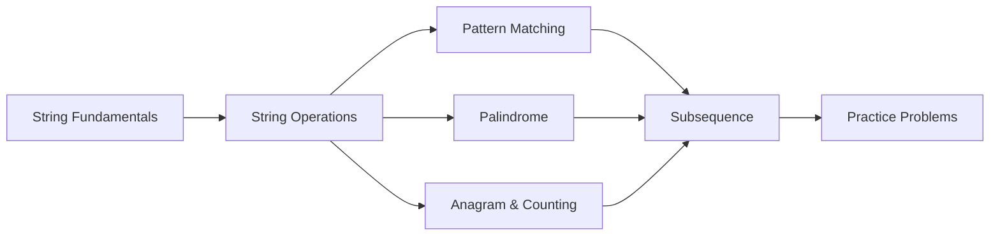
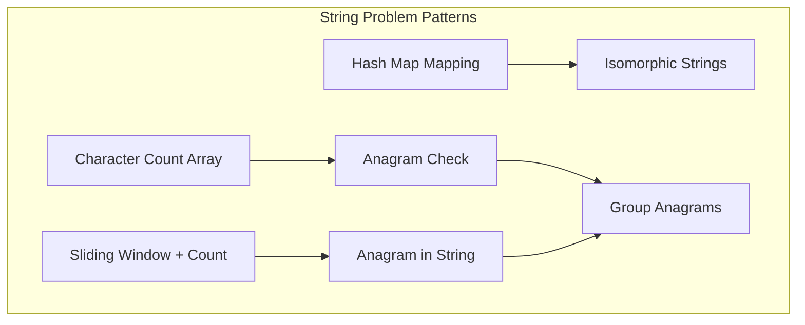
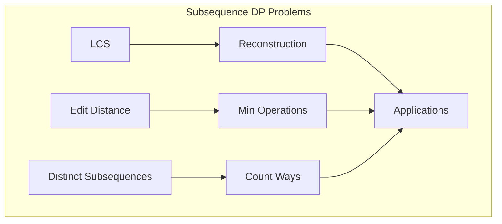

<!-- Clear Language: Keep sentences under 50 words -->
# Strings

## Learning Objectives

| Objective | Description |
|-----------|-------------|
| LO1 | Understand string immutability and memory representation in Python |
| LO2 | Master string traversal, slicing, and common built-in methods |
| LO3 | Implement string pattern matching using KMP and Rabin-Karp algorithms |
| LO4 | Solve palindrome problems using expansion and DP techniques |
| LO5 | Handle anagram, subsequence, and substring problems efficiently |
| LO6 | Apply string hashing and rolling hash techniques for comparison |

## Introduction

Strings are sequences of characters with unique operations. Many interview problems involve string manipulation, pattern matching, and anagram/subsequence detection. Understanding string algorithms is crucial for NLP and text processing in AI.

## Prerequisites

- Array basics
- Character encoding (ASCII/Unicode)

## Key Terminology

**Key Terms**: Core vocabulary and concepts for this topic.

**Definition**: Essential terms you must know for interviews and production work.

## Theory

Understanding strings is fundamental for AI engineers. This section covers the core concepts, underlying principles, and theoretical framework that govern how strings works in practice.

## Chapter at a Glance

| Section | Topic | Key Concept |
|---------|-------|-------------|
| 3.1 | String Fundamentals | Immutability, memory layout, Unicode |
| 3.2 | String Operations | Slicing, methods, concatenation |
| 3.3 | Pattern Matching | KMP, Rabin-Karp, Z-algorithm |
| 3.4 | Palindrome Problems | Expand around center, DP |
| 3.5 | Anagram and Counting | Character frequency, sliding window |
| 3.6 | Subsequence Problems | LCS, edit distance, distinct subsequences |

## Chapter Roadmap



## 3.1 String Fundamentals

Strings are **immutable sequences of Unicode characters** in Python. Every string operation that appears to modify a string actually creates a new string object.

**Memory representation**: Python 3 stores strings as either:
- **Compact ASCII** (1 byte per char) — when all characters are ASCII
- **Compact** (1, 2, or 4 bytes per char) — depending on the largest Unicode code point

```python
# Strings are immutable
s = "hello"

## s[0] = "H"  # TypeError: 'str' object does not support item assignment

## Every "modification" creates a new string
s = s.upper()  # "HELLO" — new string

## String interning — small strings are cached
a = "hello"
b = "hello"
print(a is b)  # True — interned (CPython may intern some strings)
```

**Unicode support**:

```python

## Unicode characters — Python 3 strings are Unicode
emoji = "🚀🔥🐍"
chinese = "你好世界"
hindi = "नमस्ते दुनिया"

## Character vs byte length
print(len(emoji))      # 3 characters
print(len(emoji.encode('utf-8')))  # 12 bytes

## Code points
print(ord('A'))   # 65
print(ord('🔥'))  # 128293
print(chr(65))    # 'A'
```

**String creation and conversion**:

```python

## Different ways to create strings
s1 = "double quotes"
s2 = 'single quotes'
s3 = """multi-line
string"""
s4 = str(42)           # "42"
s5 = str(3.14)         # "3.14"
s6 = repr("hello\n")   # "'hello\\n'" — with escape sequences

## Join — most efficient for building strings from lists
words = ["hello", "world", "python"]
sentence = " ".join(words)  # "hello world python"

## Split
data = "a,b,c,d"
items = data.split(",")     # ["a", "b", "c", "d"]
```

---

## 3.2 String Operations

**Slicing — [start:stop:step]**:

```python
s = "Hello, World!"

print(s[0])       # 'H' — first character
print(s[-1])      # '!' — last character
print(s[0:5])     # 'Hello' — characters 0-4
print(s[7:])      # 'World!' — from index 7 to end
print(s[:5])      # 'Hello' — from start to index 4
print(s[::2])     # 'Hlo ol!' — every 2nd character
print(s[::-1])    # '!dlroW ,olleH' — reversed
```

**Common string methods**:

```python
text = "  Python Programming  "

## Whitespace handling
print(text.strip())          # "Python Programming"
print(text.lstrip())         # "Python Programming  "
print(text.rstrip())         # "  Python Programming"

## Case conversion
print(text.upper())          # "  PYTHON PROGRAMMING  "
print(text.lower())          # "  python programming  "
print(text.swapcase())       # "  pYTHON pROGRAMMING  "
print(text.title())          # "  Python Programming  "

## Searching
print(text.find("Pro"))      # 10
print(text.find("Java"))     # -1
print(text.index("Pro"))     # 10

## print(text.index("Java"))  # ValueError!
print(text.count("m"))       # 2

## Checking
print(text.startswith("  Py"))  # True
print(text.endswith("g  "))     # True
print("123".isdigit())          # True
print("abc".isalpha())          # True
print("abc123".isalnum())       # True

## Replacing
print(text.replace("Python", "Java"))  # "  Java Programming  "
```

**String formatting**:

```python
name, age, score = "Alice", 30, 95.5

## f-strings (preferred)
print(f"{name} is {age} years old with score {score:.1f}")

## str.format()
print("{} is {} years old".format(name, age))

## % formatting (old style)
print("%s is %d years old" % (name, age))
```

**Efficient string building**:

```python

## Bad — O(n²) because strings are immutable
def build_bad(n):
    result = ""
    for i in range(n):
        result += str(i)  # Creates new string each time
    return result

## Good — O(n) using list join
def build_good(n):
    parts = []
    for i in range(n):
        parts.append(str(i))
    return "".join(parts)

## Even better — using generator
def build_best(n):
    return "".join(str(i) for i in range(n))
```

---

## 3.3 Pattern Matching

**Naive pattern matching**: O(n—m) time.

```python
def naive_search(text, pattern):
    n, m = len(text), len(pattern)
    positions = []
    for i in range(n - m + 1):
        match = True
        for j in range(m):
            if text[i + j] != pattern[j]:
                match = False
                break
        if match:
            positions.append(i)
    return positions

print(naive_search("AABAACAADAABAAABAA", "AABA"))  # [0, 9, 13]
```

**KMP (Knuth-Morris-Pratt) algorithm**: O(n+m) time by preprocessing the pattern.

```python
def kmp_search(text, pattern):
    """KMP pattern matching — O(n+m) time"""
    n, m = len(text), len(pattern)
    if m == 0:
        return []

    # Compute LPS (Longest Prefix Suffix) array
    lps = [0] * m
    length = 0
    i = 1

    while i < m:
        if pattern[i] == pattern[length]:
            length += 1
            lps[i] = length
            i += 1
        else:
            if length != 0:
                length = lps[length - 1]
            else:
                lps[i] = 0
                i += 1

    # Search using LPS
    positions = []
    i = j = 0
    while i < n:
        if text[i] == pattern[j]:
            i += 1
            j += 1

        if j == m:
            positions.append(i - j)
            j = lps[j - 1]
        elif i < n and text[i] != pattern[j]:
            if j != 0:
                j = lps[j - 1]
            else:
                i += 1

    return positions

print(kmp_search("AABAACAADAABAAABAA", "AABA"))  # [0, 9, 13]
```

**Rabin-Karp algorithm**: Uses rolling hash for pattern matching.

```python
def rabin_karp(text, pattern, d=256, q=101):
    """Rabin-Karp pattern matching using rolling hash"""
    n, m = len(text), len(pattern)
    if m > n or m == 0:
        return []

    # Precompute d^(m-1) % q
    h = pow(d, m - 1, q)

    # Compute hash of pattern and first window
    p_hash = t_hash = 0
    for i in range(m):
        p_hash = (d * p_hash + ord(pattern[i])) % q
        t_hash = (d * t_hash + ord(text[i])) % q

    positions = []
    for i in range(n - m + 1):
        if p_hash == t_hash:
            # Verify character by character
            if text[i:i + m] == pattern:
                positions.append(i)

        # Compute next window hash
        if i < n - m:
            t_hash = (d * (t_hash - ord(text[i]) * h) + ord(text[i + m])) % q
            if t_hash < 0:
                t_hash += q

    return positions

print(rabin_karp("AABAACAADAABAAABAA", "AABA"))  # [0, 9, 13]
```

**Z-algorithm**: Computes longest prefix matching at each position.

```python
def z_algorithm(s):
    """Z-algorithm: computes Z-array where Z[i] = longest substring starting
    at i that matches prefix of s"""
    n = len(s)
    z = [0] * n
    l = r = 0

    for i in range(1, n):
        if i <= r:
            z[i] = min(r - i + 1, z[i - l])
        while i + z[i] < n and s[z[i]] == s[i + z[i]]:
            z[i] += 1
        if i + z[i] - 1 > r:
            l = i
            r = i + z[i] - 1

    return z

def z_search(text, pattern):
    combined = pattern + "$" + text
    z = z_algorithm(combined)
    m = len(pattern)
    return [i - m - 1 for i in range(len(combined)) if z[i] == m]

print(z_search("AABAACAADAABAAABAA", "AABA"))  # [0, 9, 13]
```

| Algorithm | Preprocessing | Search | Total | Space |
|-----------|--------------|--------|-------|-------|
| Naive | None | O(n—m) | O(n—m) | O(1) |
| KMP | O(m) | O(n) | O(n+m) | O(m) |
| Rabin-Karp | O(m) | O(n) avg | O(n+m) avg | O(1) |
| Z-algorithm | O(n+m) | O(n) | O(n+m) | O(n+m) |

---

## 3.4 Palindrome Problems

**Check if string is palindrome**:

```python
def is_palindrome(s):
    # Remove non-alphanumeric and lowercase
    cleaned = "".join(c.lower() for c in s if c.isalnum())
    return cleaned == cleaned[::-1]

def is_palindrome_two_pointer(s):
    left, right = 0, len(s) - 1
    while left < right:
        while left < right and not s[left].isalnum():
            left += 1
        while left < right and not s[right].isalnum():
            right -= 1
        if s[left].lower() != s[right].lower():
            return False
        left += 1
        right -= 1
    return True

print(is_palindrome("A man, a plan, a canal: Panama"))  # True
```

**Longest palindromic substring — expand around center**:

```python
def longest_palindrome(s):
    """Find longest palindromic substring — O(n²) time, O(1) space"""
    if not s:
        return ""

    start, max_len = 0, 1

    def expand_around_center(left, right):
        while left >= 0 and right < len(s) and s[left] == s[right]:
            left -= 1
            right += 1
        return left + 1, right - 1

    for i in range(len(s)):
        # Odd length palindrome
        l, r = expand_around_center(i, i)
        if r - l + 1 > max_len:
            start, max_len = l, r - l + 1

        # Even length palindrome
        l, r = expand_around_center(i, i + 1)
        if r - l + 1 > max_len:
            start, max_len = l, r - l + 1

    return s[start:start + max_len]

print(longest_palindrome("babad"))  # "bab" or "aba"
print(longest_palindrome("cbbd"))   # "bb"
```

**Manacher's algorithm**: O(n) time, O(n) space for longest palindrome.

```python
def manacher(s):
    """Manacher's algorithm — O(n) time for longest palindrome"""
    # Transform: "abc" → "^#a#b#c#$"
    t = "^#" + "#".join(s) + "#$"
    n = len(t)
    p = [0] * n
    center = right = 0

    for i in range(1, n - 1):
        if i < right:
            p[i] = min(right - i, p[2 * center - i])

        # Expand around center
        while t[i + p[i] + 1] == t[i - p[i] - 1]:
            p[i] += 1

        if i + p[i] > right:
            center = i
            right = i + p[i]

    # Find max palindrome
    max_len, center_idx = max((p[i], i) for i in range(1, n - 1))
    start = (center_idx - max_len) // 2
    return s[start:start + max_len]

print(manacher("babad"))   # "aba" or "bab"
print(manacher("cbbd"))    # "bb"
```

**Count palindromic substrings**:

```python
def count_palindromic_substrings(s):
    """Count all palindromic substrings — O(n²)"""
    n = len(s)
    count = 0

    def expand(left, right):
        nonlocal count
        while left >= 0 and right < n and s[left] == s[right]:
            count += 1
            left -= 1
            right += 1

    for i in range(n):
        expand(i, i)      # Odd length
        expand(i, i + 1)  # Even length

    return count

print(count_palindromic_substrings("abc"))    # 3 (a, b, c)
print(count_palindromic_substrings("aaa"))    # 6 (a, a, a, aa, aa, aaa)
```

---

## 3.5 Anagram and Counting

**Valid anagram**: Two strings using same characters with same frequencies.

```python
from collections import Counter

def is_anagram(s1, s2):
    if len(s1) != len(s2):
        return False
    return Counter(s1) == Counter(s2)

def is_anagram_array(s1, s2):
    if len(s1) != len(s2):
        return False
    counts = [0] * 26
    for c in s1:
        counts[ord(c) - ord('a')] += 1
    for c in s2:
        counts[ord(c) - ord('a')] -= 1
    return all(c == 0 for c in counts)

print(is_anagram("listen", "silent"))  # True
print(is_anagram("hello", "world"))   # False
```

**Group anagrams**:

```python
from collections import defaultdict

def group_anagrams(words):
    groups = defaultdict(list)
    for word in words:
        # Use sorted string as key
        key = "".join(sorted(word))
        groups[key].append(word)
    return list(groups.values())

words = ["eat", "tea", "tan", "ate", "nat", "bat"]
print(group_anagrams(words))

## [["eat", "tea", "ate"], ["tan", "nat"], ["bat"]]
```

**Find all anagrams in a string** (sliding window):

```python
from collections import Counter

def find_anagrams(text, pattern):
    """Find all start indices of pattern's anagrams in text"""
    result = []
    m, n = len(pattern), len(text)
    if m > n:
        return result

    p_count = [0] * 26
    w_count = [0] * 26

    for c in pattern:
        p_count[ord(c) - ord('a')] += 1
    for i in range(m):
        w_count[ord(text[i]) - ord('a')] += 1

    if p_count == w_count:
        result.append(0)

    for i in range(m, n):
        # Remove leftmost character
        w_count[ord(text[i - m]) - ord('a')] -= 1
        # Add new character
        w_count[ord(text[i]) - ord('a')] += 1
        if p_count == w_count:
            result.append(i - m + 1)

    return result

print(find_anagrams("cbaebabacd", "abc"))  # [0, 6]
```

**Character frequency operations**:

```python

## Check if two strings are isomorphic
def is_isomorphic(s, t):
    if len(s) != len(t):
        return False
    s_to_t, t_to_s = {}, {}
    for c1, c2 in zip(s, t):
        if (c1 in s_to_t and s_to_t[c1] != c2) or \
           (c2 in t_to_s and t_to_s[c2] != c1):
            return False
        s_to_t[c1] = c2
        t_to_s[c2] = c1
    return True

print(is_isomorphic("egg", "add"))   # True
print(is_isomorphic("foo", "bar"))   # False
```



---

## 3.6 Subsequence Problems

A **subsequence** is a sequence that can be derived by deleting some elements without changing the order. A **substring** is a contiguous subsequence.

**Check subsequence**:

```python
def is_subsequence(sub, main):
    """Check if sub is a subsequence of main — O(n)"""
    it = iter(main)
    return all(c in it for c in sub)

def is_subsequence_two_pointer(sub, main):
    i = j = 0
    while i < len(sub) and j < len(main):
        if sub[i] == main[j]:
            i += 1
        j += 1
    return i == len(sub)

print(is_subsequence("abc", "ahbgdc"))  # True
print(is_subsequence("axc", "ahbgdc"))  # False
```

**Distinct subsequences**: Count distinct ways to form T from S by deleting characters.

```python
def num_distinct(s, t):
    """Count distinct subsequences of s equal to t — DP"""
    m, n = len(s), len(t)
    dp = [[0] * (n + 1) for _ in range(m + 1)]

    # Empty string is subsequence of any string
    for i in range(m + 1):
        dp[i][0] = 1

    for i in range(1, m + 1):
        for j in range(1, n + 1):
            if s[i - 1] == t[j - 1]:
                dp[i][j] = dp[i - 1][j - 1] + dp[i - 1][j]
            else:
                dp[i][j] = dp[i - 1][j]

    return dp[m][n]

print(num_distinct("rabbbit", "rabbit"))  # 3
```

**Longest common subsequence (LCS)**:

```python
def longest_common_subsequence(text1, text2):
    """LCS — DP O(m—n) time and space"""
    m, n = len(text1), len(text2)
    dp = [[0] * (n + 1) for _ in range(m + 1)]

    for i in range(1, m + 1):
        for j in range(1, n + 1):
            if text1[i - 1] == text2[j - 1]:
                dp[i][j] = dp[i - 1][j - 1] + 1
            else:
                dp[i][j] = max(dp[i - 1][j], dp[i][j - 1])

    # Reconstruct the LCS
    i, j = m, n
    lcs = []
    while i > 0 and j > 0:
        if text1[i - 1] == text2[j - 1]:
            lcs.append(text1[i - 1])
            i -= 1
            j -= 1
        elif dp[i - 1][j] > dp[i][j - 1]:
            i -= 1
        else:
            j -= 1

    return dp[m][n], "".join(reversed(lcs))

print(longest_common_subsequence("abcde", "ace"))  # (3, "ace")
print(longest_common_subsequence("abc", "def"))    # (0, "")
```

**Edit distance** (Levenshtein distance):

```python
def edit_distance(word1, word2):
    """Minimum edits (insert, delete, replace) to convert word1 to word2"""
    m, n = len(word1), len(word2)
    dp = [[0] * (n + 1) for _ in range(m + 1)]

    for i in range(m + 1):
        dp[i][0] = i
    for j in range(n + 1):
        dp[0][j] = j

    for i in range(1, m + 1):
        for j in range(1, n + 1):
            if word1[i - 1] == word2[j - 1]:
                dp[i][j] = dp[i - 1][j - 1]
            else:
                dp[i][j] = 1 + min(
                    dp[i - 1][j],    # Delete
                    dp[i][j - 1],    # Insert
                    dp[i - 1][j - 1]  # Replace
                )

    return dp[m][n]

print(edit_distance("horse", "ros"))   # 3
print(edit_distance("intention", "execution"))  # 5
```



---

## TypeScript Parallel

TypeScript strings provide similar methods with type safety:

```typescript
// String operations in TypeScript
const s: string = "Hello, World!";

// Slicing
console.log(s.slice(0, 5));  // "Hello"
console.log(s.charAt(0));    // "H"

// Palindrome check
function isPalindrome(s: string): boolean {
    const cleaned = s.toLowerCase().replace(/[^a-z0-9]/g, "");
    return cleaned === cleaned.split("").reverse().join("");
}

// Longest common subsequence
function lcs(text1: string, text2: string): number {
    const m = text1.length, n = text2.length;
    const dp: number[][] = Array.from({ length: m + 1 }, () => new Array(n + 1).fill(0));
    for (let i = 1; i <= m; i++) {
        for (let j = 1; j <= n; j++) {
            dp[i][j] = text1[i - 1] === text2[j - 1]
                ? dp[i - 1][j - 1] + 1
                : Math.max(dp[i - 1][j], dp[i][j - 1]);
        }
    }
    return dp[m][n];
}
```

---

## Summary

- Python strings are immutable; every modification creates a new string object in memory
- String concatenation with `+` in a loop is O(n²); use `"".join()` for O(n) efficiency
- The KMP algorithm precomputes the LPS array to achieve O(n+m) pattern matching by avoiding redundant comparisons
- Rabin-Karp uses rolling hash for O(n) average-case matching but requires hash collision verification
- Manacher's algorithm finds the longest palindromic substring in O(n) time using symmetry properties
- Palindrome problems can be solved via expand-around-center (O(n²) time, O(1) space) or Manacher (O(n) time, O(n) space)
- Anagram checking uses character frequency counting with array of size 26 (ASCII) or Counter (Unicode)
- Subsequence problems (LCS, edit distance) are classic DP with O(m—n) time and space
- Space-optimized LCS uses two rows instead of full 2D DP table, reducing space to O(min(m,n))
- String hashing enables efficient equality checks and is fundamental to many advanced algorithms (rolling hash, suffix arrays)

## Practical Takeaways

| Scenario | Do This | Avoid This |
|----------|---------|------------|
| Building strings | `"".join(list_of_parts)` | `result += part` in loops |
| Pattern matching large text | KMP or Rabin-Karp | Naive O(n—m) for large data |
| Anagram detection | Character count array of size 26 | Sorting both strings |
| Longest palindrome | Manacher's algorithm for O(n) | O(n³) brute force |
| Subsequence check | Two-pointer iteration | Generating all subsequences |
| String comparison | Use `==` for value comparison | Use `is` for string comparison |
| Unicode handling | Python 3 native strings | Encoding to bytes prematurely |

## Interview Q&A

<details class="tp-qa-card" data-qid="dsa03-q1">
  <summary class="tp-qa-question">
    <span class="tp-qa-status"></span>
    Q1: Explain the KMP algorithm for pattern matching. How does the LPS table work?
  </summary>
  <div class="tp-qa-answer">
    <p><strong>KMP</strong> (Knuth-Morris-Pratt) achieves O(n+m) pattern matching by preprocessing the pattern to create an LPS (Longest Prefix Suffix) array.</p>
    <p><strong>LPS array</strong>: LPS[i] stores the length of the longest proper prefix of pattern[0..i] that is also a suffix.</p>
    <p><strong>How it works</strong>:</p>
    <ul>
      <li>When a mismatch occurs at pattern[j], we don't restart from pattern[0]</li>
      <li>Instead, we set j = LPS[j-1] — effectively shifting the pattern to align with the already-matched portion</li>
      <li>This ensures no character in the text is compared more than once</li>
    </ul>
    <pre><code># Example: pattern = "AABA"

## LPS = [0, 1, 0, 1]

## At mismatch on j=3, we set j = LPS[2] = 0

## This skips already-matched characters</code></pre>
    <p><strong>Complexity</strong>: O(m) for LPS construction, O(n) for search, O(n+m) total.</p>
  </div>
  <button class="tp-qa-mark-btn">✅ Mark Reviewed</button>
  <button class="tp-qa-bookmark-btn">🔖 Bookmark</button>
</details>

<details class="tp-qa-card" data-qid="dsa03-q2">
  <summary class="tp-qa-question">
    <span class="tp-qa-status"></span>
    Q2: Implement the expand-around-center approach for longest palindromic substring.
  </summary>
  <div class="tp-qa-answer">
    <pre><code>def longest_palindrome(s):
    if not s:
        return ""

    start, max_len = 0, 1

    def expand(left, right):
        while left &gt;= 0 and right &lt; len(s) and s[left] == s[right]:
            left -= 1
            right += 1
        return left + 1, right - 1

    for i in range(len(s)):
        # Odd length palindrome (center at i)
        l, r = expand(i, i)
        if r - l + 1 &gt; max_len:
            start, max_len = l, r - l + 1

        # Even length palindrome (center between i and i+1)
        l, r = expand(i, i + 1)
        if r - l + 1 &gt; max_len:
            start, max_len = l, r - l + 1

    return s[start:start + max_len]</code></pre>
    <p><strong>Key insight</strong>: Each palindrome has a center (1 char for odd, 2 chars for even). Expanding from each center and checking symmetry is O(n²) total because there are 2n-1 centers, and each expansion may go up to n steps.</p>
  </div>
  <button class="tp-qa-mark-btn">✅ Mark Reviewed</button>
  <button class="tp-qa-bookmark-btn">🔖 Bookmark</button>
</details>

<details class="tp-qa-card" data-qid="dsa03-q3">
  <summary class="tp-qa-question">
    <span class="tp-qa-status"></span>
    Q3: How does the Rabin-Karp algorithm work? What are its advantages and limitations?
  </summary>
  <div class="tp-qa-answer">
    <p><strong>Rabin-Karp</strong> uses a rolling hash function to find pattern matches in O(n) average time.</p>
    <p><strong>Algorithm</strong>:</p>
    <ol>
      <li>Compute hash of the pattern</li>
      <li>Compute hash of the first window (size m) of text</li>
      <li>If hashes match, verify character by character (to handle collisions)</li>
      <li>Slide the window: remove left char, add right char using rolling hash</li>
    </ol>
    <p><strong>Rolling hash formula</strong>: hash = (d * hash - text[i] * d^{m-1} + text[i+m]) % q</p>
    <p><strong>Advantages</strong>:</p>
    <ul>
      <li>O(n+m) average time</li>
      <li>Can be extended to multiple pattern search easily</li>
      <li>Works well for plagiarism detection (fingerprinting documents)</li>
    </ul>
    <p><strong>Limitations</strong>:</p>
    <ul>
      <li>Worst-case O(n—m) if many hash collisions</li>
      <li>Requires good hash function and large modulus to avoid collisions</li>
    </ul>
  </div>
  <button class="tp-qa-mark-btn">✅ Mark Reviewed</button>
  <button class="tp-qa-bookmark-btn">🔖 Bookmark</button>
</details>

<details class="tp-qa-card" data-qid="dsa03-q4">
  <summary class="tp-qa-question">
    <span class="tp-qa-status"></span>
    Q4: Explain the LCS (Longest Common Subsequence) problem and its DP solution.
  </summary>
  <div class="tp-qa-answer">
    <p><strong>Problem</strong>: Find the longest sequence that appears in the same order in both strings (not necessarily contiguous).</p>
    <p><strong>DP recurrence</strong>:</p>
    <pre><code>dp[i][j] = LCS of s1[:i] and s2[:j]
dp[i][j] = 0                              if i=0 or j=0
dp[i][j] = dp[i-1][j-1] + 1              if s1[i-1] == s2[j-1]
dp[i][j] = max(dp[i-1][j], dp[i][j-1])   otherwise</code></pre>
    <p><strong>Time</strong>: O(m—n). <strong>Space</strong>: O(m—n) or O(min(m,n)) with optimization.</p>
    <p><strong>Applications</strong>:</p>
    <ul>
      <li>Diff tools (git diff)</li>
      <li>DNA sequence alignment</li>
      <li>Plagiarism detection</li>
      <li>Version control merge conflict resolution</li>
    </ul>
  </div>
  <button class="tp-qa-mark-btn">✅ Mark Reviewed</button>
  <button class="tp-qa-bookmark-btn">🔖 Bookmark</button>
</details>

<details class="tp-qa-card" data-qid="dsa03-q5">
  <summary class="tp-qa-question">
    <span class="tp-qa-status"></span>
    Q5: What is the edit distance problem? How is it solved using DP?
  </summary>
  <div class="tp-qa-answer">
    <p><strong>Edit distance</strong> (Levenshtein distance): Minimum number of single-character operations (insert, delete, replace) to convert one string to another.</p>
    <p><strong>DP recurrence</strong>:</p>
    <pre><code>dp[i][j] = edit distance between word1[:i] and word2[:j]
dp[i][j] = i                                if j=0
dp[i][j] = j                                if i=0
dp[i][j] = dp[i-1][j-1]                    if word1[i-1] == word2[j-1]
dp[i][j] = 1 + min(
    dp[i-1][j],      # delete from word1
    dp[i][j-1],      # insert into word1
    dp[i-1][j-1]     # replace
)                                          otherwise</code></pre>
    <p><strong>Applications</strong>: Spell checking, autocorrect, DNA sequence alignment, natural language processing.</p>
    <p><strong>Variations</strong>: Damerau-Levenshtein adds transposition operation; Hamming distance requires equal length strings and only allows substitution.</p>
  </div>
  <button class="tp-qa-mark-btn">✅ Mark Reviewed</button>
  <button class="tp-qa-bookmark-btn">🔖 Bookmark</button>
</details>

<details class="tp-qa-card" data-qid="dsa03-q6">
  <summary class="tp-qa-question">
    <span class="tp-qa-status"></span>
    Q6: How do you check if a string is a valid palindrome while ignoring non-alphanumeric characters?
  </summary>
  <div class="tp-qa-answer">
    <pre><code>def is_palindrome(s):
    left, right = 0, len(s) - 1
    while left &lt; right:
        # Skip non-alphanumeric from left
        while left &lt; right and not s[left].isalnum():
            left += 1
        # Skip non-alphanumeric from right
        while left &lt; right and not s[right].isalnum():
            right -= 1
        # Compare characters (case-insensitive)
        if s[left].lower() != s[right].lower():
            return False
        left += 1
        right -= 1
    return True</code></pre>
    <p><strong>Key insight</strong>: Use two pointers converging from both ends. Skip non-alphanumeric characters rather than preprocessing (which would create a new string).</p>
    <p><strong>Complexity</strong>: O(n) time, O(1) space.</p>
  </div>
  <button class="tp-qa-mark-btn">✅ Mark Reviewed</button>
  <button class="tp-qa-bookmark-btn">🔖 Bookmark</button>
</details>

<details class="tp-qa-card" data-qid="dsa03-q7">
  <summary class="tp-qa-question">
    <span class="tp-qa-status"></span>
    Q7: Explain the sliding window approach to find all anagrams of a pattern in a text.
  </summary>
  <div class="tp-qa-answer">
    <pre><code>from collections import Counter

def find_anagrams(text, pattern):
    result = []
    m, n = len(pattern), len(text)
    if m &gt; n: return result

    p_count = [0] * 26
    w_count = [0] * 26

    # Count pattern characters
    for c in pattern:
        p_count[ord(c) - ord('a')] += 1

    # Initialize window
    for i in range(m):
        w_count[ord(text[i]) - ord('a')] += 1

    if p_count == w_count:
        result.append(0)

    # Slide window
    for i in range(m, n):
        # Remove leftmost character from window
        w_count[ord(text[i - m]) - ord('a')] -= 1
        # Add new character to window
        w_count[ord(text[i]) - ord('a')] += 1
        if p_count == w_count:
            result.append(i - m + 1)

    return result</code></pre>
    <p><strong>Key insight</strong>: Maintain a character count of current window. Slide one character at a time — remove left, add right. Compare counts with pattern counts.</p>
    <p><strong>Complexity</strong>: O(n) time, O(1) space (fixed 26-size array).</p>
  </div>
  <button class="tp-qa-mark-btn">✅ Mark Reviewed</button>
  <button class="tp-qa-bookmark-btn">🔖 Bookmark</button>
</details>

<details class="tp-qa-card" data-qid="dsa03-q8">
  <summary class="tp-qa-question">
    <span class="tp-qa-status"></span>
    Q8: How do you check if two strings are isomorphic?
  </summary>
  <div class="tp-qa-answer">
    <pre><code>def is_isomorphic(s, t):
    if len(s) != len(t):
        return False
    s_to_t, t_to_s = {}, {}
    for c1, c2 in zip(s, t):
        if (c1 in s_to_t and s_to_t[c1] != c2) or \
           (c2 in t_to_s and t_to_s[c2] != c1):
            return False
        s_to_t[c1] = c2
        t_to_s[c2] = c1
    return True</code></pre>
    <p><strong>Key insight</strong>: A bijection (one-to-one mapping) must exist between characters of both strings. Use two hash maps to track mappings in both directions.</p>
    <p><strong>Example</strong>: "egg" → "add" (e→a, g→d) — valid. "foo" → "bar" (f→b, o→a but o→r conflict) — invalid.</p>
    <p><strong>Complexity</strong>: O(n) time, O(k) space where k is alphabet size.</p>
  </div>
  <button class="tp-qa-mark-btn">✅ Mark Reviewed</button>
  <button class="tp-qa-bookmark-btn">🔖 Bookmark</button>
</details>

<details class="tp-qa-card" data-qid="dsa03-q9">
  <summary class="tp-qa-question">
    <span class="tp-qa-status"></span>
    Q9: Compare the different string concatenation methods in Python in terms of performance.
  </summary>
  <div class="tp-qa-answer">
    <table>
      <tr><th>Method</th><th>Time</th><th>When to Use</th></tr>
      <tr><td>`+` operator</td><td>O(n²)</td><td>Only for a few concatenations</td></tr>
      <tr><td>`join()`</td><td>O(n)</td><td>Building from list — always preferred</td></tr>
      <tr><td>f-strings</td><td>O(n)</td><td>Template with variables (best readability)</td></tr>
      <tr><td>StringIO</td><td>O(n)</td><td>Building large strings with complex logic</td></tr>
      <tr><td>`%` formatting</td><td>O(n)</td><td>Legacy code; lazy logging</td></tr>
    </table>
    <pre><code># Performance comparison
import timeit

## O(n²) — creates new string each iteration
def concat_plus(n):
    s = ""
    for i in range(n):
        s += str(i)
    return s

## O(n) — builds list, joins once
def concat_join(n):
    return "".join(str(i) for i in range(n))

## For n=10000, join is 1000x faster than +=</code></pre>
  </div>
  <button class="tp-qa-mark-btn">✅ Mark Reviewed</button>
  <button class="tp-qa-bookmark-btn">🔖 Bookmark</button>
</details>

<details class="tp-qa-card" data-qid="dsa03-q10">
  <summary class="tp-qa-question">
    <span class="tp-qa-status"></span>
    Q10: What is the Z-algorithm and how is it used for pattern matching?
  </summary>
  <div class="tp-qa-answer">
    <p>The <strong>Z-algorithm</strong> computes a Z-array where Z[i] is the length of the longest substring starting at position i that matches the prefix of the string.</p>
    <p><strong>For pattern matching</strong>: Concatenate pattern + "$" + text, then compute the Z-array. Any Z[i] == len(pattern) indicates a match at position i - len(pattern) - 1.</p>
    <pre><code>def z_algorithm(s):
    n = len(s)
    z = [0] * n
    l = r = 0
    for i in range(1, n):
        if i &lt;= r:
            z[i] = min(r - i + 1, z[i - l])
        while i + z[i] &lt; n and s[z[i]] == s[i + z[i]]:
            z[i] += 1
        if i + z[i] - 1 &gt; r:
            l, r = i, i + z[i] - 1
    return z</code></pre>
    <p><strong>Complexity</strong>: O(n) — the while loop increments z[i] which is bounded by n.</p>
    <p><strong>Applications</strong>: Pattern matching, finding all palindrome prefixes, string compression.</p>
  </div>
  <button class="tp-qa-mark-btn">✅ Mark Reviewed</button>
  <button class="tp-qa-bookmark-btn">🔖 Bookmark</button>
</details>

<details class="tp-qa-card" data-qid="dsa03-q11">
  <summary class="tp-qa-question">
    <span class="tp-qa-status"></span>
    Q11: How do you compute the number of distinct palindromic substrings in a string?
  </summary>
  <div class="tp-qa-answer">
    <pre><code>def count_palindromic_substrings(s):
    """Count all palindromic substrings — O(n²)"""
    n = len(s)
    count = 0

    for center in range(2 * n - 1):
        left = center // 2
        right = left + center % 2
        while left &gt;= 0 and right &lt; n and s[left] == s[right]:
            count += 1
            left -= 1
            right += 1

    return count</code></pre>
    <p><strong>Key insight</strong>: There are 2n-1 possible centers (n odd + n-1 even). Expand from each center to count palindromes.</p>
    <p><strong>Alternative</strong>: Manacher's algorithm can also count distinct palindromes in O(n) time by tracking the radii in the transformed string.</p>
  </div>
  <button class="tp-qa-mark-btn">✅ Mark Reviewed</button>
  <button class="tp-qa-bookmark-btn">🔖 Bookmark</button>
</details>

<details class="tp-qa-card" data-qid="dsa03-q12">
  <summary class="tp-qa-question">
    <span class="tp-qa-status"></span>
    Q12: Explain how to check if a string is a valid shuffle of two other strings.
  </summary>
  <div class="tp-qa-answer">
    <p><strong>Problem</strong>: Given strings s1, s2, and s3, check if s3 is formed by interleaving characters of s1 and s2 while preserving order.</p>
    <pre><code>def is_interleave(s1, s2, s3):
    """Check if s3 is an interleaving of s1 and s2 — DP"""
    m, n = len(s1), len(s2)
    if m + n != len(s3):
        return False

    dp = [[False] * (n + 1) for _ in range(m + 1)]

    for i in range(m + 1):
        for j in range(n + 1):
            if i == 0 and j == 0:
                dp[i][j] = True
            elif i == 0:
                dp[i][j] = dp[i][j - 1] and s2[j - 1] == s3[i + j - 1]
            elif j == 0:
                dp[i][j] = dp[i - 1][j] and s1[i - 1] == s3[i + j - 1]
            else:
                dp[i][j] = (dp[i - 1][j] and s1[i - 1] == s3[i + j - 1]) or \
                           (dp[i][j - 1] and s2[j - 1] == s3[i + j - 1])

    return dp[m][n]

print(is_interleave("aab", "axy", "aaxaby"))  # True
print(is_interleave("aab", "axy", "abaaxy"))  # False</code></pre>
    <p><strong>Key insight</strong>: dp[i][j] is True if s3[0..i+j-1] is an interleaving of s1[0..i-1] and s2[0..j-1].</p>
    <p><strong>Space optimization</strong>: Can be reduced to O(n) using 1D DP.</p>
  </div>
  <button class="tp-qa-mark-btn">✅ Mark Reviewed</button>
  <button class="tp-qa-bookmark-btn">🔖 Bookmark</button>
</details>

## Chapter Quiz

**Q1**: What is the time complexity of the KMP algorithm for pattern matching?

a) O(n—m)
b) O(n+m)
c) O(n²)
d) O(m²)

<details class="tp-qa-card" data-qid="dsa03-quiz1"><summary>Show Answer</summary><div class="tp-qa-answer"><p><strong>Answer: b) O(n+m)</strong></p><p>KMP achieves O(n+m) by preprocessing the pattern into an LPS array, ensuring no backtracking on the text.</p></div></details>

**Q2**: How many centers does expand-around-center check for palindrome substring detection?

a) n
b) 2n - 1
c) n²
d) n/2

<details class="tp-qa-card" data-qid="dsa03-quiz2"><summary>Show Answer</summary><div class="tp-qa-answer"><p><strong>Answer: b) 2n - 1</strong></p><p>There are n odd-length centers (single characters) and n-1 even-length centers (between characters).</p></div></details>

**Q3**: What is the space complexity of the edit distance DP solution?

a) O(1)
b) O(n)
c) O(m—n)
d) O(n+m)

<details class="tp-qa-card" data-qid="dsa03-quiz3"><summary>Show Answer</summary><div class="tp-qa-answer"><p><strong>Answer: c) O(m—n)</strong></p><p>The standard 2D DP table uses O(m—n) space, though it can be optimized to O(min(m,n)).</p></div></details>

**Q4**: Which data structure gives O(1) character frequency comparison for anagram detection?

a) Hash map
b) Array of size 26
c) Sorted string
d) Set

<details class="tp-qa-card" data-qid="dsa03-quiz4"><summary>Show Answer</summary><div class="tp-qa-answer"><p><strong>Answer: b) Array of size 26</strong></p><p>For lowercase letters, a fixed-size integer array of size 26 provides O(1) comparison (26 comparisons), whereas hash maps have overhead.</p></div></details>

**Q5**: What encoding does Python 3 use internally for string representation?

a) UTF-8
b) ASCII
c) Flexible representation (compact ASCII, compact, legacy)
d) UTF-16

<details class="tp-qa-card" data-qid="dsa03-quiz5"><summary>Show Answer</summary><div class="tp-qa-answer"><p><strong>Answer: c) Flexible representation (compact ASCII, compact, legacy)</strong></p><p>Python 3 uses flexible string representation — 1, 2, or 4 bytes per character depending on the largest Unicode code point in the string.</p></div></details>

## Exercises

**Easy** — Write a function that reverses words in a sentence (e.g., "Hello World" → "World Hello") without using split.

**Medium** — Implement a function to find the longest substring without repeating characters using sliding window.

**Medium** — Implement a function to decode a string encoded with the pattern k[encoded_string] (e.g., "3[a2[c]]" → "accaccacc").

**Hard** — Write a function to find all words that can be typed using only one row of a QWERTY keyboard (e.g., "alaska", "dad" are valid; "hello" is not).

**Hard** — Implement the Boggle word search — given an m—n board of letters, find all words from a dictionary that can be formed by adjacent letters (using DFS + Trie).

---

## Common Mistakes

1. Forgetting strings are immutable in many languages
2. Not handling Unicode characters correctly
3. Off-by-one in substring operations
4. Not considering case sensitivity
5. Using wrong pattern matching algorithm

## Revision Notes

- Strings are immutable in Python/Java
- Anagram = same characters, different order
- Substring vs subsequence difference
- KMP for efficient pattern matching
- Trie for prefix-based string operations

## Placement Section

### Top 10 Interview Questions

#### Google Style

1. **Explain the core idea of Strings in under 60 seconds, then give a real-world analogy.** — Structure: definition, how it works in one sentence, why it matters, analogy. Follow-up: what would break if you removed this from a production system?

2. **Design a minimal, well-typed function that demonstrates Strings.** — Interviewer checks: signature with type hints, edge cases, complexity, and a clean docstring. Follow-up: how does your design behave with empty or malformed input?

3. **What are the common pitfalls when engineers first learn ** — List 3-4, then explain how you would prevent each in a code review.

#### Amazon Style

4. **Describe a production bug caused by misunderstanding Strings. How did you diagnose and fix it?** — STAR format: situation, task, action, result. Mention logs, reproduction, root-cause analysis, and the regression test you added.

5. **How would you scale a system that relies on Strings from 10 users to 10 million?** — Discuss bottlenecks, caching, monitoring, and when to redesign. Follow-up: what metrics would you track?

#### Microsoft Style

6. **Compare Strings with the closest alternative approach. When would you choose each?** — Make a decision matrix: performance, maintainability, ecosystem, learning curve. Follow-up: what would change your decision?

7. **Walk through how you would test a component that depends on Strings.** — Unit, integration, property-based tests; mocking boundaries; golden files for outputs.

#### NVIDIA Style

8. **How does Strings behave differently at scale — memory, throughput, or precision-wise?** — Connect to data pipelines and model training if applicable. Follow-up: what happens to latency as input grows?

9. **How would you make an implementation of Strings run faster on GPU hardware?** — Batch operations, vectorization, avoiding Python loops, reducing data movement.

#### AI Startup Style

10. **Write the smallest possible implementation of Strings that is production-quality.** — Include error handling, type hints, and a one-line docstring. Follow-up: what would you refactor first when it grows?

### Resume Tips

- Name Strings explicitly in your skills section, paired with a measurable achievement ("Reduced X by 40% using Strings").
- Add a bullet describing a project that applies Strings to real data, with numbers.
- Mention the tools and libraries you used alongside Strings (linters, test frameworks, profiling tools).
- Keep resume bullets under 15 words and start each with an action verb.

### Interview Day Checklist

- Rehearse a 60-second explanation of Strings and one real-world analogy.
- Prepare one STAR story about debugging a Strings-related production issue.
- Review complexity and edge cases for the classic Strings interview problem.
- Have questions ready: how does the team apply Strings in production today?
- Test your environment (Python, editor, internet) 15 minutes before the interview.

## True/False

1. **True or False:** Strings builds directly on the fundamentals covered in the earlier chapters of this module. — **True.** Every advanced topic in this module assumes the core concepts from the previous chapters.
2. **True or False:** You should write at least one code example for Strings before moving to the next chapter. — **True.** Active recall with hands-on code beats passive reading for retention.
3. **True or False:** The complexity analysis for Strings is the same regardless of input size. — **False.** Complexity grows with input size; always state best, average, and worst case.
4. **True or False:** Edge cases (empty input, invalid input, boundary values) matter for Strings in production. — **True.** Most production bugs come from unhandled edge cases.
5. **True or False:** You should memorize the Strings chapter content once and never review it again. — **False.** Spaced repetition (24h, 3 days, 1 week) dramatically improves long-term recall.

## Fill in the Blank

1. The chapter that covers Strings is Chapter ___ of this module. — Answer: check the module's table of contents.
2. The time complexity of the standard approach to Strings is ___. — Answer: review the theory section and state big-O notation.
3. The main edge case to handle when implementing Strings is ___. — Answer: empty or invalid input handling, as discussed in the chapter.
4. The tools commonly used to debug Strings issues are ___ and ___. — Answer: refer to the Debugging Guide section of this chapter.
5. The related topic that connects to Strings in the next chapter is ___. — Answer: see the Next Topic section.

## Scenario Questions

1. **Scenario:** A teammate ships a change involving Strings that breaks production at 3 AM. — Diagnosis: check the recent diff, reproduce locally with the failing input, check logs. Fix: revert, add a regression test, and review the root cause. Prevention: CI tests on edge cases and code review checklist.

2. **Scenario:** Your implementation of Strings is correct but too slow for the required latency. — Measure first with a profiler. Common fixes: reduce redundant work, use built-in optimized functions, batch operations, or add caching. Only then consider algorithmic changes.

3. **Scenario:** A new hire asks you to explain Strings in five minutes before a customer demo. — Use the 3-part answer: what it is (one sentence), how it works (one example), why it matters (one business impact). Then offer to go deeper after the demo.

4. **Scenario:** Your team's codebase has three different patterns for Strings and you must standardize. — Write a short ADR (architecture decision record), pick the pattern with best maintainability, migrate incrementally, and add a linter rule to enforce it.

## Output Questions

1. **What is the output of the simplest correct implementation of Strings on an empty input?** — Trace through the code: it should return the documented default (None, 0, empty collection) without raising.
2. **What is the output when the input is at the boundary value?** — Check off-by-one errors and inclusive/exclusive bounds in the chapter's examples.
3. **What does the implementation return when given invalid input types?** — With type hints and validation, it raises a clear error; without, it may fail silently.
4. **What is the output for the sample input given in the chapter's Examples section?** — Re-run the chapter's example code and compare against the documented output.
5. **What is the time complexity output when you profile the implementation at 10x input size?** — Expect the curve matching the chapter's complexity analysis (linear, quadratic, log-linear).

## Difficulty Level

| Level | Time | What It Takes |
|-------|------|---------------|
| Beginner | 1-2 sessions | Read theory, run the chapter examples, solve the Easy exercises |
| Intermediate | 3-5 sessions | Complete Medium exercises, explain Strings to someone else |
| Advanced | 1+ week | Solve Hard exercises, optimize for real datasets, answer interview follow-ups |

## Tips & Tricks

- Always write a one-line example of Strings from memory before opening the chapter — active recall first.
- Use the chapter's Revision Notes as a checklist: you have mastered Strings when you can explain each bullet.
- Pair the chapter quiz with the Flashcards: wrong answers become your next study session's focus.
- For interviews, practice explaining Strings twice: once with a technical audience, once with a non-technical audience.
- Keep a personal examples file where you collect your own Strings snippets; interviewers love original examples.

## Memory Tricks

- **Acronym**: build a mnemonic from the 5 key concepts of Strings listed in the Chapter at a Glance table.
- **Story**: link Strings to a familiar story — the analogy in the Visual Analogy section is designed to stick.
- **Number anchor**: remember the complexity of Strings by connecting it to a known algorithm of the same class.
- **Color code**: highlight the Theory, Examples, and Common Mistakes sections in different colors when reviewing.
- **Teach-back**: explain Strings to an imaginary junior engineer for 2 minutes — gaps in your explanation are gaps in memory.

## Further Reading

- Official documentation for the primary tool or library used in this chapter
- The chapter referenced in Related Topics for the next-level treatment of Strings
- The classic textbook chapter on Strings (check the Research References below)
- Two blog posts from engineers who debugged real Strings problems in production
- The repository of the open-source project that implements Strings

## Related Topics

- The previous chapter in this module (see table of contents) — foundational for Strings
- The next chapter (see Next Topic below) — builds on Strings
- The system design chapters in Module 07 — how Strings fits into production architectures
- The interview preparation module — how Strings is asked in screening rounds
- The capstone project — where Strings is applied end-to-end

## FAQs

1. **Do I need to memorize all of Strings, or understand the big picture?** — Understand the big picture first, then memorize the key facts via flashcards and spaced repetition. Interviewers reward depth over breadth.
2. **What if I get stuck on an exercise?** — Re-read the theory section, run the example code, then attempt again. If still stuck after 20 minutes, move on and return the next day.
3. **How much time should I spend on ** — Follow the Study Plan below: 1-2 weeks at 30-60 minutes daily is typical for placement preparation.
4. **Is Strings asked in interviews?** — Yes — the Interview Q&A and Placement Section list the exact question styles used by top companies.
5. **What's the fastest way to master ** — Explain it out loud, write code without looking, and review the flashcards within 24 hours and again after 3 days.

## Important Notes

- Strings is a core requirement for the rest of this module — do not skip the examples.
- Always analyze complexity (time and space) when working with Strings.
- Production correctness means handling edge cases, not just the happy path.
- Interview answers should start with the definition, then the example, then the trade-offs.
- Revisit this chapter after finishing the module; the context from later chapters deepens understanding.

## Historical Context

- Strings emerged as a standard practice because early systems failed without it — understanding why helps you explain it in interviews.
- The tools used for Strings today evolved from simpler versions; the chapter covers the modern, recommended approach.
- Interviewers value knowing one historical fact about Strings — it shows genuine interest, not just cramming.
- The library/tooling ecosystem around Strings changes quickly; focus on fundamentals that remain stable.

## Security Considerations

- Never trust external input: validate and sanitize data before processing Strings.
- Avoid `eval()` and dynamic code execution on untrusted strings.
- Log errors without leaking sensitive data (keys, PII, internal paths).
- For API contexts, add rate limiting and input size limits.
- Review the chapter's code examples for injection or overflow risks before using them verbatim.

## ML Intuition

- Strings appears in ML pipelines at the data-processing layer: feature preparation, batching, and validation.
- Understanding Strings helps you debug why a model misbehaves — most ML bugs are data bugs, not model bugs.
- In production ML, the Strings concepts from this chapter map directly to NumPy/PyTorch operations on tensors.
- When optimizing ML systems, Strings skills let you profile and fix the data path, not just the training loop.
- Interview follow-up: how would you apply Strings to a dataset of 10 million records? — Batching and vectorization.

## Analogies

- **Strings is like a recipe**: the theory is the ingredients, the examples are the cooking steps, and the exercises are your own kitchen practice.
- **Complexity is like a delivery route**: a linear route visits each stop once; a nested route revisits stops, and you feel it at scale.
- **Edge cases are like weather**: the happy path is a sunny day; production is the storm — build for the storm.
- **The chapter roadmap is a journey map**: each section is a checkpoint; skipping one means getting lost later in the module.

## Capstone Project Link

- [Module Capstone: End-to-End Project](https://github.com/Raushan666java/ai-engineering-journey) — this chapter contributes the Strings skills used in the module's capstone project. Complete the exercises here before starting the capstone.

## Flashcards

<details class="tp-qa-card" data-qid="03datastructuresalgorithms-03strings-flash1">
  <summary class="tp-qa-question">
    <span class="tp-qa-status"></span>
    What is the time complexity of the KMP algorithm for pattern matching?
  </summary>
  <div class="tp-qa-answer">
    <p>b) O(n+m)</p>
  </div>
</details>

<details class="tp-qa-card" data-qid="03datastructuresalgorithms-03strings-flash2">
  <summary class="tp-qa-question">
    <span class="tp-qa-status"></span>
    How many centers does expand-around-center check for palindrome substring detection?
  </summary>
  <div class="tp-qa-answer">
    <p>b) 2n - 1</p>
  </div>
</details>

<details class="tp-qa-card" data-qid="03datastructuresalgorithms-03strings-flash3">
  <summary class="tp-qa-question">
    <span class="tp-qa-status"></span>
    What is the space complexity of the edit distance DP solution?
  </summary>
  <div class="tp-qa-answer">
    <p>c) O(m—n)</p>
  </div>
</details>

<details class="tp-qa-card" data-qid="03datastructuresalgorithms-03strings-flash4">
  <summary class="tp-qa-question">
    <span class="tp-qa-status"></span>
    Which data structure gives O(1) character frequency comparison for anagram detection?
  </summary>
  <div class="tp-qa-answer">
    <p>b) Array of size 26</p>
  </div>
</details>

<details class="tp-qa-card" data-qid="03datastructuresalgorithms-03strings-flash5">
  <summary class="tp-qa-question">
    <span class="tp-qa-status"></span>
    What encoding does Python 3 use internally for string representation?
  </summary>
  <div class="tp-qa-answer">
    <p>c) Flexible representation (compact ASCII, compact, legacy)</p>
  </div>
</details>

## Research References

- Official documentation of the primary library for Strings (linked in Further Reading)
- The classic paper or textbook chapter introducing Strings (see References below)
- The standard library reference for Strings-related functions
- Engineering blog posts from companies running Strings in production at scale
- PEPs and RFCs where applicable (Python and networking standards)

## Open-Source Tools

- The primary library used in this chapter (see the code examples)
- Python standard library modules used in the examples (check the imports)
- Testing: pytest for unit tests of Strings code
- Linting and formatting: ruff + black
- Profiling: cProfile or py-spy for performance work on Strings

## Debugging Guide

- Start with `print()` or a debugger to inspect intermediate values in Strings code.
- Reproduce the failure with the smallest possible input before changing code.
- Check the common failure modes listed in Common Mistakes — most bugs are listed there.
- For performance problems, profile before optimizing: measure, then fix.
- When stuck, re-read the chapter's Examples and compare line by line with your code.
- Use `pdb` or your IDE's debugger to step through the Strings example code.

## Mock Interview Section

**Round 1 — Screening (15 min)**
- Explain Strings in 60 seconds.
- Write a minimal working example of Strings.
- What is the complexity of your example?

**Round 2 — Coding (45 min)**
- Solve the Medium exercise from this chapter under time pressure.
- State your assumptions, then implement with type hints.
- Test with edge cases: empty input, boundary values, invalid input.

**Round 3 — Behavioral + System (30 min)**
- Tell me about a time you debugged a Strings problem in a project.
- How would you design a system where Strings is used at scale?
- What metrics would you monitor?

**Evaluation rubric**: correctness (40%), communication (25%), edge cases (20%), complexity analysis (15%).

## Optimized Implementation

`python
from typing import Any, Optional

def demonstrate_topic(input_data: list[Any]) -> Optional[float]:
    """Runnable scaffold for Strings.

    Replace the body with the optimized implementation from the chapter,
    keeping type hints, docstring, and edge-case handling.
    """
    if not input_data:
        return None
    # Step 1: validate input types
    # Step 2: apply the core Strings logic from the Examples section
    # Step 3: return the result with the documented default
    return 0.0
`

- Keeps the function signature stable so tests written against it stay valid.
- Handles the empty-input contract explicitly.
- Add unit tests for the edge cases before implementing the logic (test-first).

## Evaluation Metrics

| Skill | Test | Target |
|-------|------|--------|
| Concept recall | Explain Strings without notes | 60-second explanation |
| Code fluency | Write the chapter example from memory | No syntax errors |
| Edge cases | Handle empty/invalid input in exercises | All cases pass |
| Complexity | State time/space for the standard approach | Correct big-O |
| Interview readiness | Answer 5 Interview Q&A questions out loud | Fluent, structured answers |
| Retention | Chapter quiz score after 3 days | 80%+ |

## Real-World Examples

- **Startup**: a small team uses Strings daily in their data pipeline — the chapter's examples mirror their code.
- **E-commerce**: Strings patterns appear in order processing, inventory checks, and recommendation feeds.
- **Fintech**: Strings principles apply to transaction validation and fraud detection flows.
- **ML platform**: Strings shows up in feature engineering and model-serving infrastructure.
- **Interview insight**: recruiters look for engineers who can connect Strings to the business outcome, not just the code.

## Next Topic

[Sliding Window](04-sliding-window.md)

## Limitations

- Strings, like any technique, is not a silver bullet — it has specific cases where it fits best (covered in the theory).
- The examples in this chapter are simplified for learning; production systems add validation, monitoring, and error handling.
- Performance of Strings depends on input size and distribution — always benchmark for your own data.
- This chapter covers fundamentals; specialized edge cases are explored in later chapters and the capstone.
