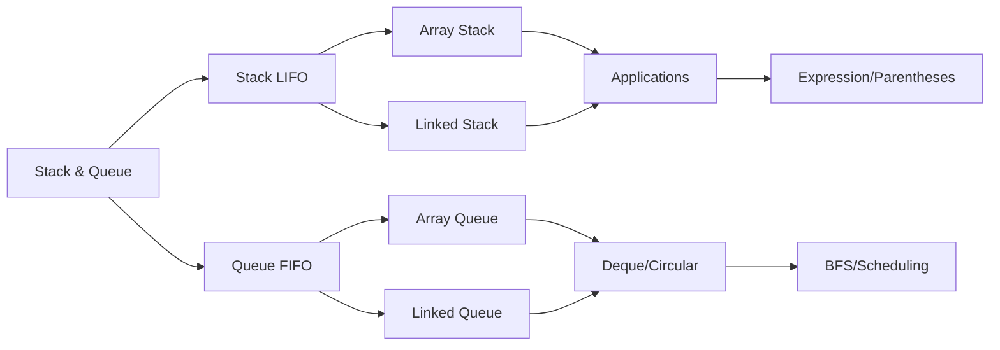

<!-- Clear Language: Keep sentences under 50 words -->
# Stacks and Queues

## Learning Objectives

| Objective | Description |
|-----------|-------------|
| LO1 | Understand stack (LIFO) and queue (FIFO) data structures and their properties |
| LO2 | Implement stacks and queues using arrays and linked lists |
| LO3 | Solve problems using stacks: parenthesis matching, expression evaluation, monotonic stack |
| LO4 | Apply queues for BFS, level-order traversal, and task scheduling |
| LO5 | Implement circular queues, deques, and priority queues |
| LO6 | Use monotonic stack/queue for next greater/smaller element problems |

## Introduction

Trees are hierarchical data structures fundamental to representing organized data. Binary trees, BSTs, and balanced trees (AVL, Red-Black) are essential for efficient searching, sorting, and representing hierarchical relationships in AI systems.

## Prerequisites

- Linked list concepts
- Recursion basics
- Stack/queue usage

## Key Terminology

**Key Terms**: Core vocabulary and concepts for this topic.

**Definition**: Essential terms you must know for interviews and production work.

## Theory

Understanding stacks and queues is fundamental for AI engineers. This section covers the core concepts, underlying principles, and theoretical framework that govern how stacks and queues works in practice.

## Chapter at a Glance

| Section | Topic | Key Concept |
|---------|-------|-------------|
| 8.1 | Stack Fundamentals | LIFO, push, pop, top, operations |
| 8.2 | Queue Fundamentals | FIFO, enqueue, dequeue, front, rear |
| 8.3 | Stack Applications | Parenthesis matching, expression evaluation |
| 8.4 | Monotonic Stack | Next greater element, histogram problems |
| 8.5 | Queue Variants | Circular queue, deque, priority queue |
| 8.6 | Real-World Applications | BFS, cache, task scheduling |

## Chapter Roadmap



A stack (LIFO) and queue (FIFO) are fundamental abstract data types used to organize data with specific access patterns.

## 8.1 Stack Fundamentals

**Stack operations**: push (add to top), pop (remove from top), top/peek (view top), is_empty.

**Array-based stack**:

```python
class ArrayStack:
    def __init__(self):
        self.data = []

    def push(self, val):
        self.data.append(val)  # O(1) amortized

    def pop(self):
        if self.is_empty():
            raise IndexError("Empty stack")
        return self.data.pop()  # O(1)

    def top(self):
        if self.is_empty():
            raise IndexError("Empty stack")
        return self.data[-1]

    def is_empty(self):
        return len(self.data) == 0

    def size(self):
        return len(self.data)
```

**Linked list-based stack**:

```python
class Node:
    def __init__(self, val):
        self.val = val
        self.next = None

class LinkedStack:
    def __init__(self):
        self.head = None

    def push(self, val):
        node = Node(val)
        node.next = self.head
        self.head = node

    def pop(self):
        if self.is_empty():
            raise IndexError("Empty stack")
        val = self.head.val
        self.head = self.head.next
        return val

    def top(self):
        if self.is_empty():
            raise IndexError("Empty stack")
        return self.head.val

    def is_empty(self):
        return self.head is None
```

## 8.2 Queue Fundamentals

**Queue operations**: enqueue (add to rear), dequeue (remove from front), front (view front), rear (view back).

**Array-based circular queue**:

```python
class CircularQueue:
    def __init__(self, capacity):
        self.data = [None] * capacity
        self.capacity = capacity
        self.front = 0
        self.rear = -1
        self.size = 0

    def enqueue(self, val):
        if self.is_full():
            raise IndexError("Queue full")
        self.rear = (self.rear + 1) % self.capacity
        self.data[self.rear] = val
        self.size += 1

    def dequeue(self):
        if self.is_empty():
            raise IndexError("Queue empty")
        val = self.data[self.front]
        self.front = (self.front + 1) % self.capacity
        self.size -= 1
        return val

    def is_empty(self):
        return self.size == 0

    def is_full(self):
        return self.size == self.capacity
```

**Linked list-based queue**:

```python
class LinkedQueue:
    def __init__(self):
        self.head = None
        self.tail = None

    def enqueue(self, val):
        node = Node(val)
        if self.tail:
            self.tail.next = node
        self.tail = node
        if not self.head:
            self.head = node

    def dequeue(self):
        if self.is_empty():
            raise IndexError("Queue empty")
        val = self.head.val
        self.head = self.head.next
        if not self.head:
            self.tail = None
        return val

    def is_empty(self):
        return self.head is None
```

## 8.3 Stack Applications

**Valid parentheses**:

```python
def is_valid_parentheses(s):
    pairs = {")": "(", "}": "{", "]": "["}
    stack = []
    for char in s:
        if char in pairs:
            if not stack or stack[-1] != pairs[char]:
                return False
            stack.pop()
        else:
            stack.append(char)
    return len(stack) == 0

print(is_valid_parentheses("()[]{}"))  # True
print(is_valid_parentheses("([)]"))   # False
```

**Expression evaluation** (infix to postfix):

```python
def infix_to_postfix(expression):
    precedence = {"+": 1, "-": 1, "*": 2, "/": 2, "^": 3}
    result = []
    stack = []
    for char in expression:
        if char.isalnum():
            result.append(char)
        elif char == "(":
            stack.append(char)
        elif char == ")":
            while stack and stack[-1] != "(":
                result.append(stack.pop())
            stack.pop()  # remove "("
        else:
            while stack and stack[-1] != "(" and
                  precedence.get(stack[-1], 0) >= precedence.get(char, 0):
                result.append(stack.pop())
            stack.append(char)
    while stack:
        result.append(stack.pop())
    return "".join(result)

print(infix_to_postfix("A*(B+C)/D"))  # "ABC+*D/"
```

**Evaluate postfix expression**:

```python
def eval_postfix(expr):
    stack = []
    for token in expr:
        if token.isdigit():
            stack.append(int(token))
        else:
            b = stack.pop()
            a = stack.pop()
            if token == "+": stack.append(a + b)
            elif token == "-": stack.append(a - b)
            elif token == "*": stack.append(a * b)
            elif token == "/": stack.append(a // b)
    return stack[0]

print(eval_postfix("23*54*+"))  # (2*3)+(5*4) = 26
```

## 8.4 Monotonic Stack

A monotonic stack maintains elements in increasing or decreasing order. Used for next greater/smaller element problems.

**Next greater element**:

```python
def next_greater_element(nums):
    result = [-1] * len(nums)
    stack = []
    for i, num in enumerate(nums):
        while stack and nums[stack[-1]] < num:
            result[stack.pop()] = num
        stack.append(i)
    return result

print(next_greater_element([4, 5, 2, 25]))  # [5, 25, 25, -1]
```

**Largest rectangle in histogram**:

```python
def largest_rectangle_area(heights):
    stack = []
    max_area = 0
    heights.append(0)  # sentinel
    for i, h in enumerate(heights):
        while stack and heights[stack[-1]] > h:
            height = heights[stack.pop()]
            width = i if not stack else i - stack[-1] - 1
            max_area = max(max_area, height * width)
        stack.append(i)
    return max_area

print(largest_rectangle_area([2, 1, 5, 6, 2, 3]))  # 10
```

**Daily temperatures** (days until warmer):

```python
def daily_temperatures(temps):
    result = [0] * len(temps)
    stack = []
    for i, t in enumerate(temps):
        while stack and temps[stack[-1]] < t:
            prev = stack.pop()
            result[prev] = i - prev
        stack.append(i)
    return result

print(daily_temperatures([73, 74, 75, 71, 69, 72, 76, 73]))

## [1, 1, 4, 2, 1, 1, 0, 0]
```

## 8.5 Queue Variants

**Deque** (double-ended queue): Supports push/pop from both ends.

```python
from collections import deque

dq = deque()
dq.append(1)        # add to right
dq.appendleft(2)    # add to left
dq.pop()            # remove from right
dq.popleft()        # remove from left
```

**Priority queue** (min-heap or max-heap): Elements have priorities.

```python
import heapq

pq = []
heapq.heappush(pq, (3, "task3"))
heapq.heappush(pq, (1, "task1"))
heapq.heappush(pq, (2, "task2"))
while pq:
    priority, task = heapq.heappop(pq)
    print(f"{task}: {priority}")

## task1: 1, task2: 2, task3: 3
```

## 8.6 Real-World Applications

**BFS using queue**:

```python
from collections import deque

def bfs(graph, start):
    visited = set()
    queue = deque([start])
    visited.add(start)
    while queue:
        node = queue.popleft()
        print(node, end=" ")
        for neighbor in graph[node]:
            if neighbor not in visited:
                visited.add(neighbor)
                queue.append(neighbor)

graph = {0: [1, 2], 1: [2], 2: [0, 3], 3: [3]}
bfs(graph, 2)  # 2 0 3 1
```

**Stack for undo/redo**:

```python
class UndoRedo:
    def __init__(self):
        self.undo_stack = []
        self.redo_stack = []

    def action(self, state):
        self.undo_stack.append(state)
        self.redo_stack.clear()

    def undo(self):
        if self.undo_stack:
            self.redo_stack.append(self.undo_stack.pop())

    def redo(self):
        if self.redo_stack:
            self.undo_stack.append(self.redo_stack.pop())
```

---

## TypeScript Parallel

```typescript
class Stack<T> {
    private items: T[] = [];
    push(item: T): void { this.items.push(item); }
    pop(): T | undefined { return this.items.pop(); }
    peek(): T | undefined { return this.items[this.items.length - 1]; }
    isEmpty(): boolean { return this.items.length === 0; }
}

class Queue<T> {
    private items: T[] = [];
    enqueue(item: T): void { this.items.push(item); }
    dequeue(): T | undefined { return this.items.shift(); }
    front(): T | undefined { return this.items[0]; }
    isEmpty(): boolean { return this.items.length === 0; }
}

function isValid(s: string): boolean {
    const map = new Map<string, string>([["}", "{"], ["]", "["], [")", "("]]);
    const stack: string[] = [];
    for (const c of s) {
        if (map.has(c)) { if (stack.pop() !== map.get(c)) return false; }
        else stack.push(c);
    }
    return stack.length === 0;
}
```

---

## Summary

- Stacks follow LIFO (Last-In-First-Out) principle; queues follow FIFO (First-In-First-Out)
- Array-based stacks provide O(1) amortized push/pop; simple and cache-friendly
- Linked-list based queues avoid shifting but use more memory per element
- Parenthesis matching uses a stack to track opening brackets, ensuring proper nesting
- Expression evaluation uses stacks for operator precedence and postfix conversion
- Monotonic stacks maintain sorted order and solve next greater/smaller element in O(n)
- The largest rectangle in histogram uses a monotonic stack to find the maximum area rectangle
- Circular queues reuse array space by wrapping around, avoiding O(n) enqueue/dequeue
- Deques support operations at both ends and are implemented as collections.deque in Python
- Priority queues order elements by priority and are implemented with heaps for O(log n) operations

## Practical Takeaways

| Scenario | Do This | Avoid This |
|----------|---------|------------|
| Parentheses validation | Use stack of opening brackets | Counting brackets without nesting check |
| Next greater element | Monotonic decreasing stack | Nested loops O(n^2) |
| Queue BFS | Use collections.deque | Using list.pop(0) which is O(n) |
| Circular buffer | Use modular arithmetic for front/rear | Resizing array for each enqueue |
| Expression parsing | Stack for operators, postfix evaluation | Recursive descent for simple cases |
| Priority task scheduling | heapq push/pop | Sorting each time |

## Interview Q&A
<details class="tp-qa-card" data-qid="dsa08-q1">
  <summary class="tp-qa-question"><span class="tp-qa-status"></span>
    Q1: What is the difference between a stack and a queue?
  </summary>
  <div class="tp-qa-answer"><p>Stack: LIFO - push/pop at same end. Queue: FIFO - enqueue at rear, dequeue at front.</p></div>
  <button class="tp-qa-mark-btn">✅ Mark Reviewed</button>
  <button class="tp-qa-bookmark-btn">🔖 Bookmark</button>
</details>

<details class="tp-qa-card" data-qid="dsa08-q2">
  <summary class="tp-qa-question"><span class="tp-qa-status"></span>
    Q2: How do you implement a queue using two stacks?
  </summary>
  <div class="tp-qa-answer"><p>Use stack1 for enqueue. For dequeue, if stack2 is empty, pop all from stack1 to stack2, then pop from stack2. Amortized O(1) per operation.</p></div>
  <button class="tp-qa-mark-btn">✅ Mark Reviewed</button>
  <button class="tp-qa-bookmark-btn">🔖 Bookmark</button>
</details>

<details class="tp-qa-card" data-qid="dsa08-q3">
  <summary class="tp-qa-question"><span class="tp-qa-status"></span>
    Q3: Explain the monotonic stack with an example.
  </summary>
  <div class="tp-qa-answer"><p>A monotonic stack maintains elements in increasing/decreasing order. For next greater element, we pop when current > stack top, recording the current as the next greater for the popped index.</p></div>
  <button class="tp-qa-mark-btn">✅ Mark Reviewed</button>
  <button class="tp-qa-bookmark-btn">🔖 Bookmark</button>
</details>

<details class="tp-qa-card" data-qid="dsa08-q4">
  <summary class="tp-qa-question"><span class="tp-qa-status"></span>
    Q4: How do you implement a stack with O(1) min operation?
  </summary>
  <div class="tp-qa-answer"><p>Maintain two stacks: one for values, one for minimums. On push, push min(value, current_min) onto min stack. On pop, pop both. Min is top of min stack.</p></div>
  <button class="tp-qa-mark-btn">✅ Mark Reviewed</button>
  <button class="tp-qa-bookmark-btn">🔖 Bookmark</button>
</details>

<details class="tp-qa-card" data-qid="dsa08-q5">
  <summary class="tp-qa-question"><span class="tp-qa-status"></span>
    Q5: How does a circular queue work?
  </summary>
  <div class="tp-qa-answer"><p>Use a fixed array with front and rear pointers that wrap around using modulo. Avoids O(n) shifting required by linear array queues.</p></div>
  <button class="tp-qa-mark-btn">✅ Mark Reviewed</button>
  <button class="tp-qa-bookmark-btn">🔖 Bookmark</button>
</details>

<details class="tp-qa-card" data-qid="dsa08-q6">
  <summary class="tp-qa-question"><span class="tp-qa-status"></span>
    Q6: Solve the largest rectangle in histogram problem.
  </summary>
  <div class="tp-qa-answer"><p>Use monotonic stack of increasing heights. When a smaller height is encountered, pop larger heights and calculate area using the current index as right boundary.</p></div>
  <button class="tp-qa-mark-btn">✅ Mark Reviewed</button>
  <button class="tp-qa-bookmark-btn">🔖 Bookmark</button>
</details>

<details class="tp-qa-card" data-qid="dsa08-q7">
  <summary class="tp-qa-question"><span class="tp-qa-status"></span>
    Q7: How do you evaluate a postfix expression?
  </summary>
  <div class="tp-qa-answer"><p>Scan left to right. Push numbers onto stack. When operator is encountered, pop two numbers, apply operator, push result. Final stack element is the answer.</p></div>
  <button class="tp-qa-mark-btn">✅ Mark Reviewed</button>
  <button class="tp-qa-bookmark-btn">🔖 Bookmark</button>
</details>

<details class="tp-qa-card" data-qid="dsa08-q8">
  <summary class="tp-qa-question"><span class="tp-qa-status"></span>
    Q8: What is a deque and when would you use it?
  </summary>
  <div class="tp-qa-answer"><p>Deque allows push/pop from both ends. Used for sliding window maximum, palindrome checking, and undo/redo with limited history.</p></div>
  <button class="tp-qa-mark-btn">✅ Mark Reviewed</button>
  <button class="tp-qa-bookmark-btn">🔖 Bookmark</button>
</details>

<details class="tp-qa-card" data-qid="dsa08-q9">
  <summary class="tp-qa-question"><span class="tp-qa-status"></span>
    Q9: How does a priority queue differ from a regular queue?
  </summary>
  <div class="tp-qa-answer"><p>Priority queue orders elements by priority (not insertion order). Implemented with heap: O(log n) insert/delete, O(1) peek. Used for Dijkstra, A*, task scheduling.</p></div>
  <button class="tp-qa-mark-btn">✅ Mark Reviewed</button>
  <button class="tp-qa-bookmark-btn">🔖 Bookmark</button>
</details>

<details class="tp-qa-card" data-qid="dsa08-q10">
  <summary class="tp-qa-question"><span class="tp-qa-status"></span>
    Q10: Implement a stack that supports push, pop, top, and getMin in O(1).
  </summary>
  <div class="tp-qa-answer"><p>Store each value paired with the current minimum: (value, min_so_far). On push, compare new value with top's min. On pop, just pop. getMin returns top's min.</p></div>
  <button class="tp-qa-mark-btn">✅ Mark Reviewed</button>
  <button class="tp-qa-bookmark-btn">🔖 Bookmark</button>
</details>

<details class="tp-qa-card" data-qid="dsa08-q11">
  <summary class="tp-qa-question"><span class="tp-qa-status"></span>
    Q11: Explain the sliding window maximum using deque.
  </summary>
  <div class="tp-qa-answer"><p>Store indices in deque with decreasing values. Before adding new element, remove indices outside window (from front) and smaller elements (from back). Front always has max.</p></div>
  <button class="tp-qa-mark-btn">✅ Mark Reviewed</button>
  <button class="tp-qa-bookmark-btn">🔖 Bookmark</button>
</details>

<details class="tp-qa-card" data-qid="dsa08-q12">
  <summary class="tp-qa-question"><span class="tp-qa-status"></span>
    Q12: How do you check if a string has balanced parentheses?
  </summary>
  <div class="tp-qa-answer"><p>Use stack. For each char, if opening bracket, push. If closing, pop and check if it matches the expected opening bracket. Stack must be empty at end.</p></div>
  <button class="tp-qa-mark-btn">✅ Mark Reviewed</button>
  <button class="tp-qa-bookmark-btn">🔖 Bookmark</button>
</details>

## Chapter Quiz
**Q1**: What is the time complexity of push/pop operations on a stack implemented with dynamic array?

a) O(1) amortized  b) O(n)  c) O(log n)  d) O(n^2)
<details class="tp-qa-card" data-qid="dsa08-quiz1"><summary>Show Answer</summary><div class="tp-qa-answer"><p><strong>Answer: a) O(1) amortized</strong></p></div></details>

**Q2**: Which data structure is used for BFS traversal?
a) Stack  b) Queue  c) Priority Queue  d) Deque
<details class="tp-qa-card" data-qid="dsa08-quiz2"><summary>Show Answer</summary><div class="tp-qa-answer"><p><strong>Answer: b) Queue</strong></p></div></details>

**Q3**: What is the space complexity of the monotonic stack solution for next greater element?
a) O(1)  b) O(n)  c) O(log n)  d) O(n^2)
<details class="tp-qa-card" data-qid="dsa08-quiz3"><summary>Show Answer</summary><div class="tp-qa-answer"><p><strong>Answer: b) O(n)</strong></p></div></details>

**Q4**: Which queue variant allows push/pop at both ends?
a) Circular queue  b) Priority queue  c) Deque  d) Blocking queue
<details class="tp-qa-card" data-qid="dsa08-quiz4"><summary>Show Answer</summary><div class="tp-qa-answer"><p><strong>Answer: c) Deque</strong></p></div></details>

**Q5**: What is the time complexity of accessing the minimum element in a stack with O(1) getMin?
a) O(1)  b) O(n)  c) O(log n)  d) O(n^2)
<details class="tp-qa-card" data-qid="dsa08-quiz5"><summary>Show Answer</summary><div class="tp-qa-answer"><p><strong>Answer: a) O(1)</strong></p></div></details>

## Exercises

**Easy** - Implement a stack using arrays with push, pop, top, isEmpty, and size

**Medium** - Implement a MinStack that supports push, pop, top, and getMin in O(1)

**Medium** - Evaluate a fully parenthesized infix expression using two stacks

**Hard** - Largest rectangle in a histogram - implement the O(n) monotonic stack solution

**Hard** - Implement a queue using stacks where each operation is amortized O(1)

---

## Common Mistakes

1. Not handling null/empty tree cases
2. Confusing tree height vs depth
3. Forgetting that BST property must be maintained
4. Not using level-order traversal when needed
5. Confusing BST with binary tree

## Revision Notes

- BST: left < root < right
- In-order traversal of BST gives sorted order
- Height-balanced trees guarantee O(log n)
- BFS uses queue (level-order), DFS uses stack/recursion
- AVL trees self-balance after insert/delete

## Placement Section

### Top 10 Interview Questions

#### Google Style

1. **Explain the core idea of Stacks and Queues in under 60 seconds, then give a real-world analogy.** — Structure: definition, how it works in one sentence, why it matters, analogy. Follow-up: what would break if you removed this from a production system?

2. **Design a minimal, well-typed function that demonstrates Stacks and Queues.** — Interviewer checks: signature with type hints, edge cases, complexity, and a clean docstring. Follow-up: how does your design behave with empty or malformed input?

3. **What are the common pitfalls when engineers first learn ** — List 3-4, then explain how you would prevent each in a code review.

#### Amazon Style

4. **Describe a production bug caused by misunderstanding Stacks and Queues. How did you diagnose and fix it?** — STAR format: situation, task, action, result. Mention logs, reproduction, root-cause analysis, and the regression test you added.

5. **How would you scale a system that relies on Stacks and Queues from 10 users to 10 million?** — Discuss bottlenecks, caching, monitoring, and when to redesign. Follow-up: what metrics would you track?

#### Microsoft Style

6. **Compare Stacks and Queues with the closest alternative approach. When would you choose each?** — Make a decision matrix: performance, maintainability, ecosystem, learning curve. Follow-up: what would change your decision?

7. **Walk through how you would test a component that depends on Stacks and Queues.** — Unit, integration, property-based tests; mocking boundaries; golden files for outputs.

#### NVIDIA Style

8. **How does Stacks and Queues behave differently at scale — memory, throughput, or precision-wise?** — Connect to data pipelines and model training if applicable. Follow-up: what happens to latency as input grows?

9. **How would you make an implementation of Stacks and Queues run faster on GPU hardware?** — Batch operations, vectorization, avoiding Python loops, reducing data movement.

#### AI Startup Style

10. **Write the smallest possible implementation of Stacks and Queues that is production-quality.** — Include error handling, type hints, and a one-line docstring. Follow-up: what would you refactor first when it grows?

### Resume Tips

- Name Stacks and Queues explicitly in your skills section, paired with a measurable achievement ("Reduced X by 40% using Stacks and Queues").
- Add a bullet describing a project that applies Stacks and Queues to real data, with numbers.
- Mention the tools and libraries you used alongside Stacks and Queues (linters, test frameworks, profiling tools).
- Keep resume bullets under 15 words and start each with an action verb.

### Interview Day Checklist

- Rehearse a 60-second explanation of Stacks and Queues and one real-world analogy.
- Prepare one STAR story about debugging a Stacks and Queues-related production issue.
- Review complexity and edge cases for the classic Stacks and Queues interview problem.
- Have questions ready: how does the team apply Stacks and Queues in production today?
- Test your environment (Python, editor, internet) 15 minutes before the interview.

## True/False

1. **True or False:** Stacks and Queues builds directly on the fundamentals covered in the earlier chapters of this module. — **True.** Every advanced topic in this module assumes the core concepts from the previous chapters.
2. **True or False:** You should write at least one code example for Stacks and Queues before moving to the next chapter. — **True.** Active recall with hands-on code beats passive reading for retention.
3. **True or False:** The complexity analysis for Stacks and Queues is the same regardless of input size. — **False.** Complexity grows with input size; always state best, average, and worst case.
4. **True or False:** Edge cases (empty input, invalid input, boundary values) matter for Stacks and Queues in production. — **True.** Most production bugs come from unhandled edge cases.
5. **True or False:** You should memorize the Stacks and Queues chapter content once and never review it again. — **False.** Spaced repetition (24h, 3 days, 1 week) dramatically improves long-term recall.

## Fill in the Blank

1. The chapter that covers Stacks and Queues is Chapter ___ of this module. — Answer: check the module's table of contents.
2. The time complexity of the standard approach to Stacks and Queues is ___. — Answer: review the theory section and state big-O notation.
3. The main edge case to handle when implementing Stacks and Queues is ___. — Answer: empty or invalid input handling, as discussed in the chapter.
4. The tools commonly used to debug Stacks and Queues issues are ___ and ___. — Answer: refer to the Debugging Guide section of this chapter.
5. The related topic that connects to Stacks and Queues in the next chapter is ___. — Answer: see the Next Topic section.

## Scenario Questions

1. **Scenario:** A teammate ships a change involving Stacks and Queues that breaks production at 3 AM. — Diagnosis: check the recent diff, reproduce locally with the failing input, check logs. Fix: revert, add a regression test, and review the root cause. Prevention: CI tests on edge cases and code review checklist.

2. **Scenario:** Your implementation of Stacks and Queues is correct but too slow for the required latency. — Measure first with a profiler. Common fixes: reduce redundant work, use built-in optimized functions, batch operations, or add caching. Only then consider algorithmic changes.

3. **Scenario:** A new hire asks you to explain Stacks and Queues in five minutes before a customer demo. — Use the 3-part answer: what it is (one sentence), how it works (one example), why it matters (one business impact). Then offer to go deeper after the demo.

4. **Scenario:** Your team's codebase has three different patterns for Stacks and Queues and you must standardize. — Write a short ADR (architecture decision record), pick the pattern with best maintainability, migrate incrementally, and add a linter rule to enforce it.

## Output Questions

1. **What is the output of the simplest correct implementation of Stacks and Queues on an empty input?** — Trace through the code: it should return the documented default (None, 0, empty collection) without raising.
2. **What is the output when the input is at the boundary value?** — Check off-by-one errors and inclusive/exclusive bounds in the chapter's examples.
3. **What does the implementation return when given invalid input types?** — With type hints and validation, it raises a clear error; without, it may fail silently.
4. **What is the output for the sample input given in the chapter's Examples section?** — Re-run the chapter's example code and compare against the documented output.
5. **What is the time complexity output when you profile the implementation at 10x input size?** — Expect the curve matching the chapter's complexity analysis (linear, quadratic, log-linear).

## Difficulty Level

| Level | Time | What It Takes |
|-------|------|---------------|
| Beginner | 1-2 sessions | Read theory, run the chapter examples, solve the Easy exercises |
| Intermediate | 3-5 sessions | Complete Medium exercises, explain Stacks and Queues to someone else |
| Advanced | 1+ week | Solve Hard exercises, optimize for real datasets, answer interview follow-ups |

## Tips & Tricks

- Always write a one-line example of Stacks and Queues from memory before opening the chapter — active recall first.
- Use the chapter's Revision Notes as a checklist: you have mastered Stacks and Queues when you can explain each bullet.
- Pair the chapter quiz with the Flashcards: wrong answers become your next study session's focus.
- For interviews, practice explaining Stacks and Queues twice: once with a technical audience, once with a non-technical audience.
- Keep a personal examples file where you collect your own Stacks and Queues snippets; interviewers love original examples.

## Memory Tricks

- **Acronym**: build a mnemonic from the 5 key concepts of Stacks and Queues listed in the Chapter at a Glance table.
- **Story**: link Stacks and Queues to a familiar story — the analogy in the Visual Analogy section is designed to stick.
- **Number anchor**: remember the complexity of Stacks and Queues by connecting it to a known algorithm of the same class.
- **Color code**: highlight the Theory, Examples, and Common Mistakes sections in different colors when reviewing.
- **Teach-back**: explain Stacks and Queues to an imaginary junior engineer for 2 minutes — gaps in your explanation are gaps in memory.

## Further Reading

- Official documentation for the primary tool or library used in this chapter
- The chapter referenced in Related Topics for the next-level treatment of Stacks and Queues
- The classic textbook chapter on Stacks and Queues (check the Research References below)
- Two blog posts from engineers who debugged real Stacks and Queues problems in production
- The repository of the open-source project that implements Stacks and Queues

## Related Topics

- The previous chapter in this module (see table of contents) — foundational for Stacks and Queues
- The next chapter (see Next Topic below) — builds on Stacks and Queues
- The system design chapters in Module 07 — how Stacks and Queues fits into production architectures
- The interview preparation module — how Stacks and Queues is asked in screening rounds
- The capstone project — where Stacks and Queues is applied end-to-end

## FAQs

1. **Do I need to memorize all of Stacks and Queues, or understand the big picture?** — Understand the big picture first, then memorize the key facts via flashcards and spaced repetition. Interviewers reward depth over breadth.
2. **What if I get stuck on an exercise?** — Re-read the theory section, run the example code, then attempt again. If still stuck after 20 minutes, move on and return the next day.
3. **How much time should I spend on ** — Follow the Study Plan below: 1-2 weeks at 30-60 minutes daily is typical for placement preparation.
4. **Is Stacks and Queues asked in interviews?** — Yes — the Interview Q&A and Placement Section list the exact question styles used by top companies.
5. **What's the fastest way to master ** — Explain it out loud, write code without looking, and review the flashcards within 24 hours and again after 3 days.

## Important Notes

- Stacks and Queues is a core requirement for the rest of this module — do not skip the examples.
- Always analyze complexity (time and space) when working with Stacks and Queues.
- Production correctness means handling edge cases, not just the happy path.
- Interview answers should start with the definition, then the example, then the trade-offs.
- Revisit this chapter after finishing the module; the context from later chapters deepens understanding.

## Historical Context

- Stacks and Queues emerged as a standard practice because early systems failed without it — understanding why helps you explain it in interviews.
- The tools used for Stacks and Queues today evolved from simpler versions; the chapter covers the modern, recommended approach.
- Interviewers value knowing one historical fact about Stacks and Queues — it shows genuine interest, not just cramming.
- The library/tooling ecosystem around Stacks and Queues changes quickly; focus on fundamentals that remain stable.

## Security Considerations

- Never trust external input: validate and sanitize data before processing Stacks and Queues.
- Avoid `eval()` and dynamic code execution on untrusted strings.
- Log errors without leaking sensitive data (keys, PII, internal paths).
- For API contexts, add rate limiting and input size limits.
- Review the chapter's code examples for injection or overflow risks before using them verbatim.

## ML Intuition

- Stacks and Queues appears in ML pipelines at the data-processing layer: feature preparation, batching, and validation.
- Understanding Stacks and Queues helps you debug why a model misbehaves — most ML bugs are data bugs, not model bugs.
- In production ML, the Stacks and Queues concepts from this chapter map directly to NumPy/PyTorch operations on tensors.
- When optimizing ML systems, Stacks and Queues skills let you profile and fix the data path, not just the training loop.
- Interview follow-up: how would you apply Stacks and Queues to a dataset of 10 million records? — Batching and vectorization.

## Analogies

- **Stacks and Queues is like a recipe**: the theory is the ingredients, the examples are the cooking steps, and the exercises are your own kitchen practice.
- **Complexity is like a delivery route**: a linear route visits each stop once; a nested route revisits stops, and you feel it at scale.
- **Edge cases are like weather**: the happy path is a sunny day; production is the storm — build for the storm.
- **The chapter roadmap is a journey map**: each section is a checkpoint; skipping one means getting lost later in the module.

## Capstone Project Link

- [Module Capstone: End-to-End Project](https://github.com/Raushan666java/ai-engineering-journey) — this chapter contributes the Stacks and Queues skills used in the module's capstone project. Complete the exercises here before starting the capstone.

## Flashcards

<details class="tp-qa-card" data-qid="03datastructuresalgorithms-08stacksandqueues-flash1">
  <summary class="tp-qa-question">
    <span class="tp-qa-status"></span>
    What is the time complexity of push/pop operations on a stack implemented with dynamic array?
  </summary>
  <div class="tp-qa-answer">
    <p>a) O(1) amortized</p>
  </div>
</details>

## Research References

- Official documentation of the primary library for Stacks and Queues (linked in Further Reading)
- The classic paper or textbook chapter introducing Stacks and Queues (see References below)
- The standard library reference for Stacks and Queues-related functions
- Engineering blog posts from companies running Stacks and Queues in production at scale
- PEPs and RFCs where applicable (Python and networking standards)

## Open-Source Tools

- The primary library used in this chapter (see the code examples)
- Python standard library modules used in the examples (check the imports)
- Testing: pytest for unit tests of Stacks and Queues code
- Linting and formatting: ruff + black
- Profiling: cProfile or py-spy for performance work on Stacks and Queues

## Debugging Guide

- Start with `print()` or a debugger to inspect intermediate values in Stacks and Queues code.
- Reproduce the failure with the smallest possible input before changing code.
- Check the common failure modes listed in Common Mistakes — most bugs are listed there.
- For performance problems, profile before optimizing: measure, then fix.
- When stuck, re-read the chapter's Examples and compare line by line with your code.
- Use `pdb` or your IDE's debugger to step through the Stacks and Queues example code.

## Mock Interview Section

**Round 1 — Screening (15 min)**
- Explain Stacks and Queues in 60 seconds.
- Write a minimal working example of Stacks and Queues.
- What is the complexity of your example?

**Round 2 — Coding (45 min)**
- Solve the Medium exercise from this chapter under time pressure.
- State your assumptions, then implement with type hints.
- Test with edge cases: empty input, boundary values, invalid input.

**Round 3 — Behavioral + System (30 min)**
- Tell me about a time you debugged a Stacks and Queues problem in a project.
- How would you design a system where Stacks and Queues is used at scale?
- What metrics would you monitor?

**Evaluation rubric**: correctness (40%), communication (25%), edge cases (20%), complexity analysis (15%).

## Optimized Implementation

`python
from typing import Any, Optional

def demonstrate_topic(input_data: list[Any]) -> Optional[float]:
    """Runnable scaffold for Stacks and Queues.

    Replace the body with the optimized implementation from the chapter,
    keeping type hints, docstring, and edge-case handling.
    """
    if not input_data:
        return None
    # Step 1: validate input types
    # Step 2: apply the core Stacks and Queues logic from the Examples section
    # Step 3: return the result with the documented default
    return 0.0
`

- Keeps the function signature stable so tests written against it stay valid.
- Handles the empty-input contract explicitly.
- Add unit tests for the edge cases before implementing the logic (test-first).

## Evaluation Metrics

| Skill | Test | Target |
|-------|------|--------|
| Concept recall | Explain Stacks and Queues without notes | 60-second explanation |
| Code fluency | Write the chapter example from memory | No syntax errors |
| Edge cases | Handle empty/invalid input in exercises | All cases pass |
| Complexity | State time/space for the standard approach | Correct big-O |
| Interview readiness | Answer 5 Interview Q&A questions out loud | Fluent, structured answers |
| Retention | Chapter quiz score after 3 days | 80%+ |

## Real-World Examples

- **Startup**: a small team uses Stacks and Queues daily in their data pipeline — the chapter's examples mirror their code.
- **E-commerce**: Stacks and Queues patterns appear in order processing, inventory checks, and recommendation feeds.
- **Fintech**: Stacks and Queues principles apply to transaction validation and fraud detection flows.
- **ML platform**: Stacks and Queues shows up in feature engineering and model-serving infrastructure.
- **Interview insight**: recruiters look for engineers who can connect Stacks and Queues to the business outcome, not just the code.

## Next Topic

[Binary Trees](09-binary-trees.md)

## Limitations

- Stacks and Queues, like any technique, is not a silver bullet — it has specific cases where it fits best (covered in the theory).
- The examples in this chapter are simplified for learning; production systems add validation, monitoring, and error handling.
- Performance of Stacks and Queues depends on input size and distribution — always benchmark for your own data.
- This chapter covers fundamentals; specialized edge cases are explored in later chapters and the capstone.
