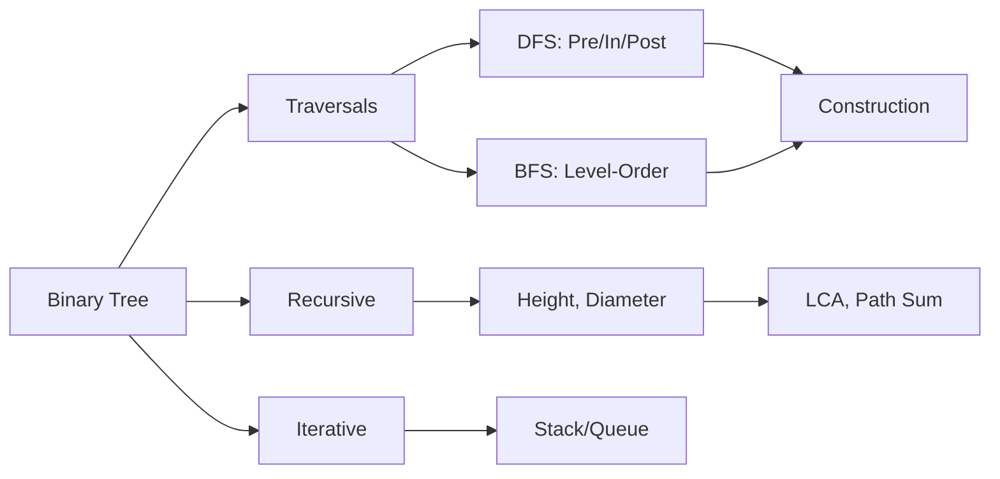

# Binary Trees

## Learning Objectives

| Objective | Description |
|-----------|-------------|
| LO1 | Understand binary tree structure, terminology, and properties |
| LO2 | Implement tree traversals: inorder, preorder, postorder, level-order |
| LO3 | Solve tree problems using recursion and iterative approaches |
| LO4 | Calculate tree height, diameter, and path-related properties |
| LO5 | Build trees from traversal sequences |
| LO6 | Apply DFS and BFS strategies to binary tree problems |

## Chapter at a Glance

| Section | Topic | Key Concept |
|---------|-------|-------------|
| 9.1 | Binary Tree Fundamentals | Nodes, edges, root, leaf, height |
| 9.2 | Tree Traversals | Preorder, inorder, postorder, level-order |
| 9.3 | Recursive Tree Problems | Max depth, diameter, balanced tree |
| 9.4 | Iterative Traversals | Stack-based DFS, queue-based BFS |
| 9.5 | Tree Construction | Build from inorder/preorder/postorder |
| 9.6 | Advanced Problems | LCA, serialize, max path sum |

## Chapter Roadmap




A binary tree is a hierarchical data structure where each node has at most two children: left and right.

## 9.1 Binary Tree Fundamentals

```python
class TreeNode:
    def __init__(self, val=0, left=None, right=None):
        self.val = val
        self.left = left
        self.right = right

# Build:     1
#          / \
#         2   3
#        / \   \
#       4   5   6
root = TreeNode(1)
root.left = TreeNode(2, TreeNode(4), TreeNode(5))
root.right = TreeNode(3, None, TreeNode(6))

# Tree properties
def count_nodes(root):
    if not root: return 0
    return 1 + count_nodes(root.left) + count_nodes(root.right)

def height(root):
    if not root: return -1  # edge-based height
    return 1 + max(height(root.left), height(root.right))
```

## 9.2 Tree Traversals

**Preorder** (Root-Left-Right):

def preorder(root):
    if not root: return []
    return [root.val] + preorder(root.left) + preorder(root.right)
```

**Inorder** (Left-Root-Right):

```python
def inorder(root):
    if not root: return []
    return inorder(root.left) + [root.val] + inorder(root.right)

# Inorder of BST gives sorted order
```

**Postorder** (Left-Right-Root):

```python
def postorder(root):
    if not root: return []
    return postorder(root.left) + postorder(root.right) + [root.val]
```

**Level-order** (BFS):

```python
from collections import deque

def level_order(root):
    if not root: return []
    result = []
    queue = deque([root])
    while queue:
        level = []
        for _ in range(len(queue)):
            node = queue.popleft()
            level.append(node.val)
            if node.left: queue.append(node.left)
            if node.right: queue.append(node.right)
        result.append(level)
    return result
```

## 9.3 Recursive Tree Problems

**Maximum depth of binary tree**:

```python
def max_depth(root):
    if not root: return 0
    return 1 + max(max_depth(root.left), max_depth(root.right))
```

**Diameter of binary tree**:

```python
def diameter_of_binary_tree(root):
    diameter = 0

    def dfs(node):
        nonlocal diameter
        if not node: return 0
        left = dfs(node.left)
        right = dfs(node.right)
        diameter = max(diameter, left + right)
        return 1 + max(left, right)

    dfs(root)
    return diameter
```

**Balanced binary tree** (height difference <= 1):

```python
def is_balanced(root):
    def dfs(node):
        if not node: return (True, 0)
        left_balanced, left_h = dfs(node.left)
        right_balanced, right_h = dfs(node.right)
        balanced = (left_balanced and right_balanced and 
                   abs(left_h - right_h) <= 1)
        return (balanced, 1 + max(left_h, right_h))
    return dfs(root)[0]
```

## 9.4 Iterative Traversals

**Iterative preorder**:

```python
def preorder_iterative(root):
    if not root: return []
    stack, result = [root], []
    while stack:
        node = stack.pop()
        result.append(node.val)
        if node.right: stack.append(node.right)
        if node.left: stack.append(node.left)
    return result
```

**Iterative inorder**:

```python
def inorder_iterative(root):
    stack, result = [], []
    curr = root
    while stack or curr:
        while curr:
            stack.append(curr)
            curr = curr.left
        curr = stack.pop()
        result.append(curr.val)
        curr = curr.right
    return result
```

## 9.5 Tree Construction

**Build tree from inorder and preorder**:

```python
def build_tree(preorder, inorder):
    if not preorder or not inorder:
        return None
    root_val = preorder[0]
    root = TreeNode(root_val)
    mid = inorder.index(root_val)
    root.left = build_tree(preorder[1:mid+1], inorder[:mid])
    root.right = build_tree(preorder[mid+1:], inorder[mid+1:])
    return root
```

## 9.6 Advanced Problems

**Lowest common ancestor (LCA)**:

```python
def lowest_common_ancestor(root, p, q):
    if not root or root == p or root == q:
        return root
    left = lowest_common_ancestor(root.left, p, q)
    right = lowest_common_ancestor(root.right, p, q)
    if left and right:
        return root  # p and q in different subtrees
    return left or right
```

**Maximum path sum** (any node to any node):

```python
def max_path_sum(root):
    max_sum = float("-inf")

    def dfs(node):
        nonlocal max_sum
        if not node: return 0
        left = max(dfs(node.left), 0)
        right = max(dfs(node.right), 0)
        max_sum = max(max_sum, left + right + node.val)
        return node.val + max(left, right)

    dfs(root)
    return max_sum
```

**Serialize and deserialize**:

```python
def serialize(root):
    def dfs(node):
        if not node: return ["null"]
        return [str(node.val)] + dfs(node.left) + dfs(node.right)
    return ",".join(dfs(root))

def deserialize(data):
    vals = data.split(",")
    def dfs():
        v = vals.pop(0)
        if v == "null": return None
        node = TreeNode(int(v))
        node.left = dfs()
        node.right = dfs()
        return node
    return dfs()
```

---

## TypeScript Parallel

```typescript
class TreeNode {
    val: number;
    left: TreeNode | null = null;
    right: TreeNode | null = null;
    constructor(val: number) { this.val = val; }
}

function maxDepth(root: TreeNode | null): number {
    if (!root) return 0;
    return 1 + Math.max(maxDepth(root.left), maxDepth(root.right));
}

function inorderTraversal(root: TreeNode | null): number[] {
    const result: number[] = [];
    const stack: TreeNode[] = [];
    let curr = root;
    while (stack.length || curr) {
        while (curr) { stack.push(curr); curr = curr.left; }
        curr = stack.pop()!;
        result.push(curr.val);
        curr = curr.right;
    }
    return result;
}
```

---

## Summary

- Binary trees are hierarchical structures with each node having at most two children (left and right)
- Preorder traversal visits root before children; useful for tree copying and serialization
- Inorder traversal visits left subtree, then root, then right subtree; gives sorted order for BSTs
- Postorder traversal visits children before root; useful for tree deletion and expression evaluation
- Level-order traversal (BFS) visits nodes level by level using a queue
- Recursive solutions for tree problems follow a divide-and-conquer pattern with clear base cases
- Iterative traversals use explicit stacks (DFS) or queues (BFS) to avoid recursion overhead
- The diameter of a tree is the longest path between any two nodes, found via DFS
- LCA finds the deepest node that has both target nodes as descendants
- Binary trees can be serialized to strings and deserialized back using preorder with null markers

## Practical Takeaways

| Scenario | Do This | Avoid This |
|----------|---------|------------|
| Tree traversal | Choose based on problem: preorder for copy, inorder for sorted, postorder for delete | Using wrong traversal order |
| Recursive depth | Use iterative for very deep trees (stack overflow risk) | Recursion without depth limit check |
| Diameter calculation | DFS returning height while tracking max path | Two separate traversals |
| LCA | Recursive divide-and-conquer | Path-finding approach (O(n^2)) |
| Tree construction | Use hash map for O(1) inorder index lookup | Linear search each recursive call |
| Level-order | Queue-based BFS | Recursive approach with depth tracking |


## Interview Q&A
<details class="tp-qa-card" data-qid="dsa09-q1">
  <summary class="tp-qa-question"><span class="tp-qa-status"></span>
    Q1: What are the differences between tree traversals?
  </summary>
  <div class="tp-qa-answer"><p>Preorder: Root-Left-Right (for copying trees). Inorder: Left-Root-Right (sorted in BST). Postorder: Left-Right-Root (for deletion). Level-order: BFS using queue.</p></div>
  <button class="tp-qa-mark-btn">? Mark Reviewed</button>
  <button class="tp-qa-bookmark-btn">?? Bookmark</button>
</details>

<details class="tp-qa-card" data-qid="dsa09-q2">
  <summary class="tp-qa-question"><span class="tp-qa-status"></span>
    Q2: How do you find the height of a binary tree?
  </summary>
  <div class="tp-qa-answer"><p>Recursively: height = 1 + max(height(left), height(right)). Base case: empty node returns 0 (node-based) or -1 (edge-based).</p></div>
  <button class="tp-qa-mark-btn">? Mark Reviewed</button>
  <button class="tp-qa-bookmark-btn">?? Bookmark</button>
</details>

<details class="tp-qa-card" data-qid="dsa09-q3">
  <summary class="tp-qa-question"><span class="tp-qa-status"></span>
    Q3: What is the diameter of a binary tree?
  </summary>
  <div class="tp-qa-answer"><p>The longest path between any two nodes (may or may not pass through root). Use DFS: for each node, diameter = max(diameter, left_height + right_height).</p></div>
  <button class="tp-qa-mark-btn">? Mark Reviewed</button>
  <button class="tp-qa-bookmark-btn">?? Bookmark</button>
</details>

<details class="tp-qa-card" data-qid="dsa09-q4">
  <summary class="tp-qa-question"><span class="tp-qa-status"></span>
    Q4: How do you check if a binary tree is balanced?
  </summary>
  <div class="tp-qa-answer"><p>For each node, the height difference between left and right subtrees must be at most 1. Return both balanced flag and height from DFS.</p></div>
  <button class="tp-qa-mark-btn">? Mark Reviewed</button>
  <button class="tp-qa-bookmark-btn">?? Bookmark</button>
</details>

<details class="tp-qa-card" data-qid="dsa09-q5">
  <summary class="tp-qa-question"><span class="tp-qa-status"></span>
    Q5: How do you perform level-order traversal?
  </summary>
  <div class="tp-qa-answer"><p>Use a queue. Enqueue root. While queue not empty, process all nodes at current level, enqueuing their children for the next level.</p></div>
  <button class="tp-qa-mark-btn">? Mark Reviewed</button>
  <button class="tp-qa-bookmark-btn">?? Bookmark</button>
</details>

<details class="tp-qa-card" data-qid="dsa09-q6">
  <summary class="tp-qa-question"><span class="tp-qa-status"></span>
    Q6: Explain LCA in a binary tree.
  </summary>
  <div class="tp-qa-answer"><p>LCA is the deepest node that has both targets in its subtree. If root matches either target, return root. If left and right both return non-null, root is LCA.</p></div>
  <button class="tp-qa-mark-btn">? Mark Reviewed</button>
  <button class="tp-qa-bookmark-btn">?? Bookmark</button>
</details>

<details class="tp-qa-card" data-qid="dsa09-q7">
  <summary class="tp-qa-question"><span class="tp-qa-status"></span>
    Q7: How do you serialize and deserialize a binary tree?
  </summary>
  <div class="tp-qa-answer"><p>Use preorder traversal with null markers. Serialize as comma-separated string. Deserialize by reading values and recursively building nodes.</p></div>
  <button class="tp-qa-mark-btn">? Mark Reviewed</button>
  <button class="tp-qa-bookmark-btn">?? Bookmark</button>
</details>

<details class="tp-qa-card" data-qid="dsa09-q8">
  <summary class="tp-qa-question"><span class="tp-qa-status"></span>
    Q8: What is the maximum path sum problem?
  </summary>
  <div class="tp-qa-answer"><p>Find the path with maximum sum between any two nodes. Use DFS returning the max single-path sum, tracking the max of left+right+node.val as potential answer.</p></div>
  <button class="tp-qa-mark-btn">? Mark Reviewed</button>
  <button class="tp-qa-bookmark-btn">?? Bookmark</button>
</details>

<details class="tp-qa-card" data-qid="dsa09-q9">
  <summary class="tp-qa-question"><span class="tp-qa-status"></span>
    Q9: How do you build a tree from inorder and preorder?
  </summary>
  <div class="tp-qa-answer"><p>First element of preorder is root. Find it in inorder to split left/right subtrees. Recursively build using appropriate slices.</p></div>
  <button class="tp-qa-mark-btn">? Mark Reviewed</button>
  <button class="tp-qa-bookmark-btn">?? Bookmark</button>
</details>

<details class="tp-qa-card" data-qid="dsa09-q10">
  <summary class="tp-qa-question"><span class="tp-qa-status"></span>
    Q10: Compare recursive and iterative approaches for tree problems.
  </summary>
  <div class="tp-qa-answer"><p>Recursive: elegant, divide-and-conquer, risk of stack overflow for deep trees. Iterative: more complex, uses explicit stack/queue, avoids stack overflow.</p></div>
  <button class="tp-qa-mark-btn">? Mark Reviewed</button>
  <button class="tp-qa-bookmark-btn">?? Bookmark</button>
</details>

<details class="tp-qa-card" data-qid="dsa09-q11">
  <summary class="tp-qa-question"><span class="tp-qa-status"></span>
    Q11: How do you count all nodes in a complete binary tree in less than O(n)?
  </summary>
  <div class="tp-qa-answer"><p>Calculate left and right heights. If equal, use formula 2^h - 1. Otherwise, recursively count left + 1 + right. O(log^2 n) for complete trees.</p></div>
  <button class="tp-qa-mark-btn">? Mark Reviewed</button>
  <button class="tp-qa-bookmark-btn">?? Bookmark</button>
</details>

<details class="tp-qa-card" data-qid="dsa09-q12">
  <summary class="tp-qa-question"><span class="tp-qa-status"></span>
    Q12: What is the difference between a binary tree and a BST?
  </summary>
  <div class="tp-qa-answer"><p>Binary tree: no ordering constraint. BST: left subtree values < root < right subtree values. BST enables O(log n) search, insert, delete if balanced.</p></div>
  <button class="tp-qa-mark-btn">? Mark Reviewed</button>
  <button class="tp-qa-bookmark-btn">?? Bookmark</button>
</details>

## Chapter Quiz
**Q1**: Which traversal gives sorted order in a BST?
a) Preorder  b) Inorder  c) Postorder  d) Level-order
<details class="tp-qa-card" data-qid="dsa09-quiz1"><summary>Show Answer</summary><div class="tp-qa-answer"><p><strong>Answer: b) Inorder</strong></p></div></details>

**Q2**: What is the time complexity of level-order traversal?
a) O(log n)  b) O(n)  c) O(n^2)  d) O(2^n)
<details class="tp-qa-card" data-qid="dsa09-quiz2"><summary>Show Answer</summary><div class="tp-qa-answer"><p><strong>Answer: b) O(n)</strong></p></div></details>

**Q3**: In LCA, what does it mean if left and right both return non-null?
a) p and q are in the same subtree  b) root is the LCA  c) One target is missing  d) Tree is empty
<details class="tp-qa-card" data-qid="dsa09-quiz3"><summary>Show Answer</summary><div class="tp-qa-answer"><p><strong>Answer: b) root is the LCA</strong></p></div></details>

**Q4**: What is the height of a tree with 1 node (node-based)?
a) -1  b) 0  c) 1  d) 2
<details class="tp-qa-card" data-qid="dsa09-quiz4"><summary>Show Answer</summary><div class="tp-qa-answer"><p><strong>Answer: b) 0</strong></p><p>Node-based height of a single node is 0. Edge-based would be -1.</p></div></details>

**Q5**: Which data structure is used for iterative preorder traversal?
a) Queue  b) Stack  c) Deque  d) Priority Queue
<details class="tp-qa-card" data-qid="dsa09-quiz5"><summary>Show Answer</summary><div class="tp-qa-answer"><p><strong>Answer: b) Stack</strong></p></div></details>

## Exercises

**Easy** - Traverse a tree in inorder, preorder, and postorder recursively

**Medium** - Check if a binary tree is symmetric (mirror of itself)

**Medium** - Find all root-to-leaf paths in a binary tree

**Hard** - Serialize and deserialize a binary tree (any format)

**Hard** - Find the distance between two nodes in a binary tree (number of edges in path)

---

> **Next**: [10 - Binary Search Trees ?](10-binary-search-trees.md)
