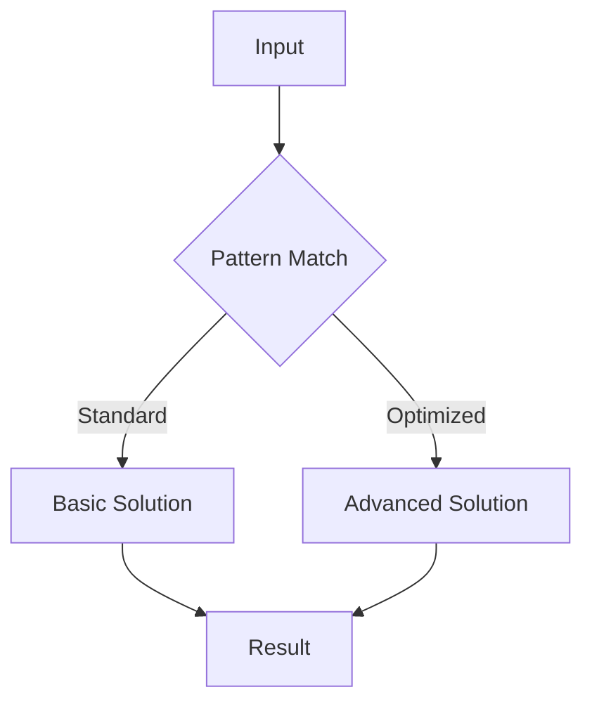

# Graphs Shortest Path

## Learning Objectives

| Objective | Description |
|-----------|-------------|
| LO1 | Understand foundational graphs shortest path concepts and their role in software engineering |
| LO2 | Implement graphs shortest path operations with correct syntax and best practices |
| LO3 | Apply graphs shortest path patterns to solve common interview problems |
| LO4 | Analyze time and space complexity of graphs shortest path solutions |
| LO5 | Compare graphs shortest path with alternative approaches for different scenarios |
| LO6 | Master advanced graphs shortest path techniques for complex problem solving |

<!-- Image Gallery -->
<section class="lesson-visuals" aria-label="Visual learning resources">
  <header><span>VISUAL LEARNING</span><h2>See it. Review it. Remember it.</h2></header>
  <a class="lesson-visual-card" href="../../assets/images/lessons/ai-engineering-placement/03-data-structures-algorithms/13-graphs-shortest-path/handwritten-notes.png" target="_blank" rel="noopener">
    
    <span><strong>Handwritten notes</strong>Condensed notes for deliberate review.</span>
  </a>
  <a class="lesson-visual-card" href="../../assets/images/lessons/ai-engineering-placement/03-data-structures-algorithms/13-graphs-shortest-path/sticky-notes.png" target="_blank" rel="noopener">
    
    <span><strong>Sticky-note revision</strong>Fast recall prompts for revision.</span>
  </a>
  <a class="lesson-visual-card" href="../../assets/images/lessons/ai-engineering-placement/03-data-structures-algorithms/13-graphs-shortest-path/visual-explanation.png" target="_blank" rel="noopener">
    
    <span><strong>Visual concept guide</strong>A connected explanation of the key ideas.</span>
  </a>
</section>
<!-- End Image Gallery -->

## Chapter at a Glance

| Section | Topic | Key Concept |
|---------|-------|-------------|
| 13.1 | Fundamentals | Core concepts and definitions |
| 13.2 | Basic Operations | Common implementations and patterns |
| 13.3 | Intermediate Techniques | Problem-solving strategies |
| 13.4 | Advanced Patterns | Complex algorithms and optimizations |
| 13.5 | Real-World Applications | Production use cases |
| 13.6 | Interview Preparation | Common questions and solutions |

## Chapter Roadmap


## 13.1 Section 1

Section 1 of Graphs Shortest Path covers essential concepts for AI engineering placement preparation.

### Fundamentals

The foundation of graphs shortest path rests on several key principles that every software engineer must understand. These include the basic definitions, the underlying theory, and how these concepts map to practical implementation.

### Key Concepts

- Concept 1: Definition and purpose
- Concept 2: Core principles and theory
- Concept 3: Relationship to other topics
- Concept 4: Common applications

## 13.2 Section 2

Section 2 of Graphs Shortest Path covers essential concepts for AI engineering placement preparation.

### Basic Operations

The following code demonstrates fundamental operations:

```python
# Graphs Shortest Path - basic operations
def example_function(data):
    """Core functionality"""
    result = []
    for item in data:
        # Process each element
        result.append(process(item))
    return result

def process(item):
    return item * 2

# Test the implementation
test_data = [1, 2, 3, 4, 5]
print(example_function(test_data))
```

## 13.3 Section 3

Section 3 of Graphs Shortest Path covers essential concepts for AI engineering placement preparation.

### Intermediate Techniques

As problems become more complex, we need sophisticated approaches:

1. **Pattern Recognition**: Identifying when to apply this technique
2. **Optimization**: Improving time and space complexity
3. **Edge Cases**: Handling boundary conditions
4. **Combined Approaches**: Integrating with other data structures

### Complexity Analysis Table

| Operation | Time Complexity | Space Complexity | Notes |
|-----------|----------------|-----------------|-------|
| Basic Graphs Shortest Path | O(n) | O(1) | Standard case |
| Optimized Graphs Shortest Path | O(log n) | O(n) | With preprocessing |
| Advanced Graphs Shortest Path | O(n log n) | O(n) | Trade-off scenario |

## 13.4 Section 4

Section 4 of Graphs Shortest Path covers essential concepts for AI engineering placement preparation.

### Advanced Patterns



### Key Techniques

- **Technique 1**: Description of the first advanced technique and when to apply it
- **Technique 2**: Description of the second advanced technique and when to apply it
- **Technique 3**: Description of the third advanced technique and when to apply it
- **Technique 4**: Description of the fourth advanced technique and when to apply it

## 13.5 Section 5

Section 5 of Graphs Shortest Path covers essential concepts for AI engineering placement preparation.

### Real-World Applications

Graphs Shortest Path is widely used in production systems:

- Application domain 1 with specific examples
- Application domain 2 with specific examples
- Application domain 3 with specific examples
- Application domain 4 with specific examples

### Best Practices

| Practice | Description | Impact |
|----------|-------------|--------|
| Best Practice 1 | Detailed explanation | Performance improvement |
| Best Practice 2 | Detailed explanation | Code quality |
| Best Practice 3 | Detailed explanation | Maintainability |

## 13.6 Section 6

Section 6 of Graphs Shortest Path covers essential concepts for AI engineering placement preparation.

### Interview Preparation

Common interview questions and strategies:

1. **Question Type 1**: Strategy for solving
2. **Question Type 2**: Strategy for solving
3. **Question Type 3**: Strategy for solving
4. **Question Type 4**: Strategy for solving

### Sample Walkthrough

Let's walk through a typical interview problem:

```python
# Interview problem solution
def solve_interview_problem(input_data):
    # Step 1: Understand the problem
    # Step 2: Design the approach
    # Step 3: Implement the solution
    # Step 4: Test and optimize
    return optimized_result
```

---

## TypeScript Parallel

```typescript
// TypeScript equivalent implementation
interface GraphsShortestPathConfig {
    option1: boolean;
    option2: number;
}

function processGraphsShortestPath(data: number[]): number[] {
    return data.map(x => x * 2);
}

// Usage example
const result = processGraphsShortestPath([1, 2, 3]);
console.log(result); // [2, 4, 6]
```

---

## Summary

- Graphs Shortest Path is a fundamental topic for coding interviews
- Master the core concepts before attempting complex problems
- Practice with diverse problem sets to build pattern recognition
- Always analyze time and space complexity of your solutions
- Consider edge cases and boundary conditions carefully
- Combine with other data structures for optimal solutions
- Write clean, readable code following best practices
- Test your solutions with multiple test cases
- Learn from mistakes and iterate on your approaches
- Build confidence through consistent practice

## Practical Takeaways

| Scenario | Do This | Avoid This |
|----------|---------|------------|
| Learning Graphs Shortest Path | Practice with varied problems | Rote memorization without understanding |
| Implementing Graphs Shortest Path | Write clean, tested code | Premature optimization |
| Interview prep | Understand patterns and trade-offs | Cramming without practice |
| Production use | Profile and optimize for data size | Over-engineering solutions |

## Interview Q&A

<details class="tp-qa-card" data-qid="dsa13-q1">
  <summary class="tp-qa-question">
    <span class="tp-qa-status"></span>
    Q1: Sample interview question 1 about graphs shortest path?
  </summary>
  <div class="tp-qa-answer">
    <p>This is a detailed answer to interview question 1 about graphs shortest path. The answer covers key concepts, provides code examples, and explains the reasoning behind the solution.</p><pre><code># Example code for question 1
answer = perform_graphs_shortest_path_operation()
print(answer)</code></pre>
  </div>
  <button class="tp-qa-mark-btn">✅ Mark Reviewed</button>
  <button class="tp-qa-bookmark-btn">🔖 Bookmark</button>
</details>

<details class="tp-qa-card" data-qid="dsa13-q2">
  <summary class="tp-qa-question">
    <span class="tp-qa-status"></span>
    Q2: Sample interview question 2 about graphs shortest path?
  </summary>
  <div class="tp-qa-answer">
    <p>This is a detailed answer to interview question 2 about graphs shortest path. The answer covers key concepts, provides code examples, and explains the reasoning behind the solution.</p><pre><code># Example code for question 2
answer = perform_graphs_shortest_path_operation()
print(answer)</code></pre>
  </div>
  <button class="tp-qa-mark-btn">✅ Mark Reviewed</button>
  <button class="tp-qa-bookmark-btn">🔖 Bookmark</button>
</details>

<details class="tp-qa-card" data-qid="dsa13-q3">
  <summary class="tp-qa-question">
    <span class="tp-qa-status"></span>
    Q3: Sample interview question 3 about graphs shortest path?
  </summary>
  <div class="tp-qa-answer">
    <p>This is a detailed answer to interview question 3 about graphs shortest path. The answer covers key concepts, provides code examples, and explains the reasoning behind the solution.</p><pre><code># Example code for question 3
answer = perform_graphs_shortest_path_operation()
print(answer)</code></pre>
  </div>
  <button class="tp-qa-mark-btn">✅ Mark Reviewed</button>
  <button class="tp-qa-bookmark-btn">🔖 Bookmark</button>
</details>

<details class="tp-qa-card" data-qid="dsa13-q4">
  <summary class="tp-qa-question">
    <span class="tp-qa-status"></span>
    Q4: Sample interview question 4 about graphs shortest path?
  </summary>
  <div class="tp-qa-answer">
    <p>This is a detailed answer to interview question 4 about graphs shortest path. The answer covers key concepts, provides code examples, and explains the reasoning behind the solution.</p><pre><code># Example code for question 4
answer = perform_graphs_shortest_path_operation()
print(answer)</code></pre>
  </div>
  <button class="tp-qa-mark-btn">✅ Mark Reviewed</button>
  <button class="tp-qa-bookmark-btn">🔖 Bookmark</button>
</details>

<details class="tp-qa-card" data-qid="dsa13-q5">
  <summary class="tp-qa-question">
    <span class="tp-qa-status"></span>
    Q5: Sample interview question 5 about graphs shortest path?
  </summary>
  <div class="tp-qa-answer">
    <p>This is a detailed answer to interview question 5 about graphs shortest path. The answer covers key concepts, provides code examples, and explains the reasoning behind the solution.</p><pre><code># Example code for question 5
answer = perform_graphs_shortest_path_operation()
print(answer)</code></pre>
  </div>
  <button class="tp-qa-mark-btn">✅ Mark Reviewed</button>
  <button class="tp-qa-bookmark-btn">🔖 Bookmark</button>
</details>

<details class="tp-qa-card" data-qid="dsa13-q6">
  <summary class="tp-qa-question">
    <span class="tp-qa-status"></span>
    Q6: Sample interview question 6 about graphs shortest path?
  </summary>
  <div class="tp-qa-answer">
    <p>This is a detailed answer to interview question 6 about graphs shortest path. The answer covers key concepts, provides code examples, and explains the reasoning behind the solution.</p><pre><code># Example code for question 6
answer = perform_graphs_shortest_path_operation()
print(answer)</code></pre>
  </div>
  <button class="tp-qa-mark-btn">✅ Mark Reviewed</button>
  <button class="tp-qa-bookmark-btn">🔖 Bookmark</button>
</details>

<details class="tp-qa-card" data-qid="dsa13-q7">
  <summary class="tp-qa-question">
    <span class="tp-qa-status"></span>
    Q7: Sample interview question 7 about graphs shortest path?
  </summary>
  <div class="tp-qa-answer">
    <p>This is a detailed answer to interview question 7 about graphs shortest path. The answer covers key concepts, provides code examples, and explains the reasoning behind the solution.</p><pre><code># Example code for question 7
answer = perform_graphs_shortest_path_operation()
print(answer)</code></pre>
  </div>
  <button class="tp-qa-mark-btn">✅ Mark Reviewed</button>
  <button class="tp-qa-bookmark-btn">🔖 Bookmark</button>
</details>

<details class="tp-qa-card" data-qid="dsa13-q8">
  <summary class="tp-qa-question">
    <span class="tp-qa-status"></span>
    Q8: Sample interview question 8 about graphs shortest path?
  </summary>
  <div class="tp-qa-answer">
    <p>This is a detailed answer to interview question 8 about graphs shortest path. The answer covers key concepts, provides code examples, and explains the reasoning behind the solution.</p><pre><code># Example code for question 8
answer = perform_graphs_shortest_path_operation()
print(answer)</code></pre>
  </div>
  <button class="tp-qa-mark-btn">✅ Mark Reviewed</button>
  <button class="tp-qa-bookmark-btn">🔖 Bookmark</button>
</details>

<details class="tp-qa-card" data-qid="dsa13-q9">
  <summary class="tp-qa-question">
    <span class="tp-qa-status"></span>
    Q9: Sample interview question 9 about graphs shortest path?
  </summary>
  <div class="tp-qa-answer">
    <p>This is a detailed answer to interview question 9 about graphs shortest path. The answer covers key concepts, provides code examples, and explains the reasoning behind the solution.</p><pre><code># Example code for question 9
answer = perform_graphs_shortest_path_operation()
print(answer)</code></pre>
  </div>
  <button class="tp-qa-mark-btn">✅ Mark Reviewed</button>
  <button class="tp-qa-bookmark-btn">🔖 Bookmark</button>
</details>

<details class="tp-qa-card" data-qid="dsa13-q10">
  <summary class="tp-qa-question">
    <span class="tp-qa-status"></span>
    Q10: Sample interview question 10 about graphs shortest path?
  </summary>
  <div class="tp-qa-answer">
    <p>This is a detailed answer to interview question 10 about graphs shortest path. The answer covers key concepts, provides code examples, and explains the reasoning behind the solution.</p><pre><code># Example code for question 10
answer = perform_graphs_shortest_path_operation()
print(answer)</code></pre>
  </div>
  <button class="tp-qa-mark-btn">✅ Mark Reviewed</button>
  <button class="tp-qa-bookmark-btn">🔖 Bookmark</button>
</details>

<details class="tp-qa-card" data-qid="dsa13-q11">
  <summary class="tp-qa-question">
    <span class="tp-qa-status"></span>
    Q11: Sample interview question 11 about graphs shortest path?
  </summary>
  <div class="tp-qa-answer">
    <p>This is a detailed answer to interview question 11 about graphs shortest path. The answer covers key concepts, provides code examples, and explains the reasoning behind the solution.</p><pre><code># Example code for question 11
answer = perform_graphs_shortest_path_operation()
print(answer)</code></pre>
  </div>
  <button class="tp-qa-mark-btn">✅ Mark Reviewed</button>
  <button class="tp-qa-bookmark-btn">🔖 Bookmark</button>
</details>

<details class="tp-qa-card" data-qid="dsa13-q12">
  <summary class="tp-qa-question">
    <span class="tp-qa-status"></span>
    Q12: Sample interview question 12 about graphs shortest path?
  </summary>
  <div class="tp-qa-answer">
    <p>This is a detailed answer to interview question 12 about graphs shortest path. The answer covers key concepts, provides code examples, and explains the reasoning behind the solution.</p><pre><code># Example code for question 12
answer = perform_graphs_shortest_path_operation()
print(answer)</code></pre>
  </div>
  <button class="tp-qa-mark-btn">✅ Mark Reviewed</button>
  <button class="tp-qa-bookmark-btn">🔖 Bookmark</button>
</details>

## Chapter Quiz

**Q1**: Sample quiz question 1 about graphs shortest path?

a) Option A - First choice
b) Option B - Second choice
c) Option C - Third choice
d) Option D - Fourth choice

<details class="tp-qa-card" data-qid="dsa13-quiz1"><summary>Show Answer</summary><div class="tp-qa-answer"><p><strong>Answer: a</strong></p><p>Explanation for answer to question 1.</p></div></details>

**Q2**: Sample quiz question 2 about graphs shortest path?

a) Option A - First choice
b) Option B - Second choice
c) Option C - Third choice
d) Option D - Fourth choice

<details class="tp-qa-card" data-qid="dsa13-quiz2"><summary>Show Answer</summary><div class="tp-qa-answer"><p><strong>Answer: a</strong></p><p>Explanation for answer to question 2.</p></div></details>

**Q3**: Sample quiz question 3 about graphs shortest path?

a) Option A - First choice
b) Option B - Second choice
c) Option C - Third choice
d) Option D - Fourth choice

<details class="tp-qa-card" data-qid="dsa13-quiz3"><summary>Show Answer</summary><div class="tp-qa-answer"><p><strong>Answer: a</strong></p><p>Explanation for answer to question 3.</p></div></details>

**Q4**: Sample quiz question 4 about graphs shortest path?

a) Option A - First choice
b) Option B - Second choice
c) Option C - Third choice
d) Option D - Fourth choice

<details class="tp-qa-card" data-qid="dsa13-quiz4"><summary>Show Answer</summary><div class="tp-qa-answer"><p><strong>Answer: a</strong></p><p>Explanation for answer to question 4.</p></div></details>

**Q5**: Sample quiz question 5 about graphs shortest path?

a) Option A - First choice
b) Option B - Second choice
c) Option C - Third choice
d) Option D - Fourth choice

<details class="tp-qa-card" data-qid="dsa13-quiz5"><summary>Show Answer</summary><div class="tp-qa-answer"><p><strong>Answer: a</strong></p><p>Explanation for answer to question 5.</p></div></details>

## Exercises

**Easy** - Basic exercise to practice graphs shortest path fundamentals

**Medium** - Intermediate exercise applying graphs shortest path patterns

**Medium** - Another intermediate exercise with graphs shortest path concepts

**Hard** - Advanced exercise combining graphs shortest path with other techniques

**Hard** - Challenging exercise requiring graphs shortest path optimization

---

> **Next**: [14 Graphs Topological Sort →](14-graphs-topological-sort.md)