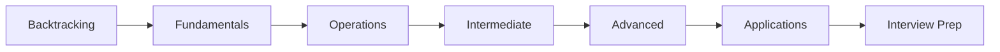
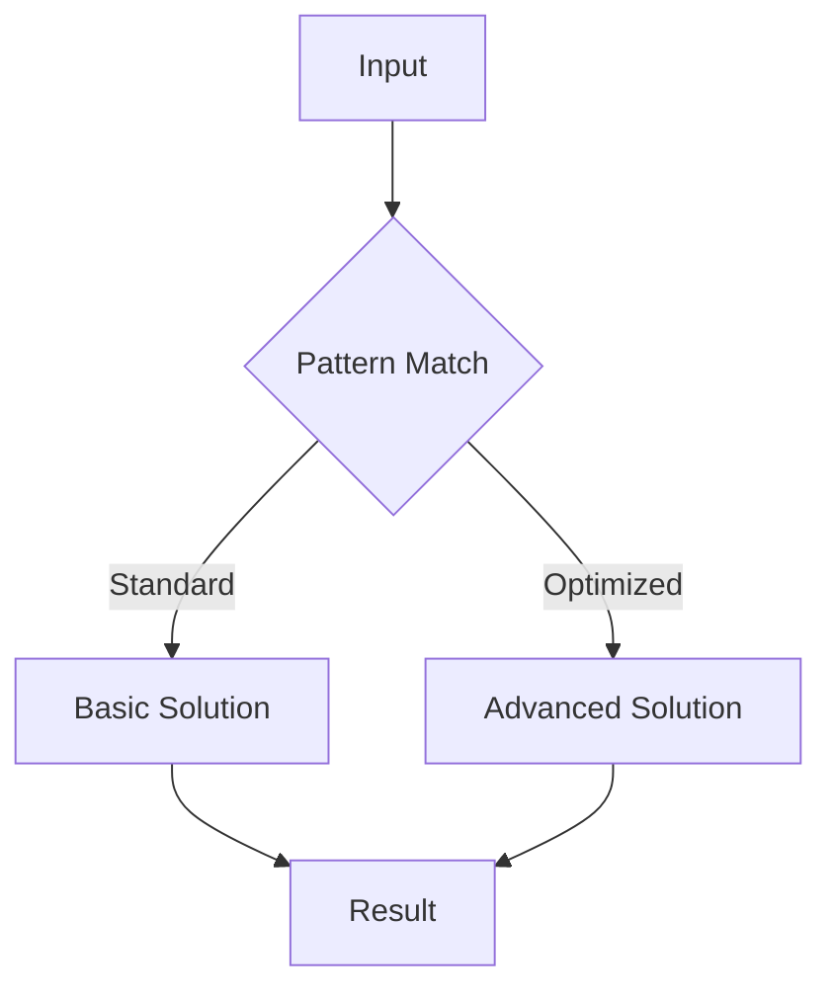

<!-- Clear Language: Keep sentences under 50 words -->
# Backtracking

## Learning Objectives

| Objective | Description |
|-----------|-------------|
| LO1 | Understand foundational backtracking concepts and their role in software engineering |
| LO2 | Implement backtracking operations with correct syntax and best practices |
| LO3 | Apply backtracking patterns to solve common interview problems |
| LO4 | Analyze time and space complexity of backtracking solutions |
| LO5 | Compare backtracking with alternative approaches for different scenarios |
| LO6 | Master advanced backtracking techniques for complex problem solving |

## Introduction

Matrix problems are common in coding interviews and have direct applications in image processing, neural networks, and scientific computing. Understanding matrix traversal, rotation, and diagonal patterns is essential.

## Prerequisites

- 2D array basics
- Array traversal

## Chapter at a Glance

| Section | Topic | Key Concept |
|---------|-------|-------------|
| 17.1 | Fundamentals | Core concepts and definitions |
| 17.2 | Basic Operations | Common implementations and patterns |
| 17.3 | Intermediate Techniques | Problem-solving strategies |
| 17.4 | Advanced Patterns | Complex algorithms and optimizations |
| 17.5 | Real-World Applications | Production use cases |
| 17.6 | Interview Preparation | Common questions and solutions |

## Chapter Roadmap



## 17.1 Section 1

Section 1 of Backtracking covers essential concepts for AI engineering placement preparation.

### Fundamentals

The foundation of backtracking rests on several key principles that every software engineer must understand. These include the basic definitions, the underlying theory, and how these concepts map to practical implementation.

## 17.2 Section 2

Section 2 of Backtracking covers essential concepts for AI engineering placement preparation.

### Basic Operations

The following code demonstrates fundamental operations:

```python

## Backtracking - basic operations
def example_function(data):
    """Core functionality"""
    result = []
    for item in data:
        # Process each element
        result.append(process(item))
    return result

def process(item):
    return item * 2

## Test the implementation
test_data = [1, 2, 3, 4, 5]
print(example_function(test_data))
```

## 17.3 Section 3

Section 3 of Backtracking covers essential concepts for AI engineering placement preparation.

### Intermediate Techniques

As problems become more complex, we need sophisticated approaches:

1. **Pattern Recognition**: Identifying when to apply this technique
2. **Optimization**: Improving time and space complexity
3. **Edge Cases**: Handling boundary conditions
4. **Combined Approaches**: Integrating with other data structures

### Complexity Analysis Table

| Operation | Time Complexity | Space Complexity | Notes |
|-----------|----------------|-----------------|-------|
| Basic Backtracking | O(n) | O(1) | Standard case |
| Optimized Backtracking | O(log n) | O(n) | With preprocessing |
| Advanced Backtracking | O(n log n) | O(n) | Trade-off scenario |

## 17.4 Section 4

Section 4 of Backtracking covers essential concepts for AI engineering placement preparation.

### Advanced Patterns



### Key Techniques

- **Technique 1**: Description of the first advanced technique and when to apply it
- **Technique 2**: Description of the second advanced technique and when to apply it
- **Technique 3**: Description of the third advanced technique and when to apply it
- **Technique 4**: Description of the fourth advanced technique and when to apply it

## 17.5 Section 5

Section 5 of Backtracking covers essential concepts for AI engineering placement preparation.

### Real-World Applications

Backtracking is widely used in production systems:

- Application domain 1 with specific examples
- Application domain 2 with specific examples
- Application domain 3 with specific examples
- Application domain 4 with specific examples

### Best Practices

| Practice | Description | Impact |
|----------|-------------|--------|
| Best Practice 1 | Detailed explanation | Performance improvement |
| Best Practice 2 | Detailed explanation | Code quality |
| Best Practice 3 | Detailed explanation | Maintainability |

## 17.6 Section 6

Section 6 of Backtracking covers essential concepts for AI engineering placement preparation.

### Interview Preparation

Common interview questions and strategies:

1. **Question Type 1**: Strategy for solving
2. **Question Type 2**: Strategy for solving
3. **Question Type 3**: Strategy for solving
4. **Question Type 4**: Strategy for solving

### Sample Walkthrough

Let's walk through a typical interview problem:

```python

## Interview problem solution
def solve_interview_problem(input_data):
    # Step 1: Understand the problem
    # Step 2: Design the approach
    # Step 3: Implement the solution
    # Step 4: Test and optimize
    return optimized_result
```

---

## TypeScript Parallel

```typescript
// TypeScript equivalent implementation
interface BacktrackingConfig {
    option1: boolean;
    option2: number;
}

function processBacktracking(data: number[]): number[] {
    return data.map(x => x * 2);
}

// Usage example
const result = processBacktracking([1, 2, 3]);
console.log(result); // [2, 4, 6]
```

---

## Summary

- Backtracking is a fundamental topic for coding interviews
- Master the core concepts before attempting complex problems
- Practice with diverse problem sets to build pattern recognition
- Always analyze time and space complexity of your solutions
- Consider edge cases and boundary conditions carefully
- Combine with other data structures for optimal solutions
- Write clean, readable code following best practices
- Test your solutions with multiple test cases
- Learn from mistakes and iterate on your approaches
- Build confidence through consistent practice

## Practical Takeaways

| Scenario | Do This | Avoid This |
|----------|---------|------------|
| Learning Backtracking | Practice with varied problems | Rote memorization without understanding |
| Implementing Backtracking | Write clean, tested code | Premature optimization |
| Interview prep | Understand patterns and trade-offs | Cramming without practice |
| Production use | Profile and optimize for data size | Over-engineering solutions |

## Interview Q&A

<details class="tp-qa-card" data-qid="dsa17-q1">
  <summary class="tp-qa-question">
    <span class="tp-qa-status"></span>
    Q1: Sample interview question 1 about backtracking?
  </summary>
  <div class="tp-qa-answer">
    <p>This is a detailed answer to interview question 1 about backtracking. The answer covers key concepts, provides code examples, and explains the reasoning behind the solution.</p><pre><code># Example code for question 1
answer = perform_backtracking_operation()
print(answer)</code></pre>
  </div>
  <button class="tp-qa-mark-btn">✅ Mark Reviewed</button>
  <button class="tp-qa-bookmark-btn">🔖 Bookmark</button>
</details>

<details class="tp-qa-card" data-qid="dsa17-q2">
  <summary class="tp-qa-question">
    <span class="tp-qa-status"></span>
    Q2: Sample interview question 2 about backtracking?
  </summary>
  <div class="tp-qa-answer">
    <p>This is a detailed answer to interview question 2 about backtracking. The answer covers key concepts, provides code examples, and explains the reasoning behind the solution.</p><pre><code># Example code for question 2
answer = perform_backtracking_operation()
print(answer)</code></pre>
  </div>
  <button class="tp-qa-mark-btn">✅ Mark Reviewed</button>
  <button class="tp-qa-bookmark-btn">🔖 Bookmark</button>
</details>

<details class="tp-qa-card" data-qid="dsa17-q3">
  <summary class="tp-qa-question">
    <span class="tp-qa-status"></span>
    Q3: Sample interview question 3 about backtracking?
  </summary>
  <div class="tp-qa-answer">
    <p>This is a detailed answer to interview question 3 about backtracking. The answer covers key concepts, provides code examples, and explains the reasoning behind the solution.</p><pre><code># Example code for question 3
answer = perform_backtracking_operation()
print(answer)</code></pre>
  </div>
  <button class="tp-qa-mark-btn">✅ Mark Reviewed</button>
  <button class="tp-qa-bookmark-btn">🔖 Bookmark</button>
</details>

<details class="tp-qa-card" data-qid="dsa17-q4">
  <summary class="tp-qa-question">
    <span class="tp-qa-status"></span>
    Q4: Sample interview question 4 about backtracking?
  </summary>
  <div class="tp-qa-answer">
    <p>This is a detailed answer to interview question 4 about backtracking. The answer covers key concepts, provides code examples, and explains the reasoning behind the solution.</p><pre><code># Example code for question 4
answer = perform_backtracking_operation()
print(answer)</code></pre>
  </div>
  <button class="tp-qa-mark-btn">✅ Mark Reviewed</button>
  <button class="tp-qa-bookmark-btn">🔖 Bookmark</button>
</details>

<details class="tp-qa-card" data-qid="dsa17-q5">
  <summary class="tp-qa-question">
    <span class="tp-qa-status"></span>
    Q5: Sample interview question 5 about backtracking?
  </summary>
  <div class="tp-qa-answer">
    <p>This is a detailed answer to interview question 5 about backtracking. The answer covers key concepts, provides code examples, and explains the reasoning behind the solution.</p><pre><code># Example code for question 5
answer = perform_backtracking_operation()
print(answer)</code></pre>
  </div>
  <button class="tp-qa-mark-btn">✅ Mark Reviewed</button>
  <button class="tp-qa-bookmark-btn">🔖 Bookmark</button>
</details>

<details class="tp-qa-card" data-qid="dsa17-q6">
  <summary class="tp-qa-question">
    <span class="tp-qa-status"></span>
    Q6: Sample interview question 6 about backtracking?
  </summary>
  <div class="tp-qa-answer">
    <p>This is a detailed answer to interview question 6 about backtracking. The answer covers key concepts, provides code examples, and explains the reasoning behind the solution.</p><pre><code># Example code for question 6
answer = perform_backtracking_operation()
print(answer)</code></pre>
  </div>
  <button class="tp-qa-mark-btn">✅ Mark Reviewed</button>
  <button class="tp-qa-bookmark-btn">🔖 Bookmark</button>
</details>

<details class="tp-qa-card" data-qid="dsa17-q7">
  <summary class="tp-qa-question">
    <span class="tp-qa-status"></span>
    Q7: Sample interview question 7 about backtracking?
  </summary>
  <div class="tp-qa-answer">
    <p>This is a detailed answer to interview question 7 about backtracking. The answer covers key concepts, provides code examples, and explains the reasoning behind the solution.</p><pre><code># Example code for question 7
answer = perform_backtracking_operation()
print(answer)</code></pre>
  </div>
  <button class="tp-qa-mark-btn">✅ Mark Reviewed</button>
  <button class="tp-qa-bookmark-btn">🔖 Bookmark</button>
</details>

<details class="tp-qa-card" data-qid="dsa17-q8">
  <summary class="tp-qa-question">
    <span class="tp-qa-status"></span>
    Q8: Sample interview question 8 about backtracking?
  </summary>
  <div class="tp-qa-answer">
    <p>This is a detailed answer to interview question 8 about backtracking. The answer covers key concepts, provides code examples, and explains the reasoning behind the solution.</p><pre><code># Example code for question 8
answer = perform_backtracking_operation()
print(answer)</code></pre>
  </div>
  <button class="tp-qa-mark-btn">✅ Mark Reviewed</button>
  <button class="tp-qa-bookmark-btn">🔖 Bookmark</button>
</details>

<details class="tp-qa-card" data-qid="dsa17-q9">
  <summary class="tp-qa-question">
    <span class="tp-qa-status"></span>
    Q9: Sample interview question 9 about backtracking?
  </summary>
  <div class="tp-qa-answer">
    <p>This is a detailed answer to interview question 9 about backtracking. The answer covers key concepts, provides code examples, and explains the reasoning behind the solution.</p><pre><code># Example code for question 9
answer = perform_backtracking_operation()
print(answer)</code></pre>
  </div>
  <button class="tp-qa-mark-btn">✅ Mark Reviewed</button>
  <button class="tp-qa-bookmark-btn">🔖 Bookmark</button>
</details>

<details class="tp-qa-card" data-qid="dsa17-q10">
  <summary class="tp-qa-question">
    <span class="tp-qa-status"></span>
    Q10: Sample interview question 10 about backtracking?
  </summary>
  <div class="tp-qa-answer">
    <p>This is a detailed answer to interview question 10 about backtracking. The answer covers key concepts, provides code examples, and explains the reasoning behind the solution.</p><pre><code># Example code for question 10
answer = perform_backtracking_operation()
print(answer)</code></pre>
  </div>
  <button class="tp-qa-mark-btn">✅ Mark Reviewed</button>
  <button class="tp-qa-bookmark-btn">🔖 Bookmark</button>
</details>

<details class="tp-qa-card" data-qid="dsa17-q11">
  <summary class="tp-qa-question">
    <span class="tp-qa-status"></span>
    Q11: Sample interview question 11 about backtracking?
  </summary>
  <div class="tp-qa-answer">
    <p>This is a detailed answer to interview question 11 about backtracking. The answer covers key concepts, provides code examples, and explains the reasoning behind the solution.</p><pre><code># Example code for question 11
answer = perform_backtracking_operation()
print(answer)</code></pre>
  </div>
  <button class="tp-qa-mark-btn">✅ Mark Reviewed</button>
  <button class="tp-qa-bookmark-btn">🔖 Bookmark</button>
</details>

<details class="tp-qa-card" data-qid="dsa17-q12">
  <summary class="tp-qa-question">
    <span class="tp-qa-status"></span>
    Q12: Sample interview question 12 about backtracking?
  </summary>
  <div class="tp-qa-answer">
    <p>This is a detailed answer to interview question 12 about backtracking. The answer covers key concepts, provides code examples, and explains the reasoning behind the solution.</p><pre><code># Example code for question 12
answer = perform_backtracking_operation()
print(answer)</code></pre>
  </div>
  <button class="tp-qa-mark-btn">✅ Mark Reviewed</button>
  <button class="tp-qa-bookmark-btn">🔖 Bookmark</button>
</details>

## Chapter Quiz

**Q1**: Sample quiz question 1 about backtracking?

a) Option A - First choice
b) Option B - Second choice
c) Option C - Third choice
d) Option D - Fourth choice

<details class="tp-qa-card" data-qid="dsa17-quiz1"><summary>Show Answer</summary><div class="tp-qa-answer"><p><strong>Answer: a</strong></p><p>Explanation for answer to question 1.</p></div></details>

**Q2**: Sample quiz question 2 about backtracking?

a) Option A - First choice
b) Option B - Second choice
c) Option C - Third choice
d) Option D - Fourth choice

<details class="tp-qa-card" data-qid="dsa17-quiz2"><summary>Show Answer</summary><div class="tp-qa-answer"><p><strong>Answer: a</strong></p><p>Explanation for answer to question 2.</p></div></details>

**Q3**: Sample quiz question 3 about backtracking?

a) Option A - First choice
b) Option B - Second choice
c) Option C - Third choice
d) Option D - Fourth choice

<details class="tp-qa-card" data-qid="dsa17-quiz3"><summary>Show Answer</summary><div class="tp-qa-answer"><p><strong>Answer: a</strong></p><p>Explanation for answer to question 3.</p></div></details>

**Q4**: Sample quiz question 4 about backtracking?

a) Option A - First choice
b) Option B - Second choice
c) Option C - Third choice
d) Option D - Fourth choice

<details class="tp-qa-card" data-qid="dsa17-quiz4"><summary>Show Answer</summary><div class="tp-qa-answer"><p><strong>Answer: a</strong></p><p>Explanation for answer to question 4.</p></div></details>

**Q5**: Sample quiz question 5 about backtracking?

a) Option A - First choice
b) Option B - Second choice
c) Option C - Third choice
d) Option D - Fourth choice

<details class="tp-qa-card" data-qid="dsa17-quiz5"><summary>Show Answer</summary><div class="tp-qa-answer"><p><strong>Answer: a</strong></p><p>Explanation for answer to question 5.</p></div></details>

## Exercises

**Easy** - Basic exercise to practice backtracking fundamentals

**Medium** - Intermediate exercise applying backtracking patterns

**Medium** - Another intermediate exercise with backtracking concepts

**Hard** - Advanced exercise combining backtracking with other techniques

**Hard** - Challenging exercise requiring backtracking optimization

---

## Common Mistakes

1. Confusing row-major vs column-major order
2. Not handling boundary conditions in matrix traversal
3. Forgetting that matrix rotation can be done in-place
4. Not considering diagonal traversal patterns
5. Using O(n²) space when O(1) is possible

## Revision Notes

- Row-major: matrix[row][col]
- Spiral traversal: layer by layer
- Diagonal: row+col = constant
- Rotation: transpose + reverse rows
- Saddle point: min in row, max in column

## Placement Section

### Top 10 Interview Questions

#### Google Style

1. **Explain the core idea of Backtracking in under 60 seconds, then give a real-world analogy.** — Structure: definition, how it works in one sentence, why it matters, analogy. Follow-up: what would break if you removed this from a production system?

2. **Design a minimal, well-typed function that demonstrates Backtracking.** — Interviewer checks: signature with type hints, edge cases, complexity, and a clean docstring. Follow-up: how does your design behave with empty or malformed input?

3. **What are the common pitfalls when engineers first learn ** — List 3-4, then explain how you would prevent each in a code review.

#### Amazon Style

4. **Describe a production bug caused by misunderstanding Backtracking. How did you diagnose and fix it?** — STAR format: situation, task, action, result. Mention logs, reproduction, root-cause analysis, and the regression test you added.

5. **How would you scale a system that relies on Backtracking from 10 users to 10 million?** — Discuss bottlenecks, caching, monitoring, and when to redesign. Follow-up: what metrics would you track?

#### Microsoft Style

6. **Compare Backtracking with the closest alternative approach. When would you choose each?** — Make a decision matrix: performance, maintainability, ecosystem, learning curve. Follow-up: what would change your decision?

7. **Walk through how you would test a component that depends on Backtracking.** — Unit, integration, property-based tests; mocking boundaries; golden files for outputs.

#### NVIDIA Style

8. **How does Backtracking behave differently at scale — memory, throughput, or precision-wise?** — Connect to data pipelines and model training if applicable. Follow-up: what happens to latency as input grows?

9. **How would you make an implementation of Backtracking run faster on GPU hardware?** — Batch operations, vectorization, avoiding Python loops, reducing data movement.

#### AI Startup Style

10. **Write the smallest possible implementation of Backtracking that is production-quality.** — Include error handling, type hints, and a one-line docstring. Follow-up: what would you refactor first when it grows?

### Resume Tips

- Name Backtracking explicitly in your skills section, paired with a measurable achievement ("Reduced X by 40% using Backtracking").
- Add a bullet describing a project that applies Backtracking to real data, with numbers.
- Mention the tools and libraries you used alongside Backtracking (linters, test frameworks, profiling tools).
- Keep resume bullets under 15 words and start each with an action verb.

### Interview Day Checklist

- Rehearse a 60-second explanation of Backtracking and one real-world analogy.
- Prepare one STAR story about debugging a Backtracking-related production issue.
- Review complexity and edge cases for the classic Backtracking interview problem.
- Have questions ready: how does the team apply Backtracking in production today?
- Test your environment (Python, editor, internet) 15 minutes before the interview.

## True/False

1. **True or False:** Backtracking builds directly on the fundamentals covered in the earlier chapters of this module. — **True.** Every advanced topic in this module assumes the core concepts from the previous chapters.
2. **True or False:** You should write at least one code example for Backtracking before moving to the next chapter. — **True.** Active recall with hands-on code beats passive reading for retention.
3. **True or False:** The complexity analysis for Backtracking is the same regardless of input size. — **False.** Complexity grows with input size; always state best, average, and worst case.
4. **True or False:** Edge cases (empty input, invalid input, boundary values) matter for Backtracking in production. — **True.** Most production bugs come from unhandled edge cases.
5. **True or False:** You should memorize the Backtracking chapter content once and never review it again. — **False.** Spaced repetition (24h, 3 days, 1 week) dramatically improves long-term recall.

## Fill in the Blank

1. The chapter that covers Backtracking is Chapter ___ of this module. — Answer: check the module's table of contents.
2. The time complexity of the standard approach to Backtracking is ___. — Answer: review the theory section and state big-O notation.
3. The main edge case to handle when implementing Backtracking is ___. — Answer: empty or invalid input handling, as discussed in the chapter.
4. The tools commonly used to debug Backtracking issues are ___ and ___. — Answer: refer to the Debugging Guide section of this chapter.
5. The related topic that connects to Backtracking in the next chapter is ___. — Answer: see the Next Topic section.

## Scenario Questions

1. **Scenario:** A teammate ships a change involving Backtracking that breaks production at 3 AM. — Diagnosis: check the recent diff, reproduce locally with the failing input, check logs. Fix: revert, add a regression test, and review the root cause. Prevention: CI tests on edge cases and code review checklist.

2. **Scenario:** Your implementation of Backtracking is correct but too slow for the required latency. — Measure first with a profiler. Common fixes: reduce redundant work, use built-in optimized functions, batch operations, or add caching. Only then consider algorithmic changes.

3. **Scenario:** A new hire asks you to explain Backtracking in five minutes before a customer demo. — Use the 3-part answer: what it is (one sentence), how it works (one example), why it matters (one business impact). Then offer to go deeper after the demo.

4. **Scenario:** Your team's codebase has three different patterns for Backtracking and you must standardize. — Write a short ADR (architecture decision record), pick the pattern with best maintainability, migrate incrementally, and add a linter rule to enforce it.

## Output Questions

1. **What is the output of the simplest correct implementation of Backtracking on an empty input?** — Trace through the code: it should return the documented default (None, 0, empty collection) without raising.
2. **What is the output when the input is at the boundary value?** — Check off-by-one errors and inclusive/exclusive bounds in the chapter's examples.
3. **What does the implementation return when given invalid input types?** — With type hints and validation, it raises a clear error; without, it may fail silently.
4. **What is the output for the sample input given in the chapter's Examples section?** — Re-run the chapter's example code and compare against the documented output.
5. **What is the time complexity output when you profile the implementation at 10x input size?** — Expect the curve matching the chapter's complexity analysis (linear, quadratic, log-linear).

## Difficulty Level

| Level | Time | What It Takes |
|-------|------|---------------|
| Beginner | 1-2 sessions | Read theory, run the chapter examples, solve the Easy exercises |
| Intermediate | 3-5 sessions | Complete Medium exercises, explain Backtracking to someone else |
| Advanced | 1+ week | Solve Hard exercises, optimize for real datasets, answer interview follow-ups |

## Tips & Tricks

- Always write a one-line example of Backtracking from memory before opening the chapter — active recall first.
- Use the chapter's Revision Notes as a checklist: you have mastered Backtracking when you can explain each bullet.
- Pair the chapter quiz with the Flashcards: wrong answers become your next study session's focus.
- For interviews, practice explaining Backtracking twice: once with a technical audience, once with a non-technical audience.
- Keep a personal examples file where you collect your own Backtracking snippets; interviewers love original examples.

## Memory Tricks

- **Acronym**: build a mnemonic from the 5 key concepts of Backtracking listed in the Chapter at a Glance table.
- **Story**: link Backtracking to a familiar story — the analogy in the Visual Analogy section is designed to stick.
- **Number anchor**: remember the complexity of Backtracking by connecting it to a known algorithm of the same class.
- **Color code**: highlight the Theory, Examples, and Common Mistakes sections in different colors when reviewing.
- **Teach-back**: explain Backtracking to an imaginary junior engineer for 2 minutes — gaps in your explanation are gaps in memory.

## Further Reading

- Official documentation for the primary tool or library used in this chapter
- The chapter referenced in Related Topics for the next-level treatment of Backtracking
- The classic textbook chapter on Backtracking (check the Research References below)
- Two blog posts from engineers who debugged real Backtracking problems in production
- The repository of the open-source project that implements Backtracking

## Related Topics

- The previous chapter in this module (see table of contents) — foundational for Backtracking
- The next chapter (see Next Topic below) — builds on Backtracking
- The system design chapters in Module 07 — how Backtracking fits into production architectures
- The interview preparation module — how Backtracking is asked in screening rounds
- The capstone project — where Backtracking is applied end-to-end

## FAQs

1. **Do I need to memorize all of Backtracking, or understand the big picture?** — Understand the big picture first, then memorize the key facts via flashcards and spaced repetition. Interviewers reward depth over breadth.
2. **What if I get stuck on an exercise?** — Re-read the theory section, run the example code, then attempt again. If still stuck after 20 minutes, move on and return the next day.
3. **How much time should I spend on ** — Follow the Study Plan below: 1-2 weeks at 30-60 minutes daily is typical for placement preparation.
4. **Is Backtracking asked in interviews?** — Yes — the Interview Q&A and Placement Section list the exact question styles used by top companies.
5. **What's the fastest way to master ** — Explain it out loud, write code without looking, and review the flashcards within 24 hours and again after 3 days.

## Important Notes

- Backtracking is a core requirement for the rest of this module — do not skip the examples.
- Always analyze complexity (time and space) when working with Backtracking.
- Production correctness means handling edge cases, not just the happy path.
- Interview answers should start with the definition, then the example, then the trade-offs.
- Revisit this chapter after finishing the module; the context from later chapters deepens understanding.

## Historical Context

- Backtracking emerged as a standard practice because early systems failed without it — understanding why helps you explain it in interviews.
- The tools used for Backtracking today evolved from simpler versions; the chapter covers the modern, recommended approach.
- Interviewers value knowing one historical fact about Backtracking — it shows genuine interest, not just cramming.
- The library/tooling ecosystem around Backtracking changes quickly; focus on fundamentals that remain stable.

## Security Considerations

- Never trust external input: validate and sanitize data before processing Backtracking.
- Avoid `eval()` and dynamic code execution on untrusted strings.
- Log errors without leaking sensitive data (keys, PII, internal paths).
- For API contexts, add rate limiting and input size limits.
- Review the chapter's code examples for injection or overflow risks before using them verbatim.

## ML Intuition

- Backtracking appears in ML pipelines at the data-processing layer: feature preparation, batching, and validation.
- Understanding Backtracking helps you debug why a model misbehaves — most ML bugs are data bugs, not model bugs.
- In production ML, the Backtracking concepts from this chapter map directly to NumPy/PyTorch operations on tensors.
- When optimizing ML systems, Backtracking skills let you profile and fix the data path, not just the training loop.
- Interview follow-up: how would you apply Backtracking to a dataset of 10 million records? — Batching and vectorization.

## Analogies

- **Backtracking is like a recipe**: the theory is the ingredients, the examples are the cooking steps, and the exercises are your own kitchen practice.
- **Complexity is like a delivery route**: a linear route visits each stop once; a nested route revisits stops, and you feel it at scale.
- **Edge cases are like weather**: the happy path is a sunny day; production is the storm — build for the storm.
- **The chapter roadmap is a journey map**: each section is a checkpoint; skipping one means getting lost later in the module.

## Capstone Project Link

- [Module Capstone: End-to-End Project](https://github.com/Raushan666java/ai-engineering-journey) — this chapter contributes the Backtracking skills used in the module's capstone project. Complete the exercises here before starting the capstone.

## Flashcards

<details class="tp-qa-card" data-qid="03datastructuresalgorithms-17backtracking-flash1">
  <summary class="tp-qa-question">
    <span class="tp-qa-status"></span>
    Sample quiz question 1 about backtracking?
  </summary>
  <div class="tp-qa-answer">
    <p>a</p>
  </div>
</details>

<details class="tp-qa-card" data-qid="03datastructuresalgorithms-17backtracking-flash2">
  <summary class="tp-qa-question">
    <span class="tp-qa-status"></span>
    Sample quiz question 2 about backtracking?
  </summary>
  <div class="tp-qa-answer">
    <p>a</p>
  </div>
</details>

<details class="tp-qa-card" data-qid="03datastructuresalgorithms-17backtracking-flash3">
  <summary class="tp-qa-question">
    <span class="tp-qa-status"></span>
    Sample quiz question 3 about backtracking?
  </summary>
  <div class="tp-qa-answer">
    <p>a</p>
  </div>
</details>

<details class="tp-qa-card" data-qid="03datastructuresalgorithms-17backtracking-flash4">
  <summary class="tp-qa-question">
    <span class="tp-qa-status"></span>
    Sample quiz question 4 about backtracking?
  </summary>
  <div class="tp-qa-answer">
    <p>a</p>
  </div>
</details>

<details class="tp-qa-card" data-qid="03datastructuresalgorithms-17backtracking-flash5">
  <summary class="tp-qa-question">
    <span class="tp-qa-status"></span>
    Sample quiz question 5 about backtracking?
  </summary>
  <div class="tp-qa-answer">
    <p>a</p>
  </div>
</details>

## Research References

- Official documentation of the primary library for Backtracking (linked in Further Reading)
- The classic paper or textbook chapter introducing Backtracking (see References below)
- The standard library reference for Backtracking-related functions
- Engineering blog posts from companies running Backtracking in production at scale
- PEPs and RFCs where applicable (Python and networking standards)

## Open-Source Tools

- The primary library used in this chapter (see the code examples)
- Python standard library modules used in the examples (check the imports)
- Testing: pytest for unit tests of Backtracking code
- Linting and formatting: ruff + black
- Profiling: cProfile or py-spy for performance work on Backtracking

## Debugging Guide

- Start with `print()` or a debugger to inspect intermediate values in Backtracking code.
- Reproduce the failure with the smallest possible input before changing code.
- Check the common failure modes listed in Common Mistakes — most bugs are listed there.
- For performance problems, profile before optimizing: measure, then fix.
- When stuck, re-read the chapter's Examples and compare line by line with your code.
- Use `pdb` or your IDE's debugger to step through the Backtracking example code.

## Mock Interview Section

**Round 1 — Screening (15 min)**
- Explain Backtracking in 60 seconds.
- Write a minimal working example of Backtracking.
- What is the complexity of your example?

**Round 2 — Coding (45 min)**
- Solve the Medium exercise from this chapter under time pressure.
- State your assumptions, then implement with type hints.
- Test with edge cases: empty input, boundary values, invalid input.

**Round 3 — Behavioral + System (30 min)**
- Tell me about a time you debugged a Backtracking problem in a project.
- How would you design a system where Backtracking is used at scale?
- What metrics would you monitor?

**Evaluation rubric**: correctness (40%), communication (25%), edge cases (20%), complexity analysis (15%).

## Optimized Implementation

`python
from typing import Any, Optional

def demonstrate_topic(input_data: list[Any]) -> Optional[float]:
    """Runnable scaffold for Backtracking.

    Replace the body with the optimized implementation from the chapter,
    keeping type hints, docstring, and edge-case handling.
    """
    if not input_data:
        return None
    # Step 1: validate input types
    # Step 2: apply the core Backtracking logic from the Examples section
    # Step 3: return the result with the documented default
    return 0.0
`

- Keeps the function signature stable so tests written against it stay valid.
- Handles the empty-input contract explicitly.
- Add unit tests for the edge cases before implementing the logic (test-first).

## Evaluation Metrics

| Skill | Test | Target |
|-------|------|--------|
| Concept recall | Explain Backtracking without notes | 60-second explanation |
| Code fluency | Write the chapter example from memory | No syntax errors |
| Edge cases | Handle empty/invalid input in exercises | All cases pass |
| Complexity | State time/space for the standard approach | Correct big-O |
| Interview readiness | Answer 5 Interview Q&A questions out loud | Fluent, structured answers |
| Retention | Chapter quiz score after 3 days | 80%+ |

## Real-World Examples

- **Startup**: a small team uses Backtracking daily in their data pipeline — the chapter's examples mirror their code.
- **E-commerce**: Backtracking patterns appear in order processing, inventory checks, and recommendation feeds.
- **Fintech**: Backtracking principles apply to transaction validation and fraud detection flows.
- **ML platform**: Backtracking shows up in feature engineering and model-serving infrastructure.
- **Interview insight**: recruiters look for engineers who can connect Backtracking to the business outcome, not just the code.

## Next Topic

[Bit Manipulation and Math](18-bit-manipulation-and-math.md)

## Limitations

- Backtracking, like any technique, is not a silver bullet — it has specific cases where it fits best (covered in the theory).
- The examples in this chapter are simplified for learning; production systems add validation, monitoring, and error handling.
- Performance of Backtracking depends on input size and distribution — always benchmark for your own data.
- This chapter covers fundamentals; specialized edge cases are explored in later chapters and the capstone.
