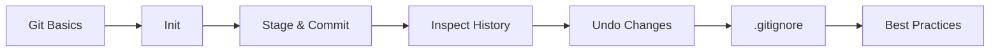
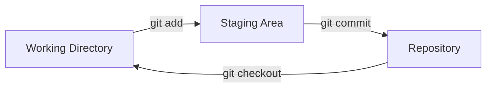

<!-- Clear Language: Keep sentences under 50 words -->
# Git Basics

## Learning Objectives

| Objective | Description |
|-----------|-------------|
| LO1 | Understand how Git tracks changes and manages project history |
| LO2 | Initialize repos, stage files, and create commits with meaningful messages |
| LO3 | Use git status, git log, and git diff to inspect repository state |
| LO4 | Configure .gitignore to exclude files and directories from version control |
| LO5 | Apply undo and recovery workflows for common mistakes |
| LO6 | Follow commit message conventions used in professional teams |

## Introduction

Git is the industry-standard version control system. Understanding Git fundamentals — init, add, commit, branching — is essential for every software engineer. AI engineers use Git to manage training code, model versions, and collaboration.

## Prerequisites

- Basic command line usage
- Text editor familiarity

## Chapter at a Glance

| Section | Topic | Key Concept |
|---------|-------|-------------|
| 01.1 | Git Initialization | Creating repos, understanding .git directory |
| 01.2 | Staging and Committing | add, commit, the three-area model |
| 01.3 | Inspecting History | log, diff, show, status |
| 01.4 | Undoing Changes | restore, reset, amend |
| 01.5 | .gitignore | Excluding files from tracking |
| 01.6 | Real-World Workflows | Commit conventions, atomic commits |

## Chapter Roadmap



## Key Terminology

**Key Terms**: Core vocabulary and concepts for this topic.

**Definition**: Essential terms you must know for interviews and production work.

## Theory

### 01.1 Git Initialization

Git is a distributed version control system that tracks changes to files over time. Unlike centralized systems, every developer has a full copy of the repository history on their machine.

**Creating a new repository:**

```bash

## Create a new repo in the current directory
git init

## Create a new repo in a specific directory
git init my-project
```

Running `git init` creates a hidden `.git` directory that stores all version control metadata: commit objects, branch refs, configuration, and the object database.

**Cloning an existing repository:**

```bash

## Clone via HTTPS
git clone https://github.com/user/repo.git

## Clone via SSH
git clone git@github.com:user/repo.git

## Clone into a specific directory
git clone https://github.com/user/repo.git my-folder
```

Cloning copies the entire history, all branches, and sets up a remote called `origin` automatically.

**Key Git concepts:**

- **Working Directory**: Your actual files on disk
- **Staging Area (Index)**: Files marked for the next commit
- **Repository (.git)**: The committed history database
- **HEAD**: A pointer to the current commit



## Overview

### 01.2 Staging and Committing

The staging area lets you craft commits selectively. You can stage some changes while leaving others unstaged, allowing atomic, focused commits.

**Adding files to the staging area:**

```bash

## Stage a specific file
git add index.html

## Stage all changes in current directory
git add .

## Stage all changes everywhere
git add -A

## Stage specific file types
git add *.js

## Stage changes interactively (choose hunks)
git add -p
```

**Committing staged changes:**

```bash

## Commit with inline message
git commit -m "Add user authentication module"

## Commit all tracked changes (skip staging)
git commit -am "Fix login redirect bug"

## Commit with verbose output showing diff
git commit -v -m "Update API rate limiting"

## Amend the last commit (message or files)
git commit --amend -m "Fix: correct typo in auth header"
```

**The three-area model in practice:**

```bash

## Edit a file
echo "console.log('hello');" > app.js

## Check status — shows unstaged changes
git status

## Stage the file
git add app.js

## Check status — shows staged changes
git status

## Commit
git commit -m "Initialize app entry point"

## Check status — clean working tree
git status
```

## Overview

### 01.3 Inspecting History

Git log shows the commit history. Understanding how to read and filter it is essential for debugging and code review.

**Viewing commit history:**

```bash

## Compact one-line log
git log --oneline

## Graph with branches
git log --oneline --graph --all

## Last 5 commits
git log -5

## Show file changes per commit
git log --stat

## Show actual diffs
git log -p

## Filter by author
git log --author="Alice"

## Filter by date
git log --since="2024-01-01" --until="2024-06-01"

## Search commit messages
git log --grep="fix" --oneline
```

**Comparing changes with diff:**

```bash

## Unstaged changes (working dir vs staging)
git diff

## Staged changes (staging vs last commit)
git diff --staged

## Diff between two commits
git diff abc1234 def5678

## Diff between branches
git diff main..feature-branch

## Diff showing only filenames
git diff --name-only

## Diff with word-level changes
git diff --word-diff
```

**Inspecting specific commits:**

```bash

## Show a commit's details and diff
git show abc1234

## Show commit stats only
git show --stat abc1234

## Show the contents of a file at a specific commit
git show abc1234:path/to/file.ts
```

## Overview

### 01.4 Undoing Changes

Mistakes happen. Git provides multiple tools to undo changes, each with different safety levels.

**Discarding unstaged changes:**

```bash

## Discard changes in a specific file
git restore index.html

## Discard all working directory changes
git restore .

## Restore a file from last commit
git restore --source=HEAD~2 path/to/file.ts
```

**Unstaging files:**

```bash

## Unstage a specific file (keeps working dir changes)
git restore --staged index.html

## Unstage all files
git restore --staged .
```

**Resetting commits (use with caution):**

```bash

## Soft reset: move HEAD, keep staged changes
git reset --soft HEAD~1

## Mixed reset (default): unstage changes, keep in working dir
git reset HEAD~1

## Hard reset: discard everything (DANGEROUS)
git reset --hard HEAD~1

## Reset to a specific commit
git reset --hard abc1234
```

**Recovering with reflog:**

```bash

## View the reflog (safety net for lost commits)
git reflog

## Recover a "lost" commit
git reset --hard HEAD@{2}
```

## Overview

### 01.5 .gitignore

The `.gitignore` file tells Git which files and directories to ignore. This prevents generated files, secrets, and dependencies from being tracked.

**Creating a .gitignore:**

```bash

## Create a .gitignore file
touch .gitignore
```

**Common .gitignore patterns:**

```gitignore

## Dependencies
node_modules/
venv/
__pycache__/

## Build output
dist/
build/
*.o
*.class

## Environment files
.env
.env.local
.env.*.local

## IDE files
.vscode/
.idea/
*.swp
*.swo

## OS files
.DS_Store
Thumbs.db

## Logs
*.log
logs/

## Coverage reports
coverage/
htmlcov/
```

**Pattern syntax:**

```gitignore

## Ignore all .log files
*.log

## But keep important.log
!important.log

## Ignore all files in temp/ directory
temp/

## Ignore build/ at root only (not sub/build/)
/build

## Ignore TODO files in root and subdirs
/**/TODO

## Ignore files ending in .bak
*~

## Ignore files with spaces in name
"My Documents/"
```

**Removing tracked files from Git (after adding to .gitignore):**

```bash

## Remove file from Git but keep on disk
git rm --cached secret.env

## Remove directory from Git but keep locally
git rm -r --cached node_modules/

## Commit the removal
git commit -m "Remove tracked secrets and dependencies"
```

## Overview

### 01.6 Real-World Best Practices

**Atomic commits:** Each commit should represent one logical change. This makes code review easier and bisection reliable.

```bash

## Bad: one massive commit
git add .
git commit -m "Update everything"

## Good: separate logical changes
git add src/auth.ts src/auth.test.ts
git commit -m "Add JWT authentication with tests"

git add src/api/routes.ts
git commit -m "Add protected API routes"

git add README.md
git commit -m "Update README with auth setup instructions"
```

**Commit message convention (Conventional Commits):**

```text
<type>(<scope>): <description>

[optional body]

[optional footer]
```text

```bash
git commit -m "feat(auth): add OAuth2 Google login"
git commit -m "fix(api): handle null response from payment gateway"
git commit -m "docs(readme): add installation steps"
git commit -m "refactor(db): simplify query builder"
git commit -m "test(auth): add edge case for expired tokens"
git commit -m "chore(deps): upgrade axios to 1.6.0"
```

**Commit message rules:**

- Use imperative mood: "Add feature" not "Added feature"
- Keep subject line under 72 characters
- Capitalize the subject line
- No period at the end of the subject
- Use body to explain "what" and "why", not "how"

## Summary

- Git tracks changes in a three-area model: working directory, staging area, repository
- `git init` creates a new repository; `git clone` copies an existing one
- `git add` stages files; `git commit` records staged snapshots
- `git status`, `git log`, and `git diff` are your primary inspection tools
- `git restore` undoes working directory changes; `git restore --staged` unstages
- `git reset` moves HEAD (use `--soft`, `--mixed`, or `--hard` carefully)
- `.gitignore` prevents files from being tracked — configure it early
- Write atomic commits with conventional commit messages
- `git reflog` is your safety net for recovering "lost" commits
- Always review changes before staging with `git diff`

## Practical Takeaways

| Scenario | Do This | Avoid This |
|----------|---------|------------|
| Starting a project | `git init` + `.gitignore` immediately | Committing without .gitignore |
| Daily work | Small, frequent atomic commits | One giant end-of-day commit |
| Commit messages | Conventional format with scope | "fix stuff" or "update" |
| Reviewing changes | `git diff --staged` before committing | Blindly staging everything |
| Undoing mistakes | `git restore` for files, `git reset` for commits | `git reset --hard` without checking reflog |
| Finding bugs | `git log --oneline` + `git bisect` | Manually reading every commit |

## Interview Q&A

<details class="tp-qa-card" data-qid="git01-q1">
  <summary class="tp-qa-question">
    <span class="tp-qa-status"></span>
    Q1: What is the difference between git reset --soft, --mixed, and --hard?
  </summary>
  <div class="tp-qa-answer">
<p><strong>--soft</strong> moves HEAD but keeps changes staged. <strong>--mixed</strong> (default) moves HEAD and unstages changes but keeps them in the working directory. <strong>--hard</strong> moves HEAD and.
discards all changes permanently. Use --soft for amending commits, --mixed for reorganizing, and --hard only when you're certain you want to discard changes.</p><pre><code># Soft: keeps changes staged
git reset --soft HEAD~1

## Mixed: unstages but keeps files
git reset HEAD~1

## Hard: discloses everything
git reset --hard HEAD~1</code></pre>
  </div>
  <button class="tp-qa-mark-btn">Mark Reviewed</button>
  <button class="tp-qa-bookmark-btn">Bookmark</button>
</details>

<details class="tp-qa-card" data-qid="git01-q2">
  <summary class="tp-qa-question">
    <span class="tp-qa-status"></span>
    Q2: Explain the three areas of Git (working directory, staging area, repository).
  </summary>
  <div class="tp-qa-answer">
<p>The <strong>working directory</strong> is your project's files on disk. The <strong>staging area (index)</strong> is a preparation zone where you select which changes to include in the next commit. The <strong>repository (.git)</strong> stores the permanent history of committed snapshots. Files flow:.
Working Directory → (git add) → Staging Area → (git commit) → Repository. This design lets you craft precise,.
atomic commits rather than dumping all changes at once.</p>
  </div>
  <button class="tp-qa-mark-btn">Mark Reviewed</button>
  <button class="tp-qa-bookmark-btn">Bookmark</button>
</details>

<details class="tp-qa-card" data-qid="git01-q3">
  <summary class="tp-qa-question">
    <span class="tp-qa-status"></span>
    Q3: How do you recover a commit that was accidentally reset?
  </summary>
  <div class="tp-qa-answer">
    <p>Use <code>git reflog</code> to find the lost commit hash. The reflog tracks every movement of HEAD. Once you find the hash, use <code>git reset --hard &lt;hash&gt;</code> or <code>git cherry-pick &lt;hash&gt;</code> to restore it. Reflog entries expire after 90 days by default.</p><pre><code># Find the lost commit
git reflog

## Restore it
git reset --hard abc1234</code></pre>
  </div>
  <button class="tp-qa-mark-btn">Mark Reviewed</button>
  <button class="tp-qa-bookmark-btn">Bookmark</button>
</details>

<details class="tp-qa-card" data-qid="git01-q4">
  <summary class="tp-qa-question">
    <span class="tp-qa-status"></span>
    Q4: Write a proper commit message for adding rate limiting to an API.
  </summary>
  <div class="tp-qa-answer">
    <p>Using conventional commits format:</p><pre><code>feat(api): add rate limiting middleware

- Implement token bucket algorithm for request throttling
- Default limit: 100 requests per minute per IP
- Add X-RateLimit-Remaining header to responses
- Return 429 Too Many Requests when exceeded

Closes #234</code></pre>
  </div>
  <button class="tp-qa-mark-btn">Mark Reviewed</button>
  <button class="tp-qa-bookmark-btn">Bookmark</button>
</details>

<details class="tp-qa-card" data-qid="git01-q5">
  <summary class="tp-qa-question">
    <span class="tp-qa-status"></span>
    Q5: What does .gitignore do and what happens if you add a file after .gitignore?
  </summary>
  <div class="tp-qa-answer">
    <p>.gitignore tells Git to skip tracking files matching its patterns. However, if a file is already tracked before adding it to .gitignore, Git continues tracking it. You must explicitly untrack it with <code>git rm --cached &lt;file&gt;</code> for .gitignore to take effect on that file.</p><pre><code># File is tracked, .gitignore won't help
git rm --cached secret.env
git commit -m "Stop tracking secret.env"</code></pre>
  </div>
  <button class="tp-qa-mark-btn">Mark Reviewed</button>
  <button class="tp-qa-bookmark-btn">Bookmark</button>
</details>

## Chapter Quiz

**Q1**: Which command stages all modified and new files in the current directory?

a) git commit -a
b) git add .
c) git add -A
d) Both b and c

<details class="tp-qa-card" data-qid="git01-quiz1"><summary>Show Answer</summary><div class="tp-qa-answer"><p><strong>Answer: d</strong></p><p>Both <code>git add .</code> and <code>git add -A</code> stage all changes. The difference: <code>git add .</code> stages changes in the current directory and below, while <code>git add -A</code> stages changes everywhere in the repo. At the repo root they behave identically.</p></div></details>

**Q2**: What is the correct order of the Git workflow?

a) commit → add → edit
b) edit → commit → add
c) edit → add → commit
d) add → edit → commit

<details class="tp-qa-card" data-qid="git01-quiz2"><summary>Show Answer</summary><div class="tp-qa-answer"><p><strong>Answer: c</strong></p><p>The standard workflow is: edit files → stage changes with <code>git add</code> → commit with <code>git commit</code>. You edit working files, selectively stage what you want, then commit a snapshot of staged changes.</p></div></details>

**Q3**: Which command shows the differences between the staging area and the last commit?

a) git diff
b) git diff --staged
c) git diff HEAD
d) git show

<details class="tp-qa-card" data-qid="git01-quiz3"><summary>Show Answer</summary><div class="tp-qa-answer"><p><strong>Answer: b</strong></p><p><code>git diff</code> shows working directory vs staging area. <code>git diff --staged</code> (or --cached) shows staging area vs last commit. This is the diff that will be included in your next commit.</p></div></details>

**Q4**: What happens when you run `git commit --amend`?

a) Creates a new branch with the changes
b) Deletes the last commit entirely
c) Modifies the last commit with new changes or message
d) Reverts the last commit

<details class="tp-qa-card" data-qid="git01-quiz4"><summary>Show Answer</summary><div class="tp-qa-answer"><p><strong>Answer: c</strong></p><p><code>git commit --amend</code> modifies the most recent commit. You can change the message, add forgotten files, or both. It creates a new commit hash that replaces the previous one. Never amend commits that have been pushed to a shared branch.</p></div></details>

**Q5**: In .gitignore, what does the pattern `*.log` do?

a) Ignores only files named "*.log"
b) Ignores all files ending in .log
c) Ignores the log directory
d) Ignores all files containing "log" in the name

<details class="tp-qa-card" data-qid="git01-quiz5"><summary>Show Answer</summary><div class="tp-qa-answer"><p><strong>Answer: b</strong></p><p>The <code>*.log</code> pattern uses a wildcard that matches any characters before ".log". It ignores all files with the .log extension in any directory. To ignore only in root, use <code>/*.log</code>.</p></div></details>

## Practical Tips

- Always run `git status` before committing to verify what will be included
- Use `git add -p` to stage parts of files selectively — great for separating mixed changes
- Write commit messages in imperative mood: "Add feature" not "Added feature"
- Keep commits atomic: one logical change per commit for easier review and bisection
- Use `git log --oneline --graph` for a compact visual history of branches
- Set up a `.gitignore` at project start — adding it later requires `git rm --cached`

### True/False

**T/F 1**: This topic is fundamental to AI engineering.
**Answer**: True — Understanding git linux cli is essential for building production AI systems.

**T/F 2**: The concepts in this chapter are only used in interviews.
**Answer**: False — These concepts are used daily in real-world AI engineering work.

**T/F 3**: Time/space complexity analysis applies to git linux cli.
**Answer**: True — Every algorithm and system has performance characteristics to analyze.

**T/F 4**: git linux cli concepts are independent of each other.
**Answer**: False — Most concepts build on each other and are interconnected.

**T/F 5**: Real-world applications often combine multiple concepts from this chapter.
**Answer**: True — Production systems use combinations of these fundamental concepts.

### Fill in the Blank

**FIB 1**: The key concept in this chapter is ________.
**Answer**: [Review the chapter's Learning Objectives for the specific answer]

**FIB 2**: In git linux cli, the time complexity of the basic operation is ________.
**Answer**: [Depends on the specific operation — check the Theory section]

### Scenario Questions

**Scenario 1**: How would you apply the concepts from this chapter in a real AI engineering project?

**Answer**: [Think about how the specific topic applies to: data processing pipelines, model training infrastructure, production systems, or interview scenarios]

### Output Questions

**Output 1**: What is the time complexity of the main algorithm discussed in this chapter?
**Answer**: [Check the Theory section for the specific complexity analysis]

## Exercises

**Easy** — Initialize a new Git repository, create three files, stage them individually, and commit each with a meaningful message. Verify with `git log`.

**Medium** — Create a `.gitignore` that excludes `node_modules/`, `*.env`, and `dist/`. Add a `node_modules/` directory and `.env` file, verify they are ignored, then test that a tracked file added before `.gitignore` still shows in `git status`.

**Medium** — Make a commit, then accidentally run `git reset --hard HEAD~1`. Use `git reflog` to find and restore the lost commit.

**Hard** — Set up a project with 10 commits. Use `git rebase -i` to squash the last 5 commits into one. Then use `git reflog` to recover the original state.

---

## Common Mistakes

1. Committing too frequently without meaningful messages
2. Not using .gitignore for sensitive files
3. Force pushing to shared branches
4. Not understanding staging area
5. Forgetting to pull before pushing

## Revision Notes

- git init → initialize repo
- git add → stage changes
- git commit → save snapshot
- git status → check state
- git log → view history
- .gitignore → exclude files
- Commit often, push after review

## Placement Section

### Top 10 Interview Questions

#### Google Style

1. **Explain the core idea of Git Basics in under 60 seconds, then give a real-world analogy.** — Structure: definition, how it works in one sentence, why it matters, analogy. Follow-up: what would break if you removed this from a production system?

2. **Design a minimal, well-typed function that demonstrates Git Basics.** — Interviewer checks: signature with type hints, edge cases, complexity, and a clean docstring. Follow-up: how does your design behave with empty or malformed input?

3. **What are the common pitfalls when engineers first learn ** — List 3-4, then explain how you would prevent each in a code review.

#### Amazon Style

4. **Describe a production bug caused by misunderstanding Git Basics. How did you diagnose and fix it?** — STAR format: situation, task, action, result. Mention logs, reproduction, root-cause analysis, and the regression test you added.

5. **How would you scale a system that relies on Git Basics from 10 users to 10 million?** — Discuss bottlenecks, caching, monitoring, and when to redesign. Follow-up: what metrics would you track?

#### Microsoft Style

6. **Compare Git Basics with the closest alternative approach. When would you choose each?** — Make a decision matrix: performance, maintainability, ecosystem, learning curve. Follow-up: what would change your decision?

7. **Walk through how you would test a component that depends on Git Basics.** — Unit, integration, property-based tests; mocking boundaries; golden files for outputs.

#### NVIDIA Style

8. **How does Git Basics behave differently at scale — memory, throughput, or precision-wise?** — Connect to data pipelines and model training if applicable. Follow-up: what happens to latency as input grows?

9. **How would you make an implementation of Git Basics run faster on GPU hardware?** — Batch operations, vectorization, avoiding Python loops, reducing data movement.

#### AI Startup Style

10. **Write the smallest possible implementation of Git Basics that is production-quality.** — Include error handling, type hints, and a one-line docstring. Follow-up: what would you refactor first when it grows?

### Resume Tips

- Name Git Basics explicitly in your skills section, paired with a measurable achievement ("Reduced X by 40% using Git Basics").
- Add a bullet describing a project that applies Git Basics to real data, with numbers.
- Mention the tools and libraries you used alongside Git Basics (linters, test frameworks, profiling tools).
- Keep resume bullets under 15 words and start each with an action verb.

### Interview Day Checklist

- Rehearse a 60-second explanation of Git Basics and one real-world analogy.
- Prepare one STAR story about debugging a Git Basics-related production issue.
- Review complexity and edge cases for the classic Git Basics interview problem.
- Have questions ready: how does the team apply Git Basics in production today?
- Test your environment (Python, editor, internet) 15 minutes before the interview.

## True/False

1. **True or False:** Git Basics builds directly on the fundamentals covered in the earlier chapters of this module. — **True.** Every advanced topic in this module assumes the core concepts from the previous chapters.
2. **True or False:** You should write at least one code example for Git Basics before moving to the next chapter. — **True.** Active recall with hands-on code beats passive reading for retention.
3. **True or False:** The complexity analysis for Git Basics is the same regardless of input size. — **False.** Complexity grows with input size; always state best, average, and worst case.
4. **True or False:** Edge cases (empty input, invalid input, boundary values) matter for Git Basics in production. — **True.** Most production bugs come from unhandled edge cases.
5. **True or False:** You should memorize the Git Basics chapter content once and never review it again. — **False.** Spaced repetition (24h, 3 days, 1 week) dramatically improves long-term recall.

## Fill in the Blank

1. The chapter that covers Git Basics is Chapter ___ of this module. — Answer: check the module's table of contents.
2. The time complexity of the standard approach to Git Basics is ___. — Answer: review the theory section and state big-O notation.
3. The main edge case to handle when implementing Git Basics is ___. — Answer: empty or invalid input handling, as discussed in the chapter.
4. The tools commonly used to debug Git Basics issues are ___ and ___. — Answer: refer to the Debugging Guide section of this chapter.
5. The related topic that connects to Git Basics in the next chapter is ___. — Answer: see the Next Topic section.

## Scenario Questions

1. **Scenario:** A teammate ships a change involving Git Basics that breaks production at 3 AM. — Diagnosis: check the recent diff, reproduce locally with the failing input, check logs. Fix: revert, add a regression test, and review the root cause. Prevention: CI tests on edge cases and code review checklist.

2. **Scenario:** Your implementation of Git Basics is correct but too slow for the required latency. — Measure first with a profiler. Common fixes: reduce redundant work, use built-in optimized functions, batch operations, or add caching. Only then consider algorithmic changes.

3. **Scenario:** A new hire asks you to explain Git Basics in five minutes before a customer demo. — Use the 3-part answer: what it is (one sentence), how it works (one example), why it matters (one business impact). Then offer to go deeper after the demo.

4. **Scenario:** Your team's codebase has three different patterns for Git Basics and you must standardize. — Write a short ADR (architecture decision record), pick the pattern with best maintainability, migrate incrementally, and add a linter rule to enforce it.

## Output Questions

1. **What is the output of the simplest correct implementation of Git Basics on an empty input?** — Trace through the code: it should return the documented default (None, 0, empty collection) without raising.
2. **What is the output when the input is at the boundary value?** — Check off-by-one errors and inclusive/exclusive bounds in the chapter's examples.
3. **What does the implementation return when given invalid input types?** — With type hints and validation, it raises a clear error; without, it may fail silently.
4. **What is the output for the sample input given in the chapter's Examples section?** — Re-run the chapter's example code and compare against the documented output.
5. **What is the time complexity output when you profile the implementation at 10x input size?** — Expect the curve matching the chapter's complexity analysis (linear, quadratic, log-linear).

## Difficulty Level

| Level | Time | What It Takes |
|-------|------|---------------|
| Beginner | 1-2 sessions | Read theory, run the chapter examples, solve the Easy exercises |
| Intermediate | 3-5 sessions | Complete Medium exercises, explain Git Basics to someone else |
| Advanced | 1+ week | Solve Hard exercises, optimize for real datasets, answer interview follow-ups |

## Tips & Tricks

- Always write a one-line example of Git Basics from memory before opening the chapter — active recall first.
- Use the chapter's Revision Notes as a checklist: you have mastered Git Basics when you can explain each bullet.
- Pair the chapter quiz with the Flashcards: wrong answers become your next study session's focus.
- For interviews, practice explaining Git Basics twice: once with a technical audience, once with a non-technical audience.
- Keep a personal examples file where you collect your own Git Basics snippets; interviewers love original examples.

## Memory Tricks

- **Acronym**: build a mnemonic from the 5 key concepts of Git Basics listed in the Chapter at a Glance table.
- **Story**: link Git Basics to a familiar story — the analogy in the Visual Analogy section is designed to stick.
- **Number anchor**: remember the complexity of Git Basics by connecting it to a known algorithm of the same class.
- **Color code**: highlight the Theory, Examples, and Common Mistakes sections in different colors when reviewing.
- **Teach-back**: explain Git Basics to an imaginary junior engineer for 2 minutes — gaps in your explanation are gaps in memory.

## Further Reading

- Official documentation for the primary tool or library used in this chapter
- The chapter referenced in Related Topics for the next-level treatment of Git Basics
- The classic textbook chapter on Git Basics (check the Research References below)
- Two blog posts from engineers who debugged real Git Basics problems in production
- The repository of the open-source project that implements Git Basics

## Related Topics

- The previous chapter in this module (see table of contents) — foundational for Git Basics
- The next chapter (see Next Topic below) — builds on Git Basics
- The system design chapters in Module 07 — how Git Basics fits into production architectures
- The interview preparation module — how Git Basics is asked in screening rounds
- The capstone project — where Git Basics is applied end-to-end

## FAQs

1. **Do I need to memorize all of Git Basics, or understand the big picture?** — Understand the big picture first, then memorize the key facts via flashcards and spaced repetition. Interviewers reward depth over breadth.
2. **What if I get stuck on an exercise?** — Re-read the theory section, run the example code, then attempt again. If still stuck after 20 minutes, move on and return the next day.
3. **How much time should I spend on ** — Follow the Study Plan below: 1-2 weeks at 30-60 minutes daily is typical for placement preparation.
4. **Is Git Basics asked in interviews?** — Yes — the Interview Q&A and Placement Section list the exact question styles used by top companies.
5. **What's the fastest way to master ** — Explain it out loud, write code without looking, and review the flashcards within 24 hours and again after 3 days.

## Important Notes

- Git Basics is a core requirement for the rest of this module — do not skip the examples.
- Always analyze complexity (time and space) when working with Git Basics.
- Production correctness means handling edge cases, not just the happy path.
- Interview answers should start with the definition, then the example, then the trade-offs.
- Revisit this chapter after finishing the module; the context from later chapters deepens understanding.

## Historical Context

- Git Basics emerged as a standard practice because early systems failed without it — understanding why helps you explain it in interviews.
- The tools used for Git Basics today evolved from simpler versions; the chapter covers the modern, recommended approach.
- Interviewers value knowing one historical fact about Git Basics — it shows genuine interest, not just cramming.
- The library/tooling ecosystem around Git Basics changes quickly; focus on fundamentals that remain stable.

## Security Considerations

- Never trust external input: validate and sanitize data before processing Git Basics.
- Avoid `eval()` and dynamic code execution on untrusted strings.
- Log errors without leaking sensitive data (keys, PII, internal paths).
- For API contexts, add rate limiting and input size limits.
- Review the chapter's code examples for injection or overflow risks before using them verbatim.

## ML Intuition

- Git Basics appears in ML pipelines at the data-processing layer: feature preparation, batching, and validation.
- Understanding Git Basics helps you debug why a model misbehaves — most ML bugs are data bugs, not model bugs.
- In production ML, the Git Basics concepts from this chapter map directly to NumPy/PyTorch operations on tensors.
- When optimizing ML systems, Git Basics skills let you profile and fix the data path, not just the training loop.
- Interview follow-up: how would you apply Git Basics to a dataset of 10 million records? — Batching and vectorization.

## Analogies

- **Git Basics is like a recipe**: the theory is the ingredients, the examples are the cooking steps, and the exercises are your own kitchen practice.
- **Complexity is like a delivery route**: a linear route visits each stop once; a nested route revisits stops, and you feel it at scale.
- **Edge cases are like weather**: the happy path is a sunny day; production is the storm — build for the storm.
- **The chapter roadmap is a journey map**: each section is a checkpoint; skipping one means getting lost later in the module.

## Capstone Project Link

- [Module Capstone: End-to-End Project](https://github.com/Raushan666java/ai-engineering-journey) — this chapter contributes the Git Basics skills used in the module's capstone project. Complete the exercises here before starting the capstone.

## Flashcards

<details class="tp-qa-card" data-qid="04gitlinuxcli-01gitbasics-flash1">
  <summary class="tp-qa-question">
    <span class="tp-qa-status"></span>
    Which command stages all modified and new files in the current directory?
  </summary>
  <div class="tp-qa-answer">
    <p>d</p>
  </div>
</details>

<details class="tp-qa-card" data-qid="04gitlinuxcli-01gitbasics-flash2">
  <summary class="tp-qa-question">
    <span class="tp-qa-status"></span>
    What is the correct order of the Git workflow?
  </summary>
  <div class="tp-qa-answer">
    <p>c</p>
  </div>
</details>

<details class="tp-qa-card" data-qid="04gitlinuxcli-01gitbasics-flash3">
  <summary class="tp-qa-question">
    <span class="tp-qa-status"></span>
    Which command shows the differences between the staging area and the last commit?
  </summary>
  <div class="tp-qa-answer">
    <p>b</p>
  </div>
</details>

<details class="tp-qa-card" data-qid="04gitlinuxcli-01gitbasics-flash4">
  <summary class="tp-qa-question">
    <span class="tp-qa-status"></span>
    What happens when you run git commit --amend?
  </summary>
  <div class="tp-qa-answer">
    <p>c</p>
  </div>
</details>

<details class="tp-qa-card" data-qid="04gitlinuxcli-01gitbasics-flash5">
  <summary class="tp-qa-question">
    <span class="tp-qa-status"></span>
    In .gitignore, what does the pattern .log do?
  </summary>
  <div class="tp-qa-answer">
    <p>b</p>
  </div>
</details>

## Research References

- Official documentation of the primary library for Git Basics (linked in Further Reading)
- The classic paper or textbook chapter introducing Git Basics (see References below)
- The standard library reference for Git Basics-related functions
- Engineering blog posts from companies running Git Basics in production at scale
- PEPs and RFCs where applicable (Python and networking standards)

## Open-Source Tools

- The primary library used in this chapter (see the code examples)
- Python standard library modules used in the examples (check the imports)
- Testing: pytest for unit tests of Git Basics code
- Linting and formatting: ruff + black
- Profiling: cProfile or py-spy for performance work on Git Basics

## Debugging Guide

- Start with `print()` or a debugger to inspect intermediate values in Git Basics code.
- Reproduce the failure with the smallest possible input before changing code.
- Check the common failure modes listed in Common Mistakes — most bugs are listed there.
- For performance problems, profile before optimizing: measure, then fix.
- When stuck, re-read the chapter's Examples and compare line by line with your code.
- Use `pdb` or your IDE's debugger to step through the Git Basics example code.

## Mock Interview Section

**Round 1 — Screening (15 min)**
- Explain Git Basics in 60 seconds.
- Write a minimal working example of Git Basics.
- What is the complexity of your example?

**Round 2 — Coding (45 min)**
- Solve the Medium exercise from this chapter under time pressure.
- State your assumptions, then implement with type hints.
- Test with edge cases: empty input, boundary values, invalid input.

**Round 3 — Behavioral + System (30 min)**
- Tell me about a time you debugged a Git Basics problem in a project.
- How would you design a system where Git Basics is used at scale?
- What metrics would you monitor?

**Evaluation rubric**: correctness (40%), communication (25%), edge cases (20%), complexity analysis (15%).

## Optimized Implementation

`python
from typing import Any, Optional

def demonstrate_topic(input_data: list[Any]) -> Optional[float]:
    """Runnable scaffold for Git Basics.

    Replace the body with the optimized implementation from the chapter,
    keeping type hints, docstring, and edge-case handling.
    """
    if not input_data:
        return None
    # Step 1: validate input types
    # Step 2: apply the core Git Basics logic from the Examples section
    # Step 3: return the result with the documented default
    return 0.0
`

- Keeps the function signature stable so tests written against it stay valid.
- Handles the empty-input contract explicitly.
- Add unit tests for the edge cases before implementing the logic (test-first).

## Evaluation Metrics

| Skill | Test | Target |
|-------|------|--------|
| Concept recall | Explain Git Basics without notes | 60-second explanation |
| Code fluency | Write the chapter example from memory | No syntax errors |
| Edge cases | Handle empty/invalid input in exercises | All cases pass |
| Complexity | State time/space for the standard approach | Correct big-O |
| Interview readiness | Answer 5 Interview Q&A questions out loud | Fluent, structured answers |
| Retention | Chapter quiz score after 3 days | 80%+ |

## Real-World Examples

- **Startup**: a small team uses Git Basics daily in their data pipeline — the chapter's examples mirror their code.
- **E-commerce**: Git Basics patterns appear in order processing, inventory checks, and recommendation feeds.
- **Fintech**: Git Basics principles apply to transaction validation and fraud detection flows.
- **ML platform**: Git Basics shows up in feature engineering and model-serving infrastructure.
- **Interview insight**: recruiters look for engineers who can connect Git Basics to the business outcome, not just the code.

## Next Topic

[Git Branching](02-git-branching.md)

## Limitations

- Git Basics, like any technique, is not a silver bullet — it has specific cases where it fits best (covered in the theory).
- The examples in this chapter are simplified for learning; production systems add validation, monitoring, and error handling.
- Performance of Git Basics depends on input size and distribution — always benchmark for your own data.
- This chapter covers fundamentals; specialized edge cases are explored in later chapters and the capstone.
