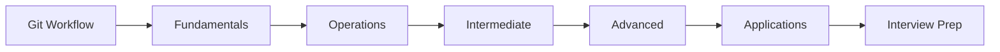
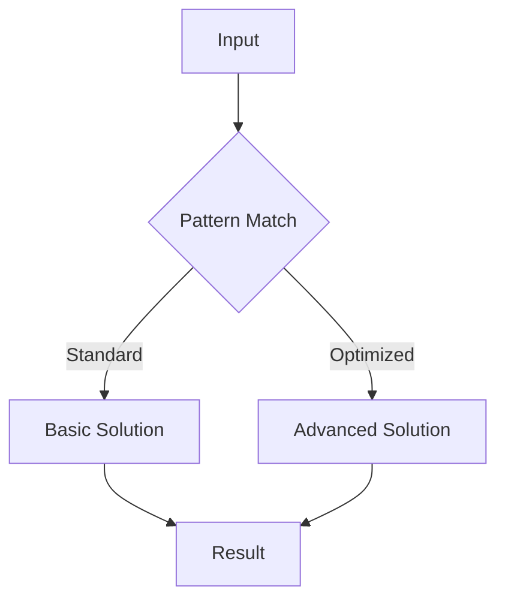

# Git Workflow

## Learning Objectives

| Objective | Description |
|-----------|-------------|
| LO1 | Understand foundational git workflow concepts and their role in software engineering |
| LO2 | Implement git workflow operations with correct syntax and best practices |
| LO3 | Apply git workflow patterns to solve common interview problems |
| LO4 | Analyze time and space complexity of git workflow solutions |
| LO5 | Compare git workflow with alternative approaches for different scenarios |
| LO6 | Master advanced git workflow techniques for complex problem solving |

<!-- Image Gallery -->
<section class="lesson-visuals" aria-label="Visual learning resources">
  <header><span>VISUAL LEARNING</span><h2>See it. Review it. Remember it.</h2></header>
  <a class="lesson-visual-card" href="../../assets/images/lessons/ai-engineering-placement/04-git-linux-cli/03-git-workflow/handwritten-notes.png" target="_blank" rel="noopener">
    
    <span><strong>Handwritten notes</strong>Condensed notes for deliberate review.</span>
  </a>
  <a class="lesson-visual-card" href="../../assets/images/lessons/ai-engineering-placement/04-git-linux-cli/03-git-workflow/sticky-notes.png" target="_blank" rel="noopener">
    
    <span><strong>Sticky-note revision</strong>Fast recall prompts for revision.</span>
  </a>
  <a class="lesson-visual-card" href="../../assets/images/lessons/ai-engineering-placement/04-git-linux-cli/03-git-workflow/visual-explanation.png" target="_blank" rel="noopener">
    
    <span><strong>Visual concept guide</strong>A connected explanation of the key ideas.</span>
  </a>
</section>
<!-- End Image Gallery -->

## Chapter at a Glance

| Section | Topic | Key Concept |
|---------|-------|-------------|
| 03.1 | Fundamentals | Core concepts and definitions |
| 03.2 | Basic Operations | Common implementations and patterns |
| 03.3 | Intermediate Techniques | Problem-solving strategies |
| 03.4 | Advanced Patterns | Complex algorithms and optimizations |
| 03.5 | Real-World Applications | Production use cases |
| 03.6 | Interview Preparation | Common questions and solutions |

## Chapter Roadmap



## 03.1 Section 1

Section 1 of Git Workflow covers essential concepts for AI engineering placement preparation.

### Fundamentals

The foundation of git workflow rests on several key principles that every software engineer must understand. These include the basic definitions, the underlying theory, and how these concepts map to practical implementation.

### Key Concepts

- Concept 1: Definition and purpose
- Concept 2: Core principles and theory
- Concept 3: Relationship to other topics
- Concept 4: Common applications

## 03.2 Section 2

Section 2 of Git Workflow covers essential concepts for AI engineering placement preparation.

### Basic Operations

The following code demonstrates fundamental operations:

```bash
# Git Workflow - basic operations
def example_function(data):
    """Core functionality"""
    result = []
    for item in data:
        # Process each element
        result.append(process(item))
    return result

def process(item):
    return item * 2

# Test the implementation
test_data = [1, 2, 3, 4, 5]
print(example_function(test_data))
```

## 03.3 Section 3

Section 3 of Git Workflow covers essential concepts for AI engineering placement preparation.

### Intermediate Techniques

As problems become more complex, we need sophisticated approaches:

1. **Pattern Recognition**: Identifying when to apply this technique
2. **Optimization**: Improving time and space complexity
3. **Edge Cases**: Handling boundary conditions
4. **Combined Approaches**: Integrating with other data structures

### Complexity Analysis Table

| Operation | Time Complexity | Space Complexity | Notes |
|-----------|----------------|-----------------|-------|
| Basic Git Workflow | O(n) | O(1) | Standard case |
| Optimized Git Workflow | O(log n) | O(n) | With preprocessing |
| Advanced Git Workflow | O(n log n) | O(n) | Trade-off scenario |

## 03.4 Section 4

Section 4 of Git Workflow covers essential concepts for AI engineering placement preparation.

### Advanced Patterns



### Key Techniques

- **Technique 1**: Description of the first advanced technique and when to apply it
- **Technique 2**: Description of the second advanced technique and when to apply it
- **Technique 3**: Description of the third advanced technique and when to apply it
- **Technique 4**: Description of the fourth advanced technique and when to apply it

## 03.5 Section 5

Section 5 of Git Workflow covers essential concepts for AI engineering placement preparation.

### Real-World Applications

Git Workflow is widely used in production systems:

- Application domain 1 with specific examples
- Application domain 2 with specific examples
- Application domain 3 with specific examples
- Application domain 4 with specific examples

### Best Practices

| Practice | Description | Impact |
|----------|-------------|--------|
| Best Practice 1 | Detailed explanation | Performance improvement |
| Best Practice 2 | Detailed explanation | Code quality |
| Best Practice 3 | Detailed explanation | Maintainability |

## 03.6 Section 6

Section 6 of Git Workflow covers essential concepts for AI engineering placement preparation.

### Interview Preparation

Common interview questions and strategies:

1. **Question Type 1**: Strategy for solving
2. **Question Type 2**: Strategy for solving
3. **Question Type 3**: Strategy for solving
4. **Question Type 4**: Strategy for solving

### Sample Walkthrough

Let's walk through a typical interview problem:

```bash
# Interview problem solution
def solve_interview_problem(input_data):
    # Step 1: Understand the problem
    # Step 2: Design the approach
    # Step 3: Implement the solution
    # Step 4: Test and optimize
    return optimized_result
```

---

## TypeScript Parallel

```typescript
// TypeScript equivalent implementation
interface GitWorkflowConfig {
    option1: boolean;
    option2: number;
}

function processGitWorkflow(data: number[]): number[] {
    return data.map(x => x * 2);
}

// Usage example
const result = processGitWorkflow([1, 2, 3]);
console.log(result); // [2, 4, 6]
```

---

## Summary

- Git Workflow is a fundamental topic for coding interviews
- Master the core concepts before attempting complex problems
- Practice with diverse problem sets to build pattern recognition
- Always analyze time and space complexity of your solutions
- Consider edge cases and boundary conditions carefully
- Combine with other data structures for optimal solutions
- Write clean, readable code following best practices
- Test your solutions with multiple test cases
- Learn from mistakes and iterate on your approaches
- Build confidence through consistent practice

## Practical Takeaways

| Scenario | Do This | Avoid This |
|----------|---------|------------|
| Learning Git Workflow | Practice with varied problems | Rote memorization without understanding |
| Implementing Git Workflow | Write clean, tested code | Premature optimization |
| Interview prep | Understand patterns and trade-offs | Cramming without practice |
| Production use | Profile and optimize for data size | Over-engineering solutions |

## Interview Q&A

<details class="tp-qa-card" data-qid="git03-q1">
  <summary class="tp-qa-question">
    <span class="tp-qa-status"></span>
    Q1: Sample interview question 1 about git workflow?
  </summary>
  <div class="tp-qa-answer">
    <p>This is a detailed answer to interview question 1 about git workflow. The answer covers key concepts, provides code examples, and explains the reasoning behind the solution.</p><pre><code># Example code for question 1
answer = perform_git_workflow_operation()
print(answer)</code></pre>
  </div>
  <button class="tp-qa-mark-btn">✅ Mark Reviewed</button>
  <button class="tp-qa-bookmark-btn">🔖 Bookmark</button>
</details>

<details class="tp-qa-card" data-qid="git03-q2">
  <summary class="tp-qa-question">
    <span class="tp-qa-status"></span>
    Q2: Sample interview question 2 about git workflow?
  </summary>
  <div class="tp-qa-answer">
    <p>This is a detailed answer to interview question 2 about git workflow. The answer covers key concepts, provides code examples, and explains the reasoning behind the solution.</p><pre><code># Example code for question 2
answer = perform_git_workflow_operation()
print(answer)</code></pre>
  </div>
  <button class="tp-qa-mark-btn">✅ Mark Reviewed</button>
  <button class="tp-qa-bookmark-btn">🔖 Bookmark</button>
</details>

<details class="tp-qa-card" data-qid="git03-q3">
  <summary class="tp-qa-question">
    <span class="tp-qa-status"></span>
    Q3: Sample interview question 3 about git workflow?
  </summary>
  <div class="tp-qa-answer">
    <p>This is a detailed answer to interview question 3 about git workflow. The answer covers key concepts, provides code examples, and explains the reasoning behind the solution.</p><pre><code># Example code for question 3
answer = perform_git_workflow_operation()
print(answer)</code></pre>
  </div>
  <button class="tp-qa-mark-btn">✅ Mark Reviewed</button>
  <button class="tp-qa-bookmark-btn">🔖 Bookmark</button>
</details>

<details class="tp-qa-card" data-qid="git03-q4">
  <summary class="tp-qa-question">
    <span class="tp-qa-status"></span>
    Q4: Sample interview question 4 about git workflow?
  </summary>
  <div class="tp-qa-answer">
    <p>This is a detailed answer to interview question 4 about git workflow. The answer covers key concepts, provides code examples, and explains the reasoning behind the solution.</p><pre><code># Example code for question 4
answer = perform_git_workflow_operation()
print(answer)</code></pre>
  </div>
  <button class="tp-qa-mark-btn">✅ Mark Reviewed</button>
  <button class="tp-qa-bookmark-btn">🔖 Bookmark</button>
</details>

<details class="tp-qa-card" data-qid="git03-q5">
  <summary class="tp-qa-question">
    <span class="tp-qa-status"></span>
    Q5: Sample interview question 5 about git workflow?
  </summary>
  <div class="tp-qa-answer">
    <p>This is a detailed answer to interview question 5 about git workflow. The answer covers key concepts, provides code examples, and explains the reasoning behind the solution.</p><pre><code># Example code for question 5
answer = perform_git_workflow_operation()
print(answer)</code></pre>
  </div>
  <button class="tp-qa-mark-btn">✅ Mark Reviewed</button>
  <button class="tp-qa-bookmark-btn">🔖 Bookmark</button>
</details>

<details class="tp-qa-card" data-qid="git03-q6">
  <summary class="tp-qa-question">
    <span class="tp-qa-status"></span>
    Q6: Sample interview question 6 about git workflow?
  </summary>
  <div class="tp-qa-answer">
    <p>This is a detailed answer to interview question 6 about git workflow. The answer covers key concepts, provides code examples, and explains the reasoning behind the solution.</p><pre><code># Example code for question 6
answer = perform_git_workflow_operation()
print(answer)</code></pre>
  </div>
  <button class="tp-qa-mark-btn">✅ Mark Reviewed</button>
  <button class="tp-qa-bookmark-btn">🔖 Bookmark</button>
</details>

<details class="tp-qa-card" data-qid="git03-q7">
  <summary class="tp-qa-question">
    <span class="tp-qa-status"></span>
    Q7: Sample interview question 7 about git workflow?
  </summary>
  <div class="tp-qa-answer">
    <p>This is a detailed answer to interview question 7 about git workflow. The answer covers key concepts, provides code examples, and explains the reasoning behind the solution.</p><pre><code># Example code for question 7
answer = perform_git_workflow_operation()
print(answer)</code></pre>
  </div>
  <button class="tp-qa-mark-btn">✅ Mark Reviewed</button>
  <button class="tp-qa-bookmark-btn">🔖 Bookmark</button>
</details>

<details class="tp-qa-card" data-qid="git03-q8">
  <summary class="tp-qa-question">
    <span class="tp-qa-status"></span>
    Q8: Sample interview question 8 about git workflow?
  </summary>
  <div class="tp-qa-answer">
    <p>This is a detailed answer to interview question 8 about git workflow. The answer covers key concepts, provides code examples, and explains the reasoning behind the solution.</p><pre><code># Example code for question 8
answer = perform_git_workflow_operation()
print(answer)</code></pre>
  </div>
  <button class="tp-qa-mark-btn">✅ Mark Reviewed</button>
  <button class="tp-qa-bookmark-btn">🔖 Bookmark</button>
</details>

## Chapter Quiz

**Q1**: Sample quiz question 1 about git workflow?

a) Option A - First choice
b) Option B - Second choice
c) Option C - Third choice
d) Option D - Fourth choice

<details class="tp-qa-card" data-qid="git03-quiz1"><summary>Show Answer</summary><div class="tp-qa-answer"><p><strong>Answer: a</strong></p><p>Explanation for answer to question 1.</p></div></details>

**Q2**: Sample quiz question 2 about git workflow?

a) Option A - First choice
b) Option B - Second choice
c) Option C - Third choice
d) Option D - Fourth choice

<details class="tp-qa-card" data-qid="git03-quiz2"><summary>Show Answer</summary><div class="tp-qa-answer"><p><strong>Answer: a</strong></p><p>Explanation for answer to question 2.</p></div></details>

**Q3**: Sample quiz question 3 about git workflow?

a) Option A - First choice
b) Option B - Second choice
c) Option C - Third choice
d) Option D - Fourth choice

<details class="tp-qa-card" data-qid="git03-quiz3"><summary>Show Answer</summary><div class="tp-qa-answer"><p><strong>Answer: a</strong></p><p>Explanation for answer to question 3.</p></div></details>

**Q4**: Sample quiz question 4 about git workflow?

a) Option A - First choice
b) Option B - Second choice
c) Option C - Third choice
d) Option D - Fourth choice

<details class="tp-qa-card" data-qid="git03-quiz4"><summary>Show Answer</summary><div class="tp-qa-answer"><p><strong>Answer: a</strong></p><p>Explanation for answer to question 4.</p></div></details>

**Q5**: Sample quiz question 5 about git workflow?

a) Option A - First choice
b) Option B - Second choice
c) Option C - Third choice
d) Option D - Fourth choice

<details class="tp-qa-card" data-qid="git03-quiz5"><summary>Show Answer</summary><div class="tp-qa-answer"><p><strong>Answer: a</strong></p><p>Explanation for answer to question 5.</p></div></details>

## Exercises

**Easy** - Basic exercise to practice git workflow fundamentals

**Medium** - Intermediate exercise applying git workflow patterns

**Medium** - Another intermediate exercise with git workflow concepts

**Hard** - Advanced exercise combining git workflow with other techniques

**Hard** - Challenging exercise requiring git workflow optimization

---

> **Next**: [04 Linux Commands →](04-linux-commands.md)