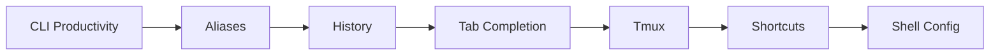

# CLI Productivity

## Learning Objectives

| Objective | Description |
|-----------|-------------|
| LO1 | Create and manage shell aliases for repetitive commands |
| LO2 | Use shell history search and expansion to speed up workflow |
| LO3 | Configure tab completion for commands, files, and custom completions |
| LO4 | Manage persistent terminal sessions with tmux |
| LO5 | Master keyboard shortcuts for efficient command-line editing |
| LO6 | Build a personalized shell configuration for maximum productivity |

## Introduction

CLI productivity tools — aliases, tmux, history expansion, tab completion — dramatically speed up your workflow. AI engineers who master the command line can iterate faster on experiments and deployments.

## Prerequisites

- Linux basics
- Shell fundamentals
## Chapter at a Glance

| Section | Topic | Key Concept |
|---------|-------|-------------|
| 05.1 | Shell Aliases | Define, persist, and organize shortcuts |
| 05.2 | History | Search, repeat, and expand previous commands |
| 05.3 | Tab Completion | Auto-complete commands, arguments, and custom targets |
| 05.4 | Tmux | Persistent sessions, windows, and panes |
| 05.5 | Keyboard Shortcuts | Bash/readline key bindings for fast editing |
| 05.6 | Shell Configuration | .bashrc, .zshrc, environment setup |

## Chapter Roadmap



## Theory

### 05.1 Shell Aliases

Aliases are shortcuts that expand to longer commands. They eliminate typing repetitive command sequences.

**Creating aliases:**

```bash
# Simple alias
alias ll='ls -la'

# Alias with complex pipeline
alias ports='netstat -tuln | grep LISTEN'

# Alias with multiple commands
alias update='sudo apt update && sudo apt upgrade -y'

# View all defined aliases
alias

# Remove an alias
unalias ll

# Check if an alias exists
type ll
```

**Essential aliases for developers:**

```bash
# Navigation
alias ..='cd ..'
alias ...='cd ../..'
alias ....='cd ../../..'

# Git shortcuts
alias g='git'
alias gs='git status'
alias ga='git add'
alias gc='git commit -m'
alias gp='git push'
alias gl='git log --oneline --graph'
alias gd='git diff'
alias gb='git branch'
alias gco='git checkout'

# Docker shortcuts
alias dk='docker'
alias dkps='docker ps'
alias dkc='docker compose'
alias dkrm='docker rm $(docker ps -aq)'

# Kubernetes
alias k='kubectl'
alias kgp='kubectl get pods'
alias kgs='kubectl get services'
alias kgn='kubectl get nodes'

# Python
alias py='python3'
alias pip='pip3'
alias venv='python3 -m venv'
alias activate='source venv/bin/activate'

# Safety aliases
alias rm='rm -i'
alias cp='cp -i'
alias mv='mv -i'

# Quick edit config files
alias bashrc='vim ~/.bashrc'
alias zshrc='vim ~/.zshrc'
alias reload='source ~/.bashrc'
```

**Persisting aliases:**

```bash
# Add to ~/.bashrc (permanent)
echo "alias ll='ls -la'" >> ~/.bashrc

# Or add to ~/.bash_aliases (cleaner separation)
echo "alias ll='ls -la'" >> ~/.bash_aliases
# Then source it from .bashrc:
# if [ -f ~/.bash_aliases ]; then . ~/.bash_aliases; fi

# Apply changes without restarting
source ~/.bashrc
```

**When to use functions instead of aliases:**

```bash
# Alias can't take arguments easily
alias greet='echo Hello'

# Function version — more flexible
greet() {
    local name="${1:-World}"
    echo "Hello, $name!"
}
greet Alice    # Hello, Alice!
greet          # Hello, World!

# Useful function: mkcd (mkdir + cd)
mkcd() {
    mkdir -p "$1" && cd "$1"
}

# Useful function: extract any archive
extract() {
    case "$1" in
        *.tar.bz2) tar xjf "$1" ;;
        *.tar.gz)  tar xzf "$1" ;;
        *.tar.xz)  tar xJf "$1" ;;
        *.bz2)     bunzip2 "$1" ;;
        *.gz)      gunzip "$1" ;;
        *.tar)     tar xf "$1" ;;
        *.zip)     unzip "$1" ;;
        *.7z)      7z x "$1" ;;
        *)         echo "Unknown format: $1" ;;
    esac
}
```

### 05.2 Shell History

Bash history records every command you type. Leveraging it saves significant time.

**Basic history operations:**

```bash
# View full history
history

# View last 20 commands
history 20

# Clear history
history -c

# Search history interactively (Ctrl+R)
# Press Ctrl+R, then type a search term
```

**Repeating previous commands:**

```bash
# Run last command
!!

# Run last command with sudo
sudo !!

# Run last command starting with "docker"
!docker

# Run last argument of last command
!$

# Run all arguments of last command
!*

# Expand to the Nth argument of previous command
echo !:2    # 2nd argument of last command
echo !:3-5  # arguments 3 through 5
```

**History expansion examples:**

```bash
# If last command was: git add src/auth.ts

!!                     # git add src/auth.ts
!$                     # src/auth.ts
sudo !!                # sudo git add src/auth.ts
!git:0                 # git
!git:*                 # add src/auth.ts
!git:1                 # add
```

**Searching history:**

```bash
# Ctrl+R — reverse incremental search
# Type to search, press Enter to run, press Ctrl+R again for next match

# Search history with grep
history | grep "docker"

# Search with prefix
!grep   # Run last command starting with "grep"

# Show history with timestamps
HISTTIMEFORMAT="%Y-%m-%d %H:%M: " history
```

**History configuration (~/.bashrc):**

```bash
# Increase history size
HISTSIZE=50000
HISTFILESIZE=100000

# Don't store duplicate consecutive entries
HISTCONTROL=ignoredups:erasedups

# Append to history file instead of overwriting
shopt -s histappend

# Save multi-line commands as one entry
shopt -s cmdhist

# Save history after each command (real-time)
PROMPT_COMMAND="history -a; $PROMPT_COMMAND"
```

### 05.3 Tab Completion

Tab completion automatically completes commands, filenames, variables, and arguments. It's one of the biggest productivity gains in the terminal.

**Basic completion:**

```bash
# Press Tab once — completes if unique
# Press Tab twice — shows all possibilities

# Complete a command name
dock<Tab>        # → docker
git ch<Tab>      # → git checkout

# Complete a filename
cat /etc/hos<Tab>    # → cat /etc/hosts
cd Docu<Tab>         # → cd Documents/
```

**Completion features:**

```bash
# Complete command options
git checkout -<Tab><Tab>
# Shows: -b -l -m -p -q ...

# Complete after pipes
ls | grep <Tab>    # Shows files/dirs
cat file | sort <Tab>  # Shows sort options

# Complete environment variables
echo $HO<Tab>      # → echo $HOME

# Complete usernames
ssh user<Tab>      # Shows matching usernames

# Complete hostnames from /etc/hosts
ping local<Tab>    # → ping localhost
```

**Custom completions (bash):**

```bash
# Create a completion function
_complete_myapp() {
    local cur="${COMP_WORDS[COMP_CWORD]}"
    COMPREPLY=( $(compgen -W "start stop restart status logs" -- "$cur") )
}
complete -F _complete_myapp myapp

# Usage: myapp st<Tab> → start, stop, status
```

**Enabling completions for common tools:**

```bash
# Git completion (install on Ubuntu/Debian)
sudo apt install git-complete

# Docker completion
curl -L https://raw.githubusercontent.com/docker/compose/master/contrib/completion/bash/docker-compose > /etc/bash_completion.d/docker-compose

# Kubernetes completion
source <(kubectl completion bash)

# Poetry completion
poetry completions bash >> ~/.bash_completion.d/poetry.bash
```

**Zsh completions (more powerful):**

```bash
# Zsh has built-in completion system
# Enable in ~/.zshrc:
autoload -Uz compinit && compinit

# Case-insensitive completion
zstyle ':completion:*' matcher-list 'm:{a-zA-Z}={A-Za-z}'

# Show menu for ambiguous completions
zstyle ':completion:*' menu select
```

### 05.4 Tmux

Tmux is a terminal multiplexer. It lets you run multiple terminal sessions in a single window, detach and reattach sessions, and split your terminal into panes.

**Why tmux matters:**

- Keep sessions alive when SSH disconnects
- Split terminal into multiple panes for monitoring
- Run long processes in background sessions
- Share sessions with teammates for pair programming

**Basic tmux operations:**

```bash
# Start a new session named "dev"
tmux new -s dev

# List running sessions
tmux ls

# Attach to a session
tmux attach -t dev

# Kill a session
tmux kill-session -t dev

# Detach from current session
# Press: Ctrl+b, then d
```

**Tmux panes:**

```bash
# Split horizontally
# Press: Ctrl+b, then "

# Split vertically
# Press: Ctrl+b, then %

# Navigate between panes
# Press: Ctrl+b, then arrow keys

# Resize pane
# Press: Ctrl+b, then Ctrl+arrow keys

# Close current pane
# Press: Ctrl+b, then x
```

**Tmux windows (tabs):**

```bash
# Create new window
# Press: Ctrl+b, then c

# Switch windows
# Press: Ctrl+b, then 0-9

# Rename current window
# Press: Ctrl+b, then ,

# Close window
# Press: Ctrl+b, then &
```

**Useful tmux config (~/.tmux.conf):**

```bash
# Enable mouse support
set -g mouse on

# Start windows/panes at 1, not 0
set -g base-index 1
setw -g pane-base-index 1

# Increase scrollback buffer
set -g history-limit 50000

# Faster command sequence (change prefix to Ctrl+a)
unbind C-b
set -g prefix C-a
bind C-a send-prefix

# Split panes with | and -
bind | split-window -h
bind - split-window -v

# Reload config
bind r source-file ~/.tmux.conf
```

**Tmux workflow for development:**

```bash
# Start a dev session with multiple windows
tmux new -s dev

# Window 1: Editor
vim src/app.ts

# Window 2: Server (Ctrl+b, c)
npm run dev

# Window 3: Tests (Ctrl+b, c)
npm run test:watch

# Window 4: Git (Ctrl+b, c)
git status

# Detach and reattach later
# Ctrl+b, d → tmux attach -t dev
```

### 05.5 Keyboard Shortcuts

Bash uses the GNU Readline library for line editing. These shortcuts work in bash, zsh, and most CLI tools.

**Cursor movement:**

| Shortcut | Action |
|----------|--------|
| `Ctrl+A` | Move to beginning of line |
| `Ctrl+E` | Move to end of line |
| `Ctrl+B` | Move back one character |
| `Ctrl+F` | Move forward one character |
| `Alt+B` | Move back one word |
| `Alt+F` | Move forward one word |

**Editing:**

| Shortcut | Action |
|----------|--------|
| `Ctrl+U` | Cut from cursor to beginning of line |
| `Ctrl+K` | Cut from cursor to end of line |
| `Ctrl+W` | Cut word before cursor |
| `Alt+D` | Cut word after cursor |
| `Ctrl+Y` | Paste (yank) last cut text |
| `Ctrl+X X` | Cycle through cursor positions in line |
| `Ctrl+T` | Transpose (swap) last two characters |
| `Alt+T` | Transpose last two words |

**History and search:**

| Shortcut | Action |
|----------|--------|
| `Ctrl+R` | Reverse search through history |
| `Ctrl+S` | Forward search through history |
| `Ctrl+P` | Previous command |
| `Ctrl+N` | Next command |
| `Alt+R` | Undo any changes to current line |

**Process control:**

| Shortcut | Action |
|----------|--------|
| `Ctrl+C` | Kill current process (SIGINT) |
| `Ctrl+Z` | Suspend current process (SIGTSTP) |
| `Ctrl+D` | Exit shell / send EOF |
| `Ctrl+L` | Clear screen (same as `clear`) |
| `Ctrl+S` | Freeze terminal output (XOFF) |
| `Ctrl+Q` | Resume terminal output (XON) |

**Completion:**

| Shortcut | Action |
|----------|--------|
| `Tab` | Auto-complete |
| `Tab Tab` | Show all completions |
| `Alt+?` | Show all completions (alternative) |
| `Alt+/` | Auto-complete filename |
| `Alt+~` | Expand ~ to home directory |
| `Alt+.` | Insert last argument of previous command |

**Practical examples:**

```bash
# Fast file editing workflow
vim /long/path/to/file.txt
# Oops, wrong file — Ctrl+U to clear, then type correct path

# Edit a long command
git commit -m "Fix bug in authentication module that causes login failures on mobile"
# Ctrl+A to go to start, Ctrl+F to move to "Fix", change to "fix"

# Quick directory navigation
cd /var/log/apache2/
# Ctrl+U clears the line, type new path
cd /etc/nginx/

# Reuse last argument
mkdir new-project
cd !$    # cd /var/log/apache2/
```

### 05.6 Shell Configuration

Your shell configuration files define the environment: aliases, functions, prompt, paths, and settings.

**Configuration file locations:**

| File | Purpose | Loaded When |
|------|---------|-------------|
| `~/.bashrc` | Interactive shell config | New interactive bash session |
| `~/.profile` | Login shell config | Login session |
| `~/.bash_profile` | Bash-specific login config | Bash login session |
| `~/.bash_logout` | Cleanup on logout | Logout |
| `~/.inputrc` | Readline configuration | Every bash session |
| `~/.zshrc` | Zsh configuration | New zsh session |

**Essential .bashrc structure:**

```bash
# ── History ──────────────────────────────
HISTSIZE=50000
HISTFILESIZE=100000
HISTCONTROL=ignoredups:erasedups
shopt -s histappend

# ── Navigation ───────────────────────────
alias ..='cd ..'
alias ...='cd ../..'
alias ll='ls -la'
alias la='ls -A'

# ── Git ──────────────────────────────────
alias g='git'
alias gs='git status'
alias gl='git log --oneline --graph'

# ── Development ──────────────────────────
alias py='python3'
alias dc='docker compose'
alias k='kubectl'

# ── Functions ────────────────────────────
mkcd() { mkdir -p "$1" && cd "$1"; }

# ── Prompt ───────────────────────────────
PS1='\[\e[32m\]\u@\h:\w\$\[\e[0m\] '

# ── Completions ──────────────────────────
source /etc/bash_completion
source <(kubectl completion bash)

# ── Custom PATH ──────────────────────────
export PATH="$HOME/.local/bin:$PATH"
export PATH="$HOME/bin:$PATH"
```

**Environment variables:**

```bash
# Set environment variable (persists in session)
export EDITOR=vim

# Set permanently in .bashrc
echo 'export EDITOR=vim' >> ~/.bashrc

# Common useful variables
export EDITOR=vim
export VISUAL=code
export LANG=en_US.UTF-8
export GOPATH=$HOME/go
export NVM_DIR="$HOME/.nvm"

# PATH management
export PATH="$HOME/.cargo/bin:$PATH"
export PATH="/usr/local/go/bin:$PATH"
```

**Zsh vs Bash:**

| Feature | Bash | Zsh |
|---------|------|-----|
| Tab completion | Basic | Advanced (menu, patterns) |
| Plugin ecosystem | Limited | Oh My Zsh, Zinit |
| Themes | PS1 only | Starship, Powerlevel10k |
| Spell correction | No | Yes |
| Shared history | No | Yes |
| Globbing | Basic | Extended (**, ~, etc.) |

## Summary

- Aliases (`alias gs='git status'`) eliminate repetitive typing — persist in `.bashrc`
- Use functions for aliases that need arguments or complex logic
- `!!` repeats the last command; `!$` expands to the last argument
- `Ctrl+R` provides reverse incremental history search
- Tab completion works for commands, files, options, and custom targets
- Tmux keeps sessions alive across SSH disconnects — essential for remote work
- `Ctrl+A/E` for line start/end; `Ctrl+U/K` for cutting text; `Ctrl+W` for word delete
- Organize `.bashrc` with sections: history, aliases, functions, prompt, completions
- Consider Zsh + Oh My Zsh for better completion, themes, and plugin support

## Practical Takeaways

| Scenario | Shortcut/Tool |
|----------|---------------|
| Repeat last command quickly | `!!` or `Ctrl+P` |
| Add sudo to last command | `sudo !!` |
| Find a command from history | `Ctrl+R` then type search |
| Long command with wrong start | `Ctrl+A` then edit |
| Reuse last argument | `Alt+.` or `!$` |
| Clear screen | `Ctrl+L` |
| Persistent remote session | `tmux new -s dev` |
| Quick mkdir + cd | `mkcd dir` function |

## Interview Q&A

<details class="tp-qa-card" data-qid="git05-q1">
  <summary class="tp-qa-question">
    <span class="tp-qa-status"></span>
    Q1: What is the difference between an alias and a function in bash?
  </summary>
  <div class="tp-qa-answer">
    <p><strong>Aliases</strong> are simple text substitutions — they can't take arguments, use control flow, or handle complex logic. <strong>Functions</strong> are full programs with parameters (<code>$1</code>, <code>$2</code>), local variables, conditionals, and return values. Use aliases for simple shortcuts (<code>alias gs='git status'</code>) and functions when you need flexibility (<code>mkcd() { mkdir -p "$1" && cd "$1"; }</code>).</p>
  </div>
  <button class="tp-qa-mark-btn">Mark Reviewed</button>
  <button class="tp-qa-bookmark-btn">Bookmark</button>
</details>

<details class="tp-qa-card" data-qid="git05-q2">
  <summary class="tp-qa-question">
    <span class="tp-qa-status"></span>
    Q2: Explain three keyboard shortcuts that save the most time in the terminal.
  </summary>
  <div class="tp-qa-answer">
    <p><strong>1. Ctrl+R</strong> — Reverse history search. Start typing to find any previous command instantly instead of retyping.</p>
    <p><strong>2. !! (double bang)</strong> — Repeats the last command. Combine with sudo: <code>sudo !!</code> to run the last command as root.</p>
    <p><strong>3. Ctrl+A / Ctrl+E</strong> — Jump to start/end of line. On long commands, jump to the beginning to change a flag instead of holding the arrow key.</p>
  </div>
  <button class="tp-qa-mark-btn">Mark Reviewed</button>
  <button class="tp-qa-bookmark-btn">Bookmark</button>
</details>

<details class="tp-qa-card" data-qid="git05-q3">
  <summary class="tp-qa-question">
    <span class="tp-qa-status"></span>
    Q3: Why would you use tmux instead of just opening multiple terminal windows?
  </summary>
  <div class="tp-qa-answer">
    <p><strong>1. Persistence</strong> — tmux sessions survive SSH disconnections; your server logs keep running. <strong>2. Splits</strong> — View multiple terminals in one window (server + tests + logs). <strong>3. Reattachment</strong> — Detach from home, reattach at work with the same state. <strong>4. Sharing</strong> — Pair program by attaching to the same session. Regular terminal windows don't offer any of these.</p>
  </div>
  <button class="tp-qa-mark-btn">Mark Reviewed</button>
  <button class="tp-qa-bookmark-btn">Bookmark</button>
</details>

<details class="tp-qa-card" data-qid="git05-q4">
  <summary class="tp-qa-question">
    <span class="tp-qa-status"></span>
    Q4: How do you make an alias permanent across terminal sessions?
  </summary>
  <div class="tp-qa-answer">
    <p>Add the alias to your shell configuration file: <code>~/.bashrc</code> for bash or <code>~/.zshrc</code> for zsh. For cleaner organization, create <code>~/.bash_aliases</code> and source it from <code>~/.bashrc</code> with <code>if [ -f ~/.bash_aliases ]; then . ~/.bash_aliases; fi</code>. Run <code>source ~/.bashrc</code> to apply changes immediately.</p>
  </div>
  <button class="tp-qa-mark-btn">Mark Reviewed</button>
  <button class="tp-qa-bookmark-btn">Bookmark</button>
</details>

<details class="tp-qa-card" data-qid="git05-q5">
  <summary class="tp-qa-question">
    <span class="tp-qa-status"></span>
    Q5: What is the purpose of HISTCONTROL=ignoredups:erasedups?
  </summary>
  <div class="tp-qa-answer">
    <p><code>ignoredups</code> prevents storing consecutive duplicate commands (same command twice in a row only stored once). <code>erasedups</code> removes ALL earlier occurrences of a command when it's entered again, keeping only the most recent instance. Together they keep history clean and make <code>Ctrl+R</code> search more efficient.</p>
  </div>
  <button class="tp-qa-mark-btn">Mark Reviewed</button>
  <button class="tp-qa-bookmark-btn">Bookmark</button>
</details>

## Chapter Quiz

**Q1**: What does `!!` do in bash?

a) Clears the screen
b) Runs the previous command
c) Lists running processes
d) Shows the last argument of the previous command

<details class="tp-qa-card" data-qid="git05-quiz1"><summary>Show Answer</summary><div class="tp-qa-answer"><p><strong>Answer: b</strong></p><p><code>!!</code> (double bang) expands to and runs the last command. Most commonly used as <code>sudo !!</code> to re-run the previous command with root privileges.</p></div></details>

**Q2**: Which tmux command detaches from the current session?

a) Ctrl+d
b) Ctrl+b, then d
c) Ctrl+c
d) Ctrl+z

<details class="tp-qa-card" data-qid="git05-quiz2"><summary>Show Answer</summary><div class="tp-qa-answer"><p><strong>Answer: b</strong></p><p>In tmux, the prefix key is <code>Ctrl+b</code>, followed by a command key. <code>Ctrl+b, d</code> detaches from the session. The session continues running in the background and can be reattached with <code>tmux attach</code>.</p></div></details>

**Q3**: What is the difference between `Ctrl+U` and `Ctrl+K` in bash?

a) Ctrl+U clears the screen; Ctrl+K clears the line
b) Ctrl+U cuts from cursor to beginning; Ctrl+K cuts from cursor to end
c) Ctrl+U undoes; Ctrl+K redoes
d) Ctrl+U goes up; Ctrl+K goes down

<details class="tp-qa-card" data-qid="git05-quiz3"><summary>Show Answer</summary><div class="tp-qa-answer"><p><strong>Answer: b</strong></p><p><code>Ctrl+U</code> cuts (kills) from the cursor to the beginning of the line. <code>Ctrl+K</code> cuts from the cursor to the end. Both store the cut text in the kill ring, which can be pasted with <code>Ctrl+Y</code>.</p></div></details>

**Q4**: How do you enable tab completion for kubectl in bash?

a) It's enabled by default
b) source <(kubectl completion bash)
c) kubectl --complete
d) apt install kubectl-complete

<details class="tp-qa-card" data-qid="git05-quiz4"><summary>Show Answer</summary><div class="tp-qa-answer"><p><strong>Answer: b</strong></p><p><code>source &lt;(kubectl completion bash)</code> generates and loads bash completion scripts for kubectl. Add this line to <code>~/.bashrc</code> for persistence. Zsh equivalent: <code>source &lt;(kubectl completion zsh)</code>.</p></div></details>

**Q5**: Which file should you edit to add persistent aliases in bash?

a) ~/.bash_profile
b) ~/.bashrc
c) /etc/aliases
d) ~/.profile

<details class="tp-qa-card" data-qid="git05-quiz5"><summary>Show Answer</summary><div class="tp-qa-answer"><p><strong>Answer: b</strong></p><p><code>~/.bashrc</code> is loaded for every interactive non-login bash session. Add aliases there for persistence. <code>~/.profile</code> and <code>~/.bash_profile</code> are for login sessions only and often <code>source</code> <code>.bashrc</code> anyway.</p></div></details>

## Practical Tips

- Start with 5-10 aliases for your most common commands — don't over-alias
- Use functions instead of aliases when you need arguments or conditionals
- Configure history settings early — they save hours of retyping
- Learn Ctrl+R (search), Ctrl+A/E (navigation), Ctrl+U/K (editing) — they're game-changers
- Use tmux for any remote work — SSH drops are inevitable
- Consider Zsh + Oh My Zsh or Starship prompt for enhanced defaults

## Exercises

**Easy** — Create 5 aliases for your most-used git commands. Add them to `.bashrc` and verify they persist across new terminal sessions.

**Medium** — Write a bash function called `backup` that takes a filename, creates a timestamped copy (e.g., `file.txt.2024-01-15.bak`), and confirms before overwriting existing backups.

**Medium** — Set up a tmux configuration with custom prefix (Ctrl+a), split shortcuts (| and -), and mouse support. Start a session, create 3 windows, detach, and reattach.

**Hard** — Build a custom tab completion for a CLI tool you use (e.g., `deploy <env> <service>`), register it in `.bashrc`, and test it with Tab completion.

---


## Common Mistakes

1. Not setting up aliases for repetitive commands
2. Not using tmux for long-running processes
3. Not learning keyboard shortcuts
4. Forgetting to save .bashrc/.zshrc changes
5. Not using history search (Ctrl+R)
## Revision Notes

- alias ll="ls -la": save keystrokes
- tmux: persistent terminal sessions
- Ctrl+R: reverse history search
- !!: repeat last command
- $?: check last command exit code
## Placement Section

### Top 10 Interview Questions

#### Google Style
1. Explain the time and space trade-offs of git linux cli. When would you choose one approach over another?
2. Design a system that efficiently handles git linux cli at scale (millions of requests/second).

#### Amazon Style
1. Tell me about a time you had to optimize a system related to git linux cli. What was your approach and what was the result?
2. How would you explain git linux cli to a non-technical stakeholder?

#### Microsoft Style
1. How does git linux cli integrate with enterprise systems and cloud architectures?
2. What are the security implications of git linux cli?

#### NVIDIA Style
1. How would you optimize git linux cli for GPU-accelerated computing?
2. What parallel processing patterns apply to git linux cli?

#### AI Startup Style
1. How would you implement git linux cli in a cost-effective, scalable way for a startup?
2. What's the fastest way to prototype a solution using git linux cli?

### Resume Tips
- **Technical Skills**: List git linux cli under relevant technical skills
- **Project Description**: "Implemented git linux cli to [specific outcome], reducing [metric] by [X]%"
- **Keywords**: Include git linux cli in your skills section for ATS optimization

### Interview Day Checklist
- [ ] Review core concepts of git linux cli
- [ ] Practice 3-5 problems related to git linux cli
- [ ] Prepare 2 real-world examples of using git linux cli
- [ ] Know the time/space complexity of common git linux cli operations
- [ ] Have questions ready about how the company uses git linux cli> **Next**: [06 Networking and Security →](06-networking-and-security.md)
