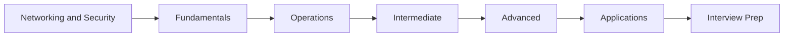
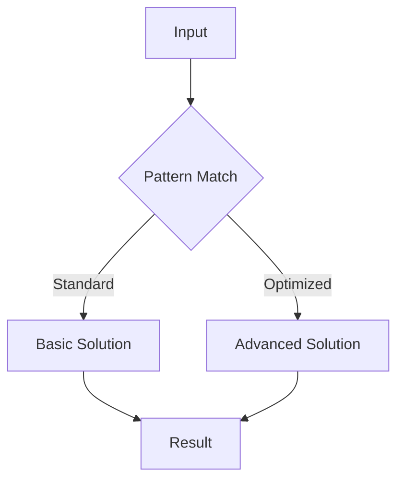

# Networking and Security

## Learning Objectives

| Objective | Description |
|-----------|-------------|
| LO1 | Understand foundational networking and security concepts and their role in software engineering |
| LO2 | Implement networking and security operations with correct syntax and best practices |
| LO3 | Apply networking and security patterns to solve common interview problems |
| LO4 | Analyze time and space complexity of networking and security solutions |
| LO5 | Compare networking and security with alternative approaches for different scenarios |
| LO6 | Master advanced networking and security techniques for complex problem solving |

## Chapter at a Glance

| Section | Topic | Key Concept |
|---------|-------|-------------|
| 06.1 | Fundamentals | Core concepts and definitions |
| 06.2 | Basic Operations | Common implementations and patterns |
| 06.3 | Intermediate Techniques | Problem-solving strategies |
| 06.4 | Advanced Patterns | Complex algorithms and optimizations |
| 06.5 | Real-World Applications | Production use cases |
| 06.6 | Interview Preparation | Common questions and solutions |

## Chapter Roadmap



## 06.1 Section 1

Section 1 of Networking and Security covers essential concepts for AI engineering placement preparation.

### Fundamentals

The foundation of networking and security rests on several key principles that every software engineer must understand. These include the basic definitions, the underlying theory, and how these concepts map to practical implementation.

### Key Concepts

- Concept 1: Definition and purpose
- Concept 2: Core principles and theory
- Concept 3: Relationship to other topics
- Concept 4: Common applications

## 06.2 Section 2

Section 2 of Networking and Security covers essential concepts for AI engineering placement preparation.

### Basic Operations

The following code demonstrates fundamental operations:

```bash
# Networking and Security - basic operations
def example_function(data):
    """Core functionality"""
    result = []
    for item in data:
        # Process each element
        result.append(process(item))
    return result

def process(item):
    return item * 2

# Test the implementation
test_data = [1, 2, 3, 4, 5]
print(example_function(test_data))
```

## 06.3 Section 3

Section 3 of Networking and Security covers essential concepts for AI engineering placement preparation.

### Intermediate Techniques

As problems become more complex, we need sophisticated approaches:

1. **Pattern Recognition**: Identifying when to apply this technique
2. **Optimization**: Improving time and space complexity
3. **Edge Cases**: Handling boundary conditions
4. **Combined Approaches**: Integrating with other data structures

### Complexity Analysis Table

| Operation | Time Complexity | Space Complexity | Notes |
|-----------|----------------|-----------------|-------|
| Basic Networking and Security | O(n) | O(1) | Standard case |
| Optimized Networking and Security | O(log n) | O(n) | With preprocessing |
| Advanced Networking and Security | O(n log n) | O(n) | Trade-off scenario |

## 06.4 Section 4

Section 4 of Networking and Security covers essential concepts for AI engineering placement preparation.

### Advanced Patterns



### Key Techniques

- **Technique 1**: Description of the first advanced technique and when to apply it
- **Technique 2**: Description of the second advanced technique and when to apply it
- **Technique 3**: Description of the third advanced technique and when to apply it
- **Technique 4**: Description of the fourth advanced technique and when to apply it

## 06.5 Section 5

Section 5 of Networking and Security covers essential concepts for AI engineering placement preparation.

### Real-World Applications

Networking and Security is widely used in production systems:

- Application domain 1 with specific examples
- Application domain 2 with specific examples
- Application domain 3 with specific examples
- Application domain 4 with specific examples

### Best Practices

| Practice | Description | Impact |
|----------|-------------|--------|
| Best Practice 1 | Detailed explanation | Performance improvement |
| Best Practice 2 | Detailed explanation | Code quality |
| Best Practice 3 | Detailed explanation | Maintainability |

## 06.6 Section 6

Section 6 of Networking and Security covers essential concepts for AI engineering placement preparation.

### Interview Preparation

Common interview questions and strategies:

1. **Question Type 1**: Strategy for solving
2. **Question Type 2**: Strategy for solving
3. **Question Type 3**: Strategy for solving
4. **Question Type 4**: Strategy for solving

### Sample Walkthrough

Let's walk through a typical interview problem:

```bash
# Interview problem solution
def solve_interview_problem(input_data):
    # Step 1: Understand the problem
    # Step 2: Design the approach
    # Step 3: Implement the solution
    # Step 4: Test and optimize
    return optimized_result
```

---

## TypeScript Parallel

```typescript
// TypeScript equivalent implementation
interface NetworkingandSecurityConfig {
    option1: boolean;
    option2: number;
}

function processNetworkingandSecurity(data: number[]): number[] {
    return data.map(x => x * 2);
}

// Usage example
const result = processNetworkingandSecurity([1, 2, 3]);
console.log(result); // [2, 4, 6]
```

---

## Summary

- Networking and Security is a fundamental topic for coding interviews
- Master the core concepts before attempting complex problems
- Practice with diverse problem sets to build pattern recognition
- Always analyze time and space complexity of your solutions
- Consider edge cases and boundary conditions carefully
- Combine with other data structures for optimal solutions
- Write clean, readable code following best practices
- Test your solutions with multiple test cases
- Learn from mistakes and iterate on your approaches
- Build confidence through consistent practice

## Practical Takeaways

| Scenario | Do This | Avoid This |
|----------|---------|------------|
| Learning Networking and Security | Practice with varied problems | Rote memorization without understanding |
| Implementing Networking and Security | Write clean, tested code | Premature optimization |
| Interview prep | Understand patterns and trade-offs | Cramming without practice |
| Production use | Profile and optimize for data size | Over-engineering solutions |

## Interview Q&A

<details class="tp-qa-card" data-qid="git06-q1">
  <summary class="tp-qa-question">
    <span class="tp-qa-status"></span>
    Q1: Sample interview question 1 about networking and security?
  </summary>
  <div class="tp-qa-answer">
    <p>This is a detailed answer to interview question 1 about networking and security. The answer covers key concepts, provides code examples, and explains the reasoning behind the solution.</p><pre><code># Example code for question 1
answer = perform_networking_and_security_operation()
print(answer)</code></pre>
  </div>
  <button class="tp-qa-mark-btn">✅ Mark Reviewed</button>
  <button class="tp-qa-bookmark-btn">🔖 Bookmark</button>
</details>

<details class="tp-qa-card" data-qid="git06-q2">
  <summary class="tp-qa-question">
    <span class="tp-qa-status"></span>
    Q2: Sample interview question 2 about networking and security?
  </summary>
  <div class="tp-qa-answer">
    <p>This is a detailed answer to interview question 2 about networking and security. The answer covers key concepts, provides code examples, and explains the reasoning behind the solution.</p><pre><code># Example code for question 2
answer = perform_networking_and_security_operation()
print(answer)</code></pre>
  </div>
  <button class="tp-qa-mark-btn">✅ Mark Reviewed</button>
  <button class="tp-qa-bookmark-btn">🔖 Bookmark</button>
</details>

<details class="tp-qa-card" data-qid="git06-q3">
  <summary class="tp-qa-question">
    <span class="tp-qa-status"></span>
    Q3: Sample interview question 3 about networking and security?
  </summary>
  <div class="tp-qa-answer">
    <p>This is a detailed answer to interview question 3 about networking and security. The answer covers key concepts, provides code examples, and explains the reasoning behind the solution.</p><pre><code># Example code for question 3
answer = perform_networking_and_security_operation()
print(answer)</code></pre>
  </div>
  <button class="tp-qa-mark-btn">✅ Mark Reviewed</button>
  <button class="tp-qa-bookmark-btn">🔖 Bookmark</button>
</details>

<details class="tp-qa-card" data-qid="git06-q4">
  <summary class="tp-qa-question">
    <span class="tp-qa-status"></span>
    Q4: Sample interview question 4 about networking and security?
  </summary>
  <div class="tp-qa-answer">
    <p>This is a detailed answer to interview question 4 about networking and security. The answer covers key concepts, provides code examples, and explains the reasoning behind the solution.</p><pre><code># Example code for question 4
answer = perform_networking_and_security_operation()
print(answer)</code></pre>
  </div>
  <button class="tp-qa-mark-btn">✅ Mark Reviewed</button>
  <button class="tp-qa-bookmark-btn">🔖 Bookmark</button>
</details>

<details class="tp-qa-card" data-qid="git06-q5">
  <summary class="tp-qa-question">
    <span class="tp-qa-status"></span>
    Q5: Sample interview question 5 about networking and security?
  </summary>
  <div class="tp-qa-answer">
    <p>This is a detailed answer to interview question 5 about networking and security. The answer covers key concepts, provides code examples, and explains the reasoning behind the solution.</p><pre><code># Example code for question 5
answer = perform_networking_and_security_operation()
print(answer)</code></pre>
  </div>
  <button class="tp-qa-mark-btn">✅ Mark Reviewed</button>
  <button class="tp-qa-bookmark-btn">🔖 Bookmark</button>
</details>

<details class="tp-qa-card" data-qid="git06-q6">
  <summary class="tp-qa-question">
    <span class="tp-qa-status"></span>
    Q6: Sample interview question 6 about networking and security?
  </summary>
  <div class="tp-qa-answer">
    <p>This is a detailed answer to interview question 6 about networking and security. The answer covers key concepts, provides code examples, and explains the reasoning behind the solution.</p><pre><code># Example code for question 6
answer = perform_networking_and_security_operation()
print(answer)</code></pre>
  </div>
  <button class="tp-qa-mark-btn">✅ Mark Reviewed</button>
  <button class="tp-qa-bookmark-btn">🔖 Bookmark</button>
</details>

<details class="tp-qa-card" data-qid="git06-q7">
  <summary class="tp-qa-question">
    <span class="tp-qa-status"></span>
    Q7: Sample interview question 7 about networking and security?
  </summary>
  <div class="tp-qa-answer">
    <p>This is a detailed answer to interview question 7 about networking and security. The answer covers key concepts, provides code examples, and explains the reasoning behind the solution.</p><pre><code># Example code for question 7
answer = perform_networking_and_security_operation()
print(answer)</code></pre>
  </div>
  <button class="tp-qa-mark-btn">✅ Mark Reviewed</button>
  <button class="tp-qa-bookmark-btn">🔖 Bookmark</button>
</details>

<details class="tp-qa-card" data-qid="git06-q8">
  <summary class="tp-qa-question">
    <span class="tp-qa-status"></span>
    Q8: Sample interview question 8 about networking and security?
  </summary>
  <div class="tp-qa-answer">
    <p>This is a detailed answer to interview question 8 about networking and security. The answer covers key concepts, provides code examples, and explains the reasoning behind the solution.</p><pre><code># Example code for question 8
answer = perform_networking_and_security_operation()
print(answer)</code></pre>
  </div>
  <button class="tp-qa-mark-btn">✅ Mark Reviewed</button>
  <button class="tp-qa-bookmark-btn">🔖 Bookmark</button>
</details>

## Chapter Quiz

**Q1**: Sample quiz question 1 about networking and security?

a) Option A - First choice
b) Option B - Second choice
c) Option C - Third choice
d) Option D - Fourth choice

<details class="tp-qa-card" data-qid="git06-quiz1"><summary>Show Answer</summary><div class="tp-qa-answer"><p><strong>Answer: a</strong></p><p>Explanation for answer to question 1.</p></div></details>

**Q2**: Sample quiz question 2 about networking and security?

a) Option A - First choice
b) Option B - Second choice
c) Option C - Third choice
d) Option D - Fourth choice

<details class="tp-qa-card" data-qid="git06-quiz2"><summary>Show Answer</summary><div class="tp-qa-answer"><p><strong>Answer: a</strong></p><p>Explanation for answer to question 2.</p></div></details>

**Q3**: Sample quiz question 3 about networking and security?

a) Option A - First choice
b) Option B - Second choice
c) Option C - Third choice
d) Option D - Fourth choice

<details class="tp-qa-card" data-qid="git06-quiz3"><summary>Show Answer</summary><div class="tp-qa-answer"><p><strong>Answer: a</strong></p><p>Explanation for answer to question 3.</p></div></details>

**Q4**: Sample quiz question 4 about networking and security?

a) Option A - First choice
b) Option B - Second choice
c) Option C - Third choice
d) Option D - Fourth choice

<details class="tp-qa-card" data-qid="git06-quiz4"><summary>Show Answer</summary><div class="tp-qa-answer"><p><strong>Answer: a</strong></p><p>Explanation for answer to question 4.</p></div></details>

**Q5**: Sample quiz question 5 about networking and security?

a) Option A - First choice
b) Option B - Second choice
c) Option C - Third choice
d) Option D - Fourth choice

<details class="tp-qa-card" data-qid="git06-quiz5"><summary>Show Answer</summary><div class="tp-qa-answer"><p><strong>Answer: a</strong></p><p>Explanation for answer to question 5.</p></div></details>

- Use ssh -J jumpbox target for bastion host connections
- Use mosh instead of SSH for high-latency connections to avoid timeouts

- Use scp -3 source user1@host1:path user2@host2:path for third-party transfers between remote hosts
- Use autossh to maintain persistent SSH tunnels that auto-reconnect on failure

- Use ssh-keygen -t ed25519 for modern, secure SSH keys

## Practical Tips

- Use fail2ban for SSH brute force protection. 
- Regularly audit open ports with netstat -tuln. Keep SSH keys passphrase-protected.

## Exercises

**Easy** - Basic exercise to practice networking and security fundamentals

**Medium** - Intermediate exercise applying networking and security patterns

**Medium** - - Use `ping`, `traceroute`, `nslookup`, and `curl -v` to diagnose a slow website
- Scan open ports on localhost with `netstat -tuln` and explain each listening service
- Generate an SSH key pair, copy the public key to a remote server, verify passwordless login


**Hard** - **Hard** - Set up a simple firewall rule with `iptables` (or `ufw`) that blocks all incoming

**Hard** - traffic except SSH on port 22 and HTTPS on port 443. Test with `nmap` from another machine.
