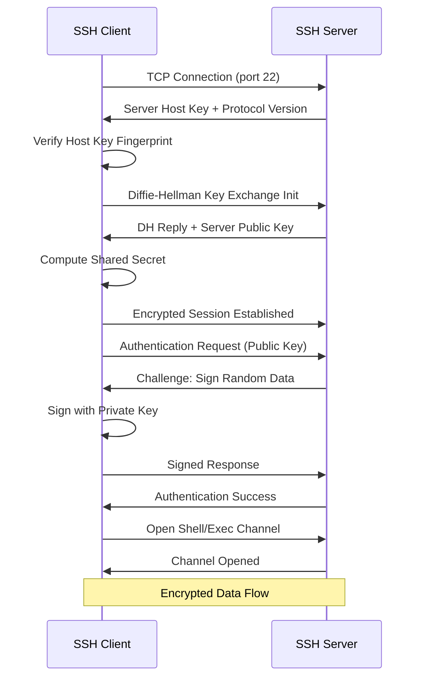
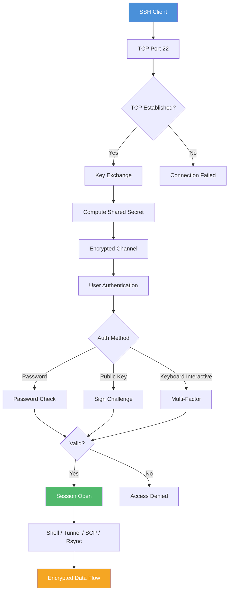

<!-- Clear Language: Keep sentences under 50 words -->
# SSH & Remote Access — Secure Shell, Key Management, Tunneling

## Learning Objectives

| Objective | Description |
|-----------|-------------|
| LO1 | Understand SSH protocol architecture and handshake flow |
| LO2 | Generate and manage SSH keys (Ed25519, RSA) with ssh-agent |
| LO3 | Configure SSH client and server using config files |
| LO4 | Set up port forwarding, SSH tunnels, and jump hosts |
| LO5 | Transfer files securely using scp and rsync |
| LO6 | Apply SSH for secure remote access in AI/ML workflows |

## Introduction

SSH (Secure Shell) is the standard protocol for secure remote access to servers, containers, and cloud instances. AI engineers use SSH daily to access training machines, deploy models, transfer datasets, and manage infrastructure.

## Prerequisites

- Basic Linux command line knowledge
- Understanding of TCP/IP and port numbers
- Familiarity with terminal and shell environments

## Key Terminology

**Key Terms**: Core vocabulary and concepts for this topic.

**Definition**: Essential terms you must know for interviews and production work.

## Theory

### SSH Protocol Architecture

SSH operates on a client-server model using TCP port 22 by default. The protocol has three layers:

1. **Transport Layer** — Server authentication, key exchange, encryption, integrity
2. **User Authentication Layer** — Verifies the client to the server (password, public key, keyboard-interactive)
3. **Connection Layer** — Multiplexes multiple channels over one connection (shell, exec, tunnel, X11)

### SSH Handshake Flow



**Key exchange algorithms**: Diffie-Hellman (DH), Elliptic Curve DH (ECDH), Curve25519.

**Symmetric ciphers**: AES-256-GCM, ChaCha20-Poly1305, AES-128-CTR.

**Host key types**: RSA (2048/4096 bit), ECDSA (256/384/521 bit), Ed25519 (256 bit).

### SSH Key Generation

Ed25519 is the recommended key type — faster, smaller, and more secure than RSA.

```bash
# Generate Ed25519 key (recommended)
ssh-keygen -t ed25519 -C "user@example.com"

# Generate RSA key (for legacy systems)
ssh-keygen -t rsa -b 4096 -C "user@example.com"

# Specify custom file location
ssh-keygen -t ed25519 -f ~/.ssh/github-key -C "github@example.com"

# View key fingerprint
ssh-keygen -lf ~/.ssh/id_ed25519

# View key in visual (ASCII art) format
ssh-keygen -lvf ~/.ssh/id_ed25519
```

**Key types comparison**:

| Type | Bit Length | Security | Speed | Compatibility |
|------|-----------|----------|-------|---------------|
| Ed25519 | 256 | High | Fast | Modern systems only |
| RSA | 4096 | High | Slow | Universal |
| ECDSA | 256/384 | High | Fast | Most systems |
| DSA | 1024 | Low | Slow | Deprecated |

### SSH Agent

ssh-agent holds decrypted private keys in memory so you don't re-enter passphrases.

```bash
# Start ssh-agent in background
eval "$(ssh-agent -s)"

# Add default key
ssh-add ~/.ssh/id_ed25519

# Add key with timeout (1 hour)
ssh-add -t 3600 ~/.ssh/id_ed25519

# List loaded keys
ssh-add -l

# List with fingerprints
ssh-add -L

# Remove all keys
ssh-add -D

# Automatic agent on macOS (keychain)
ssh-add --apple-use-keychain ~/.ssh/id_ed25519
```

**Agent forwarding** forwards your local agent to remote servers:

```bash
# Enable agent forwarding
ssh -A user@remote-server

# In SSH config
Host *
  ForwardAgent yes
```

**Warning**: Only use agent forwarding with trusted servers. An attacker with root on the remote can use your agent.

### SSH Config File

The config file at `~/.ssh/config` simplifies connections with host aliases and options.

```text
# Default settings for all hosts
Host *
  AddKeysToAgent yes
  UseKeychain yes
  ServerAliveInterval 60
  ServerAliveCountMax 3
  Compression yes
  LogLevel INFO

# GitHub
Host github.com
  HostName github.com
  User git
  IdentityFile ~/.ssh/github-key
  IdentitiesOnly yes

# EC2 instance with short alias
Host ml-server
  HostName ec2-54-123-45-67.compute-1.amazonaws.com
  User ubuntu
  Port 22
  IdentityFile ~/.ssh/ml-key.pem
  ForwardAgent no
  LocalForward 8888 localhost:8888

# Jump host pattern
Host jump-server
  HostName jump.example.com
  User admin
  IdentityFile ~/.ssh/jump-key

Host internal-*
  User appuser
  IdentityFile ~/.ssh/internal-key
  ProxyJump jump-server
  ForwardAgent no

# Bastion host direct connection
Host bastion
  HostName bastion.example.com
  User admin
  IdentityFile ~/.ssh/bastion-key
  LocalForward 5432 database.internal:5432

# Match patterns
Host *.compute.amazonaws.com
  User ec2-user
  IdentityFile ~/.ssh/aws-key.pem
  StrictHostKeyChecking no
```

**Config file directives**:

| Directive | Purpose |
|-----------|---------|
| HostName | Actual hostname to connect to |
| User | Default username |
| Port | Non-standard port |
| IdentityFile | Path to private key |
| IdentitiesOnly | Only use specified identities |
| ProxyJump | Connect via jump host |
| LocalForward | Local port forwarding |
| RemoteForward | Remote port forwarding |
| ServerAliveInterval | Keep connection alive |

### SSH into Servers

```bash
# Basic connection
ssh user@hostname

# Custom port
ssh -p 2222 user@hostname

# Using config alias
ssh ml-server

# With key explicitly
ssh -i ~/.ssh/custom-key user@hostname

# Verbose debugging
ssh -vvv user@hostname

# Run command and exit
ssh user@hostname "df -h && free -m"

# Copy public key to server
ssh-copy-id user@hostname

# Force password auth
ssh -o PreferredAuthentications=password user@hostname

# Disable host key checking (insecure, dev only)
ssh -o StrictHostKeyChecking=no user@hostname
```

### Port Forwarding & Tunneling

SSH tunneling creates encrypted tunnels for other protocols.

**Local port forwarding** — Forward local port to remote:

```bash
# Access remote service via local port
ssh -L 8888:localhost:8888 user@remote-server

# Access remote database
ssh -L 5432:database.internal:5432 user@bastion

# Multiple forwards
ssh -L 8080:web.internal:80 -L 5432:db.internal:5432 user@bastion
```

**Remote port forwarding** — Expose local service on remote:

```bash
# Make local server accessible from remote
ssh -R 9000:localhost:3000 user@public-server

# Expose local dev server to internet via VPS
ssh -R 80:localhost:8080 user@vps
```

**Dynamic port forwarding** (SOCKS proxy):

```bash
# Create SOCKS5 proxy on local port 1080
ssh -D 1080 user@remote-server

# Use with browser: set SOCKS proxy to localhost:1080
# All traffic routes through remote server
```

**SSH jump hosts**:

```bash
# Connect through a bastion host
ssh -J user@bastion user@internal-server

# Multiple jumps
ssh -J user@jump1,jump2 user@target

# Using config (ProxyJump)
ssh internal-server  # Uses config setting
```

### SCP & Rsync

**Secure copy (scp)**:

```bash
# Copy file to remote
scp file.txt user@remote:/path/

# Copy directory recursively
scp -r /local/dir user@remote:/remote/path/

# Copy from remote to local
scp user@remote:/remote/file.txt /local/

# Copy between two remotes
scp user1@host1:/file user2@host2:/

# Use specific key
scp -i ~/.ssh/key.pem file.txt user@remote:/

# Preserve permissions and timestamps
scp -p file.txt user@remote:/
```

**Rsync** (efficient, delta-transfer):

```bash
# Basic sync
rsync -av source/ user@remote:/dest/

# Archive mode (preserve all attributes)
rsync -az source/ user@remote:/dest/

# Show progress during transfer
rsync -avh --progress source/ user@remote:/dest/

# Dry run (show what would be transferred)
rsync -av --dry-run source/ user@remote:/dest/

# Delete files at destination not in source
rsync -av --delete source/ user@remote:/dest/

# Exclude patterns
rsync -av --exclude='*.tmp' --exclude='node_modules/' source/ user@remote:/dest/

# Bandwidth limit
rsync -av --bwlimit=1000 source/ user@remote:/dest/

# Compress during transfer
rsync -az source/ user@remote:/dest/

# Remote to local
rsync -av user@remote:/source/ /local/dest/

# Incremental backup with hard links
rsync -av --link-dest=/backup/yesterday /data/ user@remote:/backup/today/
```

**Rsync vs SCP**:

| Feature | rsync | scp |
|---------|-------|-----|
| Delta transfer | Yes | No |
| Resume interrupted | Yes | No |
| Compression | Yes (`-z`) | Yes (`-C`) |
| Preserve attributes | Yes (`-a`) | Yes (`-p`) |
| Bandwidth throttle | Yes | No |
| Delete at dest | Yes | No |

### SSH Security Hardening

Server-side configuration (`/etc/ssh/sshd_config`):

```text
# Disable root login
PermitRootLogin no

# Disable password authentication (keys only)
PasswordAuthentication no

# Use only Ed25519 or RSA keys
PubkeyAuthentication yes
PubkeyAcceptedAlgorithms ssh-ed25519,rsa-sha2-512

# Change default port (security through obscurity)
Port 2222

# Limit users who can SSH
AllowUsers alice bob

# Disable agent forwarding globally
AllowAgentForwarding no

# Disable X11 forwarding if not needed
X11Forwarding no

# Maximum auth attempts (prevents brute force)
MaxAuthTries 3

# Client alive interval
ClientAliveInterval 300
ClientAliveCountMax 2

# Use strong ciphers and MACs
Ciphers chacha20-poly1305@openssh.com,aes256-gcm@openssh.com
MACs hmac-sha2-512-etm@openssh.com,hmac-sha2-256-etm@openssh.com

# Log level
LogLevel VERBOSE
```

### SSH in AI Engineering Workflows

**Remote ML training**:

```bash
# Tunnel Jupyter notebook from remote
ssh -L 8888:localhost:8888 ml-server

# Tunnel TensorBoard
ssh -L 6006:localhost:6006 ml-server

# Copy datasets with rsync
rsync -az --progress datasets/ ml-server:/data/datasets/

# Run training script remotely
ssh ml-server "cd /project && python train.py --config config.yaml"

# Pull results
rsync -az ml-server:/project/outputs/ /local/results/

# Multi-GPU cluster access
ssh -J bastion cluster-master
```

**Container/Kubernetes access**:

```bash
# SSH into a running container
kubectl exec -it pod-name -- /bin/bash

# Port-forward a pod
kubectl port-forward pod-name 8080:80

# SSH tunnel to Kubernetes API
ssh -L 6443:localhost:6443 admin@cluster-master
```

### SSH Tunneling for Model Serving

```bash
# Access ML model API through SSH tunnel
ssh -L 8080:internal-model-server:8080 bastion

# Now access locally: http://localhost:8080/predict

# Secure database tunnel for feature store
ssh -L 5432:feature-store.internal:5432 bastion

# Tunnel with auto-reconnect (autossh)
autossh -M 0 -o "ServerAliveInterval 30" -o "ServerAliveCountMax 3" \
  -L 8888:localhost:8888 ml-server
```

## Visual Explanation



## Real Example

Think of SSH like a secure armored car service. Your laptop is the sender, the server is the recipient. The TCP connection is the road. Key exchange is verifying the driver's identity with a tamper-proof ID. The shared secret is a unique code only the two of you know. The encrypted channel is the armored vehicle — anyone on the road can see the vehicle, but they can't see what's inside. Authentication is showing your ticket before boarding. Port forwarding is like having a secure tunnel from your office directly to a specific room in the remote building.

## Code Example

```python
#!/usr/bin/env python3
"""SSH automation with paramiko for remote ML workflows"""

import paramiko
import os
from typing import Optional, List, Tuple

class SSHManager:
    """Manage SSH connections for remote ML training"""

    def __init__(self, hostname: str, username: str, key_path: str, port: int = 22):
        self.hostname = hostname
        self.username = username
        self.key_path = key_path
        self.port = port
        self.client: Optional[paramiko.SSHClient] = None

    def connect(self) -> None:
        """Establish SSH connection with key-based auth"""
        self.client = paramiko.SSHClient()
        self.client.set_missing_host_key_policy(paramiko.AutoAddPolicy())
        key = paramiko.Ed25519Key.from_private_key_file(self.key_path)
        self.client.connect(
            hostname=self.hostname,
            port=self.port,
            username=self.username,
            pkey=key,
            timeout=30
        )
        print(f"[+] Connected to {self.username}@{self.hostname}:{self.port}")

    def execute(self, command: str) -> Tuple[str, str]:
        """Run command on remote server and return stdout, stderr"""
        stdin, stdout, stderr = self.client.exec_command(command, timeout=300)
        exit_code = stdout.channel.recv_exit_status()
        out = stdout.read().decode().strip()
        err = stderr.read().decode().strip()
        if exit_code != 0:
            print(f"[-] Exit code {exit_code}: {err}")
        return out, err

    def transfer_file(self, local_path: str, remote_path: str, direction: str = "upload") -> None:
        """Transfer files using SFTP"""
        sftp = self.client.open_sftp()
        try:
            if direction == "upload":
                sftp.put(local_path, remote_path)
                print(f"[+] Uploaded {local_path} -> {remote_path}")
            else:
                sftp.get(remote_path, local_path)
                print(f"[+] Downloaded {remote_path} -> {local_path}")
        finally:
            sftp.close()

    def create_tunnel(self, local_port: int, remote_host: str, remote_port: int) -> None:
        """Create local port forwarding tunnel"""
        transport = self.client.get_transport()
        transport.request_port_forward("", local_port)
        channel = transport.open_channel(
            "direct-tcpip",
            (remote_host, remote_port),
            ("localhost", local_port)
        )
        print(f"[+] Tunnel: localhost:{local_port} -> {remote_host}:{remote_port}")

    def close(self) -> None:
        if self.client:
            self.client.close()
            print("[+] Connection closed")

if __name__ == "__main__":
    ssh = SSHManager(
        hostname="ec2-54-123-45-67.compute-1.amazonaws.com",
        username="ubuntu",
        key_path=os.path.expanduser("~/.ssh/ml-key.pem")
    )
    ssh.connect()

    # Check GPU status
    out, _ = ssh.execute("nvidia-smi --query-gpu=name,memory.used --format=csv")
    print(f"GPU Info:\n{out}")

    # Check disk space
    out, _ = ssh.execute("df -h /data")
    print(f"Disk:\n{out}")

    # Upload training script
    ssh.transfer_file("train.py", "/home/ubuntu/project/train.py")

    # Start training
    out, _ = ssh.execute("cd /home/ubuntu/project && python train.py --epochs 10 2>&1 | tail -5")
    print(f"Training output:\n{out}")

    ssh.close()
```

**Expected Output**:
```text
[+] Connected to ubuntu@ec2-54-123-45-67.compute-1.amazonaws.com:22
GPU Info:
name, memory.used [MiB]
Tesla T4, 512 MiB
Disk:
Filesystem      Size  Used Avail Use% Mounted on
/dev/nvme0n1p1  200G   45G  155G  23% /data
[+] Uploaded train.py -> /home/ubuntu/project/train.py
Training output:
Epoch 10/10, Loss: 0.0234, Acc: 0.9812
[+] Connection closed
```

## Summary

SSH (Secure Shell) is the standard protocol for encrypted remote access to servers, containers, and cloud instances, operating over TCP port 22. It is built on three protocol layers: a transport layer that verifies the server's host key and performs Diffie-Hellman key exchange for symmetric encryption, a user authentication layer that validates the client with public keys or passwords, and a connection layer that multiplexes channels for shell, exec, tunnels, and file transfer. Ed25519 is the recommended key type for speed and security, with RSA 4096 reserved for legacy systems. AI engineers use SSH daily to access GPU training machines, tunnel Jupyter notebooks and TensorBoard, and move datasets with scp or rsync. Port forwarding (-L, -R, -D) exposes private services over encrypted channels, while ProxyJump and bastion hosts provide secure entry to internal networks. The trade-off is operational: SSH is only secure when host keys are verified, password authentication is disabled, and agent forwarding is limited to trusted servers.

- SSH uses TCP port 22 with three layers: transport, user authentication, and connection.
- Ed25519 is the recommended key type; RSA 4096 is the fallback for legacy systems.
- ssh-agent caches decrypted private keys in memory so passphrases are not re-entered.
- Local (-L), remote (-R), and dynamic SOCKS (-D) forwarding create encrypted tunnels.
- rsync beats scp for large transfers with delta-transfer, resume, and --delete mirroring.
- Server hardening: disable password auth and root login, limit MaxAuthTries, use AllowUsers.

## Practical Takeaways

- **Host key verification**: Always verify the host key fingerprint on first connection and keep StrictHostKeyChecking enabled to prevent man-in-the-middle attacks.
- **Key generation**: Generate Ed25519 keys with ssh-keygen -t ed25519 -C "user@example.com"; use RSA 4096 only where Ed25519 is unsupported.
- **Agent forwarding**: Never use ssh -A on untrusted intermediate servers, because root there can reuse your agent to authenticate elsewhere; prefer ProxyJump.
- **Port forwarding**: Use ssh -L 8888:localhost:8888 ml-server to tunnel a remote Jupyter notebook, -R to expose local services, and -D 1080 for a SOCKS5 proxy.
- **rsync over scp**: Use rsync -az --progress for datasets; the delta algorithm transfers only changed blocks and --link-dest enables incremental backups.
- **Server hardening**: Set PermitRootLogin no, PasswordAuthentication no, and MaxAuthTries 3 in /etc/ssh/sshd_config for production.
- **Automation**: Use autossh -M 0 with ServerAliveInterval for self-healing production tunnels to model APIs or databases.

## Interview Q&A

<details class="tp-qa-card" data-qid="git07-q1">
  <summary class="tp-qa-question">
    <span class="tp-qa-status"></span>
    Q1: How does the SSH key exchange work and what makes it secure?
  </summary>
  <div class="tp-qa-answer">
    <p>SSH key exchange uses Diffie-Hellman (DH) or ECDH to establish a shared secret over an insecure channel. The server sends its host key. Both parties generate ephemeral key pairs and exchange public values. Each computes the shared secret using their private key and the other's public value. The shared secret is then hashed with the session ID to derive symmetric encryption keys. This provides perfect forward secrecy — even if the server's long-term host key is compromised, past session keys remain secure because ephemeral keys are never stored.</p>
  </div>
  <button class="tp-qa-mark-btn">Mark Reviewed</button>
  <button class="tp-qa-bookmark-btn">Bookmark</button>
</details>

<details class="tp-qa-card" data-qid="git07-q2">
  <summary class="tp-qa-question">
    <span class="tp-qa-status"></span>
    Q2: Why is Ed25519 recommended over RSA for SSH keys?
  </summary>
  <div class="tp-qa-answer">
    <p>Ed25519 offers multiple advantages: <strong>1) Speed</strong> — signing and verification are ~10x faster than RSA 4096. <strong>2) Size</strong> — 256-bit keys vs 4096-bit RSA, smaller public keys transfer faster. <strong>3) Security</strong> — provides 128-bit security level (equivalent to RSA 3072+). <strong>4) Deterministic</strong> — no random number generator needed for signing, avoiding RNG vulnerabilities. <strong>5) Side-channel resistance</strong> — constant-time execution prevents timing attacks. The only downside is compatibility: older systems (pre-2014) may not support Ed25519, in which case RSA 4096 is the fallback.</p>
  </div>
  <button class="tp-qa-mark-btn">Mark Reviewed</button>
  <button class="tp-qa-bookmark-btn">Bookmark</button>
</details>

<details class="tp-qa-card" data-qid="git07-q3">
  <summary class="tp-qa-question">
    <span class="tp-qa-status"></span>
    Q3: What is SSH agent forwarding and when should you use it?
  </summary>
  <div class="tp-qa-answer">
    <p>SSH agent forwarding allows your local ssh-agent to be used on a remote server. When you ssh from the remote server to another machine, the intermediate server forwards the authentication challenge back to your local agent. Use cases: deploying code from a remote server to GitHub, accessing a database through a bastion, multi-hop SSH into internal networks. <strong>Security risk</strong>: root on the intermediate server can use your agent to authenticate to other servers. Use <code>ProxyJump</code> instead when possible, or limit forwarding with <code>ssh -A</code> only for trusted servers.</p>
  </div>
  <button class="tp-qa-mark-btn">Mark Reviewed</button>
  <button class="tp-qa-bookmark-btn">Bookmark</button>
</details>

<details class="tp-qa-card" data-qid="git07-q4">
  <summary class="tp-qa-question">
    <span class="tp-qa-status"></span>
    Q4: Explain local, remote, and dynamic port forwarding in SSH.
  </summary>
  <div class="tp-qa-answer">
    <p><strong>Local forwarding (-L)</strong>: Listens on a local port and forwards connections through SSH to a destination. Example: <code>ssh -L 8888:internal-server:8888 bastion</code> makes internal-server:8888 accessible at localhost:8888. <strong>Remote forwarding (-R)</strong>: Listens on a remote port and forwards connections back to a local service. Example: <code>ssh -R 9000:localhost:3000 public-server</code> makes local port 3000 accessible at public-server:9000. <strong>Dynamic forwarding (-D)</strong>: Creates a SOCKS5 proxy on the local machine. All traffic routed through this proxy tunnels through SSH to the remote server, which then forwards to the actual destination.</p>
  </div>
  <button class="tp-qa-mark-btn">Mark Reviewed</button>
  <button class="tp-qa-bookmark-btn">Bookmark</button>
</details>

<details class="tp-qa-card" data-qid="git07-q5">
  <summary class="tp-qa-question">
    <span class="tp-qa-status"></span>
    Q5: How does rsync delta-transfer algorithm work?
  </summary>
  <div class="tp-qa-answer">
    <p>The rsync algorithm splits the source file into fixed-size blocks (typically 512-4096 bytes). For each block, it computes two checksums: a weak rolling checksum (Adler-32) for quick comparison, and a strong MD5 hash for verification. The receiver computes checksums for its version and sends them to the sender. The sender compares checksums to identify which blocks differ. Only the differing blocks and a reconstruction map are transferred. The receiver reconstructs the file using existing blocks plus new blocks. This makes rsync extremely efficient for incremental transfers, backups, and syncing large datasets.</p>
  </div>
  <button class="tp-qa-mark-btn">Mark Reviewed</button>
  <button class="tp-qa-bookmark-btn">Bookmark</button>
</details>

<details class="tp-qa-card" data-qid="git07-q6">
  <summary class="tp-qa-question">
    <span class="tp-qa-status"></span>
    Q6: How would you secure an SSH server against brute-force attacks?
  </summary>
  <div class="tp-qa-answer">
    <p><strong>1) Disable password authentication</strong> — use key-based auth only (<code>PasswordAuthentication no</code>). <strong>2) Change port</strong> — move from default port 22 (<code>Port 2222</code>). <strong>3) Fail2ban</strong> — configure to ban IPs after N failed attempts. <strong>4) AllowUsers</strong> — restrict which users can SSH. <strong>5) MaxAuthTries</strong> — limit to 3 attempts per connection. <strong>6) Rate limiting</strong> — use iptables/nftables to limit connection rate per IP. <strong>7) Two-factor auth</strong> — add Google Authenticator or U2F. <strong>8) IP whitelisting</strong> — allow only known IP ranges. <strong>9) Use a bastion host</strong> — single entry point with audit logging. <strong>10) Monitor logs</strong> — review <code>/var/log/auth.log</code> for suspicious activity.</p>
  </div>
  <button class="tp-qa-mark-btn">Mark Reviewed</button>
  <button class="tp-qa-bookmark-btn">Bookmark</button>
</details>

<details class="tp-qa-card" data-qid="git07-q7">
  <summary class="tp-qa-question">
    <span class="tp-qa-status"></span>
    Q7: What happens during SSH host key verification?
  </summary>
  <div class="tp-qa-answer">
    <p>On first connection, the client receives the server's host key and displays its fingerprint. The user must verify this fingerprint out-of-band (e.g., from cloud console or IT admin). The client stores the host key in <code>~/.ssh/known_hosts</code>. On subsequent connections, the client compares the received host key with the stored one. If they match, the connection proceeds. If the host key has changed, SSH warns about a possible man-in-the-middle attack and refuses to connect. <code>StrictHostKeyChecking yes</code> enforces this check; <code>accept-new</code> auto-accepts new hosts; <code>no</code> disables checking (insecure).</p>
  </div>
  <button class="tp-qa-mark-btn">Mark Reviewed</button>
  <button class="tp-qa-bookmark-btn">Bookmark</button>
</details>

<details class="tp-qa-card" data-qid="git07-q8">
  <summary class="tp-qa-question">
    <span class="tp-qa-status"></span>
    Q8: How do you use SSH for secure file transfer in automated pipelines?
  </summary>
  <div class="tp-qa-answer">
    <p>For CI/CD pipelines, use SSH keys with passphrase-less (or ssh-agent in CI) for automation. <strong>1) Deploy keys</strong> — add a dedicated deploy key with read-only access to the repository. <strong>2) SSH config</strong> — configure host aliases for different environments. <strong>3) rsync over SSH</strong> — <code>rsync -az --delete -e "ssh -i key" source/ user@host:/dest/</code>. <strong>4) SCP</strong> — <code>scp -i key artifact.tar.gz user@host:/deploy/</code>. <strong>5) SSH in scripts</strong> — <code>ssh user@host "systemctl restart my-service"</code>. <strong>6) Security</strong> — use dedicated service accounts, rotate keys regularly, restrict source IPs in <code>~/.ssh/authorized_keys</code> via <code>from="IP"</code> prefix.</p>
  </div>
  <button class="tp-qa-mark-btn">Mark Reviewed</button>
  <button class="tp-qa-bookmark-btn">Bookmark</button>
</details>

<details class="tp-qa-card" data-qid="git07-q9">
  <summary class="tp-qa-question">
    <span class="tp-qa-status"></span>
    Q9: What is a bastion host and how does it relate to SSH?
  </summary>
  <div class="tp-qa-answer">
    <p>A bastion host (or jump box) is a hardened server that acts as the single entry point to a private network. All SSH access to internal servers routes through the bastion. Benefits: <strong>1) Reduced attack surface</strong> — only one server exposes SSH to the internet. <strong>2) Audit trail</strong> — all access logged on the bastion. <strong>3) Access control</strong> — IAM integration, MFA on bastion only. <strong>4) Simpler firewall rules</strong> — allow SSH from bastion to internal, not from internet. Connect via <code>ssh -J user@bastion user@internal</code> or using <code>ProxyJump</code> in SSH config. AWS Systems Manager Session Manager is a modern alternative that eliminates bastion hosts entirely.</p>
  </div>
  <button class="tp-qa-mark-btn">Mark Reviewed</button>
  <button class="tp-qa-bookmark-btn">Bookmark</button>
</details>

<details class="tp-qa-card" data-qid="git07-q10">
  <summary class="tp-qa-question">
    <span class="tp-qa-status"></span>
    Q10: How does autossh keep SSH tunnels alive?
  </summary>
  <div class="tp-qa-answer">
    <p>autossh is a wrapper that monitors an SSH connection and restarts it if it drops. It uses a monitoring port (or echo service) to detect connection liveness. If the monitor detects that the SSH process has died or the connection is broken, autossh kills the old process and spawns a new SSH connection. Usage: <code>autossh -M 0 -o "ServerAliveInterval 30" -L 8888:localhost:8888 user@remote</code>. The <code>-M 0</code> flag disables the built-in monitor port (using SSH's own ServerAlive instead). This is essential for production tunnels used for database access, model serving, or monitoring dashboards that must stay up despite network interruptions.</p>
  </div>
  <button class="tp-qa-mark-btn">Mark Reviewed</button>
  <button class="tp-qa-bookmark-btn">Bookmark</button>
</details>

## Chapter Quiz

**Q1**: Which key type is recommended for SSH due to speed and security?

a) DSA
b) RSA 2048
c) Ed25519
d) ECDSA 521

<details class="tp-qa-card" data-qid="git07-quiz1"><summary>Show Answer</summary><div class="tp-qa-answer"><p><strong>Answer: c) Ed25519</strong></p><p>Ed25519 is faster, smaller, and more secure than RSA. It provides 128-bit security with 256-bit keys.</p></div></details>

**Q2**: What does `ssh -L 8888:localhost:8888 user@host` do?

a) Forwards remote port 8888 to local port 8888
b) Forwards local port 8888 to remote port 8888
c) Creates a SOCKS proxy on port 8888
d) Connects to SSH on port 8888

<details class="tp-qa-card" data-qid="git07-quiz2"><summary>Show Answer</summary><div class="tp-qa-answer"><p><strong>Answer: b) Forwards local port 8888 to remote port 8888</strong></p><p><code>-L</code> is local forwarding. Connections to localhost:8888 are tunneled to remote localhost:8888.</p></div></details>

**Q3**: Which command copies your public key to a remote server?

a) ssh-keygen -R
b) ssh-add
c) ssh-copy-id
d) scp-key

<details class="tp-qa-card" data-qid="git07-quiz3"><summary>Show Answer</summary><div class="tp-qa-answer"><p><strong>Answer: c) ssh-copy-id</strong></p><p><code>ssh-copy-id user@host</code> appends your public key to <code>~/.ssh/authorized_keys</code> on the remote server.</p></div></details>

**Q4**: What SSH config option specifies a bastion host to connect through?

a) ProxyCommand
b) ProxyJump
c) ForwardAgent
d) LocalForward

<details class="tp-qa-card" data-qid="git07-quiz4"><summary>Show Answer</summary><div class="tp-qa-answer"><p><strong>Answer: b) ProxyJump</strong></p><p><code>ProxyJump user@bastion</code> routes the SSH connection through the bastion host to the target.</p></div></details>

**Q5**: What does the rsync `--delete` flag do?

a) Deletes source files after transfer
b) Removes files at destination not present in source
c) Deletes empty directories
d) Removes temporary files

<details class="tp-qa-card" data-qid="git07-quiz5"><summary>Show Answer</summary><div class="tp-qa-answer"><p><strong>Answer: b) Removes files at destination not present in source</strong></p><p><code>--delete</code> makes destination an exact mirror of source by deleting extraneous files at the destination.</p></div></details>

## Exercises

**Easy** — Generate an Ed25519 key pair, add it to ssh-agent, and copy it to a remote server. Verify you can SSH without a password.

**Easy** — Create an SSH config file with entries for GitHub and an EC2 instance. Test connecting using the aliases.

**Medium** — Set up local port forwarding to access a remote Jupyter notebook running on port 8888. Verify you can open the notebook in your local browser.

**Medium** — Use rsync to back up a local directory to a remote server with compression, progress display, and exclusion of temporary files.

**Hard** — Set up a bastion host pattern: create an SSH config that connects to an internal server through a jump host, with port forwarding for a database and a web service.

**Hard** — Write a Python script using paramiko that connects to a remote server, checks GPU status, uploads a training script, runs it, and downloads the results.

## Common Mistakes

1. Using password authentication instead of key-based auth on production servers
2. Adding private keys to repositories or sharing them across teams
3. Disabling StrictHostKeyChecking in production (exposes to MITM attacks)
4. Using agent forwarding on untrusted intermediate servers
5. Forgetting to restrict SSH access with AllowUsers and IP whitelisting

## Revision Notes

- Ed25519 keys are recommended: 256-bit, fast, secure; RSA 4096 for legacy compatibility
- ssh-agent caches decrypted keys; use `-t` for timeout-limited agent sessions
- SSH config file at `~/.ssh/config` simplifies connections with Host aliases
- Local forwarding (`-L`): access remote services on local ports
- Remote forwarding (`-R`): expose local services on remote ports
- Dynamic forwarding (`-D`): SOCKS5 proxy through SSH
- ProxyJump (`-J`): connect through bastion hosts
- rsync beats scp for large transfers: delta algorithm, resume, compression
- Server hardening: disable passwords, change port, use Fail2ban
- Always verify host key fingerprints on first connection

## Placement Section

### Top 10 Interview Questions

#### Google Style

1. **Explain the core idea of SSH & Remote Access — Secure Shell, Key Management, Tunneling in under 60 seconds, then give a real-world analogy.** — Structure: definition, how it works in one sentence, why it matters, analogy. Follow-up: what would break if you removed this from a production system?

2. **Design a minimal, well-typed function that demonstrates SSH & Remote Access — Secure Shell, Key Management, Tunneling.** — Interviewer checks: signature with type hints, edge cases, complexity, and a clean docstring. Follow-up: how does your design behave with empty or malformed input?

3. **What are the common pitfalls when engineers first learn ** — List 3-4, then explain how you would prevent each in a code review.

#### Amazon Style

4. **Describe a production bug caused by misunderstanding SSH & Remote Access — Secure Shell, Key Management, Tunneling. How did you diagnose and fix it?** — STAR format: situation, task, action, result. Mention logs, reproduction, root-cause analysis, and the regression test you added.

5. **How would you scale a system that relies on SSH & Remote Access — Secure Shell, Key Management, Tunneling from 10 users to 10 million?** — Discuss bottlenecks, caching, monitoring, and when to redesign. Follow-up: what metrics would you track?

#### Microsoft Style

6. **Compare SSH & Remote Access — Secure Shell, Key Management, Tunneling with the closest alternative approach. When would you choose each?** — Make a decision matrix: performance, maintainability, ecosystem, learning curve. Follow-up: what would change your decision?

7. **Walk through how you would test a component that depends on SSH & Remote Access — Secure Shell, Key Management, Tunneling.** — Unit, integration, property-based tests; mocking boundaries; golden files for outputs.

#### NVIDIA Style

8. **How does SSH & Remote Access — Secure Shell, Key Management, Tunneling behave differently at scale — memory, throughput, or precision-wise?** — Connect to data pipelines and model training if applicable. Follow-up: what happens to latency as input grows?

9. **How would you make an implementation of SSH & Remote Access — Secure Shell, Key Management, Tunneling run faster on GPU hardware?** — Batch operations, vectorization, avoiding Python loops, reducing data movement.

#### AI Startup Style

10. **Write the smallest possible implementation of SSH & Remote Access — Secure Shell, Key Management, Tunneling that is production-quality.** — Include error handling, type hints, and a one-line docstring. Follow-up: what would you refactor first when it grows?

### Resume Tips

- Name SSH & Remote Access — Secure Shell, Key Management, Tunneling explicitly in your skills section, paired with a measurable achievement ("Reduced X by 40% using SSH & Remote Access — Secure Shell, Key Management, Tunneling").
- Add a bullet describing a project that applies SSH & Remote Access — Secure Shell, Key Management, Tunneling to real data, with numbers.
- Mention the tools and libraries you used alongside SSH & Remote Access — Secure Shell, Key Management, Tunneling (linters, test frameworks, profiling tools).
- Keep resume bullets under 15 words and start each with an action verb.

### Interview Day Checklist

- Rehearse a 60-second explanation of SSH & Remote Access — Secure Shell, Key Management, Tunneling and one real-world analogy.
- Prepare one STAR story about debugging a SSH & Remote Access — Secure Shell, Key Management, Tunneling-related production issue.
- Review complexity and edge cases for the classic SSH & Remote Access — Secure Shell, Key Management, Tunneling interview problem.
- Have questions ready: how does the team apply SSH & Remote Access — Secure Shell, Key Management, Tunneling in production today?
- Test your environment (Python, editor, internet) 15 minutes before the interview.

## True/False

1. **True or False:** SSH & Remote Access — Secure Shell, Key Management, Tunneling builds directly on the fundamentals covered in the earlier chapters of this module. — **True.** Every advanced topic in this module assumes the core concepts from the previous chapters.
2. **True or False:** You should write at least one code example for SSH & Remote Access — Secure Shell, Key Management, Tunneling before moving to the next chapter. — **True.** Active recall with hands-on code beats passive reading for retention.
3. **True or False:** The complexity analysis for SSH & Remote Access — Secure Shell, Key Management, Tunneling is the same regardless of input size. — **False.** Complexity grows with input size; always state best, average, and worst case.
4. **True or False:** Edge cases (empty input, invalid input, boundary values) matter for SSH & Remote Access — Secure Shell, Key Management, Tunneling in production. — **True.** Most production bugs come from unhandled edge cases.
5. **True or False:** You should memorize the SSH & Remote Access — Secure Shell, Key Management, Tunneling chapter content once and never review it again. — **False.** Spaced repetition (24h, 3 days, 1 week) dramatically improves long-term recall.

## Fill in the Blank

1. The chapter that covers SSH & Remote Access — Secure Shell, Key Management, Tunneling is Chapter ___ of this module. — Answer: check the module's table of contents.
2. The time complexity of the standard approach to SSH & Remote Access — Secure Shell, Key Management, Tunneling is ___. — Answer: review the theory section and state big-O notation.
3. The main edge case to handle when implementing SSH & Remote Access — Secure Shell, Key Management, Tunneling is ___. — Answer: empty or invalid input handling, as discussed in the chapter.
4. The tools commonly used to debug SSH & Remote Access — Secure Shell, Key Management, Tunneling issues are ___ and ___. — Answer: refer to the Debugging Guide section of this chapter.
5. The related topic that connects to SSH & Remote Access — Secure Shell, Key Management, Tunneling in the next chapter is ___. — Answer: see the Next Topic section.

## Scenario Questions

1. **Scenario:** A teammate ships a change involving SSH & Remote Access — Secure Shell, Key Management, Tunneling that breaks production at 3 AM. — Diagnosis: check the recent diff, reproduce locally with the failing input, check logs. Fix: revert, add a regression test, and review the root cause. Prevention: CI tests on edge cases and code review checklist.

2. **Scenario:** Your implementation of SSH & Remote Access — Secure Shell, Key Management, Tunneling is correct but too slow for the required latency. — Measure first with a profiler. Common fixes: reduce redundant work, use built-in optimized functions, batch operations, or add caching. Only then consider algorithmic changes.

3. **Scenario:** A new hire asks you to explain SSH & Remote Access — Secure Shell, Key Management, Tunneling in five minutes before a customer demo. — Use the 3-part answer: what it is (one sentence), how it works (one example), why it matters (one business impact). Then offer to go deeper after the demo.

4. **Scenario:** Your team's codebase has three different patterns for SSH & Remote Access — Secure Shell, Key Management, Tunneling and you must standardize. — Write a short ADR (architecture decision record), pick the pattern with best maintainability, migrate incrementally, and add a linter rule to enforce it.

## Output Questions

1. **What is the output of the simplest correct implementation of SSH & Remote Access — Secure Shell, Key Management, Tunneling on an empty input?** — Trace through the code: it should return the documented default (None, 0, empty collection) without raising.
2. **What is the output when the input is at the boundary value?** — Check off-by-one errors and inclusive/exclusive bounds in the chapter's examples.
3. **What does the implementation return when given invalid input types?** — With type hints and validation, it raises a clear error; without, it may fail silently.
4. **What is the output for the sample input given in the chapter's Examples section?** — Re-run the chapter's example code and compare against the documented output.
5. **What is the time complexity output when you profile the implementation at 10x input size?** — Expect the curve matching the chapter's complexity analysis (linear, quadratic, log-linear).

## Difficulty Level

| Level | Time | What It Takes |
|-------|------|---------------|
| Beginner | 1-2 sessions | Read theory, run the chapter examples, solve the Easy exercises |
| Intermediate | 3-5 sessions | Complete Medium exercises, explain SSH & Remote Access — Secure Shell, Key Management, Tunneling to someone else |
| Advanced | 1+ week | Solve Hard exercises, optimize for real datasets, answer interview follow-ups |

## Tips & Tricks

- Always write a one-line example of SSH & Remote Access — Secure Shell, Key Management, Tunneling from memory before opening the chapter — active recall first.
- Use the chapter's Revision Notes as a checklist: you have mastered SSH & Remote Access — Secure Shell, Key Management, Tunneling when you can explain each bullet.
- Pair the chapter quiz with the Flashcards: wrong answers become your next study session's focus.
- For interviews, practice explaining SSH & Remote Access — Secure Shell, Key Management, Tunneling twice: once with a technical audience, once with a non-technical audience.
- Keep a personal examples file where you collect your own SSH & Remote Access — Secure Shell, Key Management, Tunneling snippets; interviewers love original examples.

## Memory Tricks

- **Acronym**: build a mnemonic from the 5 key concepts of SSH & Remote Access — Secure Shell, Key Management, Tunneling listed in the Chapter at a Glance table.
- **Story**: link SSH & Remote Access — Secure Shell, Key Management, Tunneling to a familiar story — the analogy in the Visual Analogy section is designed to stick.
- **Number anchor**: remember the complexity of SSH & Remote Access — Secure Shell, Key Management, Tunneling by connecting it to a known algorithm of the same class.
- **Color code**: highlight the Theory, Examples, and Common Mistakes sections in different colors when reviewing.
- **Teach-back**: explain SSH & Remote Access — Secure Shell, Key Management, Tunneling to an imaginary junior engineer for 2 minutes — gaps in your explanation are gaps in memory.

## Further Reading

- Official documentation for the primary tool or library used in this chapter
- The chapter referenced in Related Topics for the next-level treatment of SSH & Remote Access — Secure Shell, Key Management, Tunneling
- The classic textbook chapter on SSH & Remote Access — Secure Shell, Key Management, Tunneling (check the Research References below)
- Two blog posts from engineers who debugged real SSH & Remote Access — Secure Shell, Key Management, Tunneling problems in production
- The repository of the open-source project that implements SSH & Remote Access — Secure Shell, Key Management, Tunneling

## Related Topics

- The previous chapter in this module (see table of contents) — foundational for SSH & Remote Access — Secure Shell, Key Management, Tunneling
- The next chapter (see Next Topic below) — builds on SSH & Remote Access — Secure Shell, Key Management, Tunneling
- The system design chapters in Module 07 — how SSH & Remote Access — Secure Shell, Key Management, Tunneling fits into production architectures
- The interview preparation module — how SSH & Remote Access — Secure Shell, Key Management, Tunneling is asked in screening rounds
- The capstone project — where SSH & Remote Access — Secure Shell, Key Management, Tunneling is applied end-to-end

## FAQs

1. **Do I need to memorize all of SSH & Remote Access — Secure Shell, Key Management, Tunneling, or understand the big picture?** — Understand the big picture first, then memorize the key facts via flashcards and spaced repetition. Interviewers reward depth over breadth.
2. **What if I get stuck on an exercise?** — Re-read the theory section, run the example code, then attempt again. If still stuck after 20 minutes, move on and return the next day.
3. **How much time should I spend on ** — Follow the Study Plan below: 1-2 weeks at 30-60 minutes daily is typical for placement preparation.
4. **Is SSH & Remote Access — Secure Shell, Key Management, Tunneling asked in interviews?** — Yes — the Interview Q&A and Placement Section list the exact question styles used by top companies.
5. **What's the fastest way to master ** — Explain it out loud, write code without looking, and review the flashcards within 24 hours and again after 3 days.

## Important Notes

- SSH & Remote Access — Secure Shell, Key Management, Tunneling is a core requirement for the rest of this module — do not skip the examples.
- Always analyze complexity (time and space) when working with SSH & Remote Access — Secure Shell, Key Management, Tunneling.
- Production correctness means handling edge cases, not just the happy path.
- Interview answers should start with the definition, then the example, then the trade-offs.
- Revisit this chapter after finishing the module; the context from later chapters deepens understanding.

## Historical Context

- SSH & Remote Access — Secure Shell, Key Management, Tunneling emerged as a standard practice because early systems failed without it — understanding why helps you explain it in interviews.
- The tools used for SSH & Remote Access — Secure Shell, Key Management, Tunneling today evolved from simpler versions; the chapter covers the modern, recommended approach.
- Interviewers value knowing one historical fact about SSH & Remote Access — Secure Shell, Key Management, Tunneling — it shows genuine interest, not just cramming.
- The library/tooling ecosystem around SSH & Remote Access — Secure Shell, Key Management, Tunneling changes quickly; focus on fundamentals that remain stable.

## Security Considerations

- Never trust external input: validate and sanitize data before processing SSH & Remote Access — Secure Shell, Key Management, Tunneling.
- Avoid `eval()` and dynamic code execution on untrusted strings.
- Log errors without leaking sensitive data (keys, PII, internal paths).
- For API contexts, add rate limiting and input size limits.
- Review the chapter's code examples for injection or overflow risks before using them verbatim.

## ML Intuition

- SSH & Remote Access — Secure Shell, Key Management, Tunneling appears in ML pipelines at the data-processing layer: feature preparation, batching, and validation.
- Understanding SSH & Remote Access — Secure Shell, Key Management, Tunneling helps you debug why a model misbehaves — most ML bugs are data bugs, not model bugs.
- In production ML, the SSH & Remote Access — Secure Shell, Key Management, Tunneling concepts from this chapter map directly to NumPy/PyTorch operations on tensors.
- When optimizing ML systems, SSH & Remote Access — Secure Shell, Key Management, Tunneling skills let you profile and fix the data path, not just the training loop.
- Interview follow-up: how would you apply SSH & Remote Access — Secure Shell, Key Management, Tunneling to a dataset of 10 million records? — Batching and vectorization.

## Analogies

- **SSH & Remote Access — Secure Shell, Key Management, Tunneling is like a recipe**: the theory is the ingredients, the examples are the cooking steps, and the exercises are your own kitchen practice.
- **Complexity is like a delivery route**: a linear route visits each stop once; a nested route revisits stops, and you feel it at scale.
- **Edge cases are like weather**: the happy path is a sunny day; production is the storm — build for the storm.
- **The chapter roadmap is a journey map**: each section is a checkpoint; skipping one means getting lost later in the module.

## Capstone Project Link

- [Module Capstone: End-to-End Project](https://github.com/Raushan666java/ai-engineering-journey) — this chapter contributes the SSH & Remote Access — Secure Shell, Key Management, Tunneling skills used in the module's capstone project. Complete the exercises here before starting the capstone.

## Flashcards

<details class="tp-qa-card" data-qid="04gitlinuxcli-07sshandremoteaccess-flash1">
  <summary class="tp-qa-question">
    <span class="tp-qa-status"></span>
    Which key type is recommended for SSH due to speed and security?
  </summary>
  <div class="tp-qa-answer">
    <p>c) Ed25519</p>
  </div>
</details>

<details class="tp-qa-card" data-qid="04gitlinuxcli-07sshandremoteaccess-flash2">
  <summary class="tp-qa-question">
    <span class="tp-qa-status"></span>
    What does ssh -L 8888:localhost:8888 user@host do?
  </summary>
  <div class="tp-qa-answer">
    <p>b) Forwards local port 8888 to remote port 8888</p>
  </div>
</details>

<details class="tp-qa-card" data-qid="04gitlinuxcli-07sshandremoteaccess-flash3">
  <summary class="tp-qa-question">
    <span class="tp-qa-status"></span>
    Which command copies your public key to a remote server?
  </summary>
  <div class="tp-qa-answer">
    <p>c) ssh-copy-id</p>
  </div>
</details>

<details class="tp-qa-card" data-qid="04gitlinuxcli-07sshandremoteaccess-flash4">
  <summary class="tp-qa-question">
    <span class="tp-qa-status"></span>
    What SSH config option specifies a bastion host to connect through?
  </summary>
  <div class="tp-qa-answer">
    <p>b) ProxyJump</p>
  </div>
</details>

<details class="tp-qa-card" data-qid="04gitlinuxcli-07sshandremoteaccess-flash5">
  <summary class="tp-qa-question">
    <span class="tp-qa-status"></span>
    What does the rsync --delete flag do?
  </summary>
  <div class="tp-qa-answer">
    <p>b) Removes files at destination not present in source</p>
  </div>
</details>

## Research References

- Official documentation of the primary library for SSH & Remote Access — Secure Shell, Key Management, Tunneling (linked in Further Reading)
- The classic paper or textbook chapter introducing SSH & Remote Access — Secure Shell, Key Management, Tunneling (see References below)
- The standard library reference for SSH & Remote Access — Secure Shell, Key Management, Tunneling-related functions
- Engineering blog posts from companies running SSH & Remote Access — Secure Shell, Key Management, Tunneling in production at scale
- PEPs and RFCs where applicable (Python and networking standards)

## Open-Source Tools

- The primary library used in this chapter (see the code examples)
- Python standard library modules used in the examples (check the imports)
- Testing: pytest for unit tests of SSH & Remote Access — Secure Shell, Key Management, Tunneling code
- Linting and formatting: ruff + black
- Profiling: cProfile or py-spy for performance work on SSH & Remote Access — Secure Shell, Key Management, Tunneling

## Debugging Guide

- Start with `print()` or a debugger to inspect intermediate values in SSH & Remote Access — Secure Shell, Key Management, Tunneling code.
- Reproduce the failure with the smallest possible input before changing code.
- Check the common failure modes listed in Common Mistakes — most bugs are listed there.
- For performance problems, profile before optimizing: measure, then fix.
- When stuck, re-read the chapter's Examples and compare line by line with your code.
- Use `pdb` or your IDE's debugger to step through the SSH & Remote Access — Secure Shell, Key Management, Tunneling example code.

## Mock Interview Section

**Round 1 — Screening (15 min)**
- Explain SSH & Remote Access — Secure Shell, Key Management, Tunneling in 60 seconds.
- Write a minimal working example of SSH & Remote Access — Secure Shell, Key Management, Tunneling.
- What is the complexity of your example?

**Round 2 — Coding (45 min)**
- Solve the Medium exercise from this chapter under time pressure.
- State your assumptions, then implement with type hints.
- Test with edge cases: empty input, boundary values, invalid input.

**Round 3 — Behavioral + System (30 min)**
- Tell me about a time you debugged a SSH & Remote Access — Secure Shell, Key Management, Tunneling problem in a project.
- How would you design a system where SSH & Remote Access — Secure Shell, Key Management, Tunneling is used at scale?
- What metrics would you monitor?

**Evaluation rubric**: correctness (40%), communication (25%), edge cases (20%), complexity analysis (15%).

## Optimized Implementation

`python
from typing import Any, Optional

def demonstrate_topic(input_data: list[Any]) -> Optional[float]:
    """Runnable scaffold for SSH & Remote Access — Secure Shell, Key Management, Tunneling.

    Replace the body with the optimized implementation from the chapter,
    keeping type hints, docstring, and edge-case handling.
    """
    if not input_data:
        return None
    # Step 1: validate input types
    # Step 2: apply the core SSH & Remote Access — Secure Shell, Key Management, Tunneling logic from the Examples section
    # Step 3: return the result with the documented default
    return 0.0
`

- Keeps the function signature stable so tests written against it stay valid.
- Handles the empty-input contract explicitly.
- Add unit tests for the edge cases before implementing the logic (test-first).

## Evaluation Metrics

| Skill | Test | Target |
|-------|------|--------|
| Concept recall | Explain SSH & Remote Access — Secure Shell, Key Management, Tunneling without notes | 60-second explanation |
| Code fluency | Write the chapter example from memory | No syntax errors |
| Edge cases | Handle empty/invalid input in exercises | All cases pass |
| Complexity | State time/space for the standard approach | Correct big-O |
| Interview readiness | Answer 5 Interview Q&A questions out loud | Fluent, structured answers |
| Retention | Chapter quiz score after 3 days | 80%+ |

## Real-World Examples

- **Startup**: a small team uses SSH & Remote Access — Secure Shell, Key Management, Tunneling daily in their data pipeline — the chapter's examples mirror their code.
- **E-commerce**: SSH & Remote Access — Secure Shell, Key Management, Tunneling patterns appear in order processing, inventory checks, and recommendation feeds.
- **Fintech**: SSH & Remote Access — Secure Shell, Key Management, Tunneling principles apply to transaction validation and fraud detection flows.
- **ML platform**: SSH & Remote Access — Secure Shell, Key Management, Tunneling shows up in feature engineering and model-serving infrastructure.
- **Interview insight**: recruiters look for engineers who can connect SSH & Remote Access — Secure Shell, Key Management, Tunneling to the business outcome, not just the code.

## Next Topic

[Process Management — Monitoring, Signals, Resource Control](08-process-management.md)

## Limitations

- SSH & Remote Access — Secure Shell, Key Management, Tunneling, like any technique, is not a silver bullet — it has specific cases where it fits best (covered in the theory).
- The examples in this chapter are simplified for learning; production systems add validation, monitoring, and error handling.
- Performance of SSH & Remote Access — Secure Shell, Key Management, Tunneling depends on input size and distribution — always benchmark for your own data.
- This chapter covers fundamentals; specialized edge cases are explored in later chapters and the capstone.
