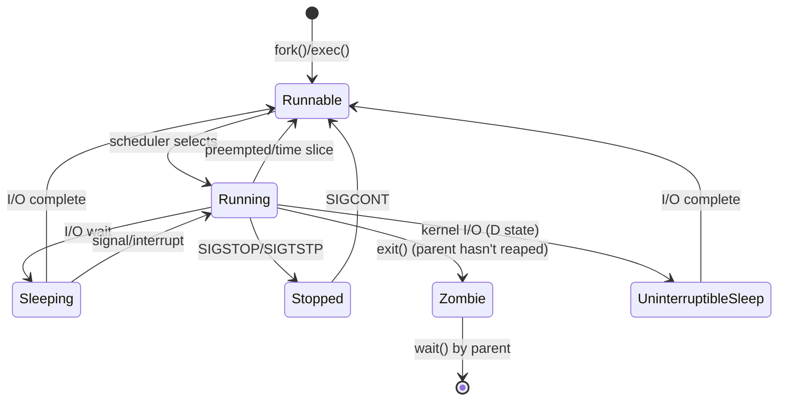
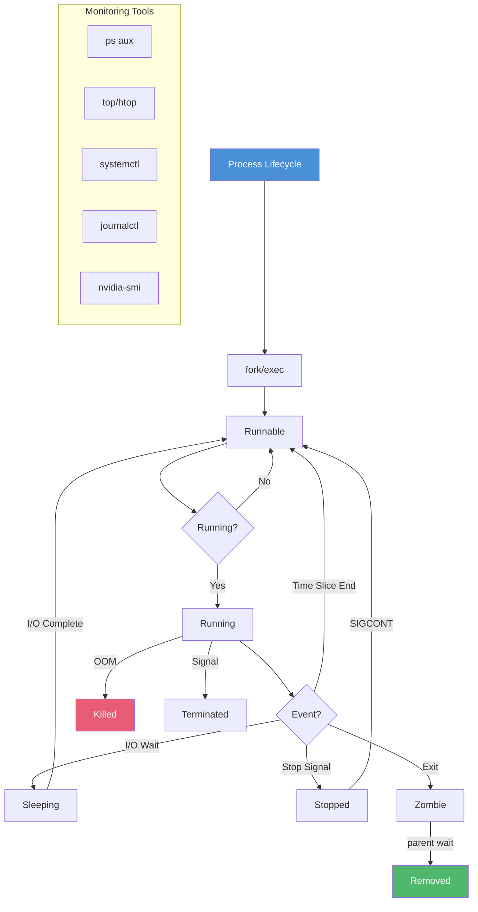

<!-- Clear Language: Keep sentences under 50 words -->
# Process Management — Monitoring, Signals, Resource Control

## Learning Objectives

| Objective | Description |
|-----------|-------------|
| LO1 | Monitor system processes using ps, top, htop, and process trees |
| LO2 | Manage processes with kill signals, priority control (nice/renice) |
| LO3 | Understand Linux process states and the process lifecycle |
| LO4 | Configure services with systemd (units, journalctl, systemctl) |
| LO5 | Apply cgroups for resource limits and control groups management |
| LO6 | Implement process monitoring for AI/ML training workloads |

## Introduction

Process management is essential for AI engineers who run resource-intensive training jobs, manage model serving, and monitor system health. Understanding processes, signals, and resource control helps you debug performance issues and keep systems stable.

## Prerequisites

- Basic Linux command line skills
- Understanding of CPU, memory, and I/O concepts
- Familiarity with shell scripting basics

## Key Terminology

**Key Terms**: Core vocabulary and concepts for this topic.

**Definition**: Essential terms you must know for interviews and production work.

## Theory

### Process States in Linux



**Process states**:

| Code | State | Description |
|------|-------|-------------|
| R | Runnable | Running or ready to run |
| S | Sleeping | Waiting for an event/interruptible |
| D | Uninterruptible Sleep | Kernel I/O wait (cannot be killed) |
| T | Stopped | Suspended by signal |
| Z | Zombie | Terminated, awaiting parent reaping |
| X | Dead | Process cleaned up |

### Process Monitoring with ps

```bash
# List all processes
ps aux

# Custom format
ps -eo pid,ppid,cmd,%cpu,%mem,stat,user

# Tree view
ps auxf
ps -ejH

# Process by name
ps aux | grep python

# Specific PID info
ps -fp 1234

# Threads of a process
ps -eLf | grep 1234

# Sort by memory usage
ps aux --sort=-%mem | head -10

# Sort by CPU usage
ps aux --sort=-%cpu | head -10

# Show process environment
ps -eww 1234

# Security context
ps -eo pid,user,label,cmd
```

**ps output fields**:

| Field | Meaning |
|-------|---------|
| PID | Process ID |
| PPID | Parent Process ID |
| %CPU | CPU utilization |
| %MEM | Memory utilization |
| VSZ | Virtual memory size (KB) |
| RSS | Resident set size (KB) |
| STAT | Process state code |
| START | Start time |
| TIME | Cumulative CPU time |
| CMD | Command with arguments |

### Interactive Monitoring with top and htop

```bash
# Basic top
top

# Batch mode (for scripts)
top -b -n 1

# Sort by memory
top -o %MEM

# Show only specific user processes
top -u ubuntu

# Monitor specific PIDs
top -p 1234,5678

# Update interval (seconds)
top -d 2

# Install htop
sudo apt install htop

# Interactive htop (better than top)
htop

# Tree view in htop
htop -t

# Filter by process name
htop -p 1234

# Show process tree (F5 in htop)
```

**htop interactive commands**:

| Key | Action |
|-----|--------|
| F3 | Search process |
| F4 | Filter by name |
| F5 | Tree view |
| F6 | Sort by column |
| F9 | Kill process |
| F10 | Quit |
| u | Show user processes |
| t | Toggle tree view |
| H | Toggle threads |
| K | Toggle kernel threads |

### Process Priority and Nice Values

```bash
# Start process with low priority
nice -n 19 ./training-script.sh

# Start with high priority (requires root)
nice -n -20 ./critical-service.sh

# Check priority of running processes
ps -eo pid,nice,cmd

# Change priority of running process
renice -n 10 -p 1234

# Change priority by process name
renice -n 5 -g python

# Show priority ranges
# -20 (highest priority) to 19 (lowest priority)
# Default: 0

# Real-time priority (RT, for time-critical)
chrt -r 99 ./realtime-task.sh

# Check scheduling policy
chrt -p 1234

# Set scheduling policy
chrt -f -p 50 1234
```

**Scheduling policies**:

| Policy | Flag | Use Case |
|--------|------|----------|
| SCHED_OTHER | NORMAL | Default time-sharing |
| SCHED_BATCH | BATCH | CPU-intensive batch jobs |
| SCHED_IDLE | IDLE | Very low priority |
| SCHED_FIFO | FIFO | Real-time, no time slicing |
| SCHED_RR | RR | Real-time, round-robin |

### Process Signals

```bash
# List all signals
kill -l

# Common signals:
# SIGTERM (15) - Graceful termination (default)
# SIGKILL (9) - Force kill (cannot be caught)
# SIGSTOP (19) - Pause process (cannot be caught)
# SIGCONT (18) - Resume process
# SIGHUP (1) - Hang up / reload config
# SIGINT (2) - Interrupt (Ctrl+C)
# SIGQUIT (3) - Quit with core dump
# SIGUSR1 (10) - User-defined signal 1
# SIGUSR2 (12) - User-defined signal 2

# Send signals by PID
kill 1234                # SIGTERM
kill -9 1234             # SIGKILL
kill -15 1234            # SIGTERM (explicit)
kill -SIGSTOP 1234       # STOP
kill -SIGCONT 1234       # CONT

# Kill by process name
pkill python
pkill -f "train.py"

# Kill all processes of a user
pkill -u ubuntu

# Kill specific signal by name
pkill -HUP nginx

# Kill processes matching pattern
killall python3
killall -9 training

# Check if process exists
kill -0 1234  # Returns 0 if alive, error if not
```

### Systemd Service Management

```bash
# Systemd service lifecycle
systemctl start service-name
systemctl stop service-name
systemctl restart service-name
systemctl reload service-name
systemctl enable service-name
systemctl disable service-name
systemctl status service-name
systemctl is-active service-name
systemctl is-enabled service-name

# Service unit file location
# /etc/systemd/system/service-name.service
# /lib/systemd/system/service-name.service

# List all services
systemctl list-units --type=service

# List failed services
systemctl --failed

# View service dependencies
systemctl list-dependencies service-name

# Mask/unmask (prevent starting)
systemctl mask service-name
systemctl unmask service-name
```

**Systemd unit file example**:

```text
# /etc/systemd/system/ml-training.service
[Unit]
Description=ML Model Training Service
After=network.target
Wants=gpu-monitor.service

[Service]
Type=simple
User=mluser
Group=mlgroup
WorkingDirectory=/opt/ml-project
EnvironmentFile=/etc/ml-training.env
ExecStart=/usr/bin/python3 /opt/ml-project/train.py --config production.yaml
ExecReload=/bin/kill -HUP $MAINPID
Restart=on-failure
RestartSec=10
LimitNOFILE=65536
LimitNPROC=4096
CPUQuota=80%
MemoryMax=32G
TasksMax=8192

# GPU access
DeviceAllow=/dev/nvidia0
DeviceAllow=/dev/nvidiactl

# Security
PrivateTmp=true
ProtectSystem=full
ProtectHome=true
NoNewPrivileges=true

[Install]
WantedBy=multi-user.target
```

**Journalctl (log viewing)**:

```bash
# View all logs
journalctl

# Follow latest logs
journalctl -f

# Service-specific logs
journalctl -u ml-training.service

# Since last boot
journalctl -b

# Last hour
journalctl --since "1 hour ago"

# Specific time range
journalctl --since "2024-01-01 00:00:00" --until "2024-01-02 00:00:00"

# Priority-based
journalctl -p err -b

# JSON output
journalctl -u ml-training.service -o json

# Show recent N lines
journalctl -u ml-training.service -n 50

# Disk usage
journalctl --disk-usage

# Vacuum old logs
journalctl --vacuum-time=30d
journalctl --vacuum-size=500M
```

### Cgroups (Control Groups)

Cgroups limit and account for resource usage of process groups.

```bash
# List cgroup controllers
cat /proc/cgroups

# Check cgroup version (v1 vs v2)
stat -fc %T /sys/fs/cgroup/
# tmpfs = v1, cgroup2fs = v2

# View cgroup hierarchy
ls /sys/fs/cgroup/

# Create cgroup (v2)
sudo mkdir /sys/fs/cgroup/ml-jobs
sudo bash -c 'echo "+cpu +memory" > /sys/fs/cgroup/cgroup.subtree_control'
sudo bash -c 'echo "+memory +cpu" > /sys/fs/cgroup/ml-jobs/cgroup.subtree_control'

# Set limits
sudo bash -c 'echo "32G" > /sys/fs/cgroup/ml-jobs/memory.max'
sudo bash -c 'echo "80000 100000" > /sys/fs/cgroup/ml-jobs/cpu.max'

# Add process to cgroup
sudo bash -c 'echo 1234 > /sys/fs/cgroup/ml-jobs/cgroup.procs'

# View cgroup stats
cat /sys/fs/cgroup/ml-jobs/memory.current
cat /sys/fs/cgroup/ml-jobs/cpu.stat

# Systemd integration
systemd-cgls  # Tree view of cgroups
systemd-cgtop  # Top-like for cgroups
```

**Using systemd resource control**:

```bash
# Run command with limits
systemd-run --user --scope -p MemoryMax=16G -p CPUQuota=50% python train.py

# Run as service with transient unit
systemd-run --unit=ml-job-1 -p MemoryMax=32G -p CPUQuota=200% python train.py

# View cgroup for service
systemctl show ml-job-1.service -p ControlGroup

# Resource control properties:
# CPUQuota=200% (2 cores)
# MemoryMax=32G
# MemoryHigh=24G (memory throttle point)
# TasksMax=4096 (max threads)
# IOReadBandwidthMax=/dev/sda 100M
# IOWriteBandwidthMax=/dev/sda 100M
```

### Process Monitoring in AI Workflows

```bash
# Monitor GPU processes
nvidia-smi
nvidia-smi pmon  # Process monitor
nvidia-smi dmon  # Device monitor

# Watch GPU usage continuously
watch -n 1 nvidia-smi

# Monitor specific training process
while true; do
    ps -p $(pgrep -f train.py) -o pid,%cpu,%mem,rss,vsz,etime --no-headers
    sleep 5
done

# Find GPU memory by process
nvidia-smi --query-compute-apps=pid,used_memory --format=csv

# Monitor disk I/O per process
iotop -o -p 1234

# Network traffic per process
nethogs

# Process tree visualization
pstree -p -u ubuntu

# Full process details in /proc
cat /proc/1234/status
cat /proc/1234/limits
cat /proc/1234/environ  # null-separated
ls /proc/1234/fd/      # Open file descriptors
ls /proc/1234/task/    # Threads
```

### Resource Limits (ulimit)

```bash
# View all limits
ulimit -a

# Set file descriptor limit
ulimit -n 65536

# Set core file size (0 = disable)
ulimit -c unlimited

# Set max user processes
ulimit -u 4096

# Set virtual memory limit
ulimit -v unlimited

# Persistent limits in /etc/security/limits.conf
echo "mluser soft nofile 65536" >> /etc/security/limits.conf
echo "mluser hard nofile 1048576" >> /etc/security/limits.conf
echo "mluser soft nproc 4096" >> /etc/security/limits.conf
echo "mluser hard nproc 8192" >> /etc/security/limits.conf

# System-wide limits
# /etc/sysctl.conf
# fs.file-max = 2097152
# kernel.pid_max = 4194303
# vm.max_map_count = 262144
```

## Visual Explanation



## Real Example

Think of process management like running a restaurant kitchen. The chef (kernel) manages many cooks (processes). Each cook has a state: working on a dish (running), waiting for ingredients (sleeping), or on a break (stopped). The nice value is like priority — head chef has -20 (VIP dish first), dishwasher has 19 (low priority). Signals are like commands: "stop" (SIGSTOP), "continue" (SIGCONT), "clock out" (SIGTERM), or "get out immediately" (SIGKILL). Cgroups are like sections — the pastry section has a max of 2 cooks, the grill has 4. Systemd is the restaurant manager who ensures all stations are staffed and restarts anyone who walks out.

## Code Example

```python
#!/usr/bin/env python3
"""Process management and monitoring for ML training"""

import os
import time
import signal
import subprocess
import psutil
from typing import Dict, List, Optional

class MLTrainingProcess:
    """Manage and monitor ML training processes"""

    def __init__(self, name: str, cmd: List[str], gpu_ids: Optional[List[int]] = None):
        self.name = name
        self.cmd = cmd
        self.gpu_ids = gpu_ids
        self.process: Optional[subprocess.Popen] = None
        self.log_file = f"/var/log/ml/{name}.log"

    def start(self) -> None:
        """Start training process with resource limits"""
        env = os.environ.copy()
        if self.gpu_ids:
            env["CUDA_VISIBLE_DEVICES"] = ",".join(map(str, self.gpu_ids))

        log_fd = open(self.log_file, "a")
        self.process = subprocess.Popen(
            self.cmd,
            stdout=log_fd,
            stderr=subprocess.STDOUT,
            env=env,
            preexec_fn=os.setsid
        )
        print(f"[+] Started {self.name} (PID: {self.process.pid})")

    def set_cpu_quota(self, quota_percent: int) -> None:
        """Set CPU quota via cgroups"""
        if self.process is None:
            return
        pid = self.process.pid
        cgroup = f"/sys/fs/cgroup/ml/{self.name}"
        os.makedirs(cgroup, exist_ok=True)

        # Configure CPU quota (e.g., 200% = 2 cores)
        period = 100000
        quota = int(period * quota_percent / 100)
        with open(f"{cgroup}/cpu.max", "w") as f:
            f.write(f"{quota} {period}\n")

        # Set memory limit
        with open(f"{cgroup}/memory.max", "w") as f:
            f.write("16G\n")

        # Add process to cgroup
        with open(f"{cgroup}/cgroup.procs", "w") as f:
            f.write(str(pid))

        print(f"[+] Resource limits applied: CPU {quota_percent}%, Memory 16G")

    def get_stats(self) -> Dict:
        """Get real-time process statistics"""
        if self.process is None:
            return {}

        try:
            proc = psutil.Process(self.process.pid)
            cpu_percent = proc.cpu_percent(interval=1.0)
            mem_info = proc.memory_info()
            children = proc.children(recursive=True)

            stats = {
                "pid": self.process.pid,
                "cpu_percent": cpu_percent,
                "memory_rss_mb": mem_info.rss / 1024 / 1024,
                "memory_vms_mb": mem_info.vms / 1024 / 1024,
                "num_threads": proc.num_threads(),
                "num_children": len(children),
                "status": proc.status(),
                "uptime_seconds": time.time() - proc.create_time(),
                "cpu_times": {
                    "user": proc.cpu_times().user,
                    "system": proc.cpu_times().system,
                },
            }

            # GPU stats if available
            try:
                result = subprocess.run(
                    ["nvidia-smi", "--query-compute-apps=pid,used_memory",
                     "--format=csv,noheader"],
                    capture_output=True, text=True, timeout=5
                )
                for line in result.stdout.strip().split("\n"):
                    if line and str(self.process.pid) in line:
                        stats["gpu_memory_mb"] = int(line.split(",")[1].strip().replace(" MiB", ""))
            except Exception:
                pass

            return stats
        except (psutil.NoSuchProcess, psutil.AccessDenied):
            return {}

    def send_signal(self, sig: int = signal.SIGTERM) -> bool:
        """Send signal to process group"""
        if self.process is None:
            return False
        try:
            pgid = os.getpgid(self.process.pid)
            os.killpg(pgid, sig)
            sig_name = signal.Signals(sig).name
            print(f"[+] Sent {sig_name} to {self.name} (PGID: {pgid})")
            return True
        except ProcessLookupError:
            print(f"[-] Process {self.name} not found")
            return False

    def wait_for_completion(self, timeout: Optional[int] = None) -> int:
        """Wait for process to complete"""
        try:
            returncode = self.process.wait(timeout=timeout)
            print(f"[+] {self.name} exited with code {returncode}")
            return returncode
        except subprocess.TimeoutExpired:
            print(f"[-] {self.name} timed out after {timeout}s")
            self.send_signal(signal.SIGKILL)
            return -1

    def cleanup(self) -> None:
        """Clean up zombie processes and logs"""
        if self.process and self.process.poll() is not None:
            try:
                self.process.wait(timeout=5)
            except subprocess.TimeoutExpired:
                pass
        print(f"[+] Cleaned up {self.name}")

if __name__ == "__main__":
    trainer = MLTrainingProcess(
        name="bert-finetune",
        cmd=["python3", "train.py", "--model", "bert-base", "--epochs", "10"],
        gpu_ids=[0, 1]
    )
    trainer.start()
    trainer.set_cpu_quota(150)

    # Monitor until completion
    try:
        while True:
            stats = trainer.get_stats()
            if not stats:
                break
            print(f"  CPU: {stats['cpu_percent']:.1f}% | "
                  f"RAM: {stats['memory_rss_mb']:.0f}MB | "
                  f"Threads: {stats['num_threads']} | "
                  f"Status: {stats['status']}")
            if stats.get('gpu_memory_mb'):
                print(f"  GPU Mem: {stats['gpu_memory_mb']}MB")
            time.sleep(5)
    except KeyboardInterrupt:
        print("\n[!] Interrupted, stopping...")
        trainer.send_signal(signal.SIGTERM)

    trainer.wait_for_completion(timeout=3600)
    trainer.cleanup()
```

**Expected Output**:
```text
[+] Started bert-finetune (PID: 12345)
[+] Resource limits applied: CPU 150%, Memory 16G
  CPU: 120.5% | RAM: 2456MB | Threads: 8 | Status: running
  GPU Mem: 4096MB
  CPU: 145.2% | RAM: 3120MB | Threads: 8 | Status: running
  GPU Mem: 6144MB
[+] bert-finetune exited with code 0
[+] Cleaned up bert-finetune
```

## Summary

Linux process management covers monitoring, signaling, and resource control for everything that runs on a system. Processes move through five primary states — Runnable (R), Sleeping (S), Uninterruptible Sleep (D), Stopped (T), and Zombie (Z) — and are inspected with ps, top, htop, and /proc. Signals control lifecycle: SIGTERM requests graceful shutdown, SIGKILL forces immediate termination, and SIGSTOP/SIGCONT pause and resume execution. Nice values (-20 to 19) tune scheduler priority, while systemd manages services declaratively through unit files with logging via journalctl. Cgroups enforce hard CPU, memory, and I/O limits per process group, and ulimit sets per-user limits. For AI engineers this matters most when running training jobs: nvidia-smi maps GPU memory to PIDs, cgroup quotas stop one job from OOMing the host, and SIGTERM lets training save checkpoints before shutdown. The trade-off is that misusing signals or ignoring resource limits causes data loss, silent OOM kills, or exhausted PID tables.

- Process states: R (running), S (sleeping), D (uninterruptible I/O), T (stopped), Z (zombie).
- SIGTERM (15) is graceful and catchable; SIGKILL (9) cannot be caught or blocked.
- Nice values range from -20 (highest priority) to 19 (lowest); default is 0.
- systemd manages services via unit files; journalctl -u views per-service logs.
- Cgroups v2 limit CPU quota, memory.max, and I/O per process group.
- The OOM killer scores processes; oom_score_adj protects critical services.

## Practical Takeaways

- **Signals**: Always send SIGTERM (15) first so training can save checkpoints, wait a few seconds, then escalate to SIGKILL (9) if the process is still alive.
- **D state**: A process in D (uninterruptible sleep) is waiting on kernel I/O and cannot be killed — do not mistake it for a dead process or try to SIGKILL it.
- **Nice values**: Start non-critical experiments with nice -n 19 so interactive and serving processes stay responsive; only root can set negative values.
- **systemd units**: Use Restart=on-failure with RestartSec in a .service file to auto-recover ML training services, and check logs with journalctl -u ml-training.service.
- **Cgroups**: Limit training jobs with CPUQuota=200% and MemoryMax=32G (or systemd-run -p flags) so a single job cannot OOM the host.
- **OOM killer**: Protect sshd and monitoring with echo -500 > /proc/PID/oom_score_adj, since high-memory training jobs naturally get high oom_scores.
- **GPU monitoring**: Use nvidia-smi --query-compute-apps=pid,used_memory and watch -n 1 nvidia-smi to catch memory leaks in long training runs.

## Interview Q&A

<details class="tp-qa-card" data-qid="git08-q1">
  <summary class="tp-qa-question">
    <span class="tp-qa-status"></span>
    Q1: What are the different process states in Linux and how do they transition?
  </summary>
  <div class="tp-qa-answer">
    <p>Linux has five primary process states. <strong>Running (R)</strong>: process is executing or ready to execute. <strong>Sleeping (S)</strong>: waiting for I/O or a signal, can be interrupted. <strong>Uninterruptible Sleep (D)</strong>: waiting for kernel I/O (disk), cannot be killed. <strong>Stopped (T)</strong>: suspended by a signal like SIGSTOP or SIGTSTP. <strong>Zombie (Z)</strong>: process terminated but parent hasn't called wait() to reap it. Transitions: fork/exec creates a process in Runnable state. Scheduler picks it to Run. I/O wait moves to Sleeping. Signals can Stop or Continue. Exit creates Zombie until parent reaps.</p>
  </div>
  <button class="tp-qa-mark-btn">Mark Reviewed</button>
  <button class="tp-qa-bookmark-btn">Bookmark</button>
</details>

<details class="tp-qa-card" data-qid="git08-q2">
  <summary class="tp-qa-question">
    <span class="tp-qa-status"></span>
    Q2: Explain the difference between SIGTERM and SIGKILL.
  </summary>
  <div class="tp-qa-answer">
    <p><strong>SIGTERM (15)</strong> is the default signal sent by kill. It requests graceful termination — the process can catch SIGTERM, clean up resources, save state, and exit. SIGTERM is the polite way to stop a process. <strong>SIGKILL (9)</strong> forces immediate termination. It cannot be caught, blocked, or ignored by the process. The kernel immediately stops the process. Use SIGKILL only when SIGTERM fails. For ML training: first try SIGTERM (saves checkpoint), wait a few seconds, then SIGKILL if still running. Always try SIGTERM before SIGKILL.</p>
  </div>
  <button class="tp-qa-mark-btn">Mark Reviewed</button>
  <button class="tp-qa-bookmark-btn">Bookmark</button>
</details>

<details class="tp-qa-card" data-qid="git08-q3">
  <summary class="tp-qa-question">
    <span class="tp-qa-status"></span>
    Q3: What are nice values and how do they affect process scheduling?
  </summary>
  <div class="tp-qa-answer">
    <p>Nice values range from -20 (highest priority) to 19 (lowest priority). Default is 0. The nice value is a "niceness" hint to the scheduler — a higher nice value means "be nicer to other processes." The kernel uses nice values to calculate the process's priority. A process with nice -20 gets more CPU time than a process with nice 19. Use <code>nice -n 19 command</code> to start with low priority. Use <code>renice -n 5 -p PID</code> to change priority of a running process. Root can set negative nice values. For ML training, set nice 10-19 for non-critical experiments so interactive processes stay responsive.</p>
  </div>
  <button class="tp-qa-mark-btn">Mark Reviewed</button>
  <button class="tp-qa-bookmark-btn">Bookmark</button>
</details>

<details class="tp-qa-card" data-qid="git08-q4">
  <summary class="tp-qa-question">
    <span class="tp-qa-status"></span>
    Q4: How does systemd manage services and what is a unit file?
  </summary>
  <div class="tp-qa-answer">
    <p>systemd is the init system and service manager for modern Linux. It manages services via <strong>unit files</strong> — declarative configuration files with .service, .timer, .socket, etc. extensions. A service unit file has three sections: <strong>[Unit]</strong> — description, dependencies (After, Wants, Requires). <strong>[Service]</strong> — start/stop/reload commands, restart behavior, user/group, resource limits, environment. <strong>[Install]</strong> — WantedBy specifies which target enables the service. Key commands: systemctl start/stop/restart/enable/disable/status. Journalctl views logs. systemd provides dependency-based parallel startup, socket activation, and resource control via cgroups.</p>
  </div>
  <button class="tp-qa-mark-btn">Mark Reviewed</button>
  <button class="tp-qa-bookmark-btn">Bookmark</button>
</details>

<details class="tp-qa-card" data-qid="git08-q5">
  <summary class="tp-qa-question">
    <span class="tp-qa-status"></span>
    Q5: What are control groups (cgroups) and why are they important for AI workloads?
  </summary>
  <div class="tp-qa-answer">
    <p>Cgroups limit, account for, and isolate resource usage of process groups. They provide: <strong>CPU limits</strong> — quota/period, share weighting. <strong>Memory limits</strong> — max usage, swap limit, OOM priority. <strong>I/O limits</strong> — read/write bandwidth and IOPS. <strong>PID limits</strong> — max number of processes. <strong>Device access</strong> — restrict which devices a group can use. For AI workloads: prevent one training job from consuming all GPU memory, limit CPU usage to leave room for model serving, ensure fair resource sharing among team members, and set memory limits to prevent OOM kills of critical services. systemd integrates cgroups automatically for each service.</p>
  </div>
  <button class="tp-qa-mark-btn">Mark Reviewed</button>
  <button class="tp-qa-bookmark-btn">Bookmark</button>
</details>

<details class="tp-qa-card" data-qid="git08-q6">
  <summary class="tp-qa-question">
    <span class="tp-qa-status"></span>
    Q6: How do zombie processes form and how do you clean them up?
  </summary>
  <div class="tp-qa-answer">
    <p>A zombie process forms when a child process exits (via exit()) but the parent hasn't called wait() or waitpid() to read its exit status. The kernel keeps the process table entry (PID, exit status, resource usage) until the parent reaps it. Zombies show status Z in ps output. Causes: parent process bug (forgets to wait), parent process crashed before reaping. <strong>Cleanup</strong>: kill the parent process (SIGTERM) so the zombie children are inherited by init (PID 1), which automatically reaps them. If the parent can't be killed, you must fix the parent code. Zombies don't consume memory or CPU but they consume PID table entries, and the system can run out of PIDs.</p>
  </div>
  <button class="tp-qa-mark-btn">Mark Reviewed</button>
  <button class="tp-qa-bookmark-btn">Bookmark</button>
</details>

<details class="tp-qa-card" data-qid="git08-q7">
  <summary class="tp-qa-question">
    <span class="tp-qa-status"></span>
    Q7: What is the OOM killer and how does it decide which process to kill?
  </summary>
  <div class="tp-qa-answer">
    <p>When the system runs out of memory, the Out-Of-Memory (OOM) killer selects a process to terminate. It calculates an <strong>oom_score</strong> for each process based on: memory usage (RSS + swap), CPU time, runtime, process priority (nice), whether the process is root-owned, and whether it's a direct child of init. Higher oom_score means more likely to be killed. You can influence OOM selection: <code>echo -1000 &gt; /proc/PID/oom_score_adj</code> protects a process (never kill), <code>echo 1000</code> makes it a preferred target. ML training jobs often have high oom_score because they use lots of memory. Protect critical services like sshd and monitoring with oom_score_adj -500.</p>
  </div>
  <button class="tp-qa-mark-btn">Mark Reviewed</button>
  <button class="tp-qa-bookmark-btn">Bookmark</button>
</details>

<details class="tp-qa-card" data-qid="git08-q8">
  <summary class="tp-qa-question">
    <span class="tp-qa-status"></span>
    Q8: How do you monitor GPU processes and debug GPU memory issues?
  </summary>
  <div class="tp-qa-answer">
    <p><strong>1) nvidia-smi</strong> — real-time GPU utilization, memory, temperature, processes. <strong>2) nvidia-smi pmon</strong> — per-process GPU metrics. <strong>3) nvidia-smi --query-compute-apps</strong> — PID to GPU memory mapping. <strong>4) nvtop</strong> — htop-like GPU monitor. <strong>5) gpustat</strong> — colorized GPU summary. <strong>6) Memory debugging</strong>: set <code>CUDA_LAUNCH_BLOCKING=1</code> for deterministic execution. Use <code>torch.cuda.memory_summary()</code> for PyTorch memory breakdown. <strong>7) Memory leak detection</strong>: monitor memory with <code>watch -n 1 nvidia-smi</code>. If memory grows continuously without release, there's a leak. <strong>8) OOM recovery</strong>: <code>fuser -v /dev/nvidia*</code> shows processes using GPU, then kill them.</p>
  </div>
  <button class="tp-qa-mark-btn">Mark Reviewed</button>
  <button class="tp-qa-bookmark-btn">Bookmark</button>
</details>

<details class="tp-qa-card" data-qid="git08-q9">
  <summary class="tp-qa-question">
    <span class="tp-qa-status"></span>
    Q9: Explain process vs thread and how they appear in monitoring tools.
  </summary>
  <div class="tp-qa-answer">
    <p><strong>Process</strong>: independent execution unit with its own address space, file descriptors, and PID. <strong>Thread</strong>: lightweight execution unit within a process, shares address space and file descriptors with sibling threads. Each thread has its own thread ID (TID) and stack. In ps: <code>ps -eLf</code> shows threads (one line per thread). In top: press H to toggle thread view. In htop: press H for thread display. Python threads are OS-level (1:1 with kernel threads). ML frameworks use multiple threads for data loading, preprocessing, and GPU operations. <code>/proc/PID/task/</code> lists threads. Threads in the same process compete for resources together; processes are isolated.</p>
  </div>
  <button class="tp-qa-mark-btn">Mark Reviewed</button>
  <button class="tp-qa-bookmark-btn">Bookmark</button>
</details>

<details class="tp-qa-card" data-qid="git08-q10">
  <summary class="tp-qa-question">
    <span class="tp-qa-status"></span>
    Q10: How would you design a process monitoring system for a GPU cluster?
  </summary>
  <div class="tp-qa-answer">
    <p><strong>1) Collection</strong>: Deploy node_exporter (Prometheus) on each node — collects CPU, memory, disk, network metrics. <strong>2) GPU metrics</strong>: Use dcgm-exporter (NVIDIA DCGM) for GPU metrics (utilization, memory, temperature, power). <strong>3) Process-level</strong>: Deploy a custom exporter that reads /proc and nvidia-smi to map PIDs to GPU memory. <strong>4) Alerting</strong>: Alert on GPU memory > 90%, process crashes, OOM events. <strong>5) Logging</strong>: Centralized logging with Loki or ELK, including journald logs from systemd services. <strong>6) Dashboard</strong>: Grafana dashboard showing cluster utilization, per-node GPU usage, top processes by resource consumption. <strong>7) Auto-recovery</strong>: Systemd restart policies, Kubernetes liveness probes, automated job resubmission on failure.</p>
  </div>
  <button class="tp-qa-mark-btn">Mark Reviewed</button>
  <button class="tp-qa-bookmark-btn">Bookmark</button>
</details>

## Chapter Quiz

**Q1**: What ps command shows all processes with customized output fields?

a) ps -a
b) ps aux
c) ps -eLf
d) ps -eo pid,ppid,cmd,%cpu

<details class="tp-qa-card" data-qid="git08-quiz1"><summary>Show Answer</summary><div class="tp-qa-answer"><p><strong>Answer: d) ps -eo pid,ppid,cmd,%cpu</strong></p><p><code>-e</code> selects all processes, <code>-o</code> specifies custom output format.</p></div></details>

**Q2**: Which signal cannot be caught or ignored by a process?

a) SIGTERM
b) SIGHUP
c) SIGKILL
d) SIGINT

<details class="tp-qa-card" data-qid="git08-quiz2"><summary>Show Answer</summary><div class="tp-qa-answer"><p><strong>Answer: c) SIGKILL (9)</strong></p><p>SIGKILL forces immediate termination and cannot be caught, blocked, or ignored.</p></div></details>

**Q3**: What nice value range represents lowest priority?

a) -20
b) 0
c) 19
d) 99

<details class="tp-qa-card" data-qid="git08-quiz3"><summary>Show Answer</summary><div class="tp-qa-answer"><p><strong>Answer: c) 19</strong></p><p>Nice values range from -20 (highest priority) to 19 (lowest priority). 19 is the nicest.</p></div></details>

**Q4**: Which command views logs for a specific systemd service?

a) syslog -u
b) journalctl -u
c) systemctl logs
d) service --logs

<details class="tp-qa-card" data-qid="git08-quiz4"><summary>Show Answer</summary><div class="tp-qa-answer"><p><strong>Answer: b) journalctl -u service-name</strong></p><p>journalctl -u filters logs by systemd unit name.</p></div></details>

**Q5**: What does the 'D' state mean in process status?

a) Dead
b) Uninterruptible sleep (disk I/O)
c) Detached
d) Defunct

<details class="tp-qa-card" data-qid="git08-quiz5"><summary>Show Answer</summary><div class="tp-qa-answer"><p><strong>Answer: b) Uninterruptible sleep</strong></p><p>D state means the process is waiting for kernel I/O and cannot be killed. Usually disk I/O.</p></div></details>

## Exercises

**Easy** — Use ps to find the top 5 memory-consuming processes. Use kill to send SIGTERM to a test process.

**Easy** — Start a process with nice value 15 using nice. Verify with ps -eo pid,nice,cmd.

**Medium** — Create a systemd service for a Python training script with automatic restart on failure. Test by simulating a crash.

**Medium** — Use cgroups v2 to limit a training process to 50% CPU and 8GB memory. Verify the limits are enforced.

**Hard** — Build a process monitor script in Python that tracks CPU, memory, and GPU stats for ML training processes and logs to a file.

**Hard** — Set up a GPU cluster monitoring stack with node_exporter, dcgm-exporter, Prometheus, and Grafana.

## Common Mistakes

1. Using SIGKILL instead of SIGTERM, causing data loss from unsaved checkpoints
2. Ignoring zombie processes until PID table exhaustion
3. Running ML training without any resource limits (can OOM the system)
4. Not setting ulimit for file descriptors when running distributed training
5. Confusing process states — especially D state (uninterruptible, not dead)

## Revision Notes

- Process states: R (running), S (sleeping), D (disk I/O), T (stopped), Z (zombie)
- ps aux shows all processes; ps -eo for custom format
- top/htop for interactive monitoring; sort by %MEM or %CPU
- Signals: SIGTERM (15) graceful, SIGKILL (9) immediate
- Nice values: -20 (highest) to 19 (lowest); renice to adjust
- systemd: systemctl manage services, journalctl view logs
- Cgroups: limit CPU, memory, I/O per process group
- OOM killer: oom_score_adj to protect critical processes
- No such thing as "D state = dead" — D state is I/O wait

## Placement Section

### Top 10 Interview Questions

#### Google Style

1. **Explain the core idea of Process Management — Monitoring, Signals, Resource Control in under 60 seconds, then give a real-world analogy.** — Structure: definition, how it works in one sentence, why it matters, analogy. Follow-up: what would break if you removed this from a production system?

2. **Design a minimal, well-typed function that demonstrates Process Management — Monitoring, Signals, Resource Control.** — Interviewer checks: signature with type hints, edge cases, complexity, and a clean docstring. Follow-up: how does your design behave with empty or malformed input?

3. **What are the common pitfalls when engineers first learn ** — List 3-4, then explain how you would prevent each in a code review.

#### Amazon Style

4. **Describe a production bug caused by misunderstanding Process Management — Monitoring, Signals, Resource Control. How did you diagnose and fix it?** — STAR format: situation, task, action, result. Mention logs, reproduction, root-cause analysis, and the regression test you added.

5. **How would you scale a system that relies on Process Management — Monitoring, Signals, Resource Control from 10 users to 10 million?** — Discuss bottlenecks, caching, monitoring, and when to redesign. Follow-up: what metrics would you track?

#### Microsoft Style

6. **Compare Process Management — Monitoring, Signals, Resource Control with the closest alternative approach. When would you choose each?** — Make a decision matrix: performance, maintainability, ecosystem, learning curve. Follow-up: what would change your decision?

7. **Walk through how you would test a component that depends on Process Management — Monitoring, Signals, Resource Control.** — Unit, integration, property-based tests; mocking boundaries; golden files for outputs.

#### NVIDIA Style

8. **How does Process Management — Monitoring, Signals, Resource Control behave differently at scale — memory, throughput, or precision-wise?** — Connect to data pipelines and model training if applicable. Follow-up: what happens to latency as input grows?

9. **How would you make an implementation of Process Management — Monitoring, Signals, Resource Control run faster on GPU hardware?** — Batch operations, vectorization, avoiding Python loops, reducing data movement.

#### AI Startup Style

10. **Write the smallest possible implementation of Process Management — Monitoring, Signals, Resource Control that is production-quality.** — Include error handling, type hints, and a one-line docstring. Follow-up: what would you refactor first when it grows?

### Resume Tips

- Name Process Management — Monitoring, Signals, Resource Control explicitly in your skills section, paired with a measurable achievement ("Reduced X by 40% using Process Management — Monitoring, Signals, Resource Control").
- Add a bullet describing a project that applies Process Management — Monitoring, Signals, Resource Control to real data, with numbers.
- Mention the tools and libraries you used alongside Process Management — Monitoring, Signals, Resource Control (linters, test frameworks, profiling tools).
- Keep resume bullets under 15 words and start each with an action verb.

### Interview Day Checklist

- Rehearse a 60-second explanation of Process Management — Monitoring, Signals, Resource Control and one real-world analogy.
- Prepare one STAR story about debugging a Process Management — Monitoring, Signals, Resource Control-related production issue.
- Review complexity and edge cases for the classic Process Management — Monitoring, Signals, Resource Control interview problem.
- Have questions ready: how does the team apply Process Management — Monitoring, Signals, Resource Control in production today?
- Test your environment (Python, editor, internet) 15 minutes before the interview.

## True/False

1. **True or False:** Process Management — Monitoring, Signals, Resource Control builds directly on the fundamentals covered in the earlier chapters of this module. — **True.** Every advanced topic in this module assumes the core concepts from the previous chapters.
2. **True or False:** You should write at least one code example for Process Management — Monitoring, Signals, Resource Control before moving to the next chapter. — **True.** Active recall with hands-on code beats passive reading for retention.
3. **True or False:** The complexity analysis for Process Management — Monitoring, Signals, Resource Control is the same regardless of input size. — **False.** Complexity grows with input size; always state best, average, and worst case.
4. **True or False:** Edge cases (empty input, invalid input, boundary values) matter for Process Management — Monitoring, Signals, Resource Control in production. — **True.** Most production bugs come from unhandled edge cases.
5. **True or False:** You should memorize the Process Management — Monitoring, Signals, Resource Control chapter content once and never review it again. — **False.** Spaced repetition (24h, 3 days, 1 week) dramatically improves long-term recall.

## Fill in the Blank

1. The chapter that covers Process Management — Monitoring, Signals, Resource Control is Chapter ___ of this module. — Answer: check the module's table of contents.
2. The time complexity of the standard approach to Process Management — Monitoring, Signals, Resource Control is ___. — Answer: review the theory section and state big-O notation.
3. The main edge case to handle when implementing Process Management — Monitoring, Signals, Resource Control is ___. — Answer: empty or invalid input handling, as discussed in the chapter.
4. The tools commonly used to debug Process Management — Monitoring, Signals, Resource Control issues are ___ and ___. — Answer: refer to the Debugging Guide section of this chapter.
5. The related topic that connects to Process Management — Monitoring, Signals, Resource Control in the next chapter is ___. — Answer: see the Next Topic section.

## Scenario Questions

1. **Scenario:** A teammate ships a change involving Process Management — Monitoring, Signals, Resource Control that breaks production at 3 AM. — Diagnosis: check the recent diff, reproduce locally with the failing input, check logs. Fix: revert, add a regression test, and review the root cause. Prevention: CI tests on edge cases and code review checklist.

2. **Scenario:** Your implementation of Process Management — Monitoring, Signals, Resource Control is correct but too slow for the required latency. — Measure first with a profiler. Common fixes: reduce redundant work, use built-in optimized functions, batch operations, or add caching. Only then consider algorithmic changes.

3. **Scenario:** A new hire asks you to explain Process Management — Monitoring, Signals, Resource Control in five minutes before a customer demo. — Use the 3-part answer: what it is (one sentence), how it works (one example), why it matters (one business impact). Then offer to go deeper after the demo.

4. **Scenario:** Your team's codebase has three different patterns for Process Management — Monitoring, Signals, Resource Control and you must standardize. — Write a short ADR (architecture decision record), pick the pattern with best maintainability, migrate incrementally, and add a linter rule to enforce it.

## Output Questions

1. **What is the output of the simplest correct implementation of Process Management — Monitoring, Signals, Resource Control on an empty input?** — Trace through the code: it should return the documented default (None, 0, empty collection) without raising.
2. **What is the output when the input is at the boundary value?** — Check off-by-one errors and inclusive/exclusive bounds in the chapter's examples.
3. **What does the implementation return when given invalid input types?** — With type hints and validation, it raises a clear error; without, it may fail silently.
4. **What is the output for the sample input given in the chapter's Examples section?** — Re-run the chapter's example code and compare against the documented output.
5. **What is the time complexity output when you profile the implementation at 10x input size?** — Expect the curve matching the chapter's complexity analysis (linear, quadratic, log-linear).

## Difficulty Level

| Level | Time | What It Takes |
|-------|------|---------------|
| Beginner | 1-2 sessions | Read theory, run the chapter examples, solve the Easy exercises |
| Intermediate | 3-5 sessions | Complete Medium exercises, explain Process Management — Monitoring, Signals, Resource Control to someone else |
| Advanced | 1+ week | Solve Hard exercises, optimize for real datasets, answer interview follow-ups |

## Tips & Tricks

- Always write a one-line example of Process Management — Monitoring, Signals, Resource Control from memory before opening the chapter — active recall first.
- Use the chapter's Revision Notes as a checklist: you have mastered Process Management — Monitoring, Signals, Resource Control when you can explain each bullet.
- Pair the chapter quiz with the Flashcards: wrong answers become your next study session's focus.
- For interviews, practice explaining Process Management — Monitoring, Signals, Resource Control twice: once with a technical audience, once with a non-technical audience.
- Keep a personal examples file where you collect your own Process Management — Monitoring, Signals, Resource Control snippets; interviewers love original examples.

## Memory Tricks

- **Acronym**: build a mnemonic from the 5 key concepts of Process Management — Monitoring, Signals, Resource Control listed in the Chapter at a Glance table.
- **Story**: link Process Management — Monitoring, Signals, Resource Control to a familiar story — the analogy in the Visual Analogy section is designed to stick.
- **Number anchor**: remember the complexity of Process Management — Monitoring, Signals, Resource Control by connecting it to a known algorithm of the same class.
- **Color code**: highlight the Theory, Examples, and Common Mistakes sections in different colors when reviewing.
- **Teach-back**: explain Process Management — Monitoring, Signals, Resource Control to an imaginary junior engineer for 2 minutes — gaps in your explanation are gaps in memory.

## Further Reading

- Official documentation for the primary tool or library used in this chapter
- The chapter referenced in Related Topics for the next-level treatment of Process Management — Monitoring, Signals, Resource Control
- The classic textbook chapter on Process Management — Monitoring, Signals, Resource Control (check the Research References below)
- Two blog posts from engineers who debugged real Process Management — Monitoring, Signals, Resource Control problems in production
- The repository of the open-source project that implements Process Management — Monitoring, Signals, Resource Control

## Related Topics

- The previous chapter in this module (see table of contents) — foundational for Process Management — Monitoring, Signals, Resource Control
- The next chapter (see Next Topic below) — builds on Process Management — Monitoring, Signals, Resource Control
- The system design chapters in Module 07 — how Process Management — Monitoring, Signals, Resource Control fits into production architectures
- The interview preparation module — how Process Management — Monitoring, Signals, Resource Control is asked in screening rounds
- The capstone project — where Process Management — Monitoring, Signals, Resource Control is applied end-to-end

## FAQs

1. **Do I need to memorize all of Process Management — Monitoring, Signals, Resource Control, or understand the big picture?** — Understand the big picture first, then memorize the key facts via flashcards and spaced repetition. Interviewers reward depth over breadth.
2. **What if I get stuck on an exercise?** — Re-read the theory section, run the example code, then attempt again. If still stuck after 20 minutes, move on and return the next day.
3. **How much time should I spend on ** — Follow the Study Plan below: 1-2 weeks at 30-60 minutes daily is typical for placement preparation.
4. **Is Process Management — Monitoring, Signals, Resource Control asked in interviews?** — Yes — the Interview Q&A and Placement Section list the exact question styles used by top companies.
5. **What's the fastest way to master ** — Explain it out loud, write code without looking, and review the flashcards within 24 hours and again after 3 days.

## Important Notes

- Process Management — Monitoring, Signals, Resource Control is a core requirement for the rest of this module — do not skip the examples.
- Always analyze complexity (time and space) when working with Process Management — Monitoring, Signals, Resource Control.
- Production correctness means handling edge cases, not just the happy path.
- Interview answers should start with the definition, then the example, then the trade-offs.
- Revisit this chapter after finishing the module; the context from later chapters deepens understanding.

## Historical Context

- Process Management — Monitoring, Signals, Resource Control emerged as a standard practice because early systems failed without it — understanding why helps you explain it in interviews.
- The tools used for Process Management — Monitoring, Signals, Resource Control today evolved from simpler versions; the chapter covers the modern, recommended approach.
- Interviewers value knowing one historical fact about Process Management — Monitoring, Signals, Resource Control — it shows genuine interest, not just cramming.
- The library/tooling ecosystem around Process Management — Monitoring, Signals, Resource Control changes quickly; focus on fundamentals that remain stable.

## Security Considerations

- Never trust external input: validate and sanitize data before processing Process Management — Monitoring, Signals, Resource Control.
- Avoid `eval()` and dynamic code execution on untrusted strings.
- Log errors without leaking sensitive data (keys, PII, internal paths).
- For API contexts, add rate limiting and input size limits.
- Review the chapter's code examples for injection or overflow risks before using them verbatim.

## ML Intuition

- Process Management — Monitoring, Signals, Resource Control appears in ML pipelines at the data-processing layer: feature preparation, batching, and validation.
- Understanding Process Management — Monitoring, Signals, Resource Control helps you debug why a model misbehaves — most ML bugs are data bugs, not model bugs.
- In production ML, the Process Management — Monitoring, Signals, Resource Control concepts from this chapter map directly to NumPy/PyTorch operations on tensors.
- When optimizing ML systems, Process Management — Monitoring, Signals, Resource Control skills let you profile and fix the data path, not just the training loop.
- Interview follow-up: how would you apply Process Management — Monitoring, Signals, Resource Control to a dataset of 10 million records? — Batching and vectorization.

## Analogies

- **Process Management — Monitoring, Signals, Resource Control is like a recipe**: the theory is the ingredients, the examples are the cooking steps, and the exercises are your own kitchen practice.
- **Complexity is like a delivery route**: a linear route visits each stop once; a nested route revisits stops, and you feel it at scale.
- **Edge cases are like weather**: the happy path is a sunny day; production is the storm — build for the storm.
- **The chapter roadmap is a journey map**: each section is a checkpoint; skipping one means getting lost later in the module.

## Capstone Project Link

- [Module Capstone: End-to-End Project](https://github.com/Raushan666java/ai-engineering-journey) — this chapter contributes the Process Management — Monitoring, Signals, Resource Control skills used in the module's capstone project. Complete the exercises here before starting the capstone.

## Flashcards

<details class="tp-qa-card" data-qid="04gitlinuxcli-08processmanagement-flash1">
  <summary class="tp-qa-question">
    <span class="tp-qa-status"></span>
    What ps command shows all processes with customized output fields?
  </summary>
  <div class="tp-qa-answer">
    <p>d) ps -eo pid,ppid,cmd,%cpu</p>
  </div>
</details>

<details class="tp-qa-card" data-qid="04gitlinuxcli-08processmanagement-flash2">
  <summary class="tp-qa-question">
    <span class="tp-qa-status"></span>
    Which signal cannot be caught or ignored by a process?
  </summary>
  <div class="tp-qa-answer">
    <p>c) SIGKILL (9)</p>
  </div>
</details>

<details class="tp-qa-card" data-qid="04gitlinuxcli-08processmanagement-flash3">
  <summary class="tp-qa-question">
    <span class="tp-qa-status"></span>
    What nice value range represents lowest priority?
  </summary>
  <div class="tp-qa-answer">
    <p>c) 19</p>
  </div>
</details>

<details class="tp-qa-card" data-qid="04gitlinuxcli-08processmanagement-flash4">
  <summary class="tp-qa-question">
    <span class="tp-qa-status"></span>
    Which command views logs for a specific systemd service?
  </summary>
  <div class="tp-qa-answer">
    <p>b) journalctl -u service-name</p>
  </div>
</details>

<details class="tp-qa-card" data-qid="04gitlinuxcli-08processmanagement-flash5">
  <summary class="tp-qa-question">
    <span class="tp-qa-status"></span>
    What does the 'D' state mean in process status?
  </summary>
  <div class="tp-qa-answer">
    <p>b) Uninterruptible sleep</p>
  </div>
</details>

## Research References

- Official documentation of the primary library for Process Management — Monitoring, Signals, Resource Control (linked in Further Reading)
- The classic paper or textbook chapter introducing Process Management — Monitoring, Signals, Resource Control (see References below)
- The standard library reference for Process Management — Monitoring, Signals, Resource Control-related functions
- Engineering blog posts from companies running Process Management — Monitoring, Signals, Resource Control in production at scale
- PEPs and RFCs where applicable (Python and networking standards)

## Open-Source Tools

- The primary library used in this chapter (see the code examples)
- Python standard library modules used in the examples (check the imports)
- Testing: pytest for unit tests of Process Management — Monitoring, Signals, Resource Control code
- Linting and formatting: ruff + black
- Profiling: cProfile or py-spy for performance work on Process Management — Monitoring, Signals, Resource Control

## Debugging Guide

- Start with `print()` or a debugger to inspect intermediate values in Process Management — Monitoring, Signals, Resource Control code.
- Reproduce the failure with the smallest possible input before changing code.
- Check the common failure modes listed in Common Mistakes — most bugs are listed there.
- For performance problems, profile before optimizing: measure, then fix.
- When stuck, re-read the chapter's Examples and compare line by line with your code.
- Use `pdb` or your IDE's debugger to step through the Process Management — Monitoring, Signals, Resource Control example code.

## Mock Interview Section

**Round 1 — Screening (15 min)**
- Explain Process Management — Monitoring, Signals, Resource Control in 60 seconds.
- Write a minimal working example of Process Management — Monitoring, Signals, Resource Control.
- What is the complexity of your example?

**Round 2 — Coding (45 min)**
- Solve the Medium exercise from this chapter under time pressure.
- State your assumptions, then implement with type hints.
- Test with edge cases: empty input, boundary values, invalid input.

**Round 3 — Behavioral + System (30 min)**
- Tell me about a time you debugged a Process Management — Monitoring, Signals, Resource Control problem in a project.
- How would you design a system where Process Management — Monitoring, Signals, Resource Control is used at scale?
- What metrics would you monitor?

**Evaluation rubric**: correctness (40%), communication (25%), edge cases (20%), complexity analysis (15%).

## Optimized Implementation

`python
from typing import Any, Optional

def demonstrate_topic(input_data: list[Any]) -> Optional[float]:
    """Runnable scaffold for Process Management — Monitoring, Signals, Resource Control.

    Replace the body with the optimized implementation from the chapter,
    keeping type hints, docstring, and edge-case handling.
    """
    if not input_data:
        return None
    # Step 1: validate input types
    # Step 2: apply the core Process Management — Monitoring, Signals, Resource Control logic from the Examples section
    # Step 3: return the result with the documented default
    return 0.0
`

- Keeps the function signature stable so tests written against it stay valid.
- Handles the empty-input contract explicitly.
- Add unit tests for the edge cases before implementing the logic (test-first).

## Evaluation Metrics

| Skill | Test | Target |
|-------|------|--------|
| Concept recall | Explain Process Management — Monitoring, Signals, Resource Control without notes | 60-second explanation |
| Code fluency | Write the chapter example from memory | No syntax errors |
| Edge cases | Handle empty/invalid input in exercises | All cases pass |
| Complexity | State time/space for the standard approach | Correct big-O |
| Interview readiness | Answer 5 Interview Q&A questions out loud | Fluent, structured answers |
| Retention | Chapter quiz score after 3 days | 80%+ |

## Real-World Examples

- **Startup**: a small team uses Process Management — Monitoring, Signals, Resource Control daily in their data pipeline — the chapter's examples mirror their code.
- **E-commerce**: Process Management — Monitoring, Signals, Resource Control patterns appear in order processing, inventory checks, and recommendation feeds.
- **Fintech**: Process Management — Monitoring, Signals, Resource Control principles apply to transaction validation and fraud detection flows.
- **ML platform**: Process Management — Monitoring, Signals, Resource Control shows up in feature engineering and model-serving infrastructure.
- **Interview insight**: recruiters look for engineers who can connect Process Management — Monitoring, Signals, Resource Control to the business outcome, not just the code.

## Next Topic

[Cron Automation — Scheduling, Systemd Timers, Backups, Ansible](09-cron-automation.md)

## Limitations

- Process Management — Monitoring, Signals, Resource Control, like any technique, is not a silver bullet — it has specific cases where it fits best (covered in the theory).
- The examples in this chapter are simplified for learning; production systems add validation, monitoring, and error handling.
- Performance of Process Management — Monitoring, Signals, Resource Control depends on input size and distribution — always benchmark for your own data.
- This chapter covers fundamentals; specialized edge cases are explored in later chapters and the capstone.
