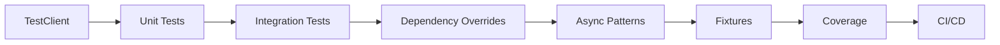

# Testing FastAPI — Unit Tests, Integration Tests, and TDD

## Learning Objectives

| Objective | Description |
|-----------|-------------|
| LO1 | Set up pytest with FastAPI's TestClient for HTTP testing |
| LO2 | Write unit tests for Pydantic models, dependencies, and business logic |
| LO3 | Implement integration tests with database fixtures |
| LO4 | Mock external services and override dependencies |
| LO5 | Apply test-driven development (TDD) for API endpoints |
| LO6 | Measure test coverage and implement CI pipeline testing |

## Introduction

05-fastapi-backend is a fundamental concept in AI engineering. This chapter covers the core principles, practical implementations, and interview preparation for mastering this topic.

## Prerequisites

- Basic programming knowledge
- Understanding of data structures
## Chapter at a Glance

| Section | Topic | Key Concept |
|---------|-------|-------------|
| 8.1 | TestClient Setup | pytest, TestClient, async tests |
| 8.2 | Unit Testing | Models, validators, pure functions |
| 8.3 | Integration Testing | Database, API endpoints, full workflows |
| 8.4 | Dependency Overrides | Mocking external services |
| 8.5 | Async Test Patterns | Testing async endpoints and tasks |
| 8.6 | Test Fixtures | Reusable test data and setup |
| 8.7 | Test Coverage | Measuring and improving coverage |
| 8.8 | CI/CD Testing | GitHub Actions, pre-commit hooks |

## Chapter Roadmap



## 8.1 TestClient Setup

FastAPI provides TestClient for making HTTP requests to your app without running a server.

```python
# requirements-dev.txt
# pytest
# httpx
# pytest-asyncio
# pytest-cov

# tests/conftest.py
import pytest
from fastapi.testclient import TestClient
from app.main import app

@pytest.fixture
def client():
    return TestClient(app)

# tests/test_main.py
def test_root_endpoint(client):
    response = client.get("/")
    assert response.status_code == 200
    assert response.json() == {"message": "Hello, FastAPI!"}

def test_create_user(client):
    response = client.post(
        "/users",
        json={"name": "Alice", "email": "alice@example.com"},
    )
    assert response.status_code == 201
    data = response.json()
    assert data["name"] == "Alice"
    assert "id" in data

def test_get_user_not_found(client):
    response = client.get("/users/999")
    assert response.status_code == 404
    assert response.json()["detail"] == "User not found"

def test_invalid_email(client):
    response = client.post(
        "/users",
        json={"name": "Bob", "email": "invalid-email"},
    )
    assert response.status_code == 422
    errors = response.json()["detail"]
    assert any("email" in str(e["loc"]) for e in errors)
```

**Async TestClient**:

```python
import pytest
from httpx import ASGITransport, AsyncClient

@pytest.fixture
async def async_client():
    transport = ASGITransport(app=app)
    async with AsyncClient(transport=transport, base_url="http://test") as client:
        yield client

@pytest.mark.asyncio
async def test_async_endpoint(async_client):
    response = await async_client.get("/async-data")
    assert response.status_code == 200
```

## 8.2 Unit Testing

Test pure functions, validators, and model logic in isolation.

```python
# app/models/user.py
from pydantic import BaseModel, field_validator, EmailStr

class UserCreate(BaseModel):
    username: str
    email: EmailStr
    password: str

    @field_validator("password")
    @classmethod
    def password_strength(cls, v: str) -> str:
        if len(v) < 8:
            raise ValueError("Password must be at least 8 characters")
        if not any(c.isupper() for c in v):
            raise ValueError("Password must contain an uppercase letter")
        if not any(c.isdigit() for c in v):
            raise ValueError("Password must contain a number")
        return v

# tests/test_models.py
import pytest
from app.models.user import UserCreate

def test_valid_user():
    user = UserCreate(
        username="alice",
        email="alice@example.com",
        password="SecurePass1",
    )
    assert user.username == "alice"

def test_weak_password():
    with pytest.raises(ValueError, match="at least 8 characters"):
        UserCreate(username="bob", email="bob@example.com", password="Sh0rt")

def test_missing_uppercase():
    with pytest.raises(ValueError, match="uppercase"):
        UserCreate(username="bob", email="bob@example.com", password="lowercase1")

def test_missing_digit():
    with pytest.raises(ValueError, match="number"):
        UserCreate(username="bob", email="bob@example.com", password="NoDigits!")

# Test utility functions
# app/utils/security.py
from passlib.context import CryptContext

pwd_context = CryptContext(schemes=["bcrypt"], deprecated="auto")

def hash_password(password: str) -> str:
    return pwd_context.hash(password)

def verify_password(plain: str, hashed: str) -> bool:
    return pwd_context.verify(plain, hashed)

# tests/test_security.py
def test_password_hash_and_verify():
    password = "SecurePass123!"
    hashed = hash_password(password)
    assert hashed != password
    assert verify_password(password, hashed)
    assert not verify_password("WrongPassword", hashed)
```

**Unit test best practices**:
- Test one thing per test function
- Use descriptive test names (test_function_scenario_expected)
- Test edge cases: empty input, boundary values, invalid types
- Mock external dependencies in unit tests
- Keep tests fast — no database or network calls

## 8.3 Integration Testing

Test the full stack — database, API, and services together.

```python
# tests/conftest.py — database fixture
import pytest
from sqlalchemy import create_engine
from sqlalchemy.orm import sessionmaker
from app.database import Base, get_db
from app.main import app

TEST_DATABASE_URL = "sqlite:///./test.db"
test_engine = create_engine(TEST_DATABASE_URL, connect_args={"check_same_thread": False})
TestSessionLocal = sessionmaker(autocommit=False, autoflush=False, bind=test_engine)

def override_get_db():
    db = TestSessionLocal()
    try:
        yield db
    finally:
        db.close()

app.dependency_overrides[get_db] = override_get_db

@pytest.fixture(autouse=True)
def setup_database():
    Base.metadata.create_all(bind=test_engine)
    yield
    Base.metadata.drop_all(bind=test_engine)

# tests/test_integration.py
def test_create_and_get_user(client):
    # Create user
    create_resp = client.post("/users", json={
        "username": "alice",
        "email": "alice@example.com",
        "password": "SecurePass1",
    })
    assert create_resp.status_code == 201
    user_id = create_resp.json()["id"]

    # Get user
    get_resp = client.get(f"/users/{user_id}")
    assert get_resp.status_code == 200
    assert get_resp.json()["username"] == "alice"

def test_list_users_pagination(client):
    # Create multiple users
    for i in range(15):
        client.post("/users", json={
            "username": f"user{i}", "email": f"user{i}@example.com", "password": "SecurePass1"
        })

    # Test pagination
    resp = client.get("/users?skip=0&limit=10")
    assert resp.status_code == 200
    assert len(resp.json()) == 10

    resp = client.get("/users?skip=10&limit=10")
    assert len(resp.json()) == 5

def test_full_user_workflow(client):
    # Register -> Login -> Update -> Delete
    reg_resp = client.post("/users", json={
        "username": "alice", "email": "alice@example.com", "password": "SecurePass1"
    })
    assert reg_resp.status_code == 201

    login_resp = client.post("/auth/login", json={
        "username": "alice", "password": "SecurePass1"
    })
    assert login_resp.status_code == 200
    token = login_resp.json()["access_token"]
    headers = {"Authorization": f"Bearer {token}"}

    update_resp = client.patch("/users/me", json={"full_name": "Alice Smith"}, headers=headers)
    assert update_resp.status_code == 200

    delete_resp = client.delete("/users/me", headers=headers)
    assert delete_resp.status_code == 204
```

## 8.4 Dependency Overrides

Mock external services by overriding FastAPI dependencies.

```python
# tests/conftest.py — mock email service
from app.dependencies import send_email

# Mock dependency
async def mock_send_email(to: str, subject: str, body: str):
    print(f"Mock email sent to {to}: {subject}")
    return {"status": "sent"}

app.dependency_overrides[send_email] = mock_send_email

# Mock authentication
from app.dependencies import get_current_user

mock_user = {"id": 1, "username": "testuser", "role": "admin"}

async def override_get_current_user():
    return mock_user

app.dependency_overrides[get_current_user] = override_get_current_user

# Test with mocked auth
def test_protected_endpoint_with_mock(client):
    response = client.get("/admin/dashboard")
    assert response.status_code == 200
    assert response.json()["user"] == mock_user

# Mock HTTPX external API calls
from unittest.mock import patch, AsyncMock

@patch("httpx.AsyncClient.get")
async def test_external_api_call(mock_get):
    mock_get.return_value.json = AsyncMock(return_value={"data": "mocked"})
    mock_get.return_value.status_code = 200

    async with AsyncClient(transport=ASGITransport(app=app), base_url="http://test") as client:
        response = await client.get("/external-data")
        assert response.status_code == 200

# Clear overrides after tests
@pytest.fixture(autouse=True)
def clear_overrides():
    yield
    app.dependency_overrides.clear()
```

**Mocking strategies**:

| Library | Use Case |
|---------|----------|
| unittest.mock | Standard Python mocking |
| pytest-mock | pytest integration |
| httpx-mock | HTTP client mocking |
| responses | Requests library mocking |
| moto | AWS service mocking |

## 8.5 Async Test Patterns

```python
import pytest
from httpx import ASGITransport, AsyncClient

# Async test configuration
@pytest.mark.asyncio
async def test_async_create_user():
    transport = ASGITransport(app=app)
    async with AsyncClient(transport=transport, base_url="http://test") as client:
        response = await client.post("/users", json={
            "name": "Alice", "email": "alice@example.com"
        })
        assert response.status_code == 201

# Testing WebSocket endpoints
def test_websocket():
    with TestClient(app) as client:
        with client.websocket_connect("/ws") as websocket:
            websocket.send_text("Hello!")
            data = websocket.receive_text()
            assert data == "Echo: Hello!"

# Testing background tasks
from unittest.mock import patch

def test_background_task_execution(client):
    with patch("app.tasks.send_welcome_email") as mock_task:
        response = client.post("/users", json={
            "name": "Bob", "email": "bob@example.com"
        })
        assert response.status_code == 201
        mock_task.assert_called_once()

# Testing async generators (database sessions)
@pytest.mark.asyncio
async def test_generator_dependency():
    async def mock_get_db():
        yield {"query": "mocked"}

    app.dependency_overrides[get_db] = mock_get_db
    async with AsyncClient(transport=ASGITransport(app=app), base_url="http://test") as client:
        response = await client.get("/users")
        assert response.status_code == 200
```

## 8.6 Test Fixtures

```python
# tests/factories.py — test data factories
import factory
from app.models.user import UserCreate

class UserFactory(factory.Factory):
    class Meta:
        model = dict

    username = factory.Sequence(lambda n: f"user{n}")
    email = factory.LazyAttribute(lambda o: f"{o.username}@example.com")
    password = "SecurePass1"
    full_name = factory.Faker("name")

# tests/conftest.py — fixtures
@pytest.fixture
def sample_user():
    return UserFactory()

@pytest.fixture
def sample_users_list():
    return [UserFactory() for _ in range(5)]

@pytest.fixture
def auth_token(client, sample_user):
    reg_resp = client.post("/users", json=sample_user)
    user_id = reg_resp.json()["id"]
    login_resp = client.post("/auth/login", json={
        "username": sample_user["username"],
        "password": sample_user["password"],
    })
    return login_resp.json()["access_token"]

@pytest.fixture
def auth_headers(auth_token):
    return {"Authorization": f"Bearer {auth_token}"}

# Using fixtures
def test_create_post(client, auth_headers):
    response = client.post("/posts", json={
        "title": "Test Post",
        "content": "Test content",
    }, headers=auth_headers)
    assert response.status_code == 201

def test_list_posts_with_auth(client, auth_headers):
    response = client.get("/posts", headers=auth_headers)
    assert response.status_code == 200
```

## 8.7 Test Coverage

```python
# Run coverage
# pytest --cov=app tests/ --cov-report=html --cov-report=term-missing

# .coveragerc
[run]
source = app
omit = */migrations/*,*/tests/*

[report]
exclude_lines =
    pragma: no cover
    def __repr__
    raise NotImplementedError
    if __name__ == .__main__.:
    pass

# Coverage targets
# Minimum: 80% line coverage
# Critical paths: 100%
# New code: 90%+

# tests/test_coverage.py
def test_all_endpoints_have_tests(client):
    """Check that all registered routes have at least one test."""
    routes = [route.path for route in app.routes if hasattr(route, "methods")]
    # Compare with collected test cases
    tested_routes = extract_tested_routes()
    untested = set(routes) - set(tested_routes)
    assert len(untested) == 0, f"Untested routes: {untested}"
```

**Coverage best practices**:
- Aim for 80%+ coverage, not 100%
- Focus on business logic coverage, not trivial getters/setters
- Use coverage reports to identify untested code paths
- Set coverage gates in CI pipeline
- Don't sacrifice test quality for coverage percentage

## 8.8 CI/CD Testing

```yaml
# .github/workflows/test.yml
name: Test
on: [push, pull_request]

jobs:
  test:
    runs-on: ubuntu-latest
    services:
      postgres:
        image: postgres:15
        env:
          POSTGRES_DB: testdb
          POSTGRES_USER: testuser
          POSTGRES_PASSWORD: testpass
        ports:
          - 5432:5432
      redis:
        image: redis:7
        ports:
          - 6379:6379

    steps:
      - uses: actions/checkout@v4
      - uses: actions/setup-python@v5
        with:
          python-version: "3.12"
      - name: Install dependencies
        run: |
          pip install -r requirements.txt
          pip install -r requirements-dev.txt
      - name: Lint
        run: ruff check app/
      - name: Type check
        run: mypy app/
      - name: Test with coverage
        run: |
          pytest tests/ --cov=app/ --cov-report=xml
      - name: Upload coverage
        uses: codecov/codecov-action@v3
```

```yaml
# pre-commit config
repos:
  - repo: https://github.com/pre-commit/pre-commit-hooks
    rev: v4.5.0
    hooks:
      - id: trailing-whitespace
      - id: end-of-file-fixer
  - repo: https://github.com/astral-sh/ruff-pre-commit
    rev: v0.1.0
    hooks:
      - id: ruff
  - repo: local
    hooks:
      - id: pytest
        name: pytest
        entry: pytest tests/
        language: system
        pass_filenames: false
        always_run: true
```

---

## TypeScript Parallel

```typescript
import { describe, it, expect, vi } from "vitest";
import request from "supertest";
import app from "../app";

describe("Users API", () => {
  it("creates a user", async () => {
    const res = await request(app)
      .post("/users")
      .send({ name: "Alice", email: "alice@test.com" });
    expect(res.status).toBe(201);
    expect(res.body).toHaveProperty("id");
  });

  it("returns 404 for unknown user", async () => {
    const res = await request(app).get("/users/999");
    expect(res.status).toBe(404);
  });
});

// Mock with vitest
vi.mock("../services/email", () => ({
  sendEmail: vi.fn().mockResolvedValue({ status: "sent" }),
}));
```

---

## Summary

- FastAPI TestClient wraps httpx for making HTTP requests without running a server
- Unit tests validate models, validators, and business logic in isolation
- Integration tests verify the full stack: database, API endpoints, and workflows
- Dependency overrides replace real services (database, email, auth) with mocks
- Async tests require pytest-asyncio and AsyncClient for WebSocket testing
- Test fixtures provide reusable setup data and context for tests
- Test coverage (pytest-cov) measures what code is exercised by tests
- CI/CD pipelines run tests automatically on every push
- Mock external HTTP calls, databases, and message queues in tests
- TDD leads to better API design and fewer bugs

## Practical Takeaways

| Scenario | Do This | Avoid This |
|----------|---------|------------|
| API testing | TestClient with pytest | Manual curl testing |
| Database | Test with test database | Using production database |
| External APIs | Mock HTTPX calls | Making real API calls |
| Auth endpoints | Mock user dependency | Hardcoded tokens |
| Coverage | 80%+ with pytest-cov | 100% coverage obsession |
| CI/CD | GitHub Actions for testing | Testing only locally |
| Test data | Factory fixtures | Hardcoded test data |

## Interview Q&A

<details class="tp-qa-card" data-qid="fastapi-s08-q1">
  <summary class="tp-qa-question"><span class="tp-qa-status"></span> Q1: How does TestClient work without a running server?</summary>
  <div class="tp-qa-answer"><p>TestClient uses Starlette's TestClient (based on httpx) which makes ASI calls directly to the application without opening a socket. It calls the ASGI application directly with the ASGI protocol, bypassing the network stack. This makes tests fast and eliminates the need to manage server processes.</p></div>
  <button class="tp-qa-mark-btn">&#x2705; Mark Reviewed</button>
  <button class="tp-qa-bookmark-btn">&#x1F516; Bookmark</button>
</details>

<details class="tp-qa-card" data-qid="fastapi-s08-q2">
  <summary class="tp-qa-question"><span class="tp-qa-status"></span> Q2: How do you test async endpoints in FastAPI?</summary>
  <div class="tp-qa-answer"><p>Use httpx.AsyncClient with ASGITransport for async tests. Mark tests with @pytest.mark.asyncio. The AsyncClient makes ASGI calls without blocking. For WebSocket testing, use TestClient's websocket_connect context manager.</p></div>
  <button class="tp-qa-mark-btn">&#x2705; Mark Reviewed</button>
  <button class="tp-qa-bookmark-btn">&#x1F516; Bookmark</button>
</details>

<details class="tp-qa-card" data-qid="fastapi-s08-q3">
  <summary class="tp-qa-question"><span class="tp-qa-status"></span> Q3: How do you mock database dependencies in tests?</summary>
  <div class="tp-qa-answer"><p>Create a test database (SQLite for unit tests, test PostgreSQL for integration). Override the get_db dependency with a function that returns a test session. Use fixtures to create tables before tests and drop them after. Use transaction rollback for isolation between tests.</p></div>
  <button class="tp-qa-mark-btn">&#x2705; Mark Reviewed</button>
  <button class="tp-qa-bookmark-btn">&#x1F516; Bookmark</button>
</details>

<details class="tp-qa-card" data-qid="fastapi-s08-q4">
  <summary class="tp-qa-question"><span class="tp-qa-status"></span> Q4: What is the difference between unit and integration tests?</summary>
  <div class="tp-qa-answer"><p>Unit tests test isolated components (models, validators, pure functions) with mocked dependencies. They are fast and focused. Integration tests test the full stack (API + database + external services) to verify components work together correctly. Both are essential — unit tests for speed, integration tests for confidence.</p></div>
  <button class="tp-qa-mark-btn">&#x2705; Mark Reviewed</button>
  <button class="tp-qa-bookmark-btn">&#x1F516; Bookmark</button>
</details>

<details class="tp-qa-card" data-qid="fastapi-s08-q5">
  <summary class="tp-qa-question"><span class="tp-qa-status"></span> Q5: How do you test WebSocket endpoints?</summary>
  <div class="tp-qa-answer"><p>Use TestClient's websocket_connect context manager: with client.websocket_connect("/ws") as websocket: websocket.send_text("msg"); data = websocket.receive_text(). Test connection acceptance, message echo, broadcasting, error handling, and disconnection scenarios.</p></div>
  <button class="tp-qa-mark-btn">&#x2705; Mark Reviewed</button>
  <button class="tp-qa-bookmark-btn">&#x1F516; Bookmark</button>
</details>

<details class="tp-qa-card" data-qid="fastapi-s08-q6">
  <summary class="tp-qa-question"><span class="tp-qa-status"></span> Q6: What is a good test coverage target?</summary>
  <div class="tp-qa-answer"><p>80% line coverage is a good minimum target. Focus on covering business logic — validation, authorization, data transformation. Don't chase 100% — getters, setters, and configuration files don't need exhaustive testing. Use coverage reports to find untested critical paths and edge cases.</p></div>
  <button class="tp-qa-mark-btn">&#x2705; Mark Reviewed</button>
  <button class="tp-qa-bookmark-btn">&#x1F516; Bookmark</button>
</details>

<details class="tp-qa-card" data-qid="fastapi-s08-q7">
  <summary class="tp-qa-question"><span class="tp-qa-status"></span> Q7: How do you test background tasks?</summary>
  <div class="tp-qa-answer"><p>Use unittest.mock to verify the background task function is called with correct arguments. Since tasks run after the response, check they were scheduled (not their execution result). For Celery tasks, test the task function directly (unit test) and verify task.delay() is called (integration test).</p></div>
  <button class="tp-qa-mark-btn">&#x2705; Mark Reviewed</button>
  <button class="tp-qa-bookmark-btn">&#x1F516; Bookmark</button>
</details>

<details class="tp-qa-card" data-qid="fastapi-s08-q8">
  <summary class="tp-qa-question"><span class="tp-qa-status"></span> Q8: How do you test file uploads?</summary>
  <div class="tp-qa-answer"><p>TestClient accepts files parameter: client.post("/upload", files={"file": ("test.txt", b"content", "text/plain")}). Test with various file types, sizes, and invalid content. Verify file is saved correctly. Test error cases: missing file, wrong content type, file too large.</p></div>
  <button class="tp-qa-mark-btn">&#x2705; Mark Reviewed</button>
  <button class="tp-qa-bookmark-btn">&#x1F516; Bookmark</button>
</details>

<details class="tp-qa-card" data-qid="fastapi-s08-q9">
  <summary class="tp-qa-question"><span class="tp-qa-status"></span> Q9: What is the purpose of conftest.py?</summary>
  <div class="tp-qa-answer"><p>conftest.py contains fixtures and hooks shared across test files. pytest automatically discovers conftest.py files in test directories. Define fixtures here: database setup, TestClient, authentication, mock services. Fixtures declared in conftest.py are available to all test files in the same directory hierarchy.</p></div>
  <button class="tp-qa-mark-btn">&#x2705; Mark Reviewed</button>
  <button class="tp-qa-bookmark-btn">&#x1F516; Bookmark</button>
</details>

<details class="tp-qa-card" data-qid="fastapi-s08-q10">
  <summary class="tp-qa-question"><span class="tp-qa-status"></span> Q10: How do you test error handling and edge cases?</summary>
  <div class="tp-qa-answer"><p>Test each 4xx and 5xx status code scenario: 400 (validation), 401 (no auth), 403 (wrong role), 404 (not found), 409 (conflict), 422 (invalid input), 429 (rate limit), 500 (server error). Test boundary values, empty inputs, missing required fields, malformed JSON, and concurrent requests.</p></div>
  <button class="tp-qa-mark-btn">&#x2705; Mark Reviewed</button>
  <button class="tp-qa-bookmark-btn">&#x1F516; Bookmark</button>
</details>

## Chapter Quiz

**Q1**: What class does FastAPI provide for HTTP testing?

a) TestHTTP
b) TestClient
c) APITester
d) MockClient

<details class="tp-qa-card" data-qid="fastapi-s08-quiz1"><summary>Show Answer</summary><div class="tp-qa-answer"><p><strong>Answer: b) TestClient</strong></p></div></details>

**Q2**: How do you override a dependency for testing?

a) app.override()
b) app.dependency_overrides[dependency] = mock
c) dependency.mock = True
d) patch(dependency)

<details class="tp-qa-card" data-qid="fastapi-s08-quiz2"><summary>Show Answer</summary><div class="tp-qa-answer"><p><strong>Answer: b) app.dependency_overrides[dependency] = mock</strong></p></div></details>

**Q3**: What is a good minimum test coverage target?

a) 50%
b) 60%
c) 80%
d) 100%

<details class="tp-qa-card" data-qid="fastapi-s08-quiz3"><summary>Show Answer</summary><div class="tp-qa-answer"><p><strong>Answer: c) 80%</strong></p></div></details>

**Q4**: How do you test async endpoints?

a) TestClient works automatically
b) Use AsyncClient with ASGITransport
c) Tests don't support async
d) Use async TestClient()

<details class="tp-qa-card" data-qid="fastapi-s08-quiz4"><summary>Show Answer</summary><div class="tp-qa-answer"><p><strong>Answer: b) Use AsyncClient with ASGITransport</strong></p></div></details>

**Q5**: What tool measures test coverage in pytest?

a) pytest-cov
b) pytest-cover
c) coverage.py
d) pytest-measure

<details class="tp-qa-card" data-qid="fastapi-s08-quiz5"><summary>Show Answer</summary><div class="tp-qa-answer"><p><strong>Answer: a) pytest-cov</strong></p></div></details>

## Exercises

**Easy** — Write unit tests for a UserRegistration Pydantic model with password validation rules. Test valid passwords, weak passwords, missing uppercase, and missing numbers.

**Medium** — Set up integration tests for a CRUD API with TestClient and an in-memory SQLite database. Test create, read, update, and delete operations. Include 404 and validation error tests.

**Medium** — Write tests that mock an external HTTP API. Create an endpoint that fetches weather data from an external service. Mock the HTTPX call and test both success and failure scenarios.

**Hard** — Implement a complete test suite for an authenticated API with JWT. Test: successful login, invalid credentials, expired token, blacklisted token, role-based access (admin vs user). Use fixture factories for test data.

**Hard** — Set up CI/CD pipeline with GitHub Actions: install dependencies, run linting (ruff), type checking (mypy), tests with coverage, and upload coverage report. Add pre-commit hooks for local testing.

---


## Common Mistakes

1. Not understanding the fundamental concepts before applying them
2. Skipping edge cases in implementation
3. Not analyzing time/space complexity
4. Forgetting to handle null/empty inputs
5. Not practicing enough problems to build pattern recognition
## Revision Notes

- Key concept 1: Core principle of 05-fastapi-backend
- Key concept 2: Common implementation pattern
- Key concept 3: Time/space complexity to remember
- Key concept 4: When to apply this technique
- Key concept 5: Common interview pattern
- Key concept 6: Edge cases to handle
- Key concept 7: Related concepts for deeper understanding
## Placement Section

### Top 10 Interview Questions

#### Google Style
1. Explain the time and space trade-offs of 05-fastapi-backend. When would you choose one approach over another?
2. Design a system that efficiently handles 05-fastapi-backend at scale (millions of requests/second).

#### Amazon Style
1. Tell me about a time you had to optimize a system related to 05-fastapi-backend. What was your approach and what was the result?
2. How would you explain 05-fastapi-backend to a non-technical stakeholder?

#### Microsoft Style
1. How does 05-fastapi-backend integrate with enterprise systems and cloud architectures?
2. What are the security implications of 05-fastapi-backend?

#### NVIDIA Style
1. How would you optimize 05-fastapi-backend for GPU-accelerated computing?
2. What parallel processing patterns apply to 05-fastapi-backend?

#### AI Startup Style
1. How would you implement 05-fastapi-backend in a cost-effective, scalable way for a startup?
2. What's the fastest way to prototype a solution using 05-fastapi-backend?

### Resume Tips
- **Technical Skills**: List 05-fastapi-backend under relevant technical skills
- **Project Description**: "Implemented 05-fastapi-backend to [specific outcome], reducing [metric] by [X]%"
- **Keywords**: Include 05-fastapi-backend in your skills section for ATS optimization

### Interview Day Checklist
- [ ] Review core concepts of 05-fastapi-backend
- [ ] Practice 3-5 problems related to 05-fastapi-backend
- [ ] Prepare 2 real-world examples of using 05-fastapi-backend
- [ ] Know the time/space complexity of common 05-fastapi-backend operations
- [ ] Have questions ready about how the company uses 05-fastapi-backend> **Next**: [Error Handling and Logging](09-error-handling-and-logging.md)
