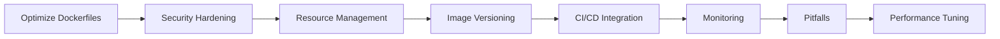

# Docker Best Practices — Security, Optimization, and Production Readiness

## Learning Objectives

| Objective | Description |
|-----------|-------------|
| LO1 | Apply Dockerfile optimization techniques for faster builds and smaller images |
| LO2 | Implement Docker security best practices including least privilege and secret management |
| LO3 | Configure resource constraints and monitoring for production containers |
| LO4 | Manage image tagging, versioning, and registry hygiene |
| LO5 | Implement CI/CD integration patterns for Docker builds |
| LO6 | Troubleshoot common Docker production issues |

<!-- Image Gallery -->
<section class="lesson-visuals" aria-label="Visual learning resources">
  <header><span>VISUAL LEARNING</span><h2>See it. Review it. Remember it.</h2></header>
  <a class="lesson-visual-card" href="../../assets/images/lessons/ai-engineering-placement/06-docker-kubernetes-cloud/03-docker-best-practices/handwritten-notes.png" target="_blank" rel="noopener">
    
    <span><strong>Handwritten notes</strong>Condensed notes for deliberate review.</span>
  </a>
  <a class="lesson-visual-card" href="../../assets/images/lessons/ai-engineering-placement/06-docker-kubernetes-cloud/03-docker-best-practices/sticky-notes.png" target="_blank" rel="noopener">
    
    <span><strong>Sticky-note revision</strong>Fast recall prompts for revision.</span>
  </a>
  <a class="lesson-visual-card" href="../../assets/images/lessons/ai-engineering-placement/06-docker-kubernetes-cloud/03-docker-best-practices/visual-explanation.png" target="_blank" rel="noopener">
    
    <span><strong>Visual concept guide</strong>A connected explanation of the key ideas.</span>
  </a>
</section>
<!-- End Image Gallery -->

## Chapter at a Glance

| Section | Topic | Key Concept |
|---------|-------|-------------|
| 3.1 | Optimizing Dockerfiles | Layer ordering, multi-stage, slim base images |
| 3.2 | Security Best Practices | Least privilege, secrets, image scanning |
| 3.3 | Resource Management | CPU/memory limits, OOM handling |
| 3.4 | Image Tagging and Versioning | Semantic tags, digests, registry management |
| 3.5 | CI/CD Integration | GitHub Actions, GitLab CI, build caching |
| 3.6 | Production Monitoring | Health checks, logging, metrics |
| 3.7 | Common Pitfalls | Zombie processes, permission issues, timezones |
| 3.8 | Performance Tuning | Layer caching, buildkit, parallel builds |

## Chapter Roadmap



## 3.1 Optimizing Dockerfiles

A well-optimized Dockerfile produces smaller, faster-building, and more secure images.

**Choose minimal base images**:

```dockerfile
# Fat — ~800MB
FROM python:3.11

# Slim — ~120MB
FROM python:3.11-slim

# Alpine — ~50MB (use with caution)
FROM python:3.11-alpine

# Distroless — ~40MB (no shell, no package manager)
FROM gcr.io/distroless/python3:latest
```

**Order layers for maximum cache reuse**:

```dockerfile
# ❌ Inefficient — cache invalidated on every code change
FROM node:20
WORKDIR /app
COPY . .
RUN npm ci
RUN npm run build

# ✅ Efficient — dependency layer cached separately
FROM node:20 AS builder
WORKDIR /app
COPY package*.json .
RUN npm ci
COPY . .
RUN npm run build

FROM node:20-slim AS runtime
WORKDIR /app
COPY --from=builder /app/dist ./dist
COPY --from=builder /app/node_modules ./node_modules
CMD ["node", "dist/server.js"]
```

**Multi-stage build patterns**:

```dockerfile
# Stage 1: Compile
FROM golang:1.21 AS builder
WORKDIR /app
COPY go.mod go.sum ./
RUN go mod download
COPY . .
RUN CGO_ENABLED=0 go build -o server .

# Stage 2: Runtime
FROM alpine:3.18
RUN addgroup -S app && adduser -S app -G app
COPY --from=builder /app/server /server
USER app
EXPOSE 8080
CMD ["/server"]
```

**Additional optimization tips**:

```dockerfile
# Combine RUN commands to reduce layers
RUN apt-get update && apt-get install -y \
    curl \
    git \
    && rm -rf /var/lib/apt/lists/*

# Use .dockerignore effectively
# Exclude: node_modules, .git, .env, *.md, __pycache__

# Set --no-cache-dir for pip
RUN pip install --no-cache-dir -r requirements.txt

# Use COPY --link for better cache behavior
COPY --link package*.json ./
```

## 3.2 Security Best Practices

Security must be integrated into every stage of the Docker workflow.

**Least privilege principle**:

```dockerfile
# ❌ Running as root
FROM node:20-alpine
COPY . /app
CMD ["node", "server.js"]

# ✅ Create and use non-root user
FROM node:20-alpine
RUN addgroup -S appgroup && adduser -S appuser -G appgroup
USER appuser
WORKDIR /app
COPY --chown=appuser:appgroup . .
CMD ["node", "server.js"]
```

**Secret management**:

```dockerfile
# ❌ Never hardcode secrets
ENV API_KEY=sk-abc123  # BAD — exposed in image layers

# ✅ Build-time secrets (Docker BuildKit)
# docker build --secret id=api_key,env=API_KEY .
RUN --mount=type=secret,id=api_key \
    export API_KEY=$(cat /run/secrets/api_key) && \
    ./configure --api-key=$API_KEY
```

```bash
# Runtime secrets
docker run -e API_KEY=sk-abc123 my-image
docker run --secret id=api_key my-image  # Swarm secrets
```

**Image scanning**:

```bash
# Scan with Docker Scout
docker scout quickview my-image
docker scout recommendations my-image

# Scan with Trivy
trivy image my-image:latest

# Scan with Snyk
snyk container test my-image
```

**Security checklist**:

| Practice | Implementation |
|----------|----------------|
| No root user | `USER appuser` |
| Read-only rootfs | `docker run --read-only` |
| Drop capabilities | `--cap-drop=ALL --cap-add=NET_BIND_SERVICE` |
| No privileged mode | Never `--privileged` |
| Security scanning | Run in CI pipeline |
| Minimal base image | Use distroless or slim |
| No secrets in layers | Use BuildKit secrets |
| Regular updates | Rebase images weekly |

```bash
# Run with security hardening
docker run -d \
    --read-only \
    --cap-drop=ALL \
    --cap-add=NET_BIND_SERVICE \
    --security-opt=no-new-privileges:true \
    --tmpfs /tmp:rw,noexec,nosuid,size=64m \
    my-app
```

## 3.3 Resource Management

Containers without limits can exhaust host resources. Always set constraints.

```bash
# CPU constraints
docker run --cpus=0.5 my-image      # half a core
docker run --cpus=2 my-image        # 2 cores
docker run --cpuset-cpus=0,2 my-image # specific cores

# Memory constraints
docker run --memory=512m my-image
docker run --memory-reservation=256m my-image
docker run --memory-swap=1g my-image  # memory + swap limit

# Combined
docker run -d \
    --name api \
    --cpus=0.5 \
    --memory=256m \
    --memory-reservation=128m \
    --oom-kill-disable=false \
    my-api:latest
```

**Docker Compose resource configuration**:

```yaml
services:
  api:
    deploy:
      resources:
        limits:
          cpus: "0.50"
          memory: "256M"
        reservations:
          cpus: "0.25"
          memory: "128M"
    oom_kill_disable: false
    restart: unless-stopped
```

**Understanding OOM behavior**:

When a container exceeds its memory limit, the kernel's OOM killer terminates it. Set `--oom-score-adj` to control which containers get killed first:

```bash
docker run --oom-score-adj=-1000 my-critical-app  # less likely to be killed
docker run --oom-score-adj=1000 my-batch-job       # more likely to be killed
```

**Monitoring resource usage**:

```bash
# Real-time stats
docker stats

# Inspect resource usage history
docker inspect --format '{{.Name}}: Memory={{.HostConfig.Memory}} CPU={{.HostConfig.NanoCpus}}' container_name

# cgroup stats
cat /sys/fs/cgroup/memory/docker/<container_id>/memory.usage_in_bytes
```

## 3.4 Image Tagging and Versioning

Consistent image tagging enables traceability and rollback.

**Tagging strategies**:

```bash
# Semantic versioning
docker build -t my-app:1.0.0 .
docker build -t my-app:1.0 .
docker build -t my-app:1 .
docker build -t my-app:latest .

# Git-based tagging
docker build -t my-app:$(git rev-parse --short HEAD) .
docker build -t my-app:$(git describe --tags) .

# Environment tags
docker build -t my-app:staging-$(git rev-parse --short HEAD) .
docker build -t my-app:production-$(git rev-parse --short HEAD) .
```

**Image digests** — immutable references:

```bash
# Get digest
docker images --digests my-app

# Pull by digest
docker pull my-app@sha256:abc123...

# Use digest in production (immutable)
docker run my-app@sha256:def456...
```

**Registry management**:

```bash
# Tag for registry
docker tag my-app:1.0.0 registry.example.com/team/my-app:1.0.0

# Push
docker push registry.example.com/team/my-app:1.0.0

# Multi-architecture images
docker buildx build --platform linux/amd64,linux/arm64 -t my-app:latest --push .

# Garbage collection
# AWS ECR lifecycle policies
# Docker Registry: bin/registry garbage-collect /etc/docker/registry/config.yml
```

**Retention policies**:

| Pattern | Keep | Delete |
|---------|------|--------|
| Latest N versions | 5 most recent | Older than 5 |
| Date-based | Last 30 days | Older than 30 days |
| Git SHA | All tagged builds | All untagged builds |
| Environment | staging-* (7 days) | prod-* (indefinite) |

## 3.5 CI/CD Integration

Docker builds in CI/CD pipelines require optimized caching and security scanning.

**GitHub Actions example**:

```yaml
name: Build and Push Docker Image

on:
  push:
    branches: [main]

jobs:
  build:
    runs-on: ubuntu-latest
    steps:
      - uses: actions/checkout@v4

      - name: Set up Docker Buildx
        uses: docker/setup-buildx-action@v3

      - name: Cache Docker layers
        uses: actions/cache@v3
        with:
          path: /tmp/.buildx-cache
          key: ${{ runner.os }}-buildx-${{ github.sha }}
          restore-keys: |
            ${{ runner.os }}-buildx-

      - name: Build and push
        uses: docker/build-push-action@v5
        with:
          context: .
          push: true
          tags: |
            ghcr.io/${{ github.repository }}:latest
            ghcr.io/${{ github.repository }}:${{ github.sha }}
          cache-from: type=gha
          cache-to: type=gha,mode=max

      - name: Scan image
        run: |
          docker scout quickview ghcr.io/${{ github.repository }}:${{ github.sha }}
```

**Build caching strategies**:

```yaml
# GitHub Actions caching
cache-from: type=gha
cache-to: type=gha,mode=max

# Registry caching
cache-from: type=registry,ref=my-image:buildcache
cache-to: type=registry,ref=my-image:buildcache,mode=max

# Local caching
cache-from: type=local,src=/tmp/.buildx-cache
cache-to: type=local,dest=/tmp/.buildx-cache
```

**GitLab CI example**:

```yaml
docker-build:
  stage: build
  image: docker:24
  services:
    - docker:dind
  variables:
    DOCKER_BUILDKIT: "1"
  script:
    - docker login -u $CI_REGISTRY_USER -p $CI_REGISTRY_PASSWORD $CI_REGISTRY
    - docker build
        --cache-from $CI_REGISTRY_IMAGE:latest
        -t $CI_REGISTRY_IMAGE:$CI_COMMIT_SHORT_SHA
        -t $CI_REGISTRY_IMAGE:latest
        .
    - docker push $CI_REGISTRY_IMAGE:$CI_COMMIT_SHORT_SHA
    - docker push $CI_REGISTRY_IMAGE:latest
```

## 3.6 Production Monitoring

**Health checks** — required for container orchestration:

```dockerfile
# HTTP health check
HEALTHCHECK --interval=30s --timeout=3s --start-period=10s --retries=3 \
    CMD curl -f http://localhost:8080/health || exit 1

# TCP health check
HEALTHCHECK --interval=30s --timeout=10s --start-period=5s \
    CMD nc -z localhost 5432 || exit 1

# Custom command
HEALTHCHECK --interval=60s --timeout=5s \
    CMD python /app/health_check.py || exit 1
```

**Logging best practices**:

```dockerfile
# Send logs to stdout/stderr
ENV PYTHONUNBUFFERED=1

# Configure application logger
# Python: logging.basicConfig(stream=sys.stdout)
# Node: pino-pretty
# Java: Logback console appender
```

```yaml
# Compose logging configuration
services:
  api:
    logging:
      driver: "json-file"
      options:
        max-size: "10m"
        max-file: "3"
```

**Metrics exposure**:

```dockerfile
# Expose metrics endpoint
EXPOSE 9090

# Prometheus metrics (Python)
RUN pip install prometheus-client
```

```python
from prometheus_client import Counter, Histogram, start_http_server

REQUEST_COUNT = Counter("http_requests_total", "Total HTTP requests")
REQUEST_DURATION = Histogram("http_request_duration_seconds", "HTTP request duration")

@app.get("/metrics")
def metrics():
    return Response(prometheus_client.generate_latest(), media_type="text/plain")
```

## 3.7 Common Pitfalls

**Zombie processes**: PID 1 in a container must handle signals properly. Use a minimal init system.

```dockerfile
# Solution 1: Use tini (tiny init)
FROM python:3.11-slim
RUN apt-get update && apt-get install -y tini
ENTRYPOINT ["tini", "--"]
CMD ["python", "app.py"]

# Solution 2: Use dumb-init
FROM node:20-alpine
RUN apk add --no-cache dumb-init
ENTRYPOINT ["dumb-init", "--"]
CMD ["node", "server.js"]
```

**Permission issues with volumes**:

```dockerfile
# Match container user with host user
RUN adduser -u 1001 appuser
USER appuser
```

**Timezone configuration**:

```dockerfile
# Set timezone
ENV TZ=UTC
RUN ln -snf /usr/share/zoneinfo/$TZ /etc/localtime && echo $TZ > /etc/timezone

# Or for Debian-based
RUN apt-get install -y tzdata && \
    ln -snf /usr/share/zoneinfo/UTC /etc/localtime
```

**File descriptor limits**:

```bash
# Increase in docker run
docker run --ulimit nofile=65536:65536 my-app

# Or in Docker Compose
ulimits:
  nofile:
    soft: 65536
    hard: 65536
```

**Common Dockerfile mistakes**:

```dockerfile
# ❌ Wrong
COPY . .
RUN npm install
RUN npm test
RUN npm run build

# ✅ Right
COPY package*.json ./
RUN npm ci
COPY . .
RUN npm test
RUN npm run build
```

## 3.8 Performance Tuning

**BuildKit features**:

```bash
# Enable BuildKit
export DOCKER_BUILDKIT=1
docker build --progress=plain -t my-app .

# Parallel builds
docker build --parallel -t my-app .

# Cache mounts
RUN --mount=type=cache,target=/root/.npm \
    npm ci

# Bind mounts for temporary tools
RUN --mount=type=bind,source=scripts,target=/scripts \
    /scripts/build.sh
```

**Layer compression**:

```dockerfile
# Use buildkit's compression
# docker build --output=type=image,name=my-app,compression=zstd

# Squash layers (use with caution — breaks cache)
# docker build --squash -t my-app .
```

**Network performance**:

```bash
# Use host network for high-performance needs
docker run --network=host my-app

# Use macvlan for direct network access
docker network create -d macvlan --subnet=192.168.1.0/24 my-network
```

**Storage driver selection**:

| Driver | Pros | Cons |
|--------|------|------|
| overlay2 | Default, fast, stable | Requires Linux 4.0+ |
| fuse-overlayfs | Works in rootless mode | Slower than overlay2 |
| devicemapper | Legacy | Not recommended |
| aufs | Legacy | Not in mainline kernel |

```bash
# Check current storage driver
docker info | grep "Storage Driver"

# Switch (daemon.json)
{
  "storage-driver": "overlay2"
}
```

---

## TypeScript Parallel

TypeScript can orchestrate Docker operations and enforce best practices through automation:

```typescript
import { execSync } from "child_process";

interface DockerBuildOptions {
  context: string;
  tag: string;
  platform?: string;
  cacheFrom?: string;
  secrets?: Record<string, string>;
}

function dockerBuild(options: DockerBuildOptions): void {
  const cmd = [
    "docker buildx build",
    `--file "${options.context}/Dockerfile"`,
    `-t ${options.tag}`,
    options.platform ? `--platform ${options.platform}` : "",
    options.cacheFrom ? `--cache-from ${options.cacheFrom}` : "",
    ...Object.entries(options.secrets || {}).map(
      ([id, val]) => `--secret id=${id},env=${val}`
    ),
    options.context,
  ]
    .filter(Boolean)
    .join(" ");

  execSync(cmd, { stdio: "inherit" });
}

// Enforce best practice: multi-arch + build cache
dockerBuild({
  context: ".",
  tag: "my-app:latest",
  platform: "linux/amd64,linux/arm64",
  cacheFrom: "type=gha",
});
```

---

## Summary

- Use minimal base images (slim, alpine, distroless) to reduce attack surface and size; distroless images have no shell or package manager
- Order Dockerfile instructions by change frequency — dependencies first, code last — to maximize layer caching
- Multi-stage builds separate compilation from runtime, producing images that are 10-100x smaller
- Never run as root in containers; create a dedicated user with minimal permissions and drop all non-essential capabilities
- Use BuildKit secrets for build-time credentials; never hardcode secrets in image layers
- Always set CPU and memory limits on containers to prevent resource exhaustion on the host
- Use semantic versioning or Git SHA-based tags for traceability; pin production images by digest for immutability
- Implement health checks, structured logging to stdout, and metrics endpoints in every production container
- Use tini or dumb-init as PID 1 to handle signal forwarding and prevent zombie processes
- Integrate vulnerability scanning (Trivy, Docker Scout, Snyk) into CI/CD pipelines to catch issues before deployment

## Practical Takeaways

| Scenario | Do This | Avoid This |
|----------|---------|------------|
| Building images | Multi-stage, slim base, .dockerignore | Single-stage, fat base |
| Security | Non-root user, read-only rootfs, scan images | Running as root, no scanning |
| Resource limits | Always set CPU/memory limits | No limits (can crash host) |
| Image tags | Semantic version + Git SHA | Only `latest` tag |
| CI/CD pipeline | Cache Docker layers between builds | Rebuilding from scratch each time |
| Secrets | BuildKit secrets or runtime env | Hardcoding in Dockerfile |
| Logging | Write to stdout/stderr with rotation | Writing to files inside container |
| Data persistence | Named volumes | Storing data in container writable layer |

## Interview Q&A

<details class="tp-qa-card" data-qid="docker-s03-q1">
  <summary class="tp-qa-question">
    <span class="tp-qa-status"></span>
    Q1: How do you reduce Docker image size for production?
  </summary>
  <div class="tp-qa-answer">
    <p>Several strategies combined:</p>
    <ol>
      <li><strong>Minimal base image</strong>: Use <code>-slim</code>, <code>-alpine</code>, or distroless images instead of full OS images</li>
      <li><strong>Multi-stage builds</strong>: Build in one stage, copy only artifacts to the final stage</li>
      <li><strong>Layer cleanup</strong>: Combine RUN commands, remove package manager caches in the same layer</li>
      <li><strong>.dockerignore</strong>: Exclude development files, tests, documentation</li>
    </ol>
    <pre><code># Python: slim saves ~700MB vs full
FROM python:3.11-slim  # ~120MB vs ~887MB

# Node: alpine saves ~300MB vs full
FROM node:20-alpine  # ~120MB vs ~400MB</code></pre>
  </div>
  <button class="tp-qa-mark-btn">✅ Mark Reviewed</button>
  <button class="tp-qa-bookmark-btn">🔖 Bookmark</button>
</details>

<details class="tp-qa-card" data-qid="docker-s03-q2">
  <summary class="tp-qa-question">
    <span class="tp-qa-status"></span>
    Q2: Why should you not run containers as root? How do you set up a non-root user?
  </summary>
  <div class="tp-qa-answer">
    <p>Running as root in a container is dangerous because: if the container is compromised, the attacker has root access to the containerized processes; and if there's a kernel exploit, they can escape to the host.</p>
    <pre><code># Create non-root user
FROM node:20-alpine
RUN addgroup -S appgroup && adduser -S appuser -G appgroup
USER appuser
WORKDIR /app
COPY --chown=appuser:appgroup . .
CMD ["node", "server.js"]

# If the app needs privileged ports (<1024), use NET_BIND_SERVICE
docker run --cap-add=NET_BIND_SERVICE my-app</code></pre>
  </div>
  <button class="tp-qa-mark-btn">✅ Mark Reviewed</button>
  <button class="tp-qa-bookmark-btn">🔖 Bookmark</button>
</details>

<details class="tp-qa-card" data-qid="docker-s03-q3">
  <summary class="tp-qa-question">
    <span class="tp-qa-status"></span>
    Q3: Explain Docker layer caching. How can you optimize it in CI/CD?
  </summary>
  <div class="tp-qa-answer">
    <p>Docker caches each layer after a successful build. On subsequent builds, if the instruction and context haven't changed, Docker reuses the cached layer.</p>
    <p><strong>Optimization strategies</strong>:</p>
    <ul>
      <li>Order instructions by stability: system packages → language runtime → dependencies → code</li>
      <li>Copy dependency manifests separately before running install commands</li>
      <li>Use BuildKit's <code>--cache-from</code> to pull cache from registry or previous builds</li>
      <li>In CI/CD, restore cache from a previous successful build</li>
    </ul>
    <pre><code># GitHub Actions cache
- uses: actions/cache@v3
  with:
    path: /tmp/.buildx-cache
    key: buildx-${{ github.sha }}
    restore-keys: buildx-</code></pre>
  </div>
  <button class="tp-qa-mark-btn">✅ Mark Reviewed</button>
  <button class="tp-qa-bookmark-btn">🔖 Bookmark</button>
</details>

<details class="tp-qa-card" data-qid="docker-s03-q4">
  <summary class="tp-qa-question">
    <span class="tp-qa-status"></span>
    Q4: What is the purpose of HEALTHCHECK in a Dockerfile?
  </summary>
  <div class="tp-qa-answer">
    <p>HEALTHCHECK tells Docker how to test if a container is still working. It runs a command periodically inside the container. If the command fails repeatedly, Docker marks the container as unhealthy and can restart it.</p>
    <pre><code>HEALTHCHECK --interval=30s --timeout=3s --start-period=5s --retries=3 \
    CMD curl -f http://localhost:8000/health || exit 1</code></pre>
    <p><strong>Options</strong>:</p>
    <ul>
      <li><code>--interval</code>: How often to run (default 30s)</li>
      <li><code>--timeout</code>: Maximum time for the check (default 30s)</li>
      <li><code>--start-period</code>: Grace period before first check (default 0s)</li>
      <li><code>--retries</code>: Consecutive failures before unhealthy (default 3)</li>
    </ul>
    <p>Orchestrators (Kubernetes, Docker Swarm) use health check status for service discovery and rolling updates.</p>
  </div>
  <button class="tp-qa-mark-btn">✅ Mark Reviewed</button>
  <button class="tp-qa-bookmark-btn">🔖 Bookmark</button>
</details>

<details class="tp-qa-card" data-qid="docker-s03-q5">
  <summary class="tp-qa-question">
    <span class="tp-qa-status"></span>
    Q5: How do you handle secrets in Docker builds and runtime?
  </summary>
  <div class="tp-qa-answer">
    <p><strong>Build-time secrets</strong> (Docker BuildKit):</p>
    <pre><code># Dockerfile
RUN --mount=type=secret,id=api_key \
    export KEY=$(cat /run/secrets/api_key) && \
    ./configure --key=$KEY

# Build command
docker build --secret id=api_key,env=API_KEY .</code></pre>
    <p><strong>Runtime secrets</strong>:</p>
    <ul>
      <li><code>docker run -e API_KEY=xxx my-image</code> (acceptable for local dev)</li>
      <li><code>docker run --secret id=api_key my-image</code> (Docker Swarm)</li>
      <li>Environment files: <code>docker run --env-file .env my-image</code></li>
      <li>External secret stores: HashiCorp Vault, AWS Secrets Manager</li>
    </ul>
    <p><strong>Never</strong>: Hardcode secrets in Dockerfile or copy .env files into the image.</p>
  </div>
  <button class="tp-qa-mark-btn">✅ Mark Reviewed</button>
  <button class="tp-qa-bookmark-btn">🔖 Bookmark</button>
</details>

<details class="tp-qa-card" data-qid="docker-s03-q6">
  <summary class="tp-qa-question">
    <span class="tp-qa-status"></span>
    Q6: What is the zombie process problem in Docker and how do you solve it?
  </summary>
  <div class="tp-qa-answer">
    <p>In Linux, PID 1 has special responsibilities: it must reap orphaned child processes (zombies) and forward signals. Many applications are not designed to be PID 1, so zombie processes accumulate and signals (SIGTERM, SIGINT) are not forwarded to child processes.</p>
    <p><strong>Solutions</strong>:</p>
    <pre><code># Option 1: tini (tiny init for containers)
FROM python:3.11-slim
RUN apt-get update && apt-get install -y tini
ENTRYPOINT ["tini", "--"]
CMD ["python", "app.py"]

# Option 2: dumb-init
FROM node:20-alpine
RUN apk add --no-cache dumb-init
ENTRYPOINT ["dumb-init", "--"]
CMD ["node", "server.js"]

# Option 3: Use --init flag
docker run --init my-app</code></pre>
  </div>
  <button class="tp-qa-mark-btn">✅ Mark Reviewed</button>
  <button class="tp-qa-bookmark-btn">🔖 Bookmark</button>
</details>

<details class="tp-qa-card" data-qid="docker-s03-q7">
  <summary class="tp-qa-question">
    <span class="tp-qa-status"></span>
    Q7: What is BuildKit and why should you use it?
  </summary>
  <div class="tp-qa-answer">
    <p>BuildKit is Docker's next-generation build system, available since Docker 18.09. It provides significant improvements over the legacy builder:</p>
    <ul>
      <li><strong>Parallel builds</strong>: Builds independent stages concurrently</li>
      <li><strong>Better cache management</strong>: More granular caching, cache mounts</li>
      <li><strong>Secrets support</strong>: <code>--mount=type=secret</code> for build-time secrets</li>
      <li><strong>SSH agent forwarding</strong>: <code>--mount=type=ssh</code> for private repositories</li>
      <li><strong>Multi-platform builds</strong>: Build for arm64, amd64 simultaneously</li>
      <li><strong>Inline cache</strong>: Cache metadata embedded in the image</li>
    </ul>
    <pre><code># Enable BuildKit
export DOCKER_BUILDKIT=1

# Build with cache mount
RUN --mount=type=cache,target=/root/.npm \
    npm ci

# Multi-platform build
docker buildx build --platform linux/amd64,linux/arm64 -t my-app .</code></pre>
  </div>
  <button class="tp-qa-mark-btn">✅ Mark Reviewed</button>
  <button class="tp-qa-bookmark-btn">🔖 Bookmark</button>
</details>

<details class="tp-qa-card" data-qid="docker-s03-q8">
  <summary class="tp-qa-question">
    <span class="tp-qa-status"></span>
    Q8: How do you debug a container that uses 100% CPU?
  </summary>
  <div class="tp-qa-answer">
    <p>Step-by-step debugging approach:</p>
    <ol>
      <li><strong>Identify container</strong>: <code>docker stats</code> shows CPU usage per container</li>
      <li><strong>Inspect processes</strong>: <code>docker top container_name</code></li>
      <li><strong>Profile inside container</strong>:
        <pre><code>docker exec -it container_name bash
top  # or htop
ps aux --sort=-%cpu</code></pre></li>
      <li><strong>Get thread dump</strong>:
        <pre><code># Java
docker exec container_name jstack -l <pid>
# Python
docker exec container_name python -c "import threading; print(threading.enumerate())"</code></pre></li>
      <li><strong>Set CPU limits</strong>: <code>docker update --cpus=0.5 container_name</code></li>
    </ol>
  </div>
  <button class="tp-qa-mark-btn">✅ Mark Reviewed</button>
  <button class="tp-qa-bookmark-btn">🔖 Bookmark</button>
</details>

<details class="tp-qa-card" data-qid="docker-s03-q9">
  <summary class="tp-qa-question">
    <span class="tp-qa-status"></span>
    Q9: What is the difference between docker commit, save, and export?
  </summary>
  <div class="tp-qa-answer">
    <p>Three ways to capture container state:</p>
    <ul>
      <li><strong>docker commit</strong>: Creates a new image from a container's changes. Not recommended — prefer Dockerfiles for reproducible builds.</li>
      <li><strong>docker save</strong>: Saves an image (with all layers and metadata) to a tar archive. Used for offline transfer.</li>
      <li><strong>docker export</strong>: Exports a container's filesystem as a tar archive. No history, no metadata — just the files.</li>
    </ul>
    <pre><code># Save image (preserves layers, history)
docker save -o my-image.tar my-app:latest

# Export filesystem (flattened, no history)
docker export -o filesystem.tar container_name

# Import filesystem as image
cat filesystem.tar | docker import - imported-image:latest</code></pre>
  </div>
  <button class="tp-qa-mark-btn">✅ Mark Reviewed</button>
  <button class="tp-qa-bookmark-btn">🔖 Bookmark</button>
</details>

<details class="tp-qa-card" data-qid="docker-s03-q10">
  <summary class="tp-qa-question">
    <span class="tp-qa-status"></span>
    Q10: What are Docker content trust and image signing?
  </summary>
  <div class="tp-qa-answer">
    <p>Docker Content Trust (DCT) provides image signing and verification using cryptographic signatures. It ensures that the image you pull is exactly what the publisher signed.</p>
    <pre><code># Enable content trust
export DOCKER_CONTENT_TRUST=1

# Push signed image
docker push my-registry/my-app:latest

# Only signed images can be pulled/run
docker run my-registry/my-app:latest  # fails if not signed

# Manage signing keys
docker trust key generate my-key
docker trust signer add --key my-key.pub signer my-registry/my-app</code></pre>
    <p><strong>Notary</strong>: The underlying service that manages trust metadata. Docker Hub provides a Notary server; you can run your own for private registries.</p>
    <p>Image signing prevents supply chain attacks by verifying image provenance and integrity.</p>
  </div>
  <button class="tp-qa-mark-btn">✅ Mark Reviewed</button>
  <button class="tp-qa-bookmark-btn">🔖 Bookmark</button>
</details>

## Chapter Quiz

**Q1**: Which of the following Dockerfiles produces the smallest production image?

a) `FROM python:3.11` with `COPY . .` and `RUN pip install`
b) Multi-stage build with `FROM python:3.11-slim` for runtime
c) `FROM python:3.11-alpine` with `RUN pip install`
d) Single-stage `FROM ubuntu:latest` with Python installed

<details class="tp-qa-card" data-qid="docker-s03-quiz1"><summary>Show Answer</summary><div class="tp-qa-answer"><p><strong>Answer: b) Multi-stage build with python:3.11-slim</strong></p><p>Multi-stage builds separate build tools from runtime, and slim base images are smaller than full or alpine (which may have compatibility issues).</p></div></details>

**Q2**: What Docker flag prevents a container from writing to its own filesystem?

a) `--read-only`
b) `--immutable`
c) `--no-write`
d) `--frozen`

<details class="tp-qa-card" data-qid="docker-s03-quiz2"><summary>Show Answer</summary><div class="tp-qa-answer"><p><strong>Answer: a) --read-only</strong></p><p>The --read-only flag makes the container's filesystem read-only, preventing any writes. Use --tmpfs for directories that need writes (like /tmp).</p></div></details>

**Q3**: Which instruction in a Dockerfile tells Docker how to verify a container is working?

a) `CHECK`
b) `HEALTHCHECK`
c) `STATUS`
d) `MONITOR`

<details class="tp-qa-card" data-qid="docker-s03-quiz3"><summary>Show Answer</summary><div class="tp-qa-answer"><p><strong>Answer: b) HEALTHCHECK</strong></p><p>HEALTHCHECK defines a command that Docker runs periodically to determine if the container is still healthy.</p></div></details>

**Q4**: What is the primary purpose of Docker Content Trust?

a) Speed up image pulls
b) Sign and verify image integrity
c) Compress image layers
d) Cache images locally

<details class="tp-qa-card" data-qid="docker-s03-quiz4"><summary>Show Answer</summary><div class="tp-qa-answer"><p><strong>Answer: b) Sign and verify image integrity</strong></p><p>DCT uses cryptographic signatures to ensure images haven't been tampered with and come from a trusted publisher.</p></div></details>

**Q5**: Which flag limits a container to using at most one CPU core?

a) `--cpu=1`
b) `--cpus=1.0`
c) `--cpu-shares=1024`
d) `--cpu-quota=100000`

<details class="tp-qa-card" data-qid="docker-s03-quiz5"><summary>Show Answer</summary><div class="tp-qa-answer"><p><strong>Answer: b) --cpus=1.0</strong></p><p>The --cpus flag specifies the number of CPU cores available. --cpu-shares is relative weight, not a limit.</p></div></details>

## Exercises

**Easy** — Take a Dockerfile that produces a 1GB+ image and optimize it using multi-stage builds, a slim base image, and proper layer ordering. Measure the before and after sizes.

**Medium** — Create a security-hardened Dockerfile for a Node.js application: non-root user, read-only filesystem, dropped capabilities, no secrets in layers, health check, and tini init.

**Medium** — Set up a GitHub Actions workflow that builds a Docker image, caches layers between runs, scans for vulnerabilities with Docker Scout, and pushes to a registry with both a Git SHA and semantic version tag.

**Hard** — Optimize a Python ML training Dockerfile: use CUDA base image, implement multi-stage to separate build (compiling native extensions) from runtime, use cache mounts for pip, and set GPU resource reservations.

**Hard** — Debug a production container issue: a container is OOM-killed every few hours. Set up proper memory limits, add health checks, configure logging, and implement a monitoring solution using docker stats and custom metrics.

---

> **Next**: [04 — Kubernetes Basics](04-kubernetes-basics.md)
