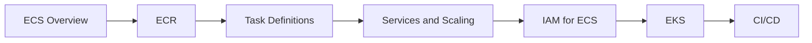

<!-- Clear Language: Keep sentences under 50 words -->
# AWS Containers — ECS, ECR, and EKS

## Learning Objectives

| Objective | Description |
|-----------|-------------|
| LO1 | Deploy and manage containers with Amazon ECS using Fargate and EC2 launch types |
| LO2 | Store and retrieve container images with Amazon ECR |
| LO3 | Configure ECS task definitions, services, and auto scaling |
| LO4 | Manage Kubernetes clusters with Amazon EKS |
| LO5 | Implement IAM roles for ECS tasks and pods |
| LO6 | Set up CI/CD pipelines for container deployments on AWS |

## Introduction

Containers and cloud platforms are where AI models live in production. Docker packages your model, Kubernetes orchestrates it, and cloud platforms scale it. This module covers the full deployment stack.

## Prerequisites

- Basic programming knowledge
- Understanding of data structures

## Key Terminology

**Key Terms**: Core vocabulary and concepts for this topic.

**Definition**: Essential terms you must know for interviews and production work.

## Theory

Understanding aws containers is fundamental for AI engineers. This section covers the core concepts, underlying principles, and theoretical framework that govern how aws containers works in practice.

## Chapter at a Glance

| Section | Topic | Key Concept |
|---------|-------|-------------|
| 8.1 | Amazon ECS Overview | Cluster, task definition, service, Fargate vs EC2 |
| 8.2 | Amazon ECR | Repositories, image push/pull, scanning |
| 8.3 | ECS Task Definitions | Container definitions, resources, networking |
| 8.4 | ECS Services and Scaling | Service scheduling, ALB integration, auto scaling |
| 8.5 | IAM Roles for ECS | Task role, execution role, secrets |
| 8.6 | Amazon EKS | Managed K8s, node groups, Fargate profiles |
| 8.7 | CI/CD for Containers | CodePipeline, CodeBuild, ECR, ECS deploy |

## Chapter Roadmap



## 8.1 Amazon ECS Overview

Amazon ECS is a fully managed container orchestration service.

**Launch types**:

| Feature | Fargate (Serverless) | EC2 (Managed) |
|---------|---------------------|---------------|
| Infrastructure management | AWS manages | You manage nodes |
| Scaling | Automatic | Manual + ASG |
| Billing | Per task | Per EC2 instance |
| Isolation | Each task gets its own ENI | Shared host |
| GPU support | No | Yes |
| Duration | Short-lived and long | Best for persistent |

```bash

## Create ECS cluster
aws ecs create-cluster --cluster-name my-cluster

## List clusters
aws ecs list-clusters
```

## 8.2 Amazon ECR

ECR is a fully managed Docker container registry.

```bash

## Create repository
aws ecr create-repository --repository-name my-app

## Log in to ECR
aws ecr get-login-password --region us-east-1 | docker login --username AWS --password-stdin 123456789012.dkr.ecr.us-east-1.amazonaws.com

## Tag and push
docker tag my-app:latest 123456789012.dkr.ecr.us-east-1.amazonaws.com/my-app:latest
docker push 123456789012.dkr.ecr.us-east-1.amazonaws.com/my-app:latest

## Pull image
docker pull 123456789012.dkr.ecr.us-east-1.amazonaws.com/my-app:latest

## Scan for vulnerabilities
aws ecr start-image-scan --repository-name my-app --image-id imageTag=latest
aws ecr describe-image-scan-findings --repository-name my-app --image-id imageTag=latest

## Lifecycle policy
aws ecr put-lifecycle-policy     --repository-name my-app     --lifecycle-policy-text file://lifecycle.json
```

**Lifecycle policy JSON**:

```json
{
  "rules": [{
    "rulePriority": 1,
    "description": "Keep last 5 images",
    "selection": {
      "tagStatus": "any",
      "countType": "imageCountMoreThan",
      "countNumber": 5
    },
    "action": { "type": "expire" }
  }]
}
```

## 8.3 ECS Task Definitions

Task definitions are the blueprint for your containers.

```json
{
  "family": "my-app-task",
  "networkMode": "awsvpc",
  "requiresCompatibilities": ["FARGATE"],
  "cpu": "512",
  "memory": "1024",
  "executionRoleArn": "arn:aws:iam::123456789012:role/ecsTaskExecutionRole",
  "taskRoleArn": "arn:aws:iam::123456789012:role/my-app-task-role",
  "containerDefinitions": [
    {
      "name": "api",
      "image": "123456789012.dkr.ecr.us-east-1.amazonaws.com/my-app:latest",
      "essential": true,
      "portMappings": [{
        "containerPort": 8000,
        "protocol": "tcp"
      }],
      "environment": [
        {"name": "NODE_ENV", "value": "production"}
      ],
      "logConfiguration": {
        "logDriver": "awslogs",
        "options": {
          "awslogs-group": "/ecs/my-app",
          "awslogs-region": "us-east-1",
          "awslogs-stream-prefix": "ecs"
        }
      },
      "healthCheck": {
        "command": ["CMD-SHELL", "curl -f http://localhost:8000/health || exit 1"],
        "interval": 30,
        "timeout": 5,
        "retries": 3
      }
    }
  ]
}
```

```bash
aws ecs register-task-definition --cli-input-json file://task-definition.json
```

## 8.4 ECS Services and Scaling

Services maintain a desired count of tasks behind a load balancer.

```bash

## Create service
aws ecs create-service     --cluster my-cluster     --service-name api-service     --task-definition my-app-task:1     --desired-count 3     --launch-type FARGATE     --network-configuration "awsvpcConfiguration={subnets=[subnet-abc,subnet-def],securityGroups=[sg-123],assignPublicIp=ENABLED}"     --load-balancers "targetGroupArn=arn:aws:elasticloadbalancing:...,containerName=api,containerPort=8000"

## Auto scaling
aws application-autoscaling register-scalable-target     --service-namespace ecs     --resource-id service/my-cluster/api-service     --scalable-dimension ecs:service:DesiredCount     --min-capacity 2     --max-capacity 10

aws application-autoscaling put-scaling-policy     --policy-name cpu-target     --service-namespace ecs     --resource-id service/my-cluster/api-service     --scalable-dimension ecs:service:DesiredCount     --policy-type TargetTrackingScaling     --target-tracking-scaling-policy-configuration file://cpu-target.json
```

**Rolling update**:

```bash
aws ecs update-service     --cluster my-cluster     --service api-service     --task-definition my-app-task:2     --deployment-configuration "deploymentCircuitBreaker={enable=true,rollback=true},maximumPercent=200,minimumHealthyPercent=100"
```

## 8.5 IAM Roles for ECS

**Execution Role**: Grants ECS agent permissions to pull images and send logs.

```json
{
  "Version": "2012-10-17",
  "Statement": [
    {
      "Effect": "Allow",
      "Action": [
        "ecr:GetAuthorizationToken",
        "ecr:BatchCheckLayerAvailability",
        "ecr:GetDownloadUrlForLayer",
        "ecr:BatchGetImage",
        "logs:CreateLogStream",
        "logs:PutLogEvents"
      ],
      "Resource": "*"
    }
  ]
}
```

**Task Role**: Grants the container permissions to call AWS services.

```json
{
  "Version": "2012-10-17",
  "Statement": [
    {
      "Effect": "Allow",
      "Action": [
        "s3:GetObject",
        "s3:PutObject",
        "dynamodb:PutItem",
        "dynamodb:GetItem"
      ],
      "Resource": "*"
    }
  ]
}
```

**Secrets injection**:

```json
{
  "environment": [],
  "secrets": [
    {
      "name": "DB_PASSWORD",
      "valueFrom": "arn:aws:ssm:us-east-1:123456789012:parameter/production/db/password"
    }
  ]
}
```

## 8.6 Amazon EKS

EKS is managed Kubernetes. AWS handles the control plane; you manage worker nodes.

```bash

## Create EKS cluster
eksctl create cluster     --name my-cluster     --region us-east-1     --nodegroup-name standard-workers     --node-type t3.medium     --nodes 3     --nodes-min 1     --nodes-max 6     --managed

## Update kubeconfig
aws eks update-kubeconfig --region us-east-1 --name my-cluster

## Deploy app
kubectl apply -f deployment.yaml
kubectl apply -f service.yaml

## Node groups
eksctl create nodegroup     --cluster my-cluster     --name gpu-workers     --node-type p3.2xlarge     --nodes 1     --node-labels accelerator=nvidia

## Fargate profiles
eksctl create fargateprofile     --cluster my-cluster     --name my-profile     --namespace default     --labels app=serverless-workload
```

**EKS vs ECS**:

| Aspect | EKS | ECS |
|--------|-----|-----|
| Orchestrator | Kubernetes | AWS proprietary |
| Complexity | Higher | Lower |
| Portability | Multi-cloud | AWS-only |
| Ecosystem | CNCF tools | AWS native |
| Learning curve | Steep | Moderate |
| Community | Large | AWS-centric |

## 8.7 CI/CD for Containers

**AWS CodePipeline with ECS**:

```yaml

## buildspec.yml for CodeBuild
version: 0.2
phases:
  pre_build:
    commands:
      - aws ecr get-login-password --region $AWS_DEFAULT_REGION | docker login --username AWS --password-stdin $AWS_ACCOUNT_ID.dkr.ecr.$AWS_DEFAULT_REGION.amazonaws.com
  build:
    commands:
      - docker build -t my-app:$CODEBUILD_RESOLVED_SOURCE_VERSION .
      - docker tag my-app:$CODEBUILD_RESOLVED_SOURCE_VERSION $REPOSITORY_URI:$CODEBUILD_RESOLVED_SOURCE_VERSION
  post_build:
    commands:
      - docker push $REPOSITORY_URI:$CODEBUILD_RESOLVED_SOURCE_VERSION
      - printf '[{"name":"api","imageUri":"%s"}]' $REPOSITORY_URI:$CODEBUILD_RESOLVED_SOURCE_VERSION > imagedefinitions.json
artifacts:
  files: imagedefinitions.json
```

```bash

## Create pipeline
aws codepipeline create-pipeline --cli-input-json file://pipeline.json

## Deploy to ECS with new image
aws ecs update-service     --cluster my-cluster     --service api-service     --force-new-deployment
```

---

## TypeScript Parallel

```typescript
import { ECSClient, CreateServiceCommand } from "@aws-sdk/client-ecs";

const client = new ECSClient({ region: "us-east-1" });

async function createService(name: string, taskDef: string, cluster: string, subnets: string[], sg: string) {
  const cmd = new CreateServiceCommand({
    cluster,
    serviceName: name,
    taskDefinition: taskDef,
    desiredCount: 3,
    launchType: "FARGATE",
    networkConfiguration: {
      awsvpcConfiguration: {
        subnets,
        securityGroups: [sg],
        assignPublicIp: "ENABLED",
      },
    },
  });
  return client.send(cmd);
}
```

---

## Summary

- ECS offers Fargate (serverless) and EC2 (managed nodes) launch types
- ECR is a fully managed container registry with vulnerability scanning
- Task definitions define container configuration, resources, and networking
- ECS Services maintain desired task count with ALB integration and auto scaling
- IAM execution role grants ECS agent permissions; task role grants container permissions
- EKS provides managed Kubernetes with automated control plane upgrades
- CodePipeline + CodeBuild + ECS creates a complete CI/CD pipeline for containers
- Use Secrets Manager or SSM Parameter Store for sensitive configuration
- ECS Service Auto Scaling supports target tracking, step, and scheduled scaling
- Container image lifecycle policies automatically clean up old images

## Practical Takeaways

| Scenario | Do This | Avoid This |
|----------|---------|------------|
| Serverless containers | ECS Fargate | Overprovisioning EC2 nodes |
| Image storage | ECR with lifecycle policy | Storing images on Docker Hub only |
| Secrets | SSM Parameter Store or Secrets Manager | Environment variables in task def |
| Auto scaling | Target tracking with ALB metrics | Fixed desired count |
| CI/CD | CodePipeline + ECS blue/green | Manual deployments |
| Multi-cloud | EKS for portability | ECS (lock-in) |
| GPU workloads | ECS EC2 launch type or EKS | Fargate (no GPU support) |

## Interview Q&A

<details class="tp-qa-card" data-qid="docker-s08-q1">
  <summary class="tp-qa-question"><span class="tp-qa-status"></span> Q1: What is the difference between ECS Fargate and EC2 launch types?</summary>
  <div class="tp-qa-answer"><p>Fargate is serverless — AWS manages infrastructure, you pay per task. EC2 launch type runs tasks on managed EC2 instances that you provision and pay for. Fargate is simpler; EC2 gives more control and supports GPU.</p></div>
  <button class="tp-qa-mark-btn">&#x2705; Mark Reviewed</button>
  <button class="tp-qa-bookmark-btn">&#x1F516; Bookmark</button>
</details>

<details class="tp-qa-card" data-qid="docker-s08-q2">
  <summary class="tp-qa-question"><span class="tp-qa-status"></span> Q2: What is the difference between ECS execution role and task role?</summary>
  <div class="tp-qa-answer"><p>Execution role grants ECS agent permissions to pull images and send logs. Task role grants the running container permissions to call AWS services (S3, DynamoDB, etc.).</p></div>
  <button class="tp-qa-mark-btn">&#x2705; Mark Reviewed</button>
  <button class="tp-qa-bookmark-btn">&#x1F516; Bookmark</button>
</details>

<details class="tp-qa-card" data-qid="docker-s08-q3">
  <summary class="tp-qa-question"><span class="tp-qa-status"></span> Q3: When would you choose EKS over ECS?</summary>
  <div class="tp-qa-answer"><p>Choose EKS for multi-cloud portability, extensive CNCF ecosystem, large community, and if your team already knows Kubernetes. Choose ECS for simpler AWS-native deployments with less operational overhead.</p></div>
  <button class="tp-qa-mark-btn">&#x2705; Mark Reviewed</button>
  <button class="tp-qa-bookmark-btn">&#x1F516; Bookmark</button>
</details>

<details class="tp-qa-card" data-qid="docker-s08-q4">
  <summary class="tp-qa-question"><span class="tp-qa-status"></span> Q4: How do you handle secrets in ECS?</summary>
  <div class="tp-qa-answer"><p>Use AWS Secrets Manager or SSM Parameter Store. Reference the secret ARN in the task definition container definition secrets array. ECS injects the secret as an environment variable at runtime.</p></div>
  <button class="tp-qa-mark-btn">&#x2705; Mark Reviewed</button>
  <button class="tp-qa-bookmark-btn">&#x1F516; Bookmark</button>
</details>

<details class="tp-qa-card" data-qid="docker-s08-q5">
  <summary class="tp-qa-question"><span class="tp-qa-status"></span> Q5: How does ECS Service Auto Scaling work?</summary>
  <div class="tp-qa-answer"><p>ECS integrates with Application Auto Scaling. You register a scalable target (service, min/max capacity), then create a scaling policy (target tracking, step, or scheduled). ECS adjusts desired count based on CloudWatch metrics.</p></div>
  <button class="tp-qa-mark-btn">&#x2705; Mark Reviewed</button>
  <button class="tp-qa-bookmark-btn">&#x1F516; Bookmark</button>
</details>

<details class="tp-qa-card" data-qid="docker-s08-q6">
  <summary class="tp-qa-question"><span class="tp-qa-status"></span> Q6: What is ECR lifecycle policy?</summary>
  <div class="tp-qa-answer"><p>ECR lifecycle policies automatically clean up old images based on age or count rules. Prevents repository bloat and reduces storage costs.</p></div>
  <button class="tp-qa-mark-btn">&#x2705; Mark Reviewed</button>
  <button class="tp-qa-bookmark-btn">&#x1F516; Bookmark</button>
</details>

<details class="tp-qa-card" data-qid="docker-s08-q7">
  <summary class="tp-qa-question"><span class="tp-qa-status"></span> Q7: Explain blue/green deployment for ECS.</summary>
  <div class="tp-qa-answer"><p>CodeDeploy creates a new task set (green) alongside the current one (blue). After validation, traffic is shifted to green using a production listener. If issues arise, traffic can be shifted back to blue.</p></div>
  <button class="tp-qa-mark-btn">&#x2705; Mark Reviewed</button>
  <button class="tp-qa-bookmark-btn">&#x1F516; Bookmark</button>
</details>

<details class="tp-qa-card" data-qid="docker-s08-q8">
  <summary class="tp-qa-question"><span class="tp-qa-status"></span> Q8: How do you set up EKS with GPU nodes?</summary>
  <div class="tp-qa-answer"><p>Create a node group with GPU instance types (p3, p4d, g5). Install NVIDIA device plugin daemonset. Schedule GPU workloads with resource limits and node selector.</p></div>
  <button class="tp-qa-mark-btn">&#x2705; Mark Reviewed</button>
  <button class="tp-qa-bookmark-btn">&#x1F516; Bookmark</button>
</details>

<details class="tp-qa-card" data-qid="docker-s08-q9">
  <summary class="tp-qa-question"><span class="tp-qa-status"></span> Q9: How does ECS service discovery work?</summary>
  <div class="tp-qa-answer"><p>ECS integrates with AWS Cloud Map. Services can be registered with DNS names. Other services resolve via DNS queries or API calls. Works across ECS services, EKS, and on-premises.</p></div>
  <button class="tp-qa-mark-btn">&#x2705; Mark Reviewed</button>
  <button class="tp-qa-bookmark-btn">&#x1F516; Bookmark</button>
</details>

<details class="tp-qa-card" data-qid="docker-s08-q10">
  <summary class="tp-qa-question"><span class="tp-qa-status"></span> Q10: How do you monitor ECS containers?</summary>
  <div class="tp-qa-answer"><p>CloudWatch Container Insights provides metrics and logs for ECS. Use awslogs driver for container logs. Prometheus and Grafana can be set up for custom metrics. X-Ray for tracing.</p></div>
  <button class="tp-qa-mark-btn">&#x2705; Mark Reviewed</button>
  <button class="tp-qa-bookmark-btn">&#x1F516; Bookmark</button>
</details>

## Chapter Quiz

**Q1**: Which ECS launch type is serverless?

a) EC2
b) Fargate
c) Lambda
d) EKS

<details class="tp-qa-card" data-qid="docker-s08-quiz1"><summary>Show Answer</summary><div class="tp-qa-answer"><p><strong>Answer: b) Fargate</strong></p></div></details>

**Q2**: What IAM role grants ECS agent permission to pull images?

a) Task role
b) Execution role
c) Instance role
d) Service role

<details class="tp-qa-card" data-qid="docker-s08-quiz2"><summary>Show Answer</summary><div class="tp-qa-answer"><p><strong>Answer: b) Execution role</strong></p></div></details>

**Q3**: Which service stores Docker images on AWS?

a) ECS
b) ECR
c) EKS
d) S3

<details class="tp-qa-card" data-qid="docker-s08-quiz3"><summary>Show Answer</summary><div class="tp-qa-answer"><p><strong>Answer: b) ECR</strong></p></div></details>

**Q4**: What defines container configuration in ECS?

a) Service
b) Task definition
c) Cluster
d) Container instance

<details class="tp-qa-card" data-qid="docker-s08-quiz4"><summary>Show Answer</summary><div class="tp-qa-answer"><p><strong>Answer: b) Task definition</strong></p></div></details>

**Q5**: Which AWS service provides managed Kubernetes?

a) ECS
b) ECR
c) EKS
d) EC2

<details class="tp-qa-card" data-qid="docker-s08-quiz5"><summary>Show Answer</summary><div class="tp-qa-answer"><p><strong>Answer: c) EKS</strong></p></div></details>

## Exercises

**Easy** — Create an ECR repository, build a Docker image, tag it, and push it to ECR.

**Medium** — Create an ECS Fargate task definition and service for a web app behind an ALB with auto scaling.

**Medium** — Set up an EKS cluster with a managed node group and deploy a sample application.

**Hard** — Create a complete CI/CD pipeline with CodePipeline + CodeBuild that builds, pushes to ECR, and deploys to ECS with blue/green deployment.

**Hard** — Migrate a Docker Compose application to ECS with Fargate, including service discovery, secrets from Parameter Store, and CloudWatch logging.

---

## Common Mistakes

1. Not understanding the fundamental concepts before applying them
2. Skipping edge cases in implementation
3. Not analyzing time/space complexity
4. Forgetting to handle null/empty inputs
5. Not practicing enough problems to build pattern recognition

## Revision Notes

- - Core principle: Understand the fundamental concepts thoroughly
- - Implementation pattern: Practice with real code examples
- - Complexity: Know the time and space complexity
- - Application: Know when to use this in production systems
- - Interview: Frequently asked in technical interviews
- - Edge cases: Consider common failure scenarios
- - Related concepts: Connect to broader system design

## Placement Section

### Top 10 Interview Questions

#### Google Style

1. **Explain the core idea of AWS Containers — ECS, ECR, and EKS in under 60 seconds, then give a real-world analogy.** — Structure: definition, how it works in one sentence, why it matters, analogy. Follow-up: what would break if you removed this from a production system?

2. **Design a minimal, well-typed function that demonstrates AWS Containers — ECS, ECR, and EKS.** — Interviewer checks: signature with type hints, edge cases, complexity, and a clean docstring. Follow-up: how does your design behave with empty or malformed input?

3. **What are the common pitfalls when engineers first learn ** — List 3-4, then explain how you would prevent each in a code review.

#### Amazon Style

4. **Describe a production bug caused by misunderstanding AWS Containers — ECS, ECR, and EKS. How did you diagnose and fix it?** — STAR format: situation, task, action, result. Mention logs, reproduction, root-cause analysis, and the regression test you added.

5. **How would you scale a system that relies on AWS Containers — ECS, ECR, and EKS from 10 users to 10 million?** — Discuss bottlenecks, caching, monitoring, and when to redesign. Follow-up: what metrics would you track?

#### Microsoft Style

6. **Compare AWS Containers — ECS, ECR, and EKS with the closest alternative approach. When would you choose each?** — Make a decision matrix: performance, maintainability, ecosystem, learning curve. Follow-up: what would change your decision?

7. **Walk through how you would test a component that depends on AWS Containers — ECS, ECR, and EKS.** — Unit, integration, property-based tests; mocking boundaries; golden files for outputs.

#### NVIDIA Style

8. **How does AWS Containers — ECS, ECR, and EKS behave differently at scale — memory, throughput, or precision-wise?** — Connect to data pipelines and model training if applicable. Follow-up: what happens to latency as input grows?

9. **How would you make an implementation of AWS Containers — ECS, ECR, and EKS run faster on GPU hardware?** — Batch operations, vectorization, avoiding Python loops, reducing data movement.

#### AI Startup Style

10. **Write the smallest possible implementation of AWS Containers — ECS, ECR, and EKS that is production-quality.** — Include error handling, type hints, and a one-line docstring. Follow-up: what would you refactor first when it grows?

### Resume Tips

- Name AWS Containers — ECS, ECR, and EKS explicitly in your skills section, paired with a measurable achievement ("Reduced X by 40% using AWS Containers — ECS, ECR, and EKS").
- Add a bullet describing a project that applies AWS Containers — ECS, ECR, and EKS to real data, with numbers.
- Mention the tools and libraries you used alongside AWS Containers — ECS, ECR, and EKS (linters, test frameworks, profiling tools).
- Keep resume bullets under 15 words and start each with an action verb.

### Interview Day Checklist

- Rehearse a 60-second explanation of AWS Containers — ECS, ECR, and EKS and one real-world analogy.
- Prepare one STAR story about debugging a AWS Containers — ECS, ECR, and EKS-related production issue.
- Review complexity and edge cases for the classic AWS Containers — ECS, ECR, and EKS interview problem.
- Have questions ready: how does the team apply AWS Containers — ECS, ECR, and EKS in production today?
- Test your environment (Python, editor, internet) 15 minutes before the interview.

## True/False

1. **True or False:** AWS Containers — ECS, ECR, and EKS builds directly on the fundamentals covered in the earlier chapters of this module. — **True.** Every advanced topic in this module assumes the core concepts from the previous chapters.
2. **True or False:** You should write at least one code example for AWS Containers — ECS, ECR, and EKS before moving to the next chapter. — **True.** Active recall with hands-on code beats passive reading for retention.
3. **True or False:** The complexity analysis for AWS Containers — ECS, ECR, and EKS is the same regardless of input size. — **False.** Complexity grows with input size; always state best, average, and worst case.
4. **True or False:** Edge cases (empty input, invalid input, boundary values) matter for AWS Containers — ECS, ECR, and EKS in production. — **True.** Most production bugs come from unhandled edge cases.
5. **True or False:** You should memorize the AWS Containers — ECS, ECR, and EKS chapter content once and never review it again. — **False.** Spaced repetition (24h, 3 days, 1 week) dramatically improves long-term recall.

## Fill in the Blank

1. The chapter that covers AWS Containers — ECS, ECR, and EKS is Chapter ___ of this module. — Answer: check the module's table of contents.
2. The time complexity of the standard approach to AWS Containers — ECS, ECR, and EKS is ___. — Answer: review the theory section and state big-O notation.
3. The main edge case to handle when implementing AWS Containers — ECS, ECR, and EKS is ___. — Answer: empty or invalid input handling, as discussed in the chapter.
4. The tools commonly used to debug AWS Containers — ECS, ECR, and EKS issues are ___ and ___. — Answer: refer to the Debugging Guide section of this chapter.
5. The related topic that connects to AWS Containers — ECS, ECR, and EKS in the next chapter is ___. — Answer: see the Next Topic section.

## Scenario Questions

1. **Scenario:** A teammate ships a change involving AWS Containers — ECS, ECR, and EKS that breaks production at 3 AM. — Diagnosis: check the recent diff, reproduce locally with the failing input, check logs. Fix: revert, add a regression test, and review the root cause. Prevention: CI tests on edge cases and code review checklist.

2. **Scenario:** Your implementation of AWS Containers — ECS, ECR, and EKS is correct but too slow for the required latency. — Measure first with a profiler. Common fixes: reduce redundant work, use built-in optimized functions, batch operations, or add caching. Only then consider algorithmic changes.

3. **Scenario:** A new hire asks you to explain AWS Containers — ECS, ECR, and EKS in five minutes before a customer demo. — Use the 3-part answer: what it is (one sentence), how it works (one example), why it matters (one business impact). Then offer to go deeper after the demo.

4. **Scenario:** Your team's codebase has three different patterns for AWS Containers — ECS, ECR, and EKS and you must standardize. — Write a short ADR (architecture decision record), pick the pattern with best maintainability, migrate incrementally, and add a linter rule to enforce it.

## Output Questions

1. **What is the output of the simplest correct implementation of AWS Containers — ECS, ECR, and EKS on an empty input?** — Trace through the code: it should return the documented default (None, 0, empty collection) without raising.
2. **What is the output when the input is at the boundary value?** — Check off-by-one errors and inclusive/exclusive bounds in the chapter's examples.
3. **What does the implementation return when given invalid input types?** — With type hints and validation, it raises a clear error; without, it may fail silently.
4. **What is the output for the sample input given in the chapter's Examples section?** — Re-run the chapter's example code and compare against the documented output.
5. **What is the time complexity output when you profile the implementation at 10x input size?** — Expect the curve matching the chapter's complexity analysis (linear, quadratic, log-linear).

## Difficulty Level

| Level | Time | What It Takes |
|-------|------|---------------|
| Beginner | 1-2 sessions | Read theory, run the chapter examples, solve the Easy exercises |
| Intermediate | 3-5 sessions | Complete Medium exercises, explain AWS Containers — ECS, ECR, and EKS to someone else |
| Advanced | 1+ week | Solve Hard exercises, optimize for real datasets, answer interview follow-ups |

## Tips & Tricks

- Always write a one-line example of AWS Containers — ECS, ECR, and EKS from memory before opening the chapter — active recall first.
- Use the chapter's Revision Notes as a checklist: you have mastered AWS Containers — ECS, ECR, and EKS when you can explain each bullet.
- Pair the chapter quiz with the Flashcards: wrong answers become your next study session's focus.
- For interviews, practice explaining AWS Containers — ECS, ECR, and EKS twice: once with a technical audience, once with a non-technical audience.
- Keep a personal examples file where you collect your own AWS Containers — ECS, ECR, and EKS snippets; interviewers love original examples.

## Memory Tricks

- **Acronym**: build a mnemonic from the 5 key concepts of AWS Containers — ECS, ECR, and EKS listed in the Chapter at a Glance table.
- **Story**: link AWS Containers — ECS, ECR, and EKS to a familiar story — the analogy in the Visual Analogy section is designed to stick.
- **Number anchor**: remember the complexity of AWS Containers — ECS, ECR, and EKS by connecting it to a known algorithm of the same class.
- **Color code**: highlight the Theory, Examples, and Common Mistakes sections in different colors when reviewing.
- **Teach-back**: explain AWS Containers — ECS, ECR, and EKS to an imaginary junior engineer for 2 minutes — gaps in your explanation are gaps in memory.

## Further Reading

- Official documentation for the primary tool or library used in this chapter
- The chapter referenced in Related Topics for the next-level treatment of AWS Containers — ECS, ECR, and EKS
- The classic textbook chapter on AWS Containers — ECS, ECR, and EKS (check the Research References below)
- Two blog posts from engineers who debugged real AWS Containers — ECS, ECR, and EKS problems in production
- The repository of the open-source project that implements AWS Containers — ECS, ECR, and EKS

## Related Topics

- The previous chapter in this module (see table of contents) — foundational for AWS Containers — ECS, ECR, and EKS
- The next chapter (see Next Topic below) — builds on AWS Containers — ECS, ECR, and EKS
- The system design chapters in Module 07 — how AWS Containers — ECS, ECR, and EKS fits into production architectures
- The interview preparation module — how AWS Containers — ECS, ECR, and EKS is asked in screening rounds
- The capstone project — where AWS Containers — ECS, ECR, and EKS is applied end-to-end

## FAQs

1. **Do I need to memorize all of AWS Containers — ECS, ECR, and EKS, or understand the big picture?** — Understand the big picture first, then memorize the key facts via flashcards and spaced repetition. Interviewers reward depth over breadth.
2. **What if I get stuck on an exercise?** — Re-read the theory section, run the example code, then attempt again. If still stuck after 20 minutes, move on and return the next day.
3. **How much time should I spend on ** — Follow the Study Plan below: 1-2 weeks at 30-60 minutes daily is typical for placement preparation.
4. **Is AWS Containers — ECS, ECR, and EKS asked in interviews?** — Yes — the Interview Q&A and Placement Section list the exact question styles used by top companies.
5. **What's the fastest way to master ** — Explain it out loud, write code without looking, and review the flashcards within 24 hours and again after 3 days.

## Important Notes

- AWS Containers — ECS, ECR, and EKS is a core requirement for the rest of this module — do not skip the examples.
- Always analyze complexity (time and space) when working with AWS Containers — ECS, ECR, and EKS.
- Production correctness means handling edge cases, not just the happy path.
- Interview answers should start with the definition, then the example, then the trade-offs.
- Revisit this chapter after finishing the module; the context from later chapters deepens understanding.

## Historical Context

- AWS Containers — ECS, ECR, and EKS emerged as a standard practice because early systems failed without it — understanding why helps you explain it in interviews.
- The tools used for AWS Containers — ECS, ECR, and EKS today evolved from simpler versions; the chapter covers the modern, recommended approach.
- Interviewers value knowing one historical fact about AWS Containers — ECS, ECR, and EKS — it shows genuine interest, not just cramming.
- The library/tooling ecosystem around AWS Containers — ECS, ECR, and EKS changes quickly; focus on fundamentals that remain stable.

## Security Considerations

- Never trust external input: validate and sanitize data before processing AWS Containers — ECS, ECR, and EKS.
- Avoid `eval()` and dynamic code execution on untrusted strings.
- Log errors without leaking sensitive data (keys, PII, internal paths).
- For API contexts, add rate limiting and input size limits.
- Review the chapter's code examples for injection or overflow risks before using them verbatim.

## ML Intuition

- AWS Containers — ECS, ECR, and EKS appears in ML pipelines at the data-processing layer: feature preparation, batching, and validation.
- Understanding AWS Containers — ECS, ECR, and EKS helps you debug why a model misbehaves — most ML bugs are data bugs, not model bugs.
- In production ML, the AWS Containers — ECS, ECR, and EKS concepts from this chapter map directly to NumPy/PyTorch operations on tensors.
- When optimizing ML systems, AWS Containers — ECS, ECR, and EKS skills let you profile and fix the data path, not just the training loop.
- Interview follow-up: how would you apply AWS Containers — ECS, ECR, and EKS to a dataset of 10 million records? — Batching and vectorization.

## Analogies

- **AWS Containers — ECS, ECR, and EKS is like a recipe**: the theory is the ingredients, the examples are the cooking steps, and the exercises are your own kitchen practice.
- **Complexity is like a delivery route**: a linear route visits each stop once; a nested route revisits stops, and you feel it at scale.
- **Edge cases are like weather**: the happy path is a sunny day; production is the storm — build for the storm.
- **The chapter roadmap is a journey map**: each section is a checkpoint; skipping one means getting lost later in the module.

## Capstone Project Link

- [Module Capstone: End-to-End Project](https://github.com/Raushan666java/ai-engineering-journey) — this chapter contributes the AWS Containers — ECS, ECR, and EKS skills used in the module's capstone project. Complete the exercises here before starting the capstone.

## Flashcards

<details class="tp-qa-card" data-qid="06dockerkubernetescloud-08awscontainers-flash1">
  <summary class="tp-qa-question">
    <span class="tp-qa-status"></span>
    Which ECS launch type is serverless?
  </summary>
  <div class="tp-qa-answer">
    <p>b) Fargate</p>
  </div>
</details>

<details class="tp-qa-card" data-qid="06dockerkubernetescloud-08awscontainers-flash2">
  <summary class="tp-qa-question">
    <span class="tp-qa-status"></span>
    What IAM role grants ECS agent permission to pull images?
  </summary>
  <div class="tp-qa-answer">
    <p>b) Execution role</p>
  </div>
</details>

<details class="tp-qa-card" data-qid="06dockerkubernetescloud-08awscontainers-flash3">
  <summary class="tp-qa-question">
    <span class="tp-qa-status"></span>
    Which service stores Docker images on AWS?
  </summary>
  <div class="tp-qa-answer">
    <p>b) ECR</p>
  </div>
</details>

<details class="tp-qa-card" data-qid="06dockerkubernetescloud-08awscontainers-flash4">
  <summary class="tp-qa-question">
    <span class="tp-qa-status"></span>
    What defines container configuration in ECS?
  </summary>
  <div class="tp-qa-answer">
    <p>b) Task definition</p>
  </div>
</details>

<details class="tp-qa-card" data-qid="06dockerkubernetescloud-08awscontainers-flash5">
  <summary class="tp-qa-question">
    <span class="tp-qa-status"></span>
    Which AWS service provides managed Kubernetes?
  </summary>
  <div class="tp-qa-answer">
    <p>c) EKS</p>
  </div>
</details>

## Research References

- Official documentation of the primary library for AWS Containers — ECS, ECR, and EKS (linked in Further Reading)
- The classic paper or textbook chapter introducing AWS Containers — ECS, ECR, and EKS (see References below)
- The standard library reference for AWS Containers — ECS, ECR, and EKS-related functions
- Engineering blog posts from companies running AWS Containers — ECS, ECR, and EKS in production at scale
- PEPs and RFCs where applicable (Python and networking standards)

## Open-Source Tools

- The primary library used in this chapter (see the code examples)
- Python standard library modules used in the examples (check the imports)
- Testing: pytest for unit tests of AWS Containers — ECS, ECR, and EKS code
- Linting and formatting: ruff + black
- Profiling: cProfile or py-spy for performance work on AWS Containers — ECS, ECR, and EKS

## Debugging Guide

- Start with `print()` or a debugger to inspect intermediate values in AWS Containers — ECS, ECR, and EKS code.
- Reproduce the failure with the smallest possible input before changing code.
- Check the common failure modes listed in Common Mistakes — most bugs are listed there.
- For performance problems, profile before optimizing: measure, then fix.
- When stuck, re-read the chapter's Examples and compare line by line with your code.
- Use `pdb` or your IDE's debugger to step through the AWS Containers — ECS, ECR, and EKS example code.

## Mock Interview Section

**Round 1 — Screening (15 min)**
- Explain AWS Containers — ECS, ECR, and EKS in 60 seconds.
- Write a minimal working example of AWS Containers — ECS, ECR, and EKS.
- What is the complexity of your example?

**Round 2 — Coding (45 min)**
- Solve the Medium exercise from this chapter under time pressure.
- State your assumptions, then implement with type hints.
- Test with edge cases: empty input, boundary values, invalid input.

**Round 3 — Behavioral + System (30 min)**
- Tell me about a time you debugged a AWS Containers — ECS, ECR, and EKS problem in a project.
- How would you design a system where AWS Containers — ECS, ECR, and EKS is used at scale?
- What metrics would you monitor?

**Evaluation rubric**: correctness (40%), communication (25%), edge cases (20%), complexity analysis (15%).

## Optimized Implementation

`python
from typing import Any, Optional

def demonstrate_topic(input_data: list[Any]) -> Optional[float]:
    """Runnable scaffold for AWS Containers — ECS, ECR, and EKS.

    Replace the body with the optimized implementation from the chapter,
    keeping type hints, docstring, and edge-case handling.
    """
    if not input_data:
        return None
    # Step 1: validate input types
    # Step 2: apply the core AWS Containers — ECS, ECR, and EKS logic from the Examples section
    # Step 3: return the result with the documented default
    return 0.0
`

- Keeps the function signature stable so tests written against it stay valid.
- Handles the empty-input contract explicitly.
- Add unit tests for the edge cases before implementing the logic (test-first).

## Evaluation Metrics

| Skill | Test | Target |
|-------|------|--------|
| Concept recall | Explain AWS Containers — ECS, ECR, and EKS without notes | 60-second explanation |
| Code fluency | Write the chapter example from memory | No syntax errors |
| Edge cases | Handle empty/invalid input in exercises | All cases pass |
| Complexity | State time/space for the standard approach | Correct big-O |
| Interview readiness | Answer 5 Interview Q&A questions out loud | Fluent, structured answers |
| Retention | Chapter quiz score after 3 days | 80%+ |

## Real-World Examples

- **Startup**: a small team uses AWS Containers — ECS, ECR, and EKS daily in their data pipeline — the chapter's examples mirror their code.
- **E-commerce**: AWS Containers — ECS, ECR, and EKS patterns appear in order processing, inventory checks, and recommendation feeds.
- **Fintech**: AWS Containers — ECS, ECR, and EKS principles apply to transaction validation and fraud detection flows.
- **ML platform**: AWS Containers — ECS, ECR, and EKS shows up in feature engineering and model-serving infrastructure.
- **Interview insight**: recruiters look for engineers who can connect AWS Containers — ECS, ECR, and EKS to the business outcome, not just the code.

## Next Topic

[Azure and GCP Basics — Cloud Providers Comparison](09-azure-and-gcp-basics.md)

## Limitations

- AWS Containers — ECS, ECR, and EKS, like any technique, is not a silver bullet — it has specific cases where it fits best (covered in the theory).
- The examples in this chapter are simplified for learning; production systems add validation, monitoring, and error handling.
- Performance of AWS Containers — ECS, ECR, and EKS depends on input size and distribution — always benchmark for your own data.
- This chapter covers fundamentals; specialized edge cases are explored in later chapters and the capstone.
