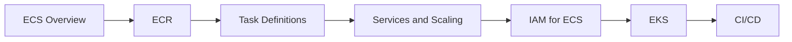

# AWS Containers — ECS, ECR, and EKS

## Learning Objectives

| Objective | Description |
|-----------|-------------|
| LO1 | Deploy and manage containers with Amazon ECS using Fargate and EC2 launch types |
| LO2 | Store and retrieve container images with Amazon ECR |
| LO3 | Configure ECS task definitions, services, and auto scaling |
| LO4 | Manage Kubernetes clusters with Amazon EKS |
| LO5 | Implement IAM roles for ECS tasks and pods |
| LO6 | Set up CI/CD pipelines for container deployments on AWS |

## Introduction

06-docker-kubernetes-cloud is a fundamental concept in AI engineering. This chapter covers the core principles, practical implementations, and interview preparation for mastering this topic.

## Prerequisites

- Basic programming knowledge
- Understanding of data structures
## Chapter at a Glance

| Section | Topic | Key Concept |
|---------|-------|-------------|
| 8.1 | Amazon ECS Overview | Cluster, task definition, service, Fargate vs EC2 |
| 8.2 | Amazon ECR | Repositories, image push/pull, scanning |
| 8.3 | ECS Task Definitions | Container definitions, resources, networking |
| 8.4 | ECS Services and Scaling | Service scheduling, ALB integration, auto scaling |
| 8.5 | IAM Roles for ECS | Task role, execution role, secrets |
| 8.6 | Amazon EKS | Managed K8s, node groups, Fargate profiles |
| 8.7 | CI/CD for Containers | CodePipeline, CodeBuild, ECR, ECS deploy |

## Chapter Roadmap



## 8.1 Amazon ECS Overview

Amazon ECS is a fully managed container orchestration service.

**Launch types**:

| Feature | Fargate (Serverless) | EC2 (Managed) |
|---------|---------------------|---------------|
| Infrastructure management | AWS manages | You manage nodes |
| Scaling | Automatic | Manual + ASG |
| Billing | Per task | Per EC2 instance |
| Isolation | Each task gets its own ENI | Shared host |
| GPU support | No | Yes |
| Duration | Short-lived and long | Best for persistent |

```bash
# Create ECS cluster
aws ecs create-cluster --cluster-name my-cluster

# List clusters
aws ecs list-clusters
```

## 8.2 Amazon ECR

ECR is a fully managed Docker container registry.

```bash
# Create repository
aws ecr create-repository --repository-name my-app

# Log in to ECR
aws ecr get-login-password --region us-east-1 | docker login --username AWS --password-stdin 123456789012.dkr.ecr.us-east-1.amazonaws.com

# Tag and push
docker tag my-app:latest 123456789012.dkr.ecr.us-east-1.amazonaws.com/my-app:latest
docker push 123456789012.dkr.ecr.us-east-1.amazonaws.com/my-app:latest

# Pull image
docker pull 123456789012.dkr.ecr.us-east-1.amazonaws.com/my-app:latest

# Scan for vulnerabilities
aws ecr start-image-scan --repository-name my-app --image-id imageTag=latest
aws ecr describe-image-scan-findings --repository-name my-app --image-id imageTag=latest

# Lifecycle policy
aws ecr put-lifecycle-policy     --repository-name my-app     --lifecycle-policy-text file://lifecycle.json
```

**Lifecycle policy JSON**:

```json
{
  "rules": [{
    "rulePriority": 1,
    "description": "Keep last 5 images",
    "selection": {
      "tagStatus": "any",
      "countType": "imageCountMoreThan",
      "countNumber": 5
    },
    "action": { "type": "expire" }
  }]
}
```

## 8.3 ECS Task Definitions

Task definitions are the blueprint for your containers.

```json
{
  "family": "my-app-task",
  "networkMode": "awsvpc",
  "requiresCompatibilities": ["FARGATE"],
  "cpu": "512",
  "memory": "1024",
  "executionRoleArn": "arn:aws:iam::123456789012:role/ecsTaskExecutionRole",
  "taskRoleArn": "arn:aws:iam::123456789012:role/my-app-task-role",
  "containerDefinitions": [
    {
      "name": "api",
      "image": "123456789012.dkr.ecr.us-east-1.amazonaws.com/my-app:latest",
      "essential": true,
      "portMappings": [{
        "containerPort": 8000,
        "protocol": "tcp"
      }],
      "environment": [
        {"name": "NODE_ENV", "value": "production"}
      ],
      "logConfiguration": {
        "logDriver": "awslogs",
        "options": {
          "awslogs-group": "/ecs/my-app",
          "awslogs-region": "us-east-1",
          "awslogs-stream-prefix": "ecs"
        }
      },
      "healthCheck": {
        "command": ["CMD-SHELL", "curl -f http://localhost:8000/health || exit 1"],
        "interval": 30,
        "timeout": 5,
        "retries": 3
      }
    }
  ]
}
```

```bash
aws ecs register-task-definition --cli-input-json file://task-definition.json
```

## 8.4 ECS Services and Scaling

Services maintain a desired count of tasks behind a load balancer.

```bash
# Create service
aws ecs create-service     --cluster my-cluster     --service-name api-service     --task-definition my-app-task:1     --desired-count 3     --launch-type FARGATE     --network-configuration "awsvpcConfiguration={subnets=[subnet-abc,subnet-def],securityGroups=[sg-123],assignPublicIp=ENABLED}"     --load-balancers "targetGroupArn=arn:aws:elasticloadbalancing:...,containerName=api,containerPort=8000"

# Auto scaling
aws application-autoscaling register-scalable-target     --service-namespace ecs     --resource-id service/my-cluster/api-service     --scalable-dimension ecs:service:DesiredCount     --min-capacity 2     --max-capacity 10

aws application-autoscaling put-scaling-policy     --policy-name cpu-target     --service-namespace ecs     --resource-id service/my-cluster/api-service     --scalable-dimension ecs:service:DesiredCount     --policy-type TargetTrackingScaling     --target-tracking-scaling-policy-configuration file://cpu-target.json
```

**Rolling update**:

```bash
aws ecs update-service     --cluster my-cluster     --service api-service     --task-definition my-app-task:2     --deployment-configuration "deploymentCircuitBreaker={enable=true,rollback=true},maximumPercent=200,minimumHealthyPercent=100"
```

## 8.5 IAM Roles for ECS

**Execution Role**: Grants ECS agent permissions to pull images and send logs.

```json
{
  "Version": "2012-10-17",
  "Statement": [
    {
      "Effect": "Allow",
      "Action": [
        "ecr:GetAuthorizationToken",
        "ecr:BatchCheckLayerAvailability",
        "ecr:GetDownloadUrlForLayer",
        "ecr:BatchGetImage",
        "logs:CreateLogStream",
        "logs:PutLogEvents"
      ],
      "Resource": "*"
    }
  ]
}
```

**Task Role**: Grants the container permissions to call AWS services.

```json
{
  "Version": "2012-10-17",
  "Statement": [
    {
      "Effect": "Allow",
      "Action": [
        "s3:GetObject",
        "s3:PutObject",
        "dynamodb:PutItem",
        "dynamodb:GetItem"
      ],
      "Resource": "*"
    }
  ]
}
```

**Secrets injection**:

```json
{
  "environment": [],
  "secrets": [
    {
      "name": "DB_PASSWORD",
      "valueFrom": "arn:aws:ssm:us-east-1:123456789012:parameter/production/db/password"
    }
  ]
}
```

## 8.6 Amazon EKS

EKS is managed Kubernetes. AWS handles the control plane; you manage worker nodes.

```bash
# Create EKS cluster
eksctl create cluster     --name my-cluster     --region us-east-1     --nodegroup-name standard-workers     --node-type t3.medium     --nodes 3     --nodes-min 1     --nodes-max 6     --managed

# Update kubeconfig
aws eks update-kubeconfig --region us-east-1 --name my-cluster

# Deploy app
kubectl apply -f deployment.yaml
kubectl apply -f service.yaml

# Node groups
eksctl create nodegroup     --cluster my-cluster     --name gpu-workers     --node-type p3.2xlarge     --nodes 1     --node-labels accelerator=nvidia

# Fargate profiles
eksctl create fargateprofile     --cluster my-cluster     --name my-profile     --namespace default     --labels app=serverless-workload
```

**EKS vs ECS**:

| Aspect | EKS | ECS |
|--------|-----|-----|
| Orchestrator | Kubernetes | AWS proprietary |
| Complexity | Higher | Lower |
| Portability | Multi-cloud | AWS-only |
| Ecosystem | CNCF tools | AWS native |
| Learning curve | Steep | Moderate |
| Community | Large | AWS-centric |

## 8.7 CI/CD for Containers

**AWS CodePipeline with ECS**:

```yaml
# buildspec.yml for CodeBuild
version: 0.2
phases:
  pre_build:
    commands:
      - aws ecr get-login-password --region $AWS_DEFAULT_REGION | docker login --username AWS --password-stdin $AWS_ACCOUNT_ID.dkr.ecr.$AWS_DEFAULT_REGION.amazonaws.com
  build:
    commands:
      - docker build -t my-app:$CODEBUILD_RESOLVED_SOURCE_VERSION .
      - docker tag my-app:$CODEBUILD_RESOLVED_SOURCE_VERSION $REPOSITORY_URI:$CODEBUILD_RESOLVED_SOURCE_VERSION
  post_build:
    commands:
      - docker push $REPOSITORY_URI:$CODEBUILD_RESOLVED_SOURCE_VERSION
      - printf '[{"name":"api","imageUri":"%s"}]' $REPOSITORY_URI:$CODEBUILD_RESOLVED_SOURCE_VERSION > imagedefinitions.json
artifacts:
  files: imagedefinitions.json
```

```bash
# Create pipeline
aws codepipeline create-pipeline --cli-input-json file://pipeline.json

# Deploy to ECS with new image
aws ecs update-service     --cluster my-cluster     --service api-service     --force-new-deployment
```

---

## TypeScript Parallel

```typescript
import { ECSClient, CreateServiceCommand } from "@aws-sdk/client-ecs";

const client = new ECSClient({ region: "us-east-1" });

async function createService(name: string, taskDef: string, cluster: string, subnets: string[], sg: string) {
  const cmd = new CreateServiceCommand({
    cluster,
    serviceName: name,
    taskDefinition: taskDef,
    desiredCount: 3,
    launchType: "FARGATE",
    networkConfiguration: {
      awsvpcConfiguration: {
        subnets,
        securityGroups: [sg],
        assignPublicIp: "ENABLED",
      },
    },
  });
  return client.send(cmd);
}
```

---

## Summary

- ECS offers Fargate (serverless) and EC2 (managed nodes) launch types
- ECR is a fully managed container registry with vulnerability scanning
- Task definitions define container configuration, resources, and networking
- ECS Services maintain desired task count with ALB integration and auto scaling
- IAM execution role grants ECS agent permissions; task role grants container permissions
- EKS provides managed Kubernetes with automated control plane upgrades
- CodePipeline + CodeBuild + ECS creates a complete CI/CD pipeline for containers
- Use Secrets Manager or SSM Parameter Store for sensitive configuration
- ECS Service Auto Scaling supports target tracking, step, and scheduled scaling
- Container image lifecycle policies automatically clean up old images

## Practical Takeaways

| Scenario | Do This | Avoid This |
|----------|---------|------------|
| Serverless containers | ECS Fargate | Overprovisioning EC2 nodes |
| Image storage | ECR with lifecycle policy | Storing images on Docker Hub only |
| Secrets | SSM Parameter Store or Secrets Manager | Environment variables in task def |
| Auto scaling | Target tracking with ALB metrics | Fixed desired count |
| CI/CD | CodePipeline + ECS blue/green | Manual deployments |
| Multi-cloud | EKS for portability | ECS (lock-in) |
| GPU workloads | ECS EC2 launch type or EKS | Fargate (no GPU support) |

## Interview Q&A

<details class="tp-qa-card" data-qid="docker-s08-q1">
  <summary class="tp-qa-question"><span class="tp-qa-status"></span> Q1: What is the difference between ECS Fargate and EC2 launch types?</summary>
  <div class="tp-qa-answer"><p>Fargate is serverless — AWS manages infrastructure, you pay per task. EC2 launch type runs tasks on managed EC2 instances that you provision and pay for. Fargate is simpler; EC2 gives more control and supports GPU.</p></div>
  <button class="tp-qa-mark-btn">&#x2705; Mark Reviewed</button>
  <button class="tp-qa-bookmark-btn">&#x1F516; Bookmark</button>
</details>

<details class="tp-qa-card" data-qid="docker-s08-q2">
  <summary class="tp-qa-question"><span class="tp-qa-status"></span> Q2: What is the difference between ECS execution role and task role?</summary>
  <div class="tp-qa-answer"><p>Execution role grants ECS agent permissions to pull images and send logs. Task role grants the running container permissions to call AWS services (S3, DynamoDB, etc.).</p></div>
  <button class="tp-qa-mark-btn">&#x2705; Mark Reviewed</button>
  <button class="tp-qa-bookmark-btn">&#x1F516; Bookmark</button>
</details>

<details class="tp-qa-card" data-qid="docker-s08-q3">
  <summary class="tp-qa-question"><span class="tp-qa-status"></span> Q3: When would you choose EKS over ECS?</summary>
  <div class="tp-qa-answer"><p>Choose EKS for multi-cloud portability, extensive CNCF ecosystem, large community, and if your team already knows Kubernetes. Choose ECS for simpler AWS-native deployments with less operational overhead.</p></div>
  <button class="tp-qa-mark-btn">&#x2705; Mark Reviewed</button>
  <button class="tp-qa-bookmark-btn">&#x1F516; Bookmark</button>
</details>

<details class="tp-qa-card" data-qid="docker-s08-q4">
  <summary class="tp-qa-question"><span class="tp-qa-status"></span> Q4: How do you handle secrets in ECS?</summary>
  <div class="tp-qa-answer"><p>Use AWS Secrets Manager or SSM Parameter Store. Reference the secret ARN in the task definition container definition secrets array. ECS injects the secret as an environment variable at runtime.</p></div>
  <button class="tp-qa-mark-btn">&#x2705; Mark Reviewed</button>
  <button class="tp-qa-bookmark-btn">&#x1F516; Bookmark</button>
</details>

<details class="tp-qa-card" data-qid="docker-s08-q5">
  <summary class="tp-qa-question"><span class="tp-qa-status"></span> Q5: How does ECS Service Auto Scaling work?</summary>
  <div class="tp-qa-answer"><p>ECS integrates with Application Auto Scaling. You register a scalable target (service, min/max capacity), then create a scaling policy (target tracking, step, or scheduled). ECS adjusts desired count based on CloudWatch metrics.</p></div>
  <button class="tp-qa-mark-btn">&#x2705; Mark Reviewed</button>
  <button class="tp-qa-bookmark-btn">&#x1F516; Bookmark</button>
</details>

<details class="tp-qa-card" data-qid="docker-s08-q6">
  <summary class="tp-qa-question"><span class="tp-qa-status"></span> Q6: What is ECR lifecycle policy?</summary>
  <div class="tp-qa-answer"><p>ECR lifecycle policies automatically clean up old images based on age or count rules. Prevents repository bloat and reduces storage costs.</p></div>
  <button class="tp-qa-mark-btn">&#x2705; Mark Reviewed</button>
  <button class="tp-qa-bookmark-btn">&#x1F516; Bookmark</button>
</details>

<details class="tp-qa-card" data-qid="docker-s08-q7">
  <summary class="tp-qa-question"><span class="tp-qa-status"></span> Q7: Explain blue/green deployment for ECS.</summary>
  <div class="tp-qa-answer"><p>CodeDeploy creates a new task set (green) alongside the current one (blue). After validation, traffic is shifted to green using a production listener. If issues arise, traffic can be shifted back to blue.</p></div>
  <button class="tp-qa-mark-btn">&#x2705; Mark Reviewed</button>
  <button class="tp-qa-bookmark-btn">&#x1F516; Bookmark</button>
</details>

<details class="tp-qa-card" data-qid="docker-s08-q8">
  <summary class="tp-qa-question"><span class="tp-qa-status"></span> Q8: How do you set up EKS with GPU nodes?</summary>
  <div class="tp-qa-answer"><p>Create a node group with GPU instance types (p3, p4d, g5). Install NVIDIA device plugin daemonset. Schedule GPU workloads with resource limits and node selector.</p></div>
  <button class="tp-qa-mark-btn">&#x2705; Mark Reviewed</button>
  <button class="tp-qa-bookmark-btn">&#x1F516; Bookmark</button>
</details>

<details class="tp-qa-card" data-qid="docker-s08-q9">
  <summary class="tp-qa-question"><span class="tp-qa-status"></span> Q9: How does ECS service discovery work?</summary>
  <div class="tp-qa-answer"><p>ECS integrates with AWS Cloud Map. Services can be registered with DNS names. Other services resolve via DNS queries or API calls. Works across ECS services, EKS, and on-premises.</p></div>
  <button class="tp-qa-mark-btn">&#x2705; Mark Reviewed</button>
  <button class="tp-qa-bookmark-btn">&#x1F516; Bookmark</button>
</details>

<details class="tp-qa-card" data-qid="docker-s08-q10">
  <summary class="tp-qa-question"><span class="tp-qa-status"></span> Q10: How do you monitor ECS containers?</summary>
  <div class="tp-qa-answer"><p>CloudWatch Container Insights provides metrics and logs for ECS. Use awslogs driver for container logs. Prometheus and Grafana can be set up for custom metrics. X-Ray for tracing.</p></div>
  <button class="tp-qa-mark-btn">&#x2705; Mark Reviewed</button>
  <button class="tp-qa-bookmark-btn">&#x1F516; Bookmark</button>
</details>

## Chapter Quiz

**Q1**: Which ECS launch type is serverless?

a) EC2
b) Fargate
c) Lambda
d) EKS

<details class="tp-qa-card" data-qid="docker-s08-quiz1"><summary>Show Answer</summary><div class="tp-qa-answer"><p><strong>Answer: b) Fargate</strong></p></div></details>

**Q2**: What IAM role grants ECS agent permission to pull images?

a) Task role
b) Execution role
c) Instance role
d) Service role

<details class="tp-qa-card" data-qid="docker-s08-quiz2"><summary>Show Answer</summary><div class="tp-qa-answer"><p><strong>Answer: b) Execution role</strong></p></div></details>

**Q3**: Which service stores Docker images on AWS?

a) ECS
b) ECR
c) EKS
d) S3

<details class="tp-qa-card" data-qid="docker-s08-quiz3"><summary>Show Answer</summary><div class="tp-qa-answer"><p><strong>Answer: b) ECR</strong></p></div></details>

**Q4**: What defines container configuration in ECS?

a) Service
b) Task definition
c) Cluster
d) Container instance

<details class="tp-qa-card" data-qid="docker-s08-quiz4"><summary>Show Answer</summary><div class="tp-qa-answer"><p><strong>Answer: b) Task definition</strong></p></div></details>

**Q5**: Which AWS service provides managed Kubernetes?

a) ECS
b) ECR
c) EKS
d) EC2

<details class="tp-qa-card" data-qid="docker-s08-quiz5"><summary>Show Answer</summary><div class="tp-qa-answer"><p><strong>Answer: c) EKS</strong></p></div></details>

## Exercises

**Easy** — Create an ECR repository, build a Docker image, tag it, and push it to ECR.

**Medium** — Create an ECS Fargate task definition and service for a web app behind an ALB with auto scaling.

**Medium** — Set up an EKS cluster with a managed node group and deploy a sample application.

**Hard** — Create a complete CI/CD pipeline with CodePipeline + CodeBuild that builds, pushes to ECR, and deploys to ECS with blue/green deployment.

**Hard** — Migrate a Docker Compose application to ECS with Fargate, including service discovery, secrets from Parameter Store, and CloudWatch logging.

---


## Common Mistakes

1. Not understanding the fundamental concepts before applying them
2. Skipping edge cases in implementation
3. Not analyzing time/space complexity
4. Forgetting to handle null/empty inputs
5. Not practicing enough problems to build pattern recognition
## Revision Notes

- Key concept 1: Core principle of 06-docker-kubernetes-cloud
- Key concept 2: Common implementation pattern
- Key concept 3: Time/space complexity to remember
- Key concept 4: When to apply this technique
- Key concept 5: Common interview pattern
- Key concept 6: Edge cases to handle
- Key concept 7: Related concepts for deeper understanding
## Placement Section

### Top 10 Interview Questions

#### Google Style
1. Explain the time and space trade-offs of 06-docker-kubernetes-cloud. When would you choose one approach over another?
2. Design a system that efficiently handles 06-docker-kubernetes-cloud at scale (millions of requests/second).

#### Amazon Style
1. Tell me about a time you had to optimize a system related to 06-docker-kubernetes-cloud. What was your approach and what was the result?
2. How would you explain 06-docker-kubernetes-cloud to a non-technical stakeholder?

#### Microsoft Style
1. How does 06-docker-kubernetes-cloud integrate with enterprise systems and cloud architectures?
2. What are the security implications of 06-docker-kubernetes-cloud?

#### NVIDIA Style
1. How would you optimize 06-docker-kubernetes-cloud for GPU-accelerated computing?
2. What parallel processing patterns apply to 06-docker-kubernetes-cloud?

#### AI Startup Style
1. How would you implement 06-docker-kubernetes-cloud in a cost-effective, scalable way for a startup?
2. What's the fastest way to prototype a solution using 06-docker-kubernetes-cloud?

### Resume Tips
- **Technical Skills**: List 06-docker-kubernetes-cloud under relevant technical skills
- **Project Description**: "Implemented 06-docker-kubernetes-cloud to [specific outcome], reducing [metric] by [X]%"
- **Keywords**: Include 06-docker-kubernetes-cloud in your skills section for ATS optimization

### Interview Day Checklist
- [ ] Review core concepts of 06-docker-kubernetes-cloud
- [ ] Practice 3-5 problems related to 06-docker-kubernetes-cloud
- [ ] Prepare 2 real-world examples of using 06-docker-kubernetes-cloud
- [ ] Know the time/space complexity of common 06-docker-kubernetes-cloud operations
- [ ] Have questions ready about how the company uses 06-docker-kubernetes-cloud> **Next**: [Azure and GCP Basics](09-azure-and-gcp-basics.md)
