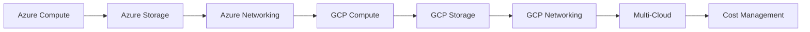

# Azure and GCP Basics — Cloud Providers Comparison

## Learning Objectives

| Objective | Description |
|-----------|-------------|
| LO1 | Understand Microsoft Azure core services: VMs, Blob Storage, AKS |
| LO2 | Understand Google Cloud Platform core services: Compute Engine, GKE, Cloud Storage |
| LO3 | Compare compute services across AWS, Azure, and GCP |
| LO4 | Compare storage and database offerings across providers |
| LO5 | Manage multi-cloud identity and access management |
| LO6 | Implement cloud cost management across providers |

## Chapter at a Glance

| Section | Topic | Key Concept |
|---------|-------|-------------|
| 9.1 | Azure Compute | VMs, Scale Sets, App Service, AKS |
| 9.2 | Azure Storage | Blob Storage, Azure Files, Cosmos DB |
| 9.3 | Azure Networking | VNet, Load Balancer, Azure DNS |
| 9.4 | GCP Compute | Compute Engine, GKE, Cloud Run, App Engine |
| 9.5 | GCP Storage | Cloud Storage, Cloud SQL, Firestore |
| 9.6 | GCP Networking | VPC, Cloud CDN, Cloud Load Balancing |
| 9.7 | Multi-Cloud Comparison | Services mapping, migration strategies |
| 9.8 | Cloud Cost Management | Pricing models, cost tools, optimization |

## Chapter Roadmap



## 9.1 Azure Compute

Azure provides several compute options for different workloads.

**Azure Virtual Machines**:

```bash
# Create VM
az vm create     --resource-group my-rg     --name my-vm     --image UbuntuLTS     --size Standard_B2s     --admin-username azureuser     --generate-ssh-keys

# SSH
ssh azureuser@PUBLIC_IP

# Stop/start
az vm stop --resource-group my-rg --name my-vm
az vm start --resource-group my-rg --name my-vm
```

**Azure App Service** — PaaS for web apps:

```bash
az webapp create     --resource-group my-rg     --plan my-plan     --name my-unique-app     --runtime "NODE:18-lts"
```

**Azure Kubernetes Service (AKS)**:

```bash
# Create cluster
az aks create     --resource-group my-rg     --name my-cluster     --node-count 3     --enable-managed-identity

# Get credentials
az aks get-credentials --resource-group my-rg --name my-cluster

# Deploy
kubectl apply -f deployment.yaml
```

| Azure Compute | AWS Equivalent | Use Case |
|---------------|----------------|----------|
| Virtual Machines | EC2 | Full control, custom images |
| App Service | Elastic Beanstalk | PaaS web apps |
| Azure Functions | Lambda | Serverless functions |
| AKS | EKS | Managed Kubernetes |
| Container Instances | Fargate | Serverless containers |
| Batch | Batch | HPC, batch processing |

## 9.2 Azure Storage

**Blob Storage** — object storage (equivalent to S3):

```bash
# Create storage account
az storage account create     --name mystorageaccount     --resource-group my-rg     --location eastus     --sku Standard_LRS

# Upload blob
az storage blob upload     --account-name mystorageaccount     --container-name mycontainer     --name file.txt     --file ./file.txt

# List blobs
az storage blob list     --account-name mystorageaccount     --container-name mycontainer     --output table
```

**Azure Files** — managed file shares (SMB/NFS):

```bash
az storage share create --name myshare --account-name mystorageaccount
```

**Cosmos DB** — globally distributed NoSQL:

```bash
az cosmosdb create --name my-cosmos-db --resource-group my-rg
az cosmosdb sql database create --account-name my-cosmos-db --name my-database
```

## 9.3 Azure Networking

**Virtual Network (VNet)**:

```bash
az network vnet create     --resource-group my-rg     --name my-vnet     --address-prefix 10.0.0.0/16     --subnet-name default     --subnet-prefix 10.0.1.0/24

# Load Balancer
az network lb create     --resource-group my-rg     --name my-lb     --sku Standard     --frontend-ip-name my-frontend     --public-ip-address my-public-ip

# Application Gateway (Layer 7)
az network application-gateway create     --resource-group my-rg     --name my-gateway     --sku Standard_v2     --capacity 2     --vnet-name my-vnet     --subnet appgw-subnet
```

## 9.4 GCP Compute

**Compute Engine**:

```bash
# Create VM
gcloud compute instances create my-instance     --zone us-central1-a     --machine-type e2-medium     --image-family ubuntu-2204-lts     --image-project ubuntu-os-cloud

# SSH
gcloud compute ssh my-instance --zone us-central1-a

# Stop/start
gcloud compute instances stop my-instance --zone us-central1-a
gcloud compute instances start my-instance --zone us-central1-a
```

**Google Kubernetes Engine (GKE)**:

```bash
# Create cluster
gcloud container clusters create my-cluster     --zone us-central1-a     --num-nodes 3     --machine-type e2-standard-2

# Get credentials
gcloud container clusters get-credentials my-cluster --zone us-central1-a

# Deploy
kubectl apply -f deployment.yaml
```

**Cloud Run** — serverless containers:

```bash
# Deploy container
gcloud run deploy my-service     --image gcr.io/my-project/my-image:latest     --platform managed     --region us-central1     --allow-unauthenticated
```

**App Engine** — PaaS:

```bash
gcloud app deploy app.yaml --project my-project
```

| GCP Compute | AWS Equivalent | Use Case |
|-------------|----------------|----------|
| Compute Engine | EC2 | VMs with custom images |
| GKE | EKS | Managed Kubernetes |
| Cloud Run | Fargate + App Runner | Serverless containers |
| App Engine | Elastic Beanstalk | PaaS apps |
| Cloud Functions | Lambda | Serverless functions |
| Cloud Build | CodeBuild | CI/CD |

## 9.5 GCP Storage

**Cloud Storage** — object storage (equivalent to S3):

```bash
# Create bucket
gsutil mb gs://my-unique-bucket/

# Upload
gsutil cp file.txt gs://my-bucket/
gsutil rsync -r ./local-folder gs://my-bucket/

# Set lifecycle
gsutil lifecycle set lifecycle.json gs://my-bucket/

# Storage classes
gsutil cp file.txt gs://my-bucket/ --storage-class NEARLINE
gsutil rewrite -s COLDLINE gs://my-bucket/file.txt
```

**Cloud SQL** — managed relational databases:

```bash
gcloud sql instances create my-instance     --database-version POSTGRES_15     --cpu 2 --memory 8GB     --region us-central1
```

**Firestore** — NoSQL document database:

```bash
gcloud firestore databases create --region us-central1
# Use client libraries for CRUD operations
```

## 9.6 GCP Networking

**VPC**:

```bash
# Create VPC
gcloud compute networks create my-vpc --subnet-mode custom

# Create subnet
gcloud compute networks subnets create my-subnet     --network my-vpc     --region us-central1     --range 10.0.1.0/24

# Firewall rules
gcloud compute firewall-rules create allow-http     --network my-vpc     --allow tcp:80     --source-ranges 0.0.0.0/0
```

**Cloud Load Balancing**:

```bash
gcloud compute forwarding-rules create my-rule     --region us-central1     --load-balancing-scheme EXTERNAL     --ports 80     --target-http-proxy my-proxy
```

## 9.7 Multi-Cloud Comparison

| Service Category | AWS | Azure | GCP |
|-----------------|-----|-------|-----|
| Compute | EC2 | Virtual Machines | Compute Engine |
| Containers | ECS/EKS | AKS | GKE/Cloud Run |
| Serverless | Lambda | Functions | Cloud Functions |
| Object Storage | S3 | Blob Storage | Cloud Storage |
| Relational DB | RDS | SQL Database | Cloud SQL |
| NoSQL | DynamoDB | Cosmos DB | Firestore |
| Cache | ElastiCache | Redis Cache | Memorystore |
| CDN | CloudFront | Azure CDN | Cloud CDN |
| DNS | Route 53 | Azure DNS | Cloud DNS |
| Load Balancer | ALB/NLB | Load Balancer | Cloud LB |
| Monitoring | CloudWatch | Monitor | Cloud Monitoring |
| IAM | IAM | Entra ID | Cloud IAM |
| CI/CD | CodePipeline | DevOps | Cloud Build |

**Migration strategies**:

| Strategy | Description | Effort |
|----------|-------------|--------|
| Lift and shift | Move as-is to cloud VMs | Low |
| Re-platform | Move to PaaS services | Medium |
| Re-factor | Re-architect for cloud-native | High |
| Re-purchase | Switch to SaaS | Low |
| Retire | Decommission unused | None |

## 9.8 Cloud Cost Management

**Cost comparison by provider**:

```bash
# AWS Cost Explorer
aws ce get-cost-and-usage --time-period Start=2024-01-01,End=2024-01-31 --granularity MONTHLY --metrics BlendedCost

# Azure Cost Management
az consumption usage list --billing-period-name 202401

# GCP Cost
gcloud billing accounts list
gcloud billing projects describe PROJECT_ID
```

**Cost optimization across clouds**:

| Strategy | AWS | Azure | GCP |
|----------|-----|-------|-----|
| Reserved instances | Reserved Instances | Reserved Instances | Committed Use |
| Spot/preemptible | Spot | Low Priority | Preemptible |
| Auto scaling | Auto Scaling | Scale Sets | Managed Instance Groups |
| Storage tiering | S3 Lifecycle | Blob Lifecycle | Object Lifecycle |
| Rightsizing | Compute Optimizer | Advisor | Recommender |

---

## TypeScript Parallel

```typescript
interface CloudProvider {
  name: string;
  region: string;
  computeService: string;
  storageService: string;
}

const providers: CloudProvider[] = [
  { name: "AWS", region: "us-east-1", computeService: "EC2", storageService: "S3" },
  { name: "Azure", region: "eastus", computeService: "Virtual Machines", storageService: "Blob Storage" },
  { name: "GCP", region: "us-central1", computeService: "Compute Engine", storageService: "Cloud Storage" },
];

function getServiceMapping(provider: string, category: string): string {
  const mapping: Record<string, Record<string, string>> = {
    "compute": { "AWS": "EC2", "Azure": "VM", "GCP": "Compute Engine" },
    "serverless": { "AWS": "Lambda", "Azure": "Functions", "GCP": "Cloud Functions" },
  };
  return mapping[category]?.[provider] || "Unknown";
}
```

---

## Summary

- Azure VMs, App Service, and AKS provide compute options similar to EC2, Beanstalk, and EKS
- Azure Blob Storage is equivalent to S3; Azure Files provides managed SMB/NFS shares
- GCP Compute Engine, GKE, and Cloud Run mirror EC2, EKS, and Fargate respectively
- Cloud Storage offers the same durability as S3 with similar storage classes
- A multi-cloud strategy uses services from multiple providers for redundancy and best-of-breed
- Cloud cost management involves rightsizing, reserved capacity, and storage tiering
- Lift-and-shift is the fastest migration; re-factoring provides the most benefit long-term
- Each provider offers equivalent services with different naming and minor feature differences
- IAM is critical across all clouds — use least privilege and regular audits
- Cost monitoring tools (Cost Explorer, Cost Management, Cloud Billing) are essential

## Practical Takeaways

| Scenario | AWS | Azure | GCP |
|----------|-----|-------|-----|
| VMs | EC2 | Virtual Machines | Compute Engine |
| Containers | EKS | AKS | GKE |
| Serverless | Lambda | Functions | Cloud Functions |
| Object Storage | S3 | Blob Storage | Cloud Storage |
| Cost savings | Reserved + Spot | Reserved + Low Priority | Committed + Preemptible |
| Multi-cloud | Use consistent IAM and monitoring across providers | Same left | Same left |

## Interview Q&A

<details class="tp-qa-card" data-qid="docker-s09-q1">
  <summary class="tp-qa-question"><span class="tp-qa-status"></span> Q1: Compare AWS, Azure, and GCP compute services.</summary>
  <div class="tp-qa-answer"><p>AWS: EC2 (VMs), ECS/EKS (containers), Lambda (serverless). Azure: Virtual Machines, AKS, Functions. GCP: Compute Engine, GKE, Cloud Run/Functions. All three have equivalent offerings with different naming and slight feature differences.</p></div>
  <button class="tp-qa-mark-btn">&#x2705; Mark Reviewed</button>
  <button class="tp-qa-bookmark-btn">&#x1F516; Bookmark</button>
</details>

<details class="tp-qa-card" data-qid="docker-s09-q2">
  <summary class="tp-qa-question"><span class="tp-qa-status"></span> Q2: What is the equivalent of AWS S3 on Azure and GCP?</summary>
  <div class="tp-qa-answer"><p>Azure Blob Storage and GCP Cloud Storage. All three provide 11 nines durability, tiered storage classes (standard, infrequent access, archive/glacier), and lifecycle management.</p></div>
  <button class="tp-qa-mark-btn">&#x2705; Mark Reviewed</button>
  <button class="tp-qa-bookmark-btn">&#x1F516; Bookmark</button>
</details>

<details class="tp-qa-card" data-qid="docker-s09-q3">
  <summary class="tp-qa-question"><span class="tp-qa-status"></span> Q3: What is Cloud Run and when would you use it?</summary>
  <div class="tp-qa-answer"><p>Cloud Run is GCP's serverless container platform. You deploy container images and Cloud Run automatically scales based on request traffic (including scaling to zero). Use for HTTP-driven applications, APIs, and event-driven workloads.</p></div>
  <button class="tp-qa-mark-btn">&#x2705; Mark Reviewed</button>
  <button class="tp-qa-bookmark-btn">&#x1F516; Bookmark</button>
</details>

<details class="tp-qa-card" data-qid="docker-s09-q4">
  <summary class="tp-qa-question"><span class="tp-qa-status"></span> Q4: What migration strategies exist for moving to the cloud?</summary>
  <div class="tp-qa-answer"><p>Lift and shift (fastest, least benefit), re-platform (move to PaaS), re-factor (re-architect for cloud-native), re-purchase (SaaS), retire (decommission). The 6 Rs of migration: Rehost, Replatform, Refactor, Repurchase, Retire, Retain.</p></div>
  <button class="tp-qa-mark-btn">&#x2705; Mark Reviewed</button>
  <button class="tp-qa-bookmark-btn">&#x1F516; Bookmark</button>
</details>

<details class="tp-qa-card" data-qid="docker-s09-q5">
  <summary class="tp-qa-question"><span class="tp-qa-status"></span> Q5: How do you manage costs across multiple cloud providers?</summary>
  <div class="tp-qa-answer"><p>Use native cost tools (AWS Cost Explorer, Azure Cost Management, GCP Cost Table). Tag resources consistently. Set budgets and alerts. Use reserved/committed capacity. Implement auto scaling. Monitor with third-party tools (CloudHealth, CloudCheckr).</p></div>
  <button class="tp-qa-mark-btn">&#x2705; Mark Reviewed</button>
  <button class="tp-qa-bookmark-btn">&#x1F516; Bookmark</button>
</details>

<details class="tp-qa-card" data-qid="docker-s09-q6">
  <summary class="tp-qa-question"><span class="tp-qa-status"></span> Q6: What are the differences between GKE, AKS, and EKS?</summary>
  <div class="tp-qa-answer"><p>GKE offers auto-pilot mode and faster node scaling. AKS integrates deeply with Azure AD and Azure DevOps. EKS has the largest community and broadest CNCF compatibility. All manage the K8s control plane and offer managed node groups.</p></div>
  <button class="tp-qa-mark-btn">&#x2705; Mark Reviewed</button>
  <button class="tp-qa-bookmark-btn">&#x1F516; Bookmark</button>
</details>

<details class="tp-qa-card" data-qid="docker-s09-q7">
  <summary class="tp-qa-question"><span class="tp-qa-status"></span> Q7: What is Azure Functions and how does it compare to Lambda?</summary>
  <div class="tp-qa-answer"><p>Azure Functions is Microsoft's serverless compute, equivalent to AWS Lambda. Both support event-driven execution, automatic scaling, and pay-per-execution pricing. Azure Functions has tighter integration with Microsoft ecosystem (Office 365, Teams, Dynamics).</p></div>
  <button class="tp-qa-mark-btn">&#x2705; Mark Reviewed</button>
  <button class="tp-qa-bookmark-btn">&#x1F516; Bookmark</button>
</details>

<details class="tp-qa-card" data-qid="docker-s09-q8">
  <summary class="tp-qa-question"><span class="tp-qa-status"></span> Q8: How does VPC differ between AWS, Azure, and GCP?</summary>
  <div class="tp-qa-answer"><p>AWS VPC: region-scoped with Availability Zone subnets. Azure VNet: region-scoped with availability zone support. GCP VPC: global, spans regions; subnets are regional. GCP's global VPC is unique — resources in different regions can communicate using internal IPs.</p></div>
  <button class="tp-qa-mark-btn">&#x2705; Mark Reviewed</button>
  <button class="tp-qa-bookmark-btn">&#x1F516; Bookmark</button>
</details>

<details class="tp-qa-card" data-qid="docker-s09-q9">
  <summary class="tp-qa-question"><span class="tp-qa-status"></span> Q9: What is multi-cloud and what are the benefits?</summary>
  <div class="tp-qa-answer"><p>Multi-cloud uses services from multiple cloud providers simultaneously. Benefits: avoid vendor lock-in, use best-of-breed services from each provider, geographic redundancy, cost optimization through competition, compliance with local data regulations.</p></div>
  <button class="tp-qa-mark-btn">&#x2705; Mark Reviewed</button>
  <button class="tp-qa-bookmark-btn">&#x1F516; Bookmark</button>
</details>

<details class="tp-qa-card" data-qid="docker-s09-q10">
  <summary class="tp-qa-question"><span class="tp-qa-status"></span> Q10: How do you implement IAM across multiple clouds?</summary>
  <div class="tp-qa-answer"><p>Use a central identity provider (Azure AD, Okta, Google Workspace) with federation/SAML. Each cloud has its own IAM: AWS IAM, Azure Entra ID/RBAC, GCP Cloud IAM. Use infrastructure-as-code (Terraform) to manage policies consistently. Implement least privilege everywhere.</p></div>
  <button class="tp-qa-mark-btn">&#x2705; Mark Reviewed</button>
  <button class="tp-qa-bookmark-btn">&#x1F516; Bookmark</button>
</details>

## Chapter Quiz

**Q1**: Which GCP service provides serverless containers?

a) Compute Engine
b) GKE
c) Cloud Run
d) App Engine

<details class="tp-qa-card" data-qid="docker-s09-quiz1"><summary>Show Answer</summary><div class="tp-qa-answer"><p><strong>Answer: c) Cloud Run</strong></p></div></details>

**Q2**: What is Azure's equivalent of AWS Lambda?

a) Azure App Service
b) Azure Functions
c) Azure VMs
d) Azure AKS

<details class="tp-qa-card" data-qid="docker-s09-quiz2"><summary>Show Answer</summary><div class="tp-qa-answer"><p><strong>Answer: b) Azure Functions</strong></p></div></details>

**Q3**: Which cloud provider offers a global VPC?

a) AWS
b) Azure
c) GCP
d) All three

<details class="tp-qa-card" data-qid="docker-s09-quiz3"><summary>Show Answer</summary><div class="tp-qa-answer"><p><strong>Answer: c) GCP</strong></p></div></details>

**Q4**: What does GCP's Cloud Storage offer that is equivalent to AWS S3 Glacier?

a) Coldline
b) Archive
c) Nearline
d) Standard

<details class="tp-qa-card" data-qid="docker-s09-quiz4"><summary>Show Answer</summary><div class="tp-qa-answer"><p><strong>Answer: b) Archive (Coldline is IA-equivalent)</strong></p></div></details>

**Q5**: Which migration strategy involves the least effort?

a) Re-factor
b) Re-platform
c) Lift and shift
d) Re-purchase

<details class="tp-qa-card" data-qid="docker-s09-quiz5"><summary>Show Answer</summary><div class="tp-qa-answer"><p><strong>Answer: c) Lift and shift</strong></p></div></details>

## Exercises

**Easy** — Create a VM in each cloud provider (AWS EC2, Azure VM, GCP Compute Engine) and verify you can SSH into it.

**Medium** — Deploy a containerized web app to Azure AKS and GCP GKE. Compare the deployment process.

**Medium** — Set up cost budgets and alerts for each cloud provider. Create a cost comparison report.

**Hard** — Design a multi-cloud architecture: app frontend on AWS, ML training on GCP (TPUs), database on Azure (Cosmos DB). Implement IAM federation and secure networking between clouds.

**Hard** — Write a Terraform configuration that deploys the same infrastructure (VPC, compute, storage) across all three providers using modules.

## Azure Identity and Access Management

**Azure Entra ID** (formerly Azure AD):

```bash
# Create service principal
az ad sp create-for-rbac --name my-app-sp --role Contributor --scopes /subscriptions/SUBSCRIPTION_ID

# Managed Identity for Azure resources
az vm identity assign --resource-group my-rg --name my-vm
az webapp identity assign --resource-group my-rg --name my-app

# Role assignments
az role assignment create --assignee <principal-id> --role Reader --resource-group my-rg
az role assignment list --assignee <principal-id> --output table
```

**Azure Policy** enforces compliance rules across resources:

```bash
# Assign built-in policy
az policy assignment create --name "require-tags" --policy "require-sql-server-encryption" --resource-group my-rg

# Create custom policy
az policy definition create --name "allowed-locations" --rules policy-rules.json --params policy-params.json
```

## GCP Identity and Access Management

**Service accounts**:

```bash
# Create service account
gcloud iam service-accounts create my-sa --display-name "My Service Account"

# Grant roles
gcloud projects add-iam-policy-binding my-project \
    --member "serviceAccount:my-sa@my-project.iam.gserviceaccount.com" \
    --role "roles/storage.objectViewer"

# Create key for external use
gcloud iam service-accounts keys create key.json --iam-account my-sa@my-project.iam.gserviceaccount.com
```

**GCP Resource Manager** organizes resources hierarchically:

```
Organization
├── Folder (Teams)
│   ├── Project (Production)
│   │   ├── VPC
│   │   ├── GKE Cluster
│   │   └── Cloud Storage Buckets
│   └── Project (Development)
└── Folder (Platform)
    ├── Shared Networking
    └── Shared CI/CD
```

## Serverless Comparison

| Feature | Azure Functions | GCP Cloud Functions |
|---------|----------------|---------------------|
| Runtime | Python, Node, Java, .NET, Go | Python, Node, Go, Java, .NET |
| Trigger types | HTTP, Timer, Queue, Event Grid, Cosmos DB | HTTP, Cloud Pub/Sub, Cloud Storage, Firestore |
| Cold start | ~300ms-1s (Premium: ~100ms) | ~100ms-500ms |
| Max timeout | 10 min (Consumption), 60 min (Premium) | 9 min (1st gen), 60 min (2nd gen) |
| Concurrency | 1 per instance (default) | 1 per instance (default) |
| Pricing | Pay per execution + resources | Pay per execution + resources |

---

> **Next**: [CI/CD Pipelines](10-ci-cd-pipelines.md)
