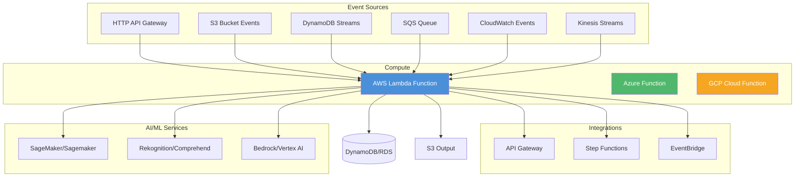
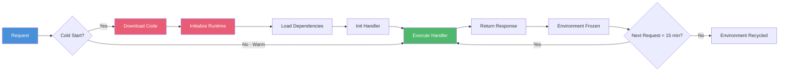
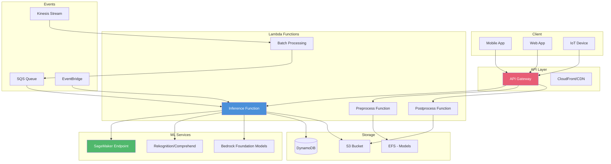

<!-- Clear Language: Keep sentences under 50 words -->
# Serverless & AWS Lambda — Event-Driven ML Inference

## Learning Objectives

| Objective | Description |
|-----------|-------------|
| LO1 | Understand serverless architecture trade-offs vs traditional compute |
| LO2 | Build and deploy AWS Lambda functions with triggers and layers |
| LO3 | Handle Lambda cold starts with optimization strategies |
| LO4 | Design Lambda + API Gateway for ML model inference endpoints |
| LO5 | Compare AWS Lambda, Azure Functions, and Google Cloud Functions |
| LO6 | Implement serverless ML inference pipelines |

## Introduction

Serverless computing lets you run code without managing servers. AWS Lambda, Azure Functions, and Google Cloud Functions execute code in response to events. AI engineers use serverless for model inference, data preprocessing, and event-driven ML pipelines.

## Prerequisites

- Basic understanding of cloud computing
- Familiarity with REST APIs
- Python or Node.js programming

## Key Terminology

**Key Terms**: Core vocabulary and concepts for this topic.

**Definition**: Essential terms you must know for interviews and production work.

## Theory

### Serverless Architecture Overview



### Serverless Pros and Cons

| Advantage | Disadvantage |
|-----------|-------------|
| No server management | Cold starts (latency spikes) |
| Auto-scales to zero | 15-minute execution limit |
| Pay-per-execution | 512MB-10GB memory limit |
| Built-in high availability | 1MB request/response payload limit |
| Automatic scaling | No persistent local storage |
| Event-driven integration | Debugging complexity |

### AWS Lambda Deep Dive

**Lambda execution model**:

```text
1. Event source triggers Lambda
2. AWS creates a new execution environment (container)
3. Lambda runtime loads your code (init phase)
4. Handler function executes with event data
5. Response returned (synchronous) or sent to destination
6. Environment frozen for ~5-15 minutes (keep warm)
7. Environment recycled after idle timeout
```

**Lambda function basics**:

```python
import json
import os
import boto3

def lambda_handler(event, context):
    """Primary Lambda entry point"""
    print(f"Event: {json.dumps(event, default=str)[:500]}")
    print(f"Remaining time: {context.get_remaining_time_in_millis()}ms")

    # Extract request info
    http_method = event.get("httpMethod", "GET")
    path = event.get("path", "/")
    query_params = event.get("queryStringParameters", {}) or {}
    body = event.get("body", "{}")

    # Process based on route
    if path == "/health":
        return {"statusCode": 200, "body": json.dumps({"status": "healthy"})}

    if path == "/predict" and http_method == "POST":
        payload = json.loads(body)
        result = predict(payload)
        return {"statusCode": 200, "body": json.dumps(result)}

    return {"statusCode": 404, "body": json.dumps({"error": "Not found"})}

def predict(data):
    """Mock prediction function"""
    features = data.get("features", [])
    # In production: load model from S3 or EFS
    prediction = {"class": "positive", "confidence": 0.95, "features": features}
    return prediction
```

**Lambda with API Gateway**:

```python
import json
import boto3
import os

dynamodb = boto3.resource("dynamodb")
table_name = os.environ.get("TABLE_NAME", "inference-results")
table = dynamodb.Table(table_name)

def lambda_handler(event, context):
    """API Gateway proxy integration"""
    try:
        # Parse API Gateway event
        body = json.loads(event.get("body", "{}"))
        model_input = body.get("input")
        model_version = body.get("version", "v1")

        if not model_input:
            return api_response(400, {"error": "Missing 'input' field"})

        # Call SageMaker endpoint for inference
        sagemaker = boto3.client("sagemaker-runtime")
        response = sagemaker.invoke_endpoint(
            EndpointName=f"my-model-{model_version}",
            ContentType="application/json",
            Body=json.dumps({"instances": [model_input]}),
        )

        # Parse result
        result = json.loads(response["Body"].read().decode())

        # Log to DynamoDB
        table.put_item(Item={
            "request_id": context.aws_request_id,
            "input": str(model_input)[:500],
            "output": str(result)[:500],
            "timestamp": context.aws_request_id,
        })

        return api_response(200, {
            "prediction": result,
            "model_version": model_version,
            "request_id": context.aws_request_id,
        })

    except Exception as e:
        print(f"Error: {str(e)}")
        return api_response(500, {"error": "Internal server error"})

def api_response(status_code, body):
    return {
        "statusCode": status_code,
        "headers": {
            "Content-Type": "application/json",
            "Access-Control-Allow-Origin": "*",
        },
        "body": json.dumps(body),
    }
```

**Lambda Layers** (share dependencies across functions):

```bash
# Create layer directory structure
mkdir -p python/lib/python3.9/site-packages/

# Install packages
pip install -t python/lib/python3.9/site-packages/ \
    scikit-learn==1.3.0 \
    pandas==2.0.3 \
    numpy==1.24.3 \
    joblib==1.3.2 \
    requests==2.31.0

# Package layer
zip -r9 sklearn-layer.zip python/

# Publish layer
aws lambda publish-layer-version \
    --layer-name sklearn-layer \
    --zip-file fileb://sklearn-layer.zip \
    --compatible-runtimes python3.9 python3.10 \
    --description "Scikit-learn ML dependencies"

# Attach to function
aws lambda update-function-configuration \
    --function-name my-ml-function \
    --layers arn:aws:lambda:us-east-1:123456789012:layer:sklearn-layer:1

# In your function code, import normally:
import numpy as np
import joblib

def lambda_handler(event, context):
    model = joblib.load('/opt/model.pkl')  # Load from /opt
    ...
```

**Lambda Environment Variables and Secrets**:

```python
import os
import boto3
from aws_lambda_powertools import Logger

logger = Logger()

def lambda_handler(event, context):
    # Environment variables (set during deployment)
    model_bucket = os.environ["MODEL_BUCKET"]
    model_key = os.environ.get("MODEL_KEY", "models/latest.pkl")
    endpoint_name = os.environ["ENDPOINT_NAME"]

    # Get secrets from AWS Secrets Manager
    secrets_client = boto3.client("secretsmanager")
    secret = secrets_client.get_secret_value(SecretId="ml/db-credentials")
    credentials = json.loads(secret["SecretString"])

    logger.info(f"Loading model from s3://{model_bucket}/{model_key}")
    # ... inference logic
```

### Lambda Cold Starts

Cold start happens when AWS initializes a new execution environment.



**Cold start optimization strategies**:

```python
# 1. Keep warm with CloudWatch Events
# Scheduled event every 5 minutes pings the function

# 2. Use Provisioned Concurrency
# aws lambda put-provisioned-concurrency-config \
#     --function-name my-function \
#     --qualifier prod \
#     --provisioned-concurrent-executions 5

# 3. Minimize deployment package size
# Use layers for dependencies
# Keep code under 3MB

# 4. Use AWS Graviton (ARM) for better cold start

# 5. Lazy load heavy dependencies
import importlib

_MODEL = None

def load_model():
    global _MODEL
    if _MODEL is None:
        import joblib  # Import inside handler
        import boto3
        s3 = boto3.client("s3")
        response = s3.get_object(Bucket="models", Key="model.pkl")
        _MODEL = joblib.load(response["Body"])
    return _MODEL

def lambda_handler(event, context):
    model = load_model()  # Lazy load
    # ... inference
```

**Cold start times by runtime**:

| Runtime | Cold Start (p50) | Cold Start (p99) |
|---------|-----------------|-----------------|
| Python | 200-500ms | 1-2s |
| Node.js | 150-400ms | 1-1.5s |
| Java | 500ms-1s | 5-10s |
| .NET | 500ms-1s | 5-8s |
| Go | 100-300ms | 500ms-1s |
| Custom (Rust) | 50-200ms | 300-500ms |

### Lambda Triggers and Event Sources

**S3 trigger (file processing)**:

```python
import json
import boto3
import urllib.parse

s3 = boto3.client("s3")
rekognition = boto3.client("rekognition")
dynamodb = boto3.resource("dynamodb")
table = dynamodb.Table("image-metadata")

def lambda_handler(event, context):
    """Process S3 upload events"""
    for record in event["Records"]:
        bucket = record["s3"]["bucket"]["name"]
        key = urllib.parse.unquote_plus(record["s3"]["object"]["key"])
        size = record["s3"]["object"]["size"]

        print(f"Processing s3://{bucket}/{key} ({size} bytes)")

        # Call Rekognition for image analysis
        response = rekognition.detect_labels(
            Image={"S3Object": {"Bucket": bucket, "Name": key}},
            MaxLabels=10,
        )

        labels = [label["Name"] for label in response["Labels"]]
        print(f"Detected labels: {labels}")

        # Store metadata
        table.put_item(Item={
            "image_key": key,
            "bucket": bucket,
            "size_bytes": size,
            "labels": labels,
            "processed_at": context.aws_request_id,
        })

    return {"statusCode": 200, "processed": len(event["Records"])}
```

**SQS trigger (async processing)**:

```python
import json
import base64

def lambda_handler(event, context):
    """Process SQS queue messages"""
    for record in event["Records"]:
        # Decode message body
        body = json.loads(record["body"])
        receipt_handle = record["receiptHandle"]
        message_id = record["messageId"]

        print(f"Processing {message_id}")

        # Process inference request
        try:
            result = process_inference(body)
            print(f"Success: {message_id}")
        except Exception as e:
            print(f"Failed: {message_id} - {str(e)}")
            # If we raise, Lambda will retry based on SQS redrive policy
            raise

    return {"statusCode": 200}

def process_inference(request):
    """Mock inference processing"""
    features = request.get("features", [])
    model_id = request.get("model_id", "default")

    # In production, call SageMaker or local model
    prediction = sum(features) > 0.5
    return {"model_id": model_id, "prediction": prediction}
```

**DynamoDB Streams trigger**:

```python
import json
import boto3

def lambda_handler(event, context):
    """React to DynamoDB table changes"""
    for record in event["Records"]:
        event_name = record["eventName"]  # INSERT, MODIFY, REMOVE
        new_image = record.get("dynamodb", {}).get("NewImage", {})
        old_image = record.get("dynamodb", {}).get("OldImage", {})

        user_id = new_image.get("userId", {}).get("S")

        if event_name == "INSERT":
            print(f"New user registered: {user_id}")
            # Send welcome email, start onboarding
        elif event_name == "MODIFY":
            print(f"User updated: {user_id}")
            # Update ML model features
        elif event_name == "REMOVE":
            print(f"User deleted: {user_id}")
            # Clean up user data

    return {"statusCode": 200}
```

### Lambda + API Gateway for ML Inference

```yaml
# template.yaml (AWS SAM)
AWSTemplateFormatVersion: '2010-09-09'
Transform: AWS::Serverless-2016-10-31

Globals:
  Function:
    Timeout: 30
    MemorySize: 1024
    Runtime: python3.10
    Environment:
      Variables:
        MODEL_BUCKET: !Ref ModelBucket
        TABLE_NAME: !Ref InferenceTable

Resources:
  InferenceAPI:
    Type: AWS::Serverless::Api
    Properties:
      StageName: prod
      TracingEnabled: true
      Throttle:
        BurstLimit: 100
        RateLimit: 50

  InferenceFunction:
    Type: AWS::Serverless::Function
    Properties:
      CodeUri: src/
      Handler: inference.lambda_handler
      Layers:
        - !Ref MLDependenciesLayer
      Policies:
        - S3ReadPolicy:
            BucketName: !Ref ModelBucket
        - DynamoDBCrudPolicy:
            TableName: !Ref InferenceTable
      Events:
        PredictEndpoint:
          Type: Api
          Properties:
            RestApiId: !Ref InferenceAPI
            Path: /predict
            Method: POST
        HealthEndpoint:
          Type: Api
          Properties:
            RestApiId: !Ref InferenceAPI
            Path: /health
            Method: GET
      AutoPublishAlias: live
      ProvisionedConcurrencyConfig:
        ProvisionedConcurrentExecutions: 5

  MLDependenciesLayer:
    Type: AWS::Serverless::LayerVersion
    Properties:
      LayerName: ml-dependencies
      ContentUri: layers/ml/
      CompatibleRuntimes:
        - python3.10
      RetentionPolicy: Retain

  ModelBucket:
    Type: AWS::S3::Bucket

  InferenceTable:
    Type: AWS::DynamoDB::Table
    Properties:
      AttributeDefinitions:
        - AttributeName: request_id
          AttributeType: S
      KeySchema:
        - AttributeName: request_id
          KeyType: HASH
      BillingMode: PAY_PER_REQUEST
```

**Deploy with SAM**:

```bash
# Build the application
sam build

# Deploy to AWS
sam deploy --guided

# Invoke locally for testing
sam local invoke InferenceFunction --event test-event.json

# Start local API Gateway
sam local start-api

# View logs
sam logs --stack-name my-ml-app --tail
```

### Serverless ML Inference Pipeline

```python
import json
import boto3
import os
import time
from datetime import datetime

s3 = boto3.client("s3")
sagemaker = boto3.client("sagemaker-runtime")
dynamodb = boto3.resource("dynamodb")
table = dynamodb.Table(os.environ["TABLE_NAME"])

def lambda_handler(event, context):
    """
    Serverless ML inference pipeline:
    1. Receive request via API Gateway
    2. Preprocess data
    3. Call SageMaker endpoint
    4. Postprocess result
    5. Store in DynamoDB
    6. Return response
    """
    start_time = time.time()

    # 1. Parse request
    body = json.loads(event.get("body", "{}"))
    request_id = context.aws_request_id
    user_id = body.get("user_id", "anonymous")
    features = body.get("features", [])

    if not features:
        return respond(400, {"error": "No features provided"})

    # 2. Preprocess
    processed = preprocess(features)
    payload = json.dumps({"instances": [processed]})

    # 3. Call SageMaker
    model_endpoint = os.environ.get("MODEL_ENDPOINT", "my-model-v1")
    sagemaker_response = sagemaker.invoke_endpoint(
        EndpointName=model_endpoint,
        ContentType="application/json",
        Accept="application/json",
        Body=payload,
    )
    raw_prediction = json.loads(sagemaker_response["Body"].read())

    # 4. Postprocess
    prediction = postprocess(raw_prediction)

    # 5. Store result
    inference_time = time.time() - start_time
    table.put_item(Item={
        "request_id": request_id,
        "user_id": user_id,
        "input_features": str(features)[:500],
        "prediction": prediction["class"],
        "confidence": str(prediction["confidence"]),
        "inference_time_ms": int(inference_time * 1000),
        "timestamp": datetime.utcnow().isoformat(),
    })

    # 6. Return response
    return respond(200, {
        "prediction": prediction,
        "request_id": request_id,
        "latency_ms": int(inference_time * 1000),
    })

def preprocess(features):
    """Scale and transform features"""
    import numpy as np
    arr = np.array(features, dtype=float)
    # Simple normalization
    mean = np.mean(arr)
    std = np.std(arr) + 1e-8
    normalized = ((arr - mean) / std).tolist()
    return normalized

def postprocess(raw):
    """Convert model output to prediction"""
    if isinstance(raw, dict) and "predictions" in raw:
        probs = raw["predictions"][0]
    else:
        probs = raw[0] if isinstance(raw, list) else raw

    if isinstance(probs, list):
        class_idx = probs.index(max(probs))
        confidence = max(probs)
        classes = ["negative", "neutral", "positive"]
        predicted_class = classes[class_idx] if class_idx < len(classes) else "unknown"
    else:
        predicted_class = "positive" if probs > 0.5 else "negative"
        confidence = probs if probs > 0.5 else 1 - probs

    return {"class": predicted_class, "confidence": round(confidence, 4)}

def respond(status_code, body):
    return {
        "statusCode": status_code,
        "headers": {
            "Content-Type": "application/json",
            "Access-Control-Allow-Origin": "*",
        },
        "body": json.dumps(body, default=str),
    }
```

### Multi-Cloud Serverless Comparison

| Feature | AWS Lambda | Azure Functions | Google Cloud Functions |
|---------|-----------|----------------|----------------------|
| Max execution | 15 min | 10 min (260 min premium) | 9 min (60 min Gen2) |
| Max memory | 10,240 MB | 1,536 MB (14 GB premium) | 32 GB (Gen2) |
| Max ephemeral storage | 10 GB | 1 GB | 32 GB |
| Concurrent executions | 1,000 (soft) | 200 (soft) | 3,000 |
| Supported runtimes | Python, Node, Java, Go, Ruby, .NET, Custom | Python, Node, Java, .NET, Go, PowerShell, Custom | Python, Node, Go, Java, .NET, Ruby, PHP |
| Cold start (avg) | 200-500ms | 300-600ms | 200-400ms |
| Provisioned concurrency | Yes | Premium plan | Min instances |
| Layers | Yes | No | No |
| VPC networking | Yes | Yes | Yes (Gen2) |
| Price (per 1M invocations) | $0.20 | $0.20 | $0.40 |
| GPU support | No | No | No |

### Serverless Limitations for ML

```python
# Workarounds for common serverless ML limitations

# 1. Model loading time - use EFS or S3 with caching
import tempfile
import joblib

def load_model_from_efs():
    """Load model from EFS mount"""
    import joblib
    model_path = "/mnt/ml/models/production/model.pkl"
    return joblib.load(model_path)

def load_model_from_s3():
    """Load model from S3 with local caching"""
    import os
    import joblib
    import boto3

    cache_path = "/tmp/model.pkl"
    bucket = os.environ["MODEL_BUCKET"]
    key = os.environ["MODEL_KEY"]

    # Check cache
    if not os.path.exists(cache_path):
        s3 = boto3.client("s3")
        s3.download_file(bucket, key, cache_path)

    return joblib.load(cache_path)

# 2. Large response handling - use S3 presigned URLs
def generate_presigned_url(bucket, key, expiration=3600):
    s3 = boto3.client("s3")
    url = s3.generate_presigned_url(
        "get_object",
        Params={"Bucket": bucket, "Key": key},
        ExpiresIn=expiration,
    )
    return url

# 3. Long-running inference - use Step Functions
# Lambda starts async inference, Step Functions polls for completion

# 4. Batch processing - use S3 event to trigger per-file processing
# Each file upload triggers a separate Lambda invocation
```

## Visual Explanation



## Real Example

Think of serverless like a food delivery service. You (the developer) provide the recipe (code). The restaurant (AWS Lambda) cooks it when an order arrives (event). You don't manage the kitchen — you just write recipes. If no orders come in, no food is cooked (scale to zero). If 10,000 orders arrive suddenly, dozens of chefs start cooking simultaneously (auto-scale). However, each chef needs time to read the recipe and gather ingredients (cold start). To reduce wait time, keep one chef always at the prep station (provisioned concurrency). API Gateway is like the counter where orders are placed and dishes handed out.

## Code Example

```python
#!/usr/bin/env python3
"""Serverless sentiment analysis inference with AWS Lambda"""

import json
import os
import time
import boto3
from typing import Dict, List, Any

# Lazy-loaded model
_MODEL = None
_MODEL_META = None

dynamodb = boto3.resource("dynamodb")
table = dynamodb.Table(os.environ.get("TABLE_NAME", "sentiment-results"))

def load_model():
    """Lazy load model from S3 with caching"""
    global _MODEL, _MODEL_META
    if _MODEL is None:
        import joblib
        s3 = boto3.client("s3")
        bucket = os.environ["MODEL_BUCKET"]
        key = os.environ.get("MODEL_KEY", "models/sentiment-v1.pkl")
        meta_key = key.replace(".pkl", "-meta.json")

        download_start = time.time()
        model_path = f"/tmp/{os.path.basename(key)}"
        meta_path = f"/tmp/{os.path.basename(meta_key)}"

        if not os.path.exists(model_path):
            s3.download_file(bucket, key, model_path)
            s3.download_file(bucket, meta_key, meta_path)

        _MODEL = joblib.load(model_path)
        with open(meta_path) as f:
            _MODEL_META = json.load(f)

        download_time = time.time() - download_start
        print(f"Model loaded in {download_time:.2f}s (version: {_MODEL_META.get('version', 'unknown')})")

    return _MODEL, _MODEL_META

def preprocess_text(text: str) -> List[float]:
    """Simple bag-of-words preprocessing"""
    import numpy as np
    from sklearn.feature_extraction.text import CountVectorizer

    words = text.lower().split()
    word_set = set(_MODEL_META.get("vocabulary", []))
    features = np.zeros(len(word_set))
    word_list = list(word_set)

    for word in words:
        if word in word_set:
            idx = word_list.index(word)
            features[idx] += 1

    return features.tolist()

def lambda_handler(event: Dict[str, Any], context: Any) -> Dict:
    """Serverless sentiment analysis handler"""
    start_time = time.time()

    # Parse request
    body = json.loads(event.get("body", "{}"))
    text = body.get("text", "")
    request_id = context.aws_request_id

    if not text.strip():
        return respond(400, {"error": "No text provided"})

    # Load model (lazy, cached across invocations in warm container)
    model, meta = load_model()

    # Preprocess
    features = preprocess_text(text)

    # Predict
    import numpy as np
    features_arr = np.array(features).reshape(1, -1)
    prediction = model.predict(features_arr)[0]
    probabilities = model.predict_proba(features_arr)[0]

    sentiment_map = {0: "negative", 1: "neutral", 2: "positive"}
    sentiment = sentiment_map.get(int(prediction), "unknown")
    confidence = float(max(probabilities))

    # Store result
    total_time = time.time() - start_time
    try:
        table.put_item(Item={
            "request_id": request_id,
            "text": text[:1000],
            "sentiment": sentiment,
            "confidence": str(round(confidence, 4)),
            "latency_ms": int(total_time * 1000),
            "model_version": meta.get("version", "unknown"),
            "timestamp": int(time.time()),
        })
    except Exception as e:
        print(f"DynamoDB write failed: {e}")

    return respond(200, {
        "sentiment": sentiment,
        "confidence": round(confidence, 4),
        "model_version": meta.get("version"),
        "latency_ms": int(total_time * 1000),
        "request_id": request_id,
    })

def respond(status_code: int, body: Dict) -> Dict:
    return {
        "statusCode": status_code,
        "headers": {
            "Content-Type": "application/json",
            "Access-Control-Allow-Origin": "*",
        },
        "body": json.dumps(body, default=str),
    }
```

**Expected Output**:
```json
{
  "sentiment": "positive",
  "confidence": 0.9723,
  "model_version": "1.2.0",
  "latency_ms": 245,
  "request_id": "a1b2c3d4-e5f6-7890-abcd-ef1234567890"
}
```

## Summary

Serverless computing runs code in response to events without managing servers, with AWS Lambda, Azure Functions, and Google Cloud Functions as the three main platforms. AWS Lambda executes a handler function in a fresh execution environment per invocation, triggered by sources like API Gateway, S3 events, SQS queues, DynamoDB Streams, and CloudWatch events. Its constraints are hard limits: 15-minute execution, 10GB memory, 250MB deployment package, 1MB request/response payload, stateless /tmp storage, and no GPU. Cold starts add 200ms-5s of latency when AWS initializes a new environment, mitigated by Provisioned Concurrency, SnapStart, lazy loading, smaller packages, and Graviton. For ML inference, Lambda typically loads a model from S3 or EFS, calls a SageMaker endpoint, or runs lightweight scikit-learn models, with results stored in DynamoDB. Serverless fits sporadic, event-driven inference and preprocessing; it is the wrong choice for GPU workloads, sub-10ms latency, long-running inference, or steady high throughput, which belong on Fargate, EKS, or SageMaker.

- Lambda limits: 15-min timeout, 10GB memory, 250MB package, 1MB payload, no GPU.
- Cold starts cost 200ms-5s; mitigate with Provisioned Concurrency, SnapStart, lazy loading, Graviton.
- Layers share dependencies across functions and mount at /opt.
- SQS buffers events to prevent 429 throttling at high concurrency.
- EFS mounts GB-scale models; /tmp (10GB) caches models across warm invocations.
- Use Fargate/EKS for GPU, persistent serving, or steady high throughput.

## Practical Takeaways

- **Cold starts**: Use Provisioned Concurrency for latency-sensitive endpoints and keep deployment packages under 3MB with dependencies in layers.
- **Lazy loading**: Load models inside the handler with a module-level cache, not at global scope, so warm containers reuse the loaded model across invocations.
- **Model size**: For models over 250MB, mount EFS, download from S3 into /tmp with caching, or call a SageMaker endpoint instead of bundling the model.
- **Limits**: Respect the 15-minute timeout and 1MB payload limit; use S3 presigned URLs for large data and Step Functions for long-running workflows.
- **Layers**: Package scikit-learn, pandas, numpy, joblib into a Lambda Layer mounted at /opt to shrink deployment packages and speed cold starts.
- **Throttling**: Place an SQS queue between API Gateway and Lambda so burst traffic is buffered instead of dropped with 429 errors.
- **Costs**: Right-size memory (GB-seconds pricing) and prefer Graviton (20% cheaper); avoid Lambda for steady-state high throughput where containers win.

## Interview Q&A

<details class="tp-qa-card" data-qid="dcs11-q1">
  <summary class="tp-qa-question">
    <span class="tp-qa-status"></span>
    Q1: What is a Lambda cold start and how do you mitigate it?
  </summary>
  <div class="tp-qa-answer">
    <p>Cold start occurs when Lambda creates a new execution environment — downloading code, initializing runtime, loading dependencies before handler execution. Causes 200ms-5s latency spike. Mitigations: <strong>1) Provisioned Concurrency</strong> — keep N environments warm. <strong>2) Smaller deployment</strong> — use layers, minimize package size under 3MB. <strong>3) Lazy loading</strong> — load heavy dependencies inside handler, not globally. <strong>4) Choose faster runtime</strong> — Python/Node/Go over Java/.NET. <strong>5) Keep warm</strong> — schedule pings every 5 minutes (costs money). <strong>6) SnapStart</strong> — Java only, takes snapshot of initialized environment. <strong>7) ARM/Graviton</strong> — faster cold start than x86.</p>
  </div>
  <button class="tp-qa-mark-btn">Mark Reviewed</button>
  <button class="tp-qa-bookmark-btn">Bookmark</button>
</details>

<details class="tp-qa-card" data-qid="dcs11-q2">
  <summary class="tp-qa-question">
    <span class="tp-qa-status"></span>
    Q2: How would you deploy a large ML model (500MB+) with Lambda?
  </summary>
  <div class="tp-qa-answer">
    <p>Lambda has a 250MB deployment package limit (including layers). For large models: <strong>1) Amazon EFS</strong> — mount EFS file system to Lambda. Model stored on EFS, loaded at runtime. Best for large models (GBs). <strong>2) S3 + Caching</strong> — download model from S3 to /tmp on cold start, cache for subsequent invocations. /tmp is 10GB max. <strong>3) SageMaker</strong> — Lambda calls SageMaker endpoint for inference. Model stays on SageMaker, Lambda just passes data. <strong>4) Container images</strong> — up to 10GB container image. Use ECR-hosted Lambda with image containing model. <strong>5) AWS Marketplace</strong> — pre-built ML containers from AWS Marketplace.</p>
  </div>
  <button class="tp-qa-mark-btn">Mark Reviewed</button>
  <button class="tp-qa-bookmark-btn">Bookmark</button>
</details>

<details class="tp-qa-card" data-qid="dcs11-q3">
  <summary class="tp-qa-question">
    <span class="tp-qa-status"></span>
    Q3: When should you NOT use serverless for ML inference?
  </summary>
  <div class="tp-qa-answer">
    <p>Avoid serverless when: <strong>1) Low latency required</strong> — cold starts add unpredictable latency. Use always-on SageMaker or EKS for sub-10ms p99. <strong>2) GPU inference</strong> — Lambda doesn't support GPU. Use SageMaker or ECS with GPU. <strong>3) Long-running inference</strong> — 15-minute timeout limit. For complex models (LLMs), use SageMaker or ECS. <strong>4) Steady high throughput</strong> — Lambda becomes expensive at >100 req/s constant. Provisioned compute saves cost. <strong>5) Large payloads</strong> — 1MB request/response limit. Use S3 presigned URLs for large data. <strong>6) Stateful workloads</strong> — Lambda is stateless by design. Use ECS/EKS for sticky sessions.</p>
  </div>
  <button class="tp-qa-mark-btn">Mark Reviewed</button>
  <button class="tp-qa-bookmark-btn">Bookmark</button>
</details>

<details class="tp-qa-card" data-qid="dcs11-q4">
  <summary class="tp-qa-question">
    <span class="tp-qa-status"></span>
    Q4: Explain Lambda concurrency limits and how to handle scale.
  </summary>
  <div class="tp-qa-answer">
    <p>AWS Lambda has a regional concurrency limit (default 1000 per region). When exceeded, requests are throttled (429 error). <strong>Reserved concurrency</strong>: guarantee N concurrent executions for a function (subtracts from account limit). <strong>Provisioned concurrency</strong>: keep N environments initialized and warm. <strong>Burst concurrency</strong>: Lambda scales quickly but has burst limits (500-3000 per region). <strong>Handling throttles</strong>: Use SQS as a buffer between API Gateway and Lambda. SQS queues the request, Lambda processes at its own pace. For extreme scale, use Kinesis or EventBridge with retry and DLQ patterns.</p>
  </div>
  <button class="tp-qa-mark-btn">Mark Reviewed</button>
  <button class="tp-qa-bookmark-btn">Bookmark</button>
</details>

<details class="tp-qa-card" data-qid="dcs11-q5">
  <summary class="tp-qa-question">
    <span class="tp-qa-status"></span>
    Q5: How does Lambda pricing work and how do you estimate costs?
  </summary>
  <div class="tp-qa-answer">
    <p>Lambda pricing = <strong>request count</strong> + <strong>compute duration</strong> + <strong>data transfer</strong>. Requests: $0.20 per 1M requests. Duration: $0.0000166667 per GB-second (for x86). Free tier: 1M requests/month + 400,000 GB-seconds. Example: a 1GB Lambda running 200ms for 1M requests/month costs ~$3.50. <strong>Cost optimization</strong>: Right-size memory (more memory = faster execution = less duration cost), use Graviton (20% cheaper), minimize cold starts (provisioned concurrency costs extra), use reserved concurrency to limit runaway scaling, clean up /tmp between invocations to avoid storage costs.</p>
  </div>
  <button class="tp-qa-mark-btn">Mark Reviewed</button>
  <button class="tp-qa-bookmark-btn">Bookmark</button>
</details>

<details class="tp-qa-card" data-qid="dcs11-q6">
  <summary class="tp-qa-question">
    <span class="tp-qa-status"></span>
    Q6: Design a serverless ML inference pipeline for a mobile app.
  </summary>
  <div class="tp-qa-answer">
    <p><strong>1) API Gateway</strong> — HTTPS endpoint with throttling (burst=100, rate=50). <strong>2) Lambda inference</strong> — loads model from EFS (to avoid cold start model loading). Uses Python runtime. Provisioned concurrency of 10 for consistent latency. <strong>3) DynamoDB</strong> — stores inference results and request metadata. <strong>4) S3</strong> — stores uploaded images/videos for vision models. Generates presigned URLs for client upload. <strong>5) Step Functions</strong> — orchestrates multi-step pipelines (preprocess, inference, postprocess). <strong>6) CloudFront</strong> — CDN for static assets and API caching. <strong>7) CloudWatch + X-Ray</strong> — monitoring and tracing. <strong>8) Cost</strong>: ~$10/month for 100K requests at 500ms each.</p>
  </div>
  <button class="tp-qa-mark-btn">Mark Reviewed</button>
  <button class="tp-qa-bookmark-btn">Bookmark</button>
</details>

<details class="tp-qa-card" data-qid="dcs11-q7">
  <summary class="tp-qa-question">
    <span class="tp-qa-status"></span>
    Q7: What is the difference between Lambda and Fargate (serverless containers)?
  </summary>
  <div class="tp-qa-answer">
    <p><strong>Lambda</strong>: Function-as-a-Service. Runs for max 15 min. Max 10GB memory. No GPU. Stateless. Event-driven. Pay per execution + duration. Cold starts. Best for short, event-driven ML tasks (preprocessing, lightweight inference, data transformation). <strong>Fargate</strong>: Serverless container compute. Runs indefinitely. Up to 120GB memory. GPU support (via ECS). Stateful. Pay per running time (per second). No cold starts. Best for long-running ML workloads (model training, real-time inference servers, batch processing). Choose Lambda for sporadic, event-driven inference. Choose Fargate for persistent model serving or GPU workloads.</p>
  </div>
  <button class="tp-qa-mark-btn">Mark Reviewed</button>
  <button class="tp-qa-bookmark-btn">Bookmark</button>
</details>

<details class="tp-qa-card" data-qid="dcs11-q8">
  <summary class="tp-qa-question">
    <span class="tp-qa-status"></span>
    Q8: How would you process 10,000 CSV files uploaded to S3 with Lambda?
  </summary>
  <div class="tp-qa-answer">
    <p><strong>1) S3 event notification</strong> — each file upload triggers a Lambda. <strong>2) SQS queue</strong> — buffer between S3 and Lambda to handle throttling. Configure S3 to send events to SQS, Lambda polls SQS. <strong>3) Batch window</strong> — batch up to 10 files per Lambda invocation (reduce number of invocations). <strong>4) Parallel processing</strong> — Lambda scales up to 1000 concurrent executions, limited only by account concurrency. <strong>5) Chunking</strong> — for large CSVs (1GB+), use Lambda to split into chunks, process each chunk separately. <strong>6) Step Functions</strong> — orchestrate: validate, process, aggregate, store results. <strong>7) Error handling</strong> — DLQ for failed files with retry logic. <strong>8) Cost</strong>: processing 10K files at ~5s each ~= $1.50.</p>
  </div>
  <button class="tp-qa-mark-btn">Mark Reviewed</button>
  <button class="tp-qa-bookmark-btn">Bookmark</button>
</details>

<details class="tp-qa-card" data-qid="dcs11-q9">
  <summary class="tp-qa-question">
    <span class="tp-qa-status"></span>
    Q9: What are Lambda Layers and how do you use them for ML dependencies?
  </summary>
  <div class="tp-qa-answer">
    <p>Lambda Layers are ZIP archives containing libraries, custom runtimes, or data files. They mount at /opt in the Lambda execution environment. Multiple layers can be attached to a function (up to 5 layers, 250MB total). <strong>For ML</strong>: package scikit-learn, pandas, numpy, joblib, requests into a layer. Then all functions using that layer can import these libraries without bundling in the deployment package. Layers are versioned and shared across accounts. Benefits: smaller deployment packages (faster cold start), centralized dependency management, and separate code from dependencies for easier updates.</p>
  </div>
  <button class="tp-qa-mark-btn">Mark Reviewed</button>
  <button class="tp-qa-bookmark-btn">Bookmark</button>
</details>

<details class="tp-qa-card" data-qid="dcs11-q10">
  <summary class="tp-qa-question">
    <span class="tp-qa-status"></span>
    Q10: Compare AWS Lambda, Azure Functions, and Google Cloud Functions for ML inference.
  </summary>
  <div class="tp-qa-answer">
    <p><strong>AWS Lambda</strong>: Most mature. Best ecosystem (SageMaker, Rekognition, Bedrock). Largest community. Supports EFS for large models. Provisioned concurrency for predictable latency. 15-min timeout, 10GB memory. <strong>Azure Functions</strong>: Strong enterprise integration (Active Directory, Azure DevOps). Premium plan for no cold starts and VNET integration. 10-min timeout (260-min premium). 14GB memory premium. <strong>GCP Cloud Functions</strong>: Gen2 supports 32GB memory and 60-min timeout. Best integration with Vertex AI and BigQuery. Lower maximum concurrent executions. All three support Python, Node, Go. For ML inference, Lambda is the most capable due to EFS and provisioned concurrency. GCP Gen2 is catching up with higher memory limits.</p>
  </div>
  <button class="tp-qa-mark-btn">Mark Reviewed</button>
  <button class="tp-qa-bookmark-btn">Bookmark</button>
</details>

## Chapter Quiz

**Q1**: What is Lambda's maximum execution timeout?

a) 5 minutes
b) 15 minutes
c) 30 minutes
d) 1 hour

<details class="tp-qa-card" data-qid="dcs11-quiz1"><summary>Show Answer</summary><div class="tp-qa-answer"><p><strong>Answer: b) 15 minutes</strong></p><p>Lambda functions can run up to 15 minutes (900 seconds). For longer workloads use ECS or Step Functions.</p></div></details>

**Q2**: Which service buffers requests to Lambda to prevent throttling?

a) API Gateway
b) SQS
c) SNS
d) EventBridge

<details class="tp-qa-card" data-qid="dcs11-quiz2"><summary>Show Answer</summary><div class="tp-qa-answer"><p><strong>Answer: b) SQS</strong></p><p>SQS queues messages and Lambda polls at its own pace, acting as a buffer against throttling.</p></div></details>

**Q3**: What is the maximum Lambda deployment package size?

a) 50 MB
b) 250 MB
c) 500 MB
d) 1 GB

<details class="tp-qa-card" data-qid="dcs11-quiz3"><summary>Show Answer</summary><div class="tp-qa-answer"><p><strong>Answer: b) 250 MB</strong></p><p>Lambda deployment package (including layers) max is 250 MB. Container images can be up to 10 GB.</p></div></details>

**Q4**: Which feature keeps Lambda environments initialized to avoid cold starts?

a) Reserved concurrency
b) Provisioned concurrency
c) SnapStart
d) Both b and c

<details class="tp-qa-card" data-qid="dcs11-quiz4"><summary>Show Answer</summary><div class="tp-qa-answer"><p><strong>Answer: d) Both b and c</strong></p><p>Provisioned concurrency keeps N environments warm. SnapStart (Java) takes a snapshot of initialized environment. Reserved concurrency only guarantees capacity, not warm environments.</p></div></details>

<details><summary>Show Answer</summary></details>

**Q5**: What storage option is best for loading a 2GB ML model in Lambda?

a) /tmp directory
b) EFS
c) S3
d) DynamoDB

<details class="tp-qa-card" data-qid="dcs11-quiz5"><summary>Show Answer</summary><div class="tp-qa-answer"><p><strong>Answer: b) EFS</strong></p><p>EFS mounts to Lambda and can hold GBs of model data. /tmp is 10GB but ephemeral. S3 requires network calls to load. DynamoDB is for structured data.</p></div></details>

## Exercises

**Easy** — Create a Lambda function that responds to API Gateway with "Hello from Lambda". Test with curl.

**Easy** — Add a Lambda layer with the requests library. Update your function to use it.

**Medium** — Build a Lambda function that resizes images uploaded to S3. Generate thumbnail and store in a different bucket.

**Medium** — Create a serverless ML inference endpoint: Lambda loads a scikit-learn model from S3, accepts JSON input via API Gateway, returns predictions.

**Hard** — Build a serverless ML pipeline: S3 upload triggers Lambda preprocessing, sends to SageMaker for inference, stores results in DynamoDB, and sends notification via SNS.

## Common Mistakes

1. Putting heavy model loading in global scope (outside handler) — increases cold start time
2. Not setting memory appropriately — too low causes timeouts, too high wastes money
3. Forgetting Lambda statelessness — /tmp is not shared between invocations
4. Not handling Lambda throttling — 429 errors crash clients without retry logic
5. Using Lambda for GPU inference — Lambda doesn't support GPU

## Revision Notes

- Lambda: max 15 min, 10GB memory, 250MB package, 1MB payload, stateless
- Cold starts: 200ms-5s; mitigate with Provisioned Concurrency, SnapStart, warm pings
- Layers: share dependencies across functions, mount at /opt
- EFS: mount file system for large models (2GB+)
- SQS buffer: prevent throttling at high concurrency
- API Gateway: REST/HTTP API, throttling, auth (Cognito/IAM)
- Serverless pros: no infra management, auto-scale, pay-per-use
- Serverless cons: cold starts, 15-min limit, no GPU, 1MB payload limit
- Multi-cloud: Lambda most mature, GCP Gen2 has highest memory
- For steady-state high throughput: use containers (Fargate/EKS) instead

## Placement Section

### Top 10 Interview Questions

#### Google Style

1. **Explain the core idea of Serverless & AWS Lambda — Event-Driven ML Inference in under 60 seconds, then give a real-world analogy.** — Structure: definition, how it works in one sentence, why it matters, analogy. Follow-up: what would break if you removed this from a production system?

2. **Design a minimal, well-typed function that demonstrates Serverless & AWS Lambda — Event-Driven ML Inference.** — Interviewer checks: signature with type hints, edge cases, complexity, and a clean docstring. Follow-up: how does your design behave with empty or malformed input?

3. **What are the common pitfalls when engineers first learn ** — List 3-4, then explain how you would prevent each in a code review.

#### Amazon Style

4. **Describe a production bug caused by misunderstanding Serverless & AWS Lambda — Event-Driven ML Inference. How did you diagnose and fix it?** — STAR format: situation, task, action, result. Mention logs, reproduction, root-cause analysis, and the regression test you added.

5. **How would you scale a system that relies on Serverless & AWS Lambda — Event-Driven ML Inference from 10 users to 10 million?** — Discuss bottlenecks, caching, monitoring, and when to redesign. Follow-up: what metrics would you track?

#### Microsoft Style

6. **Compare Serverless & AWS Lambda — Event-Driven ML Inference with the closest alternative approach. When would you choose each?** — Make a decision matrix: performance, maintainability, ecosystem, learning curve. Follow-up: what would change your decision?

7. **Walk through how you would test a component that depends on Serverless & AWS Lambda — Event-Driven ML Inference.** — Unit, integration, property-based tests; mocking boundaries; golden files for outputs.

#### NVIDIA Style

8. **How does Serverless & AWS Lambda — Event-Driven ML Inference behave differently at scale — memory, throughput, or precision-wise?** — Connect to data pipelines and model training if applicable. Follow-up: what happens to latency as input grows?

9. **How would you make an implementation of Serverless & AWS Lambda — Event-Driven ML Inference run faster on GPU hardware?** — Batch operations, vectorization, avoiding Python loops, reducing data movement.

#### AI Startup Style

10. **Write the smallest possible implementation of Serverless & AWS Lambda — Event-Driven ML Inference that is production-quality.** — Include error handling, type hints, and a one-line docstring. Follow-up: what would you refactor first when it grows?

### Resume Tips

- Name Serverless & AWS Lambda — Event-Driven ML Inference explicitly in your skills section, paired with a measurable achievement ("Reduced X by 40% using Serverless & AWS Lambda — Event-Driven ML Inference").
- Add a bullet describing a project that applies Serverless & AWS Lambda — Event-Driven ML Inference to real data, with numbers.
- Mention the tools and libraries you used alongside Serverless & AWS Lambda — Event-Driven ML Inference (linters, test frameworks, profiling tools).
- Keep resume bullets under 15 words and start each with an action verb.

### Interview Day Checklist

- Rehearse a 60-second explanation of Serverless & AWS Lambda — Event-Driven ML Inference and one real-world analogy.
- Prepare one STAR story about debugging a Serverless & AWS Lambda — Event-Driven ML Inference-related production issue.
- Review complexity and edge cases for the classic Serverless & AWS Lambda — Event-Driven ML Inference interview problem.
- Have questions ready: how does the team apply Serverless & AWS Lambda — Event-Driven ML Inference in production today?
- Test your environment (Python, editor, internet) 15 minutes before the interview.

## True/False

1. **True or False:** Serverless & AWS Lambda — Event-Driven ML Inference builds directly on the fundamentals covered in the earlier chapters of this module. — **True.** Every advanced topic in this module assumes the core concepts from the previous chapters.
2. **True or False:** You should write at least one code example for Serverless & AWS Lambda — Event-Driven ML Inference before moving to the next chapter. — **True.** Active recall with hands-on code beats passive reading for retention.
3. **True or False:** The complexity analysis for Serverless & AWS Lambda — Event-Driven ML Inference is the same regardless of input size. — **False.** Complexity grows with input size; always state best, average, and worst case.
4. **True or False:** Edge cases (empty input, invalid input, boundary values) matter for Serverless & AWS Lambda — Event-Driven ML Inference in production. — **True.** Most production bugs come from unhandled edge cases.
5. **True or False:** You should memorize the Serverless & AWS Lambda — Event-Driven ML Inference chapter content once and never review it again. — **False.** Spaced repetition (24h, 3 days, 1 week) dramatically improves long-term recall.

## Fill in the Blank

1. The chapter that covers Serverless & AWS Lambda — Event-Driven ML Inference is Chapter ___ of this module. — Answer: check the module's table of contents.
2. The time complexity of the standard approach to Serverless & AWS Lambda — Event-Driven ML Inference is ___. — Answer: review the theory section and state big-O notation.
3. The main edge case to handle when implementing Serverless & AWS Lambda — Event-Driven ML Inference is ___. — Answer: empty or invalid input handling, as discussed in the chapter.
4. The tools commonly used to debug Serverless & AWS Lambda — Event-Driven ML Inference issues are ___ and ___. — Answer: refer to the Debugging Guide section of this chapter.
5. The related topic that connects to Serverless & AWS Lambda — Event-Driven ML Inference in the next chapter is ___. — Answer: see the Next Topic section.

## Scenario Questions

1. **Scenario:** A teammate ships a change involving Serverless & AWS Lambda — Event-Driven ML Inference that breaks production at 3 AM. — Diagnosis: check the recent diff, reproduce locally with the failing input, check logs. Fix: revert, add a regression test, and review the root cause. Prevention: CI tests on edge cases and code review checklist.

2. **Scenario:** Your implementation of Serverless & AWS Lambda — Event-Driven ML Inference is correct but too slow for the required latency. — Measure first with a profiler. Common fixes: reduce redundant work, use built-in optimized functions, batch operations, or add caching. Only then consider algorithmic changes.

3. **Scenario:** A new hire asks you to explain Serverless & AWS Lambda — Event-Driven ML Inference in five minutes before a customer demo. — Use the 3-part answer: what it is (one sentence), how it works (one example), why it matters (one business impact). Then offer to go deeper after the demo.

4. **Scenario:** Your team's codebase has three different patterns for Serverless & AWS Lambda — Event-Driven ML Inference and you must standardize. — Write a short ADR (architecture decision record), pick the pattern with best maintainability, migrate incrementally, and add a linter rule to enforce it.

## Output Questions

1. **What is the output of the simplest correct implementation of Serverless & AWS Lambda — Event-Driven ML Inference on an empty input?** — Trace through the code: it should return the documented default (None, 0, empty collection) without raising.
2. **What is the output when the input is at the boundary value?** — Check off-by-one errors and inclusive/exclusive bounds in the chapter's examples.
3. **What does the implementation return when given invalid input types?** — With type hints and validation, it raises a clear error; without, it may fail silently.
4. **What is the output for the sample input given in the chapter's Examples section?** — Re-run the chapter's example code and compare against the documented output.
5. **What is the time complexity output when you profile the implementation at 10x input size?** — Expect the curve matching the chapter's complexity analysis (linear, quadratic, log-linear).

## Difficulty Level

| Level | Time | What It Takes |
|-------|------|---------------|
| Beginner | 1-2 sessions | Read theory, run the chapter examples, solve the Easy exercises |
| Intermediate | 3-5 sessions | Complete Medium exercises, explain Serverless & AWS Lambda — Event-Driven ML Inference to someone else |
| Advanced | 1+ week | Solve Hard exercises, optimize for real datasets, answer interview follow-ups |

## Tips & Tricks

- Always write a one-line example of Serverless & AWS Lambda — Event-Driven ML Inference from memory before opening the chapter — active recall first.
- Use the chapter's Revision Notes as a checklist: you have mastered Serverless & AWS Lambda — Event-Driven ML Inference when you can explain each bullet.
- Pair the chapter quiz with the Flashcards: wrong answers become your next study session's focus.
- For interviews, practice explaining Serverless & AWS Lambda — Event-Driven ML Inference twice: once with a technical audience, once with a non-technical audience.
- Keep a personal examples file where you collect your own Serverless & AWS Lambda — Event-Driven ML Inference snippets; interviewers love original examples.

## Memory Tricks

- **Acronym**: build a mnemonic from the 5 key concepts of Serverless & AWS Lambda — Event-Driven ML Inference listed in the Chapter at a Glance table.
- **Story**: link Serverless & AWS Lambda — Event-Driven ML Inference to a familiar story — the analogy in the Visual Analogy section is designed to stick.
- **Number anchor**: remember the complexity of Serverless & AWS Lambda — Event-Driven ML Inference by connecting it to a known algorithm of the same class.
- **Color code**: highlight the Theory, Examples, and Common Mistakes sections in different colors when reviewing.
- **Teach-back**: explain Serverless & AWS Lambda — Event-Driven ML Inference to an imaginary junior engineer for 2 minutes — gaps in your explanation are gaps in memory.

## Further Reading

- Official documentation for the primary tool or library used in this chapter
- The chapter referenced in Related Topics for the next-level treatment of Serverless & AWS Lambda — Event-Driven ML Inference
- The classic textbook chapter on Serverless & AWS Lambda — Event-Driven ML Inference (check the Research References below)
- Two blog posts from engineers who debugged real Serverless & AWS Lambda — Event-Driven ML Inference problems in production
- The repository of the open-source project that implements Serverless & AWS Lambda — Event-Driven ML Inference

## Related Topics

- The previous chapter in this module (see table of contents) — foundational for Serverless & AWS Lambda — Event-Driven ML Inference
- The next chapter (see Next Topic below) — builds on Serverless & AWS Lambda — Event-Driven ML Inference
- The system design chapters in Module 07 — how Serverless & AWS Lambda — Event-Driven ML Inference fits into production architectures
- The interview preparation module — how Serverless & AWS Lambda — Event-Driven ML Inference is asked in screening rounds
- The capstone project — where Serverless & AWS Lambda — Event-Driven ML Inference is applied end-to-end

## FAQs

1. **Do I need to memorize all of Serverless & AWS Lambda — Event-Driven ML Inference, or understand the big picture?** — Understand the big picture first, then memorize the key facts via flashcards and spaced repetition. Interviewers reward depth over breadth.
2. **What if I get stuck on an exercise?** — Re-read the theory section, run the example code, then attempt again. If still stuck after 20 minutes, move on and return the next day.
3. **How much time should I spend on ** — Follow the Study Plan below: 1-2 weeks at 30-60 minutes daily is typical for placement preparation.
4. **Is Serverless & AWS Lambda — Event-Driven ML Inference asked in interviews?** — Yes — the Interview Q&A and Placement Section list the exact question styles used by top companies.
5. **What's the fastest way to master ** — Explain it out loud, write code without looking, and review the flashcards within 24 hours and again after 3 days.

## Important Notes

- Serverless & AWS Lambda — Event-Driven ML Inference is a core requirement for the rest of this module — do not skip the examples.
- Always analyze complexity (time and space) when working with Serverless & AWS Lambda — Event-Driven ML Inference.
- Production correctness means handling edge cases, not just the happy path.
- Interview answers should start with the definition, then the example, then the trade-offs.
- Revisit this chapter after finishing the module; the context from later chapters deepens understanding.

## Historical Context

- Serverless & AWS Lambda — Event-Driven ML Inference emerged as a standard practice because early systems failed without it — understanding why helps you explain it in interviews.
- The tools used for Serverless & AWS Lambda — Event-Driven ML Inference today evolved from simpler versions; the chapter covers the modern, recommended approach.
- Interviewers value knowing one historical fact about Serverless & AWS Lambda — Event-Driven ML Inference — it shows genuine interest, not just cramming.
- The library/tooling ecosystem around Serverless & AWS Lambda — Event-Driven ML Inference changes quickly; focus on fundamentals that remain stable.

## Security Considerations

- Never trust external input: validate and sanitize data before processing Serverless & AWS Lambda — Event-Driven ML Inference.
- Avoid `eval()` and dynamic code execution on untrusted strings.
- Log errors without leaking sensitive data (keys, PII, internal paths).
- For API contexts, add rate limiting and input size limits.
- Review the chapter's code examples for injection or overflow risks before using them verbatim.

## ML Intuition

- Serverless & AWS Lambda — Event-Driven ML Inference appears in ML pipelines at the data-processing layer: feature preparation, batching, and validation.
- Understanding Serverless & AWS Lambda — Event-Driven ML Inference helps you debug why a model misbehaves — most ML bugs are data bugs, not model bugs.
- In production ML, the Serverless & AWS Lambda — Event-Driven ML Inference concepts from this chapter map directly to NumPy/PyTorch operations on tensors.
- When optimizing ML systems, Serverless & AWS Lambda — Event-Driven ML Inference skills let you profile and fix the data path, not just the training loop.
- Interview follow-up: how would you apply Serverless & AWS Lambda — Event-Driven ML Inference to a dataset of 10 million records? — Batching and vectorization.

## Analogies

- **Serverless & AWS Lambda — Event-Driven ML Inference is like a recipe**: the theory is the ingredients, the examples are the cooking steps, and the exercises are your own kitchen practice.
- **Complexity is like a delivery route**: a linear route visits each stop once; a nested route revisits stops, and you feel it at scale.
- **Edge cases are like weather**: the happy path is a sunny day; production is the storm — build for the storm.
- **The chapter roadmap is a journey map**: each section is a checkpoint; skipping one means getting lost later in the module.

## Capstone Project Link

- [Module Capstone: End-to-End Project](https://github.com/Raushan666java/ai-engineering-journey) — this chapter contributes the Serverless & AWS Lambda — Event-Driven ML Inference skills used in the module's capstone project. Complete the exercises here before starting the capstone.

## Flashcards

<details class="tp-qa-card" data-qid="06dockerkubernetescloud-11serverlesslambda-flash1">
  <summary class="tp-qa-question">
    <span class="tp-qa-status"></span>
    What is Lambda's maximum execution timeout?
  </summary>
  <div class="tp-qa-answer">
    <p>b) 15 minutes</p>
  </div>
</details>

<details class="tp-qa-card" data-qid="06dockerkubernetescloud-11serverlesslambda-flash2">
  <summary class="tp-qa-question">
    <span class="tp-qa-status"></span>
    Which service buffers requests to Lambda to prevent throttling?
  </summary>
  <div class="tp-qa-answer">
    <p>b) SQS</p>
  </div>
</details>

<details class="tp-qa-card" data-qid="06dockerkubernetescloud-11serverlesslambda-flash3">
  <summary class="tp-qa-question">
    <span class="tp-qa-status"></span>
    What is the maximum Lambda deployment package size?
  </summary>
  <div class="tp-qa-answer">
    <p>b) 250 MB</p>
  </div>
</details>

<details class="tp-qa-card" data-qid="06dockerkubernetescloud-11serverlesslambda-flash4">
  <summary class="tp-qa-question">
    <span class="tp-qa-status"></span>
    Which feature keeps Lambda environments initialized to avoid cold starts?
  </summary>
  <div class="tp-qa-answer">
    <p>d) Both b and c</p>
  </div>
</details>

<details class="tp-qa-card" data-qid="06dockerkubernetescloud-11serverlesslambda-flash5">
  <summary class="tp-qa-question">
    <span class="tp-qa-status"></span>
    What storage option is best for loading a 2GB ML model in Lambda?
  </summary>
  <div class="tp-qa-answer">
    <p>b) EFS</p>
  </div>
</details>

## Research References

- Official documentation of the primary library for Serverless & AWS Lambda — Event-Driven ML Inference (linked in Further Reading)
- The classic paper or textbook chapter introducing Serverless & AWS Lambda — Event-Driven ML Inference (see References below)
- The standard library reference for Serverless & AWS Lambda — Event-Driven ML Inference-related functions
- Engineering blog posts from companies running Serverless & AWS Lambda — Event-Driven ML Inference in production at scale
- PEPs and RFCs where applicable (Python and networking standards)

## Open-Source Tools

- The primary library used in this chapter (see the code examples)
- Python standard library modules used in the examples (check the imports)
- Testing: pytest for unit tests of Serverless & AWS Lambda — Event-Driven ML Inference code
- Linting and formatting: ruff + black
- Profiling: cProfile or py-spy for performance work on Serverless & AWS Lambda — Event-Driven ML Inference

## Debugging Guide

- Start with `print()` or a debugger to inspect intermediate values in Serverless & AWS Lambda — Event-Driven ML Inference code.
- Reproduce the failure with the smallest possible input before changing code.
- Check the common failure modes listed in Common Mistakes — most bugs are listed there.
- For performance problems, profile before optimizing: measure, then fix.
- When stuck, re-read the chapter's Examples and compare line by line with your code.
- Use `pdb` or your IDE's debugger to step through the Serverless & AWS Lambda — Event-Driven ML Inference example code.

## Mock Interview Section

**Round 1 — Screening (15 min)**
- Explain Serverless & AWS Lambda — Event-Driven ML Inference in 60 seconds.
- Write a minimal working example of Serverless & AWS Lambda — Event-Driven ML Inference.
- What is the complexity of your example?

**Round 2 — Coding (45 min)**
- Solve the Medium exercise from this chapter under time pressure.
- State your assumptions, then implement with type hints.
- Test with edge cases: empty input, boundary values, invalid input.

**Round 3 — Behavioral + System (30 min)**
- Tell me about a time you debugged a Serverless & AWS Lambda — Event-Driven ML Inference problem in a project.
- How would you design a system where Serverless & AWS Lambda — Event-Driven ML Inference is used at scale?
- What metrics would you monitor?

**Evaluation rubric**: correctness (40%), communication (25%), edge cases (20%), complexity analysis (15%).

## Optimized Implementation

`python
from typing import Any, Optional

def demonstrate_topic(input_data: list[Any]) -> Optional[float]:
    """Runnable scaffold for Serverless & AWS Lambda — Event-Driven ML Inference.

    Replace the body with the optimized implementation from the chapter,
    keeping type hints, docstring, and edge-case handling.
    """
    if not input_data:
        return None
    # Step 1: validate input types
    # Step 2: apply the core Serverless & AWS Lambda — Event-Driven ML Inference logic from the Examples section
    # Step 3: return the result with the documented default
    return 0.0
`

- Keeps the function signature stable so tests written against it stay valid.
- Handles the empty-input contract explicitly.
- Add unit tests for the edge cases before implementing the logic (test-first).

## Evaluation Metrics

| Skill | Test | Target |
|-------|------|--------|
| Concept recall | Explain Serverless & AWS Lambda — Event-Driven ML Inference without notes | 60-second explanation |
| Code fluency | Write the chapter example from memory | No syntax errors |
| Edge cases | Handle empty/invalid input in exercises | All cases pass |
| Complexity | State time/space for the standard approach | Correct big-O |
| Interview readiness | Answer 5 Interview Q&A questions out loud | Fluent, structured answers |
| Retention | Chapter quiz score after 3 days | 80%+ |

## Real-World Examples

- **Startup**: a small team uses Serverless & AWS Lambda — Event-Driven ML Inference daily in their data pipeline — the chapter's examples mirror their code.
- **E-commerce**: Serverless & AWS Lambda — Event-Driven ML Inference patterns appear in order processing, inventory checks, and recommendation feeds.
- **Fintech**: Serverless & AWS Lambda — Event-Driven ML Inference principles apply to transaction validation and fraud detection flows.
- **ML platform**: Serverless & AWS Lambda — Event-Driven ML Inference shows up in feature engineering and model-serving infrastructure.
- **Interview insight**: recruiters look for engineers who can connect Serverless & AWS Lambda — Event-Driven ML Inference to the business outcome, not just the code.

## Next Topic

[Azure AI Services — Cognitive Services, Azure ML, OpenAI Service](12-azure-ai-services.md)

## Limitations

- Serverless & AWS Lambda — Event-Driven ML Inference, like any technique, is not a silver bullet — it has specific cases where it fits best (covered in the theory).
- The examples in this chapter are simplified for learning; production systems add validation, monitoring, and error handling.
- Performance of Serverless & AWS Lambda — Event-Driven ML Inference depends on input size and distribution — always benchmark for your own data.
- This chapter covers fundamentals; specialized edge cases are explored in later chapters and the capstone.
