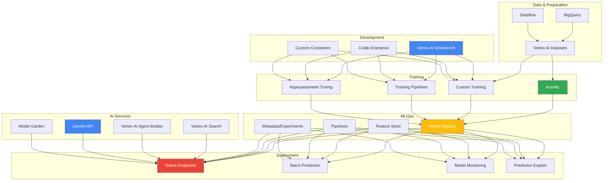
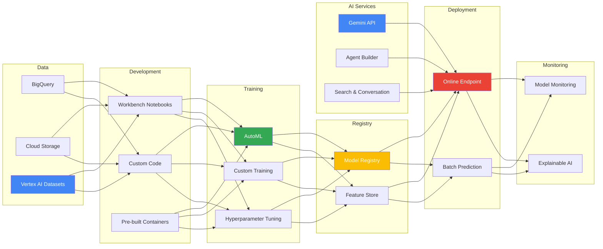

<!-- Clear Language: Keep sentences under 50 words -->
# GCP Vertex AI — Unified ML Platform, AutoML, MLOps

## Learning Objectives

| Objective | Description |
|-----------|-------------|
| LO1 | Navigate Vertex AI suite: Workbench, Training, Prediction, Pipelines |
| LO2 | Build AutoML models for tabular, image, text, and video data |
| LO3 | Implement custom training with pre-built and custom containers |
| LO4 | Deploy models to endpoints with autoscaling and monitoring |
| LO5 | Use Model Registry, Feature Store, and Pipelines for MLOps |
| LO6 | Build AI agents with Vertex AI Agent Builder and Gemini |

## Introduction

Vertex AI is Google Cloud's unified ML platform that combines AutoML, custom training, model deployment, and MLOps. It integrates with BigQuery, Dataflow, and other GCP services. AI engineers use Vertex AI to build end-to-end ML pipelines at scale.

## Prerequisites

- Basic cloud computing knowledge
- Python programming and ML fundamentals
- Familiarity with Docker containers

## Key Terminology

**Key Terms**: Core vocabulary and concepts for this topic.

**Definition**: Essential terms you must know for interviews and production work.

## Theory

### Vertex AI Suite Overview



### Vertex AI Workbench

```python
# Vertex AI Workbench provides Jupyter-based development environment
# Pre-installed with: TensorFlow, PyTorch, JAX, CUDA, cuDNN

# Check environment
import vertexai
from google.cloud import aiplatform

vertexai.init(project="my-project", location="us-central1")
print(f"Vertex AI version: {aiplatform.__version__}")

!gcloud config list project
!nvidia-smi  # Check GPU if using GPU instance
```

### Vertex AI Datasets

```python
from google.cloud import aiplatform

# Create tabular dataset from BigQuery
dataset = aiplatform.TabularDataset.create(
    display_name="customer_churn_data",
    gcs_source="gs://my-bucket/data/churn_data.csv",
    project="my-project",
    location="us-central1",
)

# Import from BigQuery
bq_dataset = aiplatform.TabularDataset.create(
    display_name="churn_from_bq",
    bq_source="bq://project.dataset.churn_table",
)

# Image dataset
image_dataset = aiplatform.ImageDataset.create(
    display_name="product_images",
    gcs_source="gs://my-bucket/images/*.csv",
    import_schema_uri=aiplatform.schema.dataset.ioformat.image.single_label_classification,
)

# Text dataset
text_dataset = aiplatform.TextDataset.create(
    display_name="customer_reviews",
    gcs_source="gs://my-bucket/reviews/*.jsonl",
    import_schema_uri=aiplatform.schema.dataset.ioformat.text.single_label_classification,
)
```

### AutoML Training

```python
from google.cloud import aiplatform

# AutoML Tabular classification
job = aiplatform.AutoMLTabularTrainingJob(
    display_name="churn_automl",
    optimization_prediction_type="classification",
    optimization_objective="maximize-au-roc",
    budget_milli_node_hours=1000,  # ~1 hour training
)

model = job.run(
    dataset=dataset,
    target_column="churned",
    training_fraction_split=0.8,
    validation_fraction_split=0.1,
    test_fraction_split=0.1,
    predefined_split_column_name=None,
    weight_column=None,
    budget_milli_node_hours=1000,
    disable_early_stopping=False,
    export_evaluated_data_items=True,
    export_evaluated_data_items_bigquery_destination="bq://project.dataset.evaluations",
)

print(f"Model: {model.resource_name}")
print(f"Model URI: {model.uri}")

# Evaluate
evaluation = model.evaluate()
for metric in evaluation.metrics:
    print(f"{metric.name}: {metric.value}")

# List model evaluations
eval_list = model.list_model_evaluations()
for ev in eval_list:
    print(f"AUC ROC: {ev.metrics['auRoc']}")
    print(f"Log Loss: {ev.metrics['logLoss']}")
    print(f"Precision/Recall: available at thresholds")

# AutoML Image classification
image_job = aiplatform.AutoMLImageTrainingJob(
    display_name="product_classifier",
    prediction_type="classification",
    multi_label=False,
    model_type="CLOUD",
    budget_milli_node_hours=20000,
)

image_model = image_job.run(
    dataset=image_dataset,
    model_display_name="product_classifier_v1",
    training_fraction_split=0.8,
    test_fraction_split=0.2,
)

# AutoML Text classification
text_job = aiplatform.AutoMLTextTrainingJob(
    display_name="sentiment_automl",
    prediction_type="classification",
)

text_model = text_job.run(
    dataset=text_dataset,
    model_display_name="sentiment_v1",
    training_fraction_split=0.8,
    validation_fraction_split=0.1,
    test_fraction_split=0.1,
)
```

### Custom Training

```python
from google.cloud import aiplatform
from google.cloud.aiplatform import training_jobs

# Custom container training
custom_job = training_jobs.CustomTrainingJob(
    display_name="custom_churn_model",
    container_uri="us-docker.pkg.dev/vertex-ai/training/tf-cpu.2-14:latest",
    model_serving_container_image_uri="us-docker.pkg.dev/vertex-ai/prediction/tf2-cpu.2-14:latest",
    project="my-project",
    location="us-central1",
    staging_bucket="gs://my-bucket/staging",
)

model = custom_job.run(
    script_path="trainer/train.py",  # Must include setup.py or requirements.txt
    model_display_name="custom_churn_v1",
    args=[
        "--data-dir", "gs://my-bucket/data/",
        "--epochs", "10",
        "--batch-size", "64",
        "--learning-rate", "0.001",
        "--model-dir", "gs://my-bucket/models/custom_churn_v1/",
    ],
    replica_count=1,
    machine_type="n1-standard-8",
    accelerator_type="NVIDIA_TESLA_T4",
    accelerator_count=1,
    worker_count=0,
    parameter_server_count=0,
    base_output_dir="gs://my-bucket/training_output/",
)

# Custom Python package training
custom_python_job = training_jobs.CustomPythonPackageTrainingJob(
    display_name="sklearn_churn_model",
    python_package_gcs_uri="gs://my-bucket/packages/trainer-0.1.tar.gz",
    python_module_name="trainer.task",
    container_uri="us-docker.pkg.dev/vertex-ai/training/tf-cpu.2-14:latest",
    model_serving_container_image_uri="us-docker.pkg.dev/vertex-ai/prediction/sklearn-cpu.0:latest",
)

# Hyperparameter tuning (HyperparameterTuningJob)
from google.cloud.aiplatform import hyperparameter_tuning as hp

parameter_spec = {
    "learning_rate": hp.DoubleParameterSpec(min=0.0001, max=0.1, scale="log"),
    "batch_size": hp.IntegerParameterSpec(min=32, max=256, scale="linear"),
    "optimizer": hp.CategoricalParameterSpec(values=["adam", "sgd", "rmsprop"]),
    "dropout_rate": hp.DoubleParameterSpec(min=0.1, max=0.5, scale="linear"),
}

hp_job = aiplatform.HyperparameterTuningJob(
    display_name="churn_hp_tuning",
    custom_job=custom_job,
    metric_spec={"accuracy": "maximize"},
    parameter_spec=parameter_spec,
    max_trial_count=50,
    parallel_trial_count=5,
    max_failed_trial_count=3,
    search_algorithm="grid"  # "grid", "random", "algo_study"
)

hp_job.run()
print(f"Best trial: {hp_job.best_trial}")
```

### Model Registry and Deployment

```python
from google.cloud import aiplatform

# List registered models
models = aiplatform.Model.list()
for model in models:
    print(f"Model: {model.display_name}, Version: {model.version_id}")

# Upload model to registry
model = aiplatform.Model.upload(
    display_name="churn_model_v2",
    artifact_uri="gs://my-bucket/models/churn_v2/",
    serving_container_image_uri="us-docker.pkg.dev/vertex-ai/prediction/sklearn-cpu.0:latest",
    description="Customer churn prediction model v2",
    parent_model="projects/my-project/locations/us-central1/models/123456789",  # For versioning
    is_default_version=True,
    version_aliases=["production", "stable"],
)

print(f"Uploaded model: {model.resource_name}")

# Deploy to online endpoint
endpoint = aiplatform.Endpoint.create(
    display_name="churn-prediction-endpoint",
    project="my-project",
    location="us-central1",
)

# Deploy model
deployment = endpoint.deploy(
    model=model,
    traffic_percentage=100,
    machine_type="n1-standard-4",
    min_replica_count=1,
    max_replica_count=5,
    accelerator_type=None,
    accelerator_count=None,
    enable_access_logging=True,
    enable_container_logging=True,
    deployed_model_display_name="churn_model_v2_deployment",
    explanation_metadata=None,
    explanation_parameters=None,
)

print(f"Endpoint: {endpoint.resource_name}")
print(f"Endpoint URI: {endpoint.uri}")

# Predict
instances = [
    {"age": 35, "tenure": 12, "monthly_charges": 75.50, "contract_type": "month-to-month"},
]
response = endpoint.predict(instances=instances)
for prediction in response.predictions:
    print(f"Churn probability: {prediction[0][0]:.4f}")

# Batch prediction
batch_job = model.batch_predict(
    job_display_name="churn_batch_prediction",
    gcs_source="gs://my-bucket/input/batch_input.jsonl",
    gcs_destination_prefix="gs://my-bucket/output/batch_predictions/",
    machine_type="n1-standard-4",
    batch_size=64,
    max_replica_count=10,
)
batch_job.wait()
print(f"Batch predictions at: {batch_job.output_info.gcs_output_directory}")
```

### Vertex AI Pipelines

```python
from google.cloud.aiplatform import pipeline_jobs
import kfp
from kfp import compiler, dsl

# Define pipeline components
@dsl.component(
    packages_to_install=["pandas", "scikit-learn"],
    base_image="python:3.10",
)
def load_data(project: str, dataset_id: str, output_dataset: dsl.Output[dsl.Dataset]):
    """Load data from BigQuery"""
    from google.cloud import bigquery
    import pandas as pd

    client = bigquery.Client(project=project)
    query = f"SELECT * FROM `{project}.{dataset_id}`"
    df = client.query(query).to_dataframe()
    df.to_csv(output_dataset.path, index=False)
    print(f"Loaded {len(df)} rows")


@dsl.component(
    packages_to_install=["scikit-learn", "pandas", "joblib"],
    base_image="python:3.10",
)
def train_model(
    input_dataset: dsl.Input[dsl.Dataset],
    output_model: dsl.Output[dsl.Model],
    learning_rate: float = 0.001,
    n_estimators: int = 100,
):
    """Train XGBoost model"""
    import pandas as pd
    import joblib
    from sklearn.ensemble import GradientBoostingClassifier
    from sklearn.model_selection import train_test_split

    df = pd.read_csv(input_dataset.path)
    X = df.drop("target", axis=1)
    y = df["target"]

    model = GradientBoostingClassifier(
        learning_rate=learning_rate,
        n_estimators=n_estimators,
    )
    model.fit(X, y)
    joblib.dump(model, output_model.path)
    print(f"Model trained with {n_estimators} estimators")


@dsl.component(
    packages_to_install=["scikit-learn", "pandas", "joblib"],
    base_image="python:3.10",
)
def evaluate_model(
    input_dataset: dsl.Input[dsl.Dataset],
    input_model: dsl.Input[dsl.Model],
    metrics_output: dsl.Output[dsl.Metrics],
):
    """Evaluate model performance"""
    import pandas as pd
    import joblib
    from sklearn.metrics import accuracy_score, roc_auc_score

    df = pd.read_csv(input_dataset.path)
    X = df.drop("target", axis=1)
    y = df["target"]

    model = joblib.load(input_model.path)
    y_pred = model.predict(X)
    y_prob = model.predict_proba(X)[:, 1]

    accuracy = accuracy_score(y, y_pred)
    auc = roc_auc_score(y, y_prob)

    metrics_output.log_metric("accuracy", accuracy)
    metrics_output.log_metric("auc_roc", auc)
    print(f"Accuracy: {accuracy:.4f}, AUC: {auc:.4f}")


@dsl.pipeline(name="churn-training-pipeline")
def churn_pipeline(
    project: str = "my-project",
    dataset_id: str = "ml_dataset.churn_data",
    learning_rate: float = 0.01,
    n_estimators: int = 100,
):
    load_op = load_data(project=project, dataset_id=dataset_id)
    train_op = train_model(
        input_dataset=load_op.outputs["output_dataset"],
        learning_rate=learning_rate,
        n_estimators=n_estimators,
    )
    evaluate_model(
        input_dataset=load_op.outputs["output_dataset"],
        input_model=train_op.outputs["output_model"],
    )


# Compile and run
compiler.Compiler().compile(churn_pipeline, "churn_pipeline.json")

pipeline_job = pipeline_jobs.PipelineJob(
    display_name="churn-training-pipeline-run-1",
    template_path="churn_pipeline.json",
    pipeline_root="gs://my-bucket/pipeline_root/",
    parameter_values={
        "project": "my-project",
        "dataset_id": "ml_dataset.churn_data",
        "learning_rate": 0.01,
        "n_estimators": 150,
    },
    enable_caching=True,
)

pipeline_job.run(sync=False)
print(f"Pipeline job: {pipeline_job.resource_name}")
```

### Vertex AI Feature Store

```python
from google.cloud.aiplatform import Featurestore, EntityType, Feature

# Create feature store
fs = Featurestore.create(
    display_name="customer_features",
    project="my-project",
    location="us-central1",
    online_serving_config={"fixed_node_count": 3},
)

# Create entity type (like a table)
entity = EntityType.create(
    display_name="customer",
    featurestore_id=fs.name,
    description="Customer demographic and behavioral features",
    labels={"team": "ml", "environment": "prod"},
)

# Create features
features = [
    Feature.create(
        display_name="age",
        entity_type_id=entity.name,
        value_type="DOUBLE",
        description="Customer age",
    ),
    Feature.create(
        display_name="tenure_months",
        entity_type_id=entity.name,
        value_type="DOUBLE",
    ),
    Feature.create(
        display_name="avg_monthly_spend",
        entity_type_id=entity.name,
        value_type="DOUBLE",
    ),
    Feature.create(
        display_name="num_support_tickets",
        entity_type_id=entity.name,
        value_type="DOUBLE",
    ),
    Feature.create(
        display_name="contract_type",
        entity_type_id=entity.name,
        value_type="STRING",
    ),
]

# Ingest features from BigQuery
fs.ingest_from_bq(
    featurestore_id=fs.name,
    entity_type_id=entity.name,
    bq_source_uri="bq://project.dataset.customer_features_latest",
    feature_ids=["age", "tenure_months", "avg_monthly_spend",
                 "num_support_tickets", "contract_type"],
    disable_online_serving=False,
)

# Online serving for real-time inference
from google.cloud.aiplatform import FeaturestoreOnlineServingClient
online_client = FeaturestoreOnlineServingClient()

features = online_client.read_feature_values(
    entity_type=entity.name,
    entity_ids=["customer_12345", "customer_67890"],
    feature_selector={"id_config": {"allowed_feature_ids": ["age", "tenure_months"]}},
)

for entity_id, feature_map in features:
    print(f"Entity: {entity_id}")
    for feat_name, feat_value in feature_map.items():
        print(f"  {feat_name}: {feat_value}")
```

### Vertex AI Gemini API

```python
import vertexai
from vertexai.preview.generative_models import GenerativeModel, Part, HarmCategory, HarmBlockThreshold
from vertexai.language_models import TextEmbeddingModel, ChatModel

vertexai.init(project="my-project", location="us-central1")

# Gemini Pro
model = GenerativeModel("gemini-1.5-pro")

response = model.generate_content(
    "Explain the difference between AutoML and custom training in Vertex AI.",
    generation_config={
        "max_output_tokens": 500,
        "temperature": 0.2,
        "top_p": 0.95,
        "top_k": 40,
    },
    safety_settings={
        HarmCategory.HARM_CATEGORY_HATE_SPEECH: HarmBlockThreshold.BLOCK_MEDIUM_AND_ABOVE,
        HarmCategory.HARM_CATEGORY_DANGEROUS_CONTENT: HarmBlockThreshold.BLOCK_MEDIUM_AND_ABOVE,
    },
)
print(response.text)

# Multimodal: image + text
image_response = model.generate_content([
    Part.from_uri("gs://my-bucket/images/product.jpg", mime_type="image/jpeg"),
    "Describe this product and suggest similar items.",
])
print(image_response.text)

# Streaming
stream = model.generate_content(
    "Write a detailed blog post about MLOps best practices on Vertex AI.",
    stream=True,
)
for chunk in stream:
    print(chunk.text, end="")

# Chat with history
chat = model.start_chat()
chat.send_message("What is Vertex AI Pipelines?")
print(chat.last.text)

chat.send_message("How does it compare to Kubeflow?")
print(chat.last.text)

# Embeddings
embedding_model = TextEmbeddingModel.from_pretrained("textembedding-gecko@003")
embeddings = embedding_model.get_embeddings([
    "Vertex AI is Google's unified ML platform",
    "AutoML automates model training",
])
for emb in embeddings:
    print(f"Dimension: {len(emb.values)}, First 3 values: {emb.values[:3]}")

# Count tokens
tokens = model.count_tokens("How do I deploy a model to Vertex AI?")
print(f"Token count: {tokens.total_tokens}")
```

### Vertex AI Agent Builder

```python
# Vertex AI Agent Builder (formerly Generative AI Studio)
# Build search apps and conversational agents

from vertexai.preview.generative_models import GenerativeModel
from vertexai.preview import rag
from vertexai.preview.rag import RagCorpus, RagResource

# Create a RAG corpus for search
rag_corpus = RagCorpus.create(
    display_name="company_docs",
    description="Company documentation for RAG-based search",
)

# Import documents
rag.import_files(
    corpus_name=rag_corpus.name,
    paths=[
        "gs://my-bucket/docs/policy.pdf",
        "gs://my-bucket/docs/faq.pdf",
        "gs://my-bucket/docs/onboarding.md",
    ],
    chunk_size=1024,
    chunk_overlap=200,
)

# Search with RAG
rag_model = GenerativeModel("gemini-1.5-pro")
rag_response = rag_model.generate_content(
    "What is the company's remote work policy?",
    tools=[rag_corpus],
)

for citation in rag_response.citations:
    print(f"Source: {citation.title}")
    print(f"Text: {citation.text[:200]}...")

print(f"\nAnswer: {rag_response.text}")

# Conversational agent
from vertexai.preview.generative_models import ChatSession

agent = GenerativeModel(
    "gemini-1.5-pro",
    system_instruction=[
        "You are a helpful customer support agent for an ML platform.",
        "Answer accurately based on the documentation provided.",
        "If you don't know the answer, say you'll escalate to a human.",
    ],
)

chat_session = agent.start_chat()
response = chat_session.send_message("How do I deploy a TensorFlow model?")
print(response.text)
```

### Model Monitoring

```python
from google.cloud import aiplatform

# Enable model monitoring on deployed endpoint
endpoint = aiplatform.Endpoint(endpoint_name="projects/my-project/locations/us-central1/endpoints/12345")

# Get existing deployment
deployed_model = endpoint.list_deployed_models()[0]

# Enable monitoring
endpoint.update(
    deployed_model_id=deployed_model.id,
    enable_model_monitoring=True,
    model_monitoring_config={
        "objective_config": {
            "skew_thresholds": {
                "age": {"value": 0.3},
                "tenure_months": {"value": 0.3},
            },
            "drift_thresholds": {
                "age": {"value": 0.3},
                "avg_monthly_spend": {"value": 0.3},
            },
            "prediction_drift_threshold": 0.3,
            "explanation_config": {
                "enable_feature_attributes": True,
            },
        },
        "alert_config": {
            "enable_alerting": True,
            "email_alert_configs": [
                {"user_emails": ["ml-team@example.com"]}
            ],
        },
        "sampling_rate": 0.8,
        "monitoring_interval_days": 1,
    },
)

print("Model monitoring enabled")

# List monitoring jobs
monitoring_jobs = aiplatform.ModelMonitoringJob.list()
for job in monitoring_jobs:
    print(f"Monitoring job: {job.display_name}, status: {job.state}")
    if job.statistics:
        for stat in job.statistics.tabular_statistics:
            print(f"  Feature: {stat.feature_name}")
            print(f"  Skew: {stat.skew}")
            print(f"  Drift: {stat.drift}")
```

### Vertex AI Pipeline Diagram



## Real Example

Think of Vertex AI as a complete car factory. AutoML is the assembly line robot — feed it raw materials (data) and it produces a car (model) automatically. Custom training is the master mechanic — you design the engine architecture, choose the parts, and tune every component. Model Registry is the showroom where finished cars are stored with version tags. Endpoints are the dealership test drives — customers (applications) take the car for a spin (inference). Feature Store is the parts catalog — standardized components (features) shared across multiple car models. Pipelines are the factory conveyor belt — each step (data prep, assembly, painting, inspection) happens in sequence automatically. Model Monitoring is the quality control team that checks for wear and tear (drift) over time.

## Code Example

```python
#!/usr/bin/env python3
"""Complete Vertex AI MLOps pipeline: training, deployment, monitoring"""

import json
import time
from typing import Dict, List
import vertexai
from google.cloud import aiplatform
from vertexai.preview.generative_models import GenerativeModel


class VertexAIMLOps:
    """End-to-end MLOps workflow on Vertex AI"""

    def __init__(self, project: str, location: str = "us-central1", staging_bucket: str = None):
        vertexai.init(project=project, location=location, staging_bucket=staging_bucket)
        self.project = project
        self.location = location
        self.staging_bucket = staging_bucket

    def create_dataset(self, gcs_source: str, display_name: str) -> aiplatform.TabularDataset:
        """Create and import tabular dataset"""
        dataset = aiplatform.TabularDataset.create(
            display_name=display_name,
            gcs_source=gcs_source,
        )
        print(f"Dataset created: {dataset.resource_name}")
        return dataset

    def train_automl(self, dataset: aiplatform.TabularDataset, target: str,
                     display_name: str, budget_hours: int = 1) -> aiplatform.Model:
        """Train AutoML model"""
        job = aiplatform.AutoMLTabularTrainingJob(
            display_name=display_name,
            optimization_prediction_type="classification",
            budget_milli_node_hours=budget_hours * 1000,
        )
        model = job.run(
            dataset=dataset,
            target_column=target,
            training_fraction_split=0.8,
            validation_fraction_split=0.1,
            test_fraction_split=0.1,
            disable_early_stopping=False,
        )
        print(f"Model trained: {model.display_name}")
        print(f"Resource name: {model.resource_name}")
        return model

    def deploy_model(self, model: aiplatform.Model, display_name: str,
                     machine_type: str = "n1-standard-4",
                     min_replicas: int = 1, max_replicas: int = 3) -> aiplatform.Endpoint:
        """Deploy model to online endpoint with autoscaling"""
        endpoint = aiplatform.Endpoint.create(
            display_name=f"{display_name}-endpoint",
        )
        endpoint.deploy(
            model=model,
            traffic_percentage=100,
            machine_type=machine_type,
            min_replica_count=min_replicas,
            max_replica_count=max_replicas,
            enable_access_logging=True,
        )
        print(f"Endpoint deployed: {endpoint.resource_name}")
        print(f"Endpoint URI: {endpoint.uri}")
        return endpoint

    def predict(self, endpoint: aiplatform.Endpoint, instances: List[Dict]) -> List:
        """Run prediction on deployed endpoint"""
        response = endpoint.predict(instances=instances)
        return response.predictions

    def batch_predict(self, model: aiplatform.Model, input_uri: str,
                      output_uri: str, display_name: str) -> str:
        """Run batch prediction"""
        job = model.batch_predict(
            job_display_name=display_name,
            gcs_source=input_uri,
            gcs_destination_prefix=output_uri,
            machine_type="n1-standard-4",
            max_replica_count=5,
        )
        job.wait()
        output_dir = job.output_info.gcs_output_directory
        print(f"Batch predictions saved to: {output_dir}")
        return output_dir

    def generate_explanation(self, model: aiplatform.Model, endpoint: aiplatform.Endpoint,
                             instances: List[Dict]) -> None:
        """Get model explanations (feature importance)"""
        endpoint.deploy(
            model=model,
            traffic_percentage=100,
            machine_type="n1-standard-4",
            min_replica_count=1,
            explanation_metadata={
                "inputs": {},
                "outputs": {},
            },
            explanation_parameters={"sampled_shapley_attribution": {"path_count": 10}},
        )

        response = endpoint.explain(instances=instances)
        for i, explanation in enumerate(response.explanations):
            print(f"\nInstance {i + 1}:")
            for attribution in explanation.attributions:
                for feat, val in zip(attribution.feature_attributes, attribution.attribution_values):
                    print(f"  {feat}: {val:.4f}")

    def query_gemini(self, prompt: str) -> str:
        """Query Gemini model"""
        model = GenerativeModel("gemini-1.5-pro")
        response = model.generate_content(prompt)
        return response.text


if __name__ == "__main__":
    mops = VertexAIMLOps(
        project="my-gcp-project",
        location="us-central1",
        staging_bucket="gs://ml-staging-bucket",
    )

    # 1. Create dataset
    dataset = mops.create_dataset(
        gcs_source="gs://data-bucket/churn/data_*.csv",
        display_name="customer_churn",
    )

    # 2. Train AutoML model
    model = mops.train_automl(
        dataset=dataset,
        target="churned",
        display_name="churn_automl_v1",
        budget_hours=2,
    )

    # 3. Deploy endpoint
    endpoint = mops.deploy_model(
        model=model,
        display_name="churn-predictor",
        machine_type="n1-standard-4",
        min_replicas=1,
        max_replicas=3,
    )

    # 4. Test prediction
    test_instances = [
        {"age": 45, "tenure": 24, "monthly_charges": 89.99,
         "contract_type": "two_year", "num_tickets": 0},
    ]
    predictions = mops.predict(endpoint, test_instances)
    print(f"Prediction: {predictions}")

    # 5. Get Gemini summary of model
    summary = mops.query_gemini(
        f"Summarize the deployment of model {model.display_name} to Vertex AI."
    )
    print(f"AI Summary: {summary}")
```

**Expected Output**:
```text
Dataset created: projects/my-gcp-project/locations/us-central1/datasets/12345
Model trained: churn_automl_v1
Resource name: projects/my-gcp-project/locations/us-central1/models/67890
Endpoint deployed: projects/my-gcp-project/locations/us-central1/endpoints/11111
Endpoint URI: https://us-central1-aiplatform.googleapis.com/v1/...
Prediction: [[0.0923, 0.9077]]
AI Summary: The model churn_automl_v1 is deployed to Vertex AI endpoint...
```

## Interview Questions

<details class="tp-qa-card" data-qid="dcs13-q1">
  <summary class="tp-qa-question">
    <span class="tp-qa-status"></span>
    Q1: What is the difference between AutoML and Custom Training in Vertex AI?
  </summary>
  <div class="tp-qa-answer">
    <p><strong>AutoML</strong> is Google's automated ML service. You provide labeled data, AutoML automatically: selects the best algorithm (neural architecture search), performs feature engineering, tunes hyperparameters, and handles train/val/test splits. You don't write training code. Best for: tabular classification/regression, image classification, text classification. Limited control over the model architecture. <strong>Custom Training</strong> lets you bring your own code (Python, TensorFlow, PyTorch, JAX, scikit-learn). You control: model architecture, training loop, preprocessing, evaluation. Run on pre-built containers (TF, PyTorch) or custom Docker images. Best for: novel architectures, research, complex pipelines, fine-tuning LLMs.</p>
  </div>
  <button class="tp-qa-mark-btn">Mark Reviewed</button>
  <button class="tp-qa-bookmark-btn">Bookmark</button>
</details>

<details class="tp-qa-card" data-qid="dcs13-q2">
  <summary class="tp-qa-question">
    <span class="tp-qa-status"></span>
    Q2: Explain Vertex AI Pipelines and how they differ from Kubeflow Pipelines.
  </summary>
  <div class="tp-qa-answer">
    <p>Vertex AI Pipelines is a serverless ML pipeline orchestration service built on Kubeflow Pipelines (KFP) and Apache Beam. <strong>Vertex AI Pipelines</strong> advantages: <strong>1) Serverless</strong> — no cluster to manage. <strong>2) Integration</strong> — native with Vertex AI services (AutoML, custom training, endpoints). <strong>3) Caching</strong> — automatic caching of component outputs. <strong>4) ML Metadata</strong> — built-in experiment tracking. <strong>5) Monitoring</strong> — integrated with Cloud Logging and Monitoring. <strong>Kubeflow Pipelines</strong> runs on your own Kubernetes cluster (GKE). More flexible but requires cluster management. Vertex AI Pipelines is the managed version. Both use the same KFP SDK for pipeline definition. Choose Vertex AI Pipelines for managed MLOps; choose KFP for full control.</p>
  </div>
  <button class="tp-qa-mark-btn">Mark Reviewed</button>
  <button class="tp-qa-bookmark-btn">Bookmark</button>
</details>

<details class="tp-qa-card" data-qid="dcs13-q3">
  <summary class="tp-qa-question">
    <span class="tp-qa-status"></span>
    Q3: How does Vertex AI Feature Store work and when should you use it?
  </summary>
  <div class="tp-qa-answer">
    <p>Feature Store is a centralized repository for ML features. <strong>Entity types</strong> define logical groups (e.g., "customer", "product"). <strong>Features</strong> are typed attributes (age, category, embedding). Features have <strong>online serving</strong> (low-latency for real-time inference) and <strong>offline serving</strong> (BigQuery for batch training). <strong>Use when</strong>: multiple models share the same features, features need consistent values between training and serving (avoiding training-serving skew), features have complex transformations, or teams need feature discovery. <strong>Don't use</strong>: for simple datasets used by one model, or when latency requirements are sub-millisecond (use in-memory cache).</p>
  </div>
  <button class="tp-qa-mark-btn">Mark Reviewed</button>
  <button class="tp-qa-bookmark-btn">Bookmark</button>
</details>

<details class="tp-qa-card" data-qid="dcs13-q4">
  <summary class="tp-qa-question">
    <span class="tp-qa-status"></span>
    Q4: How do you deploy a model to Vertex AI with autoscaling?
  </summary>
  <div class="tp-qa-answer">
    <p>First, upload the model to Model Registry with artifact URI and serving container. Then create an Endpoint and deploy. Autoscaling config: <strong>min_replica_count</strong> — minimum instances (usually 1). <strong>max_replica_count</strong> — maximum instances (e.g., 10). Vertex AI automatically scales based on CPU utilization and requests per second. <strong>Scaling metrics</strong>: you can set target CPU utilization. <strong>Traffic splitting</strong>: deploy multiple versions to the same endpoint with traffic percentages for canary testing. <strong>Monitoring</strong>: enable access logging, container logging, and model monitoring for skew/drift detection. Use <code>gcloud ai endpoints deploy-model</code> or Python SDK's <code>endpoint.deploy()</code>.</p>
  </div>
  <button class="tp-qa-mark-btn">Mark Reviewed</button>
  <button class="tp-qa-bookmark-btn">Bookmark</button>
</details>

<details class="tp-qa-card" data-qid="dcs13-q5">
  <summary class="tp-qa-question">
    <span class="tp-qa-status"></span>
    Q5: Explain Vertex AI Model Monitoring and how it detects drift.
  </summary>
  <div class="tp-qa-answer">
    <p>Model Monitoring continuously checks deployed models for <strong>training-serving skew</strong> (difference between training data and online serving data) and <strong>prediction drift</strong> (changes in prediction distribution over time). It compares online predictions against a baseline (training data or a previous time window) using statistical tests. For numerical features: JS divergence, L-infinity distance. For categorical features: chi-squared test. Configurable alert thresholds per feature. Monitoring runs daily, samples a configurable percentage of predictions. Results are written to BigQuery and alerts can be sent via email, Pub/Sub, or Cloud Monitoring. If drift is detected, the model should be retrained with more recent data.</p>
  </div>
  <button class="tp-qa-mark-btn">Mark Reviewed</button>
  <button class="tp-qa-bookmark-btn">Bookmark</button>
</details>

<details class="tp-qa-card" data-qid="dcs13-q6">
  <summary class="tp-qa-question">
    <span class="tp-qa-status"></span>
    Q6: What is Vertex AI Model Garden and what models does it offer?
  </summary>
  <div class="tp-qa-answer">
    <p>Model Garden is a curated hub of foundation models and ML tools. It offers: <strong>Google models</strong>: Gemini 1.5 Pro/Flash, Gemma open models (2B, 7B, 27B), PaLM 2, Codey, Imagen (image generation). <strong>Open source models</strong>: Llama 3, Mistral, Claude 3 (Anthropic), Falcon, Stable Diffusion. <strong>Task-specific models</strong>: Chirp (speech), Med-PaLM (healthcare), Sec-PaLM (security). <strong>Model types</strong>: Foundation models (generative), task-specific (classification, entity extraction, summarization), embedding models. Models can be: <strong>used via API</strong> (Gemini, Imagen), <strong>fine-tuned</strong> (Gemma, Llama), or <strong>deployed</strong> to endpoints. Model Garden simplifies discovery and deployment of pre-built models.</p>
  </div>
  <button class="tp-qa-mark-btn">Mark Reviewed</button>
  <button class="tp-qa-bookmark-btn">Bookmark</button>
</details>

<details class="tp-qa-card" data-qid="dcs13-q7">
  <summary class="tp-qa-question">
    <span class="tp-qa-status"></span>
    Q7: How does Vertex AI Workbench compare to JupyterLab or Colab?
  </summary>
  <div class="tp-qa-answer">
    <p>Vertex AI Workbench is a managed JupyterLab environment pre-integrated with GCP services. <strong>Advantages over JupyterLab</strong>: pre-installed ML frameworks (TF, PyTorch, JAX, CUDA), one-click GPU attachment, auto-shutdown to save costs, deep GCP integration (BigQuery, Dataflow, Vertex AI), version-controlled notebooks with Git sync, team collaboration with shared instances. <strong>vs Colab</strong>: Colab is free but limited (12-hour runtime, 16GB RAM, T4 GPU). Workbench is enterprise-grade: persistent storage (100GB+), custom machine types (up to A100 GPUs), VPC network control, no session timeouts (if you configure). Best for: ML development teams, production ML research, and training large models.</p>
  </div>
  <button class="tp-qa-mark-btn">Mark Reviewed</button>
  <button class="tp-qa-bookmark-btn">Bookmark</button>
</details>

<details class="tp-qa-card" data-qid="dcs13-q8">
  <summary class="tp-qa-question">
    <span class="tp-qa-status"></span>
    Q8: Describe a complete MLOps workflow using Vertex AI.
  </summary>
  <div class="tp-qa-answer">
    <p><strong>1) Data preparation</strong>: Store data in BigQuery or GCS. Use Dataflow for transformations. <strong>2) Dataset</strong>: Create Vertex AI Dataset with labels for supervised learning. <strong>3) Pipeline</strong>: Define Vertex AI Pipeline with steps: data validation, training, evaluation, deployment. <strong>4) Training</strong>: AutoML or Custom Training with hyperparameter tuning. Track experiments in Vertex AI Experiments. <strong>5) Model Registry</strong>: Register the best model with version aliases (staging, production). <strong>6) Feature Store</strong>: Store engineered features for consistent online/offline serving. <strong>7) Deployment</strong>: Deploy to online endpoint with autoscaling and traffic splitting. <strong>8) Monitoring</strong>: Enable Model Monitoring for skew/drift detection. <strong>9) Trigger</strong>: Use Cloud Scheduler or Eventarc to trigger retraining pipelines based on schedule or drift alerts. <strong>10) CI/CD</strong>: Use Cloud Build + Vertex AI Pipelines for continuous training and deployment.</p>
  </div>
  <button class="tp-qa-mark-btn">Mark Reviewed</button>
  <button class="tp-qa-bookmark-btn">Bookmark</button>
</details>

<details class="tp-qa-card" data-qid="dcs13-q9">
  <summary class="tp-qa-question">
    <span class="tp-qa-status"></span>
    Q9: How does Vertex AI support LLM fine-tuning and deployment?
  </summary>
  <div class="tp-qa-answer">
    <p><strong>Fine-tuning</strong>: Vertex AI supports supervised fine-tuning (SFT) for foundation models in Model Garden. Use the <code>tuningJobs</code> API or UI to fine-tune Gemma, Llama, or other models. Configure: base model, training data (text or instruction format), learning rate, batch size, and training steps. Supports LoRA (Low-Rank Adaptation) for efficient fine-tuning. <strong>Deployment</strong>: Deploy fine-tuned models as endpoints with GPU support (T4, V100, A100). <strong>Serving</strong>: TensorRT-LLM or vLLM for optimized inference. <strong>Cost optimization</strong>: Use model quantization (int8, int4) and continuous batching. <strong>Prompt optimization</strong>: Vertex AI prompt design tools and automated prompt tuning (optimization).</p>
  </div>
  <button class="tp-qa-mark-btn">Mark Reviewed</button>
  <button class="tp-qa-bookmark-btn">Bookmark</button>
</details>

<details class="tp-qa-card" data-qid="dcs13-q10">
  <summary class="tp-qa-question">
    <span class="tp-qa-status"></span>
    Q10: Compare Vertex AI with SageMaker (AWS) and Azure ML.
  </summary>
  <div class="tp-qa-answer">
    <p><strong>Vertex AI</strong>: Best integration with GCP ecosystem (BigQuery, Dataflow, GCS, Gemini). Strong in: AutoML (tabular, image, video), pipelines (KFP-based), Model Garden (foundation models), and explainable AI. MLOps capabilities are modern with ML Metadata and experiment tracking built-in. <strong>SageMaker</strong>: Most mature with longest track record. Strong in: built-in algorithms, Clarify (bias detection), Model Monitor, Ground Truth (data labeling), and Canvas (no-code ML). <strong>Azure ML</strong>: Best enterprise integration (Active Directory, Azure DevOps). Strong in: AutoML, designer (drag-and-drop), responsible AI dashboard, and ONNX export. All three support custom training, GPU clusters, and MLOps. Choose based on your cloud ecosystem.</p>
  </div>
  <button class="tp-qa-mark-btn">Mark Reviewed</button>
  <button class="tp-qa-bookmark-btn">Bookmark</button>
</details>

## Chapter Quiz

**Q1**: Which Vertex AI service provides automated model training without writing code?

a) Custom Training
b) AutoML
c) Workbench
d) Pipelines

<details class="tp-qa-card" data-qid="dcs13-quiz1"><summary>Show Answer</summary><div class="tp-qa-answer"><p><strong>Answer: b) AutoML</strong></p><p>AutoML automatically selects algorithms, engineers features, and tunes hyperparameters — no code needed.</p></div></details>

**Q2**: What is the recommended approach for feature management across multiple models?

a) BigQuery
b) Cloud Storage
c) Feature Store
d) Model Registry

<details class="tp-qa-card" data-qid="dcs13-quiz2"><summary>Show Answer</summary><div class="tp-qa-answer"><p><strong>Answer: c) Feature Store</strong></p><p>Feature Store provides consistent feature serving for both training (offline) and inference (online) across models.</p></div></details>

**Q3**: Which foundation model is available in Vertex AI Model Garden?

a) Gemini
b) GPT-4
c) Claude 3
d) Both a and c

<details class="tp-qa-card" data-qid="dcs13-quiz3"><summary>Show Answer</summary><div class="tp-qa-answer"><p><strong>Answer: d) Both a and c</strong></p><p>Model Garden offers Google's Gemini and third-party models like Claude 3 (Anthropic), Llama 3 (Meta), and Mistral.</p></div></details>

**Q4**: What does Vertex AI Model Monitoring detect?

a) Model accuracy degradation
b) Data skew and prediction drift
c) Infrastructure failures
d) Cost overruns

<details class="tp-qa-card" data-qid="dcs13-quiz4"><summary>Show Answer</summary><div class="tp-qa-answer"><p><strong>Answer: b) Data skew and prediction drift</strong></p><p>Model Monitoring detects training-serving skew (difference from training data) and prediction drift (changes in predictions over time).</p></div></details>

**Q5**: Which Vertex AI component orchestrates multi-step ML workflows?

a) Workbench
b) Pipelines
c) Feature Store
d) Batch Prediction

<details class="tp-qa-card" data-qid="dcs13-quiz5"><summary>Show Answer</summary><div class="tp-qa-answer"><p><strong>Answer: b) Pipelines</strong></p><p>Vertex AI Pipelines orchestrates ML workflows with steps like data validation, training, evaluation, and deployment in a DAG.</p></div></details>

## Exercises

**Easy** — Create a Vertex AI dataset from a CSV file in GCS. List the features and preview the data.

**Easy** — Train an AutoML tabular classification model on a public dataset. View evaluation metrics.

**Medium** — Deploy a model to an online endpoint with autoscaling (min=1, max=3). Send test predictions.

**Medium** — Create a Vertex AI Pipeline with three steps: data loading, training, and evaluation. Run the pipeline.

**Hard** — Build a complete MLOps system: AutoML model, Feature Store for features, online endpoint, and Model Monitoring with skew detection alerts.

## Common Mistakes

1. Not using Vertex AI Feature Store — leads to training-serving skew from inconsistent features
2. Ignoring model monitoring — deployed models degrade silently as data drifts
3. Over-provisioning endpoints — set min/max replicas for cost-effective autoscaling
4. Using AutoML for tasks requiring custom architecture (e.g., custom neural network designs)
5. Not caching pipeline components — re-running unchanged steps wastes time and money

## Revision Notes

- Vertex AI: unified ML platform — AutoML, Custom Training, Pipelines, Endpoints
- AutoML: no-code ML for tabular, image, text, video; limited to standard architectures
- Custom Training: bring your own code, containers; full control over model and training
- Pipelines: serverless KFP-based DAGs with caching, component reuse, and metadata tracking
- Model Registry: versioned model storage with aliases (staging, production)
- Feature Store: centralized features with online (low-latency) and offline (BigQuery) serving
- Endpoints: online (real-time) and batch (async) with autoscaling and traffic splitting
- Model Monitoring: skew/drift detection with configurable alerts
- Model Garden: curated hub of foundation models (Gemini, Llama, Claude)
- Workbench: managed JupyterLab with GPU, GCP integration

## Placement Section

### Top 10 Interview Questions

#### Google Style
1. Design an MLOps platform on Vertex AI that supports 50 ML engineers with CI/CD, monitoring, and governance.
2. Compare training-serving skew prevention strategies across Vertex AI, SageMaker, and Azure ML.

#### Amazon Style
1. Tell me about a time you built an end-to-end ML pipeline. What tools did you use and why?
2. How would you manage ML model versions, deployments, and rollbacks at scale?

#### Microsoft Style
1. How does Vertex AI integrate with Google's data ecosystem (BigQuery, Dataflow, Pub/Sub)?
2. What security and compliance features does Vertex AI offer for regulated industries?

#### NVIDIA Style
1. How would you train a large language model on Vertex AI with TPUs or multi-GPU clusters?
2. What Vertex AI features support distributed training and model parallelism?

#### AI Startup Style
1. Design a cost-effective ML platform on Vertex AI for a startup processing 10K predictions/hour.
2. What's the fastest way to deploy a pre-trained model for inference using Vertex AI?

### Resume Tips
- **Technical Skills**: Vertex AI, ML Pipelines, AutoML, MLOps, Feature Store, Model Deployment
- **Project Description**: "Built end-to-end MLOps pipeline on Vertex AI serving 100K predictions/day with automated retraining and drift monitoring"
- **Keywords**: Vertex AI, AutoML, MLOps, GCP, Model Registry, Pipelines, Feature Store

### Interview Day Checklist
- [ ] Understand Vertex AI components and their relationships
- [ ] Know AutoML vs Custom Training trade-offs
- [ ] Practice MLOps pipeline design
- [ ] Be ready to explain model monitoring and drift detection
- [ ] Know the GCP data ecosystem integration points

## Difficulty Level

**Level**: Advanced
**Estimated Study Time**: 45-60 minutes
**Prerequisites**: Cloud computing, ML fundamentals, Python

## Tips & Tricks

**Tip**: Start with Workbench notebooks for quick prototyping with GPU access.

**Tip**: Use Vertex AI Experiments to track all training runs — hyperparameters, metrics, and artifacts.

**Pro Tip**: Enable Vertex AI Feature Store for feature reuse across models to ensure consistency.

**Pro Tip**: Use Model Registry aliases (staging, production, champion) for deployment promotion.

## Memory Tricks

- **Vertex AI services**: **D**ataset, **A**utoML, **T**raining, **E**ndpoint, **M**onitoring = **DATEM**
- **MLOps stages**: **D**ata, **T**raining, **R**egistry, **D**eployment, **M**onitoring = **DTRDM**
- **3 clouds comparison**: **G**oogle = Vertex, **A**WS = SageMaker, **M**icrosoft = Azure ML = **GAM**

## Further Reading

- Google Cloud Vertex AI documentation
- "Building ML Pipelines" by Hannes Hapke
- Kubeflow Pipelines SDK documentation
- Google Cloud MLOps whitepaper

## Related Topics

- TensorFlow Extended (TFX) for production ML
- BigQuery ML for SQL-based ML
- Cloud Composer (Airflow) for workflow orchestration
- Google Cloud CI/CD with Cloud Build

## FAQs

**Q: Can I use PyTorch with Vertex AI?**
**A**: Yes, Vertex AI supports PyTorch via custom containers and pre-built PyTorch training images.

**Q: How is Vertex AI priced?**
**A**: Pay for: training compute (per hour), prediction compute (per hour + per node), storage, and API calls. AutoML has additional charges per node hour.

**Q: Does Vertex AI support Kubernetes?**
**A**: Yes, through GKE attach and custom containers. Vertex AI Pipelines can orchestrate containers on GKE.

## Important Notes

> **Note**: Vertex AI provides a unified SDK — one import for all ML operations.

> **Note**: Use Vertex AI Experiments for reproducibility and model lineage tracking.

> **Note**: Always enable Model Monitoring on production endpoints for early drift detection.

## Security Considerations

- Use VPC Service Controls to restrict data exfiltration
- Enable CMEK (Customer-Managed Encryption Keys) for training data and models
- Use Private Google Access for VPC networking
- Configure IAM roles with least privilege for Vertex AI resources
- Enable audit logging with Cloud Audit Logs

## Next Topic

After GCP Vertex AI, continue to the System Design module for designing large-scale systems.
