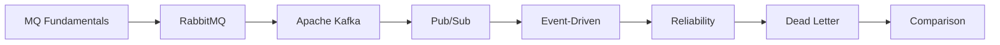
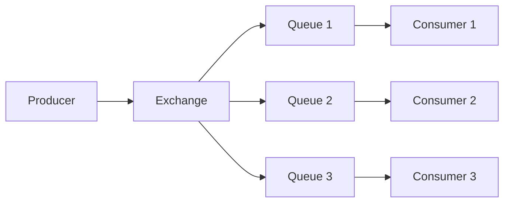
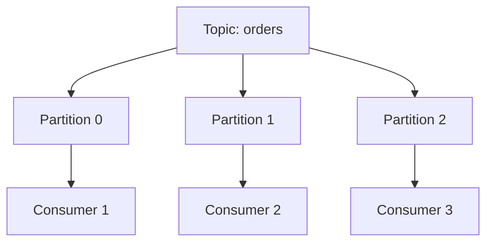

<!-- Clear Language: Keep sentences under 50 words -->
# Message Queues — RabbitMQ, Kafka, and Event-Driven Architecture

## Learning Objectives

| Objective | Description |
|-----------|-------------|
| LO1 | Understand message queue concepts: producers, consumers, topics |
| LO2 | Differentiate between RabbitMQ and Kafka use cases |
| LO3 | Implement publish/subscribe and point-to-point messaging |
| LO4 | Design event-driven architectures for microservices |
| LO5 | Handle message ordering, replay, and dead-letter queues |
| LO6 | Ensure reliable message processing with idempotency |

## Introduction

System design interviews test your ability to architect large-scale systems. Caching, load balancing, message queues, and database sharding are patterns you will apply daily. This module prepares you for both interviews and production.

## Prerequisites

- Basic programming knowledge
- Understanding of data structures

## Key Terminology

**Key Terms**: Core vocabulary and concepts for this topic.

**Definition**: Essential terms you must know for interviews and production work.

## Theory

Understanding message queues is fundamental for AI engineers. This section covers the core concepts, underlying principles, and theoretical framework that govern how message queues works in practice.

## Chapter at a Glance

| Section | Topic | Key Concept |
|---------|-------|-------------|
| 3.1 | Message Queue Fundamentals | Producers, consumers, brokers, queues |
| 3.2 | RabbitMQ | AMQP, exchanges, queues, bindings |
| 3.3 | Apache Kafka | Topics, partitions, consumer groups |
| 3.4 | Pub/Sub vs Point-to-Point | One-to-many vs one-to-one |
| 3.5 | Event-Driven Architecture | Event sourcing, CQRS |
| 3.6 | Reliable Processing | At-least-once, exactly-once, idempotency |
| 3.7 | Dead Letter Queues | Handling failed messages |
| 3.8 | Comparison and Trade-offs | Kafka vs RabbitMQ vs SQS |

## Chapter Roadmap



## 3.1 Message Queue Fundamentals

Message queues enable asynchronous communication between services.

**Core concepts**: Producer (sends messages), Broker (stores/routes messages), Consumer (receives messages), Queue (buffer), Topic (message category).

```python

## Producer
import pika

connection = pika.BlockingConnection(pika.ConnectionParameters("localhost"))
channel = connection.channel()
channel.queue_declare(queue="task_queue", durable=True)
channel.basic_publish(
    exchange="",
    routing_key="task_queue",
    body="Hello World",
    properties=pika.BasicProperties(delivery_mode=2)
)
connection.close()

## Consumer
def callback(ch, method, properties, body):
    print(f"Received: {body}")
    ch.basic_ack(delivery_tag=method.delivery_tag)

channel.basic_consume(queue="task_queue", on_message_callback=callback)
channel.start_consuming()
```

## 3.2 RabbitMQ

RabbitMQ implements AMQP (Advanced Message Queuing Protocol).

**Exchanges**: Direct (routing key match), Topic (pattern matching), Fanout (broadcast), Headers (header matching).



```python

## Topic exchange
channel.exchange_declare(exchange="logs", exchange_type="topic")
channel.queue_bind(exchange="logs", queue="critical_queue", routing_key="*.critical")
channel.queue_bind(exchange="logs", queue="all_queue", routing_key="#")

## Publish
channel.basic_publish(exchange="logs", routing_key="app.critical", body="Critical error!")
```

| Feature | RabbitMQ |
|---------|----------|
| Protocol | AMQP 0-9-1 |
| Message model | Queue-based |
| Ordering | Per queue |
| Persistence | Durable queues/messages |
| Routing | Complex (exchanges) |
| Performance | Thousands/sec |

## 3.3 Apache Kafka

Kafka is a distributed event streaming platform.

**Topics and Partitions**: Topics are divided into partitions for parallelism. Messages within a partition are ordered.

```python
from kafka import KafkaProducer, KafkaConsumer

## Producer
producer = KafkaProducer(bootstrap_servers="localhost:9092")
producer.send("orders", key=b"user_123", value=b'{"order_id": 456}')
producer.flush()

## Consumer
consumer = KafkaConsumer(
    "orders",
    bootstrap_servers="localhost:9092",
    group_id="order-processors",
    auto_offset_reset="earliest"
)
for message in consumer:
    print(f"Partition: {message.partition}, Offset: {message.offset}, Key: {message.key}")
```

**Consumer Groups**: Multiple consumers in a group share partitions. Each partition is consumed by exactly one consumer in the group.



| Feature | Kafka |
|---------|-------|
| Protocol | Custom (binary TCP) |
| Message model | Log-based |
| Ordering | Per partition |
| Retention | Configurable time/size |
| Replay | Yes (by offset) |
| Performance | Millions/sec |

## 3.4 Pub/Sub vs Point-to-Point

**Point-to-Point**: One message, one consumer. Competing consumers pattern.

```python

## Task queue — each task processed once
channel.queue_declare(queue="tasks")
channel.basic_consume(queue="tasks", on_message_callback=process_task)
```

**Pub/Sub**: One message, multiple consumers. Each consumer gets a copy.

```python

## Fanout exchange — all queues get copy
channel.exchange_declare(exchange="notifications", exchange_type="fanout")
channel.queue_bind(exchange="notifications", queue="email_queue")
channel.queue_bind(exchange="notifications", queue="sms_queue")
channel.queue_bind(exchange="notifications", queue="push_queue")
```

| Pattern | Use Case | Example |
|---------|----------|---------|
| Point-to-Point | Task distribution | Order processing |
| Pub/Sub | Event broadcast | User registration events |
| Request/Reply | RPC over MQ | Service calls |

## 3.5 Event-Driven Architecture

**Event Sourcing**: Store events as the source of truth. Rebuild state by replaying events.

**CQRS**: Separate read and write models. Writes use command model; reads use query model.

```python

## Event sourcing example
class AccountAggregate:
    def __init__(self):
        self.events = []
        self.balance = 0

    def apply(self, event):
        if event["type"] == "DEPOSIT":
            self.balance += event["amount"]
        elif event["type"] == "WITHDRAWAL":
            self.balance -= event["amount"]
        self.events.append(event)

    def replay(self, events):
        for event in events:
            self.apply(event)
```

## 3.6 Reliable Processing

**Delivery guarantees**:

| Guarantee | Description |
|-----------|-------------|
| At-most-once | Message may be lost, never redelivered |
| At-least-once | Message delivered at least once, may duplicate |
| Exactly-once | Message delivered exactly once (hardest) |

**Idempotency**: Ensure processing a message multiple times has the same effect as processing it once.

```python
def process_order_idempotent(message):
    order_id = message["order_id"]
    # Check if already processed
    if redis.sismember("processed_orders", order_id):
        return  # Skip duplicate
    # Process
    db.execute("UPDATE orders SET status = 'confirmed' WHERE id = ?", order_id)
    # Mark as processed
    redis.sadd("processed_orders", order_id)
```

## 3.7 Dead Letter Queues

Messages that cannot be processed successfully are moved to a DLQ.

```python
def process_with_dlq(message):
    try:
        result = process(message)
        if not result:
            raise ValueError("Processing failed")
        channel.basic_ack(delivery_tag=method.delivery_tag)
    except Exception as e:
        # Reject and send to DLQ
        channel.basic_nack(delivery_tag=method.delivery_tag, requeue=False)
        dlq_publish(message, error=str(e))
```

**DLQ handling**:
- Log failed messages
- Alert on high DLQ rate
- Manual review and reprocess
- Automatic retry after delay

## 3.8 Comparison and Trade-offs

| Feature | RabbitMQ | Kafka | AWS SQS |
|---------|----------|-------|---------|
| Model | Queue/Exchange | Log/Topic | Queue |
| Message ordering | Per queue | Per partition | Best-effort (FIFO) |
| Message retention | Until acked | Configurable | Up to 14 days |
| Throughput | Thousands/s | Millions/s | Thousands/s |
| Persistence | Optional | Always | Always |
| Consumer model | Push | Pull | Pull |
| Best for | Task queues, RPC | Event streaming, logs | Simple queuing |

---

## TypeScript Parallel

```typescript
interface Message {
  id: string;
  topic: string;
  key?: string;
  value: Record<string, unknown>;
  timestamp: number;
}

interface MessageBroker {
  publish(topic: string, message: Message): Promise<void>;
  subscribe(topic: string, groupId: string, handler: (msg: Message) => Promise<void>): Promise<void>;
}

class InMemoryBroker implements MessageBroker {
  private handlers = new Map<string, Array<(msg: Message) => Promise<void>>>();

  async publish(topic: string, message: Message): Promise<void> {
    const handlers = this.handlers.get(topic) || [];
    await Promise.all(handlers.map(h => h(message)));
  }

  async subscribe(topic: string, groupId: string, handler: (msg: Message) => Promise<void>): Promise<void> {
    if (!this.handlers.has(topic)) this.handlers.set(topic, []);
    this.handlers.get(topic)!.push(handler);
  }
}
```

---

## Summary

- Message queues enable async communication between services with loose coupling
- RabbitMQ uses exchanges and queues with AMQP protocol for flexible routing
- Kafka uses append-only logs with topics and partitions for high-throughput event streaming
- Pub/Sub delivers one message to multiple consumers; Point-to-Point delivers to one consumer
- Event-driven architectures use events for communication, often with CQRS and Event Sourcing
- Reliable processing requires at-least-once delivery with consumer idempotency
- Dead Letter Queues capture failed messages for analysis and reprocessing
- Kafka excels at high-throughput event streaming with replay capability
- RabbitMQ excels at flexible routing and task distribution
- Exactly-once semantics is the hardest to achieve and often unnecessary

## Practical Takeaways

| Scenario | Do This | Avoid This |
|----------|---------|------------|
| Task processing | RabbitMQ with competing consumers | Polling the database |
| Event streaming | Kafka with consumer groups | RabbitMQ for 100K+ msg/sec |
| Transactional messages | Kafka with exactly-once + idempotency | Assuming no duplicates |
| Failed messages | Dead Letter Queue + alerting | Silently dropping messages |
| Message ordering | Kafka single partition per key | Expecting global order |
| Service decoupling | Event-driven with pub/sub | Synchronous REST chains |

## Interview Q&A

<details class="tp-qa-card" data-qid="sysdes-s03-q1">
  <summary class="tp-qa-question"><span class="tp-qa-status"></span> Q1: What is the difference between RabbitMQ and Kafka?</summary>
  <div class="tp-qa-answer"><p>RabbitMQ is a queue-based message broker using AMQP with flexible routing (exchanges). Good for task distribution and RPC. Kafka is a distributed log-based event streaming platform with high throughput, message replay, and partition-based parallelism. Good for event sourcing and data pipelines.</p></div>
  <button class="tp-qa-mark-btn">&#x2705; Mark Reviewed</button>
  <button class="tp-qa-bookmark-btn">&#x1F516; Bookmark</button>
</details>

<details class="tp-qa-card" data-qid="sysdes-s03-q2">
  <summary class="tp-qa-question"><span class="tp-qa-status"></span> Q2: How does Kafka achieve high throughput?</summary>
  <div class="tp-qa-answer"><p>Sequential I/O (append-only logs), batching, compression, partitioning for parallelism, zero-copy data transfer, and pull-based consumption. Kafka can handle millions of messages per second.</p></div>
  <button class="tp-qa-mark-btn">&#x2705; Mark Reviewed</button>
  <button class="tp-qa-bookmark-btn">&#x1F516; Bookmark</button>
</details>

<details class="tp-qa-card" data-qid="sysdes-s03-q3">
  <summary class="tp-qa-question"><span class="tp-qa-status"></span> Q3: What is a consumer group in Kafka?</summary>
  <div class="tp-qa-answer"><p>A group of consumers that cooperate to consume messages from a topic. Each partition is assigned to one consumer in the group. If a consumer fails, partitions are rebalanced among remaining consumers.</p></div>
  <button class="tp-qa-mark-btn">&#x2705; Mark Reviewed</button>
  <button class="tp-qa-bookmark-btn">&#x1F516; Bookmark</button>
</details>

<details class="tp-qa-card" data-qid="sysdes-s03-q4">
  <summary class="tp-qa-question"><span class="tp-qa-status"></span> Q4: What is idempotency and why is it important?</summary>
  <div class="tp-qa-answer"><p>Idempotency means processing the same message multiple times has the same effect as processing it once. Important because at-least-once delivery guarantees can cause duplicates. Use deduplication IDs or idempotent operations.</p></div>
  <button class="tp-qa-mark-btn">&#x2705; Mark Reviewed</button>
  <button class="tp-qa-bookmark-btn">&#x1F516; Bookmark</button>
</details>

<details class="tp-qa-card" data-qid="sysdes-s03-q5">
  <summary class="tp-qa-question"><span class="tp-qa-status"></span> Q5: What is a dead letter queue?</summary>
  <div class="tp-qa-answer"><p>DLQ stores messages that failed processing. Messages are moved there after exhausting retry attempts. Enables analysis of failures without losing data. Process DLQ messages later or alert on high volume.</p></div>
  <button class="tp-qa-mark-btn">&#x2705; Mark Reviewed</button>
  <button class="tp-qa-bookmark-btn">&#x1F516; Bookmark</button>
</details>

<details class="tp-qa-card" data-qid="sysdes-s03-q6">
  <summary class="tp-qa-question"><span class="tp-qa-status"></span> Q6: What is pub/sub messaging?</summary>
  <div class="tp-qa-answer"><p>Publish/subscribe: a message is published to a topic and delivered to all subscribers. Each subscriber gets a copy. Used for event broadcasting, notifications, and data replication.</p></div>
  <button class="tp-qa-mark-btn">&#x2705; Mark Reviewed</button>
  <button class="tp-qa-bookmark-btn">&#x1F516; Bookmark</button>
</details>

<details class="tp-qa-card" data-qid="sysdes-s03-q7">
  <summary class="tp-qa-question"><span class="tp-qa-status"></span> Q7: How does RabbitMQ routing work?</summary>
  <div class="tp-qa-answer"><p>Exchanges receive messages from producers and route them to queues based on routing rules. Direct (exact routing key), Topic (pattern matching with wildcards), Fanout (broadcast to all bound queues), Headers (match header attributes).</p></div>
  <button class="tp-qa-mark-btn">&#x2705; Mark Reviewed</button>
  <button class="tp-qa-bookmark-btn">&#x1F516; Bookmark</button>
</details>

<details class="tp-qa-card" data-qid="sysdes-s03-q8">
  <summary class="tp-qa-question"><span class="tp-qa-status"></span> Q8: What is event sourcing?</summary>
  <div class="tp-qa-answer"><p>Storing events as the source of truth rather than current state. Current state is derived by replaying events. Enables audit trail, temporal queries, and rebuilding state from scratch.</p></div>
  <button class="tp-qa-mark-btn">&#x2705; Mark Reviewed</button>
  <button class="tp-qa-bookmark-btn">&#x1F516; Bookmark</button>
</details>

<details class="tp-qa-card" data-qid="sysdes-s03-q9">
  <summary class="tp-qa-question"><span class="tp-qa-status"></span> Q9: What are delivery guarantees in messaging?</summary>
  <div class="tp-qa-answer"><p>At-most-once: message may be lost. At-least-once: message delivered at least once, may duplicate. Exactly-once: message delivered exactly once (most complex). Most systems use at-least-once + idempotent consumers.</p></div>
  <button class="tp-qa-mark-btn">&#x2705; Mark Reviewed</button>
  <button class="tp-qa-bookmark-btn">&#x1F516; Bookmark</button>
</details>

<details class="tp-qa-card" data-qid="sysdes-s03-q10">
  <summary class="tp-qa-question"><span class="tp-qa-status"></span> Q10: How do you handle message ordering in Kafka?</summary>
  <div class="tp-qa-answer"><p>Messages within a partition are ordered. Use a consistent partition key (e.g., order_id) so related messages go to the same partition. If global ordering is needed, use a single partition (limits throughput).</p></div>
  <button class="tp-qa-mark-btn">&#x2705; Mark Reviewed</button>
  <button class="tp-qa-bookmark-btn">&#x1F516; Bookmark</button>
</details>

## Chapter Quiz

**Q1**: Which Kafka concept enables parallel consumption?

a) Topic
b) Partition
c) Consumer group
d) Broker

<details class="tp-qa-card" data-qid="sysdes-s03-quiz1"><summary>Show Answer</summary><div class="tp-qa-answer"><p><strong>Answer: c) Consumer group</strong></p></div></details>

**Q2**: Which RabbitMQ exchange type broadcasts to all queues?

a) Direct
b) Topic
c) Fanout
d) Headers

<details class="tp-qa-card" data-qid="sysdes-s03-quiz2"><summary>Show Answer</summary><div class="tp-qa-answer"><p><strong>Answer: c) Fanout</strong></p></div></details>

**Q3**: What stores failed messages for later processing?

a) Buffer queue
b) Dead letter queue
c) Priority queue
d) Retry queue

<details class="tp-qa-card" data-qid="sysdes-s03-quiz3"><summary>Show Answer</summary><div class="tp-qa-answer"><p><strong>Answer: b) Dead letter queue</strong></p></div></details>

**Q4**: Which delivery guarantee is hardest to achieve?

a) At-most-once
b) At-least-once
c) Exactly-once
d) Best-effort

<details class="tp-qa-card" data-qid="sysdes-s03-quiz4"><summary>Show Answer</summary><div class="tp-qa-answer"><p><strong>Answer: c) Exactly-once</strong></p></div></details>

**Q5**: What ensures duplicate messages don't cause issues?

a) Retry logic
b) Idempotency
c) Message ordering
d) Batch processing

<details class="tp-qa-card" data-qid="sysdes-s03-quiz5"><summary>Show Answer</summary><div class="tp-qa-answer"><p><strong>Answer: b) Idempotency</strong></p></div></details>

## Exercises

**Easy** — Write a RabbitMQ producer that sends order messages and a consumer that processes them. Implement manual acknowledgment.

**Medium** — Set up a Kafka topic with 3 partitions. Write a producer that sends messages with a user_id key. Create two consumer groups and observe partition assignment.

**Medium** — Design a pub/sub system for user registration: when a user registers, send welcome email, push notification, and analytics event. Use a fanout exchange.

**Hard** — Implement an event-driven order processing system: Order Service publishes events, Inventory Service reserves stock, Payment Service charges, Notification Service sends confirmation. Use Kafka with exactly-once semantics.

**Hard** — Design a dead letter queue system with automatic retry (3 attempts with exponential backoff), move to DLQ on failure, and a dashboard to monitor and reprocess DLQ messages.

## Message Serialization and Schema Evolution

**Avro vs Protobuf vs JSON**:

| Feature | Avro | Protobuf | JSON |
|---------|------|----------|------|
| Schema required | Yes (reader/writer) | Yes (.proto file) | No |
| Schema evolution | Strong (defaults, aliases) | Strong (field numbers) | Weak |
| Binary size | Compact | Very compact | Large |
| Speed | Fast | Fastest | Slowest |
| Human-readable | No | No | Yes |
| Best for | Kafka, Hadoop | gRPC, microservices | REST APIs, debugging |

**Schema Registry for Kafka**:

```python
from confluent_kafka import avro
from confluent_kafka.avro import AvroProducer

def create_avro_producer():
    producer = AvroProducer({
        'bootstrap.servers': 'localhost:9092',
        'schema.registry.url': 'http://localhost:8081'
    })

    schema_str = """
    {
        "type": "record",
        "name": "OrderEvent",
        "fields": [
            {"name": "order_id", "type": "string"},
            {"name": "user_id", "type": "string"},
            {"name": "items", "type": {"type": "array", "items": "string"}},
            {"name": "total", "type": "float"}
        ]
    }
    """
    return producer, avro.loads(schema_str)
```

**Schema evolution rules**:
- Adding a field: safe (with default value)
- Removing a field: safe (if has default)
- Renaming a field: breaking change
- Changing type: breaking change
- Use compatibility modes: BACKWARD, FORWARD, FULL, NONE

## Kafka Connect and Kafka Streams

**Kafka Connect** — stream data between Kafka and external systems:

```json
{
  "name": "postgres-sink-connector",
  "config": {
    "connector.class": "io.confluent.connect.jdbc.JdbcSinkConnector",
    "tasks.max": "1",
    "connection.url": "jdbc:postgresql://localhost:5432/mydb",
    "topics": "orders",
    "insert.mode": "upsert",
    "pk.mode": "record_key",
    "auto.create": true
  }
}
```

**Kafka Streams** — process streams within your application:

```python

## Kafka Streams equivalent using Faust (Python)
import faust

app = faust.App('orders-app', broker='kafka://localhost:9092')

class Order(faust.Record):
    order_id: str
    user_id: str
    total: float

orders_topic = app.topic('orders', value_type=Order)

@app.agent(orders_topic)
async def process_orders(orders):
    async for order in orders.group_by(Order.user_id):
        # Process orders per user
        total_spent = sum(order.total)
        if total_spent > 1000:
            await send_vip_notification(order.user_id)
```

## Message Queue Monitoring

| Metric | What It Tells | Warning Threshold |
|--------|---------------|-------------------|
| Queue depth | Backlog of unprocessed messages | > 10000 |
| Consumer lag | How far behind consumers are | > 1000 |
| Processing rate | Messages processed per second | Drop > 50% |
| Error rate | Failed message processing | > 1% |
| Retry count | Messages requiring reprocessing | > 5 |
| Dead letter count | Permanently failed messages | > 100 |

```python
class QueueMonitor:
    def __init__(self, broker):
        self.broker = broker

    def check_health(self):
        depth = self.broker.queue_depth()
        lag = self.broker.consumer_lag()
        error_rate = self.broker.error_rate()

        alerts = []
        if depth > 10000:
            alerts.append(f"Queue depth critical: {depth}")
        if lag > 1000:
            alerts.append(f"Consumer lag: {lag}")
        if error_rate > 0.01:
            alerts.append(f"Error rate: {error_rate:.2%}")

        return {"healthy": len(alerts) == 0, "alerts": alerts}
```

---

## Common Mistakes

1. Not understanding the fundamental concepts before applying them
2. Skipping edge cases in implementation
3. Not analyzing time/space complexity
4. Forgetting to handle null/empty inputs
5. Not practicing enough problems to build pattern recognition

## Revision Notes

- - Core principle: Understand the fundamental concepts thoroughly
- - Implementation pattern: Practice with real code examples
- - Complexity: Know the time and space complexity
- - Application: Know when to use this in production systems
- - Interview: Frequently asked in technical interviews
- - Edge cases: Consider common failure scenarios
- - Related concepts: Connect to broader system design

## Placement Section

### Top 10 Interview Questions

#### Google Style

1. **Explain the core idea of Message Queues — RabbitMQ, Kafka, and Event-Driven Architecture in under 60 seconds, then give a real-world analogy.** — Structure: definition, how it works in one sentence, why it matters, analogy. Follow-up: what would break if you removed this from a production system?

2. **Design a minimal, well-typed function that demonstrates Message Queues — RabbitMQ, Kafka, and Event-Driven Architecture.** — Interviewer checks: signature with type hints, edge cases, complexity, and a clean docstring. Follow-up: how does your design behave with empty or malformed input?

3. **What are the common pitfalls when engineers first learn ** — List 3-4, then explain how you would prevent each in a code review.

#### Amazon Style

4. **Describe a production bug caused by misunderstanding Message Queues — RabbitMQ, Kafka, and Event-Driven Architecture. How did you diagnose and fix it?** — STAR format: situation, task, action, result. Mention logs, reproduction, root-cause analysis, and the regression test you added.

5. **How would you scale a system that relies on Message Queues — RabbitMQ, Kafka, and Event-Driven Architecture from 10 users to 10 million?** — Discuss bottlenecks, caching, monitoring, and when to redesign. Follow-up: what metrics would you track?

#### Microsoft Style

6. **Compare Message Queues — RabbitMQ, Kafka, and Event-Driven Architecture with the closest alternative approach. When would you choose each?** — Make a decision matrix: performance, maintainability, ecosystem, learning curve. Follow-up: what would change your decision?

7. **Walk through how you would test a component that depends on Message Queues — RabbitMQ, Kafka, and Event-Driven Architecture.** — Unit, integration, property-based tests; mocking boundaries; golden files for outputs.

#### NVIDIA Style

8. **How does Message Queues — RabbitMQ, Kafka, and Event-Driven Architecture behave differently at scale — memory, throughput, or precision-wise?** — Connect to data pipelines and model training if applicable. Follow-up: what happens to latency as input grows?

9. **How would you make an implementation of Message Queues — RabbitMQ, Kafka, and Event-Driven Architecture run faster on GPU hardware?** — Batch operations, vectorization, avoiding Python loops, reducing data movement.

#### AI Startup Style

10. **Write the smallest possible implementation of Message Queues — RabbitMQ, Kafka, and Event-Driven Architecture that is production-quality.** — Include error handling, type hints, and a one-line docstring. Follow-up: what would you refactor first when it grows?

### Resume Tips

- Name Message Queues — RabbitMQ, Kafka, and Event-Driven Architecture explicitly in your skills section, paired with a measurable achievement ("Reduced X by 40% using Message Queues — RabbitMQ, Kafka, and Event-Driven Architecture").
- Add a bullet describing a project that applies Message Queues — RabbitMQ, Kafka, and Event-Driven Architecture to real data, with numbers.
- Mention the tools and libraries you used alongside Message Queues — RabbitMQ, Kafka, and Event-Driven Architecture (linters, test frameworks, profiling tools).
- Keep resume bullets under 15 words and start each with an action verb.

### Interview Day Checklist

- Rehearse a 60-second explanation of Message Queues — RabbitMQ, Kafka, and Event-Driven Architecture and one real-world analogy.
- Prepare one STAR story about debugging a Message Queues — RabbitMQ, Kafka, and Event-Driven Architecture-related production issue.
- Review complexity and edge cases for the classic Message Queues — RabbitMQ, Kafka, and Event-Driven Architecture interview problem.
- Have questions ready: how does the team apply Message Queues — RabbitMQ, Kafka, and Event-Driven Architecture in production today?
- Test your environment (Python, editor, internet) 15 minutes before the interview.

## True/False

1. **True or False:** Message Queues — RabbitMQ, Kafka, and Event-Driven Architecture builds directly on the fundamentals covered in the earlier chapters of this module. — **True.** Every advanced topic in this module assumes the core concepts from the previous chapters.
2. **True or False:** You should write at least one code example for Message Queues — RabbitMQ, Kafka, and Event-Driven Architecture before moving to the next chapter. — **True.** Active recall with hands-on code beats passive reading for retention.
3. **True or False:** The complexity analysis for Message Queues — RabbitMQ, Kafka, and Event-Driven Architecture is the same regardless of input size. — **False.** Complexity grows with input size; always state best, average, and worst case.
4. **True or False:** Edge cases (empty input, invalid input, boundary values) matter for Message Queues — RabbitMQ, Kafka, and Event-Driven Architecture in production. — **True.** Most production bugs come from unhandled edge cases.
5. **True or False:** You should memorize the Message Queues — RabbitMQ, Kafka, and Event-Driven Architecture chapter content once and never review it again. — **False.** Spaced repetition (24h, 3 days, 1 week) dramatically improves long-term recall.

## Fill in the Blank

1. The chapter that covers Message Queues — RabbitMQ, Kafka, and Event-Driven Architecture is Chapter ___ of this module. — Answer: check the module's table of contents.
2. The time complexity of the standard approach to Message Queues — RabbitMQ, Kafka, and Event-Driven Architecture is ___. — Answer: review the theory section and state big-O notation.
3. The main edge case to handle when implementing Message Queues — RabbitMQ, Kafka, and Event-Driven Architecture is ___. — Answer: empty or invalid input handling, as discussed in the chapter.
4. The tools commonly used to debug Message Queues — RabbitMQ, Kafka, and Event-Driven Architecture issues are ___ and ___. — Answer: refer to the Debugging Guide section of this chapter.
5. The related topic that connects to Message Queues — RabbitMQ, Kafka, and Event-Driven Architecture in the next chapter is ___. — Answer: see the Next Topic section.

## Scenario Questions

1. **Scenario:** A teammate ships a change involving Message Queues — RabbitMQ, Kafka, and Event-Driven Architecture that breaks production at 3 AM. — Diagnosis: check the recent diff, reproduce locally with the failing input, check logs. Fix: revert, add a regression test, and review the root cause. Prevention: CI tests on edge cases and code review checklist.

2. **Scenario:** Your implementation of Message Queues — RabbitMQ, Kafka, and Event-Driven Architecture is correct but too slow for the required latency. — Measure first with a profiler. Common fixes: reduce redundant work, use built-in optimized functions, batch operations, or add caching. Only then consider algorithmic changes.

3. **Scenario:** A new hire asks you to explain Message Queues — RabbitMQ, Kafka, and Event-Driven Architecture in five minutes before a customer demo. — Use the 3-part answer: what it is (one sentence), how it works (one example), why it matters (one business impact). Then offer to go deeper after the demo.

4. **Scenario:** Your team's codebase has three different patterns for Message Queues — RabbitMQ, Kafka, and Event-Driven Architecture and you must standardize. — Write a short ADR (architecture decision record), pick the pattern with best maintainability, migrate incrementally, and add a linter rule to enforce it.

## Output Questions

1. **What is the output of the simplest correct implementation of Message Queues — RabbitMQ, Kafka, and Event-Driven Architecture on an empty input?** — Trace through the code: it should return the documented default (None, 0, empty collection) without raising.
2. **What is the output when the input is at the boundary value?** — Check off-by-one errors and inclusive/exclusive bounds in the chapter's examples.
3. **What does the implementation return when given invalid input types?** — With type hints and validation, it raises a clear error; without, it may fail silently.
4. **What is the output for the sample input given in the chapter's Examples section?** — Re-run the chapter's example code and compare against the documented output.
5. **What is the time complexity output when you profile the implementation at 10x input size?** — Expect the curve matching the chapter's complexity analysis (linear, quadratic, log-linear).

## Difficulty Level

| Level | Time | What It Takes |
|-------|------|---------------|
| Beginner | 1-2 sessions | Read theory, run the chapter examples, solve the Easy exercises |
| Intermediate | 3-5 sessions | Complete Medium exercises, explain Message Queues — RabbitMQ, Kafka, and Event-Driven Architecture to someone else |
| Advanced | 1+ week | Solve Hard exercises, optimize for real datasets, answer interview follow-ups |

## Tips & Tricks

- Always write a one-line example of Message Queues — RabbitMQ, Kafka, and Event-Driven Architecture from memory before opening the chapter — active recall first.
- Use the chapter's Revision Notes as a checklist: you have mastered Message Queues — RabbitMQ, Kafka, and Event-Driven Architecture when you can explain each bullet.
- Pair the chapter quiz with the Flashcards: wrong answers become your next study session's focus.
- For interviews, practice explaining Message Queues — RabbitMQ, Kafka, and Event-Driven Architecture twice: once with a technical audience, once with a non-technical audience.
- Keep a personal examples file where you collect your own Message Queues — RabbitMQ, Kafka, and Event-Driven Architecture snippets; interviewers love original examples.

## Memory Tricks

- **Acronym**: build a mnemonic from the 5 key concepts of Message Queues — RabbitMQ, Kafka, and Event-Driven Architecture listed in the Chapter at a Glance table.
- **Story**: link Message Queues — RabbitMQ, Kafka, and Event-Driven Architecture to a familiar story — the analogy in the Visual Analogy section is designed to stick.
- **Number anchor**: remember the complexity of Message Queues — RabbitMQ, Kafka, and Event-Driven Architecture by connecting it to a known algorithm of the same class.
- **Color code**: highlight the Theory, Examples, and Common Mistakes sections in different colors when reviewing.
- **Teach-back**: explain Message Queues — RabbitMQ, Kafka, and Event-Driven Architecture to an imaginary junior engineer for 2 minutes — gaps in your explanation are gaps in memory.

## Further Reading

- Official documentation for the primary tool or library used in this chapter
- The chapter referenced in Related Topics for the next-level treatment of Message Queues — RabbitMQ, Kafka, and Event-Driven Architecture
- The classic textbook chapter on Message Queues — RabbitMQ, Kafka, and Event-Driven Architecture (check the Research References below)
- Two blog posts from engineers who debugged real Message Queues — RabbitMQ, Kafka, and Event-Driven Architecture problems in production
- The repository of the open-source project that implements Message Queues — RabbitMQ, Kafka, and Event-Driven Architecture

## Related Topics

- The previous chapter in this module (see table of contents) — foundational for Message Queues — RabbitMQ, Kafka, and Event-Driven Architecture
- The next chapter (see Next Topic below) — builds on Message Queues — RabbitMQ, Kafka, and Event-Driven Architecture
- The system design chapters in Module 07 — how Message Queues — RabbitMQ, Kafka, and Event-Driven Architecture fits into production architectures
- The interview preparation module — how Message Queues — RabbitMQ, Kafka, and Event-Driven Architecture is asked in screening rounds
- The capstone project — where Message Queues — RabbitMQ, Kafka, and Event-Driven Architecture is applied end-to-end

## FAQs

1. **Do I need to memorize all of Message Queues — RabbitMQ, Kafka, and Event-Driven Architecture, or understand the big picture?** — Understand the big picture first, then memorize the key facts via flashcards and spaced repetition. Interviewers reward depth over breadth.
2. **What if I get stuck on an exercise?** — Re-read the theory section, run the example code, then attempt again. If still stuck after 20 minutes, move on and return the next day.
3. **How much time should I spend on ** — Follow the Study Plan below: 1-2 weeks at 30-60 minutes daily is typical for placement preparation.
4. **Is Message Queues — RabbitMQ, Kafka, and Event-Driven Architecture asked in interviews?** — Yes — the Interview Q&A and Placement Section list the exact question styles used by top companies.
5. **What's the fastest way to master ** — Explain it out loud, write code without looking, and review the flashcards within 24 hours and again after 3 days.

## Important Notes

- Message Queues — RabbitMQ, Kafka, and Event-Driven Architecture is a core requirement for the rest of this module — do not skip the examples.
- Always analyze complexity (time and space) when working with Message Queues — RabbitMQ, Kafka, and Event-Driven Architecture.
- Production correctness means handling edge cases, not just the happy path.
- Interview answers should start with the definition, then the example, then the trade-offs.
- Revisit this chapter after finishing the module; the context from later chapters deepens understanding.

## Historical Context

- Message Queues — RabbitMQ, Kafka, and Event-Driven Architecture emerged as a standard practice because early systems failed without it — understanding why helps you explain it in interviews.
- The tools used for Message Queues — RabbitMQ, Kafka, and Event-Driven Architecture today evolved from simpler versions; the chapter covers the modern, recommended approach.
- Interviewers value knowing one historical fact about Message Queues — RabbitMQ, Kafka, and Event-Driven Architecture — it shows genuine interest, not just cramming.
- The library/tooling ecosystem around Message Queues — RabbitMQ, Kafka, and Event-Driven Architecture changes quickly; focus on fundamentals that remain stable.

## Security Considerations

- Never trust external input: validate and sanitize data before processing Message Queues — RabbitMQ, Kafka, and Event-Driven Architecture.
- Avoid `eval()` and dynamic code execution on untrusted strings.
- Log errors without leaking sensitive data (keys, PII, internal paths).
- For API contexts, add rate limiting and input size limits.
- Review the chapter's code examples for injection or overflow risks before using them verbatim.

## ML Intuition

- Message Queues — RabbitMQ, Kafka, and Event-Driven Architecture appears in ML pipelines at the data-processing layer: feature preparation, batching, and validation.
- Understanding Message Queues — RabbitMQ, Kafka, and Event-Driven Architecture helps you debug why a model misbehaves — most ML bugs are data bugs, not model bugs.
- In production ML, the Message Queues — RabbitMQ, Kafka, and Event-Driven Architecture concepts from this chapter map directly to NumPy/PyTorch operations on tensors.
- When optimizing ML systems, Message Queues — RabbitMQ, Kafka, and Event-Driven Architecture skills let you profile and fix the data path, not just the training loop.
- Interview follow-up: how would you apply Message Queues — RabbitMQ, Kafka, and Event-Driven Architecture to a dataset of 10 million records? — Batching and vectorization.

## Analogies

- **Message Queues — RabbitMQ, Kafka, and Event-Driven Architecture is like a recipe**: the theory is the ingredients, the examples are the cooking steps, and the exercises are your own kitchen practice.
- **Complexity is like a delivery route**: a linear route visits each stop once; a nested route revisits stops, and you feel it at scale.
- **Edge cases are like weather**: the happy path is a sunny day; production is the storm — build for the storm.
- **The chapter roadmap is a journey map**: each section is a checkpoint; skipping one means getting lost later in the module.

## Capstone Project Link

- [Module Capstone: End-to-End Project](https://github.com/Raushan666java/ai-engineering-journey) — this chapter contributes the Message Queues — RabbitMQ, Kafka, and Event-Driven Architecture skills used in the module's capstone project. Complete the exercises here before starting the capstone.

## Flashcards

<details class="tp-qa-card" data-qid="07systemdesign-03messagequeues-flash1">
  <summary class="tp-qa-question">
    <span class="tp-qa-status"></span>
    Which Kafka concept enables parallel consumption?
  </summary>
  <div class="tp-qa-answer">
    <p>c) Consumer group</p>
  </div>
</details>

<details class="tp-qa-card" data-qid="07systemdesign-03messagequeues-flash2">
  <summary class="tp-qa-question">
    <span class="tp-qa-status"></span>
    Which RabbitMQ exchange type broadcasts to all queues?
  </summary>
  <div class="tp-qa-answer">
    <p>c) Fanout</p>
  </div>
</details>

<details class="tp-qa-card" data-qid="07systemdesign-03messagequeues-flash3">
  <summary class="tp-qa-question">
    <span class="tp-qa-status"></span>
    What stores failed messages for later processing?
  </summary>
  <div class="tp-qa-answer">
    <p>b) Dead letter queue</p>
  </div>
</details>

<details class="tp-qa-card" data-qid="07systemdesign-03messagequeues-flash4">
  <summary class="tp-qa-question">
    <span class="tp-qa-status"></span>
    Which delivery guarantee is hardest to achieve?
  </summary>
  <div class="tp-qa-answer">
    <p>c) Exactly-once</p>
  </div>
</details>

<details class="tp-qa-card" data-qid="07systemdesign-03messagequeues-flash5">
  <summary class="tp-qa-question">
    <span class="tp-qa-status"></span>
    What ensures duplicate messages don't cause issues?
  </summary>
  <div class="tp-qa-answer">
    <p>b) Idempotency</p>
  </div>
</details>

## Research References

- Official documentation of the primary library for Message Queues — RabbitMQ, Kafka, and Event-Driven Architecture (linked in Further Reading)
- The classic paper or textbook chapter introducing Message Queues — RabbitMQ, Kafka, and Event-Driven Architecture (see References below)
- The standard library reference for Message Queues — RabbitMQ, Kafka, and Event-Driven Architecture-related functions
- Engineering blog posts from companies running Message Queues — RabbitMQ, Kafka, and Event-Driven Architecture in production at scale
- PEPs and RFCs where applicable (Python and networking standards)

## Open-Source Tools

- The primary library used in this chapter (see the code examples)
- Python standard library modules used in the examples (check the imports)
- Testing: pytest for unit tests of Message Queues — RabbitMQ, Kafka, and Event-Driven Architecture code
- Linting and formatting: ruff + black
- Profiling: cProfile or py-spy for performance work on Message Queues — RabbitMQ, Kafka, and Event-Driven Architecture

## Debugging Guide

- Start with `print()` or a debugger to inspect intermediate values in Message Queues — RabbitMQ, Kafka, and Event-Driven Architecture code.
- Reproduce the failure with the smallest possible input before changing code.
- Check the common failure modes listed in Common Mistakes — most bugs are listed there.
- For performance problems, profile before optimizing: measure, then fix.
- When stuck, re-read the chapter's Examples and compare line by line with your code.
- Use `pdb` or your IDE's debugger to step through the Message Queues — RabbitMQ, Kafka, and Event-Driven Architecture example code.

## Mock Interview Section

**Round 1 — Screening (15 min)**
- Explain Message Queues — RabbitMQ, Kafka, and Event-Driven Architecture in 60 seconds.
- Write a minimal working example of Message Queues — RabbitMQ, Kafka, and Event-Driven Architecture.
- What is the complexity of your example?

**Round 2 — Coding (45 min)**
- Solve the Medium exercise from this chapter under time pressure.
- State your assumptions, then implement with type hints.
- Test with edge cases: empty input, boundary values, invalid input.

**Round 3 — Behavioral + System (30 min)**
- Tell me about a time you debugged a Message Queues — RabbitMQ, Kafka, and Event-Driven Architecture problem in a project.
- How would you design a system where Message Queues — RabbitMQ, Kafka, and Event-Driven Architecture is used at scale?
- What metrics would you monitor?

**Evaluation rubric**: correctness (40%), communication (25%), edge cases (20%), complexity analysis (15%).

## Optimized Implementation

`python
from typing import Any, Optional

def demonstrate_topic(input_data: list[Any]) -> Optional[float]:
    """Runnable scaffold for Message Queues — RabbitMQ, Kafka, and Event-Driven Architecture.

    Replace the body with the optimized implementation from the chapter,
    keeping type hints, docstring, and edge-case handling.
    """
    if not input_data:
        return None
    # Step 1: validate input types
    # Step 2: apply the core Message Queues — RabbitMQ, Kafka, and Event-Driven Architecture logic from the Examples section
    # Step 3: return the result with the documented default
    return 0.0
`

- Keeps the function signature stable so tests written against it stay valid.
- Handles the empty-input contract explicitly.
- Add unit tests for the edge cases before implementing the logic (test-first).

## Evaluation Metrics

| Skill | Test | Target |
|-------|------|--------|
| Concept recall | Explain Message Queues — RabbitMQ, Kafka, and Event-Driven Architecture without notes | 60-second explanation |
| Code fluency | Write the chapter example from memory | No syntax errors |
| Edge cases | Handle empty/invalid input in exercises | All cases pass |
| Complexity | State time/space for the standard approach | Correct big-O |
| Interview readiness | Answer 5 Interview Q&A questions out loud | Fluent, structured answers |
| Retention | Chapter quiz score after 3 days | 80%+ |

## Real-World Examples

- **Startup**: a small team uses Message Queues — RabbitMQ, Kafka, and Event-Driven Architecture daily in their data pipeline — the chapter's examples mirror their code.
- **E-commerce**: Message Queues — RabbitMQ, Kafka, and Event-Driven Architecture patterns appear in order processing, inventory checks, and recommendation feeds.
- **Fintech**: Message Queues — RabbitMQ, Kafka, and Event-Driven Architecture principles apply to transaction validation and fraud detection flows.
- **ML platform**: Message Queues — RabbitMQ, Kafka, and Event-Driven Architecture shows up in feature engineering and model-serving infrastructure.
- **Interview insight**: recruiters look for engineers who can connect Message Queues — RabbitMQ, Kafka, and Event-Driven Architecture to the business outcome, not just the code.

## Next Topic

[Caching Strategies — Redis, CDN, and Application Cache](04-caching-strategies.md)

## Limitations

- Message Queues — RabbitMQ, Kafka, and Event-Driven Architecture, like any technique, is not a silver bullet — it has specific cases where it fits best (covered in the theory).
- The examples in this chapter are simplified for learning; production systems add validation, monitoring, and error handling.
- Performance of Message Queues — RabbitMQ, Kafka, and Event-Driven Architecture depends on input size and distribution — always benchmark for your own data.
- This chapter covers fundamentals; specialized edge cases are explored in later chapters and the capstone.
