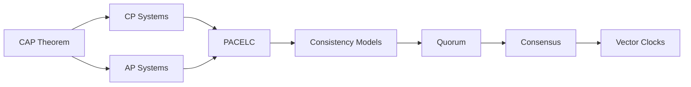
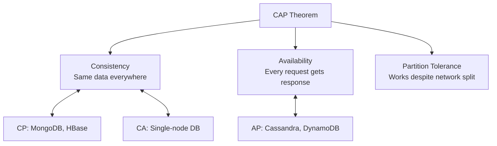
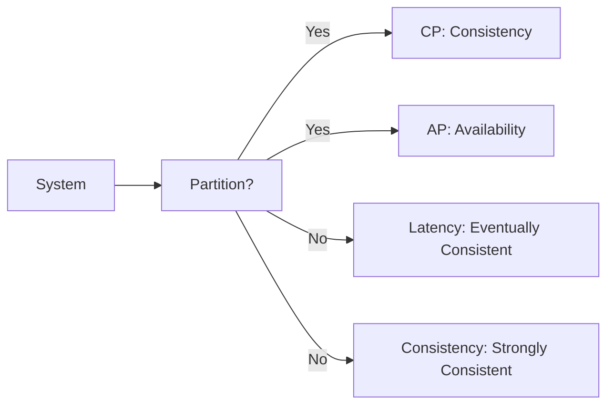
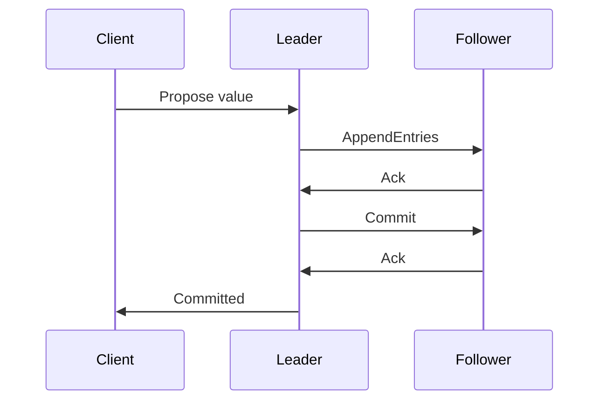

<!-- Clear Language: Keep sentences under 50 words -->
# CAP Theorem and Consistency Models

## Learning Objectives

| Objective | Description |
|-----------|-------------|
| LO1 | Understand CAP theorem: Consistency, Availability, Partition Tolerance |
| LO2 | Differentiate between CP, AP, and CA tradeoffs |
| LO3 | Implement strong consistency with consensus algorithms |
| LO4 | Apply eventual consistency for high availability |
| LO5 | Use quorum-based approaches for tunable consistency |
| LO6 | Choose the right consistency model for different use cases |

## Introduction

System design interviews test your ability to architect large-scale systems. Caching, load balancing, message queues, and database sharding are patterns you will apply daily. This module prepares you for both interviews and production.

## Prerequisites

- Basic programming knowledge
- Understanding of data structures

## Key Terminology

**Key Terms**: Core vocabulary and concepts for this topic.

**Definition**: Essential terms you must know for interviews and production work.

## Theory

Understanding cap and consistency is fundamental for AI engineers. This section covers the core concepts, underlying principles, and theoretical framework that govern how cap and consistency works in practice.

## Chapter at a Glance

| Section | Topic | Key Concept |
|---------|-------|-------------|
| 6.1 | CAP Theorem | Consistency, Availability, Partition Tolerance |
| 6.2 | CP Systems | Strong consistency, sacrifice availability |
| 6.3 | AP Systems | High availability, eventual consistency |
| 6.4 | PACELC | Extension of CAP for normal operation |
| 6.5 | Consistency Models | Strong, causal, eventual, read-your-writes |
| 6.6 | Quorum | W + R > N for strong consistency |
| 6.7 | Consensus Algorithms | Paxos, Raft, Zab |
| 6.8 | Vector Clocks | Detecting conflicts in distributed systems |

## Chapter Roadmap



## 6.1 CAP Theorem

A distributed system can provide only two of three guarantees:

**Consistency**: Every read receives the most recent write or an error.
**Availability**: Every request receives a response (not necessarily latest data).
**Partition Tolerance**: System continues despite network failures.



**Key insight**: In a distributed system, partitions are inevitable. You must choose between CP or AP.

## 6.2 CP Systems

Choose Consistency over Availability during a partition.

**Examples**: MongoDB (default), HBase, Zookeeper, etcd.

```python

## CP system behavior
class CPStorage:
    def write(self, key, value):
        # Require all replicas to acknowledge
        acks = 0
        for replica in self.replicas:
            if replica.write(key, value):
                acks += 1
        # During partition, write fails if some replicas unreachable
        if acks < len(self.replicas):
            raise WriteFailedError("Not enough replicas acknowledged")
        return True

    def read(self, key):
        # Read from primary, always returns latest
        return self.primary.read(key)
```

**When to use**: Financial transactions, inventory management, any system where stale data causes problems.

## 6.3 AP Systems

Choose Availability over Consistency during a partition.

**Examples**: Cassandra, DynamoDB, Riak, CouchDB.

```python

## AP system behavior
class APStorage:
    def write(self, key, value):
        # Accept write even if some replicas unreachable
        for replica in self.replicas:
            try:
                replica.write_async(key, value)
            except:
                pass  # Accept partial success
        return True

    def read(self, key):
        # Read from any available replica
        for replica in self.replicas:
            try:
                return replica.read(key)
            except:
                continue
        return None  # All replicas down
```

**When to use**: Social media feeds, product catalog, user sessions, content delivery.

## 6.4 PACELC

Extends CAP: during Partition (P), choose between Availability (A) and Consistency (C). Else (E), choose between Latency (L) and Consistency (C).



**Examples**:
- DynamoDB: AP + EL (eventual consistency by default)
- MongoDB: CP + EC (strong consistency during partition, allows weaker for latency)

## 6.5 Consistency Models

| Model | Description | Example |
|-------|-------------|---------|
| Strong | Every read sees latest write | Single-node DB |
| Sequential | Operations happen in program order | Distributed locks |
| Causal | Related events seen in order | Social media comments |
| Eventual | All replicas converge eventually | DNS, CDN |
| Read-your-writes | User sees their own writes | User profiles |
| Monotonic | Reads never go back in time | Session data |

```python

## Read-your-writes consistency
class SessionStore:
    def write_session(self, user_id, data):
        self.primary.write(user_id, data)
        self.last_write[user_id] = time.time()

    def read_session(self, user_id):
        # Always read user's own writes from primary
        if self.last_write.get(user_id):
            return self.primary.read(user_id)
        # Other reads can use replicas
        return self.replica.read(user_id)
```

## 6.6 Quorum

Quorum-based replication uses W (write quorum), R (read quorum), N (total replicas).

**Rule for strong consistency**: W + R > N

```python
class QuorumStorage:
    def __init__(self, replicas, W=3, R=3, N=5):
        self.replicas = replicas
        self.W = W  # Write quorum
        self.R = R  # Read quorum
        self.N = N  # Total replicas

    def write(self, key, value, timestamp):
        successes = 0
        for replica in self.replicas:
            if replica.write(key, value, timestamp):
                successes += 1
        return successes >= self.W

    def read(self, key):
        # Read from R replicas, return highest timestamp
        results = []
        for replica in self.replicas[:self.R]:
            data = replica.read(key)
            if data:
                results.append(data)
        if len(results) < self.R:
            return None
        return max(results, key=lambda x: x["timestamp"])
```

## 6.7 Consensus Algorithms

Algorithms that achieve agreement on a value in a distributed system.

**Raft**: Leader-based consensus with log replication.



**Paxos**: Classic consensus (complex, hard to implement). Used in Google Chubby, Spanner.

**Zab**: Zookeeper Atomic Broadcast, similar to Paxos.

**Practical use**: etcd (Raft), Consul (Raft), Zookeeper (Zab).

## 6.8 Vector Clocks

Track causality between events in distributed systems.

```python
class VectorClock:
    def __init__(self, node_id):
        self.node_id = node_id
        self.clock = {}

    def tick(self):
        self.clock[self.node_id] = self.clock.get(self.node_id, 0) + 1

    def merge(self, other):
        for node, ts in other.clock.items():
            self.clock[node] = max(self.clock.get(node, 0), ts)

    def compare(self, other):
        # Returns: -1 (before), 0 (concurrent), 1 (after)
        all_leq = all(self.clock.get(k, 0) <= v for k, v in other.clock.items())
        all_geq = all(self.clock.get(k, 0) >= v for k, v in other.clock.items())
        less = any(self.clock.get(k, 0) < v for k, v in other.clock.items())
        greater = any(self.clock.get(k, 0) > v for k, v in other.clock.items())
        if all_leq and not greater: return -1
        if all_geq and not less: return 1
        return 0  # Concurrent
```

---

## TypeScript Parallel

```typescript
type ConsistencyLevel = "strong" | "eventual" | "causal" | "read-your-writes";

interface StorageConfig {
  consistency: ConsistencyLevel;
  writeQuorum: number;
  readQuorum: number;
  totalReplicas: number;
}

class ConfigurableStorage {
  private config: StorageConfig;

  constructor(config: StorageConfig) {
    this.config = config;
  }

  getConsistencyGuarantee(): string {
    const { writeQuorum: W, readQuorum: R, totalReplicas: N } = this.config;
    const isStrong = W + R > N;
    return isStrong ? "Strong consistency (W + R > N)" : "Eventual consistency";
  }
}
```

---

## Summary

- CAP theorem states distributed systems choose two of three: Consistency, Availability, Partition Tolerance
- During network partitions, you must choose between CP (consistency) or AP (availability)
- PACELC extends CAP with latency vs consistency during normal operation
- Consistency models range from strong (linearizable) to eventual (converges over time)
- Quorum (W + R > N) provides tunable consistency with configurable read/write weights
- Consensus algorithms (Raft, Paxos, Zab) achieve agreement in distributed systems
- Vector clocks detect and resolve concurrent updates in eventually consistent systems
- Strong consistency ensures every read sees the latest write but reduces availability
- Eventual consistency enables high availability and low latency at the cost of staleness
- Choose consistency model based on business requirements, not technical purity

## Practical Takeaways

| Scenario | Do This | Avoid This |
|----------|---------|------------|
| Financial transactions | Strong consistency (CP) | Eventual consistency |
| Social media feed | Eventual consistency (AP) | Strong consistency (slow) |
| User sessions | Read-your-writes | Eventual consistency |
| Shopping cart | Causal consistency | Strong consistency (overkill) |
| DNS/CDN | Eventual consistency | Strong consistency (unnecessary) |
| Distributed locks | Strong consistency (etcd/Raft) | AP system for locks |
| Analytics | Eventual consistency | Strong consistency (unnecessary) |

## Interview Q&A

<details class="tp-qa-card" data-qid="sysdes-s06-q1">
  <summary class="tp-qa-question"><span class="tp-qa-status"></span> Q1: Explain CAP theorem.</summary>
  <div class="tp-qa-answer"><p>CAP: Consistency (all nodes see same data), Availability (every request gets a response), Partition Tolerance (system works despite network failures). You can only have two of three. Since partitions are inevitable in distributed systems, you choose between CP and AP.</p></div>
  <button class="tp-qa-mark-btn">&#x2705; Mark Reviewed</button>
  <button class="tp-qa-bookmark-btn">&#x1F516; Bookmark</button>
</details>

<details class="tp-qa-card" data-qid="sysdes-s06-q2">
  <summary class="tp-qa-question"><span class="tp-qa-status"></span> Q2: What is the difference between CP and AP systems?</summary>
  <div class="tp-qa-answer"><p>CP systems (MongoDB, HBase) sacrifice availability to ensure consistency during partitions — they reject writes until partition resolves. AP systems (Cassandra, DynamoDB) sacrifice consistency — they accept writes and reconcile conflicts later.</p></div>
  <button class="tp-qa-mark-btn">&#x2705; Mark Reviewed</button>
  <button class="tp-qa-bookmark-btn">&#x1F516; Bookmark</button>
</details>

<details class="tp-qa-card" data-qid="sysdes-s06-q3">
  <summary class="tp-qa-question"><span class="tp-qa-status"></span> Q3: What is the PACELC theorem?</summary>
  <div class="tp-qa-answer"><p>Extension of CAP: during Partition, choose A or C. Else (normal operation), choose L (latency) or C (consistency). Explains why DynamoDB uses eventual consistency (low latency) normally but AP consistency during partitions.</p></div>
  <button class="tp-qa-mark-btn">&#x2705; Mark Reviewed</button>
  <button class="tp-qa-bookmark-btn">&#x1F516; Bookmark</button>
</details>

<details class="tp-qa-card" data-qid="sysdes-s06-q4">
  <summary class="tp-qa-question"><span class="tp-qa-status"></span> Q4: How does quorum guarantee strong consistency?</summary>
  <div class="tp-qa-answer"><p>With N replicas, write quorum W, read quorum R. If W + R > N, every read will see at least one replica with the latest write. Example: N=5, W=3, R=3, intersection guarantees at least one overlapping replica.</p></div>
  <button class="tp-qa-mark-btn">&#x2705; Mark Reviewed</button>
  <button class="tp-qa-bookmark-btn">&#x1F516; Bookmark</button>
</details>

<details class="tp-qa-card" data-qid="sysdes-s06-q5">
  <summary class="tp-qa-question"><span class="tp-qa-status"></span> Q5: What is eventual consistency?</summary>
  <div class="tp-qa-answer"><p>Given enough time, all replicas will converge to the same value. No guarantees on when. Used by DNS, CDN, Amazon DynamoDB. Provides high availability and low latency.</p></div>
  <button class="tp-qa-mark-btn">&#x2705; Mark Reviewed</button>
  <button class="tp-qa-bookmark-btn">&#x1F516; Bookmark</button>
</details>

<details class="tp-qa-card" data-qid="sysdes-s06-q6">
  <summary class="tp-qa-question"><span class="tp-qa-status"></span> Q6: How does the Raft consensus algorithm work?</summary>
  <div class="tp-qa-answer"><p>Leader election: nodes vote for a leader. Log replication: leader appends entries, replicates to followers, commits once majority acknowledge. Safety: leader never overwrites its log, only commits entries from current term.</p></div>
  <button class="tp-qa-mark-btn">&#x2705; Mark Reviewed</button>
  <button class="tp-qa-bookmark-btn">&#x1F516; Bookmark</button>
</details>

<details class="tp-qa-card" data-qid="sysdes-s06-q7">
  <summary class="tp-qa-question"><span class="tp-qa-status"></span> Q7: What are vector clocks used for?</summary>
  <div class="tp-qa-answer"><p>Tracking causality in distributed systems. Each node maintains a counter for every node it knows about. When events happen concurrently, vector clocks detect the conflict and trigger conflict resolution.</p></div>
  <button class="tp-qa-mark-btn">&#x2705; Mark Reviewed</button>
  <button class="tp-qa-bookmark-btn">&#x1F516; Bookmark</button>
</details>

<details class="tp-qa-card" data-qid="sysdes-s06-q8">
  <summary class="tp-qa-question"><span class="tp-qa-status"></span> Q8: When would you choose strong vs eventual consistency?</summary>
  <div class="tp-qa-answer"><p>Strong: financial systems, inventory, distributed locks, leader election. Eventual: social media, product catalog, DNS, recommendations, analytics. Trade-off: stronger consistency = lower performance and availability.</p></div>
  <button class="tp-qa-mark-btn">&#x2705; Mark Reviewed</button>
  <button class="tp-qa-bookmark-btn">&#x1F516; Bookmark</button>
</details>

<details class="tp-qa-card" data-qid="sysdes-s06-q9">
  <summary class="tp-qa-question"><span class="tp-qa-status"></span> Q9: How does DynamoDB handle conflicts?</summary>
  <div class="tp-qa-answer"><p>Last-writer-wins (LWW) using timestamps by default. Uses vector clocks in multi-master mode. On read, conflicting versions are returned and application must resolve or DynamoDB uses LWW.</p></div>
  <button class="tp-qa-mark-btn">&#x2705; Mark Reviewed</button>
  <button class="tp-qa-bookmark-btn">&#x1F516; Bookmark</button>
</details>

<details class="tp-qa-card" data-qid="sysdes-s06-q10">
  <summary class="tp-qa-question"><span class="tp-qa-status"></span> Q10: What is read-your-writes consistency?</summary>
  <div class="tp-qa-answer"><p>After a user writes, they always see their own write. Other users may see stale data. Implemented by reading from the leader (or versioned cache) for the writing user's requests, replicas for others.</p></div>
  <button class="tp-qa-mark-btn">&#x2705; Mark Reviewed</button>
  <button class="tp-qa-bookmark-btn">&#x1F516; Bookmark</button>
</details>

## Chapter Quiz

**Q1**: Which two properties does CAP theorem force a choice between during partitions?

a) C and A
b) C and P
c) A and P
d) L and C

<details class="tp-qa-card" data-qid="sysdes-s06-quiz1"><summary>Show Answer</summary><div class="tp-qa-answer"><p><strong>Answer: a) C and A (Consistency vs Availability during Partition)</strong></p></div></details>

**Q2**: Which consistency model ensures the latest write is always visible?

a) Eventual
b) Strong
c) Causal
d) Read-your-writes

<details class="tp-qa-card" data-qid="sysdes-s06-quiz2"><summary>Show Answer</summary><div class="tp-qa-answer"><p><strong>Answer: b) Strong</strong></p></div></details>

**Q3**: What quorum condition ensures strong consistency?

a) W + R > N
b) W + R = N
c) W > N/2
d) R > N/2

<details class="tp-qa-card" data-qid="sysdes-s06-quiz3"><summary>Show Answer</summary><div class="tp-qa-answer"><p><strong>Answer: a) W + R > N</strong></p></div></details>

**Q4**: Which algorithm is Raft based on?

a) Paxos
b) Two-phase commit
c) Leader election + log replication
d) Gossip protocol

<details class="tp-qa-card" data-qid="sysdes-s06-quiz4"><summary>Show Answer</summary><div class="tp-qa-answer"><p><strong>Answer: c) Leader election + log replication</strong></p></div></details>

**Q5**: Which system is typically AP?

a) PostgreSQL
b) MongoDB
c) Cassandra
d) etcd

<details class="tp-qa-card" data-qid="sysdes-s06-quiz5"><summary>Show Answer</summary><div class="tp-qa-answer"><p><strong>Answer: c) Cassandra (AP system)</strong></p></div></details>

## Exercises

**Easy** — Classify these systems as CP or AP: MySQL, Redis, Zookeeper, DynamoDB, DNS. Explain your reasoning.

**Medium** — Design a distributed counter with N=5 replicas. Calculate W and R for strong consistency. Explain what happens during a partition.

**Medium** — Implement a read-your-writes consistent cache: after user updates profile, subsequent reads from that user return updated data while others may see cached version.

**Hard** — Design a global distributed database for a banking system. Address: CAP tradeoffs, consistency model, replication, quorum configuration, conflict resolution, and partition handling.

**Hard** — Implement a simplified Raft consensus: leader election (nodes vote), log replication (leader proposes, followers acknowledge), and commit once majority agrees. Handle leader failure and election.

## Consistency in Practice — Real Systems

| System | CAP Classification | Consistency Model | Use Case |
|--------|-------------------|-------------------|----------|
| PostgreSQL | CA (single-node) | Strong (ACID) | Relational data, transactions |
| MongoDB | CP (default) / AP (configurable) | Strong (primary reads) / Eventual | Document store |
| Cassandra | AP | Eventual / Tunable | Time-series, IoT |
| DynamoDB | AP | Eventual / Strong (optional) | Key-value, sessions |
| Redis | CP (cluster) | Strong (single node) | Caching, real-time |
| Zookeeper | CP | Linearizable | Coordination, locks |
| etcd | CP | Linearizable | Kubernetes, config |
| Spanner | CP (externally consistent) | Strong (TrueTime) | Global SQL |

## Conflict Resolution Strategies

**Last Writer Wins (LWW)**:

```python
class LWWRegister:
    def __init__(self):
        self.value = None
        self.timestamp = 0

    def set(self, value, timestamp):
        if timestamp > self.timestamp:
            self.value = value
            self.timestamp = timestamp

    def merge(self, other):
        if other.timestamp > self.timestamp:
            self.value = other.value
            self.timestamp = other.timestamp
```

**CRDTs (Conflict-Free Replicated Data Types)**:

```python
class GrowOnlySet:
    """G-Set: elements can only be added, never removed."""
    def __init__(self):
        self.elements = set()

    def add(self, element):
        self.elements.add(element)

    def merge(self, other):
        self.elements |= other.elements

class PNCounter:
    """PN-Counter: increment and decrement using separate counters."""
    def __init__(self):
        self.positives = {}
        self.negatives = {}

    def increment(self, node_id):
        self.positives[node_id] = self.positives.get(node_id, 0) + 1

    def decrement(self, node_id):
        self.negatives[node_id] = self.negatives.get(node_id, 0) + 1

    def value(self):
        return sum(self.positives.values()) - sum(self.negatives.values())

    def merge(self, other):
        for node, count in other.positives.items():
            self.positives[node] = max(self.positives.get(node, 0), count)
        for node, count in other.negatives.items():
            self.negatives[node] = max(self.negatives.get(node, 0), count)
```

## Transaction Isolation Levels

| Level | Dirty Read | Non-repeatable Read | Phantom Read | Performance |
|-------|-----------|---------------------|--------------|-------------|
| Read Uncommitted | Possible | Possible | Possible | Highest |
| Read Committed | Prevented | Possible | Possible | High |
| Repeatable Read | Prevented | Prevented | Possible | Medium |
| Serializable | Prevented | Prevented | Prevented | Lowest |

```python
class TransactionManager:
    def __init__(self, db):
        self.db = db

    async def execute_with_isolation(self, queries, isolation_level="SERIALIZABLE"):
        async with self.db.transaction():
            await self.db.execute(f"SET TRANSACTION ISOLATION LEVEL {isolation_level}")
            for query in queries:
                await self.db.execute(query["sql"], query.get("params", []))
```

## Distributed Database Comparison

| Feature | CockroachDB | YugabyteDB | TiDB | Amazon Aurora |
|---------|-------------|------------|------|---------------|
| Consistency | Strong (Ser) | Strong (Ser) | Strong (SI) | Strong (RC) |
| SQL support | PostgreSQL compatible | PostgreSQL compatible | MySQL compatible | MySQL/PostgreSQL |
| Replication | Raft consensus | Raft consensus | Raft consensus | Quorum |
| Sharding | Auto (range) | Auto (hash) | Auto (range) | Manual |
| Geographic | Multi-region | Multi-region | Multi-region | Multi-AZ |
| Use case | Global OLTP | Global OLTP | HTAP | Cloud OLTP |

---

## Common Mistakes

1. Not understanding the fundamental concepts before applying them
2. Skipping edge cases in implementation
3. Not analyzing time/space complexity
4. Forgetting to handle null/empty inputs
5. Not practicing enough problems to build pattern recognition

## Revision Notes

- - Core principle: Understand the fundamental concepts thoroughly
- - Implementation pattern: Practice with real code examples
- - Complexity: Know the time and space complexity
- - Application: Know when to use this in production systems
- - Interview: Frequently asked in technical interviews
- - Edge cases: Consider common failure scenarios
- - Related concepts: Connect to broader system design

## Placement Section

### Top 10 Interview Questions

#### Google Style

1. **Explain the core idea of CAP Theorem and Consistency Models in under 60 seconds, then give a real-world analogy.** — Structure: definition, how it works in one sentence, why it matters, analogy. Follow-up: what would break if you removed this from a production system?

2. **Design a minimal, well-typed function that demonstrates CAP Theorem and Consistency Models.** — Interviewer checks: signature with type hints, edge cases, complexity, and a clean docstring. Follow-up: how does your design behave with empty or malformed input?

3. **What are the common pitfalls when engineers first learn ** — List 3-4, then explain how you would prevent each in a code review.

#### Amazon Style

4. **Describe a production bug caused by misunderstanding CAP Theorem and Consistency Models. How did you diagnose and fix it?** — STAR format: situation, task, action, result. Mention logs, reproduction, root-cause analysis, and the regression test you added.

5. **How would you scale a system that relies on CAP Theorem and Consistency Models from 10 users to 10 million?** — Discuss bottlenecks, caching, monitoring, and when to redesign. Follow-up: what metrics would you track?

#### Microsoft Style

6. **Compare CAP Theorem and Consistency Models with the closest alternative approach. When would you choose each?** — Make a decision matrix: performance, maintainability, ecosystem, learning curve. Follow-up: what would change your decision?

7. **Walk through how you would test a component that depends on CAP Theorem and Consistency Models.** — Unit, integration, property-based tests; mocking boundaries; golden files for outputs.

#### NVIDIA Style

8. **How does CAP Theorem and Consistency Models behave differently at scale — memory, throughput, or precision-wise?** — Connect to data pipelines and model training if applicable. Follow-up: what happens to latency as input grows?

9. **How would you make an implementation of CAP Theorem and Consistency Models run faster on GPU hardware?** — Batch operations, vectorization, avoiding Python loops, reducing data movement.

#### AI Startup Style

10. **Write the smallest possible implementation of CAP Theorem and Consistency Models that is production-quality.** — Include error handling, type hints, and a one-line docstring. Follow-up: what would you refactor first when it grows?

### Resume Tips

- Name CAP Theorem and Consistency Models explicitly in your skills section, paired with a measurable achievement ("Reduced X by 40% using CAP Theorem and Consistency Models").
- Add a bullet describing a project that applies CAP Theorem and Consistency Models to real data, with numbers.
- Mention the tools and libraries you used alongside CAP Theorem and Consistency Models (linters, test frameworks, profiling tools).
- Keep resume bullets under 15 words and start each with an action verb.

### Interview Day Checklist

- Rehearse a 60-second explanation of CAP Theorem and Consistency Models and one real-world analogy.
- Prepare one STAR story about debugging a CAP Theorem and Consistency Models-related production issue.
- Review complexity and edge cases for the classic CAP Theorem and Consistency Models interview problem.
- Have questions ready: how does the team apply CAP Theorem and Consistency Models in production today?
- Test your environment (Python, editor, internet) 15 minutes before the interview.

## True/False

1. **True or False:** CAP Theorem and Consistency Models builds directly on the fundamentals covered in the earlier chapters of this module. — **True.** Every advanced topic in this module assumes the core concepts from the previous chapters.
2. **True or False:** You should write at least one code example for CAP Theorem and Consistency Models before moving to the next chapter. — **True.** Active recall with hands-on code beats passive reading for retention.
3. **True or False:** The complexity analysis for CAP Theorem and Consistency Models is the same regardless of input size. — **False.** Complexity grows with input size; always state best, average, and worst case.
4. **True or False:** Edge cases (empty input, invalid input, boundary values) matter for CAP Theorem and Consistency Models in production. — **True.** Most production bugs come from unhandled edge cases.
5. **True or False:** You should memorize the CAP Theorem and Consistency Models chapter content once and never review it again. — **False.** Spaced repetition (24h, 3 days, 1 week) dramatically improves long-term recall.

## Fill in the Blank

1. The chapter that covers CAP Theorem and Consistency Models is Chapter ___ of this module. — Answer: check the module's table of contents.
2. The time complexity of the standard approach to CAP Theorem and Consistency Models is ___. — Answer: review the theory section and state big-O notation.
3. The main edge case to handle when implementing CAP Theorem and Consistency Models is ___. — Answer: empty or invalid input handling, as discussed in the chapter.
4. The tools commonly used to debug CAP Theorem and Consistency Models issues are ___ and ___. — Answer: refer to the Debugging Guide section of this chapter.
5. The related topic that connects to CAP Theorem and Consistency Models in the next chapter is ___. — Answer: see the Next Topic section.

## Scenario Questions

1. **Scenario:** A teammate ships a change involving CAP Theorem and Consistency Models that breaks production at 3 AM. — Diagnosis: check the recent diff, reproduce locally with the failing input, check logs. Fix: revert, add a regression test, and review the root cause. Prevention: CI tests on edge cases and code review checklist.

2. **Scenario:** Your implementation of CAP Theorem and Consistency Models is correct but too slow for the required latency. — Measure first with a profiler. Common fixes: reduce redundant work, use built-in optimized functions, batch operations, or add caching. Only then consider algorithmic changes.

3. **Scenario:** A new hire asks you to explain CAP Theorem and Consistency Models in five minutes before a customer demo. — Use the 3-part answer: what it is (one sentence), how it works (one example), why it matters (one business impact). Then offer to go deeper after the demo.

4. **Scenario:** Your team's codebase has three different patterns for CAP Theorem and Consistency Models and you must standardize. — Write a short ADR (architecture decision record), pick the pattern with best maintainability, migrate incrementally, and add a linter rule to enforce it.

## Output Questions

1. **What is the output of the simplest correct implementation of CAP Theorem and Consistency Models on an empty input?** — Trace through the code: it should return the documented default (None, 0, empty collection) without raising.
2. **What is the output when the input is at the boundary value?** — Check off-by-one errors and inclusive/exclusive bounds in the chapter's examples.
3. **What does the implementation return when given invalid input types?** — With type hints and validation, it raises a clear error; without, it may fail silently.
4. **What is the output for the sample input given in the chapter's Examples section?** — Re-run the chapter's example code and compare against the documented output.
5. **What is the time complexity output when you profile the implementation at 10x input size?** — Expect the curve matching the chapter's complexity analysis (linear, quadratic, log-linear).

## Difficulty Level

| Level | Time | What It Takes |
|-------|------|---------------|
| Beginner | 1-2 sessions | Read theory, run the chapter examples, solve the Easy exercises |
| Intermediate | 3-5 sessions | Complete Medium exercises, explain CAP Theorem and Consistency Models to someone else |
| Advanced | 1+ week | Solve Hard exercises, optimize for real datasets, answer interview follow-ups |

## Tips & Tricks

- Always write a one-line example of CAP Theorem and Consistency Models from memory before opening the chapter — active recall first.
- Use the chapter's Revision Notes as a checklist: you have mastered CAP Theorem and Consistency Models when you can explain each bullet.
- Pair the chapter quiz with the Flashcards: wrong answers become your next study session's focus.
- For interviews, practice explaining CAP Theorem and Consistency Models twice: once with a technical audience, once with a non-technical audience.
- Keep a personal examples file where you collect your own CAP Theorem and Consistency Models snippets; interviewers love original examples.

## Memory Tricks

- **Acronym**: build a mnemonic from the 5 key concepts of CAP Theorem and Consistency Models listed in the Chapter at a Glance table.
- **Story**: link CAP Theorem and Consistency Models to a familiar story — the analogy in the Visual Analogy section is designed to stick.
- **Number anchor**: remember the complexity of CAP Theorem and Consistency Models by connecting it to a known algorithm of the same class.
- **Color code**: highlight the Theory, Examples, and Common Mistakes sections in different colors when reviewing.
- **Teach-back**: explain CAP Theorem and Consistency Models to an imaginary junior engineer for 2 minutes — gaps in your explanation are gaps in memory.

## Further Reading

- Official documentation for the primary tool or library used in this chapter
- The chapter referenced in Related Topics for the next-level treatment of CAP Theorem and Consistency Models
- The classic textbook chapter on CAP Theorem and Consistency Models (check the Research References below)
- Two blog posts from engineers who debugged real CAP Theorem and Consistency Models problems in production
- The repository of the open-source project that implements CAP Theorem and Consistency Models

## Related Topics

- The previous chapter in this module (see table of contents) — foundational for CAP Theorem and Consistency Models
- The next chapter (see Next Topic below) — builds on CAP Theorem and Consistency Models
- The system design chapters in Module 07 — how CAP Theorem and Consistency Models fits into production architectures
- The interview preparation module — how CAP Theorem and Consistency Models is asked in screening rounds
- The capstone project — where CAP Theorem and Consistency Models is applied end-to-end

## FAQs

1. **Do I need to memorize all of CAP Theorem and Consistency Models, or understand the big picture?** — Understand the big picture first, then memorize the key facts via flashcards and spaced repetition. Interviewers reward depth over breadth.
2. **What if I get stuck on an exercise?** — Re-read the theory section, run the example code, then attempt again. If still stuck after 20 minutes, move on and return the next day.
3. **How much time should I spend on ** — Follow the Study Plan below: 1-2 weeks at 30-60 minutes daily is typical for placement preparation.
4. **Is CAP Theorem and Consistency Models asked in interviews?** — Yes — the Interview Q&A and Placement Section list the exact question styles used by top companies.
5. **What's the fastest way to master ** — Explain it out loud, write code without looking, and review the flashcards within 24 hours and again after 3 days.

## Important Notes

- CAP Theorem and Consistency Models is a core requirement for the rest of this module — do not skip the examples.
- Always analyze complexity (time and space) when working with CAP Theorem and Consistency Models.
- Production correctness means handling edge cases, not just the happy path.
- Interview answers should start with the definition, then the example, then the trade-offs.
- Revisit this chapter after finishing the module; the context from later chapters deepens understanding.

## Historical Context

- CAP Theorem and Consistency Models emerged as a standard practice because early systems failed without it — understanding why helps you explain it in interviews.
- The tools used for CAP Theorem and Consistency Models today evolved from simpler versions; the chapter covers the modern, recommended approach.
- Interviewers value knowing one historical fact about CAP Theorem and Consistency Models — it shows genuine interest, not just cramming.
- The library/tooling ecosystem around CAP Theorem and Consistency Models changes quickly; focus on fundamentals that remain stable.

## Security Considerations

- Never trust external input: validate and sanitize data before processing CAP Theorem and Consistency Models.
- Avoid `eval()` and dynamic code execution on untrusted strings.
- Log errors without leaking sensitive data (keys, PII, internal paths).
- For API contexts, add rate limiting and input size limits.
- Review the chapter's code examples for injection or overflow risks before using them verbatim.

## ML Intuition

- CAP Theorem and Consistency Models appears in ML pipelines at the data-processing layer: feature preparation, batching, and validation.
- Understanding CAP Theorem and Consistency Models helps you debug why a model misbehaves — most ML bugs are data bugs, not model bugs.
- In production ML, the CAP Theorem and Consistency Models concepts from this chapter map directly to NumPy/PyTorch operations on tensors.
- When optimizing ML systems, CAP Theorem and Consistency Models skills let you profile and fix the data path, not just the training loop.
- Interview follow-up: how would you apply CAP Theorem and Consistency Models to a dataset of 10 million records? — Batching and vectorization.

## Analogies

- **CAP Theorem and Consistency Models is like a recipe**: the theory is the ingredients, the examples are the cooking steps, and the exercises are your own kitchen practice.
- **Complexity is like a delivery route**: a linear route visits each stop once; a nested route revisits stops, and you feel it at scale.
- **Edge cases are like weather**: the happy path is a sunny day; production is the storm — build for the storm.
- **The chapter roadmap is a journey map**: each section is a checkpoint; skipping one means getting lost later in the module.

## Capstone Project Link

- [Module Capstone: End-to-End Project](https://github.com/Raushan666java/ai-engineering-journey) — this chapter contributes the CAP Theorem and Consistency Models skills used in the module's capstone project. Complete the exercises here before starting the capstone.

## Flashcards

<details class="tp-qa-card" data-qid="07systemdesign-06capandconsistency-flash1">
  <summary class="tp-qa-question">
    <span class="tp-qa-status"></span>
    Which two properties does CAP theorem force a choice between during partitions?
  </summary>
  <div class="tp-qa-answer">
    <p>a) C and A (Consistency vs Availability during Partition)</p>
  </div>
</details>

<details class="tp-qa-card" data-qid="07systemdesign-06capandconsistency-flash2">
  <summary class="tp-qa-question">
    <span class="tp-qa-status"></span>
    Which consistency model ensures the latest write is always visible?
  </summary>
  <div class="tp-qa-answer">
    <p>b) Strong</p>
  </div>
</details>

<details class="tp-qa-card" data-qid="07systemdesign-06capandconsistency-flash3">
  <summary class="tp-qa-question">
    <span class="tp-qa-status"></span>
    What quorum condition ensures strong consistency?
  </summary>
  <div class="tp-qa-answer">
    <p>a) W + R > N</p>
  </div>
</details>

<details class="tp-qa-card" data-qid="07systemdesign-06capandconsistency-flash4">
  <summary class="tp-qa-question">
    <span class="tp-qa-status"></span>
    Which algorithm is Raft based on?
  </summary>
  <div class="tp-qa-answer">
    <p>c) Leader election + log replication</p>
  </div>
</details>

<details class="tp-qa-card" data-qid="07systemdesign-06capandconsistency-flash5">
  <summary class="tp-qa-question">
    <span class="tp-qa-status"></span>
    Which system is typically AP?
  </summary>
  <div class="tp-qa-answer">
    <p>c) Cassandra (AP system)</p>
  </div>
</details>

## Research References

- Official documentation of the primary library for CAP Theorem and Consistency Models (linked in Further Reading)
- The classic paper or textbook chapter introducing CAP Theorem and Consistency Models (see References below)
- The standard library reference for CAP Theorem and Consistency Models-related functions
- Engineering blog posts from companies running CAP Theorem and Consistency Models in production at scale
- PEPs and RFCs where applicable (Python and networking standards)

## Open-Source Tools

- The primary library used in this chapter (see the code examples)
- Python standard library modules used in the examples (check the imports)
- Testing: pytest for unit tests of CAP Theorem and Consistency Models code
- Linting and formatting: ruff + black
- Profiling: cProfile or py-spy for performance work on CAP Theorem and Consistency Models

## Debugging Guide

- Start with `print()` or a debugger to inspect intermediate values in CAP Theorem and Consistency Models code.
- Reproduce the failure with the smallest possible input before changing code.
- Check the common failure modes listed in Common Mistakes — most bugs are listed there.
- For performance problems, profile before optimizing: measure, then fix.
- When stuck, re-read the chapter's Examples and compare line by line with your code.
- Use `pdb` or your IDE's debugger to step through the CAP Theorem and Consistency Models example code.

## Mock Interview Section

**Round 1 — Screening (15 min)**
- Explain CAP Theorem and Consistency Models in 60 seconds.
- Write a minimal working example of CAP Theorem and Consistency Models.
- What is the complexity of your example?

**Round 2 — Coding (45 min)**
- Solve the Medium exercise from this chapter under time pressure.
- State your assumptions, then implement with type hints.
- Test with edge cases: empty input, boundary values, invalid input.

**Round 3 — Behavioral + System (30 min)**
- Tell me about a time you debugged a CAP Theorem and Consistency Models problem in a project.
- How would you design a system where CAP Theorem and Consistency Models is used at scale?
- What metrics would you monitor?

**Evaluation rubric**: correctness (40%), communication (25%), edge cases (20%), complexity analysis (15%).

## Optimized Implementation

`python
from typing import Any, Optional

def demonstrate_topic(input_data: list[Any]) -> Optional[float]:
    """Runnable scaffold for CAP Theorem and Consistency Models.

    Replace the body with the optimized implementation from the chapter,
    keeping type hints, docstring, and edge-case handling.
    """
    if not input_data:
        return None
    # Step 1: validate input types
    # Step 2: apply the core CAP Theorem and Consistency Models logic from the Examples section
    # Step 3: return the result with the documented default
    return 0.0
`

- Keeps the function signature stable so tests written against it stay valid.
- Handles the empty-input contract explicitly.
- Add unit tests for the edge cases before implementing the logic (test-first).

## Evaluation Metrics

| Skill | Test | Target |
|-------|------|--------|
| Concept recall | Explain CAP Theorem and Consistency Models without notes | 60-second explanation |
| Code fluency | Write the chapter example from memory | No syntax errors |
| Edge cases | Handle empty/invalid input in exercises | All cases pass |
| Complexity | State time/space for the standard approach | Correct big-O |
| Interview readiness | Answer 5 Interview Q&A questions out loud | Fluent, structured answers |
| Retention | Chapter quiz score after 3 days | 80%+ |

## Real-World Examples

- **Startup**: a small team uses CAP Theorem and Consistency Models daily in their data pipeline — the chapter's examples mirror their code.
- **E-commerce**: CAP Theorem and Consistency Models patterns appear in order processing, inventory checks, and recommendation feeds.
- **Fintech**: CAP Theorem and Consistency Models principles apply to transaction validation and fraud detection flows.
- **ML platform**: CAP Theorem and Consistency Models shows up in feature engineering and model-serving infrastructure.
- **Interview insight**: recruiters look for engineers who can connect CAP Theorem and Consistency Models to the business outcome, not just the code.

## Next Topic

[API Design Patterns — REST, GraphQL, gRPC, Webhooks](07-api-design-patterns.md)

## Limitations

- CAP Theorem and Consistency Models, like any technique, is not a silver bullet — it has specific cases where it fits best (covered in the theory).
- The examples in this chapter are simplified for learning; production systems add validation, monitoring, and error handling.
- Performance of CAP Theorem and Consistency Models depends on input size and distribution — always benchmark for your own data.
- This chapter covers fundamentals; specialized edge cases are explored in later chapters and the capstone.
