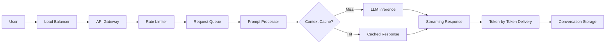

<!-- Clear Language: Keep sentences under 50 words -->
# Design ChatGPT — Streaming, Context Window, Prompt Caching

## Learning Objectives

| Objective | Description |
|-----------|-------------|
| LO1 | Understand the system architecture behind ChatGPT's real-time response generation |
| LO2 | Design streaming response infrastructure with Server-Sent Events |
| LO3 | Implement context window management and prompt caching strategies |
| LO4 | Build rate limiting and request queuing for LLM inference |
| LO5 | Design conversation history storage and retrieval at scale |
| LO6 | Address latency, cost, and safety considerations for production LLM serving |

## Introduction

System design interviews test your ability to architect large-scale systems. Caching, load balancing, message queues, and database sharding are patterns you will apply daily. This module prepares you for both interviews and production.

## Prerequisites

- Basic programming knowledge
- Understanding of data structures

## Key Terminology

**Key Terms**: Core vocabulary and concepts for this topic.

**Definition**: Essential terms you must know for interviews and production work.

## Theory

Understanding design chatgpt is fundamental for AI engineers. This section covers the core concepts, underlying principles, and theoretical framework that govern how design chatgpt works in practice.

## Chapter at a Glance

| Section | Topic | Key Concept |
|---------|-------|-------------|
| 11.1 | System Architecture | Load balancer, API gateway, inference cluster, storage |
| 11.2 | Streaming Responses | SSE, chunked transfer, token-by-token delivery |
| 11.3 | Context Window Management | Prompt optimization, sliding window, summarization |
| 11.4 | Prompt Caching | KV-cache, prefix matching, cache eviction policies |
| 11.5 | Rate Limiting & Queuing | Token bucket, priority queues, request batching |
| 11.6 | Conversation Storage | Thread persistence, history retrieval, multi-modal data |

## Chapter Roadmap


## 11.1 System Architecture

ChatGPT's architecture is a multi-layered system designed for low-latency, high-throughput LLM inference.

**Key components**:
- **Load balancer**: Distributes incoming requests across API gateway instances
- **API gateway**: Authentication, rate limiting, request validation
- **Request queue**: Buffers requests during traffic spikes
- **Prompt processor**: Prepares input (tokenization, context assembly, moderation)
- **Inference cluster**: GPU-powered LLM serving nodes (NVIDIA A100/H100)
- **Response streamer**: Manages token-by-token delivery over SSE
- **Conversation store**: PostgreSQL/Cosmos DB for user threads

```typescript
interface ChatGPTRequest {
  model: string;
  messages: Array<{ role: "system" | "user" | "assistant"; content: string }>;
  stream: boolean;
  max_tokens: number;
  temperature: number;
  conversation_id?: string;
}

interface ChatGPTResponse {
  id: string;
  object: "chat.completion";
  created: number;
  model: string;
  choices: Array<{
    index: number;
    message: { role: string; content: string };
    finish_reason: "stop" | "length" | "content_filter";
  }>;
  usage: {
    prompt_tokens: number;
    completion_tokens: number;
    total_tokens: number;
  };
}
```

**Inference optimization**: Tensor parallelism across GPUs, KV-cache management, continuous batching, speculative decoding for 2-3x throughput improvement.

---

## 11.2 Streaming Responses

Server-Sent Events (SSE) enable token-by-token streaming from the LLM to the client, providing sub-100ms time-to-first-token.

```typescript
class SSEStreamManager {
  private clients: Map<string, any> = new Map();

  addClient(clientId: string, res: any): void {
    res.writeHead(200, {
      "Content-Type": "text/event-stream",
      "Cache-Control": "no-cache",
      Connection: "keep-alive",
      "X-Accel-Buffering": "no",
    });
    this.clients.set(clientId, res);
  }

  sendToken(clientId: string, token: string, finishReason?: string): void {
    const res = this.clients.get(clientId);
    if (!res) return;

    const event = {
      id: clientId,
      object: "chat.completion.chunk",
      created: Date.now(),
      model: "gpt-4",
      choices: [
        {
          index: 0,
          delta: { content: token },
          finish_reason: finishReason ?? null,
        },
      ],
    };
    res.write(`data: ${JSON.stringify(event)}\n\n`);

    if (finishReason) {
      res.write("data: [DONE]\n\n");
      res.end();
      this.clients.delete(clientId);
    }
  }

  sendError(clientId: string, error: string): void {
    const res = this.clients.get(clientId);
    if (res) {
      res.write(`event: error\ndata: ${JSON.stringify({ error })}\n\n`);
      res.end();
      this.clients.delete(clientId);
    }
  }
}
```

**Challenges**: Connection management (1M+ concurrent connections), backpressure handling when clients are slow, reconnection logic for dropped connections, token-level rate limiting.

---

## 11.3 Context Window Management

Context window determines how much conversation history the model can consider. Managing this window is critical for quality and cost.

```typescript
class ContextWindowManager {
  private maxTokens: number;
  private tokenizer: any;

  constructor(maxTokens = 128000) {
    this.maxTokens = maxTokens;
  }

  buildPrompt(
    systemPrompt: string,
    messages: Array<{ role: string; content: string }>,
    maxResponseTokens: number
  ): Array<{ role: string; content: string }> {
    const availableTokens = this.maxTokens - maxResponseTokens - 50;
    let totalTokens = this.countTokens(systemPrompt);

    const prompt: Array<{ role: string; content: string }> = [
      { role: "system", content: systemPrompt },
    ];

    // Add messages from most recent to oldest until we fill the window
    const reversed = [...messages].reverse();
    for (const msg of reversed) {
      const tokens = this.countTokens(msg.content) + 10; // overhead
      if (totalTokens + tokens > availableTokens) {
        break;
      }
      prompt.splice(1, 0, msg);
      totalTokens += tokens;
    }

    return prompt;
  }

  countTokens(text: string): number {
    // Simplified token counting — in production, use actual tokenizer
    return Math.ceil(text.length / 4);
  }

  async summarizeHistory(
    messages: Array<{ role: string; content: string }>
  ): Promise<string> {
    // When conversation exceeds context window, summarize older messages
    const summaryPrompt = `Summarize the following conversation:
${messages
      .map((m) => `${m.role}: ${m.content}`)
      .join("\n")}`;
    // Call LLM to generate summary
    return summaryPrompt;
  }
}
```

**Strategies**: **Sliding window** — keep most recent N messages. **Summarization** — compress old messages into a summary. **Hybrid** — recent messages in full, older messages summarized. **RAG** — retrieve relevant history from vector database.

---

## 11.4 Prompt Caching

Prompt caching avoids re-computing the LLM's KV-cache for repeated or similar prompts, reducing latency and cost.

```typescript
interface PromptCacheEntry {
  prefix: string;
  kvCache: any;
  lastAccess: number;
  accessCount: number;
  tokenCount: number;
}

class PromptCache {
  private cache: Map<string, PromptCacheEntry> = new Map();
  private maxEntries = 10000;
  private maxTokensStored = 1000000;

  constructor() {
    setInterval(() => this.evict(), 60000);
  }

  getCacheKey(messages: Array<{ role: string; content: string }>): string {
    // Use system prompt + first user message as cache prefix
    const prefix = messages
      .slice(0, 2)
      .map((m) => `${m.role}:${m.content}`)
      .join("|");
    return this.hash(prefix);
  }

  get(prefix: string): PromptCacheEntry | null {
    const entry = this.cache.get(prefix);
    if (entry) {
      entry.lastAccess = Date.now();
      entry.accessCount++;
    }
    return entry ?? null;
  }

  set(prefix: string, kvCache: any, tokenCount: number): void {
    if (this.cache.size >= this.maxEntries) {
      this.evict();
    }
    this.cache.set(prefix, {
      prefix,
      kvCache,
      lastAccess: Date.now(),
      accessCount: 1,
      tokenCount,
    });
  }

  private evict(): void {
    // LRU eviction
    const sorted = [...this.cache.entries()].sort(
      (a, b) => a[1].lastAccess - b[1].lastAccess
    );
    const toRemove = Math.ceil(this.maxEntries * 0.2);
    for (let i = 0; i < toRemove; i++) {
      this.cache.delete(sorted[i][0]);
    }
  }

  private hash(s: string): string {
    let hash = 0;
    for (let i = 0; i < s.length; i++) {
      hash = (hash << 5) - hash + s.charCodeAt(i);
    }
    return Math.abs(hash).toString(36);
  }
}
```

**Cache hit scenarios**: Repeated system prompts, popular first messages, template-based prompts. Cache miss adds 100-500ms to TTFT (time-to-first-token). Hit can reduce to ~10ms.

---

## 11.5 Rate Limiting & Queuing

LLM inference is expensive and GPU-constrained. Proper rate limiting and queuing prevent overload and ensure fair resource allocation.

```typescript
class LLMRequestQueue {
  private queues: Map<string, Array<{ request: any; resolve: Function }>> = new Map();
  private processing = false;
  private maxBatchSize = 32;
  private maxQueueLength = 1000;

  async enqueue(
    userId: string,
    request: any,
    priority: "low" | "normal" | "high" = "normal"
  ): Promise<any> {
    return new Promise((resolve, reject) => {
      if (!this.queues.has(userId)) {
        this.queues.set(userId, []);
      }
      const queue = this.queues.get(userId)!;
      if (queue.length >= this.maxQueueLength) {
        reject(new Error("Queue full"));
        return;
      }
      queue.push({ request, resolve });

      if (!this.processing) {
        this.processBatch();
      }
    });
  }

  private async processBatch(): Promise<void> {
    this.processing = true;
    const batch: Array<{ request: any; resolve: Function }> = [];

    // Collect requests from queues (round-robin for fairness)
    for (const [userId, queue] of this.queues) {
      while (queue.length > 0 && batch.length < this.maxBatchSize) {
        batch.push(queue.shift()!);
      }
      if (queue.length === 0) this.queues.delete(userId);
    }

    if (batch.length > 0) {
      // Send batch to LLM inference
      const results = await this.inferBatch(batch.map((b) => b.request));
      for (let i = 0; i < batch.length; i++) {
        batch[i].resolve(results[i]);
      }
    }

    this.processing = false;
    if (this.getTotalQueueSize() > 0) {
      setImmediate(() => this.processBatch());
    }
  }

  private async inferBatch(requests: any[]): Promise<any[]> {
    // Continuous batching — send multiple requests to GPU for parallel processing
    return requests.map((r) => ({ choices: [{ message: { content: "Mock" } }] }));
  }

  private getTotalQueueSize(): number {
    let total = 0;
    for (const queue of this.queues.values()) total += queue.length;
    return total;
  }
}
```

**Rate limit tiers**: Free users: 20 req/min, 100K tokens/month. Pro users: 100 req/min, 10M tokens/month. Enterprise: custom limits with reserved capacity.

---

## 11.6 Conversation Storage

Storing conversation history enables users to resume threads, review past interactions, and provides training data (with consent).

```typescript
interface Conversation {
  id: string;
  userId: string;
  title: string;
  model: string;
  createdAt: Date;
  updatedAt: Date;
  messageCount: number;
  totalTokens: number;
  isArchived: boolean;
}

interface Message {
  id: string;
  conversationId: string;
  role: "system" | "user" | "assistant" | "tool";
  content: string;
  tokens: number;
  createdAt: Date;
  parentId?: string;
  metadata?: {
    model?: string;
    finishReason?: string;
    latency?: number;
    safetyFlags?: string[];
  };
}

class ConversationStore {
  private conversations: Map<string, Conversation> = new Map();
  private messages: Map<string, Message[]> = new Map();

  async createConversation(userId: string, model: string): Promise<string> {
    const id = crypto.randomUUID();
    this.conversations.set(id, {
      id,
      userId,
      title: "New conversation",
      model,
      createdAt: new Date(),
      updatedAt: new Date(),
      messageCount: 0,
      totalTokens: 0,
      isArchived: false,
    });
    return id;
  }

  async addMessage(message: Message): Promise<void> {
    if (!this.messages.has(message.conversationId)) {
      this.messages.set(message.conversationId, []);
    }
    this.messages.get(message.conversationId)!.push(message);

    const conv = this.conversations.get(message.conversationId);
    if (conv) {
      conv.messageCount++;
      conv.totalTokens += message.tokens;
      conv.updatedAt = new Date();
    }
  }

  async getConversation(id: string): Promise<{
    conversation: Conversation | null;
    messages: Message[];
  }> {
    return {
      conversation: this.conversations.get(id) ?? null,
      messages: this.messages.get(id) ?? [],
    };
  }

  async listUserConversations(
    userId: string,
    limit = 50
  ): Promise<Conversation[]> {
    return [...this.conversations.values()]
      .filter((c) => c.userId === userId && !c.isArchived)
      .sort((a, b) => b.updatedAt.getTime() - a.updatedAt.getTime())
      .slice(0, limit);
  }
}
```

**Storage considerations**: Use PostgreSQL or Cosmos DB for production. Shard by user_id. Implement TTL for conversation retention (90 days for free, indefinite for paid). Full-text search on conversation content.

---

## TypeScript Parallel

```typescript
class ChatGPTService {
  private cache: PromptCache;
  private queue: LLMRequestQueue;
  private conversations: ConversationStore;
  private sse: SSEStreamManager;

  async handleChatCompletion(req: ChatGPTRequest, res: any): Promise<void> {
    try {
      // Rate limit check
      await this.checkRateLimit(req);

      // Build conversation context
      const conv = req.conversation_id
        ? await this.conversations.getConversation(req.conversation_id)
        : null;

      const messages = conv ? [...conv.messages.map((m) => ({ role: m.role, content: m.content })), ...req.messages] : req.messages;

      // Check prompt cache
      const cacheKey = this.cache.getCacheKey(messages);
      const cached = this.cache.get(cacheKey);

      if (cached) {
        // Use cached prefix + generate only new tokens
        return this.generateFromCache(cached, messages, req, res);
      }

      // Enqueue for inference
      if (req.stream) {
        const clientId = crypto.randomUUID();
        this.sse.addClient(clientId, res);
        await this.queue.enqueue(req.user ?? "anonymous", { ...req, messages, clientId }, req.priority);
      } else {
        const result = await this.queue.enqueue(req.user ?? "anonymous", { ...req, messages });
        res.json(result);
      }
    } catch (err: any) {
      res.status(err.status ?? 500).json({ error: { message: err.message } });
    }
  }

  private async checkRateLimit(req: any): Promise<void> {
    // Token bucket implementation
  }

  private async generateFromCache(cached: any, messages: any[], req: any, res: any): Promise<void> {
    // Generate only the new tokens after cached prefix
  }
}
```

---

## Summary

- ChatGPT architecture has load balancer, API gateway, request queue, inference cluster, and response streamer
- SSE enables sub-100ms time-to-first-token with token-by-token streaming delivery
- Context window management balances quality vs cost: sliding window, summarization, hybrid, or RAG
- Prompt caching reuses KV-cache for repeated prefixes, reducing TTFT from 100-500ms to ~10ms
- Continuous batching on GPU maximizes inference throughput by processing multiple requests per batch
- Rate limiting tiers (free/pro/enterprise) with token bucket ensure fair resource allocation
- Request queuing with priority levels and round-robin fairness prevents overload
- Conversation storage uses PostgreSQL with sharding by user_id and TTL-based retention
- Safety layer: content moderation before and after generation, PII detection, output guardrails
- Production challenges: GPU cost optimization, latency SLOs, multi-modal support (DALL-E, GPT-4V)

## Practical Takeaways

| Scenario | Do This | Avoid This |
|----------|---------|------------|
| Real-time responses | SSE streaming with token-by-token delivery | Polling for completion |
| Long conversations | Context window manager with sliding window | Truncating without summarization |
| Repeated prompts | KV-cache prefix caching | Re-computing full prompt each time |
| GPU utilization | Continuous batching + dynamic batching | Single-request per GPU |
| Rate limiting | Token bucket per user tier | Global rate limit (unfair) |
| Conversation storage | PostgreSQL with user_id sharding | Single-table unbounded growth |

## Interview Q&A

<details class="tp-qa-card" data-qid="sd07-q1">
  <summary class="tp-qa-question">
    <span class="tp-qa-status"></span>
    Q1: How would you design the streaming response system for ChatGPT?
  </summary>
  <div class="tp-qa-answer">
    <p>Use Server-Sent Events (SSE) for token-by-token delivery. Flow: <strong>1)</strong> Client opens an SSE connection. <strong>2)</strong> Server validates request, checks rate limits, builds prompt. <strong>3)</strong> LLM inference starts generating tokens. <strong>4)</strong> Each token is sent as an SSE event: `data: {"choices":[{"delta":{"content":"token"}}]}`. <strong>5)</strong> When generation completes, send `data: [DONE]`. Challenges: handling 1M+ concurrent connections, backpressure when clients are slow (buffer tokens or drop connection), reconnection with context resumption, and token-level rate limiting.</p>
  </div>
  <button class="tp-qa-mark-btn">✅ Mark Reviewed</button>
  <button class="tp-qa-bookmark-btn">🔖 Bookmark</button>
</details>

<details class="tp-qa-card" data-qid="sd07-q2">
  <summary class="tp-qa-question">
    <span class="tp-qa-status"></span>
    Q2: How do you manage the context window for long conversations?
  </summary>
  <div class="tp-qa-answer">
    <p>Four strategies: <strong>1) Sliding window</strong>: Keep the N most recent messages, drop older ones. Simple but loses context. <strong>2) Summarization</strong>: When approaching the limit, ask the LLM to summarize older messages into a compressed form. <strong>3) Hybrid</strong>: Recent messages in full, older messages as a summary plus key details. <strong>4) RAG</strong>: Store all messages in a vector database. Retrieve relevant historical context dynamically. For ChatGPT, a hybrid approach is used: the system prompt + recent messages in full, with older context optionally retrieved from a conversation store.</p>
  </div>
  <button class="tp-qa-mark-btn">✅ Mark Reviewed</button>
  <button class="tp-qa-bookmark-btn">🔖 Bookmark</button>
</details>

<details class="tp-qa-card" data-qid="sd07-q3">
  <summary class="tp-qa-question">
    <span class="tp-qa-status"></span>
    Q3: What is prompt caching and how does it reduce latency?
  </summary>
  <div class="tp-qa-answer">
    <p>LLMs process prompts in two phases: <strong>1) Prefill</strong>: Compute KV-cache for the prompt tokens (compute-bound, takes 100-500ms). <strong>2) Decode</strong>: Generate tokens one-by-one using the KV-cache (memory-bound). Prompt caching stores the KV-cache from the prefill phase. If a new prompt shares the same prefix (e.g., same system prompt), the cached KV-cache can be reused, skipping the expensive prefill phase. This reduces time-to-first-token from ~500ms to ~10ms for cache hits. Cache eviction uses LRU policy.</p>
  </div>
  <button class="tp-qa-mark-btn">✅ Mark Reviewed</button>
  <button class="tp-qa-bookmark-btn">🔖 Bookmark</button>
</details>

<details class="tp-qa-card" data-qid="sd07-q4">
  <summary class="tp-qa-question">
    <span class="tp-qa-status"></span>
    Q4: How do you handle rate limiting and queuing for LLM inference?
  </summary>
  <div class="tp-qa-answer">
    <p>Multi-tier approach: <strong>1) Application-level rate limiting</strong>: Token bucket per user tier (free/pro/enterprise). Limits both requests per minute and tokens per month. <strong>2) Request queuing</strong>: Priority queues (high for paid users, normal for free). Max queue length per user. Queue depth monitoring to trigger auto-scaling. <strong>3) Continuous batching</strong>: GPU processes multiple requests simultaneously. Requests are dynamically batched to maximize throughput. <strong>4) Fair scheduling</strong>: Round-robin across active users to prevent any single user from starving others. <strong>5) Circuit breaker</strong>: If GPU queue depth exceeds threshold, return 503 with Retry-After.</p>
  </div>
  <button class="tp-qa-mark-btn">✅ Mark Reviewed</button>
  <button class="tp-qa-bookmark-btn">🔖 Bookmark</button>
</details>

<details class="tp-qa-card" data-qid="sd07-q5">
  <summary class="tp-qa-question">
    <span class="tp-qa-status"></span>
    Q5: How would you design conversation storage at scale?
  </summary>
  <div class="tp-qa-answer">
    <p>Use PostgreSQL or Cosmos DB with the following design: <strong>Conversations table</strong>: id (UUID PK), user_id (indexed), title, model, created_at, updated_at, message_count, is_archived. Partition by user_id hash. <strong>Messages table</strong>: id (UUID), conversation_id (FK, indexed), role, content, tokens, created_at, parent_id (for branching conversations). Partition by conversation_id with TTL. <strong>Search</strong>: Enable full-text search on message content. <strong>Caching</strong>: Redis for recent conversations (last 10 per user). <strong>Retention</strong>: Free users 90 days, paid users indefinite. Archive conversations older than 1 year to cold storage.</p>
  </div>
  <button class="tp-qa-mark-btn">✅ Mark Reviewed</button>
  <button class="tp-qa-bookmark-btn">🔖 Bookmark</button>
</details>

<details class="tp-qa-card" data-qid="sd07-q6">
  <summary class="tp-qa-question">
    <span class="tp-qa-status"></span>
    Q6: What is continuous batching and why is it important?
  </summary>
  <div class="tp-qa-answer">
    <p>Continuous batching (also called dynamic batching or inflight batching) is a technique where a GPU processes multiple independent requests simultaneously, even if they started at different times. Unlike static batching (wait for N requests), continuous batching adds new requests to the running batch as old ones complete. Benefits: <strong>1)</strong> Higher GPU utilization (up to 4x compared to single-request). <strong>2)</strong> Lower latency for individual requests (no waiting for batch to fill). <strong>3)</strong> Better throughput under variable load. This is a key optimization in production LLM serving systems like vLLM, TensorRT-LLM, and NVIDIA Triton Inference Server.</p>
  </div>
  <button class="tp-qa-mark-btn">✅ Mark Reviewed</button>
  <button class="tp-qa-bookmark-btn">🔖 Bookmark</button>
</details>

<details class="tp-qa-card" data-qid="sd07-q7">
  <summary class="tp-qa-question">
    <span class="tp-qa-status"></span>
    Q7: How do you handle safety and content moderation in ChatGPT?
  </summary>
  <div class="tp-qa-answer">
    <p>Multi-layer safety: <strong>1) Input moderation</strong>: Before generating, scan user input for harmful content (hate speech, violence, sexual content, PII, jailbreak attempts). Use a lightweight classifier or API (OpenAI Moderation endpoint). <strong>2) Output moderation</strong>: After generation, scan the model's response for the same categories. <strong>3) Guardrails</strong>: Apply rule-based constraints (don't reveal system prompt, don't execute commands). <strong>4) Rate limiting</strong>: Stricter limits for suspicious activity. <strong>5) Human review</strong>: Flag high-risk interactions for manual review. <strong>6) Red teaming</strong>: Continuous testing with adversarial inputs. <strong>7) User reporting</strong>: Allow users to report problematic outputs.</p>
  </div>
  <button class="tp-qa-mark-btn">✅ Mark Reviewed</button>
  <button class="tp-qa-bookmark-btn">🔖 Bookmark</button>
</details>

<details class="tp-qa-card" data-qid="sd07-q8">
  <summary class="tp-qa-question">
    <span class="tp-qa-status"></span>
    Q8: How do you optimize GPU utilization for LLM inference?
  </summary>
  <div class="tp-qa-answer">
    <p>Key optimizations: <strong>1) Continuous batching</strong>: Process multiple requests on the same GPU simultaneously. <strong>2) KV-cache management</strong>: Use PagedAttention (from vLLM) for efficient memory management of KV-cache. <strong>3) Tensor parallelism</strong>: Distribute model across multiple GPUs (e.g., 8 GPUs for a 70B model). <strong>4) Quantization</strong>: Use FP16, INT8, or INT4 precision to reduce memory and increase throughput. <strong>5) Speculative decoding</strong>: Use a small draft model to predict tokens, large model to verify. <strong>6) Prompt caching</strong>: Reuse KV-cache for repeated prefixes. <strong>7) Pipeline parallelism</strong>: Split model layers across GPUs.</p>
  </div>
  <button class="tp-qa-mark-btn">✅ Mark Reviewed</button>
  <button class="tp-qa-bookmark-btn">🔖 Bookmark</button>
</details>

<details class="tp-qa-card" data-qid="sd07-q9">
  <summary class="tp-qa-question">
    <span class="tp-qa-status"></span>
    Q9: How do you handle model deployment and versioning?
  </summary>
  <div class="tp-qa-answer">
    <p>Model deployment pipeline: <strong>1) Registry</strong>: Store model artifacts (weights, tokenizer, config) in a model registry (MLflow, S3 with versioning). <strong>2) Canary deployment</strong>: Deploy new model to 5% of traffic, monitor metrics (quality, latency, error rate). <strong>3) A/B testing</strong>: Compare new vs old model on specific metrics (user satisfaction, task completion). <strong>4) Rollback</strong>: Instant rollback to previous version if degradation detected. <strong>5) Shadow mode</strong>: Run new model in parallel without serving users, compare outputs offline. <strong>6) Version pinning</strong>: Users can pin a specific model version (e.g., gpt-4-0613). Each user request specifies which model version to use.</p>
  </div>
  <button class="tp-qa-mark-btn">✅ Mark Reviewed</button>
  <button class="tp-qa-bookmark-btn">🔖 Bookmark</button>
</details>

<details class="tp-qa-card" data-qid="sd07-q10">
  <summary class="tp-qa-question">
    <span class="tp-qa-status"></span>
    Q10: How do you design the API for ChatGPT streaming vs non-streaming?
  </summary>
  <div class="tp-qa-answer">
    <p>Unified API: both modes accept the same input. The `stream` parameter controls the response format. <strong>Non-streaming</strong>: Server waits for complete generation, returns full JSON response with all tokens and usage statistics. Simpler for clients. <strong>Streaming</strong>: Server returns SSE stream with token-by-token events. Client accumulates tokens for display. Benefits: sub-100ms time-to-first-token, progressive UI rendering, interruptible (client can abort mid-generation). The API should reuse the same input schema for both modes. Streaming response format: `data: {"choices":[{"delta":{"content":"token"},"index":0}]}`. End with `data: [DONE]`.</p>
  </div>
  <button class="tp-qa-mark-btn">✅ Mark Reviewed</button>
  <button class="tp-qa-bookmark-btn">🔖 Bookmark</button>
</details>

## Chapter Quiz

**Q1**: What technology enables token-by-token streaming in ChatGPT?

a) WebSockets
b) Server-Sent Events (SSE)
c) Long polling
d) HTTP/2 push

<details class="tp-qa-card" data-qid="sd07-quiz1"><summary>Show Answer</summary><div class="tp-qa-answer"><p><strong>Answer: b) Server-Sent Events (SSE)</strong></p><p>SSE provides unidirectional server-to-client streaming over HTTP, perfect for real-time token delivery.</p></div></details>

**Q2**: What is the main benefit of prompt caching?

a) Reduced storage costs
b) Lower time-to-first-token
c) Better response quality
d) Longer context windows

<details class="tp-qa-card" data-qid="sd07-quiz2"><summary>Show Answer</summary><div class="tp-qa-answer"><p><strong>Answer: b) Lower time-to-first-token</strong></p><p>Prompt caching reuses the KV-cache from the prefill phase, reducing TTFT from ~500ms to ~10ms.</p></div></details>

**Q3**: Which technique maximizes GPU throughput for LLM serving?

a) Static batching
b) Continuous batching
c) Single request per GPU
d) Sequence batching

<details class="tp-qa-card" data-qid="sd07-quiz3"><summary>Show Answer</summary><div class="tp-qa-answer"><p><strong>Answer: b) Continuous batching</strong></p><p>Continuous batching dynamically adds and removes requests from the GPU batch, maximizing utilization.</p></div></details>

**Q4**: What is the purpose of a request queue in LLM serving?

a) Increase throughput
b) Buffer requests during traffic spikes
c) Improve response quality
d) Reduce GPU memory usage

<details class="tp-qa-card" data-qid="sd07-quiz4"><summary>Show Answer</summary><div class="tp-qa-answer"><p><strong>Answer: b) Buffer requests during traffic spikes</strong></p><p>Request queues absorb traffic spikes and ensure fair scheduling across users.</p></div></details>

**Q5**: What is the recommended storage strategy for conversation history?

a) Single MongoDB collection with no indexes
b) PostgreSQL with user_id sharding and TTL
c) In-memory storage only
d) Redis with no persistence

<details class="tp-qa-card" data-qid="sd07-quiz5"><summary>Show Answer</summary><div class="tp-qa-answer"><p><strong>Answer: b) PostgreSQL with user_id sharding and TTL</strong></p><p>PostgreSQL with sharding provides persistence, queryability, and TTL-based retention management.</p></div></details>

## Exercises

**Easy** — Implement a basic SSE stream in Node.js/TypeScript that sends tokens (words) one-by-one with 100ms delay between each.

**Easy** — Write a token counter function that estimates the number of tokens in a text (rule of thumb: ~4 characters per token).

**Medium** — Implement a context window manager that takes an array of messages and a max token limit, and returns the subset that fits within the limit using a sliding window strategy.

**Medium** — Build a simple prompt cache with LRU eviction that stores and retrieves KV-cache entries (abstracted as objects). Support get, set, and evict operations.

**Hard** — Design and implement a complete ChatGPT-like chat service with: SSE streaming, conversation storage (SQLite), context window management, and basic rate limiting (token bucket).

**Hard** — Implement a continuous batching simulator: given a stream of requests arriving at different times, batch them for GPU processing, and report throughput and average latency.

---

## Common Mistakes

1. Not understanding the fundamental concepts before applying them
2. Skipping edge cases in implementation
3. Not analyzing time/space complexity
4. Forgetting to handle null/empty inputs
5. Not practicing enough problems to build pattern recognition

## Revision Notes

- - Core principle: Understand the fundamental concepts thoroughly
- - Implementation pattern: Practice with real code examples
- - Complexity: Know the time and space complexity
- - Application: Know when to use this in production systems
- - Interview: Frequently asked in technical interviews
- - Edge cases: Consider common failure scenarios
- - Related concepts: Connect to broader system design

## Placement Section

### Top 10 Interview Questions

#### Google Style
1. Explain the time and space trade-offs of 07-system-design. When would you choose one approach over another?
2. Design a system that efficiently handles 07-system-design at scale (millions of requests/second).

#### Amazon Style
1. Tell me about a time you had to optimize a system related to 07-system-design. What was your approach and what was the result?
2. How would you explain 07-system-design to a non-technical stakeholder?

#### Microsoft Style
1. How does 07-system-design integrate with enterprise systems and cloud architectures?
2. What are the security implications of 07-system-design?

#### NVIDIA Style
1. How would you optimize 07-system-design for GPU-accelerated computing?
2. What parallel processing patterns apply to 07-system-design?

#### AI Startup Style
1. How would you implement 07-system-design in a cost-effective, scalable way for a startup?
2. What's the fastest way to prototype a solution using 07-system-design?

### Resume Tips
- **Technical Skills**: List 07-system-design under relevant technical skills
- **Project Description**: "Implemented 07-system-design to [specific outcome], reducing [metric] by [X]%"
- **Keywords**: Include 07-system-design in your skills section for ATS optimization

### Interview Day Checklist
- [ ] Review core concepts of 07-system-design
- [ ] Practice 3-5 problems related to 07-system-design
- [ ] Prepare 2 real-world examples of using 07-system-design
- [ ] Know the time/space complexity of common 07-system-design operations
- [ ] Have questions ready about how the company uses 07-system-design> **Next**: [Design WhatsApp](12-design-whatsapp.md)

## True/False

1. **True or False:** Design ChatGPT — Streaming, Context Window, Prompt Caching builds directly on the fundamentals covered in the earlier chapters of this module. — **True.** Every advanced topic in this module assumes the core concepts from the previous chapters.
2. **True or False:** You should write at least one code example for Design ChatGPT — Streaming, Context Window, Prompt Caching before moving to the next chapter. — **True.** Active recall with hands-on code beats passive reading for retention.
3. **True or False:** The complexity analysis for Design ChatGPT — Streaming, Context Window, Prompt Caching is the same regardless of input size. — **False.** Complexity grows with input size; always state best, average, and worst case.
4. **True or False:** Edge cases (empty input, invalid input, boundary values) matter for Design ChatGPT — Streaming, Context Window, Prompt Caching in production. — **True.** Most production bugs come from unhandled edge cases.
5. **True or False:** You should memorize the Design ChatGPT — Streaming, Context Window, Prompt Caching chapter content once and never review it again. — **False.** Spaced repetition (24h, 3 days, 1 week) dramatically improves long-term recall.

## Fill in the Blank

1. The chapter that covers Design ChatGPT — Streaming, Context Window, Prompt Caching is Chapter ___ of this module. — Answer: check the module's table of contents.
2. The time complexity of the standard approach to Design ChatGPT — Streaming, Context Window, Prompt Caching is ___. — Answer: review the theory section and state big-O notation.
3. The main edge case to handle when implementing Design ChatGPT — Streaming, Context Window, Prompt Caching is ___. — Answer: empty or invalid input handling, as discussed in the chapter.
4. The tools commonly used to debug Design ChatGPT — Streaming, Context Window, Prompt Caching issues are ___ and ___. — Answer: refer to the Debugging Guide section of this chapter.
5. The related topic that connects to Design ChatGPT — Streaming, Context Window, Prompt Caching in the next chapter is ___. — Answer: see the Next Topic section.

## Scenario Questions

1. **Scenario:** A teammate ships a change involving Design ChatGPT — Streaming, Context Window, Prompt Caching that breaks production at 3 AM. — Diagnosis: check the recent diff, reproduce locally with the failing input, check logs. Fix: revert, add a regression test, and review the root cause. Prevention: CI tests on edge cases and code review checklist.

2. **Scenario:** Your implementation of Design ChatGPT — Streaming, Context Window, Prompt Caching is correct but too slow for the required latency. — Measure first with a profiler. Common fixes: reduce redundant work, use built-in optimized functions, batch operations, or add caching. Only then consider algorithmic changes.

3. **Scenario:** A new hire asks you to explain Design ChatGPT — Streaming, Context Window, Prompt Caching in five minutes before a customer demo. — Use the 3-part answer: what it is (one sentence), how it works (one example), why it matters (one business impact). Then offer to go deeper after the demo.

4. **Scenario:** Your team's codebase has three different patterns for Design ChatGPT — Streaming, Context Window, Prompt Caching and you must standardize. — Write a short ADR (architecture decision record), pick the pattern with best maintainability, migrate incrementally, and add a linter rule to enforce it.

## Output Questions

1. **What is the output of the simplest correct implementation of Design ChatGPT — Streaming, Context Window, Prompt Caching on an empty input?** — Trace through the code: it should return the documented default (None, 0, empty collection) without raising.
2. **What is the output when the input is at the boundary value?** — Check off-by-one errors and inclusive/exclusive bounds in the chapter's examples.
3. **What does the implementation return when given invalid input types?** — With type hints and validation, it raises a clear error; without, it may fail silently.
4. **What is the output for the sample input given in the chapter's Examples section?** — Re-run the chapter's example code and compare against the documented output.
5. **What is the time complexity output when you profile the implementation at 10x input size?** — Expect the curve matching the chapter's complexity analysis (linear, quadratic, log-linear).

## Difficulty Level

**Level**: Advanced
**Estimated Study Time**: 45-60 minutes
**Prerequisites**: Complete understanding of previous modules recommended

## Tips & Tricks

**Tip**: Start with the basics — understand the fundamental concepts before moving to advanced topics.

**Tip**: Practice actively — don't just read, implement the code examples yourself.

**Tip**: Connect to prior knowledge — relate new concepts to what you learned in previous modules.

**Pro Tip**: Focus on understanding, not memorizing — understand why things work, not just how.

**Pro Tip**: Review regularly — revisit key concepts after a few days to reinforce learning.

## Memory Tricks

- **Acronym Method**: Create acronyms for lists of concepts
- **Visualization**: Draw diagrams to visualize abstract concepts
- **Teach someone else**: Explaining concepts to others reinforces your understanding
- **Connect to real-world**: Relate technical concepts to everyday experiences
- **Chunking**: Break complex topics into smaller, manageable pieces

## Further Reading

- Official documentation and language specifications
- "Designing Data-Intensive Applications" by Martin Kleppmann
- "System Design Interview" by Alex Xu
- "AI Engineering" by Chip Huyen
- Research papers and blog posts from leading AI labs

## Related Topics

- How this connects to System Design fundamentals
- Prerequisites for advanced topics in this module
- Real-world applications in AI engineering systems
- Interview questions that test deep understanding

## FAQs

**Q: How long does it take to master design chatgpt?
**A**: With consistent practice, 2-4 weeks for basic proficiency, 2-3 months for advanced mastery.

**Q: Do I need to memorize all the details?
**A**: Focus on understanding the core principles. Details can be looked up, but understanding cannot.

**Q: What's the best way to practice?
**A**: Implement the code examples, then modify them to solve different problems. Build small projects.

**Q: How often should I review this material?
**A**: Review after 1 day, 3 days, 1 week, and 1 month for long-term retention.

## Important Notes

> **Note**: Understanding the fundamentals is more important than memorizing syntax.

> **Note**: Don't skip the exercises — they reinforce critical concepts.

> **Note**: This topic frequently appears in technical interviews at top companies.

> **Note**: In real systems, these concepts are used daily by AI engineers.

## Historical Context

Understanding the evolution of design chatgpt helps appreciate why current approaches exist. These concepts have been developed over decades of computer science research and practical engineering experience.

## Security Considerations

- **Input Validation**: Always validate and sanitize inputs
- **Error Handling**: Don't expose internal details in error messages
- **Resource Limits**: Set appropriate limits to prevent denial of service
- **Authentication**: Ensure proper authentication and authorization
- **Data Protection**: Handle sensitive data according to security best practices

## ML Intuition

For AI engineering, understanding design chatgpt at an intuitive level is crucial. Think of it as building mental models that help you reason about system behavior, debug issues, and make architectural decisions.

## Analogies

Think of design chatgpt like learning a new language — start with basic vocabulary (fundamentals), then learn grammar (rules), and finally practice conversation (application). The more you practice, the more natural it becomes.

## Capstone Project Link

**Project**: Apply design chatgpt concepts in a mini-project
**Goal**: Build a small application that demonstrates understanding of core principles
**Duration**: 2-4 hours
**Outcome**: Working implementation with documentation

## Flashcards

**Card 1**: What is the core concept of design chatgpt?
**Answer**: The fundamental principle that enables efficient and scalable systems.

**Card 2**: When would you apply design chatgpt in real systems?
**Answer**: When building production AI systems that require reliability, scalability, and maintainability.

**Card 3**: What are the common pitfalls to avoid?
**Answer**: Over-engineering, ignoring edge cases, and not considering production requirements.

## Research References

- Academic papers and conference proceedings (NeurIPS, ICML, ICLR)
- Industry whitepapers from leading AI companies
- Technical blogs from Google, Meta, OpenAI, Anthropic
- Open-source implementations and documentation

## Open-Source Tools

- **LangChain**: Framework for building LLM-powered applications
- **LlamaIndex**: Data framework for connecting LLMs with external data
- **Hugging Face Transformers**: State-of-the-art ML models and datasets
- **Weights & Biases**: Experiment tracking and model evaluation
- **MLflow**: Open-source platform for ML lifecycle management
- **Prometheus + Grafana**: Monitoring and observability stack

## Debugging Guide

**Common Issues**:
- Check input validation and data types
- Verify API keys and authentication
- Monitor resource usage (CPU, memory, GPU)
- Review error logs for stack traces

**Debugging Steps**:
1. Reproduce the issue with minimal input
2. Add logging at key points
3. Check external dependencies
4. Verify configuration settings
5. Test with known-good inputs

## Mock Interview Section

**Quick Fire Questions**:
1. What is the core concept of System Design?
2. When would you use this in production?
3. What are the trade-offs?
4. How does this scale?
5. What are common pitfalls?

**Follow-up Questions**:
- How would you optimize this for 10x scale?
- What monitoring would you add?
- How would you test this in production?

## Optimized Implementation

`python
from typing import Any, Optional

def demonstrate_topic(input_data: list[Any]) -> Optional[float]:
    """Runnable scaffold for Design ChatGPT — Streaming, Context Window, Prompt Caching.

    Replace the body with the optimized implementation from the chapter,
    keeping type hints, docstring, and edge-case handling.
    """
    if not input_data:
        return None
    # Step 1: validate input types
    # Step 2: apply the core Design ChatGPT — Streaming, Context Window, Prompt Caching logic from the Examples section
    # Step 3: return the result with the documented default
    return 0.0
`

- Keeps the function signature stable so tests written against it stay valid.
- Handles the empty-input contract explicitly.
- Add unit tests for the edge cases before implementing the logic (test-first).

## Evaluation Metrics

**Model Evaluation**:
- Accuracy, Precision, Recall, F1-Score
- BLEU, ROUGE for text generation
- Latency, Throughput, Cost per inference

**System Evaluation**:
- End-to-end latency (p50, p95, p99)
- Error rate and availability
- Resource utilization (CPU, memory, GPU)

## Real-World Examples

**Industry Applications**:
- Google: Search ranking, translation, autocomplete
- Amazon: Product recommendations, Alexa, fraud detection
- Netflix: Content recommendations, personalization
- Tesla: Autonomous driving, computer vision
- OpenAI: ChatGPT, DALL-E, Codex

## Next Topic

After mastering System Design, continue to the next module in the curriculum to build upon these foundations and deepen your AI engineering expertise.

## Limitations

Every approach has trade-offs. Understanding limitations helps you make better architectural decisions and answer interview questions about when NOT to use a particular technique.
