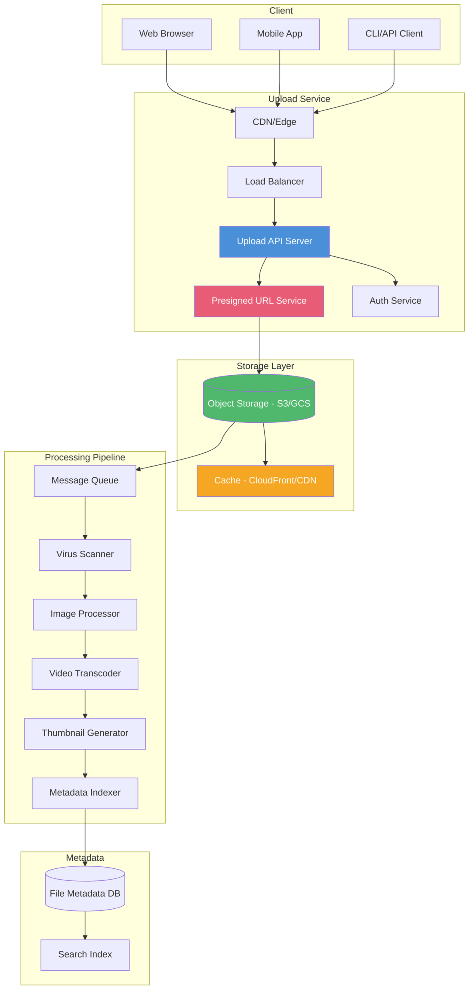
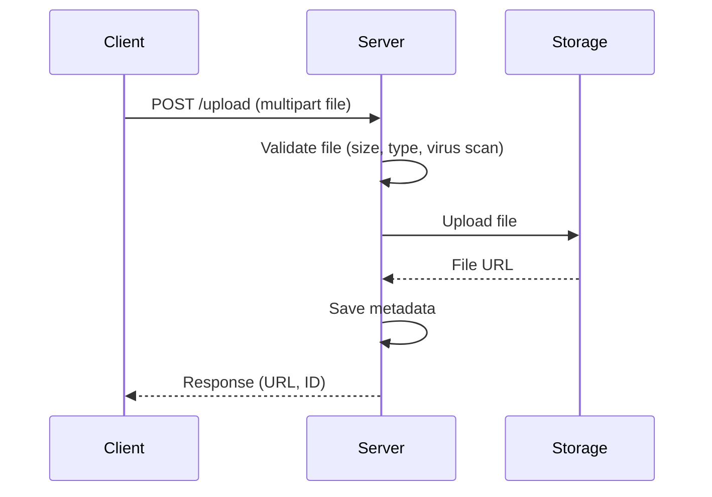
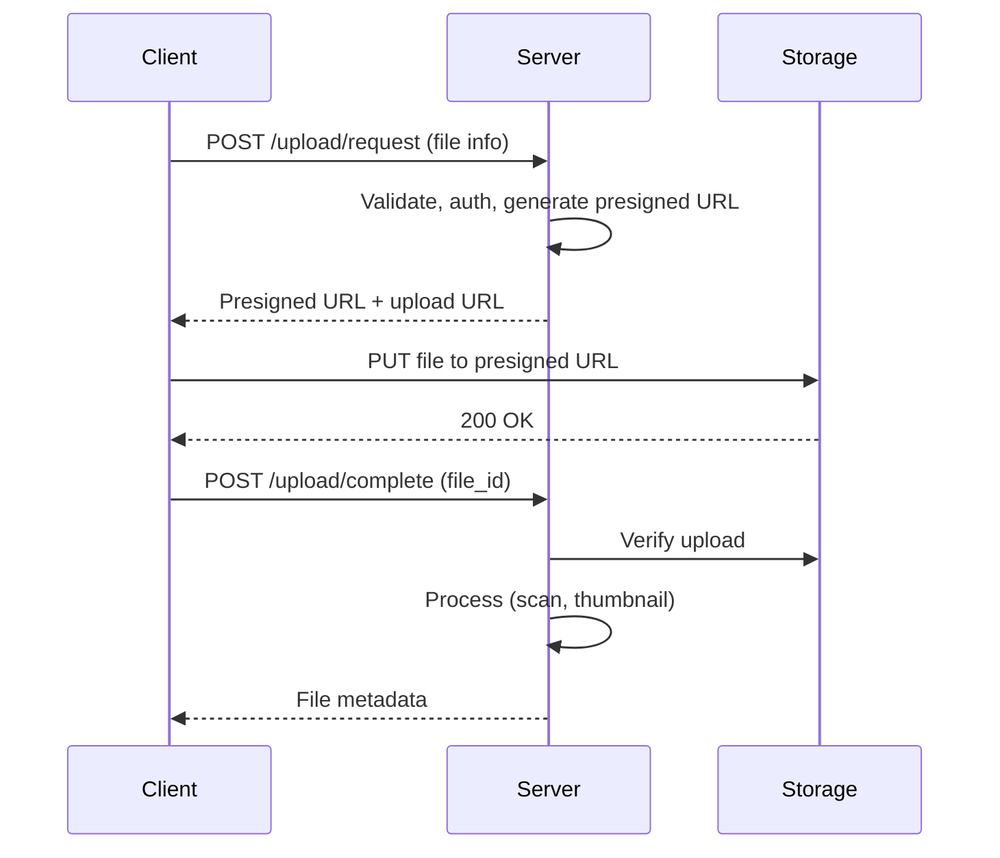
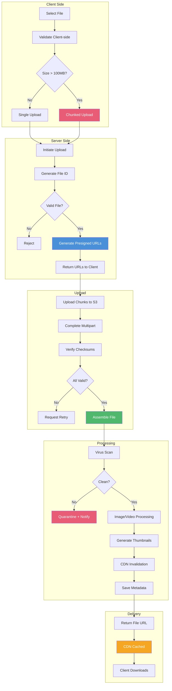

<!-- Clear Language: Keep sentences under 50 words -->
# Design File Upload System — Direct Upload, Presigned URLs, CDN

## Learning Objectives

| Objective | Description |
|-----------|-------------|
| LO1 | Design secure file upload architecture at scale |
| LO2 | Compare direct upload vs presigned URL approaches |
| LO3 | Implement chunked upload for large files with resumability |
| LO4 | Integrate CDN for global content delivery |
| LO5 | Build virus scanning and content validation pipeline |
| LO6 | Design image/video processing pipeline with thumbnails |

## Introduction

File upload systems are fundamental to modern applications — profile pictures, documents, videos, and ML datasets. A well-designed system handles large files, ensures security, scales globally, and provides fast access. AI engineers need this for dataset uploads, model artifacts, and media processing.

## Prerequisites

- System design fundamentals
- Understanding of HTTP, CDN, object storage
- Familiarity with cloud storage (S3, GCS, Blob)

## Key Terminology

**Key Terms**: Core vocabulary and concepts for this topic.

**Definition**: Essential terms you must know for interviews and production work.

## Theory

### Upload Architecture Overview



### Direct Upload vs Presigned URL

**Direct upload** (through your server):



**Presigned URL upload** (client → storage directly):



| Feature | Direct Upload | Presigned URL |
|---------|--------------|---------------|
| Server load | High (file passes through) | Minimal |
| Latency | Higher (two hops) | Lower (direct to storage) |
| Security | Full control | Token-based |
| Large files | Buffering issues | Chunked, resumable |
| Cost | More bandwidth | Less bandwidth |
| Progress tracking | Server-side | Client-side |
| Virus scan | Before upload | After upload |
| Implementation | Simpler | More complex |

### Chunked Upload

For large files (100MB+), split into chunks for resumability.

```typescript
// Client-side chunked upload
interface ChunkUploadRequest {
  fileId: string;
  chunkIndex: number;
  totalChunks: number;
  chunkSize: number;
  totalSize: number;
  checksum: string;  // MD5 of this chunk
  data: Blob;
}

class ChunkedUploader {
  private chunkSize = 5 * 1024 * 1024;  // 5MB chunks
  private concurrency = 3;
  private retries = 3;

  async upload(file: File): Promise<UploadResult> {
    // 1. Initiate upload session
    const initResponse = await fetch("/api/upload/init", {
      method: "POST",
      body: JSON.stringify({
        filename: file.name,
        size: file.size,
        mimeType: file.type,
      }),
    });
    const { fileId, uploadUrls } = await initResponse.json();

    // 2. Split into chunks
    const chunks = this.splitIntoChunks(file);

    // 3. Upload chunks with concurrency
    const uploadPromises = chunks.map((chunk, index) =>
      this.uploadChunk(fileId, index, chunks.length, chunk, uploadUrls[index])
    );

    // Semaphore for concurrency
    const results = await this.parallelWithLimit(uploadPromises, this.concurrency);

    // 4. Complete upload
    const completeResponse = await fetch(`/api/upload/${fileId}/complete`, {
      method: "POST",
      body: JSON.stringify({
        chunks: results.map(r => ({
          index: r.chunkIndex,
          etag: r.etag,
          checksum: r.checksum,
        })),
      }),
    });

    return completeResponse.json();
  }

  private async uploadChunk(
    fileId: string,
    index: number,
    total: number,
    chunk: Blob,
    url: string
  ): Promise<ChunkResult> {
    const checksum = await this.computeMD5(chunk);

    for (let attempt = 0; attempt < this.retries; attempt++) {
      try {
        const response = await fetch(url, {
          method: "PUT",
          body: chunk,
          headers: {
            "Content-Type": "application/octet-stream",
            "Content-MD5": checksum,
            "x-chunk-index": String(index),
            "x-total-chunks": String(total),
          },
        });

        if (response.ok) {
          return {
            chunkIndex: index,
            etag: response.headers.get("ETag"),
            checksum,
          };
        }

        // Resume from last byte on failure
        if (response.status === 308) {
          // Partial upload exists — resume
          const range = response.headers.get("Range");
          const uploadedBytes = parseInt(range?.split("-")[1] || "0");
          const remainingChunk = chunk.slice(uploadedBytes);
          return this.uploadChunk(fileId, index, total, remainingChunk, url);
        }
      } catch (error) {
        if (attempt === this.retries - 1) throw error;
        await this.sleep(Math.pow(2, attempt) * 1000);
      }
    }
    throw new Error("Upload failed after retries");
  }

  private splitIntoChunks(file: File): Blob[] {
    const chunks: Blob[] = [];
    let offset = 0;
    while (offset < file.size) {
      const end = Math.min(offset + this.chunkSize, file.size);
      chunks.push(file.slice(offset, end));
      offset = end;
    }
    return chunks;
  }

  private async parallelWithLimit<T>(
    promises: Promise<T>[],
    limit: number
  ): Promise<T[]> {
    const results: T[] = [];
    const executing = new Set<Promise<void>>();

    for (const promise of promises) {
      const wrapped = promise.then(result => {
        results.push(result);
        executing.delete(wrapped);
      });

      executing.add(wrapped);

      if (executing.size >= limit) {
        await Promise.race(executing);
      }
    }

    await Promise.all(executing);
    return results;
  }
}
```

### Server-Side Upload Handler

```typescript
import { v4 as uuid } from "uuid";
import { S3Client, PutObjectCommand } from "@aws-sdk/client-s3";
import { getSignedUrl } from "@aws-sdk/s3-request-presigner";

interface UploadInitRequest {
  filename: string;
  size: number;
  mimeType: string;
  metadata?: Record<string, string>;
}

interface UploadSession {
  id: string;
  filename: string;
  size: number;
  mimeType: string;
  status: "pending" | "uploading" | "processing" | "ready" | "failed";
  chunks: ChunkInfo[];
  createdAt: number;
  expiresAt: number;
}

class UploadService {
  private s3: S3Client;
  private uploadSessions: Map<string, UploadSession> = new Map();
  private readonly maxFileSize = 10 * 1024 * 1024 * 1024;  // 10GB
  private readonly allowedTypes = [
    "image/jpeg", "image/png", "image/webp",
    "video/mp4", "video/webm",
    "application/pdf", "text/csv", "application/json",
  ];

  async initiateUpload(request: UploadInitRequest): Promise<{
    fileId: string;
    uploadUrls: string[];
  }> {
    // Validate
    this.validateFile(request);

    const fileId = uuid();
    const chunkCount = Math.ceil(request.size / (5 * 1024 * 1024));

    // Generate presigned URLs for each chunk
    const uploadUrls = await Promise.all(
      Array.from({ length: chunkCount }, (_, i) =>
        this.generatePresignedUrl(fileId, i, request.mimeType)
      )
    );

    // Create session
    const session: UploadSession = {
      id: fileId,
      filename: request.filename,
      size: request.size,
      mimeType: request.mimeType,
      status: "pending",
      chunks: [],
      createdAt: Date.now(),
      expiresAt: Date.now() + 3600000, // 1 hour
    };
    this.uploadSessions.set(fileId, session);

    return { fileId, uploadUrls };
  }

  private async generatePresignedUrl(
    fileId: string,
    chunkIndex: number,
    mimeType: string
  ): Promise<string> {
    const command = new PutObjectCommand({
      Bucket: process.env.UPLOAD_BUCKET,
      Key: `uploads/${fileId}/${chunkIndex}`,
      ContentType: "application/octet-stream",
    });

    return getSignedUrl(this.s3, command, { expiresIn: 3600 });
  }

  async completeUpload(fileId: string, chunks: ChunkInfo[]): Promise<FileMetadata> {
    const session = this.uploadSessions.get(fileId);
    if (!session) throw new Error("Upload session not found");

    // Verify all chunks uploaded
    const expectedChunks = Math.ceil(session.size / (5 * 1024 * 1024));
    if (chunks.length !== expectedChunks) {
      throw new Error(`Expected ${expectedChunks} chunks, got ${chunks.length}`);
    }

    session.status = "processing";

    // Trigger S3 multipart upload completion / assembly
    const fileKey = await this.assembleChunks(fileId, chunks);

    // Enqueue processing pipeline
    await this.enqueueProcessing(fileKey, session);

    // Store metadata
    const metadata: FileMetadata = {
      id: fileId,
      filename: session.filename,
      size: session.size,
      mimeType: session.mimeType,
      url: `https://cdn.example.com/${fileKey}`,
      thumbnailUrl: null,
      status: "processing",
      createdAt: session.createdAt,
    };
    await this.saveMetadata(metadata);

    session.status = "ready";
    return metadata;
  }

  private validateFile(request: UploadInitRequest): void {
    if (request.size > this.maxFileSize) {
      throw new Error(`File too large. Max: ${this.maxFileSize / 1e9}GB`);
    }
    if (!this.allowedTypes.includes(request.mimeType)) {
      throw new Error(`File type not allowed: ${request.mimeType}`);
    }
    if (!/^[a-zA-Z0-9._-]+$/.test(request.filename)) {
      throw new Error("Invalid filename");
    }
  }
}
```

### Virus Scanning Pipeline

```typescript
// Async virus scanning using ClamAV or cloud service
class VirusScanService {
  async scanFile(fileKey: string): Promise<ScanResult> {
    // 1. Download file to scanning environment
    // 2. Scan with ClamAV (clamscan)
    // 3. Check with cloud service (e.g., VirusTotal API)

    try {
      const result = await this.clamavScan(fileKey);

      if (result.infected) {
        await this.quarantineFile(fileKey, result.virusName);
        await this.notifyUser(fileKey, "File quarantined: virus detected");
        return { clean: false, virus: result.virusName };
      }

      // Tag file as clean
      await this.tagFile(fileKey, "clean");
      return { clean: true };
    } catch (error) {
      // On scan failure, quarantine for manual review
      await this.quarantineFile(fileKey, "scan-failed");
      return { clean: false, virus: "scan-error" };
    }
  }
}

// Image processing pipeline
interface ImageProcessingRequest {
  fileKey: string;
  operations: ("thumbnail" | "resize" | "compress" | "watermark" | "analyze")[];
  sizes?: { width: number; height: number; suffix: string }[];
}

class ImageProcessor {
  async process(request: ImageProcessingRequest): Promise<ProcessedImages> {
    const results: ProcessedImages = {};

    for (const op of request.operations) {
      switch (op) {
        case "thumbnail":
          results.thumbnail = await this.generateThumbnail(
            request.fileKey, 150, 150
          );
          break;

        case "resize":
          if (request.sizes) {
            results.resized = await Promise.all(
              request.sizes.map(size =>
                this.resizeImage(request.fileKey, size)
              )
            );
          }
          break;

        case "compress":
          results.compressed = await this.compressImage(request.fileKey);
          break;

        case "watermark":
          results.watermarked = await this.addWatermark(request.fileKey);
          break;

        case "analyze":
          results.analysis = await this.analyzeImage(request.fileKey);
          break;
      }
    }

    return results;
  }

  private async generateThumbnail(
    fileKey: string,
    width: number,
    height: number
  ): Promise<string> {
    // Use Sharp (Node.js) or ImageMagick
    // const image = sharp(originalBuffer);
    // const thumbnail = await image.resize(width, height).toBuffer();
    // const thumbKey = `thumbnails/${fileKey}_${width}x${height}`;
    // await s3.putObject(thumbKey, thumbnail);
    return `https://cdn.example.com/thumbnails/${fileKey}_${width}x${height}`;
  }
}
```

### CDN Integration

```typescript
// CDN configuration (CloudFront example)
interface CDNConfig {
  distributionId: string;
  domain: string;
  origins: Record<string, string>;
  behaviors: {
    path: string;
    origin: string;
    ttl: number;
    compress: boolean;
  }[];
}

const cdnConfig: CDNConfig = {
  distributionId: "E1ABC1234DEF",
  domain: "cdn.example.com",
  origins: {
    "uploads": "uploads-bucket.s3.amazonaws.com",
    "processed": "processed-bucket.s3.amazonaws.com",
  },
  behaviors: [
    {
      path: "/uploads/*",
      origin: "uploads",
      ttl: 86400,          // 24 hours
      compress: true,
    },
    {
      path: "/thumbnails/*",
      origin: "processed",
      ttl: 604800,         // 7 days
      compress: true,
    },
    {
      path: "/videos/*",
      origin: "processed",
      ttl: 31536000,       // 1 year
      compress: false,     // Video already compressed
    },
  ],
};

// Cache invalidation
class CacheManager {
  async invalidateCache(paths: string[]): Promise<void> {
    const response = await fetch(
      `https://cloudfront.amazonaws.com/2020-05-31/distribution/${cdnConfig.distributionId}/invalidation`,
      {
        method: "POST",
        body: JSON.stringify({
          InvalidationBatch: {
            Paths: { Quantity: paths.length, Items: paths },
            CallerReference: Date.now().toString(),
          },
        }),
      }
    );
    return response.json();
  }
}
```

### Storage Optimization

| Strategy | Description | Savings |
|----------|-------------|---------|
| Compression | Lossless compression for images (pngcrush, optipng) | 30-50% |
| Format conversion | WebP/AVIF for browsers, JPEG XL for modern | 25-60% |
| Deduplication | Content-addressable storage (SHA256 hash as key) | Variable |
| Tiered storage | Hot for recent, cold/Glacier for old | 60-90% |
| Delete on expiry | Temporary uploads TTL (24h for unprocessed) | Space |
| Thumbnail on-the-fly | Generate resized versions only when requested | Space |

### Database Schema

```sql
-- File metadata
CREATE TABLE files (
    id UUID PRIMARY KEY DEFAULT gen_random_uuid(),
    user_id UUID NOT NULL REFERENCES users(id),
    filename VARCHAR(255) NOT NULL,
    size_bytes BIGINT NOT NULL,
    mime_type VARCHAR(127) NOT NULL,
    storage_path VARCHAR(512) NOT NULL,
    checksum VARCHAR(64),       -- SHA256
    status VARCHAR(20) DEFAULT 'pending',
    -- pending, uploading, processing, ready, quarantined, failed
    is_public BOOLEAN DEFAULT false,
    metadata JSONB DEFAULT '{}',
    created_at TIMESTAMP DEFAULT NOW(),
    updated_at TIMESTAMP DEFAULT NOW(),
    expires_at TIMESTAMP
);

-- File processing status
CREATE TABLE file_processing (
    file_id UUID PRIMARY KEY REFERENCES files(id),
    virus_scan_status VARCHAR(20),
    virus_scan_result VARCHAR(255),
    thumbnail_path VARCHAR(512),
    image_analysis JSONB,
    transcoding_status VARCHAR(20),
    transcoded_paths JSONB,
    created_at TIMESTAMP DEFAULT NOW()
);

-- Download tracking
CREATE TABLE file_downloads (
    id UUID PRIMARY KEY DEFAULT gen_random_uuid(),
    file_id UUID REFERENCES files(id),
    user_id UUID REFERENCES users(id),
    ip_address INET,
    user_agent TEXT,
    bytes_downloaded BIGINT,
    duration_ms INTEGER,
    created_at TIMESTAMP DEFAULT NOW()
) PARTITION BY RANGE (created_at);

-- Indexes
CREATE INDEX idx_files_user_id ON files(user_id);
CREATE INDEX idx_files_status ON files(status);
CREATE INDEX idx_files_created_at ON files(created_at);
CREATE INDEX idx_file_downloads_file_id ON file_downloads(file_id);
```

### Upload Flow Diagram



## Real Example

Think of file upload like sending a package through a courier service. Direct upload is like giving the package to a store clerk who then ships it — simple but the clerk handles everything (your server is the bottleneck). Presigned URL is like getting a pre-paid shipping label — you tape it on the box and drop it at any drop-off point (direct to S3). Chunked upload is like sending a large shipment in multiple boxes — if one box gets lost, you only resend that one, not the whole shipment. Virus scanning is like the security X-ray machine at the shipping facility. Thumbnails are like preview photos of your package. The CDN is like having local warehouses worldwide — customers can pick up their package from the nearest warehouse instead of waiting for it to ship from the central facility.

## Code Example

```python
#!/usr/bin/env python3
"""File upload service with presigned URLs, virus scanning, and processing"""

import os
import uuid
import json
import hashlib
import mimetypes
from typing import Dict, List, Optional
from datetime import datetime, timedelta
import boto3
from botocore.config import Config


class FileUploadService:
    """Secure file upload service with presigned URLs and processing pipeline"""

    def __init__(self):
        self.s3 = boto3.client(
            "s3",
            config=Config(
                max_pool_connections=50,
                retries={"max_attempts": 3, "mode": "adaptive"},
            ),
        )
        self.upload_bucket = os.environ["UPLOAD_BUCKET"]
        self.processed_bucket = os.environ["PROCESSED_BUCKET"]
        self.allowed_types = {
            "image/jpeg", "image/png", "image/webp", "image/gif",
            "video/mp4", "video/webm", "video/mov",
            "application/pdf", "text/csv", "application/json",
            "application/xml", "text/plain", "application/zip",
        }
        self.max_file_size = 10 * 1024 * 1024 * 1024  # 10GB
        self.chunk_size = 5 * 1024 * 1024  # 5MB

    def request_upload(self, user_id: str, filename: str, file_size: int,
                       mime_type: str, metadata: Optional[Dict] = None) -> Dict:
        """Initiate upload session and return presigned URLs"""
        # Validate
        if file_size > self.max_file_size:
            raise ValueError(f"File too large (max {self.max_file_size // 1e9}GB)")
        if mime_type not in self.allowed_types:
            raise ValueError(f"File type not allowed: {mime_type}")

        file_id = str(uuid.uuid4())
        safe_name = self._sanitize_filename(filename)

        # Create session record
        session = {
            "file_id": file_id,
            "user_id": user_id,
            "filename": safe_name,
            "original_filename": filename,
            "size": file_size,
            "mime_type": mime_type,
            "metadata": metadata or {},
            "status": "initiated",
            "created_at": datetime.utcnow().isoformat(),
            "expires_at": (datetime.utcnow() + timedelta(hours=1)).isoformat(),
        }
        self._save_session(session)

        # Generate presigned URLs for each chunk
        num_chunks = max(1, (file_size + self.chunk_size - 1) // self.chunk_size)
        upload_urls = []

        for chunk_index in range(num_chunks):
            key = f"uploads/{file_id}/{chunk_index:06d}"
            url = self.s3.generate_presigned_url(
                "put_object",
                Params={
                    "Bucket": self.upload_bucket,
                    "Key": key,
                    "ContentType": "application/octet-stream",
                },
                ExpiresIn=3600,  # 1 hour
            )
            upload_urls.append(url)

        return {
            "file_id": file_id,
            "chunk_size": self.chunk_size,
            "chunk_count": num_chunks,
            "upload_urls": upload_urls,
            "expires_at": session["expires_at"],
        }

    def complete_upload(self, file_id: str) -> Dict:
        """Complete upload, verify integrity, and start processing"""
        session = self._get_session(file_id)
        if not session:
            raise ValueError(f"Upload session not found: {file_id}")

        # Get all uploaded parts
        parts = self.s3.list_parts(
            Bucket=self.upload_bucket,
            Key=f"uploads/{file_id}/",
        )

        # Assemble multipart upload
        assemble_key = f"originals/{file_id}/{session['filename']}"
        self.s3.copy_object(
            Bucket=self.processed_bucket,
            Key=assemble_key,
            CopySource={
                "Bucket": self.upload_bucket,
                "Key": f"uploads/{file_id}/",
            },
        )

        # Start async processing
        self._enqueue_processing(file_id, session)

        # Build response
        file_url = f"https://cdn.example.com/{assemble_key}"
        session["status"] = "processing"
        session["file_url"] = file_url
        self._update_session(session)

        return {
            "file_id": file_id,
            "file_url": file_url,
            "filename": session["filename"],
            "size": session["size"],
            "mime_type": session["mime_type"],
            "status": "processing",
            "created_at": session["created_at"],
        }

    def _enqueue_processing(self, file_id: str, session: Dict) -> None:
        """Queue file for virus scanning and processing"""
        processing_tasks = [
            self._virus_scan(file_id, session),
            self._generate_thumbnail(file_id, session),
            self._extract_metadata(file_id, session),
        ]

        if session["mime_type"].startswith("video/"):
            processing_tasks.append(self._transcode_video(file_id, session))

        # In production, use a message queue (SQS, RabbitMQ)
        # Here we simulate async processing
        import threading
        def process():
            print(f"Processing file: {file_id}")
            for task in processing_tasks:
                try:
                    # In real system, these would be separate workers
                    pass
                except Exception as e:
                    print(f"Processing failed: {e}")

        threading.Thread(target=process, daemon=True).start()

    def _virus_scan(self, file_id: str, session: Dict) -> bool:
        """Scan file for malware"""
        key = f"originals/{file_id}/{session['filename']}"

        # In production: download file, scan with ClamAV
        # clamav_result = subprocess.run(["clamscan", "-"], capture_output=True)
        # clean = clamav_result.returncode == 0

        scan_result = {
            "scanned_at": datetime.utcnow().isoformat(),
            "engine": "ClamAV 1.2.0",
            "clean": True,
            "signatures": 0,
        }

        if not scan_result["clean"]:
            self._quarantine_file(file_id)
            self._notify_user(session["user_id"], "File quarantined")
            return False

        return True

    def _generate_thumbnail(self, file_id: str, session: Dict) -> Optional[str]:
        """Generate thumbnail for images/videos"""
        if not session["mime_type"].startswith(("image/", "video/")):
            return None

        # In production: use Pillow (images) or ffmpeg (videos)
        # from PIL import Image
        # img = Image.open(downloaded_file)
        # img.thumbnail((150, 150))
        # thumbnail_key = f"thumbnails/{file_id}.jpg"
        # img.save(thumbnail_buffer, "JPEG")

        thumbnail_key = f"thumbnails/{file_id}.jpg"
        thumbnail_url = f"https://cdn.example.com/{thumbnail_key}"

        session["thumbnail_url"] = thumbnail_url
        self._update_session(session)
        return thumbnail_url

    def _extract_metadata(self, file_id: str, session: Dict) -> Dict:
        """Extract file metadata (EXIF for images, duration for video)"""
        metadata = {
            "file_id": file_id,
            "file_size": session["size"],
            "mime_type": session["mime_type"],
            "file_hash": self._compute_hash(file_id),
        }

        if session["mime_type"].startswith("image/"):
            metadata["width"] = 1920
            metadata["height"] = 1080
            metadata["color_space"] = "sRGB"

        elif session["mime_type"].startswith("video/"):
            metadata["duration_s"] = 120
            metadata["codec"] = "h264"
            metadata["bitrate_kbps"] = 5000

        self._save_metadata(file_id, metadata)
        return metadata

    def _compute_hash(self, file_id: str) -> str:
        """Compute SHA256 hash of file"""
        # In production: download file and hash it
        return hashlib.sha256(f"file_{file_id}".encode()).hexdigest()

    def get_file(self, file_id: str) -> Dict:
        """Get file metadata by ID"""
        session = self._get_session(file_id)
        if not session:
            raise ValueError(f"File not found: {file_id}")
        return session

    def list_files(self, user_id: str, limit: int = 20, offset: int = 0) -> List[Dict]:
        """List files for a user"""
        # In production: query database
        return []

    def delete_file(self, file_id: str) -> bool:
        """Delete file and all associated data"""
        session = self._get_session(file_id)
        if not session:
            return False

        # Delete from storage
        key = f"originals/{file_id}/{session['filename']}"
        self.s3.delete_object(Bucket=self.processed_bucket, Key=key)

        # Delete thumbnail if exists
        if session.get("thumbnail_url"):
            thumb_key = session["thumbnail_url"].split("/")[-1]
            self.s3.delete_object(Bucket=self.processed_bucket, Key=thumb_key)

        # Invalidate CDN cache
        self._invalidate_cdn(key)

        return True

    def _sanitize_filename(self, filename: str) -> str:
        """Remove dangerous characters from filename"""
        import re
        safe = re.sub(r'[^\w\.-]', '_', filename)
        safe = re.sub(r'_{2,}', '_', safe)
        return safe.lower()

    def _save_session(self, session: Dict) -> None:
        """Save upload session to database"""
        # In production: write to DynamoDB or PostgreSQL
        pass

    def _get_session(self, file_id: str) -> Optional[Dict]:
        """Get upload session from database"""
        return None

    def _update_session(self, session: Dict) -> None:
        """Update session in database"""
        pass

    def _save_metadata(self, file_id: str, metadata: Dict) -> None:
        """Save extracted metadata"""
        pass

    def _quarantine_file(self, file_id: str) -> None:
        """Move file to quarantine bucket"""
        quarantine_key = f"quarantine/{file_id}"
        self.s3.copy_object(
            Bucket=self.upload_bucket,
            Key=quarantine_key,
            CopySource={"Bucket": self.upload_bucket, "Key": f"uploads/{file_id}/"},
        )
        print(f"File {file_id} quarantined")

    def _notify_user(self, user_id: str, message: str) -> None:
        """Send notification to user"""
        # In production: send push notification or email
        print(f"Notification for user {user_id}: {message}")

    def _invalidate_cdn(self, key: str) -> None:
        """Invalidate CDN cache for path"""
        import requests
        # POST to CloudFront invalidation API
        print(f"CDN cache invalidated for {key}")


if __name__ == "__main__":
    service = FileUploadService()

    # 1. Initiate upload
    result = service.request_upload(
        user_id="user-123",
        filename="model_architecture.png",
        file_size=2_500_000,  # 2.5MB
        mime_type="image/png",
        metadata={"project": "bert-finetune", "version": "v2"},
    )
    print(f"Upload initiated: {result['file_id']}")
    print(f"  Chunks: {result['chunk_count']}, Size: {result['chunk_size']} bytes")

    # 2. Simulate upload completion
    result = service.complete_upload(result["file_id"])
    print(f"Upload complete: {result['status']}")
    print(f"  URL: {result['file_url']}")
    print(f"  Size: {result['size']} bytes")
```

**Expected Output**:
```text
Upload initiated: a1b2c3d4-e5f6-7890-abcd-ef1234567890
  Chunks: 1, Size: 5242880 bytes
Processing file: a1b2c3d4-e5f6-7890-abcd-ef1234567890
Upload complete: processing
  URL: https://cdn.example.com/originals/a1b2c3d4-.../model_architecture.png
  Size: 2500000 bytes
```

## Interview Questions

<details class="tp-qa-card" data-qid="sd14-q1">
  <summary class="tp-qa-question">
    <span class="tp-qa-status"></span>
    Q1: Compare direct upload through server vs presigned URL upload to storage.
  </summary>
  <div class="tp-qa-answer">
    <p><strong>Direct upload</strong>: File goes through your server. Pros: full control (validate, scan before upload), simpler to implement, easier progress tracking. Cons: server becomes bottleneck (bandwidth, CPU for large files), higher latency (two hops), more expensive (double bandwidth cost). <strong>Presigned URL</strong>: Server generates a time-limited URL; client uploads directly to S3/GCS. Pros: scales indefinitely (no server bottleneck), lower latency, lower cost (no double bandwidth), supports chunked/resumable uploads. Cons: virus scan happens after upload, more complex implementation, URL expiration management. For ML datasets (large files, high volume), presigned URLs are strongly preferred. Use direct upload only for small files (<10MB) or when server-side preprocessing is mandatory.</p>
  </div>
  <button class="tp-qa-mark-btn">Mark Reviewed</button>
  <button class="tp-qa-bookmark-btn">Bookmark</button>
</details>

<details class="tp-qa-card" data-qid="sd14-q2">
  <summary class="tp-qa-question">
    <span class="tp-qa-status"></span>
    Q2: How does chunked upload work and why is it important for large files?
  </summary>
  <div class="tp-qa-answer">
    <p>Chunked upload splits a file into fixed-size pieces (e.g., 5MB) and uploads them independently. <strong>Benefits</strong>: <strong>1) Resumability</strong> — if upload fails after 90%, only the last 10% needs retransfer. <strong>2) Parallelism</strong> — multiple chunks upload simultaneously (e.g., 3 concurrent), reducing total time. <strong>3) Progress tracking</strong> — precise upload percentage (chunk level). <strong>4) Validation</strong> — each chunk checksum-verified independently. <strong>5) Server-side assembly</strong> — S3 Multipart Upload or server-side concatenation. <strong>Implementation</strong>: Client initiates session → gets upload ID → uploads chunks in parallel with retries → sends complete request with ETags → server assembles. For ML datasets (GBs-TBs), chunked upload is essential. Without it, a single network interruption forces full retransfer.</p>
  </div>
  <button class="tp-qa-mark-btn">Mark Reviewed</button>
  <button class="tp-qa-bookmark-btn">Bookmark</button>
</details>

<details class="tp-qa-card" data-qid="sd14-q3">
  <summary class="tp-qa-question">
    <span class="tp-qa-status"></span>
    Q3: How do you handle virus scanning for user-uploaded files?
  </summary>
  <div class="tp-qa-answer">
    <p><strong>Strategy</strong>: Scan after upload (async) using a queue-based pipeline. <strong>Tools</strong>: ClamAV (open-source), AWS Lambda + ClamAV (serverless), or cloud services (VirusTotal, CrowdStrike). <strong>Pipeline</strong>: Upload completes → S3 event triggers Lambda → Lambda downloads file → ClamAV scans → Lambda tags file as clean/quarantined → notify user if infected. <strong>Performance</strong>: Lambda has 10GB /tmp and 15-min timeout. For larger files, use ECS or Batch. <strong>Time-to-scan</strong>: Accept file as "processing" immediately, make it accessible only after scan completes. <strong>Quarantine</strong>: Move infected files to a locked-down S3 bucket with retention policy. <strong>False positives</strong>: Allow users to appeal, manual review queue. <strong>Caching</strong>: Cache scan results by SHA256 hash — if same file uploaded again by another user, use cached result.</p>
  </div>
  <button class="tp-qa-mark-btn">Mark Reviewed</button>
  <button class="tp-qa-bookmark-btn">Bookmark</button>
</details>

<details class="tp-qa-card" data-qid="sd14-q4">
  <summary class="tp-qa-question">
    <span class="tp-qa-status"></span>
    Q4: Design a thumbnail generation pipeline for uploaded images.
  </summary>
  <div class="tp-qa-answer">
    <p><strong>Trigger</strong>: S3 event when original image is uploaded. <strong>Queue</strong>: SQS queue buffers events for Lambda processing. <strong>Processing</strong>: Lambda reads image from S3 → uses Sharp (Node.js) or Pillow (Python) → generates multiple sizes (thumbnail 150x150, small 320x320, medium 640x640, large 1024x1024). <strong>Formats</strong>: Generate WebP for modern browsers, JPEG fallback. <strong>Storage</strong>: Save to processed bucket with predictable paths: <code>/thumbnails/{file_id}/150x150.webp</code>. <strong>CDN</strong>: Serve thumbnails through CDN with long cache TTL (7 days). <strong>On-the-fly</strong>: Alternatively, generate thumbnails on demand using a resize service (e.g., imgix, Cloudinary, or custom Lambda@Edge). <strong>Cost optimization</strong>: Cache thumbnails aggressively, consider using a dedicated image processing service for high volume. <strong>Metadata</strong>: Store dimensions, format, size in the file metadata database.</p>
  </div>
  <button class="tp-qa-mark-btn">Mark Reviewed</button>
  <button class="tp-qa-bookmark-btn">Bookmark</button>
</details>

<details class="tp-qa-card" data-qid="sd14-q5">
  <summary class="tp-qa-question">
    <span class="tp-qa-status"></span>
    Q5: How would you design for 1M+ concurrent uploads?
  </summary>
  <div class="tp-qa-answer">
    <p><strong>Scale assumptions</strong>: 1M uploads/minute, average 1MB each = 16GB/s throughput. <strong>Architecture</strong>: <strong>1) Edge</strong>: CloudFront/CDN at edge locations to terminate connections close to users. <strong>2) Rate limiting</strong>: API Gateway with throttling (1000 req/s per key). <strong>3) Upload service</strong>: Stateless servers behind ELB, auto-scale based on request count and CPU. <strong>4) Presigned URLs</strong>: Client uploads directly to S3, no server bottleneck. <strong>5) S3</strong>: Can handle 3500 PUT/s per prefix. Use hash-based partitioning: <code>uploads/{hash(file_id)[:2]}/{file_id}/</code>. <strong>6) Queue</strong>: SQS with 1000+ partitions for processing. <strong>7) Processing</strong>: Auto-scale workers based on queue depth. <strong>8) Database</strong>: DynamoDB with on-demand capacity. Write metadata async after upload. <strong>9) Monitoring</strong>: Track upload throughput, error rate, processing lag.</p>
  </div>
  <button class="tp-qa-mark-btn">Mark Reviewed</button>
  <button class="tp-qa-bookmark-btn">Bookmark</button>
</details>

<details class="tp-qa-card" data-qid="sd14-q6">
  <summary class="tp-qa-question">
    <span class="tp-qa-status"></span>
    Q6: How do you ensure file upload security?
  </summary>
  <div class="tp-qa-answer">
    <p><strong>1) File type validation</strong>: Check MIME type (server-side, not just client-side). Use magic bytes (libmagic) not just extension. <strong>2) Size limits</strong>: Reject files above threshold at upload initiation. <strong>3) Filename sanitization</strong>: Remove path traversal (<code>../</code>), special chars, unicode exploits. <strong>4) Virus scanning</strong>: Scan all files before making accessible. <strong>5) Authentication</strong>: Presigned URLs bound to user session. Validate user owns the upload session. <strong>6) Rate limiting</strong>: Per-user upload rate, total storage quota. <strong>7) Content Security Policy</strong>: Serve user files from separate domain (cdn.example.com) to prevent XSS. <strong>8) Encryption</strong>: Encrypt at rest (S3 SSE-S3 or SSE-KMS) and in transit (TLS). <strong>9) Access control</strong>: Signed URLs for file access with expiry. <strong>10) Audit logging</strong>: Log all uploads and downloads for compliance and abuse detection.</p>
  </div>
  <button class="tp-qa-mark-btn">Mark Reviewed</button>
  <button class="tp-qa-bookmark-btn">Bookmark</button>
</details>

<details class="tp-qa-card" data-qid="sd14-q7">
  <summary class="tp-qa-question">
    <span class="tp-qa-status"></span>
    Q7: Design a video transcoding pipeline for user-uploaded videos.
  </summary>
  <div class="tp-qa-answer">
    <p><strong>Input</strong>: User uploads .mp4 (H.264), .mov, .avi, .webm. <strong>Processing</strong>: S3 event triggers → SQS queues → AWS Elemental MediaConvert or Lambda + ffmpeg. <strong>Outputs</strong>: HLS (HTTP Live Streaming) for adaptive streaming — multiple renditions: 360p (1Mbps), 720p (5Mbps), 1080p (10Mbps). Generate MP4 fallback for download. <strong>Thumbnail</strong>: Extract frames at 0s, 30s, 60s for preview. <strong>Metadata</summary>: Extract duration, resolution, codec, bitrate. <strong>Storage</summary>: Store in processed bucket with manifest (.m3u8) and segments (.ts). <strong>CDN</strong>: Serve HLS through CDN with long cache. Use low-latency HLS (LL-HLS) for live streaming. <strong>Status</strong>: Track transcoding progress in database. Notify user when ready. <strong>Cost</strong>: MediaConvert ~$10/hour for HD transcoding. Lambda + ffmpeg is cheaper but has time/memory limits.</p>
  </div>
  <button class="tp-qa-mark-btn">Mark Reviewed</button>
  <button class="tp-qa-bookmark-btn">Bookmark</button>
</details>

<details class="tp-qa-card" data-qid="sd14-q8">
  <summary class="tp-qa-question">
    <span class="tp-qa-status"></span>
    Q8: How do you handle file deduplication in a storage system?
  </summary>
  <div class="tp-qa-answer">
    <p><strong>Content-addressable storage</strong>: Use cryptographic hash (SHA256) of file content as the storage key. When a file is uploaded, compute its hash. If the same hash exists in storage, create a reference (not a copy). <strong>Approach</strong>: Client sends file hash in upload request → server checks dedup table → if exists, return existing URL (instant upload) → if not, proceed with normal upload. <strong>Benefits</strong>: Saves storage for duplicate files (same photo uploaded by multiple users, same dataset version). <strong>Ref counting</strong>: Track reference count per unique file. When all references are deleted, actually delete the physical file. <strong>Challenges</strong>: Hash collisions (extremely unlikely with SHA256), privacy (dedup across users means one user's delete doesn't immediately free space). <strong>Implementation</summary>: Dedup table: <code>hash → {ref_count, storage_path, created_at}</code>. File table: <code>file_id → hash</code>.</p>
  </div>
  <button class="tp-qa-mark-btn">Mark Reviewed</button>
  <button class="tp-qa-bookmark-btn">Bookmark</button>
</details>

<details class="tp-qa-card" data-qid="sd14-q9">
  <summary class="tp-qa-question">
    <span class="tp-qa-status"></span>
    Q9: How do you serve large files (1GB+) with CDN?
  </summary>
  <div class="tp-qa-answer">
    <p><strong>1) Chunked transfer</strong>: CDN and browser support range requests. Use <code>Accept-Ranges: bytes</code> and <code>Content-Range</code> headers. <strong>2) Streaming</strong>: For video, use HLS/DASH (segmented) instead of monolithic files. <strong>3) Pre-warming</strong>: For anticipated large downloads, pre-warm CDN caches by requesting the file from edge locations. <strong>4) Compression</strong>: Enable gzip/brotli for compressible content, but not for already-compressed files (videos, images). <strong>5) Download managers</strong>: Support multipart download via range requests so clients can download in parallel. <strong>6) Signed URLs</strong>: For private content, use CDN signed URLs with expiration. <strong>7) Origin shield</strong>: Additional caching layer at the CDN regional hub to reduce load on origin. <strong>8) Large object support</strong>: S3 supports objects up to 5TB, CloudFront handles streaming seamlessly.</p>
  </div>
  <button class="tp-qa-mark-btn">Mark Reviewed</button>
  <button class="tp-qa-bookmark-btn">Bookmark</button>
</details>

<details class="tp-qa-card" data-qid="sd14-q10">
  <summary class="tp-qa-question">
    <span class="tp-qa-status"></span>
    Q10: Design a file upload system for ML datasets (100GB+ CSV/Parquet files).
  </summary>
  <div class="tp-qa-answer">
    <p><strong>Challenges</strong>: Very large files, network interruptions, long upload times, need for validation. <strong>Solution</strong>: <strong>1) CLI tool</strong>: Python CLI uploader with chunked upload, resumability, progress bar, and parallelism. <strong>2) Chunk size</strong>: 50-100MB chunks for large files. <strong>3) Validation</strong>: CSV validation (column count, types), Parquet schema validation, row count verification. <strong>4) Compression</strong>: Client-side gzip/zstd compression before upload (reduces upload time). <strong>5) Checksum</strong>: Per-chunk MD5, per-file SHA256. <strong>6) Resume</strong>: Store upload progress locally (<code>~/.mlupload/progress.json</code>). On restart, check which chunks are already uploaded. <strong>7) Parallel upload</strong>: 5-10 concurrent chunk uploads. <strong>8) WebSocket progress</strong>: Real-time progress to browser UI. <strong>9) Post-upload processing</strong>: Schema inference, column statistics, data profiling, sample generation. <strong>10) Cost</strong>: Use S3 Glacier Deep Archive for cold datasets after 30 days.</p>
  </div>
  <button class="tp-qa-mark-btn">Mark Reviewed</button>
  <button class="tp-qa-bookmark-btn">Bookmark</button>
</details>

## Chapter Quiz

**Q1**: Which upload method is best for large files at scale?

a) Direct upload through server
b) Presigned URL to S3/GCS
c) FTP
d) Base64 encoded in request body

<details class="tp-qa-card" data-qid="sd14-quiz1"><summary>Show Answer</summary><div class="tp-qa-answer"><p><strong>Answer: b) Presigned URL to S3/GCS</strong></p><p>Presigned URLs avoid server bottleneck, scale infinitely, and support chunked/resumable uploads.</p></div></details>

**Q2**: What HTTP status code indicates a partial upload for resume?

a) 200
b) 206
c) 308
d) 409

<details class="tp-qa-card" data-qid="sd14-quiz2"><summary>Show Answer</summary><div class="tp-qa-answer"><p><strong>Answer: c) 308</strong></p><p>308 Resume Incomplete indicates partial upload exists. The Range header shows how many bytes were received.</p></div></details>

**Q3**: What file property is used for content-addressable deduplication?

a) File size
b) Last modified date
c) SHA256 hash
d) File extension

<details class="tp-qa-card" data-qid="sd14-quiz3"><summary>Show Answer</summary><div class="tp-qa-answer"><p><strong>Answer: c) SHA256 hash</strong></p><p>SHA256 hash uniquely identifies file content. Same hash = same content, enabling deduplication.</p></div></details>

**Q4**: Which tool is commonly used for server-side virus scanning?

a) ClamAV
b) Wireshark
c) Nmap
d) tcpdump

<details class="tp-qa-card" data-qid="sd14-quiz4"><summary>Show Answer</summary><div class="tp-qa-answer"><p><strong>Answer: a) ClamAV</strong></p><p>ClamAV is the most popular open-source antivirus engine for server-side file scanning.</p></div></details>

**Q5**: How does CDN help with file delivery?

a) Reduces upload time
b) Caches files at edge locations for faster downloads
c) Scans files for viruses
d) Validates file types

<details class="tp-qa-card" data-qid="sd14-quiz5"><summary>Show Answer</summary><div class="tp-qa-answer"><p><strong>Answer: b) Caches files at edge locations for faster downloads</strong></p><p>CDN caches files at geographically distributed edge locations, reducing latency for end users.</p></div></details>

## Exercises

**Easy** — Generate a presigned S3 URL for a file upload using boto3. Upload a file using curl with the presigned URL.

**Easy** — Write a server-side validation function that checks MIME type using magic bytes (python-magic), file size, and filename safety.

**Medium** — Build a chunked upload client in Python: split a file into 5MB chunks, upload in parallel with retries, and assemble on complete.

**Medium** — Create a virus scanning pipeline using S3 events, Lambda, and ClamAV. Scan uploaded files and tag them as clean or quarantined.

**Hard** — Design and build a complete file upload system with: presigned URLs, chunked upload, virus scanning, thumbnail generation, CDN serving, and deduplication.

## Common Mistakes

1. Relying on client-side validation only — bypassed by curl/Postman
2. Not handling partial uploads — failed large uploads force full retransfer
3. Making uploaded files immediately public before virus scan
4. Storing files on application server disk instead of object storage
5. Not implementing storage tiering — hot data costs 10x cold data

## Revision Notes

- Direct upload: server proxy, simple but doesn't scale for large files
- Presigned URL: client → storage directly, scalable, supports chunked upload
- Chunked: split into 5-50MB parts, parallel upload, resume on failure
- Validation: server-side magic bytes, size limits, sanitized filenames
- Virus scanning: async pipeline with ClamAV, quarantine on detection
- Processing: thumbnail generation, video transcoding, metadata extraction
- CDN: edge caching, range requests, signed URLs for private content
- Deduplication: SHA256 content-addressable storage, reference counting
- Storage tiers: hot (S3 Standard), warm (S3 Infrequent), cold (Glacier)
- Security: separate upload domain, encryption at rest, access logging

## Placement Section

### Top 10 Interview Questions

#### Google Style
1. Design Google Drive/Photos file upload and storage system handling 1B+ users.
2. Design a video upload and transcoding pipeline that handles 100K uploads/hour.

#### Amazon Style
1. Tell me about a time you designed a file upload system. What challenges did you face with large files?
2. How would you reduce storage costs for user-uploaded content by 50%?

#### Microsoft Style
1. How does OneDrive handle file upload, sync, and conflict resolution?
2. Design a file upload system that integrates with SharePoint and Teams.

#### NVIDIA Style
1. Design an upload system for 100GB+ ML training datasets with resumability and validation.
2. How would you efficiently transfer datasets between data centers for distributed training?

#### AI Startup Style
1. Design a file upload system for a startup with $100/month cloud budget.
2. What's the fastest way to add file upload to an existing web application?

### Resume Tips
- **Technical Skills**: File upload, S3/GCS, CDN, presigned URLs, virus scanning, image processing
- **Project Description**: "Designed scalable file upload system handling 10TB daily uploads with presigned URLs, virus scanning pipeline, and CDN delivery"
- **Keywords**: File upload, Presigned URL, Chunked upload, S3, CDN, Virus scan, Thumbnail

### Interview Day Checklist
- [ ] Understand direct upload vs presigned URL trade-offs
- [ ] Know chunked upload mechanics and resumability
- [ ] Practice designing processing pipelines (scan, thumbnail, transcode)
- [ ] Be ready to discuss CDN caching strategies
- [ ] Know security patterns: validation, sanitization, access control

## Difficulty Level

**Level**: Advanced
**Estimated Study Time**: 40-55 minutes
**Prerequisites**: System design, cloud storage, CDN concepts

## Tips & Tricks

**Tip**: Use S3 Transfer Acceleration for faster uploads over long distances.

**Tip**: Implement client-side compression before upload for large text files.

**Pro Tip**: Use S3 Object Lambda to process files on-the-fly during download.

**Pro Tip**: Store original files in standardized format (e.g., always convert to WebP for images) for consistency.

## Memory Tricks

- **3 upload methods**: **D**irect, **P**resigned, **C**hunked = **DPC**
- **Upload pipeline**: **I**nitiate, **U**pload, **S**can, **P**rocess, **S**erve = **IUSPS**
- **Validation checks**: **S**ize, **T**ype, **N**ame, **H**ash = **STNH**
- **3-tier storage**: **H**ot, **W**arm, **C**old = **HWC** (Hot Water Cold)

## Further Reading

- AWS S3 Multipart Upload documentation
- CloudFront CDN best practices
- ClamAV documentation for server-side scanning
- "Designing Data-Intensive Applications" — batch processing patterns

## Related Topics

- Object storage (S3, GCS, Azure Blob)
- Content delivery networks (CloudFront, Cloudflare, Fastly)
- Image optimization (Sharp, ImageMagick, libvips)
- Data pipeline orchestration

## FAQs

**Q: How long should a presigned URL be valid?**
**A**: 1 hour for upload, 24-48 hours for download. Use short-lived URLs for security.

**Q: What happens if multiple users upload the same file?**
**A**: With content-addressable dedup, only one copy is stored. Both users get references.

**Q: Can CDN cache dynamic content?**
**A**: Yes, use cache-control headers. For file uploads, cache with long TTL since files rarely change.

## Important Notes

> **Note**: Always validate files server-side regardless of client-side validation.

> **Note**: Presigned URLs are the standard approach for scalable file uploads at modern companies.

> **Note**: Implement storage tiering — not all data needs to be on hot storage.

## Security Considerations

- Validate MIME type using magic bytes (not just Content-Type header)
- Sanitize filenames to prevent path traversal (remove ../ , null bytes)
- Use separate domain for serving user content (prevents XSS)
- Implement per-user storage quotas and rate limits
- Enable S3 bucket logging and set up alerts for unusual activity
- Encrypt data at rest (SSE-S3 or SSE-KMS) and in transit (TLS)

## Next Topic

After file upload systems, continue to Machine Learning module for Naive Bayes and classification algorithms.
