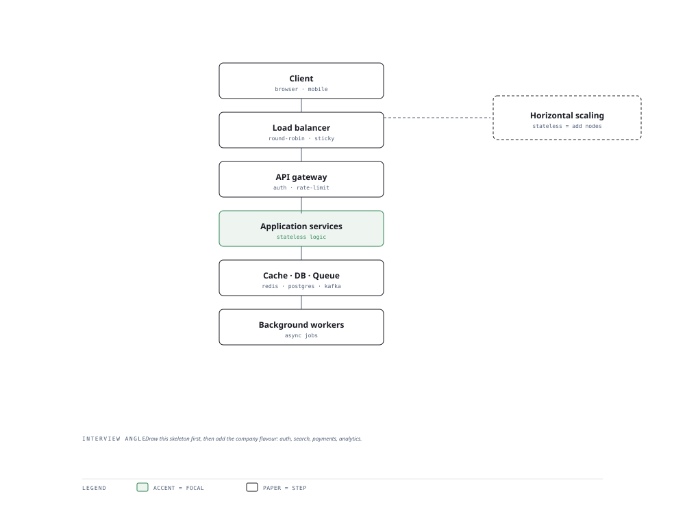

# Visual Notes — One Request, the Full Ride

> One diagram, the full picture. This page is meant to be glanced at before reading the chapters, and again before interviews.

# What the diagram shows

1. **Edge** — A load balancer terminates TLS and spreads traffic; an API gateway enforces auth, rate limits and routing.
1. **Fast path** — A cache (Redis) serves hot data before the slow source is ever touched, cooling tail latency.
1. **Core** — Services own one bounded domain; the database stores truth; a message queue and workers decouple bursts from the hot path.

# Why this matters for placement

- Every system-design round rewards a disciplined skeleton: edge -> cache -> service -> data -> async tail.
- Naming one company-specific insertion (search, payments, analytics) on this skeleton reads as senior level.

# Quick revision

- CAP: choose consistency or availability during partitions; usually eventual consistency + retries.
- Cache strategies: cache-aside, write-through, write-back — know trade-offs cold.
- Queue: broker guarantees at-least-once; make consumers idempotent.
- Database scaling: read replicas -> sharding -> partitioning; indexes come first.
- Idempotency keys on POST + retry with backoff is the "production instinct" signal.

# Related chapters

- [Scalability fundamentals](01-scalability-fundamentals.md)
- [Message queues](03-message-queues.md)
- [Caching strategies](04-caching-strategies.md)
- [Design URL shortener](10-design-url-shortener.md)

---

**One-line answer for interviews:** *"Clients hit a load balancer → gateway → cache → services → data, then a queue absorbs spikes and workers drain it."*
