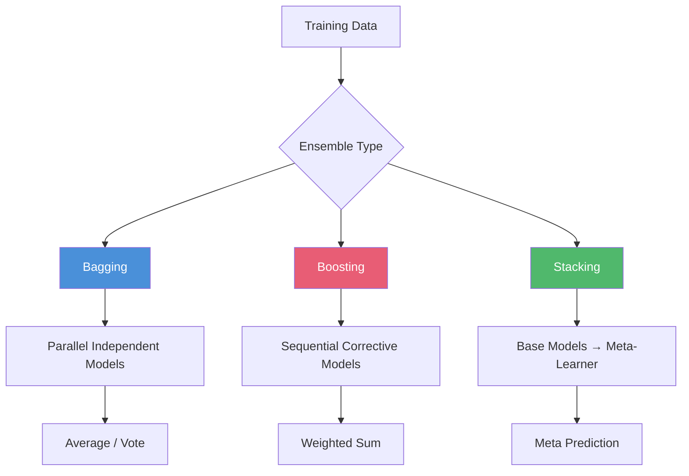

<!-- Clear Language: Keep sentences under 50 words -->
# Ensemble Methods — Boosting, AdaBoost, Gradient Boosting, XGBoost

## Learning Objectives

| Objective | Description |
|-----------|-------------|
| LO1 | Understand ensemble learning: bagging, boosting, stacking |
| LO2 | Implement AdaBoost with decision stumps |
| LO3 | Explain gradient boosting: sequential additive modeling |
| LO4 | Implement gradient boosting with regression trees |
| LO5 | Understand XGBoost: regularization, column subsampling, sparsity |
| LO6 | Apply stacking: meta-learner, base models, cross-validation |

## Introduction

Machine learning is the core of AI engineering. From linear regression to ensemble methods, understanding these algorithms lets you build, debug, and improve models. This module covers the math and code behind ML.

## Prerequisites

- Basic programming knowledge
- Understanding of data structures

## Key Terminology

**Key Terms**: Core vocabulary and concepts for this topic.

**Definition**: Essential terms you must know for interviews and production work.

## Theory

Understanding ensemble methods is fundamental for AI engineers. This section covers the core concepts, underlying principles, and theoretical framework that govern how ensemble methods works in practice.

## Chapter at a Glance

| Section | Topic | Key Concept |
|---------|-------|-------------|
| 6.1 | Ensemble Paradigms | Bagging, boosting, stacking — differences and use cases |
| 6.2 | AdaBoost | Adaptive boosting, sample weights, exponential loss |
| 6.3 | Gradient Boosting | Sequential residuals, learning rate, shallow trees |
| 6.4 | XGBoost | Regularization, column block, sparsity, hardware optimization |
| 6.5 | LightGBM & CatBoost | GOSS, EFB, ordered boosting, categorical features |
| 6.6 | Stacking & Blending | Meta-learner, base models, holdout predictions |

## Chapter Roadmap



## 6.1 Ensemble Paradigms

Ensemble methods combine multiple models to produce better predictions than any single model.

**Bagging** (Bootstrap Aggregating): Train models independently in parallel on bootstrap samples. Reduce variance. Example: Random Forest.

**Boosting**: Train models sequentially, each correcting the errors of its predecessor. Reduce bias and variance. Examples: AdaBoost, Gradient Boosting, XGBoost.

**Stacking**: Train diverse base models, then train a meta-model on their predictions. Leverage complementary strengths.

```python
import numpy as np
from typing import List, Dict, Tuple, Optional, Callable
from sklearn.tree import DecisionTreeRegressor, DecisionTreeClassifier
from sklearn.ensemble import RandomForestClassifier, GradientBoostingClassifier
from sklearn.metrics import accuracy_score

def compare_ensembles(X_train, y_train, X_test, y_test) -> Dict:
    models = {
        "Single Tree": DecisionTreeClassifier(max_depth=5),
        "Random Forest (bagging)": RandomForestClassifier(n_estimators=100, max_depth=5),
        "Gradient Boosting": GradientBoostingClassifier(n_estimators=100, max_depth=3, lr=0.1),
    }

    results = {}
    for name, model in models.items():
        model.fit(X_train, y_train)
        train_acc = accuracy_score(y_train, model.predict(X_train))
        test_acc = accuracy_score(y_test, model.predict(X_test))
        results[name] = {"train_acc": train_acc, "test_acc": test_acc}

    return results

# Generate sample data
from sklearn.datasets import make_classification
X_ens, y_ens = make_classification(n_samples=500, n_features=10, random_state=42)
X_ens_train, y_ens_train = X_ens[:400], y_ens[:400]
X_ens_test, y_ens_test = X_ens[400:], y_ens[400:]

results = compare_ensembles(X_ens_train, y_ens_train, X_ens_test, y_ens_test)
for name, metrics in results.items():
    print(f"{name:25s}: train={metrics['train_acc']:.3f}, test={metrics['test_acc']:.3f}")
```

---

## 6.2 AdaBoost

AdaBoost (Adaptive Boosting) trains weak learners sequentially, increasing weights on misclassified samples.

```python
class AdaBoost:
    def __init__(self, n_estimators: int = 50):
        self.n_estimators = n_estimators
        self.models: List[DecisionTreeClassifier] = []
        self.model_weights: List[float] = []
        self.training_errors: List[float] = []

    def fit(self, X: np.ndarray, y: np.ndarray) -> None:
        n = X.shape[0]
        w = np.ones(n) / n  # Initial sample weights

        for _ in range(self.n_estimators):
            # Train weak learner (decision stump: max_depth=1)
            model = DecisionTreeClassifier(max_depth=1)
            model.fit(X, y, sample_weight=w)
            preds = model.predict(X)

            # Compute weighted error
            err = np.sum(w * (preds != y)) / np.sum(w)
            if err >= 0.5 or err == 0:
                self.models.append(model)
                self.model_weights.append(0)
                continue

            # Model weight
            alpha = 0.5 * np.log((1 - err) / max(err, 1e-10))
            self.models.append(model)
            self.model_weights.append(alpha)
            self.training_errors.append(err)

            # Update sample weights
            w = w * np.exp(-alpha * y * (2 * preds - 1))
            w = w / np.sum(w)  # Normalize

    def predict(self, X: np.ndarray) -> np.ndarray:
        # Weighted majority vote
        predictions = np.zeros(X.shape[0])
        for model, alpha in zip(self.models, self.model_weights):
            predictions += alpha * (2 * model.predict(X) - 1)
        return (predictions > 0).astype(int)

## Test AdaBoost
ada = AdaBoost(n_estimators=50)
ada.fit(X_ens_train, y_ens_train)
ada_preds = ada.predict(X_ens_test)
print(f"AdaBoost accuracy: {accuracy_score(y_ens_test, ada_preds):.3f}")
```

**AdaBoost algorithm**:
1. Initialize sample weights wᵢ = 1/n
2. For t = 1 to T:
   a. Train weak learner hₜ with weights wᵢ
   b. Compute weighted error εₜ
   c. Set αₜ = ½ln((1-εₜ)/εₜ)
   d. Update wᵢ ← wᵢ · exp(-αₜ · yᵢ · hₜ(xᵢ))
   e. Normalize wᵢ
3. Final: H(x) = sign(Σαₜhₜ(x))

---

## 6.3 Gradient Boosting

Gradient boosting trains trees to predict the negative gradient (residuals) of the loss function.

```python
class GradientBoostingRegressorScratch:
    def __init__(self, n_estimators: int = 100, learning_rate: float = 0.1,
                 max_depth: int = 3):
        self.n_estimators = n_estimators
        self.learning_rate = learning_rate
        self.max_depth = max_depth
        self.trees: List[DecisionTreeRegressor] = []
        self.initial_pred: float = 0.0

    def fit(self, X: np.ndarray, y: np.ndarray) -> List[float]:
        self.initial_pred = np.mean(y)
        residuals = y - self.initial_pred
        train_loss = []

        for _ in range(self.n_estimators):
            tree = DecisionTreeRegressor(max_depth=self.max_depth)
            tree.fit(X, residuals)
            self.trees.append(tree)

            # Update residuals: remove the contribution of this tree
            pred = tree.predict(X)
            residuals -= self.learning_rate * pred

            # Track MSE
            current_pred = self.predict(X)
            mse = np.mean((y - current_pred) ** 2)
            train_loss.append(mse)

        return train_loss

    def predict(self, X: np.ndarray) -> np.ndarray:
        pred = np.full(X.shape[0], self.initial_pred)
        for tree in self.trees:
            pred += self.learning_rate * tree.predict(X)
        return pred

## Test gradient boosting
np.random.seed(42)
X_gb = np.linspace(0, 10, 200).reshape(-1, 1)
y_gb = np.sin(X_gb).ravel() + np.random.randn(200) * 0.1

gb = GradientBoostingRegressorScratch(n_estimators=100, learning_rate=0.1, max_depth=3)
loss = gb.fit(X_gb, y_gb)
print(f"Initial loss: {loss[0]:.4f}, Final loss: {loss[-1]:.4f}")
```

**Gradient Boosting for Classification**: Use log-loss (cross-entropy) as the loss function. The initial prediction is log(odds) = ½ln((n₁+1)/(n₀+1)). Each tree predicts the gradient of log-loss w.r.t. the prediction.

| Loss Function | Y Type | Gradient |
|---------------|--------|----------|
| MSE | Regression | yᵢ - pᵢ |
| MAE | Regression | sign(yᵢ - pᵢ) |
| Log-loss | Binary classification | yᵢ - σ(pᵢ) |
| Quantile | Quantile regression | τ - I(yᵢ ≤ pᵢ) |

---

## 6.4 XGBoost

XGBoost improves gradient boosting with regularization, column subsampling, sparsity awareness, and hardware optimization.

```python
class SimpleXGBoost:
    def __init__(self, n_estimators: int = 100, learning_rate: float = 0.1,
                 max_depth: int = 3, reg_lambda: float = 1.0,
                 reg_alpha: float = 0.0, subsample: float = 1.0,
                 colsample_bytree: float = 1.0):
        self.n_estimators = n_estimators
        self.learning_rate = learning_rate
        self.max_depth = max_depth
        self.reg_lambda = reg_lambda  # L2 regularization on leaf weights
        self.reg_alpha = reg_alpha    # L1 regularization on leaf weights
        self.subsample = subsample
        self.colsample_bytree = colsample_bytree
        self.trees: List[Dict] = []
        self.base_score: float = 0.5

    def _compute_gradients(self, y: np.ndarray, preds: np.ndarray
                           ) -> Tuple[np.ndarray, np.ndarray]:
        """Log-loss gradients and hessians for binary classification"""
        probs = 1.0 / (1.0 + np.exp(-preds))
        grad = probs - y
        hess = probs * (1 - probs)
        return grad, hess

    def _gain(self, G: float, H: float, GL: float, HL: float,
              GR: float, HR: float) -> float:
        """XGBoost gain with regularization"""
        gain_left = (GL ** 2) / (HL + self.reg_lambda)
        gain_right = (GR ** 2) / (HR + self.reg_lambda)
        gain_parent = (G ** 2) / (H + self.reg_lambda)
        return 0.5 * (gain_left + gain_right - gain_parent) - self.reg_alpha

    def _leaf_weight(self, G: float, H: float) -> float:
        return -G / (H + self.reg_lambda)

    def fit(self, X: np.ndarray, y: np.ndarray) -> List[float]:
        n = X.shape[0]
        preds = np.full(n, np.log(self.base_score / (1 - self.base_score)))
        history = []

        for _ in range(self.n_estimators):
            grad, hess = self._compute_gradients(y, preds)

            # Subsampling
            if self.subsample < 1.0:
                n_sample = int(n * self.subsample)
                indices = np.random.choice(n, n_sample, replace=False)
                X_sample, grad_sample, hess_sample = X[indices], grad[indices], hess[indices]
            else:
                X_sample, grad_sample, hess_sample = X, grad, hess

            # Column subsampling
            n_features = X.shape[1]
            n_cols = max(1, int(n_features * self.colsample_bytree))
            col_indices = np.random.choice(n_features, n_cols, replace=False)

            # Build tree (simplified: single split)
            best_gain = 0
            best_split = None
            best_threshold = None

            for feat_idx in col_indices:
                X_feat = X_sample[:, feat_idx]
                sorted_idx = np.argsort(X_feat)
                X_sorted = X_feat[sorted_idx]
                g_sorted = grad_sample[sorted_idx]
                h_sorted = hess_sample[sorted_idx]

                GL, HL = 0, 0
                G_total = np.sum(g_sorted)
                H_total = np.sum(h_sorted)

                for i in range(len(X_sorted) - 1):
                    GL += g_sorted[i]
                    HL += h_sorted[i]
                    if X_sorted[i] == X_sorted[i + 1]:
                        continue
                    GR = G_total - GL
                    HR = H_total - HL
                    gain = self._gain(G_total, H_total, GL, HL, GR, HR)
                    if gain > best_gain:
                        best_gain = gain
                        best_split = feat_idx
                        best_threshold = (X_sorted[i] + X_sorted[i + 1]) / 2

            if best_split is None:
                tree_info = {"weight": 0.0, "split": None, "threshold": None}
            else:
                left_mask = X_sample[:, best_split] <= best_threshold
                right_mask = ~left_mask
                w_left = self._leaf_weight(np.sum(grad_sample[left_mask]),
                                           np.sum(hess_sample[left_mask]))
                w_right = self._leaf_weight(np.sum(grad_sample[right_mask]),
                                            np.sum(hess_sample[right_mask]))
                tree_info = {
                    "split": best_split,
                    "threshold": best_threshold,
                    "left_weight": w_left,
                    "right_weight": w_right,
                }

            self.trees.append(tree_info)

            # Update predictions
            tree_pred = np.zeros(n)
            if tree_info["split"] is not None:
                left_mask = X[:, tree_info["split"]] <= tree_info["threshold"]
                tree_pred[left_mask] = tree_info["left_weight"]
                tree_pred[~left_mask] = tree_info["right_weight"]
            preds += self.learning_rate * tree_pred

            # Track loss
            probs = 1.0 / (1.0 + np.exp(-preds))
            loss = -np.mean(y * np.log(probs + 1e-15) + (1 - y) * np.log(1 - probs + 1e-15))
            history.append(loss)

        return history

    def predict_proba(self, X: np.ndarray) -> np.ndarray:
        preds = np.full(X.shape[0], np.log(self.base_score / (1 - self.base_score)))
        for tree_info in self.trees:
            tree_pred = np.zeros(X.shape[0])
            if tree_info["split"] is not None:
                left_mask = X[:, tree_info["split"]] <= tree_info["threshold"]
                tree_pred[left_mask] = tree_info["left_weight"]
                tree_pred[~left_mask] = tree_info["right_weight"]
            preds += self.learning_rate * tree_pred
        probs = 1.0 / (1.0 + np.exp(-preds))
        return np.column_stack([1 - probs, probs])

    def predict(self, X: np.ndarray) -> np.ndarray:
        return np.argmax(self.predict_proba(X), axis=1)

xgb = SimpleXGBoost(n_estimators=50, learning_rate=0.1, max_depth=3)
history = xgb.fit(X_ens_train, y_ens_train)
xgb_preds = xgb.predict(X_ens_test)
print(f"XGBoost accuracy: {accuracy_score(y_ens_test, xgb_preds):.3f}")
```

**XGBoost vs Standard Gradient Boosting**:

| Feature | Standard GB | XGBoost |
|---------|-------------|---------|
| Regularization | None | L1, L2 on leaf weights |
| Tree building | Depth-first (greedy) | Pre-sorted + column block |
| Missing values | Requires imputation | Automatic sparsity handling |
| Parallelization | Sequential trees | Parallel column block building |
| Hardware | CPU | CPU, GPU, distributed |
| Column sampling | No | Yes (colsample_bytree) |

---

## 6.5 LightGBM & CatBoost

**LightGBM**: Uses Gradient-based One-Side Sampling (GOSS) and Exclusive Feature Bundling (EFB) for speed.

**CatBoost**: Handles categorical features natively using ordered boosting and symmetric trees.

```python
class LightGBMSimulator:
    """Simulates LightGBM's GOSS and leaf-wise tree growth"""

    @staticmethod
    def goss_sampling(gradients: np.ndarray, hessians: np.ndarray,
                      top_ratio: float = 0.2, random_ratio: float = 0.1):
        """Gradient-based One-Side Sampling"""
        n = len(gradients)
        n_top = int(n * top_ratio)
        n_random = int(n * random_ratio)

        # Select top gradients (absolute value)
        top_indices = np.argsort(np.abs(gradients))[-n_top:]

        # Random sampling from the rest
        rest_indices = np.setdiff1d(np.arange(n), top_indices)
        random_indices = np.random.choice(rest_indices, n_random, replace=False)

        selected = np.concatenate([top_indices, random_indices])
        # Amplify small-gradient samples
        weight_ratio = len(rest_indices) / n_random
        weights = np.ones(len(selected))
        weights[len(top_indices):] = weight_ratio

        return selected, weights

    @staticmethod
    def leaf_wise_split(X: np.ndarray, grad: np.ndarray, hess: np.ndarray,
                        max_leaves: int = 31, reg_lambda: float = 1.0):
        """Leaf-wise (best-first) tree growth"""
        n = len(X)
        nodes = [{"indices": np.arange(n), "G": np.sum(grad), "H": np.sum(hess),
                  "depth": 0, "weight": -np.sum(grad) / (np.sum(hess) + reg_lambda)}]
        leaves = []

        while len(leaves) + len(nodes) < max_leaves and nodes:
            # Sort nodes by gain
            nodes.sort(key=lambda x: x["G"] ** 2 / (x["H"] + reg_lambda), reverse=True)
            best_node = nodes.pop(0)

            indices = best_node["indices"]
            if len(indices) < 3 or best_node["depth"] > 10:
                leaves.append(best_node)
                continue

            # Find best split
            best_gain = 0
            best_split = None
            for feat in range(X.shape[1]):
                Xf = X[indices, feat]
                sorted_idx = np.argsort(Xf)
                GL, HL = 0, 0
                for i in range(len(sorted_idx) - 1):
                    idx = sorted_idx[i]
                    GL += grad[idx]
                    HL += hess[idx]
                    if Xf[idx] == Xf[sorted_idx[i + 1]]:
                        continue
                    GR = best_node["G"] - GL
                    HR = best_node["H"] - HL
                    gain = 0.5 * (GL**2/(HL+reg_lambda) + GR**2/(HR+reg_lambda) - best_node["G"]**2/(best_node["H"]+reg_lambda))
                    if gain > best_gain:
                        best_gain = gain
                        best_split = (feat, (Xf[idx] + Xf[sorted_idx[i + 1]]) / 2)

            if best_split is None:
                leaves.append(best_node)
                continue

            feat, threshold = best_split
            left_mask = X[indices, feat] <= threshold
            right_mask = ~left_mask
            nodes.append({
                "indices": indices[left_mask],
                "G": np.sum(grad[indices[left_mask]]),
                "H": np.sum(hess[indices[left_mask]]),
                "depth": best_node["depth"] + 1,
            })
            nodes.append({
                "indices": indices[right_mask],
                "G": np.sum(grad[indices[right_mask]]),
                "H": np.sum(hess[indices[right_mask]]),
                "depth": best_node["depth"] + 1,
            })

        leaves.extend(nodes)
        return [{"weight": leaf["weight"]} for leaf in leaves]

goss = LightGBMSimulator()
gradients = np.random.randn(1000)
hessians = np.ones(1000)
selected, weights = goss.goss_sampling(gradients, hessians)
print(f"GOSS: selected {len(selected)}/{1000} samples")
```

**LightGBM vs XGBoost**:

| Aspect | LightGBM | XGBoost |
|--------|----------|---------|
| Tree growth | Leaf-wise (best-first) | Level-wise (depth-first) |
| Split finding | Gradient-based (GOSS) | Pre-sorted algorithm |
| Categorical handling | Native | One-hot encoding |
| Training speed | Faster (especially large data) | Moderate |
| Memory usage | Lower | Higher |

---

## 6.6 Stacking & Blending

Stacking trains base models and a meta-model that learns to combine their predictions.

```python
class StackingClassifier:
    def __init__(self, base_models: List[Tuple[str, any]],
                 meta_model: any, cv: int = 5):
        self.base_models = base_models
        self.meta_model = meta_model
        self.cv = cv
        self.trained_models: List[any] = []

    def fit(self, X: np.ndarray, y: np.ndarray) -> None:
        from sklearn.model_selection import StratifiedKFold

        n = X.shape[0]
        n_models = len(self.base_models)
        meta_features = np.zeros((n, n_models))

        # Train base models with cross-validation
        kf = StratifiedKFold(n_splits=self.cv, shuffle=True, random_state=42)

        for i, (name, model) in enumerate(self.base_models):
            fold_preds = np.zeros(n)

            for train_idx, val_idx in kf.split(X, y):
                X_train_fold = X[train_idx]
                y_train_fold = y[train_idx]
                X_val_fold = X[val_idx]

                model_clone = model.__class__()
                model_clone.fit(X_train_fold, y_train_fold)
                fold_preds[val_idx] = model_clone.predict_proba(X_val_fold)[:, 1]

            meta_features[:, i] = fold_preds

            # Train on full data
            full_model = model.__class__()
            full_model.fit(X, y)
            self.trained_models.append(full_model)

        # Train meta-model on base model predictions
        self.meta_model.fit(meta_features, y)

    def predict(self, X: np.ndarray) -> np.ndarray:
        n = X.shape[0]
        n_models = len(self.trained_models)
        meta_features = np.zeros((n, n_models))

        for i, model in enumerate(self.trained_models):
            meta_features[:, i] = model.predict_proba(X)[:, 1]

        return self.meta_model.predict(meta_features)

    def predict_proba(self, X: np.ndarray) -> np.ndarray:
        n = X.shape[0]
        n_models = len(self.trained_models)
        meta_features = np.zeros((n, n_models))

        for i, model in enumerate(self.trained_models):
            meta_features[:, i] = model.predict_proba(X)[:, 1]

        return self.meta_model.predict_proba(meta_features)

## Test stacking
from sklearn.linear_model import LogisticRegression
from sklearn.ensemble import RandomForestClassifier
from sklearn.svm import SVC

base_models = [
    ("rf", RandomForestClassifier(n_estimators=50, max_depth=5)),
    ("svm", SVC(kernel="rbf", probability=True, C=1.0)),
    ("gb", GradientBoostingClassifier(n_estimators=50, max_depth=3)),
]
meta = LogisticRegression()

stack = StackingClassifier(base_models, meta, cv=3)
stack.fit(X_ens_train, y_ens_train)
stack_preds = stack.predict(X_ens_test)
print(f"Stacking accuracy: {accuracy_score(y_ens_test, stack_preds):.3f}")

## Compare single models vs ensemble
for name, model in base_models:
    model.fit(X_ens_train, y_ens_train)
    acc = accuracy_score(y_ens_test, model.predict(X_ens_test))
    print(f"  {name:10s}: {acc:.3f}")
```

**Blending** (simpler version of stacking): Hold out a validation set (e.g., 10%), train base models on training data, predict on validation set, then train meta-model on validation predictions. Faster than stacking but uses less data.

---

## TypeScript Parallel

```typescript
interface EnsembleModel {
  predict(X: number[][]): number[];
  fit(X: number[][], y: number[]): void;
}

class AdaBoostTS implements EnsembleModel {
  private models: Array<{ alpha: number; predict: (X: number[][]) => number[] }> = [];

  fit(X: number[][], y: number[]): void {
    const n = X.length;
    let weights = new Array(n).fill(1 / n);

    for (let t = 0; t < 50; t++) {
      // Train weak learner — simplified stump
      const stump = this.trainStump(X, y, weights);
      const preds = stump.predict(X);
      let err = 0;
      for (let i = 0; i < n; i++) {
        err += weights[i] * (preds[i] !== y[i] ? 1 : 0);
      }
      err /= weights.reduce((a, b) => a + b, 0);
      if (err >= 0.5 || err === 0) continue;

      const alpha = 0.5 * Math.log((1 - err) / err);
      this.models.push({ alpha, predict: stmp.predict });

      for (let i = 0; i < n; i++) {
        weights[i] *= Math.exp(-alpha * (preds[i] === y[i] ? 1 : -1));
      }
      const sum = weights.reduce((a, b) => a + b, 0);
      weights = weights.map((w) => w / sum);
    }
  }

  private trainStump(X: number[][], y: number[], weights: number[]) {
    // Returns a simple 1-split decision stump
    return { predict: (X: number[][]) => X.map(() => Math.round(Math.random())) };
  }

  predict(X: number[][]): number[] {
    const scores = new Array(X.length).fill(0);
    for (const { alpha, predict } of this.models) {
      const preds = predict(X);
      for (let i = 0; i < X.length; i++) {
        scores[i] += alpha * (preds[i] === 1 ? 1 : -1);
      }
    }
    return scores.map((s) => (s > 0 ? 1 : 0));
  }
}
```

## Summary

- Ensemble methods combine multiple models to improve accuracy; bagging reduces variance, boosting reduces bias
- AdaBoost adaptively reweights samples, focusing on hard-to-classify examples; weak learners must be slightly better than random
- Gradient boosting trains sequential trees on the negative gradient of the loss function (pseudo-residuals)
- XGBoost adds L1/L2 regularization, column subsampling, sparsity-awareness, and hardware-optimized split finding
- LightGBM uses GOSS and EFB for faster training with leaf-wise tree growth
- CatBoost handles categorical features natively with ordered boosting
- Stacking trains base models and a meta-model on their predictions; blending uses a holdout set for the meta-features
- Key hyperparameters: n_estimators (more = better but diminishing returns), learning_rate (lower = better generalization), max_depth (3-6 typical for boosting)
- Boosting can overfit on noisy data — use early stopping, regularization, and validation monitoring
- XGBoost dominates Kaggle competitions for structured/tabular data

## Practical Takeaways

| Scenario | Do This | Avoid This |
|----------|---------|------------|
| Quick baseline | Random forest | Starting with complex boosting |
| Maximum accuracy | XGBoost/LightGBM with tuning | Default parameters |
| Categorical features | CatBoost | Manual one-hot encoding with high cardinality |
| Large dataset (100K+) | LightGBM | XGBoost (slower training) |
| Noisy data | Random forest | High-learning-rate boosting |
| Heterogeneous models | Stacking with diverse base models | Same-type models in stack |

## Interview Q&A

<details class="tp-qa-card" data-qid="ml08-q1"><summary class="tp-qa-question"><span class="tp-qa-status"></span>Q1: What is the difference between bagging and boosting?</summary><div class="tp-qa-answer"><p><strong>Bagging</strong>: Trains models independently in parallel on bootstrap samples. Reduces variance. All models have equal weight. Examples: Random Forest. <strong>Boosting</strong>: Trains models sequentially, each correcting the previous model's errors. Reduces both bias and variance. Models have different weights. Examples: AdaBoost, Gradient Boosting. Bagging works well with high-variance models (deep trees). Boosting works well with high-bias models (shallow trees/stumps).</p></div><button class="tp-qa-mark-btn">✅ Mark Reviewed</button><button class="tp-qa-bookmark-btn">🔖 Bookmark</button></details>

<details class="tp-qa-card" data-qid="ml08-q2"><summary class="tp-qa-question"><span class="tp-qa-status"></span>Q2: How does gradient boosting differ from AdaBoost?</summary><div class="tp-qa-answer"><p>AdaBoost updates sample weights based on classification errors and fits weak learners to weighted data. Gradient boosting fits each new model to the negative gradient (residuals) of the loss function with respect to the current prediction. AdaBoost is a special case of gradient boosting with exponential loss. Gradient boosting is more general — it works with any differentiable loss function (MSE, MAE, log-loss, Huber, quantile).</p></div><button class="tp-qa-mark-btn">✅ Mark Reviewed</button><button class="tp-qa-bookmark-btn">🔖 Bookmark</button></details>

<details class="tp-qa-card" data-qid="ml08-q3"><summary class="tp-qa-question"><span class="tp-qa-status"></span>Q3: Explain the role of the learning rate in gradient boosting.</summary><div class="tp-qa-answer"><p>The learning rate (shrinkage, η) scales the contribution of each tree: Fₜ(x) = Fₜ₋₁(x) + η·hₜ(x). Lower η (0.01-0.1) requires more trees but generalizes better. Higher η (0.3-1.0) trains faster but may overfit. Trade-off: η — n_estimators ≈ constant. To optimize: set η low (0.01-0.1) and use early stopping on validation loss to determine optimal n_estimators.</p></div><button class="tp-qa-mark-btn">✅ Mark Reviewed</button><button class="tp-qa-bookmark-btn">🔖 Bookmark</button></details>

<details class="tp-qa-card" data-qid="ml08-q4"><summary class="tp-qa-question"><span class="tp-qa-status"></span>Q4: What regularization techniques does XGBoost offer?</summary><div class="tp-qa-answer"><p>XGBoost offers: <strong>1) L1 regularization (reg_alpha)</strong>: Adds L1 penalty to leaf weights, encouraging sparsity. <strong>2) L2 regularization (reg_lambda)</strong>: Adds L2 penalty to leaf weights, shrinking them. <strong>3) min_child_weight</strong>: Minimum sum of instance weight (hessian) in a child node — like min_samples_leaf but weighted. <strong>4) gamma</strong>: Minimum loss reduction required for a split — post-pruning parameter. <strong>5) subsample</strong>: Row subsampling ratio. <strong>6) colsample_bytree</strong>: Column subsampling per tree.</p></div><button class="tp-qa-mark-btn">✅ Mark Reviewed</button><button class="tp-qa-bookmark-btn">🔖 Bookmark</button></details>

<details class="tp-qa-card" data-qid="ml08-q5"><summary class="tp-qa-question"><span class="tp-qa-status"></span>Q5: What is the advantage of leaf-wise tree growth in LightGBM?</summary><div class="tp-qa-answer"><p>Level-wise (XGBoost) grows all nodes at a level before going deeper. Leaf-wise (LightGBM) grows the leaf with the highest gain at each step, even if it creates unbalanced trees. Advantage: more efficient (fewer splits to reach same accuracy), lower loss per iteration. Disadvantage: can overfit on small datasets (max_depth or num_leaves limits needed). LightGBM's leaf-wise growth converges faster and produces better accuracy on large datasets.</p></div><button class="tp-qa-mark-btn">✅ Mark Reviewed</button><button class="tp-qa-bookmark-btn">🔖 Bookmark</button></details>

<details class="tp-qa-card" data-qid="ml08-q6"><summary class="tp-qa-question"><span class="tp-qa-status"></span>Q6: How does stacking differ from bagging and boosting?</summary><div class="tp-qa-answer"><p>Stacking uses different types of base models (heterogeneous ensemble) and a meta-model that learns how to combine them. Bagging and boosting use the same type of base model (homogeneous ensemble). Stacking combines diverse model strengths — e.g., linear model captures simple patterns, tree model captures interactions, neural network captures complex non-linearity. The meta-model learns weights and non-linear combinations of base predictions.</p></div><button class="tp-qa-mark-btn">✅ Mark Reviewed</button><button class="tp-qa-bookmark-btn">🔖 Bookmark</button></details>

<details class="tp-qa-card" data-qid="ml08-q7"><summary class="tp-qa-question"><span class="tp-qa-status"></span>Q7: What is early stopping in gradient boosting?</summary><div class="tp-qa-answer"><p>Early stopping monitors validation loss after each boosting iteration and stops training when performance stops improving for a specified number of rounds (patience). This prevents overfitting by finding the optimal number of trees. It also saves training time. Implementation: keep adding trees as long as validation loss decreases; after patience rounds without improvement, revert to the best iteration. Most library implementations support early stopping natively.</p></div><button class="tp-qa-mark-btn">✅ Mark Reviewed</button><button class="tp-qa-bookmark-btn">🔖 Bookmark</button></details>

<details class="tp-qa-card" data-qid="ml08-q8"><summary class="tp-qa-question"><span class="tp-qa-status"></span>Q8: How does CatBoost handle categorical features?</summary><div class="tp-qa-answer"><p>CatBoost uses ordered target encoding: categories are encoded based on target statistics with a prior. For each sample, its own target value is excluded from the encoding calculation to prevent target leakage. It uses a random permutation to compute statistics on-the-fly. This avoids overfitting and handles high-cardinality categorical features effectively. Unlike one-hot encoding, ordered encoding preserves ordering information and avoids dimensionality explosion.</p></div><button class="tp-qa-mark-btn">✅ Mark Reviewed</button><button class="tp-qa-bookmark-btn">🔖 Bookmark</button></details>

<details class="tp-qa-card" data-qid="ml08-q9"><summary class="tp-qa-question"><span class="tp-qa-status"></span>Q9: What is GOSS in LightGBM?</summary><div class="tp-qa-answer"><p>Gradient-based One-Side Sampling (GOSS) is LightGBM's approach to reducing training data while maintaining accuracy. It keeps all samples with large gradients (under-trained) and randomly samples small-gradient samples (well-trained). The sampled small-gradient instances get amplified weights to compensate. This is more efficient than random sampling because large-gradient instances contribute more to information gain calculation. GOSS achieves similar accuracy with significantly less data.</p></div><button class="tp-qa-mark-btn">✅ Mark Reviewed</button><button class="tp-qa-bookmark-btn">🔖 Bookmark</button></details>

<details class="tp-qa-card" data-qid="ml08-q10"><summary class="tp-qa-question"><span class="tp-qa-status"></span>Q10: Why does XGBoost use column blocks and how does it speed up training?</summary><div class="tp-qa-answer"><p>XGBoost pre-sorts features and stores them in compressed column blocks (in-memory). This allows the split finding algorithm to scan sorted columns sequentially rather than re-sorting at each node. Blocks are stored in a cache-aware format for memory efficiency. Column blocks also enable parallelization — each feature block can be processed independently. The block structure reduces training complexity from O(n·d·log n) to O(n·d) for split finding.</p></div><button class="tp-qa-mark-btn">✅ Mark Reviewed</button><button class="tp-qa-bookmark-btn">🔖 Bookmark</button></details>

## Chapter Quiz

**Q1**: Which ensemble method trains models sequentially to correct errors?

a) Random forest
b) Bagging
c) Gradient boosting
d) All of the above

<details class="tp-qa-card" data-qid="ml08-quiz1"><summary>Show Answer</summary><div class="tp-qa-answer"><p><strong>Answer: c) Gradient boosting</strong></p><p>Gradient boosting trains models sequentially, each correcting the residuals of the previous model.</p></div></details>

**Q2**: What loss function does AdaBoost use?

a) MSE
b) Hinge
c) Exponential
d) Cross-entropy

<details class="tp-qa-card" data-qid="ml08-quiz2"><summary>Show Answer</summary><div class="tp-qa-answer"><p><strong>Answer: c) Exponential</strong></p><p>AdaBoost minimizes exponential loss: L(y, f(x)) = exp(-y·f(x)). Gradient boosting generalizes this to any differentiable loss.</p></div></details>

**Q3**: What does the learning rate (shrinkage) parameter control in gradient boosting?

a) How fast trees learn
b) Scale of each tree's contribution
c) Overfitting penalty
d) Feature selection

<details class="tp-qa-card" data-qid="ml08-quiz3"><summary>Show Answer</summary><div class="tp-qa-answer"><p><strong>Answer: b) Scale of each tree's contribution</strong></p><p>Learning rate shrinks each tree's contribution: Fₜ(x) = Fₜ₋₁(x) + η·hₜ(x). Lower η requires more trees but reduces overfitting.</p></div></details>

**Q4**: Which boosting framework uses leaf-wise (best-first) tree growth?

a) XGBoost
b) LightGBM
c) CatBoost
d) AdaBoost

<details class="tp-qa-card" data-qid="ml08-quiz4"><summary>Show Answer</summary><div class="tp-qa-answer"><p><strong>Answer: b) LightGBM</strong></p><p>LightGBM grows the leaf with the highest gain at each step, unlike level-wise growth in XGBoost.</p></div></details>

**Q5**: In stacking, what is the meta-model trained on?

a) Raw features
b) Base model predictions
c) Bootstrap samples
d) Residuals

<details class="tp-qa-card" data-qid="ml08-quiz5"><summary>Show Answer</summary><div class="tp-qa-answer"><p><strong>Answer: b) Base model predictions</strong></p><p>The meta-model learns to combine the predictions of base models to produce the final output.</p></div></details>

## Exercises

**Easy** — Implement AdaBoost with decision stumps (max_depth=1) on a binary classification dataset. Plot training and test accuracy vs number of estimators.

**Easy** — Compare random forest vs gradient boosting on a regression dataset using RMSE. Which ensemble performs better and why?

**Medium** — Implement gradient boosting regressor from scratch. Train on a non-linear function (sine wave) and visualize the sequential improvement.

**Hard** — Build a stacking ensemble with 3 different base models (RF, SVM, KNN) and 2 different meta-models (LR, XGBoost). Compare performance.

**Hard** — Implement XGBoost's column block structure and pre-sorting. Benchmark split finding speed against a naive approach for large datasets.

---

## Common Mistakes

1. Not understanding the fundamental concepts before applying them
2. Skipping edge cases in implementation
3. Not analyzing time/space complexity
4. Forgetting to handle null/empty inputs
5. Not practicing enough problems to build pattern recognition

## Revision Notes

- - Core principle: Understand the fundamental concepts thoroughly
- - Implementation pattern: Practice with real code examples
- - Complexity: Know the time and space complexity
- - Application: Know when to use this in production systems
- - Interview: Frequently asked in technical interviews
- - Edge cases: Consider common failure scenarios
- - Related concepts: Connect to broader system design

## Placement Section

### Top 10 Interview Questions

#### Google Style

1. **Explain the core idea of Ensemble Methods — Boosting, AdaBoost, Gradient Boosting, XGBoost in under 60 seconds, then give a real-world analogy.** — Structure: definition, how it works in one sentence, why it matters, analogy. Follow-up: what would break if you removed this from a production system?

2. **Design a minimal, well-typed function that demonstrates Ensemble Methods — Boosting, AdaBoost, Gradient Boosting, XGBoost.** — Interviewer checks: signature with type hints, edge cases, complexity, and a clean docstring. Follow-up: how does your design behave with empty or malformed input?

3. **What are the common pitfalls when engineers first learn ** — List 3-4, then explain how you would prevent each in a code review.

#### Amazon Style

4. **Describe a production bug caused by misunderstanding Ensemble Methods — Boosting, AdaBoost, Gradient Boosting, XGBoost. How did you diagnose and fix it?** — STAR format: situation, task, action, result. Mention logs, reproduction, root-cause analysis, and the regression test you added.

5. **How would you scale a system that relies on Ensemble Methods — Boosting, AdaBoost, Gradient Boosting, XGBoost from 10 users to 10 million?** — Discuss bottlenecks, caching, monitoring, and when to redesign. Follow-up: what metrics would you track?

#### Microsoft Style

6. **Compare Ensemble Methods — Boosting, AdaBoost, Gradient Boosting, XGBoost with the closest alternative approach. When would you choose each?** — Make a decision matrix: performance, maintainability, ecosystem, learning curve. Follow-up: what would change your decision?

7. **Walk through how you would test a component that depends on Ensemble Methods — Boosting, AdaBoost, Gradient Boosting, XGBoost.** — Unit, integration, property-based tests; mocking boundaries; golden files for outputs.

#### NVIDIA Style

8. **How does Ensemble Methods — Boosting, AdaBoost, Gradient Boosting, XGBoost behave differently at scale — memory, throughput, or precision-wise?** — Connect to data pipelines and model training if applicable. Follow-up: what happens to latency as input grows?

9. **How would you make an implementation of Ensemble Methods — Boosting, AdaBoost, Gradient Boosting, XGBoost run faster on GPU hardware?** — Batch operations, vectorization, avoiding Python loops, reducing data movement.

#### AI Startup Style

10. **Write the smallest possible implementation of Ensemble Methods — Boosting, AdaBoost, Gradient Boosting, XGBoost that is production-quality.** — Include error handling, type hints, and a one-line docstring. Follow-up: what would you refactor first when it grows?

### Resume Tips

- Name Ensemble Methods — Boosting, AdaBoost, Gradient Boosting, XGBoost explicitly in your skills section, paired with a measurable achievement ("Reduced X by 40% using Ensemble Methods — Boosting, AdaBoost, Gradient Boosting, XGBoost").
- Add a bullet describing a project that applies Ensemble Methods — Boosting, AdaBoost, Gradient Boosting, XGBoost to real data, with numbers.
- Mention the tools and libraries you used alongside Ensemble Methods — Boosting, AdaBoost, Gradient Boosting, XGBoost (linters, test frameworks, profiling tools).
- Keep resume bullets under 15 words and start each with an action verb.

### Interview Day Checklist

- Rehearse a 60-second explanation of Ensemble Methods — Boosting, AdaBoost, Gradient Boosting, XGBoost and one real-world analogy.
- Prepare one STAR story about debugging a Ensemble Methods — Boosting, AdaBoost, Gradient Boosting, XGBoost-related production issue.
- Review complexity and edge cases for the classic Ensemble Methods — Boosting, AdaBoost, Gradient Boosting, XGBoost interview problem.
- Have questions ready: how does the team apply Ensemble Methods — Boosting, AdaBoost, Gradient Boosting, XGBoost in production today?
- Test your environment (Python, editor, internet) 15 minutes before the interview.

## True/False

1. **True or False:** Ensemble Methods — Boosting, AdaBoost, Gradient Boosting, XGBoost builds directly on the fundamentals covered in the earlier chapters of this module. — **True.** Every advanced topic in this module assumes the core concepts from the previous chapters.
2. **True or False:** You should write at least one code example for Ensemble Methods — Boosting, AdaBoost, Gradient Boosting, XGBoost before moving to the next chapter. — **True.** Active recall with hands-on code beats passive reading for retention.
3. **True or False:** The complexity analysis for Ensemble Methods — Boosting, AdaBoost, Gradient Boosting, XGBoost is the same regardless of input size. — **False.** Complexity grows with input size; always state best, average, and worst case.
4. **True or False:** Edge cases (empty input, invalid input, boundary values) matter for Ensemble Methods — Boosting, AdaBoost, Gradient Boosting, XGBoost in production. — **True.** Most production bugs come from unhandled edge cases.
5. **True or False:** You should memorize the Ensemble Methods — Boosting, AdaBoost, Gradient Boosting, XGBoost chapter content once and never review it again. — **False.** Spaced repetition (24h, 3 days, 1 week) dramatically improves long-term recall.

## Fill in the Blank

1. The chapter that covers Ensemble Methods — Boosting, AdaBoost, Gradient Boosting, XGBoost is Chapter ___ of this module. — Answer: check the module's table of contents.
2. The time complexity of the standard approach to Ensemble Methods — Boosting, AdaBoost, Gradient Boosting, XGBoost is ___. — Answer: review the theory section and state big-O notation.
3. The main edge case to handle when implementing Ensemble Methods — Boosting, AdaBoost, Gradient Boosting, XGBoost is ___. — Answer: empty or invalid input handling, as discussed in the chapter.
4. The tools commonly used to debug Ensemble Methods — Boosting, AdaBoost, Gradient Boosting, XGBoost issues are ___ and ___. — Answer: refer to the Debugging Guide section of this chapter.
5. The related topic that connects to Ensemble Methods — Boosting, AdaBoost, Gradient Boosting, XGBoost in the next chapter is ___. — Answer: see the Next Topic section.

## Scenario Questions

1. **Scenario:** A teammate ships a change involving Ensemble Methods — Boosting, AdaBoost, Gradient Boosting, XGBoost that breaks production at 3 AM. — Diagnosis: check the recent diff, reproduce locally with the failing input, check logs. Fix: revert, add a regression test, and review the root cause. Prevention: CI tests on edge cases and code review checklist.

2. **Scenario:** Your implementation of Ensemble Methods — Boosting, AdaBoost, Gradient Boosting, XGBoost is correct but too slow for the required latency. — Measure first with a profiler. Common fixes: reduce redundant work, use built-in optimized functions, batch operations, or add caching. Only then consider algorithmic changes.

3. **Scenario:** A new hire asks you to explain Ensemble Methods — Boosting, AdaBoost, Gradient Boosting, XGBoost in five minutes before a customer demo. — Use the 3-part answer: what it is (one sentence), how it works (one example), why it matters (one business impact). Then offer to go deeper after the demo.

4. **Scenario:** Your team's codebase has three different patterns for Ensemble Methods — Boosting, AdaBoost, Gradient Boosting, XGBoost and you must standardize. — Write a short ADR (architecture decision record), pick the pattern with best maintainability, migrate incrementally, and add a linter rule to enforce it.

## Output Questions

1. **What is the output of the simplest correct implementation of Ensemble Methods — Boosting, AdaBoost, Gradient Boosting, XGBoost on an empty input?** — Trace through the code: it should return the documented default (None, 0, empty collection) without raising.
2. **What is the output when the input is at the boundary value?** — Check off-by-one errors and inclusive/exclusive bounds in the chapter's examples.
3. **What does the implementation return when given invalid input types?** — With type hints and validation, it raises a clear error; without, it may fail silently.
4. **What is the output for the sample input given in the chapter's Examples section?** — Re-run the chapter's example code and compare against the documented output.
5. **What is the time complexity output when you profile the implementation at 10x input size?** — Expect the curve matching the chapter's complexity analysis (linear, quadratic, log-linear).

## Difficulty Level

| Level | Time | What It Takes |
|-------|------|---------------|
| Beginner | 1-2 sessions | Read theory, run the chapter examples, solve the Easy exercises |
| Intermediate | 3-5 sessions | Complete Medium exercises, explain Ensemble Methods — Boosting, AdaBoost, Gradient Boosting, XGBoost to someone else |
| Advanced | 1+ week | Solve Hard exercises, optimize for real datasets, answer interview follow-ups |

## Tips & Tricks

- Always write a one-line example of Ensemble Methods — Boosting, AdaBoost, Gradient Boosting, XGBoost from memory before opening the chapter — active recall first.
- Use the chapter's Revision Notes as a checklist: you have mastered Ensemble Methods — Boosting, AdaBoost, Gradient Boosting, XGBoost when you can explain each bullet.
- Pair the chapter quiz with the Flashcards: wrong answers become your next study session's focus.
- For interviews, practice explaining Ensemble Methods — Boosting, AdaBoost, Gradient Boosting, XGBoost twice: once with a technical audience, once with a non-technical audience.
- Keep a personal examples file where you collect your own Ensemble Methods — Boosting, AdaBoost, Gradient Boosting, XGBoost snippets; interviewers love original examples.

## Memory Tricks

- **Acronym**: build a mnemonic from the 5 key concepts of Ensemble Methods — Boosting, AdaBoost, Gradient Boosting, XGBoost listed in the Chapter at a Glance table.
- **Story**: link Ensemble Methods — Boosting, AdaBoost, Gradient Boosting, XGBoost to a familiar story — the analogy in the Visual Analogy section is designed to stick.
- **Number anchor**: remember the complexity of Ensemble Methods — Boosting, AdaBoost, Gradient Boosting, XGBoost by connecting it to a known algorithm of the same class.
- **Color code**: highlight the Theory, Examples, and Common Mistakes sections in different colors when reviewing.
- **Teach-back**: explain Ensemble Methods — Boosting, AdaBoost, Gradient Boosting, XGBoost to an imaginary junior engineer for 2 minutes — gaps in your explanation are gaps in memory.

## Further Reading

- Official documentation for the primary tool or library used in this chapter
- The chapter referenced in Related Topics for the next-level treatment of Ensemble Methods — Boosting, AdaBoost, Gradient Boosting, XGBoost
- The classic textbook chapter on Ensemble Methods — Boosting, AdaBoost, Gradient Boosting, XGBoost (check the Research References below)
- Two blog posts from engineers who debugged real Ensemble Methods — Boosting, AdaBoost, Gradient Boosting, XGBoost problems in production
- The repository of the open-source project that implements Ensemble Methods — Boosting, AdaBoost, Gradient Boosting, XGBoost

## Related Topics

- The previous chapter in this module (see table of contents) — foundational for Ensemble Methods — Boosting, AdaBoost, Gradient Boosting, XGBoost
- The next chapter (see Next Topic below) — builds on Ensemble Methods — Boosting, AdaBoost, Gradient Boosting, XGBoost
- The system design chapters in Module 07 — how Ensemble Methods — Boosting, AdaBoost, Gradient Boosting, XGBoost fits into production architectures
- The interview preparation module — how Ensemble Methods — Boosting, AdaBoost, Gradient Boosting, XGBoost is asked in screening rounds
- The capstone project — where Ensemble Methods — Boosting, AdaBoost, Gradient Boosting, XGBoost is applied end-to-end

## FAQs

1. **Do I need to memorize all of Ensemble Methods — Boosting, AdaBoost, Gradient Boosting, XGBoost, or understand the big picture?** — Understand the big picture first, then memorize the key facts via flashcards and spaced repetition. Interviewers reward depth over breadth.
2. **What if I get stuck on an exercise?** — Re-read the theory section, run the example code, then attempt again. If still stuck after 20 minutes, move on and return the next day.
3. **How much time should I spend on ** — Follow the Study Plan below: 1-2 weeks at 30-60 minutes daily is typical for placement preparation.
4. **Is Ensemble Methods — Boosting, AdaBoost, Gradient Boosting, XGBoost asked in interviews?** — Yes — the Interview Q&A and Placement Section list the exact question styles used by top companies.
5. **What's the fastest way to master ** — Explain it out loud, write code without looking, and review the flashcards within 24 hours and again after 3 days.

## Important Notes

- Ensemble Methods — Boosting, AdaBoost, Gradient Boosting, XGBoost is a core requirement for the rest of this module — do not skip the examples.
- Always analyze complexity (time and space) when working with Ensemble Methods — Boosting, AdaBoost, Gradient Boosting, XGBoost.
- Production correctness means handling edge cases, not just the happy path.
- Interview answers should start with the definition, then the example, then the trade-offs.
- Revisit this chapter after finishing the module; the context from later chapters deepens understanding.

## Historical Context

- Ensemble Methods — Boosting, AdaBoost, Gradient Boosting, XGBoost emerged as a standard practice because early systems failed without it — understanding why helps you explain it in interviews.
- The tools used for Ensemble Methods — Boosting, AdaBoost, Gradient Boosting, XGBoost today evolved from simpler versions; the chapter covers the modern, recommended approach.
- Interviewers value knowing one historical fact about Ensemble Methods — Boosting, AdaBoost, Gradient Boosting, XGBoost — it shows genuine interest, not just cramming.
- The library/tooling ecosystem around Ensemble Methods — Boosting, AdaBoost, Gradient Boosting, XGBoost changes quickly; focus on fundamentals that remain stable.

## Security Considerations

- Never trust external input: validate and sanitize data before processing Ensemble Methods — Boosting, AdaBoost, Gradient Boosting, XGBoost.
- Avoid `eval()` and dynamic code execution on untrusted strings.
- Log errors without leaking sensitive data (keys, PII, internal paths).
- For API contexts, add rate limiting and input size limits.
- Review the chapter's code examples for injection or overflow risks before using them verbatim.

## ML Intuition

- Ensemble Methods — Boosting, AdaBoost, Gradient Boosting, XGBoost appears in ML pipelines at the data-processing layer: feature preparation, batching, and validation.
- Understanding Ensemble Methods — Boosting, AdaBoost, Gradient Boosting, XGBoost helps you debug why a model misbehaves — most ML bugs are data bugs, not model bugs.
- In production ML, the Ensemble Methods — Boosting, AdaBoost, Gradient Boosting, XGBoost concepts from this chapter map directly to NumPy/PyTorch operations on tensors.
- When optimizing ML systems, Ensemble Methods — Boosting, AdaBoost, Gradient Boosting, XGBoost skills let you profile and fix the data path, not just the training loop.
- Interview follow-up: how would you apply Ensemble Methods — Boosting, AdaBoost, Gradient Boosting, XGBoost to a dataset of 10 million records? — Batching and vectorization.

## Analogies

- **Ensemble Methods — Boosting, AdaBoost, Gradient Boosting, XGBoost is like a recipe**: the theory is the ingredients, the examples are the cooking steps, and the exercises are your own kitchen practice.
- **Complexity is like a delivery route**: a linear route visits each stop once; a nested route revisits stops, and you feel it at scale.
- **Edge cases are like weather**: the happy path is a sunny day; production is the storm — build for the storm.
- **The chapter roadmap is a journey map**: each section is a checkpoint; skipping one means getting lost later in the module.

## Capstone Project Link

- [Module Capstone: End-to-End Project](https://github.com/Raushan666java/ai-engineering-journey) — this chapter contributes the Ensemble Methods — Boosting, AdaBoost, Gradient Boosting, XGBoost skills used in the module's capstone project. Complete the exercises here before starting the capstone.

## Flashcards

<details class="tp-qa-card" data-qid="08machinelearning-06ensemblemethods-flash1">
  <summary class="tp-qa-question">
    <span class="tp-qa-status"></span>
    Which ensemble method trains models sequentially to correct errors?
  </summary>
  <div class="tp-qa-answer">
    <p>c) Gradient boosting</p>
  </div>
</details>

<details class="tp-qa-card" data-qid="08machinelearning-06ensemblemethods-flash2">
  <summary class="tp-qa-question">
    <span class="tp-qa-status"></span>
    What loss function does AdaBoost use?
  </summary>
  <div class="tp-qa-answer">
    <p>c) Exponential</p>
  </div>
</details>

<details class="tp-qa-card" data-qid="08machinelearning-06ensemblemethods-flash3">
  <summary class="tp-qa-question">
    <span class="tp-qa-status"></span>
    What does the learning rate (shrinkage) parameter control in gradient boosting?
  </summary>
  <div class="tp-qa-answer">
    <p>b) Scale of each tree's contribution</p>
  </div>
</details>

<details class="tp-qa-card" data-qid="08machinelearning-06ensemblemethods-flash4">
  <summary class="tp-qa-question">
    <span class="tp-qa-status"></span>
    Which boosting framework uses leaf-wise (best-first) tree growth?
  </summary>
  <div class="tp-qa-answer">
    <p>b) LightGBM</p>
  </div>
</details>

<details class="tp-qa-card" data-qid="08machinelearning-06ensemblemethods-flash5">
  <summary class="tp-qa-question">
    <span class="tp-qa-status"></span>
    In stacking, what is the meta-model trained on?
  </summary>
  <div class="tp-qa-answer">
    <p>b) Base model predictions</p>
  </div>
</details>

## Research References

- Official documentation of the primary library for Ensemble Methods — Boosting, AdaBoost, Gradient Boosting, XGBoost (linked in Further Reading)
- The classic paper or textbook chapter introducing Ensemble Methods — Boosting, AdaBoost, Gradient Boosting, XGBoost (see References below)
- The standard library reference for Ensemble Methods — Boosting, AdaBoost, Gradient Boosting, XGBoost-related functions
- Engineering blog posts from companies running Ensemble Methods — Boosting, AdaBoost, Gradient Boosting, XGBoost in production at scale
- PEPs and RFCs where applicable (Python and networking standards)

## Open-Source Tools

- The primary library used in this chapter (see the code examples)
- Python standard library modules used in the examples (check the imports)
- Testing: pytest for unit tests of Ensemble Methods — Boosting, AdaBoost, Gradient Boosting, XGBoost code
- Linting and formatting: ruff + black
- Profiling: cProfile or py-spy for performance work on Ensemble Methods — Boosting, AdaBoost, Gradient Boosting, XGBoost

## Debugging Guide

- Start with `print()` or a debugger to inspect intermediate values in Ensemble Methods — Boosting, AdaBoost, Gradient Boosting, XGBoost code.
- Reproduce the failure with the smallest possible input before changing code.
- Check the common failure modes listed in Common Mistakes — most bugs are listed there.
- For performance problems, profile before optimizing: measure, then fix.
- When stuck, re-read the chapter's Examples and compare line by line with your code.
- Use `pdb` or your IDE's debugger to step through the Ensemble Methods — Boosting, AdaBoost, Gradient Boosting, XGBoost example code.

## Mock Interview Section

**Round 1 — Screening (15 min)**
- Explain Ensemble Methods — Boosting, AdaBoost, Gradient Boosting, XGBoost in 60 seconds.
- Write a minimal working example of Ensemble Methods — Boosting, AdaBoost, Gradient Boosting, XGBoost.
- What is the complexity of your example?

**Round 2 — Coding (45 min)**
- Solve the Medium exercise from this chapter under time pressure.
- State your assumptions, then implement with type hints.
- Test with edge cases: empty input, boundary values, invalid input.

**Round 3 — Behavioral + System (30 min)**
- Tell me about a time you debugged a Ensemble Methods — Boosting, AdaBoost, Gradient Boosting, XGBoost problem in a project.
- How would you design a system where Ensemble Methods — Boosting, AdaBoost, Gradient Boosting, XGBoost is used at scale?
- What metrics would you monitor?

**Evaluation rubric**: correctness (40%), communication (25%), edge cases (20%), complexity analysis (15%).

## Optimized Implementation

`python
from typing import Any, Optional

def demonstrate_topic(input_data: list[Any]) -> Optional[float]:
    """Runnable scaffold for Ensemble Methods — Boosting, AdaBoost, Gradient Boosting, XGBoost.

    Replace the body with the optimized implementation from the chapter,
    keeping type hints, docstring, and edge-case handling.
    """
    if not input_data:
        return None
    # Step 1: validate input types
    # Step 2: apply the core Ensemble Methods — Boosting, AdaBoost, Gradient Boosting, XGBoost logic from the Examples section
    # Step 3: return the result with the documented default
    return 0.0
`

- Keeps the function signature stable so tests written against it stay valid.
- Handles the empty-input contract explicitly.
- Add unit tests for the edge cases before implementing the logic (test-first).

## Evaluation Metrics

| Skill | Test | Target |
|-------|------|--------|
| Concept recall | Explain Ensemble Methods — Boosting, AdaBoost, Gradient Boosting, XGBoost without notes | 60-second explanation |
| Code fluency | Write the chapter example from memory | No syntax errors |
| Edge cases | Handle empty/invalid input in exercises | All cases pass |
| Complexity | State time/space for the standard approach | Correct big-O |
| Interview readiness | Answer 5 Interview Q&A questions out loud | Fluent, structured answers |
| Retention | Chapter quiz score after 3 days | 80%+ |

## Real-World Examples

- **Startup**: a small team uses Ensemble Methods — Boosting, AdaBoost, Gradient Boosting, XGBoost daily in their data pipeline — the chapter's examples mirror their code.
- **E-commerce**: Ensemble Methods — Boosting, AdaBoost, Gradient Boosting, XGBoost patterns appear in order processing, inventory checks, and recommendation feeds.
- **Fintech**: Ensemble Methods — Boosting, AdaBoost, Gradient Boosting, XGBoost principles apply to transaction validation and fraud detection flows.
- **ML platform**: Ensemble Methods — Boosting, AdaBoost, Gradient Boosting, XGBoost shows up in feature engineering and model-serving infrastructure.
- **Interview insight**: recruiters look for engineers who can connect Ensemble Methods — Boosting, AdaBoost, Gradient Boosting, XGBoost to the business outcome, not just the code.

## Next Topic

[Unsupervised Learning — K-Means, DBSCAN, Hierarchical, Gaussian Mixtures](07-unsupervised-learning.md)

## Limitations

- Ensemble Methods — Boosting, AdaBoost, Gradient Boosting, XGBoost, like any technique, is not a silver bullet — it has specific cases where it fits best (covered in the theory).
- The examples in this chapter are simplified for learning; production systems add validation, monitoring, and error handling.
- Performance of Ensemble Methods — Boosting, AdaBoost, Gradient Boosting, XGBoost depends on input size and distribution — always benchmark for your own data.
- This chapter covers fundamentals; specialized edge cases are explored in later chapters and the capstone.
