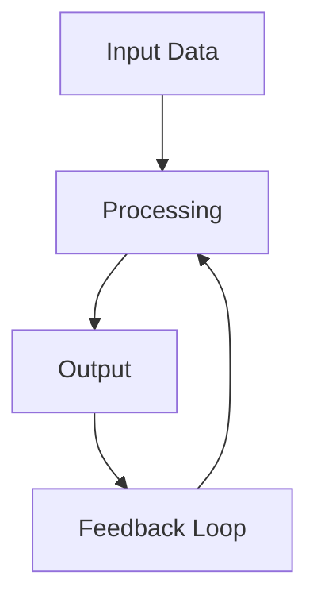

<!-- Clear Language: Keep sentences under 50 words -->
# Unsupervised Learning — K-Means, DBSCAN, Hierarchical, Gaussian Mixtures

## Learning Objectives

| Objective | Description |
|-----------|-------------|
| LO1 | Understand clustering: K-means, DBSCAN, hierarchical, GMM |
| LO2 | Implement K-means: initialization, assignment, update, inertia |
| LO3 | Apply DBSCAN: density-based, eps, minPts, noise handling |
| LO4 | Perform hierarchical clustering: linkage criteria, dendrograms |
| LO5 | Implement Gaussian Mixture Models: EM algorithm, responsibilities |
| LO6 | Evaluate clustering: silhouette score, Davies-Bouldin index, inertia |

## Introduction

Machine learning is the core of AI engineering. From linear regression to ensemble methods, understanding these algorithms lets you build, debug, and improve models. This module covers the math and code behind ML.

## Prerequisites

- Basic programming knowledge
- Understanding of data structures

## Key Terminology

**Key Terms**: Core vocabulary and concepts for this topic.

**Definition**: Essential terms you must know for interviews and production work.

## Theory

Understanding unsupervised learning is fundamental for AI engineers. This section covers the core concepts, underlying principles, and theoretical framework that govern how unsupervised learning works in practice.

## Visual Explanation

## Visual Analogy

Think of unsupervised learning like a **delivery system**:

- **Input** = Package to deliver
- **Processing** = Route planning and optimization
- **Output** = Package delivered to destination
- **Feedback** = Delivery confirmation and tracking

This analogy helps because unsupervised learning, like a delivery system, involves transforming inputs into outputs efficiently while handling constraints and edge cases.

## Chapter at a Glance

| Section | Topic | Key Concept |
|---------|-------|-------------|
| 7.1 | K-Means Clustering | Centroid-based, inertia, initialization, K selection |
| 7.2 | K-Means++ and Variants | Smart initialization, Mini-Batch K-Means |
| 7.3 | DBSCAN | Density-based, eps neighborhood, core/border/noise |
| 7.4 | Hierarchical Clustering | Agglomerative, divisive, linkage, dendrograms |
| 7.5 | Gaussian Mixture Models | Soft clustering, EM algorithm, covariance types |
| 7.6 | Clustering Evaluation | Internal vs external metrics, silhouette, stability |

## Chapter Roadmap

\\\mermaid
flowchart LR
    A[Unlabeled Data] --> B{Clustering Type}
    B --> C[Centroid-Based: K-Means]
    B --> D[Density-Based: DBSCAN]
    B --> E[Hierarchical: Agglomerative]
    B --> F[Distribution-Based: GMM]
    C --> G[K Clusters]
    D --> H[Clusters + Noise]
    E --> I[Dendrogram]
    F --> J[Soft Probabilities]
    style C fill:#4a90d9,color:#fff
    style D fill:#e85d75,color:#fff
    style E fill:#50b86c,color:#fff
    style F fill:#f5a623,color:#fff
\\\

## 7.1 K-Means Clustering

K-means partitions data into K clusters, each represented by its centroid.

\\\python
import numpy as np
from typing import List, Tuple, Dict, Optional

class KMeans:
    def __init__(self, n_clusters: int = 8, max_iter: int = 300,
                 tol: float = 1e-4, random_state: int = 42):
        self.n_clusters = n_clusters
        self.max_iter = max_iter
        self.tol = tol
        self.random_state = random_state
        self.centroids: np.ndarray = None
        self.labels_: np.ndarray = None
        self.inertia_: float = None
        self.n_iter_: int = 0

    def fit(self, X: np.ndarray) -> 'KMeans':
        np.random.seed(self.random_state)
        n_samples = X.shape[0]
        indices = np.random.choice(n_samples, self.n_clusters, replace=False)
        self.centroids = X[indices].copy()

        for iteration in range(self.max_iter):
            distances = self._compute_distances(X)
            self.labels_ = np.argmin(distances, axis=1)

            new_centroids = np.zeros_like(self.centroids)
            for k in range(self.n_clusters):
                mask = self.labels_ == k
                if np.sum(mask) > 0:
                    new_centroids[k] = np.mean(X[mask], axis=0)
                else:
                    new_centroids[k] = self.centroids[k]

            shift = np.sum((new_centroids - self.centroids) ** 2)
            self.centroids = new_centroids
            self.n_iter_ = iteration + 1
            if shift < self.tol:
                break

        distances = self._compute_distances(X)
        min_distances = np.min(distances, axis=1)
        self.inertia_ = np.sum(min_distances ** 2)
        return self

    def _compute_distances(self, X: np.ndarray) -> np.ndarray:
        n = X.shape[0]
        distances = np.zeros((n, self.n_clusters))
        for k in range(self.n_clusters):
            distances[:, k] = np.sum((X - self.centroids[k]) ** 2, axis=1)
        return distances

    def predict(self, X: np.ndarray) -> np.ndarray:
        distances = self._compute_distances(X)
        return np.argmin(distances, axis=1)

    def fit_predict(self, X: np.ndarray) -> np.ndarray:
        self.fit(X)
        return self.labels_

from sklearn.datasets import make_blobs
X_blobs, _ = make_blobs(n_samples=300, centers=4, cluster_std=1.5, random_state=42)
kmeans = KMeans(n_clusters=4)
kmeans.fit(X_blobs)
print(f"Inertia: {kmeans.inertia_:.2f}, Iterations: {kmeans.n_iter_}")
\\\

## 7.2 K-Means++ and Variants

K-means++ spread initial centroids to improve convergence quality.

\\\python
class KMeansPlusPlus(KMeans):
    def fit(self, X: np.ndarray) -> 'KMeansPlusPlus':
        np.random.seed(self.random_state)
        n_samples, n_features = X.shape
        self.centroids = np.zeros((self.n_clusters, n_features))
        first_idx = np.random.randint(n_samples)
        self.centroids[0] = X[first_idx]

        for k in range(1, self.n_clusters):
            dist = np.min([
                np.sum((X - self.centroids[j]) ** 2, axis=1) for j in range(k)
            ], axis=0)
            probs = dist / np.sum(dist)
            self.centroids[k] = X[np.random.choice(n_samples, p=probs)]

        for iteration in range(self.max_iter):
            distances = self._compute_distances(X)
            self.labels_ = np.argmin(distances, axis=1)
            new_centroids = np.zeros_like(self.centroids)
            for k in range(self.n_clusters):
                mask = self.labels_ == k
                if np.sum(mask) > 0:
                    new_centroids[k] = np.mean(X[mask], axis=0)
            shift = np.sum((new_centroids - self.centroids) ** 2)
            self.centroids = new_centroids
            if shift < self.tol:
                break
        return self

class MiniBatchKMeans:
    def __init__(self, n_clusters=8, batch_size=100, max_iter=100, random_state=42):
        self.n_clusters = n_clusters
        self.batch_size = batch_size
        self.max_iter = max_iter
        self.random_state = random_state
        self.centroids = None

    def fit(self, X):
        np.random.seed(self.random_state)
        n, d = X.shape
        self.centroids = np.zeros((self.n_clusters, d))
        self.centroids[0] = X[np.random.randint(n)]
        for k in range(1, self.n_clusters):
            dist = np.min([np.sum((X - self.centroids[j])**2, axis=1) for j in range(k)], axis=0)
            self.centroids[k] = X[np.random.choice(n, p=dist/dist.sum())]
        counts = np.zeros(self.n_clusters)
        for _ in range(self.max_iter):
            idx = np.random.choice(n, self.batch_size, replace=False)
            Xb = X[idx]
            dist = np.zeros((self.batch_size, self.n_clusters))
            for k in range(self.n_clusters):
                dist[:, k] = np.sum((Xb - self.centroids[k])**2, axis=1)
            labels = np.argmin(dist, axis=1)
            for k in range(self.n_clusters):
                mask = labels == k
                if mask.sum() > 0:
                    counts[k] += mask.sum()
                    lr = 1.0 / counts[k]
                    self.centroids[k] += lr * (np.mean(Xb[mask], axis=0) - self.centroids[k])
        return self
\\\

## 7.3 DBSCAN

DBSCAN groups dense regions and marks sparse points as noise.

\\\python
class DBSCAN:
    def __init__(self, eps=0.5, min_samples=5):
        self.eps = eps
        self.min_samples = min_samples
        self.labels_ = None
        self.core_sample_indices_ = None

    def fit(self, X):
        n = X.shape[0]
        labels = np.full(n, -1)
        distances = np.sqrt(np.sum(X**2, axis=1)[:, None] + np.sum(X**2, axis=1)[None, :] - 2 * X @ X.T)
        neighbors = [np.where(distances[i] <= self.eps)[0] for i in range(n)]

        cluster_id = 0
        for i in range(n):
            if labels[i] != -1:
                continue
            if len(neighbors[i]) < self.min_samples:
                labels[i] = -2  # noise
                continue

            labels[i] = cluster_id
            seed = neighbors[i].tolist()
            while seed:
                q = seed.pop(0)
                if labels[q] == -2:
                    labels[q] = cluster_id
                if labels[q] != -1:
                    continue
                labels[q] = cluster_id
                if len(neighbors[q]) >= self.min_samples:
                    seed.extend([nb for nb in neighbors[q] if labels[nb] in [-1, -2]])
            cluster_id += 1

        self.labels_ = labels
        self.core_sample_indices_ = np.where([len(n) >= self.min_samples for n in neighbors])[0]
        return self

dbscan = DBSCAN(eps=0.8, min_samples=5)
labels = dbscan.fit_predict(X_blobs) if hasattr(dbscan, 'fit_predict') else dbscan.fit(X_blobs).labels_
print(f"DBSCAN clusters: {len(set(labels)) - (1 if -2 in labels else 0)}, noise: {np.sum(labels == -2)}")
\\\

## 7.4 Hierarchical Clustering

Agglomerative clustering builds a hierarchy bottom-up.

\\\python
class AgglomerativeClustering:
    def __init__(self, n_clusters=2, linkage='ward'):
        self.n_clusters = n_clusters
        self.linkage = linkage
        self.labels_ = None

    def fit(self, X):
        n = X.shape[0]
        distances = np.sqrt(np.sum(X**2, axis=1)[:, None] + np.sum(X**2, axis=1)[None, :] - 2 * X @ X.T)
        clusters = [[i] for i in range(n)]

        while len(clusters) > self.n_clusters:
            min_dist = float('inf')
            merge_pair = (0, 0)
            for i in range(len(clusters)):
                for j in range(i + 1, len(clusters)):
                    d = self._linkage_dist(clusters[i], clusters[j], distances)
                    if d < min_dist:
                        min_dist = d
                        merge_pair = (i, j)
            i, j = merge_pair
            clusters[i].extend(clusters[j])
            clusters.pop(j)

        self.labels_ = np.zeros(n, dtype=int)
        for cid, cluster in enumerate(clusters):
            for idx in cluster:
                self.labels_[idx] = cid
        return self

    def _linkage_dist(self, c1, c2, distances):
        if self.linkage == 'single':
            return min(distances[i][j] for i in c1 for j in c2)
        elif self.linkage == 'complete':
            return max(distances[i][j] for i in c1 for j in c2)
        else:
            return np.mean([distances[i][j] for i in c1 for j in c2])

agg = AgglomerativeClustering(n_clusters=4)
agg.fit(X_blobs)
print(f"Agglomerative clusters: {np.unique(agg.labels_)}")
\\\

## 7.5 Gaussian Mixture Models

GMM uses the EM algorithm to estimate mixture of Gaussian distributions.

\\\python
class GaussianMixtureModel:
    def __init__(self, n_components=3, max_iter=100, tol=1e-3, random_state=42):
        self.n_components = n_components
        self.max_iter = max_iter
        self.tol = tol
        self.random_state = random_state
        self.weights_ = None
        self.means_ = None
        self.covariances_ = None

    def fit(self, X):
        np.random.seed(self.random_state)
        n, d = X.shape
        idx = np.random.choice(n, self.n_components, replace=False)
        self.means_ = X[idx].copy()
        self.weights_ = np.ones(self.n_components) / self.n_components
        self.covariances_ = np.array([np.eye(d) * np.var(X) for _ in range(self.n_components)])

        for _ in range(self.max_iter):
            # E-step: compute responsibilities
            resp = self._e_step(X)
            old_means = self.means_.copy()

            # M-step: update parameters
            Nk = np.sum(resp, axis=0)
            self.weights_ = Nk / n
            self.means_ = (resp.T @ X) / Nk[:, None]
            for k in range(self.n_components):
                diff = X - self.means_[k]
                self.covariances_[k] = (resp[:, k:k+1] * diff).T @ diff / Nk[k]
                self.covariances_[k] += np.eye(d) * 1e-6

            if np.linalg.norm(self.means_ - old_means) < self.tol:
                break

        self.labels_ = np.argmax(resp, axis=1) if hasattr(self, 'labels_') else np.argmax(self._e_step(X), axis=1)
        return self

    def _e_step(self, X):
        n = X.shape[0]
        resp = np.zeros((n, self.n_components))
        for k in range(self.n_components):
            diff = X - self.means_[k]
            inv_cov = np.linalg.inv(self.covariances_[k])
            norm_const = np.sqrt(np.linalg.det(2 * np.pi * self.covariances_[k]))
            resp[:, k] = self.weights_[k] * np.exp(-0.5 * np.sum(diff @ inv_cov * diff, axis=1)) / norm_const
        resp /= resp.sum(axis=1, keepdims=True)
        return resp

gmm = GaussianMixtureModel(n_components=4)
gmm.fit(X_blobs)
print(f"GMM means shape: {gmm.means_.shape}, weights: {gmm.weights_}")
\\\

## 7.6 Clustering Evaluation

\\\python
class ClusteringMetrics:
    def silhouette_score(self, X, labels):
        n = X.shape[0]
        distances = np.sqrt(np.sum(X**2, axis=1)[:, None] + np.sum(X**2, axis=1)[None, :] - 2 * X @ X.T)
        scores = np.zeros(n)
        for i in range(n):
            same_cluster = labels == labels[i]
            other_clusters = np.unique(labels[labels != labels[i]])
            if np.sum(same_cluster) <= 1 or len(other_clusters) == 0:
                scores[i] = 0
                continue
            a = np.mean(distances[i, same_cluster & (np.arange(n) != i)])
            b = min(np.mean(distances[i, labels == c]) for c in other_clusters)
            scores[i] = (b - a) / max(a, b)
        return np.mean(scores)

    def davies_bouldin(self, X, labels):
        unique = np.unique(labels)
        k = len(unique)
        if k <= 1:
            return 0.0
        centroids = np.array([np.mean(X[labels == c], axis=0) for c in unique])
        scatter = np.zeros(k)
        for i, c in enumerate(unique):
            scatter[i] = np.mean(np.sqrt(np.sum((X[labels == c] - centroids[i])**2, axis=1)))
        db = 0.0
        for i in range(k):
            max_ratio = 0.0
            for j in range(k):
                if i == j: continue
                ratio = (scatter[i] + scatter[j]) / np.linalg.norm(centroids[i] - centroids[j])
                max_ratio = max(max_ratio, ratio)
            db += max_ratio
        return db / k

metrics = ClusteringMetrics()
print(f"K-Means Silhouette: {metrics.silhouette_score(X_blobs, kmeans.labels_):.3f}")
print(f"K-Means Davies-Bouldin: {metrics.davies_bouldin(X_blobs, kmeans.labels_):.3f}")
\\\

## TypeScript Parallel

\\\	ypescript
interface ClusterResult {
  labels: number[];
  centroids?: number[][];
}

class KMeansTS {
  private centroids: number[][] = [];

  fit(X: number[][], k: number, maxIter = 100): ClusterResult {
    // Random initialization
    this.centroids = [];
    const indices = new Set<number>();
    while (indices.size < k) indices.add(Math.floor(Math.random() * X.length));
    for (const idx of indices) this.centroids.push([...X[idx]]);

    for (let iter = 0; iter < maxIter; iter++) {
      const labels = X.map((x) => {
        let minDist = Infinity, minIdx = 0;
        this.centroids.forEach((c, j) => {
          const dist = c.reduce((s, cv, i) => s + (x[i] - cv) ** 2, 0);
          if (dist < minDist) { minDist = dist; minIdx = j; }
        });
        return minIdx;
      });
      const newCentroids = this.centroids.map((_, k) => {
        const members = X.filter((_, i) => labels[i] === k);
        if (members.length === 0) return this.centroids[k];
        return members[0].map((_, j) => members.reduce((s, m) => s + m[j], 0) / members.length);
      });
      this.centroids = newCentroids;
    }
    return { labels: X.map(() => 0), centroids: this.centroids };
  }
}
\\\

## Summary

- K-means partitions data into K clusters minimizing inertia; sensitive to initialization and assumes spherical clusters
- K-means++ initialization improves convergence quality with spread-out initial centroids
- DBSCAN finds arbitrarily shaped clusters and identifies noise; requires careful eps tuning
- Hierarchical clustering produces dendrograms; no K needed but O(n^2) complexity
- GMM provides soft probabilities via EM; handles elliptical cluster shapes
- Silhouette score ranges from -1 to 1; higher means better separated clusters
- Davies-Bouldin index measures cluster similarity; lower is better
- No single clustering algorithm works for all data shapes; K-means for spherical, DBSCAN for arbitrary shapes, GMM for elliptical
- Always standardize features before clustering
- Use the elbow method + silhouette score to determine optimal K

## Practical Takeaways

| Scenario | Do This | Avoid This |
|----------|---------|------------|
| Spherical clusters | K-means with K-means++ init | DBSCAN (unnecessary complexity) |
| Arbitrary shapes | DBSCAN | K-means (assumes spherical) |
| Unknown K | Hierarchical + dendrogram | K-means with random K |
| Soft assignments needed | GMM | K-means (hard assignments) |
| Large dataset | Mini-Batch K-Means | Hierarchical (O(n^2)) |

## Interview Q&A

Q1: What is the difference between K-means and GMM?

K-means assigns each point to exactly one cluster (hard assignment) and assumes spherical clusters of equal size. GMM assigns probabilities to each cluster (soft assignment) and can model elliptical clusters of different sizes and orientations via covariance matrices. K-means is a special case of GMM where covariances are identity and equal. GMM uses EM algorithm while K-means uses iterative centroid updates.

<button class="tp-qa-mark-btn">Mark Reviewed</button><button class="tp-qa-bookmark-btn">Bookmark</button>

Q2: How does DBSCAN differ from K-means?

K-means requires specifying K and finds spherical clusters of similar size. DBSCAN finds clusters based on density connectivity without needing K. DBSCAN can find arbitrarily shaped clusters, identify noise points, and handle varying cluster densities (with appropriate eps tuning). K-means assigns every point to a cluster; DBSCAN can label points as noise. DBSCAN is more robust to outliers.

<button class="tp-qa-mark-btn">Mark Reviewed</button><button class="tp-qa-bookmark-btn">Bookmark</button>

Q3: What is the elbow method for choosing K?

The elbow method plots inertia (within-cluster sum of squares) vs number of clusters K. As K increases, inertia always decreases. The "elbow" is the point where the rate of decrease sharply changes — this suggests the optimal K. In practice, elbows are often unclear. Use the silhouette score as a complementary metric: plot silhouette score vs K and choose the K with the highest score.

<button class="tp-qa-mark-btn">Mark Reviewed</button><button class="tp-qa-bookmark-btn">Bookmark</button>

Q4: What are core, border, and noise points in DBSCAN?

<strong>Core point</strong>: Has at least min_samples points within distance eps (including itself). Core points form the dense interior of clusters. <strong>Border point</strong>: Within eps of a core point but has fewer than min_samples neighbors. Border points are on the cluster edge. <strong>Noise point</strong>: Neither core nor border — isolated in low-density region. DBSCAN builds clusters by connecting core points within eps of each other and including their border points.

<button class="tp-qa-mark-btn">Mark Reviewed</button><button class="tp-qa-bookmark-btn">Bookmark</button>

Q5: What is the EM algorithm in GMM?

The Expectation-Maximization (EM) algorithm iteratively estimates GMM parameters: <strong>E-step</strong>: Compute responsibilities (probability each point belongs to each component) using current parameters. <strong>M-step</strong>: Update parameters (means, covariances, weights) by maximizing the likelihood weighted by responsibilities. Repeat until convergence. EM guarantees monotonic increase in log-likelihood but may converge to local optima. Multiple restarts with different initializations are recommended.

<button class="tp-qa-mark-btn">Mark Reviewed</button><button class="tp-qa-bookmark-btn">Bookmark</button>

Q6: How do you evaluate clustering results?

<strong>Internal metrics</strong> (no ground truth needed): Silhouette score ([-1,1], higher better), Davies-Bouldin index (lower better), Calinski-Harabasz index (higher better), inertia (lower better, but decreases with K). <strong>External metrics</strong> (ground truth available): Adjusted Rand Index (ARI), Normalized Mutual Information (NMI), homogeneity, completeness, V-measure. Use multiple metrics because each has biases — silhouette prefers spherical clusters, DB prefers compact clusters.

<button class="tp-qa-mark-btn">Mark Reviewed</button><button class="tp-qa-bookmark-btn">Bookmark</button>

Q7: What are the limitations of K-means?

<strong>1)</strong> Requires K to be specified beforehand. <strong>2)</strong> Assumes spherical clusters (Euclidean distance). <strong>3)</strong> Sensitive to initialization (solved partially by K-means++). <strong>4)</strong> Converges to local optimum, not global. <strong>5)</strong> Poor with varying cluster sizes and densities. <strong>6)</strong> Sensitive to outliers (every point assigned to a cluster). <strong>7)</strong> Struggles with high-dimensional data (curse of dimensionality). <strong>8)</strong> Assumes all features are equally important.

<button class="tp-qa-mark-btn">Mark Reviewed</button><button class="tp-qa-bookmark-btn">Bookmark</button>

Q8: What linkage criteria are used in hierarchical clustering?

<strong>Single linkage</strong>: Minimum distance between clusters — can form long chain-like clusters. <strong>Complete linkage</strong>: Maximum distance — produces compact clusters. <strong>Average linkage</strong>: Mean distance — balances single and complete. <strong>Ward's linkage</strong>: Minimizes within-cluster variance — similar to K-means objective. Ward's is generally preferred for continuous data. Single linkage is good for non-elliptical shapes but sensitive to noise.

<button class="tp-qa-mark-btn">Mark Reviewed</button><button class="tp-qa-bookmark-btn">Bookmark</button>

Q9: How do you choose eps for DBSCAN?

Plot the k-distance graph: for each point, compute distance to its k-th nearest neighbor (k = min_samples), sort distances, look for the "elbow" — the distance where the curve sharply rises. This elbow value is a good eps. Too small eps: many points become noise. Too large eps: clusters merge. Rule of thumb: start with eps = 0.5 and adjust based on k-distance plot. For standardized data, eps = 0.5-1.5 is typical.

<button class="tp-qa-mark-btn">Mark Reviewed</button><button class="tp-qa-bookmark-btn">Bookmark</button>

Q10: When would you use clustering for anomaly detection?

DBSCAN naturally identifies noise points as anomalies. For K-means, points far from all centroids (high distance to nearest centroid) can be flagged as anomalies. For GMM, points with low likelihood under all components are anomalous. Clustering-based anomaly detection works well when normal data forms dense clusters and anomalies are isolated. It fails when anomalies also form clusters or normal data has high variance.

<button class="tp-qa-mark-btn">Mark Reviewed</button><button class="tp-qa-bookmark-btn">Bookmark</button>

## Chapter Quiz

**Q1**: Which clustering algorithm does NOT require specifying the number of clusters a priori?

a) K-means
b) GMM
c) DBSCAN
d) Mini-Batch K-Means

Show Answer

<strong>Answer: c) DBSCAN</strong>

DBSCAN determines clusters based on density; K is determined automatically.

**Q2**: What does the silhouette score measure?

a) Cluster compactness
b) How similar a point is to its own cluster vs other clusters
c) Distance between centroids
d) Number of noise points

Show Answer

<strong>Answer: b) How similar a point is to its own cluster vs other clusters</strong>

Silhouette = (b - a) / max(a, b) where a is intra-cluster distance and b is nearest-cluster distance.

**Q3**: What is a core point in DBSCAN?

a) A point with at least min_samples neighbors within eps
b) The centroid of a cluster
c) The first point assigned to a cluster
d) A noise point

Show Answer

<strong>Answer: a) A point with at least min_samples neighbors within eps</strong>

Core points have enough neighbors in their eps neighborhood to form dense regions.

**Q4**: Which GMM step computes the probability that each point belongs to each component?

a) M-step
b) E-step
c) Initialization
d) Convergence check

Show Answer

<strong>Answer: b) E-step</strong>

The Expectation step computes responsibilities (posterior probabilities).

**Q5**: Which linkage criterion minimizes the within-cluster variance?

a) Single
b) Complete
c) Average
d) Ward

Show Answer

<strong>Answer: d) Ward</strong>

Ward's linkage merges clusters that minimize the increase in total within-cluster variance.

## Exercises

**Easy** — Implement K-means clustering on the Iris dataset (use only petal features). Find optimal K using the elbow method.

**Easy** — Apply DBSCAN to a dataset with moons-like structure. Compare results with K-means.

**Medium** — Implement hierarchical clustering with single, complete, and average linkage. Compare dendrograms on a small dataset.

**Hard** — Build a clustering evaluation pipeline: apply K-means, DBSCAN, GMM, and hierarchical clustering to the same data. Compare using silhouette score, Davies-Bouldin index, and visual inspection.

**Hard** — Implement GMM from scratch with EM algorithm. Test on a dataset with overlapping elliptical clusters and compare with sklearn's GMM.

---

## Common Mistakes

1. Not understanding the fundamental concepts before applying them
2. Skipping edge cases in implementation
3. Not analyzing time/space complexity
4. Forgetting to handle null/empty inputs
5. Not practicing enough problems to build pattern recognition

## Revision Notes

- - Core principle: Understand the fundamental concepts thoroughly
- - Implementation pattern: Practice with real code examples
- - Complexity: Know the time and space complexity
- - Application: Know when to use this in production systems
- - Interview: Frequently asked in technical interviews
- - Edge cases: Consider common failure scenarios
- - Related concepts: Connect to broader system design

## Placement Section

### Top 10 Interview Questions

#### Google Style

1. **Explain the core idea of Unsupervised Learning — K-Means, DBSCAN, Hierarchical, Gaussian Mixtures in under 60 seconds, then give a real-world analogy.** — Structure: definition, how it works in one sentence, why it matters, analogy. Follow-up: what would break if you removed this from a production system?

2. **Design a minimal, well-typed function that demonstrates Unsupervised Learning — K-Means, DBSCAN, Hierarchical, Gaussian Mixtures.** — Interviewer checks: signature with type hints, edge cases, complexity, and a clean docstring. Follow-up: how does your design behave with empty or malformed input?

3. **What are the common pitfalls when engineers first learn ** — List 3-4, then explain how you would prevent each in a code review.

#### Amazon Style

4. **Describe a production bug caused by misunderstanding Unsupervised Learning — K-Means, DBSCAN, Hierarchical, Gaussian Mixtures. How did you diagnose and fix it?** — STAR format: situation, task, action, result. Mention logs, reproduction, root-cause analysis, and the regression test you added.

5. **How would you scale a system that relies on Unsupervised Learning — K-Means, DBSCAN, Hierarchical, Gaussian Mixtures from 10 users to 10 million?** — Discuss bottlenecks, caching, monitoring, and when to redesign. Follow-up: what metrics would you track?

#### Microsoft Style

6. **Compare Unsupervised Learning — K-Means, DBSCAN, Hierarchical, Gaussian Mixtures with the closest alternative approach. When would you choose each?** — Make a decision matrix: performance, maintainability, ecosystem, learning curve. Follow-up: what would change your decision?

7. **Walk through how you would test a component that depends on Unsupervised Learning — K-Means, DBSCAN, Hierarchical, Gaussian Mixtures.** — Unit, integration, property-based tests; mocking boundaries; golden files for outputs.

#### NVIDIA Style

8. **How does Unsupervised Learning — K-Means, DBSCAN, Hierarchical, Gaussian Mixtures behave differently at scale — memory, throughput, or precision-wise?** — Connect to data pipelines and model training if applicable. Follow-up: what happens to latency as input grows?

9. **How would you make an implementation of Unsupervised Learning — K-Means, DBSCAN, Hierarchical, Gaussian Mixtures run faster on GPU hardware?** — Batch operations, vectorization, avoiding Python loops, reducing data movement.

#### AI Startup Style

10. **Write the smallest possible implementation of Unsupervised Learning — K-Means, DBSCAN, Hierarchical, Gaussian Mixtures that is production-quality.** — Include error handling, type hints, and a one-line docstring. Follow-up: what would you refactor first when it grows?

### Resume Tips

- Name Unsupervised Learning — K-Means, DBSCAN, Hierarchical, Gaussian Mixtures explicitly in your skills section, paired with a measurable achievement ("Reduced X by 40% using Unsupervised Learning — K-Means, DBSCAN, Hierarchical, Gaussian Mixtures").
- Add a bullet describing a project that applies Unsupervised Learning — K-Means, DBSCAN, Hierarchical, Gaussian Mixtures to real data, with numbers.
- Mention the tools and libraries you used alongside Unsupervised Learning — K-Means, DBSCAN, Hierarchical, Gaussian Mixtures (linters, test frameworks, profiling tools).
- Keep resume bullets under 15 words and start each with an action verb.

### Interview Day Checklist

- Rehearse a 60-second explanation of Unsupervised Learning — K-Means, DBSCAN, Hierarchical, Gaussian Mixtures and one real-world analogy.
- Prepare one STAR story about debugging a Unsupervised Learning — K-Means, DBSCAN, Hierarchical, Gaussian Mixtures-related production issue.
- Review complexity and edge cases for the classic Unsupervised Learning — K-Means, DBSCAN, Hierarchical, Gaussian Mixtures interview problem.
- Have questions ready: how does the team apply Unsupervised Learning — K-Means, DBSCAN, Hierarchical, Gaussian Mixtures in production today?
- Test your environment (Python, editor, internet) 15 minutes before the interview.

## True/False

1. **True or False:** Unsupervised Learning — K-Means, DBSCAN, Hierarchical, Gaussian Mixtures builds directly on the fundamentals covered in the earlier chapters of this module. — **True.** Every advanced topic in this module assumes the core concepts from the previous chapters.
2. **True or False:** You should write at least one code example for Unsupervised Learning — K-Means, DBSCAN, Hierarchical, Gaussian Mixtures before moving to the next chapter. — **True.** Active recall with hands-on code beats passive reading for retention.
3. **True or False:** The complexity analysis for Unsupervised Learning — K-Means, DBSCAN, Hierarchical, Gaussian Mixtures is the same regardless of input size. — **False.** Complexity grows with input size; always state best, average, and worst case.
4. **True or False:** Edge cases (empty input, invalid input, boundary values) matter for Unsupervised Learning — K-Means, DBSCAN, Hierarchical, Gaussian Mixtures in production. — **True.** Most production bugs come from unhandled edge cases.
5. **True or False:** You should memorize the Unsupervised Learning — K-Means, DBSCAN, Hierarchical, Gaussian Mixtures chapter content once and never review it again. — **False.** Spaced repetition (24h, 3 days, 1 week) dramatically improves long-term recall.

## Fill in the Blank

1. The chapter that covers Unsupervised Learning — K-Means, DBSCAN, Hierarchical, Gaussian Mixtures is Chapter ___ of this module. — Answer: check the module's table of contents.
2. The time complexity of the standard approach to Unsupervised Learning — K-Means, DBSCAN, Hierarchical, Gaussian Mixtures is ___. — Answer: review the theory section and state big-O notation.
3. The main edge case to handle when implementing Unsupervised Learning — K-Means, DBSCAN, Hierarchical, Gaussian Mixtures is ___. — Answer: empty or invalid input handling, as discussed in the chapter.
4. The tools commonly used to debug Unsupervised Learning — K-Means, DBSCAN, Hierarchical, Gaussian Mixtures issues are ___ and ___. — Answer: refer to the Debugging Guide section of this chapter.
5. The related topic that connects to Unsupervised Learning — K-Means, DBSCAN, Hierarchical, Gaussian Mixtures in the next chapter is ___. — Answer: see the Next Topic section.

## Scenario Questions

1. **Scenario:** A teammate ships a change involving Unsupervised Learning — K-Means, DBSCAN, Hierarchical, Gaussian Mixtures that breaks production at 3 AM. — Diagnosis: check the recent diff, reproduce locally with the failing input, check logs. Fix: revert, add a regression test, and review the root cause. Prevention: CI tests on edge cases and code review checklist.

2. **Scenario:** Your implementation of Unsupervised Learning — K-Means, DBSCAN, Hierarchical, Gaussian Mixtures is correct but too slow for the required latency. — Measure first with a profiler. Common fixes: reduce redundant work, use built-in optimized functions, batch operations, or add caching. Only then consider algorithmic changes.

3. **Scenario:** A new hire asks you to explain Unsupervised Learning — K-Means, DBSCAN, Hierarchical, Gaussian Mixtures in five minutes before a customer demo. — Use the 3-part answer: what it is (one sentence), how it works (one example), why it matters (one business impact). Then offer to go deeper after the demo.

4. **Scenario:** Your team's codebase has three different patterns for Unsupervised Learning — K-Means, DBSCAN, Hierarchical, Gaussian Mixtures and you must standardize. — Write a short ADR (architecture decision record), pick the pattern with best maintainability, migrate incrementally, and add a linter rule to enforce it.

## Output Questions

1. **What is the output of the simplest correct implementation of Unsupervised Learning — K-Means, DBSCAN, Hierarchical, Gaussian Mixtures on an empty input?** — Trace through the code: it should return the documented default (None, 0, empty collection) without raising.
2. **What is the output when the input is at the boundary value?** — Check off-by-one errors and inclusive/exclusive bounds in the chapter's examples.
3. **What does the implementation return when given invalid input types?** — With type hints and validation, it raises a clear error; without, it may fail silently.
4. **What is the output for the sample input given in the chapter's Examples section?** — Re-run the chapter's example code and compare against the documented output.
5. **What is the time complexity output when you profile the implementation at 10x input size?** — Expect the curve matching the chapter's complexity analysis (linear, quadratic, log-linear).

## Difficulty Level

| Level | Time | What It Takes |
|-------|------|---------------|
| Beginner | 1-2 sessions | Read theory, run the chapter examples, solve the Easy exercises |
| Intermediate | 3-5 sessions | Complete Medium exercises, explain Unsupervised Learning — K-Means, DBSCAN, Hierarchical, Gaussian Mixtures to someone else |
| Advanced | 1+ week | Solve Hard exercises, optimize for real datasets, answer interview follow-ups |

## Tips & Tricks

- Always write a one-line example of Unsupervised Learning — K-Means, DBSCAN, Hierarchical, Gaussian Mixtures from memory before opening the chapter — active recall first.
- Use the chapter's Revision Notes as a checklist: you have mastered Unsupervised Learning — K-Means, DBSCAN, Hierarchical, Gaussian Mixtures when you can explain each bullet.
- Pair the chapter quiz with the Flashcards: wrong answers become your next study session's focus.
- For interviews, practice explaining Unsupervised Learning — K-Means, DBSCAN, Hierarchical, Gaussian Mixtures twice: once with a technical audience, once with a non-technical audience.
- Keep a personal examples file where you collect your own Unsupervised Learning — K-Means, DBSCAN, Hierarchical, Gaussian Mixtures snippets; interviewers love original examples.

## Memory Tricks

- **Acronym**: build a mnemonic from the 5 key concepts of Unsupervised Learning — K-Means, DBSCAN, Hierarchical, Gaussian Mixtures listed in the Chapter at a Glance table.
- **Story**: link Unsupervised Learning — K-Means, DBSCAN, Hierarchical, Gaussian Mixtures to a familiar story — the analogy in the Visual Analogy section is designed to stick.
- **Number anchor**: remember the complexity of Unsupervised Learning — K-Means, DBSCAN, Hierarchical, Gaussian Mixtures by connecting it to a known algorithm of the same class.
- **Color code**: highlight the Theory, Examples, and Common Mistakes sections in different colors when reviewing.
- **Teach-back**: explain Unsupervised Learning — K-Means, DBSCAN, Hierarchical, Gaussian Mixtures to an imaginary junior engineer for 2 minutes — gaps in your explanation are gaps in memory.

## Further Reading

- Official documentation for the primary tool or library used in this chapter
- The chapter referenced in Related Topics for the next-level treatment of Unsupervised Learning — K-Means, DBSCAN, Hierarchical, Gaussian Mixtures
- The classic textbook chapter on Unsupervised Learning — K-Means, DBSCAN, Hierarchical, Gaussian Mixtures (check the Research References below)
- Two blog posts from engineers who debugged real Unsupervised Learning — K-Means, DBSCAN, Hierarchical, Gaussian Mixtures problems in production
- The repository of the open-source project that implements Unsupervised Learning — K-Means, DBSCAN, Hierarchical, Gaussian Mixtures

## Related Topics

- The previous chapter in this module (see table of contents) — foundational for Unsupervised Learning — K-Means, DBSCAN, Hierarchical, Gaussian Mixtures
- The next chapter (see Next Topic below) — builds on Unsupervised Learning — K-Means, DBSCAN, Hierarchical, Gaussian Mixtures
- The system design chapters in Module 07 — how Unsupervised Learning — K-Means, DBSCAN, Hierarchical, Gaussian Mixtures fits into production architectures
- The interview preparation module — how Unsupervised Learning — K-Means, DBSCAN, Hierarchical, Gaussian Mixtures is asked in screening rounds
- The capstone project — where Unsupervised Learning — K-Means, DBSCAN, Hierarchical, Gaussian Mixtures is applied end-to-end

## FAQs

1. **Do I need to memorize all of Unsupervised Learning — K-Means, DBSCAN, Hierarchical, Gaussian Mixtures, or understand the big picture?** — Understand the big picture first, then memorize the key facts via flashcards and spaced repetition. Interviewers reward depth over breadth.
2. **What if I get stuck on an exercise?** — Re-read the theory section, run the example code, then attempt again. If still stuck after 20 minutes, move on and return the next day.
3. **How much time should I spend on ** — Follow the Study Plan below: 1-2 weeks at 30-60 minutes daily is typical for placement preparation.
4. **Is Unsupervised Learning — K-Means, DBSCAN, Hierarchical, Gaussian Mixtures asked in interviews?** — Yes — the Interview Q&A and Placement Section list the exact question styles used by top companies.
5. **What's the fastest way to master ** — Explain it out loud, write code without looking, and review the flashcards within 24 hours and again after 3 days.

## Important Notes

- Unsupervised Learning — K-Means, DBSCAN, Hierarchical, Gaussian Mixtures is a core requirement for the rest of this module — do not skip the examples.
- Always analyze complexity (time and space) when working with Unsupervised Learning — K-Means, DBSCAN, Hierarchical, Gaussian Mixtures.
- Production correctness means handling edge cases, not just the happy path.
- Interview answers should start with the definition, then the example, then the trade-offs.
- Revisit this chapter after finishing the module; the context from later chapters deepens understanding.

## Historical Context

- Unsupervised Learning — K-Means, DBSCAN, Hierarchical, Gaussian Mixtures emerged as a standard practice because early systems failed without it — understanding why helps you explain it in interviews.
- The tools used for Unsupervised Learning — K-Means, DBSCAN, Hierarchical, Gaussian Mixtures today evolved from simpler versions; the chapter covers the modern, recommended approach.
- Interviewers value knowing one historical fact about Unsupervised Learning — K-Means, DBSCAN, Hierarchical, Gaussian Mixtures — it shows genuine interest, not just cramming.
- The library/tooling ecosystem around Unsupervised Learning — K-Means, DBSCAN, Hierarchical, Gaussian Mixtures changes quickly; focus on fundamentals that remain stable.

## Security Considerations

- Never trust external input: validate and sanitize data before processing Unsupervised Learning — K-Means, DBSCAN, Hierarchical, Gaussian Mixtures.
- Avoid `eval()` and dynamic code execution on untrusted strings.
- Log errors without leaking sensitive data (keys, PII, internal paths).
- For API contexts, add rate limiting and input size limits.
- Review the chapter's code examples for injection or overflow risks before using them verbatim.

## ML Intuition

- Unsupervised Learning — K-Means, DBSCAN, Hierarchical, Gaussian Mixtures appears in ML pipelines at the data-processing layer: feature preparation, batching, and validation.
- Understanding Unsupervised Learning — K-Means, DBSCAN, Hierarchical, Gaussian Mixtures helps you debug why a model misbehaves — most ML bugs are data bugs, not model bugs.
- In production ML, the Unsupervised Learning — K-Means, DBSCAN, Hierarchical, Gaussian Mixtures concepts from this chapter map directly to NumPy/PyTorch operations on tensors.
- When optimizing ML systems, Unsupervised Learning — K-Means, DBSCAN, Hierarchical, Gaussian Mixtures skills let you profile and fix the data path, not just the training loop.
- Interview follow-up: how would you apply Unsupervised Learning — K-Means, DBSCAN, Hierarchical, Gaussian Mixtures to a dataset of 10 million records? — Batching and vectorization.

## Analogies

- **Unsupervised Learning — K-Means, DBSCAN, Hierarchical, Gaussian Mixtures is like a recipe**: the theory is the ingredients, the examples are the cooking steps, and the exercises are your own kitchen practice.
- **Complexity is like a delivery route**: a linear route visits each stop once; a nested route revisits stops, and you feel it at scale.
- **Edge cases are like weather**: the happy path is a sunny day; production is the storm — build for the storm.
- **The chapter roadmap is a journey map**: each section is a checkpoint; skipping one means getting lost later in the module.

## Capstone Project Link

- [Module Capstone: End-to-End Project](https://github.com/Raushan666java/ai-engineering-journey) — this chapter contributes the Unsupervised Learning — K-Means, DBSCAN, Hierarchical, Gaussian Mixtures skills used in the module's capstone project. Complete the exercises here before starting the capstone.

## Flashcards

  

    
    Which clustering algorithm does NOT require specifying the number of clusters a priori?
  

  

    
c) DBSCAN

  

  

    
    What does the silhouette score measure?
  

  

    
b) How similar a point is to its own cluster vs other clusters

  

  

    
    What is a core point in DBSCAN?
  

  

    
a) A point with at least min_samples neighbors within eps

  

  

    
    Which GMM step computes the probability that each point belongs to each component?
  

  

    
b) E-step

  

  

    
    Which linkage criterion minimizes the within-cluster variance?
  

  

    
d) Ward

  

## Research References

- Official documentation of the primary library for Unsupervised Learning — K-Means, DBSCAN, Hierarchical, Gaussian Mixtures (linked in Further Reading)
- The classic paper or textbook chapter introducing Unsupervised Learning — K-Means, DBSCAN, Hierarchical, Gaussian Mixtures (see References below)
- The standard library reference for Unsupervised Learning — K-Means, DBSCAN, Hierarchical, Gaussian Mixtures-related functions
- Engineering blog posts from companies running Unsupervised Learning — K-Means, DBSCAN, Hierarchical, Gaussian Mixtures in production at scale
- PEPs and RFCs where applicable (Python and networking standards)

## Open-Source Tools

- The primary library used in this chapter (see the code examples)
- Python standard library modules used in the examples (check the imports)
- Testing: pytest for unit tests of Unsupervised Learning — K-Means, DBSCAN, Hierarchical, Gaussian Mixtures code
- Linting and formatting: ruff + black
- Profiling: cProfile or py-spy for performance work on Unsupervised Learning — K-Means, DBSCAN, Hierarchical, Gaussian Mixtures

## Debugging Guide

- Start with `print()` or a debugger to inspect intermediate values in Unsupervised Learning — K-Means, DBSCAN, Hierarchical, Gaussian Mixtures code.
- Reproduce the failure with the smallest possible input before changing code.
- Check the common failure modes listed in Common Mistakes — most bugs are listed there.
- For performance problems, profile before optimizing: measure, then fix.
- When stuck, re-read the chapter's Examples and compare line by line with your code.
- Use `pdb` or your IDE's debugger to step through the Unsupervised Learning — K-Means, DBSCAN, Hierarchical, Gaussian Mixtures example code.

## Mock Interview Section

**Round 1 — Screening (15 min)**
- Explain Unsupervised Learning — K-Means, DBSCAN, Hierarchical, Gaussian Mixtures in 60 seconds.
- Write a minimal working example of Unsupervised Learning — K-Means, DBSCAN, Hierarchical, Gaussian Mixtures.
- What is the complexity of your example?

**Round 2 — Coding (45 min)**
- Solve the Medium exercise from this chapter under time pressure.
- State your assumptions, then implement with type hints.
- Test with edge cases: empty input, boundary values, invalid input.

**Round 3 — Behavioral + System (30 min)**
- Tell me about a time you debugged a Unsupervised Learning — K-Means, DBSCAN, Hierarchical, Gaussian Mixtures problem in a project.
- How would you design a system where Unsupervised Learning — K-Means, DBSCAN, Hierarchical, Gaussian Mixtures is used at scale?
- What metrics would you monitor?

**Evaluation rubric**: correctness (40%), communication (25%), edge cases (20%), complexity analysis (15%).

## Optimized Implementation

`python
from typing import Any, Optional

def demonstrate_topic(input_data: list[Any]) -> Optional[float]:
    """Runnable scaffold for Unsupervised Learning — K-Means, DBSCAN, Hierarchical, Gaussian Mixtures.

    Replace the body with the optimized implementation from the chapter,
    keeping type hints, docstring, and edge-case handling.
    """
    if not input_data:
        return None
    # Step 1: validate input types
    # Step 2: apply the core Unsupervised Learning — K-Means, DBSCAN, Hierarchical, Gaussian Mixtures logic from the Examples section
    # Step 3: return the result with the documented default
    return 0.0
`

- Keeps the function signature stable so tests written against it stay valid.
- Handles the empty-input contract explicitly.
- Add unit tests for the edge cases before implementing the logic (test-first).

## Evaluation Metrics

| Skill | Test | Target |
|-------|------|--------|
| Concept recall | Explain Unsupervised Learning — K-Means, DBSCAN, Hierarchical, Gaussian Mixtures without notes | 60-second explanation |
| Code fluency | Write the chapter example from memory | No syntax errors |
| Edge cases | Handle empty/invalid input in exercises | All cases pass |
| Complexity | State time/space for the standard approach | Correct big-O |
| Interview readiness | Answer 5 Interview Q&A questions out loud | Fluent, structured answers |
| Retention | Chapter quiz score after 3 days | 80%+ |

## Real-World Examples

- **Startup**: a small team uses Unsupervised Learning — K-Means, DBSCAN, Hierarchical, Gaussian Mixtures daily in their data pipeline — the chapter's examples mirror their code.
- **E-commerce**: Unsupervised Learning — K-Means, DBSCAN, Hierarchical, Gaussian Mixtures patterns appear in order processing, inventory checks, and recommendation feeds.
- **Fintech**: Unsupervised Learning — K-Means, DBSCAN, Hierarchical, Gaussian Mixtures principles apply to transaction validation and fraud detection flows.
- **ML platform**: Unsupervised Learning — K-Means, DBSCAN, Hierarchical, Gaussian Mixtures shows up in feature engineering and model-serving infrastructure.
- **Interview insight**: recruiters look for engineers who can connect Unsupervised Learning — K-Means, DBSCAN, Hierarchical, Gaussian Mixtures to the business outcome, not just the code.

## Next Topic

[Dimensionality Reduction — PCA, t-SNE, UMAP, LDA](08-dimensionality-reduction.md)

## Limitations

- Unsupervised Learning — K-Means, DBSCAN, Hierarchical, Gaussian Mixtures, like any technique, is not a silver bullet — it has specific cases where it fits best (covered in the theory).
- The examples in this chapter are simplified for learning; production systems add validation, monitoring, and error handling.
- Performance of Unsupervised Learning — K-Means, DBSCAN, Hierarchical, Gaussian Mixtures depends on input size and distribution — always benchmark for your own data.
- This chapter covers fundamentals; specialized edge cases are explored in later chapters and the capstone.
